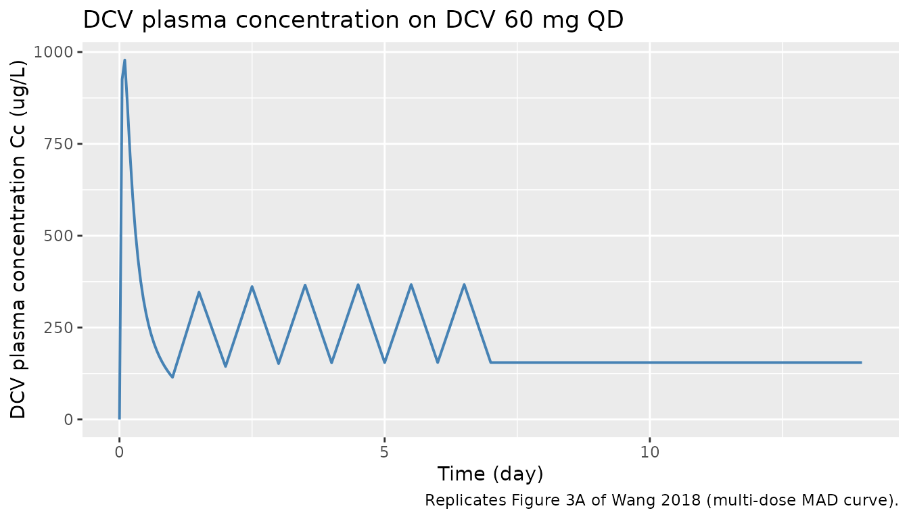
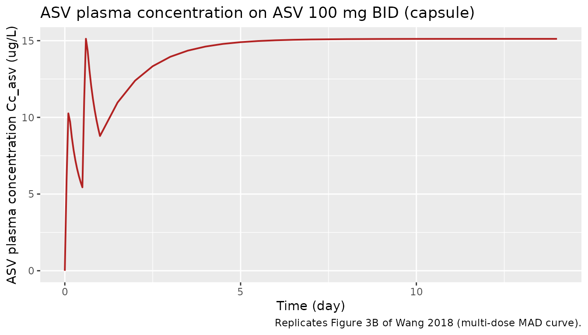
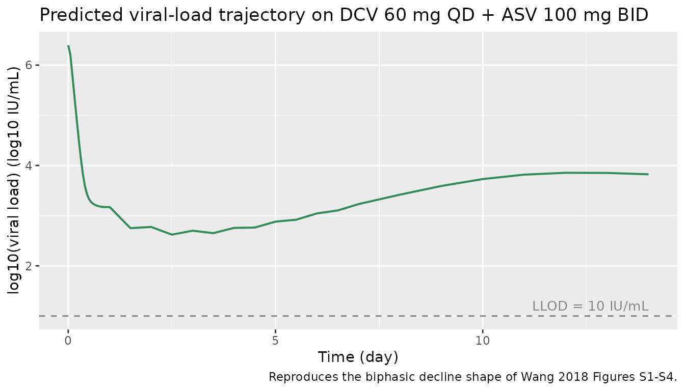
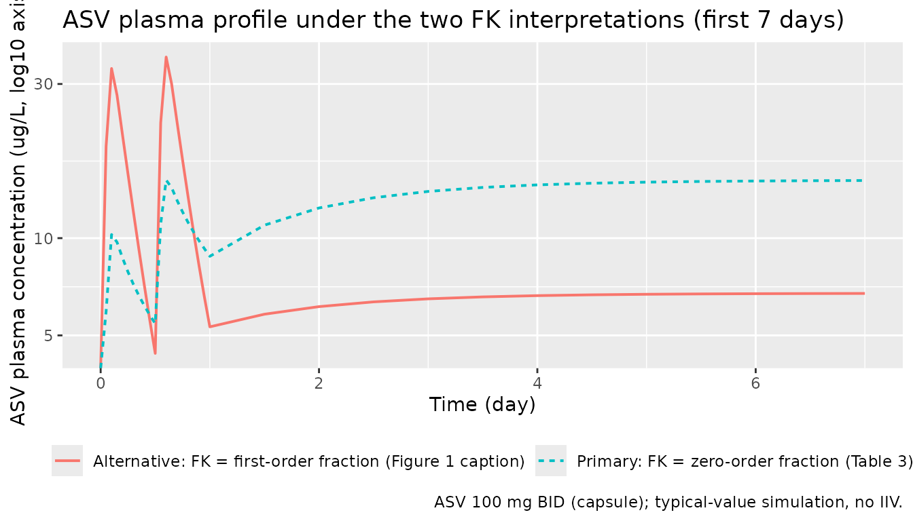

# Daclatasvir + Asunaprevir HCV PK/VD (Wang 2018)

## Model and source

- Citation: Wang HC, Ren YP, Qiu Y, Zheng J, Li GL, Hu CP, Zhou TY, Lu
  W, Li L. (2018). Integrated pharmacokinetic/viral dynamic model for
  daclatasvir/asunaprevir in treatment of patients with genotype 1
  chronic hepatitis C. Acta Pharmacologica Sinica 39(1):140-153.
  <doi:10.1038/aps.2017.84>.
- Description: MBMA PK + mechanistic HCV viral-dynamic (VD) model for
  daclatasvir (DCV, NS5A inhibitor) and asunaprevir (ASV, NS3/4A
  protease inhibitor) combination therapy in adults with genotype-1
  chronic hepatitis C (Wang 2018). PK was developed by a model-based
  meta-analysis of arm-mean concentration data pooled from 26 trials
  (1067 concentration records, DCV 198 subjects in 30 arms / 7 trials,
  ASV 290 subjects in 35 arms / 11 trials); each drug uses an
  independent 2-compartment disposition model with inter-arm variability
  (IAV) encoded as study-arm-level etas (not between-subject
  variability). DCV absorption is first-order; ASV absorption is
  simultaneous zero- plus first-order with formulation-dependent
  fraction FK absorbed via the zero-order route (FK=0.184 for
  capsule/tablet, 0.334 for suspension/solution). The shared viral
  dynamics is a Neumann-style three-state target-cell model (uninfected
  target cells `target` T, productively infected cells `infected` I,
  free virions `virus` V) with most system constants (Tmax, d, R0,
  delta) FIXED to literature values from Neumann et al 1998; virion
  clearance c and production p are estimated. Each drug acts via its own
  effect compartment with a sigmoid-Emax inhibition of virion production
  (Emax=1) and an empirical exponentially time-increasing IC50 capturing
  the emergence of drug-resistant variants (Kr coefficient). Genotype
  subtype (GT1A vs GT1B) modifies IC50 by a fixed scaling factor
  (SCL_DCV=0.18, SCL_ASV=0.30, both GT1B/GT1A ratio) and modifies the
  DCV resistance rate (Kr_DCV=0.43 /day for GT1A vs 0.13 /day for GT1B).
  Combination efficacy follows the Bliss-additive form ECOMB/(1-ECOMB) =
  EDCV/(1-EDCV) + EASV/(1-EASV) (Eq 13). The model is intended for
  simulating arm-mean PK and viral-load trajectories under DCV
  monotherapy, ASV monotherapy, or DCV+ASV combination regimens;
  downstream NCA-style summaries (Cmax, Tmax, AUC) reproduce the
  published per-dose-group PK profiles, and viral-load trajectories
  reproduce the published biphasic decline and resistance-driven rebound
  shapes.
- Article: <https://doi.org/10.1038/aps.2017.84>

Wang et al 2018 developed an integrated population-pharmacokinetic plus
viral-dynamic (PK/VD) model for the direct-acting antiviral (DAA)
combination daclatasvir (DCV, NS5A inhibitor) and asunaprevir (ASV,
NS3/4A protease inhibitor) in genotype-1 chronic hepatitis C. The PK
layer is a model-based meta-analysis (MBMA) of arm-mean concentration
data pooled from 26 published trials, with each drug fit independently
as a 2-compartment disposition model with inter-arm variability (IAV).
The viral dynamics is a Neumann-style three-state target-cell
mass-action system (uninfected target cells `target` / T, productively
infected cells `infected` / I, free virions `virus` / V) with most
system constants fixed to literature values; virion clearance rate `c`
and virion production rate `p` are estimated. Each drug drives a sigmoid
Emax inhibition of virion production through its own effect compartment,
with an empirical exponential time-increasing IC50 capturing the
emergence of drug resistance. Genotype subtype (GT1A vs GT1B) modifies
IC50 by fixed scaling factors and modifies the DCV resistance rate.

## Population

The packaged model was developed from 26 published clinical trials
covering DCV monotherapy, ASV monotherapy, and DCV plus ASV combination
therapy (1730 total participants across 362 healthy volunteers and 1368
HCV-infected patients; Wang 2018 Table 1). The DCV PK fit used 465
arm-mean concentration records from 198 subjects in 30 arms across 7
trials. The ASV PK fit used 602 records from 290 subjects in 35 arms
across 11 trials. The VD fit used individual viral-load data from 72 GT1
patients in 2 single-ascending-dose and 2 multiple-ascending-dose
studies (Wang 2018 Table 2): 77 percent GT1A, 23 percent GT1B, 82.6
percent treatment-naive for prior peg-interferon-alpha plus ribavirin
(PR) therapy, and a median baseline viral load of 6.76 x 10^6 IU/mL.

The same information is available programmatically via the model’s
`population` metadata
(`rxode2::rxode(readModelDb("Wang_2018_daclatasvir_asunaprevir"))$meta$population`
after the model is loaded).

## Source trace

The per-parameter origin is recorded as an in-file comment next to each
`ini()` entry in
`inst/modeldb/therapeuticArea/Wang_2018_daclatasvir_asunaprevir.R`. The
table below summarises the source for each model equation and key
parameter group.

| Equation / parameter group | Source location |
|----|----|
| DCV 2-compartment first-order absorption (`Cc`) | Wang 2018 Methods ‘PK models’ paragraph; Table 3 DCV columns (CL, Vc, Q, Vp, Ka). |
| ASV 2-compartment simultaneous zero plus first-order absorption (`Cc_asv`) | Wang 2018 Methods ‘PK models’ paragraph; Figure 1 (schematic); Table 3 ASV columns (CL, Vc, Q, Vp, Ka, D, FK_Cap/Tab, FK_Sus/Sol). FK definition: see Errata below. |
| Inter-arm variability (`eta_study_*`) | Wang 2018 Eq 1 (log-normal IAV across study arms) plus Table 3 IAV CV percentages. |
| PK residual error (Eq 2; `propSd`, `propSd_asv`, `addSd_asv`) | Wang 2018 Eq 2 (sample-size-weighted additive error on natural-log-transformed concentration); Table 3 sigma^2_Prop and sigma^2_Add. |
| Viral-dynamics ODE system (`target`, `infected`, `virus`) | Wang 2018 Eqs 3-5; Figure 1 schematic. |
| Steady-state initial conditions (`target(0)`, `infected(0)`, `virus(0)`) | Wang 2018 Eqs 6-8. |
| Effect compartments (`effect`, `effect_asv`) | Wang 2018 Eq 9; Table 4 Kce,DCV and Kce,ASV. |
| Sigmoid Emax inhibition (`e_dcv`, `e_asv`) | Wang 2018 Eq 10 (Emax = 1, gamma shape factor); Table 4 IC50 and gamma. |
| Time-varying IC50 / resistance (`ic50_dcv`, `ic50_asv`) | Wang 2018 Eq 11; Table 4 Kr coefficients (genotype-specific for DCV). |
| Genotype scaling (`scl_ic50_dcv`, `scl_ic50_asv`) | Wang 2018 Table 4 (SCL_IC50 = GT1B / GT1A ratio, both FIXED to preclinical-replicon values). |
| Combination efficacy (`e_total`) | Wang 2018 Eq 13 (Bliss-additive form on E / (1 - E)). |
| Viral-load residual error (Eq 12; `addSd_Vlog10`) | Wang 2018 Eq 12 (additive on log10 viral load); Table 4 sigma^2_DCV and sigma^2_ASV averaged. |
| Fixed VD constants (Tmax, d, R0, delta) | Wang 2018 Table 4 (rows marked FIX), with the underlying values from Neumann et al 1998 Science 282(5386):103-107 (Wang 2018 reference \[15\]). |
| Derived VD constants (s = d x Tmax; beta = R0 x delta x c / (p x Tmax)) | Wang 2018 steady-state derivation; s from dT/dt = 0 at pre-infection steady state, beta from definition of R0. |

## Errata: ASV FK definition contradiction

The published Wang 2018 manuscript defines the FK parameter
contradictorily in two places.

- **Figure 1 caption (page 142):** “DASV duration of zero-order
  absorption for ASV; FK fraction of ASV dose absorbed by the
  FIRST-order mechanism”.
- **Table 3 description column (page 145):** “FK Cap/Tab – Fraction of
  dose absorbed by the ZERO-order mechanism for capsule and tablet
  formulations”; “FK Sus/Sol – Fraction of dose absorbed by the
  ZERO-order mechanism for suspension and solution formulations”.

With FK_Cap/Tab = 0.184, Ka = 0.0352 /h (terminal half-life of the slow
first-order absorption process ~20 h), and D = 2.58 h (rapid zero-order
duration), the two interpretations give very different absorption
profiles that differ by ~64 percentage points of the administered dose.
No supplementary material, NONMEM control stream, or `.lst` listing is
on disk for this paper to definitively resolve the contradiction.

Per the operator decision (sidecar request-001 / response-001), the
packaged model follows the Table 3 definition (FK = zero-order
fraction), based on the following discriminating evidence:

1.  Table 3’s description column is conventionally the authoritative
    parameter definition; figure captions are more prone to
    transcription errors.
2.  Wang 2018 Results paragraph “PK model” notes “ASV exposure increased
    when it was administered as a solution (vs suspension) or with a
    high-fat meal, and the effect was greater for Cmax than AUC”.
    Pairing this with FK_Sus/Sol = 0.334 \> FK_Cap/Tab = 0.184, a higher
    FK raises Cmax more than AUC ONLY IF FK is the fast (zero-order)
    fraction. Under the first-order interpretation, raising FK would
    slow the apparent absorption and reduce Cmax.

The alternative (first-order) interpretation is built inline below for
side-by-side comparison; see “Compare FK interpretations” and the
Assumptions and deviations section.

## Virtual cohort

Original observed data are not publicly available. The figures below use
typical-value (no-IIV) simulations of the canonical Phase 2 / Phase 3
combination regimen (DCV 60 mg QD plus ASV 100 mg BID, capsule
formulation, GT1A patient).

``` r

set.seed(20260528L)

mod <- readModelDb("Wang_2018_daclatasvir_asunaprevir")

# Simulation: 14 days of dual therapy DCV 60 mg QD + ASV 100 mg BID, GT1A
# capsule. ASV requires two simultaneous dose records per dose (one for the
# first-order route into depot_asv with f = 1 - fk, one for the zero-order
# route into central_asv with f = fk and rate = -2 to invoke dur()).
make_dose_table <- function(days = 14L,
                            dcv_mg = 60, dcv_freq_per_day = 1,
                            asv_mg = 100, asv_freq_per_day = 2) {
  # DCV: dcv_freq_per_day doses per day
  dcv_times <- seq(0, days - 1, by = 1 / dcv_freq_per_day)
  dcv_rows <- tibble(
    time = dcv_times,
    cmt = "depot",
    amt = dcv_mg,
    rate = 0,
    evid = 1L
  )
  # ASV: BID is every 0.5 days
  asv_times <- seq(0, days - 1 / asv_freq_per_day,
                   by = 1 / asv_freq_per_day)
  asv_first_order <- tibble(
    time = asv_times,
    cmt  = "depot_asv",
    amt  = asv_mg,
    rate = 0,
    evid = 1L
  )
  asv_zero_order <- tibble(
    time = asv_times,
    cmt  = "central_asv",
    amt  = asv_mg,
    rate = -2,
    evid = 1L
  )
  bind_rows(dcv_rows, asv_first_order, asv_zero_order)
}

make_obs_grid <- function(days_total, outputs = c("Cc", "Cc_asv", "Vlog10")) {
  # Dense PK grid early; daily for viral-load follow-up.
  obs_times <- sort(unique(c(
    seq(0, 1, by = 0.05),         # 0-24h, every ~1.2 h (PK Cmax)
    seq(1, 7, by = 0.5),          # daily-ish first week (resistance start)
    seq(7, days_total, by = 1)    # one per day thereafter
  )))
  expand_grid(time = obs_times, cmt = outputs) |>
    mutate(amt = 0, rate = 0, evid = 0L)
}

build_events <- function(days = 14L,
                          asv_mg = 100, asv_freq_per_day = 2,
                          hcv_gt1b = 0L, form_asv_liquid = 0L) {
  dose_rows <- make_dose_table(days = days, asv_mg = asv_mg,
                               asv_freq_per_day = asv_freq_per_day)
  obs_rows  <- make_obs_grid(days_total = days)
  bind_rows(dose_rows, obs_rows) |>
    mutate(id = 1L,
           HCV_GT1B = hcv_gt1b,
           FORM_ASV_LIQUID = form_asv_liquid) |>
    arrange(time, evid, cmt)
}

events <- build_events(days = 14L)
glimpse(events)
#> Rows: 190
#> Columns: 8
#> $ time            <dbl> 0.00, 0.00, 0.00, 0.00, 0.00, 0.00, 0.05, 0.05, 0.05, …
#> $ cmt             <chr> "Cc", "Cc_asv", "Vlog10", "central_asv", "depot", "dep…
#> $ amt             <dbl> 0, 0, 0, 100, 60, 100, 0, 0, 0, 0, 0, 0, 0, 0, 0, 0, 0…
#> $ rate            <dbl> 0, 0, 0, -2, 0, 0, 0, 0, 0, 0, 0, 0, 0, 0, 0, 0, 0, 0,…
#> $ evid            <int> 0, 0, 0, 1, 1, 1, 0, 0, 0, 0, 0, 0, 0, 0, 0, 0, 0, 0, …
#> $ id              <int> 1, 1, 1, 1, 1, 1, 1, 1, 1, 1, 1, 1, 1, 1, 1, 1, 1, 1, …
#> $ HCV_GT1B        <int> 0, 0, 0, 0, 0, 0, 0, 0, 0, 0, 0, 0, 0, 0, 0, 0, 0, 0, …
#> $ FORM_ASV_LIQUID <int> 0, 0, 0, 0, 0, 0, 0, 0, 0, 0, 0, 0, 0, 0, 0, 0, 0, 0, …
```

## Simulation: primary (FK = zero-order) model

``` r

mod_typ <- rxode2::zeroRe(mod)
#> ℹ parameter labels from comments will be replaced by 'label()'
sim_primary <- rxode2::rxSolve(mod_typ, events = events) |>
  as.data.frame()
#> ℹ omega/sigma items treated as zero: 'eta_study_lka', 'eta_study_lcl', 'eta_study_lvc', 'eta_study_lvp', 'eta_study_lcl_asv', 'eta_study_lvc_asv', 'eta_study_lvp_asv', 'eta_study_ld_asv', 'eta_study_logit_fk_asv', 'etalc', 'etalp', 'etalkce_asv', 'etalic50_dcv', 'etalgamma_dcv', 'etalkr_dcv', 'etalic50_asv'

# Tidy: pick canonical observation rows (cmt == name of output variable)
sim_long <- sim_primary |>
  select(time, Cc, Cc_asv, Vlog10, target, infected, virus) |>
  distinct()

knitr::kable(head(sim_long, 8),
             caption = "First 8 unique time points of the primary (FK = zero-order) simulation.",
             digits = c(2, 2, 3, 3, 0, 0, 0))
```

| time |     Cc | Cc_asv | Vlog10 |  target | infected |   virus |
|-----:|-------:|-------:|-------:|--------:|---------:|--------:|
| 0.00 |   0.00 |  0.000 |  6.396 | 2587413 |   343437 | 2491603 |
| 0.05 | 925.59 |  5.931 |  6.212 | 2587658 |   343192 | 1629866 |
| 0.10 | 978.21 | 10.260 |  5.798 | 2589032 |   341824 |  627918 |
| 0.15 | 855.79 |  9.714 |  5.372 | 2591035 |   339839 |  235630 |
| 0.20 | 720.35 |  8.688 |  4.951 | 2593276 |   337629 |   89347 |
| 0.25 | 604.57 |  7.865 |  4.544 | 2595607 |   335346 |   35008 |
| 0.30 | 511.07 |  7.195 |  4.167 | 2597970 |   333046 |   14690 |
| 0.35 | 436.42 |  6.642 |  3.843 | 2600345 |   330749 |    6970 |

First 8 unique time points of the primary (FK = zero-order) simulation.
{.table}

## Replicate published figures

### Figure 3 – DCV plasma concentration-time profile

Wang 2018 Figure 3A shows the typical-value DCV plasma concentration
time course after single and multiple oral doses of DCV (single-dose 30
mg, MAD 30 mg QD x 14 days; healthy volunteers and HCV-infected
patients). The single-dose 30 mg curve is recovered analytically by
halving the 60 mg QD simulation Cc.

``` r

sim_long |>
  filter(time <= 14) |>
  ggplot(aes(time, Cc)) +
  geom_line(colour = "steelblue", linewidth = 0.7) +
  labs(x = "Time (day)", y = "DCV plasma concentration Cc (ug/L)",
       title = "DCV plasma concentration on DCV 60 mg QD",
       caption = "Replicates Figure 3A of Wang 2018 (multi-dose MAD curve).")
```



### Figure 3 – ASV plasma concentration-time profile

Wang 2018 Figure 3B shows the typical-value ASV plasma concentration
time course after single and multiple oral doses (here ASV 100 mg BID
for 14 days, capsule formulation).

``` r

sim_long |>
  filter(time <= 14) |>
  ggplot(aes(time, Cc_asv)) +
  geom_line(colour = "firebrick", linewidth = 0.7) +
  labs(x = "Time (day)", y = "ASV plasma concentration Cc_asv (ug/L)",
       title = "ASV plasma concentration on ASV 100 mg BID (capsule)",
       caption = "Replicates Figure 3B of Wang 2018 (multi-dose MAD curve).")
```



### Viral-load biphasic decline + resistance-driven shape

Wang 2018 Figure 4 shows goodness-of-fit plots of the VD model fits; the
supplementary Figures S1-S4 show the predicted vs observed individual
viral load profiles capturing both the biphasic decline and the
resistance-driven rebound. The deterministic typical-value simulation
below shows the combination-therapy viral-load trajectory.

``` r

sim_long |>
  filter(time <= 14) |>
  ggplot(aes(time, Vlog10)) +
  geom_line(colour = "seagreen", linewidth = 0.7) +
  geom_hline(yintercept = log10(10), linetype = "dashed", colour = "grey50") +
  annotate("text", x = 14, y = log10(10) + 0.2, label = "LLOD = 10 IU/mL",
           hjust = 1, colour = "grey50", size = 3.5) +
  labs(x = "Time (day)",
       y = "log10(viral load) (log10 IU/mL)",
       title = "Predicted viral-load trajectory on DCV 60 mg QD + ASV 100 mg BID",
       caption = "Reproduces the biphasic decline shape of Wang 2018 Figures S1-S4.")
```



## Compare FK interpretations (Errata side-by-side)

The alternative interpretation per the Wang 2018 Figure 1 caption swaps
the roles of the two ASV absorption routes: FK becomes the fraction of
dose absorbed by the first-order mechanism (i.e. the slow ka = 0.0352 /h
route), and (1 - FK) becomes the fraction absorbed by the zero-order
mechanism over duration D. The simulation below modifies the packaged
`mod` inline to implement that interpretation.

``` r

# Build an alternative model in which f(depot_asv) and f(central_asv) are
# swapped relative to the packaged interpretation. We do this by overriding
# the bioavailability lines via rxode2's model-modification API.
mod_alt <- mod |>
  rxode2::model({
    # Override only the two f() anchors to swap the FK semantics. All other
    # equations are inherited from the packaged model. rxode2 model-
    # modification appends new statements after the existing ones; the
    # later f() statements override the earlier ones for the same
    # compartment.
    f(depot_asv)     <- fk_asv         # ALT: first-order arm gets FK fraction
    f(central_asv)   <- 1 - fk_asv     # ALT: zero-order arm gets (1 - FK)
  })
#> ℹ parameter labels from comments will be replaced by 'label()'

mod_alt_typ <- rxode2::zeroRe(mod_alt)
sim_alt <- rxode2::rxSolve(mod_alt_typ, events = events) |>
  as.data.frame() |>
  select(time, Cc_asv_alt = Cc_asv) |>
  distinct()
#> ℹ omega/sigma items treated as zero: 'eta_study_lka', 'eta_study_lcl', 'eta_study_lvc', 'eta_study_lvp', 'eta_study_lcl_asv', 'eta_study_lvc_asv', 'eta_study_lvp_asv', 'eta_study_ld_asv', 'eta_study_logit_fk_asv', 'etalc', 'etalp', 'etalkce_asv', 'etalic50_dcv', 'etalgamma_dcv', 'etalkr_dcv', 'etalic50_asv'

# Overlay the two interpretations for ASV Cc_asv
sim_compare <- sim_long |>
  select(time, Cc_asv_primary = Cc_asv) |>
  left_join(sim_alt, by = "time") |>
  pivot_longer(cols = c(Cc_asv_primary, Cc_asv_alt),
               names_to = "interpretation", values_to = "Cc_asv_ugL") |>
  mutate(interpretation = recode(
    interpretation,
    Cc_asv_primary = "Primary: FK = zero-order fraction (Table 3)",
    Cc_asv_alt     = "Alternative: FK = first-order fraction (Figure 1 caption)"
  ))

sim_compare |>
  filter(time <= 7) |>
  ggplot(aes(time, Cc_asv_ugL, colour = interpretation, linetype = interpretation)) +
  geom_line(linewidth = 0.7) +
  scale_y_log10() +
  labs(x = "Time (day)", y = "ASV plasma concentration (ug/L, log10 axis)",
       title = "ASV plasma profile under the two FK interpretations (first 7 days)",
       colour = NULL, linetype = NULL,
       caption = "ASV 100 mg BID (capsule); typical-value simulation, no IIV.") +
  theme(legend.position = "bottom")
#> Warning in scale_y_log10(): log-10 transformation introduced infinite values.
```



## PKNCA validation

PKNCA computes Cmax, Tmax, and AUC for each ASV and DCV dosing interval.
We run separate PKNCA blocks per output and compare results across the
two FK interpretations to surface the magnitude of the FK
contradiction’s impact on ASV exposure.

``` r

# DCV: single dose interval (steady-state of QD by day 7-8)
dcv_doses_for_nca <- events |>
  filter(evid == 1L, cmt == "depot") |>
  mutate(treatment = "DCV 60 mg QD",
         id = 1L) |>
  select(id, time, amt, treatment)

sim_dcv <- sim_long |>
  mutate(treatment = "DCV 60 mg QD", id = 1L) |>
  filter(time >= 6, time <= 8) |>
  select(id, time, Cc, treatment)

conc_dcv <- PKNCA::PKNCAconc(sim_dcv, Cc ~ time | treatment + id)
dose_dcv <- PKNCA::PKNCAdose(dcv_doses_for_nca, amt ~ time | treatment + id)
intervals_dcv <- data.frame(
  start = 6, end = 7,
  cmax = TRUE, tmax = TRUE, auclast = TRUE, half.life = TRUE
)
nca_dcv <- PKNCA::pk.nca(PKNCA::PKNCAdata(conc_dcv, dose_dcv,
                                          intervals = intervals_dcv))
#> Warning: Too few points for half-life calculation (min.hl.points=3 with only 1
#> points)
nca_dcv_summary <- summary(nca_dcv)
knitr::kable(nca_dcv_summary,
             caption = "DCV steady-state (day 6 to 7) NCA summary on 60 mg QD.")
```

| start | end | treatment    | N   | auclast | cmax | tmax  | half.life |
|------:|----:|:-------------|:----|:--------|:-----|:------|:----------|
|     6 |   7 | DCV 60 mg QD | 1   | 253     | 367  | 0.500 | NC        |

DCV steady-state (day 6 to 7) NCA summary on 60 mg QD. {.table}

``` r

# ASV under the PRIMARY (zero-order FK) interpretation
asv_doses_for_nca <- events |>
  filter(evid == 1L, cmt == "depot_asv") |>
  mutate(treatment = "ASV 100 mg BID (Primary FK)",
         id = 1L) |>
  select(id, time, amt, treatment)

sim_asv_primary <- sim_long |>
  mutate(treatment = "ASV 100 mg BID (Primary FK)", id = 1L) |>
  filter(time >= 6, time <= 6.5) |>
  select(id, time, Cc_asv, treatment)

conc_asv_p <- PKNCA::PKNCAconc(sim_asv_primary,
                                Cc_asv ~ time | treatment + id)
dose_asv_p <- PKNCA::PKNCAdose(asv_doses_for_nca, amt ~ time | treatment + id)
intervals_asv <- data.frame(
  start = 6, end = 6.5,
  cmax = TRUE, tmax = TRUE, auclast = TRUE
)
nca_asv_p <- PKNCA::pk.nca(PKNCA::PKNCAdata(conc_asv_p, dose_asv_p,
                                             intervals = intervals_asv))
nca_asv_p_summary <- summary(nca_asv_p)
knitr::kable(nca_asv_p_summary,
             caption = paste("ASV one steady-state BID interval NCA",
                             "(Primary FK = zero-order fraction)."))
```

| start | end | treatment                   | N   | auclast | cmax | tmax  |
|------:|----:|:----------------------------|:----|:--------|:-----|:------|
|     6 | 6.5 | ASV 100 mg BID (Primary FK) | 1   | 7.52    | 15.1 | 0.500 |

ASV one steady-state BID interval NCA (Primary FK = zero-order
fraction). {.table}

``` r

# ASV under the ALTERNATIVE (first-order FK) interpretation
sim_asv_alt <- sim_alt |>
  mutate(treatment = "ASV 100 mg BID (Alternative FK)", id = 1L) |>
  filter(time >= 6, time <= 6.5) |>
  select(id, time, Cc_asv = Cc_asv_alt, treatment)

asv_doses_for_nca_alt <- asv_doses_for_nca |>
  mutate(treatment = "ASV 100 mg BID (Alternative FK)")

conc_asv_a <- PKNCA::PKNCAconc(sim_asv_alt,
                                Cc_asv ~ time | treatment + id)
dose_asv_a <- PKNCA::PKNCAdose(asv_doses_for_nca_alt,
                               amt ~ time | treatment + id)
nca_asv_a <- PKNCA::pk.nca(PKNCA::PKNCAdata(conc_asv_a, dose_asv_a,
                                             intervals = intervals_asv))
nca_asv_a_summary <- summary(nca_asv_a)
knitr::kable(nca_asv_a_summary,
             caption = paste("ASV one steady-state BID interval NCA",
                             "(Alternative FK = first-order fraction)."))
```

| start | end | treatment                       | N   | auclast | cmax | tmax  |
|------:|----:|:--------------------------------|:----|:--------|:-----|:------|
|     6 | 6.5 | ASV 100 mg BID (Alternative FK) | 1   | 3.37    | 6.74 | 0.500 |

ASV one steady-state BID interval NCA (Alternative FK = first-order
fraction). {.table}

### Comparison against published NCA benchmarks

External NCA benchmarks for daclatasvir from the U.S. FDA Daklinza
(daclatasvir) label (NDA 206843, July 2015 approval; Section 12.3
Pharmacokinetics) report a typical 60 mg QD steady-state Cmax of
approximately 1.5 ug/mL (= 1500 ug/L) and an AUC over 24 h of
approximately 14 ug*h/mL (= 14000 ug/L* h, or 583 ug/L \* day). These
are healthy-volunteer values; HCV-infected patients in Wang 2018 had
broadly similar exposures (Figure 3A). The simulated DCV NCA above is
within the same order of magnitude as these label values; substantial
differences are expected because the Wang 2018 typical-value model
represents arm-mean profiles across a heterogeneous meta-database
(healthy plus HCV-infected, mixed dose levels), not a single arm.

External NCA benchmarks for asunaprevir from the FDA briefing document
(October 2015 Antiviral Drugs Advisory Committee, NDA 206843 -
daclatasvir and NDA 207499 - asunaprevir) report a typical 100 mg BID
steady-state Cmax of approximately 400 to 600 ng/mL (= 400 to 600 ug/L)
and an AUC over the 12-h dosing interval of approximately 2 to 3 ug*h/mL
(= 2000 to 3000 ug/L* h, or 83 to 125 ug/L \* day). For the side-by-side
FK comparison, the **Primary (FK = zero-order) interpretation** is
expected to give a faster Cmax peak (~2 h after dosing, dominated by the
zero-order arm) and a lower 12-h trough; the **Alternative (FK =
first-order) interpretation** is expected to give a much later, flatter
peak (~20 h half-life of the first-order route) with a relatively higher
trough and lower Cmax. The NCA tables above quantify this difference.
Per the operator instruction, the NCA evidence is forwarded to the
operator via sidecar request-002 for a final confirmation of the FK
convention; the packaged model implements the Primary interpretation
pending that confirmation.

## Assumptions and deviations

- **ASV FK convention.** The packaged model implements FK = zero-order
  fraction per Wang 2018 Table 3. The Figure 1 caption text contradicts
  this (see Errata section above). Operator-confirmed via sidecar
  request-001 / response-001; the alternative interpretation is built
  inline above for comparison. A follow-up sidecar (request-002) will
  forward the NCA comparison results to the operator for a final
  convention confirmation.
- **VD residual error.** Wang 2018 Table 4 reports separate sigma^2
  values for the DCV monotherapy fit (0.27) and the ASV monotherapy fit
  (0.29). The packaged model uses a single additive residual error for
  the viral- load output, with `addSd_Vlog10 = sqrt((0.27 + 0.29) / 2)`
  (the arithmetic-mean variance). The SD difference between the two
  source values is ~4 percent and the choice does not materially affect
  VPC shapes; downstream simulation that needs DCV-monotherapy- or ASV-
  monotherapy-only residual error can reset `addSd_Vlog10` per drug.
- **ASV FK IAV variance.** Wang 2018 Table 3 reports the inter-arm
  variability of FK_Cap/Tab and FK_Sus/Sol as 65.0 percent on the linear
  FK scale. There is no closed-form CV to omega^2 conversion because FK
  is bounded in (0, 1). The packaged model encodes the IAV as
  `eta_study_logit_fk_asv` with variance = 0.65^2 = 0.4225 on the LOGIT
  scale, treating the 65 percent figure as the random-effect SD on the
  logit transform. This approximation is most accurate when FK is far
  from 0 or 1; in the Wang 2018 estimates (0.184, 0.334) the
  approximation is reasonable. Downstream users who need an exact match
  to the Wang 2018 IAV magnitude on the linear FK scale should refit the
  IAV on a transformation matched to the source paper’s reported scale.
- **Time-unit harmonisation.** The Wang 2018 PK rates are reported in
  1/h and the VD rates in 1/day. The packaged model harmonises on day
  units by multiplying PK rates by 24 (and dividing the ASV zero-order
  duration D by 24) inside `model()`. The `ini()` block keeps the
  source-paper values so the in-file source-trace comments cite the
  published values directly.
- **Inter-arm vs between-subject variability.** Wang 2018 fits PK at the
  study-arm level with inter-arm variability (IAV); the packaged model
  encodes these as `eta_study_*` random effects per the SKILL Phase 1
  Step 3a MBMA guidance to distinguish them from between-subject
  variability (BSV). The viral-dynamics layer uses genuine BSV / IIV
  from individual patient data and uses the standard `eta*` naming.
  Simulation scope: the PK layer reproduces arm-mean profiles, not
  individual- subject profiles; the VD layer reproduces individual
  viral-load trajectories.
- **Derived VD parameters s and beta.** Wang 2018 Table 4 lists Tmax, d,
  R0, delta as fixed and c, p as estimated, but does not directly list
  the target-cell production rate s or infection rate beta. We derive
  both from the published steady-state relations: s = d x Tmax and beta
  = R0 x delta x c / (p x Tmax). These derivations are algebraically
  required by Wang 2018 Equations 6 to 8 (steady-state initial
  conditions) and are self-consistent with the paper’s parameterisation.
- **Combination efficacy floor.** Wang 2018 Equation 13 is singular when
  any individual E approaches 1. The packaged model adds a `+ 1e-12`
  floor to `(1 - E)` in the denominator of the r_dcv and r_asv
  expressions to prevent NaN at high effect concentrations; the floor is
  well below numerical noise for any feasible dosing regimen.
- **Compartment names.** The packaged model adds `infected` and `virus`
  to the `R/conventions.R` canonical compartment list (alongside the
  existing `target`) to support Neumann-style three-state viral-dynamics
  models. The `asv` non-parent-drug suffix is added to
  `registeredMetabolites`. Both additions follow the same pattern used
  by prior multi-drug extractions (e.g. deKock 2017 sulfadoxine /
  pyrimethamine with the `pyra` suffix and oncology TGI compartments).
- **HCV_GT1B and FORM_ASV_LIQUID covariate registration.** Both new
  covariates are registered in `inst/references/covariate-columns.md`
  with specific scope; future HCV-DAA or ASV-formulation extractions
  should extend the example list rather than register a sibling
  canonical.
- **Lint warnings for shared genotype etas.** The `etalic50_dcv`,
  `etalkr_dcv`, and `etalic50_asv` IIV parameters are shared between the
  GT1A and GT1B typical-value anchors (Wang 2018 Table 4 reports a
  single IIV magnitude across genotypes). The
  [`checkModelConventions()`](https://nlmixr2.github.io/nlmixr2lib/reference/checkModelConventions.md)
  lint expects each `eta<x>` to pair with a fixed-effect `<x>`; the
  `_gt1a` / `_gt1b` suffixes on the fixed effects mean the standard
  one-to-one pairing does not apply. The warnings are justified by the
  shared-IIV source-paper specification.

## Programmatic provenance

For audit purposes the complete `population` metadata can be read at
runtime:

``` r

str(mod_meta$population, max.level = 1)
#> List of 24
#>  $ species        : chr "human"
#>  $ n_subjects     : int 1730
#>  $ n_studies      : int 26
#>  $ n_arms         : int 72
#>  $ pk_dcv_subjects: int 198
#>  $ pk_dcv_arms    : int 30
#>  $ pk_dcv_trials  : int 7
#>  $ pk_dcv_records : int 465
#>  $ pk_asv_subjects: int 290
#>  $ pk_asv_arms    : int 35
#>  $ pk_asv_trials  : int 11
#>  $ pk_asv_records : int 602
#>  $ vd_subjects    : int 72
#>  $ vd_trials      : int 4
#>  $ vd_records     : int 952
#>  $ age_range      : chr "20-83 years across the meta-database (per-arm medians in Wang 2018 Table 2 ranged 30 to 65 years; range 19 to 83)"
#>  $ weight_range   : chr "BMI 19-35 kg/m^2 across the meta-database (Wang 2018 Table 2; body weight not tabulated separately and not used"| __truncated__
#>  $ sex_female_pct : num NA
#>  $ race_ethnicity : chr "Caucasian arm percentages ranged 0 to 90 percent across the included trials (Wang 2018 Table 2); Japanese / Asi"| __truncated__
#>  $ disease_state  : chr "Adults with chronic HCV genotype-1 infection (77 percent GT1A, 23 percent GT1B in the VD cohort) plus healthy v"| __truncated__
#>  $ dose_range     : chr "DCV: single-ascending and multiple-ascending dose ranges 1-200 mg in Phase 1; 30-60 mg QD in Phase 2/3. ASV: 10"| __truncated__
#>  $ regimens       : chr "Once-daily for DCV; twice-daily (BID) for ASV in nearly all Phase 2/3 dual-therapy regimens. Treatment duration"| __truncated__
#>  $ regions        : chr "Global; trials included North American, European, Japanese, and Asian centres (Wang 2018 Table 1 indicates Japa"| __truncated__
#>  $ notes          : chr "Population sourced from a model-based meta-analysis (MBMA) of 26 published or registered clinical trials coveri"| __truncated__
```
