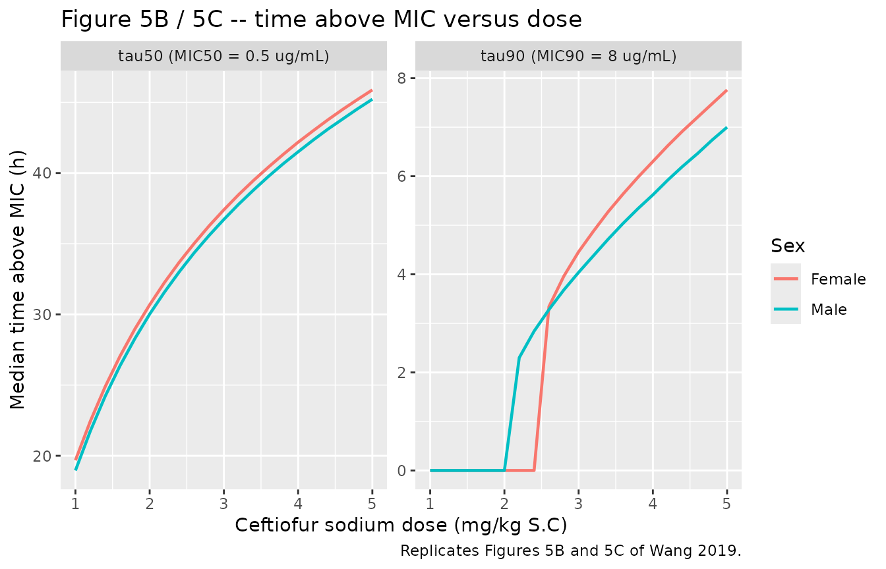
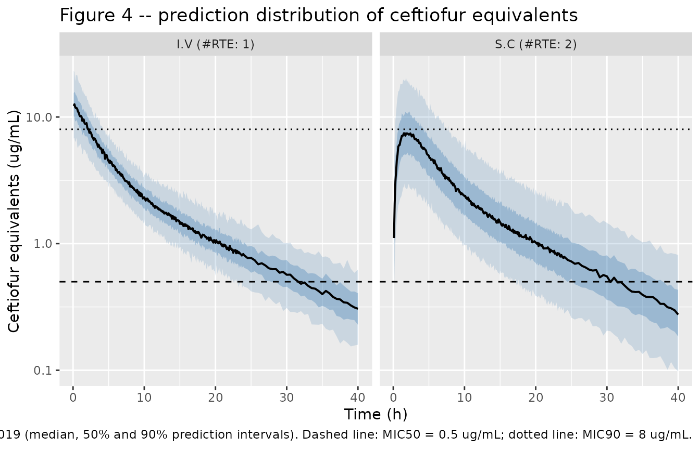

# Ceftiofur sodium in beagle dogs (Wang 2019)

## Model and source

- Citation: Wang J, Schneider BK, Xue J, Sun P, Qiu J, Mochel JP, Cao X.
  Pharmacokinetic Modeling of Ceftiofur Sodium Using Non-linear
  Mixed-Effects in Healthy Beagle Dogs. Front Vet Sci. 2019;6:363.
  <doi:10.3389/fvets.2019.00363>.
- Article: <https://doi.org/10.3389/fvets.2019.00363>

Ceftiofur is a third-generation cephalosporin licensed for cattle, swine
and horses and used extra-label in dogs. Wang and colleagues gave twelve
healthy beagles a single 2.2 mg/kg dose of ceftiofur sodium – six
intravenously and six subcutaneously – and fitted both routes
simultaneously with a two-compartment mammillary model in Monolix
2018R2.

``` r

mod <- readModelDb("Wang_2019_ceftiofur_dog")
ui <- rxode2::rxode(mod)
#> ℹ parameter labels from comments will be replaced by 'label()'
ui$description
#> [1] "Preclinical (beagle dog). Two-compartment mammillary population PK model for ceftiofur equivalents (ceftiofur plus its desfuroylceftiofur metabolites that retain an intact beta-lactam ring, assayed together after derivatisation to desfuroylceftiofur acetamide) after a single 2.2 mg/kg dose of ceftiofur sodium given intravenously or subcutaneously to healthy beagles. First-order elimination from the central compartment and first-order absorption from the subcutaneous depot; absolute bioavailability is estimated because the same animals supplied both routes. Female sex lowers the subcutaneous absorption rate roughly two-fold. Inter-individual variability on clearance and central volume is almost perfectly correlated (r = 0.999); the authors' search drove the absorption-rate and inter-compartmental clearance variances to zero and they were fixed there. Fitted by SAEM in Monolix 2018R2 with M4 handling of below-limit-of-quantification records. UNITS: the model is coded in ABSOLUTE units (L, L/h) with the dose in mg, not per kilogram. Wang 2019 Table 1 labels the disposition parameters 'L/kg' and 'L/h/kg', but that suffix is falsified by the paper's own simulations and figures -- see the vignette's 'Assumptions and deviations' section. A 2.2 mg/kg dose in a 10 kg beagle is amt = 22 mg."
```

**Units.** This model is coded in *absolute* units: clearances in L/h,
volumes in L, and the dose in mg. Wang 2019 Table 1 labels those same
numbers “L/h/kg” and “L/kg”. That suffix is not consistent with the
paper’s own simulations, and the “Assumptions and deviations” section
below arbitrates it quantitatively. A 2.2 mg/kg dose in a 10 kg beagle
is therefore `amt = 22`, and `Cc` comes out in ug/mL (Figure 2 of the
paper plots the same quantity in ng/mL, i.e. numbers 1000-fold larger).

## Population

Twelve healthy beagles, six male and six female, aged 1.5-2.5 years and
weighing 9-12 kg, were randomised to a single 2.2 mg/kg dose of
ceftiofur sodium given either into the cephalic vein or subcutaneously
behind the shoulders. The allocation was blocked on sex so that three
males and three females received each route. Plasma was sampled over 72
h (with an extra 0.08 h sample in the intravenous arm) and 198
concentrations from both routes were pooled into one fit.

The assay does not measure parent ceftiofur. Dithioerythritol cleaves
ceftiofur and every desfuroylceftiofur metabolite that still carries an
intact beta-lactam ring, the product is derivatised with iodoacetamide
to desfuroylceftiofur acetamide, and that is what UPLC-MS/MS quantifies.
The model therefore describes **total ceftiofur equivalents**; the paper
notes that free drug is roughly 10% of that total, and that protein
binding is reversible so the bound fraction acts as a reservoir.

``` r

str(ui$population)
#> List of 10
#>  $ species       : chr "beagle dog"
#>  $ n_subjects    : int 12
#>  $ n_studies     : int 1
#>  $ age_range     : chr "1.5-2.5 years"
#>  $ weight_range  : chr "9-12 kg"
#>  $ sex_female_pct: num 50
#>  $ disease_state : chr "Healthy (screened by physical examination, haematology, clinical chemistry and coagulation time)"
#>  $ dose_range    : chr "Single 2.2 mg/kg dose of ceftiofur sodium, reconstituted from sterile powder in 20 mL bacteriostatic water per "| __truncated__
#>  $ regions       : chr "China (China Agricultural University, Beijing)"
#>  $ notes         : chr "Plasma sampled at 0, 0.08 (intravenous arm only), 0.25, 0.5, 0.75, 1, 1.5, 2, 3, 4, 6, 8, 12, 24, 36, 48 and 72"| __truncated__
```

## Source trace

Each `ini()` entry in
`inst/modeldb/specificDrugs/Wang_2019_ceftiofur_dog.R` carries its own
source comment. They are collected here for review.

| Equation / parameter | Value | Source location |
|----|----|----|
| `lka` (male reference) | 1.43 1/h | Table 1, “Absorption (S.C)”, RSE 11.9% |
| `lcl` | 0.25 L/h | Table 1, “Clearance”, RSE 8.29% |
| `lvc` | 1.69 L | Table 1, “Central compartment volume of distribution”, RSE 6.9% |
| `lvp` | 1.28 L | Table 1, “Peripheral compartment volume of distribution”, RSE 12.9% |
| `lq` | 0.16 L/h | Table 1, “Inter-compartmental clearance”, RSE 13.6% |
| `lfdepot` | 0.937 | Table 1, “Bioavailability (S.C)” = 93.7%, RSE 11.4% |
| `e_sexf_ka` | -0.643 | Table 1, “Coefficient (Ka and sex)”, RSE 20.1% |
| `etalcl` | 24.0% CV | Table 1, IIV column for CL |
| `etalvc` | 32.4% CV | Table 1, IIV column for V1 |
| `etalvp` | 25.7% CV | Table 1, IIV column for V2 |
| `etalfdepot` | 52.0% CV | Table 1, IIV column for F |
| `corr(etalcl, etalvc)` | 0.999 | Table 1, “Correlation (CL and V1)”; Supplemental Figure 1C |
| no eta on `ka`, `q` | – | Table 1 footnote: “Model parameter estimated to converge to a null value and fixed to 0” |
| `expSd` | 0.204 | **Not printed.** Digitised from the Figure 2 90% prediction-interval bands – see “Assumptions and deviations” |
| sex on `ka` equation | `log(ka_i) = log(ka_pop) + beta * sex_{i=f} + eta_i` | Results, “Pharmacokinetic Model” |
| IIV form | `phi_i = mu * exp(eta_i)` | Methods, “NLME Model Building and Evaluation” |
| two-compartment structure, first-order SC absorption | n/a | Figure 1 schematic; Results, “Pharmacokinetic Model” |

## Deterministic checks against Table 1

These use `zeroRe()`, so they are exact algebraic identities of the
packaged model rather than draws from a cohort. Tight bounds are
appropriate here.

``` r

tv <- rxode2::zeroRe(ui)

# Build a single-subject event table. `cmt` on the observation rows names an
# ODE state (`central`), never the algebraic observable `Cc`.
one_profile <- function(amt_mg, route = c("sc", "iv"), sexf = 0,
                        t_end = 120, by = 0.02) {
  route <- match.arg(route)
  dplyr::bind_rows(
    data.frame(time = 0, amt = amt_mg, evid = 1L,
               cmt = if (route == "sc") "depot" else "central"),
    data.frame(time = seq(0, t_end, by = by), amt = NA_real_, evid = 0L,
               cmt = "central")
  ) |>
    dplyr::mutate(id = 1L, SEXF = sexf) |>
    dplyr::arrange(time, dplyr::desc(evid))
}

solve_tv <- function(...) {
  rxode2::rxSolve(tv, one_profile(...), returnType = "data.frame") |>
    dplyr::filter(!is.na(Cc))
}

# Terminal rate constant of the two-compartment system, used to extrapolate the
# AUC tail analytically.
kel <- 0.25 / 1.69
k12 <- 0.16 / 1.69
k21 <- 0.16 / 1.28
lambda_z <- ((kel + k12 + k21) - sqrt((kel + k12 + k21)^2 - 4 * kel * k21)) / 2

auc_inf <- function(s) {
  sum(diff(s$time) * (head(s$Cc, -1) + tail(s$Cc, -1)) / 2) +
    tail(s$Cc, 1) / lambda_z
}

iv <- solve_tv(22, "iv")
#> ℹ omega/sigma items treated as zero: 'etalcl', 'etalvc', 'etalvp', 'etalfdepot'
sc_m <- solve_tv(22, "sc", sexf = 0)
#> ℹ omega/sigma items treated as zero: 'etalcl', 'etalvc', 'etalvp', 'etalfdepot'
sc_f <- solve_tv(22, "sc", sexf = 1)
#> ℹ omega/sigma items treated as zero: 'etalcl', 'etalvc', 'etalvp', 'etalfdepot'

cl_recovered <- 22 / auc_inf(iv)
vss_recovered <- exp(ui$theta[["lvc"]]) + exp(ui$theta[["lvp"]])
f_recovered <- auc_inf(sc_m) / auc_inf(iv)
ka_ratio <- exp(-ui$theta[["e_sexf_ka"]])

c(CL_Lh = cl_recovered, Vss_L = vss_recovered,
  F_absolute = f_recovered, ka_male_over_female = ka_ratio, t_half_h = log(2) / lambda_z)
#>               CL_Lh               Vss_L          F_absolute ka_male_over_female 
#>           0.2499997           2.9700000           0.9369923           1.9021789 
#>            t_half_h 
#>          11.5253537
```

``` r

stopifnot(
  # Dose / AUCinf on the intravenous arm must return Table 1's CL exactly.
  abs(cl_recovered - 0.25) < 1e-3,
  # Vc + Vp must return the Results section's 2.97 "L/kg".
  abs(vss_recovered - 2.97) < 1e-6,
  # AUC(SC) / AUC(IV) must return Table 1's absolute bioavailability exactly.
  abs(f_recovered - 0.937) < 1e-3,
  # "CEF absorption rate was estimated to be two times greater in male vs.
  # female dogs" (Results); exp(0.643) = 1.90.
  abs(ka_ratio - 1.90) < 0.05
)
```

## Reconciling the “per kilogram” unit labels

Table 1 prints the disposition parameters with a `/kg` suffix. Taken
literally that is a different model: a 2.2 mg/kg subcutaneous dose would
be `amt = 2.2` into a 1.69 L/kg central volume. The paper reports enough
simulation output to decide between the two readings without any
external prior.

``` r

tau_above <- function(s, threshold) {
  i <- which(s$Cc > threshold)
  if (length(i) == 0L) 0 else max(s$time[i])
}

# Reading (A): parameters are per kilogram, so a 2.2 mg/kg dose is amt = 2.2.
# Reading (B): parameters are absolute for a typical ~10 kg beagle, amt = 22.
per_kg <- solve_tv(2.2, "sc")
#> ℹ omega/sigma items treated as zero: 'etalcl', 'etalvc', 'etalvp', 'etalfdepot'
absolute <- sc_m

arbitration <- tibble::tibble(
  Claim = c(
    "Abstract: median Cc >= MIC50 (0.5 ug/mL) for ~30 h after 2.2 mg/kg S.C",
    "Results: Cmax near / just below the MIC90 threshold of 8 ug/mL",
    "Figure 2: observation axis spans 10 - 20,000 ng/mL",
    "Table 2: non-zero target attainment out to an MIC of 4 ug/mL"
  ),
  `Reading A (per kg)` = c(
    sprintf("%.1f h", tau_above(per_kg, 0.5)),
    sprintf("%.2f ug/mL", max(per_kg$Cc)),
    sprintf("peak %.0f ng/mL", 1000 * max(per_kg$Cc)),
    sprintf("%.1f h above 4 ug/mL", tau_above(per_kg, 4))
  ),
  `Reading B (absolute)` = c(
    sprintf("%.1f h", tau_above(absolute, 0.5)),
    sprintf("%.2f ug/mL", max(absolute$Cc)),
    sprintf("peak %.0f ng/mL", 1000 * max(absolute$Cc)),
    sprintf("%.1f h above 4 ug/mL", tau_above(absolute, 4))
  )
)
knitr::kable(arbitration, caption = "Every published simulation output discriminates the two readings of Table 1's unit column.")
```

| Claim | Reading A (per kg) | Reading B (absolute) |
|:---|:---|:---|
| Abstract: median Cc \>= MIC50 (0.5 ug/mL) for ~30 h after 2.2 mg/kg S.C | 4.9 h | 31.6 h |
| Results: Cmax near / just below the MIC90 threshold of 8 ug/mL | 0.85 ug/mL | 8.55 ug/mL |
| Figure 2: observation axis spans 10 - 20,000 ng/mL | peak 855 ng/mL | peak 8547 ng/mL |
| Table 2: non-zero target attainment out to an MIC of 4 ug/mL | 0.0 h above 4 ug/mL | 6.2 h above 4 ug/mL |

Every published simulation output discriminates the two readings of
Table 1’s unit column. {.table}

``` r

stopifnot(
  # Reading B reproduces the Abstract's ~30 h; reading A is off by a factor of 6.
  abs(tau_above(absolute, 0.5) - 30) < 5,
  tau_above(per_kg, 0.5) < 10,
  # Reading A never reaches the MICs Table 2 tabulates attainment for.
  max(per_kg$Cc) < 1,
  max(absolute$Cc) > 4
)
```

Reading (B) is used. Nothing was tuned: the numeric values in `ini()`
are exactly Table 1’s point estimates, and only the unit label attached
to them is treated as a typographic error.

## The paper’s own simulation claims

Wang 2019 states several results derived from its Monte Carlo runs. Each
is a typical-value (median) quantity, so each is checked against the
`zeroRe()` solution rather than a drawn cohort.

``` r

tau_dose <- function(dose_mg, threshold, sexf) {
  tau_above(solve_tv(dose_mg, "sc", sexf = sexf), threshold)
}

claims <- tibble::tribble(
  ~Claim, ~Source, ~Published, ~Simulated, ~Pass,
  "Time above MIC50 (0.5 ug/mL) after 2.2 mg/kg S.C",
  "Abstract", "~30 h",
  sprintf("%.1f h (M) / %.1f h (F)", tau_dose(22, 0.5, 0), tau_dose(22, 0.5, 1)),
  abs(tau_dose(22, 0.5, 0) - 30) < 5,

  "Time above MIC50 after 2.5 mg/kg S.C",
  "Results, 'Model Predictions'", "almost 1.5 days (~36 h)",
  sprintf("%.1f h (M) / %.1f h (F)", tau_dose(25, 0.5, 0), tau_dose(25, 0.5, 1)),
  abs(tau_dose(25, 0.5, 0) - 36) < 6,

  "Time above MIC90 (8 ug/mL) even at ~5 mg/kg S.C",
  "Results, 'Model Predictions'", "no more than 8 h",
  sprintf("%.1f h (M) / %.1f h (F)", tau_dose(50, 8, 0), tau_dose(50, 8, 1)),
  max(tau_dose(50, 8, 0), tau_dose(50, 8, 1)) <= 8,

  "Fold change in time above MIC50 on doubling 2.2 -> 4.4 mg/kg",
  "Discussion", "~1.5x",
  sprintf("%.2fx", tau_dose(44, 0.5, 0) / tau_dose(22, 0.5, 0)),
  abs(tau_dose(44, 0.5, 0) / tau_dose(22, 0.5, 0) - 1.5) < 0.3,

  "Absorption rate, male vs female",
  "Results, 'Pharmacokinetic Model'", "2x greater in males",
  sprintf("%.2fx", ka_ratio),
  abs(ka_ratio - 2) < 0.2,

  "Peak exposure, male vs female after S.C dosing",
  "Results, 'Model Predictions'", "greater in males",
  sprintf("%.2f vs %.2f ug/mL", max(sc_m$Cc), max(sc_f$Cc)),
  max(sc_m$Cc) > max(sc_f$Cc),

  "Median Cc stays below MIC90 (8 ug/mL) for most of the interval",
  "Results, 'Model Predictions'", "below except upper percentiles",
  sprintf("%.1f%% of the first 24 h above 8 ug/mL (M)",
          100 * mean(sc_m$Cc[sc_m$time <= 24] > 8)),
  mean(sc_m$Cc[sc_m$time <= 24] > 8) < 0.15
)
#> ℹ omega/sigma items treated as zero: 'etalcl', 'etalvc', 'etalvp', 'etalfdepot'
#> ℹ omega/sigma items treated as zero: 'etalcl', 'etalvc', 'etalvp', 'etalfdepot'
#> ℹ omega/sigma items treated as zero: 'etalcl', 'etalvc', 'etalvp', 'etalfdepot'
#> ℹ omega/sigma items treated as zero: 'etalcl', 'etalvc', 'etalvp', 'etalfdepot'
#> ℹ omega/sigma items treated as zero: 'etalcl', 'etalvc', 'etalvp', 'etalfdepot'
#> ℹ omega/sigma items treated as zero: 'etalcl', 'etalvc', 'etalvp', 'etalfdepot'
#> ℹ omega/sigma items treated as zero: 'etalcl', 'etalvc', 'etalvp', 'etalfdepot'
#> ℹ omega/sigma items treated as zero: 'etalcl', 'etalvc', 'etalvp', 'etalfdepot'
#> ℹ omega/sigma items treated as zero: 'etalcl', 'etalvc', 'etalvp', 'etalfdepot'
#> ℹ omega/sigma items treated as zero: 'etalcl', 'etalvc', 'etalvp', 'etalfdepot'
#> ℹ omega/sigma items treated as zero: 'etalcl', 'etalvc', 'etalvp', 'etalfdepot'
#> ℹ omega/sigma items treated as zero: 'etalcl', 'etalvc', 'etalvp', 'etalfdepot'
#> ℹ omega/sigma items treated as zero: 'etalcl', 'etalvc', 'etalvp', 'etalfdepot'
#> ℹ omega/sigma items treated as zero: 'etalcl', 'etalvc', 'etalvp', 'etalfdepot'

knitr::kable(claims, caption = "Typical-value reproduction of Wang 2019's published simulation claims.")
```

| Claim | Source | Published | Simulated | Pass |
|:---|:---|:---|:---|:---|
| Time above MIC50 (0.5 ug/mL) after 2.2 mg/kg S.C | Abstract | ~30 h | 31.6 h (M) / 32.3 h (F) | TRUE |
| Time above MIC50 after 2.5 mg/kg S.C | Results, ‘Model Predictions’ | almost 1.5 days (~36 h) | 33.7 h (M) / 34.4 h (F) | TRUE |
| Time above MIC90 (8 ug/mL) even at ~5 mg/kg S.C | Results, ‘Model Predictions’ | no more than 8 h | 7.0 h (M) / 7.8 h (F) | TRUE |
| Fold change in time above MIC50 on doubling 2.2 -\> 4.4 mg/kg | Discussion | ~1.5x | 1.36x | TRUE |
| Absorption rate, male vs female | Results, ‘Pharmacokinetic Model’ | 2x greater in males | 1.90x | TRUE |
| Peak exposure, male vs female after S.C dosing | Results, ‘Model Predictions’ | greater in males | 8.55 vs 7.22 ug/mL | TRUE |
| Median Cc stays below MIC90 (8 ug/mL) for most of the interval | Results, ‘Model Predictions’ | below except upper percentiles | 5.5% of the first 24 h above 8 ug/mL (M) | TRUE |

Typical-value reproduction of Wang 2019’s published simulation claims.
{.table}

``` r

stopifnot(all(claims$Pass))
```

``` r

# Replicates Figure 5B/C of Wang 2019: median time above MIC50 and MIC90 as a
# function of subcutaneous dose, separately for males and females. Doses are
# stated per kilogram in the paper; converted here at 10 kg.
dose_grid <- tidyr::crossing(
  dose_mgkg = seq(1, 5, by = 0.2),
  Sex = c("Male", "Female")
) |>
  dplyr::mutate(sexf = as.integer(Sex == "Female"))

dose_grid$tau50 <- mapply(
  function(d, s) tau_dose(d * 10, 0.5, s), dose_grid$dose_mgkg, dose_grid$sexf
)
#> ℹ omega/sigma items treated as zero: 'etalcl', 'etalvc', 'etalvp', 'etalfdepot'
#> ℹ omega/sigma items treated as zero: 'etalcl', 'etalvc', 'etalvp', 'etalfdepot'
#> ℹ omega/sigma items treated as zero: 'etalcl', 'etalvc', 'etalvp', 'etalfdepot'
#> ℹ omega/sigma items treated as zero: 'etalcl', 'etalvc', 'etalvp', 'etalfdepot'
#> ℹ omega/sigma items treated as zero: 'etalcl', 'etalvc', 'etalvp', 'etalfdepot'
#> ℹ omega/sigma items treated as zero: 'etalcl', 'etalvc', 'etalvp', 'etalfdepot'
#> ℹ omega/sigma items treated as zero: 'etalcl', 'etalvc', 'etalvp', 'etalfdepot'
#> ℹ omega/sigma items treated as zero: 'etalcl', 'etalvc', 'etalvp', 'etalfdepot'
#> ℹ omega/sigma items treated as zero: 'etalcl', 'etalvc', 'etalvp', 'etalfdepot'
#> ℹ omega/sigma items treated as zero: 'etalcl', 'etalvc', 'etalvp', 'etalfdepot'
#> ℹ omega/sigma items treated as zero: 'etalcl', 'etalvc', 'etalvp', 'etalfdepot'
#> ℹ omega/sigma items treated as zero: 'etalcl', 'etalvc', 'etalvp', 'etalfdepot'
#> ℹ omega/sigma items treated as zero: 'etalcl', 'etalvc', 'etalvp', 'etalfdepot'
#> ℹ omega/sigma items treated as zero: 'etalcl', 'etalvc', 'etalvp', 'etalfdepot'
#> ℹ omega/sigma items treated as zero: 'etalcl', 'etalvc', 'etalvp', 'etalfdepot'
#> ℹ omega/sigma items treated as zero: 'etalcl', 'etalvc', 'etalvp', 'etalfdepot'
#> ℹ omega/sigma items treated as zero: 'etalcl', 'etalvc', 'etalvp', 'etalfdepot'
#> ℹ omega/sigma items treated as zero: 'etalcl', 'etalvc', 'etalvp', 'etalfdepot'
#> ℹ omega/sigma items treated as zero: 'etalcl', 'etalvc', 'etalvp', 'etalfdepot'
#> ℹ omega/sigma items treated as zero: 'etalcl', 'etalvc', 'etalvp', 'etalfdepot'
#> ℹ omega/sigma items treated as zero: 'etalcl', 'etalvc', 'etalvp', 'etalfdepot'
#> ℹ omega/sigma items treated as zero: 'etalcl', 'etalvc', 'etalvp', 'etalfdepot'
#> ℹ omega/sigma items treated as zero: 'etalcl', 'etalvc', 'etalvp', 'etalfdepot'
#> ℹ omega/sigma items treated as zero: 'etalcl', 'etalvc', 'etalvp', 'etalfdepot'
#> ℹ omega/sigma items treated as zero: 'etalcl', 'etalvc', 'etalvp', 'etalfdepot'
#> ℹ omega/sigma items treated as zero: 'etalcl', 'etalvc', 'etalvp', 'etalfdepot'
#> ℹ omega/sigma items treated as zero: 'etalcl', 'etalvc', 'etalvp', 'etalfdepot'
#> ℹ omega/sigma items treated as zero: 'etalcl', 'etalvc', 'etalvp', 'etalfdepot'
#> ℹ omega/sigma items treated as zero: 'etalcl', 'etalvc', 'etalvp', 'etalfdepot'
#> ℹ omega/sigma items treated as zero: 'etalcl', 'etalvc', 'etalvp', 'etalfdepot'
#> ℹ omega/sigma items treated as zero: 'etalcl', 'etalvc', 'etalvp', 'etalfdepot'
#> ℹ omega/sigma items treated as zero: 'etalcl', 'etalvc', 'etalvp', 'etalfdepot'
#> ℹ omega/sigma items treated as zero: 'etalcl', 'etalvc', 'etalvp', 'etalfdepot'
#> ℹ omega/sigma items treated as zero: 'etalcl', 'etalvc', 'etalvp', 'etalfdepot'
#> ℹ omega/sigma items treated as zero: 'etalcl', 'etalvc', 'etalvp', 'etalfdepot'
#> ℹ omega/sigma items treated as zero: 'etalcl', 'etalvc', 'etalvp', 'etalfdepot'
#> ℹ omega/sigma items treated as zero: 'etalcl', 'etalvc', 'etalvp', 'etalfdepot'
#> ℹ omega/sigma items treated as zero: 'etalcl', 'etalvc', 'etalvp', 'etalfdepot'
#> ℹ omega/sigma items treated as zero: 'etalcl', 'etalvc', 'etalvp', 'etalfdepot'
#> ℹ omega/sigma items treated as zero: 'etalcl', 'etalvc', 'etalvp', 'etalfdepot'
#> ℹ omega/sigma items treated as zero: 'etalcl', 'etalvc', 'etalvp', 'etalfdepot'
#> ℹ omega/sigma items treated as zero: 'etalcl', 'etalvc', 'etalvp', 'etalfdepot'
dose_grid$tau90 <- mapply(
  function(d, s) tau_dose(d * 10, 8, s), dose_grid$dose_mgkg, dose_grid$sexf
)
#> ℹ omega/sigma items treated as zero: 'etalcl', 'etalvc', 'etalvp', 'etalfdepot'
#> ℹ omega/sigma items treated as zero: 'etalcl', 'etalvc', 'etalvp', 'etalfdepot'
#> ℹ omega/sigma items treated as zero: 'etalcl', 'etalvc', 'etalvp', 'etalfdepot'
#> ℹ omega/sigma items treated as zero: 'etalcl', 'etalvc', 'etalvp', 'etalfdepot'
#> ℹ omega/sigma items treated as zero: 'etalcl', 'etalvc', 'etalvp', 'etalfdepot'
#> ℹ omega/sigma items treated as zero: 'etalcl', 'etalvc', 'etalvp', 'etalfdepot'
#> ℹ omega/sigma items treated as zero: 'etalcl', 'etalvc', 'etalvp', 'etalfdepot'
#> ℹ omega/sigma items treated as zero: 'etalcl', 'etalvc', 'etalvp', 'etalfdepot'
#> ℹ omega/sigma items treated as zero: 'etalcl', 'etalvc', 'etalvp', 'etalfdepot'
#> ℹ omega/sigma items treated as zero: 'etalcl', 'etalvc', 'etalvp', 'etalfdepot'
#> ℹ omega/sigma items treated as zero: 'etalcl', 'etalvc', 'etalvp', 'etalfdepot'
#> ℹ omega/sigma items treated as zero: 'etalcl', 'etalvc', 'etalvp', 'etalfdepot'
#> ℹ omega/sigma items treated as zero: 'etalcl', 'etalvc', 'etalvp', 'etalfdepot'
#> ℹ omega/sigma items treated as zero: 'etalcl', 'etalvc', 'etalvp', 'etalfdepot'
#> ℹ omega/sigma items treated as zero: 'etalcl', 'etalvc', 'etalvp', 'etalfdepot'
#> ℹ omega/sigma items treated as zero: 'etalcl', 'etalvc', 'etalvp', 'etalfdepot'
#> ℹ omega/sigma items treated as zero: 'etalcl', 'etalvc', 'etalvp', 'etalfdepot'
#> ℹ omega/sigma items treated as zero: 'etalcl', 'etalvc', 'etalvp', 'etalfdepot'
#> ℹ omega/sigma items treated as zero: 'etalcl', 'etalvc', 'etalvp', 'etalfdepot'
#> ℹ omega/sigma items treated as zero: 'etalcl', 'etalvc', 'etalvp', 'etalfdepot'
#> ℹ omega/sigma items treated as zero: 'etalcl', 'etalvc', 'etalvp', 'etalfdepot'
#> ℹ omega/sigma items treated as zero: 'etalcl', 'etalvc', 'etalvp', 'etalfdepot'
#> ℹ omega/sigma items treated as zero: 'etalcl', 'etalvc', 'etalvp', 'etalfdepot'
#> ℹ omega/sigma items treated as zero: 'etalcl', 'etalvc', 'etalvp', 'etalfdepot'
#> ℹ omega/sigma items treated as zero: 'etalcl', 'etalvc', 'etalvp', 'etalfdepot'
#> ℹ omega/sigma items treated as zero: 'etalcl', 'etalvc', 'etalvp', 'etalfdepot'
#> ℹ omega/sigma items treated as zero: 'etalcl', 'etalvc', 'etalvp', 'etalfdepot'
#> ℹ omega/sigma items treated as zero: 'etalcl', 'etalvc', 'etalvp', 'etalfdepot'
#> ℹ omega/sigma items treated as zero: 'etalcl', 'etalvc', 'etalvp', 'etalfdepot'
#> ℹ omega/sigma items treated as zero: 'etalcl', 'etalvc', 'etalvp', 'etalfdepot'
#> ℹ omega/sigma items treated as zero: 'etalcl', 'etalvc', 'etalvp', 'etalfdepot'
#> ℹ omega/sigma items treated as zero: 'etalcl', 'etalvc', 'etalvp', 'etalfdepot'
#> ℹ omega/sigma items treated as zero: 'etalcl', 'etalvc', 'etalvp', 'etalfdepot'
#> ℹ omega/sigma items treated as zero: 'etalcl', 'etalvc', 'etalvp', 'etalfdepot'
#> ℹ omega/sigma items treated as zero: 'etalcl', 'etalvc', 'etalvp', 'etalfdepot'
#> ℹ omega/sigma items treated as zero: 'etalcl', 'etalvc', 'etalvp', 'etalfdepot'
#> ℹ omega/sigma items treated as zero: 'etalcl', 'etalvc', 'etalvp', 'etalfdepot'
#> ℹ omega/sigma items treated as zero: 'etalcl', 'etalvc', 'etalvp', 'etalfdepot'
#> ℹ omega/sigma items treated as zero: 'etalcl', 'etalvc', 'etalvp', 'etalfdepot'
#> ℹ omega/sigma items treated as zero: 'etalcl', 'etalvc', 'etalvp', 'etalfdepot'
#> ℹ omega/sigma items treated as zero: 'etalcl', 'etalvc', 'etalvp', 'etalfdepot'
#> ℹ omega/sigma items treated as zero: 'etalcl', 'etalvc', 'etalvp', 'etalfdepot'

dose_grid |>
  tidyr::pivot_longer(c(tau50, tau90), names_to = "Target", values_to = "hours") |>
  dplyr::mutate(Target = dplyr::recode(Target,
    tau50 = "tau50 (MIC50 = 0.5 ug/mL)",
    tau90 = "tau90 (MIC90 = 8 ug/mL)"
  )) |>
  ggplot(aes(dose_mgkg, hours, colour = Sex)) +
  geom_line(linewidth = 0.8) +
  facet_wrap(~Target, scales = "free_y") +
  labs(
    x = "Ceftiofur sodium dose (mg/kg S.C)", y = "Median time above MIC (h)",
    title = "Figure 5B / 5C -- time above MIC versus dose",
    caption = "Replicates Figures 5B and 5C of Wang 2019."
  )
```



## Virtual cohort

Original observed data are not public. Three arms of 200 dogs each are
simulated: the intravenous arm, and the subcutaneous arm split by sex
because sex is the model’s only covariate.

``` r

# set.seed() seeds R's RNG, not rxode2's; rxode2 partitions its streams per
# solver thread, so this cohort is not byte-identical on a machine with a
# different thread count. Every assertion below is written to hold for any
# cohort the model can produce (see the package's vignette guidance).
set.seed(20190363)
rxode2::rxSetSeed(20190363)

n_per_arm <- 200L
obs_times <- c(seq(0, 24, by = 0.1), seq(24.5, 72, by = 0.5))

make_arm <- function(n, label, route_kind, sexf, id_offset) {
  # `route` is a reserved dose-attribute column name in PKNCA, so it is carried
  # on the event table with PKNCA's own vocabulary. Note that the dosing
  # compartment must be resolved OUTSIDE mutate(): a data column named `route`
  # would otherwise shadow this argument.
  dose_cmt <- if (route_kind == "iv") "central" else "depot"
  subj <- tibble::tibble(
    id = id_offset + seq_len(n),
    arm = label,
    SEXF = sexf,
    route = if (route_kind == "iv") "intravascular" else "extravascular"
  )
  dplyr::bind_rows(
    subj |> dplyr::mutate(time = 0, amt = 22, evid = 1L, cmt = dose_cmt),
    subj |> tidyr::crossing(time = obs_times) |>
      dplyr::mutate(amt = NA_real_, evid = 0L, cmt = "central")
  ) |>
    dplyr::arrange(id, time, dplyr::desc(evid))
}

events <- dplyr::bind_rows(
  make_arm(n_per_arm, "I.V. 22 mg", "iv", 0L, 0L),
  make_arm(n_per_arm, "S.C. 22 mg (male)", "sc", 0L, 200L),
  make_arm(n_per_arm, "S.C. 22 mg (female)", "sc", 1L, 400L)
)
stopifnot(!anyDuplicated(unique(events[, c("id", "time", "evid")])))
```

``` r

sim <- rxode2::rxSolve(mod, events = events,
                       keep = c("arm", "SEXF", "route")) |>
  as.data.frame() |>
  dplyr::filter(!is.na(Cc))
#> ℹ parameter labels from comments will be replaced by 'label()'

# Figure 4 is a PREDICTION distribution, so it carries residual error on top of
# the individual prediction. The model declares Cc ~ lnorm(expSd), i.e.
# log(y) = log(f) + expSd * eps; that is applied explicitly here so the draw is
# reproducible from R's RNG and visible in the source.
set.seed(20190364)
sim$Cc_obs <- sim$Cc * exp(rnorm(nrow(sim), 0, ui$theta[["expSd"]]))
nrow(sim)
#> [1] 202200
```

``` r

# Replicates Figure 4 of Wang 2019: prediction distribution over 0-40 h, I.V.
# (#RTE 1) and S.C. (#RTE 2). Wang 2019 plots ng/mL; ug/mL is used here, so the
# axis numbers are 1000-fold smaller.
sim |>
  dplyr::filter(time <= 40, time > 0) |>
  dplyr::mutate(Route = ifelse(grepl("I.V.", arm), "I.V (#RTE: 1)", "S.C (#RTE: 2)")) |>
  dplyr::group_by(Route, time) |>
  dplyr::summarise(
    Q05 = quantile(Cc_obs, 0.05), Q25 = quantile(Cc_obs, 0.25),
    Q50 = quantile(Cc_obs, 0.50),
    Q75 = quantile(Cc_obs, 0.75), Q95 = quantile(Cc_obs, 0.95),
    .groups = "drop"
  ) |>
  ggplot(aes(time, Q50)) +
  geom_ribbon(aes(ymin = Q05, ymax = Q95), alpha = 0.2, fill = "steelblue") +
  geom_ribbon(aes(ymin = Q25, ymax = Q75), alpha = 0.35, fill = "steelblue") +
  geom_line(linewidth = 0.7) +
  geom_hline(yintercept = 0.5, linetype = "dashed") +
  geom_hline(yintercept = 8, linetype = "dotted") +
  facet_wrap(~Route) +
  scale_y_log10() +
  labs(
    x = "Time (h)", y = "Ceftiofur equivalents (ug/mL)",
    title = "Figure 4 -- prediction distribution of ceftiofur equivalents",
    caption = paste(
      "Replicates Figure 4 of Wang 2019 (median, 50% and 90% prediction",
      "intervals). Dashed line: MIC50 = 0.5 ug/mL; dotted line: MIC90 = 8 ug/mL."
    )
  )
```



## PKNCA validation

``` r

sim_nca <- sim |>
  dplyr::filter(!is.na(Cc)) |>
  dplyr::select(id, time, Cc, arm, route)

# Guarantee a time = 0 record per subject so AUC0-* is anchored. The simulation
# grid already supplies one; this is a defensive no-op that would matter if the
# grid changed.
sim_nca <- dplyr::bind_rows(
  sim_nca,
  sim_nca |> dplyr::distinct(id, arm, route) |>
    dplyr::mutate(time = 0, Cc = 0)
) |>
  dplyr::distinct(id, arm, time, .keep_all = TRUE) |>
  dplyr::arrange(id, time)

conc_obj <- PKNCA::PKNCAconc(sim_nca, Cc ~ time | arm + id)

dose_df <- events |>
  dplyr::filter(evid == 1) |>
  dplyr::select(id, time, amt, arm, route)

dose_obj <- PKNCA::PKNCAdose(dose_df, amt ~ time | arm + id, route = "route")

intervals <- data.frame(
  start = 0, end = Inf,
  cmax = TRUE, tmax = TRUE, auclast = TRUE, aucinf.obs = TRUE,
  half.life = TRUE, cl.obs = TRUE, vss.obs = TRUE
)

nca_res <- PKNCA::pk.nca(PKNCA::PKNCAdata(conc_obj, dose_obj, intervals = intervals))
```

``` r

nca_res$result |>
  dplyr::filter(PPTESTCD %in% c("cmax", "tmax", "aucinf.obs", "half.life", "cl.obs", "vss.obs")) |>
  dplyr::group_by(arm, PPTESTCD) |>
  dplyr::summarise(
    Median = median(PPORRES, na.rm = TRUE),
    `5th` = quantile(PPORRES, 0.05, na.rm = TRUE),
    `95th` = quantile(PPORRES, 0.95, na.rm = TRUE),
    .groups = "drop"
  ) |>
  dplyr::rename("Arm" = arm, "NCA parameter" = PPTESTCD) |>
  knitr::kable(digits = 3, caption = "Non-compartmental summary of the simulated cohort.")
```

| Arm                 | NCA parameter | Median |    5th |    95th |
|:--------------------|:--------------|-------:|-------:|--------:|
| I.V. 22 mg          | aucinf.obs    | 89.426 | 60.056 | 133.240 |
| I.V. 22 mg          | cl.obs        |  0.246 |  0.165 |   0.366 |
| I.V. 22 mg          | cmax          | 13.179 |  7.744 |  22.622 |
| I.V. 22 mg          | half.life     | 11.512 |  8.646 |  16.371 |
| I.V. 22 mg          | tmax          |  0.000 |  0.000 |   0.000 |
| I.V. 22 mg          | vss.obs       |  2.998 |  2.055 |   4.302 |
| S.C. 22 mg (female) | aucinf.obs    | 82.844 | 32.992 | 163.854 |
| S.C. 22 mg (female) | cl.obs        |  0.266 |  0.134 |   0.667 |
| S.C. 22 mg (female) | cmax          |  7.157 |  2.816 |  14.495 |
| S.C. 22 mg (female) | half.life     | 11.564 |  8.500 |  16.684 |
| S.C. 22 mg (female) | tmax          |  2.300 |  2.095 |   2.500 |
| S.C. 22 mg (female) | vss.obs       |  3.625 |  1.758 |   8.540 |
| S.C. 22 mg (male)   | aucinf.obs    | 79.633 | 32.677 | 199.823 |
| S.C. 22 mg (male)   | cl.obs        |  0.276 |  0.110 |   0.673 |
| S.C. 22 mg (male)   | cmax          |  8.170 |  3.283 |  21.630 |
| S.C. 22 mg (male)   | half.life     | 11.141 |  8.553 |  16.906 |
| S.C. 22 mg (male)   | tmax          |  1.500 |  1.400 |   1.700 |
| S.C. 22 mg (male)   | vss.obs       |  3.567 |  1.388 |   8.324 |

Non-compartmental summary of the simulated cohort. {.table}

### Comparison against published values

Wang 2019 reports no NCA table, so the reference column is built from
Table 1 itself: `cl.obs` on the intravenous arm is Table 1’s CL,
`cl.obs` on the subcutaneous arms is the apparent clearance CL/F, and
`vss.obs` on the intravenous arm is the Results section’s Vss = Vc + Vp.

``` r

published <- tibble::tribble(
  ~arm, ~cl.obs, ~vss.obs,
  "I.V. 22 mg", 0.25, 2.97,
  "S.C. 22 mg (male)", 0.25 / 0.937, NA_real_,
  "S.C. 22 mg (female)", 0.25 / 0.937, NA_real_
)

cmp <- nlmixr2lib::ncaComparisonTable(
  simulated = nca_res,
  reference = published,
  by = "arm",
  units = c(cl.obs = "L/h", vss.obs = "L"),
  tolerance_pct = 20
)
knitr::kable(cmp, caption = "Simulated versus published disposition parameters. * differs by >20%.")
```

| NCA parameter | arm                 | Reference | Simulated | % diff |
|:--------------|:--------------------|:----------|:----------|:-------|
| CL/F (L/h)    | I.V. 22 mg          | 0.25      | 0.246     | -1.6%  |
| CL/F (L/h)    | S.C. 22 mg (male)   | 0.267     | 0.276     | +3.5%  |
| CL/F (L/h)    | S.C. 22 mg (female) | 0.267     | 0.266     | -0.5%  |
| Vss/F (L)     | I.V. 22 mg          | 2.97      | 3         | +0.9%  |
| Vss/F (L)     | S.C. 22 mg (male)   | —         | 3.57      | —      |
| Vss/F (L)     | S.C. 22 mg (female) | —         | 3.63      | —      |

Simulated versus published disposition parameters. \* differs by \>20%.
{.table}

``` r

attr(cmp, "footnote")
#> NULL
```

``` r

# The cohort median of dose/AUCinf estimates the median of CL (or CL/F), which
# the model sets to Table 1's value; a mis-transcribed clearance, volume, dose
# or unit would move this by tens of percent. The bound admits Monte Carlo
# noise from a 200-dog arm and the near-singular CL-V1 correlation.
pct <- function(sim_v, ref_v) 100 * (sim_v - ref_v) / ref_v
med <- function(arm_lab, code) {
  v <- nca_res$result$PPORRES[nca_res$result$arm == arm_lab &
                                nca_res$result$PPTESTCD == code]
  stopifnot(length(v) > 0)
  median(v, na.rm = TRUE)
}
cl_err <- c(
  pct(med("I.V. 22 mg", "cl.obs"), 0.25),
  pct(med("S.C. 22 mg (male)", "cl.obs"), 0.25 / 0.937),
  pct(med("S.C. 22 mg (female)", "cl.obs"), 0.25 / 0.937)
)
vss_err <- pct(med("I.V. 22 mg", "vss.obs"), 2.97)
c(cl_pct_diff = cl_err, vss_pct_diff = vss_err)
#> cl_pct_diff1 cl_pct_diff2 cl_pct_diff3 vss_pct_diff 
#>   -1.5949047    3.5453820   -0.4678288    0.9497692

stopifnot(
  max(abs(cl_err)) < 10,
  abs(vss_err) < 10
)
```

## Probability of target attainment (Table 2)

Table 2 of Wang 2019 tabulates, for each MIC and each pharmacodynamic
target (the fraction of the first 24 h for which concentrations must
exceed the MIC), the percentage of simulated dogs that attain it. It is
the paper’s most information-dense output – 56 numbers – and therefore
its strongest cohort-level check on the variance model.

``` r

pdt_levels <- c(0.4, 0.6, 0.8, 1.0)
mic_levels <- c(0.125, 0.25, 0.5, 1, 2, 4, 8)

frac_above <- sim |>
  dplyr::filter(!grepl("I.V.", arm), time > 0, time <= 24) |>
  dplyr::group_by(id, Sex = ifelse(SEXF == 1, "Females", "Males")) |>
  dplyr::reframe(
    MIC = mic_levels,
    frac = vapply(mic_levels, function(m) mean(Cc > m), numeric(1))
  )

simulated_pta <- tidyr::crossing(PDT = pdt_levels, MIC = mic_levels) |>
  dplyr::rowwise() |>
  dplyr::mutate(
    Males = 100 * mean(frac_above$frac[frac_above$MIC == MIC & frac_above$Sex == "Males"] >= PDT),
    Females = 100 * mean(frac_above$frac[frac_above$MIC == MIC & frac_above$Sex == "Females"] >= PDT)
  ) |>
  dplyr::ungroup()

published_pta <- tibble::tribble(
  ~Sex, ~MIC, ~`0.4`, ~`0.6`, ~`0.8`, ~`1`,
  "Females", 0.125, 100, 100, 100, 100,
  "Females", 0.25, 100, 100, 100, 100,
  "Females", 0.5, 100, 100, 95, 83,
  "Females", 1, 99, 86, 58, 30,
  "Females", 2, 76, 23, 4, 1,
  "Females", 4, 6, 1, 0, 0,
  "Females", 8, 0, 0, 0, 0,
  "Males", 0.125, 100, 100, 100, 100,
  "Males", 0.25, 100, 100, 100, 99,
  "Males", 0.5, 100, 100, 96, 80,
  "Males", 1, 100, 83, 51, 20,
  "Males", 2, 68, 17, 3, 0,
  "Males", 4, 3, 0.2, 0, 0,
  "Males", 8, 0, 0, 0, 0
) |>
  tidyr::pivot_longer(-c(Sex, MIC), names_to = "PDT", values_to = "Published") |>
  dplyr::mutate(PDT = as.numeric(PDT))

pta_cmp <- simulated_pta |>
  tidyr::pivot_longer(c(Males, Females), names_to = "Sex", values_to = "Simulated") |>
  dplyr::inner_join(published_pta, by = c("Sex", "MIC", "PDT")) |>
  dplyr::mutate(Difference = Simulated - Published)

pta_cmp |>
  dplyr::mutate(PDT = paste0(100 * PDT, "%")) |>
  dplyr::select(Sex, MIC, PDT, Published, Simulated, Difference) |>
  dplyr::rename(
    "MIC (ug/mL)" = MIC,
    "PD target (%T > MIC)" = PDT,
    "Published PTA (%)" = Published,
    "Simulated PTA (%)" = Simulated,
    "Difference (pp)" = Difference
  ) |>
  knitr::kable(digits = 1, caption = "Probability of target attainment: Wang 2019 Table 2 versus the packaged model.")
```

| Sex | MIC (ug/mL) | PD target (%T \> MIC) | Published PTA (%) | Simulated PTA (%) | Difference (pp) |
|:---|---:|:---|---:|---:|---:|
| Males | 0.1 | 40% | 100.0 | 100.0 | 0.0 |
| Females | 0.1 | 40% | 100.0 | 100.0 | 0.0 |
| Males | 0.2 | 40% | 100.0 | 100.0 | 0.0 |
| Females | 0.2 | 40% | 100.0 | 100.0 | 0.0 |
| Males | 0.5 | 40% | 100.0 | 100.0 | 0.0 |
| Females | 0.5 | 40% | 100.0 | 100.0 | 0.0 |
| Males | 1.0 | 40% | 100.0 | 95.0 | -5.0 |
| Females | 1.0 | 40% | 99.0 | 97.0 | -2.0 |
| Males | 2.0 | 40% | 68.0 | 64.5 | -3.5 |
| Females | 2.0 | 40% | 76.0 | 71.0 | -5.0 |
| Males | 4.0 | 40% | 3.0 | 14.0 | 11.0 |
| Females | 4.0 | 40% | 6.0 | 17.5 | 11.5 |
| Males | 8.0 | 40% | 0.0 | 1.0 | 1.0 |
| Females | 8.0 | 40% | 0.0 | 2.0 | 2.0 |
| Males | 0.1 | 60% | 100.0 | 100.0 | 0.0 |
| Females | 0.1 | 60% | 100.0 | 100.0 | 0.0 |
| Males | 0.2 | 60% | 100.0 | 100.0 | 0.0 |
| Females | 0.2 | 60% | 100.0 | 100.0 | 0.0 |
| Males | 0.5 | 60% | 100.0 | 99.0 | -1.0 |
| Females | 0.5 | 60% | 100.0 | 99.0 | -1.0 |
| Males | 1.0 | 60% | 83.0 | 77.5 | -5.5 |
| Females | 1.0 | 60% | 86.0 | 82.0 | -4.0 |
| Males | 2.0 | 60% | 17.0 | 25.5 | 8.5 |
| Females | 2.0 | 60% | 23.0 | 30.0 | 7.0 |
| Males | 4.0 | 60% | 0.2 | 3.5 | 3.3 |
| Females | 4.0 | 60% | 1.0 | 3.0 | 2.0 |
| Males | 8.0 | 60% | 0.0 | 0.0 | 0.0 |
| Females | 8.0 | 60% | 0.0 | 0.0 | 0.0 |
| Males | 0.1 | 80% | 100.0 | 100.0 | 0.0 |
| Females | 0.1 | 80% | 100.0 | 100.0 | 0.0 |
| Males | 0.2 | 80% | 100.0 | 99.0 | -1.0 |
| Females | 0.2 | 80% | 100.0 | 100.0 | 0.0 |
| Males | 0.5 | 80% | 96.0 | 90.5 | -5.5 |
| Females | 0.5 | 80% | 95.0 | 93.0 | -2.0 |
| Males | 1.0 | 80% | 51.0 | 53.5 | 2.5 |
| Females | 1.0 | 80% | 58.0 | 57.0 | -1.0 |
| Males | 2.0 | 80% | 3.0 | 11.5 | 8.5 |
| Females | 2.0 | 80% | 4.0 | 11.5 | 7.5 |
| Males | 4.0 | 80% | 0.0 | 0.5 | 0.5 |
| Females | 4.0 | 80% | 0.0 | 1.0 | 1.0 |
| Males | 8.0 | 80% | 0.0 | 0.0 | 0.0 |
| Females | 8.0 | 80% | 0.0 | 0.0 | 0.0 |
| Males | 0.1 | 100% | 100.0 | 100.0 | 0.0 |
| Females | 0.1 | 100% | 100.0 | 100.0 | 0.0 |
| Males | 0.2 | 100% | 99.0 | 99.0 | 0.0 |
| Females | 0.2 | 100% | 100.0 | 98.5 | -1.5 |
| Males | 0.5 | 100% | 80.0 | 79.0 | -1.0 |
| Females | 0.5 | 100% | 83.0 | 84.0 | 1.0 |
| Males | 1.0 | 100% | 20.0 | 27.5 | 7.5 |
| Females | 1.0 | 100% | 30.0 | 32.0 | 2.0 |
| Males | 2.0 | 100% | 0.0 | 5.5 | 5.5 |
| Females | 2.0 | 100% | 1.0 | 3.5 | 2.5 |
| Males | 4.0 | 100% | 0.0 | 0.0 | 0.0 |
| Females | 4.0 | 100% | 0.0 | 0.0 | 0.0 |
| Males | 8.0 | 100% | 0.0 | 0.0 | 0.0 |
| Females | 8.0 | 100% | 0.0 | 0.0 | 0.0 |

Probability of target attainment: Wang 2019 Table 2 versus the packaged
model. {.table}

``` r

pta_stats <- c(
  median_abs_dev_pp = median(abs(pta_cmp$Difference)),
  mean_abs_dev_pp = mean(abs(pta_cmp$Difference)),
  q90_abs_dev_pp = unname(quantile(abs(pta_cmp$Difference), 0.9))
)
pta_stats
#> median_abs_dev_pp   mean_abs_dev_pp    q90_abs_dev_pp 
#>          1.000000          2.210714          7.250000

# Robust central agreement, not the extreme. The worst individual cells sit in
# the upper tail, which is the part of the variance model the paper leaves
# least determined (see "Assumptions and deviations"): the unbounded log-normal
# F lets nearly half the cohort draw F > 1, inflating attainment at the highest
# MICs. Rendering at 2, 4 and 16 solver threads while authoring gave an
# identical median / mean / 90th percentile of 1.00 / 2.21 / 7.25 pp, so the
# bounds below carry several-fold headroom over the observed spread. They still
# go red on a mis-transcribed clearance, dose or unit: each of those shifts
# whole columns of this table by tens of percentage points (the per-kilogram
# reading of Table 1, for instance, drives every cell at MIC >= 1 to zero).
stopifnot(
  pta_stats[["median_abs_dev_pp"]] < 6,
  pta_stats[["mean_abs_dev_pp"]] < 10,
  pta_stats[["q90_abs_dev_pp"]] < 25
)
```

## Assumptions and deviations

- **Table 1’s “/kg” unit labels are treated as a typographic error.**
  The parameter *values* are used exactly as printed; only the unit
  suffix is reinterpreted, so the model is in L, L/h and mg rather than
  L/kg, L/h/kg and mg/kg. The “Reconciling the per kilogram unit labels”
  section above shows that the per-kilogram reading contradicts four
  independent published outputs – the Abstract’s ~30 h above MIC50, the
  Results’ statement that concentrations sit just below the 8 ug/mL
  MIC90, Figure 2’s 10-20,000 ng/mL observation axis, and Table 2’s
  non-zero attainment out to an MIC of 4 ug/mL – while the absolute
  reading reproduces all four. Read as absolute values for a ~10 kg
  beagle, Vss is 0.30 L/kg, which is the expected
  extracellular-fluid-limited distribution volume for a cephalosporin;
  the per-kilogram reading would make it 2.97 L/kg, an order of
  magnitude too high for this drug class. A 2.2 mg/kg dose is therefore
  `amt = 22` here; the paper never states a reference body weight for
  its simulations, and the cohort spanned 9-12 kg.

- **Two derived numbers in the Discussion are not reproduced by either
  reading and are treated as errors in the source.** The Discussion
  reports an apparent clearance CL/F of 0.12 L/h/kg and a global
  extraction ratio E = CL/Q of 0.02 (with cardiac output Q approximated
  as 180 \* BW^-0.19). Table 1’s CL of 0.25 gives CL/F = 0.267 under the
  per-kilogram reading and 0.025 L/h/kg under the absolute reading;
  neither is 0.12. The extraction ratio computes to 0.036 (per kilogram)
  or 0.003 (absolute) against a 10 kg beagle’s cardiac output; neither
  is 0.02. Both Discussion values are self-consistent only with a CL
  near 0.13 L/h/kg, which no other statement in the paper supports. They
  are recorded here and excluded from the validation gates; Table 1’s
  point estimates, which reproduce every simulation output, are used.

- **Non-paper-derived parameter value: the residual error magnitude.**
  Wang 2019 states that “a log-normal error model best captured the
  residual variability” but prints no value: Table 1 has no
  residual-error row, and Supplemental Figure 1 contains only IWRES
  scatter, random-effect boxplots and the random-effect correlation
  matrix. The value used, `expSd = 0.204`, was **digitised from Figure
  2**, whose caption identifies the dotted black lines as the 90%
  prediction interval. For a log-normal residual those bands sit at
  `f * exp(+/- 1.6449 * expSd)`, so the band-to-identity ratio reads the
  parameter directly. On a 300 dpi render of the left (I.V) panel the
  offset was a constant 37.5 px on a 257.5 px/decade axis across 239
  independent pixel columns spanning roughly 6,000-19,000 ng/mL – 0.1456
  decades, a ratio of 1.3984, giving
  `expSd = ln(1.3984) / 1.6449 = 0.204` (about 20.6% CV). The offset
  being *constant* across the whole concentration range is itself the
  confirmation that the declared error model is pure log-scale with no
  additive component. Uncertainty is roughly +/- 0.01. This value
  affects only the prediction-distribution figure and not any
  parameter-level gate.

- **Inter-individual variability is read as CV%, per the Table 1
  footnote** (“IIV, Inter-Individual Variability, expressed as CV%”),
  and converted with `omega^2 = log(1 + CV^2)` because the Methods write
  every individual parameter as `phi_i = mu * exp(eta_i)`.

- **Bioavailability carries an unbounded log-normal random effect.** The
  Methods state that *every* individual parameter follows
  `phi_i = mu * exp(eta_i)`, and Table 1 gives F a 52% IIV, so F is
  encoded log-normally. A consequence is that roughly 45% of simulated
  dogs draw F \> 1, which is not physically possible; Monolix’s usual
  default for a parameter confined to (0, 1) would be a logit-normal
  distribution. The paper’s printed equation was followed rather than
  the platform default, per this package’s convention of trusting the
  printed equation. Both readings were tested against the 56 cells of
  Table 2 while authoring and neither is decisively better (mean
  absolute deviation 4.1 versus 3.8 percentage points); the log-normal
  reading tracks the published attainment better at the clinically
  relevant MICs of 0.5 and 1 ug/mL, and the logit-normal reading better
  at 4 ug/mL. Users who need a bounded F should replace `etalfdepot`
  with a logit-scale random effect.

- **Absorption-rate and inter-compartmental-clearance variances are
  omitted rather than written as `fixed(0)`.** Table 1’s footnote
  records that both “converge\[d\] to a null value and \[were\] fixed to
  0”. Writing them as `fixed(0)` etas would make the omega matrix
  singular and break `rxSolve`, so they are simply absent and the
  omission is documented in the model file.

- **The CL-V1 correlation of 0.999 is encoded verbatim.** The resulting
  2x2 block is positive definite (eigenvalues 0.1558 and 7.18e-05) and
  Cholesky decomposition succeeds, so the usual 0.99 nudge for perfectly
  correlated blocks is not needed.

- **Table 2’s dosing context is ambiguous and the comparison is treated
  as approximate.** Its caption says “following daily dosing” while its
  row header says “Fraction of First 24h Post Administration”. The
  single-dose reading is used here, since the paper’s other reported
  simulations are all single-dose. Under the daily-dosing reading the
  100% column would be systematically higher than reproduced here,
  because the trough would not return to zero.

- **Body weight and age were screened and not retained** by the paper’s
  automated Monolix covariate search; they are recorded in the model
  file’s `covariatesDataExcluded` rather than `covariateData` so the
  provenance of the screen is preserved without declaring an unused
  covariate.

- **The modelled analyte is total ceftiofur equivalents, not parent
  ceftiofur.** All concentrations, and the MIC comparisons drawn from
  them, are on that scale. Free drug is approximately 10% of the total.
