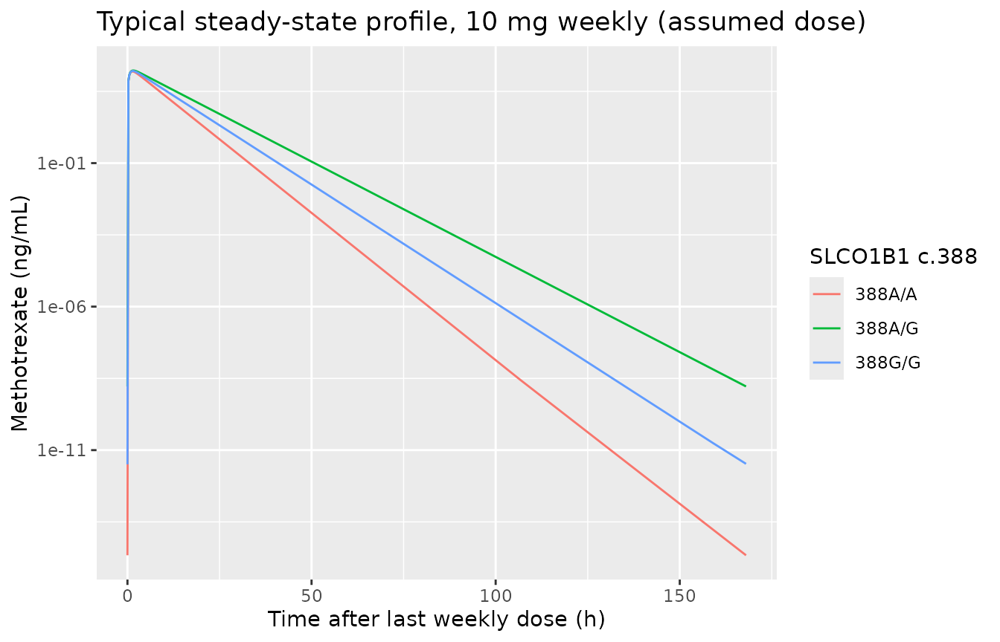
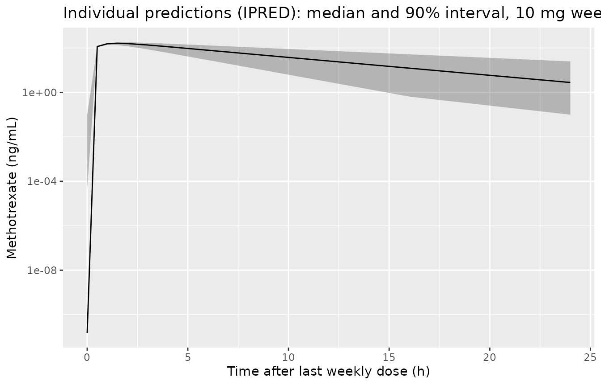

# Methotrexate (Wang 2019)

## Model and source

- Citation: Wang Z, Zhang N, Chen C, Chen S, Xu J, Zhou Y, Zhao X, Cui Y
  (2019). Influence of the OATP Polymorphism on the Population
  Pharmacokinetics of Methotrexate in Chinese Patients. Curr Drug Metab
  20(7):592-600. <doi:10.2174/1389200220666190701094756>.
- Description: One-compartment population PK model with first-order
  absorption and linear elimination for low-dose oral methotrexate in
  Chinese adults with rheumatoid arthritis (Wang 2019; n = 71 patients,
  85 mostly trough concentrations). Clearance depends on the SLCO1B1
  (OATP1B1) c.388A\>G (rs2306283) genotype through multiplicative
  factors for the 388A/G heterozygote and 388G/G homozygote relative to
  388A/A. Volume, absorption rate and bioavailability are fixed.
  Exponential between-subject variability on clearance only, and
  combined proportional plus additive residual error.
- Article: [Curr Drug Metab
  2019;20(7):592-600](https://doi.org/10.2174/1389200220666190701094756)
  (open access via
  [PMC6857112](https://www.ncbi.nlm.nih.gov/pmc/articles/PMC6857112/))

Wang 2019 is a small NONMEM analysis of low-dose oral methotrexate in
Chinese adults with rheumatoid arthritis, aimed at the effect of hepatic
uptake transporter (OATP1B1 / OATP1B3) polymorphisms on apparent
clearance. The final model is one-compartment with first-order
absorption; only the SLCO1B1 c.388A\>G (rs2306283) genotype survived
backward deletion as a covariate on clearance.

**Read the “Assumptions, deviations and errata” section before using
this model.** The final-model equation as printed in the paper is not
the model the table parameters describe, and the dose regimen of the
cohort is not reported.

## Population

71 patients with rheumatoid arthritis treated with low-dose methotrexate
at Peking University First Hospital contributed 85 concentrations, most
of them trough samples (Section 3.1 and Discussion). Table 1 reports
body weight 59.4 (SD 10.7) kg, age 48.0 (SD 15.2) years, height 1.61 (SD
0.06) m and BSA 1.6 (SD 0.16) m^2, and prints sex as ‘GEND(Male/Female)
60/11’. SLCO1B1 rs2306283 genotypes were GG 43, AG 22 and AA 6 (Table 2;
Table 1 prints 42/23/6). Concentrations were measured by LC-MS with an
LLOQ of 0.5 ng/mL (Section 2.2).

## Source trace

| Element | Value | Source |
|----|----|----|
| Structure | 1-compartment, first-order absorption and elimination | Abstract; Section 2.4; Discussion |
| `lcl` (388A/A) | 7.75 L/h | Table 3, theta1 |
| `lvc` | 32.8 L (FIX) | Table 3, theta2; final-model equation |
| `lka` | 1.69 1/h (FIX) | Table 3, theta3 (unit printed ‘h/L’); final-model equation |
| `lfdepot` | 0.704 (FIX) | Table 3, theta4; final-model equation |
| `e_snp_slco1b1_rs2306283_hom_cl` (388G/G) | 0.805 | Table 3, theta5; equation ‘RS230 = 1’ |
| `e_snp_slco1b1_rs2306283_het_cl` (388A/G) | 0.647 | Table 3, theta6; equation ‘RS230 = 2’ |
| `etalcl` | 0.167 (FIX, variance) | Table 3, omega CL |
| `propSd` | sqrt(0.713) | Table 3, sigma1 (pro) |
| `addSd` | sqrt(2.83) ng/mL | Table 3, sigma2 (add) |
| Genotype coding | RS230: 1 = G/G, 2 = A/G, 3 = A/A | Abstract; Section 3.3 equation |
| IIV form | P = PTV x exp(eta) | Equation 1 |

## Typical clearance by genotype

``` r

mod <- readModelDb("Wang_2019_methotrexate")
ui <- rxode2::rxode(mod)
#> ℹ parameter labels from comments will be replaced by 'label()'
th <- ui$theta

geno <- tibble::tibble(
  genotype = c("388A/A", "388A/G", "388G/G"),
  SNP_SLCO1B1_RS2306283_HET = c(0, 1, 0),
  SNP_SLCO1B1_RS2306283_HOM = c(0, 0, 1),
  n_cohort = c(6, 22, 43)
) |>
  mutate(
    cl = exp(th[["lcl"]]) *
      th[["e_snp_slco1b1_rs2306283_het_cl"]]^SNP_SLCO1B1_RS2306283_HET *
      th[["e_snp_slco1b1_rs2306283_hom_cl"]]^SNP_SLCO1B1_RS2306283_HOM,
    pct_vs_AA = 100 * (cl / cl[1] - 1)
  )
knitr::kable(geno |> dplyr::select(genotype, n_cohort, cl, pct_vs_AA), digits = 2)
```

| genotype | n_cohort |   cl | pct_vs_AA |
|:---------|---------:|-----:|----------:|
| 388A/A   |        6 | 7.75 |       0.0 |
| 388A/G   |       22 | 5.01 |     -35.3 |
| 388G/G   |       43 | 6.24 |     -19.5 |

Two independent statements in the paper check this parameterisation:

- The **base model** (no covariates) estimated a population CL/F of 5.98
  L/h (Section 3.2). Weighting the final-model genotype clearances by
  the Table 2 genotype counts gives the cohort-average clearance, which
  should land close to that value.
- The **Discussion** states that CL/F ‘diminished by 32.3% in patients
  carrying the OATP1B1-388AG and 17.8% in patients carrying the
  OATP1B1-388GG genotypes’ compared with 388AA.

``` r

cl_mix <- with(geno, sum(cl * n_cohort) / sum(n_cohort))
cl_mix
#> [1] 5.987039
stopifnot(
  abs(cl_mix / 5.98 - 1) < 0.03,
  # Direction and ordering of the Discussion's quoted reductions:
  geno$pct_vs_AA[2] < geno$pct_vs_AA[3],
  geno$pct_vs_AA[3] < 0,
  abs(geno$pct_vs_AA[2] - (-32.3)) < 4,
  abs(geno$pct_vs_AA[3] - (-17.8)) < 4
)
```

The genotype-weighted clearance is 5.99 L/h against the base model’s
5.98 L/h, and the modelled reductions (-35.3% for A/G, -19.5% for G/G)
reproduce the Discussion’s -32.3% / -17.8% to within about 3 percentage
points. The literal printed equation (see Errata) predicts reductions of
only -5.7% and -3.2% and a cohort-average clearance near 8.8 L/h, and
fails both checks.

## Simulation

The paper does not report the dose. The simulations below assume **10 mg
oral once weekly**, a typical low-dose RA regimen, to steady state (6
weeks); this is an illustration of the model, not a reproduction of the
study design.

``` r

dose_mg <- 10
tau <- 168
n_dose <- 6
t_last <- (n_dose - 1) * tau

ev_typ <- geno |>
  mutate(id = seq_len(n())) |>
  select(id, genotype, starts_with("SNP_")) |>
  tidyr::crossing(
    bind_rows(
      tibble::tibble(time = (0:(n_dose - 1)) * tau, amt = dose_mg, evid = 1, cmt = "depot"),
      tibble::tibble(time = t_last + c(0, seq(0.25, tau, by = 0.25)), amt = 0, evid = 0, cmt = "central")
    )
  ) |>
  arrange(id, time, desc(evid)) |>
  as.data.frame()

sim_typ <- rxode2::rxSolve(rxode2::zeroRe(mod), ev_typ, keep = "genotype") |>
  as.data.frame()
#> ℹ parameter labels from comments will be replaced by 'label()'
#> ℹ omega/sigma items treated as zero: 'etalcl'
#> Warning: multi-subject simulation without without 'omega'

ggplot(filter(sim_typ, time >= t_last), aes(time - t_last, Cc, colour = genotype)) +
  geom_line() +
  scale_y_log10() +
  labs(
    x = "Time after last weekly dose (h)", y = "Methotrexate (ng/mL)",
    colour = "SLCO1B1 c.388",
    title = "Typical steady-state profile, 10 mg weekly (assumed dose)"
  )
```



### Stochastic cohort

``` r

set.seed(2019)
rxode2::rxSetSeed(2019)
n_sub <- 150
cohort <- tibble::tibble(
  id = seq_len(n_sub),
  genotype = sample(c("388A/A", "388A/G", "388G/G"), n_sub, replace = TRUE, prob = c(6, 22, 43))
) |>
  mutate(
    SNP_SLCO1B1_RS2306283_HET = as.numeric(genotype == "388A/G"),
    SNP_SLCO1B1_RS2306283_HOM = as.numeric(genotype == "388G/G")
  )
ev_vpc <- cohort |>
  tidyr::crossing(
    bind_rows(
      tibble::tibble(time = (0:(n_dose - 1)) * tau, amt = dose_mg, evid = 1, cmt = "depot"),
      tibble::tibble(time = t_last + c(0, 0.5, 1, 1.5, 2, 3, 4, 6, 8, 12, 16, 24), amt = 0, evid = 0, cmt = "central")
    )
  ) |>
  arrange(id, time, desc(evid)) |>
  as.data.frame()
sim_vpc <- rxode2::rxSolve(mod, ev_vpc, keep = "genotype") |> as.data.frame()
#> ℹ parameter labels from comments will be replaced by 'label()'

sim_vpc |>
  filter(time >= t_last) |>
  group_by(tad = time - t_last) |>
  summarise(
    p05 = quantile(Cc, 0.05), p50 = median(Cc), p95 = quantile(Cc, 0.95),
    .groups = "drop"
  ) |>
  ggplot(aes(tad, p50)) +
  geom_ribbon(aes(ymin = pmax(p05, 0.1), ymax = p95), alpha = 0.3) +
  geom_line() +
  scale_y_log10() +
  labs(
    x = "Time after last weekly dose (h)", y = "Methotrexate (ng/mL)",
    title = "Individual predictions (IPRED): median and 90% interval, 10 mg weekly (assumed dose)"
  )
```



The paper publishes goodness-of-fit plots only (Figs 1-4), with observed
concentrations mostly below 20 ng/mL and population predictions up to
about 250 ng/mL (Fig 3). A 10 mg dose predicts a typical peak of roughly
155-170 ng/mL across genotypes, compatible with that range; no VPC was
published to compare against.

## PKNCA validation

The paper reports no NCA. The check is instead against the model’s own
closed form: at steady state the dosing-interval AUC equals
`F x Dose / CL`, exactly, for every genotype.

``` r

conc_df <- sim_typ |>
  filter(time >= t_last, !is.na(Cc)) |>
  mutate(tad = time - t_last) |>
  select(id, genotype, time = tad, Cc)
dose_df <- tibble::tibble(id = geno |> mutate(id = seq_len(n())) |> pull(id), genotype = geno$genotype, time = 0, amt = dose_mg)

conc_obj <- PKNCA::PKNCAconc(conc_df, Cc ~ time | genotype + id)
dose_obj <- PKNCA::PKNCAdose(dose_df, amt ~ time | genotype + id)
intervals <- data.frame(start = 0, end = tau, auclast = TRUE, cmax = TRUE, tmax = TRUE, half.life = TRUE)
nca <- PKNCA::pk.nca(PKNCA::PKNCAdata(conc_obj, dose_obj, intervals = intervals))

nca_wide <- as.data.frame(nca$result) |>
  select(genotype, PPTESTCD, PPORRES) |>
  tidyr::pivot_wider(names_from = PPTESTCD, values_from = PPORRES) |>
  left_join(geno |> select(genotype, cl), by = "genotype") |>
  mutate(
    auc_closed = 1000 * exp(th[["lfdepot"]]) * dose_mg / cl, # ng h/mL
    pct_diff = 100 * (auclast / auc_closed - 1)
  )
nca_wide |>
  select(genotype, cmax, tmax, half.life, auclast, auc_closed, pct_diff) |>
  dplyr::rename(
    "SLCO1B1 c.388" = genotype, "Cmax (ng/mL)" = cmax, "Tmax (h)" = tmax,
    "t1/2 (h)" = half.life, "AUCtau PKNCA (ng h/mL)" = auclast,
    "AUCtau = F x Dose / CL (ng h/mL)" = auc_closed, "% diff" = pct_diff
  ) |>
  knitr::kable(digits = 2)
```

| SLCO1B1 c.388 | Cmax (ng/mL) | Tmax (h) | t1/2 (h) | AUCtau PKNCA (ng h/mL) | AUCtau = F x Dose / CL (ng h/mL) | % diff |
|:---|---:|---:|---:|---:|---:|---:|
| 388A/A | 155.53 | 1.25 | 2.96 | 906.33 | 908.39 | -0.23 |
| 388A/G | 168.92 | 1.50 | 4.53 | 1401.99 | 1404.00 | -0.14 |
| 388G/G | 162.65 | 1.50 | 3.65 | 1126.40 | 1128.43 | -0.18 |

``` r

stopifnot(all(abs(nca_wide$pct_diff) < 1))
```

PKNCA reproduces the closed-form AUC to under 1% for every genotype (a
deterministic typical-value solve, so a tight bound is appropriate), and
the terminal half-life equals `log(2) x V / CL` (2.93 / 4.53 / 3.64 h).

## Assumptions, deviations and errata

- **Final-model clearance equation.** Section 3.3 prints
  `RS230 = 1 : CL = 7.75 x e^(0.167 x 0.805)`,
  `RS230 = 2 : ... e^(0.167 x 0.647)` and
  `RS230 = 3 : ... e^(0.167 x 1)`, where 0.167 is the omega of CL and
  0.805 / 0.647 are theta5 / theta6. Read literally this puts the IIV
  variance inside the typical value and makes the genotype effect tiny
  (-3% / -6%). It is encoded instead as
  `CL = theta1 x theta_genotype x exp(eta_CL)`, the usual NONMEM
  multiplicative categorical form, because (a) the genotype-weighted
  clearance then matches the base-model CL/F of 5.98 L/h, and (b) the
  resulting -35% / -19% reductions match the Discussion’s quoted -32.3%
  / -17.8% far better than the literal reading’s -6% / -3%. The residual
  gap of about 3 points to the Discussion’s numbers is not explained by
  the paper (the bootstrap medians 0.589 / 0.760 give larger, not
  smaller, reductions).
- **Abstract equation is a different model.** The Abstract prints
  `CL (L/h) = 8.25 x e^(0.167 x SNP)` with SNP = 1, 2, 3 for G/G, A/G,
  A/A. It matches neither Table 3 nor the Section 3.3 equation, and is
  not used.
- **F = 0.704 applied.** Table 3 and the final-model equation both list
  F = 0.704 FIX alongside parameters labelled CL/F and V/F. F is applied
  to the depot here, as printed, so `cl` and `vc` carry the Table 3
  values; the apparent oral clearance of this implementation is
  therefore `cl / 0.704`. The source of the fixed V, Ka and F values is
  not cited in the paper.
- **Ka unit.** Table 3 prints ‘Ka (h/L)’; the abstract and the model
  structure make it 1/h.
- **Residual and IIV scale.** Table 3 gives bare numbers. The sigma rows
  are treated as NONMEM `$SIGMA` variances: their bootstrap 95% CI
  relative widths (0.69 for proportional, 0.93 for additive, on 85
  observations) match the variance prediction (about 0.60) and not the
  SD prediction (about 0.30). An additive SD of 2.83 ng/mL would also be
  large next to observations mostly below 5 ng/mL (Figs 1-2). omega CL =
  0.167 is taken as a variance by the same NONMEM convention (CV about
  43%); it is FIXED in the paper and no source is given. Section 2.4
  says the residual model is proportional; Table 3 estimates both a
  proportional and an additive term, and both are encoded.
- **Additive-error units.** Assumed ng/mL, the assay’s reporting unit
  (Section 2.2); the model outputs `Cc` in ng/mL from mg doses and L
  volumes.
- **IIV on V, Ka, F** are ‘0 FIX’ in Table 3 and are omitted.
- **Dose regimen.** Not reported. The 10 mg weekly regimen in the
  simulations is an assumption for illustration only.
- **Sex split.** Table 1 prints ‘GEND(Male/Female) 60/11’; `population`
  follows the print, but a predominantly male RA cohort is unusual and
  the columns may be transposed.
- **Genotype counts.** Table 1 (42/23/6) and Table 2 (43/22/6) differ by
  one subject between G/G and A/G; Table 2 is used for the cohort
  weighting.
