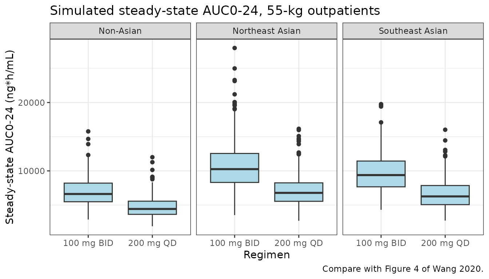
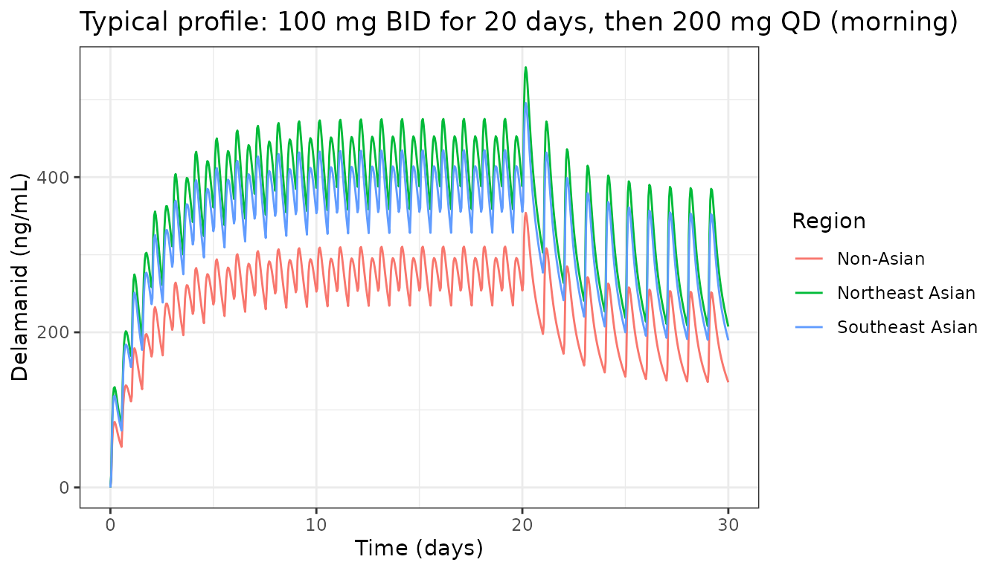

# Delamanid (Wang 2020)

``` r

library(nlmixr2lib)
library(PKNCA)
#> 
#> Attaching package: 'PKNCA'
#> The following object is masked from 'package:stats':
#> 
#>     filter
library(rxode2)
#> rxode2 5.1.8 using 2 threads (see ?getRxThreads)
#>   no cache: create with `rxCreateCache()`
library(dplyr)
#> 
#> Attaching package: 'dplyr'
#> The following objects are masked from 'package:stats':
#> 
#>     filter, lag
#> The following objects are masked from 'package:base':
#> 
#>     intersect, setdiff, setequal, union
library(tidyr)
library(ggplot2)
```

## Model and source

- Citation: Wang X, Mallikaarjun S, Gibiansky E. Population
  Pharmacokinetic Analysis of Delamanid in Patients with Pulmonary
  Multidrug-Resistant Tuberculosis. Antimicrob Agents Chemother.
  2020;65(1):e01202-20. <doi:10.1128/AAC.01202-20>
- Description: Two-compartment population PK model for oral delamanid in
  adults with pulmonary multidrug-resistant tuberculosis (Wang 2020):
  first-order absorption with lag time, morning doses (dosed into depot)
  and evening doses (dosed into depot2) with separate absorption rate
  constants, lag times and relative bioavailability, and relative
  bioavailability that also falls with dose and depends on inpatient
  versus outpatient setting and enrollment region.
- Article: <https://doi.org/10.1128/AAC.01202-20> (open access)

Wang et al. pooled 20,483 plasma delamanid concentrations from 744
patients with pulmonary multidrug-resistant tuberculosis (MDR-TB)
enrolled in three phase II trials (242-07-204, 242-07-208, 242-08-210)
and the phase III trial 242-09-213. Delamanid was described by a
two-compartment model with first-order absorption and elimination and an
absorption lag time. Every dose condition the authors examined acts on
absorption: the morning and evening doses of a twice-daily regimen have
their own absorption rate constant, lag time and relative
bioavailability (in the packaged model, morning doses go into `depot`
and evening doses into `depot2`), and relative bioavailability also
falls with dose and differs between inpatient and outpatient settings
and between enrollment regions. Weight and sex act on the volumes;
hypoalbuminemia and efavirenz raise apparent clearance.

``` r

mod <- readModelDb("Wang_2020_delamanid")
ui <- rxode2::rxode(mod)
#> ℹ parameter labels from comments will be replaced by 'label()'
```

## Population

The analysis population (Table 2) was 744 adults aged 18 to 64 years
(median 33), weighing 27 to 99.6 kg (median 55 kg), 69.5% male. 40.5%
were Asian (26.9% enrolled in Southeast Asia, i.e. the Philippines;
13.3% in Northeast Asia, i.e. China, Japan or Korea), 23.8% White, 6.9%
Black and 28.9% other. 70.4% had MDR-TB, 16.8% pre-XDR-TB and 12.8%
XDR-TB; 4.2% were HIV-positive and 3.0% received efavirenz. Baseline
serum albumin was below 3.4 g/dL in 27.2% and below 2.8 g/dL in 8.7%.
Doses were 100, 200, 250 and 300 mg twice daily and 200 mg once daily in
the morning, always with food (Table 1).

``` r

str(ui$population)
#> List of 17
#>  $ species        : chr "human"
#>  $ n_subjects     : num 744
#>  $ n_studies      : num 4
#>  $ n_observations : num 20483
#>  $ age_range      : chr "18-64 years"
#>  $ age_median     : chr "33 years"
#>  $ weight_range   : chr "27-99.6 kg"
#>  $ weight_median  : chr "55 kg"
#>  $ sex_female_pct : num 30.5
#>  $ race_ethnicity : Named num [1:4] 40.5 23.8 6.9 28.9
#>   ..- attr(*, "names")= chr [1:4] "Asian" "White" "Black" "Other"
#>  $ disease_state  : chr "Pulmonary multidrug-resistant tuberculosis (70.4% MDR-TB, 16.8% pre-XDR-TB, 12.8% XDR-TB); 4.2% HIV-coinfected"
#>  $ dose_range     : chr "100 mg BID, 200 mg BID, 250 mg BID, 300 mg BID and 200 mg QD (morning) orally with food, for 8 to 28 weeks"
#>  $ regions        : chr "Asia (Philippines, China, Japan, Korea), Peru and other global sites"
#>  $ renal_function : chr "15.3% CKD stage II and 1.6% CKD stage III by MDRD"
#>  $ hypoalbuminemia: chr "27.2% baseline albumin < 3.4 g/dL; 8.7% < 2.8 g/dL"
#>  $ co_medication  : chr "Optimized background regimen in all but 10 patients (Table 3); efavirenz 3.0%, lamivudine 3.1%, tenofovir 2.2%"
#>  $ notes          : chr "Pooled phase II trials 242-07-204, 242-07-208 and 242-08-210 and phase III trial 242-09-213 (Table 1). Baseline"| __truncated__
```

## Source trace

Every [`ini()`](https://nlmixr2.github.io/rxode2/reference/ini.html)
value carries an in-file comment pointing at its source in
`inst/modeldb/specificDrugs/Wang_2020_delamanid.R`. All values come from
Table 4 (final model) unless stated.

| Equation / parameter | Value | Source location |
|----|----|----|
| `lcl` (CL/F) | log(37.1 L/h) | Table 4, theta1 |
| `lvc` (V2/F at 55 kg) | log(655 L) | Table 4, theta2 |
| `lq` (Q/F) | log(104 L/h) | Table 4, theta3 |
| `lvp` (V3/F, 55-kg male) | log(870 L) | Table 4, theta4 |
| `lka_am` / `lka_pm` | log(0.397) / log(0.248) 1/h | Table 4, theta5 / theta9 |
| `ltlag_am` / `ltlag_pm` | log(0.825) / log(1.38) h | Table 4, theta6 / theta10 |
| `lfdepot` | fixed log(1) | Results: F1 reference is a 100-mg morning inpatient dose in a non-Asian patient; Figure 1B |
| `e_dose200_f` | 0.760 | Table 4, theta7 |
| `e_dosegt200_f` | 0.580 | Table 4, theta8 |
| `e_dosetime_evening_f` | 1.26 | Table 4, theta11 |
| `e_outpatient_f` | 1.09 | Table 4, theta12 |
| `e_wt_vc_vp` | 0.316 | Table 4, theta13 (one exponent shared by V2/F and V3/F) |
| `e_sexf_vp` | 1.65 | Table 4, theta14 |
| `e_region_eastasia_f` | 1.53 | Table 4, theta15 |
| `e_region_southeastasia_f` | 1.40 | Table 4, theta16 |
| `e_alb_cl` | -0.892 | Table 4, theta17; functional form in footnote b |
| `e_conmed_efv_cl` | 1.35 | Table 4, theta18 |
| `etalcl`, `etalvp`, `etalka_am`, `etalfdepot`, `etalq`, `etalka_pm` | 0.056, 0.152, 0.517, 0.0344, 0.456, 0.343 | Table 4, OMEGA(1,1) to OMEGA(6,6); diagonal |
| `propSd` / `propSd_t208` | sqrt(0.0715) / sqrt(0.174) | Table 4, SIGMA(1,1) / SIGMA(2,2) |
| `addSd` / `addSd_t213` | sqrt(2.39) / sqrt(1950) ng/mL | Table 4, SIGMA(4,4) / SIGMA(3,3) |
| Log-normal IIV, `P = P_typ * exp(eta)` | – | Methods, Stage 1 |
| `C = Chat * (1 + w_pr * eps1) + w_add * eps2` | – | Methods, Stage 1 |
| Power covariate model `(COV / COV_REF)^theta`, WT reference 55 kg | – | Methods; Figure 1 legend (typical 55-kg patient) |
| `IALB = min(ALB / 3.4, 1)` with ALB in g/dL | – | Table 4 footnote b |
| Covariate reference: 100-mg morning inpatient dose, non-Asian, male, 55 kg, ALB \>= 3.4 g/dL, no efavirenz | – | Results; Figure 1 legend |

## Covariate effects (Figure 1)

Figure 1 displays each covariate effect as a ratio to the reference
patient. The typical-value model is solved once per scenario below and
the parameter ratios are read from the solved model rather than
recomputed from the estimates, so this exercises the albumin unit
conversion and cap, the weight scaling and the bioavailability
multipliers as coded.

``` r

mod_typ <- rxode2::zeroRe(mod)
#> ℹ parameter labels from comments will be replaced by 'label()'
#> Warning: No sigma parameters in the model

ref_cov <- data.frame(
  WT = 55, SEXF = 0, ALB = 40, CONMED_EFV = 0,
  DOSE_DELAMANID_MG = 100, OUTPATIENT = 0,
  REGION_EASTASIA = 0, REGION_SOUTHEASTASIA = 0,
  STUDY_242_07_208 = 0, STUDY_242_09_213 = 0
)

fig1_scen <- bind_rows(
  mutate(ref_cov, scenario = "Reference"),
  mutate(ref_cov, scenario = "ALB = 2.8 g/dL", ALB = 28),
  mutate(ref_cov, scenario = "ALB = 2.0 g/dL", ALB = 20),
  mutate(ref_cov, scenario = "ALB = 4.5 g/dL", ALB = 45),
  mutate(ref_cov, scenario = "Efavirenz", CONMED_EFV = 1),
  mutate(ref_cov, scenario = "200 mg dose", DOSE_DELAMANID_MG = 200),
  mutate(ref_cov, scenario = ">200 mg dose", DOSE_DELAMANID_MG = 300),
  mutate(ref_cov, scenario = "Outpatient", OUTPATIENT = 1),
  mutate(ref_cov, scenario = "NE Asian", REGION_EASTASIA = 1),
  mutate(ref_cov, scenario = "SE Asian", REGION_SOUTHEASTASIA = 1),
  mutate(ref_cov, scenario = "WT = 40 kg", WT = 40),
  mutate(ref_cov, scenario = "WT = 75 kg", WT = 75),
  mutate(ref_cov, scenario = "WT = 90 kg", WT = 90),
  mutate(ref_cov, scenario = "Female", SEXF = 1)
) |>
  mutate(id = row_number(), time = 0, evid = 0, amt = 0, cmt = "central") |>
  relocate(id, time, evid, amt, cmt)

fig1_sol <- as.data.frame(rxode2::rxSolve(mod_typ, fig1_scen, returnType = "data.frame"))
#> ℹ omega/sigma items treated as zero: 'etalcl', 'etalvp', 'etalka_am', 'etalfdepot', 'etalq', 'etalka_pm'
#> Warning: multi-subject simulation without without 'omega'
if (is.null(fig1_sol$id)) fig1_sol$id <- 1L
fig1_sol$scenario <- fig1_scen$scenario[fig1_sol$id]
ref_row <- fig1_sol[fig1_sol$scenario == "Reference", ]

fig1_tab <- fig1_sol |>
  transmute(
    scenario,
    `CL/F ratio` = cl / ref_row$cl,
    `F1 ratio` = fdepot / ref_row$fdepot,
    `Evening F1 ratio` = fdepot2 / ref_row$fdepot,
    `V2/F ratio` = vc / ref_row$vc,
    `V3/F ratio` = vp / ref_row$vp
  )
knitr::kable(fig1_tab, digits = 3, caption = "Typical-value parameter ratios to the Figure 1 reference patient.")
```

| scenario       | CL/F ratio | F1 ratio | Evening F1 ratio | V2/F ratio | V3/F ratio |
|:---------------|-----------:|---------:|-----------------:|-----------:|-----------:|
| Reference      |      1.000 |     1.00 |            1.260 |      1.000 |      1.000 |
| ALB = 2.8 g/dL |      1.189 |     1.00 |            1.260 |      1.000 |      1.000 |
| ALB = 2.0 g/dL |      1.605 |     1.00 |            1.260 |      1.000 |      1.000 |
| ALB = 4.5 g/dL |      1.000 |     1.00 |            1.260 |      1.000 |      1.000 |
| Efavirenz      |      1.350 |     1.00 |            1.260 |      1.000 |      1.000 |
| 200 mg dose    |      1.000 |     0.76 |            0.958 |      1.000 |      1.000 |
| \>200 mg dose  |      1.000 |     0.58 |            0.731 |      1.000 |      1.000 |
| Outpatient     |      1.000 |     1.09 |            1.373 |      1.000 |      1.000 |
| NE Asian       |      1.000 |     1.53 |            1.928 |      1.000 |      1.000 |
| SE Asian       |      1.000 |     1.40 |            1.764 |      1.000 |      1.000 |
| WT = 40 kg     |      1.000 |     1.00 |            1.260 |      0.904 |      0.904 |
| WT = 75 kg     |      1.000 |     1.00 |            1.260 |      1.103 |      1.103 |
| WT = 90 kg     |      1.000 |     1.00 |            1.260 |      1.168 |      1.168 |
| Female         |      1.000 |     1.00 |            1.260 |      1.000 |      1.650 |

Typical-value parameter ratios to the Figure 1 reference patient.
{.table}

``` r

# Deterministic: typical values on both sides and no RNG, so a tight bound is
# correct. Each expected value is written from Table 4 directly.
r <- setNames(fig1_tab$`CL/F ratio`, fig1_tab$scenario)
f <- setNames(fig1_tab$`F1 ratio`, fig1_tab$scenario)
f_pm <- setNames(fig1_tab$`Evening F1 ratio`, fig1_tab$scenario)
v2 <- setNames(fig1_tab$`V2/F ratio`, fig1_tab$scenario)
v3 <- setNames(fig1_tab$`V3/F ratio`, fig1_tab$scenario)
stopifnot(
  abs(r[["ALB = 2.8 g/dL"]] - (2.8 / 3.4)^-0.892) < 1e-6,
  abs(r[["ALB = 2.0 g/dL"]] - (2.0 / 3.4)^-0.892) < 1e-6,
  abs(r[["ALB = 4.5 g/dL"]] - 1) < 1e-6, # no effect above 3.4 g/dL
  abs(r[["Efavirenz"]] - 1.35) < 1e-6,
  abs(f[["200 mg dose"]] - 0.76) < 1e-6,
  abs(f[[">200 mg dose"]] - 0.58) < 1e-6,
  abs(f_pm[["Reference"]] - 1.26) < 1e-6,
  abs(f_pm[["Outpatient"]] - 1.26 * 1.09) < 1e-6,
  abs(f[["Outpatient"]] - 1.09) < 1e-6,
  abs(f[["NE Asian"]] - 1.53) < 1e-6,
  abs(f[["SE Asian"]] - 1.40) < 1e-6,
  abs(v2[["WT = 90 kg"]] - (90 / 55)^0.316) < 1e-6,
  abs(v3[["WT = 40 kg"]] - (40 / 55)^0.316) < 1e-6,
  abs(v3[["Female"]] - 1.65) < 1e-6,
  abs(v2[["Female"]] - 1) < 1e-6
)
```

The Figure 1 panel A marker for albumin 2.0 g/dL sits near 1.6 and the
weight markers at 40, 75 and 90 kg near 0.90, 1.10 and 1.17, matching
the table above. The Results text states that CL/F “was higher by about
22%” at albumin 2.8 g/dL; the Table 4 exponent gives 18.9% and the
Figure 1 marker sits at about 1.19, so the text figure appears to be
rounded from a different calculation. The model uses the Table 4
estimate.

## Closed-form check: Table 5 mean steady-state AUC

Table 5 lists the mean steady-state AUC0-24 for 55-kg outpatients
without hypoalbuminemia or efavirenz, simulated with interindividual but
not residual variability. For a linear model at steady state, AUC0-24 =
(daily bioavailable dose) / CL for each patient, and with log-normal IIV
the mean over patients is the typical value multiplied by
`exp(omega_F1^2 / 2 + omega_CL^2 / 2)`. Sex does not enter AUC in this
model (it acts only on V3/F), so each male/female pair in Table 5 is two
independent 2,000-patient estimates of the same quantity.

``` r

table5 <- tribble(
  ~regimen, ~region, ~sex, ~cmax, ~auclast,
  "100 mg BID", "Non-Asian", "Male", 333, 6863,
  "100 mg BID", "Non-Asian", "Female", 334, 6879,
  "100 mg BID", "Northeast Asian", "Male", 516, 10673,
  "100 mg BID", "Northeast Asian", "Female", 511, 10488,
  "100 mg BID", "Southeast Asian", "Male", 474, 9812,
  "100 mg BID", "Southeast Asian", "Female", 464, 9551,
  "200 mg QD", "Non-Asian", "Male", 258, 4625,
  "200 mg QD", "Non-Asian", "Female", 263, 4665,
  "200 mg QD", "Northeast Asian", "Male", 400, 7194,
  "200 mg QD", "Northeast Asian", "Female", 400, 7116,
  "200 mg QD", "Southeast Asian", "Male", 366, 6611,
  "200 mg QD", "Southeast Asian", "Female", 364, 6479
)

th <- ui$theta
om <- diag(ui$omega)
region_f <- c(
  "Non-Asian" = 1,
  "Northeast Asian" = th[["e_region_eastasia_f"]],
  "Southeast Asian" = th[["e_region_southeastasia_f"]]
)
iiv_mean <- exp(om[["etalfdepot"]] / 2 + om[["etalcl"]] / 2)

closed <- table5 |>
  mutate(
    daily_bioavail_mg = ifelse(
      regimen == "100 mg BID",
      100 * (1 + th[["e_dosetime_evening_f"]]),
      200 * th[["e_dose200_f"]]
    ) * th[["e_outpatient_f"]] * region_f[region],
    auc_model = 1000 * daily_bioavail_mg / exp(th[["lcl"]]) * iiv_mean,
    pct_diff = 100 * (auc_model / auclast - 1)
  )

closed |>
  select(regimen, region, sex, auclast, auc_model, pct_diff) |>
  dplyr::rename(
    Regimen = regimen, Region = region, Sex = sex,
    "Table 5 mean AUC0-24 (ng*h/mL)" = auclast,
    "Closed-form mean AUC0-24 (ng*h/mL)" = auc_model,
    "% difference" = pct_diff
  ) |>
  knitr::kable(digits = 1, caption = "Closed-form mean steady-state AUC0-24 versus Table 5.")
```

| Regimen | Region | Sex | Table 5 mean AUC0-24 (ng\*h/mL) | Closed-form mean AUC0-24 (ng\*h/mL) | % difference |
|:---|:---|:---|---:|---:|---:|
| 100 mg BID | Non-Asian | Male | 6863 | 6946.9 | 1.2 |
| 100 mg BID | Non-Asian | Female | 6879 | 6946.9 | 1.0 |
| 100 mg BID | Northeast Asian | Male | 10673 | 10628.8 | -0.4 |
| 100 mg BID | Northeast Asian | Female | 10488 | 10628.8 | 1.3 |
| 100 mg BID | Southeast Asian | Male | 9812 | 9725.7 | -0.9 |
| 100 mg BID | Southeast Asian | Female | 9551 | 9725.7 | 1.8 |
| 200 mg QD | Non-Asian | Male | 4625 | 4672.3 | 1.0 |
| 200 mg QD | Non-Asian | Female | 4665 | 4672.3 | 0.2 |
| 200 mg QD | Northeast Asian | Male | 7194 | 7148.5 | -0.6 |
| 200 mg QD | Northeast Asian | Female | 7116 | 7148.5 | 0.5 |
| 200 mg QD | Southeast Asian | Male | 6611 | 6541.2 | -1.1 |
| 200 mg QD | Southeast Asian | Female | 6479 | 6541.2 | 1.0 |

Closed-form mean steady-state AUC0-24 versus Table 5. {.table}

``` r

# Deterministic model side; the Table 5 side carries Monte Carlo error from
# 2,000 simulated patients (about 0.7% standard error on a mean with a 31%
# CV). A transcription error in CL/F, a relative-bioavailability factor or the
# evening-dose multiplier moves these by 9% or more.
stopifnot(all(abs(closed$pct_diff) < 5))
```

All twelve rows agree within 1.8%, which confirms the
relative-bioavailability reference (100-mg morning inpatient dose), the
outpatient and region multipliers, the 1.26-fold evening-dose factor and
the 0.76 factor for the 200-mg dose.

## Simulated steady state (Table 5 and Figure 4)

A virtual cohort of 200 patients per Table 5 row is simulated with
interindividual variability and without residual error, as in the paper:
55 kg, albumin 4.0 g/dL (not hypoalbuminemic), no efavirenz, outpatient
setting. Twice-daily doses are 12 hours apart, the first of each day
being the morning dose; once-daily doses are morning doses.
Concentrations are recorded every hour on day 1 and on day 20, matching
the paper’s hourly simulation grid.

``` r

n_per_group <- 200
tau_day <- 24
n_days <- 20

groups <- table5 |>
  select(regimen, region, sex) |>
  mutate(group = row_number())

subjects <- groups[rep(seq_len(nrow(groups)), each = n_per_group), ] |>
  mutate(
    id = row_number(),
    WT = 55,
    SEXF = as.integer(sex == "Female"),
    ALB = 40,
    CONMED_EFV = 0,
    OUTPATIENT = 1,
    REGION_EASTASIA = as.integer(region == "Northeast Asian"),
    REGION_SOUTHEASTASIA = as.integer(region == "Southeast Asian"),
    STUDY_242_07_208 = 0,
    STUDY_242_09_213 = 0
  )

dose_rows <- bind_rows(
  subjects |>
    filter(regimen == "100 mg BID") |>
    tidyr::crossing(day = seq_len(n_days) - 1, evening = c(0L, 1L)) |>
    mutate(time = day * tau_day + 12 * evening, amt = 100, cmt = ifelse(evening == 1L, "depot2", "depot")),
  subjects |>
    filter(regimen == "200 mg QD") |>
    tidyr::crossing(day = seq_len(n_days) - 1) |>
    mutate(time = day * tau_day, evening = 0L, amt = 200, cmt = "depot")
) |>
  mutate(evid = 1L, DOSE_DELAMANID_MG = amt) |>
  select(-day, -evening)

obs_times <- c(0:24, (n_days - 1) * tau_day + 0:24)
obs_rows <- subjects |>
  tidyr::crossing(time = obs_times) |>
  mutate(evid = 0L, cmt = "central", amt = 0)

# DOSE_DELAMANID_MG is a property of the dose record (it sets that dose's
# relative bioavailability); observation rows carry the value of the most
# recent dose so the column has no gaps.
events <- bind_rows(obs_rows, dose_rows) |>
  arrange(id, time, desc(evid == 0L)) |>
  group_by(id) |>
  tidyr::fill(DOSE_DELAMANID_MG, .direction = "downup") |>
  ungroup() |>
  select(
    id, time, evid, amt, cmt, WT, SEXF, ALB, CONMED_EFV, OUTPATIENT,
    REGION_EASTASIA, REGION_SOUTHEASTASIA, STUDY_242_07_208,
    STUDY_242_09_213, DOSE_DELAMANID_MG
  )
```

``` r

rxode2::rxSetSeed(20201216)
mod_nores <- rxode2::zeroRe(mod, which = "sigma")
#> ℹ parameter labels from comments will be replaced by 'label()'
#> Warning: No sigma parameters in the model
sim <- as.data.frame(rxode2::rxSolve(
  mod_nores, events,
  returnType = "data.frame", covsInterpolation = "locf"
))
sim <- sim |>
  left_join(subjects |> select(id, group, regimen, region, sex), by = "id") |>
  mutate(treatment = paste(regimen, region, sex, sep = " / "))
```

### PKNCA

``` r

ss_start <- (n_days - 1) * tau_day
conc_df <- sim |>
  dplyr::filter(!is.na(Cc)) |>
  select(id, time, Cc, treatment, regimen, region, sex)
dose_df <- events |>
  dplyr::filter(evid == 1) |>
  left_join(subjects |> select(id, regimen, region, sex), by = "id") |>
  mutate(treatment = paste(regimen, region, sex, sep = " / ")) |>
  select(id, time, amt, treatment)

conc_obj <- PKNCA::PKNCAconc(
  conc_df, Cc ~ time | treatment + id,
  concu = "ng/mL", timeu = "h"
)
dose_obj <- PKNCA::PKNCAdose(
  dose_df, amt ~ time | treatment + id,
  doseu = "mg"
)
intervals <- data.frame(
  start = c(0, ss_start),
  end = c(tau_day, ss_start + tau_day),
  cmax = c(TRUE, TRUE),
  auclast = c(TRUE, TRUE)
)
nca_res <- PKNCA::pk.nca(PKNCA::PKNCAdata(conc_obj, dose_obj, intervals = intervals))
nca_df <- as.data.frame(nca_res)
```

``` r

ss_means <- nca_df |>
  dplyr::filter(start == ss_start, PPTESTCD %in% c("cmax", "auclast")) |>
  group_by(treatment, PPTESTCD) |>
  summarise(PPORRES = mean(PPORRES), .groups = "drop")

reference <- table5 |>
  mutate(treatment = paste(regimen, region, sex, sep = " / ")) |>
  select(treatment, cmax, auclast)

cmp <- nlmixr2lib::ncaComparisonTable(
  simulated = ss_means,
  reference = reference,
  by = "treatment",
  units = c(cmax = "ng/mL", auclast = "ng*h/mL"),
  tolerance_pct = 10
)
knitr::kable(
  cmp,
  caption = paste(
    "Mean steady-state (day 20) Cmax and AUC0-24 by Table 5 group: 200",
    "simulated patients per group versus the paper's 2,000."
  )
)
```

| NCA parameter | treatment | Reference | Simulated | % diff |
|:---|:---|:---|:---|:---|
| Cmax (ng/mL) | 100 mg BID / Non-Asian / Male | 333 | 325 | -2.3% |
| Cmax (ng/mL) | 100 mg BID / Non-Asian / Female | 334 | 342 | +2.5% |
| Cmax (ng/mL) | 100 mg BID / Northeast Asian / Male | 516 | 522 | +1.1% |
| Cmax (ng/mL) | 100 mg BID / Northeast Asian / Female | 511 | 506 | -1.1% |
| Cmax (ng/mL) | 100 mg BID / Southeast Asian / Male | 474 | 464 | -2.2% |
| Cmax (ng/mL) | 100 mg BID / Southeast Asian / Female | 464 | 475 | +2.4% |
| Cmax (ng/mL) | 200 mg QD / Non-Asian / Male | 258 | 263 | +2.1% |
| Cmax (ng/mL) | 200 mg QD / Non-Asian / Female | 263 | 258 | -1.9% |
| Cmax (ng/mL) | 200 mg QD / Northeast Asian / Male | 400 | 405 | +1.3% |
| Cmax (ng/mL) | 200 mg QD / Northeast Asian / Female | 400 | 389 | -2.9% |
| Cmax (ng/mL) | 200 mg QD / Southeast Asian / Male | 366 | 374 | +2.2% |
| Cmax (ng/mL) | 200 mg QD / Southeast Asian / Female | 364 | 358 | -1.6% |
| AUClast (ng\*h/mL) | 100 mg BID / Non-Asian / Male | 6860 | 6790 | -1.1% |
| AUClast (ng\*h/mL) | 100 mg BID / Non-Asian / Female | 6880 | 7160 | +4.0% |
| AUClast (ng\*h/mL) | 100 mg BID / Northeast Asian / Male | 10700 | 10900 | +2.0% |
| AUClast (ng\*h/mL) | 100 mg BID / Northeast Asian / Female | 10500 | 10500 | +0.1% |
| AUClast (ng\*h/mL) | 100 mg BID / Southeast Asian / Male | 9810 | 9640 | -1.8% |
| AUClast (ng\*h/mL) | 100 mg BID / Southeast Asian / Female | 9550 | 9880 | +3.4% |
| AUClast (ng\*h/mL) | 200 mg QD / Non-Asian / Male | 4620 | 4730 | +2.2% |
| AUClast (ng\*h/mL) | 200 mg QD / Non-Asian / Female | 4660 | 4600 | -1.4% |
| AUClast (ng\*h/mL) | 200 mg QD / Northeast Asian / Male | 7190 | 7260 | +1.0% |
| AUClast (ng\*h/mL) | 200 mg QD / Northeast Asian / Female | 7120 | 6990 | -1.8% |
| AUClast (ng\*h/mL) | 200 mg QD / Southeast Asian / Male | 6610 | 6820 | +3.1% |
| AUClast (ng\*h/mL) | 200 mg QD / Southeast Asian / Female | 6480 | 6420 | -1.0% |

Mean steady-state (day 20) Cmax and AUC0-24 by Table 5 group: 200
simulated patients per group versus the paper’s 2,000. {.table
style="width:100%;"}

`auclast` here is the AUC over the day-20 24-hour interval, the quantity
Table 5 labels AUC0-24.

``` r

pct <- ss_means |>
  inner_join(
    reference |> tidyr::pivot_longer(-treatment, names_to = "PPTESTCD", values_to = "ref"),
    by = c("treatment", "PPTESTCD")
  ) |>
  mutate(pct_diff = 100 * (PPORRES / ref - 1))
# Each simulated mean carries about 2% Monte Carlo error (200 patients, ~30%
# CV); the paper's about 0.7%. Assert on the centre and on the envelope.
stopifnot(
  nrow(pct) == 24,
  abs(median(pct$pct_diff)) < 5,
  max(abs(pct$pct_diff)) < 12
)
```

### Accumulation ratio

The paper reports that the ratio of steady-state AUC0-24 to day-1
AUC0-24 for 100 mg twice daily was 3.1 to 3.4 across subpopulations. In
the cohort below the ratio of mean AUCs is somewhat higher, because
patients in the slow tails of the absorption and distribution IIV
accumulate more than the typical patient; the typical-value ratio is
checked against the paper’s range in the typical-profile section further
down.

``` r

acc <- nca_df |>
  dplyr::filter(PPTESTCD == "auclast") |>
  mutate(day = ifelse(start == 0, "day1", "ss")) |>
  select(id, treatment, day, PPORRES) |>
  tidyr::pivot_wider(names_from = day, values_from = PPORRES) |>
  left_join(subjects |> select(id, regimen, region), by = "id") |>
  dplyr::filter(regimen == "100 mg BID") |>
  group_by(region) |>
  summarise(
    `Ratio of mean AUC0-24` = mean(ss) / mean(day1),
    `Median individual ratio` = stats::median(ss / day1),
    .groups = "drop"
  )
knitr::kable(acc, digits = 2, caption = "Accumulation ratio (AUC0-24 on day 20 / AUC0-24 on day 1), 100 mg BID, simulated cohort.")
```

| region          | Ratio of mean AUC0-24 | Median individual ratio |
|:----------------|----------------------:|------------------------:|
| Non-Asian       |                  3.49 |                    3.43 |
| Northeast Asian |                  3.50 |                    3.41 |
| Southeast Asian |                  3.51 |                    3.42 |

Accumulation ratio (AUC0-24 on day 20 / AUC0-24 on day 1), 100 mg BID,
simulated cohort. {.table}

``` r

# Accumulation is set by disposition and absorption rate, common to the three
# regions; a centre-of-distribution check with room for cohort noise.
stopifnot(all(acc$`Median individual ratio` > 3 & acc$`Median individual ratio` < 3.8))
```

### Implementation identity

For each simulated patient on 100 mg twice daily, the steady-state AUC
over the day must equal the bioavailable daily dose divided by that
patient’s clearance. The check uses the patient’s own `cl`, `fdepot`
(morning) and `fdepot2` (evening) read from the solve, so it exercises
the two depots with their own lag times, absorption rate constants and
bioavailability.

``` r

indiv <- sim |>
  dplyr::filter(regimen == "100 mg BID", time >= ss_start) |>
  group_by(id) |>
  summarise(
    cl = first(cl),
    f_am = first(fdepot),
    f_pm = first(fdepot2),
    .groups = "drop"
  ) |>
  inner_join(
    nca_df |> dplyr::filter(start == ss_start, PPTESTCD == "auclast") |> select(id, auc = PPORRES),
    by = "id"
  ) |>
  mutate(ratio = auc * cl / (1000 * 100 * (f_am + f_pm)))
summary(indiv$ratio)
#>    Min. 1st Qu.  Median    Mean 3rd Qu.    Max. 
#>  0.8631  0.9985  0.9999  0.9972  1.0001  1.0035
# The trapezoidal AUC on an hourly grid slightly overstates or understates
# a sharp absorption peak for patients with a fast ka, so assert on the centre
# and a robust envelope rather than on every patient.
stopifnot(
  nrow(indiv) == 6 * n_per_group,
  abs(stats::median(indiv$ratio) - 1) < 0.01,
  stats::quantile(abs(indiv$ratio - 1), 0.9) < 0.03
)
```

### Figure 4

Figure 4 of the paper shows boxplots of steady-state AUC0-24 for 100 mg
twice daily versus 200 mg once daily. In the published figure all nine
panels look identical even though Table 5 and the region effects imply
40-53% higher exposure in the Asian panels, so the figure is not used as
a numerical target; the plot below shows the simulated distributions by
region.

``` r

nca_df |>
  dplyr::filter(start == ss_start, PPTESTCD == "auclast") |>
  left_join(subjects |> select(id, regimen, region), by = "id") |>
  ggplot(aes(regimen, PPORRES)) +
  geom_boxplot(fill = "lightblue") +
  facet_wrap(~region) +
  labs(
    x = "Regimen", y = "Steady-state AUC0-24 (ng*h/mL)",
    title = "Simulated steady-state AUC0-24, 55-kg outpatients",
    caption = "Compare with Figure 4 of Wang 2020."
  ) +
  theme_bw()
```



### Typical concentration-time profile

The model application in the paper switched from 100 mg twice daily for
20 days to 200 mg once daily in the morning. The typical-value profile
for a 55-kg male outpatient in each region is shown below.

``` r

typ_subj <- tibble(
  region = c("Non-Asian", "Northeast Asian", "Southeast Asian"),
  id = 1:3
)
typ_dose <- bind_rows(
  tidyr::crossing(typ_subj, day = 0:19, evening = c(0L, 1L)) |>
    mutate(time = day * 24 + 12 * evening, amt = 100, cmt = ifelse(evening == 1L, "depot2", "depot")),
  tidyr::crossing(typ_subj, day = 20:29) |>
    mutate(time = day * 24, evening = 0L, amt = 200, cmt = "depot")
) |>
  mutate(evid = 1L, DOSE_DELAMANID_MG = amt) |>
  select(-day, -evening)
typ_obs <- tidyr::crossing(typ_subj, time = seq(0, 30 * 24, by = 1)) |>
  mutate(evid = 0L, cmt = "central", amt = 0)
typ_events <- bind_rows(typ_obs, typ_dose) |>
  arrange(id, time, desc(evid == 0L)) |>
  group_by(id) |>
  tidyr::fill(DOSE_DELAMANID_MG, .direction = "downup") |>
  ungroup() |>
  mutate(
    WT = 55, SEXF = 0, ALB = 40, CONMED_EFV = 0, OUTPATIENT = 1,
    REGION_EASTASIA = as.integer(region == "Northeast Asian"),
    REGION_SOUTHEASTASIA = as.integer(region == "Southeast Asian"),
    STUDY_242_07_208 = 0, STUDY_242_09_213 = 0
  ) |>
  select(
    id, time, evid, amt, cmt, WT, SEXF, ALB, CONMED_EFV, OUTPATIENT,
    REGION_EASTASIA, REGION_SOUTHEASTASIA, STUDY_242_07_208,
    STUDY_242_09_213, DOSE_DELAMANID_MG
  )
typ_sim <- as.data.frame(rxode2::rxSolve(
  mod_typ, typ_events,
  returnType = "data.frame", covsInterpolation = "locf"
)) |>
  left_join(typ_subj, by = "id")
#> ℹ omega/sigma items treated as zero: 'etalcl', 'etalvp', 'etalka_am', 'etalfdepot', 'etalq', 'etalka_pm'
#> Warning: multi-subject simulation without without 'omega'

ggplot(typ_sim, aes(time / 24, Cc, colour = region)) +
  geom_line() +
  labs(
    x = "Time (days)", y = "Delamanid (ng/mL)", colour = "Region",
    title = "Typical profile: 100 mg BID for 20 days, then 200 mg QD (morning)"
  ) +
  theme_bw()
```



``` r

auc_window <- function(d, lo, hi) {
  d <- d[d$time >= lo & d$time <= hi, ]
  sum(diff(d$time) * (head(d$Cc, -1) + tail(d$Cc, -1)) / 2)
}
typ_na <- typ_sim[typ_sim$region == "Non-Asian", ]
acc_typ <- auc_window(typ_na, 456, 480) / auc_window(typ_na, 0, 24)
acc_typ
#> [1] 3.198938
# Deterministic typical-value solve; the paper's reported range is 3.1 to 3.4.
stopifnot(acc_typ > 3.1, acc_typ < 3.4)
```

The typical patient’s accumulation ratio for 100 mg twice daily is 3.20,
inside the 3.1 to 3.4 range the paper reports.

## Assumptions and deviations

- **Morning and evening doses.** The paper estimates separate absorption
  rate constants (each with its own IIV), lag times and relative
  bioavailability for morning and evening doses but does not print its
  control stream. The model gives each its own depot: morning doses go
  into `depot`, evening doses into `depot2`, so every dose is absorbed
  with the rate constant, lag time and bioavailability of its own dosing
  time. If the original analysis instead switched the rate constant of a
  single depot with a morning/evening flag, the two forms differ only
  while one dose is still being absorbed when the next is given, and not
  at all in AUC. The maintainers chose separate depots because a flag
  that drives a lag time must be read at the dose record, and rxode2
  does not reliably read a time-varying covariate that sets `alag()`
  from the dose record itself.
- **Dose-level bioavailability.** Table 4 gives relative bioavailability
  for the 200-mg dose and for doses above 200 mg against the 100-mg
  reference. The model applies the 200-mg value to any dose above 100 mg
  up to 200 mg. Only 100, 200, 250 and 300 mg were studied, so
  intermediate doses are an extrapolation.
- **Weight reference.** The Methods describe a normalised power model
  without printing the reference weight. 55 kg, the population median
  (Table 2) and the weight of the Figure 1 typical patient, is used; the
  Figure 1 weight markers reproduce `(WT / 55)^0.316`.
- **Albumin units.** The canonical `ALB` column is in g/L; the model
  divides by 10 to reach the g/dL scale of the published effect. Albumin
  is the baseline value in the source analysis.
- **Enrollment region.** “Northeast Asian” (China, Japan, Korea) and
  “Southeast Asian” (the Philippines) are regions of enrollment among
  Asian patients (Table 2). They are carried as `REGION_EASTASIA` and
  `REGION_SOUTHEASTASIA`; Asian patients enrolled in Peru belong to the
  non-Asian reference.
- **Residual error.** The combined error model has independent
  proportional and additive terms (Methods equation), with a larger
  proportional SD in trial 242-07-208 and a larger additive SD in trial
  242-09-213 (Table 4). Table 4 reports variances; their square roots
  are used.
- **Results text versus Table 4.** The Results state that CL/F is about
  22% higher at albumin 2.8 g/dL; Table 4 gives 18.9% and Figure 1
  agrees with Table 4. The model uses Table 4.
- **Figure 4.** The nine published panels appear identical and do not
  show the region effects that Table 5 reports; Table 5 is used as the
  numerical target.
