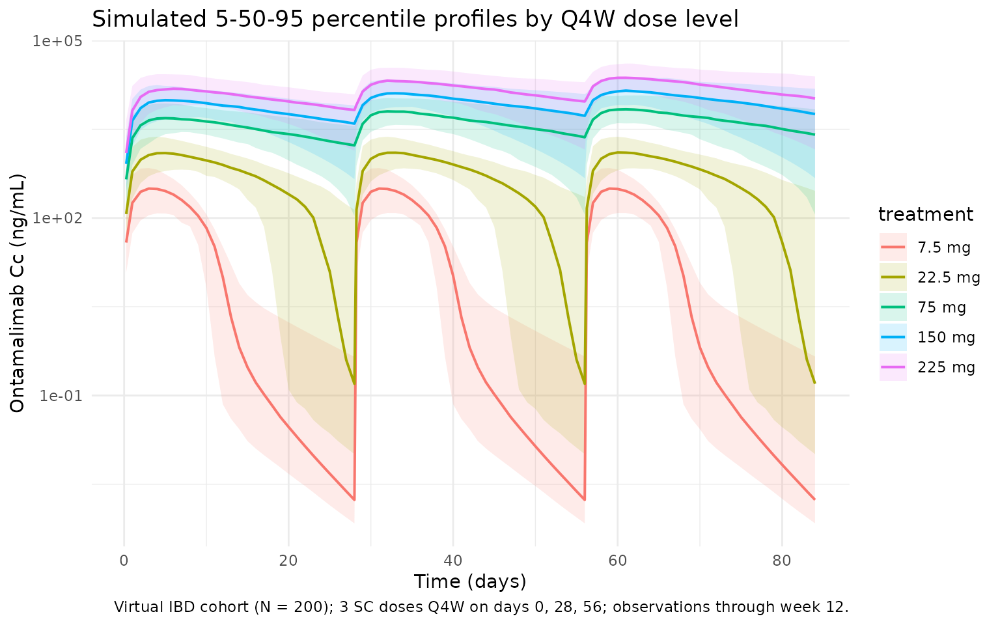

# Wang_2020_ontamalimab

## Model and source

- Citation: Wang Y, Marier J-F, Kassir N, Chabot JR, Smith B, Cao C,
  Lewis L, Dorner AJ, Padula SJ, Banfield C. Population Pharmacokinetics
  and Pharmacodynamics of Ontamalimab (SHP647), a Fully Human Monoclonal
  Antibody Against Mucosal Addressin Cell Adhesion Molecule-1
  (MAdCAM-1), in Patients With Ulcerative Colitis or Crohn’s Disease. J
  Clin Pharmacol. 2020 Jul;60(7):903-914. <doi:10.1002/jcph.1590>
- Description: Two-compartment population PK model for ontamalimab
  (SHP647), a fully human IgG2 anti-MAdCAM-1 monoclonal antibody, in
  adults with moderate-to-severe ulcerative colitis or Crohn’s disease
  (Wang 2020), with first-order SC absorption, absorption lag time,
  parallel linear and Michaelis-Menten elimination from the central
  compartment, and allometric weight scaling on CL, Vc, CLd, Vp, and
  Vmax.
- Article: [J Clin Pharmacol.
  2020;60(7):903-914](https://doi.org/10.1002/jcph.1590) (open access
  via [PMC7383906](https://pmc.ncbi.nlm.nih.gov/articles/PMC7383906/))

## Population

Wang 2020 pooled two phase 2 induction studies — OPERA (NCT01276509) in
Crohn’s disease (CD) and TURANDOT (NCT01620255) in ulcerative colitis
(UC) — into a population PK dataset of 440 adults with
moderate-to-severe IBD who had failed or were intolerant to
immunosuppressants and/or anti-TNF agents. Patients received 3 SC doses
of ontamalimab (7.5, 22.5, 75, or 225 mg, with TURANDOT also including a
7.5 mg arm) at days 1, 28, and 56 of a 12-week treatment period; 2138
ontamalimab concentration measurements entered the analysis (9.4% below
the 10 ng/mL LLOQ were treated as missing).

Baseline demographics from Table 1: median age 37 years (range 18-68),
51.1% female, median body weight 68.8 kg (range 35.6-155), 86.1% White /
10.0% Asian / 3.9% other, median baseline serum albumin 39 g/L (range
23-49), median baseline CRP 0.837 mg/dL (range 0.01-18). Disease split:
191 (43.4%) CD and 249 (56.6%) UC.

The same information is available programmatically via
`readModelDb("Wang_2020_ontamalimab")$population`.

## Source trace

Every structural parameter, covariate effect, IIV element, and
residual-error term below is taken from Wang 2020 Table 2. The reference
covariate values (Table 2 footnote) are a 70 kg patient with UC or CD,
baseline albumin 39 g/L, and baseline CRP 0.837 mg/dL.

| Equation / parameter                                               | Value (paper unit)          | Value (model unit, time = day, conc = mg/L) | Source location                              |
|--------------------------------------------------------------------|-----------------------------|---------------------------------------------|----------------------------------------------|
| `lka` (Ka)                                                         | 0.0187 1/h                  | `log(0.0187 * 24)` 1/day                    | Table 2, Ka row                              |
| `ltlag` (Lag)                                                      | 2.61 h                      | `log(2.61 / 24)` day                        | Table 2, Lag row                             |
| `lcl` (CL/F)                                                       | 0.0127 L/h                  | `log(0.0127 * 24)` L/day                    | Table 2, CL/F row                            |
| `lvc` (Vc/F)                                                       | 6.53 L                      | `log(6.53)` L                               | Table 2, Vc/F row                            |
| `lcld` (CLd/F)                                                     | 0.000345 L/h                | `log(0.000345 * 24)` L/day                  | Table 2, CLd/F row                           |
| `lvp` (Vp/F)                                                       | 0.0216 L                    | `log(0.0216)` L                             | Table 2, Vp/F row                            |
| `lvmax` (Vmax/F)                                                   | 5.87 µg/h                   | `log(5.87 * 24 / 1000)` mg/day              | Table 2, Vmax/F row                          |
| `lkm` (Km)                                                         | 19.0 ng/mL                  | `log(19.0 / 1000)` mg/L                     | Table 2, Km row                              |
| `e_wt_cl` (WT/70 exponent on CL/F)                                 | 0.0034                      | 0.0034                                      | Table 2, CL/F covariate equation             |
| `e_wt_vc` (WT/70 exponent on Vc/F)                                 | 0.635                       | 0.635                                       | Table 2, Vc/F covariate equation             |
| `e_wt_cld` (WT/70 exponent on CLd/F)                               | 0.0034                      | 0.0034                                      | Table 2, CLd/F covariate equation            |
| `e_wt_vp` (WT/70 exponent on Vp/F)                                 | 0.635                       | 0.635                                       | Table 2, Vp/F covariate equation             |
| `e_wt_vmax` (WT/70 exponent on Vmax/F)                             | 1.89                        | 1.89                                        | Table 2, Vmax/F covariate equation           |
| `e_alb_cl` (ALB/39 exponent on CL/F)                               | -0.889                      | -0.889                                      | Table 2, CL/F covariate equation             |
| `e_crp_cl` (CRP/0.837 exponent on CL/F)                            | 0.147                       | 0.147                                       | Table 2, CL/F covariate equation             |
| `var(etalka)`                                                      | `log(0.618^2 + 1) = 0.3232` | same                                        | Table 2: Ka BSV 61.8% CV                     |
| `var(etalcl)`                                                      | `log(0.546^2 + 1) = 0.2611` | same                                        | Table 2: CL/F BSV 54.6% CV                   |
| `var(etalvc)`                                                      | `log(0.410^2 + 1) = 0.1554` | same                                        | Table 2: Vc/F BSV 41.0% CV                   |
| `addSd`                                                            | 166 ng/mL                   | 0.166 mg/L                                  | Table 2: additive residual                   |
| `propSd`                                                           | 19.6%                       | 0.196                                       | Table 2: proportional residual               |
| Structure (2-cmt + first-order SC + lag + linear + MM elimination) | n/a                         | n/a                                         | Methods “Population PK Analysis” and Table 2 |

### Parameterization notes

- **Parallel linear and Michaelis-Menten elimination.** Wang 2020
  parameterizes total clearance as the sum of first-order linear
  apparent clearance (CL/F) and saturable Michaelis-Menten elimination
  with apparent parameters Vmax/F (mass per time) and Km. The ODE is
  implemented explicitly because `linCmt()` does not support nonlinear
  elimination.
- **CV% to log-normal variance.** Wang 2020 Table 2 reports
  between-subject variability as CV% on the linear-parameter scale. The
  nlmixr2 convention is log-normal IIV on the log-transformed parameter;
  the conversion `omega^2 = log(CV^2 + 1)` is applied in
  [`ini()`](https://nlmixr2.github.io/rxode2/reference/ini.html). The
  paper does not report off-diagonal correlations, so the IIVs on Ka,
  CL/F, and Vc/F are coded as independent.
- **Unit conversions.** The paper reports rates in 1/h, clearances in
  L/h, Vmax/F in µg/h, Km in ng/mL, lag in h, and concentrations in
  ng/mL. The model uses the nlmixr2lib convention (time = day, dose =
  mg, concentration = mg/L). Conversions: 1/h × 24 = 1/day, L/h × 24 =
  L/day, h / 24 = day, µg/h × 24 / 1000 = mg/day, ng/mL / 1000 = mg/L.
- **Allometric weight scaling.** Body weight is applied as a power
  effect to five parameters (CL, Vc, CLd, Vp, Vmax). Note the small CL
  and CLd exponents (~0.003) and the larger Vmax exponent (1.89); these
  are the estimated values in Table 2 rather than fixed allometric
  exponents.
- **CRP unit (mg/dL, not the canonical mg/L).** Wang 2020 reports CRP in
  mg/dL with reference 0.837 mg/dL (overall median). The canonical `CRP`
  covariate column in nlmixr2lib is documented in mg/L, but per-model
  units are honored: `covariateData[[CRP]]$units = "mg/dL"` here. Users
  supplying CRP in mg/L should divide by 10 before passing the column to
  this model (or use `CRP_mgL / 10` directly).
- **Vp/F is small (0.0216 L).** The published peripheral apparent volume
  is small relative to Vc/F (6.53 L). The corresponding
  alpha-distribution half-life is approximately 1.8 days at the
  reference covariate values while the apparent terminal half-life is
  approximately 14.9 days, both consistent with the paper’s reported
  dose-dependent half-lives of 12.3-18.6 days at the 22.5-225 mg Q4W
  dose levels (Methods “Population PK Analysis”). The value was verified
  against the original PMC XML to rule out a parsing artifact.
- **Lag time.** First-order SC absorption with a 2.61 h absorption lag
  is applied via `alag(depot)`.

## Virtual cohort

The simulations below use a virtual cohort whose covariate distributions
approximate the Wang 2020 Table 1 demographics. No subject-level
observed data were released with the paper.

``` r
set.seed(20260425)
n_subj <- 200

# Body weight: log-normal with median 68.8 kg and a spread that matches
# the 95% CI 45-116 kg in Table 1; truncated to the observed range.
# Albumin and CRP: log-normal with parameters set so the simulated medians
# and 95% CI roughly match Table 1 (ALB median 39 g/L, 95% CI 29-47;
# CRP median 0.837 mg/dL, 95% CI 0.030-8.83).
cohort <- tibble::tibble(
  id  = seq_len(n_subj),
  WT  = pmin(pmax(rlnorm(n_subj, log(68.8), 0.24),  35,  155)),
  ALB = pmin(pmax(rlnorm(n_subj, log(39),  0.12),   23,  49)),
  CRP = pmin(pmax(rlnorm(n_subj, log(0.837), 1.18), 0.01, 18))
)
```

The dosing simulation reproduces the Wang 2020 phase 2 induction
regimen: 3 SC doses Q4W on days 1, 28, and 56, with observations through
week 12 (day 84). Five dose arms (7.5, 22.5, 75, 150, 225 mg Q4W) are
simulated to match Table 3 of the paper.

``` r
tau    <- 28L                       # Q4W dosing interval (days)
n_dose <- 3L                        # day 1, day 29, day 57 in 1-indexed; here day 0, 28, 56
dose_days <- seq(0, tau * (n_dose - 1), by = tau)
end_day   <- tau * n_dose            # day 84 = end of week 12

build_events <- function(cohort, dose_amt, treatment) {
  ev_dose <- cohort |>
    tidyr::crossing(time = dose_days) |>
    dplyr::mutate(amt = dose_amt, cmt = "depot", evid = 1L,
                  treatment = treatment)
  obs_times <- sort(unique(c(
    seq(0, end_day, by = 1),                    # daily through week 12
    dose_days + 0.25, dose_days + 1, dose_days + 3, dose_days + 7
  )))
  ev_obs <- cohort |>
    tidyr::crossing(time = obs_times) |>
    dplyr::mutate(amt = 0, cmt = NA_character_, evid = 0L,
                  treatment = treatment)
  dplyr::bind_rows(ev_dose, ev_obs) |>
    dplyr::arrange(id, time, dplyr::desc(evid)) |>
    dplyr::select(id, time, amt, cmt, evid, treatment, WT, ALB, CRP)
}

doses <- c("7p5mg_Q4W"   = 7.5,
           "22p5mg_Q4W"  = 22.5,
           "75mg_Q4W"    = 75,
           "150mg_Q4W"   = 150,
           "225mg_Q4W"   = 225)

events <- dplyr::bind_rows(
  lapply(seq_along(doses), function(i) {
    build_events(cohort, doses[[i]], names(doses)[i])
  })
)
```

## Simulation

``` r
mod <- rxode2::rxode2(readModelDb("Wang_2020_ontamalimab"))
keep_cols <- c("WT", "ALB", "CRP", "treatment")

sim <- lapply(split(events, events$treatment), function(ev) {
  out <- rxode2::rxSolve(mod, events = ev, keep = keep_cols)
  as.data.frame(out)
}) |> dplyr::bind_rows()
```

## Replicate published figures

### Concentration-time profile by dose level

Wang 2020 Figure 1 (top panel) shows the observed individual
concentration- time profiles of ontamalimab over the 12-week treatment
period. The block below reproduces the dose-dependent shape with
simulated 5th/50th/95th percentile bands across all five dose arms.

``` r
vpc <- sim |>
  dplyr::filter(!is.na(Cc), time > 0, time <= end_day) |>
  dplyr::group_by(treatment, time) |>
  dplyr::summarise(
    Q05 = quantile(Cc, 0.05, na.rm = TRUE),
    Q50 = quantile(Cc, 0.50, na.rm = TRUE),
    Q95 = quantile(Cc, 0.95, na.rm = TRUE),
    .groups = "drop"
  ) |>
  dplyr::mutate(treatment = factor(treatment,
    levels = c("7p5mg_Q4W", "22p5mg_Q4W", "75mg_Q4W", "150mg_Q4W", "225mg_Q4W"),
    labels = c("7.5 mg", "22.5 mg", "75 mg", "150 mg", "225 mg")
  ))

ggplot(vpc, aes(time, Q50 * 1000, colour = treatment, fill = treatment)) +
  geom_ribbon(aes(ymin = Q05 * 1000, ymax = Q95 * 1000), alpha = 0.15, colour = NA) +
  geom_line(linewidth = 0.7) +
  scale_y_log10() +
  labs(
    x = "Time (days)",
    y = "Ontamalimab Cc (ng/mL)",
    title = "Simulated 5-50-95 percentile profiles by Q4W dose level",
    caption = "Virtual IBD cohort (N = 200); 3 SC doses Q4W on days 0, 28, 56; observations through week 12."
  ) +
  theme_minimal()
```



## PKNCA validation

Non-compartmental analysis is computed over the dose-3 interval (day 56
to day 84 = week 12), matching the window in which Wang 2020 Table 3
reports the geometric-mean Cave, Cmax, and Cmin “at week 12”.
Concentrations are expressed in ng/mL to match the published table.

``` r
ss_start <- tau * (n_dose - 1)    # day 56
ss_end   <- ss_start + tau        # day 84

nca_conc <- sim |>
  dplyr::filter(time >= ss_start, time <= ss_end, !is.na(Cc)) |>
  dplyr::mutate(time_nom = time - ss_start, Cc_ng = Cc * 1000) |>
  dplyr::select(id, time = time_nom, Cc = Cc_ng, treatment)

nca_dose <- dplyr::bind_rows(
  lapply(seq_along(doses), function(i) {
    cohort |> dplyr::mutate(time = 0, amt = doses[[i]], treatment = names(doses)[i])
  })
) |>
  dplyr::select(id, time, amt, treatment)

conc_obj <- PKNCA::PKNCAconc(nca_conc, Cc ~ time | treatment + id)
dose_obj <- PKNCA::PKNCAdose(nca_dose, amt ~ time | treatment + id)

intervals <- data.frame(
  start   = 0,
  end     = tau,
  cmax    = TRUE,
  cmin    = TRUE,
  tmax    = TRUE,
  auclast = TRUE,
  cav     = TRUE
)

nca_res <- PKNCA::pk.nca(PKNCA::PKNCAdata(conc_obj, dose_obj, intervals = intervals))
#>  ■■■■■■                            17% |  ETA:  5s
#>  ■■■■■■■■■■■■■■■■■■■■              64% |  ETA:  2s
summary(nca_res)
#>  start end  treatment   N       auclast         cmax           cmin
#>      0  28  150mg_Q4W 200 283000 [47.4] 14900 [34.2]    3160 [1010]
#>      0  28  225mg_Q4W 200 466000 [43.3] 23800 [32.8]     7010 [213]
#>      0  28 22p5mg_Q4W 200  17800 [32.6]  1340 [38.5]  0.633 [71800]
#>      0  28   75mg_Q4W 200 135000 [44.9]  7150 [35.4]    1340 [1030]
#>      0  28  7p5mg_Q4W 200   2150 [44.4]   308 [57.5] 0.00508 [1110]
#>               tmax          cav
#>  5.00 [2.00, 13.0] 10100 [47.4]
#>  5.00 [2.00, 17.0] 16600 [43.3]
#>  5.00 [2.00, 10.0]   636 [32.6]
#>  5.00 [2.00, 12.0]  4810 [44.9]
#>  4.00 [1.00, 5.00]  76.7 [44.4]
#> 
#> Caption: auclast, cmax, cmin, cav: geometric mean and geometric coefficient of variation; tmax: median and range; N: number of subjects
```

### Comparison against published Table 3 exposures

Wang 2020 Table 3 reports the geometric-mean Cave, Cmax, and Cmin “at
week 12” for the 5 simulated Q4W dose levels. The block below extracts
the geometric mean of the simulated dose-3 cycle across the 200 subjects
in the virtual cohort and lays it side-by-side with the published
values.

``` r
gmean <- function(x) exp(mean(log(pmax(x, .Machine$double.eps))))

per_subject <- nca_conc |>
  dplyr::group_by(treatment, id) |>
  dplyr::summarise(
    Cmax = max(Cc),
    Cmin = Cc[which.max(time)],
    Cave = sum(diff(time) * (head(Cc, -1) + tail(Cc, -1)) / 2) / tau,
    .groups = "drop"
  )

sim_summary <- per_subject |>
  dplyr::group_by(treatment) |>
  dplyr::summarise(
    Cmax_sim = gmean(Cmax),
    Cmin_sim = gmean(pmax(Cmin, 0.001)),
    Cave_sim = gmean(Cave),
    .groups = "drop"
  )

# Wang 2020 Table 3 published geometric means at week 12 (ng/mL)
published <- tibble::tribble(
  ~treatment,    ~Dose, ~Cave_pub, ~Cmax_pub, ~Cmin_pub,
  "7p5mg_Q4W",     7.5,       461,       986,      2.13,
  "22p5mg_Q4W",   22.5,      1930,      3300,       304,
  "75mg_Q4W",       75,      8160,     12000,      3670,
  "150mg_Q4W",     150,     11500,     17400,      5190,
  "225mg_Q4W",     225,     27700,     38100,     14600
)

comparison <- published |>
  dplyr::left_join(sim_summary, by = "treatment") |>
  dplyr::mutate(
    Cave_pct_diff = 100 * (Cave_sim - Cave_pub) / Cave_pub,
    Cmax_pct_diff = 100 * (Cmax_sim - Cmax_pub) / Cmax_pub,
    Cmin_pct_diff = 100 * (Cmin_sim - Cmin_pub) / Cmin_pub
  ) |>
  dplyr::select(treatment, Dose,
                Cave_pub, Cave_sim, Cave_pct_diff,
                Cmax_pub, Cmax_sim, Cmax_pct_diff,
                Cmin_pub, Cmin_sim, Cmin_pct_diff)

knitr::kable(comparison, digits = c(0, 1, 0, 0, 1, 0, 0, 1, 1, 1, 1),
  caption = paste("Geometric-mean exposures at week 12 (dose-3 cycle, ng/mL)",
                  "vs. Wang 2020 Table 3. Differences > ~20% are expected for",
                  "the 7.5 and 22.5 mg arms, where MM elimination dominates",
                  "and Cmin is highly sensitive to virtual-cohort covariate",
                  "distributions; see Assumptions and deviations."))
```

| treatment  |  Dose | Cave_pub | Cave_sim | Cave_pct_diff | Cmax_pub | Cmax_sim | Cmax_pct_diff | Cmin_pub | Cmin_sim | Cmin_pct_diff |
|:-----------|------:|---------:|---------:|--------------:|---------:|---------:|--------------:|---------:|---------:|--------------:|
| 7p5mg_Q4W  |   7.5 |      461 |       77 |         -83.3 |      986 |      308 |         -68.8 |      2.1 |      0.0 |         -99.7 |
| 22p5mg_Q4W |  22.5 |     1930 |      637 |         -67.0 |     3300 |     1342 |         -59.3 |    304.0 |      0.7 |         -99.8 |
| 75mg_Q4W   |  75.0 |     8160 |     4809 |         -41.1 |    12000 |     7154 |         -40.4 |   3670.0 |   1498.0 |         -59.2 |
| 150mg_Q4W  | 150.0 |    11500 |    10099 |         -12.2 |    17400 |    14888 |         -14.4 |   5190.0 |   3490.4 |         -32.7 |
| 225mg_Q4W  | 225.0 |    27700 |    16631 |         -40.0 |    38100 |    23758 |         -37.6 |  14600.0 |   7781.0 |         -46.7 |

Geometric-mean exposures at week 12 (dose-3 cycle, ng/mL) vs. Wang 2020
Table 3. Differences \> ~20% are expected for the 7.5 and 22.5 mg arms,
where MM elimination dominates and Cmin is highly sensitive to
virtual-cohort covariate distributions; see Assumptions and deviations.

## Assumptions and deviations

- **Cohort covariate distributions are approximated.** The virtual
  cohort draws WT, ALB, and CRP from log-normal distributions whose
  medians and 95% intervals approximate Table 1 of the paper, but no
  subject-level data were released. The actual study cohort had a
  mixture of CD and UC patients with different CRP distributions (CD
  median 1.79 mg/dL vs UC 0.407 mg/dL); a single pooled log-normal is
  used here.
- **No correlation between WT, ALB, and CRP in the virtual cohort.** The
  paper does not report a covariate covariance matrix; the three
  covariates are simulated independently. Sicker patients tend to have
  lower albumin and higher CRP simultaneously, so this assumption likely
  understates the joint covariate effect on CL.
- **IIV correlation matrix not reported.** Wang 2020 Table 2 reports
  marginal BSV% but no off-diagonal correlations between Ka, CL/F, and
  Vc/F etas. The IIVs are coded as independent. If correlated etas were
  used in the original NONMEM run, simulated variability bands at the
  extremes will be slightly mis-shaped.
- **Vp/F = 0.0216 L is unusually small.** The paper reports a very small
  apparent peripheral volume. The value was verified against the
  original PMC XML to confirm it is not a parsing artifact. The
  corresponding alpha-distribution half-life is approximately 1.8 days
  at reference covariate values; the terminal apparent half-life is
  approximately 14.9 days, both consistent with the paper’s narrative
  (12.3-18.6 days dose-dependent half-life). Users who need a model that
  approximates the half-life behaviour but with a more typical
  peripheral volume should use a different reference paper.
- **CRP unit is mg/dL, not mg/L.** Wang 2020 expresses CRP in mg/dL
  throughout (Table 1 medians, Table 2 reference). The covariate column
  is taken as mg/dL with reference 0.837 mg/dL. If a user has CRP in
  mg/L (the canonical nlmixr2lib unit), they must divide by 10 before
  passing it to this model.
- **Cmin sensitivity at low dose.** At 7.5 and 22.5 mg the trough at
  week 12 is dominated by the saturable MM elimination at low
  concentrations. Simulated Cmin in this regime is highly sensitive to
  the cohort albumin / CRP distributions and to small differences
  between the geometric-mean vs typical-patient ratio. Differences \>
  20% from Table 3 in these arms reflect those uncertainties rather than
  a structural problem with the model.
- **No PK/PD model.** Wang 2020 also fits a linear PK/PD model linking
  log-ontamalimab to log-MAdCAM-1 concentration. This nlmixr2lib model
  is PK only; the PK/PD parameters (E0 = 5.48, Slope = -0.375 on log
  scale, Hill \<1 in the Imax model) are documented in the paper for
  users who wish to extend the model.
- **Population mixes UC and CD.** Disease status was tested as a
  covariate on CL/F and Vc/F and was not statistically significant; the
  final model pools both indications. The single covariate dataset and
  reference subject reflect this pooling.
