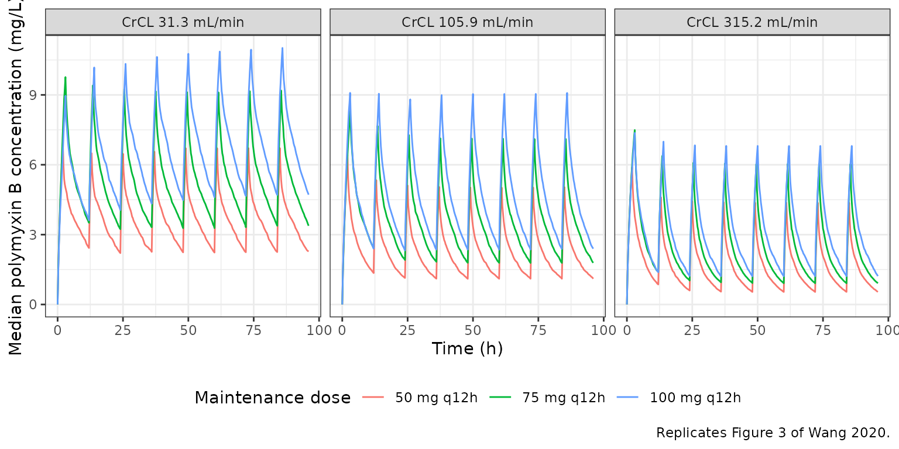

# Polymyxin B (Wang 2020)

## Model and source

- Citation: Wang P, Zhang Q, Zhu Z, Feng M, Sun T, Yang J, Zhang X.
  Population Pharmacokinetics and Limited Sampling Strategy for
  Therapeutic Drug Monitoring of Polymyxin B in Chinese Patients With
  Multidrug-Resistant Gram-Negative Bacterial Infections. Front
  Pharmacol. 2020;11:829. <doi:10.3389/fphar.2020.00829>. PMCID
  PMC7289991.
- Description: Two-compartment intravenous population PK model for
  polymyxin B (sum of polymyxin B1 and B2) in Chinese adults with
  multidrug-resistant Gram-negative bacterial infections, sampled at
  steady state on day 4 of therapy (Wang 2020). Cockcroft-Gault
  creatinine clearance is the sole retained covariate, entering
  clearance as a power term normalized to 105.9 mL/min with exponent
  0.362. Correlated inter-individual variability on V, CL and V2 plus
  independent variability on Q. Proportional residual error.
- Article: [Front Pharmacol.
  2020;11:829](https://doi.org/10.3389/fphar.2020.00829) (open access,
  PMC7289991)

## Population

Wang 2020 is a single-centre prospective study run at the First
Affiliated Hospital of Zhengzhou University (China) between April 2018
and November 2019. Forty-six adults with documented multidrug-resistant
Gram-negative bacterial infections, receiving intravenous polymyxin B
sulfate for at least 72 hours, contributed 331 plasma concentrations.
Patients on renal replacement therapy were excluded. On day 4 of therapy
a pre-dose sample (C0h) and five to seven post-dose samples (mainly 0.5,
1, 1.5, 2, 4, 6 and 8 h) were drawn within a single dosing interval.
Polymyxin B1 and B2 were measured by LC-MS/MS and summed, so the
modelled concentration is total polymyxin B.

The cohort (Table 1) was 39 men and 7 women (15.2% female), median age
46 (range 18-94) years, median weight 70 (45-98) kg, and median
Cockcroft-Gault creatinine clearance 89.3 (15.6-315.2) mL/min.
*Klebsiella pneumoniae* (20) and *Acinetobacter baumannii* (19) were the
main pathogens. Daily doses were 100, 150 or 200 mg (median 1.91
mg/kg/day), given q12h mostly as 1-hour infusions (37 patients; 0.5 h in
2, 2 h in 7).

The same information is available programmatically via the model’s
`population` metadata
(`rxode2::rxode(readModelDb("Wang_2020_polymyxinB"))$population`).

## Source trace

| Model element | Value | Source location |
|----|----|----|
| Two-compartment disposition, IV infusion | – | Results, “Population PK Model”: OFV 1062.13 (one-compartment) vs 694.63 (two-compartment); two-compartment with proportional error chosen as base model |
| Exponential IIV, `P_i = theta * exp(eta_i)` | Equ. 1 | Methods, “Population Pharmacokinetics Analysis” |
| `lvc` = log(6.218) | V 6.218 L | Table 2, row “tvV” (SE 0.83; bootstrap median 5.960, 95% CI 4.169-8.090); Equ. 4 |
| `lvp` = log(11.922) | V2 11.922 L | Table 2, row “tvV2” (SE 1.74; bootstrap median 12.073); Equ. 5 |
| `lcl` = log(1.786) | CL 1.786 L/h | Table 2, row “tvCl” (SE 0.12; bootstrap median 1.771); Equ. 6 |
| `lq` = log(13.518) | Q 13.518 L/h | Table 2, row “tvQ” (SE 3.35; bootstrap median 14.427); Equ. 7 |
| `e_crcl_cl` = 0.362 | CrCL exponent on CL | Table 2, row “dCldCrCL” (SE 0.09; bootstrap 95% CI 0.196-0.513); exponent of Equ. 6 |
| CrCL normalising constant 105.9 mL/min | – | Equ. 6, `Cl = 1.786 x (CrCl/105.9)^0.362 x exp(eta_Cl)`; Results text: “105.9 ml/min was the median of CrCL” |
| `etalvc`, `etalcl`, `etalvp` variances | 0.318, 0.208, 0.690 | Table 2, rows “w2 V”, “w2 Cl”, “w2 V2” (footnote: variance of IIV) |
| V-Cl, V-V2, Cl-V2 correlations | 0.713, 0.667, 0.571 | Table 2, rows “CorrV-Cl”, “CorrV-V2”, “CorrCl-V2”; Results text (dOFV = 30.60 for the block) |
| `etalq` variance | 1.508 | Table 2, row “w2 Q” |
| `propSd` | 0.110 | Table 2, row “Residual variability (s) stdev0”; proportional model `Cobs = Cpred x (1 + eps)` (Methods) |

The block covariances in `ini()` are `corr * sqrt(var_i * var_j)` from
the printed variances and correlations; the resulting matrix is positive
definite.

## Virtual cohort and dosing regimens

Table 3 and Figure 3 of the paper simulate three regimens – 100 mg
loading then 50 mg q12h, 150 mg loading then 75 mg q12h, and 150 mg
loading then 100 mg q12h – infused at 50 mg/h, at three fixed creatinine
clearances (31.3, 105.9 and 315.2 mL/min). The loading dose is taken as
the first dose at time 0 and the maintenance doses start at 12 h. The
paper simulated 1000 patients per scenario; 200 per scenario are used
here.

``` r

mod <- readModelDb("Wang_2020_polymyxinB")
n_per_arm <- 200L # cap: never more than 200 participants per arm

regimens <- tibble::tribble(
  ~regimen,        ~ld, ~md,
  "50 mg q12h",    100,  50,
  "75 mg q12h",    150,  75,
  "100 mg q12h",   150, 100
)
crcl_levels <- c(31.3, 105.9, 315.2)

arms <- tidyr::expand_grid(regimens, CRCL = crcl_levels) |>
  dplyr::mutate(
    arm = dplyr::row_number(),
    treatment = paste0(regimen, ", CrCL ", CRCL)
  )

subjects <- arms |>
  tidyr::expand_grid(rep = seq_len(n_per_arm)) |>
  dplyr::mutate(id = (arm - 1L) * n_per_arm + rep)

dose_times <- seq(0, 96, by = 12)
doses <- subjects |>
  tidyr::expand_grid(time = dose_times) |>
  dplyr::mutate(
    amt = ifelse(time == 0, ld, md),
    rate = 50, # Methods: 'The infusion rate was set as 50 mg/h'
    evid = 1L,
    cmt = "central"
  )
obs <- subjects |>
  tidyr::expand_grid(time = sort(unique(c(seq(0, 96, by = 0.25))))) |>
  dplyr::mutate(amt = NA_real_, rate = NA_real_, evid = 0L, cmt = "central")

events <- dplyr::bind_rows(doses, obs) |>
  dplyr::select(id, time, amt, rate, evid, cmt, CRCL) |>
  dplyr::arrange(id, time, dplyr::desc(evid)) |>
  as.data.frame()

rxode2::rxSetSeed(20200605)
sim <- rxode2::rxSolve(mod, events, returnType = "data.frame") |>
  dplyr::left_join(
    dplyr::select(subjects, id, arm, regimen, treatment),
    by = "id"
  )
#> ℹ parameter labels from comments will be replaced by 'label()'
arm_key <- dplyr::distinct(arms, arm, regimen, CRCL, treatment)
sim <- sim |>
  dplyr::select(-dplyr::any_of("CRCL")) |>
  dplyr::left_join(dplyr::select(arm_key, arm, CRCL), by = "arm")
```

## Replicate Figure 3: median profiles by CrCL

Replicates Figure 3 of Wang 2020 (median simulated concentration-time
profiles for the three regimens in panels by CrCL).

``` r

med_prof <- sim |>
  dplyr::group_by(regimen, CRCL, time) |>
  dplyr::summarise(Cc = stats::median(Cc), .groups = "drop") |>
  dplyr::mutate(
    regimen = factor(regimen, levels = regimens$regimen),
    panel = factor(paste0("CrCL ", CRCL, " mL/min"),
                   levels = paste0("CrCL ", crcl_levels, " mL/min"))
  )

ggplot2::ggplot(med_prof, ggplot2::aes(time, Cc, colour = regimen)) +
  ggplot2::geom_line() +
  ggplot2::facet_wrap(~panel) +
  ggplot2::labs(
    x = "Time (h)", y = "Median polymyxin B concentration (mg/L)",
    colour = "Maintenance dose",
    caption = "Replicates Figure 3 of Wang 2020."
  ) +
  ggplot2::theme_bw() +
  ggplot2::theme(legend.position = "bottom")
```



## PKNCA validation: day-4 AUC24 and Css,avg (Table 3)

Table 3 reports the day-4 AUC over 24 hours and the average steady-state
concentration. Day 4 is read as 72-96 h after the first (loading) dose.
NCA is run per subject on the individual predictions `Cc` (no residual
error), grouped by the regimen x CrCL scenario.

``` r

nca_conc <- sim |>
  dplyr::filter(!is.na(Cc), time >= 72, time <= 96) |>
  dplyr::select(id, time, Cc, treatment)
nca_dose <- doses |>
  dplyr::filter(time >= 72, time < 96) |>
  dplyr::select(id, time, amt, treatment)

conc_obj <- PKNCA::PKNCAconc(nca_conc, Cc ~ time | treatment + id,
                             concu = "mg/L", timeu = "h")
dose_obj <- PKNCA::PKNCAdose(nca_dose, amt ~ time | treatment + id,
                             doseu = "mg")
intervals <- data.frame(start = 72, end = 96, auclast = TRUE, cav = TRUE,
                        cmax = TRUE, cmin = TRUE)
nca_res <- PKNCA::pk.nca(PKNCA::PKNCAdata(conc_obj, dose_obj,
                                          intervals = intervals))
nca_long <- as.data.frame(nca_res) |>
  dplyr::select(treatment, id, PPTESTCD, PPORRES)
```

The reference values are the Table 3 medians (P50);
[`ncaComparisonTable()`](https://nlmixr2.github.io/nlmixr2lib/reference/ncaComparisonTable.md)
also aggregates the simulated subjects by the median, so the two sides
are the same statistic.

``` r

table3 <- tibble::tribble(
  ~regimen,      ~CRCL, ~auc_p5, ~auc_p50, ~auc_p95, ~cav_p5, ~cav_p50, ~cav_p95,
  "50 mg q12h",   31.3,  36.93,   87.20,  192.19,   1.54,   3.63,   8.01,
  "50 mg q12h",  105.9,  23.85,   53.33,  118.77,   0.99,   2.22,   4.95,
  "50 mg q12h",  315.2,  15.54,   37.92,   84.49,   0.65,   1.58,   3.52,
  "75 mg q12h",   31.3,  56.60,  128.58,  295.12,   2.36,   5.36,  12.30,
  "75 mg q12h",  105.9,  35.15,   82.04,  180.81,   1.46,   3.42,   7.53,
  "75 mg q12h",  315.2,  22.46,   53.60,  121.32,   0.94,   2.23,   5.06,
  "100 mg q12h",  31.3,  75.39,  167.90,  364.58,   3.14,   7.00,  15.19,
  "100 mg q12h", 105.9,  49.23,  108.57,  247.01,   2.05,   4.52,  10.29,
  "100 mg q12h", 315.2,  30.29,   71.91,  167.40,   1.26,   3.00,   6.98
) |>
  dplyr::mutate(treatment = paste0(regimen, ", CrCL ", CRCL))

reference <- table3 |>
  dplyr::transmute(treatment, auclast = auc_p50, cav = cav_p50)

cmp <- nlmixr2lib::ncaComparisonTable(
  simulated = nca_long,
  reference = reference,
  by = "treatment",
  params = c("auclast", "cav"),
  units = c(auclast = "mg*h/L", cav = "mg/L"),
  tolerance_pct = 20
)
cmp |>
  dplyr::rename("Scenario" = treatment) |>
  knitr::kable(caption = paste(
    "Simulated day-4 (72-96 h) AUC and average concentration versus the",
    "Wang 2020 Table 3 medians. AUC0-24 on day 4 is reported by PKNCA as",
    "AUClast over the 72-96 h interval."
  ))
```

| NCA parameter     | Scenario                | Reference | Simulated | % diff |
|:------------------|:------------------------|:----------|:----------|:-------|
| AUClast (mg\*h/L) | 50 mg q12h, CrCL 31.3   | 87.2      | 87.9      | +0.8%  |
| AUClast (mg\*h/L) | 50 mg q12h, CrCL 105.9  | 53.3      | 51.9      | -2.7%  |
| AUClast (mg\*h/L) | 50 mg q12h, CrCL 315.2  | 37.9      | 37.1      | -2.2%  |
| AUClast (mg\*h/L) | 75 mg q12h, CrCL 31.3   | 129       | 129       | +0.3%  |
| AUClast (mg\*h/L) | 75 mg q12h, CrCL 105.9  | 82        | 84.9      | +3.5%  |
| AUClast (mg\*h/L) | 75 mg q12h, CrCL 315.2  | 53.6      | 56.3      | +5.0%  |
| AUClast (mg\*h/L) | 100 mg q12h, CrCL 31.3  | 168       | 172       | +2.3%  |
| AUClast (mg\*h/L) | 100 mg q12h, CrCL 105.9 | 109       | 112       | +3.1%  |
| AUClast (mg\*h/L) | 100 mg q12h, CrCL 315.2 | 71.9      | 74.3      | +3.3%  |
| Cavg (mg/L)       | 50 mg q12h, CrCL 31.3   | 3.63      | 3.66      | +0.9%  |
| Cavg (mg/L)       | 50 mg q12h, CrCL 105.9  | 2.22      | 2.16      | -2.6%  |
| Cavg (mg/L)       | 50 mg q12h, CrCL 315.2  | 1.58      | 1.54      | -2.2%  |
| Cavg (mg/L)       | 75 mg q12h, CrCL 31.3   | 5.36      | 5.37      | +0.3%  |
| Cavg (mg/L)       | 75 mg q12h, CrCL 105.9  | 3.42      | 3.54      | +3.4%  |
| Cavg (mg/L)       | 75 mg q12h, CrCL 315.2  | 2.23      | 2.34      | +5.1%  |
| Cavg (mg/L)       | 100 mg q12h, CrCL 31.3  | 7         | 7.16      | +2.3%  |
| Cavg (mg/L)       | 100 mg q12h, CrCL 105.9 | 4.52      | 4.66      | +3.2%  |
| Cavg (mg/L)       | 100 mg q12h, CrCL 315.2 | 3         | 3.09      | +3.1%  |

Simulated day-4 (72-96 h) AUC and average concentration versus the Wang
2020 Table 3 medians. AUC0-24 on day 4 is reported by PKNCA as AUClast
over the 72-96 h interval. {.table style="width:100%;"}

``` r

if (!is.null(attr(cmp, "footnote"))) cat(attr(cmp, "footnote"), "\n")
```

The simulated medians reproduce the Table 3 medians to within a few
percent in every scenario, including the covariate direction (lower
CrCL, higher exposure) and its magnitude across the 10-fold CrCL range.

The 5th and 95th percentiles of Table 3 are compared as well. These are
tail quantiles of a 200-subject cohort, so they are shown for context
and are not asserted on.

``` r

sim_q <- nca_long |>
  dplyr::filter(PPTESTCD == "auclast") |>
  dplyr::group_by(treatment) |>
  dplyr::summarise(
    sim_p5 = stats::quantile(PPORRES, 0.05),
    sim_p50 = stats::median(PPORRES),
    sim_p95 = stats::quantile(PPORRES, 0.95),
    .groups = "drop"
  ) |>
  dplyr::inner_join(table3, by = "treatment") |>
  dplyr::mutate(pct_diff_p50 = 100 * (sim_p50 - auc_p50) / auc_p50) |>
  dplyr::arrange(match(treatment, table3$treatment))

sim_q |>
  dplyr::select(treatment, auc_p5, sim_p5, auc_p50, sim_p50, auc_p95,
                sim_p95, pct_diff_p50) |>
  dplyr::rename(
    "Scenario" = treatment,
    "P5 paper" = auc_p5, "P5 sim" = sim_p5,
    "P50 paper" = auc_p50, "P50 sim" = sim_p50,
    "P95 paper" = auc_p95, "P95 sim" = sim_p95,
    "P50 % diff" = pct_diff_p50
  ) |>
  knitr::kable(digits = 1, caption = paste(
    "Day-4 AUC24 (mg*h/L) percentiles: Wang 2020 Table 3 versus simulation."
  ))
```

| Scenario | P5 paper | P5 sim | P50 paper | P50 sim | P95 paper | P95 sim | P50 % diff |
|:---|---:|---:|---:|---:|---:|---:|---:|
| 50 mg q12h, CrCL 31.3 | 36.9 | 40.7 | 87.2 | 87.9 | 192.2 | 185.8 | 0.8 |
| 50 mg q12h, CrCL 105.9 | 23.9 | 25.5 | 53.3 | 51.9 | 118.8 | 105.8 | -2.7 |
| 50 mg q12h, CrCL 315.2 | 15.5 | 16.8 | 37.9 | 37.1 | 84.5 | 85.7 | -2.2 |
| 75 mg q12h, CrCL 31.3 | 56.6 | 62.4 | 128.6 | 129.0 | 295.1 | 286.8 | 0.3 |
| 75 mg q12h, CrCL 105.9 | 35.1 | 38.4 | 82.0 | 84.9 | 180.8 | 176.6 | 3.5 |
| 75 mg q12h, CrCL 315.2 | 22.5 | 27.8 | 53.6 | 56.3 | 121.3 | 130.0 | 5.0 |
| 100 mg q12h, CrCL 31.3 | 75.4 | 79.8 | 167.9 | 171.8 | 364.6 | 345.0 | 2.3 |
| 100 mg q12h, CrCL 105.9 | 49.2 | 52.7 | 108.6 | 111.9 | 247.0 | 214.1 | 3.1 |
| 100 mg q12h, CrCL 315.2 | 30.3 | 37.9 | 71.9 | 74.3 | 167.4 | 156.9 | 3.3 |

Day-4 AUC24 (mg\*h/L) percentiles: Wang 2020 Table 3 versus simulation.
{.table}

``` r


stopifnot(
  # Structural: a mis-transcribed clearance, exponent or normalising constant
  # moves every scenario by tens of percent.
  abs(stats::median(sim_q$pct_diff_p50)) < 5,
  # Envelope across the nine scenarios, robust to the sampling noise of a
  # 200-subject median (about 4% for the ~46% CV on CL).
  stats::quantile(abs(sim_q$pct_diff_p50), 0.9) < 12
)
```

### Typical-value closed-form check

For a linear two-compartment model at true steady state, the AUC over
one 24-hour window equals the dose given in that window divided by CL,
independently of the distribution parameters. With random effects zeroed
and dosing continued for 20 days (the typical terminal half-life is well
under one day), the integrated AUC must reproduce `2 x MD / CL` at every
CrCL. This exercises the covariate term and the ODE wiring without any
random draw, so a tight bound is appropriate.

``` r

mod_tv <- rxode2::zeroRe(mod)
#> ℹ parameter labels from comments will be replaced by 'label()'
tv_subj <- tibble::tibble(id = seq_along(crcl_levels), CRCL = crcl_levels)
tv_events <- dplyr::bind_rows(
  tv_subj |>
    tidyr::expand_grid(time = seq(0, 480 + 12, by = 12)) |>
    dplyr::mutate(amt = 50, rate = 50, evid = 1L, cmt = "central"),
  tv_subj |>
    tidyr::expand_grid(time = seq(480, 504, by = 0.05)) |>
    dplyr::mutate(amt = NA_real_, rate = NA_real_, evid = 0L,
                  cmt = "central")
) |>
  dplyr::arrange(id, time, dplyr::desc(evid)) |>
  as.data.frame()

tv_sim <- rxode2::rxSolve(mod_tv, tv_events, returnType = "data.frame")
#> ℹ omega/sigma items treated as zero: 'etalvc', 'etalcl', 'etalvp', 'etalq'
#> Warning: multi-subject simulation without without 'omega'
tv_check <- tv_sim |>
  dplyr::group_by(id) |>
  dplyr::summarise(
    CRCL = dplyr::first(CRCL),
    cl = dplyr::first(cl),
    auc = sum(diff(time) * (utils::head(Cc, -1) + utils::tail(Cc, -1)) / 2),
    .groups = "drop"
  ) |>
  dplyr::mutate(
    cl_expected = 1.786 * (CRCL / 105.9)^0.362,
    auc_expected = 2 * 50 / cl_expected,
    pct_diff = 100 * (auc - auc_expected) / auc_expected
  )

tv_check |>
  dplyr::select(CRCL, cl, cl_expected, auc, auc_expected, pct_diff) |>
  dplyr::rename(
    "CrCL (mL/min)" = CRCL, "CL model (L/h)" = cl,
    "CL Equ. 6 (L/h)" = cl_expected, "AUC24 integrated" = auc,
    "2 x 50 mg / CL" = auc_expected, "% diff" = pct_diff
  ) |>
  knitr::kable(digits = 4, caption = "Typical-value steady-state AUC24 at 50 mg q12h.")
```

| CrCL (mL/min) | CL model (L/h) | CL Equ. 6 (L/h) | AUC24 integrated | 2 x 50 mg / CL | % diff |
|---:|---:|---:|---:|---:|---:|
| 31.3 | 1.1488 | 1.1488 | 87.0450 | 87.0450 | 0 |
| 105.9 | 1.7860 | 1.7860 | 55.9910 | 55.9910 | 0 |
| 315.2 | 2.6507 | 2.6507 | 37.7262 | 37.7262 | 0 |

Typical-value steady-state AUC24 at 50 mg q12h. {.table}

``` r


stopifnot(
  max(abs(tv_check$cl - tv_check$cl_expected)) < 1e-8,
  max(abs(tv_check$pct_diff)) < 0.1
)
```

## Observed-cohort AUC0-12

The paper reports an observed (non-compartmental) AUC0-12h of 43.64 +/-
27.68 mg\*h/L (range 8.50-122.84) across the 46 patients. A rough
virtual version of that cohort is simulated below: maintenance doses of
50, 75 or 100 mg q12h in the Table 1 proportions (25 : 15 : 8 patients),
1-hour infusions, and a creatinine clearance drawn log-normally around
the Table 1 median of 89.3 mL/min and truncated to the observed
15.6-315.2 mL/min range. Dosing runs for 4 days without a loading dose
(the cohort loading practice is not reported per patient) and the day-4
interval 72-84 h is analysed. This is descriptive only – the paper does
not report the covariate distribution in enough detail for a sharp
comparison.

``` r

n_cohort <- 200L
rxode2::rxSetSeed(46)
cohort <- tibble::tibble(
  id = seq_len(n_cohort),
  md = sample(c(50, 75, 100), n_cohort, replace = TRUE,
              prob = c(25, 15, 8)),
  CRCL = pmin(pmax(exp(stats::rnorm(n_cohort, log(89.3), 0.75)), 15.6), 315.2)
)
coh_events <- dplyr::bind_rows(
  cohort |>
    tidyr::expand_grid(time = seq(0, 84, by = 12)) |>
    dplyr::mutate(amt = md, rate = md, evid = 1L, cmt = "central"),
  cohort |>
    tidyr::expand_grid(time = seq(72, 84, by = 0.1)) |>
    dplyr::mutate(amt = NA_real_, rate = NA_real_, evid = 0L,
                  cmt = "central")
) |>
  dplyr::select(id, time, amt, rate, evid, cmt, CRCL) |>
  dplyr::arrange(id, time, dplyr::desc(evid)) |>
  as.data.frame()
coh_sim <- rxode2::rxSolve(mod, coh_events, returnType = "data.frame")
coh_auc <- coh_sim |>
  dplyr::filter(!is.na(Cc)) |>
  dplyr::group_by(id) |>
  dplyr::summarise(
    auc = sum(diff(time) * (utils::head(Cc, -1) + utils::tail(Cc, -1)) / 2),
    .groups = "drop"
  )
tibble::tibble(
  Source = c("Wang 2020 observed (n = 46)", "Simulated virtual cohort"),
  `Mean AUC0-12 (mg*h/L)` = c(43.64, mean(coh_auc$auc)),
  `SD` = c(27.68, stats::sd(coh_auc$auc)),
  `Min` = c(8.50, min(coh_auc$auc)),
  `Max` = c(122.84, max(coh_auc$auc))
) |>
  knitr::kable(digits = 2, caption = "Day-4 AUC0-12: observed versus a virtual cohort.")
```

| Source                      | Mean AUC0-12 (mg\*h/L) |    SD |  Min |    Max |
|:----------------------------|-----------------------:|------:|-----:|-------:|
| Wang 2020 observed (n = 46) |                  43.64 | 27.68 | 8.50 | 122.84 |
| Simulated virtual cohort    |                  44.16 | 26.91 | 9.86 | 179.49 |

Day-4 AUC0-12: observed versus a virtual cohort. {.table}

## Assumptions and deviations

- **CrCL normalising constant.** Equ. 6 normalises CrCL by 105.9 mL/min
  and the Results text calls 105.9 “the median of CrCL”, whereas Table 1
  reports the cohort CrCL as median 89.3 (range 15.6-315.2) mL/min. The
  Methods also use 105.9 as the “medium” value of the Table 3
  simulations. The printed equation is followed (105.9). The typical
  clearance at the Table 1 median of 89.3 mL/min is then 1.68 L/h rather
  than 1.786 L/h. The source of the discrepancy (e.g. median over
  samples rather than patients, or over a subset) is not stated.
- **Covariate units.** CrCL is the raw Cockcroft-Gault estimate in
  mL/min (not normalised to 1.73 m^2) and is stored in the canonical
  `CRCL` column with mL/min units, as in other raw Cockcroft-Gault
  models in the library.
- **Dose units.** The Methods quote the Chinese label as “50 to 100
  million units (1 million units equal to 1 mg) twice daily”; the
  conventional polymyxin B conversion is 10,000 units per mg, so the
  stated unit numbers appear to be a translation slip. All doses in the
  paper’s tables and simulations are in mg, and the model is dosed in
  mg.
- **Table 1 dose counts.** The daily-dose counts (25 + 15 + 8 = 48)
  exceed the 46 patients and “25 (50.0%)” does not match 25/46; the
  proportions are used only for the descriptive virtual cohort.
- **Day-4 window for Table 3.** “AUC24h … on day four” is read as 72-96
  h after the loading dose, with maintenance doses starting at 12 h. The
  paper does not state the dosing clock explicitly.
- **Parameter classification.** The Table 2 footnote calls dCldCrCL a
  “fixed parameter coefficient”; in Phoenix NLME terminology this
  denotes a fixed effect (theta), and the parameter has an SE and
  bootstrap CI, so it is encoded as estimated.
- **Limited sampling strategies.** The Bayesian and
  multiple-linear-regression limited sampling equations for AUC0-12h
  (Tables 4-5) are TDM estimation tools derived from the observed data,
  not part of the population model, and are not encoded.
- **No errata** were found for this article (literature check, September
  2026). The supplement (Supplementary Figure 1, CrCL versus
  individual CL) contains no parameter values.
