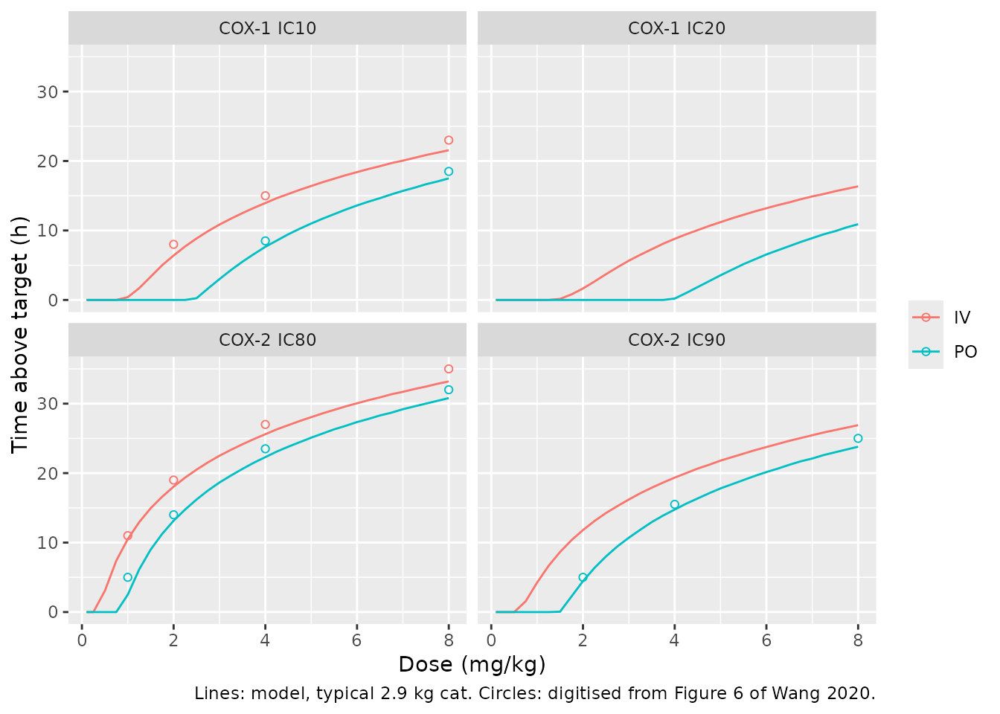
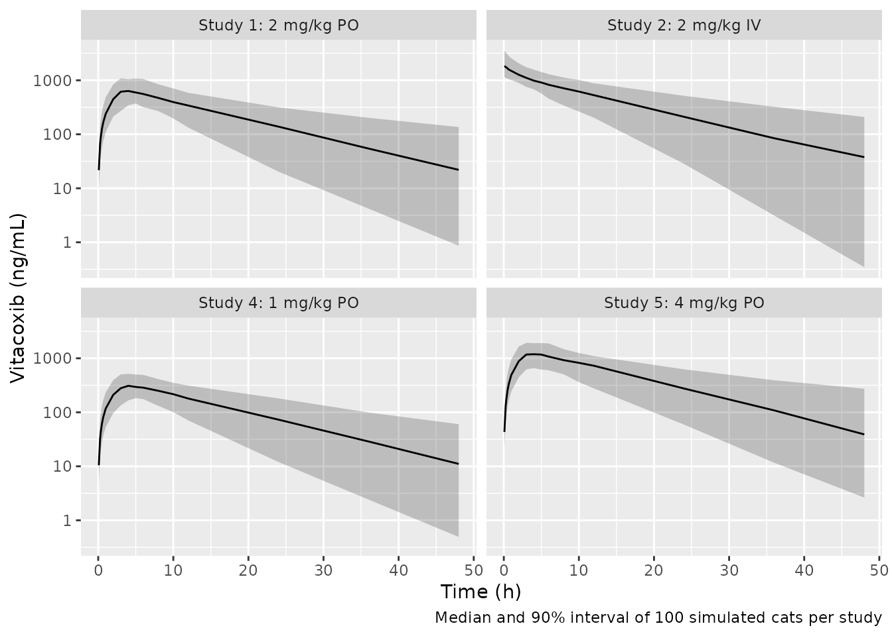
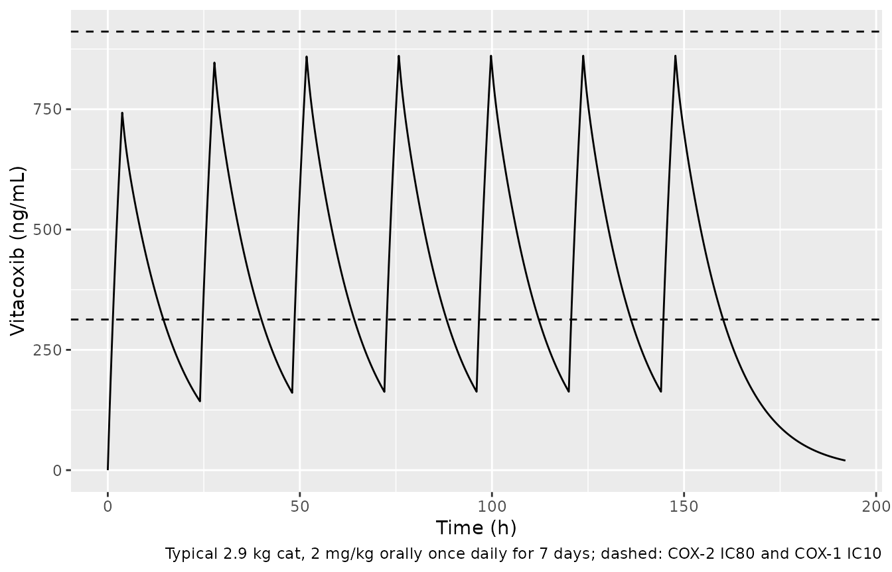

# Vitacoxib in cats (Wang 2020)

## Model and source

``` r

mod <- rxode2::rxode2(readModelDb("Wang_2020_vitacoxib_cat"))
#> ℹ parameter labels from comments will be replaced by 'label()'
```

- Citation: Wang J, Schneider BK, Xiao H, Qiu J, Gong X, Seo Y-J, Li J,
  Mochel JP, Cao X. Non-Linear Mixed-Effects Pharmacokinetic Modeling of
  the Novel COX-2 Selective Inhibitor Vitacoxib in Cats. Front Vet Sci.
  2020;7:554033. <doi:10.3389/fvets.2020.554033>.
- Description: Preclinical/clinical veterinary (cat). Two-compartment
  population PK model for the COX-2 selective inhibitor vitacoxib in
  healthy neutered domestic shorthair cats, pooling intravenous and
  single- and multiple-dose oral data from six studies. Oral absorption
  is a parallel mixed-order input: a fraction Fr of the bioavailable
  dose is absorbed first-order through a depot (ka = 0.13 1/h) and the
  remainder enters the central compartment by a zero-order process of
  duration Tk0 = 3.76 h; oral bioavailability 57.8%. Clearance is per kg
  body weight (Table 2 prints 0.11 ‘L/h’; the paper’s Figure 6
  simulations and companion NCA identify it as L/h/kg) and body weight
  is a power covariate on the central volume of distribution (Wang 2020)
- Article: <https://doi.org/10.3389/fvets.2020.554033>

Vitacoxib is a highly selective cyclooxygenase-2 (COX-2) inhibitor
registered for dogs in China. Wang 2020 pooled six pharmacokinetic
studies in 16 healthy cats to build a population PK model in Monolix
2019R2 and then used deterministic simulations to relate oral and
intravenous dose to the time that plasma concentrations stay above
in-vitro whole-blood COX-1 and COX-2 inhibitory concentrations.

## Population

Sixteen healthy, neutered, domestic shorthair laboratory cats, 1-3 years
old, body weight 2.9 +/- 0.78 kg (Methods “Animals”), in two groups of
eight (Table 1):

| Study | Cats     | Feeding           | Route | Dose                   |
|-------|----------|-------------------|-------|------------------------|
| 1     | IDs 9-16 | 12 h fast         | oral  | 2 mg/kg single         |
| 2     | IDs 9-16 | 12 h fast         | i.v.  | 2 mg/kg single         |
| 3     | IDs 9-16 | 2 h after feeding | oral  | 2 mg/kg single         |
| 4     | IDs 1-8  | 12 h fast         | oral  | 1 mg/kg single         |
| 5     | IDs 1-8  | 12 h fast         | oral  | 4 mg/kg single         |
| 6     | IDs 9-16 | 12 h fast         | oral  | 2 mg/kg daily x 7 days |

Plasma was assayed by UPLC-MS/MS (LLOQ 0.5 ng/mL); below-LLOQ data were
handled with the Monolix equivalent of the NONMEM M3 method. The sex
split is not reported.

``` r

str(readModelDb("Wang_2020_vitacoxib_cat")()$population)
#> List of 11
#>  $ species       : chr "cat (domestic shorthair; Felis catus)"
#>  $ n_subjects    : int 16
#>  $ n_studies     : int 6
#>  $ age_range     : chr "1-3 years"
#>  $ weight_range  : chr "2.9 +/- 0.78 kg (mean +/- SD)"
#>  $ weight_mean   : chr "2.9 kg"
#>  $ sex_female_pct: num NA
#>  $ disease_state : chr "Healthy neutered domestic shorthair laboratory cats"
#>  $ dose_range    : chr "1, 2 and 4 mg/kg single oral dose; 2 mg/kg single i.v. dose; 2 mg/kg oral once daily for 7 days"
#>  $ regions       : chr "China (China Agricultural University, Beijing)"
#>  $ notes         : chr "Methods 'Animals' and Table 1. Two groups of eight cats: IDs 9-16 received Study 1 (2 mg/kg p.o. fasted), Study"| __truncated__
```

## Structural model

Figure 1 and Results “PK Model Evaluation”: a two-compartment mammillary
model with simultaneous first- and zero-order oral absorption. Of the
bioavailable oral dose (`F` = 57.8%), a fraction `Fr` = 0.20 is absorbed
first-order through a depot (`ka` = 0.13 1/h) and `1 - Fr` enters the
central compartment by a zero-order input of duration `Tk0` = 3.76 h.
This is the same parallel-input structure the authors cite from the
robenacoxib cat model (Pelligand 2016,
`Pelligand_2016_robenacoxib_cat`).

Because rxode2 applies one bioavailability per compartment rather than
per administration type, the canonical `ROUTE_IV` indicator selects
which bioavailability applies to a dose placed in `central`:

``` r

cat(paste(mod$modelDesc, collapse = "\n"))
#> rxode2-based free-form 3-cmt ODE model
```

An **oral** administration is two dose records at the same time: a bolus
into `depot` and a `rate = -2` record into `central`, both with
`ROUTE_IV = 0`. An **intravenous** administration is one plain bolus
into `central` with `ROUTE_IV = 1`; that record carries no rate, so
`dur(central)` is ignored.

## Source trace

| Equation / parameter | Value | Source location |
|----|----|----|
| Two-compartment disposition, parallel zero- + first-order oral input | n/a | Figure 1; Results “PK Model Evaluation” |
| `lcl` (CL) | 0.11 L/h/kg (printed “L/h”) | Table 2 “Systemic Clearance”; per-kg reading justified below |
| `lvc` (V1) | 2.88 L | Table 2 “Central compartment volume of distribution” |
| `lvp` (V2) | 0.54 L | Table 2 “Peripheral compartment volume of distribution” |
| `lq` (Q) | 0.52 L/h | Table 2 “Inter-compartmental clearance” |
| `lka` (Ka) | 0.13 1/h | Table 2 “First-order absorption rate constant (P.O)” |
| `ld1` (Tk0) | 3.76 h | Table 2 “Zero-order absorption rate constant (P.O)” (a duration, unit h) |
| `logitfdepot` (F) | 0.578 | Table 2 “Bioavailability (P.O)” |
| `logitffo` (Fr) | 0.20 | Table 2 “Fraction absorbed through 1st order” |
| `e_wt_vc` | 0.41 on log(WT / 2.9) | Table 2 “Bodyweight effect on V1”; Equation 2; Methods “Inclusion of Covariate Relationships” |
| `etalka`, `etalq` | 0.01, fixed | Table 2 CV 10.0%; Results “Parameter Estimates”: set to 0.1 |
| `etald1`, `etalvc`, `etalvp`, `etalcl` | CV 31.5, 37.4, 109, 46.0% | Table 2 CV column, `log(1 + CV^2)` |
| `etalogitffo`, `etalogitfdepot` | SD 0.08, 0.265 (logit scale) | Table 2 CV column |
| `propSd` | 0.30 | Table 2 “Proportional error constant” |

## Typical-value verification

With the random effects zeroed, closed-form identities must hold. These
compare a solve against its own analytic solution, so the tolerances are
tight.

``` r

wt_ref <- 2.9 # Methods "Animals": mean body weight

make_events <- function(id, dose_mgkg, route_iv, wt = wt_ref, times = seq(0, 240, by = 0.05)) {
  amt <- dose_mgkg * wt
  if (route_iv == 1) {
    dosing <- data.frame(id = id, time = 0, evid = 1L, cmt = "central", amt = amt, rate = 0)
  } else {
    dosing <- data.frame(
      id = id, time = 0, evid = 1L, cmt = c("depot", "central"),
      amt = amt, rate = c(0, -2)
    )
  }
  obs <- data.frame(id = id, time = times, evid = 0L, cmt = "central", amt = NA_real_, rate = NA_real_)
  out <- rbind(dosing, obs)
  out$WT <- wt
  out$ROUTE_IV <- route_iv
  out
}

mod_typ <- rxode2::zeroRe(mod)
ev_typ <- rbind(make_events(1, 2, 1), make_events(2, 2, 0))
sim_typ <- as.data.frame(rxode2::rxSolve(mod_typ, ev_typ, returnType = "data.frame"))
#> ℹ omega/sigma items treated as zero: 'etalka', 'etald1', 'etalogitffo', 'etalvc', 'etalvp', 'etalq', 'etalcl', 'etalogitfdepot'
#> Warning: multi-subject simulation without without 'omega'

trap <- function(t, y) sum(diff(t) * (head(y, -1) + tail(y, -1)) / 2)
typ <- sim_typ |>
  dplyr::group_by(id) |>
  dplyr::summarise(c0 = Cc[time == 0], cmax = max(Cc), tmax = time[which.max(Cc)], auc = trap(time, Cc))

CL <- 0.11 * wt_ref
V1 <- 2.88
V2 <- 0.54
FORAL <- 0.578
dose <- 2 * wt_ref
checks <- data.frame(
  Identity = c(
    "IV C0 = Dose/V1 (ng/mL)",
    "IV AUC0-240h ~ Dose/CL (ng*h/mL)",
    "Oral AUC0-240h ~ F*Dose/CL (ng*h/mL)"
  ),
  Analytic = c(dose / V1 * 1000, dose / CL * 1000, FORAL * dose / CL * 1000),
  Simulated = c(typ$c0[1], typ$auc[1], typ$auc[2])
) |>
  dplyr::mutate("% diff" = 100 * (Simulated - Analytic) / Analytic)
knitr::kable(checks, digits = 3)
```

| Identity                             |  Analytic | Simulated | % diff |
|:-------------------------------------|----------:|----------:|-------:|
| IV C0 = Dose/V1 (ng/mL)              |  2013.889 |  2013.889 |  0.000 |
| IV AUC0-240h ~ Dose/CL (ng\*h/mL)    | 18181.818 | 18181.940 |  0.001 |
| Oral AUC0-240h ~ F*Dose/CL (ng*h/mL) | 10509.091 | 10509.035 | -0.001 |

``` r


stopifnot(
  abs(typ$c0[1] / (dose / V1 * 1000) - 1) < 1e-6,
  abs(typ$auc[1] / (dose / CL * 1000) - 1) < 0.005,
  # Blind to the Fr split and Tk0 (total exposure only), but goes red if either
  # f() multiplier is wrong or the zero-order record is dropped/double-counted.
  abs(typ$auc[2] / (FORAL * dose / CL * 1000) - 1) < 0.005,
  # Abstract / Results: VSS = 3.42 L = V1 + V2.
  abs((V1 + V2) - 3.42) < 1e-9
)
```

The absorption split and the zero-order duration are not visible in
total exposure, so they are pinned separately: dosing only the
first-order record must give `F*Fr` of the oral AUC, and the zero-order
record alone must peak at `Tk0`.

``` r

ev_split <- rbind(
  make_events(1, 2, 0)[-2, ], # depot record only
  make_events(2, 2, 0)[-1, ] # zero-order central record only
)
ev_split$id <- rep(1:2, each = nrow(ev_split) / 2)
sim_split <- as.data.frame(rxode2::rxSolve(mod_typ, ev_split, returnType = "data.frame"))
#> ℹ omega/sigma items treated as zero: 'etalka', 'etald1', 'etalogitffo', 'etalvc', 'etalvp', 'etalq', 'etalcl', 'etalogitfdepot'
#> Warning: multi-subject simulation without without 'omega'
split <- sim_split |>
  dplyr::group_by(id) |>
  dplyr::summarise(auc = trap(time, Cc), tmax = time[which.max(Cc)])
stopifnot(
  abs(split$auc[1] / (FORAL * 0.20 * dose / CL * 1000) - 1) < 0.005,
  abs(split$auc[2] / (FORAL * 0.80 * dose / CL * 1000) - 1) < 0.005,
  abs(split$tmax[2] - 3.76) <= 0.05
)
split
#> # A tibble: 2 × 3
#>      id   auc  tmax
#>   <int> <dbl> <dbl>
#> 1     1 2102.  8.9 
#> 2     2 8407.  3.75
```

## Clearance is per kg body weight

Table 2 prints `CL = 0.11 L/h` and the Abstract “110 ml/h”. Encoded that
way, the model cannot reproduce the paper’s own Figure 6, which the
authors simulated deterministically from this final model with mlxR (IIV
and residual error fixed to zero). Figure 6 plots the time above four
in-vitro targets against dose; its curves were read at the grid lines by
the maintainers:

``` r

fig6 <- rbind(
  data.frame(target = "COX-2 IC80", conc = 313.0, route_iv = 1, dose = c(1, 2, 4, 8), fig = c(11, 19, 27, 35)),
  data.frame(target = "COX-2 IC80", conc = 313.0, route_iv = 0, dose = c(1, 2, 4, 8), fig = c(5, 14, 23.5, 32)),
  data.frame(target = "COX-1 IC10", conc = 911.3, route_iv = 1, dose = c(2, 4, 8), fig = c(8, 15, 23)),
  data.frame(target = "COX-1 IC10", conc = 911.3, route_iv = 0, dose = c(4, 8), fig = c(8.5, 18.5)),
  data.frame(target = "COX-2 IC90", conc = 556.5, route_iv = 0, dose = c(2, 4, 8), fig = c(5, 15.5, 25))
)
```

The model is solved at the mean weight of 2.9 kg in two variants: as
encoded (CL = 0.11 L/h/kg x 2.9 kg = 0.319 L/h) and with the printed
absolute value (CL = 0.11 L/h, obtained by dividing the per-kg value by
the weight).

``` r

time_above <- function(model, doses, routes, conc) {
  grid <- unique(data.frame(dose = doses, route_iv = routes))
  grid$id <- seq_len(nrow(grid))
  ev <- do.call(rbind, Map(make_events, grid$id, grid$dose, grid$route_iv))
  s <- as.data.frame(rxode2::rxSolve(model, ev, returnType = "data.frame"))
  s <- dplyr::left_join(s, grid, by = "id")
  mapply(function(d, r, cc) {
    x <- s[s$dose == d & s$route_iv == r, ]
    stopifnot(nrow(x) > 1000) # a lookup that matched nothing must not pass
    sum(x$Cc > cc) * 0.05
  }, doses, routes, conc)
}
mod_printed <- rxode2::ini(mod_typ, lcl = log(0.11 / wt_ref))
#> ℹ change initial estimate of `lcl` to `-3.27198565018215`
fig6$per_kg <- time_above(mod_typ, fig6$dose, fig6$route_iv, fig6$conc)
#> ℹ omega/sigma items treated as zero: 'etalka', 'etald1', 'etalogitffo', 'etalvc', 'etalvp', 'etalq', 'etalcl', 'etalogitfdepot'
#> Warning: multi-subject simulation without without 'omega'
fig6$printed <- time_above(mod_printed, fig6$dose, fig6$route_iv, fig6$conc)
#> ℹ omega/sigma items treated as zero: 'etalka', 'etald1', 'etalogitffo', 'etalvc', 'etalvp', 'etalq', 'etalcl', 'etalogitfdepot'
#> Warning: multi-subject simulation without without 'omega'
rmse <- function(x) sqrt(mean((x - fig6$fig)^2))

fig6 |>
  dplyr::mutate(route = ifelse(route_iv == 1, "IV", "PO")) |>
  dplyr::select(target, route, dose, fig, per_kg, printed) |>
  dplyr::rename(
    "Target" = target, "Route" = route, "Dose (mg/kg)" = dose,
    "Figure 6 (h)" = fig, "CL 0.11 L/h/kg (h)" = per_kg, "CL 0.11 L/h (h)" = printed
  ) |>
  knitr::kable(digits = 1)
```

| Target     | Route | Dose (mg/kg) | Figure 6 (h) | CL 0.11 L/h/kg (h) | CL 0.11 L/h (h) |
|:-----------|:------|-------------:|-------------:|-------------------:|----------------:|
| COX-2 IC80 | IV    |            1 |         11.0 |               10.5 |            30.9 |
| COX-2 IC80 | IV    |            2 |         19.0 |               18.0 |            52.5 |
| COX-2 IC80 | IV    |            4 |         27.0 |               25.6 |            74.2 |
| COX-2 IC80 | IV    |            8 |         35.0 |               33.2 |            95.9 |
| COX-2 IC80 | PO    |            1 |          5.0 |                2.5 |            12.8 |
| COX-2 IC80 | PO    |            2 |         14.0 |               13.2 |            37.3 |
| COX-2 IC80 | PO    |            4 |         23.5 |               22.3 |            59.9 |
| COX-2 IC80 | PO    |            8 |         32.0 |               30.8 |            81.8 |
| COX-1 IC10 | IV    |            2 |          8.0 |                6.4 |            19.1 |
| COX-1 IC10 | IV    |            4 |         15.0 |               14.0 |            40.8 |
| COX-1 IC10 | IV    |            8 |         23.0 |               21.6 |            62.5 |
| COX-1 IC10 | PO    |            4 |          8.5 |                7.7 |            24.6 |
| COX-1 IC10 | PO    |            8 |         18.5 |               17.5 |            47.8 |
| COX-2 IC90 | PO    |            2 |          5.0 |                4.4 |            17.3 |
| COX-2 IC90 | PO    |            4 |         15.5 |               14.8 |            41.2 |
| COX-2 IC90 | PO    |            8 |         25.0 |               23.8 |            63.6 |

``` r


c(rmse_per_kg = rmse(fig6$per_kg), rmse_printed = rmse(fig6$printed))
#>  rmse_per_kg rmse_printed 
#>     1.274694    33.167814
stopifnot(
  rmse(fig6$per_kg) < 3,
  rmse(fig6$printed) > 20
)
```

The per-kg reading reproduces all 16 digitised points to an RMSE of
about 1 h; the printed unit misses them by more than a day. Only
clearance needs rescaling: the dose at which each curve leaves zero is
set by the peak concentration, and the intravenous thresholds (for
example about 0.85 mg/kg for COX-1 IC10) put `C0 / dose` at about 1,050
ng/mL per mg/kg, which is `2.9 / 2.88 x 1000` = 1,007 –
i.e. `V1 = 2.88 L` is an absolute volume. Independently, the companion
non-compartmental analysis of the same Study 2 intravenous data (Wang
2019, *J Vet Pharmacol Ther* 42:294, ref. 16 of the paper) reports CL =
95.22 +/- 23.53 ml/kg/h and Vd = 1,264 +/- 344 ml/kg – about 0.28 L/h
and 3.7 L for a 2.9 kg cat, matching the per-kg clearance and the
absolute volumes.

``` r

dose_grid <- c(0.1, seq(0.25, 8, by = 0.25))
curves <- expand.grid(dose = dose_grid, route_iv = c(0, 1), conc = c(313.0, 556.5, 911.3, 1467.8))
curves$hours <- time_above(mod_typ, curves$dose, curves$route_iv, curves$conc)
#> ℹ omega/sigma items treated as zero: 'etalka', 'etald1', 'etalogitffo', 'etalvc', 'etalvp', 'etalq', 'etalcl', 'etalogitfdepot'
#> Warning: multi-subject simulation without without 'omega'
curves$target <- factor(curves$conc,
  levels = c(911.3, 1467.8, 313.0, 556.5),
  labels = c("COX-1 IC10", "COX-1 IC20", "COX-2 IC80", "COX-2 IC90")
)
ggplot(curves, aes(dose, hours, colour = ifelse(route_iv == 1, "IV", "PO"))) +
  geom_line() +
  geom_point(
    data = fig6 |> dplyr::mutate(target = factor(target, levels = levels(curves$target))),
    aes(y = fig), shape = 1
  ) +
  facet_wrap(~target) +
  labs(
    x = "Dose (mg/kg)", y = "Time above target (h)", colour = NULL,
    caption = "Lines: model, typical 2.9 kg cat. Circles: digitised from Figure 6 of Wang 2020."
  )
```



Replicates Figure 6 of Wang 2020. Results “Model Simulations” states
that 2 mg/kg orally stays above the COX-2 IC80 for about 12 h without
reaching the COX-1 IC10, and 4 mg/kg for about 24 h:

``` r

claims <- time_above(mod_typ, c(2, 2, 4), c(0, 0, 0), c(313.0, 911.3, 313.0))
#> ℹ omega/sigma items treated as zero: 'etalka', 'etald1', 'etalogitffo', 'etalvc', 'etalvp', 'etalq', 'etalcl', 'etalogitfdepot'
#> Warning: multi-subject simulation without without 'omega'
claims
#> [1] 13.15  0.00 22.30
stopifnot(
  claims[2] == 0,
  abs(claims[1] - 12) < 3,
  abs(claims[3] - 24) < 3
)
```

## Stochastic simulation of the six studies

Each study period is simulated as a separate set of animals, because the
random effects in Table 2 are between-occasion (study-period)
variability. Weights are drawn from a normal distribution with the
reported mean and SD, with draws outside 1.5-5 kg rejected and redrawn.

``` r

rxode2::rxSetSeed(20200924)
n_per_arm <- 100
draw_wt <- function(n) {
  w <- numeric(0)
  while (length(w) < n) {
    x <- stats::rnorm(n, 2.9, 0.78)
    w <- c(w, x[x >= 1.5 & x <= 5])
  }
  w[seq_len(n)]
}
arms <- data.frame(
  study = c("Study 4: 1 mg/kg PO", "Study 1: 2 mg/kg PO", "Study 5: 4 mg/kg PO", "Study 2: 2 mg/kg IV"),
  dose = c(1, 2, 4, 2),
  route_iv = c(0, 0, 0, 1)
)
obs_times <- sort(unique(c(0, 0.08, 0.25, 0.33, 0.5, 0.67, 1, 2, 3, 4, 5, 6, 8, 10, 12, 24, 36, 48)))
ev_sd <- do.call(rbind, lapply(seq_len(nrow(arms)), function(a) {
  wts <- draw_wt(n_per_arm)
  do.call(rbind, lapply(seq_len(n_per_arm), function(i) {
    e <- make_events((a - 1) * n_per_arm + i, arms$dose[a], arms$route_iv[a], wt = wts[i], times = obs_times)
    e$study <- arms$study[a]
    e
  }))
}))
sim_sd <- as.data.frame(rxode2::rxSolve(mod, ev_sd, returnType = "data.frame", keep = c("study", "WT")))
```

``` r

sim_sd[sim_sd$time > 0, ] |>
  dplyr::group_by(study, time) |>
  dplyr::summarise(
    p05 = quantile(Cc, 0.05), p50 = median(Cc), p95 = quantile(Cc, 0.95),
    .groups = "drop"
  ) |>
  ggplot(aes(time, p50)) +
  geom_ribbon(aes(ymin = p05, ymax = p95), alpha = 0.25) +
  geom_line() +
  scale_y_log10() +
  facet_wrap(~study) +
  labs(x = "Time (h)", y = "Vitacoxib (ng/mL)", caption = "Median and 90% interval of 100 simulated cats per study")
```



## PKNCA validation

``` r

conc <- sim_sd |>
  dplyr::filter(!is.na(Cc)) |>
  dplyr::mutate(treatment = study) |>
  dplyr::select(id, time, Cc, treatment, WT)
dose_df <- ev_sd |>
  dplyr::filter(evid == 1) |>
  dplyr::group_by(id, study, WT) |>
  dplyr::summarise(time = 0, amt = sum(amt), .groups = "drop") |>
  dplyr::rename(treatment = study)

conc_obj <- PKNCA::PKNCAconc(conc, Cc ~ time | treatment + id)
dose_obj <- PKNCA::PKNCAdose(dose_df, amt ~ time | treatment + id)
intervals <- data.frame(
  start = 0, end = Inf, cmax = TRUE, tmax = TRUE, aucinf.obs = TRUE,
  half.life = TRUE, cl.obs = TRUE
)
nca <- PKNCA::pk.nca(PKNCA::PKNCAdata(conc_obj, dose_obj, intervals = intervals))
nca_res <- as.data.frame(nca$result)
summary(nca)
#>  start end           treatment   N        cmax                 tmax   half.life
#>      0 Inf Study 1: 2 mg/kg PO 100  681 [37.9]    4.00 [2.00, 8.00] 10.3 [5.50]
#>      0 Inf Study 2: 2 mg/kg IV 100 1920 [38.8] 0.000 [0.000, 0.000] 10.5 [6.23]
#>      0 Inf Study 4: 1 mg/kg PO 100  342 [33.2]    4.00 [2.00, 8.00] 10.1 [5.24]
#>      0 Inf Study 5: 4 mg/kg PO 100 1330 [32.5]    4.00 [2.00, 8.00] 10.4 [5.63]
#>    aucinf.obs          cl.obs
#>  10400 [42.9]  0.00111 [50.9]
#>  18800 [42.0] 0.000294 [50.8]
#>   5340 [44.7]  0.00109 [54.1]
#>  20500 [45.6]  0.00109 [52.3]
#> 
#> Caption: cmax, aucinf.obs, cl.obs: geometric mean and geometric coefficient of variation; tmax: median and range; half.life: arithmetic mean and standard deviation; N: number of subjects
```

The companion NCA paper (Wang 2019, ref. 16 of the article) analysed the
same Study 1-5 data and reports mean Cmax of 352.30, 750.26 and 936.97
ng/mL at 1, 2 and 4 mg/kg orally, a Tmax of about 4.7 h at 2 mg/kg, and
an i.v. clearance of 95.22 ml/kg/h.

``` r

# Raw PKNCA clearance is mg / (ng*h/mL) = 1000 L/h; x 1e6 / WT gives ml/h/kg.
wt_by_id <- dose_df |> dplyr::select(id, WT)
sim_long <- nca_res |>
  dplyr::filter(PPTESTCD %in% c("cmax", "tmax", "cl.obs")) |>
  dplyr::left_join(wt_by_id, by = "id") |>
  dplyr::mutate(PPORRES = ifelse(PPTESTCD == "cl.obs", PPORRES * 1e6 / WT, PPORRES)) |>
  dplyr::select(treatment, PPTESTCD, PPORRES)
ref_long <- data.frame(
  treatment = c(arms$study[1:3], arms$study[2], arms$study[4]),
  PPTESTCD = c("cmax", "cmax", "cmax", "tmax", "cl.obs"),
  PPORRES = c(352.30, 750.26, 936.97, 4.7, 95.22)
)
cmp <- nlmixr2lib::ncaComparisonTable(
  sim_long, ref_long,
  by = "treatment",
  units = c(cmax = "ng/mL", tmax = "h", cl.obs = "ml/h/kg")
)
# After an i.v. dose the observed clearance is CL, not CL/F.
cmp[[1]] <- sub("^CL/F", "CL", cmp[[1]])
knitr::kable(cmp, caption = "Simulated median vs. companion NCA mean (Wang 2019).")
```

| NCA parameter | treatment           | Reference | Simulated | % diff   |
|:--------------|:--------------------|:----------|:----------|:---------|
| Cmax (ng/mL)  | Study 4: 1 mg/kg PO | 352       | 343       | -2.8%    |
| Cmax (ng/mL)  | Study 1: 2 mg/kg PO | 750       | 676       | -9.9%    |
| Cmax (ng/mL)  | Study 5: 4 mg/kg PO | 937       | 1360      | +45.0%\* |
| Tmax (h)      | Study 1: 2 mg/kg PO | 4.7       | 4         | -14.9%   |
| CL (ml/h/kg)  | Study 2: 2 mg/kg IV | 95.2      | 106       | +11.7%   |

Simulated median vs. companion NCA mean (Wang 2019). {.table}

``` r

if (!is.null(attr(cmp, "footnote"))) cat(attr(cmp, "footnote"))
#> * differs from reference by more than ±20%.

sim_med <- sim_long |>
  dplyr::group_by(treatment, PPTESTCD) |>
  dplyr::summarise(sim = median(PPORRES, na.rm = TRUE), .groups = "drop")
chk <- dplyr::inner_join(ref_long, sim_med, by = c("treatment", "PPTESTCD")) |>
  dplyr::mutate(pct_diff = 100 * (sim - PPORRES) / PPORRES)
stopifnot(
  nrow(chk) == 5,
  # Structural: a per-kg vs absolute clearance mix-up moves this by ~2.9x.
  abs(chk$pct_diff[chk$PPTESTCD == "cl.obs"]) < 30,
  # Centre of the oral peaks across the three dose levels.
  abs(median(chk$pct_diff[chk$PPTESTCD == "cmax"])) < 35
)
```

The simulated 1 and 2 mg/kg oral peaks lie close to the NCA means. The 4
mg/kg NCA mean (936.97 ng/mL) is less than dose-proportional to the 2
mg/kg one although the companion paper reports linear scaling; the
model, which is linear, predicts a higher peak at 4 mg/kg.

## Multiple dosing (Study 6)

``` r

ev_md <- rbind(
  data.frame(
    id = 1, time = rep(24 * (0:6), each = 2), evid = 1L,
    cmt = rep(c("depot", "central"), 7), amt = 2 * wt_ref, rate = rep(c(0, -2), 7)
  ),
  data.frame(
    id = 1, time = seq(0, 192, by = 0.25), evid = 0L, cmt = "central",
    amt = NA_real_, rate = NA_real_
  )
)
ev_md$WT <- wt_ref
ev_md$ROUTE_IV <- 0
sim_md <- as.data.frame(rxode2::rxSolve(mod_typ, ev_md, returnType = "data.frame"))
#> ℹ omega/sigma items treated as zero: 'etalka', 'etald1', 'etalogitffo', 'etalvc', 'etalvp', 'etalq', 'etalcl', 'etalogitfdepot'
ggplot(sim_md, aes(time, Cc)) +
  geom_line() +
  geom_hline(yintercept = c(313.0, 911.3), linetype = 2) +
  labs(
    x = "Time (h)", y = "Vitacoxib (ng/mL)",
    caption = "Typical 2.9 kg cat, 2 mg/kg orally once daily for 7 days; dashed: COX-2 IC80 and COX-1 IC10"
  )
```



``` r

acc <- max(sim_md$Cc[sim_md$time >= 144]) / max(sim_md$Cc[sim_md$time <= 24])
acc
#> [1] 1.159356
stopifnot(acc > 1, acc < 1.3)
```

With an effective half-life under a day at 0.319 L/h, accumulation over
seven daily doses is modest.

## Assumptions and deviations

- **Clearance unit.** Table 2 and the Abstract give CL as 0.11 L/h (110
  ml/h). The model carries 0.11 as **L/h/kg** and multiplies by body
  weight. Two independent checks support this: the deterministic
  replication of the paper’s Figure 6 above (RMSE about 1 h against more
  than 20 h for the printed unit, best-fitting multiplier about 2.9 =
  the mean weight), and the companion NCA clearance of 95 ml/kg/h from
  the same i.v. data. The paper’s derived statements that inherit the
  printed unit – a half-life of about 21 h (`0.693 x VSS / CL`), a
  clearance of 1.8 ml/min and an extraction ratio below 0.01 – are
  therefore not reproduced by this model; with the per-kg clearance the
  same formula gives about 7.4 h for a 2.9 kg cat. The paper does not
  state whether the per-kg clearance was scaled by each cat’s weight or
  by a fixed weight; linear weight scaling is used here, and at the
  cohort mean weight both readings are identical. Q (0.52 L/h) is kept
  as printed: Figure 6 is insensitive to it.
- **Weight covariate on V1.** Equation 2 prints
  `log(V1i) = log(V1pop) + beta x WT0i + eta`. WT0 is taken to be the
  log-normalised weight `log(WT / 2.9)` that Methods says was evaluated;
  the raw-weight reading would give a typical V1 of 9.4 L, contradicting
  the reported VSS of 3.42 L and the Figure 6 dose thresholds. The
  centring value 2.9 kg is the reported cohort mean (the paper’s
  “weighted mean bodyweight” is not printed separately).
- **Random effects.** Table 2 reports only between-occasion variability
  (as CV%), states that most variability was within-subject, and prints
  no separate between-animal magnitudes. The tabulated values are
  encoded as one random effect per parameter, to be redrawn for each
  dosing occasion; simulating a new occasion of the same animal as a new
  `id` reproduces this. For log-normal parameters
  `omega^2 = log(1 + CV^2)`; for the logit-normal `F` and `Fr` the
  percentage is taken as the logit-scale SD. The Ka and Q values (10.0%)
  are the random effects the Results say were set to 0.1 and are fixed.
- **Feeding and sex.** Feeding status (Study 3) and sex were screened
  and not retained; they are listed in `covariatesDataExcluded`.
- **Pharmacodynamic targets.** The COX-1 IC10/IC20 and COX-2 IC80/IC90
  values (911.3, 1467.8, 313.0, 556.5 ng/mL) are in-vitro whole-blood
  assay results used only as simulation thresholds; no PD model was
  fitted, so none is encoded.
