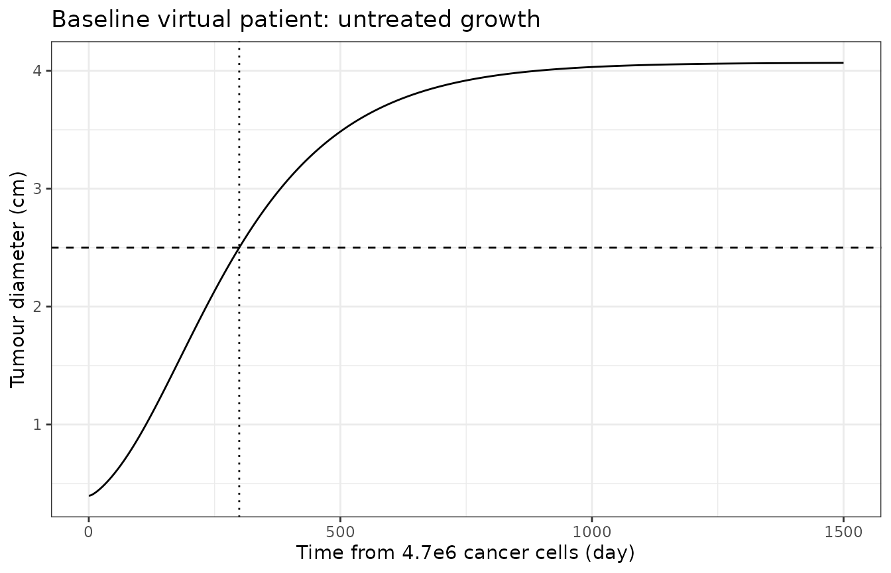
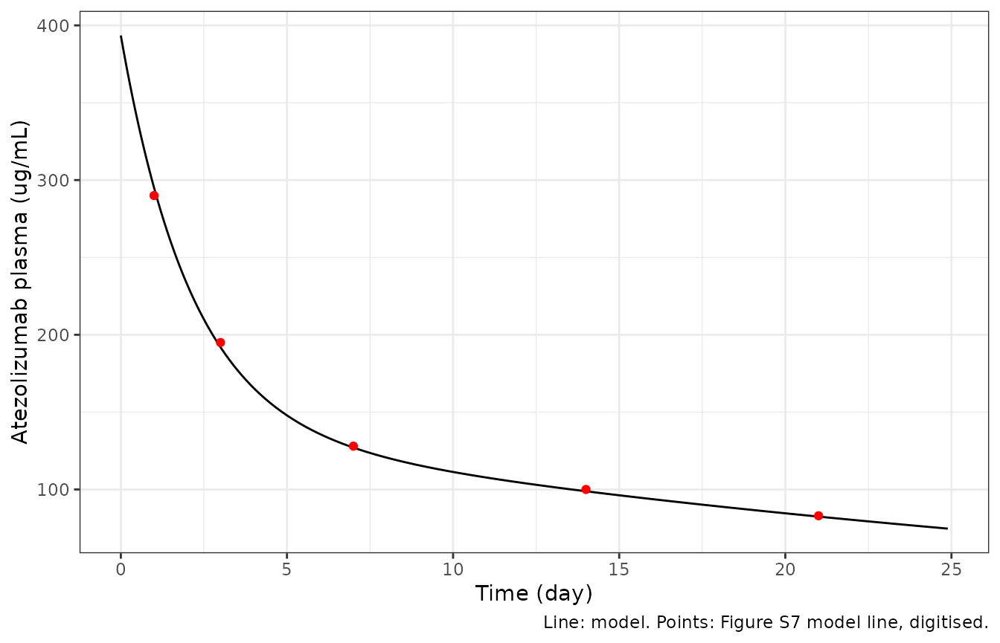
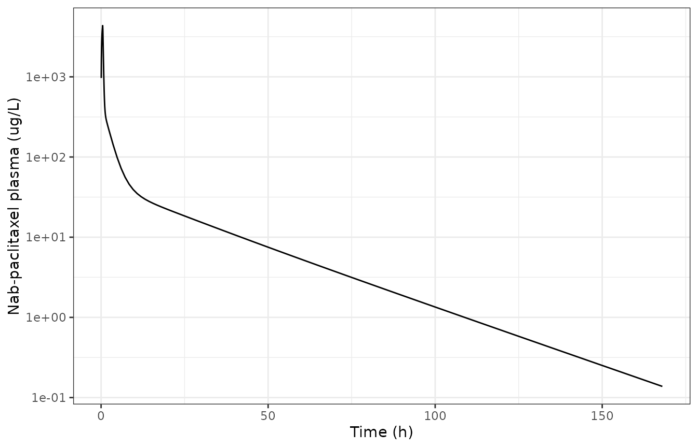
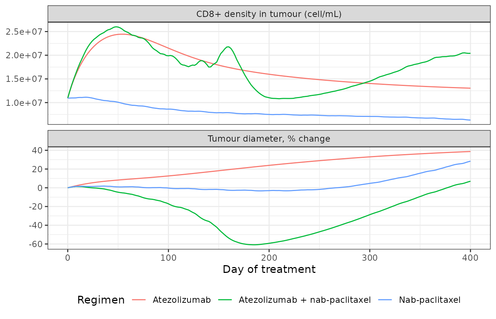
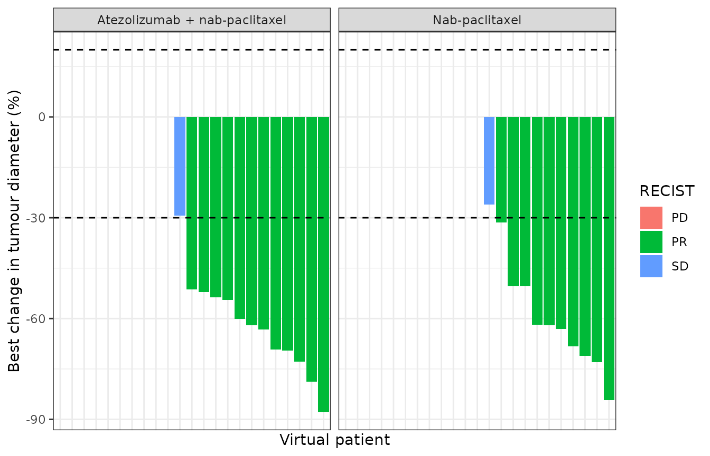

# Atezolizumab + nab-paclitaxel in TNBC, QSP (Wang 2021)

``` r

library(nlmixr2lib)
library(rxode2)
library(PKNCA)
library(dplyr)
library(ggplot2)
```

This vignette validates the `Wang_2021_atezolizumab_nabpaclitaxel_qsp`
model against its source.

- Reference: Wang H, Ma H, Sove RJ, Emens LA, Popel AS. Quantitative
  systems pharmacology model predictions for efficacy of atezolizumab
  and nab-paclitaxel in triple-negative breast cancer. J Immunother
  Cancer. 2021;9(2):e002100. <doi:10.1136/jitc-2020-002100>. Model code:
  QSPIO-TNBC v1.0, <doi:10.5281/zenodo.4437288>.

The model is the QSP-IO platform for triple-negative breast cancer
(TNBC) as published by Wang et al. It is a translation of the complete
SimBiology export shipped as the paper’s supplementary spreadsheet: 12
compartments (Table S2), 145 species (Table S3), 271 parameters (Table
S4), 215 reactions (Table S5) and 54 rules (Table S6). Five species are
set by rules, which leaves the 140 ODEs the paper reports. The authors’
model-generation code (QSPIO-TNBC v1.0, <doi:10.5281/zenodo.4437288>)
was used to settle details the spreadsheet does not carry: user-defined
units, dosing objects, the pre-treatment initialisation and the
virtual-patient sampling.

This is a **deterministic mechanism model**. The authors represented
between-patient variability by Latin hypercube sampling of the 26
parameter distributions in Supplementary Table S1, not by fitting
inter-individual or residual variability. The
[`ini()`](https://nlmixr2.github.io/rxode2/reference/ini.html) block
therefore contains no etas and no error model.

``` r

mod <- rxode2::rxode2(readModelDb("Wang_2021_atezolizumab_nabpaclitaxel_qsp"))
length(mod$state)
#> [1] 140
stopifnot(length(mod$state) == 140)
```

## Population

| Field | Value |
|:---|:---|
| Species | human (in silico virtual cohort) |
| Disease state | metastatic triple-negative breast cancer |
| Virtual patients | 900 |
| Clinical studies | 2 |
| Dosing | Atezolizumab 1200 mg IV every 3 weeks (monotherapy) or 840 mg IV on days 1 and 15 of each 28-day cycle, with nab-paclitaxel 100 mg/m^2 IV (30-minute infusion) on days 1, 8 and 15 of each 28-day cycle. Alternative nab-paclitaxel regimens of 125 mg/m^2 on days 1 and 8 of a 21-day cycle and 260 mg/m^2 every 3 weeks were also simulated. |

Population metadata (Wang 2021 Methods and Results). {.table}

The virtual cohort represents patients with metastatic TNBC. It was
calibrated against two data sets: the phase I atezolizumab monotherapy
trial NCT01375842 (116 enrolled, 115 evaluable), and the placebo plus
nab-paclitaxel arm of IMpassion130. The atezolizumab plus nab-paclitaxel
arm of IMpassion130 was held out for validation. The authors generated
900 virtual patients that passed a pre-treatment plausibility filter on
tumour T-cell densities. Each was simulated for 400 days of treatment,
with tumour diameter recorded every 8 weeks and scored by RECIST v1.1.

## Source trace

| Component | Source |
|:---|:---|
| Compartment capacities (`vol_*`) | Supplementary Table S2 |
| Species initial amounts (`q_*(0)`, `c_*(0)`) | Supplementary Table S3 and the initialAssignment rules of Table S6 |
| All [`ini()`](https://nlmixr2.github.io/rxode2/reference/ini.html) parameters | Supplementary Table S4 (each line carries the tabulated value and unit) |
| 215 reaction fluxes (`v1` … `v215`) | Supplementary Table S5 |
| 54 algebraic rules | Supplementary Table S6 (repeatedAssignment rules) |
| Gompertzian cancer growth with dynamic capacity | Supplementary Methods, Cancer Module; Table S5 R4-R7, R189-R197; Table S6 rule 51 |
| Antibody PK (central, peripheral, tumour, lymph node) | Supplementary Methods, Pharmacokinetic Module; Table S5 R91-R108 |
| Nab-paclitaxel PK (three compartments, Michaelis-Menten) | Supplementary Methods, Nab-Paclitaxel Module; Table S5 R186-R188; Table S6 rule 46 |
| User units `cell` and `mU` | QSPIO-TNBC v1.0 `immune_oncology_model_TNBC.m` (`cell` = molecule, `mU` = mole/liter) |
| Cell-count floors for C1, C2 and K | QSPIO-TNBC v1.0 `cancer_module.m` and `nabpaclitaxel_module.m` (addevent) |
| Entinostat dosing lag and duration (`lagP`, `durP`) | Supplementary Table S4; QSPIO-TNBC v1.0 `schedule_dosing.m` |
| Pre-treatment growth to the initial diameter | Methods, Model initiation; Supplementary Methods; `initial_conditions.m` |
| Dosing objects (atezolizumab MW, nab-paclitaxel infusion) | QSPIO-TNBC v1.0 `schedule_dosing.m` |
| Virtual-patient parameter distributions | Supplementary Table S1; QSPIO-TNBC v1.0 `PSA_param_in_TNBC.m` |
| Pre-treatment plausibility filter | Methods, Virtual patient generation; QSPIO-TNBC v1.0 `PSA_param_out.m` |
| RECIST scoring | Discussion; QSPIO-TNBC v1.0 `responseStatus.m` |
| Pre-treatment biomarker medians | Figure 3 |
| Atezolizumab plasma profile | Supplementary Figure S7 |
| Efficacy targets (ORR, CR, PR, SD, PD) | Table 1 |

Where each model component comes from. {.table}

### Unit system and state representation

The SimBiology model was built with unit conversion switched on. Every
[`ini()`](https://nlmixr2.github.io/rxode2/reference/ini.html) value is
converted to one base system: day, litre (dm^3), dm^2, nmol, cell, ug
and mU. Each line keeps the tabulated value and unit in its trailing
comment. The authors’ driver script defines two user units. `cell` is a
molecule-like count, and `mU` (arginase-I enzyme activity) is a
concentration equal to mole/liter. Arginase-I only enters the model
through ratios with other mU quantities, so it is carried in its own mU
dimension. Dimensional analysis of every rate law and rule in the export
is consistent in this system, and no expression needs `cell` to equal
`molecule`.

The states are chosen so that the solver’s absolute tolerance is
meaningful:

- `q_*` states are amounts: cells, nmol, ug or molecules. This covers
  every tumour species (the tumour volume changes, so SimBiology
  conserves amounts there), the dosed species and the other body
  compartments. The `Treg_CTLA4*` species are counted in molecules, as
  tabulated.
- `c_*` states are concentrations: nmol/L in the APC endosome, and
  molecule/um^2 on the APC and immunological-synapse surfaces. In nmol
  these amounts would be around 1e-20 and below any workable tolerance.
- `x_*` is each species in the unit system of the rate laws. The fluxes
  `v1` to `v215` are amounts per day.

Doses are amounts. Atezolizumab goes into `q_V_C_atezo` in nmol,
converted with the 143.6 kDa molar mass of the authors’ dosing script.
Nab-paclitaxel goes into `q_V_1_NabP` in ug, as a 30-minute infusion.

``` r

MW_atezo <- 1.436e8 # mg/mol (schedule_dosing.m)
atezo_nmol <- function(mg) mg / MW_atezo * 1e9
nabp_ug <- function(mg_m2, bsa_m2 = 1.9) mg_m2 * bsa_m2 * 1000

# Dose records for one virtual patient, starting at time t0.
dose_rows <- function(id, t0, atezo_mg = 0, atezo_ii = 21, atezo_start = 0,
                      nabp_mg_m2 = 0, nabp_days = c(0, 7, 14), nabp_cycle = 28,
                      nabp_start = 0, bsa_m2 = 1.9, horizon = 400) {
  out <- data.frame(id = integer(), time = numeric(), amt = numeric(),
                    rate = numeric(), cmt = character(), evid = integer())
  if (atezo_mg > 0) {
    tt <- t0 + seq(atezo_start, horizon - 1, by = atezo_ii)
    out <- rbind(out, data.frame(id = id, time = tt, amt = atezo_nmol(atezo_mg),
                                 rate = 0, cmt = "q_V_C_atezo", evid = 1L))
  }
  if (nabp_mg_m2 > 0) {
    tt <- as.vector(outer(nabp_days, seq(nabp_start, horizon - 1, by = nabp_cycle), "+"))
    tt <- t0 + sort(tt[tt < horizon])
    amt <- nabp_ug(nabp_mg_m2, bsa_m2)
    out <- rbind(out, data.frame(id = id, time = tt, amt = amt,
                                 rate = amt / (30 / 1440), cmt = "q_V_1_NabP", evid = 1L))
  }
  out
}
obs_rows <- function(id, times) {
  data.frame(id = id, time = times, amt = 0, rate = 0, cmt = "q_V_T_C1", evid = 0L)
}
solve <- function(ev, ...) {
  ev <- ev[order(ev$id, ev$time, -ev$evid), ]
  out <- as.data.frame(rxode2::rxSolve(mod, ev, maxsteps = 1e6, returnType = "data.frame", ...))
  # rxode2 drops the id column when the event table has a single subject
  if (!"id" %in% names(out)) out$id <- ev$id[1]
  out
}
```

## Pre-treatment tumour growth

The authors do not start a virtual patient at its pre-treatment state.
Each patient starts from 4.7e6 cancer cells, a 4 mm tumour (Table S3).
It is grown without treatment until the tumour reaches its pre-treatment
diameter (`initial_tumour_diameter`, 2.5 cm at baseline). The state at
that moment is the patient’s pre-treatment condition. The model is
autonomous, so dosing from the first time that
`pretreatment_size_reached` becomes 1 is equivalent to the authors’
save-and-reinitialise step.

``` r

growth <- solve(obs_rows(1L, seq(0, 1500, by = 1)))
t_init <- growth$time[which(growth$pretreatment_size_reached == 1)[1]]
t_init
#> [1] 299

ggplot(growth, aes(time, tumour_diameter_cm)) +
  geom_line() +
  geom_hline(yintercept = 2.5, linetype = 2) +
  geom_vline(xintercept = t_init, linetype = 3) +
  labs(x = "Time from 4.7e6 cancer cells (day)", y = "Tumour diameter (cm)",
       title = "Baseline virtual patient: untreated growth") +
  theme_bw()
```



Figure 3 of the paper shows the pre-treatment biomarker distributions of
the 900 virtual patients. The baseline-parameter patient sits close to
the medians read from those box plots:

``` r

pre <- growth[growth$time == t_init, ]
fig3 <- data.frame(
  Biomarker = c("CD8+ density (cell/mL)", "CD4+ density (cell/mL)",
                "Treg density (cell/mL)", "MDSC density (cell/mL)",
                "CD8/Treg ratio", "CD4/Treg ratio"),
  Model = c(pre$CD8_density, pre$CD4_density, pre$Treg_density,
            pre$MDSC_density, pre$CD8_Treg_ratio, pre$CD4_Treg_ratio),
  Figure3_median = c(1.5e7, 2e7, 7e6, 1.7e5, 2, 2.6)
)
fig3$Ratio <- fig3$Model / fig3$Figure3_median
knitr::kable(fig3, digits = 3, format.args = list(big.mark = ","),
             caption = "Baseline patient at the pre-treatment diameter vs the Figure 3 medians (read from the box plots, all arms pooled).")
```

| Biomarker              |          Model | Figure3_median | Ratio |
|:-----------------------|---------------:|---------------:|------:|
| CD8+ density (cell/mL) | 10,942,361.226 |        1.5e+07 | 0.729 |
| CD4+ density (cell/mL) | 22,164,450.669 |        2.0e+07 | 1.108 |
| Treg density (cell/mL) |  9,453,683.037 |        7.0e+06 | 1.351 |
| MDSC density (cell/mL) |    160,455.036 |        1.7e+05 | 0.944 |
| CD8/Treg ratio         |          1.157 |        2.0e+00 | 0.579 |
| CD4/Treg ratio         |          2.345 |        2.6e+00 | 0.902 |

Baseline patient at the pre-treatment diameter vs the Figure 3 medians
(read from the box plots, all arms pooled). {.table}

``` r


# Deterministic solve with the baseline parameters. A mis-scaled flux, unit or
# volume moves these densities by orders of magnitude; a factor of 3 absorbs
# the reading of a log-scale box plot and the gap between the baseline patient
# and the cohort median.
stopifnot(
  abs(pre$tumour_diameter_cm - 2.5) < 0.02,
  all(fig3$Ratio > 1 / 3 & fig3$Ratio < 3)
)
```

## Atezolizumab pharmacokinetics (Figure S7)

Supplementary Figure S7 overlays the model’s plasma profile after 1200
mg on the clinical data of Stroh et al. The model’s plasma concentration
is the central amount over the plasma volume fraction, `Cp_atezo`. The
figure’s model line was digitised by the maintainers at the plotted time
points.

``` r

pk_times <- sort(unique(c(0, 10^seq(-3, log10(1500), length.out = 400), 1, 3, 7, 14, 21)))
pk_ev <- rbind(
  data.frame(id = 1L, time = 0, amt = atezo_nmol(1200), rate = 0, cmt = "q_V_C_atezo", evid = 1L),
  obs_rows(1L, pk_times)
)
pk <- solve(pk_ev, atol = 1e-10, rtol = 1e-8)
pk$Cp_ug_mL <- pk$Cp_atezo * MW_atezo / 1e9 # nmol/L x mg/mol -> mg/L = ug/mL

figS7 <- data.frame(time = c(1, 3, 7, 14, 21), FigureS7 = c(290, 195, 128, 100, 83))
figS7$Model <- pk$Cp_ug_mL[match(figS7$time, pk$time)]
figS7$pct_diff <- 100 * (figS7$Model - figS7$FigureS7) / figS7$FigureS7
knitr::kable(figS7, digits = 1,
             caption = "Plasma atezolizumab (ug/mL) after 1200 mg: model vs the Figure S7 model line.")
```

| time | FigureS7 | Model | pct_diff |
|-----:|---------:|------:|---------:|
|    1 |      290 | 295.0 |      1.7 |
|    3 |      195 | 191.9 |     -1.6 |
|    7 |      128 | 127.1 |     -0.7 |
|   14 |      100 |  98.8 |     -1.2 |
|   21 |       83 |  82.5 |     -0.7 |

Plasma atezolizumab (ug/mL) after 1200 mg: model vs the Figure S7 model
line. {.table}

``` r

# Deterministic. Digitising a linear axis is good to a few ug/mL; a wrong
# clearance, volume fraction or molar mass moves these by tens of percent.
stopifnot(all(abs(figS7$pct_diff) < 10))

ggplot(pk[pk$time <= 25, ], aes(time, Cp_ug_mL)) +
  geom_line() +
  geom_point(data = figS7, aes(time, FigureS7), colour = "red") +
  labs(x = "Time (day)", y = "Atezolizumab plasma (ug/mL)",
       caption = "Line: model. Points: Figure S7 model line, digitised.") +
  theme_bw()
```



PKNCA on the central concentration gives an exact mass-balance check.
Central clearance (reaction 102) is the only elimination route, so
`k_cl_atezo` times AUC(0-inf) must return the dose.

``` r

conc <- pk |>
  dplyr::filter(!is.na(Cc_atezo)) |>
  dplyr::mutate(treatment = "1200 mg")
conc_obj <- PKNCA::PKNCAconc(conc, Cc_atezo ~ time | treatment + id)
dose_obj <- PKNCA::PKNCAdose(data.frame(id = 1L, time = 0, amt = atezo_nmol(1200),
                                        treatment = "1200 mg"),
                             amt ~ time | treatment + id, route = "intravascular")
intervals <- data.frame(start = 0, end = Inf, cmax = TRUE, aucinf.obs = TRUE,
                        half.life = TRUE)
nca <- PKNCA::pk.nca(PKNCA::PKNCAdata(conc_obj, dose_obj, intervals = intervals))
nca_tab <- as.data.frame(nca$result)
knitr::kable(nca_tab[, c("PPTESTCD", "PPORRES")], digits = 3,
             caption = "NCA of central atezolizumab (nmol/L, day) after 1200 mg.")
```

| PPTESTCD            |   PPORRES |
|:--------------------|----------:|
| cmax                |  1671.309 |
| tmax                |     0.000 |
| tlast               |  1500.000 |
| clast.obs           |     0.000 |
| lambda.z            |     0.025 |
| r.squared           |     1.000 |
| adj.r.squared       |     1.000 |
| lambda.z.time.first |     2.933 |
| lambda.z.time.last  |  1500.000 |
| lambda.z.n.points   |   180.000 |
| clast.pred          |     0.000 |
| half.life           |    27.226 |
| span.ratio          |    54.987 |
| aucinf.obs          | 25792.159 |

NCA of central atezolizumab (nmol/L, day) after 1200 mg. {.table}

``` r

auc <- nca_tab$PPORRES[nca_tab$PPTESTCD == "aucinf.obs"]
stopifnot(length(auc) == 1)
recovered <- auc * mod$theta[["k_cl_atezo"]]
c(dose_nmol = atezo_nmol(1200), cl_times_auc = recovered)
#>    dose_nmol cl_times_auc 
#>     8356.546     8356.660
stopifnot(abs(recovered / atezo_nmol(1200) - 1) < 0.01)
```

## Nab-paclitaxel pharmacokinetics

Nab-paclitaxel follows the three-compartment model of Chen et al., with
saturable elimination and saturable distribution to V2 (reactions
186-188). The tumour concentration is a fixed multiple, `r_nabp`, of the
plasma level (rule 46). The paper tabulates no nab-paclitaxel NCA, so
the profile is shown for reference. The check is that the
end-of-infusion peak falls between two bounds: the level if all 190 mg
stayed in V1, and the level if it spread instantly over all three
compartments.

``` r

np_ev <- rbind(
  dose_rows(1L, 0, nabp_mg_m2 = 100, nabp_days = 0, horizon = 1),
  obs_rows(1L, sort(unique(c(seq(0, 0.1, by = 0.002), seq(0.1, 7, by = 0.05)))))
)
np <- solve(np_ev, atol = 1e-10, rtol = 1e-8)
np_conc <- np |>
  dplyr::filter(!is.na(Cc_nabp)) |>
  dplyr::mutate(treatment = "100 mg/m2", time_h = time * 24)
np_nca <- PKNCA::pk.nca(PKNCA::PKNCAdata(
  PKNCA::PKNCAconc(np_conc, Cc_nabp ~ time_h | treatment + id),
  PKNCA::PKNCAdose(data.frame(id = 1L, time_h = 0, amt = nabp_ug(100), treatment = "100 mg/m2"),
                   amt ~ time_h | treatment + id, route = "intravascular", duration = 0.5),
  intervals = data.frame(start = 0, end = 168, cmax = TRUE, tmax = TRUE, auclast = TRUE)
))
knitr::kable(as.data.frame(np_nca$result)[, c("PPTESTCD", "PPORRES")], digits = 2,
             caption = "NCA of plasma nab-paclitaxel (ug/L, h) after 100 mg/m^2 over 30 minutes, BSA 1.9 m^2.")
```

| PPTESTCD | PPORRES |
|:---------|--------:|
| auclast  | 4261.87 |
| cmax     | 4351.64 |
| tmax     |    0.48 |

NCA of plasma nab-paclitaxel (ug/L, h) after 100 mg/m^2 over 30 minutes,
BSA 1.9 m^2. {.table}

``` r

cmax_np <- max(np_conc$Cc_nabp)
stopifnot(
  cmax_np < nabp_ug(100) / mod$theta[["vol_V_1"]],
  cmax_np > nabp_ug(100) / (mod$theta[["vol_V_1"]] + mod$theta[["vol_V_3"]] + mod$theta[["vol_V_2"]])
)

ggplot(np_conc[np_conc$time_h > 0, ], aes(time_h, Cc_nabp)) +
  geom_line() +
  scale_y_log10() +
  labs(x = "Time (h)", y = "Nab-paclitaxel plasma (ug/L)") +
  theme_bw()
```



## Treatment of the baseline virtual patient

Figure S1 of the paper shows sample time courses under the combination.
The three regimens of Table 1 and Figure 2 are applied here to the
baseline patient:

- atezolizumab 1200 mg every 3 weeks;
- nab-paclitaxel 100 mg/m^2 on days 1, 8 and 15 of each 28-day cycle;
- atezolizumab 840 mg on days 1 and 15 plus nab-paclitaxel on days 1, 8
  and 15 of each 28-day cycle.

``` r

obs_t <- c(seq(0, t_init, by = 5), t_init + seq(0, 400, by = 2))
regimens <- list(
  "Atezolizumab" = list(atezo_mg = 1200, atezo_ii = 21, nabp_mg_m2 = 0),
  "Nab-paclitaxel" = list(atezo_mg = 0, atezo_ii = 21, nabp_mg_m2 = 100),
  "Atezolizumab + nab-paclitaxel" = list(atezo_mg = 840, atezo_ii = 14, nabp_mg_m2 = 100)
)
ev_typ <- do.call(rbind, lapply(seq_along(regimens), function(i) {
  r <- regimens[[i]]
  rbind(dose_rows(i, t_init, atezo_mg = r$atezo_mg, atezo_ii = r$atezo_ii,
                  nabp_mg_m2 = r$nabp_mg_m2),
        obs_rows(i, obs_t))
}))
typ <- solve(ev_typ) |>
  dplyr::filter(time >= t_init) |>
  dplyr::mutate(Regimen = names(regimens)[id], day = time - t_init) |>
  dplyr::group_by(Regimen) |>
  dplyr::mutate(pct_change = 100 * (tumour_diameter_cm / tumour_diameter_cm[1] - 1)) |>
  dplyr::ungroup()

typ |>
  tidyr::pivot_longer(c(pct_change, CD8_density), names_to = "Output", values_to = "value") |>
  dplyr::mutate(Output = dplyr::recode(Output, pct_change = "Tumour diameter, % change",
                                       CD8_density = "CD8+ density in tumour (cell/mL)")) |>
  ggplot(aes(day, value, colour = Regimen)) +
  geom_line() +
  facet_wrap(~Output, scales = "free_y", ncol = 1) +
  labs(x = "Day of treatment", y = NULL) +
  theme_bw() +
  theme(legend.position = "bottom")
```



``` r


best <- typ |>
  dplyr::group_by(Regimen) |>
  dplyr::summarise(best_pct_change = min(pct_change),
                   week8_pct_change = pct_change[day == 56],
                   CD8_week8_over_pre = CD8_density[day == 56] / CD8_density[1])
knitr::kable(best, digits = 2, caption = "Baseline patient: tumour response and CD8+ expansion.")
```

| Regimen | best_pct_change | week8_pct_change | CD8_week8_over_pre |
|:---|---:|---:|---:|
| Atezolizumab | 0.00 | 8.77 | 2.23 |
| Atezolizumab + nab-paclitaxel | -60.84 | -5.60 | 2.30 |
| Nab-paclitaxel | -3.32 | 0.98 | 0.89 |

Baseline patient: tumour response and CD8+ expansion. {.table}

The baseline patient shows the pattern the paper reports for the cohort.
On atezolizumab alone the tumour keeps growing, but CD8+ density rises.
On nab-paclitaxel alone the disease is stable. The combination gives a
partial response (a best diameter change below -30%) and the largest
CD8+ expansion by week 8 (Figure S3).

``` r

b <- setNames(best$best_pct_change, best$Regimen)
cd8 <- setNames(best$CD8_week8_over_pre, best$Regimen)
# Deterministic solve. The combination's best response is below -50%, far from
# the -30% RECIST threshold; each monotherapy's is above -30%.
stopifnot(
  b[["Atezolizumab + nab-paclitaxel"]] < -30,
  b[["Nab-paclitaxel"]] > -30,
  b[["Atezolizumab"]] > -30,
  cd8[["Atezolizumab"]] > 1.5,
  cd8[["Atezolizumab + nab-paclitaxel"]] > 1.5
)
```

## Sequential therapy (Figure 7)

Figure 7 compares the week-8 tumour volume when atezolizumab and
nab-paclitaxel start on day 1, at week 2 or at week 4. The paper reports
medians over the virtual cohort; here the grid is run for the baseline
patient, with nab-paclitaxel 100 mg/m^2 on days 1, 8 and 15 of each
28-day cycle.

``` r

starts <- c(0, 14, 28)
grid <- expand.grid(atezo_start = starts, nabp_start = starts)
ev_seq <- do.call(rbind, lapply(seq_len(nrow(grid)), function(i) {
  rbind(dose_rows(i, t_init, atezo_mg = 840, atezo_ii = 14, atezo_start = grid$atezo_start[i],
                  nabp_mg_m2 = 100, nabp_start = grid$nabp_start[i], horizon = 57),
        obs_rows(i, c(t_init, t_init + 56)))
}))
seq_out <- solve(ev_seq) |>
  dplyr::group_by(id) |>
  dplyr::summarise(volume_week8_mL = tumour_volume_mL[time == t_init + 56],
                   volume_pre_mL = tumour_volume_mL[time == t_init])
grid$volume_week8_mL <- seq_out$volume_week8_mL
knitr::kable(grid, digits = 2,
             caption = "Baseline patient: tumour volume (mL) at week 8 by start day of each drug.")
```

| atezo_start | nabp_start | volume_week8_mL |
|------------:|-----------:|----------------:|
|           0 |          0 |            6.88 |
|          14 |          0 |            7.60 |
|          28 |          0 |            8.10 |
|           0 |         14 |            8.09 |
|          14 |         14 |            8.84 |
|          28 |         14 |            9.46 |
|           0 |         28 |            9.10 |
|          14 |         28 |            9.82 |
|          28 |         28 |           10.44 |

Baseline patient: tumour volume (mL) at week 8 by start day of each
drug. {.table}

``` r

# Concurrent start from day 1 gives the smallest week-8 tumour (Figure 7A).
stopifnot(grid$volume_week8_mL[grid$atezo_start == 0 & grid$nabp_start == 0] ==
            min(grid$volume_week8_mL))
```

## Virtual clinical trial (Table 1, Figure 2)

The cohort below uses the Table S1 distributions as implemented in the
authors’ sampling script. The “geometric standard deviation” column of
Table S1 is the standard deviation of the log-normal on the log scale.
Values are drawn by Latin hypercube sampling in base R with a fixed
seed, so the cohort does not depend on the solver’s thread count. Each
patient is grown to its own pre-treatment diameter. It is kept only if
it reaches that diameter within 8000 days and its pre-treatment state
passes the authors’ plausibility filter: CD8+ and Treg densities between
1e5 and 1e9 cell/mL, a CD8+/Treg ratio between 0.01 and 20, and a
CD4+/Treg ratio between 1 and 20. The authors used 1200 draws; the
maintainers use 40 to keep the render short, so the response rates below
carry a binomial standard error of about 11 percentage points.

``` r

set.seed(20210113)
n_vp <- 40
lhs_u <- function(n) (sample(n) - stats::runif(n)) / n
r_lnorm <- function(med, sdlog) exp(log(med) + sdlog * stats::qnorm(lhs_u(n_vp)))
r_lunif <- function(lo, hi) exp(log(lo) + (log(hi) - log(lo)) * lhs_u(n_vp))
r_unif <- function(lo, hi) lo + (hi - lo) * lhs_u(n_vp)
navg <- mod$theta[["NAVG_nmol"]]
# Table S1 values in their tabulated units, converted to the model's base units.
vp <- data.frame(
  id = seq_len(n_vp),
  k_C1_growth = r_lnorm(0.0087, 1),
  k_C_T1 = r_lnorm(0.9, 1),
  k_P1_d1 = r_lnorm(27, 1),                        # nM
  n_T1_clones = r_lnorm(63, 0.7),
  n_T0_clones = r_lnorm(63, 0.7),
  initial_tumour_diameter = r_lnorm(2.5, 0.3) / 10, # cm -> dm
  MDSC_max = r_lnorm(1.637e5, 1) * 1000,            # cell/mL -> cell/L
  k_reg = r_lnorm(0.022, 1),
  IC50_nabp = r_lnorm(47, 1.1),                     # 4.7e-8 M -> nM
  k_C_resist = r_lnorm(1e-4, 1),
  k_c_nabp = r_lnorm(0.017, 1) * 1e-6,              # pg -> ug per cell per day
  k_C1_death = r_lunif(1e-5, 1e-3),
  k_T1 = r_lunif(0.01, 1),
  k_Treg = r_lunif(0.01, 1),
  C1_PDL1_base = r_lunif(9000, 180000) / navg,      # molecule -> nmol
  APC_PDL1_base = r_lunif(13000, 266666) / navg,
  k_K_g = r_unif(2.9, 6.9),
  Vmcl = r_unif(6500, 9836) * 24,                   # ug/h -> ug/day
  Kcl = r_unif(24.9, 58.9),
  Vmt = r_unif(190694, 540445) * 24,
  Kt = r_unif(2210, 7910),
  BSA = r_unif(1.3, 2.4) * 100,                     # m^2 -> dm^2
  vol_V_1 = r_unif(13.71, 17.85),
  vol_V_2 = r_unif(1396, 1935),
  vol_V_3 = r_unif(59.8, 99.1),
  r_nabp = r_unif(1, 2)
)
stopifnot(ncol(vp) - 1 == 26)
```

``` r

grow <- solve(do.call(rbind, lapply(vp$id, obs_rows, times = seq(0, 8000, by = 2))),
              params = vp)
pre_vp <- grow |>
  dplyr::group_by(id) |>
  dplyr::summarise(
    reached = any(pretreatment_size_reached == 1),
    t_init = time[which(pretreatment_size_reached == 1)[1]],
    CD8 = CD8_density[which(pretreatment_size_reached == 1)[1]],
    Treg = Treg_density[which(pretreatment_size_reached == 1)[1]],
    r8 = CD8_Treg_ratio[which(pretreatment_size_reached == 1)[1]],
    r4 = CD4_Treg_ratio[which(pretreatment_size_reached == 1)[1]]
  ) |>
  dplyr::mutate(accepted = reached & CD8 >= 1e5 & CD8 <= 1e9 & Treg >= 1e5 & Treg <= 1e9 &
                  r8 >= 0.01 & r8 <= 20 & r4 >= 1 & r4 <= 20)
pre_vp$accepted[is.na(pre_vp$accepted)] <- FALSE
table(reached = pre_vp$reached, accepted = pre_vp$accepted)
#>        accepted
#> reached FALSE TRUE
#>   FALSE     7    0
#>   TRUE     10   23
acc <- pre_vp[pre_vp$accepted, ]
stopifnot(nrow(acc) >= 10)
```

``` r

assess <- c(seq(0, 392, by = 56), 400) # tumour measured every 8 weeks
run_arm <- function(atezo_mg, atezo_ii, nabp_mg_m2) {
  ev <- do.call(rbind, lapply(seq_len(nrow(acc)), function(i) {
    rbind(dose_rows(acc$id[i], acc$t_init[i], atezo_mg = atezo_mg, atezo_ii = atezo_ii,
                    nabp_mg_m2 = nabp_mg_m2, bsa_m2 = vp$BSA[acc$id[i]] / 100),
          obs_rows(acc$id[i], acc$t_init[i] + assess))
  }))
  solve(ev, params = vp[vp$id %in% acc$id, ])
}
# RECIST as in responseStatus.m: CR/PR at a >= 30% diameter reduction (CR if the
# tumour falls below 2 mm); PD if, before any response, the diameter regrows by
# >= 20% (and >= 0.5 mm) from its nadir within the first 8 weeks; otherwise SD.
recist <- function(d) {
  D <- d$tumour_diameter_cm
  day <- d$time - d$time[1]
  pc <- 100 * (D / D[1] - 1)
  i_min <- which.min(D)
  regrow <- max(D[i_min:length(D)]) >= 1.2 * D[i_min] &&
    (max(D[i_min:length(D)]) - min(D)) * 10 >= 0.5
  t_prog <- if (regrow) day[i_min - 1 + which(D[i_min:length(D)] >= 1.2 * D[i_min])[1]] else Inf
  status <- if (min(pc) <= -30) {
    if (min(D) < 0.2) "CR" else "PR"
  } else if (regrow && t_prog <= 56) "PD" else "SD"
  data.frame(id = d$id[1], best_pct_change = min(pc), status = status)
}
arms <- list(
  "Nab-paclitaxel" = run_arm(0, 21, 100),
  "Atezolizumab + nab-paclitaxel" = run_arm(840, 14, 100)
)
resp <- do.call(rbind, lapply(names(arms), function(a) {
  out <- do.call(rbind, lapply(split(arms[[a]], arms[[a]]$id), recist))
  out$Arm <- a
  out
}))
```

``` r

paper <- data.frame(
  Arm = c("Nab-paclitaxel", "Atezolizumab + nab-paclitaxel"),
  ORR = c(46.4, 59.1), CR = c(2.0, 2.4), PR = c(44.4, 56.7),
  SD = c(30.7, 23.6), PD = c(22.9, 17.3)
)
sim <- resp |>
  dplyr::group_by(Arm) |>
  dplyr::summarise(
    N = dplyr::n(),
    ORR = 100 * mean(status %in% c("CR", "PR")),
    CR = 100 * mean(status == "CR"), PR = 100 * mean(status == "PR"),
    SD = 100 * mean(status == "SD"), PD = 100 * mean(status == "PD")
  )
cmp <- dplyr::inner_join(sim, paper, by = "Arm", suffix = c("_model", "_Table1"))
stopifnot(nrow(cmp) == 2)
cmp |>
  dplyr::select(Arm, N, ORR_model, ORR_Table1, CR_model, CR_Table1, PR_model, PR_Table1,
                SD_model, SD_Table1, PD_model, PD_Table1) |>
  dplyr::rename("Virtual patients" = N,
                "ORR % (model)" = ORR_model, "ORR % (Table 1)" = ORR_Table1,
                "CR % (model)" = CR_model, "CR % (Table 1)" = CR_Table1,
                "PR % (model)" = PR_model, "PR % (Table 1)" = PR_Table1,
                "SD % (model)" = SD_model, "SD % (Table 1)" = SD_Table1,
                "PD % (model)" = PD_model, "PD % (Table 1)" = PD_Table1) |>
  knitr::kable(digits = 1, caption = "Response by RECIST v1.1: small virtual cohort vs Table 1 (450 virtual patients per arm, bootstrap medians).")
```

| Arm | Virtual patients | ORR % (model) | ORR % (Table 1) | CR % (model) | CR % (Table 1) | PR % (model) | PR % (Table 1) | SD % (model) | SD % (Table 1) | PD % (model) | PD % (Table 1) |
|:---|---:|---:|---:|---:|---:|---:|---:|---:|---:|---:|---:|
| Atezolizumab + nab-paclitaxel | 23 | 52.2 | 59.1 | 0 | 2.4 | 52.2 | 56.7 | 30.4 | 23.6 | 17.4 | 17.3 |
| Nab-paclitaxel | 23 | 43.5 | 46.4 | 0 | 2.0 | 43.5 | 44.4 | 30.4 | 30.7 | 26.1 | 22.9 |

Response by RECIST v1.1: small virtual cohort vs Table 1 (450 virtual
patients per arm, bootstrap medians). {.table}

``` r


ggplot(resp, aes(reorder(interaction(id, Arm), -best_pct_change), best_pct_change, fill = status)) +
  geom_col() +
  geom_hline(yintercept = c(-30, 20), linetype = 2) +
  facet_wrap(~Arm, scales = "free_x") +
  labs(x = "Virtual patient", y = "Best change in tumour diameter (%)", fill = "RECIST") +
  theme_bw() +
  theme(axis.text.x = element_blank(), axis.ticks.x = element_blank())
```



The same virtual patients receive both regimens, so the effect of adding
atezolizumab can be read patient by patient:

``` r

paired <- resp |>
  dplyr::select(id, Arm, best_pct_change) |>
  tidyr::pivot_wider(names_from = Arm, values_from = best_pct_change)
added <- paired[["Atezolizumab + nab-paclitaxel"]] - paired[["Nab-paclitaxel"]]
summary(added)
#>     Min.  1st Qu.   Median     Mean  3rd Qu.     Max. 
#> -60.0383  -4.6753  -0.8333  -7.0536   0.0000   0.0000
orr <- setNames(cmp$ORR_model, cmp$Arm)
# Structural, robust to which patients are drawn: adding atezolizumab never
# worsens the best response of the same patient (allow 1 point of numerical
# slack), and on average it deepens the response. The median patient is not
# used: most non-responders have a best change of exactly 0% on both arms, so
# the median difference sits next to zero. The ORR bands admit the binomial
# noise of ~20 patients (SE ~11 points) around Table 1 while still failing on a
# model that gives no responses or responds in everyone.
stopifnot(
  mean(added <= 1) >= 0.9,
  mean(added) < 0,
  orr[["Atezolizumab + nab-paclitaxel"]] >= orr[["Nab-paclitaxel"]],
  abs(orr[["Nab-paclitaxel"]] - 46.4) < 30,
  abs(orr[["Atezolizumab + nab-paclitaxel"]] - 59.1) < 30
)
```

## Assumptions and deviations

1.  **The Table S5 fluxes are amount rates. Nine are concentration rates
    that cross compartments, and these are scaled by the tumour
    volume.** SimBiology multiplies a concentration-rate law by a
    compartment capacity. For reactions 94/95, 100/101, 106/107 and
    183/184 (lymphatic drainage from the tumour to the node and on to
    the central compartment) and reaction 98 (atezolizumab exchange
    between the central and tumour compartments), the reactant and
    product sit in different compartments. The export does not record
    which capacity SimBiology used. The tumour volume is used for all
    nine, for three reasons:

    - The Supplementary Methods PK equations write drainage as a
      volumetric lymph flow, `Q_LD [A]/gamma`, in both the
      tumour-to-node and node-to-central terms. They also write the
      central-tumour exchange with an endothelial surface area of 28.4
      cm^2 per cm^3 of tumour.
    - `q_T_atezo` = 8.52e-6 1/s is exactly 3e-7 cm/s x 28.4 cm^(2/cm)3,
      a permeability-surface product per unit tumour volume.
    - The authors’ later code writes the drainage laws as
      `q_LD*V_T*...`, and the other ports of this platform in the
      package use the same rule.

    The v1.0 dosing code instead gives `q_T_atezo` as a fixed 8.52e-5
    mL/s, the value for a 10 mL tumour. The two readings agree to within
    20% for a 2.5 cm (8.2 mL) tumour. The spreadsheet is the paper’s own
    model table, so its value is used.

2.  **User units come from the authors’ driver script.** `cell` is
    defined as a molecule-like count and `mU` as mole/liter. These
    definitions are not in the supplement. Both are needed to read the
    arginase-I rows (`k_sec_ArgI` in mU\*uL/cell/day, species `ArgI` in
    mU) as a secretion rate and a concentration.

3.  **Cell-count floors are derivative floors.** The authors’ code adds
    three SimBiology events, which the spreadsheet does not list. These
    reset `V_T.C1`, `V_T.C2` and `V_T.K` to 0.01 cell whenever they fall
    below 0.5 cell. `rxode2` has no state-reset events, so the
    derivative is clamped to be non-negative below 0.5 cell. This pins
    the state near zero in the same way. The difference is confined to
    sub-single-cell counts.

4.  **Pre-treatment initialisation is done by the user.** The authors
    save the state at the pre-treatment diameter and restart the model
    from it, with the initial-assignment rules switched off. The
    packaged model starts from the Table S3 state (4.7e6 cancer cells).
    It exposes `pretreatment_size_reached` so that treatment can start
    at the first time it equals 1, as done above. Because the system is
    autonomous, this is equivalent.

5.  **Inherited but undosed limbs are retained.** The export carries the
    full platform, including nivolumab, ipilimumab (with CTLA-4 binding
    and Treg ADCC) and entinostat (with its buccal and gastrointestinal
    absorption). None is dosed in this paper, but all are kept because
    they are part of the published 215-reaction model. The entinostat
    dosing attributes `lagP` and `durP` are attached as `alag()` and
    `dur()`, as in the authors’ dosing script. Dose `q_V_C_ENT_Buccal`
    with `rate = -2`.

6.  **One Table S4 row is not carried into
    [`ini()`](https://nlmixr2.github.io/rxode2/reference/ini.html).**
    `A_syn` (37.8 um^2) is not referenced by any reaction or rule. The
    rate laws use the equal synapse compartment capacities of Table S2.

7.  **Molar mass of atezolizumab.** The Supplementary Methods quote 145
    kDa for the Stokes-Einstein radius. The authors’ dosing script
    converts doses with 143.6 kDa, which is used here for mg-to-nmol
    conversion. The difference is 1%.

8.  **Avogadro’s number.** The SI-defined 6.02214076e23 per mole
    converts molecule counts to nmol (`NAVG_nmol`).

9.  **Figure 3 and Figure S7 comparisons are digitised.** The Figure 3
    medians are read from log-scale box plots, and the Figure S7 values
    from the plotted model line. Both are compared with generous bounds.

10. **The virtual cohort is small.** Forty draws, rather than the
    authors’ 1200, keep the render within the time budget. Response
    rates therefore agree with Table 1 only within binomial noise.
    Duration of response (Figure S2) and the ROC and PRCC analyses
    (Figures 5 and S4) need the full cohort and are not reproduced.
