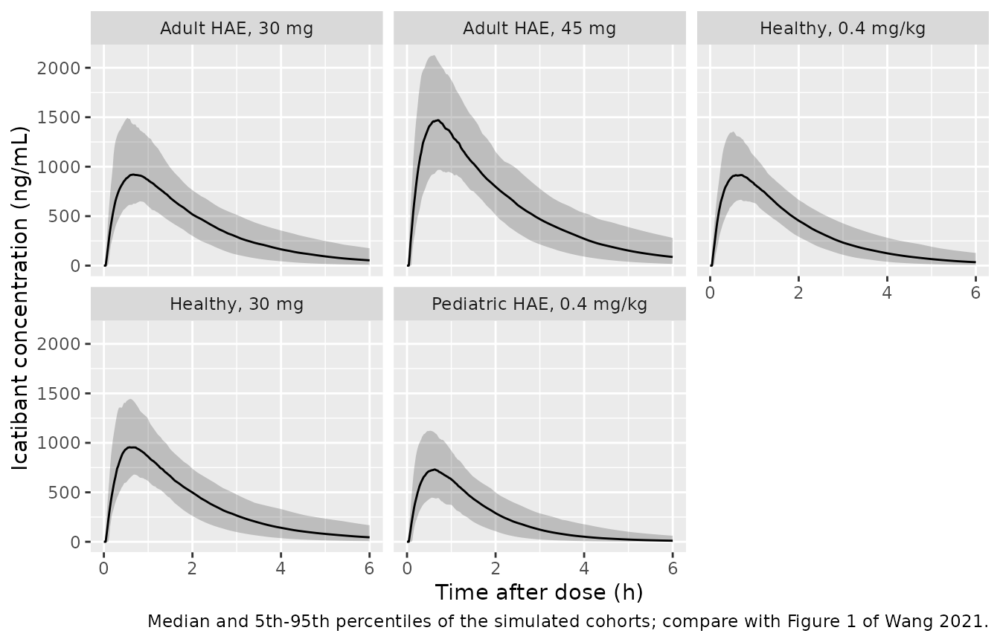
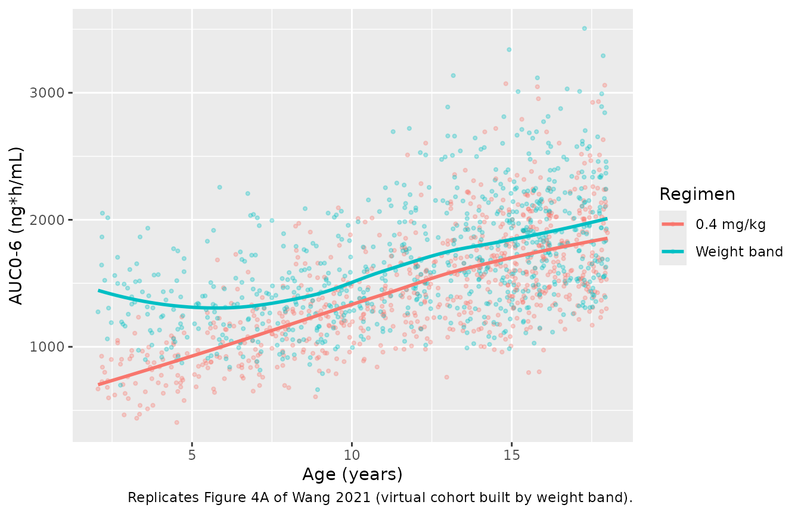

# Icatibant (Wang 2021)

## Model and source

- Citation: Wang Y, Jomphe C, Marier JF, Martin P. Population
  Pharmacokinetics and Exposure-Response Analyses to Guide Dosing of
  Icatibant in Pediatric Patients With Hereditary Angioedema. J Clin
  Pharmacol. 2021;61(4):555-564. <doi:10.1002/jcph.1768>
- Description: Two-compartment population pharmacokinetic model for
  subcutaneous icatibant, a bradykinin B2 receptor antagonist, in
  healthy adults and in adult and pediatric patients with hereditary
  angioedema (HAE) (Wang 2021). First-order absorption with a lag time;
  estimated allometric body-weight exponents shared by CL/F and Q/F and
  by Vc/F and Vp/F (70 kg reference); a linear age effect on CL/F
  centred at 25 years; female sex on CL/F and Vc/F; an acute HAE attack
  at dosing on CL/F; non-White race on Vc/F; proportional residual
  error.
- Article: <https://doi.org/10.1002/jcph.1768> (open access; PMC7984404)
- Supplement: Tables S1-S7 and Figures S1-S13, published with the
  article.

Icatibant is a synthetic decapeptide that antagonises the bradykinin B2
receptor. It is given subcutaneously to treat acute attacks of
hereditary angioedema (HAE). Wang 2021 pooled six studies to support a
weight-band dosing regimen for children and adolescents.

## Population

The analysis pooled 2172 measurable plasma concentrations from 172
subjects in six studies (Table 1; Tables S1-S3). There were 133 healthy
adults from four phase 1 studies (HGT-FIR-061, HGT-FIR-065, JE049-1102,
JE049-1103), 8 adults with HAE from a phase 2 study (JE049-2101), and 31
patients aged 2-17 years with HAE from the phase 3 pediatric study
HGT-FIR-086. Median age was 25.0 years (range 3.42-54.0), median body
weight 69.5 kg (range 12.3-102), and 41.3% of subjects were female. By
race, 76.7% were White, 20.9% Black or African American and 2.3% Other.
Adults received subcutaneous doses of 30 mg (single, or three doses 6 h
apart), 45 mg, or 0.05-0.4 mg/kg. Pediatric patients received a single
0.4 mg/kg dose capped at 30 mg. Twenty-nine subjects were dosed within
12 hours of the onset of an HAE attack: all 8 adult patients and 21 of
the 31 pediatric patients (Table S2).

The same information is available programmatically:

``` r

readModelDb("Wang_2021_icatibant")()$population
#> $species
#> [1] "human"
#> 
#> $n_subjects
#> [1] 172
#> 
#> $n_studies
#> [1] 6
#> 
#> $age_range
#> [1] "3.42-54.0 years"
#> 
#> $age_median
#> [1] "25.0 years"
#> 
#> $weight_range
#> [1] "12.3-102 kg"
#> 
#> $weight_median
#> [1] "69.5 kg"
#> 
#> $sex_female_pct
#> [1] 41.3
#> 
#> $race_ethnicity
#> White Black Other 
#>  76.7  20.9   2.3 
#> 
#> $disease_state
#> [1] "133 healthy adults (77.3%), 8 adults with hereditary angioedema (4.7%), and 31 children and adolescents aged 2-17 years with hereditary angioedema (18.0%); 29 subjects were dosed during an acute HAE attack"
#> 
#> $dose_range
#> [1] "Subcutaneous icatibant: 30 mg single dose, 3 x 30 mg every 6 h, 0.05-0.4 mg/kg single ascending doses, 30 or 45 mg single dose in adult patients, 0.4 mg/kg (capped at 30 mg) single dose in pediatric patients"
#> 
#> $regions
#> [1] "Not reported"
#> 
#> $notes
#> [1] "2172 measurable plasma icatibant concentrations (523 BLQ samples excluded; Table S3) pooled from four phase 1 studies in healthy adults (HGT-FIR-061, HGT-FIR-065, JE049-1102, JE049-1103), a phase 2 study in adult patients with HAE (JE049-2101) and a phase 3 pediatric study (HGT-FIR-086) (Table S1). Baseline demographics are in Table 1 and, by study, Table S2. The 90 mg dose arm of HGT-FIR-061 was excluded as supra-therapeutic (Table S1 footnote). NONMEM 7.3."
```

## Source trace

| Equation / parameter | Value | Source location |
|----|----|----|
| Structure: 2 compartments, first-order absorption with lag, linear elimination | n/a | Results “PopPK Modeling of Icatibant”; Table 2 |
| `lka` | log(3.27) 1/h | Table 2 |
| `ltlag` | log(0.0426) h | Table 2 |
| `lcl` | log(15.4) L/h | Table 2 |
| `lvc` | log(20.4) L | Table 2 |
| `lq` (Clp/F) | log(0.398) L/h | Table 2 |
| `lvp` | log(1.75) L | Table 2 |
| `e_wt_cl_q` | 0.516 | Table 2, (weight/70)^0.516 on Cl/F and Clp/F |
| `e_wt_vc_vp` | 0.671 | Table 2, (weight/70)^0.671 on Vc/F and Vp/F |
| `e_age_cl` | -0.0107 per year | Table 2, 1 + (-0.0107 x \[age - 25\]); Table S5 footnote a |
| `e_sexf_cl` | log(0.882) | Table 2, x 0.882 if female |
| `e_dis_hae_acute_cl` | log(0.911) | Table 2, x 0.911 if HAE attack |
| `e_sexf_vc` | log(0.855) | Table 2, x 0.855 if female |
| `e_nonwhite_vc` | log(1.11) | Table 2, x 1.11 if nonwhite |
| Categorical effects enter as exp(effect) | n/a | Table S5 footnote a |
| `etalka`, `etaltlag`, `etalcl`, `etalvc`, `etalq`, `etalvp` | 0.1174, 0.2694, 0.05025, 0.06986, 0.7711, 0.2550 | Table 2 BSV 35.3, 55.6, 22.7, 26.9, 107.8, 53.9%; omega^2 = log(CV^2 + 1) |
| `propSd` | 0.130 | Table 2, proportional error 13.0% |

## Typical-value checks

The paper states several quantities that follow directly from the final
estimates. These checks use the packaged parameter values with no
simulation noise, so they use tight tolerances.

``` r

mod <- readModelDb("Wang_2021_icatibant")
th <- rxode2::rxode2(mod)$theta
#> ℹ parameter labels from comments will be replaced by 'label()'

cl <- exp(th[["lcl"]])
vc <- exp(th[["lvc"]])
q <- exp(th[["lq"]])
vp <- exp(th[["lvp"]])
ka <- exp(th[["lka"]])

# Two-compartment disposition eigenvalues for the typical 70 kg adult
k10 <- cl / vc
k12 <- q / vc
k21 <- q / vp
s <- k10 + k12 + k21
alpha <- (s + sqrt(s^2 - 4 * k10 * k21)) / 2
beta <- (s - sqrt(s^2 - 4 * k10 * k21)) / 2

cl_ratio <- function(wt, age) {
  (wt / 70)^th[["e_wt_cl_q"]] * (1 + th[["e_age_cl"]] * (age - 25))
}

checks <- tibble::tribble(
  ~quantity, ~paper, ~model,
  "Absorption half-life (min)", 12.7, log(2) / ka * 60,
  "Distribution half-life (h)", 0.89, log(2) / alpha,
  "Terminal half-life (h)", 3.2, log(2) / beta,
  "CL/F ratio, 40 kg vs 70 kg (weight only)", 1 - 0.25, cl_ratio(40, 25),
  "CL/F ratio, 60 kg vs 70 kg (weight only)", 1 - 0.07, cl_ratio(60, 25),
  "CL/F ratio, age 10 vs 25 y (age only)", 1 + 0.16, cl_ratio(70, 10),
  "CL/F ratio, age 45 vs 25 y (age only)", 1 - 0.20, cl_ratio(70, 45),
  "CL/F ratio, female vs male", 1 - 0.12, exp(th[["e_sexf_cl"]]),
  "CL/F ratio, HAE attack vs none", 1 - 0.09, exp(th[["e_dis_hae_acute_cl"]]),
  "Vc/F ratio, non-White vs White", 1 + 0.11, exp(th[["e_nonwhite_vc"]])
) |>
  mutate(pct_diff = 100 * (model / paper - 1))

knitr::kable(checks, digits = 3, caption = "Quantities stated in the Results text versus the packaged model.")
```

| quantity                                 | paper |  model | pct_diff |
|:-----------------------------------------|------:|-------:|---------:|
| Absorption half-life (min)               | 12.70 | 12.718 |    0.144 |
| Distribution half-life (h)               |  0.89 |  0.886 |   -0.459 |
| Terminal half-life (h)                   |  3.20 |  3.159 |   -1.287 |
| CL/F ratio, 40 kg vs 70 kg (weight only) |  0.75 |  0.749 |   -0.108 |
| CL/F ratio, 60 kg vs 70 kg (weight only) |  0.93 |  0.924 |   -0.695 |
| CL/F ratio, age 10 vs 25 y (age only)    |  1.16 |  1.161 |    0.043 |
| CL/F ratio, age 45 vs 25 y (age only)    |  0.80 |  0.786 |   -1.750 |
| CL/F ratio, female vs male               |  0.88 |  0.882 |    0.227 |
| CL/F ratio, HAE attack vs none           |  0.91 |  0.911 |    0.110 |
| Vc/F ratio, non-White vs White           |  1.11 |  1.110 |    0.000 |

Quantities stated in the Results text versus the packaged model.
{.table}

``` r


# The paper rounds these statements to 2 significant figures or to whole
# percent, so allow 3%. A mis-transcribed CL, Vc, Q, Vp, ka or exponent moves
# at least one row by much more than that.
stopifnot(all(abs(checks$pct_diff) < 3))
```

The paper’s rounded statements are reproduced. The largest difference is
for age 45 years: the model gives 21.4% lower CL/F, which the Results
text reports as “20% slower”.

Mass balance on a typical-value solve: for a first-order input with
complete absorption, `AUC(0-inf) x CL/F = dose`.

``` r

mod_typ <- rxode2::zeroRe(mod)
#> ℹ parameter labels from comments will be replaced by 'label()'
typ_grid <- sort(unique(c(seq(0, 2, by = 0.01), seq(2, 72, by = 0.25))))
ev_typ <- dplyr::bind_rows(
  data.frame(id = 1L, time = 0, evid = 1L, amt = 30, cmt = "depot"),
  data.frame(id = 1L, time = typ_grid, evid = 0L, amt = 0, cmt = "central")
) |>
  mutate(WT = 70, AGE = 25, SEXF = 0, RACE_WHITE = 1, DIS_HAE_ACUTE = 0)

typ <- rxode2::rxSolve(mod_typ, events = ev_typ, rtol = 1e-10, atol = 1e-12) |>
  as.data.frame()
#> ℹ omega/sigma items treated as zero: 'etalka', 'etaltlag', 'etalcl', 'etalvc', 'etalq', 'etalvp'

auc_trap <- sum(diff(typ$time) * (head(typ$Cc, -1) + tail(typ$Cc, -1)) / 2)
auc_tail <- tail(typ$Cc, 1) / beta
auc_inf <- auc_trap + auc_tail # ng*h/mL
dose_recovered <- auc_inf * cl / 1000 # mg

# Linear-trapezoid error on this grid is ~0.1%; a units slip (x1000) or a
# wrong CL would show up as a >5% miss.
stopifnot(abs(dose_recovered / 30 - 1) < 0.005)
c(AUCinf_ng_h_mL = auc_inf, dose_recovered_mg = dose_recovered)
#>    AUCinf_ng_h_mL dose_recovered_mg 
#>        1949.69607          30.02532

# The terminal slope of the solve matches the analytic beta.
tail_pts <- typ |> filter(time >= 24, time <= 48)
beta_fit <- -coef(lm(log(Cc) ~ time, data = tail_pts))[["time"]]
stopifnot(abs(beta_fit / beta - 1) < 1e-3)
```

## Virtual cohorts

The observed data are not public. The cohorts below approximate the
groups in Table 3 of the paper using the demographics in Table S2. Every
cohort has 200 subjects.

``` r

rxode2::rxSetSeed(20210401)
set.seed(20210401)

# Approximate median weight-for-age for children and adolescents (sexes
# pooled, roughly CDC 2000 growth-chart 50th percentile), used only to give
# the virtual pediatric cohorts realistic weights for their ages.
wfa <- data.frame(
  age = 2:18,
  wt = c(12.5, 14.3, 16.3, 18.4, 20.7, 23.0, 25.6, 28.6, 32.0, 36.0, 40.5, 45.5, 50.0, 54.0, 57.0, 59.5, 61.5)
)
median_wt <- function(age) approx(wfa$age, wfa$wt, xout = age, rule = 2)$y

obs_grid <- sort(unique(c(seq(0, 1.5, by = 0.02), seq(1.5, 6, by = 0.1))))

make_cohort <- function(covs, dose_mg, treatment, id_offset) {
  n <- nrow(covs)
  subj <- covs |>
    mutate(id = id_offset + seq_len(n), amt_mg = dose_mg, treatment = treatment)
  doses <- subj |>
    transmute(id, time = 0, evid = 1L, amt = amt_mg, cmt = "depot", treatment, WT, AGE, SEXF, RACE_WHITE, DIS_HAE_ACUTE)
  obs <- subj |>
    select(id, treatment, WT, AGE, SEXF, RACE_WHITE, DIS_HAE_ACUTE) |>
    tidyr::crossing(time = obs_grid) |>
    mutate(evid = 0L, amt = 0, cmt = "central")
  bind_rows(doses, obs) |> arrange(id, time, desc(evid))
}

n <- 200

# Pediatric patients with HAE (HGT-FIR-086): ages spread as in Table 3
# (2 of 31 aged 2-5, 10 aged 6-11, 19 aged 12-17); 13/31 female, 30/31 White,
# 21/31 dosed during an attack (Table S2).
ped_age <- c(
  runif(round(n * 2 / 31), 2, 6),
  runif(round(n * 10 / 31), 6, 12),
  runif(n - round(n * 2 / 31) - round(n * 10 / 31), 12, 18)
)
ped_covs <- data.frame(
  AGE = ped_age,
  WT = median_wt(ped_age) * exp(rnorm(n, 0, 0.18)),
  SEXF = rbinom(n, 1, 13 / 31),
  RACE_WHITE = rbinom(n, 1, 30 / 31),
  DIS_HAE_ACUTE = rbinom(n, 1, 21 / 31)
)
ped_dose <- pmin(0.4 * ped_covs$WT, 30)

# Healthy adults, 30 mg (HGT-FIR-061, HGT-FIR-065, JE049-1103; first dose):
# about 41% female and 71% White (Table S2).
hv_covs <- data.frame(
  AGE = runif(n, 18, 50),
  WT = 70 * exp(rnorm(n, 0, 0.2)),
  SEXF = rbinom(n, 1, 0.41),
  RACE_WHITE = rbinom(n, 1, 0.71),
  DIS_HAE_ACUTE = 0
)

# Healthy adults, 0.4 mg/kg (JE049-1102): all male and White, mean 77.9 kg.
hv04_covs <- data.frame(
  AGE = runif(n, 20, 50),
  WT = 76 * exp(rnorm(n, 0, 0.12)),
  SEXF = 0, RACE_WHITE = 1, DIS_HAE_ACUTE = 0
)

# Adult patients with HAE (JE049-2101): half female, all White, all dosed
# during an attack, mean 81.3 kg.
hae_covs <- function() {
  data.frame(
    AGE = runif(n, 22, 54),
    WT = 81 * exp(rnorm(n, 0, 0.15)),
    SEXF = rbinom(n, 1, 0.5), RACE_WHITE = 1, DIS_HAE_ACUTE = 1
  )
}

events <- bind_rows(
  make_cohort(ped_covs, ped_dose, "Pediatric HAE, 0.4 mg/kg", 0L),
  make_cohort(hv04_covs, 0.4 * hv04_covs$WT, "Healthy, 0.4 mg/kg", 1000L),
  make_cohort(hv_covs, 30, "Healthy, 30 mg", 2000L),
  make_cohort(hae_covs(), 30, "Adult HAE, 30 mg", 3000L),
  make_cohort(hae_covs(), 45, "Adult HAE, 45 mg", 4000L)
)
stopifnot(!anyDuplicated(unique(events[, c("id", "time", "evid")])))
```

## Simulation

``` r

sim <- rxode2::rxSolve(mod, events = events, keep = c("treatment", "WT", "AGE")) |>
  as.data.frame()
#> ℹ parameter labels from comments will be replaced by 'label()'
```

### Concentration-time profiles

``` r

# Compare with Figure 1 of Wang 2021 (observed profiles by study; the
# 0-6 h window matches the pediatric sampling schedule).
sim |>
  group_by(treatment, time) |>
  summarise(
    Q05 = quantile(Cc, 0.05), Q50 = median(Cc), Q95 = quantile(Cc, 0.95),
    .groups = "drop"
  ) |>
  ggplot(aes(time, Q50)) +
  geom_ribbon(aes(ymin = Q05, ymax = Q95), alpha = 0.25) +
  geom_line() +
  facet_wrap(~treatment) +
  labs(
    x = "Time after dose (h)", y = "Icatibant concentration (ng/mL)",
    caption = "Median and 5th-95th percentiles of the simulated cohorts; compare with Figure 1 of Wang 2021."
  )
```



## PKNCA validation

Table 3 of the paper reports Cmax and AUC0-6 derived from the final
model with each subject’s actual dosing. The same quantities are
computed here with PKNCA over 0-6 h.

``` r

sim_nca <- sim |>
  filter(!is.na(Cc)) |>
  select(id, time, Cc, treatment)
sim_nca <- bind_rows(
  sim_nca,
  sim_nca |> distinct(id, treatment) |> mutate(time = 0, Cc = 0)
) |>
  distinct(id, treatment, time, .keep_all = TRUE) |>
  arrange(id, treatment, time)

dose_df <- events |>
  filter(evid == 1) |>
  select(id, time, amt, treatment)

conc_obj <- PKNCA::PKNCAconc(sim_nca, Cc ~ time | treatment + id)
dose_obj <- PKNCA::PKNCAdose(dose_df, amt ~ time | treatment + id)
intervals <- data.frame(start = 0, end = 6, cmax = TRUE, auclast = TRUE)
nca_res <- PKNCA::pk.nca(PKNCA::PKNCAdata(conc_obj, dose_obj, intervals = intervals))
```

### Comparison against published exposure

The published values are medians (Table 3). The comparison uses the
median of the simulated cohort.

``` r

published <- tibble::tribble(
  ~treatment, ~cmax, ~auclast,
  "Pediatric HAE, 0.4 mg/kg", 747, 1288,
  "Healthy, 0.4 mg/kg", 1258, 2704,
  "Healthy, 30 mg", 915, 1941,
  "Adult HAE, 30 mg", 1254, 2975,
  "Adult HAE, 45 mg", 2222, 5565
)

cmp <- nlmixr2lib::ncaComparisonTable(
  simulated = nca_res,
  reference = published,
  by = "treatment",
  units = c(cmax = "ng/mL", auclast = "ng*h/mL"),
  tolerance_pct = 20
)
knitr::kable(cmp, caption = "Simulated vs. published (Table 3) median Cmax and AUC0-6. * differs from reference by >20%.")
```

| NCA parameter      | treatment                | Reference | Simulated | % diff   |
|:-------------------|:-------------------------|:----------|:----------|:---------|
| Cmax (ng/mL)       | Pediatric HAE, 0.4 mg/kg | 747       | 746       | -0.1%    |
| Cmax (ng/mL)       | Healthy, 0.4 mg/kg       | 1260      | 927       | -26.3%\* |
| Cmax (ng/mL)       | Healthy, 30 mg           | 915       | 965       | +5.5%    |
| Cmax (ng/mL)       | Adult HAE, 30 mg         | 1250      | 934       | -25.5%\* |
| Cmax (ng/mL)       | Adult HAE, 45 mg         | 2220      | 1480      | -33.4%\* |
| AUClast (ng\*h/mL) | Pediatric HAE, 0.4 mg/kg | 1290      | 1380      | +7.1%    |
| AUClast (ng\*h/mL) | Healthy, 0.4 mg/kg       | 2700      | 2040      | -24.7%\* |
| AUClast (ng\*h/mL) | Healthy, 30 mg           | 1940      | 2210      | +14.0%   |
| AUClast (ng\*h/mL) | Adult HAE, 30 mg         | 2980      | 2310      | -22.2%\* |
| AUClast (ng\*h/mL) | Adult HAE, 45 mg         | 5560      | 3540      | -36.4%\* |

Simulated vs. published (Table 3) median Cmax and AUC0-6. \* differs
from reference by \>20%. {.table}

``` r


sim_med <- as.data.frame(nca_res) |>
  filter(PPTESTCD %in% c("cmax", "auclast")) |>
  group_by(treatment, PPTESTCD) |>
  summarise(sim = median(PPORRES), .groups = "drop") |>
  tidyr::pivot_wider(names_from = PPTESTCD, values_from = sim) |>
  inner_join(published, by = "treatment", suffix = c("_sim", "_pub")) |>
  mutate(
    cmax_pct = 100 * (cmax_sim / cmax_pub - 1),
    auc_pct = 100 * (auclast_sim / auclast_pub - 1)
  )
stopifnot(nrow(sim_med) == 5)

# The larger cohorts (pediatric, n = 31, and healthy 30 mg, n = 109) are the
# structural check: a mis-transcribed CL, volume, dose or unit moves both
# medians by tens of percent. Across three seeds the realised differences
# were -4 to +8% (Cmax) and +6 to +14% (AUC0-6); 20% leaves headroom over
# that spread.
big <-sim_med |> filter(treatment %in% c("Pediatric HAE, 0.4 mg/kg", "Healthy, 30 mg"))
stopifnot(nrow(big) == 2, all(abs(big$cmax_pct) < 20), all(abs(big$auc_pct) < 20))
sim_med |> select(treatment, cmax_pct, auc_pct)
#> # A tibble: 5 × 3
#>   treatment                cmax_pct auc_pct
#>   <chr>                       <dbl>   <dbl>
#> 1 Adult HAE, 30 mg          -25.5    -22.2 
#> 2 Adult HAE, 45 mg          -33.4    -36.4 
#> 3 Healthy, 0.4 mg/kg        -26.3    -24.7 
#> 4 Healthy, 30 mg              5.45    14.0 
#> 5 Pediatric HAE, 0.4 mg/kg   -0.142    7.12
```

The two large groups, pediatric patients (n = 31) and healthy adults
given 30 mg (n = 109), are within 20% of Table 3. The other three groups
run 22-36% below Table 3. These are not typical-value misses the model
could correct. Table 3 summarises each observed subject’s post hoc
prediction, and these groups had higher exposure than the model’s
covariates explain:

- The healthy 0.4 mg/kg group (JE049-1102: young White men, about 31 mg
  per dose) has a published median AUC0-6 of 2704 ng*h/mL. The healthy
  30 mg group, given nearly the same dose, has 1941 ng*h/mL. The final
  model has no study effect, so a population simulation cannot reproduce
  that 39% gap.
- The adult HAE groups have 4 patients each, so their published medians
  rest on very few subjects.

The pediatric and healthy 30 mg groups, together with the weight-band
simulation below, are the validation. The other three rows are shown for
completeness.

The paper also summarises this table as pediatric patients given 0.4
mg/kg having mean AUC0-6 and Cmax about 50% and 42% lower than adult
patients given 30 mg. The simulated ratios below are closer to 1 because
the simulated adult HAE cohort sits below its small published group, for
the reasons above.

``` r

ratio <- sim_med |>
  filter(treatment %in% c("Pediatric HAE, 0.4 mg/kg", "Adult HAE, 30 mg")) |>
  arrange(treatment != "Pediatric HAE, 0.4 mg/kg")
c(
  AUC_ped_over_adult = ratio$auclast_sim[1] / ratio$auclast_sim[2],
  Cmax_ped_over_adult = ratio$cmax_sim[1] / ratio$cmax_sim[2]
)
#>  AUC_ped_over_adult Cmax_ped_over_adult 
#>           0.5964175           0.7989605
```

## Weight-band dosing (Table S7 and Figure 4)

The paper simulated 6000 virtual pediatric patients and compared 0.4
mg/kg with a five-band regimen (10 mg for 12-25 kg, 15 mg for 26-40 kg,
20 mg for 41-50 kg, 25 mg for 51-65 kg, 30 mg above 65 kg). Here each
band holds 150 virtual patients per regimen. Weights come from the same
weight-for-age approximation as above; a draw that falls outside its
band is discarded and redrawn rather than clipped.

``` r

bands <- data.frame(
  band = c("12-25", "26-40", "41-50", "51-65", ">65"),
  lo = c(12, 25, 40, 50, 65),
  hi = c(25, 40, 50, 65, 100),
  band_dose = c(10, 15, 20, 25, 30)
)

draw_band <- function(lo, hi, n_band) {
  out <- data.frame()
  while (nrow(out) < n_band) {
    age <- runif(2000, 2, 18)
    wt <- median_wt(age) * exp(rnorm(2000, 0, 0.18))
    keep <- wt > lo & wt <= hi
    out <- rbind(out, data.frame(AGE = age[keep], WT = wt[keep]))
  }
  out[seq_len(n_band), ]
}

n_band <- 150
band_events <- list()
for (i in seq_len(nrow(bands))) {
  covs <- draw_band(bands$lo[i], bands$hi[i], n_band) |>
    mutate(SEXF = rbinom(n_band, 1, 0.5), RACE_WHITE = 1, DIS_HAE_ACUTE = 1)
  off <- 10000L + (i - 1L) * 1000L
  band_events[[length(band_events) + 1]] <-
    make_cohort(covs, pmin(0.4 * covs$WT, 30), "0.4 mg/kg", off) |> mutate(band = bands$band[i])
  band_events[[length(band_events) + 1]] <-
    make_cohort(covs, bands$band_dose[i], "Weight band", off + 500L) |> mutate(band = bands$band[i])
}
band_events <- bind_rows(band_events)
stopifnot(!anyDuplicated(unique(band_events[, c("id", "time", "evid")])))

band_sim <- rxode2::rxSolve(mod, events = band_events, keep = c("treatment", "band", "AGE")) |>
  as.data.frame()

band_exp <- band_sim |>
  group_by(id, treatment, band, AGE) |>
  summarise(
    cmax = max(Cc),
    auc06 = sum(diff(time) * (head(Cc, -1) + tail(Cc, -1)) / 2),
    .groups = "drop"
  )

band_pub <- tibble::tribble(
  ~band, ~treatment, ~auc06_pub, ~cmax_pub,
  "12-25", "0.4 mg/kg", 869, 534,
  "26-40", "0.4 mg/kg", 1176, 672,
  "41-50", "0.4 mg/kg", 1474, 795,
  "51-65", "0.4 mg/kg", 1617, 839,
  ">65", "0.4 mg/kg", 1776, 868,
  "12-25", "Weight band", 1211, 747,
  "26-40", "Weight band", 1370, 775,
  "41-50", "Weight band", 1617, 867,
  "51-65", "Weight band", 1783, 924,
  ">65", "Weight band", 1836, 907
)

band_tab <- band_exp |>
  group_by(band, treatment) |>
  summarise(auc06_sim = median(auc06), cmax_sim = median(cmax), .groups = "drop") |>
  inner_join(band_pub, by = c("band", "treatment")) |>
  mutate(
    auc_pct = 100 * (auc06_sim / auc06_pub - 1),
    cmax_pct = 100 * (cmax_sim / cmax_pub - 1),
    band = factor(band, levels = bands$band)
  ) |>
  arrange(treatment, band)
stopifnot(nrow(band_tab) == 10)

band_tab |>
  dplyr::rename(
    "Weight band (kg)" = band, "Regimen" = treatment,
    "AUC0-6 sim" = auc06_sim, "AUC0-6 Table S7" = auc06_pub, "AUC0-6 % diff" = auc_pct,
    "Cmax sim" = cmax_sim, "Cmax Table S7" = cmax_pub, "Cmax % diff" = cmax_pct
  ) |>
  knitr::kable(digits = 0, caption = "Median AUC0-6 (ng*h/mL) and Cmax (ng/mL) by weight band: simulation vs Table S7 of Wang 2021.")
```

| Weight band (kg) | Regimen | AUC0-6 sim | Cmax sim | AUC0-6 Table S7 | Cmax Table S7 | AUC0-6 % diff | Cmax % diff |
|:---|:---|---:|---:|---:|---:|---:|---:|
| 12-25 | 0.4 mg/kg | 921 | 545 | 869 | 534 | 6 | 2 |
| 26-40 | 0.4 mg/kg | 1245 | 672 | 1176 | 672 | 6 | 0 |
| 41-50 | 0.4 mg/kg | 1487 | 793 | 1474 | 795 | 1 | 0 |
| 51-65 | 0.4 mg/kg | 1714 | 864 | 1617 | 839 | 6 | 3 |
| \>65 | 0.4 mg/kg | 1835 | 932 | 1776 | 868 | 3 | 7 |
| 12-25 | Weight band | 1257 | 744 | 1211 | 747 | 4 | 0 |
| 26-40 | Weight band | 1430 | 813 | 1370 | 775 | 4 | 5 |
| 41-50 | Weight band | 1590 | 861 | 1617 | 867 | -2 | -1 |
| 51-65 | Weight band | 1913 | 970 | 1783 | 924 | 7 | 5 |
| \>65 | Weight band | 1921 | 964 | 1836 | 907 | 5 | 6 |

Median AUC0-6 (ng\*h/mL) and Cmax (ng/mL) by weight band: simulation vs
Table S7 of Wang 2021. {.table}

``` r


# Median of the per-band percent differences: centre of the distribution,
# not the extremes (see the note on cohort assertions in the package docs).
stopifnot(
  abs(median(band_tab$auc_pct)) < 15,
  abs(median(band_tab$cmax_pct)) < 20
)

# Published finding: the 10 mg band gives a median AUC0-6 39% higher than
# 0.4 mg/kg in the 12-25 kg band. That ratio is set mainly by the dose ratio,
# so it is a tight check on the band dosing logic.
r12 <- band_tab |> filter(band == "12-25")
ratio_12 <- r12$auc06_sim[r12$treatment == "Weight band"] / r12$auc06_sim[r12$treatment == "0.4 mg/kg"]
stopifnot(ratio_12 > 1.2, ratio_12 < 1.6)
ratio_12
#> [1] 1.364686
```

Table S7 is itself a simulation from the final model, so it is the most
direct check on the packaged parameters. The band medians agree with it
to within roughly 10%, and the 10 mg band again gives about 35-40% more
exposure than 0.4 mg/kg in the lightest children, as the paper reports.

``` r

# Replicates Figure 4 of Wang 2021: simulated AUC0-6 versus age for the two regimens.
band_exp |>
  ggplot(aes(AGE, auc06, colour = treatment)) +
  geom_point(alpha = 0.3, size = 0.8) +
  geom_smooth(method = "loess", formula = y ~ x, se = FALSE) +
  labs(
    x = "Age (years)", y = "AUC0-6 (ng*h/mL)", colour = "Regimen",
    caption = "Replicates Figure 4A of Wang 2021 (virtual cohort built by weight band)."
  )
```



## Assumptions and deviations

- **BSV scale.** Table 2 reports between-subject variability as a
  percentage for exponential random effects. The maintainers read these
  as coefficients of variation and converted them with omega^2 =
  log(CV^2 + 1). Reading them as sqrt(omega^2) instead would raise the
  variances, most for Clp/F (107.8%: 0.771 vs 1.162). No covariances are
  reported, so the random effects are independent.
- **Categorical covariate effects.** Table S5 footnote a states that
  sex, race and HAE-attack effects enter as exp(effect). Table 2 prints
  the multiplicative factor for the final model, so the model stores its
  logarithm. Table S5’s “Original” column is the full model (it still
  includes the HAE effect on Vc/F, which was then removed), so its
  coefficients differ slightly from Table 2; Table 2 is used throughout.
- **HAE attack covariate.** The paper describes the effect as applying
  to “pediatric patients who experienced an acute attack”. Table S2
  shows the flag is also 1 for all 8 adult patients in JE049-2101. The
  covariate is therefore encoded as “dosed within 12 hours of an
  attack’s onset” for any age (`DIS_HAE_ACUTE`), not as a pediatric-only
  term.
- **Race.** The paper dichotomises race as White vs non-White; non-White
  pools Black or African American and Other. The canonical column is
  `RACE_WHITE`, so the effect enters on `(1 - RACE_WHITE)`.
- **Pediatric sample size.** Table S1 says two patients younger than 6
  years were excluded, leaving 29 pediatric patients. Table 1, Table S2
  and Table 3 all count 31, including 2 aged 2-5 years, and that is the
  count used in the `population` metadata.
- **Virtual cohorts.** Pediatric weights come from an approximate median
  weight-for-age curve (CDC 2000 50th percentile, sexes pooled) with 18%
  log-normal spread. The paper used GAMLSS on growth-chart data, which
  is not reproduced here. The adult cohorts use the per-study summaries
  in Table S2. The weight-band simulation assumes all patients are White
  and dosed during an attack; the paper does not state the covariate
  settings it used.
- **Table 3 comparison.** Table 3 summarises individual (post hoc)
  predictions for the observed subjects. The simulations here draw new
  subjects, so only the medians of the larger groups are expected to
  agree closely.
- **Residual error.** The Methods describe additive, proportional and
  combined error structures. The final model in Table 2 lists only a
  proportional error (13.0%), and that is what the model uses.
- No correction or erratum to the article was found (EuropePMC search,
  2026-09-28).
