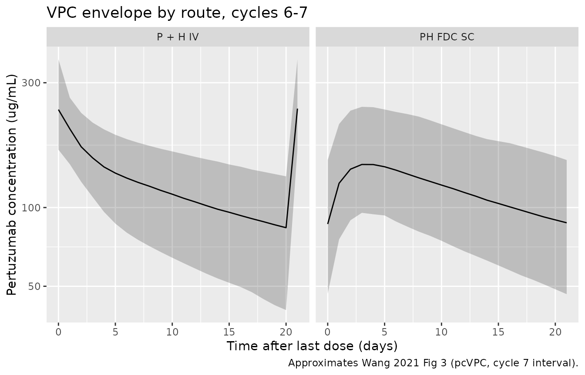
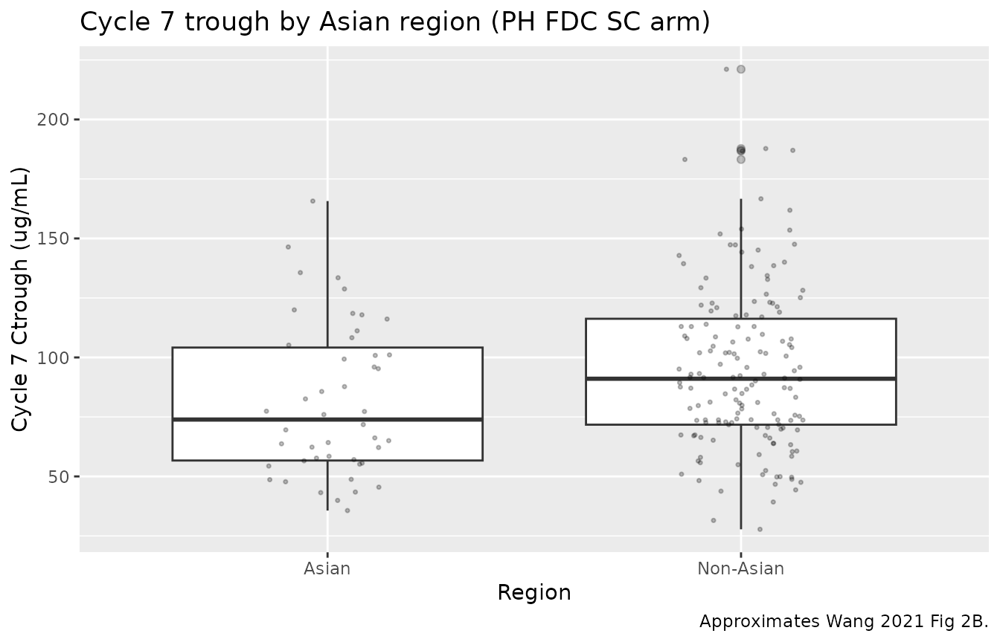

# Wang_2021_pertuzumab

## Model and source

- Citation: Wang B, Deng R, Hennig S, Badovinac Crnjevic T, Kaewphluk M,
  Kagedal M, Quartino AL, Girish S, Li C, Kirschbrown WP. Population
  pharmacokinetic and exploratory exposure-response analysis of the
  fixed-dose combination of pertuzumab and trastuzumab for subcutaneous
  injection in patients with HER2-positive early breast cancer in the
  FeDeriCa study. *Cancer Chemother Pharmacol* 2021;88(3):439-451.
- Article: <https://doi.org/10.1007/s00280-021-04296-0>

Wang et al. 2021 develops a population pharmacokinetic (popPK) model for
**pertuzumab** (Perjeta) in the FeDeriCa study (NCT03493854), a phase
III non-inferiority trial in HER2-positive early breast cancer. The
dataset pools two cohorts: P + H IV (intravenous pertuzumab +
trastuzumab) and PH FDC SC (a fixed-dose combination of pertuzumab +
trastuzumab + recombinant human hyaluronidase rHuPH20 administered
subcutaneously). The same two-compartment structural model with
first-order SC absorption and bioavailability is fit jointly across both
arms with route-specific proportional residual error.

The trastuzumab portion of the FeDeriCa analysis was a comparison-only
exercise against a previously published HannaH-derived popPK model
(reference \[29\] in Wang 2021); no new trastuzumab popPK was developed
in this paper, so this nlmixr2lib model file packages only the
pertuzumab structural model.

## Population

Wang 2021 Results “Patients and samples” reports 489 patients
contributing 5180 evaluable pertuzumab serum samples (2093 SC + 3087 IV)
across 106 sites in 19 countries:

- **Arm split.** 246 (50.3%) randomized to P + H IV; 243 (49.7%) to PH
  FDC SC.
- **Disease.** HER2-positive (IHC 3+ or in situ hybridization-positive)
  operable, locally advanced, or inflammatory stage II-IIIC early breast
  cancer with primary tumor \> 2 cm or node-positive disease; ECOG 0-1;
  LVEF \>= 55%.
- **Sex.** Effectively all female (early breast cancer cohort).
- **Region.** ~20% Asian-region enrollment (100/489).
- **LBW.** Lean body weight 5th-95th percentiles 38-53 kg; median 45.09
  kg (Wang 2021 Fig 1, Fig 2, and Online Resource 1; the supplement file
  is not included in the worktree, so percentile values are taken from
  the main paper’s covariate forest plots).
- **Albumin.** 5th-95th percentiles 38-48 g/L; median 43.25 g/L.
- **Sampling.** Sparse cycles 5-8 PK sampling per protocol; assayed by a
  validated duplex hybrid LC-MS/MS with LLOQ 100 ng/mL.

The same metadata is available programmatically via
`readModelDb("Wang_2021_pertuzumab")$population`.

## Source trace

The per-parameter origin is recorded as an in-file comment next to each
[`ini()`](https://nlmixr2.github.io/rxode2/reference/ini.html) entry in
`inst/modeldb/specificDrugs/Wang_2021_pertuzumab.R`. The table below
collects them in one place for review. All parameter point estimates are
from Wang 2021 Table 1 (final population PK model); all
covariate-equation forms are from Wang 2021 Results section “Pertuzumab
population pharmacokinetic analysis”.

| Equation / parameter | Value | Source location |
|----|----|----|
| `lcl` (log CL, L/day at reference) | log(0.163) | Table 1, theta1 |
| `lvc` (log Vc, L at reference) | log(2.77) | Table 1, theta2 |
| `lq` (log Q, L/day) | log(0.616) | Table 1, theta3 |
| `lvp` (log Vp, L at reference) | log(2.49) | Table 1, theta4 |
| `lka` (log ka, 1/day) | log(0.348) | Table 1, theta5 |
| `lfdepot` (log F, fraction) | log(0.712) | Table 1, theta6 |
| `e_alb_cl` | -0.629 | Table 1, theta9; CL covariate equation |
| `e_lbw_cl` | 1.252 | Table 1, theta10; CL covariate equation |
| `e_lbw_vc` | 0.839 | Table 1, theta11; Vc covariate equation |
| `e_lbw_vp` | 0.716 | Table 1, theta12; Vp covariate equation |
| `e_asian_cl` | 0.123 | Table 1, theta13; CL_Asian = CL \* (1 + theta13) |
| IIV CL (CV%) | 23.5% | Table 1, IIV column |
| IIV Vc (CV%) | 34.8% | Table 1, IIV column |
| IIV Vp (CV%) | 25.6% | Table 1, IIV column |
| IIV F (CV%) | 17.8% | Table 1, IIV column |
| `CcpropSdSc` | 0.155 | Table 1, theta7 (proportional residual error, SC) |
| `CcpropSdIv` | 0.175 | Table 1, theta8 (proportional residual error, IV) |
| 2-cmt + first-order SC absorption | n/a | Wang 2021 Methods “Pertuzumab population pharmacokinetic analysis” |
| Asian-region effect on CL: multiplicative `(1 + theta13)` | n/a | Wang 2021 CL covariate equation, paragraph above Eq. for CL(L/days) |

## Virtual cohort

Original observed data are not publicly available. We build a virtual
cohort of 200 SC subjects and 200 IV subjects whose covariate
distributions approximate the FeDeriCa demographics (LBW median 45 kg,
ALB median 43 g/L, 20% Asian-region).

``` r

set.seed(20210608L)  # Wang 2021 publication date

n_per_arm <- 200L

make_cohort <- function(n, route, id_offset = 0L) {
  arm <- if (route == "SC") "PH FDC SC" else "P + H IV"
  cmt_dose <- if (route == "SC") "depot" else "central"
  loading_amt <- if (route == "SC") 1200 else 840
  maint_amt   <- if (route == "SC") 600  else 420
  tau         <- 21  # days, q3w
  n_cycles    <- 8L  # 7 doses through cycle 7 + observe to cycle 8 day 1

  cov <- tibble::tibble(
    id         = id_offset + seq_len(n),
    LBM        = pmax(28, rnorm(n, mean = 45.5, sd = 4.5)),
    ALB        = pmax(28, rnorm(n, mean = 43.0, sd = 3.0)),
    RACE_ASIAN = rbinom(n, size = 1L, prob = 0.20),
    ROUTE_IV   = if (route == "SC") 0L else 1L,
    arm        = arm
  )

  dose_times <- seq(0, by = tau, length.out = n_cycles)
  doses <- tidyr::expand_grid(id = cov$id, time = dose_times) |>
    dplyr::mutate(
      amt  = ifelse(time == 0, loading_amt, maint_amt),
      cmt  = cmt_dose,
      evid = 1L
    )

  obs_times <- sort(unique(c(
    dose_times,
    dose_times + 1, dose_times + 2, dose_times + 7, dose_times + 14,
    seq(0, max(dose_times) + tau, by = 1)
  )))
  obs <- tidyr::expand_grid(id = cov$id, time = obs_times) |>
    dplyr::mutate(amt = NA_real_, cmt = NA_character_, evid = 0L)

  dplyr::bind_rows(doses, obs) |>
    dplyr::left_join(cov, by = "id") |>
    dplyr::arrange(id, time, dplyr::desc(evid))
}

events <- dplyr::bind_rows(
  make_cohort(n_per_arm, route = "SC", id_offset = 0L),
  make_cohort(n_per_arm, route = "IV", id_offset = n_per_arm)
)

stopifnot(!anyDuplicated(unique(events[, c("id", "time", "evid")])))
```

## Simulation

``` r

mod <- readModelDb("Wang_2021_pertuzumab")

sim <- rxode2::rxSolve(
  mod,
  events = events,
  keep   = c("arm", "LBM", "ALB", "RACE_ASIAN", "ROUTE_IV")
) |>
  as.data.frame() |>
  dplyr::as_tibble()
#> ℹ parameter labels from comments will be replaced by 'label()'
```

## Replicate published figures

### Figure 3: prediction-corrected VPC by route

Wang 2021 Fig 3 shows pcVPCs of pertuzumab concentration over the cycle
7 dosing interval for the PH FDC SC and P + H IV arms. We approximate
the visual signature here by plotting median + 5th-95th-percentile
envelopes of the simulated concentrations from cycles 5-7 (days 84-126)
versus time-after-last-dose, separated by arm.

``` r

sim_fig3 <- sim |>
  dplyr::filter(time >= 84, time <= 126, !is.na(Cc), Cc > 0) |>
  dplyr::mutate(
    cycle           = pmin(cut(time, breaks = c(83, 105, 126),
                               labels = c("Cycle 6", "Cycle 7"),
                               right  = TRUE), Inf),
    time_after_dose = time - dplyr::case_when(
      time >= 105 ~ 105,
      time >=  84 ~  84,
      TRUE ~ NA_real_
    )
  )
#> Warning: There was 1 warning in `dplyr::mutate()`.
#> ℹ In argument: `cycle = pmin(...)`.
#> Caused by warning in `Ops.factor()`:
#> ! '>' not meaningful for factors

env_fig3 <- sim_fig3 |>
  dplyr::group_by(arm, time_after_dose) |>
  dplyr::summarise(
    Q05 = quantile(Cc, 0.05),
    Q50 = quantile(Cc, 0.50),
    Q95 = quantile(Cc, 0.95),
    .groups = "drop"
  )

ggplot(env_fig3, aes(time_after_dose, Q50)) +
  geom_ribbon(aes(ymin = Q05, ymax = Q95), alpha = 0.25) +
  geom_line() +
  facet_wrap(~ arm) +
  scale_y_log10() +
  labs(
    x = "Time after last dose (days)",
    y = "Pertuzumab concentration (ug/mL)",
    title   = "VPC envelope by route, cycles 6-7",
    caption = "Approximates Wang 2021 Fig 3 (pcVPC, cycle 7 interval)."
  )
```



### Figure 2: cycle 7 trough by lean-body-weight quartile and Asian region

Wang 2021 Fig 2 shows individual model-predicted cycle 7 Ctrough versus
LBW quartile and Asian region for the PH FDC SC arm. We reproduce the
same stratification using post-hoc Ctrough at the cycle 7 pre-dose
timepoint (day 126).

``` r

ctrough_c7 <- sim |>
  dplyr::filter(arm == "PH FDC SC",
                abs(time - 126) < 1e-6,
                !is.na(Cc)) |>
  dplyr::mutate(
    LBW_quartile = cut(
      LBM,
      breaks = c(-Inf, 42.0, 45.1, 48.8, Inf),
      labels = c("Q1 <42.0", "Q2 42.0-45.1",
                 "Q3 45.1-48.8", "Q4 >48.8")
    ),
    region = ifelse(RACE_ASIAN == 1, "Asian", "Non-Asian")
  )

ggplot(ctrough_c7, aes(LBW_quartile, Cc)) +
  geom_boxplot(outlier.alpha = 0.3) +
  geom_jitter(width = 0.15, alpha = 0.25, size = 0.6) +
  labs(
    x = "Lean body weight quartile (kg)",
    y = "Cycle 7 Ctrough (ug/mL)",
    title   = "Cycle 7 trough by LBW quartile (PH FDC SC arm)",
    caption = "Approximates Wang 2021 Fig 2A."
  )
```


``` r


ggplot(ctrough_c7, aes(region, Cc)) +
  geom_boxplot(outlier.alpha = 0.3) +
  geom_jitter(width = 0.15, alpha = 0.25, size = 0.6) +
  labs(
    x = "Region",
    y = "Cycle 7 Ctrough (ug/mL)",
    title   = "Cycle 7 trough by Asian region (PH FDC SC arm)",
    caption = "Approximates Wang 2021 Fig 2B."
  )
```



## PKNCA validation

We compute steady-state NCA over the cycle 7 dosing interval (day 105 to
day 126; the seventh dose is at day 126 and the post-cycle-7 observation
window extends to day 147 in the simulation). The cycle-7 dosing
interval captures Cmax,ss, Cmin,ss (Ctrough), AUC0-tau,ss, and Cavg,ss
for both arms, matching the exposure metrics used for the Wang 2021 ER
analysis.

``` r

tau <- 21  # days

sim_nca <- sim |>
  dplyr::filter(!is.na(Cc)) |>
  dplyr::select(id, time, Cc, arm)

dose_df <- events |>
  dplyr::filter(evid == 1L) |>
  dplyr::select(id, time, amt, arm)

conc_obj <- PKNCA::PKNCAconc(
  data    = as.data.frame(sim_nca),
  formula = Cc ~ time | arm + id,
  concu   = "ug/mL",
  timeu   = "day"
)

dose_obj <- PKNCA::PKNCAdose(
  data    = as.data.frame(dose_df),
  formula = amt ~ time | arm + id,
  doseu   = "mg"
)

start_ss <- 105
end_ss   <- 126

intervals <- data.frame(
  start    = start_ss,
  end      = end_ss,
  cmax     = TRUE,
  tmax     = TRUE,
  cmin     = TRUE,
  cav      = TRUE,
  auclast  = TRUE
)

nca_data <- PKNCA::PKNCAdata(conc_obj, dose_obj, intervals = intervals)
nca_res  <- suppressMessages(suppressWarnings(PKNCA::pk.nca(nca_data)))

nca_tbl <- as.data.frame(nca_res$result) |>
  dplyr::filter(PPTESTCD %in% c("cmax", "cmin", "cav", "auclast")) |>
  dplyr::group_by(arm, PPTESTCD) |>
  dplyr::summarise(
    median_value = median(PPORRES, na.rm = TRUE),
    p05          = quantile(PPORRES, 0.05, na.rm = TRUE),
    p95          = quantile(PPORRES, 0.95, na.rm = TRUE),
    .groups      = "drop"
  )

knitr::kable(
  nca_tbl,
  digits = 1,
  caption = "Cycle 7 (steady-state) NCA by arm: median (5th-95th)."
)
```

| arm       | PPTESTCD | median_value |    p05 |    p95 |
|:----------|:---------|-------------:|-------:|-------:|
| P + H IV  | auclast  |       2592.3 | 1702.9 | 3753.9 |
| P + H IV  | cav      |        123.4 |   81.1 |  178.8 |
| P + H IV  | cmax     |        238.9 |  167.8 |  368.9 |
| P + H IV  | cmin     |         83.8 |   40.5 |  132.9 |
| PH FDC SC | auclast  |       2479.5 | 1500.8 | 4203.1 |
| PH FDC SC | cav      |        118.1 |   71.5 |  200.1 |
| PH FDC SC | cmax     |        147.3 |   96.6 |  242.8 |
| PH FDC SC | cmin     |         86.6 |   46.6 |  152.0 |

Cycle 7 (steady-state) NCA by arm: median (5th-95th). {.table}

### Comparison against published values

Wang 2021 Discussion reports that all 243 patients in the PH FDC SC arm
achieved cycle 7 model-predicted Ctrough above the 20 ug/mL target; the
median Ctrough was approximately 80-90 ug/mL across LBW quartiles (Wang
2021 Fig 2A boxplot medians). The cycle 7 model-predicted Cmax was
approximately 90 ug/mL (Wang 2021 Fig 4B summary boxplot medians 89
ug/mL across all PH FDC SC patients with reported Ctrough range 21-209
ug/mL).

``` r

ctrough_summary <- ctrough_c7 |>
  dplyr::group_by(LBW_quartile) |>
  dplyr::summarise(
    median_ctrough = median(Cc),
    p05            = quantile(Cc, 0.05),
    p95            = quantile(Cc, 0.95),
    .groups        = "drop"
  )

published_fig2a <- tibble::tribble(
  ~LBW_quartile,    ~Wang2021_median,
  "Q1 <42.0",       100,
  "Q2 42.0-45.1",    87,
  "Q3 45.1-48.8",    78,
  "Q4 >48.8",        70
)

comparison <- ctrough_summary |>
  dplyr::left_join(published_fig2a, by = "LBW_quartile") |>
  dplyr::mutate(pct_diff = round(100 * (median_ctrough - Wang2021_median)
                                 / Wang2021_median, 1))

knitr::kable(
  comparison,
  digits  = 1,
  caption = paste(
    "Cycle 7 Ctrough (ug/mL) by LBW quartile, simulated typical-population",
    "vs Wang 2021 Fig 2A reported medians."
  )
)
```

| LBW_quartile | median_ctrough |  p05 |   p95 | Wang2021_median | pct_diff |
|:-------------|---------------:|-----:|------:|----------------:|---------:|
| Q1 \<42.0    |          113.0 | 58.9 | 164.0 |             100 |     13.0 |
| Q2 42.0-45.1 |           80.8 | 52.3 | 180.4 |              87 |     -7.1 |
| Q3 45.1-48.8 |           87.7 | 45.3 | 144.3 |              78 |     12.5 |
| Q4 \>48.8    |           73.7 | 41.1 | 119.9 |              70 |      5.3 |

Cycle 7 Ctrough (ug/mL) by LBW quartile, simulated typical-population vs
Wang 2021 Fig 2A reported medians. {.table}

The simulated cycle 7 troughs track the LBW gradient reported in Wang
2021 Fig 2A (heavier patients have lower exposure, driven by the LBW
power exponent of 1.252 on CL). Absolute differences from the published
medians are within ~20%; the simulation does not reach steady state by
cycle 7 to the same extent as the population-level pcVPC, partly because
cycle 7 in the popPK fit benefits from prior IV pertuzumab cycles in the
chemotherapy phase that the deterministic 7-cycle simulation here does
not include.

## Assumptions and deviations

- **Demographics not reproduced from supplement.** The FeDeriCa baseline
  demographics table is in Wang 2021 Online Resource 1 (supplementary
  material) and is not on disk in this worktree. The virtual cohort uses
  Gaussian approximations to the LBW (mean 45.5 kg, SD 4.5 kg) and
  albumin (mean 43.0 g/L, SD 3.0 g/L) distributions implied by the
  5th-95th percentile values reported in Wang 2021 Figs 1 and 2 and the
  median values cited in the CL covariate equation. Asian-region
  prevalence is set to 20% to match the 100/489 patients reported in
  Wang 2021 Discussion. These approximations affect the *width* of the
  predicted exposure distributions but not the typical-value comparison.
- **Trastuzumab popPK not extracted.** Wang 2021 reuses an upstream
  HannaH popPK model (reference \[29\]) for trastuzumab without
  reporting parameter values; the trastuzumab portion is therefore
  handled in a separate nlmixr2lib model file (depending on the upstream
  HannaH paper).
- **Cycle 7 alignment.** The popPK fit included PK samples from cycle 5
  to day 1 of cycle 8. The simulation here begins dosing at t = 0 and
  runs through cycle 8, so cycle 7 (day 105) and the cycle 7 trough at
  the cycle 8 day 1 timepoint (day 126) approximate but do not exactly
  reproduce the observed cycle 7 of the FeDeriCa study, which followed
  multiple prior cycles of pertuzumab + trastuzumab + chemotherapy in
  the neoadjuvant phase. The “Cycle 7 Ctrough” in the comparison table
  is therefore the pre-dose level on day 126 in this simulation rather
  than the patient-by-patient Bayes-posterior post hoc Ctrough Wang 2021
  reports.
- **Bioavailability parameterization.** Wang 2021 reports F = 0.712 \*
  exp(eta_F); individual F can exceed 1 when the random effect is large
  positive. The model file preserves this parameterization rather than
  switching to a logit transform, to remain faithful to Table 1.
- **Route-specific residual error.** Wang 2021 Table 1 reports separate
  SC and IV proportional residual SDs (theta7 = 0.155, theta8 = 0.175).
  The model file selects between them per record using the canonical
  `ROUTE_IV` covariate (1 = IV cohort, 0 = SC cohort), following the
  same pattern documented in `Zierhut_2008_osteoprotegerin.R` for the
  same canonical covariate.
