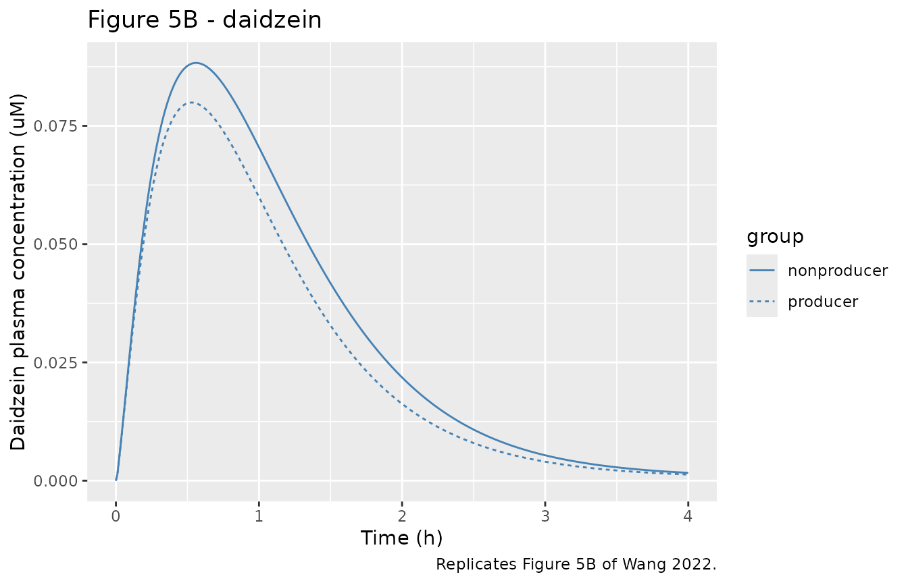
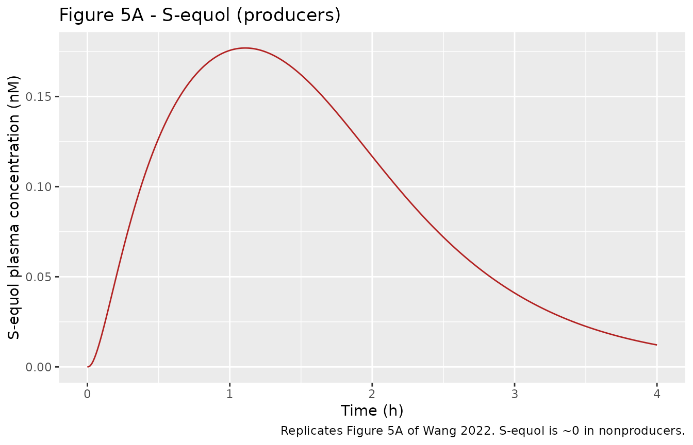

# Daidzein and S-equol gut-microbial PBPK (Wang 2022)

## Model and source

- Citation: Wang Q, Spenkelink B, Boonpawa R, Rietjens IMCM. Use of
  Physiologically Based Pharmacokinetic Modeling to Predict Human Gut
  Microbial Conversion of Daidzein to S-Equol. J Agric Food Chem. 2022
  Jan 19;70(2):343-352. <doi:10.1021/acs.jafc.1c03950>. PMCID:
  PMC8759082. Microbial kinetic constants Table 2; S-equol conjugation
  kinetics Table 3; the complete Berkeley Madonna ODE listing with all
  physiological, partition and scaling parameters is Supporting
  Information 2 (PBPK model code).
- Description: PBPK (whole-body, flow-limited) for the dietary
  isoflavone daidzein and its gut-microbial metabolite S-equol in the
  adult human. Seven flow-limited tissue groups (blood, liver, fat,
  rapidly perfused, slowly perfused, small-intestine tissue) plus a
  small-intestine lumen and a large-intestine lumen; the large-intestine
  lumen is the microbiota compartment where daidzein is converted by
  capacity-limited (Michaelis-Menten) gut-microbial metabolism to
  dihydrodaidzein (DHD), S-equol (only in S-equol producers) and
  O-desmethylangolensin (O-DMA). Small-intestine and hepatic phase-II
  glucuronidation/sulfation of daidzein, and hepatic
  glucuronidation/sulfation of S-equol, are also capacity-limited. A
  coupled S-equol sub-model (large-intestine lumen, liver, fat,
  rapidly/slowly perfused, blood) receives the microbially formed
  S-equol via a first-order transfer from lumen to liver. All kinetic
  constants come from in vitro anaerobic human fecal incubations
  (microbial steps) and pooled human liver S9 incubations (S-equol
  conjugation), scaled to the whole body. The default parameter set is
  the S-equol PRODUCER; the nonproducer is the same structure with the
  S-equol sub-model inactive and different microbial DHD/O-DMA kinetics
  (see the vignette). Deterministic: the publication reports no IIV and
  no residual error. Daidzein enters as an oral dose into the
  small-intestine lumen.
- Article: <https://doi.org/10.1021/acs.jafc.1c03950>
- Supplement: Supporting Information 2 (PBPK model code) – the complete
  Berkeley Madonna ODE listing with all physiological, partition and
  scaling parameters, available free of charge at the DOI above.

This is a whole-body, flow-limited physiologically based pharmacokinetic
(PBPK) model for the dietary isoflavone **daidzein** and its
gut-microbial metabolite **S-equol** in the adult human. It is the human
counterpart of the rat model of Wang et al. (2020, *Mol Nutr Food Res*
64:e1900912). The novel feature is a large-intestine **lumen
(microbiota) compartment** in which capacity-limited gut-microbial
metabolism converts daidzein to dihydrodaidzein (DHD), S-equol (only in
S-equol *producers*) and O-desmethylangolensin (O-DMA). All kinetic
constants were measured in vitro – microbial steps from pooled anaerobic
human fecal incubations, S-equol conjugation from pooled human liver S9
– and scaled to the whole body, so the model is an in vitro-in silico
“new approach methodology” (NAM) with no in vivo fitting.

## Population

The kinetic constants were derived in vitro rather than from a clinical
population fit. Fecal samples from 15 volunteers were screened (Table
1); 6 were S-equol producers and 9 nonproducers. Producer and
nonproducer feces were pooled separately, and daidzein (2.5-60 uM) was
incubated anaerobically to obtain the apparent `Vmax` and `Km` for DHD,
S-equol and O-DMA formation (Table 2). S-equol glucuronidation and
sulfation kinetics were measured in pooled human liver S9 fractions from
25 donors of mixed gender (Table 3). Physiological parameters are human
reference values (Brown et al. 1997) at a 70 kg reference body weight,
and tissue/blood partition coefficients were computed by the
quantitative property-property relationship (QPPR) of DeJongh et
al. (1997). Model predictions were made for oral daidzein doses of
0.09-3.34 mg/kg body weight.

The same information is available programmatically via the model’s
`population` metadata
(`readModelDb("Wang_2022_daidzein_equol_pbpk")()$population`).

## Source trace

Every `ini()` value carries an in-file comment pointing to its origin
(paper Table or the Supporting Information 2 code). The table below
collects the principal entries; the full physiological, partition and
kinetic parameter set is in
`inst/modeldb/endogenous/Wang_2022_daidzein_equol_pbpk.R`.

| Equation / parameter | Value | Source location |
|----|----|----|
| Tissue volume fractions (`VSIc`, `VLc`, `VRc`, `VSc`, `VFc`, `VBc`) | 0.0091 / 0.0257 / 0.0442 / 0.5428 / 0.2142 / 0.0790 | SI2, Physiological parameters (Brown 1997) |
| Cardiac output `QC`, flow fractions | 347.9 L/h; 0.09 / 0.137 / 0.473 / 0.248 / 0.052 | SI2, Blood flow rates |
| Daidzein partitions (`PIDAI`,`PLDAI`,`PRDAI`,`PSDAI`,`PFDAI`) | 1.29 / 1.29 / 1.29 / 0.56 / 39.9 | SI2, Physicochemical parameters (DeJongh 1997) |
| S-equol partitions (`PLEQU`,`PREQU`,`PSEQU`,`PFEQU`) | 1.83 / 1.83 / 0.65 / 77.2 | SI2, Physicochemical parameters |
| Absorption/transfer (`Ka`,`Kb`,`Ksl`,`Kll`) | 0.46 / 4.56 / 1.16 / 4.56 /h | SI2, absorption/transfer rates |
| Microbial DHD/S-equol/O-DMA `Vmax` (producers) | 0.024 / 0.009 / 0.001 umol/h/g feces | Table 2, producers column |
| Microbial DHD/S-equol/O-DMA `Km` (producers) | 6.24 / 7.24 / 18.07 uM | Table 2, producers column |
| S-equol conjugation `Vmax` (G1/G2/sulfate) | 4.62 / 0.61 / 9.24 nmol/min/mg S9 | Table 3 |
| S-equol conjugation `Km` (G1/G2/sulfate) | 20.28 / 29.39 / 6.50 uM | Table 3 |
| S9 protein yields (`S9SI`, `VLS9`) | 38.6 / 143 mg/g | SI2 (Cubitt 2011) |
| `d/dt(li_lumen)` microbiota MM conversions | n/a | SI2, Main model dynamics |
| S-equol sub-model ODEs | n/a | SI2, Sub-model dynamics: equol |

## Virtual cohort

This is a **deterministic** PBPK model: the publication reports no
between-subject variability and no residual error, so there is no random
cohort to draw. Validation is a typical-value replication of the
published predictions. Daidzein enters as a single oral dose into the
small-intestine lumen; a dose of `D` mg/kg corresponds to
`amt = D * 70 * 1000 / 254.23` umol (daidzein MW 254.23 g/mol).

``` r

BW <- 70 # kg, reference body weight (model default)
MW_daidzein <- 254.23 # g/mol
MW_equol <- 242.27 # g/mol (C15H14O3), used only for the urinary-excretion mg conversion

dose_umol <- function(mg_per_kg) mg_per_kg * BW * 1000 / MW_daidzein

# Single oral daidzein dose into the small-intestine lumen, observed 0-4 h
# (the window Wang 2022 reports Cmax and AUC(0-4h) over, Figure 5).
make_events <- function(mg_per_kg, tmax = 4, dt = 0.01) {
  rxode2::et(amt = dose_umol(mg_per_kg), cmt = "si_lumen") |>
    rxode2::et(seq(0, tmax, by = dt))
}
```

## Simulation

The default packaged model is the **S-equol producer**. The
**nonproducer** is the same structure with microbial S-equol formation
switched off (`VmaxLIEQUc = 0`) and the microbial DHD/O-DMA constants
set to the nonproducer column of Table 2.

``` r

mod_prod <- rxode2::rxode2(readModelDb("Wang_2022_daidzein_equol_pbpk"))

mod_nonprod <- mod_prod |>
  rxode2::ini(
    VmaxLIEQUc = 0, # no microbial S-equol formation in nonproducers
    VmaxLIDHDc = 0.008, KmLIDHD = 2.55, # Table 2, nonproducers DHD
    VmaxLIODMAc = 0.0007, KmLIODMA = 5.12 # Table 2, nonproducers O-DMA
  )
#> ℹ change initial estimate of `VmaxLIEQUc` to `0`
#> ℹ change initial estimate of `VmaxLIDHDc` to `0.008`
#> ℹ change initial estimate of `KmLIDHD` to `2.55`
#> ℹ change initial estimate of `VmaxLIODMAc` to `7e-04`
#> ℹ change initial estimate of `KmLIODMA` to `5.12`

ev1 <- make_events(1) # 1 mg/kg, the Figure 5 dose
sim_prod <- rxode2::rxSolve(mod_prod, ev1, returnType = "data.frame")
sim_nonprod <- rxode2::rxSolve(mod_nonprod, ev1, returnType = "data.frame")
```

## Replicate published figures

### Figure 5 – plasma daidzein and S-equol at 1 mg/kg

``` r

# Replicates Figure 5 of Wang 2022: (A) S-equol and (B) daidzein plasma
# concentrations upon oral dosing of 1 mg/kg bw daidzein; solid = producers,
# dashed = nonproducers.
prof <- dplyr::bind_rows(
  data.frame(time = sim_prod$time, daidzein = sim_prod$Cc,
             equol = sim_prod$Cc_equol, group = "producer"),
  data.frame(time = sim_nonprod$time, daidzein = sim_nonprod$Cc,
             equol = sim_nonprod$Cc_equol, group = "nonproducer")
)

ggplot(prof, aes(time, daidzein, linetype = group)) +
  geom_line(color = "steelblue") +
  labs(x = "Time (h)", y = "Daidzein plasma concentration (uM)",
       title = "Figure 5B - daidzein",
       caption = "Replicates Figure 5B of Wang 2022.")
```



``` r


ggplot(dplyr::filter(prof, group == "producer"),
       aes(time, equol * 1000)) +
  geom_line(color = "firebrick") +
  labs(x = "Time (h)", y = "S-equol plasma concentration (nM)",
       title = "Figure 5A - S-equol (producers)",
       caption = "Replicates Figure 5A of Wang 2022. S-equol is ~0 in nonproducers.")
```



## PKNCA validation

PKNCA computes Cmax and Tmax on the simulated plasma profiles. Note that
the AUC comparison against the paper is handled separately below,
because the AUC values printed in Wang 2022 are blood-*amount* integrals
(see Assumptions and deviations), not the concentration-time integrals
PKNCA returns.

``` r

pknca_one <- function(sim, conc_col, label) {
  d <- data.frame(id = 1L, time = sim$time, Cc = sim[[conc_col]], treatment = label)
  d <- d |> dplyr::filter(!is.na(Cc))
  d <- dplyr::bind_rows(d, transform(d[1, ], time = 0, Cc = 0)) |>
    dplyr::distinct(id, treatment, time, .keep_all = TRUE) |>
    dplyr::arrange(time)
  conc_obj <- PKNCA::PKNCAconc(d, Cc ~ time | treatment + id)
  dose_df <- data.frame(id = 1L, time = 0, amt = dose_umol(1), treatment = label)
  dose_obj <- PKNCA::PKNCAdose(dose_df, amt ~ time | treatment + id)
  intervals <- data.frame(start = 0, end = 4, cmax = TRUE, tmax = TRUE,
                          auclast = TRUE)
  res <- PKNCA::pk.nca(PKNCA::PKNCAdata(conc_obj, dose_obj, intervals = intervals))
  as.data.frame(res$result)
}

nca_dai_prod <- pknca_one(sim_prod, "Cc", "daidzein, producer")
nca_dai_nonprod <- pknca_one(sim_nonprod, "Cc", "daidzein, nonproducer")
nca_equ_prod <- pknca_one(sim_prod, "Cc_equol", "S-equol, producer")

pknca_summary <- dplyr::bind_rows(nca_dai_prod, nca_dai_nonprod, nca_equ_prod) |>
  dplyr::filter(PPTESTCD %in% c("cmax", "tmax")) |>
  tidyr::pivot_wider(id_cols = treatment, names_from = PPTESTCD, values_from = PPORRES)

pknca_summary |>
  dplyr::rename("Analyte / group" = treatment, "Cmax (uM)" = cmax, "Tmax (h)" = tmax) |>
  knitr::kable(digits = 5, caption = "PKNCA Cmax / Tmax from the simulated profiles.")
```

| Analyte / group       | Cmax (uM) | Tmax (h) |
|:----------------------|----------:|---------:|
| daidzein, producer    |   0.07992 |     0.53 |
| daidzein, nonproducer |   0.08830 |     0.56 |
| S-equol, producer     |   0.00018 |     1.11 |

PKNCA Cmax / Tmax from the simulated profiles. {.table}

### Comparison against published values

Wang 2022 reports, at 1 mg/kg in producers, daidzein Cmax 0.08 uM and
S-equol Cmax 0.18 nM, with the S-equol Cmax amounting to 0.22% of the
daidzein Cmax; in nonproducers the daidzein Cmax is 0.09 uM. The
reported AUC(0-4 h) values (0.60 for daidzein, 2.02 nmol\*h for S-equol
in producers; 0.71 for daidzein in nonproducers) are the deposited
code’s blood-amount integrals (`auc_dai`, `auc_equol`), which the
packaged model carries as states.

``` r

cmax_dai_prod <- max(sim_prod$Cc)
cmax_equ_prod <- max(sim_prod$Cc_equol)
cmax_dai_nonprod <- max(sim_nonprod$Cc)

comparison <- tibble::tribble(
  ~Quantity, ~Simulated, ~Published,
  "Daidzein Cmax, producer (uM)", round(cmax_dai_prod, 4), 0.08,
  "S-equol Cmax, producer (nM)", round(cmax_equ_prod * 1000, 4), 0.18,
  "S-equol / daidzein Cmax ratio (%)", round(100 * cmax_equ_prod / cmax_dai_prod, 3), 0.22,
  "Daidzein Cmax, nonproducer (uM)", round(cmax_dai_nonprod, 4), 0.09,
  "Daidzein AUC(0-4h), producer (umol*h)", round(tail(sim_prod$auc_dai, 1), 3), 0.60,
  "S-equol AUC(0-4h), producer (nmol*h)", round(tail(sim_prod$auc_equol, 1) * 1000, 3), 2.02,
  "Daidzein AUC(0-4h), nonproducer (umol*h)", round(tail(sim_nonprod$auc_dai, 1), 3), 0.71
)
knitr::kable(comparison, caption = "Simulated vs. published (Wang 2022, Figure 5 text).")
```

| Quantity                                  | Simulated | Published |
|:------------------------------------------|----------:|----------:|
| Daidzein Cmax, producer (uM)              |    0.0799 |      0.08 |
| S-equol Cmax, producer (nM)               |    0.1769 |      0.18 |
| S-equol / daidzein Cmax ratio (%)         |    0.2210 |      0.22 |
| Daidzein Cmax, nonproducer (uM)           |    0.0883 |      0.09 |
| Daidzein AUC(0-4h), producer (umol\*h)    |    0.5990 |      0.60 |
| S-equol AUC(0-4h), producer (nmol\*h)     |    2.0200 |      2.02 |
| Daidzein AUC(0-4h), nonproducer (umol\*h) |    0.7050 |      0.71 |

Simulated vs. published (Wang 2022, Figure 5 text). {.table}

``` r


# Structural gate: the typical-value predictions match the published point
# values closely. These are deterministic (no random cohort), so tight
# tolerances are appropriate.
stopifnot(
  abs(cmax_dai_prod - 0.08) < 0.01,
  abs(cmax_equ_prod * 1000 - 0.18) < 0.02,
  abs(100 * cmax_equ_prod / cmax_dai_prod - 0.22) < 0.02,
  abs(cmax_dai_nonprod - 0.09) < 0.01,
  abs(tail(sim_prod$auc_dai, 1) - 0.60) < 0.03,
  abs(tail(sim_prod$auc_equol, 1) * 1000 - 2.02) < 0.1,
  abs(tail(sim_nonprod$auc_dai, 1) - 0.71) < 0.05
)
```

### Mass balance

The deposited code carries a mass-balance diagnostic. Summing every
daidzein state (parent plus all cumulative metabolite amounts) must
equal the administered dose at all times.

``` r

mb_cols <- c("si_lumen", "si_tissue", "a_si_dai7g", "a_si_dai4ig", "a_si_dais",
             "li_lumen", "a_dhd", "a_equol_formed", "a_odma", "liver",
             "a_liv_dai7g", "a_liv_dai4ig", "a_liv_dais", "fat", "rapid",
             "slow", "blood")
calc <- rowSums(sim_prod[, mb_cols])
rel_err <- max(abs(calc - dose_umol(1)) / dose_umol(1))
cat(sprintf("Max relative daidzein mass-balance error over 0-4 h: %.3g%%\n",
            100 * rel_err))
#> Max relative daidzein mass-balance error over 0-4 h: 1.24e-13%
stopifnot(rel_err < 1e-4)
```

### Table 4 – cumulative 24 h S-equol urinary excretion

Wang 2022 Table 4 compares the model-predicted 24 h urinary excretion of
S-equol (as its glucuronide and sulfate conjugates) with reported in
vivo values, at four daidzein doses. The conjugates are assumed to be
excreted in urine, so the model prediction is the summed cumulative
liver conjugate amount, converted from umol to mg with the S-equol
molecular weight.

``` r

equol_urine_mg <- function(mg_per_kg) {
  s <- rxode2::rxSolve(mod_prod, make_events(mg_per_kg, tmax = 24, dt = 0.05),
                       returnType = "data.frame")
  conj_umol <- tail(s$a_liv_equg1 + s$a_liv_equg2 + s$a_liv_equs, 1)
  conj_umol * MW_equol / 1000 # umol -> mg
}

table4 <- tibble::tribble(
  ~dose_mgkg, ~reported_mg, ~paper_model_mg,
  0.13, 0.50, 0.68,
  0.05, 0.33, 0.28,
  0.10, 0.80, 0.53,
  0.19, 1.43, 0.98
) |>
  dplyr::mutate(this_model_mg = round(vapply(dose_mgkg, equol_urine_mg, numeric(1)), 3),
                ratio_vs_reported = round(this_model_mg / reported_mg, 2))

table4 |>
  dplyr::rename("Dose (mg/kg)" = dose_mgkg, "Reported in vivo (mg)" = reported_mg,
                "Wang 2022 model (mg)" = paper_model_mg,
                "This model (mg)" = this_model_mg, "Ratio pred/obs" = ratio_vs_reported) |>
  knitr::kable(caption = "Table 4 - 24 h urinary S-equol excretion (producers).")
```

| Dose (mg/kg) | Reported in vivo (mg) | Wang 2022 model (mg) | This model (mg) | Ratio pred/obs |
|---:|---:|---:|---:|---:|
| 0.13 | 0.50 | 0.68 | 0.708 | 1.42 |
| 0.05 | 0.33 | 0.28 | 0.293 | 0.89 |
| 0.10 | 0.80 | 0.53 | 0.560 | 0.70 |
| 0.19 | 1.43 | 0.98 | 0.977 | 0.68 |

Table 4 - 24 h urinary S-equol excretion (producers). {.table}

``` r


# The packaged model reproduces the paper's OWN model-predicted column closely;
# both the paper and this model differ from the sparse in vivo data by the
# variability Wang 2022 discusses.
stopifnot(
  all(abs(table4$this_model_mg - table4$paper_model_mg) /
        table4$paper_model_mg < 0.10)
)
```

## Assumptions and deviations

- **AUC units in the paper.** Wang 2022 reports AUC(0-4 h) as 0.60
  “umol*h/L” (daidzein) and 2.02 ”nmol*h/L” (S-equol) at 1 mg/kg. These
  values are the deposited Berkeley Madonna code’s `AUC` states, defined
  there as `AUC' = AB` – the time integral of the blood **amount**
  (umol*h), not of the concentration (which would be umol*h/L). The
  packaged model carries the same amount integrals as `auc_dai` and
  `auc_equol` and reproduces the printed numbers exactly (0.599 and
  2.020); the “/L” in the paper’s unit label is therefore spurious. The
  concentration-time integral (what PKNCA would call AUClast) is smaller
  by the blood-volume factor (~5.53 L) and is not the quantity the paper
  tabulates.
- **Producer vs. nonproducer.** The packaged default is the S-equol
  producer, matching the deposited code. The nonproducer is reproduced
  here by zeroing microbial S-equol formation and switching the
  microbial DHD/O-DMA constants to the nonproducer column of Table 2;
  the maintainers did not ship a second file because the structure is
  identical.
- **S-equol molecular weight.** The umol-\>mg conversion for the Table 4
  urinary comparison uses the S-equol molecular weight 242.27 g/mol
  (C15H14O3), a standard chemical constant not printed in the paper. It
  affects only the urinary-excretion display, not the model dynamics.
- **Non-perfused tissue.** The deposited code defines a non-perfused
  tissue fraction (`VNc = 0.071`, hair/nails/bone) that appears in no
  differential equation; it is part of the “fractions sum to 1”
  bookkeeping only and is omitted here as structurally inert.
- **No IIV / residual error.** Wang 2022 is a deterministic in vitro-in
  silico PBPK and reports neither, so the packaged model has no random
  effects.
- **Literature check.** No correction or erratum notice was found for
  this article as of 2026-09-30. \`\`\`
