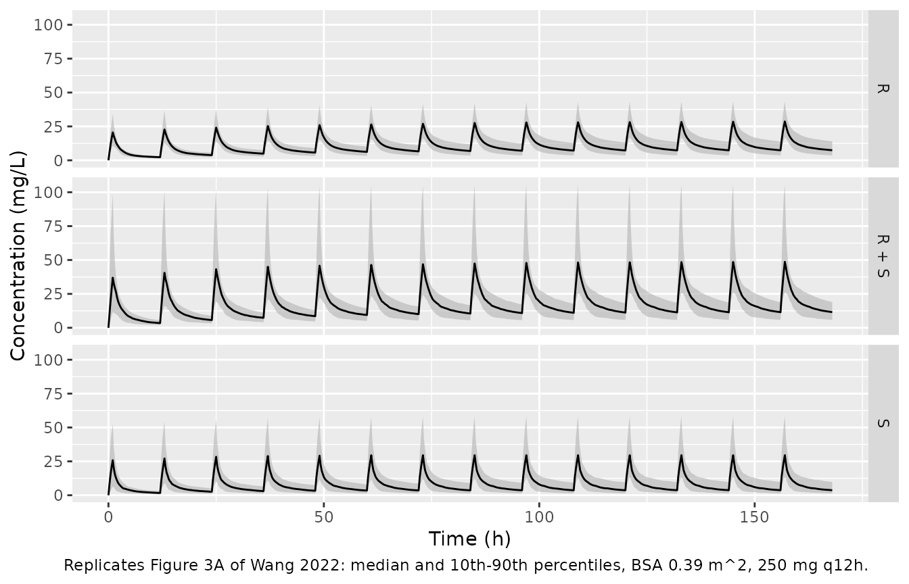
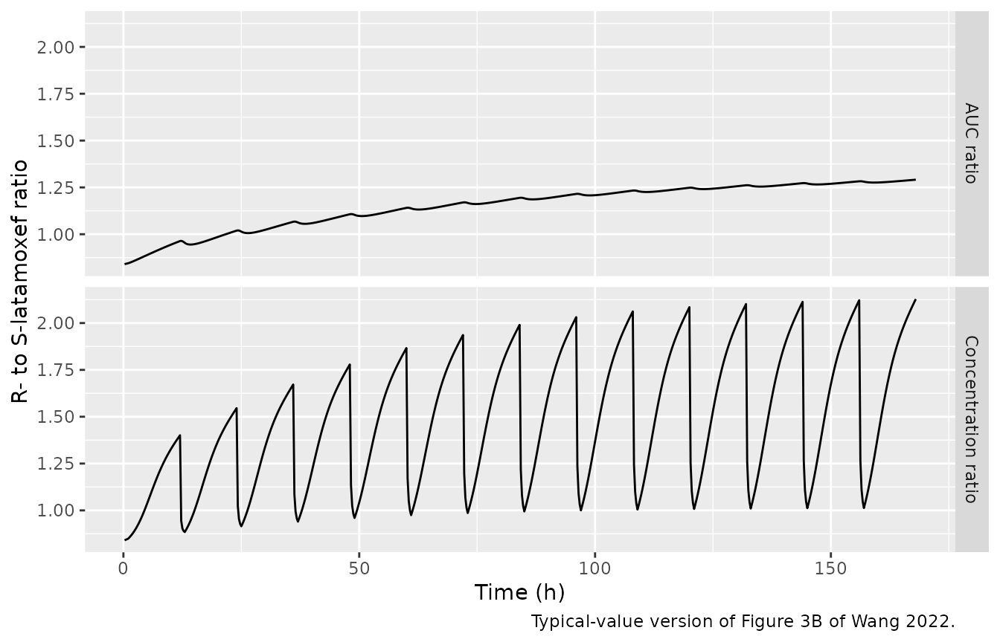
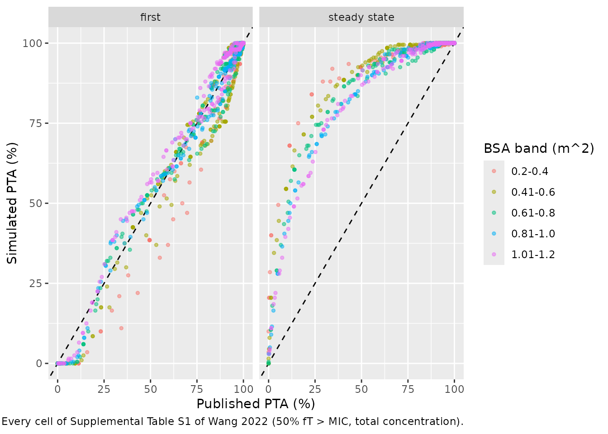

# Latamoxef and its R- and S-epimers (Wang 2022)

## Model and source

- Citation: Wang Y, Sun D, Mei Y, Wu S, Li X, Li S, Wang J, Gao L, Xu H,
  Tuo Y. Population Pharmacokinetics and Dosing Regimen Optimization of
  Latamoxef in Chinese Children. Pharmaceutics. 2022;14(5):1033.
  <doi:10.3390/pharmaceutics14051033>
- Article: [Pharmaceutics
  2022;14(5):1033](https://doi.org/10.3390/pharmaceutics14051033) (open
  access)
- Supplement: Supplemental Table S1 (probability of target attainment),
  <https://www.mdpi.com/article/10.3390/pharmaceutics14051033/s1>

Wang 2022 fitted three separate two-compartment population PK models to
the same sparse paediatric therapeutic-drug-monitoring data set: one for
total (R + S) latamoxef and one each for the R- and S-epimers, which
were resolved by chiral HPLC. The three are packaged as three models:

| Model | Analyte | Description |
|----|----|----|
| `Wang_2022_latamoxef` | total latamoxef | Two-compartment IV population PK model for total (R + S) latamoxef (moxalactam) in 145 Chinese children aged 0.08-10.58 years with bacterial infection (Wang 2022). All four structural parameters scale with body surface area normalised to the cohort median 0.39 m^2: exponent 1 (fixed) on V1 and V2, an estimated 1.49 on CL and 0.75 (fixed) on Q. Exponential IIV on V1 and CL, additive residual error. The R- and S-epimers were fitted as separate models in the same paper (modellib(‘Wang_2022_latamoxef_r’), modellib(‘Wang_2022_latamoxef_s’)). |
| `Wang_2022_latamoxef_r` | R-epimer | Two-compartment IV population PK model for the R-epimer of latamoxef (moxalactam) in 145 Chinese children aged 0.08-10.58 years with bacterial infection (Wang 2022). The dose is the TOTAL latamoxef dose: because the R-epimer fraction r of the administered product is unknown (the paper’s stated range is 0.4444-0.5833, from the Chinese Pharmacopoeia limits on the R:S ratio), the paper estimates apparent parameters V1/r, V2/r, CL/r and Q/r, so Cc is the R-epimer serum concentration and the epimer-specific V1, V2, CL and Q are r times the model values. BSA power scaling normalised to 0.39 m^2: exponent 1 (fixed) on V1/r and V2/r, an estimated 1.42 on CL/r and 0.75 (fixed) on Q/r. Exponential IIV on V1/r and CL/r, additive residual error. Total latamoxef and the S-epimer are fitted as separate models in the same paper (modellib(‘Wang_2022_latamoxef’), modellib(‘Wang_2022_latamoxef_s’)). |
| `Wang_2022_latamoxef_s` | S-epimer | Two-compartment IV population PK model for the S-epimer of latamoxef (moxalactam) in 145 Chinese children aged 0.08-10.58 years with bacterial infection (Wang 2022). The dose is the TOTAL latamoxef dose: because the R-epimer fraction r of the administered product is unknown (the paper’s stated range is 0.4444-0.5833, from the Chinese Pharmacopoeia limits on the R:S ratio), the paper estimates apparent parameters V1/(1 - r), V2/(1 - r), CL/(1 - r) and Q/(1 - r), so Cc is the S-epimer serum concentration and the epimer-specific V1, V2, CL and Q are (1 - r) times the model values. BSA power scaling normalised to 0.39 m^2: exponent 1 (fixed) on V1/(1 - r) and V2/(1 - r), an estimated 1.33 on CL/(1 - r) and 0.75 (fixed) on Q/(1 - r). Exponential IIV on V1/(1 - r) and CL/(1 - r), additive residual error. Total latamoxef and the R-epimer are fitted as separate models in the same paper (modellib(‘Wang_2022_latamoxef’), modellib(‘Wang_2022_latamoxef_r’)). |

**All three models take the total latamoxef dose.** The R:S ratio of the
marketed product is bounded only by the Chinese Pharmacopoeia, so the
R-epimer fraction `r` of a given dose is unknown; the paper gives its
range as 0.4444-0.5833. The authors therefore estimated apparent
parameters relative to the total dose – `V1/r`, `CL/r`, … for the
R-epimer and `V1/(1 - r)`, … for the S-epimer – which is what the epimer
models carry. Dosing them with the total dose returns the epimer
concentration directly; the epimer-specific volumes and clearances are
`r` (or `1 - r`) times the model values.

## Population

The models were developed from 165 serum concentrations in 145
hospitalised Chinese children (91 male, 54 female) aged 0.08-10.58 years
(median 0.60) with bacterial infection at Wuhan Children’s Hospital
between July and November 2021 (Wang 2022 Table 1). Median weight was 8
kg (2.9-27.5), median height 68 cm (49-140) and median body surface area
0.39 m^2 (0.20-1.03). Renal function was normal in all children
(modified-Schwartz eGFR 63.61-267.24 mL/min/1.73 m^2). Latamoxef sodium
was given by intravenous injection at 40-80 mg/kg/day in two or three
divided doses, and 1-3 residual serum samples were taken per child. Body
surface area was the only covariate retained in any of the three models.

The same information is available programmatically via
`readModelDb("Wang_2022_latamoxef")()$population`.

## Source trace

The per-parameter origin is recorded as an in-file comment next to each
`ini()` entry in `inst/modeldb/specificDrugs/Wang_2022_latamoxef*.R`.
All values are from Table 3 (final-model estimates) and the final-model
equations of Section 3.2. Every power term is normalised to the cohort
median BSA of 0.39 m^2.

| Parameter | Total (R + S) | R-epimer (apparent, /r) | S-epimer (apparent, /(1 - r)) | Source |
|----|----|----|----|----|
| `lvc` (V1, L) | log(4.84) | log(9.69) | log(8.12) | Table 3; Section 3.2 equations |
| `lvp` (V2, L) | log(16.18) | log(33.00) | log(19.13) | Table 3; Section 3.2 equations |
| `lcl` (CL, L/h) | log(1.00) | log(1.68) | log(2.36) | Table 3; Section 3.2 equations |
| `lq` (Q, L/h) | log(0.97) | log(3.15) | log(1.89) | Table 3; Section 3.2 equations |
| `e_bsa_vc` | 1 (fixed, theta1) | 1 (fixed, theta5) | 1 (fixed, theta9) | Table 3 |
| `e_bsa_vp` | 1 (fixed, theta2) | 1 (fixed, theta6) | 1 (fixed, theta10) | Table 3 |
| `e_bsa_cl` | 1.49 (theta3) | 1.42 (theta7) | 1.33 (theta11) | Table 3 |
| `e_bsa_q` | 0.75 (fixed, theta4) | 0.75 (fixed, theta8) | 0.75 (fixed, theta12) | Table 3 |
| `etalvc` (variance) | 1.0504^2 | 0.6511^2 | 1.1620^2 | Table 3 omega_V1 (%) |
| `etalcl` (variance) | 0.2884^2 | 0.3537^2 | 0.4320^2 | Table 3 omega_CL (%) |
| `addSd` (mg/L) | 7.29 | 5.33 | 3.81 | Table 3 sigma |
| IIV model `P = theta * exp(eta)` |  |  |  | Methods Eq. 1 |
| Additive residual error |  |  |  | Methods Eq. 2 |
| Two-compartment, first-order elimination |  |  |  | Section 3.2 |

## The epimer parameterisation reproduces the Table 3 ranges

Table 3 reports, for each epimer, the range of the epimer-specific
parameter over the pharmacopoeial range of `r`. Multiplying the packaged
apparent parameters by the paper’s r = 0.4444 and r = 0.5833 must give
those ranges. (The paper derives this range from an R:S ratio of “0.8 to
4.4”; 0.4444 is 0.8/1.8, but 0.5833 is 1.4/2.4, so the upper ratio was
evidently 1.4, and the Table 3 ranges below confirm that 0.5833 is the
value the authors used.)

``` r

r_range <- c(0.4444, 0.5833)
typical <- function(name) {
  p <- rxode2::rxode(readModelDb(name))$theta
  exp(p[c("lvc", "lvp", "lcl", "lq")])
}
par_r <- typical("Wang_2022_latamoxef_r")
#> ℹ parameter labels from comments will be replaced by 'label()'
par_s <- typical("Wang_2022_latamoxef_s")
#> ℹ parameter labels from comments will be replaced by 'label()'

ranges <- tibble::tibble(
  parameter = c("V1", "V2", "CL", "Q"),
  `R-epimer (model)` = sprintf("%.2f-%.2f", par_r * r_range[1], par_r * r_range[2]),
  `R-epimer (Table 3)` = c("4.31-5.65", "14.67-19.25", "0.75-0.98", "1.40-1.84"),
  `S-epimer (model)` = sprintf("%.2f-%.2f", par_s * (1 - r_range[2]), par_s * (1 - r_range[1])),
  `S-epimer (Table 3)` = c("3.38-4.51", "7.97-10.63", "0.98-1.31", "0.79-1.05")
)
knitr::kable(ranges, caption = "Epimer-specific typical values over r = 0.4444-0.5833 (L or L/h).")
```

| parameter | R-epimer (model) | R-epimer (Table 3) | S-epimer (model) | S-epimer (Table 3) |
|:---|:---|:---|:---|:---|
| V1 | 4.31-5.65 | 4.31-5.65 | 3.38-4.51 | 3.38-4.51 |
| V2 | 14.67-19.25 | 14.67-19.25 | 7.97-10.63 | 7.97-10.63 |
| CL | 0.75-0.98 | 0.75-0.98 | 0.98-1.31 | 0.98-1.31 |
| Q | 1.40-1.84 | 1.40-1.84 | 0.79-1.05 | 0.79-1.05 |

Epimer-specific typical values over r = 0.4444-0.5833 (L or L/h).
{.table style="width:100%;"}

``` r

stopifnot(
  identical(ranges$`R-epimer (model)`, ranges$`R-epimer (Table 3)`),
  identical(ranges$`S-epimer (model)`, ranges$`S-epimer (Table 3)`)
)
```

All eight ranges agree to the printed two decimals, which confirms that
the tabulated `theta_V1/r`, `theta_CL/r`, … are apparent parameters
relative to the total dose. The ratio of the two apparent clearances is
1.4, the “CL rate of S-epimer is 1.4 times that of R-epimer” quoted in
the Discussion.

The three models were fitted independently, so nothing forces the two
epimer models to add up to the total model. They nevertheless nearly do:
at steady state the dosing-interval AUC of each model is `dose / CL`,
and for the typical child `1/1.68 + 1/2.36 =` 1.019 against `1/1.00` for
total latamoxef – a 1.9% difference.

``` r

stopifnot(abs(1 / par_r[["lcl"]] + 1 / par_s[["lcl"]] - 1) < 0.05)
stopifnot(abs(par_s[["lcl"]] / par_r[["lcl"]] - 1.4) < 0.01)
```

## Figure 3: typical exposure after 250 mg q12h

Figure 3 simulates children with BSA 0.39 m^2 given 250 mg every 12 h
for a week. The paper states only “intravenous injection”, but the
rounded peaks in the figure, and their heights (see the table below),
are reproduced by a 1-h infusion and not by an instantaneous bolus, so a
1-h infusion is used here.

``` r

models <- c(
  "R + S" = "Wang_2022_latamoxef",
  "R" = "Wang_2022_latamoxef_r",
  "S" = "Wang_2022_latamoxef_s"
)
n_fig3 <- 200
dose_fig3 <- 250
tau_fig3 <- 12
n_doses <- 14

fig3_events <- function(id_offset) {
  ids <- id_offset + seq_len(n_fig3)
  doses <- tidyr::expand_grid(id = ids, time = (seq_len(n_doses) - 1) * tau_fig3) |>
    dplyr::mutate(amt = dose_fig3, rate = dose_fig3 / 1, evid = 1L, cmt = "central")
  obs <- tidyr::expand_grid(id = ids, time = seq(0, n_doses * tau_fig3, by = 0.25)) |>
    dplyr::mutate(amt = 0, rate = 0, evid = 0L, cmt = "central")
  dplyr::bind_rows(doses, obs) |>
    dplyr::mutate(BSA = 0.39) |>
    dplyr::arrange(id, time, dplyr::desc(evid))
}
ev_fig3 <- fig3_events(0L)

rxode2::rxSetSeed(20220511)
sim_fig3 <- dplyr::bind_rows(lapply(names(models), function(an) {
  mod <- readModelDb(models[[an]]) |> rxode2::zeroRe("sigma")
  as.data.frame(rxode2::rxSolve(mod, events = ev_fig3)) |>
    dplyr::mutate(analyte = an)
}))
#> ℹ parameter labels from comments will be replaced by 'label()'
#> ℹ parameter labels from comments will be replaced by 'label()'
#> ℹ parameter labels from comments will be replaced by 'label()'
```

``` r

sim_fig3 |>
  dplyr::group_by(analyte, time) |>
  dplyr::summarise(
    Q10 = quantile(Cc, 0.10),
    Q50 = median(Cc),
    Q90 = quantile(Cc, 0.90),
    .groups = "drop"
  ) |>
  ggplot(aes(time, Q50)) +
  geom_ribbon(aes(ymin = Q10, ymax = Q90), fill = "grey70", alpha = 0.6) +
  geom_line() +
  facet_grid(analyte ~ .) +
  labs(
    x = "Time (h)", y = "Concentration (mg/L)",
    caption = "Replicates Figure 3A of Wang 2022: median and 10th-90th percentiles, BSA 0.39 m^2, 250 mg q12h."
  )
```



The typical-value profiles are compared with values read from Figure 3A
by the maintainers (median line; the figure has 30 mg/L gridlines, so
read-off uncertainty is roughly +/- 2 mg/L).

``` r

typical_fig3 <- dplyr::bind_rows(lapply(names(models), function(an) {
  mod <- readModelDb(models[[an]]) |> rxode2::zeroRe()
  s <- as.data.frame(rxode2::rxSolve(mod, events = ev_fig3 |> dplyr::filter(id == 1)))
  last <- (n_doses - 1) * tau_fig3
  tibble::tibble(
    analyte = an,
    first_peak = max(s$Cc[s$time <= tau_fig3]),
    last_peak = max(s$Cc[s$time >= last]),
    last_trough = s$Cc[s$time == n_doses * tau_fig3]
  )
}))
#> ℹ parameter labels from comments will be replaced by 'label()'
#> ℹ omega/sigma items treated as zero: 'etalvc', 'etalcl'
#> ℹ parameter labels from comments will be replaced by 'label()'
#> ℹ omega/sigma items treated as zero: 'etalvc', 'etalcl'
#> ℹ parameter labels from comments will be replaced by 'label()'
#> ℹ omega/sigma items treated as zero: 'etalvc', 'etalcl'
fig3_read <- tibble::tribble(
  ~analyte, ~first_peak_fig, ~last_peak_fig, ~last_trough_fig,
  "R + S",  42,              53,             10,
  "R",      20,              28,             8,
  "S",      22,              27,             4
)
fig3_cmp <- dplyr::left_join(typical_fig3, fig3_read, by = "analyte")
fig3_cmp |>
  dplyr::rename(
    "Analyte" = analyte,
    "First peak (model)" = first_peak, "First peak (Fig. 3A)" = first_peak_fig,
    "Day-7 peak (model)" = last_peak, "Day-7 peak (Fig. 3A)" = last_peak_fig,
    "Day-7 trough (model)" = last_trough, "Day-7 trough (Fig. 3A)" = last_trough_fig
  ) |>
  knitr::kable(digits = 1, caption = "Typical-value peaks and troughs (mg/L) vs Figure 3A.")
```

| Analyte | First peak (model) | Day-7 peak (model) | Day-7 trough (model) | First peak (Fig. 3A) | Day-7 peak (Fig. 3A) | Day-7 trough (Fig. 3A) |
|:---|---:|---:|---:|---:|---:|---:|
| R + S | 42.5 | 52.4 | 10.3 | 42 | 53 | 10 |
| R | 20.4 | 27.8 | 7.7 | 20 | 28 | 8 |
| S | 24.1 | 27.5 | 3.6 | 22 | 27 | 4 |

Typical-value peaks and troughs (mg/L) vs Figure 3A. {.table}

``` r

stopifnot(
  all(abs(fig3_cmp$first_peak / fig3_cmp$first_peak_fig - 1) < 0.15),
  all(abs(fig3_cmp$last_peak / fig3_cmp$last_peak_fig - 1) < 0.15),
  all(abs(fig3_cmp$last_trough - fig3_cmp$last_trough_fig) < 2.5)
)
```

``` r

typ_curves <- dplyr::bind_rows(lapply(c("R", "S"), function(an) {
  mod <- readModelDb(models[[an]]) |> rxode2::zeroRe()
  as.data.frame(rxode2::rxSolve(mod, events = ev_fig3 |> dplyr::filter(id == 1))) |>
    dplyr::mutate(analyte = an) |>
    dplyr::select(time, Cc, analyte)
})) |>
  tidyr::pivot_wider(names_from = analyte, values_from = Cc) |>
  dplyr::arrange(time) |>
  dplyr::mutate(
    auc_R = c(0, cumsum(diff(time) * (head(R, -1) + tail(R, -1)) / 2)),
    auc_S = c(0, cumsum(diff(time) * (head(S, -1) + tail(S, -1)) / 2)),
    `AUC ratio` = auc_R / auc_S,
    `Concentration ratio` = R / S
  ) |>
  dplyr::filter(time > 0)
#> ℹ parameter labels from comments will be replaced by 'label()'
#> ℹ omega/sigma items treated as zero: 'etalvc', 'etalcl'
#> ℹ parameter labels from comments will be replaced by 'label()'
#> ℹ omega/sigma items treated as zero: 'etalvc', 'etalcl'
typ_curves |>
  tidyr::pivot_longer(c(`AUC ratio`, `Concentration ratio`), names_to = "ratio") |>
  ggplot(aes(time, value)) +
  geom_line() +
  facet_grid(ratio ~ .) +
  labs(
    x = "Time (h)", y = "R- to S-latamoxef ratio",
    caption = "Typical-value version of Figure 3B of Wang 2022."
  )
```



``` r

auc_ratio_end <- typ_curves$`AUC ratio`[nrow(typ_curves)]
# Figure 3B: the median cumulative AUC ratio rises from about 1 to about 1.3 by
# 168 h, heading for the steady-state value CL_S / CL_R = 1.40.
stopifnot(auc_ratio_end > 1.15, auc_ratio_end < 1.45)
```

The cumulative R:S AUC ratio reaches 1.29 at 168 h, as the median line
of Figure 3B (about 1.3) does; the concentration ratio rises within each
interval as the slower-cleared R-epimer dominates the trough, the
saw-tooth pattern of the figure.

## PKNCA validation

Steady-state NCA over the last 12-h interval of the Figure 3 simulation.
With BSA fixed at 0.39 m^2, the median dosing-interval AUC must equal
the steady-state identity `dose / CL` for the typical child (250 / 1.00,
250 / 1.68 and 250 / 2.36 mg\*h/L).

``` r

last_start <- (n_doses - 1) * tau_fig3
# Only the final interval is analysed; the grid has an observation exactly at
# its start (156 h), so the interval is anchored without a synthetic record.
nca_conc <- sim_fig3 |>
  dplyr::filter(!is.na(Cc), time >= last_start) |>
  dplyr::mutate(Cc = pmax(Cc, 0)) |>
  dplyr::select(id, time, Cc, analyte)
nca_dose <- ev_fig3 |>
  dplyr::filter(evid == 1) |>
  dplyr::select(id, time, amt) |>
  tidyr::crossing(analyte = names(models))

conc_obj <- PKNCA::PKNCAconc(nca_conc, Cc ~ time | analyte + id)
dose_obj <- PKNCA::PKNCAdose(nca_dose, amt ~ time | analyte + id)
intervals <- data.frame(
  start = last_start, end = last_start + tau_fig3,
  cmax = TRUE, cmin = TRUE, auclast = TRUE
)
nca_res <- PKNCA::pk.nca(PKNCA::PKNCAdata(conc_obj, dose_obj, intervals = intervals))

reference <- tibble::tibble(
  analyte = names(models),
  auclast = dose_fig3 / c(typical("Wang_2022_latamoxef")[["lcl"]], par_r[["lcl"]], par_s[["lcl"]])
)
#> ℹ parameter labels from comments will be replaced by 'label()'
cmp <- nlmixr2lib::ncaComparisonTable(
  simulated = nca_res,
  reference = reference,
  by = "analyte",
  units = c(auclast = "mg*h/L"),
  tolerance_pct = 20
)
knitr::kable(
  cmp,
  caption = "Simulated steady-state AUC over one 12-h interval (median) vs dose / CL. * differs by >20%."
)
```

| NCA parameter     | analyte | Reference | Simulated | % diff |
|:------------------|:--------|:----------|:----------|:-------|
| AUClast (mg\*h/L) | R + S   | 250       | 248       | -0.7%  |
| AUClast (mg\*h/L) | R       | 149       | 141       | -5.6%  |
| AUClast (mg\*h/L) | S       | 106       | 106       | +0.4%  |

Simulated steady-state AUC over one 12-h interval (median) vs dose / CL.
\* differs by \>20%. {.table}

``` r


nca_med <- as.data.frame(nca_res) |>
  dplyr::filter(PPTESTCD == "auclast") |>
  dplyr::group_by(analyte) |>
  dplyr::summarise(med = median(PPORRES), .groups = "drop") |>
  dplyr::left_join(reference, by = "analyte")
# The median of dose / CL_i over a lognormal CL is the typical value. After 14
# doses the R-epimer (terminal half-life ~24 h) is ~99% of steady state. The
# 200-subject sample median has a standard error of 1.25 * omega_CL / sqrt(200),
# i.e. 2.6-3.8% across the three models, so 15% is about 4 SE for the widest
# (S-epimer); a mis-transcribed clearance or exponent moves this by >20%.
stopifnot(all(abs(nca_med$med / nca_med$auclast - 1) < 0.15))
```

## Probability of target attainment (Table 5 and Supplemental Table S1)

The paper’s dosing recommendations come from Monte Carlo simulations of
the total-latamoxef model, scored as the percentage of children whose
concentration exceeds the MIC for at least 50% of the dosing interval,
in five BSA bands. The paper does not state the dosing interval that was
scored (first or steady state), the infusion duration of the regimens
not marked “(2h)”, how BSA was sampled within a band, whether a
protein-binding correction was applied (“free” concentrations are
mentioned but no unbound fraction is given), or whether residual error
was included.

Two features of Table S1 narrow this down. First, PTA depends only on
dose / MIC within a band (25 mg q12h at MIC 0.5 and 50 mg q12h at MIC 1
both give 83.9%), which rules out an additive residual error in the
scored concentrations. Second, scoring the **first dosing interval** of
an **instantaneous bolus** on **total** concentrations, with BSA uniform
within the band and IIV only, reproduces the table without any
adjustable quantity; scoring steady state on total concentrations
overpredicts it badly. The check below simulates 200 children per band
and regimen family and uses the dose-proportionality to score every row
of Table S1.

``` r

s1 <- tibble::tribble(
  ~band, ~regimen, ~m0.25, ~m0.5, ~m1, ~m2, ~m3, ~m4, ~m5, ~m6, ~m7, ~m8,
  "0.2-0.4", "25mg, q12h", 94.9, 83.9, 49.5, 11.3, 1.4, 0.3, 0, 0, 0, 0,
  "0.2-0.4", "50mg, q12h", 99.3, 94.9, 83.9, 49.5, 23.2, 11.3, 5.2, 1.4, 0.7, 0.3,
  "0.2-0.4", "100mg, q12h", 99.9, 99.3, 94.9, 83.9, 66.4, 49.5, 33.2, 23.2, 15.9, 11.3,
  "0.2-0.4", "150mg, q12h", 100, 99.9, 98.0, 92.9, 83.9, 72.3, 60.5, 49.5, 38.0, 29.2,
  "0.2-0.4", "200mg, q12h", 100, 99.9, 99.3, 94.9, 90.4, 83.9, 75.7, 66.4, 57.3, 49.5,
  "0.2-0.4", "250mg, q12h", 100, 100, 99.6, 96.9, 93.8, 89.5, 83.9, 76.7, 69.1, 62.9,
  "0.2-0.4", "100mg, q8h", 100, 99.9, 99.0, 94.4, 87.8, 77.9, 67.1, 55.0, 43.1, 34.3,
  "0.2-0.4", "150mg, q8h", 100, 99.9, 99.8, 97.3, 94.4, 90.7, 84.9, 77.9, 71.0, 62.2,
  "0.2-0.4", "200mg, q8h", 100, 100, 99.9, 99.0, 96.3, 94.4, 91.7, 87.8, 83.6, 77.9,
  "0.2-0.4", "100mg, q6h", 100, 99.9, 99.9, 98.1, 94.5, 90.7, 84.7, 77.2, 69.7, 59.4,
  "0.2-0.4", "150mg, q6h", 100, 100, 99.9, 99.5, 98.1, 95.6, 93.4, 90.7, 87.0, 82.7,
  "0.2-0.4", "175mg, q6h", 100, 100, 99.9, 99.7, 98.7, 96.8, 94.9, 92.9, 90.7, 87.6,
  "0.2-0.4", "200mg, q6h", 100, 100, 99.9, 99.9, 99.3, 98.1, 96.1, 94.5, 92.6, 90.7,
  "0.41-0.6", "50mg, q12h", 92.2, 76.2, 40.5, 9.4, 1.3, 0.3, 0, 0, 0, 0,
  "0.41-0.6", "100mg, q12h", 97.2, 92.2, 76.2, 40.5, 18.9, 9.4, 4.4, 1.3, 0.5, 0.3,
  "0.41-0.6", "150mg, q12h", 99.3, 95.5, 87.5, 63.8, 40.5, 23.4, 13.9, 9.4, 5.5, 2.9,
  "0.41-0.6", "200mg, q12h", 99.7, 97.2, 92.2, 76.2, 57.7, 40.5, 26.6, 18.9, 12.9, 9.4,
  "0.41-0.6", "300mg, q12h", 99.9, 99.3, 95.5, 87.5, 76.2, 63.8, 52.1, 40.5, 30.8, 23.4,
  "0.41-0.6", "350mg, q12h", 99.9, 99.4, 96.9, 89.9, 80.9, 69.9, 59.6, 50.4, 40.5, 32.1,
  "0.41-0.6", "375mg, q12h", 100, 99.5, 96.9, 91.7, 82.9, 72.8, 63.8, 54.1, 44.9, 36.1,
  "0.41-0.6", "450mg, q12h", 100, 99.9, 98.0, 93.7, 87.5, 79.7, 70.8, 63.8, 55.3, 48.2,
  "0.41-0.6", "500mg, q12h", 100, 99.9, 98.5, 94.2, 89.3, 82.9, 76.2, 68.0, 61.1, 54.1,
  "0.41-0.6", "525mg, q12h", 100, 99.9, 98.7, 94.5, 89.9, 84.5, 77.9, 69.9, 63.8, 56.5,
  "0.41-0.6", "550mg, q12h", 100, 99.9, 99.1, 94.9, 91.0, 85.6, 79.1, 72.0, 65.6, 59.0,
  "0.41-0.6", "200mg, q8h", 99.9, 99.7, 97.0, 91.5, 82.4, 71.5, 58.7, 47.7, 36.9, 27.9,
  "0.41-0.6", "300mg, q8h", 100, 99.9, 99.1, 95.6, 91.5, 86.0, 78.9, 71.5, 63.3, 54.9,
  "0.41-0.6", "350mg, q8h", 100, 99.9, 99.5, 96.0, 92.6, 89.2, 84.2, 77.6, 71.5, 64.4,
  "0.41-0.6", "400mg, q8h", 100, 99.9, 99.7, 97.0, 94.2, 91.5, 87.1, 82.4, 77.0, 71.5,
  "0.41-0.6", "200mg, q6h", 100, 99.9, 99.3, 95.8, 92.0, 87.1, 79.5, 71.1, 61.3, 53.1,
  "0.41-0.6", "300mg, q6h", 100, 99.9, 99.9, 98.5, 95.8, 93.1, 90.5, 87.1, 82.7, 76.8,
  "0.41-0.6", "325mg, q6h", 100, 99.9, 99.9, 98.8, 96.4, 94.2, 91.5, 88.7, 85.2, 80.8,
  "0.41-0.6", "350mg, q6h", 100, 100, 99.9, 99.0, 96.7, 94.6, 92.5, 90.3, 87.1, 83.3,
  "0.41-0.6", "400mg, q6h", 100, 100, 99.9, 99.3, 97.6, 95.8, 94.0, 92.0, 90.0, 87.1,
  "0.41-0.6", "450mg, q6h", 100, 100, 99.9, 99.5, 98.5, 96.7, 94.7, 93.1, 91.3, 89.7,
  "0.41-0.6", "475mg, q6h", 100, 100, 99.9, 99.5, 98.7, 96.9, 95.5, 93.7, 92.3, 90.5,
  "0.61-0.8", "100mg, q12h", 92.5, 78.1, 48.2, 13.9, 4.4, 1.2, 0.2, 0, 0, 0,
  "0.61-0.8", "200mg, q12h", 97.2, 92.5, 78.1, 48.2, 25.5, 13.9, 8.3, 4.4, 2.0, 1.2,
  "0.61-0.8", "300mg, q12h", 99.1, 95.5, 88.1, 67.6, 48.2, 31.8, 21.5, 13.9, 10.3, 6.6,
  "0.61-0.8", "350mg, q12h", 99.4, 96.6, 89.9, 73.0, 56.9, 40.6, 28.4, 20.3, 13.9, 10.7,
  "0.61-0.8", "375mg, q12h", 99.4, 96.9, 91.5, 76.3, 59.9, 45.1, 31.8, 23.0, 16.5, 12.0,
  "0.61-0.8", "475mg, q12h", 99.9, 98.1, 94.1, 82.9, 69.5, 57.8, 45.8, 34.9, 26.5, 20.8,
  "0.61-0.8", "550mg, q12h", 99.9, 98.9, 94.8, 86.0, 75.4, 63.7, 53.6, 43.7, 34.4, 27.2,
  "0.61-0.8", "700mg, q12h", 99.9, 99.4, 96.6, 89.9, 82.6, 73.0, 64.8, 56.9, 48.2, 40.6,
  "0.61-0.8", "725mg, q12h", 99.9, 99.4, 96.7, 91.1, 83.3, 74.7, 66.6, 58.5, 50.6, 43.0,
  "0.61-0.8", "400mg, q8h", 99.9, 99.6, 96.8, 91.7, 84.9, 76.3, 65.5, 56.1, 47.9, 38.9,
  "0.61-0.8", "500mg, q8h", 100, 99.8, 97.9, 93.7, 89.0, 82.9, 76.3, 67.8, 61.3, 53.0,
  "0.61-0.8", "550mg, q8h", 100, 99.9, 98.8, 95.0, 90.2, 86.2, 79.8, 72.3, 65.1, 57.7,
  "0.61-0.8", "650mg, q8h", 100, 99.9, 99.1, 95.6, 92.1, 88.7, 84.3, 79.2, 72.9, 66.0,
  "0.61-0.8", "750mg, q8h", 100, 99.9, 99.6, 96.3, 93.7, 90.6, 86.9, 82.9, 78.8, 73.3,
  "0.61-0.8", "400mg, q6h", 100, 99.9, 99.3, 96.1, 92.5, 89.0, 84.6, 77.4, 70.8, 63.0,
  "0.61-0.8", "500mg, q6h", 100, 99.9, 99.5, 97.1, 94.7, 91.7, 89.0, 85.2, 80.2, 75.1,
  "0.61-0.8", "550mg, q6h", 100, 99.9, 99.9, 97.8, 95.4, 92.8, 90.6, 87.7, 83.7, 79.1,
  "0.61-0.8", "500mg, q6h(2h)", 100, 100, 99.8, 99.3, 97.7, 95.6, 93.0, 91.1, 88.8, 84.7,
  "0.61-0.8", "550mg, q6h(2h)", 100, 100, 99.9, 99.5, 98.0, 96.2, 94.2, 92.3, 90.5, 87.9,
  "0.61-0.8", "575mg, q6h(2h)", 100, 100, 99.9, 99.5, 98.4, 96.7, 94.6, 92.5, 91.0, 89.0,
  "0.61-0.8", "600mg, q6h(2h)", 100, 100, 99.9, 99.6, 98.6, 96.9, 95.1, 93.0, 91.1, 89.5,
  "0.61-0.8", "625mg, q6h(2h)", 100, 100, 99.9, 99.6, 98.7, 97.3, 95.6, 93.5, 91.8, 90.3,
  "0.81-1.0", "200mg, q12h", 93.9, 83.2, 60.6, 25.9, 11.3, 4.9, 1.8, 0.7, 0.2, 0.1,
  "0.81-1.0", "300mg, q12h", 96.4, 90.2, 75.3, 46.7, 25.9, 14.3, 8.5, 4.9, 2.6, 1.4,
  "0.81-1.0", "450mg, q12h", 98.6, 94.4, 85.7, 65.1, 46.7, 31.8, 21.7, 14.3, 10.6, 7.3,
  "0.81-1.0", "550mg, q12h", 99.2, 95.6, 91.0, 71.8, 56.7, 42.8, 30.5, 21.9, 16.1, 11.7,
  "0.81-1.0", "750mg, q12h", 99.8, 97.8, 93.6, 81.8, 68.7, 57.8, 46.7, 36.9, 28.7, 23.3,
  "0.81-1.0", "850mg, q12h", 99.9, 98.4, 94.2, 85.0, 73.2, 62.6, 53.2, 43.6, 35.2, 28.5,
  "0.81-1.0", "500mg, q8h", 99.9, 98.8, 95.5, 87.5, 78.0, 66.3, 55.7, 46.2, 36.0, 28.4,
  "0.81-1.0", "600mg, q8h", 99.9, 99.4, 95.9, 90.0, 82.8, 74.2, 64.1, 55.7, 48.1, 39.2,
  "0.81-1.0", "750mg, q8h", 99.9, 99.7, 97.1, 92.6, 87.5, 81.3, 74.2, 66.3, 59.3, 52.3,
  "0.81-1.0", "825mg, q8h", 99.9, 99.7, 97.7, 93.5, 88.8, 83.9, 77.8, 70.8, 63.9, 57.2,
  "0.81-1.0", "900mg, q8h", 100, 99.9, 98.3, 94.9, 90.0, 86.2, 80.5, 74.2, 67.7, 62.0,
  "0.81-1.0", "600mg, q6h", 99.9, 99.9, 98.9, 95.1, 91.6, 88.4, 83.0, 77.0, 70.6, 63.3,
  "0.81-1.0", "700mg, q6h", 100, 99.9, 99.3, 96.3, 93.3, 90.2, 86.9, 82.3, 77.0, 71.0,
  "0.81-1.0", "600mg, q6h(2h)", 100, 99.9, 99.7, 98.0, 95.4, 92.8, 90.2, 86.8, 82.2, 75.1,
  "0.81-1.0", "700mg, q6h(2h)", 100, 99.9, 99.7, 98.6, 96.5, 94.0, 91.9, 90.0, 86.8, 82.7,
  "0.81-1.0", "800mg, q6h(2h)", 100, 99.9, 99.8, 99.1, 97.4, 95.4, 93.0, 91.6, 89.7, 86.8,
  "0.81-1.0", "850mg, q6h(2h)", 100, 100, 99.8, 99.2, 97.7, 95.8, 93.7, 91.9, 90.4, 87.9,
  "0.81-1.0", "925mg, q6h(2h)", 100, 100, 99.9, 99.5, 98.1, 96.4, 94.5, 93.0, 91.5, 89.9,
  "0.81-1.0", "950mg, q6h(2h)", 100, 100, 99.9, 99.5, 98.2, 96.7, 94.8, 93.0, 91.7, 90.1,
  "1.01-1.2", "300mg, q12h", 93.8, 83.0, 61.9, 29.6, 13.6, 7.3, 3.3, 1.4, 0.5, 0.2,
  "1.01-1.2", "350mg, q12h", 94.3, 85.8, 67.7, 37.0, 18.8, 10.6, 5.7, 2.7, 1.4, 0.6,
  "1.01-1.2", "500mg, q12h", 96.7, 91.8, 78.7, 54.1, 34.0, 21.5, 13.6, 9.0, 6.0, 3.7,
  "1.01-1.2", "750mg, q12h", 98.8, 95.2, 87.7, 69.6, 54.1, 41.1, 29.6, 21.5, 15.5, 11.5,
  "1.01-1.2", "900mg, q12h", 99.3, 96.2, 89.9, 75.5, 61.9, 49.6, 38.7, 29.6, 22.6, 17.7,
  "1.01-1.2", "925mg, q12h", 99.4, 96.3, 90.5, 76.4, 62.3, 50.5, 40.3, 31.0, 23.8, 18.5,
  "1.01-1.2", "1100mg, q12h", 99.6, 97.3, 93.2, 81.4, 68.9, 58.8, 48.2, 39.9, 31.6, 25.2,
  "1.01-1.2", "800mg, q8h", 99.9, 98.8, 95.4, 88.2, 80.6, 71.5, 61.7, 53.7, 45.1, 37.4,
  "1.01-1.2", "900mg, q8h", 99.9, 99.2, 95.9, 90.0, 83.2, 75.5, 66.5, 58.5, 51.4, 44.3,
  "1.01-1.2", "1000mg, q8h", 99.9, 99.5, 96.5, 91.4, 85.9, 78.9, 71.5, 63.5, 57.0, 50.3,
  "1.01-1.2", "1200mg, q8h", 99.9, 99.6, 97.3, 92.7, 88.2, 83.2, 77.7, 71.5, 65.0, 58.5,
  "1.01-1.2", "1400mg, q8h", 100, 99.9, 98.2, 94.9, 90.2, 86.6, 81.5, 76.8, 71.5, 65.7,
  "1.01-1.2", "900mg, q6h", 99.9, 99.9, 98.8, 94.9, 91.7, 88.4, 84.2, 78.9, 73.0, 66.9,
  "1.01-1.2", "1000mg, q6h", 100, 100, 99.1, 95.7, 93.0, 89.6, 86.3, 81.9, 77.4, 72.0,
  "1.01-1.2", "850mg, q6h(2h)", 100, 99.9, 99.7, 97.7, 94.8, 92.5, 89.9, 86.9, 82.5, 76.8,
  "1.01-1.2", "900mg, q6h(2h)", 100, 99.9, 99.7, 98.0, 95.3, 93.1, 91.2, 88.1, 84.6, 79.5,
  "1.01-1.2", "950mg, q6h(2h)", 100, 99.9, 99.7, 98.2, 95.8, 93.2, 91.6, 89.2, 86.0, 81.9,
  "1.01-1.2", "1000mg, q6h(2h)", 100, 99.9, 99.7, 98.3, 96.0, 93.7, 91.8, 89.9, 87.0, 83.3,
  "1.01-1.2", "1050mg, q6h(2h)", 100, 99.9, 99.7, 98.6, 96.4, 94.1, 92.3, 90.6, 88.1, 85.1,
  "1.01-1.2", "1150mg, q6h(2h)", 100, 99.9, 99.7, 98.8, 97.2, 95.0, 93.1, 91.7, 89.7, 87.2,
  "1.01-1.2", "1200mg, q6h(2h)", 100, 99.9, 99.7, 98.9, 97.4, 95.3, 93.2, 91.8, 90.2, 88.1,
  "1.01-1.2", "1300mg, q6h(2h)", 100, 99.9, 99.8, 99.1, 97.8, 95.9, 94.0, 92.7, 91.2, 89.6,
  "1.01-1.2", "1350mg, q6h(2h)", 100, 100, 99.8, 99.3, 98.0, 96.0, 94.4, 93.1, 91.7, 89.9,
  "1.01-1.2", "1400mg, q6h(2h)", 100, 100, 99.9, 99.3, 98.1, 96.4, 94.7, 93.1, 91.8, 90.6
) |>
  dplyr::mutate(
    dose = as.numeric(sub("mg.*", "", regimen)),
    tau = as.numeric(sub(".*q([0-9]+)h.*", "\\1", regimen)),
    dur = ifelse(grepl("(2h)", regimen, fixed = TRUE), 2, 0)
  )
stopifnot(nrow(s1) == 100L)
```

``` r

band_lower <- c("0.2-0.4" = 0.2, "0.41-0.6" = 0.4, "0.61-0.8" = 0.6, "0.81-1.0" = 0.8, "1.01-1.2" = 1.0)
families <- s1 |>
  dplyr::distinct(band, tau, dur) |>
  dplyr::mutate(family = dplyr::row_number())
n_pta <- 200
n_ss <- 20 # doses to steady state (terminal half-life ~17 h for the typical child)
ref_dose <- 100

set.seed(20220511)
pta_events <- dplyr::bind_rows(lapply(seq_len(nrow(families)), function(k) {
  fam <- families[k, ]
  ids <- (k - 1L) * n_pta + seq_len(n_pta)
  cov <- tibble::tibble(id = ids, BSA = stats::runif(n_pta, band_lower[[fam$band]], band_lower[[fam$band]] + 0.2))
  grid <- seq(0, fam$tau, length.out = 121)[-121]
  doses <- tidyr::expand_grid(id = ids, time = (seq_len(n_ss) - 1) * fam$tau) |>
    dplyr::mutate(amt = ref_dose, evid = 1L, rate = if (fam$dur > 0) ref_dose / fam$dur else 0)
  obs <- tidyr::expand_grid(id = ids, time = c(grid, (n_ss - 1) * fam$tau + grid)) |>
    dplyr::mutate(amt = 0, evid = 0L, rate = 0)
  dplyr::bind_rows(doses, obs) |>
    dplyr::left_join(cov, by = "id") |>
    dplyr::mutate(cmt = "central", family = fam$family, tau = fam$tau)
})) |>
  dplyr::arrange(id, time, dplyr::desc(evid))
stopifnot(!anyDuplicated(unique(pta_events[, c("id", "time", "evid")])))

mod_pta <- readModelDb("Wang_2022_latamoxef") |> rxode2::zeroRe("sigma")
#> ℹ parameter labels from comments will be replaced by 'label()'
rxode2::rxSetSeed(20220511)
sim_pta <- as.data.frame(rxode2::rxSolve(mod_pta, events = pta_events, keep = c("family", "tau")))

# Per child: the concentration exceeded for half of the interval (the
# time-median), at 100 mg. Because the model is linear, a child attains
# 50% fT > MIC at dose D exactly when c50 * D / 100 > MIC.
c50 <- sim_pta |>
  dplyr::mutate(interval = ifelse(time < tau, "first", "steady state")) |>
  dplyr::group_by(family, interval, id) |>
  dplyr::summarise(c50 = stats::quantile(Cc, 0.5, type = 1), .groups = "drop")

mics <- c(0.25, 0.5, 1, 2, 3, 4, 5, 6, 7, 8)
pta_long <- s1 |>
  dplyr::left_join(families, by = c("band", "tau", "dur")) |>
  tidyr::pivot_longer(dplyr::starts_with("m"), names_to = "mic", values_to = "published") |>
  dplyr::mutate(mic = as.numeric(sub("^m", "", mic))) |>
  tidyr::crossing(interval = c("first", "steady state")) |>
  dplyr::rowwise() |>
  dplyr::mutate(simulated = {
    cc <- c50$c50[c50$family == family & c50$interval == interval]
    stopifnot(length(cc) == n_pta)
    100 * mean(cc * dose / ref_dose > mic)
  }) |>
  dplyr::ungroup() |>
  dplyr::mutate(diff = simulated - published)

pta_summary <- pta_long |>
  dplyr::group_by(interval) |>
  dplyr::summarise(
    `median |diff| (pp)` = median(abs(diff)),
    `RMSE (pp)` = sqrt(mean(diff^2)),
    `90th pct |diff| (pp)` = stats::quantile(abs(diff), 0.9),
    .groups = "drop"
  )
knitr::kable(pta_summary, digits = 1, caption = "Simulated vs published PTA over all 1000 cells of Table S1.")
```

| interval     | median \|diff\| (pp) | RMSE (pp) | 90th pct \|diff\| (pp) |
|:-------------|---------------------:|----------:|-----------------------:|
| first        |                  2.1 |       5.0 |                    8.9 |
| steady state |                  8.6 |      21.5 |                   40.4 |

Simulated vs published PTA over all 1000 cells of Table S1. {.table}

``` r

ggplot(pta_long, aes(published, simulated)) +
  geom_abline(linetype = 2) +
  geom_point(aes(colour = band), alpha = 0.5, size = 1) +
  facet_wrap(~interval) +
  labs(
    x = "Published PTA (%)", y = "Simulated PTA (%)", colour = "BSA band (m^2)",
    caption = "Every cell of Supplemental Table S1 of Wang 2022 (50% fT > MIC, total concentration)."
  )
```



``` r

first_cells <- pta_long |> dplyr::filter(interval == "first")
ss_cells <- pta_long |> dplyr::filter(interval == "steady state")
stopifnot(
  # Centre: a mis-transcribed clearance, volume or exponent shifts the whole
  # table by tens of points. Measured ~2 pp with 200 children per family.
  median(abs(first_cells$diff)) < 5,
  # Envelope: 200 children per family give a binomial SE of up to 3.5 pp, and
  # the smallest BSA band runs ~6 pp low (see below).
  stats::quantile(abs(first_cells$diff), 0.9) < 15,
  # The steady-state reading is far from the table (RMSE ~20 pp vs ~5 pp).
  sqrt(mean(ss_cells$diff^2)) > 2 * sqrt(mean(first_cells$diff^2))
)
```

``` r

# Table 5: lowest regimen per BSA band reaching PTA >= 90% at MIC 0.5, 1, 2 and 8.
table5 <- tibble::tribble(
  ~band,      ~mic, ~regimen,
  "0.2-0.4",  0.5,  "50mg, q12h",
  "0.41-0.6", 0.5,  "100mg, q12h",
  "0.61-0.8", 0.5,  "200mg, q12h",
  "0.81-1.0", 0.5,  "300mg, q12h",
  "1.01-1.2", 0.5,  "500mg, q12h",
  "0.2-0.4",  1,    "100mg, q12h",
  "0.41-0.6", 1,    "200mg, q12h",
  "0.61-0.8", 1,    "375mg, q12h",
  "0.81-1.0", 1,    "550mg, q12h",
  "1.01-1.2", 1,    "925mg, q12h",
  "0.2-0.4",  2,    "150mg, q12h",
  "0.41-0.6", 2,    "375mg, q12h",
  "0.61-0.8", 2,    "400mg, q8h",
  "0.81-1.0", 2,    "600mg, q8h",
  "1.01-1.2", 2,    "900mg, q8h",
  "0.2-0.4",  8,    "200mg, q6h",
  "0.41-0.6", 8,    "475mg, q6h",
  "0.61-0.8", 8,    "625mg, q6h(2h)",
  "0.81-1.0", 8,    "950mg, q6h(2h)",
  "1.01-1.2", 8,    "1400mg, q6h(2h)"
)
t5 <- table5 |>
  dplyr::left_join(first_cells, by = c("band", "mic", "regimen"))
stopifnot(nrow(t5) == 20L, !anyNA(t5$simulated))
t5 |>
  dplyr::select(band, mic, regimen, published, simulated) |>
  dplyr::rename(
    "BSA band (m^2)" = band, "MIC (ug/mL)" = mic, "Table 5 regimen" = regimen,
    "Published PTA (%)" = published, "Simulated PTA (%)" = simulated
  ) |>
  knitr::kable(digits = 1, caption = "Table 5 regimens: published (Table S1) and simulated first-interval PTA.")
```

| BSA band (m^2) | MIC (ug/mL) | Table 5 regimen | Published PTA (%) | Simulated PTA (%) |
|:---|---:|:---|---:|---:|
| 0.2-0.4 | 0.5 | 50mg, q12h | 94.9 | 97.0 |
| 0.41-0.6 | 0.5 | 100mg, q12h | 92.2 | 98.5 |
| 0.61-0.8 | 0.5 | 200mg, q12h | 92.5 | 98.0 |
| 0.81-1.0 | 0.5 | 300mg, q12h | 90.2 | 96.5 |
| 1.01-1.2 | 0.5 | 500mg, q12h | 91.8 | 97.0 |
| 0.2-0.4 | 1.0 | 100mg, q12h | 94.9 | 97.0 |
| 0.41-0.6 | 1.0 | 200mg, q12h | 92.2 | 98.5 |
| 0.61-0.8 | 1.0 | 375mg, q12h | 91.5 | 96.5 |
| 0.81-1.0 | 1.0 | 550mg, q12h | 91.0 | 91.5 |
| 1.01-1.2 | 1.0 | 925mg, q12h | 90.5 | 97.0 |
| 0.2-0.4 | 2.0 | 150mg, q12h | 92.9 | 94.5 |
| 0.41-0.6 | 2.0 | 375mg, q12h | 91.7 | 97.0 |
| 0.61-0.8 | 2.0 | 400mg, q8h | 91.7 | 86.0 |
| 0.81-1.0 | 2.0 | 600mg, q8h | 90.0 | 85.0 |
| 1.01-1.2 | 2.0 | 900mg, q8h | 90.0 | 88.0 |
| 0.2-0.4 | 8.0 | 200mg, q6h | 90.7 | 80.0 |
| 0.41-0.6 | 8.0 | 475mg, q6h | 90.5 | 75.5 |
| 0.61-0.8 | 8.0 | 625mg, q6h(2h) | 90.3 | 93.5 |
| 0.81-1.0 | 8.0 | 950mg, q6h(2h) | 90.1 | 92.0 |
| 1.01-1.2 | 8.0 | 1400mg, q6h(2h) | 90.6 | 96.0 |

Table 5 regimens: published (Table S1) and simulated first-interval PTA.
{.table}

``` r

band1 <- first_cells |> dplyr::filter(band == "0.2-0.4")
band1_short <- band1 |> dplyr::filter(tau < 12, mic >= 5)
t5_mic8_small <- t5$simulated[t5$mic == 8 & t5$band %in% c("0.2-0.4", "0.41-0.6")]
```

The first-interval reading reproduces Table S1 with a median absolute
difference of 2.1 percentage points (RMSE 5). The largest differences
are in the 0.2-0.4 m^2 band, where the simulation runs 4.2 points low on
average and 11.7 points low for the q6h and q8h regimens at MICs of 5-8
ug/mL; the Table 5 regimens for MIC 8 in the two smallest bands (200 mg
and 475 mg q6h) therefore reach 80% and 76% simulated attainment rather
than the published 90%. With an exponent of 1.49 on clearance the
smallest band spans a 2.8-fold range of clearance, so it is the band
most sensitive to the unstated BSA sampling scheme. Scoring steady state
instead (right panel) overpredicts attainment (RMSE about 20 points),
and would need an unbound fraction of about 0.4 – a value the paper
never states – to come back into line.

## Assumptions and deviations

- **IIV scale.** Table 3 prints omega in percent and its footnote
  defines omega as the “square root of inter-individual variance”, so
  the packaged variances are `(omega/100)^2` (e.g. `etalvc = 1.0504^2`).
  The alternative readings (omega as a CV, `log(1 + CV^2)`, or the
  printed number as a variance) were tested against Supplemental Table
  S1; the table does not discriminate between them (RMSE 4.3-4.8 points
  for all three in 3000-child simulations under the first-interval
  reading), so the paper’s own definition is used.
- **Range of r.** The paper states an R:S ratio range of 0.8-4.4 but an
  `r` range of 0.4444-0.5833, which corresponds to a ratio of 0.8-1.4.
  The `r` range is the one used in Table 3 and here; the ratio 4.4 is
  treated as a typographical error. The packaged models do not depend on
  `r`.
- **Epimer models use the total dose.** The epimer models carry the
  apparent parameters the paper estimated (`V1/r`, `CL/r`, …;
  `V1/(1 - r)`, …). The ODE states therefore hold epimer amounts divided
  by `r` (or `1 - r`), and `Cc` is the epimer concentration when the
  model is dosed with the total latamoxef dose. Do not split the dose by
  `r` before dosing these models.
- **The three models are independent fits** with separate random
  effects; simulating the R and S models with the same subject does not
  reproduce the within-subject correlation of the two epimers, and the
  sum of the two epimer predictions is not constrained to equal the
  total-latamoxef prediction (the typical-value AUCs differ by about
  2%).
- **Infusion duration.** The paper says “intravenous injection”. Figure
  3 is reproduced with a 1-h infusion (a bolus would put the first peak
  at 250/4.84 = 52 mg/L, about 25% above the plotted 42 mg/L), whereas
  the Table S1 PTA values are reproduced best by a bolus scored over the
  first dosing interval. Neither choice is stated in the paper; both are
  documented above as inferences from the paper’s own outputs.
- **PTA scoring.** BSA was sampled uniformly within each band, residual
  error was excluded (Table S1 is exactly dose-proportional within a
  band, which an additive residual error would break), and total rather
  than unbound concentration was scored.
- **Values read from Figure 3A** (first peak, day-7 peak and trough)
  were read by the maintainers from the published figure and are
  approximate.
- **BSA formula.** Not stated in the paper; the cohort’s median height
  (68 cm) and weight (8 kg) give the tabulated median BSA of 0.39 m^2 by
  the Mosteller formula, so Mosteller BSA is the natural input.
- No erratum or correction notice for this article was found in Europe
  PMC as of 2026-10-01.
