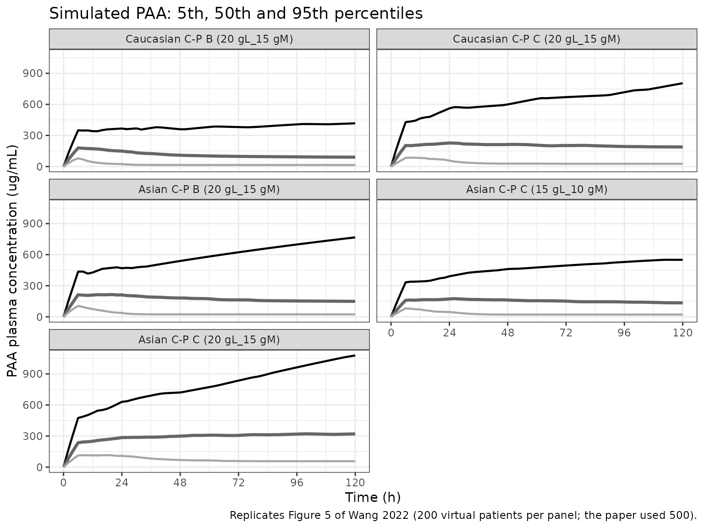
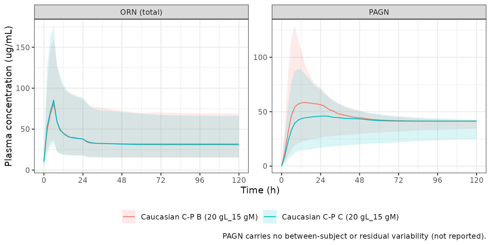

# L-ornithine phenylacetate (Wang 2022)

## Model and source

- Citation: Wang X, Vilchez RA. Population Pharmacokinetic Analysis to
  Assist Dose Selection of the L-Ornithine Salt of Phenylacetic Acid.
  Clin Pharmacokinet. 2022;61(4):515-526.
  <doi:10.1007/s40262-021-01075-1>
- Description: Population PK model for intravenous L-ornithine
  phenylacetate (L-OPA) in adults with cirrhosis or hepatic
  encephalopathy (Wang 2022). Phenylacetic acid (PAA): one compartment
  with Michaelis-Menten conversion to phenylacetylglutamine (PAGN), the
  only PAA elimination route. PAGN: one compartment with first-order
  clearance. L-ornithine (ORN): one compartment with linear clearance
  plus an additive endogenous baseline. Covariates: body weight and
  Child-Pugh class on PAA Vmax and volume; creatinine clearance on PAGN
  clearance; sex, weight, creatinine clearance and Child-Pugh class on
  ORN clearance; Child-Pugh class on the ORN baseline.
- Article: <https://doi.org/10.1007/s40262-021-01075-1> (open access, CC
  BY-NC 4.0)
- Supplement (Online Resource 1: model simplification, Table S2 and the
  NONMEM control streams):
  <https://static-content.springer.com/esm/art%3A10.1007%2Fs40262-021-01075-1/MediaObjects/40262_2021_1075_MOESM1_ESM.docx>

L-ornithine phenylacetate (L-OPA) is an intravenous ammonia scavenger
for hepatic encephalopathy. After infusion it dissociates 1:1 into
phenylacetic acid (PAA), the active moiety, and L-ornithine (ORN). PAA
conjugates with glutamine to form phenylacetylglutamine (PAGN), which is
excreted in urine and carries two moles of ammonia nitrogen per mole.

Wang 2022 first sketched a mechanistic model with glutamate, glutamine
and ammonia (Figure 2, Eqs. 1-6), then simplified it to three uncoupled
or one-way-coupled pieces (Section 3.1, ESM Eqs. S1-S3). The packaged
model encodes the simplified final model, with the per-moiety parameters
from the final fits in patients:

``` math
\begin{aligned}
\frac{dA_1}{dt} &= \text{Rate}_{\text{inf}} - CL_{ORN}\frac{A_1}{V_{ORN}} \\
\frac{dA_2}{dt} &= \text{Rate}_{\text{inf}} - \frac{V_{max} A_2 / V_{PAA}}{K_m + A_2 / V_{PAA}} \\
\frac{dA_3}{dt} &= \frac{V_{max} A_2 / V_{PAA}}{K_m + A_2 / V_{PAA}} - CL_{PAGN}\frac{A_3}{V_{PAGN}}
\end{aligned}
```

In the package, $`A_1`$ is `central_ornithine` (the dose-derived ORN
only), $`A_2`$ is `central` (PAA) and $`A_3`$ is `central_pagn`. All
amounts are in mmol and the internal concentrations in mmol/L, which is
why doses are given in mmol. The three observations are reported in
ug/mL by the molecular weights that the source control streams use (PAA
135.142, PAGN 264.281, ORN 132.163 g/mol). The ORN prediction adds the
endogenous baseline, `Cc_ornithine = A1/V_ORN * 132.163 + BASE`, exactly
as the ESM ORN control stream does.

The three pieces were fitted separately: ORN on its own (ADVAN1), PAA on
its own (ADVAN13), and PAGN sequentially on the individual PAA
estimates. They are packaged in one model because a single infusion
feeds both ORN and PAA, and PAGN is formed from PAA.

## Population

The final models were fitted to 152 patients: adults with stable
cirrhosis (study OCR002-HE201, single ascending doses of 1-40 g over 4
or 24 h) and adults hospitalised with cirrhosis and an acute episode of
hepatic encephalopathy (study OCR002-HE209, 10, 15 or 20 g/24 h for 5
days by Child-Pugh score). Table 1 lists 59 women (median age 59 years,
mean weight 73.9 kg, SD 18.0) and 93 men (median age 57 years, mean
weight 86.3 kg, SD 20.1), all Caucasian or of unknown ethnicity; weights
ranged from 45 to 153 kg. Child-Pugh class was A in 21%, B in 31% and C
in 48%; renal function was normal in 51% and mildly, moderately or
severely impaired in 27%, 20% and 2%.

A separate fit to 46 healthy subjects (Caucasian, Japanese and Chinese;
studies OCR002-HV201 and MNK61051112) was used to show that ethnicity
has no effect on PAA once body weight is accounted for. Its parameter
estimates are not tabulated, so it is not packaged.

The same information is available programmatically via
`readModelDb("Wang_2022_ornithinePhenylacetate")()$population`.

## Source trace

| Equation / parameter | Value | Source location |
|----|----|----|
| ODEs for ORN, PAA, PAGN | n/a | Section 3.1 equations; ESM Eqs. S1-S3; ESM ‘NONMEM Code for PAGN’ `$DES` |
| `lvmax` | log(12.4) mmol/h | Table 2, Vmax |
| `lkm` | log(1.33) mmol/L | Table 2, Km (179 ug/mL) |
| `lvc` | log(24.4) L | Table 2, VPAA |
| `e_wt_vmax` | 0.97 | Table 2, weight power Vmax; reference 83 kg from the ESM PAA control stream |
| `e_wt_vc` | 0.79 | Table 2, weight power VPAA; reference 83 kg as above |
| `e_hepimp_mod_vmax` | 0.63 | Table 2, Vmax ratio C-P B/C-P A |
| `e_hepimp_sev_vmax` | 0.39 | Table 2, Vmax ratio C-P C/C-P A |
| `e_hepimp_modsev_vc` | 1.89 | Table 2, VPAA ratio C-P BC/C-P A |
| `etalvmax`, `etalkm`, `etalvc` | 0.2074, 0.6133, 0.1553 | Table 2, BSV 48%, 92%, 41%, as log(1 + CV^2) |
| `propSd`, `addSd` | 0.35, 2.23 ug/mL | Table 2, PAA proportional (35%) and additive error |
| `lcl_pagn` | log(14.9) L/h | Section 3.4 |
| `lvc_pagn` | log(33.2) L | Section 3.4 |
| `e_crcl_cl_pagn` | 0.8 | Section 3.4 (‘CL PAGN proportional to CLcr^0.8’); reference 90 mL/min from the ESM PAGN code |
| `etalcl_pagn`, `etalvc_pagn` | fixed(0) | Present in the ESM PAGN code; variances not reported |
| `propSd_pagn`, `addSd_pagn` | fixed(0) | Not reported |
| `lcl_ornithine` | log(25.4) L/h | ESM Table S2, theta7 (male CL) |
| `e_sexf_cl_ornithine` | 18.2/25.4 | ESM Table S2, theta1 (female CL) over theta7 |
| `e_wt_cl_ornithine` | 0.824 | ESM Table S2, theta11; reference 75 kg |
| `e_crcl_cl_ornithine` | 0.614 | ESM Table S2, theta6; CLcr capped at 90 mL/min in the ESM ORN code |
| `e_hepimp_modsev_cl_ornithine` | 0.719 | ESM Table S2, theta8 (‘Child-Pugh B/C, adjust by a coefficient’) |
| `lvc_ornithine` | log(64.8) L | ESM Table S2, V |
| `lc0_ornithine` | log(13.6) ug/mL | ESM Table S2, baseline ORN Child-Pugh A |
| `e_hepimp_mod_c0_ornithine`, `e_hepimp_sev_c0_ornithine` | 11.4/13.6, 9.56/13.6 | ESM Table S2, baseline ORN Child-Pugh B and C |
| `etalcl_ornithine`, `etalvc_ornithine`, `etalc0_ornithine` | 0.3616, 0.6931, 0.2476 | ESM Table S2, BSV 66%, 100%, 53%, as log(1 + CV^2) |
| `propSd_ornithine` | 0.4 | ESM Table S2, error model row |

## Virtual cohort

Section 2.3 simulated 500 patients per group with a weight distribution
similar to study HE209, and Asian patients with a mean weight 20% lower.
The paper does not print the weight distribution, so the cohort below
draws sex from Table 1 (38.8% female) and weight from a log-normal per
sex matched to the Table 1 patient means and SDs, truncated to the
observed 45-153 kg. Asian patients take the same draws multiplied by
0.8. Creatinine clearance is set to 90 mL/min; it does not enter PAA and
only matters for the ORN and PAGN predictions. Each scenario has 200
patients.

The dose regimen is the phase III regimen from Section 2.3: 20 g over 6
h, then 15 g over 18 h on day 1, then 15 g over 24 h on days 2-5
(`20 gL_15 gM`). The reduced regimen for Asian patients with Child-Pugh
C is 15 g, 10 g, then 10 g/24 h (`15 gL_10 gM`). Grams of L-OPA are
converted to mmol with the salt’s molecular weight, 268.31 g/mol
(C13H20N2O4, the sum of L-ornithine 132.16 and phenylacetic acid
136.15). Each mmol of L-OPA delivers one mmol of PAA and one of ORN, so
every infusion is entered twice, into `central` and into
`central_ornithine`.

``` r

set.seed(20220401)
mw_lopa <- 268.31 # g/mol, L-ornithine phenylacetate salt

regimens <- list(
  "20 gL_15 gM" = c(load = 20, maint = 15),
  "15 gL_10 gM" = c(load = 15, maint = 10)
)
scenarios <- tibble::tribble(
  ~scenario,                          ~ethnicity,  ~cp,   ~regimen,      ~wt_factor,
  "Caucasian C-P B (20 gL_15 gM)",    "Caucasian", "B",   "20 gL_15 gM", 1.0,
  "Caucasian C-P C (20 gL_15 gM)",    "Caucasian", "C",   "20 gL_15 gM", 1.0,
  "Asian C-P B (20 gL_15 gM)",        "Asian",     "B",   "20 gL_15 gM", 0.8,
  "Asian C-P C (15 gL_10 gM)",        "Asian",     "C",   "15 gL_10 gM", 0.8,
  "Asian C-P C (20 gL_15 gM)",        "Asian",     "C",   "20 gL_15 gM", 0.8
)

n_per <- 200
lnorm_draw <- function(n, m, s) {
  sdlog <- sqrt(log(1 + (s / m)^2))
  rlnorm(n, log(m) - sdlog^2 / 2, sdlog)
}
# One set of Caucasian weights is reused by every scenario, so that the Asian
# scenarios differ from the Caucasian ones only by the 0.8 weight factor.
base_sexf <- rbinom(n_per, 1, 59 / 152)
base_wt <- ifelse(
  base_sexf == 1,
  lnorm_draw(n_per, 73.9, 18.0),
  lnorm_draw(n_per, 86.3, 20.1)
)
base_wt <- pmin(pmax(base_wt, 45), 153)

obs_times <- sort(unique(c(seq(0, 120, by = 2), 84, 108, 120)))

make_scenario <- function(k) {
  sc <- scenarios[k, ]
  reg <- regimens[[sc$regimen]]
  subj <- tibble(
    id = (k - 1L) * n_per + seq_len(n_per),
    scenario = sc$scenario,
    WT = base_wt * sc$wt_factor,
    SEXF = base_sexf,
    CRCL = 90,
    HEPIMP_MOD = as.integer(sc$cp == "B"),
    HEPIMP_SEV = as.integer(sc$cp == "C")
  )
  infusions <- tibble(
    time = c(0, 6, 24, 48, 72, 96),
    dur = c(6, 18, 24, 24, 24, 24),
    grams = c(reg[["load"]], rep(reg[["maint"]], 5))
  ) |>
    mutate(amt = grams * 1000 / mw_lopa, rate = amt / dur)
  doses <- tidyr::crossing(subj, infusions) |>
    select(-grams, -dur) |>
    tidyr::crossing(cmt = c("central", "central_ornithine")) |>
    mutate(evid = 1L, dvid = NA_integer_)
  obs <- tidyr::crossing(subj, time = obs_times) |>
    mutate(amt = NA_real_, rate = NA_real_, cmt = NA_character_, evid = 0L, dvid = 1L)
  bind_rows(doses, obs)
}

events <- bind_rows(lapply(seq_len(nrow(scenarios)), make_scenario)) |>
  arrange(id, time, desc(evid))
stopifnot(!anyDuplicated(events[events$evid == 1, c("id", "time", "cmt")]))
```

## Simulation

The model has three observation endpoints, so observation rows carry
`dvid = 1` and no compartment; rxode2 still returns `Cc`, `Cc_pagn` and
`Cc_ornithine` at every observation time.

``` r

mod <- readModelDb("Wang_2022_ornithinePhenylacetate")
rxode2::rxSetSeed(20220401)
sim <- rxode2::rxSolve(
  mod,
  events = events,
  keep = c("scenario", "WT"),
  useLinCmt = FALSE,
  returnType = "data.frame"
)
#> ℹ parameter labels from comments will be replaced by 'label()'
#> ℹ omega/sigma items treated as zero: 'etalcl_pagn', 'etalvc_pagn'
sim$scenario <- factor(sim$scenario, levels = scenarios$scenario)
```

## Replicate Figure 5

``` r

fig5 <- sim |>
  group_by(scenario, time) |>
  summarise(
    Q05 = quantile(Cc, 0.05),
    Q50 = quantile(Cc, 0.50),
    Q95 = quantile(Cc, 0.95),
    .groups = "drop"
  )
ggplot(fig5, aes(time)) +
  geom_line(aes(y = Q95), linewidth = 0.8) +
  geom_line(aes(y = Q50), linewidth = 1.2, colour = "grey40") +
  geom_line(aes(y = Q05), linewidth = 0.8, colour = "grey65") +
  facet_wrap(~scenario, ncol = 2) +
  scale_x_continuous(breaks = seq(0, 120, by = 24)) +
  labs(
    x = "Time (h)",
    y = "PAA plasma concentration (ug/mL)",
    title = "Simulated PAA: 5th, 50th and 95th percentiles",
    caption = "Replicates Figure 5 of Wang 2022 (200 virtual patients per panel; the paper used 500)."
  ) +
  theme_bw()
```



## Comparison with Table 3

Table 3 of the paper lists the simulated median and 5th and 95th
percentiles of PAA at 84, 108 and 120 h. The table below puts the
packaged model’s values next to them.

``` r

published_t3 <- tibble::tribble(
  ~scenario,                       ~time, ~pub_median, ~pub_p05, ~pub_p95,
  "Caucasian C-P B (20 gL_15 gM)",    84,          84,       17,      369,
  "Caucasian C-P B (20 gL_15 gM)",   108,          88,       16,      357,
  "Caucasian C-P B (20 gL_15 gM)",   120,          83,       16,      384,
  "Caucasian C-P C (20 gL_15 gM)",    84,         177,       52,      646,
  "Caucasian C-P C (20 gL_15 gM)",   108,         179,       52,      730,
  "Caucasian C-P C (20 gL_15 gM)",   120,         175,       52,      780,
  "Asian C-P B (20 gL_15 gM)",        84,         136,       34,      578,
  "Asian C-P B (20 gL_15 gM)",       108,         129,       32,      609,
  "Asian C-P B (20 gL_15 gM)",       120,         130,       30,      624,
  "Asian C-P C (15 gL_10 gM)",        84,         144,       43,      786,
  "Asian C-P C (15 gL_10 gM)",       108,         143,       43,      753,
  "Asian C-P C (15 gL_10 gM)",       120,         112,        8,      622,
  "Asian C-P C (20 gL_15 gM)",        84,         232,       66,     1521,
  "Asian C-P C (20 gL_15 gM)",       108,         250,       61,     1600,
  "Asian C-P C (20 gL_15 gM)",       120,         255,       63,     1584
)

sim_t3 <- sim |>
  filter(time %in% c(84, 108, 120)) |>
  group_by(scenario, time) |>
  summarise(
    sim_median = median(Cc),
    sim_p05 = quantile(Cc, 0.05),
    sim_p95 = quantile(Cc, 0.95),
    .groups = "drop"
  ) |>
  mutate(scenario = as.character(scenario))

cmp_t3 <- published_t3 |>
  left_join(sim_t3, by = c("scenario", "time")) |>
  mutate(pct_diff_median = 100 * (sim_median / pub_median - 1))

cmp_t3 |>
  mutate(across(c(sim_median, sim_p05, sim_p95), ~ signif(.x, 3)),
         pct_diff_median = round(pct_diff_median, 1)) |>
  select(scenario, time, pub_median, sim_median, pct_diff_median,
         pub_p05, sim_p05, pub_p95, sim_p95) |>
  dplyr::rename(
    "Scenario" = scenario,
    "Time (h)" = time,
    "Median, paper" = pub_median,
    "Median, simulated" = sim_median,
    "Median difference (%)" = pct_diff_median,
    "P5, paper" = pub_p05,
    "P5, simulated" = sim_p05,
    "P95, paper" = pub_p95,
    "P95, simulated" = sim_p95
  ) |>
  knitr::kable(caption = "Simulated PAA (ug/mL) against Table 3 of Wang 2022.")
```

| Scenario | Time (h) | Median, paper | Median, simulated | Median difference (%) | P5, paper | P5, simulated | P95, paper | P95, simulated |
|:---|---:|---:|---:|---:|---:|---:|---:|---:|
| Caucasian C-P B (20 gL_15 gM) | 84 | 84 | 95.4 | 13.5 | 17 | 15.1 | 369 | 389 |
| Caucasian C-P B (20 gL_15 gM) | 108 | 88 | 91.4 | 3.9 | 16 | 15.1 | 357 | 408 |
| Caucasian C-P B (20 gL_15 gM) | 120 | 83 | 90.5 | 9.0 | 16 | 15.1 | 384 | 418 |
| Caucasian C-P C (20 gL_15 gM) | 84 | 177 | 201.0 | 13.4 | 52 | 26.6 | 646 | 683 |
| Caucasian C-P C (20 gL_15 gM) | 108 | 179 | 190.0 | 6.2 | 52 | 26.6 | 730 | 753 |
| Caucasian C-P C (20 gL_15 gM) | 120 | 175 | 189.0 | 7.9 | 52 | 26.6 | 780 | 804 |
| Asian C-P B (20 gL_15 gM) | 84 | 136 | 156.0 | 14.5 | 34 | 23.8 | 578 | 662 |
| Asian C-P B (20 gL_15 gM) | 108 | 129 | 151.0 | 17.2 | 32 | 23.8 | 609 | 733 |
| Asian C-P B (20 gL_15 gM) | 120 | 130 | 149.0 | 14.7 | 30 | 23.8 | 624 | 767 |
| Asian C-P C (15 gL_10 gM) | 84 | 144 | 145.0 | 0.9 | 43 | 21.7 | 786 | 511 |
| Asian C-P C (15 gL_10 gM) | 108 | 143 | 139.0 | -2.9 | 43 | 21.7 | 753 | 545 |
| Asian C-P C (15 gL_10 gM) | 120 | 112 | 135.0 | 20.5 | 8 | 21.7 | 622 | 551 |
| Asian C-P C (20 gL_15 gM) | 84 | 232 | 312.0 | 34.4 | 66 | 57.1 | 1521 | 898 |
| Asian C-P C (20 gL_15 gM) | 108 | 250 | 317.0 | 26.9 | 61 | 56.7 | 1600 | 1020 |
| Asian C-P C (20 gL_15 gM) | 120 | 255 | 321.0 | 25.7 | 63 | 56.7 | 1584 | 1080 |

Simulated PAA (ug/mL) against Table 3 of Wang 2022. {.table}

In four of the five scenarios the simulated medians sit between about 1%
and 17% above Table 3 (median difference 11.2%). A small upward offset
is expected: the virtual cohort’s median weight is 77.3 kg, and the
paper’s HE209-like cohort is not printed but is probably heavier. The
Asian Child-Pugh C scenario at the full dose is the exception: its
simulated median runs about 25-35% above the paper’s. That scenario sits
close to saturation (the typical Vmax of an Asian Child-Pugh C patient,
about 3.8 mmol/h, is not far above the 2.3 mmol/h maintenance infusion),
so the steady-state concentration `Km * R / (Vmax - R)` is very
sensitive to the weight distribution. The paper’s 5th-to-95th percentile
band is also wider than ours in the Child-Pugh C scenarios. The PAA
random effects were estimated as a correlated 3 x 3 block that the paper
does not report, and the packaged model carries them uncorrelated; a
Vmax-Km correlation (the control stream’s starting values imply one of
about 0.9, though the final estimate is not reported) changes the tails
of this nonlinear model much more than its centre. That row is kept
visible but left out of the assertion below. The 120 h median of the
reduced-dose scenario (112 ug/mL, against 143 ug/mL at 108 h) is left
in: the published curve drops at the end, which a constant infusion
cannot produce, and it falls inside the envelope bound.

``` r

gate <- cmp_t3 |> filter(scenario != "Asian C-P C (20 gL_15 gM)")
stopifnot(
  # Structural: a mis-transcribed Vmax, Km, Child-Pugh ratio or dose unit moves
  # every median by 40% or more (dosing grams of PAA instead of L-OPA doubles
  # the molar rate). Realised about +10% with this cohort; the offset comes from
  # the cohort's weight distribution, which the paper does not print.
  abs(median(gate$pct_diff_median)) < 20,
  # Envelope, robust to which subjects land in the tails.
  quantile(abs(gate$pct_diff_median), 0.9) < 35
)
```

## Deterministic checks

A typical patient (83 kg, male, creatinine clearance 90 mL/min) on a
constant 15 g/24 h infusion reaches a steady state that has a closed
form for every moiety, with $`R`$ the infusion rate in mmol/h:

- PAA: $`C_{ss} = K_m R / (V_{max} - R)`$, in mmol/L;
- PAGN: every mmol of PAA becomes PAGN, so $`C_{ss} = R / CL_{PAGN}`$;
- ORN: $`C_{ss} = R / CL_{ORN} \times 132.163 + \text{BASE}`$.

``` r

rate_15g <- 15 * 1000 / mw_lopa / 24
typ <- tibble(
  cp = c("A", "B", "C"),
  HEPIMP_MOD = c(0L, 1L, 0L),
  HEPIMP_SEV = c(0L, 0L, 1L)
) |>
  mutate(id = seq_len(n()), WT = 83, SEXF = 0L, CRCL = 90)
ss_dose <- tidyr::crossing(typ, cmt = c("central", "central_ornithine")) |>
  mutate(time = 0, amt = rate_15g * 1000, rate = rate_15g, evid = 1L, dvid = NA_integer_)
ss_obs <- typ |>
  mutate(time = 900, amt = NA_real_, rate = NA_real_, cmt = NA_character_,
         evid = 0L, dvid = 1L)
ss_sim <- rxode2::rxSolve(
  rxode2::zeroRe(mod),
  events = bind_rows(ss_dose, ss_obs) |> arrange(id, time, desc(evid)),
  keep = "cp",
  useLinCmt = FALSE,
  returnType = "data.frame"
)
#> ℹ parameter labels from comments will be replaced by 'label()'
#> ℹ omega/sigma items treated as zero: 'etalvmax', 'etalkm', 'etalvc', 'etalcl_pagn', 'etalvc_pagn', 'etalcl_ornithine', 'etalvc_ornithine', 'etalc0_ornithine'
#> Warning: multi-subject simulation without without 'omega'

ss_tab <- ss_sim |>
  transmute(
    cp,
    paa_sim = Cc,
    paa_closed = 1.33 * rate_15g / (vmax - rate_15g) * 135.142,
    pagn_sim = Cc_pagn,
    pagn_closed = rate_15g / 14.9 * 264.281,
    orn_sim = Cc_ornithine,
    orn_closed = rate_15g / cl_ornithine * 132.163 + c0_ornithine
  )
ss_tab |>
  mutate(across(-cp, ~ signif(.x, 4))) |>
  dplyr::rename(
    "Child-Pugh" = cp,
    "PAA, solved" = paa_sim, "PAA, closed form" = paa_closed,
    "PAGN, solved" = pagn_sim, "PAGN, closed form" = pagn_closed,
    "ORN, solved" = orn_sim, "ORN, closed form" = orn_closed
  ) |>
  knitr::kable(caption = "Typical-patient steady state at 15 g/24 h (ug/mL).")
```

| Child-Pugh | PAA, solved | PAA, closed form | PAGN, solved | PAGN, closed form | ORN, solved | ORN, closed form |
|:---|---:|---:|---:|---:|---:|---:|
| A | 41.57 | 41.57 | 41.32 | 41.32 | 24.75 | 24.75 |
| B | 76.37 | 76.37 | 41.32 | 41.32 | 26.91 | 26.91 |
| C | 167.00 | 167.00 | 41.32 | 41.32 | 25.07 | 25.07 |

Typical-patient steady state at 15 g/24 h (ug/mL). {.table}

``` r


# Both sides use the same parameters, so the difference is only numerical.
rel <- with(ss_tab, abs(c(paa_sim / paa_closed, pagn_sim / pagn_closed, orn_sim / orn_closed) - 1))
stopifnot(max(rel) < 1e-3)
```

The typical ORN steady state of 25 to 27 ug/mL across Child-Pugh A to C
on 15 g/24 h agrees with the Discussion’s ‘observed median concentration
of ORN (including both endogenous and exogenous) was about 30 ug/mL’ at
that dose.

``` r

sim |>
  filter(scenario %in% c("Caucasian C-P B (20 gL_15 gM)", "Caucasian C-P C (20 gL_15 gM)")) |>
  select(scenario, time, Cc_pagn, Cc_ornithine) |>
  tidyr::pivot_longer(c(Cc_pagn, Cc_ornithine), names_to = "analyte", values_to = "conc") |>
  mutate(analyte = dplyr::recode(analyte, Cc_pagn = "PAGN", Cc_ornithine = "ORN (total)")) |>
  group_by(scenario, analyte, time) |>
  summarise(Q05 = quantile(conc, 0.05), Q50 = median(conc), Q95 = quantile(conc, 0.95),
            .groups = "drop") |>
  ggplot(aes(time, Q50, colour = scenario, fill = scenario)) +
  geom_ribbon(aes(ymin = Q05, ymax = Q95), alpha = 0.15, colour = NA) +
  geom_line() +
  facet_wrap(~analyte, scales = "free_y") +
  scale_x_continuous(breaks = seq(0, 120, by = 24)) +
  labs(x = "Time (h)", y = "Plasma concentration (ug/mL)", colour = NULL, fill = NULL,
       caption = "PAGN carries no between-subject or residual variability (not reported).") +
  theme_bw() +
  theme(legend.position = "bottom")
```



## PKNCA validation

The paper reports no NCA. PKNCA summarises day 5 (96-120 h) for each
scenario: the maximum, the average concentration, and the AUC over the
dosing day.

``` r

sim_nca <- sim |>
  filter(!is.na(Cc)) |>
  select(id, time, Cc, scenario) |>
  mutate(scenario = as.character(scenario))
conc_obj <- PKNCA::PKNCAconc(sim_nca, Cc ~ time | scenario + id)

dose_df <- events |>
  filter(evid == 1, cmt == "central") |>
  select(id, time, amt, scenario)
dose_obj <- PKNCA::PKNCAdose(dose_df, amt ~ time | scenario + id)

intervals <- data.frame(start = 96, end = 120, cmax = TRUE, auclast = TRUE, cav = TRUE)
nca_res <- PKNCA::pk.nca(PKNCA::PKNCAdata(conc_obj, dose_obj, intervals = intervals))

nca_tab <- as.data.frame(nca_res$result) |>
  group_by(scenario, PPTESTCD) |>
  summarise(median = median(PPORRES), .groups = "drop") |>
  tidyr::pivot_wider(names_from = PPTESTCD, values_from = median) |>
  mutate(scenario = factor(scenario, levels = scenarios$scenario)) |>
  arrange(scenario)
nca_tab |>
  mutate(across(c(cmax, cav, auclast), ~ signif(.x, 3))) |>
  select(scenario, cmax, cav, auclast) |>
  dplyr::rename(
    "Scenario" = scenario,
    "Cmax (ug/mL)" = cmax,
    "Cav (ug/mL)" = cav,
    "AUC96-120 (h*ug/mL)" = auclast
  ) |>
  knitr::kable(caption = "Median day-5 PAA NCA by scenario.")
```

| Scenario                      | Cmax (ug/mL) | Cav (ug/mL) | AUC96-120 (h\*ug/mL) |
|:------------------------------|-------------:|------------:|---------------------:|
| Caucasian C-P B (20 gL_15 gM) |         93.3 |        91.5 |                 2200 |
| Caucasian C-P C (20 gL_15 gM) |        199.0 |       190.0 |                 4570 |
| Asian C-P B (20 gL_15 gM)     |        153.0 |       151.0 |                 3630 |
| Asian C-P C (15 gL_10 gM)     |        143.0 |       139.0 |                 3340 |
| Asian C-P C (20 gL_15 gM)     |        329.0 |       317.0 |                 7620 |

Median day-5 PAA NCA by scenario. {.table}

``` r


# Day 5 is at or near steady state on a constant infusion, so the median Cav
# must sit close to the Table 3 median at 108 h (mid-interval).
cav_check <- nca_tab |>
  mutate(scenario = as.character(scenario)) |>
  inner_join(sim_t3 |> filter(time == 108), by = "scenario")
stopifnot(all(abs(cav_check$cav / cav_check$sim_median - 1) < 0.15))
```

## Assumptions and deviations

- **Scope.** The packaged model is the simplified final model in
  patients. The mechanistic model of Figure 2 (glutamate, glutamine,
  ammonia) was not estimated to a reportable parameter set and is not
  encoded. The exploratory enhancement of Vmax by exogenous ORN (`Coe`,
  1.22 in the Discussion) was dropped from the final model because it
  could not be estimated precisely (ESM, ‘Model Simplification’), so
  Vmax is a constant here too. The healthy-subject fits (ORN with
  ethnicity and age effects, PAA with a sex effect on volume) have no
  tabulated estimates and are not packaged.
- **BSV scale.** Table 2 and Table S2 give BSV as a percentage only. The
  maintainers converted with `omega^2 = log(1 + CV^2)`. The control
  stream’s starting values do not settle the scale (the fixed-effect
  starting values are far from the finals), though the one
  near-converged row, VPAA (starting 24, final 24.4), has an OMEGA
  starting value of 0.15, closer to the `log(1 + CV^2)` value 0.155 than
  to `CV^2` = 0.168.
- **BSV correlations.** The PAA control stream estimates an OMEGA
  BLOCK(3) (Vmax, Km, VPAA) and the ORN control stream a BLOCK(2) (CL,
  V). No covariances are reported, so both blocks are carried as
  diagonal. This is the most likely reason the simulated percentile band
  is narrower than the paper’s in the Child-Pugh C scenarios (see the
  Table 3 comparison).
- **PAGN variability.** The PAGN control stream has random effects on
  VPAGN and CLPAGN, and the paper’s Methods describe combined
  proportional and additive residual error for all analytes, but no PAGN
  variances or residual errors are reported. They are fixed to zero, so
  PAGN simulations are typical-value predictions given the individual
  PAA parameters.
- **ORN Child-Pugh effect on clearance.** Section 3.2 states that ORN
  clearance falls by 37% (Child-Pugh B) and 55% (Child-Pugh C) from
  Child-Pugh A. ESM Table S2 and the ESM ORN control stream instead
  carry a single coefficient, theta8 = 0.719 (a 28% fall), for
  Child-Pugh B and C together. The packaged model follows the table and
  the control stream.
- **ORN residual error.** Table S2’s error row reads ‘PAA proportional
  error, % 0.4’, in the ORN table. It is read as the ORN proportional
  SD, 0.4 (40%): the control stream’s THETA(4) is a fraction (starting
  value 0.251), and 0.4% would be implausibly small for a plasma amino
  acid. The ORN additive term is `0 FIX` in the control stream and is
  omitted.
- **ORN initial condition.** The ESM PAGN code sets `A_0(1) = BASE` for
  the ORN compartment, which contradicts the ORN model (where `A(1)` is
  the exogenous amount starting at zero and BASE is added to the
  prediction). The packaged model follows the ORN model, which is the
  one that estimated the ORN parameters.
- **Creatinine clearance.** Capped at 90 mL/min for ORN (as in the ORN
  control stream) and uncapped for PAGN (as in the PAGN code). The paper
  does not state the estimating equation.
- **Child-Pugh coding.** Child-Pugh A is the reference: all patients had
  cirrhosis. B and C are given as the mutually exclusive indicators
  `HEPIMP_MOD` and `HEPIMP_SEV`; the pooled B-or-C effects are computed
  inside the model as their sum.
- **Dose units.** The model is dosed in mmol. Grams of L-OPA are
  converted with the salt’s molecular weight, 268.31 g/mol, which the
  paper does not state. The steady states it gives agree with Table 3
  (typical Child-Pugh B at 83 kg: 76 ug/mL against a published median of
  84 to 88 ug/mL). Reading the dose as grams of PAA would double the
  molar infusion rate, to about 4.6 mmol/h, close to the typical
  Child-Pugh C Vmax of 4.8 mmol/h at 83 kg, and push the Child-Pugh C
  concentrations far above Table 3.
- **Virtual cohort.** The weight distribution of the paper’s simulations
  is not printed; the cohort uses log-normal weights matched to the
  Table 1 patient means and SDs by sex, and 200 patients per scenario
  instead of 500.
- **Errata.** No correction notice for this article was found on the
  publisher’s page or in Europe PMC as of 2026-09-30.
