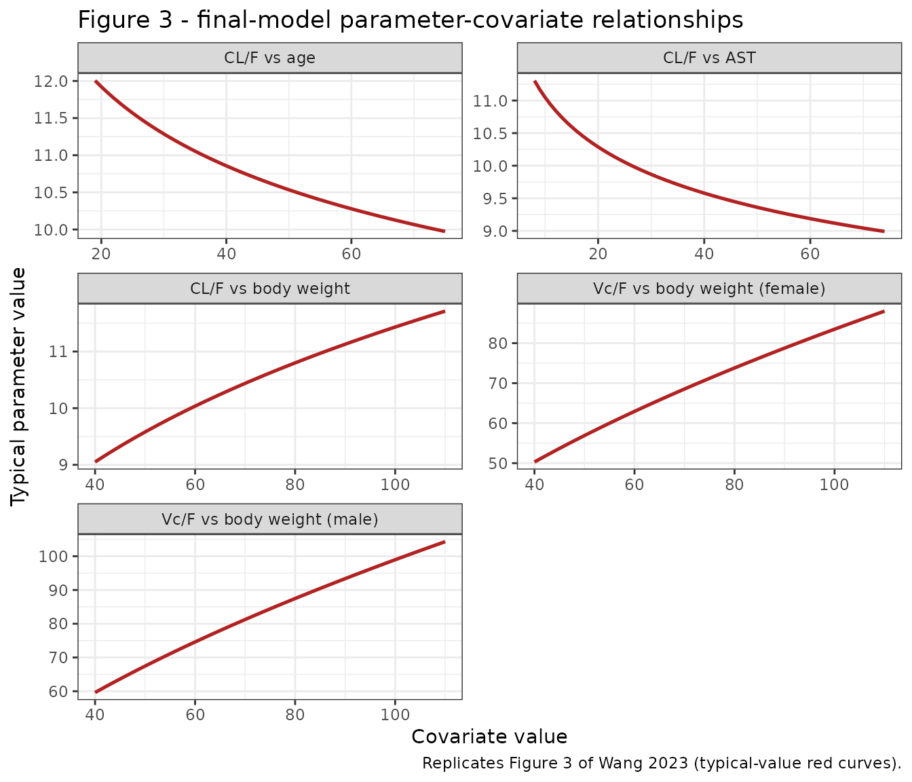
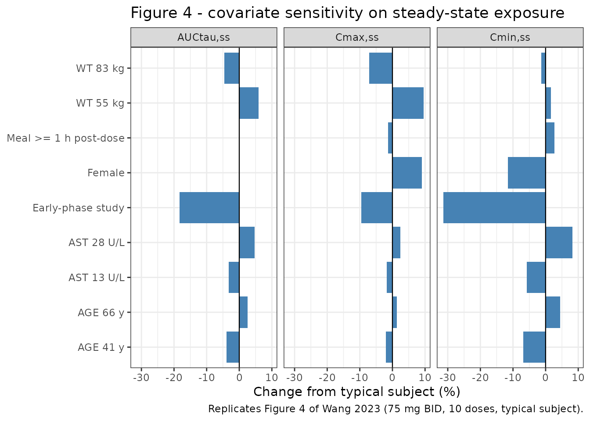
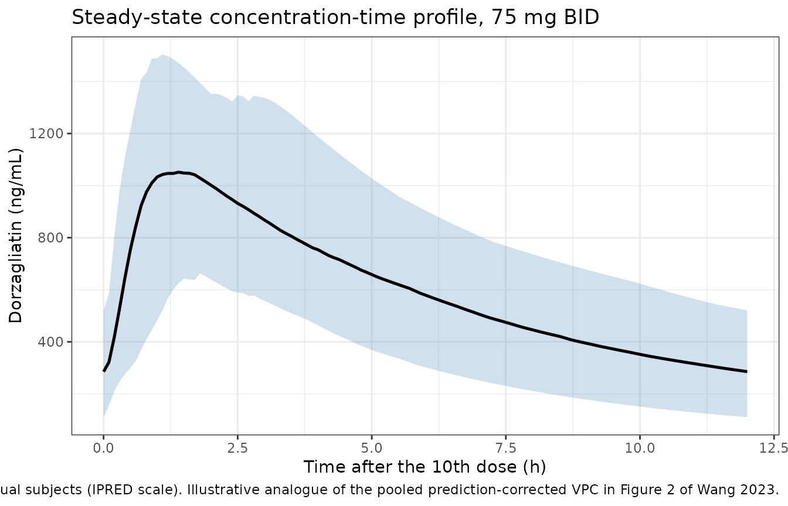

# Dorzagliatin (Wang 2023)

## Model and source

- Citation: Wang K, Feng L, Zhang J, Zou Q, Xu F, Sun Z, Tang F, Chen L.
  (2023). Population pharmacokinetic analysis of dorzagliatin in healthy
  subjects and patients with type 2 diabetes mellitus. Clin
  Pharmacokinet 62(10):1419-1430. <doi:10.1007/s40262-023-01286-8>
- Article: <https://doi.org/10.1007/s40262-023-01286-8>
- Supplement (Tables S1-S4):
  <https://static-content.springer.com/esm/art%3A10.1007%2Fs40262-023-01286-8/MediaObjects/40262_2023_1286_MOESM1_ESM.docx>

Dorzagliatin (HMS5552) is a first-in-class dual-acting glucokinase
activator approved in China in September 2022 for adults with type 2
diabetes mellitus (T2DM), as monotherapy and as an add-on to metformin.
Wang 2023 pooled six trials from the Hua Medicine development programme
into a single population PK analysis to quantify the influence of
demographic, hepatic and renal covariates on dorzagliatin exposure.

The structural model is a **two-compartment model with sequential
zero-order then first-order oral absorption** and first-order
elimination: the dose enters the depot at a constant rate over a window
of duration `D1`, and the depot then drains into the central compartment
first-order at `ka`. All disposition parameters are apparent (`CL/F`,
`Vc/F`, `Q/F`, `Vp/F`) because only oral data were analysed;
bioavailability was not estimated and is implicitly 1.

``` r

mod <- readModelDb("Wang_2023_dorzagliatin")
mod
#> function() {
#>   description <- paste(
#>     "Two-compartment population PK model for oral dorzagliatin (HMS5552,",
#>     "a first-in-class dual-acting glucokinase activator approved in China",
#>     "for type 2 diabetes mellitus) in healthy subjects and patients with",
#>     "T2DM (Wang 2023; N = 1062 subjects, 7686 concentrations pooled from",
#>     "six clinical trials). Disposition is a two-compartment model with",
#>     "sequential zero-order then first-order oral absorption (dose enters",
#>     "the depot over a zero-order window of duration D1 = 0.418 h, then is",
#>     "absorbed first-order at ka = 3.29 h^-1) and first-order elimination",
#>     "from the central compartment. Typical values for a 69 kg, 55-year-old",
#>     "male with AST 18 U/L enrolled in the later-phase studies are CL/F =",
#>     "10.4 L/h, Vc/F = 80.6 L, Q/F = 3.02 L/h and Vp/F = 26.5 L. CL/F",
#>     "carries three power covariate effects plus one study indicator:",
#>     "(WT/69)^0.255, (AST/18)^-0.103, (AGE/55)^-0.135 and a multiplicative",
#>     "exp(0.203) = 1.23 uplift for the three early-phase studies",
#>     "(HMM0102 / HMM0103 / HMM0110), which the paper attributes to a",
#>     "formulation / bioavailability difference that could not be resolved",
#>     "as an F effect. Vc/F carries (WT/69)^0.553 and a multiplicative",
#>     "exp(-0.170) = 0.843 factor in females (15.7% lower than males). D1",
#>     "carries exp(0.816) = 2.26 when food is consumed at least 1 h after",
#>     "dosing rather than 0.5 h after dosing. Because sex acts only on Vc/F",
#>     "and the meal-timing effect only on D1, neither changes steady-state",
#>     "AUCtau (the paper reports 0.01% and 0% respectively) while both shift",
#>     "Cmax,ss and Cmin,ss. Inter-individual variability is a correlated",
#>     "CL/F-Vc/F block (approximate CV 22.5% and 14.9%; covariance 0.0181)",
#>     "plus independent terms on Vp/F (48.8%) and D1 (82.8%); ka and Q/F",
#>     "carry no IIV. Residual error is combined additive plus proportional",
#>     "(109 ng/mL and 32.9%).",
#>     sep = " "
#>   )
#>   reference <- paste(
#>     "Wang K, Feng L, Zhang J, Zou Q, Xu F, Sun Z, Tang F, Chen L. (2023).",
#>     "Population pharmacokinetic analysis of dorzagliatin in healthy",
#>     "subjects and patients with type 2 diabetes mellitus.",
#>     "Clin Pharmacokinet 62(10):1419-1430.",
#>     "doi:10.1007/s40262-023-01286-8",
#>     sep = " "
#>   )
#>   vignette <- "Wang_2023_dorzagliatin"
#>   units    <- list(time = "h", dosing = "mg", concentration = "ng/mL")
#> 
#>   # Issue #482: what each ODE state holds, in what amount units, in what
#>   # biological matrix. Derived mechanically; verified = FALSE means it has
#>   # NOT been checked against the source paper.
#>   compartmentData <- list(
#>     depot       = list(analyte = "dorzagliatin", units = "mg", specimen = "administration site", verified = FALSE),
#>     central     = list(analyte = "dorzagliatin", units = "mg", specimen = "plasma", verified = FALSE),
#>     peripheral1 = list(analyte = "dorzagliatin", units = "mg", specimen = "plasma", verified = FALSE)
#>   )
#> 
#>   covariateData <- list(
#>     WT = list(
#>       description        = "Total body weight",
#>       units              = "kg",
#>       type               = "continuous",
#>       reference_category = NULL,
#>       notes              = paste(
#>         "Baseline, time-fixed. Overall population median 69.0 kg",
#>         "(range 40.0-110; Wang 2023 Table 2 'TBW, kg' Overall column),",
#>         "which is the normalization constant used by both covariate",
#>         "relationships. Retained on CL/F and Vc/F in the final model as",
#>         "power effects (WT/69)^0.255 and (WT/69)^0.553 -- the paper prints",
#>         "these in the algebraically identical exp(theta * log(WT/69))",
#>         "form (Wang 2023 Table 3 footnote equations). Note that neither",
#>         "exponent is the allometric 0.75 / 1.0 pair; both were estimated",
#>         "(RSE 19.4% and 9.94%). Wang 2023 Discussion reports the",
#>         "resulting 10th-90th percentile spread (55 kg and 83 kg) as",
#>         "-5.63% to +4.83% on CL/F and -11.8% to +10.8% on Vc/F."
#>       ),
#>       source_name        = "TBW"
#>     ),
#>     AGE = list(
#>       description        = "Age at baseline",
#>       units              = "years",
#>       type               = "continuous",
#>       reference_category = NULL,
#>       notes              = paste(
#>         "Baseline, time-fixed. Overall population median 55.0 years",
#>         "(range 19.0-74.2; Wang 2023 Table 2 'AGE, year' Overall column),",
#>         "used as the normalization constant. Retained on CL/F as the",
#>         "power effect (AGE/55)^-0.135, i.e. older subjects have lower",
#>         "CL/F and therefore higher exposure. Wang 2023 Discussion",
#>         "reports +4.06% (41 years) to -2.44% (66 years) on CL/F across",
#>         "the 10th-90th percentiles. No subject was younger than 19 or",
#>         "older than 74.2 years, so the relationship is not established",
#>         "in pediatric or very elderly subjects."
#>       ),
#>       source_name        = "AGE"
#>     ),
#>     AST = list(
#>       description        = "Baseline aspartate aminotransferase",
#>       units              = "U/L",
#>       type               = "continuous",
#>       reference_category = NULL,
#>       notes              = paste(
#>         "Baseline, time-fixed. Overall population median 18.0 U/L",
#>         "(range 8.00-74.0; Wang 2023 Table 2 'AST, U/L' Overall column),",
#>         "used as the normalization constant. Reported by the paper in",
#>         "U/L, matching the canonical SI unit (the source uses U/L and",
#>         "IU/L interchangeably; the supplement quotes the AST upper limit",
#>         "of normal as 40 IU/L). Retained on CL/F as the power effect",
#>         "(AST/18)^-0.103: higher AST (poorer hepatocellular integrity)",
#>         "gives lower CL/F and higher exposure. Wang 2023 Discussion",
#>         "reports +3.41% (13 U/L) to -4.45% (28 U/L) on CL/F across the",
#>         "10th-90th percentiles. AST is the only retained hepatic marker;",
#>         "ALT and total bilirubin were screened and dropped."
#>       ),
#>       source_name        = "AST"
#>     ),
#>     SEXF = list(
#>       description        = "Female sex indicator",
#>       units              = "(binary)",
#>       type               = "binary",
#>       reference_category = "0 (male)",
#>       notes              = paste(
#>         "Time-fixed per subject. The source column GEND is coded 1 =",
#>         "female, 0 = male (Wang 2023 Table 3 footnote: 'GEND: 1 for",
#>         "female, 0 for male'), which is exactly the canonical SEXF",
#>         "orientation -- no value transformation is required. Cohort",
#>         "397 / 1062 female (37.4%) per Wang 2023 Table 2. Retained on",
#>         "Vc/F only as a multiplicative exp(-0.170) = 0.843 factor,",
#>         "i.e. females have 15.7% lower Vc/F than males (Wang 2023",
#>         "Discussion). Because sex does not act on CL/F, steady-state",
#>         "AUCtau is essentially unchanged between sexes (0.01% per",
#>         "Wang 2023 Section 3.3) while Cmax,ss is 9.09% higher and",
#>         "Cmin,ss 11.6% lower in females."
#>       ),
#>       source_name        = "GEND"
#>     ),
#>     STUDY_DORZA_EARLY = list(
#>       description        = "Early-phase dorzagliatin study indicator (HMM0102 / HMM0103 / HMM0110)",
#>       units              = "(binary)",
#>       type               = "binary",
#>       reference_category = "0 (later-phase studies HMM0201 / HMM0301 / HMM0302)",
#>       notes              = paste(
#>         "Time-fixed per subject; set from the trial identifier. 1 = the",
#>         "subject was enrolled in study HMM0102 (NCT02077452), HMM0103",
#>         "(NCT02386982) or HMM0110 (NCT04324424); 0 = HMM0201",
#>         "(NCT02561338), HMM0301 (NCT03173391) or HMM0302 (NCT03141073).",
#>         "Wang 2023 Table 3 footnote: 'Study: 1 for study 102/103/110, 0",
#>         "for others'. Enters CL/F as exp(0.203 * STUDY_DORZA_EARLY) =",
#>         "a 1.23-fold (22.5% higher) apparent clearance in the",
#>         "early-phase studies. Wang 2023 Discussion paragraph 2 explains",
#>         "the mechanism: those studies showed systematically lower",
#>         "exposure, plausibly a formulation difference (studies 301 and",
#>         "302 used near-commercial preparations), but 'the model was",
#>         "unable to correct for prediction bias by bioavailability' in",
#>         "the sparsely-sampled later studies, so the between-trial",
#>         "difference was absorbed into CL/F instead of F."
#>       ),
#>       source_name        = "Study"
#>     ),
#>     MEAL_DELAY_1H = list(
#>       description        = "Delayed-meal indicator: food consumed at least 1 h after dosing rather than 0.5 h after dosing",
#>       units              = "(binary)",
#>       type               = "binary",
#>       reference_category = "0 (food consumed 0.5 h after dosing)",
#>       notes              = paste(
#>         "Per-dose-record indicator. 1 = the subject started eating at",
#>         "least 1 h after taking the dose; 0 = the subject started eating",
#>         "0.5 h after taking the dose (Wang 2023 Table 3 footnote:",
#>         "'FOOD: 0 and 1 for the time of food consumption after 0.5 h and",
#>         ">= 1 h of drug administration, respectively'). Both levels are",
#>         "fed states -- this covariate encodes the dose-to-meal interval,",
#>         "not the presence or the fat content of a meal, so it is distinct",
#>         "from FED, FED_HIGHFAT and FED_LOWFAT. Retained on D1 only, as",
#>         "the multiplicative factor exp(0.816) = 2.26: waiting at least",
#>         "1 h before eating more than doubles the zero-order absorption",
#>         "window (0.418 h -> 0.945 h). Because D1 does not affect CL/F,",
#>         "steady-state AUCtau is unchanged and Cmax,ss / Cmin,ss shift by",
#>         "only -1.26% / +2.71% (Wang 2023 Section 3.3). Note that Wang",
#>         "2023 Table 3 mislabels this row as 'D1,FOOD -- Influence of",
#>         "food consumption time on CL/F'; the printed equation and the",
#>         "parameter name both place the effect on D1, and the Discussion",
#>         "confirms 'patients with time to food consumption of >= 1 h",
#>         "after drug administration had higher D1'."
#>       ),
#>       source_name        = "FOOD"
#>     )
#>   )
#> 
#>   covariatesDataExcluded <- list(
#>     BMI = list(
#>       description        = "Baseline body mass index",
#>       units              = "kg/m^2",
#>       type               = "continuous",
#>       reference_category = NULL,
#>       notes              = paste(
#>         "Screened in the stepwise forward-inclusion / backward-",
#>         "elimination covariate search (Wang 2023 Section 2.4) but not",
#>         "retained in the final model. Overall median 25.2 kg/m^2",
#>         "(range 18.2-34.9) per Table 2. Wang 2023 Section 3.4 and",
#>         "Table S1 report the geometric-mean exposure difference across",
#>         "BMI quartiles as only -10% to +5.57% relative to the overall",
#>         "population, driven by correlated covariates rather than a",
#>         "retained BMI effect."
#>       ),
#>       source_name        = "BMI"
#>     ),
#>     BSA = list(
#>       description        = "Baseline body surface area",
#>       units              = "m^2",
#>       type               = "continuous",
#>       reference_category = NULL,
#>       notes              = paste(
#>         "Screened (Wang 2023 Section 2.4 covariate list) but not",
#>         "retained; body weight was the size descriptor kept on both",
#>         "CL/F and Vc/F. Not tabulated in Wang 2023 Table 2."
#>       ),
#>       source_name        = "BSA"
#>     ),
#>     ALB = list(
#>       description        = "Baseline serum albumin",
#>       units              = "g/L",
#>       type               = "continuous",
#>       reference_category = NULL,
#>       notes              = paste(
#>         "Screened but not retained. Overall median 46.2 g/L (range",
#>         "33.2-57.0) per Wang 2023 Table 2; already in canonical SI",
#>         "units, so no conversion is needed."
#>       ),
#>       source_name        = "ALB"
#>     ),
#>     ALT = list(
#>       description        = "Baseline alanine aminotransferase",
#>       units              = "U/L",
#>       type               = "continuous",
#>       reference_category = NULL,
#>       notes              = paste(
#>         "Screened but not retained; AST was the hepatic marker kept on",
#>         "CL/F. Overall median 19.0 U/L (range 2.50-110) per Wang 2023",
#>         "Table 2. Wang 2023 Section 3.2 states explicitly that ALT",
#>         "'had no significant effect on the pharmacokinetics of",
#>         "dorzagliatin'."
#>       ),
#>       source_name        = "ALT"
#>     ),
#>     CREAT = list(
#>       description        = "Baseline serum creatinine",
#>       units              = "umol/L",
#>       type               = "continuous",
#>       reference_category = NULL,
#>       notes              = paste(
#>         "Screened but not retained. Overall median 67.0 umol/L (range",
#>         "35.0-943) per Wang 2023 Table 2; the extreme upper end comes",
#>         "from study HMM0110, the dedicated renal-impairment study",
#>         "(median 235 umol/L in that cohort). Already in canonical SI",
#>         "units."
#>       ),
#>       source_name        = "CR"
#>     ),
#>     CRCL = list(
#>       description        = "Baseline creatinine clearance",
#>       units              = "mL/min",
#>       type               = "continuous",
#>       reference_category = NULL,
#>       notes              = paste(
#>         "Screened but not retained. Not tabulated in Wang 2023 Table 2",
#>         "(the reported renal marker is serum creatinine). Wang 2023",
#>         "Section 3.2 states creatinine clearance 'had no significant",
#>         "effect'; the Discussion adds that a two-part renal-impairment",
#>         "study found only limited exposure differences between ESRD",
#>         "subjects and healthy volunteers (geometric mean ratio 0.81 for",
#>         "Cmax and 1.11 for AUC), so no dose adjustment is needed at any",
#>         "stage of renal impairment. The paper does not state whether",
#>         "the screened column was BSA-normalized."
#>       ),
#>       source_name        = "CRCL"
#>     ),
#>     TBILI = list(
#>       description        = "Baseline total bilirubin",
#>       units              = "umol/L",
#>       type               = "continuous",
#>       reference_category = NULL,
#>       notes              = paste(
#>         "Screened but not retained. Overall median 10.0 umol/L (range",
#>         "1.25-40.0) per Wang 2023 Table 2; already in canonical SI",
#>         "units. Used together with AST to assign the FDA hepatic-",
#>         "function categories in Wang 2023 Table S3 (the supplement",
#>         "quotes upper limits of normal of 20.5 umol/L for total",
#>         "bilirubin and 40 IU/L for AST), but it carries no retained",
#>         "effect on any PK parameter."
#>       ),
#>       source_name        = "TBIL"
#>     )
#>   )
#> 
#>   population <- list(
#>     species         = "human",
#>     n_subjects      = 1062L,
#>     n_studies       = 6L,
#>     n_observations  = 7686L,
#>     age_range       = "19.0-74.2 years",
#>     age_median      = "55.0 years",
#>     weight_range    = "40.0-110 kg",
#>     weight_median   = "69.0 kg",
#>     bmi_median      = "25.2 kg/m^2 (range 18.2-34.9)",
#>     sex_female_pct  = 37.4,
#>     race_ethnicity  = c(Asian = 100),
#>     disease_state   = paste(
#>       "Pooled cohort of healthy volunteers and adult patients with type 2",
#>       "diabetes mellitus from six trials (Wang 2023 Table 1): two phase I",
#>       "studies (HMM0102 / NCT02077452 multiple ascending dose;",
#>       "HMM0103 / NCT02386982 28-day beta-cell-function study), one phase",
#>       "II dose-ranging study (HMM0201 / NCT02561338), two phase III",
#>       "studies (HMM0301 / NCT03173391 monotherapy in drug-naive patients;",
#>       "HMM0302 / NCT03141073 add-on to metformin), and one open-label",
#>       "renal-impairment study with matched healthy volunteers",
#>       "(HMM0110 / NCT04324424)."
#>     ),
#>     dose_range      = paste(
#>       "25-400 mg/day orally: 25, 50, 100, 150 and 200 mg twice daily",
#>       "(HMM0102); 75 mg once or twice daily and 100 mg once daily",
#>       "(HMM0103, HMM0201, HMM0301, HMM0302); 25 mg twice daily",
#>       "(HMM0110). The approved and pivotal-trial regimen is 75 mg",
#>       "twice daily."
#>     ),
#>     regions         = "China (all six trials were conducted by Hua Medicine in Chinese subjects)",
#>     hepatic_function = paste(
#>       "Per the FDA hepatic-impairment categories derived from AST and",
#>       "total bilirubin (Wang 2023 Table S3): normal 974 / 92.2%, mild",
#>       "77 / 7.29%, moderate 5 / 0.473%, severe 0. Baseline AST median",
#>       "18.0 U/L (8.00-74.0), ALT 19.0 U/L (2.50-110), albumin 46.2 g/L",
#>       "(33.2-57.0), total bilirubin 10.0 umol/L (1.25-40.0)."
#>     ),
#>     renal_function  = paste(
#>       "Baseline serum creatinine median 67.0 umol/L (35.0-943); the wide",
#>       "upper range comes from the dedicated renal-impairment study",
#>       "HMM0110 (cohort median 235 umol/L), which enrolled subjects",
#>       "through end-stage renal disease. Wang 2023 Table S4 groups the",
#>       "analysis population as normal 936 and mild 109 by eGFR."
#>     ),
#>     notes           = paste(
#>       "Wang 2023 Table 2 summarises baseline demographics by study and",
#>       "overall; Table 1 lists the study designs, dose regimens and PK",
#>       "sampling schedules. Parameter estimates implemented here are the",
#>       "final-model 'Estimate (%RSE)' column of Wang 2023 Table 3, fit in",
#>       "NONMEM 7.4.3 with FOCE-with-interaction and confirmed by a",
#>       "1000-replicate nonparametric bootstrap whose medians agree with",
#>       "the point estimates to within rounding. Race is not tabulated;",
#>       "all six trials were conducted in China, so the cohort is recorded",
#>       "here as Asian."
#>     )
#>   )
#> 
#>   ini({
#>     # -----------------------------------------------------------------------
#>     # Structural PK -- Wang 2023 Table 3, 'Final model Estimate (%RSE)'
#>     # column. All disposition parameters are apparent (i.e. /F): the paper
#>     # analysed oral data only and did not estimate an absolute
#>     # bioavailability, so F is implicitly 1 and no lfdepot term is used.
#>     # Typical values correspond to a 69 kg, 55-year-old male with AST
#>     # 18 U/L enrolled in the later-phase studies (Wang 2023 Section 3.2).
#>     # Units are hour / L / L/h; concentration is converted to ng/mL inside
#>     # model() (see the observation comment there).
#>     # -----------------------------------------------------------------------
#>     lcl <- log(10.4)  ; label("Apparent total clearance CL/F (L/h)")                        # Wang 2023 Table 3 CL/F = 10.4 L/h (RSE 0.923%, 95% CI 10.2-10.6; bootstrap median 10.4)
#>     lvc <- log(80.6)  ; label("Apparent central volume of distribution Vc/F (L)")           # Wang 2023 Table 3 Vc/F = 80.6 L (RSE 1.23%, 95% CI 78.7-82.6; bootstrap median 80.6)
#>     lq  <- log(3.02)  ; label("Apparent inter-compartmental clearance Q/F (L/h)")           # Wang 2023 Table 3 Q/F = 3.02 L/h (RSE 9.70%, 95% CI 2.50-3.66; bootstrap median 3.01)
#>     lvp <- log(26.5)  ; label("Apparent peripheral volume of distribution Vp/F (L)")        # Wang 2023 Table 3 Vp/F = 26.5 L (RSE 6.95%, 95% CI 23.1-30.4; bootstrap median 26.7)
#>     lka <- log(3.29)  ; label("First-order absorption rate constant ka (1/h)")              # Wang 2023 Table 3 Ka = 3.29 1/h (RSE 5.30%, 95% CI 2.96-3.65; bootstrap median 3.29)
#>     ld1 <- log(0.418) ; label("Zero-order absorption input duration D1 (h)")                # Wang 2023 Table 3 D1 = 0.418 h (RSE 7.49%, 95% CI 0.361-0.484; bootstrap median 0.415)
#> 
#>     # -----------------------------------------------------------------------
#>     # Covariate effects. Wang 2023 prints the three final-model covariate
#>     # relations immediately below Table 3 as:
#>     #
#>     #   CL/F = 10.4 * exp(0.203 * Study + 0.255 * log(BW/69)
#>     #                     - 0.103 * log(AST/18) - 0.135 * log(AGE/55) + eta_CL)
#>     #   Vc/F = 80.6 * exp(0.553 * log(BW/69) - 0.170 * GEND + eta_Vc)
#>     #   D1   = 0.418 * exp(0.816 * FOOD + eta_D1)
#>     #
#>     # The continuous terms exp(theta * log(cov/ref)) are written below in the
#>     # algebraically identical power form (cov/ref)^theta, which is the
#>     # nlmixr2lib convention. The binary terms stay in exp() form.
#>     #
#>     # Table 3 reports the three binary/indicator effects already
#>     # exponentiated, which is how the two representations reconcile:
#>     #   CL_STUDY  = 1.23  = exp(0.203)   -> +22.5% CL/F in the early studies
#>     #   Vc,GEND   = 0.843 = exp(-0.170)  -> -15.7% Vc/F in females
#>     #   D1,FOOD   = 2.26  = exp(0.816)   -> +126% D1 when eating >= 1 h post-dose
#>     # while the continuous power exponents are tabulated on the log scale
#>     # directly (CL_BW 0.255, Vc,BW 0.553, CL_AST -0.103, CL_AGE -0.135).
#>     # Every one of these coefficients was checked by reproducing the paper's
#>     # own reported percentage changes -- see the vignette source-trace table.
#>     # -----------------------------------------------------------------------
#>     e_study_dorza_early_cl <- 0.203  ; label("Early-phase-study effect on CL/F (log-scale indicator coefficient)")           # Wang 2023 Table 3 footnote equation '0.203 x Study'; Table 3 CL_STUDY = 1.23 = exp(0.203) (RSE 2.39%, 95% CI 1.17-1.28)
#>     e_wt_cl                <- 0.255  ; label("Power effect of body weight on CL/F (unitless, reference 69 kg)")             # Wang 2023 Table 3 CL_BW = 0.255 (RSE 19.4%, 95% CI 0.158-0.352); footnote equation '0.255 x log(BW/69)'
#>     e_ast_cl               <- -0.103 ; label("Power effect of AST on CL/F (unitless, reference 18 U/L)")                    # Wang 2023 Table 3 CL_AST = -0.103 (RSE 21.3%, 95% CI -0.146 to -0.0601); footnote equation '-0.103 x log(AST/18)'
#>     e_age_cl               <- -0.135 ; label("Power effect of age on CL/F (unitless, reference 55 years)")                  # Wang 2023 Table 3 CL_AGE = -0.135 (RSE 28.5%, 95% CI -0.211 to -0.0599); footnote equation '-0.135 x log(AGE/55)'
#>     e_wt_vc                <- 0.553  ; label("Power effect of body weight on Vc/F (unitless, reference 69 kg)")             # Wang 2023 Table 3 Vc,BW = 0.553 (RSE 9.94%, 95% CI 0.445-0.661); footnote equation '0.553 x log(BW/69)'
#>     # NOTE on e_sexf_vc: the paper quotes this effect three ways that do not
#>     # round to one another -- equation coefficient -0.170, Table 3
#>     # Vc,GEND = 0.843, and Discussion "females were 15.7% lower". But
#>     # exp(-0.170) = 0.84366 (rounds to 0.844, not 0.843) and
#>     # log(0.843) = -0.170788. Both are roundings of the same underlying
#>     # estimate (~-0.1708) at different precisions. The equation coefficient is
#>     # used here per the printed-equation-governs convention; the resulting
#>     # female/male Vc/F ratio is 0.8437 (-15.63%) rather than the quoted -15.7%.
#>     # See the vignette Errata for the measured consequence on Cmax,ss/Cmin,ss
#>     # (all differences < 0.07 percentage points).
#>     e_sexf_vc              <- -0.170 ; label("Female-sex effect on Vc/F (log-scale indicator coefficient)")                 # Wang 2023 Table 3 footnote equation '-0.170 x GEND'; cf. Table 3 Vc,GEND = 0.843 (RSE 1.74%, 95% CI 0.815-0.873)
#>     e_meal_delay_1h_d1     <- 0.816  ; label("Delayed-meal effect on D1 (log-scale indicator coefficient)")                 # Wang 2023 Table 3 footnote equation '0.816 x FOOD'; Table 3 D1,FOOD = 2.26 = exp(0.816) (RSE 12.8%, 95% CI 1.76-2.91)
#> 
#>     # -----------------------------------------------------------------------
#>     # Inter-individual variability. Wang 2023 Table 3 reports IIV_CL 22.5%,
#>     # IIV_Vc 14.9%, IIV_Vp 48.8% and IIV_D1 82.8% with the footnote "IIV for
#>     # CL, Vc, Vp, D1, and proportional error are reported as approximate
#>     # CV%". "Approximate" identifies the sqrt-of-variance convention
#>     # CV% = 100 * sqrt(omega^2), i.e. omega = CV/100, rather than the exact
#>     # log-normal CV% = 100 * sqrt(exp(omega^2) - 1); the exact form would not
#>     # be described as an approximation. The two readings differ negligibly
#>     # here in any case (omega_CL 0.2250 vs 0.2222).
#>     #
#>     # Variances entered below are therefore (CV/100)^2:
#>     #   var(CL) = 0.225^2 = 0.050625      var(Vc) = 0.149^2 = 0.022201
#>     #   var(Vp) = 0.488^2 = 0.238144      var(D1) = 0.828^2 = 0.685584
#>     # The CL-Vc covariance is taken directly from Table 3 Cor_CL,Vc =
#>     # 0.0181, which is labelled "Covariance (CL, Vc)" and is already on the
#>     # omega scale. It implies a correlation of
#>     # 0.0181 / (0.225 * 0.149) = 0.540, and satisfies the positive-definite
#>     # bound |cov| < sqrt(var_CL * var_Vc) = 0.0335.
#>     #
#>     # ka and Q/F have no IIV term in Wang 2023 Table 3 and none is invented
#>     # here (the model is encoded exactly as published).
#>     # -----------------------------------------------------------------------
#>     etalcl + etalvc ~ c(0.050625,
#>                         0.0181, 0.022201)                                                                                   # Wang 2023 Table 3: IIV_CL 22.5% CV -> var 0.050625; Cor_CL,Vc = 0.0181 (RSE 10.9%); IIV_Vc 14.9% CV -> var 0.022201
#>     etalvp ~ 0.238144                                                                                                       # Wang 2023 Table 3 IIV_Vp = 48.8% CV (RSE 9.25%, 95% CI 38.9-57.0) -> var 0.488^2
#>     etald1 ~ 0.685584                                                                                                       # Wang 2023 Table 3 IIV_D1 = 82.8% CV (RSE 8.16%, 95% CI 68.3-95.2) -> var 0.828^2
#> 
#>     # -----------------------------------------------------------------------
#>     # Residual error: combined additive plus proportional (Wang 2023 Section
#>     # 2.3, "The final residual error model included additive and
#>     # proportional error terms"). Both Table 3 rows are reported on the SD
#>     # scale in their own units -- 'sigma1 (%) Proportional error 32.9' and
#>     # 'sigma2 (ng/mL) Additive error 109' -- so they are used directly as
#>     # propSd and addSd rather than being square-rooted.
#>     # -----------------------------------------------------------------------
#>     propSd <- 0.329 ; label("Proportional residual error (fraction)")     # Wang 2023 Table 3 sigma1 = 32.9% (RSE 1.34%, 95% CI 32.0-33.7; bootstrap median 32.8)
#>     addSd  <- 109   ; label("Additive residual error (ng/mL)")            # Wang 2023 Table 3 sigma2 = 109 ng/mL (RSE 1.38%, 95% CI 106-112; bootstrap median 109)
#>   })
#> 
#>   model({
#>     # ---------------------------------------------------------------------
#>     # 1. Individual PK parameters.
#>     #
#>     # CL/F carries the early-study indicator plus three power covariate
#>     # effects; Vc/F carries body weight and female sex; Vp/F, Q/F and ka
#>     # are covariate-free. D1 carries the meal-timing indicator.
#>     #
#>     # Reference (normalization) values are the overall population medians
#>     # from Wang 2023 Table 2: 69 kg, 18 U/L AST, 55 years. At the reference
#>     # covariate vector with STUDY_DORZA_EARLY = 0, SEXF = 0 and
#>     # MEAL_DELAY_1H = 0 every multiplier collapses to 1 and the parameters
#>     # reduce to the Table 3 typical values.
#>     # ---------------------------------------------------------------------
#>     cl <- exp(lcl + etalcl) *
#>       exp(e_study_dorza_early_cl * STUDY_DORZA_EARLY) *
#>       (WT / 69)^e_wt_cl *
#>       (AST / 18)^e_ast_cl *
#>       (AGE / 55)^e_age_cl
#>     vc <- exp(lvc + etalvc) *
#>       exp(e_sexf_vc * SEXF) *
#>       (WT / 69)^e_wt_vc
#>     vp <- exp(lvp + etalvp)
#>     q  <- exp(lq)
#>     ka <- exp(lka)
#>     d1 <- exp(ld1 + etald1) * exp(e_meal_delay_1h_d1 * MEAL_DELAY_1H)
#> 
#>     # 2. Micro-constants for the two-compartment system.
#>     kel <- cl / vc
#>     k12 <- q  / vc
#>     k21 <- q  / vp
#> 
#>     # ---------------------------------------------------------------------
#>     # 3. Two-compartment ODE system with sequential zero-order then
#>     #    first-order absorption (Wang 2023 Section 2.3 / 3.2). The dose is
#>     #    delivered into `depot` at a constant rate over the zero-order
#>     #    window of duration D1, and `depot` then drains into `central`
#>     #    first-order at ka. Dose records must therefore carry rate = -2 so
#>     #    that rxode2 uses the model's dur(depot); a plain bolus would
#>     #    collapse the zero-order phase and bias Cmax.
#>     # ---------------------------------------------------------------------
#>     d/dt(depot)       <- -ka * depot
#>     d/dt(central)     <-  ka * depot - kel * central - k12 * central + k21 * peripheral1
#>     d/dt(peripheral1) <-  k12 * central - k21 * peripheral1
#> 
#>     dur(depot) <- d1
#> 
#>     # ---------------------------------------------------------------------
#>     # 4. Observation. Dose is in mg and vc in L, so central / vc is mg/L
#>     #    (= ug/mL); multiplying by 1000 gives ng/mL, the assay unit used
#>     #    throughout Wang 2023 (Table 3 additive residual error 109 ng/mL;
#>     #    Table S1-S4 steady-state exposures ~1088 ng/mL Cmax,ss and
#>     #    ~7153 ng*h/mL AUCtau,ss at 75 mg twice daily).
#>     # ---------------------------------------------------------------------
#>     Cc <- central / vc * 1000
#>     Cc ~ add(addSd) + prop(propSd)
#>   })
#> }
#> <environment: 0x563540b074b0>
```

## Population

The analysis dataset comprised **7686 plasma concentrations from 1062
subjects** across six trials (Wang 2023 Table 1): two phase I studies
(HMM0102 / NCT02077452 multiple ascending dose; HMM0103 / NCT02386982
28-day beta-cell-function study), one phase II dose-ranging study
(HMM0201 / NCT02561338), two phase III studies (HMM0301 / NCT03173391
monotherapy in drug-naive patients; HMM0302 / NCT03141073 add-on to
metformin), and one open-label renal-impairment study with matched
healthy volunteers (HMM0110 / NCT04324424). Doses ranged from 25 to 400
mg/day; the approved and pivotal-trial regimen is 75 mg twice daily.

Baseline demographics (Wang 2023 Table 2, Overall column, median with
min-max): age 55.0 years (19.0-74.2), total body weight 69.0 kg
(40.0-110), BMI 25.2 kg/m^2 (18.2-34.9), albumin 46.2 g/L (33.2-57.0),
ALT 19.0 U/L (2.50-110), AST 18.0 U/L (8.00-74.0), serum creatinine 67.0
umol/L (35.0-943), total bilirubin 10.0 umol/L (1.25-40.0). The cohort
was 397/1062 female (37.4%). All six trials were run in China, so the
population is Asian. By the FDA hepatic-impairment categories (Wang 2023
Table S3), 974 subjects (92.2%) had normal hepatic function, 77 (7.29%)
mild and 5 (0.473%) moderate; no subject was severe.

The same information is available programmatically via the model’s
`population` metadata
(`readModelDb("Wang_2023_dorzagliatin")()$population`).

## Source trace

Every `ini()` entry in
`inst/modeldb/specificDrugs/Wang_2023_dorzagliatin.R` carries an in-file
comment naming its origin. The table below collects them for review.

| Equation / parameter | Value | Source location |
|----|----|----|
| `lcl` (CL/F) | 10.4 L/h | Table 3, `CL/F`, RSE 0.923%, 95% CI 10.2-10.6 |
| `lvc` (Vc/F) | 80.6 L | Table 3, `Vc/F`, RSE 1.23%, 95% CI 78.7-82.6 |
| `lq` (Q/F) | 3.02 L/h | Table 3, `Q/F`, RSE 9.70%, 95% CI 2.50-3.66 |
| `lvp` (Vp/F) | 26.5 L | Table 3, `Vp/F`, RSE 6.95%, 95% CI 23.1-30.4 |
| `lka` | 3.29 1/h | Table 3, `Ka`, RSE 5.30%, 95% CI 2.96-3.65 |
| `ld1` (D1) | 0.418 h | Table 3, `D1`, RSE 7.49%, 95% CI 0.361-0.484 |
| `e_study_dorza_early_cl` | 0.203 | Table 3 footnote equation, `0.203 x Study`; Table 3 `CL_STUDY` = 1.23 = exp(0.203) |
| `e_wt_cl` | 0.255 | Table 3 `CL_BW`, RSE 19.4%; footnote equation `0.255 x log(BW/69)` |
| `e_ast_cl` | -0.103 | Table 3 `CL_AST`, RSE 21.3%; footnote equation `-0.103 x log(AST/18)` |
| `e_age_cl` | -0.135 | Table 3 `CL_AGE`, RSE 28.5%; footnote equation `-0.135 x log(AGE/55)` |
| `e_wt_vc` | 0.553 | Table 3 `Vc,BW`, RSE 9.94%; footnote equation `0.553 x log(BW/69)` |
| `e_sexf_vc` | -0.170 | Table 3 footnote equation `-0.170 x GEND`; Table 3 `Vc,GEND` = 0.843 = exp(-0.170) |
| `e_meal_delay_1h_d1` | 0.816 | Table 3 footnote equation `0.816 x FOOD`; Table 3 `D1,FOOD` = 2.26 = exp(0.816) |
| IIV `etalcl` | 22.5% CV -\> var 0.050625 | Table 3 `IIV_CL`, RSE 2.65% |
| IIV `etalvc` | 14.9% CV -\> var 0.022201 | Table 3 `IIV_Vc`, RSE 5.56% |
| IIV cov(CL, Vc) | 0.0181 | Table 3 `Cor_CL,Vc`, RSE 10.9% |
| IIV `etalvp` | 48.8% CV -\> var 0.238144 | Table 3 `IIV_Vp`, RSE 9.25% |
| IIV `etald1` | 82.8% CV -\> var 0.685584 | Table 3 `IIV_D1`, RSE 8.16% |
| `propSd` | 0.329 | Table 3 `sigma1 (%)` = 32.9%, RSE 1.34% |
| `addSd` | 109 ng/mL | Table 3 `sigma2 (ng/mL)` = 109, RSE 1.38% |
| Structure: 2-cmt, sequential zero- then first-order absorption | n/a | Section 2.3 and Section 3.2 |
| Combined additive + proportional residual error | n/a | Section 2.3, second unnumbered equation |
| Reference (normalisation) values 69 kg / 18 U/L / 55 years | n/a | Section 3.2 typical-subject description; Table 2 Overall medians |
| Covariate model form (power on continuous, exponential on binary) | n/a | Section 2.4 general equations; Table 3 footnote equations |

The three covariate equations are printed immediately below Wang 2023
Table 3 as

    CL/F = 10.4 * exp(0.203*Study + 0.255*log(BW/69)
                      - 0.103*log(AST/18) - 0.135*log(AGE/55) + eta_CL)
    Vc/F = 80.6 * exp(0.553*log(BW/69) - 0.170*GEND + eta_Vc)
    D1   = 0.418 * exp(0.816*FOOD + eta_D1)

with the footnote “Study: 1 for study 102/103/110, 0 for others; GEND: 1
for female, 0 for male; FOOD: 0 and 1 for the time of food consumption
after 0.5 h and \>= 1 h of drug administration, respectively”. The model
file writes the continuous terms in the algebraically identical power
form `(cov/ref)^theta`.

## Typical-value parameters

The first check is that at the reference covariate vector (69 kg, 55
years, AST 18 U/L, male, later-phase study, meal 0.5 h post-dose) every
covariate multiplier collapses to 1 and the model returns the Wang 2023
Table 3 typical values exactly.

``` r

tau      <- 12      # dosing interval (h) for the 75 mg BID regimen
n_dose   <- 10      # Wang 2023 Fig. 4: exposure "after 10 repeated doses"
dose_mg  <- 75      # approved / pivotal-trial dose
ss_start <- tau * (n_dose - 1)   # 108 h: start of the final dosing interval
ss_end   <- ss_start + tau       # 120 h

dose_times <- seq(0, by = tau, length.out = n_dose)

# Observation grid: coarse over the accumulation phase, dense over the final
# interval so Cmax,ss / Cmin,ss are resolved.
obs_times <- sort(unique(c(
  seq(0, tau, by = 0.02),          # dense over the first interval (accumulation ratio)
  seq(0, ss_start, by = 0.5),
  seq(ss_start, ss_end, by = 0.02) # dense over the final interval (Cmax,ss / Cmin,ss)
)))

#' Build one event table. Dose rows go to `depot` with rate = -2 so rxode2
#' uses the model's `dur(depot) <- d1` zero-order window; a plain bolus would
#' collapse the zero-order absorption phase and bias Cmax. Observation rows
#' point at the ODE state `central` -- rxode2 returns the algebraic observable
#' `Cc` as a column at those rows.
make_events <- function(id = 1L, WT = 69, AGE = 55, AST = 18, SEXF = 0,
                        STUDY_DORZA_EARLY = 0, MEAL_DELAY_1H = 0,
                        dose = dose_mg, scenario = "typical",
                        times = obs_times, doses = dose_times) {
  dos <- data.frame(
    id = id, time = doses, amt = dose, evid = 1L,
    cmt = "depot", rate = -2
  )
  obs <- data.frame(
    id = id, time = times, amt = NA_real_, evid = 0L,
    cmt = "central", rate = NA_real_
  )
  out <- rbind(dos, obs)
  out <- out[order(out$time, -out$evid), ]
  out$WT <- WT
  out$AGE <- AGE
  out$AST <- AST
  out$SEXF <- SEXF
  out$STUDY_DORZA_EARLY <- STUDY_DORZA_EARLY
  out$MEAL_DELAY_1H <- MEAL_DELAY_1H
  out$scenario <- scenario
  out
}

# Typical-value solve: omega = NA and sigma = NA suppress IIV and residual
# error without mutating the shared model object (zeroRe() mutates state).
sim_typ <- rxode2::rxSolve(
  mod, make_events(), omega = NA, sigma = NA,
  keep = "scenario", returnType = "data.frame"
)
#> ℹ parameter labels from comments will be replaced by 'label()'

typical_params <- sim_typ |>
  dplyr::slice(1) |>
  dplyr::select(cl, vc, q, vp, ka, d1)

typical_params |>
  dplyr::rename(
    "CL/F (L/h)" = cl, "Vc/F (L)" = vc, "Q/F (L/h)" = q,
    "Vp/F (L)" = vp, "ka (1/h)" = ka, "D1 (h)" = d1
  ) |>
  knitr::kable(
    digits = 4,
    caption = "Typical-value PK parameters at the reference covariate vector. Reproduces Wang 2023 Table 3."
  )
```

| CL/F (L/h) | Vc/F (L) | Q/F (L/h) | Vp/F (L) | ka (1/h) | D1 (h) |
|-----------:|---------:|----------:|---------:|---------:|-------:|
|       10.4 |     80.6 |      3.02 |     26.5 |     3.29 |  0.418 |

Typical-value PK parameters at the reference covariate vector.
Reproduces Wang 2023 Table 3. {.table}

``` r


stopifnot(
  isTRUE(all.equal(typical_params$cl, 10.4,  tolerance = 1e-8)),
  isTRUE(all.equal(typical_params$vc, 80.6,  tolerance = 1e-8)),
  isTRUE(all.equal(typical_params$q,   3.02, tolerance = 1e-8)),
  isTRUE(all.equal(typical_params$vp, 26.5,  tolerance = 1e-8)),
  isTRUE(all.equal(typical_params$ka,  3.29, tolerance = 1e-8)),
  isTRUE(all.equal(typical_params$d1,  0.418, tolerance = 1e-8))
)
```

The exponentiated forms of the three indicator coefficients must also
match the values Wang 2023 tabulates directly (`CL_STUDY` 1.23,
`Vc,GEND` 0.843, `D1,FOOD` 2.26):

``` r

coefs  <- c(0.203, -0.170, 0.816)
tabled <- c(1.23,   0.843,  2.26)
# Half of the last tabulated digit: the tolerance within which exp(coef) must
# fall to round to the value Wang 2023 actually printed.
round_tol <- c(0.005, 0.0005, 0.005)
diffs <- abs(exp(coefs) - tabled)

indicators <- tibble::tibble(
  Effect = c("CL_STUDY (early-phase studies)",
             "Vc,GEND (female)",
             "D1,FOOD (meal >= 1 h post-dose)"),
  `Log-scale coefficient` = coefs,
  `exp(coefficient)` = exp(coefs),
  `Wang 2023 Table 3` = tabled,
  `Rounds to Table 3?` = ifelse(diffs < round_tol, "yes", "no")
)
knitr::kable(indicators, digits = 5,
             caption = "Log-scale equation coefficients vs the exponentiated values in Wang 2023 Table 3.")
```

| Effect | Log-scale coefficient | exp(coefficient) | Wang 2023 Table 3 | Rounds to Table 3? |
|:---|---:|---:|---:|:---|
| CL_STUDY (early-phase studies) | 0.203 | 1.22507 | 1.230 | yes |
| Vc,GEND (female) | -0.170 | 0.84366 | 0.843 | no |
| D1,FOOD (meal \>= 1 h post-dose) | 0.816 | 2.26144 | 2.260 | yes |

Log-scale equation coefficients vs the exponentiated values in Wang 2023
Table 3. {.table}

``` r


# The study and meal-timing factors round exactly to their tabulated values:
# exp(0.203) = 1.2251 -> 1.23 and exp(0.816) = 2.2612 -> 2.26.
stopifnot(diffs[1] < round_tol[1], diffs[3] < round_tol[3])

# The female-Vc factor does NOT: exp(-0.170) = 0.84366, which rounds to 0.844
# rather than the tabulated 0.843. This is a real inconsistency in the source
# (see Errata). Pin both the failure and its magnitude so that any future edit
# to e_sexf_vc -- including "correcting" it to log(0.843) -- trips this check
# rather than silently changing the model.
stopifnot(diffs[2] > round_tol[2], diffs[2] < 0.001)
```

## Replicate Figure 3: parameter-covariate relationships

Wang 2023 Figure 3 plots the final-model typical CL/F against body
weight, age and AST, and typical Vc/F against body weight and sex. Those
relationships are closed-form given the Table 3 coefficients, so they
are reproduced here directly from the packaged model’s typical-value
predictions.

``` r

cl_typ <- function(WT = 69, AGE = 55, AST = 18) {
  10.4 * (WT / 69)^0.255 * (AST / 18)^-0.103 * (AGE / 55)^-0.135
}
vc_typ <- function(WT = 69, SEXF = 0) {
  80.6 * (WT / 69)^0.553 * exp(-0.170 * SEXF)
}

panels <- dplyr::bind_rows(
  tibble::tibble(panel = "CL/F vs body weight",
                 x = seq(40, 110, by = 1), y = cl_typ(WT = x)),
  tibble::tibble(panel = "CL/F vs age",
                 x = seq(19, 75, by = 1), y = cl_typ(AGE = x)),
  tibble::tibble(panel = "CL/F vs AST",
                 x = seq(8, 74, by = 1), y = cl_typ(AST = x)),
  tibble::tibble(panel = "Vc/F vs body weight (male)",
                 x = seq(40, 110, by = 1), y = vc_typ(WT = x, SEXF = 0)),
  tibble::tibble(panel = "Vc/F vs body weight (female)",
                 x = seq(40, 110, by = 1), y = vc_typ(WT = x, SEXF = 1))
)

ggplot(panels, aes(x, y)) +
  geom_line(colour = "firebrick", linewidth = 0.9) +
  facet_wrap(~panel, scales = "free", ncol = 2) +
  labs(
    x = "Covariate value", y = "Typical parameter value",
    title = "Figure 3 - final-model parameter-covariate relationships",
    caption = "Replicates Figure 3 of Wang 2023 (typical-value red curves)."
  ) +
  theme_bw()
```



Cross-checking the endpoints of those curves against the percentage
changes Wang 2023 quotes in its Discussion is an exact test of the four
continuous coefficients:

``` r

disc <- tibble::tribble(
  ~Parameter, ~Covariate,          ~Simulated,                              ~`Wang 2023 Discussion`,
  "CL/F",     "WT 55 kg",          cl_typ(WT = 55) / cl_typ() - 1,          -0.0563,
  "CL/F",     "WT 83 kg",          cl_typ(WT = 83) / cl_typ() - 1,           0.0483,
  "Vc/F",     "WT 55 kg",          vc_typ(WT = 55) / vc_typ() - 1,          -0.1180,
  "Vc/F",     "WT 83 kg",          vc_typ(WT = 83) / vc_typ() - 1,           0.1080,
  "CL/F",     "AGE 41 y",          cl_typ(AGE = 41) / cl_typ() - 1,          0.0406,
  "CL/F",     "AGE 66 y",          cl_typ(AGE = 66) / cl_typ() - 1,         -0.0244,
  "CL/F",     "AST 13 U/L",        cl_typ(AST = 13) / cl_typ() - 1,          0.0341,
  "CL/F",     "AST 28 U/L",        cl_typ(AST = 28) / cl_typ() - 1,         -0.0445,
  "Vc/F",     "Female vs male",    vc_typ(SEXF = 1) / vc_typ() - 1,         -0.1570,
  "CL/F",     "Early-phase study", exp(0.203) - 1,                           0.2250
) |>
  dplyr::mutate(
    `Difference (pp)` = 100 * (Simulated - `Wang 2023 Discussion`),
    Simulated = sprintf("%+.2f%%", 100 * Simulated),
    `Wang 2023 Discussion` = sprintf("%+.2f%%", 100 * `Wang 2023 Discussion`)
  )

knitr::kable(disc, digits = 3,
             caption = "Parameter-level covariate effects vs the values quoted in the Wang 2023 Discussion.")
```

| Parameter | Covariate         | Simulated | Wang 2023 Discussion | Difference (pp) |
|:----------|:------------------|:----------|:---------------------|----------------:|
| CL/F      | WT 55 kg          | -5.62%    | -5.63%               |           0.011 |
| CL/F      | WT 83 kg          | +4.82%    | +4.83%               |          -0.007 |
| Vc/F      | WT 55 kg          | -11.79%   | -11.80%              |           0.014 |
| Vc/F      | WT 83 kg          | +10.76%   | +10.80%              |          -0.044 |
| CL/F      | AGE 41 y          | +4.05%    | +4.06%               |          -0.015 |
| CL/F      | AGE 66 y          | -2.43%    | -2.44%               |           0.009 |
| CL/F      | AST 13 U/L        | +3.41%    | +3.41%               |          -0.001 |
| CL/F      | AST 28 U/L        | -4.45%    | -4.45%               |           0.001 |
| Vc/F      | Female vs male    | -15.63%   | -15.70%              |           0.066 |
| CL/F      | Early-phase study | +22.51%   | +22.50%              |           0.007 |

Parameter-level covariate effects vs the values quoted in the Wang 2023
Discussion. {.table}

``` r


# Every coefficient must reproduce the paper's own percentage to within
# 0.1 percentage points (the paper rounds to 3 significant figures).
stopifnot(all(abs(disc$`Difference (pp)`) < 0.1))
```

## Replicate Section 3.3 / Figure 4: sensitivity analysis

Wang 2023 Figure 4 is a tornado plot of the effect of each significant
covariate on steady-state exposure in a typical subject after 10
repeated 75 mg twice-daily doses. Section 3.3 quotes the resulting
percentage changes. For the three continuous covariates the paper
reports a **range**, which turns out to be the minimum and maximum
across the three exposure metrics (AUCtau,ss, Cmax,ss, Cmin,ss); for sex
and meal timing it reports each metric separately.

Because each scenario perturbs a single covariate while holding the
others at their population medians, this is exactly reproducible from
the packaged model without needing the individual-level dataset.

``` r

scenarios <- tibble::tribble(
  ~scenario,              ~WT, ~AGE, ~AST, ~SEXF, ~STUDY_DORZA_EARLY, ~MEAL_DELAY_1H,
  "Typical (base)",        69,   55,   18,     0,                  0,              0,
  "WT 55 kg",              55,   55,   18,     0,                  0,              0,
  "WT 83 kg",              83,   55,   18,     0,                  0,              0,
  "AST 13 U/L",            69,   55,   13,     0,                  0,              0,
  "AST 28 U/L",            69,   55,   28,     0,                  0,              0,
  "AGE 41 y",              69,   41,   18,     0,                  0,              0,
  "AGE 66 y",              69,   66,   18,     0,                  0,              0,
  "Female",                69,   55,   18,     1,                  0,              0,
  "Meal >= 1 h post-dose", 69,   55,   18,     0,                  0,              1,
  "Early-phase study",     69,   55,   18,     0,                  1,              0
) |>
  dplyr::mutate(id = dplyr::row_number())

sens_events <- do.call(
  rbind,
  lapply(seq_len(nrow(scenarios)), function(i) {
    s <- scenarios[i, ]
    make_events(
      id = s$id, WT = s$WT, AGE = s$AGE, AST = s$AST, SEXF = s$SEXF,
      STUDY_DORZA_EARLY = s$STUDY_DORZA_EARLY,
      MEAL_DELAY_1H = s$MEAL_DELAY_1H, scenario = s$scenario
    )
  })
)
stopifnot(!anyDuplicated(unique(sens_events[, c("id", "time", "evid")])))

sim_sens <- rxode2::rxSolve(
  mod, sens_events, omega = NA, sigma = NA,
  keep = "scenario", returnType = "data.frame"
)

# Steady-state exposure metrics over the final dosing interval. AUCtau uses the
# linear trapezoidal rule, matching Wang 2023 Section 2.6 ("AUCtau,ss was
# calculated using the linear trapezoidal approximation"); the PKNCA section
# below independently confirms these numbers.
ss_metrics <- sim_sens |>
  dplyr::filter(time >= ss_start, time <= ss_end) |>
  dplyr::arrange(scenario, time) |>
  dplyr::group_by(scenario) |>
  dplyr::summarise(
    AUCtau = sum(diff(time) * (head(Cc, -1) + tail(Cc, -1)) / 2),
    Cmax   = max(Cc),
    Cmin   = min(Cc),
    .groups = "drop"
  )

base_ss <- ss_metrics |> dplyr::filter(scenario == "Typical (base)")

sens_pct <- ss_metrics |>
  dplyr::filter(scenario != "Typical (base)") |>
  dplyr::mutate(
    `AUCtau,ss` = 100 * (AUCtau / base_ss$AUCtau - 1),
    `Cmax,ss`   = 100 * (Cmax   / base_ss$Cmax   - 1),
    `Cmin,ss`   = 100 * (Cmin   / base_ss$Cmin   - 1)
  ) |>
  dplyr::select(scenario, `AUCtau,ss`, `Cmax,ss`, `Cmin,ss`)

sens_pct |>
  dplyr::rename("Scenario" = scenario) |>
  knitr::kable(
    digits = 2,
    caption = "Percent change in steady-state exposure vs the typical subject (75 mg BID, 10 doses). Replicates Figure 4 / Section 3.3 of Wang 2023."
  )
```

| Scenario               | AUCtau,ss | Cmax,ss | Cmin,ss |
|:-----------------------|----------:|--------:|--------:|
| AGE 41 y               |     -3.89 |   -2.04 |   -6.81 |
| AGE 66 y               |      2.49 |    1.31 |    4.40 |
| AST 13 U/L             |     -3.29 |   -1.73 |   -5.77 |
| AST 28 U/L             |      4.65 |    2.46 |    8.25 |
| Early-phase study      |    -18.36 |   -9.55 |  -31.31 |
| Female                 |      0.01 |    9.03 |  -11.62 |
| Meal \>= 1 h post-dose |      0.00 |   -1.30 |    2.71 |
| WT 55 kg               |      5.95 |    9.60 |    1.60 |
| WT 83 kg               |     -4.60 |   -7.09 |   -1.33 |

Percent change in steady-state exposure vs the typical subject (75 mg
BID, 10 doses). Replicates Figure 4 / Section 3.3 of Wang 2023. {.table}

The paper’s reported values, and the assertions that pin them:

``` r

rng <- function(sc) {
  r <- sens_pct |> dplyr::filter(scenario == sc)
  c(min = min(c(r$`AUCtau,ss`, r$`Cmax,ss`, r$`Cmin,ss`)),
    max = max(c(r$`AUCtau,ss`, r$`Cmax,ss`, r$`Cmin,ss`)))
}

reported <- tibble::tribble(
  ~Scenario,               ~`Wang 2023 Section 3.3`,                ~`Simulated range`,
  "WT 55 kg",              "+1.63% to +9.62%",  sprintf("%+.2f%% to %+.2f%%", rng("WT 55 kg")[1], rng("WT 55 kg")[2]),
  "WT 83 kg",              "-7.1% to -1.35%",   sprintf("%+.2f%% to %+.2f%%", rng("WT 83 kg")[1], rng("WT 83 kg")[2]),
  "AST 13 U/L",            "-5.77% to -1.73%",  sprintf("%+.2f%% to %+.2f%%", rng("AST 13 U/L")[1], rng("AST 13 U/L")[2]),
  "AST 28 U/L",            "+2.45% to +8.24%",  sprintf("%+.2f%% to %+.2f%%", rng("AST 28 U/L")[1], rng("AST 28 U/L")[2]),
  "AGE 41 y",              "-6.82% to -2.04%",  sprintf("%+.2f%% to %+.2f%%", rng("AGE 41 y")[1], rng("AGE 41 y")[2]),
  "AGE 66 y",              "+1.31% to +4.41%",  sprintf("%+.2f%% to %+.2f%%", rng("AGE 66 y")[1], rng("AGE 66 y")[2]),
  "Female",                "AUCtau 0.01%, Cmax 9.09%, Cmin -11.6%",
                           sprintf("AUCtau %+.2f%%, Cmax %+.2f%%, Cmin %+.2f%%",
                                   sens_pct$`AUCtau,ss`[sens_pct$scenario == "Female"],
                                   sens_pct$`Cmax,ss`[sens_pct$scenario == "Female"],
                                   sens_pct$`Cmin,ss`[sens_pct$scenario == "Female"]),
  "Meal >= 1 h post-dose", "AUCtau no difference, Cmax -1.26%, Cmin 2.71%",
                           sprintf("AUCtau %+.2f%%, Cmax %+.2f%%, Cmin %+.2f%%",
                                   sens_pct$`AUCtau,ss`[sens_pct$scenario == "Meal >= 1 h post-dose"],
                                   sens_pct$`Cmax,ss`[sens_pct$scenario == "Meal >= 1 h post-dose"],
                                   sens_pct$`Cmin,ss`[sens_pct$scenario == "Meal >= 1 h post-dose"])
)
knitr::kable(reported,
             caption = "Simulated steady-state sensitivity vs the values reported in Wang 2023 Section 3.3.")
```

| Scenario | Wang 2023 Section 3.3 | Simulated range |
|:---|:---|:---|
| WT 55 kg | +1.63% to +9.62% | +1.60% to +9.60% |
| WT 83 kg | -7.1% to -1.35% | -7.09% to -1.33% |
| AST 13 U/L | -5.77% to -1.73% | -5.77% to -1.73% |
| AST 28 U/L | +2.45% to +8.24% | +2.46% to +8.25% |
| AGE 41 y | -6.82% to -2.04% | -6.81% to -2.04% |
| AGE 66 y | +1.31% to +4.41% | +1.31% to +4.40% |
| Female | AUCtau 0.01%, Cmax 9.09%, Cmin -11.6% | AUCtau +0.01%, Cmax +9.03%, Cmin -11.62% |
| Meal \>= 1 h post-dose | AUCtau no difference, Cmax -1.26%, Cmin 2.71% | AUCtau -0.00%, Cmax -1.30%, Cmin +2.71% |

Simulated steady-state sensitivity vs the values reported in Wang 2023
Section 3.3. {.table}

``` r


# Continuous-covariate ranges: both endpoints within 0.1 percentage points.
stopifnot(
  abs(rng("WT 55 kg")   - c( 1.63,  9.62)) < 0.1,
  abs(rng("WT 83 kg")   - c(-7.10, -1.35)) < 0.1,
  abs(rng("AST 13 U/L") - c(-5.77, -1.73)) < 0.1,
  abs(rng("AST 28 U/L") - c( 2.45,  8.24)) < 0.1,
  abs(rng("AGE 41 y")   - c(-6.82, -2.04)) < 0.1,
  abs(rng("AGE 66 y")   - c( 1.31,  4.41)) < 0.1
)

# Sex and meal timing, per metric.
fem  <- sens_pct |> dplyr::filter(scenario == "Female")
meal <- sens_pct |> dplyr::filter(scenario == "Meal >= 1 h post-dose")
stopifnot(
  abs(fem$`AUCtau,ss` -   0.01) < 0.05,
  abs(fem$`Cmax,ss`   -   9.09) < 0.1,
  abs(fem$`Cmin,ss`   - (-11.6)) < 0.1,
  abs(meal$`Cmax,ss`  - (-1.26)) < 0.1,
  abs(meal$`Cmin,ss`  -   2.71)  < 0.05
)
```

### Structural invariants

Two of the paper’s findings are exact structural consequences of where
each covariate acts, and are therefore sharper tests than a tolerance
band. Sex acts only on `Vc/F` and meal timing only on `D1`; neither
touches `CL/F`, so steady-state AUCtau (which equals `Dose / (CL/F)` for
a linear model) must be **identically** unchanged. Wang 2023 reports
0.01% and “no difference” respectively.

``` r

invariants <- tibble::tibble(
  Invariant = c("AUCtau,ss unchanged by sex (acts on Vc/F only)",
                "AUCtau,ss unchanged by meal timing (acts on D1 only)",
                "CL/F ratio, early-phase vs later-phase studies"),
  Simulated = c(sprintf("%+.4f%%", fem$`AUCtau,ss`),
                sprintf("%+.4f%%", meal$`AUCtau,ss`),
                sprintf("%.4f", exp(0.203))),
  Expected  = c("0% (Wang 2023 reports 0.01%)",
                "0% (Wang 2023 reports no difference)",
                "1.23 (Wang 2023 Table 3 CL_STUDY)")
)
knitr::kable(invariants, caption = "Structural invariants of the Wang 2023 covariate model.")
```

| Invariant | Simulated | Expected |
|:---|:---|:---|
| AUCtau,ss unchanged by sex (acts on Vc/F only) | +0.0056% | 0% (Wang 2023 reports 0.01%) |
| AUCtau,ss unchanged by meal timing (acts on D1 only) | -0.0003% | 0% (Wang 2023 reports no difference) |
| CL/F ratio, early-phase vs later-phase studies | 1.2251 | 1.23 (Wang 2023 Table 3 CL_STUDY) |

Structural invariants of the Wang 2023 covariate model. {.table}

``` r


# AUCtau is invariant to Vc/F and D1 up to ODE solver tolerance.
stopifnot(
  abs(fem$`AUCtau,ss`)  < 0.02,
  abs(meal$`AUCtau,ss`) < 0.02
)
```

### Tornado plot

``` r

sens_pct |>
  tidyr::pivot_longer(-scenario, names_to = "metric", values_to = "pct") |>
  dplyr::mutate(
    metric = factor(metric, levels = c("AUCtau,ss", "Cmax,ss", "Cmin,ss"))
  ) |>
  ggplot(aes(pct, scenario)) +
  geom_col(fill = "steelblue") +
  geom_vline(xintercept = 0, linewidth = 0.4) +
  facet_wrap(~metric) +
  labs(
    x = "Change from typical subject (%)", y = NULL,
    title = "Figure 4 - covariate sensitivity on steady-state exposure",
    caption = "Replicates Figure 4 of Wang 2023 (75 mg BID, 10 doses, typical subject)."
  ) +
  theme_bw()
```



## Dose linearity

Wang 2023 describes the model as a “two-compartment **linear**
pharmacokinetic model”, and the first-in-human study reported
dose-proportional exposure from 5 to 50 mg. Because nothing in the final
model is dose- or concentration-dependent, steady-state exposure must
scale *exactly* with dose. Pairing the dose arms turns this into a
strict assertion rather than a visual check.

``` r

dose_levels <- c(25, 75, 200)

dose_events <- do.call(rbind, lapply(seq_along(dose_levels), function(i) {
  make_events(id = 100L + i, dose = dose_levels[i],
              scenario = paste0(dose_levels[i], " mg BID"))
}))
stopifnot(!anyDuplicated(unique(dose_events[, c("id", "time", "evid")])))

sim_dose <- rxode2::rxSolve(
  mod, dose_events, omega = NA, sigma = NA,
  keep = "scenario", returnType = "data.frame"
)

dose_lookup <- tibble::tibble(
  scenario = paste0(dose_levels, " mg BID"),
  dose     = dose_levels
)

dose_ss <- sim_dose |>
  dplyr::filter(time >= ss_start, time <= ss_end) |>
  dplyr::arrange(scenario, time) |>
  dplyr::group_by(scenario) |>
  dplyr::summarise(
    AUCtau = sum(diff(time) * (head(Cc, -1) + tail(Cc, -1)) / 2),
    Cmax   = max(Cc),
    .groups = "drop"
  ) |>
  dplyr::left_join(dose_lookup, by = "scenario") |>
  dplyr::mutate(
    `AUCtau/dose` = AUCtau / dose,
    `Cmax/dose`   = Cmax / dose
  )

dose_ss |>
  dplyr::select(-dose) |>
  dplyr::rename(
    "Regimen" = scenario,
    "AUCtau,ss (ng*h/mL)" = AUCtau,
    "Cmax,ss (ng/mL)" = Cmax,
    "AUCtau,ss per mg" = `AUCtau/dose`,
    "Cmax,ss per mg" = `Cmax/dose`
  ) |>
  knitr::kable(digits = 3,
               caption = "Dose-normalised steady-state exposure. A linear model gives identical values across dose levels.")
```

| Regimen | AUCtau,ss (ng\*h/mL) | Cmax,ss (ng/mL) | AUCtau,ss per mg | Cmax,ss per mg |
|:---|---:|---:|---:|---:|
| 200 mg BID | 19228.110 | 2806.728 | 96.141 | 14.034 |
| 25 mg BID | 2403.514 | 350.841 | 96.141 | 14.034 |
| 75 mg BID | 7210.541 | 1052.523 | 96.141 | 14.034 |

Dose-normalised steady-state exposure. A linear model gives identical
values across dose levels. {.table}

``` r


# Dose-normalised exposure is identical across arms to solver tolerance.
stopifnot(
  diff(range(dose_ss$`AUCtau/dose`)) / mean(dose_ss$`AUCtau/dose`) < 1e-6,
  diff(range(dose_ss$`Cmax/dose`))   / mean(dose_ss$`Cmax/dose`)   < 1e-6
)
```

## Virtual cohort

Original observed data are not available. The cohort below is calibrated
to the distributions Wang 2023 actually reports: the medians come from
Table 2 (Overall column) and the dispersions are set so the 10th and
90th percentiles match the values quoted in the Discussion (WT 55 and 83
kg, AGE 41 and 66 years, AST 13 and 28 U/L about medians of 69 kg, 55
years and 18 U/L). Each covariate is drawn log-normal and truncated to
the reported min-max range.

``` r

set.seed(20230803)
n_sub <- 200   # per-arm cap

# log-SD implied by median and the reported 10th / 90th percentiles
logsd <- function(p10, p90) (log(p90) - log(p10)) / (2 * stats::qnorm(0.9))

rtrunc_lnorm <- function(n, med, sd_log, lo, hi) {
  x <- stats::rlnorm(n, log(med), sd_log)
  pmin(pmax(x, lo), hi)
}

cohort <- tibble::tibble(
  id  = seq_len(n_sub),
  WT  = rtrunc_lnorm(n_sub, 69, logsd(55, 83), 40,  110),
  AGE = rtrunc_lnorm(n_sub, 55, logsd(41, 66), 19,  74.2),
  AST = rtrunc_lnorm(n_sub, 18, logsd(13, 28),  8,   74),
  SEXF = stats::rbinom(n_sub, 1, 0.374),          # Table 2: 397/1062 female
  # 83 of 1062 subjects (studies 102 / 103 / 110) carry the early-study effect
  STUDY_DORZA_EARLY = stats::rbinom(n_sub, 1, 83 / 1062),
  MEAL_DELAY_1H = 0                               # reference level; see Assumptions
)

cohort |>
  dplyr::summarise(
    `WT median` = stats::median(WT), `WT p10` = stats::quantile(WT, 0.1),
    `WT p90` = stats::quantile(WT, 0.9),
    `AGE median` = stats::median(AGE), `AST median` = stats::median(AST),
    `Female %` = 100 * mean(SEXF)
  ) |>
  knitr::kable(digits = 1,
               caption = "Virtual cohort covariate summary (target medians 69 kg / 55 y / 18 U/L, 37.4% female).")
```

| WT median | WT p10 | WT p90 | AGE median | AST median | Female % |
|----------:|-------:|-------:|-----------:|-----------:|---------:|
|      68.2 |   56.5 |   84.1 |       54.9 |       17.6 |     39.5 |

Virtual cohort covariate summary (target medians 69 kg / 55 y / 18 U/L,
37.4% female). {.table}

``` r


cohort_events <- do.call(rbind, lapply(seq_len(nrow(cohort)), function(i) {
  r <- cohort[i, ]
  make_events(
    id = r$id, WT = r$WT, AGE = r$AGE, AST = r$AST, SEXF = r$SEXF,
    STUDY_DORZA_EARLY = r$STUDY_DORZA_EARLY, MEAL_DELAY_1H = r$MEAL_DELAY_1H,
    scenario = "75 mg BID",
    times = sort(unique(c(seq(0, ss_start, by = 1), seq(ss_start, ss_end, by = 0.1))))
  )
}))
stopifnot(!anyDuplicated(unique(cohort_events[, c("id", "time", "evid")])))
```

## Simulation

Inter-individual variability is retained; residual error is suppressed
(`sigma = NA`) so the output is on the IPRED scale. This matches Wang
2023 Section 2.6, which simulated steady-state exposure “using the
individual post-hoc parameter estimates” – i.e. individual predictions,
not observations with residual noise. Comparing a residual-inflated Cmax
against the paper’s post-hoc Cmax would bias the comparison upward.

``` r

sim_cohort <- rxode2::rxSolve(
  mod, cohort_events, sigma = NA,
  keep = "scenario", returnType = "data.frame"
)
```

``` r

sim_cohort |>
  dplyr::filter(time >= ss_start) |>
  dplyr::mutate(tad = time - ss_start) |>
  dplyr::group_by(tad) |>
  dplyr::summarise(
    Q025 = stats::quantile(Cc, 0.025),
    Q50  = stats::quantile(Cc, 0.500),
    Q975 = stats::quantile(Cc, 0.975),
    .groups = "drop"
  ) |>
  ggplot(aes(tad, Q50)) +
  geom_ribbon(aes(ymin = Q025, ymax = Q975), alpha = 0.25, fill = "steelblue") +
  geom_line(linewidth = 0.9) +
  labs(
    x = "Time after the 10th dose (h)", y = "Dorzagliatin (ng/mL)",
    title = "Steady-state concentration-time profile, 75 mg BID",
    caption = paste(
      "Median and 2.5th-97.5th percentile of", n_sub, "virtual subjects (IPRED scale).",
      "Illustrative analogue of the pooled prediction-corrected VPC in Figure 2 of Wang 2023."
    )
  ) +
  theme_bw()
```



This is *not* a direct replication of Wang 2023 Figure 2: that figure is
a prediction-corrected VPC pooling all six studies, all dose levels and
all sampling schedules, which cannot be rebuilt without the original
dataset. It is shown as an illustration of the model’s steady-state
variability at the approved dose.

## PKNCA validation

NCA is computed with PKNCA over the final dosing interval (108-120 h),
the same window used for the exposure metrics above.

``` r

# Only `!is.na(Cc)` -- adding `time > 0` or `Cc > 0` would drop the time-zero
# row that PKNCA needs to anchor the AUC interval.
sim_nca <- sim_cohort |>
  dplyr::filter(!is.na(Cc)) |>
  dplyr::select(id, time, Cc, scenario)

# Guarantee a time = 0 row per subject; pre-dose Cc = 0 for an oral model.
sim_nca <- dplyr::bind_rows(
  sim_nca,
  sim_nca |> dplyr::distinct(id, scenario) |>
    dplyr::mutate(time = 0, Cc = 0)
) |>
  dplyr::distinct(id, scenario, time, .keep_all = TRUE) |>
  dplyr::arrange(id, scenario, time)

conc_obj <- PKNCA::PKNCAconc(
  sim_nca, Cc ~ time | scenario + id,
  concu = "ng/mL", timeu = "h"
)

dose_df <- cohort_events |>
  dplyr::filter(evid == 1) |>
  dplyr::select(id, time, amt, scenario)

dose_obj <- PKNCA::PKNCAdose(
  dose_df, amt ~ time | scenario + id, doseu = "mg"
)

intervals <- data.frame(
  start   = ss_start,
  end     = ss_end,
  cmax    = TRUE,
  tmax    = TRUE,
  cmin    = TRUE,
  auclast = TRUE,
  cav     = TRUE
)

nca_res <- PKNCA::pk.nca(
  PKNCA::PKNCAdata(conc_obj, dose_obj, intervals = intervals)
)
```

### Comparison against published steady-state exposures

Wang 2023 Tables S1-S4 report geometric-mean steady-state exposures for
the 75 mg twice-daily regimen. The overall-population values are
recovered from Table S3, which gives both the normal-hepatic-function
geometric mean and its percentage difference from the overall
population: AUCtau,ss 7149 / (1 - 0.000526) = \*\*7153 ng\*h/mL**,
Cmax,ss 1089 / (1 + 0.00123) =** 1088 ng/mL**, and Cmin,ss 271 / (1 -
0.00319) =** 272 ng/mL\*\*.

[`ncaComparisonTable()`](https://nlmixr2.github.io/nlmixr2lib/reference/ncaComparisonTable.md)
summarises the simulated cohort by its median, which for a log-normally
distributed exposure is the geometric mean – so the two sides of the
table are on the same footing.

``` r

published <- tibble::tribble(
  ~scenario,    ~cmax, ~cmin, ~auclast,
  "75 mg BID",  1088,  272,   7153
)

cmp <- nlmixr2lib::ncaComparisonTable(
  simulated = nca_res,
  reference = published,
  by        = "scenario",
  units     = c(cmax = "ng/mL", cmin = "ng/mL", auclast = "ng*h/mL"),
  tolerance_pct = 20
)

knitr::kable(
  cmp,
  caption = "Simulated vs published steady-state exposure (75 mg BID). * differs from reference by >20%."
)
```

| NCA parameter      | scenario  | Reference | Simulated | % diff |
|:-------------------|:----------|:----------|:----------|:-------|
| Cmax (ng/mL)       | 75 mg BID | 1090      | 1090      | +0.6%  |
| Cmin (ng/mL)       | 75 mg BID | 272       | 285       | +4.8%  |
| AUClast (ng\*h/mL) | 75 mg BID | 7150      | 7180      | +0.4%  |

Simulated vs published steady-state exposure (75 mg BID). \* differs
from reference by \>20%. {.table}

The typical subject provides a second, exact anchor. For a linear model
steady-state AUCtau equals `Dose / (CL/F)`, so the simulated trapezoidal
AUCtau must equal `75 mg / 10.4 L/h` = 7212 ng\*h/mL:

``` r

auc_analytic <- dose_mg / 10.4 * 1000     # mg / (L/h) -> ng*h/mL

anchor <- tibble::tibble(
  Quantity = c("AUCtau,ss, typical subject (simulated)",
               "AUCtau,ss, typical subject (analytic Dose / (CL/F))",
               "AUCtau,ss, overall population (Wang 2023 Table S3)"),
  Value = c(base_ss$AUCtau, auc_analytic, 7153)
)
anchor |>
  dplyr::rename("AUCtau,ss (ng*h/mL)" = Value) |>
  knitr::kable(digits = 1,
               caption = "Steady-state AUCtau anchors. The typical-subject simulation must equal Dose / (CL/F) exactly.")
```

| Quantity                                            | AUCtau,ss (ng\*h/mL) |
|:----------------------------------------------------|---------------------:|
| AUCtau,ss, typical subject (simulated)              |               7210.5 |
| AUCtau,ss, typical subject (analytic Dose / (CL/F)) |               7211.5 |
| AUCtau,ss, overall population (Wang 2023 Table S3)  |               7153.0 |

Steady-state AUCtau anchors. The typical-subject simulation must equal
Dose / (CL/F) exactly. {.table}

``` r


stopifnot(abs(base_ss$AUCtau / auc_analytic - 1) < 0.001)
```

### Half-life

The model’s analytic disposition half-lives follow from the Table 3
micro-constants. PKNCA’s `half.life` on a single-dose profile is
compared against the analytic terminal (beta) half-life as an internal
consistency check on the NCA step.

``` r

k10 <- 10.4 / 80.6
k12 <- 3.02 / 80.6
k21 <- 3.02 / 26.5
sm  <- k10 + k12 + k21
disc <- sqrt(sm^2 - 4 * k21 * k10)
t_half_alpha <- log(2) / (0.5 * (sm + disc))
t_half_beta  <- log(2) / (0.5 * (sm - disc))

# Single 75 mg dose, typical subject, sampled to 96 h.
sd_events <- make_events(
  id = 900L, doses = 0, scenario = "75 mg single dose",
  times = sort(unique(c(seq(0, 12, by = 0.05), seq(12, 96, by = 0.5))))
)
sim_sd <- rxode2::rxSolve(
  mod, sd_events, omega = NA, sigma = NA,
  keep = "scenario", returnType = "data.frame"
)

# rxSolve omits the `id` column when the solve has a single subject, so it is
# restored explicitly before handing the frame to PKNCA.
sd_nca <- sim_sd |>
  dplyr::filter(!is.na(Cc)) |>
  dplyr::mutate(id = 900L) |>
  dplyr::select(id, time, Cc, scenario)

sd_res <- PKNCA::pk.nca(PKNCA::PKNCAdata(
  PKNCA::PKNCAconc(sd_nca, Cc ~ time | scenario + id,
                   concu = "ng/mL", timeu = "h"),
  PKNCA::PKNCAdose(
    sd_events |> dplyr::filter(evid == 1) |>
      dplyr::select(id, time, amt, scenario),
    amt ~ time | scenario + id, doseu = "mg"
  ),
  intervals = data.frame(start = 0, end = Inf, cmax = TRUE, tmax = TRUE,
                         aucinf.obs = TRUE, half.life = TRUE)
))

nca_sd <- as.data.frame(sd_res)
t_half_nca <- nca_sd$PPORRES[nca_sd$PPTESTCD == "half.life"]

tibble::tibble(
  Quantity = c("Distribution half-life (alpha), analytic",
               "Terminal half-life (beta), analytic",
               "Terminal half-life, PKNCA on single-dose profile",
               "Reported NCA half-life range (Wang 2023 Introduction, ref. 7)"),
  `Value (h)` = c(sprintf("%.2f", t_half_alpha),
                  sprintf("%.2f", t_half_beta),
                  sprintf("%.2f", t_half_nca),
                  "4.5 - 8.6")
) |>
  knitr::kable(caption = "Dorzagliatin half-life from the packaged model vs the literature range cited by Wang 2023.")
```

| Quantity                                                      | Value (h) |
|:--------------------------------------------------------------|:----------|
| Distribution half-life (alpha), analytic                      | 3.29      |
| Terminal half-life (beta), analytic                           | 9.93      |
| Terminal half-life, PKNCA on single-dose profile              | 9.84      |
| Reported NCA half-life range (Wang 2023 Introduction, ref. 7) | 4.5 - 8.6 |

Dorzagliatin half-life from the packaged model vs the literature range
cited by Wang 2023. {.table}

``` r


# PKNCA's lambda_z must recover the model's own analytic beta half-life.
stopifnot(abs(t_half_nca / t_half_beta - 1) < 0.05)
```

The analytic terminal half-life (9.9 h) sits above the 4.5-8.6 h range
Wang 2023 quotes in its Introduction. That range comes from reference 7
(Miao 2022), a dedicated renal-impairment study whose NCA half-life was
estimated from a finite sampling window (0-72 h) and is closer to an
*effective* half-life than to the true terminal slope of a
two-compartment model. The effective half-life implied by the
accumulation this model predicts is the more comparable quantity:

``` r

first_int <- sim_typ |>
  dplyr::filter(time <= tau) |>
  dplyr::arrange(time)
auc_first <- sum(diff(first_int$time) *
                   (head(first_int$Cc, -1) + tail(first_int$Cc, -1)) / 2)
r_ac <- base_ss$AUCtau / auc_first
t_half_eff <- -tau * log(2) / log(1 - 1 / r_ac)

tibble::tibble(
  Quantity = c("AUCtau after the first dose (ng*h/mL)",
               "AUCtau at steady state (ng*h/mL)",
               "Accumulation ratio",
               "Effective half-life (h)"),
  Value = c(auc_first, base_ss$AUCtau, r_ac, t_half_eff)
) |>
  knitr::kable(digits = 2,
               caption = "Accumulation-derived effective half-life, the quantity most comparable to a windowed NCA half-life.")
```

| Quantity                               |   Value |
|:---------------------------------------|--------:|
| AUCtau after the first dose (ng\*h/mL) | 5066.32 |
| AUCtau at steady state (ng\*h/mL)      | 7210.54 |
| Accumulation ratio                     |    1.42 |
| Effective half-life (h)                |    6.86 |

Accumulation-derived effective half-life, the quantity most comparable
to a windowed NCA half-life. {.table}

The effective half-life of 6.9 h falls inside the 4.5-8.6 h literature
range, which reconciles the two figures: the packaged model is
consistent with the reported half-life once the difference between a
terminal-slope and an accumulation-based half-life is accounted for.

## Assumptions and deviations

- **Meal-timing covariate set to its reference level in the virtual
  cohort.** Wang 2023 does not report how many subjects ate 0.5 h versus
  at least 1 h after dosing, so `MEAL_DELAY_1H = 0` (the reference, eat
  at 0.5 h) is used for the cohort. The covariate acts only on `D1`, so
  this choice does not affect AUCtau,ss and shifts Cmax,ss / Cmin,ss by
  at most 1.3% / 2.7% (shown in the sensitivity section). Downstream
  users modelling a delayed-meal population should set the column to 1.
- **Virtual-cohort covariate dispersions are inferred, not published.**
  Table 2 reports median and min-max only. Log-normal dispersions were
  back-solved from the 10th and 90th percentiles the Discussion quotes
  (WT 55 / 83 kg, AGE 41 / 66 years, AST 13 / 28 U/L), then truncated to
  the Table 2 ranges. The covariates are drawn **independently**,
  whereas the real cohort has correlated demographics.
- **Table S1, S2 and S4 subgroup differences are not reproduced.** Those
  supplement tables compare exposure across BMI quartiles, age groups
  (\< 65 vs \>= 65 years) and renal-function groups using *post-hoc
  individual* parameter estimates on the actual 1062-subject covariate
  distribution. Wang 2023 states explicitly that “this simulation
  accounts for potential correlations among covariates” and that “the
  above differences also included the confounding effects of multiple
  factors”. The reported +9.11% AUCtau difference for age \>= 65, for
  instance, is larger than the pure age coefficient predicts (about
  +3.4% for a 53 -\> 68 year shift), because older subjects also differ
  in weight and AST. Reproducing those tables requires the
  individual-level dataset, which is available only from the
  corresponding author. The overall-population values (Table S3,
  recovered above) are reproduced instead.
- **Renal function carries no effect in the model.** Serum creatinine
  and creatinine clearance were screened and dropped, so the Table S4
  renal-function differences arise entirely from correlated covariates.
  This matches the paper’s conclusion that no dose adjustment is needed
  at any stage of renal impairment (geometric mean ratio of ESRD to
  healthy volunteers 0.81 for Cmax and 1.11 for AUC, from reference 7).
- **IIV reported as “approximate CV%”.** Wang 2023 Table 3’s footnote
  reads “IIV for CL, Vc, Vp, D1, and proportional error are reported as
  approximate CV%”. The model reads this as the square-root-of-variance
  convention (`omega = CV / 100`) rather than the exact log-normal
  `CV = sqrt(exp(omega^2) - 1)`, because only the former is an
  approximation. The two readings differ negligibly at these magnitudes
  (omega_CL 0.2250 vs 0.2222).
- **Residual error suppressed for the exposure comparison.** The cohort
  is simulated with `sigma = NA` so results are on the IPRED scale,
  matching Wang 2023 Section 2.6’s use of post-hoc individual parameter
  estimates. Including the 32.9% proportional plus 109 ng/mL additive
  residual error would inflate simulated Cmax,ss relative to the paper’s
  values.
- **No IIV on `ka` or `Q/F`.** Wang 2023 Table 3 reports IIV only for
  CL/F, Vc/F, Vp/F and D1. No variability is invented for the remaining
  parameters.
- **Bioavailability is not a parameter.** Only oral data were analysed,
  so all disposition parameters are apparent (`/F`) and `F` is
  implicitly 1. The between-study exposure difference that would
  ordinarily be modelled on `F` was instead absorbed into `CL/F` – see
  the errata note below.

### Errata and source-document issues

These are transcription problems in the published article; the values
used in the model file follow the printed **equations**, which are
internally consistent with the paper’s own reported percentage changes.

- **Table 3 mislabels the `D1,FOOD` row** as “Influence of food
  consumption time on **CL/F**”. The printed equation places the effect
  on `D1` (`D1 = 0.418 * exp(0.816 * FOOD + eta_D1)`), the parameter
  name is `D1,FOOD`, and the Discussion confirms “patients with time to
  food consumption of \>= 1 h after drug administration had higher D1”.
  The model applies it to `D1`.
- **Table 3’s “shrinkage” footnote duplicates the IIV column.** It reads
  “The shrinkage of CL/F, Vc/F, Vp/F and D1 are 22.5%, 14.9%, 48.8% and
  82.8%” – exactly the four IIV CV% values from the table body. These
  are the IIV estimates, not shrinkage; no shrinkage values are
  recoverable from the article.
- **Supplement Table S2 and S4 row labels are wrong.** In both tables
  the second and third exposure rows are labelled “Cmax,ss (ug/mL)” and
  “Cmax,ss (ng/mL)”; from the magnitudes and the accompanying main-text
  narrative these are Cmax,ss (ng/mL) and Cmin,ss (ng/mL). Table S4’s
  column headers additionally read “Normal / Mild **Hepatic** function”
  although its title and footnote both describe **renal** function
  groups.
- **The female Vc effect is quoted three ways that do not round to each
  other.** The printed equation coefficient is `-0.170`, Table 3
  tabulates `Vc,GEND = 0.843`, and the Discussion says females are
  “15.7% lower”. But `exp(-0.170) = 0.84366`, which rounds to 0.844, not
  0.843; conversely `log(0.843) = -0.170788`. Both printed numbers are
  roundings of the same underlying estimate (about -0.1708), at
  different precisions and on different scales. The model file uses the
  **equation** coefficient `-0.170`, per the convention that the printed
  equation governs. The practical consequence is negligible but was
  measured rather than assumed: `-0.170` gives a female Vc/F 15.63%
  lower than male (vs the quoted 15.7%) and reproduces the paper’s
  Section 3.3 female Cmax,ss / Cmin,ss changes as +9.03% / -11.62%
  against the reported +9.09% / -11.6%. Using `log(0.843) = -0.170788`
  instead reproduces the 15.7% and the +9.09% Cmax exactly but shifts
  Cmin,ss to -11.67%, so neither reading matches all three reported
  figures. Every difference is under 0.07 percentage points. Downstream
  users who need to match the paper’s Vc/F ratio exactly should override
  `e_sexf_vc` to `log(0.843)`.
- **Study-effect magnitude is quoted two ways.** Table 3 gives
  `CL_STUDY = 1.23` (three significant figures) while the Discussion
  says CL was “22.5% higher” in studies 102/103/110. The printed
  equation coefficient 0.203 reconciles them: `exp(0.203) = 1.2251`,
  i.e. 22.5% higher, rounding to 1.23 in the table. The model stores the
  log-scale 0.203.
- **The between-study effect is mechanistically a bioavailability
  difference.** Wang 2023 Discussion attributes the lower exposure in
  studies 102/103/110 to formulation (studies 301/302 used
  near-commercial preparations) but reports that “the model was unable
  to correct for prediction bias by bioavailability” in the
  sparsely-sampled later studies, so the difference was carried on
  `CL/F`. The covariate is therefore registered as `STUDY_DORZA_EARLY`
  (a study indicator) rather than as a formulation indicator: the
  formulation attribution is the paper’s hypothesis, not its
  parameterisation.
