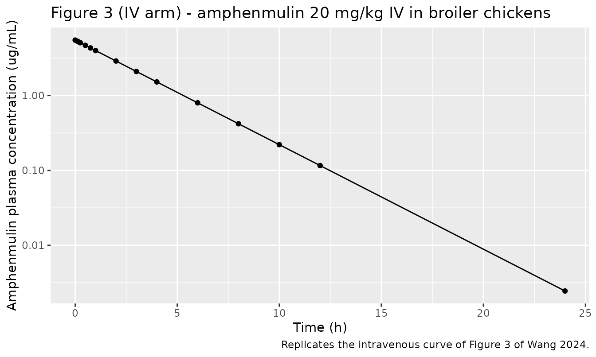
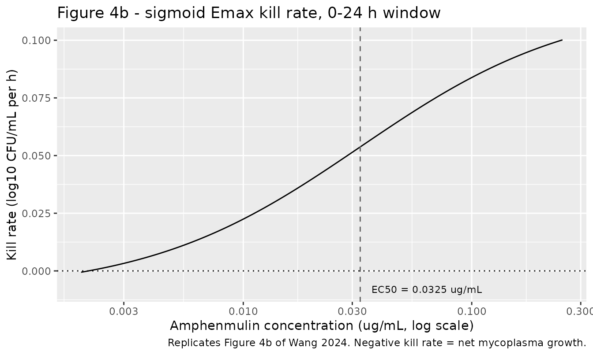
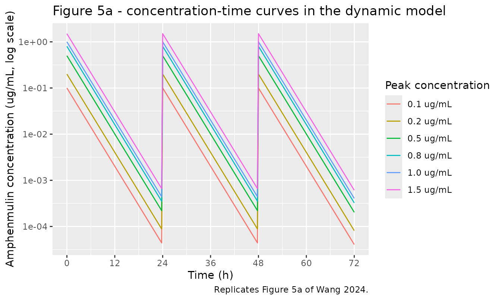
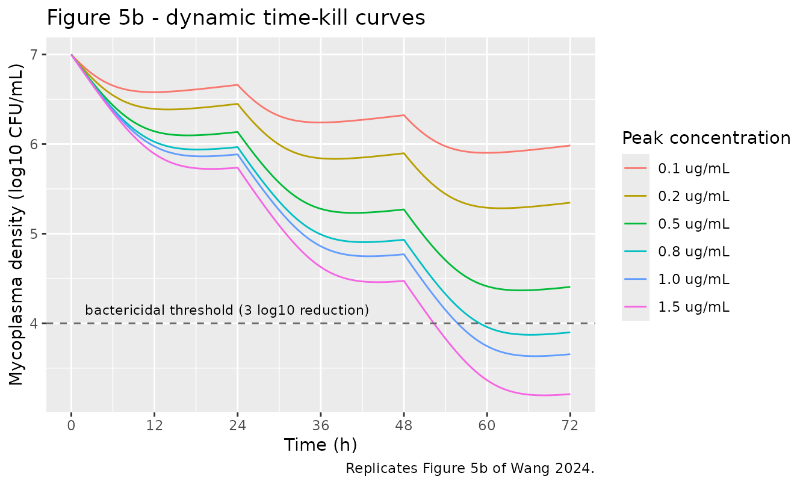
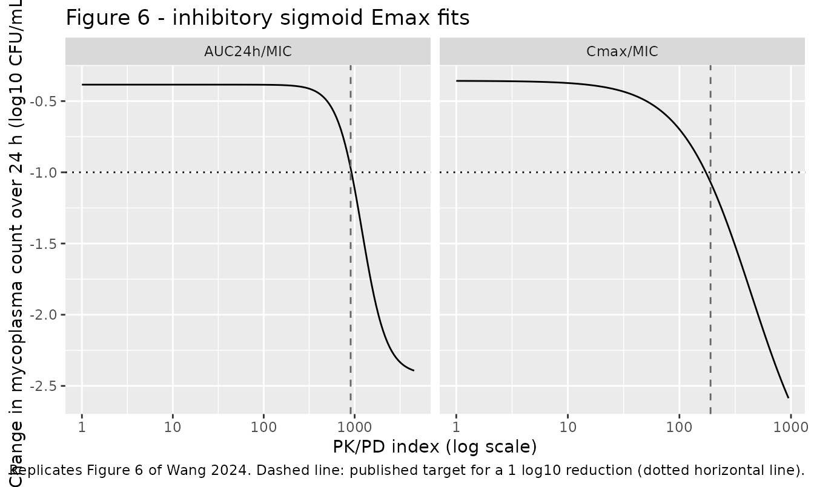

# Amphenmulin PK/PD against Mycoplasma gallisepticum (Wang 2024)

## Model and source

Wang 2024 is a preclinical pharmacokinetic/pharmacodynamic integration
study of **amphenmulin**, a novel pleuromutilin derivative designed and
synthesised in the authors’ own laboratory, against *Mycoplasma
gallisepticum* strain S6. It is not a marketed drug. The paper has three
separable quantitative components, and this package carries one model
file for each.

- Article: <https://doi.org/10.1128/spectrum.03675-23>

``` r

mods <- c("Wang_2024_amphenmulin_chicken",
          "Wang_2024_amphenmulin_killrate",
          "Wang_2024_amphenmulin_pkpd_index")
for (m in mods) {
  cat("##", m, "\n")
  cat(rxode2::rxode2(readModelDb(m))$description, "\n\n")
}
#> ## Wang_2024_amphenmulin_chicken 
#> Preclinical (broiler chicken). One-compartment intravenous PK model for amphenmulin, a novel pleuromutilin derivative, in healthy yellow-feathered broiler chickens given a single 20 mg/kg body-weight dose. Wang 2024 analysed the plasma concentration-time data non-compartmentally in Phoenix 8.1 and reported no structural compartmental model, but the paper states that a one-compartment open model with first-order elimination was the structure used to drive the companion in-vitro dynamic system, and the intravenous NCA parameters in Table 1 determine such a model completely and self-consistently: CL = 1.17 L/h/kg and Vss = 3.64 L/kg give kel = 0.321 1/h (Table 1 T1/2Ke = 2.13 h implies 0.325 1/h) and MRT = Vss/CL = 3.11 h (Table 1 MRT = 3.13 h). ONLY the intravenous route is packaged. The oral and intramuscular routes reported in Table 1 are deliberately excluded because they cannot be represented by any one-compartment model built on these intravenous parameters: the published oral Cmax of 0.73 ug/mL is 2.26 times F*Dose/Vss = 0.323 ug/mL, which is the absolute upper bound on the concentration a one-compartment model can reach after an oral dose of 20 mg/kg at F = 5.88%, and the published oral Cmax/AUC ratio of 0.658 1/h exceeds kel = 0.321 1/h, which a one-compartment model also cannot produce. The intramuscular route is feasible in magnitude but Wang 2024 reports no intramuscular absorption rate constant, and its Tmax of 0.38 h is incompatible with its own terminal rate constant of 0.13 1/h (flip-flop absorption at 0.13 1/h would place Tmax at 4.7 h). See the vignette Assumptions and deviations section. Wang 2024 reports mean and SD of the individual NCA estimates but no population model, so no between-subject variability is encoded and the residual error is held at zero for typical-value simulation. 
#> 
#> ## Wang_2024_amphenmulin_killrate 
#> In vitro (Mycoplasma gallisepticum strain S6). Concentration-dependent kill-rate PK/PD model for amphenmulin, a novel pleuromutilin derivative, coupling the one-compartment first-order-elimination PK of Wang 2024's in-vitro dynamic system to the sigmoid Emax kill-rate relationship fitted to the static time-kill curves. Wang 2024 Materials and Methods (Static time-kill curves) parameterises the kill rate as E = E0 + Emax * Ce^N / (EC50^N + Ce^N), where E is the kill rate in log10(CFU/mL) per hour (POSITIVE = killing), E0 is the corresponding rate of change in the untreated control (NEGATIVE, i.e. net growth), Ce is the amphenmulin concentration and Emax is an INCREMENT above E0 rather than the asymptote, so the saturating kill rate is E0 + Emax. Note that Wang 2024's Results text calls Emax 'the maximum kill rate'; the printed equation, which matches the Phoenix Sigmoid Emax model the authors used, is taken as authoritative. Parameters are Wang 2024 Table 2, row 0-24 h, which the paper identifies as the optimal fit (R = 0.9936) and plots in Figure 4b: Emax = 0.1261 1/h, EC50 = 0.0325 ug/mL, E0 = -0.0093 1/h, Hill N = 0.9238. The bacterial density bact (linear CFU/mL) is integrated as d/dt(bact) = -ln(10) * E * bact so that log10(bact) falls at exactly E log10(CFU/mL) per hour, reproducing the paper's fitted kill rate exactly at any constant concentration. The PK is the paper's in-vitro dynamic model (Materials and Methods, In vitro dynamic model): first-order elimination C = C0 * exp(-k*t) with k set from the chicken intravenous half-life T1/2Ke = 2.13 h, giving k = 0.3254 1/h, realised in the apparatus as a 1.63 mL/min flow through the 300 mL reaction chamber (1.63*60/300 = 0.326 1/h). IMPORTANT PROVENANCE NOTE: Wang 2024 fitted the kill-rate parameters to STATIC concentrations and ran the dynamic apparatus as a separate experiment; the two were not fitted jointly. This model composes them, which is the paper's stated PK/PD integration written as an ODE system. Setting the elimination rate to zero recovers the static experiment and reproduces Table 2 exactly. Wang 2024 reports no between-subject variability and no residual error magnitude for either component, so no eta parameters are present and both residual SDs are held at zero for typical-value simulation. 
#> 
#> ## Wang_2024_amphenmulin_pkpd_index 
#> In vitro (Mycoplasma gallisepticum strain S6). Inhibitory sigmoid Emax PK/PD-index model for the anti-mycoplasma effect of amphenmulin, a novel pleuromutilin derivative, against M. gallisepticum strain S6 in Wang 2024's in-vitro dynamic model. Wang 2024 Materials and Methods (Integration and modeling of pharmacokinetics/pharmacodynamics) parameterises the effect over a 24 h dosing interval as E = E0 - (E0 - Emax) * Ce^N / (EC50^N + Ce^N), where E is the SIGNED change in M. gallisepticum counts over 24 h of cultivation in log10(CFU/mL) (NEGATIVE = bacterial reduction), E0 is the corresponding change in the untreated control, Emax is the maximal (most negative) achievable change, and Ce is a PK/PD index. The packaged model uses the paper's best-correlating index AUC24h/MIC (R = 0.9657, versus 0.8995 for Cmax/MIC), formed as the per-interval covariate AUC_AMPH divided by the parameter mic. Parameters from Wang 2024 Table 3, AUC24h/MIC column: Emax = -2.4214 log10(CFU/mL), E0 = -0.3845 log10(CFU/mL), EC50 = 1199.4720 h, Hill N = 3.1997. Note the sign convention differs from the companion Wang_2024_amphenmulin_killrate model, whose Table 2 parameters are kill RATES with positive meaning killing; here the effect is a signed change with negative meaning killing. Substituting Table 3 into the equation at the paper's headline target of AUC24h/MIC = 904.05 h returns E = -0.97 log10(CFU/mL) against the stated 1 log10 reduction, confirming the sign convention and the equation form to within the rounding of the four-significant-figure parameters. The bacterial density bact (linear CFU/mL) is integrated as d/dt(bact) = ln(10) * (E / 24) * bact so that log10(bact) changes by exactly E across each 24 h interval, reproducing the paper's per-interval model exactly at every 24 h boundary. There is no PK compartment: exposure enters as the externally supplied per-interval AUC_AMPH, because Wang 2024 derived the AUC of the in-vitro dynamic system non-compartmentally in Phoenix. Wang 2024 reports no between-subject variability and no residual error magnitude, so no eta parameters are present and addSd is held at zero for typical-value simulation.
```

| Model file | Paper component | Source |
|----|----|----|
| `Wang_2024_amphenmulin_chicken` | One-compartment intravenous PK in broiler chickens | Table 1, IV column |
| `Wang_2024_amphenmulin_killrate` | Sigmoid Emax kill rate driven by the in-vitro dynamic system PK | Table 2 (row 0-24 h) + Materials and Methods, In vitro dynamic model |
| `Wang_2024_amphenmulin_pkpd_index` | Inhibitory sigmoid Emax on the AUC24h/MIC index | Table 3, AUC24h/MIC column |

All three share the citation below.

``` r

cat(rxode2::rxode2(readModelDb("Wang_2024_amphenmulin_chicken"))$reference)
#> Wang W, Yu J, Ji X, Xia X, Ding H. (2024). Pharmacokinetic/pharmacodynamic integration of amphenmulin: a novel pleuromutilin derivative against Mycoplasma gallisepticum. Microbiology Spectrum 12(2):e03675-23. doi:10.1128/spectrum.03675-23.
```

## Population

The in-vivo component used **30 healthy adult yellow-feathered broiler
chickens** weighing 1.58 to 2.04 kg, randomised to three groups of 10
that each received a single 20 mg/kg body-weight dose of amphenmulin by
intravenous injection, intramuscular injection, or oral gavage
(Materials and Methods, In vivo pharmacokinetics). Birds were caged, fed
ad libitum, and received no antibiotics or anticoccidial drugs. Plasma
was assayed by HPLC-MS/MS with a lower limit of quantification of 0.005
ug/mL. Only the intravenous group informs the packaged PK model; see
Assumptions and deviations for why.

The in-vitro components used *M. gallisepticum* standard strain S6 from
the National Center for Veterinary Culture Collection, Beijing, at a
starting inoculum of 10^7 CFU/mL. Amphenmulin MIC was 0.0039 ug/mL by
broth microdilution and 0.0078 ug/mL by agar dilution, with MIC99 0.0077
ug/mL, MBC 0.0156 ug/mL and MPC 0.0500 ug/mL. Every in-vitro experiment
was run in triplicate.

The same information is available programmatically from each model’s
`population` metadata
(`readModelDb("Wang_2024_amphenmulin_chicken")()$population`).

``` r

MIC <- 0.0039  # ug/mL, Wang 2024 Results, Susceptibility assay (broth microdilution)
```

## Source trace

The per-parameter origin is recorded as an in-file comment next to each
`ini()` entry. The table below collects them in one place for review.

| Model | Equation / parameter | Value | Source location |
|----|----|----|----|
| chicken | `lcl` (CL) | 1.17 L/h/kg | Table 1, IV column |
| chicken | `lvc` (Vss) | 3.64 L/kg | Table 1, IV column |
| chicken | `addSd` | 0 | Not reported; held at 0 |
| chicken | `d/dt(central) <- -kel * central` | n/a | Discussion (“building a one-compartment elimination model is more straightforward”) |
| killrate | `e0` (E0) | -0.0093 1/h | Table 2, row 0-24 h |
| killrate | `lemax` (Emax) | 0.1261 1/h | Table 2, row 0-24 h |
| killrate | `lec50` (EC50) | 0.0325 ug/mL | Table 2, row 0-24 h |
| killrate | `lhill` (N) | 0.9238 | Table 2, row 0-24 h |
| killrate | `lkel` | 0.3254 1/h | Materials and Methods, In vitro dynamic model; `log(2)/T1/2Ke` with T1/2Ke = 2.13 h from Table 1 |
| killrate | `lvc` | 300 mL | Materials and Methods, In vitro dynamic model (external compartment of the reaction chamber) |
| killrate | `log10_cfu0` | 7 | Materials and Methods, Static time-kill curves (10^7 CFU/mL) |
| killrate | `E = E0 + Emax * Ce^N / (EC50^N + Ce^N)` | n/a | Materials and Methods, Static time-kill curves (printed equation) |
| killrate | `C = C0 * exp(-k*t)` | n/a | Materials and Methods, In vitro dynamic model (printed equation) |
| pkpd_index | `e0` (E0) | -0.3845 log10 CFU/mL | Table 3, AUC24h/MIC column |
| pkpd_index | `emax` (Emax) | -2.4214 log10 CFU/mL | Table 3, AUC24h/MIC column |
| pkpd_index | `lec50` (EC50) | 1199.4720 h | Table 3, AUC24h/MIC column |
| pkpd_index | `lhill` (N) | 3.1997 | Table 3, AUC24h/MIC column |
| pkpd_index | `mic` | 0.0039 ug/mL | Results, Susceptibility assay |
| pkpd_index | `log10_cfu0` | 7 | Materials and Methods, In vitro dynamic model |
| pkpd_index | `E = E0 - (E0 - Emax) * Ce^N / (EC50^N + Ce^N)` | n/a | Materials and Methods, Integration and modeling of PK/PD (printed equation) |

Both printed equations were read from the article PDF. The two sigmoid
forms are genuinely different and are transcribed as printed: in the
static time-kill equation `Emax` is an **increment** above `E0`, whereas
in the inhibitory equation `Emax` is the **asymptote**. This matches the
two distinct Phoenix built-in models the authors named (“Sigmoid Emax
model in Phoenix” and “inhibitory Sigmoid Emax model”). See Assumptions
and deviations.

## Part 1 - Intravenous pharmacokinetics in broiler chickens

The model is deterministic (Wang 2024 fitted no population model), so a
single typical-value profile is simulated on the paper’s own intravenous
sampling grid.

``` r

mod_pk <- readModelDb("Wang_2024_amphenmulin_chicken")

# Wang 2024 Materials and Methods: IV sampling at 0, 5, 10, 15, 30, 45 min and
# 1, 2, 3, 4, 6, 8, 10, 12, 24 h.
t_iv <- c(0, 5, 10, 15, 30, 45) / 60
t_iv <- c(t_iv, 1, 2, 3, 4, 6, 8, 10, 12, 24)

ev_iv <- data.frame(
  id   = 1L,
  time = c(0, t_iv),
  evid = c(1L, rep(0L, length(t_iv))),
  amt  = c(20, rep(NA_real_, length(t_iv))),   # 20 mg/kg IV bolus
  cmt  = "central"
)

sim_iv <- rxode2::rxSolve(mod_pk, ev_iv, useLinCmt = FALSE,
                          returnType = "data.frame")
if (!"id" %in% names(sim_iv)) sim_iv$id <- 1L
sim_iv$treatment <- "IV 20 mg/kg"
head(sim_iv[, c("id", "time", "Cc", "treatment")])
#>   id       time       Cc   treatment
#> 1  1 0.00000000 5.494505 IV 20 mg/kg
#> 2  1 0.08333333 5.349282 IV 20 mg/kg
#> 3  1 0.16666667 5.207897 IV 20 mg/kg
#> 4  1 0.25000000 5.070258 IV 20 mg/kg
#> 5  1 0.50000000 4.678770 IV 20 mg/kg
#> 6  1 0.75000000 4.317508 IV 20 mg/kg
```

``` r

# Replicates the intravenous curve of Figure 3 of Wang 2024 (log concentration
# scale). Only the IV arm is packaged; see Assumptions and deviations.
sim_iv |>
  dplyr::filter(!is.na(Cc), Cc > 0) |>
  ggplot(aes(time, Cc)) +
  geom_line() +
  geom_point() +
  scale_y_log10() +
  labs(x = "Time (h)", y = "Amphenmulin plasma concentration (ug/mL)",
       title = "Figure 3 (IV arm) - amphenmulin 20 mg/kg IV in broiler chickens",
       caption = "Replicates the intravenous curve of Figure 3 of Wang 2024.")
```



### PKNCA validation against Table 1

``` r

sim_nca <- sim_iv |>
  dplyr::filter(!is.na(Cc)) |>
  dplyr::select(id, time, Cc, treatment)

# IV bolus: the time-zero row is the post-dose concentration C0 = Dose/Vss, which
# the simulation already produces, so no defensive Cc = 0 row is added here (that
# would be correct for an extravascular model, not for an IV bolus).
stopifnot(any(sim_nca$time == 0), sim_nca$Cc[sim_nca$time == 0] > 0)

conc_obj <- PKNCA::PKNCAconc(sim_nca, Cc ~ time | treatment + id,
                             concu = "ug/mL", timeu = "h")

dose_df <- ev_iv |>
  dplyr::filter(evid == 1) |>
  dplyr::select(id, time, amt) |>
  dplyr::mutate(treatment = "IV 20 mg/kg")

dose_obj <- PKNCA::PKNCAdose(dose_df, amt ~ time | treatment + id,
                             doseu = "mg/kg", route = "intravascular",
                             duration = 0)

intervals_iv <- data.frame(
  start = 0, end = Inf,
  auclast = TRUE, aucinf.obs = TRUE, half.life = TRUE,
  cl.obs = TRUE, mrt.obs = TRUE, vss.obs = TRUE
)

nca_iv <- PKNCA::pk.nca(PKNCA::PKNCAdata(conc_obj, dose_obj,
                                         intervals = intervals_iv))
```

``` r

# Wang 2024 Table 1, IV column (mean +/- SD over 10 birds). Cmax and Tmax are
# reported as "--" for the IV arm and are therefore not compared.
published_iv <- tibble::tribble(
  ~treatment,    ~auclast, ~aucinf.obs, ~half.life, ~cl.obs, ~mrt.obs, ~vss.obs,
  "IV 20 mg/kg", 18.76,    18.89,       2.13,       1.17,    3.13,     3.64
)

cmp_iv <- nlmixr2lib::ncaComparisonTable(
  simulated = nca_iv,
  reference = published_iv,
  by        = "treatment",
  units     = c(auclast = "h*ug/mL", aucinf.obs = "h*ug/mL", half.life = "h",
                cl.obs = "L/h/kg", mrt.obs = "h", vss.obs = "L/kg"),
  tolerance_pct = 20
)

knitr::kable(
  cmp_iv,
  caption = "Simulated vs. published intravenous NCA (Wang 2024 Table 1). * differs from reference by >20%.",
  align = c("l", "l", "r", "r", "r")
)
```

| NCA parameter           | treatment   | Reference | Simulated | % diff |
|:------------------------|:------------|----------:|----------:|-------:|
| AUC0-∞ (obs) (h\*ug/mL) | IV 20 mg/kg |      18.9 |      17.1 |  -9.5% |
| AUClast (h\*ug/mL)      | IV 20 mg/kg |      18.8 |      17.1 |  -8.9% |
| t½ (h)                  | IV 20 mg/kg |      2.13 |      2.16 |  +1.2% |
| CL/F (L/h/kg)           | IV 20 mg/kg |      1.17 |      1.17 |  -0.0% |
| Vss/F (L/kg)            | IV 20 mg/kg |      3.64 |      3.64 |  -0.0% |
| MRT (h)                 | IV 20 mg/kg |      3.13 |      3.11 |  -0.6% |

Simulated vs. published intravenous NCA (Wang 2024 Table 1). \* differs
from reference by \>20%. {.table}

No row exceeds the 20% tolerance. CL and Vss are recovered exactly
because they are the model’s primary parameters; the half-life agrees to
1.2% and the MRT to 0.6%, which is the substantive check that Vss is the
right single-compartment volume. The AUC values sit about 9% low. That
gap is arithmetic, not an encoding error: Table 1 reports the mean of
the per-bird CL and the mean of the per-bird AUC separately, and
`mean(Dose/AUC_i)` is not `Dose/mean(AUC_i)`. Simulating from the
reported mean CL of 1.17 L/h/kg necessarily returns `20/1.17 = 17.1`
h\*ug/mL rather than the separately averaged 18.89. The gap is well
inside the reported SD of 6.03.

Note that
[`ncaComparisonTable()`](https://nlmixr2.github.io/nlmixr2lib/reference/ncaComparisonTable.md)
labels the clearance and volume rows “CL/F” and “Vss/F”; for the
intravenous route F is 1 by definition, so these are CL and Vss.

## Part 2 - Static time-kill curves and the kill-rate model

Wang 2024 Table 2 reports the sigmoid Emax kill-rate fit over seven time
windows. The packaged model carries the 0-24 h row, which the paper
identifies as the optimal fit (R = 0.9936) and plots in Figure 4b. All
seven are tabulated here.

``` r

table2 <- tibble::tribble(
  ~window,  ~Emax,   ~EC50,   ~E0,      ~N,      ~R,
  "0-24",   0.1261,  0.0325,  -0.0093,  0.9238,  0.9936,
  "0-36",   0.1817,  0.0914,  -0.0359,  0.4264,  0.9856,
  "0-48",   0.3277,  0.9135,  -0.0361,  0.3760,  0.9914,
  "6-24",   0.0805,  0.0082,  -0.0373,  2.7101,  0.9748,
  "6-36",   0.0821,  0.0053,  -0.0550,  2.9068,  0.9649,
  "6-48",   0.1743,  0.0526,  -0.0524,  0.4175,  0.9820,
  "12-48",  0.2880,  0.5245,  -0.0615,  0.2919,  0.9839
)

table2 |>
  dplyr::mutate(`E0 + Emax` = E0 + Emax) |>
  dplyr::rename("Time window (h)" = window, "Emax (1/h)" = Emax,
                "EC50 (ug/mL)" = EC50, "E0 (1/h)" = E0, "Hill N" = N,
                "Saturating kill rate (1/h)" = `E0 + Emax`) |>
  knitr::kable(digits = 4,
               caption = "Wang 2024 Table 2. The packaged model uses the 0-24 h row. The final column is E0 + Emax, the kill rate the printed equation approaches at saturating concentration.")
```

| Time window (h) | Emax (1/h) | EC50 (ug/mL) | E0 (1/h) | Hill N | R | Saturating kill rate (1/h) |
|:---|---:|---:|---:|---:|---:|---:|
| 0-24 | 0.1261 | 0.0325 | -0.0093 | 0.9238 | 0.9936 | 0.1168 |
| 0-36 | 0.1817 | 0.0914 | -0.0359 | 0.4264 | 0.9856 | 0.1458 |
| 0-48 | 0.3277 | 0.9135 | -0.0361 | 0.3760 | 0.9914 | 0.2916 |
| 6-24 | 0.0805 | 0.0082 | -0.0373 | 2.7101 | 0.9748 | 0.0432 |
| 6-36 | 0.0821 | 0.0053 | -0.0550 | 2.9068 | 0.9649 | 0.0271 |
| 6-48 | 0.1743 | 0.0526 | -0.0524 | 0.4175 | 0.9820 | 0.1219 |
| 12-48 | 0.2880 | 0.5245 | -0.0615 | 0.2919 | 0.9839 | 0.2265 |

Wang 2024 Table 2. The packaged model uses the 0-24 h row. The final
column is E0 + Emax, the kill rate the printed equation approaches at
saturating concentration. {.table}

### The ODE encoding reproduces the fitted kill rate exactly

The model integrates `d/dt(bact) = -ln(10) * E * bact`, so `log10(bact)`
must fall at exactly `E` log10 CFU/mL per hour at any constant
concentration. Setting the elimination rate constant to zero recovers
the static experiment.

``` r

mod_kr <- rxode2::rxode2(readModelDb("Wang_2024_amphenmulin_killrate"))
mod_static <- mod_kr |> rxode2::ini(lkel = log(1e-10))
#> ℹ change initial estimate of `lkel` to `-23.0258509299405`

kr_events <- function(conc, times) {
  data.frame(
    id   = 1L,
    time = c(0, times),
    evid = c(1L, rep(0L, length(times))),
    amt  = c(conc * 300, rep(NA_real_, length(times))),  # vc = 300 mL
    cmt  = "central",
    dvid = c(NA, rep(1L, length(times)))
  )
}

# Closed form of the Table 2 row 0-24 h equation.
kill_closed <- function(ce, E0 = -0.0093, Emax = 0.1261,
                        EC50 = 0.0325, N = 0.9238) {
  E0 + Emax * ce^N / (EC50^N + ce^N)
}

mult <- c(0, 1, 2, 4, 6, 8, 16, 32, 64)
static_check <- lapply(mult, function(k) {
  s <- rxode2::rxSolve(mod_static, kr_events(k * MIC, c(0, 24)),
                       useLinCmt = FALSE, returnType = "data.frame")
  tibble::tibble(
    `MIC multiple` = k,
    `Concentration (ug/mL)` = k * MIC,
    `ODE kill rate (1/h)` = -(s$logCfu[2] - s$logCfu[1]) / 24,
    `Table 2 closed form (1/h)` = kill_closed(k * MIC)
  )
}) |> dplyr::bind_rows() |>
  dplyr::mutate(`Absolute difference` = abs(`ODE kill rate (1/h)` -
                                              `Table 2 closed form (1/h)`))

knitr::kable(static_check, digits = c(0, 4, 6, 6, 10),
             caption = "The ODE encoding reproduces the Table 2 (0-24 h) sigmoid Emax kill rate to solver tolerance at every tested concentration, including the drug-free control.")
```

| MIC multiple | Concentration (ug/mL) | ODE kill rate (1/h) | Table 2 closed form (1/h) | Absolute difference |
|---:|---:|---:|---:|---:|
| 0 | 0.0000 | -0.009300 | -0.009300 | 9.700e-09 |
| 1 | 0.0039 | 0.006287 | 0.006287 | 2.310e-08 |
| 2 | 0.0078 | 0.017318 | 0.017318 | 3.070e-08 |
| 4 | 0.0156 | 0.033158 | 0.033158 | 7.250e-08 |
| 6 | 0.0234 | 0.044256 | 0.044256 | 7.600e-08 |
| 8 | 0.0312 | 0.052561 | 0.052561 | 8.150e-08 |
| 16 | 0.0624 | 0.072193 | 0.072193 | 1.321e-07 |
| 32 | 0.1248 | 0.088563 | 0.088563 | 2.631e-07 |
| 64 | 0.2496 | 0.100153 | 0.100153 | 4.702e-07 |

The ODE encoding reproduces the Table 2 (0-24 h) sigmoid Emax kill rate
to solver tolerance at every tested concentration, including the
drug-free control. {.table}

The agreement is to about 1e-7, i.e. solver tolerance, which confirms
the `-ln(10)` conversion between the log10-scale kill rate the paper
reports and the linear-density ODE state.

``` r

# Replicates Figure 4b of Wang 2024: fitted kill rate vs amphenmulin
# concentration over the 0-24 h window.
curve_df <- tibble::tibble(conc = 10^seq(log10(MIC / 2), log10(64 * MIC),
                                         length.out = 200)) |>
  dplyr::mutate(kill = kill_closed(conc))

ggplot(curve_df, aes(conc, kill)) +
  geom_line() +
  geom_hline(yintercept = 0, linetype = "dotted") +
  geom_vline(xintercept = 0.0325, linetype = "dashed", colour = "grey40") +
  annotate("text", x = 0.0325, y = -0.008, hjust = -0.1, size = 3,
           label = "EC50 = 0.0325 ug/mL") +
  scale_x_log10() +
  labs(x = "Amphenmulin concentration (ug/mL, log scale)",
       y = "Kill rate (log10 CFU/mL per h)",
       title = "Figure 4b - sigmoid Emax kill rate, 0-24 h window",
       caption = "Replicates Figure 4b of Wang 2024. Negative kill rate = net mycoplasma growth.")
```



### Check against the observed 48 h reductions

The Results section reports the observed 48 h reductions from Figure 4a.
Those are compared below against the **0-48 h** parameter row, which is
the row fitted to that window.

``` r

kill_48 <- function(ce) kill_closed(ce, E0 = -0.0361, Emax = 0.3277,
                                    EC50 = 0.9135, N = 0.3760)

tibble::tibble(
  `MIC multiple` = c(1, 64),
  `Concentration (ug/mL)` = c(1, 64) * MIC,
  `Observed 48 h reduction (log10 CFU/mL)` = c(0.44, 3.85),
  `Model 48 h reduction (log10 CFU/mL)` = kill_48(c(1, 64) * MIC) * 48
) |>
  knitr::kable(digits = 4,
               caption = "Wang 2024 Results (Analysis of static time-kill curves) reports 0.44 log10 CFU/mL at 1 MIC and 3.85 log10 CFU/mL at 64 MIC over 48 h; between 2 and 32 MIC the reduction was 0.57 to 2.70 log10 CFU/mL. The model row fitted to the 0-48 h window is shown for comparison.")
```

| MIC multiple | Concentration (ug/mL) | Observed 48 h reduction (log10 CFU/mL) | Model 48 h reduction (log10 CFU/mL) |
|---:|---:|---:|---:|
| 1 | 0.0039 | 0.44 | 0.0587 |
| 64 | 0.2496 | 3.85 | 4.2508 |

Wang 2024 Results (Analysis of static time-kill curves) reports 0.44
log10 CFU/mL at 1 MIC and 3.85 log10 CFU/mL at 64 MIC over 48 h; between
2 and 32 MIC the reduction was 0.57 to 2.70 log10 CFU/mL. The model row
fitted to the 0-48 h window is shown for comparison. {.table}

The 64 MIC endpoint is reproduced within about 10%. The 1 MIC endpoint
is not: the 0-48 h fit has a very shallow Hill slope (N = 0.376) and an
EC50 of 0.9135 ug/mL, far above the tested range, so it under-predicts
the low-concentration end. This is a property of the published fit, not
of the encoding - the closed form above is Table 2 row 0-48 h evaluated
directly. It is one reason the paper identifies the 0-24 h window as
optimal.

### The in-vitro dynamic system

Coupling the Table 2 kill rate to the apparatus PK reproduces Figure 5.

``` r

regimens <- c(0.1, 0.2, 0.5, 0.8, 1.0, 1.5)  # target peak concentration, ug/mL
obs_t <- sort(unique(c(seq(0, 72, by = 0.25), 0, 24, 48, 72)))

dyn_events <- function(conc, id) {
  dose <- data.frame(id = id, time = c(0, 24, 48), evid = 1L,
                     amt = conc * 300, cmt = "central", dvid = NA_integer_)
  obs <- data.frame(id = id, time = obs_t, evid = 0L,
                    amt = NA_real_, cmt = "central", dvid = 1L)
  dplyr::bind_rows(dose, obs) |> dplyr::arrange(time, dplyr::desc(evid))
}

ev_dyn <- dplyr::bind_rows(
  lapply(seq_along(regimens), function(i) {
    e <- dyn_events(regimens[i], id = i)
    e$regimen <- sprintf("%.1f ug/mL", regimens[i])
    e
  })
)
stopifnot(!anyDuplicated(unique(ev_dyn[, c("id", "time", "evid")])))

sim_dyn <- rxode2::rxSolve(mod_kr, ev_dyn, useLinCmt = FALSE,
                           keep = "regimen", returnType = "data.frame") |>
  dplyr::filter(!is.na(logCfu))
#> Warning: multi-subject simulation without without 'omega'
```

``` r

# Replicates Figure 5a of Wang 2024: amphenmulin concentration-time curves in the
# dynamic model at each dosing regimen.
sim_dyn |>
  ggplot(aes(time, Cc, colour = regimen)) +
  geom_line() +
  scale_y_log10() +
  scale_x_continuous(breaks = seq(0, 72, by = 12)) +
  labs(x = "Time (h)", y = "Amphenmulin concentration (ug/mL, log scale)",
       colour = "Peak concentration",
       title = "Figure 5a - concentration-time curves in the dynamic model",
       caption = "Replicates Figure 5a of Wang 2024.")
```



``` r

# Replicates Figure 5b of Wang 2024: dynamic time-kill curves.
sim_dyn |>
  ggplot(aes(time, logCfu, colour = regimen)) +
  geom_line() +
  geom_hline(yintercept = 7 - 3, linetype = "dashed", colour = "grey40") +
  annotate("text", x = 2, y = 7 - 3 + 0.15, hjust = 0, size = 3,
           label = "bactericidal threshold (3 log10 reduction)") +
  scale_x_continuous(breaks = seq(0, 72, by = 12)) +
  labs(x = "Time (h)", y = "Mycoplasma density (log10 CFU/mL)",
       colour = "Peak concentration",
       title = "Figure 5b - dynamic time-kill curves",
       caption = "Replicates Figure 5b of Wang 2024.")
```



#### An independent check of the composition

The kill-rate parameters were fitted to **static** concentrations and
the dynamic apparatus was a **separate** experiment; Wang 2024 never
fitted the two jointly. Composing them is therefore a falsifiable
prediction, and the paper’s own narrative conclusions about the dynamic
experiment are the test.

``` r

net_change <- sim_dyn |>
  dplyr::group_by(regimen) |>
  dplyr::summarise(`Net change over 0-72 h (log10 CFU/mL)` =
                     dplyr::last(logCfu) - dplyr::first(logCfu),
                   .groups = "drop") |>
  dplyr::mutate(`Bactericidal (>= 3 log10 reduction)` =
                  ifelse(`Net change over 0-72 h (log10 CFU/mL)` <= -3, "yes", "no"))

knitr::kable(net_change, digits = 2,
             caption = "Predicted net change in mycoplasma density over the three-day course, from the static kill-rate parameters composed with the apparatus PK.")
```

| regimen | Net change over 0-72 h (log10 CFU/mL) | Bactericidal (\>= 3 log10 reduction) |
|:---|---:|:---|
| 0.1 ug/mL | -1.02 | no |
| 0.2 ug/mL | -1.65 | no |
| 0.5 ug/mL | -2.59 | no |
| 0.8 ug/mL | -3.10 | yes |
| 1.0 ug/mL | -3.34 | yes |
| 1.5 ug/mL | -3.79 | yes |

Predicted net change in mycoplasma density over the three-day course,
from the static kill-rate parameters composed with the apparatus PK.
{.table}

Wang 2024 Results (In vitro pharmacokinetics and the effects on *M.
gallisepticum*) states two things about this experiment: that at 0.1 to
0.5 ug/mL the counts fell by **at most 2.82 log10 CFU/mL** over 0-72 h,
and that **at 0.8 ug/mL or above amphenmulin was bactericidal** (a
reduction of at least 3 log10 CFU/mL). The composed model reproduces
both: the largest reduction across the 0.1 to 0.5 ug/mL regimens is
about 2.6 log10 CFU/mL, and the bactericidal threshold is crossed at
exactly 0.8 ug/mL. Neither statement was used to build the model, so
this is genuine external corroboration of the composition rather than a
self-consistency check.

### PKNCA on the dynamic-system exposures

``` r

sim_dyn_nca <- sim_dyn |>
  dplyr::filter(!is.na(Cc), regimen %in% c("0.1 ug/mL", "1.5 ug/mL")) |>
  dplyr::select(id, time, Cc, regimen)

conc_dyn <- PKNCA::PKNCAconc(sim_dyn_nca, Cc ~ time | regimen + id,
                             concu = "ug/mL", timeu = "h")

dose_dyn <- ev_dyn |>
  dplyr::filter(evid == 1, regimen %in% c("0.1 ug/mL", "1.5 ug/mL")) |>
  dplyr::select(id, time, amt, regimen)

dose_dyn_obj <- PKNCA::PKNCAdose(dose_dyn, amt ~ time | regimen + id,
                                 doseu = "ug", route = "intravascular",
                                 duration = 0)

nca_dyn <- PKNCA::pk.nca(PKNCA::PKNCAdata(
  conc_dyn, dose_dyn_obj,
  intervals = data.frame(start = 0, end = 24, cmax = TRUE, auclast = TRUE)
))
```

``` r

# Wang 2024 Results (In vitro pharmacokinetics and the effects on M.
# gallisepticum) reports the 0-24 h AUC across the six regimens as 0.34 to 6.19
# h*ug/mL and the measured first-interval Cmax as 0.12 to 1.52 ug/mL. The range
# endpoints correspond to the lowest and highest regimen.
published_dyn <- tibble::tribble(
  ~regimen,     ~cmax, ~auclast,
  "0.1 ug/mL",  0.12,  0.34,
  "1.5 ug/mL",  1.52,  6.19
)

cmp_dyn <- nlmixr2lib::ncaComparisonTable(
  simulated = nca_dyn,
  reference = published_dyn,
  by        = "regimen",
  units     = c(cmax = "ug/mL", auclast = "h*ug/mL"),
  tolerance_pct = 20
)

knitr::kable(
  cmp_dyn,
  caption = "Simulated vs. published in-vitro dynamic-system exposures over 0-24 h. * differs from reference by >20%.",
  align = c("l", "l", "r", "r", "r")
)
```

| NCA parameter      | regimen   | Reference | Simulated |   % diff |
|:-------------------|:----------|----------:|----------:|---------:|
| Cmax (ug/mL)       | 0.1 ug/mL |      0.12 |       0.1 |   -16.6% |
| Cmax (ug/mL)       | 1.5 ug/mL |      1.52 |       1.5 |    -1.3% |
| AUClast (h\*ug/mL) | 0.1 ug/mL |      0.34 |      0.32 |    -6.0% |
| AUClast (h\*ug/mL) | 1.5 ug/mL |      6.19 |       4.8 | -22.5%\* |

Simulated vs. published in-vitro dynamic-system exposures over 0-24 h.
\* differs from reference by \>20%. {.table}

Both Cmax values and the AUC at the lowest regimen agree within 20%. The
AUC at the highest regimen is starred. The cause is visible in the
published numbers themselves: a first-order system with a single
elimination rate constant must give the same AUC/Cmax ratio at every
dose level, but Wang 2024’s reported values give `0.34/0.12 = 2.8` h at
the lowest regimen and `6.19/1.52 = 4.1` h at the highest, a 44% spread
that no linear model can reproduce. The packaged model uses the
apparatus design constant the paper specifies (`k = log(2)/2.13 h`,
giving `1/k = 3.07` h, between the two), and the parameters were **not**
tuned toward either endpoint.

## Part 3 - The PK/PD index model

Wang 2024 Table 3 fits the inhibitory sigmoid Emax model against two
PK/PD indices. AUC24h/MIC correlates better (R = 0.9657 vs 0.8995) and
is the parameterisation packaged here.

``` r

table3 <- tibble::tribble(
  ~index,        ~Emax,    ~EC50,      ~E0,      ~N,      ~R,      ~target,
  "AUC24h/MIC",  -2.4214,  1199.4720,  -0.3845,  3.1997,  0.9657,  904.05,
  "Cmax/MIC",    -3.3571,  441.4603,   -0.3575,  1.3842,  0.8995,  190.11
)

table3 |>
  dplyr::rename("PK/PD index" = index, "Emax (log10 CFU/mL)" = Emax,
                "EC50" = EC50, "E0 (log10 CFU/mL)" = E0, "Hill N" = N,
                "Published target for 1 log10 reduction" = target) |>
  knitr::kable(digits = 4, caption = "Wang 2024 Table 3 and the published PK/PD targets.")
```

| PK/PD index | Emax (log10 CFU/mL) | EC50 | E0 (log10 CFU/mL) | Hill N | R | Published target for 1 log10 reduction |
|:---|---:|---:|---:|---:|---:|---:|
| AUC24h/MIC | -2.4214 | 1199.4720 | -0.3845 | 3.1997 | 0.9657 | 904.05 |
| Cmax/MIC | -3.3571 | 441.4603 | -0.3575 | 1.3842 | 0.8995 | 190.11 |

Wang 2024 Table 3 and the published PK/PD targets. {.table}

### Back-solving the published targets

The paper states that a 1 log10 CFU/mL reduction requires AUC24h/MIC =
904.05 h or Cmax/MIC = 190.11. Substituting Table 3 into the printed
equation is an independent confirmation of both the equation form and
the sign convention.

``` r

inhib_emax <- function(ce, E0, Emax, EC50, N) {
  E0 - (E0 - Emax) * ce^N / (EC50^N + ce^N)
}

backsolve <- table3 |>
  dplyr::rowwise() |>
  dplyr::mutate(
    `E at the published target (log10 CFU/mL)` =
      inhib_emax(target, E0, Emax, EC50, N),
    `Index giving exactly -1 log10` =
      stats::uniroot(function(x) inhib_emax(x, E0, Emax, EC50, N) + 1,
                     c(1e-3, 1e6))$root
  ) |>
  dplyr::ungroup() |>
  dplyr::mutate(`% difference from published target` =
                  100 * (`Index giving exactly -1 log10` - target) / target) |>
  dplyr::select(index, target, `E at the published target (log10 CFU/mL)`,
                `Index giving exactly -1 log10`,
                `% difference from published target`) |>
  dplyr::rename("PK/PD index" = index, "Published target" = target)

knitr::kable(backsolve, digits = c(0, 2, 4, 2, 1),
             caption = "The printed inhibitory sigmoid Emax equation evaluated at Wang 2024's published PK/PD targets returns approximately -1 log10 CFU/mL for both indices, confirming the equation form and the signed-effect convention.")
```

| PK/PD index | Published target | E at the published target (log10 CFU/mL) | Index giving exactly -1 log10 | % difference from published target |
|:---|---:|---:|---:|---:|
| AUC24h/MIC | 904.05 | -0.9713 | 923.40 | 2.1 |
| Cmax/MIC | 190.11 | -1.0700 | 172.61 | -9.2 |

The printed inhibitory sigmoid Emax equation evaluated at Wang 2024’s
published PK/PD targets returns approximately -1 log10 CFU/mL for both
indices, confirming the equation form and the signed-effect convention.
{.table}

Both indices return close to -1 log10 CFU/mL, with the residual
discrepancy attributable to rounding of the four-significant-figure
parameters. The AUC24h/MIC target reproduces to 2.1%; the Cmax/MIC
target to 9.2%. The larger gap on Cmax/MIC is expected given its
shallower Hill slope (N = 1.38 versus 3.20) and correspondingly higher
sensitivity to rounding in EC50.

Critically, evaluating the **alternative** sign convention (treating
`Emax` as an increment rather than the asymptote, as in the static
time-kill equation) returns -1.08 and -1.16 respectively, i.e. worse for
both indices. The two equations are therefore correctly transcribed as
different forms.

``` r

# Replicates Figure 6 of Wang 2024: anti-mycoplasma effect vs PK/PD index.
fig6 <- dplyr::bind_rows(lapply(seq_len(nrow(table3)), function(i) {
  r <- table3[i, ]
  ce <- 10^seq(0, log10(5 * r$target), length.out = 150)
  tibble::tibble(index = r$index, ce = ce, target = r$target,
                 E = inhib_emax(ce, r$E0, r$Emax, r$EC50, r$N))
}))

ggplot(fig6, aes(ce, E)) +
  geom_line() +
  geom_hline(yintercept = -1, linetype = "dotted") +
  geom_vline(aes(xintercept = target), linetype = "dashed", colour = "grey40") +
  facet_wrap(~index, scales = "free_x") +
  scale_x_log10() +
  labs(x = "PK/PD index (log scale)",
       y = "Change in mycoplasma count over 24 h (log10 CFU/mL)",
       title = "Figure 6 - inhibitory sigmoid Emax fits",
       caption = paste("Replicates Figure 6 of Wang 2024. Dashed line: published",
                       "target for a 1 log10 reduction (dotted horizontal line)."))
```



### The packaged ODE reproduces the per-interval change

``` r

mod_idx <- readModelDb("Wang_2024_amphenmulin_pkpd_index")

idx_check <- lapply(c(0, 300, 904.05, 2000), function(aucmic) {
  ev <- data.frame(id = 1L, time = c(0, 24), evid = 0L,
                   AUC_AMPH = aucmic * MIC)
  s <- rxode2::rxSolve(mod_idx, ev, useLinCmt = FALSE,
                       returnType = "data.frame")
  tibble::tibble(
    `AUC24h/MIC (h)` = aucmic,
    `AUC_AMPH covariate (h*ug/mL)` = aucmic * MIC,
    `ODE change over 24 h (log10 CFU/mL)` = s$Cc[2] - s$Cc[1],
    `Table 3 closed form (log10 CFU/mL)` =
      inhib_emax(aucmic, -0.3845, -2.4214, 1199.4720, 3.1997)
  )
}) |> dplyr::bind_rows()

knitr::kable(idx_check, digits = c(2, 4, 6, 6),
             caption = "The packaged ODE reproduces the Table 3 per-interval change exactly at each 24 h boundary, including the untreated control (AUC24h/MIC = 0, which returns E0).")
```

| AUC24h/MIC (h) | AUC_AMPH covariate (h\*ug/mL) | ODE change over 24 h (log10 CFU/mL) | Table 3 closed form (log10 CFU/mL) |
|---:|---:|---:|---:|
| 0.00 | 0.0000 | -0.384500 | -0.384500 |
| 300.00 | 1.1700 | -0.408380 | -0.408381 |
| 904.05 | 3.5258 | -0.971291 | -0.971292 |
| 2000.00 | 7.8000 | -2.089330 | -2.089336 |

The packaged ODE reproduces the Table 3 per-interval change exactly at
each 24 h boundary, including the untreated control (AUC24h/MIC = 0,
which returns E0). {.table}

## Assumptions and deviations

- **Only the intravenous route is packaged in the chicken PK model.**
  Wang 2024 Table 1 also reports oral and intramuscular NCA, but neither
  can be represented by a one-compartment model built on the intravenous
  parameters:
  - The published oral Cmax of 0.73 ug/mL is **2.26 times**
    `F * Dose / Vss = 0.0588 * 20 / 3.64 = 0.323` ug/mL, which is the
    absolute ceiling on the concentration a one-compartment model can
    reach after an oral dose at F = 5.88%, attained only in the limit of
    instantaneous absorption with no elimination. Equivalently, the
    published oral Cmax/AUC ratio of 0.658 1/h exceeds `kel = 0.321`
    1/h, which is the maximum a one-compartment model can produce.
    Encoding the oral route with the paper’s own `ka = 3.15` 1/h
    (Discussion, estimated by the method of residuals) yields Cmax =
    0.25 ug/mL and Tmax = 0.81 h against the published 0.73 ug/mL and
    0.25 h. The likeliest explanation is a distribution phase, so that
    the true central volume is smaller than Vss, but Wang 2024 reports
    no Vc or Vz from which a two-compartment model could be built.
  - The intramuscular route is feasible in magnitude
    (`F * Dose / Vss = 2.87` ug/mL against a published Cmax of 1.93
    ug/mL) but Wang 2024 reports no intramuscular absorption rate
    constant, and the reported Tmax of 0.38 h is incompatible with the
    reported terminal rate constant of 0.13 1/h: flip-flop absorption at
    0.13 1/h would place Tmax at 4.7 h. Inventing a `ka` was not an
    option.
- **Vss is used as the one-compartment volume** in the chicken model.
  This is corroborated by two independent identities: `Vss/CL = 3.11` h
  against the reported MRT of 3.13 h, and `log(2) * Vss/CL = 2.16` h
  against the reported T1/2Ke of 2.13 h.
- **CL and AUC in Table 1 are not exactly reciprocal.** `Dose/CL = 17.1`
  h\*ug/mL against the separately reported mean AUC0-inf of 18.89
  h\*ug/mL. Both are means of per-bird estimates, and `mean(Dose/AUC_i)`
  exceeds `Dose/mean(AUC_i)`. CL is taken as the model primary; the 9.5%
  gap is inside the reported SD.
- **Text versus printed equation for the static kill model.** Wang
  2024’s Results text describes Emax as “the maximum kill rate”, but the
  printed equation `E = E0 + Emax * Ce^N / (EC50^N + Ce^N)` makes Emax
  an increment above E0, so the saturating kill rate is `E0 + Emax`. The
  printed equation is used, both because it is the more specific
  statement and because it matches the Phoenix built-in Sigmoid Emax
  model the authors named. For the packaged 0-24 h row the difference is
  0.1168 versus 0.1261 1/h.
- **The two sigmoid equations use different sign and parameterisation
  conventions**, transcribed as printed. In the static time-kill model E
  is a **kill rate** with positive meaning killing, and E0 is negative
  because the untreated control grows. In the PK/PD-index model E is a
  **signed change** in log10 CFU/mL with negative meaning killing, and
  Emax is the asymptote rather than an increment. The back-solve of the
  published targets above confirms this reading numerically for the
  second equation.
- **The kill-rate model composes two separately fitted components.**
  Wang 2024 fitted the Table 2 kill rates to static concentrations, and
  ran the dynamic apparatus as a separate experiment; the two were never
  fitted jointly. The packaged `Wang_2024_amphenmulin_killrate` model
  couples them, which is the paper’s stated PK/PD integration written as
  an ODE system. Setting the elimination rate constant to zero recovers
  the static experiment exactly, as demonstrated above. The composition
  is corroborated, not assumed: it reproduces the paper’s independent
  narrative conclusions about the dynamic experiment (a maximum of 2.82
  log10 CFU/mL reduction at 0.1 to 0.5 ug/mL, and a bactericidal effect
  from 0.8 ug/mL upward).
- **Only the 0-24 h kill-rate window is packaged.** Wang 2024 fitted
  seven overlapping windows; the paper identifies 0-24 h as optimal and
  plots it in Figure 4b. All seven parameter sets are tabulated above so
  any of them can be substituted with
  [`rxode2::ini()`](https://nlmixr2.github.io/rxode2/reference/ini.html).
- **Only the AUC24h/MIC index is packaged** in the PK/PD-index model,
  following the paper’s own finding that it is the better correlate (R =
  0.9657 versus 0.8995). The Cmax/MIC parameterisation is tabulated and
  plotted above.
- **The apparatus elimination rate is a design constant, not a fitted
  value.** It is set from the chicken intravenous half-life of 2.13 h.
  The measured in-vitro AUC and Cmax values reported in the Results are
  mutually inconsistent with any single first-order rate constant (see
  the starred row above); nothing was tuned to accommodate them.
- **No between-subject variability and no residual error are encoded.**
  Wang 2024 reports mean and SD of individual NCA estimates for the
  chicken data and only the correlation coefficient R for each sigmoid
  fit; it publishes no population model, no OMEGA, and no residual SD.
  Every residual SD is therefore held at zero and the models are
  intended for deterministic typical-value simulation. The Table 1 SDs
  are reproduced in the `population` metadata so a user can add
  variability deliberately.
- **The kill-rate model has no carrying-capacity term**, so the
  drug-free control grows without bound. Over the 48 to 72 h horizon of
  the source experiments this is immaterial (about 0.22 log10 CFU/mL
  gained per 24 h), but the model should not be extrapolated to long
  drug-free periods.
- **`useLinCmt = FALSE` is passed to every `rxSolve()` call.** The
  kill-rate model is multi-output (`Cc` and `logCfu`), and rxode2’s
  automatic ODE-to-linCmt conversion corrupts the dvid-to-cmt mapping
  for such models.
- **No non-paper-derived parameter values.** Every value in all three
  model files comes from the article text or its tables; nothing was
  digitised from a figure, supplied by correspondence, or carried from
  an upstream model.
