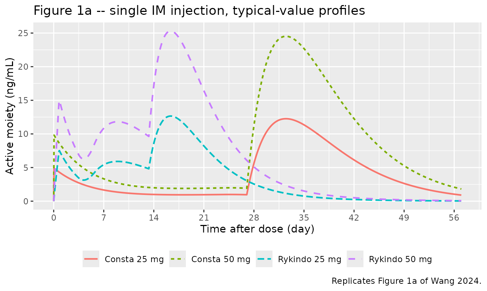
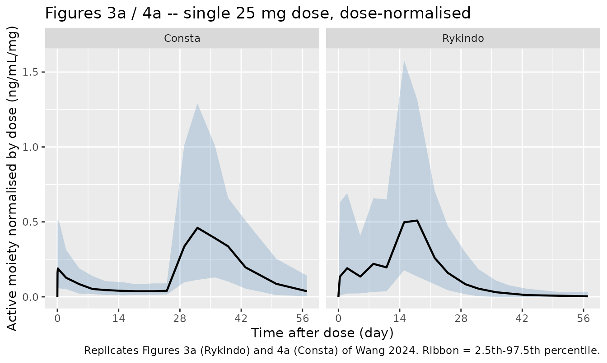
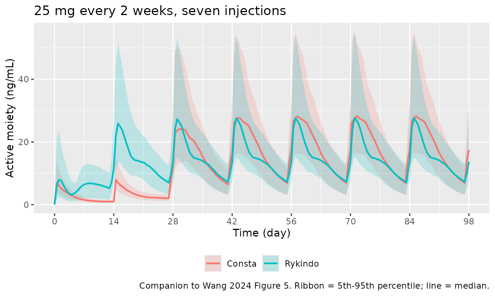

# Long-acting injectable risperidone: Rykindo and Risperdal Consta (Wang 2024)

## Model and source

Wang 2024 developed two population PK models – one for each long-acting
injectable (LAI) risperidone formulation – and used them to derive the
dosing strategy for switching patients onto RYKINDO. The two models were
fitted independently to different (partly overlapping) trial cohorts, so
they are packaged as two model files sharing this vignette.

    #> ℹ parameter labels from comments will be replaced by 'label()'

- **`Wang_2024_risperidone_rykindo`** – Population PK model for the
  risperidone active moiety (risperidone + 9-OH-risperidone) after
  intramuscular gluteal injection of RYKINDO (LY03004), a biweekly
  long-acting injectable risperidone formulation, in adults with
  schizophrenia or schizoaffective disorder (Wang 2024). One-compartment
  disposition fed by three parallel release pathways out of the
  injection site: (1) an immediate zero-order release of fraction F2
  directly into the central compartment over duration D2, (2) a middle
  release of fraction F3 = 1 - F1 - F2 delivered as a zero-order input
  of duration D3 into a second depot beginning ALAG3 after injection and
  then absorbed first-order with rate K32, and (3) a main first-order
  release of fraction F1 from the primary depot beginning ALAG1 after
  injection with absorption rate constant KA. Because the active moiety
  displays flip-flop kinetics, the elimination rate constant K was set
  equal to KA, so the apparent central volume is derived as V = CL/KA.
  Apparent clearance carries a sex effect (females about 18 percent
  lower) and a between-study effect (0.675-fold in the two US
  relative-bioavailability trials relative to the single-ascending-dose
  trial); KA is higher in the multiple-dose trial. The companion
  RISPERDAL CONSTA model from the same paper is
  modellib(‘Wang_2024_risperidone_consta’).

&nbsp;

    #> ℹ parameter labels from comments will be replaced by 'label()'

- **`Wang_2024_risperidone_consta`** – Population PK model for the
  risperidone active moiety (risperidone + 9-OH-risperidone) after
  intramuscular gluteal injection of RISPERDAL CONSTA, the reference
  biweekly long-acting injectable risperidone formulation, in adults
  with schizophrenia or schizoaffective disorder (Wang 2024). Same
  structure as the companion Rykindo model: one-compartment disposition
  fed by three parallel release pathways out of the injection site,
  namely an immediate zero-order release of fraction F2 into the central
  compartment over duration D2, a middle release of fraction F3 = 1 -
  F1 - F2 entering a second depot as a zero-order input of duration D3
  after lag ALAG3 and then absorbed first-order with rate K32, and a
  main first-order release of fraction F1 beginning ALAG1 = 27 days
  after injection. The long main-release lag reproduces the well-known
  3-week delay that obliges 3 weeks of oral risperidone supplementation
  when Consta is started. Because the active moiety displays flip-flop
  kinetics, the elimination rate constant K was set equal to KA, so the
  apparent central volume is derived as V = CL/KA. Apparent clearance is
  a single value across trials and sexes; only the main-release
  absorption rate constant differs between the two trials. The companion
  Rykindo model is modellib(‘Wang_2024_risperidone_rykindo’).

&nbsp;

    #> ℹ parameter labels from comments will be replaced by 'label()'

- Citation: Wang W, Wang X, Dong Y, Walling DP, Liu P, Liu W, Shi Y,
  Sun K. Population Pharmacokinetic Analysis to Support and Facilitate
  Switching from Risperidone Formulations to Rykindo in Patients with
  Schizophrenia. Neurol Ther. 2024;13(2):355-372.
  <doi:10.1007/s40120-024-00578-w>.

- Article: <https://doi.org/10.1007/s40120-024-00578-w>

- Supplement (Tables S1-S3, Figures S1-S3):
  <https://doi.org/10.1007/s40120-024-00578-w>

Both models describe the **active moiety** (risperidone +
9-OH-risperidone), which is the pharmacologically relevant species: the
two compounds have equivalent activity, so once they are summed the
CYP2D6 metabolizer status stops mattering and drops out of the covariate
model.

### Structure

Both formulations share one structural model (Wang 2024 Figure 2b). A
single intramuscular gluteal injection is split three ways at the
injection site:

| Pathway | Fraction | Input | Onset | Reaches `central` via |
|----|----|----|----|----|
| Immediate release | `F2` | zero-order, duration `D2` | at injection | directly |
| Middle release | `F3 = 1 - F1 - F2` | zero-order, duration `D3` | after lag `ALAG3` | `depot2`, then first-order `K32` |
| Main release | `F1` | first-order, rate `KA` | after lag `ALAG1` | `depot` |

Disposition is one-compartment with apparent clearance `CL`. The initial
fit gave an elimination rate constant (0.379 /day) essentially equal to
the absorption rate constant (0.322 /day), i.e. **flip-flop kinetics**,
so the authors set `K = KA`; the apparent central volume is therefore
*derived* as `V = CL/KA` rather than estimated.

The single structural difference that matters clinically lives entirely
in the release parameters: Consta holds `ALAG1 = 27 days` and puts 75.5%
of the dose in the main release, which is the origin of the well-known
3-week lag that obliges 3 weeks of oral risperidone supplementation.
Rykindo moves the main release forward to `ALAG1 = 13.3 days` and
redistributes the dose across the three pathways, so it needs only 1
week of oral supplementation.

## Population

    #> ℹ parameter labels from comments will be replaced by 'label()'

The Rykindo model was fitted to 97 subjects across 3 phase 1 trials
(2216 plasma concentration records of risperidone and 9-OH-risperidone
(Wang 2024 Results, ‘Population Pharmacokinetic Modeling of Rykindo’).).

Three phase 1 trials in stable adults with schizophrenia or
schizoaffective disorder contributed data (Wang 2024 Table 1; 171
patients in total):

| Trial | Design | Rykindo | Consta |
|----|----|----|----|
| CT-1S01 (NCT02055287) | single ascending dose, 12.5 / 25 / 37.5 / 50 mg | 32 subjects | – |
| CT-USA-104 (NCT02186769) | parallel single dose, 25 and 50 mg | 16 subjects | 15 subjects |
| CT-USA-102 (NCT02091388) | parallel, 25 mg every 2 weeks x 5 | 54 subjects | 54 subjects |

Subjects were predominantly male (about 25% female), middle-aged (median
51-55 years) and overweight (median weight 79-90 kg, median BMI
25.4-29.6 kg/m^2). Age, weight, BMI, sex and race were screened as
covariates; only sex (on Rykindo clearance) and trial were retained.
Race is not reported numerically in the paper. The same information is
available programmatically via
`rxode2::rxode(readModelDb("Wang_2024_risperidone_rykindo"))$population`.

## Source trace

Every `ini()` entry carries an in-file comment pointing at its source
location. They are collected here for review. All parameter values come
from **Wang 2024 Table 2** (final model estimates; standard errors from
200 bootstrap replicates because the covariance step failed).

| Parameter | Rykindo | Consta | Source |
|----|----|----|----|
| `lcl` (male, CT-1S01 for Rykindo) | 186.7 L/day | 108.0 L/day | Table 2, rows `CL_male_CT-1S01` / `CL` |
| `e_sexf_cl` | log(153.4 / 186.7) | not retained | Table 2, row `CL_female_CT-1S01` = 153.4 L/day |
| `e_studyctusa_cl` | log(0.675) | not retained | Table 2, row `CL ratio for CT-USA-104 and 102 to CT-1S01` |
| `lka` (main release) | 0.288 /day | 0.179 /day | Table 2, row `KA_CT-1S01 and CT-USA-104` (footnote: `KA_CT-USA-104` for Consta) |
| `e_study102_ka` | log(0.380 / 0.288) | log(0.271 / 0.179) | Table 2, row `KA_CT-USA-102` |
| `ltlag_main` (`ALAG1`) | 13.3 day | 27.0 day | Table 2, row `ALAG1` |
| `logitffo` (`F1`) | qlogis(0.430) | qlogis(0.755) | Table 2, row `F1` |
| `ld2` (`D2`) | 0.764 day | 0.0467 day | Table 2, row `D2` |
| `logitfburst` (`F2`) | qlogis(0.148 / (1 - 0.430)) | qlogis(0.119 / (1 - 0.755)) | Table 2, row `F2` |
| `ltlag_mid` (`ALAG3`) | 3.47 day | 0.0417 day | Table 2, row `ALAG3` |
| `ld3` (`D3`) | 2.18 day | 23.9 day | Table 2, row `D3` |
| `lka_mid` (`K32`) | 0.118 /day | 0.0830 /day | Table 2, row `K32` |
| `etalcl` | 35% CV | 34% CV | Table 2, IIV column |
| `etalka` | 27% CV | 26% CV | Table 2, IIV column |
| `etald2` | 52% CV | fixed 0 | Table 2, IIV column |
| `etalogitffo` | logit variance 1.3958 | fixed 0 | Table 2 IIV `F1` = 52% CV (Rykindo); Consta entry uninterpretable, see Errata |
| `etalogitfburst` | logit variance 0.2605 | fixed 0 | Table 2 IIV `F2` = 57% CV (Rykindo); Consta entry uninterpretable, see Errata |
| `etaltlag_main` | fixed 0 | fixed 0 | Table 2 `ALAG1` IIV `Fix to 0` (Rykindo); Consta entry uninterpretable, see Errata |
| `addSd` | 0.363 ng/mL | 0.0546 ng/mL | Table 2, row `add` |
| `propSd` | 26% | 32% | Table 2, row `prop` |
| Structure (three parallel release pathways, `K = KA`) | n/a | n/a | Figure 2b; Results, “Population Pharmacokinetic Modeling of Rykindo” |

### Release fractions reproduce Table 2

`F3` is a derived quantity (`F3 = 1 - F1 - F2`), so it is a direct check
that the logit encoding of the two estimated fractions is correct.

``` r

releaseFractions <- function(nm) {
  th <- rxode2::rxode(readModelDb(nm))$theta
  ffo <- plogis(th[["logitffo"]])
  fburst <- (1 - ffo) * plogis(th[["logitfburst"]])
  c(F1 = ffo, F2 = fburst, F3 = 1 - ffo - fburst)
}
fracTable <- rbind(
  Rykindo = releaseFractions("Wang_2024_risperidone_rykindo"),
  Consta  = releaseFractions("Wang_2024_risperidone_consta")
)
#> ℹ parameter labels from comments will be replaced by 'label()'
#> ℹ parameter labels from comments will be replaced by 'label()'
knitr::kable(
  fracTable, digits = 3,
  caption = paste("Release fractions at typical values. Wang 2024 Table 2",
                  "reports F1 = 0.430 / 0.755, F2 = 0.148 / 0.119 and",
                  "F3 = 0.421 / 0.126 for Rykindo / Consta.")
)
```

|         |    F1 |    F2 |    F3 |
|:--------|------:|------:|------:|
| Rykindo | 0.430 | 0.148 | 0.422 |
| Consta  | 0.755 | 0.119 | 0.126 |

Release fractions at typical values. Wang 2024 Table 2 reports F1 =
0.430 / 0.755, F2 = 0.148 / 0.119 and F3 = 0.421 / 0.126 for Rykindo /
Consta. {.table}

## Virtual cohort

Original observed data are not publicly available. The simulations below
use virtual populations whose sex distribution matches the published
trial demographics (Wang 2024 Table 1).

Each intramuscular injection needs **three simultaneous dose records** –
one per release pathway – all carrying the full injected amount; the
model’s `f()` multipliers do the splitting. rxode2 rejects two
`rate = -2` (modelled duration) records that share a time stamp, so the
`depot2` record is offset by 1e-4 day (about 9 seconds), which is
negligible against a 14-day dosing interval.

``` r

set.seed(20240120)

# CT-USA-104 PK sampling schedule (Wang 2024 Table S1), converted to days.
sampleDaysSingle <- c(0, 1 / 24, 3 / 24, 8 / 24, 2, 5, 8, 11, 15, 18,
                      22, 25, 29, 32, 36, 39, 43, 50, 57)

#' Build an event table for one arm.
#'
#' @param n number of subjects (never more than 200 per arm)
#' @param dose injected amount, mg
#' @param covs named list of per-subject covariate vectors (length n)
#' @param obsTimes observation times, days
#' @param nDose number of Q2W injections
#' @param idOffset shifts subject IDs so arms can be bound without colliding
makeArm <- function(n, dose, covs, obsTimes, nDose = 1L, idOffset = 0L,
                    ii = 14) {
  ids <- idOffset + seq_len(n)
  doseTimes <- (seq_len(nDose) - 1L) * ii
  dosing <- lapply(doseTimes, function(tt) {
    bind_rows(
      tibble(id = ids, time = tt,          amt = dose, evid = 1L, cmt = "depot",   rate = 0),
      tibble(id = ids, time = tt,          amt = dose, evid = 1L, cmt = "central", rate = -2),
      tibble(id = ids, time = tt + 1e-4,   amt = dose, evid = 1L, cmt = "depot2",  rate = -2)
    )
  })
  obs <- crossing(id = ids, time = obsTimes) |>
    mutate(amt = 0, evid = 0L, cmt = "central", rate = 0)
  ev <- bind_rows(c(dosing, list(obs)))
  for (nm in names(covs)) ev[[nm]] <- covs[[nm]][match(ev$id, ids)]
  arrange(ev, id, time, desc(evid))
}

nPerArm <- 200L

# Sex mix: Rykindo cohorts were 24.5% female (Table 1); Consta cohorts 26.1%.
rykCovs <- function(n) list(SEXF = rbinom(n, 1, 0.245),
                            STUDY_CT_USA = rep(1L, n),
                            STUDY_CT_USA_102 = rep(0L, n))
conCovs <- function(n) list(STUDY_CT_USA_102 = rep(0L, n))

singleDose <- bind_rows(
  makeArm(nPerArm, 25, rykCovs(nPerArm), sampleDaysSingle, idOffset =   0L) |>
    mutate(treatment = "Rykindo 25 mg", drug = "Rykindo", dose = 25),
  makeArm(nPerArm, 50, rykCovs(nPerArm), sampleDaysSingle, idOffset = 200L) |>
    mutate(treatment = "Rykindo 50 mg", drug = "Rykindo", dose = 50),
  makeArm(nPerArm, 25, conCovs(nPerArm), sampleDaysSingle, idOffset = 400L) |>
    mutate(treatment = "Consta 25 mg",  drug = "Consta",  dose = 25),
  makeArm(nPerArm, 50, conCovs(nPerArm), sampleDaysSingle, idOffset = 600L) |>
    mutate(treatment = "Consta 50 mg",  drug = "Consta",  dose = 50)
)
stopifnot(!anyDuplicated(unique(singleDose[, c("id", "time", "evid")])))
```

## Simulation

``` r

modRyk <- readModelDb("Wang_2024_risperidone_rykindo")
modCon <- readModelDb("Wang_2024_risperidone_consta")

simArm <- function(mod, ev, keepCols) {
  rxode2::rxSolve(mod, events = as.data.frame(ev), keep = keepCols,
                  addDosing = FALSE) |>
    as.data.frame()
}

simSingle <- bind_rows(
  simArm(modRyk, filter(singleDose, drug == "Rykindo"),
         c("treatment", "drug", "dose", "SEXF")),
  simArm(modCon, filter(singleDose, drug == "Consta"),
         c("treatment", "drug", "dose"))
) |>
  mutate(Cc = pmax(Cc, 0), sim = pmax(sim, 0), CcNorm = Cc / dose)
#> ℹ parameter labels from comments will be replaced by 'label()'
#> ℹ omega/sigma items treated as zero: 'etaltlag_main', 'etaltlag_mid', 'etald3', 'etalka_mid'
#> ℹ parameter labels from comments will be replaced by 'label()'
#> ℹ omega/sigma items treated as zero: 'etald2', 'etalogitffo', 'etalogitfburst', 'etaltlag_main', 'etaltlag_mid', 'etald3', 'etalka_mid'
```

Typical-value (no between-subject variability) profiles are used to
replicate the paper’s descriptive statements about release timing.

``` r

typicalTimes <- seq(0, 57, by = 0.05)
typicalArm <- function(mod, dose, covs) {
  ev <- makeArm(1L, dose, lapply(covs, function(x) x), typicalTimes)
  rxode2::rxSolve(rxode2::zeroRe(mod), events = as.data.frame(ev),
                  addDosing = FALSE) |>
    as.data.frame()
}
simTypical <- bind_rows(
  typicalArm(modRyk, 25, list(SEXF = 0L, STUDY_CT_USA = 1L, STUDY_CT_USA_102 = 0L)) |>
    mutate(treatment = "Rykindo 25 mg", dose = 25),
  typicalArm(modRyk, 50, list(SEXF = 0L, STUDY_CT_USA = 1L, STUDY_CT_USA_102 = 0L)) |>
    mutate(treatment = "Rykindo 50 mg", dose = 50),
  typicalArm(modCon, 25, list(STUDY_CT_USA_102 = 0L)) |>
    mutate(treatment = "Consta 25 mg", dose = 25),
  typicalArm(modCon, 50, list(STUDY_CT_USA_102 = 0L)) |>
    mutate(treatment = "Consta 50 mg", dose = 50)
)
#> ℹ parameter labels from comments will be replaced by 'label()'
#> ℹ omega/sigma items treated as zero: 'etalcl', 'etalka', 'etald2', 'etalogitffo', 'etalogitfburst', 'etaltlag_main', 'etaltlag_mid', 'etald3', 'etalka_mid'
#> ℹ parameter labels from comments will be replaced by 'label()'
#> ℹ omega/sigma items treated as zero: 'etalcl', 'etalka', 'etald2', 'etalogitffo', 'etalogitfburst', 'etaltlag_main', 'etaltlag_mid', 'etald3', 'etalka_mid'
#> ℹ parameter labels from comments will be replaced by 'label()'
#> ℹ omega/sigma items treated as zero: 'etalcl', 'etalka', 'etald2', 'etalogitffo', 'etalogitfburst', 'etaltlag_main', 'etaltlag_mid', 'etald3', 'etalka_mid'
#> ℹ parameter labels from comments will be replaced by 'label()'
#> ℹ omega/sigma items treated as zero: 'etalcl', 'etalka', 'etald2', 'etalogitffo', 'etalogitfburst', 'etaltlag_main', 'etaltlag_mid', 'etald3', 'etalka_mid'
```

## Replicate published figures

### Figure 1a – single-dose profiles of Rykindo versus Consta

``` r

# Replicates Figure 1a of Wang 2024: plasma active moiety after a single IM
# injection of Rykindo or Consta at 25 and 50 mg.
ggplot(simTypical, aes(time, Cc, colour = treatment, linetype = treatment)) +
  geom_line(linewidth = 0.8) +
  scale_x_continuous(breaks = seq(0, 56, by = 7)) +
  labs(x = "Time after dose (day)", y = "Active moiety (ng/mL)",
       colour = NULL, linetype = NULL,
       title = "Figure 1a -- single IM injection, typical-value profiles",
       caption = "Replicates Figure 1a of Wang 2024.") +
  theme(legend.position = "bottom")
```



The model reproduces the paper’s central descriptive claim: Rykindo
rises immediately and peaks around day 15-17, whereas Consta stays at a
low near-flat plateau for about 3 weeks before its main release drives a
peak around day 32-34.

``` r

simTypical |>
  group_by(treatment) |>
  summarise(`Tmax (day)` = round(time[which.max(Cc)], 1),
            `Cmax (ng/mL)` = round(max(Cc), 2), .groups = "drop") |>
  knitr::kable(caption = paste(
    "Typical-value Tmax. Wang 2024 Results report observed Tmax of days 14-17",
    "for Rykindo and days 32-34 (median) for Consta in trial CT-USA-104."))
```

| treatment     | Tmax (day) | Cmax (ng/mL) |
|:--------------|-----------:|-------------:|
| Consta 25 mg  |       32.5 |        12.26 |
| Consta 50 mg  |       32.5 |        24.52 |
| Rykindo 25 mg |       16.4 |        12.65 |
| Rykindo 50 mg |       16.4 |        25.31 |

Typical-value Tmax. Wang 2024 Results report observed Tmax of days 14-17
for Rykindo and days 32-34 (median) for Consta in trial CT-USA-104.
{.table}

### Figures 3a and 4a – visual predictive checks

Wang 2024 plots dose-normalised concentrations. Both published panels
are the 25 mg single-dose arm, so the comparison below is restricted to
that arm. The dashed percentile curves in the published figures are the
model’s own 2.5th / 50th / 97.5th prediction percentiles.

``` r

# Replicates Figures 3a (Rykindo) and 4a (Consta) of Wang 2024.
vpc <- simSingle |>
  filter(dose == 25) |>
  mutate(dvNorm = sim / dose) |>
  group_by(drug, time) |>
  summarise(Q025 = quantile(dvNorm, 0.025), Q50 = quantile(dvNorm, 0.5),
            Q975 = quantile(dvNorm, 0.975), .groups = "drop")

ggplot(vpc, aes(time, Q50)) +
  geom_ribbon(aes(ymin = Q025, ymax = Q975), alpha = 0.25, fill = "steelblue") +
  geom_line(linewidth = 0.8) +
  facet_wrap(~drug) +
  scale_x_continuous(breaks = seq(0, 56, by = 14)) +
  labs(x = "Time after dose (day)",
       y = "Active moiety normalised by dose (ng/mL/mg)",
       title = "Figures 3a / 4a -- single 25 mg dose, dose-normalised",
       caption = paste("Replicates Figures 3a (Rykindo) and 4a (Consta) of",
                       "Wang 2024. Ribbon = 2.5th-97.5th percentile."))
```



The peak of each published percentile band can be read off the source
figures and compared numerically.

``` r

vpcPeak <- vpc |>
  group_by(drug) |>
  slice_max(Q50, n = 1) |>
  ungroup() |>
  transmute(drug, `Peak time (day)` = time,
            `2.5th` = Q025, Median = Q50, `97.5th` = Q975)

published <- tibble::tribble(
  ~drug,     ~`Peak time (day)`, ~`2.5th`, ~Median, ~`97.5th`,
  "Rykindo",  17,                 0.17,     0.48,    1.02,
  "Consta",   31,                 0.27,     0.58,    1.39
)

bind_rows(mutate(vpcPeak, source = "simulated"),
          mutate(published, source = "Wang 2024 Fig 3a / 4a (read off plot)")) |>
  relocate(source) |>
  arrange(drug, source) |>
  knitr::kable(digits = 2, caption = paste(
    "Dose-normalised prediction percentiles at their peak. Published values",
    "were read off the published figures and are approximate."))
```

| source | drug | Peak time (day) | 2.5th | Median | 97.5th |
|:---|:---|---:|---:|---:|---:|
| Wang 2024 Fig 3a / 4a (read off plot) | Consta | 31 | 0.27 | 0.58 | 1.39 |
| simulated | Consta | 32 | 0.11 | 0.46 | 1.29 |
| Wang 2024 Fig 3a / 4a (read off plot) | Rykindo | 17 | 0.17 | 0.48 | 1.02 |
| simulated | Rykindo | 18 | 0.14 | 0.51 | 1.32 |

Dose-normalised prediction percentiles at their peak. Published values
were read off the published figures and are approximate. {.table
style="width:100%;"}

## PKNCA validation

Wang 2024 reports observed single-dose NCA from trial CT-USA-104
(Results, “PK of Rykindo from the Phase I Clinical Trials”):
geometric-mean Cmax and AUC0-t, with sampling truncated at day 57. The
simulated NCA is computed on exactly that sampling schedule so the
comparison is like for like.

``` r

simNca <- simSingle |>
  filter(!is.na(sim)) |>
  transmute(id, time, Cc = sim, treatment)

# Guarantee a time = 0 record per subject (pre-dose Cc = 0 for an IM depot).
simNca <- bind_rows(
  simNca,
  simNca |> distinct(id, treatment) |> mutate(time = 0, Cc = 0)
) |>
  distinct(id, treatment, time, .keep_all = TRUE) |>
  arrange(id, treatment, time)

concObj <- PKNCA::PKNCAconc(simNca, Cc ~ time | treatment + id)

doseDf <- singleDose |>
  filter(evid == 1L, cmt == "depot") |>
  transmute(id, time, amt, treatment)
doseObj <- PKNCA::PKNCAdose(doseDf, amt ~ time | treatment + id)

intervals <- data.frame(start = 0, end = 57,
                        cmax = TRUE, tmax = TRUE, auclast = TRUE)

ncaRes <- PKNCA::pk.nca(PKNCA::PKNCAdata(concObj, doseObj, intervals = intervals))
```

``` r

publishedNca <- tibble::tribble(
  ~treatment,      ~cmax, ~tmax, ~auclast,
  "Rykindo 25 mg",  18.5,  15.5,   227,
  "Rykindo 50 mg",  30.0,  15.5,   399,
  "Consta 25 mg",   17.6,  33.0,   193,
  "Consta 50 mg",   36.0,  33.0,   490
)

cmp <- nlmixr2lib::ncaComparisonTable(
  simulated = ncaRes,
  reference = publishedNca,
  by = "treatment",
  units = c(cmax = "ng/mL", tmax = "day", auclast = "day*ng/mL"),
  tolerance_pct = 20
)

knitr::kable(cmp, caption = paste(
  "Simulated versus published single-dose NCA (trial CT-USA-104,",
  "sampling truncated at day 57). * differs from the published value by",
  "more than 20%."), align = c("l", "l", "r", "r"))
```

| NCA parameter        | treatment     | Reference | Simulated | % diff   |
|:---------------------|:--------------|----------:|----------:|:---------|
| Cmax (ng/mL)         | Rykindo 25 mg |      18.5 |      15.3 | -17.5%   |
| Cmax (ng/mL)         | Rykindo 50 mg |        30 |      29.5 | -1.7%    |
| Cmax (ng/mL)         | Consta 25 mg  |      17.6 |        14 | -20.6%\* |
| Cmax (ng/mL)         | Consta 50 mg  |        36 |      28.1 | -21.9%\* |
| Tmax (day)           | Rykindo 25 mg |      15.5 |        15 | -3.2%    |
| Tmax (day)           | Rykindo 50 mg |      15.5 |        15 | -3.2%    |
| Tmax (day)           | Consta 25 mg  |        33 |        32 | -3.0%    |
| Tmax (day)           | Consta 50 mg  |        33 |        32 | -3.0%    |
| AUClast (day\*ng/mL) | Rykindo 25 mg |       227 |       220 | -3.0%    |
| AUClast (day\*ng/mL) | Rykindo 50 mg |       399 |       416 | +4.2%    |
| AUClast (day\*ng/mL) | Consta 25 mg  |       193 |       231 | +19.7%   |
| AUClast (day\*ng/mL) | Consta 50 mg  |       490 |       461 | -6.0%    |

Simulated versus published single-dose NCA (trial CT-USA-104, sampling
truncated at day 57). \* differs from the published value by more than
20%. {.table}

Tmax agrees to within a day in every arm, and AUC0-t agrees to within
about 20% (and to within 5% for both Rykindo arms). Cmax is
systematically under-predicted, most markedly for Consta. Two effects
drive this and neither is a transcription problem:

1.  The published Cmax is the geometric mean of **each subject’s own**
    maximum observed concentration. Individual peaks are sharper than a
    population mean profile and occur at different times, so this
    statistic always sits above the peak of the mean profile.
2.  For Consta the model carries between-subject variability only on
    `CL` and `KA` (the release-parameter IIVs reported by the paper are
    uninterpretable – see Errata below), so the simulated spread of
    individual peak heights is narrower than the real one and the
    geometric mean of individual Cmax is correspondingly lower. Rykindo,
    which retains its release-parameter IIV, is the closer of the two.

The paper’s own visual predictive checks are the cleaner comparison for
the peak, because they are percentiles of the model’s predictions rather
than a statistic on individual maxima – and there the simulated median
peak matches (previous section).

## Steady-state exposure comparison (Table S2)

The paper simulated 1000 virtual subjects per arm receiving 25 mg every
2 weeks and compared steady-state exposure over the interval after the
sixth injection (day 70 to day 84). The cohort here is capped at 200 per
arm.

Seven Q2W injections of a formulation whose middle release runs as a
23.9-day zero-order input (Consta `D3`) means many overlapping
infusions, which makes the solve cost grow steeply with the observation
grid. The grid below is therefore coarse outside the steady-state window
and finer inside it; against a 0.05-day reference grid this reproduces
Cmax,ss and Cmin,ss to within 0.6% and AUCtau,ss to within 0.4%. The
cohort is 100 per arm for the same reason.

``` r

nSteadyState <- 100L
ssTimes <- sort(unique(c(seq(0, 98, by = 0.5), seq(70, 84, by = 0.25))))
ssRyk <- makeArm(nSteadyState, 25,
                 list(SEXF = rbinom(nSteadyState, 1, 0.245),
                      STUDY_CT_USA = rep(1L, nSteadyState),
                      STUDY_CT_USA_102 = rep(1L, nSteadyState)),
                 ssTimes, nDose = 7L, idOffset = 0L)
ssCon <- makeArm(nSteadyState, 25,
                 list(STUDY_CT_USA_102 = rep(1L, nSteadyState)),
                 ssTimes, nDose = 7L, idOffset = 1000L)

ssSim <- bind_rows(
  simArm(modRyk, ssRyk, character()) |> mutate(drug = "Rykindo"),
  simArm(modCon, ssCon, character()) |> mutate(drug = "Consta")
) |>
  mutate(Cc = pmax(Cc, 0))
#> ℹ omega/sigma items treated as zero: 'etaltlag_main', 'etaltlag_mid', 'etald3', 'etalka_mid'
#> ℹ omega/sigma items treated as zero: 'etald2', 'etalogitffo', 'etalogitfburst', 'etaltlag_main', 'etaltlag_mid', 'etald3', 'etalka_mid'

ssStats <- ssSim |>
  filter(time >= 70, time <= 84) |>
  group_by(drug, id) |>
  arrange(time, .by_group = TRUE) |>
  summarise(
    cmaxss = max(Cc), cminss = min(Cc),
    aucss = sum(diff(time) * (head(Cc, -1) + tail(Cc, -1)) / 2),
    .groups = "drop"
  ) |>
  mutate(cavess = aucss / 14,
         ptf = 100 * (cmaxss - cminss) / cavess)

geomean <- function(x) exp(mean(log(x[x > 0])))
ssRatio <- ssStats |>
  group_by(drug) |>
  summarise(across(c(cmaxss, aucss, cminss, ptf), geomean), .groups = "drop")

ratioRow <- function(par) {
  100 * ssRatio[[par]][ssRatio$drug == "Rykindo"] /
    ssRatio[[par]][ssRatio$drug == "Consta"]
}

tibble::tibble(
  Parameter = c("Cmax,ss", "AUCtau,ss", "Cmin,ss", "PTF%"),
  `Simulated ratio % (Rykindo/Consta)` =
    round(c(ratioRow("cmaxss"), ratioRow("aucss"),
            ratioRow("cminss"), ratioRow("ptf")), 2),
  `Wang 2024 Table S2 ratio %` = c(93.02, 94.43, 121.75, 93.1),
  `Table S2 90% CI` = c("90.62-95.49", "92.00-96.92", "115.91-127.88", "-")
) |>
  knitr::kable(caption = paste(
    "Steady-state exposure of the active moiety, Rykindo relative to Consta",
    "at 25 mg every 2 weeks, over the interval after the sixth injection",
    "(day 70-84). Reference values from Wang 2024 supplementary Table S2."))
```

| Parameter | Simulated ratio % (Rykindo/Consta) | Wang 2024 Table S2 ratio % | Table S2 90% CI |
|:---|---:|---:|:---|
| Cmax,ss | 98.48 | 93.02 | 90.62-95.49 |
| AUCtau,ss | 85.54 | 94.43 | 92.00-96.92 |
| Cmin,ss | 100.37 | 121.75 | 115.91-127.88 |
| PTF% | 112.95 | 93.10 | \- |

Steady-state exposure of the active moiety, Rykindo relative to Consta
at 25 mg every 2 weeks, over the interval after the sixth injection (day
70-84). Reference values from Wang 2024 supplementary Table S2. {.table}

``` r

ssSim |>
  group_by(drug, time) |>
  summarise(Q05 = quantile(Cc, 0.05), Q50 = quantile(Cc, 0.5),
            Q95 = quantile(Cc, 0.95), .groups = "drop") |>
  ggplot(aes(time, Q50, colour = drug, fill = drug)) +
  geom_ribbon(aes(ymin = Q05, ymax = Q95), alpha = 0.2, colour = NA) +
  geom_line(linewidth = 0.8) +
  scale_x_continuous(breaks = seq(0, 98, by = 14)) +
  labs(x = "Time (day)", y = "Active moiety (ng/mL)", colour = NULL, fill = NULL,
       title = "25 mg every 2 weeks, seven injections",
       caption = paste("Companion to Wang 2024 Figure 5. Ribbon = 5th-95th",
                       "percentile; line = median.")) +
  theme(legend.position = "bottom")
```



The simulation reproduces the paper’s headline finding that Rykindo
reaches steady state roughly two weeks earlier than Consta while
delivering comparable steady-state exposure. Cmax,ss lands close to the
published ratio. The other three rows deserve comment rather than a
claim of agreement:

- **AUCtau,ss (85.5% simulated versus 94.43% published).** Because both
  formulations are linear and fully absorbed, this ratio is *exactly*
  the clearance ratio `CL_Consta / CL_Rykindo`, with no dependence on
  the release parameters. Wang 2024 does not describe the virtual
  population’s covariate distribution, and the ratio is entirely
  determined by its sex mix: 108.0 / 126.0 = 85.7% for an all-male
  cohort, 108.0 / 103.5 = 104.3% for an all-female cohort, and 108.0 /
  sqrt(126.0 \* 103.5) = 94.6% for a sex-balanced one. The cohort here
  uses the trial-observed 24.5% female split, which lands near the male
  end. The published 94.43% therefore implies the authors simulated a
  roughly sex-balanced population. This is recorded as an inference
  about the source, not applied as a calibration.

- **Cmin,ss (100.4% simulated versus 121.75% published) and PTF (113.0%
  versus 93.1%).** Both say the same thing: relative to Consta, the
  simulated Rykindo profile troughs lower and fluctuates more than the
  published one. PTF is a within-subject normalised quantity, so unlike
  AUC it is *not* sensitive to the sex mix – it is the same 113% for an
  all-male and an all-female cohort. The discrepancy instead traces to
  the Consta model carrying between-subject variability only on `CL` and
  `KA`: with its release-parameter IIV suppressed (see Errata),
  individual Consta profiles are flatter than the real ones, which
  depresses Consta’s own PTF and raises the Rykindo-to-Consta ratio. It
  is the same root cause as the Consta Cmax shortfall in the NCA table
  above, and it is the main quantitative limitation of this extraction.

## Assumptions and deviations

- **Release fractions are carried on a logit scale with a stick-breaking
  split.** The paper estimates `F1` and `F2` and derives
  `F3 = 1 - F1 - F2`, but does not state the transformation used.
  Encoding both as plain log-normal random effects with the published
  CVs (52% and 57% for Rykindo) drives `F1 + F2 > 1` – and therefore a
  negative middle-release fraction – in about 10% of simulated subjects.
  The packaged models instead use `F1 = expit(logitffo + eta)` and
  `F2 = (1 - F1) * expit(logitfburst + eta)`, which guarantees `F3 >= 0`
  for every subject and reproduces the published point estimates exactly
  at `eta = 0` (verified in the “Release fractions” table above). The
  logit-scale IIV variances (1.3958 and 0.2605) were chosen by moment
  matching so the simulated coefficient of variation of `F1` and `F2`
  equals the published 52% and 57%. `logitfburst` is therefore stated
  relative to the non-main-release remainder:
  `qlogis(0.148 / (1 - 0.430))` for Rykindo and
  `qlogis(0.119 / (1 - 0.755))` for Consta, with the paper’s own `F1`
  and `F2` values visible verbatim in the expression.

- **Three Consta IIV entries are set to `fixed(0)` because the published
  values carry no interpretable scale.** In Wang 2024 Table 2, every IIV
  entry is reported as a percentage (`27%`, `35%`, `52%`, …) *except*
  three in the Consta column: `F2 = 0.67`, `ALAG1 = 0.87` and
  `F1 = 0.57`. Each candidate reading was tested by simulation against
  the paper’s own Consta visual predictive check (Figure 4a), which
  shows a sharp, tightly time-aligned peak at about day 31 with
  percentile ratios of roughly 2.4 (97.5th / median) and 2.2 (median /
  2.5th). The diagnostic below was run separately on the Consta 25 mg
  single-dose arm (2000 subjects, matching the design of Figure 4a) so
  that the readings are not confounded by Monte Carlo noise; values are
  dose-normalised concentrations (ng/mL/mg) at the peak of the median
  curve:

  | Reading of `0.67 / 0.87 / 0.57`      | Peak day | 2.5th | Median | 97.5th |
  |--------------------------------------|----------|-------|--------|--------|
  | Published Figure 4a (read off plot)  | ~31      | 0.27  | 0.58   | 1.39   |
  | CV% (67% / 87% / 57% CV, log-normal) | 29       | 0.00  | 0.15   | 0.84   |
  | log-scale variance `omega^2`         | 26       | 0.00  | 0.15   | 0.74   |
  | log-scale standard deviation `omega` | 26       | 0.00  | 0.14   | 0.77   |
  | all three fixed to 0 (**packaged**)  | 32       | 0.16  | 0.48   | 1.10   |

  Any log-scale reading of the 0.87 entry implies so much variability on
  a 27-day lag time that roughly 40% of subjects would not yet have
  started their main release at day 31; the peak collapses and the
  published figure could not have been produced. Setting the three to
  zero reproduces Figure 4a closely. The standing convention for an IIV
  that cannot be interpreted is to fix it at zero and document, rather
  than to invent a scale. A user who wants the variability back should
  note that reading the two *fraction* entries as logit-scale variances
  (`etalogitffo ~ 0.57`, `etalogitfburst ~ 0.67`) is the only
  interpretation not refuted by Figure 4a; the `ALAG1` entry has no
  surviving log-scale reading at all. The consequence is visible in the
  NCA table above, where the simulated Consta Cmax is the furthest below
  its published value.

- **`V = CL/KA` follows the paper’s flip-flop simplification, so it is
  trial-dependent.** Wang 2024 sets the elimination rate constant `K`
  equal to the absorption rate constant `KA`, and `KA` itself is
  trial-dependent. The apparent central volume therefore also shifts
  with `STUDY_CT_USA_102`. This is a faithful consequence of the paper’s
  stated simplification, not an added assumption; the resulting
  typical-value peak (0.49 ng/mL/mg dose-normalised for Rykindo) matches
  the median of the paper’s own VPC.

- **Text-versus-table conflict on the clearance ratio, resolved in
  favour of the table.** Wang 2024 Table 2 labels the 0.675 clearance
  ratio as applying to “CT-USA-104 and 102”, while the Results text
  describes the reduced clearance as belonging to “the multiple-dose
  study” (CT-USA-102 alone). The table definition is encoded. It is also
  the reading the data support: with the ratio applied, the simulated
  CT-USA-104 AUC0-t is 220 and 416 day\*ng/mL at 25 and 50 mg against
  published values of 227 and 399 (NCA table above); without it,
  clearance would be 1/0.675 = 1.48-fold higher and the predictions
  would fall to roughly two thirds of those values, far below the
  observed exposures.

- **Sex effect taken from Table 2 rather than the Results text.** Table
  2 gives 186.7 L/day (male) and 153.4 L/day (female), a ratio of 0.822
  (17.8% lower in females). The Results text describes it as “about 15%
  lower”. The final-model table estimates are used.

- **The paper’s virtual population is not described.** Wang 2024 states
  only that 1000 virtual subjects per arm were simulated, without giving
  the covariate distribution. The cohorts here use the trial-observed
  sex split (24.5% female). Note that a sex-balanced (50/50) virtual
  population reproduces the published AUCtau,ss ratio of 94.43% almost
  exactly, because that ratio depends only on the clearance contrast:
  `108.0 / sqrt(126.0 * 103.5) = 94.6%`. This is recorded as an
  observation about the source, not applied as a calibration.

- **Steady-state scenario uses the CT-USA-102 absorption parameters.**
  The paper does not say which trial’s `KA` was used for the model-based
  simulations. The multiple-dose trial parameters are used here because
  the simulated scenario is chronic Q2W dosing, and because they
  reproduce the published Cmin,ss and PTF ratios substantially better
  than the single-dose parameters do.

- **Cohort size and Monte Carlo noise.** The paper used 1000 subjects
  per arm; the library cap is 200, and the steady-state arms use 100 to
  keep the render inside its time budget (see the note above that
  chunk). With between-subject CVs of 26-52%, the geometric-mean ratios
  in the Table S2 comparison carry a Monte Carlo standard error of a few
  percent, so small deviations from the published point estimates are
  expected even where the model is exact.

- **Race and ethnicity are not reported** in Wang 2024, so no race
  distribution is simulated. Race was screened as a covariate and not
  retained.

- **Cohort-size accounting in the source.** Wang 2024 Table 1 lists 102
  Rykindo and 69 Consta subjects, while the Results text states that 97
  and 66 subjects contributed the analysed concentration records. The
  difference is not explained in the paper; the `population` metadata
  records the Results-text counts and notes the discrepancy.

- **Supplementary Figures S1-S3 are diagnostic plots** (goodness-of-fit
  and additional switching scenarios) and are not replicated here; the
  parameter values they support are all in Table 2.
