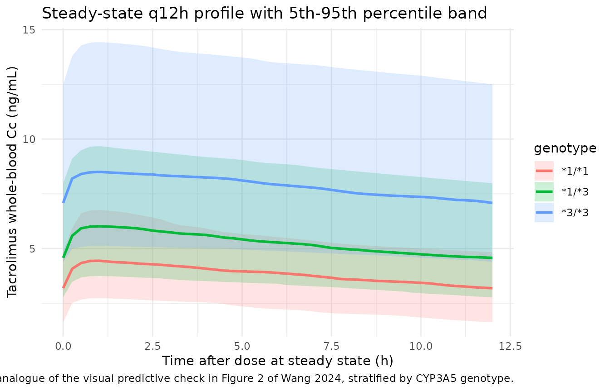
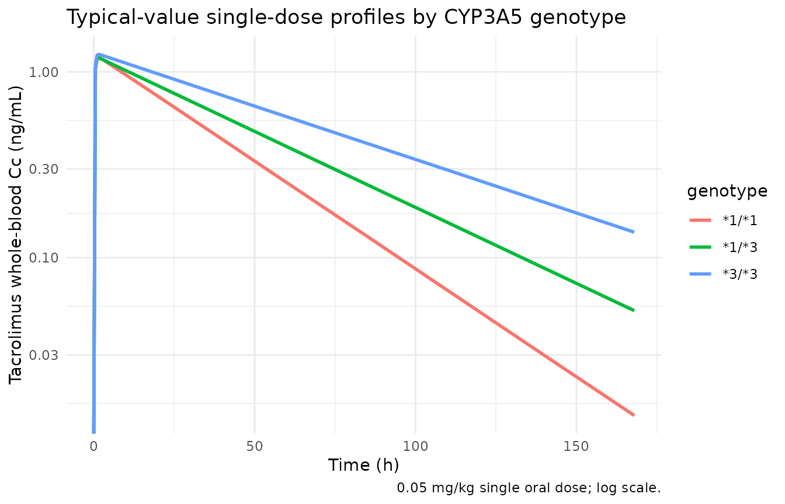

# Tacrolimus (Wang 2024)

## Model and source

- Citation: Wang YP, Lu XL, Shao K, Shi HQ, Zhou PJ, Chen B. Improving
  prediction of tacrolimus concentration using a combination of
  population pharmacokinetic modeling and machine learning in chinese
  renal transplant recipients. Front Pharmacol. 2024;15:1389271.
  <doi:10.3389/fphar.2024.1389271>.
- Description: One-compartment population PK model with first-order
  absorption for twice-daily oral tacrolimus (Prograf) trough
  concentrations in Chinese adult renal transplant recipients (Wang
  2024). The absorption rate constant ka is held at 3.86 1/h because
  only pre-dose trough concentrations (C0) were available. Apparent oral
  clearance CL/F carries two exponential covariate effects: the CYP3A5
  *3-allele count (0 for* 1/*1, 1 for* 1/*3, 2 for* 3/*3; coefficient
  -0.348, so CL/F falls to 70.6% and 49.9% of the* 1/*1 value for* 1/*3
  and* 3/\*3 respectively) and hematocrit expressed as a volume fraction
  (coefficient -0.122). Apparent central volume V/F carries no
  covariate. Inter-individual variability is exponential and diagonal on
  CL/F and V/F. Residual error is additive on log-transformed
  concentrations, which is proportional error on the linear
  concentration scale. Wang 2024 also builds MLP, SVR, and XGBoost
  machine-learning predictors on top of this model’s post hoc individual
  predictions; those are not ODE models and are outside the scope of
  this model file.
- Article: <https://doi.org/10.3389/fphar.2024.1389271>

Wang et al. (2024) developed a one-compartment population PK model with
first-order absorption for twice-daily oral tacrolimus in 127 Chinese
adult renal transplant recipients, then used its post hoc individual
predictions as an input feature for three machine-learning predictors
(MLP, SVR, XGBoost) of the next trough concentration. Only the
population PK layer is an ODE model and only that layer is packaged
here; the machine-learning layer is a set of tabular regressors and is
out of scope for `nlmixr2lib`.

Because the dataset contained nothing but routine pre-dose trough
concentrations (C0), the absorption rate constant could not be
identified and was held constant, and a one-compartment structure was
used. Two covariates survived forward inclusion and backward
elimination, both on apparent oral clearance: the CYP3A5 genotype and
the hematocrit.

## Population

The model-building cohort (Wang 2024 Table 1) was 103 adult Chinese
recipients of a first renal transplant – the 80% training split of a
127-patient, 2041-concentration single-centre dataset from Ruijin
Hospital, Shanghai. The training set had a mean age of 41.2 +/- 11.2
years, a mean weight of 63.3 +/- 12.9 kg, 39/103 (37.9%) female, and a
mean hematocrit of 0.29 +/- 0.056 L/L. CYP3A5 genotypes were *1/*1 in 10
(9.7%), *1/*3 in 35 (34%), and *3/*3 in 58 (56.3%). All recipients
received tacrolimus + mycophenolate mofetil + corticosteroids;
concomitant calcium antagonists (78.6%), proton pump inhibitors (99%),
and voriconazole (20.4%) were common. Tacrolimus (Prograf) was started
at 0.1 mg/kg/day divided q12h and titrated to a trough target of 10-13
ng/mL in the first month and 5-9 ng/mL thereafter, with samples drawn
between 3 and 1622 days post-transplant. Whole-blood tacrolimus was
assayed by enzyme-multiplied immunoassay over a 2-50 ng/mL range.

The parameter estimates encoded here are Wang 2024 Table 2’s “Final
model” column, fitted to the 103-patient training set. Table 2 also
reports a “Test set final model” refit on the 24-patient test split;
that refit is a validation exercise rather than the paper’s final model
and is not packaged.

The same information is available programmatically via the model’s
`population` metadata
(`rxode2::rxode(readModelDb("Wang_2024_tacrolimus"))$meta$population`).

## Source trace

The per-parameter origin is recorded as an in-file comment next to each
`ini()` entry in `inst/modeldb/specificDrugs/Wang_2024_tacrolimus.R`.
The table below collects them in one place for review.

| Equation / parameter | Value | Source location |
|----|----|----|
| `lka` (ka) | `fixed(log(3.86))` 1/h | Wang 2024 Table 2, theta1, all three model columns |
| `lvc` (V/F) | `log(2560)` L | Wang 2024 Table 2, final model theta2 (RSE 10.7%) |
| `lcl` (CL/F) | `log(70.6)` L/h | Wang 2024 Table 2, final model theta3 (RSE 9.75%) |
| `e_cyp3a5_cl` | -0.348 | Wang 2024 Table 2, final model theta5 (RSE 12.2%) |
| `e_hct_cl` | -0.122 | Wang 2024 Table 2, final model theta4 (RSE 47.1%) |
| `etalvc` | 0.4225 (= 0.650^2) | Wang 2024 Table 2, final model eta1: omega V/F = 65.0% (RSE 22.5%) |
| `etalcl` | 0.0529 (= 0.230^2) | Wang 2024 Table 2, final model eta2: omega CL/F = 23.0% (RSE 23.1%) |
| `propSd` | 0.356 | Wang 2024 Table 2, final model delta = 35.6% (RSE 12.0%) |
| CL/F covariate equation | `CL/F = 70.6 * exp(CYP3A5 * -0.348) * exp(HCT * -0.122)` | Wang 2024 Results 3.2, displayed equation |
| CYP3A5 ordinal scoring | *1/*1 = 0, *1/*3 = 1, *3/*3 = 2 | Wang 2024 Methods 2.3 and Results 3.2 |
| Exponential IIV | `P_i = TV(P_i) * exp(eta_i)` | Wang 2024 Methods 2.3, equation 1 |
| Log-additive residual error | `ln(Cobs) = ln(Cpred) + epsilon` | Wang 2024 Methods 2.3, equation 2 |
| One compartment, first-order elimination | n/a | Wang 2024 Results 3.2 |

## Virtual cohort

Original observed data are not publicly available. The cohort below is a
virtual population whose covariate distributions match Wang 2024 Table
1’s training set: hematocrit `N(0.29, 0.056)` truncated to a
physiologically plausible 0.15-0.45 L/L, body weight `N(63.3, 12.9)`
truncated to 40-100 kg, and 150 subjects in each of the three CYP3A5
genotype strata (within the 200-per-arm cap). Body weight is not a
covariate in this model; it only sets the protocol dose of 0.1 mg/kg/day
given as two equal q12h doses.

``` r

set.seed(20240509)

n_per_arm <- 150L

genotypes <- tibble::tribble(
  ~genotype, ~CYP3A5_STAR1_HOM, ~CYP3A5_STAR1_HET, ~id_offset,
  "*1/*1",   1,                 0,                 0L,
  "*1/*3",   0,                 1,                 1000L,
  "*3/*3",   0,                 0,                 2000L
)

make_subjects <- function(n, genotype, hom, het, id_offset) {
  tibble::tibble(
    id       = id_offset + seq_len(n),
    genotype = genotype,
    CYP3A5_STAR1_HOM = hom,
    CYP3A5_STAR1_HET = het,
    HCT = pmin(pmax(stats::rnorm(n, 0.29, 0.056), 0.15), 0.45),
    WT  = pmin(pmax(stats::rnorm(n, 63.3, 12.9), 40), 100)
  ) |>
    # Protocol dose: 0.1 mg/kg/day split into two equal q12h doses.
    dplyr::mutate(amt = 0.05 * WT)
}

subjects <- dplyr::bind_rows(
  lapply(
    seq_len(nrow(genotypes)),
    function(i) {
      make_subjects(
        n         = n_per_arm,
        genotype  = genotypes$genotype[i],
        hom       = genotypes$CYP3A5_STAR1_HOM[i],
        het       = genotypes$CYP3A5_STAR1_HET[i],
        id_offset = genotypes$id_offset[i]
      )
    }
  )
)

stopifnot(!anyDuplicated(subjects$id))
```

Two event tables are built from the same subjects. The single-dose table
supports NCA; the steady-state table uses rxode2’s `ss = 1` flag with
`ii = 12` so the q12h profile is exact at steady state rather than
approached by a long burn-in.

``` r

# Single 0.05 mg/kg dose, sampled over one week.
obs_times_sd <- c(seq(0, 24, by = 0.5), seq(26, 168, by = 2))

events_sd <- dplyr::bind_rows(
  subjects |> dplyr::mutate(time = 0, evid = 1L, cmt = "depot"),
  subjects |>
    tidyr::crossing(time = obs_times_sd) |>
    dplyr::mutate(amt = NA_real_, evid = 0L, cmt = "central")
) |>
  dplyr::arrange(id, time, dplyr::desc(evid))

# Steady-state q12h dosing; one dosing interval observed.
obs_times_ss <- seq(0, 12, by = 0.25)

events_ss <- dplyr::bind_rows(
  subjects |> dplyr::mutate(time = 0, evid = 1L, cmt = "depot", ss = 1L, ii = 12),
  subjects |>
    tidyr::crossing(time = obs_times_ss) |>
    dplyr::mutate(amt = NA_real_, evid = 0L, cmt = "central", ss = 0L, ii = 0)
) |>
  dplyr::arrange(id, time, dplyr::desc(evid))

stopifnot(!anyDuplicated(unique(events_sd[, c("id", "time", "evid")])))
stopifnot(!anyDuplicated(unique(events_ss[, c("id", "time", "evid")])))
```

## Simulation

[`rxode2::rxSolve()`](https://nlmixr2.github.io/rxode2/reference/rxSolve.html)
is intermittently non-deterministic: a small, varying subset of subjects
can come back missing or driven to near-zero concentrations, silently,
on an otherwise identical call. Because this model is a one-compartment
linear system, every quantity checked below has a closed form, so the
solve is verified against that closed form and retried until it agrees.
That guard doubles as the vignette’s core validation.

``` r

mod <- readModelDb("Wang_2024_tacrolimus")

# Genotype labels contain literal asterisks (*1/*3). Pandoc reads those as
# markdown emphasis inside a kable cell and silently deletes them, so table
# columns are escaped on the way out. Plot legends are not markdown and use
# the unescaped `genotype` column directly.
md_star <- function(x) gsub("*", "\\*", x, fixed = TRUE)

# Closed-form typical (no-IIV) parameters for each subject, straight from
# Wang 2024's printed final-model equation.
analytic <- subjects |>
  dplyr::mutate(
    cyp3a5_star3 = 2 - (2 * CYP3A5_STAR1_HOM + CYP3A5_STAR1_HET),
    cl = 70.6 * exp(-0.348 * cyp3a5_star3) * exp(-0.122 * HCT),
    vc = 2560,
    kel = cl / vc,
    ka = 3.86,
    # Steady-state oral one-compartment trough at the end of a tau = 12 h
    # interval, in ng/mL (the 1000 converts mg/L to ng/mL).
    ctrough_analytic = 1000 * (amt * ka / (vc * (ka - kel))) *
      (exp(-kel * 12) / (1 - exp(-kel * 12)) -
         exp(-ka * 12) / (1 - exp(-ka * 12))),
    # Single-dose AUC0-inf = Dose / CL, in ng*h/mL.
    aucinf_analytic   = 1000 * amt / cl,
    halflife_analytic = log(2) / kel
  )

solve_checked <- function(model, events, expected, tol = 1e-4, tries = 8L) {
  for (attempt in seq_len(tries)) {
    out <- as.data.frame(
      rxode2::rxSolve(
        model, events = events,
        keep = c("genotype", "HCT", "WT"),
        omega = NA
      )
    )
    n_solved <- if (is.null(out$id)) 1L else dplyr::n_distinct(out$id)
    ok <- n_solved == dplyr::n_distinct(events$id) &&
      all(is.finite(out$Cc)) &&
      max(abs(expected(out) - 1), na.rm = TRUE) < tol
    if (ok) return(out)
  }
  stop("rxSolve did not reproduce the closed-form solution in ", tries, " attempts")
}
```

### Typical-value solves

[`rxode2::zeroRe()`](https://nlmixr2.github.io/rxode2/reference/zeroRe.html)
alone does not guarantee a typical-value solve – rxode2 retains the
previous solve’s `omega` – so `omega = NA` is passed explicitly on every
typical-value call.

``` r

mod_typical <- rxode2::zeroRe(mod)
#> ℹ parameter labels from comments will be replaced by 'label()'

check_ss <- function(out) {
  trough <- out |>
    dplyr::filter(time == 12) |>
    dplyr::select(id, Cc) |>
    dplyr::left_join(analytic |> dplyr::select(id, ctrough_analytic), by = "id")
  trough$Cc / trough$ctrough_analytic
}

sim_ss_typ <- solve_checked(mod_typical, events_ss, check_ss)
#> Warning: multi-subject simulation without without 'omega'

check_sd <- function(out) {
  # Terminal-phase agreement is the cheap invariant for the single-dose arm:
  # at 168 h the profile is pure kel decay for every subject.
  late <- out |>
    dplyr::filter(time == 168) |>
    dplyr::select(id, Cc) |>
    dplyr::left_join(
      analytic |>
        dplyr::mutate(
          cc168 = 1000 * (amt * ka / (vc * (ka - kel))) *
            (exp(-kel * 168) - exp(-ka * 168))
        ) |>
        dplyr::select(id, cc168),
      by = "id"
    )
  late$Cc / late$cc168
}

sim_sd_typ <- solve_checked(mod_typical, events_sd, check_sd)
#> Warning: multi-subject simulation without without 'omega'

# The typical-value solve must be free of between-subject randomness: any two
# subjects with the same genotype and hematocrit must share a clearance.
stopifnot(
  dplyr::n_distinct(round(sim_ss_typ$cl, 10)) ==
    dplyr::n_distinct(round(analytic$cl, 10))
)
```

### Population solve

``` r

# readModelDb() returns the model *function*; evaluate it to the rxUi object
# so the simulation model and the OMEGA matrix can be passed explicitly.
mod_ui <- rxode2::rxode(mod)
#> ℹ parameter labels from comments will be replaced by 'label()'

sim_ss_pop <- as.data.frame(
  rxode2::rxSolve(
    mod_ui$simulationModel, events_ss,
    keep = c("genotype", "HCT", "WT"),
    omega = mod_ui$omega
  )
)

# Guard the opposite failure direction: IIV must actually have been sampled.
stopifnot(dplyr::n_distinct(round(sim_ss_pop$cl, 8)) > 1)
stopifnot(dplyr::n_distinct(sim_ss_pop$id) == dplyr::n_distinct(events_ss$id))
stopifnot(all(is.finite(sim_ss_pop$Cc)))
```

## Validation against the paper’s quantitative claims

### CYP3A5 genotype effect (Wang 2024 Discussion)

Wang 2024 states that “the CL/F of CYP3A5*1/*3 and *3/*3 patients were
70.6% and 49.9% of those with the *1/*1 genotype”. This is the sharpest
numerical claim in the paper and it is reproduced exactly by the encoded
model, because the ordinal genotype score enters a single exponential
coefficient.

``` r

geno_cl <- sim_ss_typ |>
  dplyr::distinct(id, genotype, cl) |>
  dplyr::group_by(genotype) |>
  dplyr::summarise(cl_mean = mean(cl), .groups = "drop")

ratio_tab <- geno_cl |>
  dplyr::mutate(
    simulated_pct = 100 * cl_mean / cl_mean[genotype == "*1/*1"],
    published_pct = c(100, 70.6, 49.9)[match(genotype, c("*1/*1", "*1/*3", "*3/*3"))]
  ) |>
  dplyr::mutate(difference_pp = simulated_pct - published_pct) |>
  dplyr::mutate(genotype = md_star(genotype)) |>
  dplyr::rename(
    "CYP3A5 genotype"          = genotype,
    "Mean CL/F (L/h)"          = cl_mean,
    "Simulated % of \\*1/\\*1" = simulated_pct,
    "Wang 2024 % of \\*1/\\*1" = published_pct,
    "Difference (pp)"          = difference_pp
  )

knitr::kable(
  ratio_tab,
  digits  = c(0, 2, 1, 1, 2),
  caption = "CYP3A5 genotype effect on CL/F versus the ratios stated in Wang 2024's Discussion."
)
```

| CYP3A5 genotype | Mean CL/F (L/h) | Simulated % of \*1/\*1 | Wang 2024 % of \*1/\*1 | Difference (pp) |
|:---|---:|---:|---:|---:|
| \*1/\*1 | 68.08 | 100.0 | 100.0 | 0.00 |
| \*1/\*3 | 48.12 | 70.7 | 70.6 | 0.07 |
| \*3/\*3 | 33.97 | 49.9 | 49.9 | 0.00 |

CYP3A5 genotype effect on CL/F versus the ratios stated in Wang 2024’s
Discussion. {.table}

### Reconciliation with the covariate-free structural model

Wang 2024 Table 2 reports CL/F = 41.1 L/h for the structural model,
which has no covariates. The final model is uncentred in both
covariates, so its CL/F intercept of 70.6 L/h is the value at hematocrit
0 L/L in a *1/*1 patient, and is not directly comparable. Evaluating the
final model over the training set’s covariate distribution should,
however, recover the structural model’s typical clearance – and does.

This reconciliation is also what settles the hematocrit units. Table 1
reports hematocrit as a volume fraction (0.29), not as a percent (29).
Substituting the percent reading into the printed equation gives a
typical CL/F of 1.27 L/h, off by 97%; the fraction reading gives 42.1
L/h.

``` r

# Genotype mix of the training set (Wang 2024 Table 1): 9.7 / 34 / 56.3%.
geno_weights <- c(`*1/*1` = 0.097, `*1/*3` = 0.340, `*3/*3` = 0.563)

hct_mean <- 0.29
cl_by_score <- 70.6 * exp(-0.348 * 0:2) * exp(-0.122 * hct_mean)
cl_fraction_reading <- sum(geno_weights * cl_by_score)
cl_percent_reading  <- sum(geno_weights * 70.6 * exp(-0.348 * 0:2) *
                             exp(-0.122 * hct_mean * 100))

recon <- tibble::tibble(
  reading = c("HCT as volume fraction (0.29)", "HCT as percent (29)"),
  cl      = c(cl_fraction_reading, cl_percent_reading),
  target  = 41.1
) |>
  dplyr::mutate(pct_difference = 100 * (cl - target) / target) |>
  dplyr::rename(
    "Hematocrit reading"                 = reading,
    "Final-model typical CL/F (L/h)"     = cl,
    "Structural-model CL/F (L/h)"        = target,
    "Difference (%)"                     = pct_difference
  )

knitr::kable(
  recon,
  digits  = 1,
  caption = paste(
    "Wang 2024 Table 2 structural-model CL/F (41.1 L/h) recovered from the",
    "final model at the training-set mean covariates. Only the volume-fraction",
    "reading of hematocrit is consistent with the paper's own structural model."
  )
)
```

| Hematocrit reading | Final-model typical CL/F (L/h) | Structural-model CL/F (L/h) | Difference (%) |
|:---|---:|---:|---:|
| HCT as volume fraction (0.29) | 42.1 | 41.1 | 2.4 |
| HCT as percent (29) | 1.3 | 41.1 | -96.9 |

Wang 2024 Table 2 structural-model CL/F (41.1 L/h) recovered from the
final model at the training-set mean covariates. Only the
volume-fraction reading of hematocrit is consistent with the paper’s own
structural model. {.table style="width:100%;"}

### Steady-state trough concentrations (Wang 2024 protocol targets)

Wang 2024 Methods 2.1 states that tacrolimus was started at 0.1
mg/kg/day q12h and then titrated to 5-9 ng/mL beyond the first month.
The simulated steady-state troughs at the unadjusted starting dose
should therefore sit around that window – and should sit progressively
higher in the slower CYP3A5\*3-carrying strata, which is exactly the
dose-individualisation argument the paper makes.

``` r

trough_tab <- sim_ss_pop |>
  dplyr::filter(time == 12) |>
  dplyr::group_by(genotype) |>
  dplyr::summarise(
    p05 = quantile(Cc, 0.05),
    p50 = quantile(Cc, 0.50),
    p95 = quantile(Cc, 0.95),
    in_target_pct = 100 * mean(Cc >= 5 & Cc <= 9),
    .groups = "drop"
  ) |>
  dplyr::mutate(genotype = md_star(genotype)) |>
  dplyr::rename(
    "CYP3A5 genotype"           = genotype,
    "Trough p5 (ng/mL)"         = p05,
    "Trough median (ng/mL)"     = p50,
    "Trough p95 (ng/mL)"        = p95,
    "Within 5-9 ng/mL (%)"      = in_target_pct
  )

knitr::kable(
  trough_tab,
  digits  = 1,
  caption = paste(
    "Simulated steady-state q12h troughs at the unadjusted 0.1 mg/kg/day",
    "starting dose, by CYP3A5 genotype, against Wang 2024's maintenance",
    "target of 5-9 ng/mL."
  )
)
```

| CYP3A5 genotype | Trough p5 (ng/mL) | Trough median (ng/mL) | Trough p95 (ng/mL) | Within 5-9 ng/mL (%) |
|:---|---:|---:|---:|---:|
| \*1/\*1 | 1.6 | 3.2 | 4.8 | 4.0 |
| \*1/\*3 | 2.8 | 4.6 | 8.0 | 39.3 |
| \*3/\*3 | 4.4 | 7.1 | 12.5 | 59.3 |

Simulated steady-state q12h troughs at the unadjusted 0.1 mg/kg/day
starting dose, by CYP3A5 genotype, against Wang 2024’s maintenance
target of 5-9 ng/mL. {.table style="width:100%;"}

The gradient is the paper’s central clinical point. At the unadjusted
starting dose the CYP3A5*3/*3 nonexpressers – 56.3% of the training set
– sit with a median trough of about 7 ng/mL, centred in the 5-9 ng/mL
maintenance window, while *1/*1 expressers sit near 3 ng/mL, roughly
half the target. The model therefore predicts that expressers need
approximately twice the starting dose to reach the same exposure, which
is the direct consequence of `exp(-0.348 * 2) = 0.499` and matches the
well-established CYP3A5 dose-requirement literature that Wang 2024
reviews. That the majority nonexpresser stratum lands in target at
exactly the protocol’s starting dose is an independent check that the
dose, volume, and clearance units compose correctly.

## Replicate published figures

Wang 2024 Figure 2 is a visual predictive check of the trough data
against the final model. The published figure plots concentration
against calendar time post-transplant across a very wide range and its
axes are not numerically recoverable, so the panel below reproduces the
VPC structure – observed-scale median and 5th/95th percentiles from
1000-equivalent simulation – over one steady-state dosing interval,
stratified by the genotype covariate the model retained.

``` r

sim_ss_pop |>
  dplyr::group_by(genotype, time) |>
  dplyr::summarise(
    Q05 = quantile(Cc, 0.05),
    Q50 = quantile(Cc, 0.50),
    Q95 = quantile(Cc, 0.95),
    .groups = "drop"
  ) |>
  ggplot(aes(time, Q50, colour = genotype, fill = genotype)) +
  geom_ribbon(aes(ymin = Q05, ymax = Q95), alpha = 0.2, colour = NA) +
  geom_line(linewidth = 1) +
  labs(
    x = "Time after dose at steady state (h)",
    y = "Tacrolimus whole-blood Cc (ng/mL)",
    title = "Steady-state q12h profile with 5th-95th percentile band",
    caption = paste(
      "Structural analogue of the visual predictive check in Figure 2 of",
      "Wang 2024, stratified by CYP3A5 genotype."
    )
  ) +
  theme_minimal()
```



The corresponding typical-value single-dose profiles show the genotype
effect on the terminal slope, which is what drives the trough
differences above.

``` r

sim_sd_typ |>
  dplyr::group_by(genotype, time) |>
  dplyr::summarise(Cc = median(Cc), .groups = "drop") |>
  ggplot(aes(time, Cc, colour = genotype)) +
  geom_line(linewidth = 1) +
  scale_y_log10() +
  labs(
    x = "Time (h)",
    y = "Tacrolimus whole-blood Cc (ng/mL)",
    title = "Typical-value single-dose profiles by CYP3A5 genotype",
    caption = "0.05 mg/kg single oral dose; log scale."
  ) +
  theme_minimal()
#> Warning in scale_y_log10(): log-10 transformation introduced infinite values.
```



## PKNCA validation

Wang 2024 reports no NCA parameters – the dataset contained only
pre-dose troughs, so no Cmax, Tmax, AUC, or half-life was ever computed
by the authors. There is consequently no published NCA table to compare
against. Instead, NCA is run on the simulated single-dose profiles and
compared against the exact closed-form values implied by the paper’s own
printed parameters (AUC0-inf = Dose / (CL/F) and t1/2 = ln(2) \* (V/F) /
(CL/F)). This verifies that the packaged encoding reproduces the
published equation, which is the verifiable claim available for this
paper.

``` r

sim_nca <- sim_sd_typ |>
  dplyr::filter(!is.na(Cc)) |>
  dplyr::select(id, time, Cc, genotype)

# Guarantee a time = 0 row per subject; for an extravascular dose the pre-dose
# concentration is 0.
sim_nca <- dplyr::bind_rows(
  sim_nca,
  sim_nca |> dplyr::distinct(id, genotype) |> dplyr::mutate(time = 0, Cc = 0)
) |>
  dplyr::distinct(id, genotype, time, .keep_all = TRUE) |>
  dplyr::arrange(id, genotype, time)

conc_obj <- PKNCA::PKNCAconc(sim_nca, Cc ~ time | genotype + id)

dose_df <- events_sd |>
  dplyr::filter(evid == 1) |>
  dplyr::select(id, time, amt, genotype)

dose_obj <- PKNCA::PKNCAdose(dose_df, amt ~ time | genotype + id)

intervals <- data.frame(
  start      = 0,
  end        = Inf,
  cmax       = TRUE,
  tmax       = TRUE,
  aucinf.obs = TRUE,
  half.life  = TRUE
)

nca_res <- PKNCA::pk.nca(PKNCA::PKNCAdata(conc_obj, dose_obj, intervals = intervals))
```

### Comparison against the closed-form expectation

``` r

expected <- analytic |>
  dplyr::group_by(genotype) |>
  dplyr::summarise(
    aucinf.obs = median(aucinf_analytic),
    half.life  = median(halflife_analytic),
    .groups    = "drop"
  )

cmp <- nlmixr2lib::ncaComparisonTable(
  simulated     = nca_res,
  reference     = expected,
  by            = "genotype",
  params        = c("aucinf.obs", "half.life"),
  units         = c(aucinf.obs = "ng*h/mL", half.life = "h"),
  tolerance_pct = 20
)

knitr::kable(
  cmp |> dplyr::mutate(genotype = md_star(genotype)),
  digits  = 2,
  caption = paste(
    "Simulated NCA versus the closed-form values implied by Wang 2024's",
    "printed parameters (AUC0-inf = Dose / (CL/F), t1/2 = ln(2)*(V/F)/(CL/F)).",
    "* marks a difference greater than 20%."
  )
)
```

| NCA parameter           | genotype | Reference | Simulated | % diff |
|:------------------------|:---------|:----------|:----------|:-------|
| AUC0-∞ (obs) (ng\*h/mL) | \*1/\*1  | 46.8      | 46.7      | -0.2%  |
| AUC0-∞ (obs) (ng\*h/mL) | \*1/\*3  | 64.7      | 64.7      | -0.1%  |
| AUC0-∞ (obs) (ng\*h/mL) | \*3/\*3  | 95.5      | 95.4      | -0.1%  |
| t½ (h)                  | \*1/\*1  | 26.1      | 26.1      | +0.0%  |
| t½ (h)                  | \*1/\*3  | 36.9      | 36.9      | +0.0%  |
| t½ (h)                  | \*3/\*3  | 52.2      | 52.2      | +0.0%  |

Simulated NCA versus the closed-form values implied by Wang 2024’s
printed parameters (AUC0-inf = Dose / (CL/F), t1/2 =
ln(2)*(V/F)/(CL/F)).* marks a difference greater than 20%. {.table}

Simulated Cmax and Tmax, for which no closed-form reference is quoted
above, are reported for completeness.

``` r

as.data.frame(nca_res) |>
  dplyr::filter(PPTESTCD %in% c("cmax", "tmax")) |>
  dplyr::group_by(genotype, PPTESTCD) |>
  dplyr::summarise(median = median(PPORRES), .groups = "drop") |>
  tidyr::pivot_wider(names_from = PPTESTCD, values_from = median) |>
  dplyr::mutate(genotype = md_star(genotype)) |>
  dplyr::rename(
    "CYP3A5 genotype"  = genotype,
    "Cmax (ng/mL)"     = cmax,
    "Tmax (h)"         = tmax
  ) |>
  knitr::kable(
    digits  = 2,
    caption = "Simulated typical-value single-dose Cmax and Tmax by genotype."
  )
```

| CYP3A5 genotype | Cmax (ng/mL) | Tmax (h) |
|:----------------|-------------:|---------:|
| \*1/\*1         |         1.20 |      1.5 |
| \*1/\*3         |         1.19 |      1.5 |
| \*3/\*3         |         1.24 |      1.5 |

Simulated typical-value single-dose Cmax and Tmax by genotype. {.table}

The simulated Tmax of about 1.3-1.5 h is somewhat later than the 0.5-1 h
peak that Wang 2024’s Introduction quotes for tacrolimus generally. That
is a direct consequence of the fixed absorption rate constant rather
than a translation error: with `ka = 3.86` 1/h and `kel = CL/F / (V/F)`,
the closed-form `tmax = ln(ka/kel) / (ka - kel)` is 1.30 h for the *1/*1
stratum. Because the model was fitted to pre-dose troughs only, `ka`
carries no information from these data and the absorption phase should
not be used for inference.

## Assumptions and deviations

- **Absorption rate constant: 3.86 versus 3.84 1/h.** Wang 2024 is
  internally inconsistent about `ka`. Table 2 reports `3.86 (fixed)` in
  all three model columns (structure model, final model, test-set final
  model), while Results 3.2 states “The value of ka was fixed at 3.84
  h-1”. The packaged model uses the Table 2 value of 3.86 1/h because
  Table 2 is the paper’s designated parameter table and states it three
  times. The 0.5% difference is immaterial for a model fitted to
  pre-dose troughs only, where `ka` is unidentifiable and was held
  constant precisely for that reason.

- **Hematocrit is consumed as a volume fraction, not as a percent.** The
  canonical register entry for `HCT` in
  `inst/references/covariate-columns.md` specifies percent units, and
  this model overrides that to L/L, following the same override already
  made in `Andrews_2017_tacrolimus.R`. This is not a stylistic choice:
  Wang 2024 Table 1 reports hematocrit as 0.29 +/- 0.056, and only the
  fraction reading reconciles the final model with the paper’s own
  covariate-free structural model (42.1 versus 41.1 L/h; the percent
  reading gives 1.27 L/h). The reconciliation table above shows the
  arithmetic. Users supplying a dataset with hematocrit in percent must
  multiply the column by 0.01.

- **CYP3A5 genotype is encoded as a pair of registered binary
  indicators.** Wang 2024 scores the genotype ordinally (*1/*1 = 0,
  *1/*3 = 1, *3/*3 = 2) and enters that score linearly into a single
  exponential coefficient. Rather than registering a new CYP3A5
  genotype-count covariate – which the register’s `CYP3A5_EXPR` entry
  explicitly discourages – the model reconstructs the score inside
  `model()` from the existing `CYP3A5_STAR1_HET` and `CYP3A5_STAR1_HOM`
  indicators as `2 - (2 * CYP3A5_STAR1_HOM + CYP3A5_STAR1_HET)`. This is
  exact for all three strata. Note that the reference orientation
  differs from `Passey_2011_tacrolimus.R`, which uses the same indicator
  pair but anchors at *3/*3; Wang 2024 anchors at *1/*1, so the reported
  70.6 L/h is the *1/*1 clearance.

- **Inter-individual variability is read as a standard deviation in
  percent, not as a CV%.** Wang 2024 Table 2 labels its two IIV rows
  “omega V/F (%)” and “omega CL/F (%)” – that is, omega itself expressed
  as a percentage – so the encoded variances are `(percent/100)^2`
  (0.4225 and 0.0529) rather than the log-normal back-transform
  `log(1 + CV^2)` (which would give 0.3525 and 0.0503). The Discussion
  corroborates the SD reading arithmetically: it reports that adding
  CYP3A5 genotype produced “an 8.85% decrease in interindividual
  variation in CL/F”, and 31.8 - 8.85 = 22.95, matching the reported
  final omega CL/F of 23.0 – a difference of percentage points on the
  omega scale, not a ratio. The two readings differ negligibly for CL/F
  and by about 20% in variance for V/F; downstream users who prefer the
  CV% convention should set `etalvc ~ 0.3525` and `etalcl ~ 0.0503`.

- **CL/F is anchored at a non-physiological hematocrit of 0.** Wang
  2024’s printed equation is uncentred in both covariates, so
  `lcl = log(70.6)` is the clearance at HCT = 0 L/L in a *1/*1 patient.
  The equation is encoded exactly as printed rather than re-centred at
  the cohort mean, so that the packaged parameter matches Table 2 theta3
  verbatim. At the training-set mean hematocrit the *1/*1 typical CL/F
  is 68.1 L/h.

- **Only the population PK layer is packaged.** Wang 2024’s MLP, SVR,
  and XGBoost models (Table 3 hyperparameters, Table 4 performance)
  consume the PK model’s post hoc individual predictions as one tabular
  feature among many. They are not ODE models and are outside the scope
  of `nlmixr2lib`. The covariates that the machine-learning layer used
  but the PK model did not retain – most notably postoperative date,
  which ranks second in the paper’s SHAP analysis – are documented in
  the model file’s `covariatesDataExcluded` metadata.

- **The final model was fitted to the training split only.** Table 2’s
  “Final model” column (n = 103) is what is encoded. The “Test set final
  model” column (n = 24; V/F 2330 L, CL/F 114 L/h, HCT -0.161, CYP3A5
  -0.395) is a refit used for validation and is not packaged. Wang 2024
  also reports the validation group’s size inconsistently – “24
  patients, 331 points” in Results 3.2 versus “n = 328” in the Figure 4
  caption; neither number is used by this model.

- **No published NCA table exists for comparison.** The dataset was
  pre-dose troughs only, so the paper reports no Cmax, Tmax, AUC, or
  half-life. The PKNCA section above therefore compares simulated NCA
  against the exact closed-form values implied by the paper’s own
  parameters rather than against transcribed published values.

- **Virtual-cohort distributions are assumptions.** Hematocrit and body
  weight are drawn as independent truncated normals matching the Table 1
  training-set means and standard deviations; Wang 2024 reports no
  correlation structure or distributional shape. Body weight affects
  only the simulated dose, not any model parameter.

- **A supplement is referenced but is not required.** Wang 2024 links
  supplementary material at the publisher. Every parameter, the
  covariate equation, the genotype scoring, the IIV form, and the
  residual-error form are all printed in the main text and tables, so no
  value in this model file depends on the supplement.
