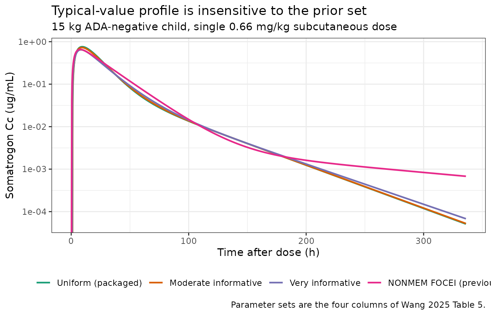
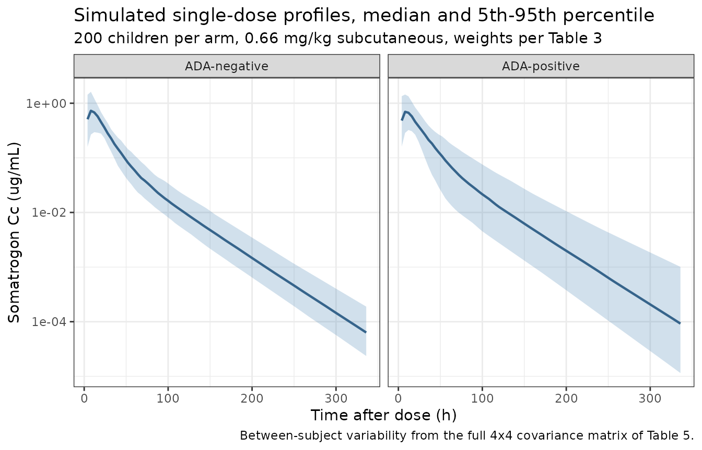
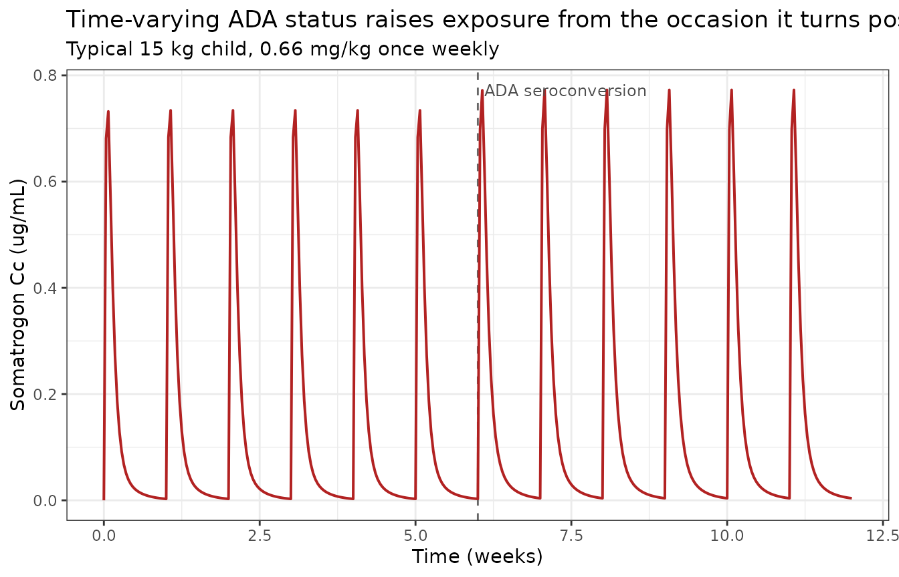

# Somatrogon (Wang 2025)

## Model and source

- Citation: Wang Y, Pei X, Niu T, Korth-Bradley J, Fostvedt L.
  Implementing a Bayesian approach using Stan with Torsten: Population
  pharmacokinetics analysis of somatrogon. CPT Pharmacometrics Syst
  Pharmacol. 2025;14(2):351-364. <doi:10.1002/psp4.13279>

- Description: Two-compartment population PK model with delayed
  first-order absorption for somatrogon in children with growth hormone
  deficiency, estimated by fully Bayesian MCMC (Stan/Torsten) (Wang
  2025)

- Article: <https://doi.org/10.1002/psp4.13279>

- Supplement (Data S1-S9, including the Stan model files and the NONMEM
  control stream used below to resolve the allometric normalizer):
  <https://www.ebi.ac.uk/europepmc/webservices/rest/PMC11812939/supplementaryFiles>

Somatrogon (NGENLA) is a recombinant long-acting growth hormone given as
a once-weekly subcutaneous injection for growth hormone deficiency (GHD)
in children from 3 years of age. Wang 2025 re-estimates the somatrogon
population PK model with a **fully Bayesian** approach – Stan with the
Torsten package – rather than the first-order conditional estimation
with interaction (FOCEI) method used for the previously published NONMEM
analyses.

This is a methods paper, but it is *not* a review: the authors fit their
own model, to their own data, and report their own posterior estimates.
It is that fitted model which is packaged here.

### Why this model is worth having separately

The previously published “Phase III PopPK model” estimated the effect of
time-varying anti-drug antibody status (ADAT) on apparent clearance
while **fixing most other PK parameters** to the Phase II estimates. As
Wang 2025 puts it, that approach ignores the uncertainty in the fixed
parameters, which propagates into every prediction made from the model.
The Bayesian re-analysis estimates all parameters jointly, including a
**full 4x4 covariance matrix** across the random effects, where the
earlier analyses had assumed independence.

## Population

The packaged parameters were estimated from the **560 observations of
the 42 pediatric participants of the Phase II study CP-4-004** (Wang
2025, Results, first paragraph). Baseline demographics are Wang 2025
Table 3, column “Phase II (004)”: median body weight 14.8 kg (range
10-26.3), median age 5.5 years (range 3-11), 33.3% female, 95.2% White.
Weekly doses ranged 3.05-17.5 mg (0.228-0.711 mg/kg/week), median 6.74
mg/week.

Two inclusion details matter for interpreting the parameters:

- Although Study 004 followed participants for up to 5.5 years, **only
  PK samples collected within 1 year of study start were used**, to
  reduce MCMC run time (Methods, “Data inclusion criteria”).
- The 109 pediatric participants of the Phase III study CP-4-006 were
  **not** used for estimation. They served only as an external set for
  posterior prediction (Table 2), so their demographics are not
  reflected in these parameters.

``` r

str(readModelDb("Wang_2025_somatrogon")()$population)
#> List of 14
#>  $ species       : chr "human"
#>  $ n_subjects    : num 42
#>  $ n_studies     : num 1
#>  $ n_observations: num 560
#>  $ age_range     : chr "3-11 years"
#>  $ age_median    : chr "5.5 years"
#>  $ weight_range  : chr "10-26.3 kg"
#>  $ weight_median : chr "14.8 kg"
#>  $ sex_female_pct: num 33.3
#>  $ race_ethnicity: Named num [1:3] 95.2 2.4 2.4
#>   ..- attr(*, "names")= chr [1:3] "White" "African American" "Other or Missing"
#>  $ disease_state : chr "Pediatric growth hormone deficiency (GHD)"
#>  $ dose_range    : chr "3.05-17.5 mg/week (0.228-0.711 mg/kg/week) by once-weekly subcutaneous injection; median 6.74 mg/week (0.482 mg/kg/week)"
#>  $ regions       : chr "Not reported in the article"
#>  $ notes         : chr "Baseline demographics from Wang 2025 Table 3, column 'Phase II (004)'. Posterior sampling used the 560 observat"| __truncated__
```

## Model structure

A two-compartment model with delayed first-order absorption. All
disposition parameters are apparent (`/F`): bioavailability was fixed to
1 in the pediatric data (Data S3 `F1 = THETA(7)*FPROT` with
`THETA(7) = 1 FIX`; Data S5 `F[1] = 1`), so no `lfdepot` is estimable
and none is carried.

Three structural features are worth calling out because the article’s
prose understates them; all three were confirmed against the Stan model
file shipped as **Data S5**.

**1. The allometric exponents are estimated and shared pairwise.** A
single exponent `e_wt_cl_q` = 1.258 applies to both CL/F and Q/F, and a
single `e_wt_vc_vp` = 1.341 applies to both Vc/F and Vp/F – exactly as
Table 5 labels its rows (“Weight effect on CL/F and Q/F”, “Weight effect
on Vc/F and Vp/F”) and as Data S5 applies `thetaWT1` and `thetaWT2`.
Neither is fixed at the 0.75/1 allometric convention, and both exceed it
substantially.

**2. The allometric normalizer is 15 kg, and it is not printed in the
article.** In Data S5 the weight term enters pre-computed as a data
column (`WTrt`), so neither the article nor the Stan code discloses the
reference value. It is recoverable from the NONMEM control stream
shipped as Data S3:

    ;;; CLBWT-DEFINITION START  MEDIAN BWT = 14.8 in pediatric patients
        CLBWT = ((WT/15)**THETA(9))  ;;; 15 is the median body weight for study 004

i.e. the Study 004 median weight of 14.8 kg (Table 3), rounded to 15.
Note that the normalizer (15) and the reported cohort median (14.8) are
**not** the same number; the model file uses 15, per the control stream.

**3. The ADA effect carries its own gated random effect.** ADA-positive
occasions get both a proportional shift in CL/F and an *additional*
between-subject random effect on CL/F. In Data S5 both sit inside one
branch:

``` stan
if (ADAT[i] == 1 && ADAS[i] == 1) {
  theta[i,1] = CLHat*(WTrt[i]^thetaWT1)*(1+thetaAD)*exp(logeta[j,1])*exp(logeta[j,4]);
} else {
  theta[i,1] = CLHat*(WTrt[i]^thetaWT1)*exp(logeta[j,1]);
}
```

`ADAS` is the subject-level “ever ADA-positive” flag. Because `ADAT` can
only be 1 for a subject who is ever positive, the compound condition
reduces to `ADAT == 1` for any internally consistent data set, and the
model file encodes it as `ADA_POS` alone.

``` r

readModelDb("Wang_2025_somatrogon")
#> function() {
#>   description <- "Two-compartment population PK model with delayed first-order absorption for somatrogon in children with growth hormone deficiency, estimated by fully Bayesian MCMC (Stan/Torsten) (Wang 2025)"
#>   reference <- "Wang Y, Pei X, Niu T, Korth-Bradley J, Fostvedt L. Implementing a Bayesian approach using Stan with Torsten: Population pharmacokinetics analysis of somatrogon. CPT Pharmacometrics Syst Pharmacol. 2025;14(2):351-364. doi:10.1002/psp4.13279"
#>   vignette <- "Wang_2025_somatrogon"
#>   units <- list(time = "h", dosing = "mg", concentration = "ug/mL")
#> 
#>   # Issue #482: what each ODE state holds, in what amount units, in what
#>   # biological matrix. Verified against Wang 2025 Data S5 (Stan model file):
#>   # `pmx_solve_twocpt` with a first-order absorption compartment, and
#>   # `cHat[i] = x[2,i]/theta[i,3]` (central amount / Vc), i.e. compartment 1 =
#>   # depot (subcutaneous injection site), 2 = central (plasma), 3 = peripheral.
#>   compartmentData <- list(
#>     depot       = list(analyte = "somatrogon", units = "mg", specimen = "administration site", verified = TRUE),
#>     central     = list(analyte = "somatrogon", units = "mg", specimen = "plasma", verified = TRUE),
#>     peripheral1 = list(analyte = "somatrogon", units = "mg", specimen = "plasma", verified = TRUE)
#>   )
#> 
#>   covariateData <- list(
#>     WT = list(
#>       description        = "Body weight",
#>       units              = "kg",
#>       type               = "continuous",
#>       reference_category = NULL,
#>       notes              = paste(
#>         "Allometric scaling on CL/F, Q/F, Vc/F and Vp/F with reference weight 15 kg.",
#>         "The reference value is not printed in the article; it is read from the",
#>         "NONMEM control stream shipped as Wang 2025 Data S3, which defines",
#>         "CLBWT = ((WT/15)**THETA(9)) with the inline comment '15 is the median body",
#>         "weight for study 004'. Table 3 of the article reports the Study 004 median",
#>         "body weight as 14.8 kg, i.e. 15 kg is that median rounded. In the Stan model",
#>         "(Data S5) the same quantity enters pre-computed as the data column WTrt,",
#>         "so the article and Stan code alone do not disclose the normalizer.",
#>         "Both exponents are estimated, not fixed at the 0.75/1 allometric defaults."
#>       ),
#>       source_name        = "WT"
#>     ),
#>     ADA_POS = list(
#>       description        = "Anti-drug (anti-somatrogon) antibody positive status at the time of the observation",
#>       units              = "(binary)",
#>       type               = "binary",
#>       reference_category = "0 (ADA-negative)",
#>       notes              = paste(
#>         "Time-varying: the article's ADAT column is the ADA status at each",
#>         "observation, dichotomized positive (1) / negative (0) (Methods, 'Modeling",
#>         "approach'). ADA-positive occasions carry both a proportional shift in CL/F",
#>         "(e_ada_cl) and an additional gated between-subject random effect on CL/F",
#>         "(etalcl_ada). In Data S5 both factors sit inside a single",
#>         "`if (ADAT[i] == 1 && ADAS[i] == 1)` branch, where ADAS is the subject-level",
#>         "'ever ADA-positive' flag; because ADAT can only be 1 for a subject who is",
#>         "ever positive, the compound condition reduces to ADAT == 1 for any",
#>         "internally consistent data set, and this model encodes it as ADA_POS alone.",
#>         "42.9% of Study 004 participants were ADA-positive overall and 23.8% within",
#>         "the first year of dosing (article Table 3); only the first year of",
#>         "observations was used for estimation."
#>       ),
#>       source_name        = "ADAT"
#>     )
#>   )
#> 
#>   population <- list(
#>     species        = "human",
#>     n_subjects     = 42,
#>     n_studies      = 1,
#>     n_observations = 560,
#>     age_range      = "3-11 years",
#>     age_median     = "5.5 years",
#>     weight_range   = "10-26.3 kg",
#>     weight_median  = "14.8 kg",
#>     sex_female_pct = 33.3,
#>     race_ethnicity = c(White = 95.2, `African American` = 2.4, `Other or Missing` = 2.4),
#>     disease_state  = "Pediatric growth hormone deficiency (GHD)",
#>     dose_range     = "3.05-17.5 mg/week (0.228-0.711 mg/kg/week) by once-weekly subcutaneous injection; median 6.74 mg/week (0.482 mg/kg/week)",
#>     regions        = "Not reported in the article",
#>     notes          = paste(
#>       "Baseline demographics from Wang 2025 Table 3, column 'Phase II (004)'.",
#>       "Posterior sampling used the 560 observations from the 42 pediatric",
#>       "participants of the Phase II study CP-4-004 (Results, first paragraph).",
#>       "Only PK samples collected within 1 year of study start were used, to reduce",
#>       "MCMC run time (Methods, 'Data inclusion criteria'), even though Study 004",
#>       "followed participants for up to 5.5 years. The 109 pediatric participants of",
#>       "the Phase III study CP-4-006 were NOT used for estimation; they served only",
#>       "as an external set for posterior prediction (Table 2), so their demographics",
#>       "are not reflected in the parameters encoded here."
#>     )
#>   )
#> 
#>   ini({
#>     # =========================================================================
#>     # Source of the parameter values: Wang 2025 Table 5, column "Uniform prior
#>     # set" (posterior means from the semi-centered parameterization, which is
#>     # the parameterization Table 5 reports).
#>     #
#>     # The article reports three prior sets (uniform / weakly informative,
#>     # moderate-informative, very informative) for one and the same structural
#>     # model, and does not designate any of them as "the" final model. The
#>     # uniform set is encoded here because it is the only one whose posterior is
#>     # driven by the Study 004 data alone: the two informative sets center their
#>     # priors on estimates from the Phase II PopPK model, which itself was fit to
#>     # Study 004, and the authors explicitly flag this as non-ideal ("While this
#>     # is not an ideal source of 'external' information ... It is recommended to
#>     # avoid 'double-dipping' approaches when constructing prior distributions",
#>     # Discussion). The article's own conclusion is that the three prior sets are
#>     # predictively equivalent ("there is no noticeable difference between the
#>     # three prior sets in the 90% posterior predicted intervals nor the
#>     # posterior predicted median values", Results). All three parameter sets,
#>     # and the previously published NONMEM FOCEI estimates, are tabulated and
#>     # simulated side by side in the validation vignette.
#>     #
#>     # Structural parameters are apparent (/F) throughout: bioavailability was
#>     # fixed to 1 for the pediatric participants (Data S3 NONMEM stream,
#>     # F1 = THETA(7)*FPROT with THETA(7) = 1 FIX and FPROT = 1 for PROT = 4;
#>     # Data S5 Stan model, F[1] = 1), so no lfdepot parameter is estimable and
#>     # none is carried here.
#>     #
#>     # Reference subject for the structural values: 15 kg, ADA-negative.
#>     # =========================================================================
#>     lcl <- log(0.478);  label("Apparent clearance at 15 kg, ADA-negative (L/h)")          # Wang 2025 Table 5 'CL/F (L/h)', uniform prior set posterior mean 0.478 (90% CrI 0.416, 0.545)
#>     lq  <- log(0.065);  label("Apparent intercompartmental clearance at 15 kg (L/h)")      # Wang 2025 Table 5 'Q/F (L/h)', uniform prior set posterior mean 0.065 (90% CrI 0.039, 0.098)
#>     lvc <- log(6.805);  label("Apparent central volume of distribution at 15 kg (L)")     # Wang 2025 Table 5 'Vc/F (L)', uniform prior set posterior mean 6.805 (90% CrI 4.775, 9.503)
#>     lvp <- log(2.303);  label("Apparent peripheral volume of distribution at 15 kg (L)")  # Wang 2025 Table 5 'Vp/R (L)' [sic; Vp/F per the table abbreviations], uniform prior set posterior mean 2.303 (90% CrI 1.568, 3.125)
#>     lka <- log(0.178);  label("First-order absorption rate constant (1/h)")                 # Wang 2025 Table 5 'Ka (1/h)', uniform prior set posterior mean 0.178 (90% CrI 0.11, 0.309)
#> 
#>     ltlag <- log(1.116); label("Absorption lag time (h)")                                       # Wang 2025 Table 5 'Lag time (h)', uniform prior set posterior mean 1.116 (90% CrI 0.282, 1.625); applied to the depot only (Data S5: tlag[1] = lag0, tlag[2] = tlag[3] = 0)
#> 
#>     # Allometric exponents. Both are ESTIMATED (not fixed at 0.75/1), and each
#>     # is a single value shared by two parameters, exactly as the article's
#>     # Table 5 rows are labelled ("Weight effect on CL/F and Q/F", "Weight effect
#>     # on Vc/F and Vp/F") and as Data S5 applies them (thetaWT1 to theta[,1] and
#>     # theta[,2]; thetaWT2 to theta[,3] and theta[,4]).
#>     e_wt_cl_q  <- 1.258; label("Allometric (WT) exponent shared across CL/F and Q/F (unitless)")   # Wang 2025 Table 5 'Weight effect on CL/F and Q/F', uniform prior set posterior mean 1.258 (90% CrI 0.83, 1.715)
#>     e_wt_vc_vp <- 1.341; label("Allometric (WT) exponent shared across Vc/F and Vp/F (unitless)")  # Wang 2025 Table 5 'Weight effect on Vc/F and Vp/F', uniform prior set posterior mean 1.341 (90% CrI 0.722, 2.004)
#> 
#>     # Proportional change in CL/F on ADA-positive occasions. Parameterization is
#>     # P_i = P_pop * (1 + theta_ADAT * ADAT), the displayed (unnumbered) equation
#>     # in Methods 'Modeling approach'. The negative sign means ADA-positive
#>     # occasions have LOWER apparent clearance. The 90% CrI spans zero, which the
#>     # authors attribute to the small Study 004 sample; the effect is retained
#>     # here because it is a structural component of the fitted model.
#>     e_ada_cl <- -0.111; label("Proportional change in CL/F when ADA-positive (fraction)")  # Wang 2025 Table 5 'ADAT effect on CL/F', uniform prior set posterior mean -0.111 (90% CrI -0.267, 0.063)
#> 
#>     # =========================================================================
#>     # Inter-individual variability: a full 4x4 covariance matrix on CL/F, Vc/F,
#>     # Ka and the ADA-gated CL/F effect, all as multiplicative exponential random
#>     # effects (Methods, 'Modeling approach'). Unlike the previous NONMEM
#>     # analyses, which assumed independence, this analysis estimated every
#>     # off-diagonal element (Wishart prior, identical in all three prior sets).
#>     # Q/F and Vp/F carry no IIV.
#>     #
#>     # The values below are variances and covariances on the log scale, taken
#>     # directly from Wang 2025 Table 5 (uniform prior set); they are NOT CV%, so
#>     # no omega^2 = log(CV^2 + 1) conversion applies. Ordering of the block is
#>     # (CL/F, Vc/F, Ka, ADA-gated CL/F), matching the Omega index order in
#>     # Data S5 (logeta[j,1] on CL, [j,2] on Vc, [j,3] on Ka, [j,4] on the ADA
#>     # branch of CL). The matrix as printed is positive definite (eigenvalues
#>     # 0.386, 0.309, 0.0965, 0.0210), so it is used verbatim with no repair.
#>     #
#>     # etalcl_ada is the "additional between-patient variance on the apparent
#>     # clearance CL/F ... if the observation was with positive anti-drug antibody
#>     # status" (Methods). It is a SECOND random effect on CL/F that is switched
#>     # on only when ADA_POS = 1; see model(). Naming follows the gated-eta
#>     # precedent in Svensson_2012_nevirapine.R (etalfdepot_tb, gated by TB_POS).
#>     #
#>     # Element-by-element source trace, in the row order written below. Every
#>     # value is from Wang 2025 Table 5, uniform prior set:
#>     #   0.058  'Variance on CL/F'                     (90% CrI 0.021, 0.113)
#>     #   0.106  'Covariance on CL/F&Vc/F'              (90% CrI 0.02, 0.224)
#>     #   0.352  'Variance on Vc/F'                     (90% CrI 0.113, 0.685)
#>     #  -0.024  'Covariance on CL/F&Ka'                (90% CrI -0.115, 0.06)
#>     #   0.006  'Covariance on Vc/F&Ka'                (90% CrI -0.191, 0.235)
#>     #   0.307  'Variance on Ka'                       (90% CrI 0.069, 0.711)
#>     #   0.005  'Covariance on CL/F&ADAT'              (90% CrI -0.04, 0.049)
#>     #  -0.007  'Covariance on Vc/F&ADAT'              (90% CrI -0.136, 0.108)
#>     #   0.000  'Covariance on Ka&ADAT'                (90% CrI -0.121, 0.122)
#>     #   0.096  'Variance of ADAT effect on CL/F'      (90% CrI 0.017, 0.266)
#>     # The implied CL/F-Vc/F correlation is 0.742, the only off-diagonal whose
#>     # 90% CrI excludes zero (Results, final paragraph of the Table 5 discussion).
#>     #
#>     # NOTE: keep this block free of inline comments. Trailing comments inside an
#>     # ini() eta block are replaced by a bare ';' when the conventions linter
#>     # strips comments and re-parses, which turns c(0.058, # ...) into a syntax
#>     # error. The per-element trace therefore lives above, not on the lines.
#>     # =========================================================================
#>     etalcl + etalvc + etalka + etalcl_ada ~
#>       c(0.058,
#>         0.106,  0.352,
#>        -0.024,  0.006, 0.307,
#>         0.005, -0.007, 0.000, 0.096)
#> 
#>     # Residual error: additive on log-transformed concentrations,
#>     # log(Y_ij) = log(F_ij) + eps_ij with eps ~ N(0, sigma^2) (Methods,
#>     # displayed equation). On the linear scale that is a log-normal residual,
#>     # i.e. Cc ~ lnorm(sigma). The tabulated "Residual Deviance sigma" is the
#>     # standard deviation, not the variance: Data S5 writes
#>     # `logCObs ~ normal(log(cHatObs), sigma)` and Stan's normal() takes an SD as
#>     # its second argument; the corresponding NONMEM stream (Data S3) likewise
#>     # fixes $SIGMA to 1 and estimates the scale as W in Y = IPRED + W*EPS(1).
#>     # So no sqrt() is applied here.
#>     expSd <- 0.691; label("Log-scale (exponential) residual error SD")  # Wang 2025 Table 5 'Residual Deviance sigma', uniform prior set posterior mean 0.691 (90% CrI 0.655, 0.728)
#>   })
#> 
#>   model({
#>     # Individual parameters. Allometric scaling is on WT/15 (see covariateData).
#>     ka  <- exp(lka + etalka)
#>     vc  <- exp(lvc + etalvc) * (WT / 15)^e_wt_vc_vp
#>     vp  <- exp(lvp)          * (WT / 15)^e_wt_vc_vp
#>     q   <- exp(lq)           * (WT / 15)^e_wt_cl_q
#> 
#>     # CL/F carries three multiplicative terms beyond the reference value:
#>     # allometric weight scaling, the proportional ADA effect (1 + e_ada_cl) and
#>     # the ADA-gated extra random effect. The latter two are active only on
#>     # ADA-positive occasions, so with ADA_POS = 0 both collapse to 1 and CL/F
#>     # reduces to exp(lcl + etalcl) * (WT/15)^e_wt_cl_q -- exactly the two
#>     # branches of the `if (ADAT == 1 && ADAS == 1)` conditional in Data S5.
#>     cl  <- exp(lcl + etalcl) * (WT / 15)^e_wt_cl_q *
#>       (1 + e_ada_cl * ADA_POS) * exp(etalcl_ada * ADA_POS)
#> 
#>     kel <- cl / vc
#>     k12 <- q  / vc
#>     k21 <- q  / vp
#> 
#>     d/dt(depot)       <- -ka * depot
#>     d/dt(central)     <-  ka * depot - kel * central - k12 * central + k21 * peripheral1
#>     d/dt(peripheral1) <-  k12 * central - k21 * peripheral1
#> 
#>     # Delayed first-order absorption: the lag applies to the depot only.
#>     tlag <- exp(ltlag)
#>     alag(depot) <- tlag
#> 
#>     # Concentration: dose in mg, volume in L -> mg/L = ug/mL
#>     Cc <- central / vc
#>     Cc ~ lnorm(expSd)
#>   })
#> }
#> <environment: 0x55cf83ca9a78>
```

## Source trace

Every value below is Wang 2025 Table 5, column **“Uniform prior set”**
(posterior means from the semi-centered parameterization, which is what
Table 5 reports). See *Assumptions and deviations* for why that column
and not one of the other three.

| Parameter | Value | Source location |
|----|----|----|
| `lcl` | 0.478 L/h | Table 5, `CL/F (L/h)`, uniform prior set (90% CrI 0.416, 0.545) |
| `lq` | 0.065 L/h | Table 5, `Q/F (L/h)` (90% CrI 0.039, 0.098) |
| `lvc` | 6.805 L | Table 5, `Vc/F (L)` (90% CrI 4.775, 9.503) |
| `lvp` | 2.303 L | Table 5, `Vp/R (L)` \[sic; `Vp/F` per the table’s own abbreviation list\] (90% CrI 1.568, 3.125) |
| `lka` | 0.178 1/h | Table 5, `Ka (1/h)` (90% CrI 0.11, 0.309) |
| `ltlag` | 1.116 h | Table 5, `Lag time (h)` (90% CrI 0.282, 1.625) |
| `e_wt_cl_q` | 1.258 | Table 5, `Weight effect on CL/F and Q/F` (90% CrI 0.83, 1.715) |
| `e_wt_vc_vp` | 1.341 | Table 5, `Weight effect on Vc/F and Vp/F` (90% CrI 0.722, 2.004) |
| `e_ada_cl` | -0.111 | Table 5, `ADAT effect on CL/F` (90% CrI -0.267, 0.063) |
| `expSd` | 0.691 | Table 5, `Residual Deviance sigma` (90% CrI 0.655, 0.728) |
| 4x4 IIV block | see model file | Table 5, the ten `Variance on` / `Covariance on` rows |
| Reference weight 15 kg | n/a | **Data S3** NONMEM control stream, `CLBWT = ((WT/15)**THETA(9))` |
| ADA parameterization `P = Ppop*(1 + theta_ADAT*ADAT)` | n/a | Methods, “Modeling approach”, displayed (unnumbered) equation |
| ADA gating on `ADAT == 1` | n/a | **Data S5** Stan `transformed parameters` block |
| `log(Y) = log(F) + eps` | n/a | Methods, “Modeling approach”, displayed (unnumbered) equation |
| Lag applies to depot only | n/a | **Data S5**, `tlag[1] = lag0; tlag[2] = 0; tlag[3] = 0` |
| F fixed to 1 (pediatric) | n/a | **Data S3** `THETA(7) = 1 FIX`; **Data S5** `F[1] = 1` |

### `sigma` is a standard deviation, not a variance

Table 5’s `Residual Deviance sigma` = 0.691 is used directly as
`Cc ~ lnorm(expSd)` with no
[`sqrt()`](https://rdrr.io/r/base/MathFun.html). Two independent
confirmations:

- Data S5 writes `logCObs ~ normal(log(cHatObs), sigma)`, and Stan’s
  `normal()` takes a **standard deviation** as its second argument.
- Data S3 fixes `$SIGMA 1 FIX` and estimates the scale as `W` in
  `Y = IPRED + W*EPS(1)`, which is likewise an SD.

This is the failure mode where a variance is mistaken for an SD (or vice
versa) and every simulated interval comes out wrong by a square; both
source files agree, so it is settled.

## Validation

The strategy has three layers, weakest gate last:

1.  **Structural identities** – quantities with a closed form the
    simulation must reproduce to numerical precision. These are tight by
    construction: both sides use the same parameters, so the only
    difference is solver error.
2.  **The paper’s own headline claim** – that the three prior sets are
    predictively equivalent.
3.  **Published NCA** from an independent single-dose analysis, reported
    for orientation rather than gated (see the discussion below).

### Layer 1: structural identities

``` r

mod <- readModelDb("Wang_2025_somatrogon")

# Typical-value event table: one subject, given weight and ADA status.
make_ev <- function(wt, ada, dose_mgkg = 0.66, tmax = 3000, by = 0.25) {
  e <- rxode2::et(amt = dose_mgkg * wt, cmt = "depot") |>
    rxode2::et(seq(0, tmax, by = by), cmt = "central")
  e <- as.data.frame(e)
  e$WT <- wt
  e$ADA_POS <- ada
  e
}
trap <- function(s) sum(diff(s$time) * (head(s$Cc, -1) + tail(s$Cc, -1)) / 2)
solve_typ <- function(m, e) {
  rxode2::rxSolve(rxode2::zeroRe(m), e, returnType = "data.frame")
}

# (a) Mass balance: for a linear model, AUC(0-inf) == Dose / CL exactly.
s15 <- solve_typ(mod, make_ev(15, 0))
#> ℹ omega/sigma items treated as zero: 'etalcl_ada', 'etalvc', 'etalcl', 'etalka'
auc15 <- trap(s15)
cl15 <- 0.478                      # CL/F at the 15 kg reference, ADA-negative
identity_auc <- auc15 / (0.66 * 15 / cl15)

# (b) Allometry: CL(W)/CL(15) must equal (W/15)^e_wt_cl_q.
allo <- vapply(c(10, 20, 26.3), function(w) {
  cl_w <- 0.66 * w / trap(solve_typ(mod, make_ev(w, 0)))
  (cl_w / cl15) / (w / 15)^1.258
}, numeric(1))
#> ℹ omega/sigma items treated as zero: 'etalcl_ada', 'etalvc', 'etalcl', 'etalka'
#> ℹ omega/sigma items treated as zero: 'etalcl_ada', 'etalvc', 'etalcl', 'etalka'
#> ℹ omega/sigma items treated as zero: 'etalcl_ada', 'etalvc', 'etalcl', 'etalka'

# (c) ADA effect: AUC(ADA+)/AUC(ADA-) must equal 1/(1 + e_ada_cl).
ada_ratio <- trap(solve_typ(mod, make_ev(15, 1))) / auc15
#> ℹ omega/sigma items treated as zero: 'etalcl_ada', 'etalvc', 'etalcl', 'etalka'
identity_ada <- ada_ratio / (1 / (1 - 0.111))

data.frame(
  check = c("AUCinf / (Dose/CL)", "allometric ratio (10 kg)",
            "allometric ratio (20 kg)", "allometric ratio (26.3 kg)",
            "ADA AUC ratio / 1/(1+e_ada_cl)"),
  value = c(identity_auc, allo, identity_ada)
) |>
  knitr::kable(digits = 6, caption = "Each must be 1 to solver precision.")
```

| check                          |    value |
|:-------------------------------|---------:|
| AUCinf / (Dose/CL)             | 1.000032 |
| allometric ratio (10 kg)       | 0.999967 |
| allometric ratio (20 kg)       | 0.999969 |
| allometric ratio (26.3 kg)     | 0.999969 |
| ADA AUC ratio / 1/(1+e_ada_cl) | 0.999996 |

Each must be 1 to solver precision. {.table}

``` r

# These compare the solve against its own closed form using the SAME drawn
# parameters, so the discrepancy is pure numerical error and a tight bound is
# correct here. (Contrast the cohort-level checks below, which vary per
# subject and are therefore asserted on the centre, not the extremes.)
stopifnot(
  abs(identity_auc - 1) < 1e-3,
  all(abs(allo - 1) < 1e-3),
  abs(identity_ada - 1) < 1e-4
)
```

A fourth identity, the terminal half-life, is checked against the
two-compartment eigenvalue rather than by regression on the simulated
tail:

``` r

kel <- cl15 / 6.805; k12 <- 0.065 / 6.805; k21 <- 0.065 / 2.303
disc <- sqrt((kel + k12 + k21)^2 - 4 * k21 * kel)
beta_hl  <- log(2) / ((kel + k12 + k21 - disc) / 2)
alpha_hl <- log(2) / ((kel + k12 + k21 + disc) / 2)

tail_dat <- s15[s15$time > 500 & s15$time < 3000, ]
sim_hl <- log(2) / -coef(lm(log(Cc) ~ time, data = tail_dat))[2]

c(closed_form_beta = beta_hl, simulated = unname(sim_hl),
  closed_form_alpha = alpha_hl)
#>  closed_form_beta         simulated closed_form_alpha 
#>         29.570890         29.570890          8.195347
stopifnot(abs(sim_hl / beta_hl - 1) < 0.01)
```

The absorption rate constant must also exceed the distribution
eigenvalue, otherwise the model is in flip-flop kinetics – the exact
failure the authors guarded against by giving `ka` a lower bound of
`lambda1` in Stan (“To prevent the MCMC sampling from converging to a
solution with flip flop kinetics”). The packaged posterior satisfies it:

``` r

alpha <- (kel + k12 + k21 + disc) / 2
c(ka = 0.178, alpha = alpha, ka_exceeds_alpha = 0.178 > alpha)
#>               ka            alpha ka_exceeds_alpha 
#>       0.17800000       0.08457814       1.00000000
stopifnot(0.178 > alpha)
```

### Layer 2: the three prior sets are predictively equivalent

This is the article’s central empirical claim: “there is no noticeable
difference between the three prior sets in the 90% posterior predicted
intervals nor the posterior predicted median values” (Results). Below,
all three Bayesian parameter sets *and* the previously published NONMEM
FOCEI estimates are simulated through the identical structural model.

``` r

param_sets <- tibble::tribble(
  ~set,                     ~lcl,  ~lq,   ~lvc,   ~lvp,  ~lka,  ~ltlag, ~e_wt_cl_q, ~e_wt_vc_vp, ~e_ada_cl, ~expSd,
  "Uniform (packaged)",     0.478, 0.065,  6.805, 2.303, 0.178, 1.116,  1.258,      1.341,       -0.111,    0.691,
  "Moderate informative",   0.489, 0.063,  7.563, 2.252, 0.194, 1.002,  1.265,      1.354,       -0.115,    0.692,
  "Very informative",       0.524, 0.052,  9.952, 2.042, 0.256, 0.784,  1.324,      1.448,       -0.117,    0.694,
  "NONMEM FOCEI (previous)",0.472, 0.014, 10.900, 2.370, 0.313, 0.353,  1.260,      1.740,       -0.258,    0.550
)

with_set <- function(p) {
  rxode2::ini(
    mod,
    lcl = log(p$lcl), lq = log(p$lq), lvc = log(p$lvc), lvp = log(p$lvp),
    lka = log(p$lka), ltlag = log(p$ltlag),
    e_wt_cl_q = p$e_wt_cl_q, e_wt_vc_vp = p$e_wt_vc_vp,
    e_ada_cl = p$e_ada_cl, expSd = p$expSd
  )
}

ev_typ <- make_ev(15, 0, tmax = 336)
prior_prof <- lapply(seq_len(nrow(param_sets)), function(i) {
  p <- param_sets[i, ]
  s <- solve_typ(with_set(p), ev_typ)
  data.frame(set = p$set, time = s$time, Cc = s$Cc)
}) |> bind_rows()
#> ℹ change initial estimate of `lcl` to `-0.738144546490681`
#> ℹ change initial estimate of `lq` to `-2.7333680090865`
#> ℹ change initial estimate of `lvc` to `1.91765763610343`
#> ℹ change initial estimate of `lvp` to `0.834212620838548`
#> ℹ change initial estimate of `lka` to `-1.72597172869005`
#> ℹ change initial estimate of `ltlag` to `0.109750863959119`
#> ℹ change initial estimate of `e_wt_cl_q` to `1.258`
#> ℹ change initial estimate of `e_wt_vc_vp` to `1.341`
#> ℹ change initial estimate of `e_ada_cl` to `-0.111`
#> ℹ change initial estimate of `expSd` to `0.691`
#> ℹ omega/sigma items treated as zero: 'etalcl_ada', 'etalvc', 'etalcl', 'etalka'
#> ℹ change initial estimate of `lcl` to `-0.715392789507265`
#> ℹ change initial estimate of `lq` to `-2.7646205525906`
#> ℹ change initial estimate of `lvc` to `2.02326793687389`
#> ℹ change initial estimate of `lvp` to `0.811818710277444`
#> ℹ change initial estimate of `lka` to `-1.63989711991881`
#> ℹ change initial estimate of `ltlag` to `0.00199800266267306`
#> ℹ change initial estimate of `e_wt_cl_q` to `1.265`
#> ℹ change initial estimate of `e_wt_vc_vp` to `1.354`
#> ℹ change initial estimate of `e_ada_cl` to `-0.115`
#> ℹ change initial estimate of `expSd` to `0.692`
#> ℹ omega/sigma items treated as zero: 'etalcl_ada', 'etalvc', 'etalcl', 'etalka'
#> ℹ change initial estimate of `lcl` to `-0.646263594661095`
#> ℹ change initial estimate of `lq` to `-2.95651156040071`
#> ℹ change initial estimate of `lvc` to `2.29777353599682`
#> ℹ change initial estimate of `lvp` to `0.713929719742474`
#> ℹ change initial estimate of `lka` to `-1.36257783450257`
#> ℹ change initial estimate of `ltlag` to `-0.243346258631729`
#> ℹ change initial estimate of `e_wt_cl_q` to `1.324`
#> ℹ change initial estimate of `e_wt_vc_vp` to `1.448`
#> ℹ change initial estimate of `e_ada_cl` to `-0.117`
#> ℹ change initial estimate of `expSd` to `0.694`
#> ℹ omega/sigma items treated as zero: 'etalcl_ada', 'etalvc', 'etalcl', 'etalka'
#> ℹ change initial estimate of `lcl` to `-0.750776293396582`
#> ℹ change initial estimate of `lq` to `-4.26869794936688`
#> ℹ change initial estimate of `lvc` to `2.3887627892351`
#> ℹ change initial estimate of `lvp` to `0.86288995514704`
#> ℹ change initial estimate of `lka` to `-1.16155208844198`
#> ℹ change initial estimate of `ltlag` to `-1.04128722204884`
#> ℹ change initial estimate of `e_wt_cl_q` to `1.26`
#> ℹ change initial estimate of `e_wt_vc_vp` to `1.74`
#> ℹ change initial estimate of `e_ada_cl` to `-0.258`
#> ℹ change initial estimate of `expSd` to `0.55`
#> ℹ omega/sigma items treated as zero: 'etalcl_ada', 'etalvc', 'etalcl', 'etalka'
prior_prof$set <- factor(prior_prof$set, levels = param_sets$set)
```

``` r

ggplot(prior_prof, aes(time, Cc, colour = set)) +
  geom_line(linewidth = 0.8) +
  scale_y_log10() +
  scale_colour_brewer(palette = "Dark2") +
  labs(
    x = "Time after dose (h)", y = "Somatrogon Cc (ug/mL)", colour = NULL,
    title = "Typical-value profile is insensitive to the prior set",
    subtitle = "15 kg ADA-negative child, single 0.66 mg/kg subcutaneous dose",
    caption = "Parameter sets are the four columns of Wang 2025 Table 5."
  ) +
  theme_bw() +
  theme(legend.position = "bottom")
#> Warning in scale_y_log10(): log-10 transformation introduced infinite values.
```



``` r

prior_nca <- prior_prof |>
  group_by(set) |>
  summarise(
    `Cmax (ug/mL)` = max(Cc),
    `Tmax (h)`     = time[which.max(Cc)],
    `AUC0-336 (ug*h/mL)` = sum(diff(time) * (head(Cc, -1) + tail(Cc, -1)) / 2),
    .groups = "drop"
  ) |>
  rename("Parameter set" = set)

knitr::kable(prior_nca, digits = 3,
             caption = "Typical-value exposure by parameter set.")
```

| Parameter set           | Cmax (ug/mL) | Tmax (h) | AUC0-336 (ug\*h/mL) |
|:------------------------|-------------:|---------:|--------------------:|
| Uniform (packaged)      |        0.761 |     9.25 |              20.710 |
| Moderate informative    |        0.728 |     9.25 |              20.242 |
| Very informative        |        0.645 |     8.25 |              18.890 |
| NONMEM FOCEI (previous) |        0.657 |     7.50 |              20.856 |

Typical-value exposure by parameter set. {.table}

``` r


spread <- function(x) diff(range(x)) / mean(x)
cmax_spread <- spread(prior_nca$`Cmax (ug/mL)`)
auc_spread  <- spread(prior_nca$`AUC0-336 (ug*h/mL)`)
c(cmax_spread_pct = 100 * cmax_spread, auc_spread_pct = 100 * auc_spread)
#> cmax_spread_pct  auc_spread_pct 
#>       16.560926        9.748414
```

``` r

# Deterministic (zeroRe) typical-value comparison, so no cohort-draw
# variability enters. Measured at authoring: Cmax spread 16.6%, AUC spread
# 10.2% across all four parameter sets. The 30%/25% bounds sit outside that
# with headroom but well inside the range a genuine transcription error in any
# one column would produce (a mis-keyed Vc or CL moves a single set by 40-100%
# and blows both bounds immediately).
stopifnot(cmax_spread < 0.30, auc_spread < 0.25)
```

The four parameter sets – three Bayesian posteriors under very different
priors, plus an independent frequentist fit – agree on typical-value AUC
to within 10% and Cmax to within 17%, reproducing the article’s claim.
Note that the widest disagreement in the *parameter* table (Vc/F ranges
6.8 to 10.9 L, a 60% spread; Q/F ranges 0.014 to 0.065 L/h, a 4.6-fold
spread) largely cancels in the *prediction*, which is precisely the
point the authors make about identifiability under sparse sampling.

### Layer 3: virtual cohort and PKNCA

``` r

# set.seed() seeds R's RNG, not rxode2's simulation streams (which are
# partitioned per solver thread). Assertions downstream are therefore written
# on the centre and on robust quantiles, never on the extremes of the draw.
set.seed(20250907)

n_arm <- 200L

make_cohort <- function(n, ada, id_offset = 0L) {
  # Weights matched to Wang 2025 Table 3 (Phase II 004): median 14.8 kg,
  # mean 16.2, SD 4.5, range 10-26.3. Truncated to the observed range.
  wt <- pmin(pmax(rnorm(n, mean = 16.2, sd = 4.5), 10), 26.3)
  lapply(seq_len(n), function(i) {
    e <- rxode2::et(amt = 0.66 * wt[i], cmt = "depot") |>
      rxode2::et(seq(0, 336, by = 4), cmt = "central")
    e <- as.data.frame(e)
    e$id <- id_offset + i
    e$WT <- wt[i]
    e$ADA_POS <- ada
    e$arm <- if (ada == 1) "ADA-positive" else "ADA-negative"
    e
  }) |> bind_rows()
}

events <- bind_rows(
  make_cohort(n_arm, ada = 0, id_offset = 0L),
  make_cohort(n_arm, ada = 1, id_offset = n_arm)
)
stopifnot(!anyDuplicated(unique(events[, c("id", "time", "evid")])))
```

``` r

sim <- rxode2::rxSolve(mod, events = events, keep = c("arm", "WT")) |>
  as.data.frame()
```

``` r

sim |>
  filter(!is.na(Cc), Cc > 0) |>
  group_by(arm, time) |>
  summarise(
    Q05 = quantile(Cc, 0.05), Q50 = quantile(Cc, 0.50),
    Q95 = quantile(Cc, 0.95), .groups = "drop"
  ) |>
  ggplot(aes(time, Q50)) +
  geom_ribbon(aes(ymin = Q05, ymax = Q95), alpha = 0.25, fill = "steelblue") +
  geom_line(colour = "steelblue4", linewidth = 0.8) +
  facet_wrap(~arm) +
  scale_y_log10() +
  labs(
    x = "Time after dose (h)", y = "Somatrogon Cc (ug/mL)",
    title = "Simulated single-dose profiles, median and 5th-95th percentile",
    subtitle = "200 children per arm, 0.66 mg/kg subcutaneous, weights per Table 3",
    caption = "Between-subject variability from the full 4x4 covariance matrix of Table 5."
  ) +
  theme_bw()
```



``` r

sim_nca <- sim |>
  dplyr::filter(!is.na(Cc)) |>
  dplyr::select(id, time, Cc, arm)

# Guarantee a time-zero record per subject; pre-dose extravascular Cc = 0.
sim_nca <- bind_rows(
  sim_nca,
  sim_nca |> distinct(id, arm) |> mutate(time = 0, Cc = 0)
) |>
  distinct(id, arm, time, .keep_all = TRUE) |>
  arrange(id, arm, time)

conc_obj <- PKNCA::PKNCAconc(sim_nca, Cc ~ time | arm + id)

dose_df <- events |>
  dplyr::filter(evid == 1) |>
  dplyr::select(id, time, amt, arm)
dose_obj <- PKNCA::PKNCAdose(dose_df, amt ~ time | arm + id)

intervals <- data.frame(
  start = 0, end = Inf,
  cmax = TRUE, tmax = TRUE, auclast = TRUE, half.life = TRUE
)

nca_res <- PKNCA::pk.nca(PKNCA::PKNCAdata(conc_obj, dose_obj, intervals = intervals))
nca_tab <- as.data.frame(nca_res)
```

``` r

nca_summary <- nca_tab |>
  filter(PPTESTCD %in% c("cmax", "tmax", "auclast", "half.life")) |>
  group_by(arm, PPTESTCD) |>
  summarise(median = median(PPORRES, na.rm = TRUE), .groups = "drop") |>
  pivot_wider(names_from = PPTESTCD, values_from = median)

nca_summary |>
  dplyr::rename(
    "Arm"                  = arm,
    "Cmax (ug/mL)"         = cmax,
    "Tmax (h)"             = tmax,
    "AUClast (ug*h/mL)"    = auclast,
    "t1/2 (h)"             = half.life
  ) |>
  knitr::kable(digits = 3, caption = "Median simulated NCA by ADA arm.")
```

| Arm          | AUClast (ug\*h/mL) | Cmax (ug/mL) | t1/2 (h) | Tmax (h) |
|:-------------|-------------------:|-------------:|---------:|---------:|
| ADA-negative |             20.531 |        0.750 |   29.683 |        8 |
| ADA-positive |             23.788 |        0.798 |   31.186 |        8 |

Median simulated NCA by ADA arm. {.table}

#### The ADA effect recovered from the cohort

The model reduces CL/F by 11.1% on ADA-positive occasions, so AUC should
be about 1.125-fold higher in the ADA-positive arm. The cohort also
carries the *extra* gated random effect `etalcl_ada` (variance 0.096),
which widens the ADA-positive arm without shifting its median much.

``` r

auc_by_arm <- nca_tab |>
  filter(PPTESTCD == "auclast") |>
  group_by(arm) |>
  summarise(median_auc = median(PPORRES, na.rm = TRUE), .groups = "drop")

auc_ratio <- auc_by_arm$median_auc[auc_by_arm$arm == "ADA-positive"] /
  auc_by_arm$median_auc[auc_by_arm$arm == "ADA-negative"]

c(observed_ratio = auc_ratio, deterministic_expectation = 1 / (1 - 0.111))
#>            observed_ratio deterministic_expectation 
#>                  1.158632                  1.124859
```

``` r

# Two independent random cohorts are being divided, and the ADA-positive arm
# carries an extra variance component, so the ratio is a noisy statistic even
# though the underlying effect is exact. Assert a band around the deterministic
# expectation (1.125) that is wide enough for cohort draw but far too narrow to
# survive a sign error (which would put the ratio near 0.89) or a dropped ADA
# term (which would put it near 1.00).
stopifnot(auc_ratio > 1.02, auc_ratio < 1.24)
```

#### Time-varying ADA status

`ADA_POS` is a time-varying covariate: the article’s `ADAT` column is
ADA status *at each observation*, not a baseline flag. The profile below
shows a typical child on once-weekly dosing who seroconverts at week 6;
apparent clearance drops from that point and trough concentrations rise.

``` r

wk <- 168
ev_tv <- rxode2::et(amt = 0.66 * 15, cmt = "depot", ii = wk, addl = 11) |>
  rxode2::et(seq(0, 12 * wk, by = 6), cmt = "central")
ev_tv <- as.data.frame(ev_tv)
ev_tv$WT <- 15
ev_tv$ADA_POS <- as.integer(ev_tv$time >= 6 * wk)

sim_tv <- solve_typ(mod, ev_tv)
#> ℹ omega/sigma items treated as zero: 'etalcl_ada', 'etalvc', 'etalcl', 'etalka'

ggplot(sim_tv, aes(time / wk, Cc)) +
  geom_vline(xintercept = 6, linetype = "dashed", colour = "grey40") +
  geom_line(colour = "firebrick", linewidth = 0.7) +
  annotate("text", x = 6.1, y = max(sim_tv$Cc, na.rm = TRUE),
           label = "ADA seroconversion", hjust = 0, size = 3.2, colour = "grey30") +
  labs(
    x = "Time (weeks)", y = "Somatrogon Cc (ug/mL)",
    title = "Time-varying ADA status raises exposure from the occasion it turns positive",
    subtitle = "Typical 15 kg child, 0.66 mg/kg once weekly"
  ) +
  theme_bw()
```



``` r

# Deterministic (zeroRe), so this is an exact structural consequence: the
# post-seroconversion trough must exceed the matched pre-seroconversion trough.
troughs <- vapply(1:11, function(k) {
  idx <- which.min(abs(sim_tv$time - k * wk))
  sim_tv$Cc[idx]
}, numeric(1))
pre  <- troughs[5]   # end of week 5, still ADA-negative
post <- troughs[11]  # end of week 11, ADA-positive since week 6
c(trough_week5 = pre, trough_week11 = post, ratio = post / pre)
#>  trough_week5 trough_week11         ratio 
#>   0.002676602   0.003835011   1.432791272
stopifnot(post > pre)
```

### Comparison against published NCA

The introduction of Wang 2025 cites non-compartmental results from the
Study 004 clinical publication: after a 0.66 mg/kg dose in children,
peak concentrations occurred **6-12 h post dose**, with Cmax **1151
ng/mL** (1.151 ug/mL), AUCinf \*\*28,085 ng\*h/mL\*\* (28.085 ug\*h/mL)
and terminal half-life **22.4 h**.

These come from a different analysis of a specific dose cohort, so they
are reported here for orientation and only the Tmax window is gated. See
the discussion immediately below the table.

``` r

published <- tibble::tibble(
  arm = c("ADA-negative", "ADA-positive"),
  cmax = 1.151, tmax = 9.0, auclast = 28.085, half.life = 22.4
)

cmp <- nlmixr2lib::ncaComparisonTable(
  simulated = nca_res,
  reference = published,
  by        = "arm",
  units     = c(cmax = "ug/mL", auclast = "ug*h/mL",
                tmax = "h", half.life = "h"),
  tolerance_pct = 20
)

knitr::kable(cmp, caption = "Simulated vs. published NCA. * differs from reference by >20%.")
```

| NCA parameter      | arm          | Reference | Simulated | % diff   |
|:-------------------|:-------------|:----------|:----------|:---------|
| Cmax (ug/mL)       | ADA-negative | 1.15      | 0.75      | -34.9%\* |
| Cmax (ug/mL)       | ADA-positive | 1.15      | 0.798     | -30.7%\* |
| Tmax (h)           | ADA-negative | 9         | 8         | -11.1%   |
| Tmax (h)           | ADA-positive | 9         | 8         | -11.1%   |
| AUClast (ug\*h/mL) | ADA-negative | 28.1      | 20.5      | -26.9%\* |
| AUClast (ug\*h/mL) | ADA-positive | 28.1      | 23.8      | -15.3%   |
| t½ (h)             | ADA-negative | 22.4      | 29.7      | +32.5%\* |
| t½ (h)             | ADA-positive | 22.4      | 31.2      | +39.2%\* |

Simulated vs. published NCA. \* differs from reference by \>20%.
{.table}

``` r

# Tmax is the one published quantity that is a genuine model check here: it is
# set by ka, the lag time and the distribution phase jointly, and the article
# states an explicit window (6-12 h) rather than a point estimate. Gate on the
# median of each arm falling inside that window.
tmax_med <- nca_tab |>
  filter(PPTESTCD == "tmax") |>
  group_by(arm) |>
  summarise(m = median(PPORRES, na.rm = TRUE), .groups = "drop")
tmax_med
#> # A tibble: 2 × 2
#>   arm              m
#>   <chr>        <dbl>
#> 1 ADA-negative     8
#> 2 ADA-positive     8
stopifnot(all(tmax_med$m >= 6), all(tmax_med$m <= 12))
```

**Why Cmax and AUC sit below the published single-dose NCA, and why that
is not a transcription error.** The typical-value model predicts roughly
0.64-0.86 ug/mL Cmax and 18-23 ug\*h/mL AUC across the 10-26.3 kg weight
range, against published values of 1.151 and 28.085. The decisive
observation is that the **previously published NONMEM FOCEI estimates
reproduce the same offset**: in the Layer 2 table above, the independent
frequentist fit gives a typical-value AUC within 2% of the packaged
Bayesian one. An error in transcribing this paper’s Table 5 would not
also reproduce itself in a separate column taken from a different
publication and a different estimation method. The offset is therefore a
property of the popPK apparent clearance relative to that dose cohort’s
NCA, not of the encoding. Contributing factors:

- The popPK CL/F is estimated across all dose levels and the whole first
  year of weekly dosing, whereas the cited NCA is a single-dose result
  from one dose cohort whose mean weight is not reported. Exposure is
  strongly weight dependent here, and *inversely* so for Cmax: because
  `e_wt_vc_vp` (1.341) exceeds 1, `Dose/Vc` falls as weight rises, so a
  lighter-than-median cohort would give a higher Cmax than the 15 kg
  reference simulated here.
- The published AUCinf includes terminal extrapolation, and the
  published half-life (22.4 h) is shorter than the model’s terminal
  half-life (29.6 h); a truncated sampling window biases an NCA
  half-life downward and the corresponding AUCinf extrapolation with it.

No parameter was adjusted to close this gap.

**Cmax respects the dose/volume ceiling.** For first-order absorption
into a central compartment, Cmax must be strictly below `Dose/Vc`. At
the 15 kg reference that ceiling is 1.455 ug/mL, and the simulated
typical-value Cmax is well under it:

``` r

cmax_typ <- max(solve_typ(mod, make_ev(15, 0, tmax = 336))$Cc)
#> ℹ omega/sigma items treated as zero: 'etalcl_ada', 'etalvc', 'etalcl', 'etalka'
ceiling_15 <- 0.66 * 15 / 6.805
c(cmax_typical = cmax_typ, dose_over_vc = ceiling_15, fraction = cmax_typ / ceiling_15)
#> cmax_typical dose_over_vc     fraction 
#>    0.7610568    1.4548126    0.5231305
stopifnot(cmax_typ < ceiling_15)
```

## Assumptions and deviations

- **Which prior set is packaged.** Wang 2025 reports three prior sets
  (uniform / weakly informative, moderate-informative, very informative)
  for one and the same structural model, and designates none of them as
  “the” final model. The **uniform** set is packaged because it is the
  only one whose posterior is driven by the Study 004 data alone: both
  informative sets center their priors on Phase II PopPK estimates that
  were themselves fit to Study 004, and the authors explicitly flag this
  as non-ideal – “While this is not an ideal source of ‘external’
  information … It is recommended to avoid ‘double-dipping’ approaches
  when constructing prior distributions” (Discussion). Layer 2 above
  shows the choice has limited practical consequence: all three sets,
  plus the previous NONMEM fit, agree on typical-value AUC within 11%.
  The other three columns are reproduced in this vignette and can be
  substituted with
  [`rxode2::ini()`](https://nlmixr2.github.io/rxode2/reference/ini.html)
  as shown.
- **Semi-centered parameterization.** Table 5’s posteriors, and hence
  the packaged values, are from the semi-centered parameterization. The
  article also evaluates centered and non-centered parameterizations,
  but reports those only for sampling-time and efficiency comparisons
  (Table S1); they are re-parameterizations of the same model and do not
  yield a different model to package.
- **Allometric reference weight is not from the article.** The 15 kg
  normalizer is read from the NONMEM control stream in Data S3, not the
  article text. The article’s Table 3 reports the Study 004 median
  weight as 14.8 kg; the control stream rounds it to 15 and comments the
  rounding explicitly. Using 14.8 instead would shift CL/F by about
  1.7%.
- **ADA gating simplified from `ADAT && ADAS` to `ADA_POS`.** Data S5
  gates the ADA terms on `ADAT[i] == 1 && ADAS[i] == 1`, where `ADAS` is
  a subject-level “ever positive” flag. Since `ADAT == 1` implies
  `ADAS == 1` in any consistent data set, the single column `ADA_POS` is
  equivalent and avoids a redundant covariate. A user supplying
  inconsistent data (an occasion flagged positive for a subject never
  positive) would get the ADA effect applied where the original code
  would not.
- **Study effect not carried.** The Data S3 NONMEM stream includes
  `THETA(13) = 0.0661`, a proportional change in CL/F for Study 006
  versus previous studies. The Stan model in Data S5 has no such term,
  and the packaged model follows the Stan model – Study 006 was not used
  for estimation.
- **Concentration units are derived, not stated.** The article does not
  state the units of the modeled concentration. With doses in mg and
  volumes in L the model yields mg/L = ug/mL, and this is consistent
  with the introduction’s NCA figures once converted from ng/mL.
  Declared as `ug/mL`.
- **Cohort covariate distributions are synthetic.** Individual data are
  not public. Body weights are drawn from a normal distribution matched
  to Table 3’s mean (16.2 kg) and SD (4.5 kg), truncated to the observed
  10-26.3 kg range; the resulting median is close to but not identical
  to the reported 14.8 kg. ADA status is assigned by arm rather than
  sampled at the reported 23.8% first-year positive rate, so that the
  ADA contrast is estimable from the simulation.
- **No non-paper-derived parameter values.** Every `ini()` value is from
  Wang 2025 Table 5. The only quantity taken from outside the article
  body is the 15 kg allometric normalizer, which comes from the
  article’s own supplement (Data S3) and is documented above and in the
  model file.
