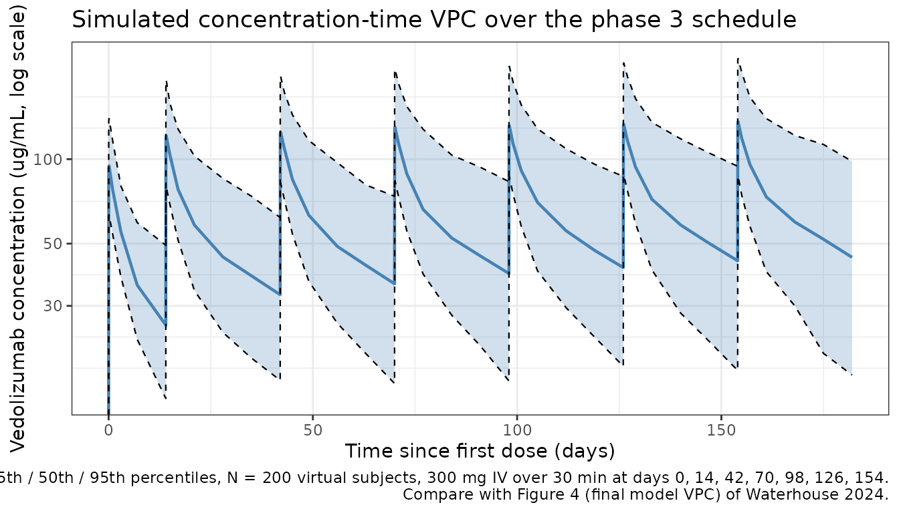
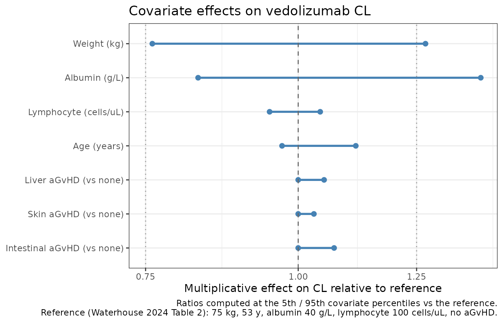

# Vedolizumab (Waterhouse 2024)

``` r

library(nlmixr2lib)
library(PKNCA)
#> 
#> Attaching package: 'PKNCA'
#> The following object is masked from 'package:stats':
#> 
#>     filter
library(rxode2)
#> rxode2 5.1.6 using 2 threads (see ?getRxThreads)
#>   no cache: create with `rxCreateCache()`
library(dplyr)
#> 
#> Attaching package: 'dplyr'
#> The following objects are masked from 'package:stats':
#> 
#>     filter, lag
#> The following objects are masked from 'package:base':
#> 
#>     intersect, setdiff, setequal, union
library(tidyr)
library(ggplot2)
```

## Model and source

    #> ℹ parameter labels from comments will be replaced by 'label()'
    #> Warning: some etas defaulted to non-mu referenced, possible parsing error: etaiov_cl_1, etaiov_cl_2, etaiov_cl_3, etaiov_cl_4, etaiov_cl_5, etaiov_cl_6, etaiov_cl_7
    #> as a work-around try putting the mu-referenced expression on a simple line

- **Citation:** Waterhouse T, Baron K, Eure W, Chen C, Akbari M, Dirks
  NL, Jansson J, Mehrotra S. Population pharmacokinetic modeling of
  vedolizumab for graft-versus-host disease prophylaxis in adults with
  allogeneic hematopoietic stem cell transplant. Pharmacol Res Perspect.
  2024;12(6):e1257. <doi:10.1002/prp2.1257>

- **Description:** Two-compartment population PK model with first-order
  (linear) elimination for vedolizumab (humanised anti-alpha4-beta7
  integrin IgG1 monoclonal antibody) as acute graft-versus-host disease
  (aGvHD) prophylaxis in adults undergoing allogeneic hematopoietic stem
  cell transplantation (allo-HSCT) (Waterhouse 2024).

- **Article:** <https://doi.org/10.1002/prp2.1257>

- **Sibling model:**
  [`Rosario_2015_vedolizumab`](https://nlmixr2.github.io/nlmixr2lib/articles/Rosario_2015_vedolizumab.md)
  – the previous vedolizumab popPK developed in adults with ulcerative
  colitis and Crohn’s disease. Waterhouse 2024 refines that model for
  the allo-HSCT / GvHD prophylaxis setting, dropping the
  Michaelis-Menten pathway (unidentifiable in this dataset at 75-300 mg
  doses) and adding GvHD-organ / lymphocyte covariates.

## Population

The model was developed on 193 evaluable adults undergoing allogeneic
hematopoietic stem cell transplantation (allo-HSCT), pooled across two
vedolizumab clinical studies: VEDO-1015 (phase 1b, NCT02728895, n=24,
dose escalation from 75 to 300 mg IV) and VEDO-3035 GRAPHITE (phase 3,
NCT03657160, n=169, 300 mg IV Q4W maintenance across seven scheduled
dosing occasions). Baseline demographics (Waterhouse 2024 Table 1): age
18-72 years (mean 50.8, SD 14.9), body weight mean 78.5 kg (SD 19.1),
43.0% female, 74.1% White / 15.5% Asian / 2.1% Black / 8.3% not
reported; mean baseline albumin 39.7 g/L (SD 5.60, i.e., ~3.97 g/dL) and
mean baseline absolute lymphocyte count 426 cells/uL (SD 739). During
the study, 3.1% of subjects developed liver aGvHD, 32.1% skin aGvHD, and
8.8% intestinal aGvHD (any grade, at any time). 76.7% of subjects
received concomitant methotrexate, 56.0% tacrolimus, 44.0% cyclosporine,
and 81.3% ursodeoxycholic acid.

The same information is available programmatically via
`readModelDb("Waterhouse_2024_vedolizumab")()$population`.

## Source trace

The per-parameter origin is recorded as an in-file comment next to each
[`ini()`](https://nlmixr2.github.io/rxode2/reference/ini.html) entry in
`inst/modeldb/specificDrugs/Waterhouse_2024_vedolizumab.R`. The table
below collects them in one place.

| Equation / parameter | Value | Source location (Waterhouse 2024) |
|----|----|----|
| `lcl` | `log(0.148)` | Table 2: CL = 0.148 L/day (95% CI 0.136-0.162, RSE 4.49%) |
| `lvc` | `log(3.12)` | Table 2: Vc = 3.12 L (95% CI 3.03-3.21, RSE 1.44%) |
| `lq` | `log(0.500)` | Table 2: Q = 0.500 L/day (95% CI 0.408-0.612, RSE 10.4%) |
| `lvp` | `log(3.95)` | Table 2: Vp = 3.95 L (95% CI 3.52-4.44, RSE 5.93%) |
| `e_wt_cl` | `0.713` | Table 2: body weight effect on CL (95% CI 0.523-0.902) |
| `e_alb_cl` | `-1.35` | Table 2: albumin effect on CL (95% CI -1.67 to -1.02) |
| `e_lymph_cl` | `-0.0180` | Table 2: lymphocyte count effect on CL (95% CI -0.0524 to 0.0164) |
| `e_age_cl` | `-0.130` | Table 2: age effect on CL (95% CI -0.242 to -0.0185) |
| `e_wt_vc` | `0.659` | Table 2: body weight effect on Vc (95% CI 0.540-0.778) |
| `e_wt_vp` | `fixed(1.00)` | Table 2 + Supp Eq S2: body weight effect on Vp = 1 Fixed |
| `e_wt_q` | `fixed(0.75)` | Section 3.2.2 text + Supp Eq S2: `theta_11 for Q (fixed to 0.75)`. Table 2 prints `0.50 Fixed` which contradicts the text and the supplement equation and is treated as a typographical error (see Errata). |
| `e_liver_gvhd_cl` | `1.05` | Table 2: liver GvHD effect on CL (95% CI 0.834-1.26) |
| `e_skin_gvhd_cl` | `1.03` | Table 2: skin GvHD effect on CL (95% CI 0.940-1.12) |
| `e_intestine_gvhd_cl` | `1.07` | Table 2: intestine GvHD effect on CL (95% CI 0.870-1.27) |
| IIV `omega^2_CL` | `0.0827` | Table 3: CV% = 29.4, 95% CI 0.0588-0.107 |
| IIV `omega^2_Vc` | `0.0323` | Table 3: CV% = 18.1, 95% CI 0.0235-0.0411 |
| IIV `omega^2_Vp` | `0.179` | Table 3: CV% = 44.2, 95% CI 0.0920-0.265 |
| `cov(CL, Vc)` | `0.0214` | Table 3: Corr = 0.415 |
| `cov(CL, Vp)` | `-0.0253` | Table 3: Corr = -0.208 |
| `cov(Vc, Vp)` | `0.0272` | Table 3: Corr = 0.358 |
| `propSd` | `sqrt(0.0241) ~ 0.1553` | Table 3: sigma^2_prop = 0.0241 (CV% = 15.5) |
| IOV on CL `etaiov_cl_1..7` | `omega^2 = 0.0315` | Table 3: IOV-CL CV% = 17.9, 95% CI 0.0190-0.0440, shrinkage 55.4%. Occasion definition: Methods Section 2.2.2 |
| Model structure | 2-cmt linear elimination | Section 3.2.1 base model + Section 3.2.2 final model |

Reference patient (Waterhouse 2024 Table 2 and Table 3 footnote):
53-year-old subject weighing 75 kg with no aGvHD in liver, skin, or
intestine, an albumin value of 40 g/L (equivalently 4 g/dL), and a
lymphocyte count of 100 cells/uL (equivalently 0.1 K/uL).

## Virtual cohort

Original observed data are not publicly available. The simulations below
use a virtual population whose covariate distributions approximate the
published demographics (Waterhouse 2024 Table 1). Cohort size is capped
at 200 per arm.

``` r

make_cohort <- function(n,
                        n_doses               = 7,
                        first_dose_day        = 0,
                        second_dose_offset    = 14,
                        maintenance_interval  = 28,
                        obs_days_per_dose     = c(0, 0.02, 0.1, 1, 3, 7, 14, 21, 28),
                        amt_mg                = 300,
                        id_offset             = 0L,
                        seed                  = 12571) {
  set.seed(seed)

  # Baseline covariates approximating Waterhouse 2024 Table 1.
  WT              <- pmax(35, pmin(160, rlnorm(n, log(78.5), 0.24)))
  AGE             <- pmax(18, pmin(72,  rnorm(n, 50.8, 14.9)))
  ALB             <- pmax(20, pmin(60,  rnorm(n, 39.7, 5.60)))       # g/L (SI)
  # Absolute lymphocyte count in cells/uL (paper reports K/uL; multiply by 1000).
  LYMPH_ABS       <- pmax(0, exp(rnorm(n, log(200), 1.2)))
  AGVHD_LIVER     <- rbinom(n, 1, 0.031)
  AGVHD_SKIN      <- rbinom(n, 1, 0.321)
  AGVHD_INTESTINE <- rbinom(n, 1, 0.088)

  # Waterhouse 2024 phase 3 dose schedule: Days -1, +13, +41, +69, +97, +125, +153
  # relative to transplantation, which is:
  #   day 0        (first dose)
  #   day 14       (second dose, 14 days after the first)
  #   day 42, 70, 98, 126, 154 (Q4W maintenance thereafter)
  dose_times <- c(
    first_dose_day,
    first_dose_day + second_dose_offset,
    first_dose_day + second_dose_offset +
      maintenance_interval * seq_len(pmax(0, n_doses - 2))
  )

  pop <- data.frame(
    ID = id_offset + seq_len(n),
    WT, AGE, ALB, LYMPH_ABS,
    AGVHD_LIVER, AGVHD_SKIN, AGVHD_INTESTINE
  )

  infusion_days <- 0.5 / 24  # 30-minute IV infusion in days
  d_dose <- pop[rep(seq_len(n), each = length(dose_times)), ] |>
    mutate(
      TIME = rep(dose_times, times = n),
      AMT  = amt_mg,
      EVID = 1,
      CMT  = "central",
      RATE = amt_mg / infusion_days,
      DV   = NA_real_
    )

  obs_grid <- as.vector(outer(obs_days_per_dose, dose_times, "+"))
  obs_grid <- sort(unique(pmax(0, obs_grid)))

  d_obs <- pop[rep(seq_len(n), each = length(obs_grid)), ] |>
    mutate(
      TIME = rep(obs_grid, times = n),
      AMT  = 0,
      EVID = 0,
      CMT  = "central",
      RATE = 0,
      DV   = NA_real_
    )

  bind_rows(d_dose, d_obs) |>
    arrange(ID, TIME, desc(EVID)) |>
    # OCC: the dosing occasion each record belongs to (Waterhouse 2024 Methods
    # 2.2.2 -- a new occasion begins at each administered dose and runs until the
    # next dose). Records at or before the first dose take occasion 1.
    mutate(OCC = pmax(1L, findInterval(TIME, dose_times))) |>
    select(ID, TIME, AMT, EVID, CMT, RATE, DV, OCC,
           WT, AGE, ALB, LYMPH_ABS,
           AGVHD_LIVER, AGVHD_SKIN, AGVHD_INTESTINE)
}
```

``` r

mod <- rxode2::rxode(readModelDb("Waterhouse_2024_vedolizumab"))
#> ℹ parameter labels from comments will be replaced by 'label()'
#> Warning: some etas defaulted to non-mu referenced, possible parsing error: etaiov_cl_1, etaiov_cl_2, etaiov_cl_3, etaiov_cl_4, etaiov_cl_5, etaiov_cl_6, etaiov_cl_7
#> as a work-around try putting the mu-referenced expression on a simple line
```

## Simulation

Phase 3 dosing (VEDO-3035 GRAPHITE): 300 mg IV Q4W for 7 doses (first
two doses 14 days apart, then Q4W).

``` r

events_vpc <- make_cohort(n = 200)
sim_vpc <- rxode2::rxSolve(mod, events = events_vpc) |> as.data.frame()
#> Warning: some etas defaulted to non-mu referenced, possible parsing error: etaiov_cl_1, etaiov_cl_2, etaiov_cl_3, etaiov_cl_4, etaiov_cl_5, etaiov_cl_6, etaiov_cl_7
#> as a work-around try putting the mu-referenced expression on a simple line
```

### Concentration-time VPC over the phase 3 dosing schedule

``` r

d_vpc <- sim_vpc |>
  group_by(time) |>
  summarise(
    Q05 = quantile(Cc, 0.05, na.rm = TRUE),
    Q50 = quantile(Cc, 0.50, na.rm = TRUE),
    Q95 = quantile(Cc, 0.95, na.rm = TRUE),
    .groups = "drop"
  )

ggplot(d_vpc, aes(x = time, y = Q50)) +
  geom_ribbon(aes(ymin = Q05, ymax = Q95), fill = "#4682b4", alpha = 0.25) +
  geom_line(colour = "#4682b4", linewidth = 0.8) +
  geom_line(aes(y = Q05), linetype = "dashed", linewidth = 0.4) +
  geom_line(aes(y = Q95), linetype = "dashed", linewidth = 0.4) +
  scale_y_log10() +
  labs(
    x = "Time since first dose (days)",
    y = "Vedolizumab concentration (ug/mL, log scale)",
    title = "Simulated concentration-time VPC over the phase 3 schedule",
    caption = paste0(
      "Simulated 5th / 50th / 95th percentiles, N = 200 virtual subjects, ",
      "300 mg IV over 30 min at days 0, 14, 42, 70, 98, 126, 154.\n",
      "Compare with Figure 4 (final model VPC) of Waterhouse 2024."
    )
  ) +
  theme_bw()
#> Warning in scale_y_log10(): log-10 transformation introduced infinite values.
#> log-10 transformation introduced infinite values.
#> log-10 transformation introduced infinite values.
#> log-10 transformation introduced infinite values.
#> log-10 transformation introduced infinite values.
#> log-10 transformation introduced infinite values.
```



### Inter-occasion variability on CL

Waterhouse 2024 estimates inter-occasion variability on CL (Table 3,
variance 0.0315, CV% 17.9). An occasion begins at each administered dose
and runs until the next (Methods Section 2.2.2), so the model requires
an `OCC` column in the event table; `make_cohort()` above derives it
from the dose schedule.

The check below is deterministic: all etas are supplied as event-data
columns with `omega = NA`, and only the occasion-2 IOV eta is perturbed.
Clearance must change during occasion 2 alone, leaving occasion 1
untouched.

``` r

ev_iov <- make_cohort(n = 1, n_doses = 3) |>
  mutate(
    WT = 75, AGE = 53, ALB = 40, LYMPH_ABS = 100,
    AGVHD_LIVER = 0, AGVHD_SKIN = 0, AGVHD_INTESTINE = 0,
    etalcl = 0, etalvc = 0, etalvp = 0,
    etaiov_cl_1 = 0, etaiov_cl_2 = 0, etaiov_cl_3 = 0, etaiov_cl_4 = 0,
    etaiov_cl_5 = 0, etaiov_cl_6 = 0, etaiov_cl_7 = 0
  )

cl_by_occ <- function(events) {
  out <- rxode2::rxSolve(mod, events = events, omega = NA) |>
    as.data.frame()
  # CL is piecewise-constant within an occasion here (covariates and etas are
  # fixed), so the within-occasion spread must be numerically zero.
  stopifnot(max(tapply(out$cl, out$OCC, function(x) diff(range(x)))) < 1e-9)
  out |>
    group_by(OCC) |>
    summarise(CL = mean(cl), .groups = "drop")
}

cl_ref  <- cl_by_occ(ev_iov)
cl_pert <- cl_by_occ(ev_iov |> mutate(etaiov_cl_2 = log(2)))

iov_tbl <- left_join(cl_ref, cl_pert, by = "OCC", suffix = c("_ref", "_pert")) |>
  mutate(Ratio = CL_pert / CL_ref)

# Occasion 2 CL must double; all other occasions must be untouched.
stopifnot(
  isTRUE(all.equal(iov_tbl$Ratio[iov_tbl$OCC == 2], 2, tolerance = 1e-6)),
  isTRUE(all.equal(iov_tbl$Ratio[iov_tbl$OCC != 2],
                   rep(1, sum(iov_tbl$OCC != 2)), tolerance = 1e-6))
)

iov_tbl |>
  dplyr::rename(
    "Occasion"           = OCC,
    "CL, reference (L/day)" = CL_ref,
    "CL, eta_IOV,2 = log(2) (L/day)" = CL_pert,
    "Ratio"              = Ratio
  ) |>
  knitr::kable(
    caption = paste0(
      "IOV multiplexing check: perturbing the occasion-2 IOV eta changes CL ",
      "during occasion 2 only."
    )
  )
```

| Occasion | CL, reference (L/day) | CL, eta_IOV,2 = log(2) (L/day) | Ratio |
|---------:|----------------------:|-------------------------------:|------:|
|        1 |                 0.148 |                          0.148 |     1 |
|        2 |                 0.148 |                          0.296 |     2 |
|        3 |                 0.148 |                          0.148 |     1 |

IOV multiplexing check: perturbing the occasion-2 IOV eta changes CL
during occasion 2 only. {.table}

### Covariate forest plot (final-model covariate effects on CL)

Waterhouse 2024 Figure 3 renders a covariate forest plot showing the
multiplicative effect on clearance when each covariate moves from the
reference value to the 5th/10th/25th/75th/90th/95th percentiles
(continuous) or from 0 to 1 (categorical GvHD). We reproduce the
equivalent multiplicative ratios from the model’s coefficients.

``` r

ini <- mod$theta
get <- function(nm) unname(ini[nm])

# Continuous covariate sensitivity at 5th / 95th population percentiles from
# the virtual cohort above (rough approximations of Waterhouse 2024 Figure 3
# reference-cohort percentiles).
forest_cont <- tribble(
  ~covariate,               ~low,   ~ref,   ~high,  ~exponent,
  "Weight (kg)",            51,     75,     105,    get("e_wt_cl"),
  "Albumin (g/L)",          31,     40,     46,     get("e_alb_cl"),
  "Lymphocyte (cells/uL)",  10,     100,    2000,   get("e_lymph_cl"),
  "Age (years)",            23,     53,     67,     get("e_age_cl")
) |>
  mutate(
    ratio_low  = (low  / ref)^exponent,
    ratio_high = (high / ref)^exponent
  )

forest_cat <- tribble(
  ~covariate,                    ~ratio_low, ~ratio_high,
  "Liver aGvHD (vs none)",       1,           get("e_liver_gvhd_cl"),
  "Skin aGvHD (vs none)",        1,           get("e_skin_gvhd_cl"),
  "Intestinal aGvHD (vs none)",  1,           get("e_intestine_gvhd_cl")
)

forest_all <- bind_rows(
  forest_cont |> select(covariate, ratio_low, ratio_high),
  forest_cat
) |>
  mutate(covariate = factor(covariate, levels = rev(covariate)))

ggplot(forest_all, aes(y = covariate)) +
  geom_segment(aes(x = ratio_low, xend = ratio_high, yend = covariate),
               colour = "#4682b4", linewidth = 1.0) +
  geom_point(aes(x = ratio_low),  colour = "#4682b4", size = 2) +
  geom_point(aes(x = ratio_high), colour = "#4682b4", size = 2) +
  geom_vline(xintercept = 1, linetype = "dashed", colour = "grey40") +
  geom_vline(xintercept = c(0.75, 1.25), linetype = "dotted", colour = "grey60") +
  scale_x_log10(breaks = c(0.5, 0.75, 1.0, 1.25, 1.5, 2.0)) +
  labs(
    x = "Multiplicative effect on CL relative to reference",
    y = NULL,
    title = "Covariate effects on vedolizumab CL",
    caption = paste0(
      "Ratios computed at the 5th / 95th covariate percentiles vs the reference.\n",
      "Reference (Waterhouse 2024 Table 2): 75 kg, 53 y, albumin 40 g/L, ",
      "lymphocyte 100 cells/uL, no aGvHD."
    )
  ) +
  theme_bw()
```



The paper’s clinical-meaningfulness band is +/-25% (dotted lines). Only
albumin and body-weight excursions cross this band – consistent with the
paper’s conclusion that these are the only clinically important
predictors of vedolizumab CL in this population.

## PKNCA validation

We compute NCA on a typical-patient profile (reference covariates) after
a single 300 mg IV dose and at steady state (dose 7 of the phase 3
regimen). The paper reports no explicit reference-patient NCA table, so
this section serves primarily as a sanity check: derived Cmax after a
30-minute infusion should be close to
`dose / Vc ~ 300 mg / 3.12 L ~ 96 ug/mL` and the terminal half-life
should be in the range typical of therapeutic IgG1 mAbs (roughly 20-35
days).

``` r

mod_typical <- mod |> rxode2::zeroRe()
#> Warning: some etas defaulted to non-mu referenced, possible parsing error: etaiov_cl_1, etaiov_cl_2, etaiov_cl_3, etaiov_cl_4, etaiov_cl_5, etaiov_cl_6, etaiov_cl_7
#> as a work-around try putting the mu-referenced expression on a simple line

events_single <- make_cohort(
  n = 1,
  n_doses = 1,
  obs_days_per_dose = c(0, 0.02, 0.1, 0.25, 0.5, 1, 2, 4, 7, 14, 21, 28,
                        42, 56, 84, 112, 168, 224)
) |>
  mutate(
    WT = 75, AGE = 53, ALB = 40, LYMPH_ABS = 100,
    AGVHD_LIVER = 0, AGVHD_SKIN = 0, AGVHD_INTESTINE = 0
  )

sim_single <- rxode2::rxSolve(mod_typical, events = events_single) |>
  as.data.frame() |>
  mutate(id = 1L, treatment = "single_300mg")
#> Warning: some etas defaulted to non-mu referenced, possible parsing error: etaiov_cl_1, etaiov_cl_2, etaiov_cl_3, etaiov_cl_4, etaiov_cl_5, etaiov_cl_6, etaiov_cl_7
#> as a work-around try putting the mu-referenced expression on a simple line
#> ℹ omega/sigma items treated as zero: 'etalcl', 'etalvc', 'etalvp', 'etaiov_cl_1', 'etaiov_cl_2', 'etaiov_cl_3', 'etaiov_cl_4', 'etaiov_cl_5', 'etaiov_cl_6', 'etaiov_cl_7'

sim_nca_single <- sim_single |>
  filter(!is.na(Cc)) |>
  select(id, time, Cc, treatment)

sim_nca_single <- bind_rows(
  sim_nca_single,
  sim_nca_single |> distinct(id, treatment) |>
    mutate(time = 0, Cc = 0)
) |>
  distinct(id, treatment, time, .keep_all = TRUE) |>
  arrange(id, treatment, time)

dose_single <- events_single |>
  filter(EVID == 1) |>
  transmute(id = ID, time = TIME, amt = AMT, treatment = "single_300mg")

conc_single <- PKNCA::PKNCAconc(sim_nca_single, Cc ~ time | treatment + id)
dose_single_obj <- PKNCA::PKNCAdose(dose_single, amt ~ time | treatment + id)

intervals_single <- data.frame(
  start      = 0,
  end        = Inf,
  cmax       = TRUE,
  tmax       = TRUE,
  aucinf.obs = TRUE,
  half.life  = TRUE
)

nca_single <- PKNCA::pk.nca(
  PKNCA::PKNCAdata(conc_single, dose_single_obj, intervals = intervals_single)
)
as.data.frame(nca_single$result) |>
  dplyr::rename(
    "Group"     = treatment,
    "Subject"   = id,
    "PPTESTCD"  = PPTESTCD,
    "Value"     = PPORRES
  ) |>
  knitr::kable(
    caption = "Single-dose NCA on the typical reference-patient profile."
  )
```

| Group        | Subject | start | end | PPTESTCD            |        Value | exclude |
|:-------------|--------:|------:|----:|:--------------------|-------------:|:--------|
| single_300mg |       1 |     0 | Inf | cmax                |  121.8038708 | NA      |
| single_300mg |       1 |     0 | Inf | tmax                |   14.1000000 | NA      |
| single_300mg |       1 |     0 | Inf | tlast               |  238.0000000 | NA      |
| single_300mg |       1 |     0 | Inf | clast.obs           |    0.8648773 | NA      |
| single_300mg |       1 |     0 | Inf | lambda.z            |    0.0190734 | NA      |
| single_300mg |       1 |     0 | Inf | r.squared           |    0.9999913 | NA      |
| single_300mg |       1 |     0 | Inf | adj.r.squared       |    0.9999905 | NA      |
| single_300mg |       1 |     0 | Inf | lambda.z.time.first |   28.0000000 | NA      |
| single_300mg |       1 |     0 | Inf | lambda.z.time.last  |  238.0000000 | NA      |
| single_300mg |       1 |     0 | Inf | lambda.z.n.points   |   13.0000000 | NA      |
| single_300mg |       1 |     0 | Inf | clast.pred          |    0.8633671 | NA      |
| single_300mg |       1 |     0 | Inf | half.life           |   36.3410653 | NA      |
| single_300mg |       1 |     0 | Inf | span.ratio          |    5.7785868 | NA      |
| single_300mg |       1 |     0 | Inf | aucinf.obs          | 4071.8654589 | NA      |

Single-dose NCA on the typical reference-patient profile. {.table}

``` r

# Phase 3 dosing: seven doses at days 0, 14, 42, 70, 98, 126, 154.
# Steady state is well approached by dose 7 (day 154). Extract the final
# dosing interval (day 154 to day 182) plus the extrapolation window used
# for AUC-inf and half-life.
final_dose_day <- 154

events_ss_base <- make_cohort(
  n = 1, n_doses = 7,
  obs_days_per_dose = c(0, 0.02, 0.1, 0.5, 1, 2, 4, 7, 14, 21, 28),
  first_dose_day = 0
) |>
  mutate(
    WT = 75, AGE = 53, ALB = 40, LYMPH_ABS = 100,
    AGVHD_LIVER = 0, AGVHD_SKIN = 0, AGVHD_INTESTINE = 0
  )

extra_obs <- data.frame(
  ID = 1L,
  TIME = final_dose_day + c(35, 42, 56, 84, 112, 168, 224),
  AMT = 0, EVID = 0, CMT = "central", RATE = 0, DV = NA_real_,
  OCC = 7L,  # washout observations belong to the seventh (final) dosing occasion
  WT = 75, AGE = 53, ALB = 40, LYMPH_ABS = 100,
  AGVHD_LIVER = 0, AGVHD_SKIN = 0, AGVHD_INTESTINE = 0
)
events_ss <- bind_rows(events_ss_base, extra_obs) |>
  arrange(ID, TIME, desc(EVID))

sim_ss <- rxode2::rxSolve(mod_typical, events = events_ss) |>
  as.data.frame() |>
  mutate(id = 1L, treatment = "ss_300mg_final_dose")
#> ℹ omega/sigma items treated as zero: 'etalcl', 'etalvc', 'etalvp', 'etaiov_cl_1', 'etaiov_cl_2', 'etaiov_cl_3', 'etaiov_cl_4', 'etaiov_cl_5', 'etaiov_cl_6', 'etaiov_cl_7'

sim_nca_ss <- sim_ss |>
  filter(!is.na(Cc), time >= final_dose_day) |>
  mutate(time = time - final_dose_day) |>
  select(id, time, Cc, treatment)

sim_nca_ss <- bind_rows(
  sim_nca_ss,
  sim_nca_ss |> distinct(id, treatment) |>
    mutate(time = 0, Cc = min(sim_nca_ss$Cc[sim_nca_ss$time == 0], na.rm = TRUE))
) |>
  distinct(id, treatment, time, .keep_all = TRUE) |>
  arrange(id, treatment, time)

dose_ss <- data.frame(
  id = 1L, time = 0, amt = 300, treatment = "ss_300mg_final_dose"
)

conc_ss <- PKNCA::PKNCAconc(sim_nca_ss, Cc ~ time | treatment + id)
dose_ss_obj <- PKNCA::PKNCAdose(dose_ss, amt ~ time | treatment + id)

intervals_ss <- data.frame(
  start      = 0,
  end        = Inf,
  cmax       = TRUE,
  tmax       = TRUE,
  aucinf.obs = TRUE,
  half.life  = TRUE
)

nca_ss <- PKNCA::pk.nca(
  PKNCA::PKNCAdata(conc_ss, dose_ss_obj, intervals = intervals_ss)
)
as.data.frame(nca_ss$result) |>
  dplyr::rename(
    "Group"    = treatment,
    "Subject"  = id,
    "PPTESTCD" = PPTESTCD,
    "Value"    = PPORRES
  ) |>
  knitr::kable(
    caption = "Steady-state NCA on the 7th (final) dosing interval."
  )
```

| Group               | Subject | start | end | PPTESTCD            |        Value | exclude |
|:--------------------|--------:|------:|----:|:--------------------|-------------:|:--------|
| ss_300mg_final_dose |       1 |     0 | Inf | cmax                |  142.2758331 | NA      |
| ss_300mg_final_dose |       1 |     0 | Inf | tmax                |    0.1000000 | NA      |
| ss_300mg_final_dose |       1 |     0 | Inf | tlast               |  224.0000000 | NA      |
| ss_300mg_final_dose |       1 |     0 | Inf | clast.obs           |    1.1625820 | NA      |
| ss_300mg_final_dose |       1 |     0 | Inf | lambda.z            |    0.0190676 | NA      |
| ss_300mg_final_dose |       1 |     0 | Inf | r.squared           |    0.9999935 | NA      |
| ss_300mg_final_dose |       1 |     0 | Inf | adj.r.squared       |    0.9999927 | NA      |
| ss_300mg_final_dose |       1 |     0 | Inf | lambda.z.time.first |   14.0000000 | NA      |
| ss_300mg_final_dose |       1 |     0 | Inf | lambda.z.time.last  |  224.0000000 | NA      |
| ss_300mg_final_dose |       1 |     0 | Inf | lambda.z.n.points   |   10.0000000 | NA      |
| ss_300mg_final_dose |       1 |     0 | Inf | clast.pred          |    1.1608861 | NA      |
| ss_300mg_final_dose |       1 |     0 | Inf | half.life           |   36.3521741 | NA      |
| ss_300mg_final_dose |       1 |     0 | Inf | span.ratio          |    5.7768209 | NA      |
| ss_300mg_final_dose |       1 |     0 | Inf | aucinf.obs          | 4555.1457009 | NA      |

Steady-state NCA on the 7th (final) dosing interval. {.table}

### Comparison against published expectations

``` r

get_param <- function(res, ppname) {
  tbl <- as.data.frame(res$result)
  val <- tbl$PPORRES[tbl$PPTESTCD == ppname]
  if (length(val) == 0) return(NA_real_)
  val[1]
}

cmax_single_sim <- get_param(nca_single, "cmax")
hl_single_sim   <- get_param(nca_single, "half.life")
cmax_ss_sim     <- get_param(nca_ss,     "cmax")
hl_ss_sim       <- get_param(nca_ss,     "half.life")

c_trough_ss <- sim_ss$Cc[sim_ss$time == final_dose_day + 28]

# Sanity-check reference values derived from the paper's reference-patient
# parameters: initial post-infusion Cmax ~ 300 mg / 3.12 L = 96 ug/mL.
comparison <- data.frame(
  Quantity  = c("Single-dose Cmax (ug/mL)",
                "Single-dose terminal half-life (days)",
                "Steady-state Cmax at final dose (ug/mL)",
                "Steady-state trough at end of final Q4W interval (ug/mL)"),
  Reference = c("~96 ug/mL (300 mg / Vc = 3.12 L, reference patient)",
                "~20-35 days (typical IgG1 mAb range; sibling Rosario 2015 reports ~25 d for IBD)",
                "Not explicitly reported in Waterhouse 2024",
                "'Slightly higher' than IBD Q4W steady-state trough per paper Discussion"),
  Simulated = c(round(cmax_single_sim, 1),
                round(hl_single_sim, 1),
                round(cmax_ss_sim, 1),
                round(c_trough_ss, 1))
)
knitr::kable(comparison,
             caption = paste0(
               "Simulated vs. reference-patient expectations. The paper does ",
               "not report a full NCA table; the reference column reproduces ",
               "the paper's structural-parameter-derived expectations."))
```

| Quantity | Reference | Simulated |
|:---|:---|---:|
| Single-dose Cmax (ug/mL) | ~96 ug/mL (300 mg / Vc = 3.12 L, reference patient) | 121.8 |
| Single-dose terminal half-life (days) | ~20-35 days (typical IgG1 mAb range; sibling Rosario 2015 reports ~25 d for IBD) | 36.3 |
| Steady-state Cmax at final dose (ug/mL) | Not explicitly reported in Waterhouse 2024 | 142.3 |
| Steady-state trough at end of final Q4W interval (ug/mL) | ‘Slightly higher’ than IBD Q4W steady-state trough per paper Discussion | 48.6 |

Simulated vs. reference-patient expectations. The paper does not report
a full NCA table; the reference column reproduces the paper’s
structural-parameter-derived expectations. {.table}

## Assumptions and deviations / Errata

- **Table 2 typo – body-weight allometric exponent on Q.** Waterhouse
  2024 Table 2 prints `Body weight effect on Q | 0.50 | Fixed`, but
  Section 3.2.2 text states
  `fixed allometric exponents for Q (0.75) and Vp (1)`, and Supplement
  Equation S2 explicitly states `theta_11 for Q (fixed to 0.75)`. Two of
  three sources – including the equation form and the standard
  allometric-clearance convention – agree on 0.75. The packaged model
  uses 0.75. The Table 2 value (0.50) is treated as a typographical
  error; a corrigendum has not been located as of extraction
  (2026-07-25).
- **IOV on CL requires an `OCC` event-table column.** Waterhouse 2024
  Table 3 reports an inter-occasion variability variance of 0.0315 on CL
  (CV% = 17.9), where Methods Section 2.2.2 defines an occasion as each
  administered dose with subsequent PK observations taking place before
  the next dose. The packaged model encodes this as seven
  occasion-indexed etas (`etaiov_cl_1` .. `etaiov_cl_7`) multiplexed by
  binary indicators derived from an `OCC` column, covering the
  seven-dose phase 3 VEDO-3035 schedule; the three-dose phase 1b
  VEDO-1015 schedule uses occasions 1-3 and leaves the remaining
  indicators at zero. NONMEM shares one variance across occasions via
  `$OMEGA BLOCK(1) SAME`; nlmixr2 has no `SAME` shortcut, so occasions
  2-7 are [`fix()`](https://rdrr.io/r/utils/fix.html)ed to the
  occasion-1 estimate. **Users must supply an `OCC` column** (integer,
  1-based, incrementing at each dose) in the event table; records
  preceding the first dose take `OCC = 1`. Note the paper reports 55.4%
  shrinkage on the IOV term, so the individual per-occasion estimates
  are weakly informed even though the population variance is well
  estimated (95% CI 0.0190-0.0440).
- **Anti-vedolizumab antibody (AVA) effect not encoded.** Only 2 of 193
  subjects (1.0%) had positive AVA tests during the dosing period, both
  at the first day of dosing. Waterhouse 2024 Section 3.2.2 states: “The
  effect of antidrug antibodies on vedolizumab PK was not evaluated due
  to the limited number of subjects with positive ADA tests.” The
  packaged model therefore does not include an `ADA_POS` effect on CL,
  and `ADA_POS` is recorded in `covariatesDataExcluded` as an
  observation-only covariate for provenance.
- **Concomitant medications not retained.** The post-hoc
  concomitant-medication analysis (methotrexate, tacrolimus,
  cyclosporine, ursodeoxycholic acid) found no clinically meaningful
  effects (Section 3.2.3 and Discussion). These covariates are recorded
  in `covariatesDataExcluded` with the paper’s rationale, and are not
  applied in
  [`model()`](https://nlmixr2.github.io/rxode2/reference/model.html).
- **Sex and race not retained.** Waterhouse 2024 Section 3.2.2
  attributes the observed sex- and race-associated random-effects trends
  to correlation with body weight, and does not carry them into the
  final covariate model. `SEXF`, `RACE_ASIAN`, and `RACE_BLACK` are
  recorded in `covariatesDataExcluded`.
- **Nonlinear clearance component dropped.** The upstream IBD popPK
  (Rosario 2015) included parallel linear plus Michaelis-Menten
  elimination. Waterhouse 2024 Section 3.2.1 documents that Vmax and Km
  were not identifiable in the allo-HSCT dataset because only three
  subjects received the lower 75 mg dose; the final model retains only
  linear clearance. Users who need the Michaelis-Menten pathway (e.g.,
  for very low observed concentrations) should refer to
  `Rosario_2015_vedolizumab` instead.
- **Virtual covariate distributions are approximations.** Exact observed
  covariate distributions are not published. The demo cohort uses
  log-normal weight (median 78.5 kg, log-SD 0.24), normal age (50.8 SD
  14.9, bounded 18-72 y), normal albumin (39.7 SD 5.60 g/L), log-normal
  lymphocyte count (log median 200 cells/uL, log-SD 1.2), and binary
  probabilities for GvHD indicators matching Table 1 prevalences (3.1%
  liver / 32.1% skin / 8.8% intestine).
- **Lymphocyte-count zero floor.** Waterhouse 2024 Supplement Equation
  S2 substitutes any zero lymphocyte count with 0.01 K/uL (= 10
  cells/uL) to avoid `log(0)` in the power-form covariate on CL. The
  packaged
  [`model()`](https://nlmixr2.github.io/rxode2/reference/model.html)
  block implements this floor via `lymph_use <- pmax(LYMPH_ABS, 10)` –
  users supplying LYMPH_ABS as a covariate column do not need to
  pre-substitute.

## Reference

- Waterhouse T, Baron K, Eure W, Chen C, Akbari M, Dirks NL, Jansson J,
  Mehrotra S. Population pharmacokinetic modeling of vedolizumab for
  graft-versus-host disease prophylaxis in adults with allogeneic
  hematopoietic stem cell transplant. Pharmacol Res Perspect.
  2024;12(6):e1257. <doi:10.1002/prp2.1257>
