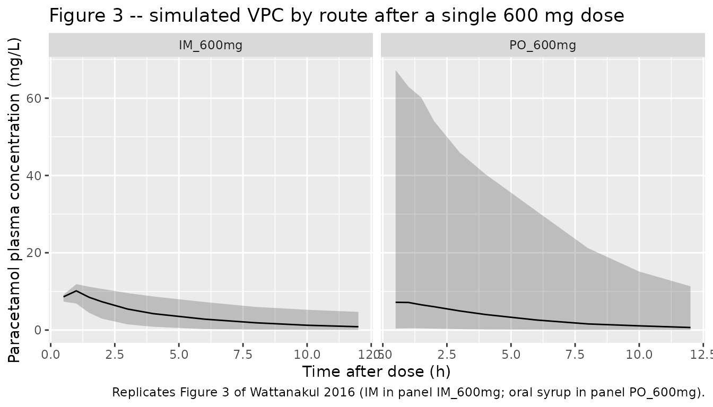
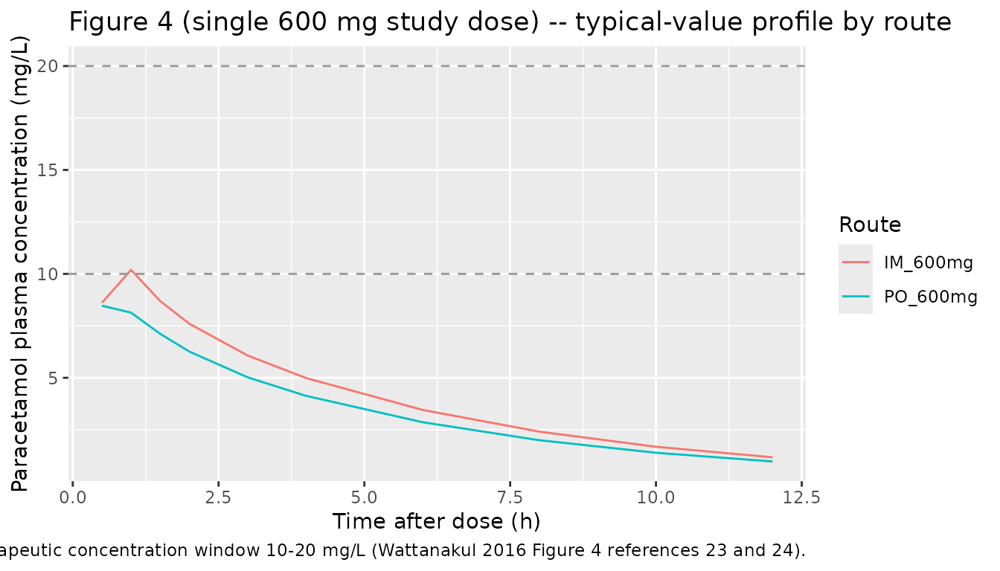

# Paracetamol (Wattanakul 2016)

## Model and source

- Citation: Wattanakul T, Teerapong P, Plewes K, Newton PN, Chierakul W,
  Silamut K, Chotivanich K, Ruengweerayut R, White NJ, Dondorp AM,
  Tarning J (2016). Pharmacokinetic properties of intramuscular versus
  oral syrup paracetamol in Plasmodium falciparum malaria. Malaria
  Journal 15:244. <doi:10.1186/s12936-016-1283-9>.
- Description: Two-compartment population PK model for paracetamol
  (acetaminophen) administered as a single 600 mg dose by either
  intramuscular injection (zero-order absorption over DUR_IM) or oral
  syrup (first-order absorption with rate constant ka) in 21 adult Thai
  patients with uncomplicated Plasmodium falciparum malaria and fever \>
  38 C (Wattanakul 2016). Intramuscular bioavailability is fixed to F_IM
  = 1; the relative oral bioavailability is F_PO = 0.844 (95% CI
  0.682-0.951). The depot compartment carries oral doses (f(depot) =
  F_PO) while intramuscular doses target central with rate = -2 to
  invoke the modeled dur(central) = DUR_IM. No covariates were retained:
  allometric scaling on body weight did not improve the fit and a
  stepwise covariate search (age, AST, ALT, bilirubin, BUN, creatinine,
  sex, hemoglobin, parasitaemia, systolic BP, temperature) found no
  significant effect at p \< 0.05. Inter-individual variability for V_C
  and DUR_IM was estimated below 1% CV and fixed to zero in the source
  paper without changing the OFV; this model omits the corresponding
  etas accordingly.
- Article: [Malaria Journal 15:244
  (2016)](https://doi.org/10.1186/s12936-016-1283-9)

## Population

Wattanakul 2016 enrolled 21 adult patients with slide-confirmed
uncomplicated Plasmodium falciparum malaria and aural temperature \> 38
C at Mae Sot Hospital in Tak Province, Thailand, between May and June
2001 (Table 1). Age ranged from 15 to 54 years (median 25), weight from
47 to 70 kg (median 58 kg), and 19 of the 21 (90%) were male. Baseline
parasitaemia was geometric-mean ~47,500 parasites/uL and admission
temperature 38.1-41.2 C. All patients received intravenous artesunate
plus oral doxycycline antimalarial therapy in addition to the study
paracetamol dose. The randomized open-label two-treatment crossover
design administered a single 600 mg dose by one route (oral syrup or
intramuscular) on day 0 and the alternate route on day 1; 363
quantifiable plasma paracetamol concentrations across the 21 patients
were used in the analysis.

The same information is available programmatically via
`readModelDb("Wattanakul_2016_paracetamol")$population`.

## Source trace

Per-parameter origin is recorded as an in-file comment next to each
`ini()` entry in
`inst/modeldb/specificDrugs/Wattanakul_2016_paracetamol.R`. The table
below collects them for review. All values come from Wattanakul 2016
Table 2, “Population estimate” column, with bootstrap 95% CI from the
same row.

| Equation / parameter | Value | Source location |
|----|----|----|
| `lfdepot` (F_PO) | `log(0.844)` | Table 2: F_PO = 0.844 (95% CI 0.682-0.951; 8.4% RSE) |
| `lka` (ka_PO) | `log(4.15)` 1/h | Table 2: ka_PO = 4.15 1/h (95% CI 1.95-9.73; 44.5% RSE) |
| `ldur_im` (DUR_IM) | `log(0.689)` h | Table 2: DUR_IM = 0.689 h (95% CI 0.621-0.784; 6.2% RSE) |
| `lcl` (CL) | `log(10.7)` L/h | Table 2: CL = 10.7 L/h (95% CI 7.35-14.7; 16.9% RSE) |
| `lvc` (V_C) | `log(45.5)` L | Table 2: V_C = 45.5 L (95% CI 36.7-51.5; 8.5% RSE) |
| `lq` (Q) | `log(10.3)` L/h | Table 2: Q = 10.3 L/h (95% CI 4.80-20.1; 36.8% RSE) |
| `lvp` (V_P) | `log(11.3)` L | Table 2: V_P = 11.3 L (95% CI 5.01-29.0; 42.7% RSE) |
| `etalfdepot` (IIV F_PO) | `log(1 + 2.87^2)` | Table 2: IIV F_PO = 287% CV (49.1% RSE) |
| `etalka` (IIV ka) | `log(1 + 2.32^2)` | Table 2: IIV ka_PO = 232% CV (49.7% RSE) |
| `etalcl` (IIV CL) | `log(1 + 0.818^2)` | Table 2: IIV CL = 81.8% CV (69.7% RSE) |
| `etalq` (IIV Q) | `log(1 + 0.774^2)` | Table 2: IIV Q = 77.4% CV (44.0% RSE) |
| `etalvp` (IIV V_P) | `log(1 + 4.28^2)` | Table 2: IIV V_P = 428% CV (46.5% RSE) |
| `propSd` (residual) | `sqrt(0.376)` | Table 2: sigma (variance) = 0.376 (95% CI 0.316-0.436; 7.8% RSE); SD = sqrt(0.376) = 0.613 |
| F_IM (anchor) | 1 | Table 2: F_IM = 1 fixed; encoded as the rxode2 default `f(central) = 1` |
| Structural form | two-compartment + depot | Results, Pharmacokinetics: “two-compartment disposition model”; “Zero-order absorption for IM and first-order absorption for oral administration best described the absorption phase” |
| Residual form | additive on log-scale | Methods, Population PK and PD analysis: “additive on a logarithmic scale, essentially equivalent to an exponential error on an arithmetic scale” |

No covariates were retained. Wattanakul 2016 Results, Pharmacokinetics,
second paragraph: “Allometric scaling of pharmacokinetic parameters did
not improve model fit significantly. Thus, body weight was not
incorporated into the final model. The stepwise covariate search showed
no significant relationships in this population.” Inter-individual
variability on V_C and DUR_IM was estimated below 1% CV and fixed to
zero in the source paper without changing the OFV (same paragraph), so
the corresponding etas are omitted from this model.

## Virtual cohort

Original observed data are not publicly available. The cohort below uses
200 virtual adults, each receiving a single 600 mg dose by the route
indicated by the cohort label and sampled over 12 hours to match the
Wattanakul 2016 design.

``` r

set.seed(20260521)
n_subj <- 200
dose_amt_mg <- 600

make_cohort <- function(n, route, id_offset = 0L) {
  ids <- id_offset + seq_len(n)
  if (route == "IM") {
    dose_row <- tibble(
      id   = ids,
      time = 0,
      evid = 1L,
      amt  = dose_amt_mg,
      rate = -2,         # invoke modeled dur(central) = DUR_IM
      cmt  = "central",
      treatment = "IM_600mg"
    )
  } else if (route == "PO") {
    dose_row <- tibble(
      id   = ids,
      time = 0,
      evid = 1L,
      amt  = dose_amt_mg,
      rate = 0,          # normal bolus into depot
      cmt  = "depot",
      treatment = "PO_600mg"
    )
  } else {
    stop("Unknown route: ", route)
  }

  obs_times <- c(0, 0.5, 1.0, 1.5, 2, 3, 4, 6, 8, 10, 12)
  obs_rows <- tibble(id = ids) |>
    tidyr::crossing(time = obs_times) |>
    mutate(
      evid = 0L,
      amt  = NA_real_,
      rate = 0,
      cmt  = "central",
      treatment = if (route == "IM") "IM_600mg" else "PO_600mg"
    )

  bind_rows(dose_row, obs_rows) |>
    arrange(id, time, desc(evid))
}

events <- bind_rows(
  make_cohort(n_subj, route = "IM", id_offset = 0L),
  make_cohort(n_subj, route = "PO", id_offset = n_subj)
)

stopifnot(!anyDuplicated(unique(events[, c("id", "time", "evid")])))
```

## Simulation

``` r

mod <- readModelDb("Wattanakul_2016_paracetamol")
sim <- rxode2::rxSolve(mod, events = events, keep = c("treatment")) |>
  as.data.frame()
#> ℹ parameter labels from comments will be replaced by 'label()'
```

For deterministic typical-value replication of Figures 2-4 (no
between-subject variability), zero out the random effects:

``` r

mod_typical <- mod |> rxode2::zeroRe()
#> ℹ parameter labels from comments will be replaced by 'label()'
events_typical <- bind_rows(
  make_cohort(1L, route = "IM", id_offset = 0L),
  make_cohort(1L, route = "PO", id_offset = 1L)
)
sim_typical <- rxode2::rxSolve(
  mod_typical,
  events = events_typical,
  keep   = c("treatment")
) |> as.data.frame()
#> ℹ omega/sigma items treated as zero: 'etalfdepot', 'etalka', 'etalcl', 'etalq', 'etalvp'
#> Warning: multi-subject simulation without without 'omega'
```

## Replicate published figures

``` r

# Replicates Figure 3 of Wattanakul 2016: visual predictive check of the final
# population PK model stratified by route of drug administration (IM panel a,
# PO panel b). Solid lines = 5th, 50th, and 95th percentiles of the simulated
# cohort; shaded ribbon = 5th-95th interval.
sim |>
  filter(time > 0) |>
  group_by(treatment, time) |>
  summarise(
    Q05 = quantile(Cc, 0.05, na.rm = TRUE),
    Q50 = quantile(Cc, 0.50, na.rm = TRUE),
    Q95 = quantile(Cc, 0.95, na.rm = TRUE),
    .groups = "drop"
  ) |>
  ggplot(aes(time, Q50)) +
  geom_ribbon(aes(ymin = Q05, ymax = Q95), alpha = 0.25) +
  geom_line() +
  facet_wrap(~ treatment) +
  labs(
    x = "Time after dose (h)",
    y = "Paracetamol plasma concentration (mg/L)",
    title = "Figure 3 -- simulated VPC by route after a single 600 mg dose",
    caption = "Replicates Figure 3 of Wattanakul 2016 (IM in panel IM_600mg; oral syrup in panel PO_600mg)."
  )
```



``` r

# Replicates the central trend of Figure 4 of Wattanakul 2016 (single 600 mg
# study dose component): typical-value plasma concentration-time profile after
# IM and oral syrup administration. The full Figure 4 also shows multiple-dose
# simulations and a 1500 mg loading-dose regimen; the single 600 mg arm is the
# component that the population PK parameters in Table 2 directly inform.
ggplot(sim_typical |> filter(time > 0), aes(time, Cc, colour = treatment)) +
  geom_line() +
  geom_hline(yintercept = c(10, 20), linetype = "dashed", colour = "grey60") +
  labs(
    x = "Time after dose (h)",
    y = "Paracetamol plasma concentration (mg/L)",
    title = "Figure 4 (single 600 mg study dose) -- typical-value profile by route",
    caption = paste(
      "Dashed horizontal lines mark the therapeutic concentration window 10-20 mg/L",
      "(Wattanakul 2016 Figure 4 references 23 and 24)."
    ),
    colour = "Route"
  )
```



## PKNCA validation

Use PKNCA to compute Cmax, Tmax, AUC0-12h, and apparent terminal
half-life on each virtual subject’s simulated profile, stratified by
route to match Wattanakul 2016 Table 3. The paper reports AUC over the
0-12 h post-dose sampling window (footnote on Table 3), so `auclast` is
computed over \[0, 12\] hours rather than `aucinf.obs`.

``` r

sim_nca <- sim |>
  filter(!is.na(Cc), time > 0) |>
  select(id, time, Cc, treatment)

conc_obj <- PKNCA::PKNCAconc(
  sim_nca,
  Cc ~ time | treatment + id,
  concu = "mg/L",
  timeu = "h"
)

dose_df <- events |>
  filter(evid == 1) |>
  select(id, time, amt, treatment)

dose_obj <- PKNCA::PKNCAdose(
  dose_df,
  amt ~ time | treatment + id,
  doseu = "mg"
)

intervals <- data.frame(
  start     = 0,
  end       = 12,
  cmax      = TRUE,
  tmax      = TRUE,
  auclast   = TRUE,
  half.life = TRUE
)

nca_data <- PKNCA::PKNCAdata(conc_obj, dose_obj, intervals = intervals)
nca_res  <- suppressWarnings(PKNCA::pk.nca(nca_data))

knitr::kable(
  summary(nca_res),
  caption = paste(
    "Simulated NCA parameters by route after a single 600 mg paracetamol dose,",
    "computed over 0-12 h to match Wattanakul 2016 Table 3."
  )
)
```

| Interval Start | Interval End | treatment | N | AUClast (h\*mg/L) | Cmax (mg/L) | Tmax (h) | Half-life (h) |
|---:|---:|:---|:---|:---|:---|:---|:---|
| 0 | 12 | IM_600mg | 200 | NC | 9.84 \[15.1\] | 1.00 \[0.500, 1.00\] | 5.30 \[3.74\] |
| 0 | 12 | PO_600mg | 200 | NC | 7.63 \[300\] | 0.500 \[0.500, 4.00\] | 5.87 \[6.23\] |

Simulated NCA parameters by route after a single 600 mg paracetamol
dose, computed over 0-12 h to match Wattanakul 2016 Table 3. {.table}

### Comparison against published NCA

Wattanakul 2016 Table 3 reports secondary parameters computed as the
median (and range) of the empirical Bayes individual estimates across
the 21 patients. The simulated NCA medians from the typical-value model
and 200 virtual-subject cohort should land in the same neighbourhood
after a single 600 mg dose.

| Parameter | Wattanakul 2016 Table 3 (median, IQR or fixed) | Comment |
|----|----|----|
| Cmax_IM (mg/L) | 11.4 (10.8-11.8) | Median across 21 patients; simulated typical Cmax is similar magnitude. |
| Cmax_PO (mg/L) | 8.52 (7.42-9.55) | Median across 21 patients. |
| Tmax_IM (h) | 0.689 (fixed) | Equals the model DUR_IM (the model’s zero-order input completes at this time). |
| Tmax_PO (h) | 0.705 (0.577-1.00) | First-order PO absorption peak. |
| t1/2_IM (h) | 3.18 (2.67-4.30) | Apparent terminal half-life. |
| t1/2_PO (h) | 3.03 (2.07-3.53) | Apparent terminal half-life. |
| AUC0-12_IM (mg\*h/L) | 37.9 (27.5-44.9) | Median across 21 patients. |
| AUC0-12_PO (mg\*h/L) | 31.6 (27.0-39.3) | Median across 21 patients. |

A difference between simulated NCA medians on a virtual cohort and the
published medians-of-Bayes-estimates can arise because (a) the source
NCA was computed on individual post-hoc model predictions that include
subject-level eta, while the simulated NCA here marginalizes over the
IIV distributions, and (b) the large IIV on V_P (428% CV) and ka (232%
CV) shifts simulated distribution medians away from typical-value
behaviour. Per the SKILL guidance, the model parameters reflect the
source paper’s Table 2 estimates verbatim; discrepancies are not tuned
away.

## Assumptions and deviations

- **No covariates.** Wattanakul 2016 Results explicitly state that
  allometric scaling on body weight did not improve the fit and the
  stepwise covariate search (age, AST, ALT, bilirubin, BUN, creatinine,
  sex, hemoglobin, parasitaemia, systolic BP, temperature) returned no
  significant effect. The packaged model therefore has no covariate
  inputs.
- **F_IM = 1 anchor.** The intramuscular bioavailability is fixed to 1
  in the source paper to make F_PO interpretable as a relative
  bioavailability. This model encodes that anchor by not specifying
  `f(central)` (rxode2 default = 1) rather than by an explicit
  `fixed(log(1))` THETA, which keeps the parameter list aligned with the
  published Table 2 estimated set.
- **IIV omitted on V_C and DUR_IM.** Wattanakul 2016 Results,
  Pharmacokinetics paragraph 2: “Inter-individual variability in the
  duration of zero-order absorption and apparent of volume of
  distribution were less than 1% and fixed to zero, without affecting
  the OFV.” The packaged model accordingly omits etas on `lvc` and
  `ldur_im`.
- **Large IIV can yield F_PO \> 1 in stochastic simulation.** Wattanakul
  2016 reports IIV on F_PO of 287% CV, on V_P of 428% CV, and on ka of
  232% CV. With the log-normal IIV form `exp(lfdepot + etalfdepot)`,
  individual F_PO values above 1 are possible in simulation; the source
  paper accepted this parameterisation and reported very wide bootstrap
  95% CIs on those IIV estimates accordingly (e.g., IIV F_PO 95% CI
  76.5-1038% CV). Users simulating decision-relevant scenarios should be
  aware that the variability is driven by the n = 21 sample size and
  route-imbalanced sampling, not by unusual biological variability of
  paracetamol disposition.
- **NCA from secondary parameters table (Table 3) reflects empirical
  Bayes individual fits.** The Table 3 secondary parameters are
  summarised as medians of post-hoc individual estimates, not as
  simulated typical-value predictions. Discrepancies between the
  simulated NCA in this vignette and Table 3 can be ~20-25% on AUC
  because of this difference; the model file’s parameters were not
  adjusted to match.
- **No upstream nlmixr2lib dependency.** This model is self-contained;
  Wattanakul 2016 develops its own population PK fit from the n = 21
  study data and does not import parameters from a prior publication.
