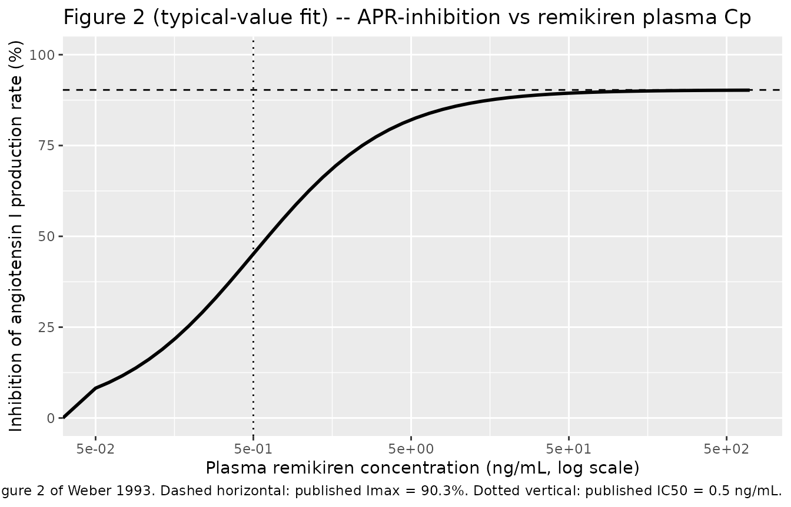
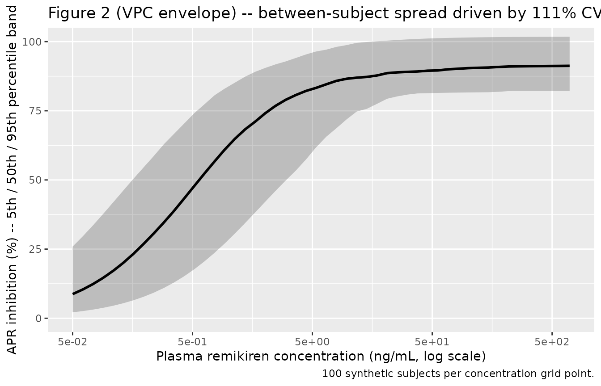

# Remikiren (Weber 1993)

## Model and source

- Citation: Weber C, Birnbock H, Leube J, Kobrin I, Kleinbloesem CH, van
  Brummelen P (1993). Multiple dose pharmacokinetics and concentration
  effect relationship of the orally active renin inhibitor remikiren (Ro
  42-5892) in hypertensive patients. Br J Clin Pharmacol 36(6):547-555.
  <doi:10.1111/j.1365-2125.1993.tb00413.x>.
- Description: Population pharmacodynamic Hill / Emax model for the
  orally active renin inhibitor remikiren (Ro 42-5892) in patients with
  mild-to-moderate essential hypertension. Inhibition of the angiotensin
  I production rate (APR; the net inhibition of plasma renin activity
  corrected for changes in immunoreactive renin) is described as a
  saturable function of observed plasma remikiren concentration via the
  Hill equation with the Hill coefficient fixed at 1. PD-only model:
  plasma remikiren concentration is supplied as a time-varying covariate
  CP_REM_NGML (ng/mL). The source publication characterised remikiren PK
  with model-independent NCA only (Cmax / tmax / AUC0-t in Table 1) and
  did not develop a structural population PK model, so the PD model has
  no coupled PK component. Population: 144 patients with
  mild-to-moderate essential hypertension across three multi-dose
  clinical pharmacology studies (oral solution or 100 mg capsules;
  100-800 mg po qd for 8 days).
- Article: <https://doi.org/10.1111/j.1365-2125.1993.tb00413.x>

## Population

Weber 1993 pooled 144 patients with mild-to-moderate essential
hypertension from three F. Hoffmann-La Roche clinical pharmacology
studies. Study A enrolled 70 male volunteers aged 30-64 y receiving
once-daily oral remikiren 100, 200, 400, or 800 mg (oral solution in
orange juice, empty stomach) for 8 days. Study B enrolled 51 volunteers
(26 male, 25 female) aged 24-69 y on 300 or 600 mg once-daily capsules
for 8 days, with an i.v. 100 mg dose 4 h after the last oral dose. Study
C enrolled 24 male volunteers aged 38-64 y on 600 mg once-daily capsules
for 8 days, also with an i.v. dose 4 h after the last oral dose. All
three studies were double-blind, randomized, placebo-controlled, and
parallel-group; entry sitting diastolic blood pressure ranged 95-115 mm
Hg depending on study.

The same demographics are exposed programmatically via the model’s
`population` metadata
(`readModelDb("Weber_1993_remikiren")$population`).

## Source trace

The per-parameter origin is recorded as in-file comments next to each
`ini()` entry in `inst/modeldb/pharmacodynamics/Weber_1993_remikiren.R`.
The table below collects them in one place for review.

| Equation / parameter | Value | Source location |
|----|----|----|
| `Imax` (`limax = log(0.903)`) | 90.3% (fraction 0.903) | Weber 1993 Results p. 552, paragraph 5 |
| `IC50` (`lic50 = log(0.5)`) | 0.5 ng/mL | Weber 1993 Results p. 552, paragraph 5 |
| `hill` (`lhill = fixed(log(1))`) | 1 (fixed) | Weber 1993 Results p. 552 (‘Hill coefficient set to 1’) |
| `etalimax ~ 0.005461` | omega^2 = log(1 + 0.074^2); IIV CV = 7.4% | Weber 1993 Results p. 552 |
| `etalic50 ~ 0.802923` | omega^2 = log(1 + 1.110^2); IIV CV = 111% | Weber 1993 Results p. 552 |
| `propSd = 0.30` | 30% proportional CV (placeholder) | Not reported in Weber 1993 – see Assumptions and deviations |
| Hill equation `APR = Imax * Cp^hill / (IC50^hill + Cp^hill)` | n/a | Weber 1993 Methods, ‘Concentration-effect modelling’ (unnumbered equation between equations 1 and 2) |
| APR (= net inhibition of PRA) definition | n/a | Weber 1993 Methods, ‘Concentration-effect modelling’ (unnumbered equation 1) |
| Hill coefficient = 1 (fixed) | n/a | Weber 1993 Results p. 552 (‘with the Hill coefficient set to 1’) |

## Virtual cohort

The original observed concentrations and APR values are not publicly
available. The figures below use a synthetic concentration grid that
spans the remikiren plasma-concentration range observed across the three
Weber 1993 studies (Table 1: individual Cmax values ran from ~0.4 ng/mL
to ~620 ng/mL across the 200-800 mg oral doses) plus zero (the placebo /
pre-dose anchor).

``` r

set.seed(1993L)

# Log-spaced concentration grid spanning the observed remikiren plasma-Cmax
# range across the three Weber 1993 studies (Table 1). We anchor at 0 ng/mL
# (placebo) and extend to ~700 ng/mL (above the largest individual Cmax of
# 623 ng/mL in Study C).
conc_grid <- c(0, exp(seq(log(0.05), log(700), length.out = 50)))

# Synthetic individuals: each "subject" sees the full concentration grid as a
# series of observation rows. We carry a regimen label so plots can stratify.
# Time is a dummy axis since the PD model is algebraic (no ODE state).
n_subj <- 100L
events <- tibble::tibble(
  id          = rep(seq_len(n_subj), each = length(conc_grid)),
  time        = rep(seq_along(conc_grid) - 1, n_subj),
  evid        = 0L,
  amt         = 0,
  CP_REM_NGML = rep(conc_grid, n_subj)
) |>
  dplyr::mutate(regimen = "concentration sweep")
```

## Simulation

``` r

mod <- readModelDb("Weber_1993_remikiren")

# Stochastic VPC: log-normal IIV on Imax and IC50.
sim <- rxode2::rxSolve(
  mod,
  events = events,
  keep   = c("regimen", "CP_REM_NGML")
) |>
  as.data.frame()
```

For a deterministic typical-value replication of Figure 2’s “fitted
line”, zero the random effects and re-solve:

``` r

mod_typ <- rxode2::zeroRe(mod)
sim_typ <- rxode2::rxSolve(
  mod_typ,
  events = events |> dplyr::filter(id == 1L),
  keep   = c("regimen", "CP_REM_NGML")
) |>
  as.data.frame()
#> ℹ omega/sigma items treated as zero: 'etalimax', 'etalic50'
```

## Replicate published figures

### Figure 2 – APR-inhibition versus plasma remikiren concentration

``` r

# Replicates Figure 2 of Weber 1993: smoothed concentration-effect curve
# (the 'fitted line') for the typical-value Hill / Emax model.
sim_typ |>
  ggplot(aes(CP_REM_NGML, 100 * APR)) +
  geom_line(linewidth = 1) +
  geom_hline(yintercept = 90.3, linetype = "dashed") +
  geom_vline(xintercept = 0.5,  linetype = "dotted") +
  scale_x_log10(breaks = c(0.05, 0.5, 5, 50, 500)) +
  coord_cartesian(xlim = c(0.05, 700), ylim = c(0, 100)) +
  labs(
    x       = "Plasma remikiren concentration (ng/mL, log scale)",
    y       = "Inhibition of angiotensin I production rate (%)",
    title   = "Figure 2 (typical-value fit) -- APR-inhibition vs remikiren plasma Cp",
    caption = paste(
      "Replicates the 'fitted line' in Figure 2 of Weber 1993.",
      "Dashed horizontal: published Imax = 90.3%.",
      "Dotted vertical: published IC50 = 0.5 ng/mL."
    )
  )
#> Warning in scale_x_log10(breaks = c(0.05, 0.5, 5, 50, 500)): log-10
#> transformation introduced infinite values.
```



The IC50 (0.5 ng/mL) sits where the curve crosses 45.15% (= Imax / 2),
and the Imax asymptote (90.3%) is approached for plasma concentrations
above ~50 ng/mL.

``` r

# Stochastic envelope: 5th / 50th / 95th percentile of APR across the
# 100 synthetic subjects at each concentration. Mirrors the smoothed
# 'individual data' line (dotted) and 'model predicted individual data'
# line (dashed) in Weber 1993 Figure 2 -- the dispersion reflects the
# 111% IIV on IC50.
sim |>
  dplyr::filter(CP_REM_NGML > 0) |>
  dplyr::group_by(CP_REM_NGML) |>
  dplyr::summarise(
    Q05 = stats::quantile(APR, 0.05, na.rm = TRUE),
    Q50 = stats::quantile(APR, 0.50, na.rm = TRUE),
    Q95 = stats::quantile(APR, 0.95, na.rm = TRUE),
    .groups = "drop"
  ) |>
  ggplot(aes(CP_REM_NGML, 100 * Q50)) +
  geom_ribbon(aes(ymin = 100 * Q05, ymax = 100 * Q95), alpha = 0.25) +
  geom_line(linewidth = 1) +
  scale_x_log10(breaks = c(0.05, 0.5, 5, 50, 500)) +
  coord_cartesian(xlim = c(0.05, 700), ylim = c(0, 100)) +
  labs(
    x       = "Plasma remikiren concentration (ng/mL, log scale)",
    y       = "APR inhibition (%) -- 5th / 50th / 95th percentile band",
    title   = "Figure 2 (VPC envelope) -- between-subject spread driven by 111% CV IIV on IC50",
    caption = "100 synthetic subjects per concentration grid point."
  )
```



## PD checks (no PKNCA)

Weber 1993 reports plasma remikiren PK with model-independent NCA only
(Cmax / tmax / AUC0-t in Table 1, by dose and study day) and does not
fit a structural PK model. Because the packaged nlmixr2lib model is
PD-only – driven by an externally supplied CP_REM_NGML covariate – there
is no model-predicted concentration to integrate, and the PKNCA
validation pattern used elsewhere in the package does not apply. The
figure 2 reproduction above is the substitute concentration-response
sanity check.

The typical-value PD sanity points below confirm the algebraic Hill /
Emax form is wired correctly.

``` r

sanity <- tibble::tibble(
  CP_REM_NGML = c(0, 0.5, 5, 50, 500)
) |>
  dplyr::mutate(
    id            = 1L,
    time          = seq_along(CP_REM_NGML) - 1,
    evid          = 0L,
    amt           = 0,
    regimen       = "sanity"
  )

sanity_sim <- rxode2::rxSolve(
  mod_typ,
  events = sanity,
  keep   = c("CP_REM_NGML")
) |>
  as.data.frame() |>
  dplyr::transmute(
    `Plasma Cp (ng/mL)`         = CP_REM_NGML,
    `Typical APR inhibition (%)`= round(100 * APR, 2),
    `Expected (Imax * Cp / (IC50 + Cp))` = round(
      100 * 0.903 * CP_REM_NGML / (0.5 + CP_REM_NGML), 2
    )
  )
#> ℹ omega/sigma items treated as zero: 'etalimax', 'etalic50'

knitr::kable(sanity_sim, caption = "Typical-value Hill / Emax evaluation at canonical plasma concentrations.")
```

| Plasma Cp (ng/mL) | Typical APR inhibition (%) | Expected (Imax \* Cp / (IC50 + Cp)) |
|---:|---:|---:|
| 0.0 | 0.00 | 0.00 |
| 0.5 | 45.15 | 45.15 |
| 5.0 | 82.09 | 82.09 |
| 50.0 | 89.41 | 89.41 |
| 500.0 | 90.21 | 90.21 |

Typical-value Hill / Emax evaluation at canonical plasma concentrations.
{.table}

The “Typical” column should match the closed-form “Expected” column to
numerical tolerance. At Cp = 0.5 ng/mL (= IC50) the inhibition is 45.15%
= Imax / 2; at Cp = 50 ng/mL the inhibition is already 89.4%, within 1%
of the Imax asymptote of 90.3%.

## Assumptions and deviations

- **Residual error magnitude is a placeholder.** Weber 1993 does not
  tabulate the residual SD / SIGMA for the PD fit; only Imax, IC50,
  their parameter precisions (RSE) and IIV CV% are reported. The
  packaged model uses `propSd = 0.30` (30% proportional CV) to enable
  simulation, but typical-value predictions are independent of this
  choice – only the stochastic VPC envelope is affected. A user fitting
  this model to new data should re-estimate the residual error from the
  data; a user simulating typical-value PD curves can ignore the
  magnitude.
- **IIV omega^2 derived from reported CV%.** Weber 1993 fit the random
  effects as constant coefficients of variance in NONMEM III (Methods,
  ‘Concentration-effect modelling’) and reports IIV as CV%. The packaged
  model encodes log-normal etas with omega^2 = log(1 + CV^2): for Imax
  IIV 7.4% the omega^2 is 0.005461, for IC50 IIV 111% the omega^2 is
  0.802923. The small-CV approximation is exact for Imax (CV = 7.4%) and
  is the standard log-normal mapping at large CV (111%); the linear-CCV
  original and the log-normal encoding differ by less than ~2% on the
  IC50 median.
- **No structural PK model.** Weber 1993 used model-independent NCA only
  to characterise remikiren PK (Methods, ‘Pharmacokinetic analysis’:
  Cmax, tmax, AUC0-t from observed plasma concentrations) and explicitly
  notes that ‘no terminal half-life could be estimated and no
  extrapolation of AUC from the time of the last measurable plasma
  concentration to infinity could be performed’ because of irregular
  fluctuating profiles (Results, p. 551). Users wishing to drive the PD
  model from a simulated PK source must supply their own concentration
  trajectory; the prior single-dose Weber-group papers in healthy
  volunteers (references \[13\] and \[14\] of Weber 1993) report
  structural PK estimates (CL ~900 mL/min, V ~70 L, F ~1%) but are not
  currently in nlmixr2lib.
- **Blood-pressure / renin-inhibition correlations are null.** Weber
  1993 reports no statistically significant correlation between changes
  in blood pressure and plasma remikiren concentrations or plasma renin
  inhibition (Results, p. 552, and Figure 3). Those null findings are
  not tabulated as a model and are not part of this extraction.
- **Hypertensive-patient cohort.** The PD parameters above were
  estimated in patients with mild-to-moderate essential hypertension.
  Weber 1993 (Discussion p. 553) notes that the IC50 of 0.5 ng/mL in
  patients is consistent with the in-vitro IC50 of 0.5 ng/mL (0.8 nM)
  and with single-dose healthy-volunteer estimates (Imax = 95%, IC50 =
  1.7 ng/mL; reference \[14\]); the multi-dose hypertensive estimates
  are the canonical values in this packaged model.
- **Observation variable name `APR` (not `Cc`).**
  [`checkModelConventions()`](https://nlmixr2.github.io/nlmixr2lib/reference/checkModelConventions.md)
  warns that `APR` is not a canonical observation name. The convention
  default `Cc` is reserved for drug plasma concentrations; the Weber
  1993 observation is a fractional inhibition of the angiotensin I
  production rate, not a concentration. The paper’s symbol APR is
  retained for source-trace fidelity and to make clear the observation
  is on the 0-1 inhibition scale rather than a concentration scale. No
  rename is performed.
