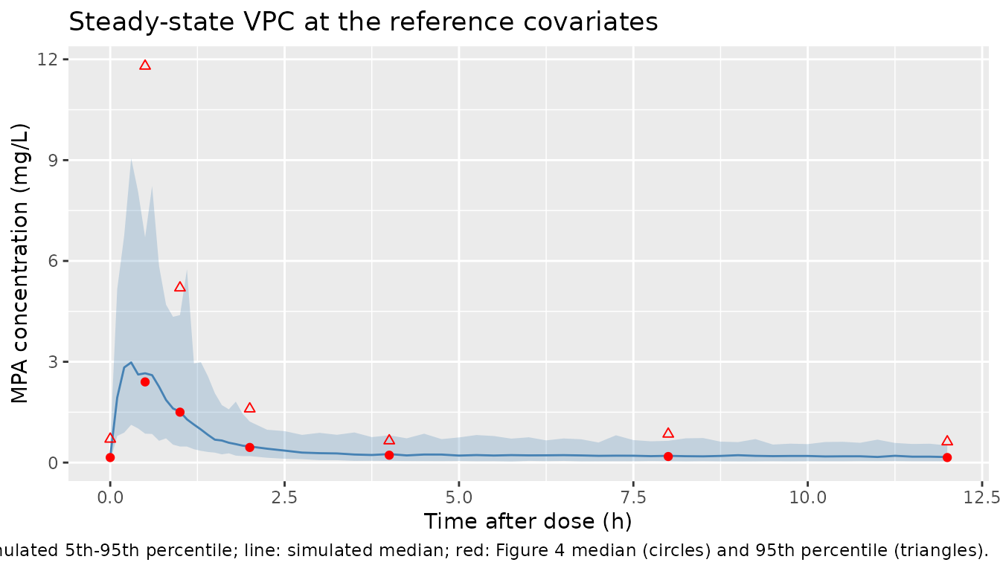
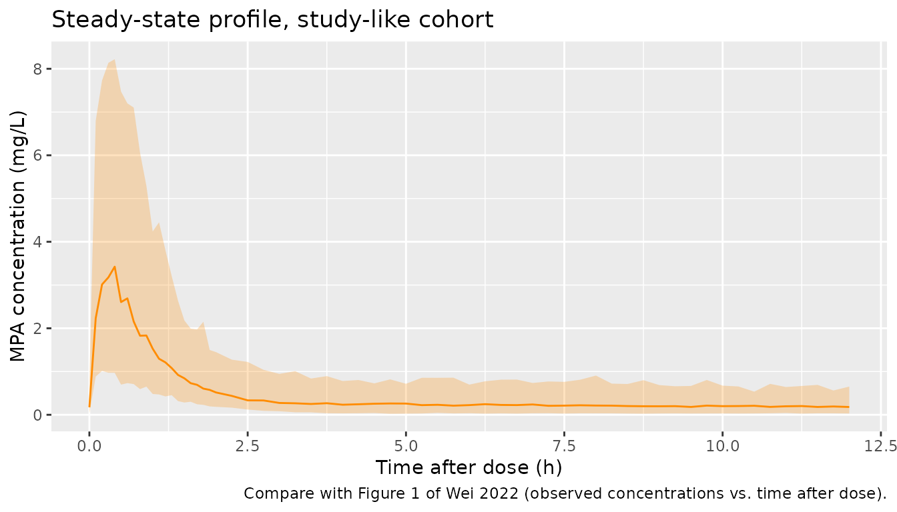

# Mycophenolic acid (Wei 2022)

## Model and source

- Citation: Wei Y, Wu D, Chen Y, Dong C, Qi J, Wu Y, Cai R, Zhou S, Li
  C, Niu L, Wu T, Xiao Y, Liu T. Population pharmacokinetics of
  mycophenolate mofetil in pediatric patients early after liver
  transplantation. Front Pharmacol. 2022;13:1002628.
  <doi:10.3389/fphar.2022.1002628>.
- Description: Two-compartment population PK model with first-order
  absorption and first-order elimination for mycophenolic acid (MPA)
  after oral mycophenolate mofetil dispersible tablets (MMFdt) in
  Chinese pediatric patients early after liver transplantation (Wei
  2022). Body weight enters every structural parameter except Vp/F by
  fixed allometric scaling to a 7.5 kg reference (exponent 0.75 on CL/F
  and Q/F, 1 on Vc/F, -0.25 on Ka); the per-administration MMF dose in
  mg/kg enters CL/F as a power term normalised to 11.16 mg/kg. Vp/F is
  fixed at 269 L. Log-normal inter-individual variability on CL/F and
  Q/F only; exponential residual error.
- Article: <https://doi.org/10.3389/fphar.2022.1002628> (open access)

Wei 2022 reports no supplementary data files; the supplementary archive
on Europe PMC holds only the six article figures. No correction notice
was found on Europe PMC or the publisher page as of 2026-10-10.

## Population

Wei 2022 enrolled 20 Chinese children (12 boys, 8 girls) receiving a
first liver transplant at the First Affiliated Hospital of Guangxi
Medical University in Nanning in 2020-2021 (Table 1). Median age was
0.74 years (IQR 0.61-1.69, range 0.42-7.76); 15 of the 20 were younger
than 24 months. Median body weight was 7.5 kg (IQR 6.0-10.0, range
4.6-27.0). The main indication was liver cirrhosis after a Kasai
operation (16 of 20). All children received mycophenolate mofetil
dispersible tablets (MMFdt) orally or by nasogastric tube every 12
hours, together with tacrolimus and methylprednisolone. Doses started at
10-15 mg/kg and were adjusted clinically. On the sampling day the median
dose was 11.2 mg/kg per dose (IQR 10.0-15.0, range 8.9-61.5). Samples
were drawn at steady state, on post-operative day 12 (median; range
4-39), before and 0.5, 1, 2, 4, 8 and 12 h after the morning dose. After
7 samples below the detection limit were removed, 115 plasma MPA
concentrations remained; the 21 below the 0.3 mg/L LLOQ were imputed as
0.15 mg/L (M5 method).

``` r

str(rxode2::rxode(readModelDb("Wei_2022_mycophenolic_acid"))$population, max.level = 1)
#> ℹ parameter labels from comments will be replaced by 'label()'
#> List of 17
#>  $ species       : chr "human"
#>  $ n_subjects    : int 20
#>  $ n_studies     : int 1
#>  $ n_observations: chr "115 MPA plasma concentrations (122 samples, 7 below the detection limit removed; the 21 remaining values below "| __truncated__
#>  $ age_range     : chr "0.42-7.76 years"
#>  $ age_median    : chr "0.74 years (IQR 0.61-1.69); 15 of 20 younger than 24 months"
#>  $ weight_range  : chr "4.6-27.0 kg"
#>  $ weight_median : chr "7.5 kg (IQR 6.0-10.0)"
#>  $ height_median : chr "67.5 cm (IQR 62.2-80.0)"
#>  $ bsa_median    : chr "0.39 m^2 (IQR 0.32-0.43)"
#>  $ sex_female_pct: num 40
#>  $ race_ethnicity: chr "Chinese (single centre, Nanning, Guangxi)."
#>  $ disease_state : chr "Pediatric first liver transplant recipients (16 liver cirrhosis after Kasai operation, 1 each biliary atresia, "| __truncated__
#>  $ dose_range    : chr "Oral or nasogastric MMF dispersible tablets q12h, starting 10-15 mg/kg per dose and adjusted clinically; 11.2 m"| __truncated__
#>  $ regions       : chr "China"
#>  $ co_medication : chr "Tacrolimus and methylprednisolone in all patients (triple regimen). Meropenem 55 %, voriconazole 50 %, furosemi"| __truncated__
#>  $ notes         : chr "Steady-state sampling from day 4 of MMFdt before and 0.5, 1, 2, 4, 8 and 12 h after the morning dose (Wei 2022 "| __truncated__
```

## Source trace

The PDF’s final-model equations (Results, Equations 1-5) are the primary
source; the abstract restates them. Table 3 gives the same estimates
rounded.

| Equation / parameter | Value | Source location |
|----|----|----|
| `lcl` (CL/F at 7.5 kg, 11.16 mg/kg) | log(14.8) L/h | Equation 1; Table 3 |
| `lka` (Ka at 7.5 kg) | log(2.02) 1/h | Equation 2 (Table 3 rounds to 2.0) |
| `lvc` (Vc/F at 7.5 kg) | log(6.01) L | Equation 3 (Table 3 rounds to 6.0) |
| `lvp` (Vp/F) | fixed(log(269)) L | Equation 4 (“fixed”); Table 3 |
| `lq` (Q/F at 7.5 kg) | log(15.4) L/h | Equation 5; Table 3 |
| `e_wt_cl`, `e_wt_q` | fixed 0.75 | Equations 1 and 5 |
| `e_wt_vc` | fixed 1 | Equation 3 |
| `e_wt_ka` | fixed -0.25 | Equation 2 |
| `e_dose_cl` | 0.452 | Equation 1; Table 3 theta_DOSE |
| Dose normaliser | 11.16 mg/kg | Equation 1 |
| `etalcl` | variance 0.06 | Equation 1 term `e^0.06` (printed as `f ^ 0.06`); Table 3 IIV CL/F 24.5 % = sqrt(0.06) |
| `etalq` | variance 1.39 | Equation 5 term `e^1.39`; Table 3 IIV Q/F 117.9 % = sqrt(1.39) |
| `expSd` | 0.503 | Table 3 RV 50.3 %; Results: “IIV and RV were represented as exponents” |
| Structure | 2-cmt, first-order absorption and elimination | Abstract; Results “Population pharmacokinetic model” |

## Virtual cohort

Two arms of 200 virtual children each, dosed every 12 hours for 10 days
(20 doses, steady state), with dense sampling over the final interval.

- **Reference**: every child at the 7.5 kg / 11.16 mg/kg reference.
  Figure 4 of Wei 2022 is a prediction-corrected VPC, which normalises
  each observation to the typical prediction at its covariates, so a
  reference-covariate cohort is the comparable simulation.
- **Study-like**: weight and dose per kg drawn to match Table 1. Weight
  is log-normal with median 7.5 kg and log-SD 0.379, from IQR 6.0-10.0,
  truncated to 4.6-27 kg. Dose per kg is log-normal with median 11.16
  mg/kg and log-SD 0.30, from IQR 10-15, truncated to 8.9-61.5 mg/kg.

``` r

set.seed(20221013)

n_per_arm <- 200L
dose_times <- seq(0, 228, by = 12)
obs_times <- c(seq(228, 230, by = 0.1), seq(230.25, 240, by = 0.25))

rtrunc_lnorm <- function(n, median, sdlog, lo, hi) {
  x <- rlnorm(n, log(median), sdlog)
  bad <- x < lo | x > hi
  while (any(bad)) {
    x[bad] <- rlnorm(sum(bad), log(median), sdlog)
    bad <- x < lo | x > hi
  }
  x
}

make_cohort <- function(subjects, arm) {
  doses <- tidyr::crossing(subjects, time = dose_times) |>
    mutate(evid = 1L, cmt = "depot", amt = DOSE_MMF_MGKG * WT)
  obs <- tidyr::crossing(subjects, time = obs_times) |>
    mutate(evid = 0L, cmt = "central", amt = 0)
  bind_rows(doses, obs) |>
    mutate(arm = arm) |>
    select(id, time, evid, amt, cmt, WT, DOSE_MMF_MGKG, arm) |>
    arrange(id, time, desc(evid))
}

ref_subj <- tibble(id = seq_len(n_per_arm), WT = 7.5, DOSE_MMF_MGKG = 11.16)
study_subj <- tibble(
  id = n_per_arm + seq_len(n_per_arm),
  WT = rtrunc_lnorm(n_per_arm, 7.5, 0.379, 4.6, 27),
  DOSE_MMF_MGKG = rtrunc_lnorm(n_per_arm, 11.16, 0.30, 8.9, 61.5)
)

events <- bind_rows(
  make_cohort(ref_subj, "Reference (7.5 kg, 11.16 mg/kg)"),
  make_cohort(study_subj, "Study-like (Table 1)")
)
stopifnot(!anyDuplicated(unique(events[, c("id", "time", "evid")])))

summary(study_subj[, c("WT", "DOSE_MMF_MGKG")])
#>        WT         DOSE_MMF_MGKG   
#>  Min.   : 4.727   Min.   : 8.919  
#>  1st Qu.: 6.624   1st Qu.:10.336  
#>  Median : 8.107   Median :11.575  
#>  Mean   : 8.442   Mean   :12.528  
#>  3rd Qu.: 9.406   3rd Qu.:13.595  
#>  Max.   :17.751   Max.   :31.240
```

## Simulation

``` r

mod <- readModelDb("Wei_2022_mycophenolic_acid")
rxode2::rxSetSeed(20221013)
sim <- rxode2::rxSolve(mod, events = events, keep = c("arm", "WT", "DOSE_MMF_MGKG")) |>
  as.data.frame() |>
  mutate(tad = time - 228)
#> ℹ parameter labels from comments will be replaced by 'label()'

sim_typ <- rxode2::rxSolve(rxode2::zeroRe(mod), events = filter(events, id == 1L)) |>
  as.data.frame() |>
  mutate(tad = time - 228)
#> ℹ parameter labels from comments will be replaced by 'label()'
#> ℹ omega/sigma items treated as zero: 'etalcl', 'etalq'
```

`Cc` in the output is the individual prediction; `sim` adds the
exponential residual error.

## Replicate published figures

The points below are the median (solid red line) and 95th percentile
(upper dashed red line) of Figure 4 of Wei 2022, a prediction-corrected
VPC, read off the figure by the maintainers. The figure caption
describes these lines as the simulated median and 90 % prediction
interval, and the shaded bands as their 95 % confidence intervals.
Either way they are the paper’s own summary of the steady-state profile
at the reference covariates.

``` r

fig4_obs <- tibble::tribble(
  ~tad, ~Q50, ~Q95,
  0,    0.15, 0.7,
  0.5,  2.4,  11.8,
  1,    1.5,  5.2,
  2,    0.45, 1.6,
  4,    0.22, 0.65,
  8,    0.18, 0.85,
  12,   0.15, 0.62
)

vpc <- sim |>
  filter(arm == "Reference (7.5 kg, 11.16 mg/kg)") |>
  group_by(tad) |>
  summarise(
    Q05 = quantile(sim, 0.05),
    Q50 = quantile(sim, 0.50),
    Q95 = quantile(sim, 0.95),
    .groups = "drop"
  )

ggplot(vpc, aes(tad)) +
  geom_ribbon(aes(ymin = Q05, ymax = Q95), fill = "steelblue", alpha = 0.25) +
  geom_line(aes(y = Q50), colour = "steelblue") +
  geom_point(data = fig4_obs, aes(y = Q50), colour = "red") +
  geom_point(data = fig4_obs, aes(y = Q95), colour = "red", shape = 2) +
  labs(
    x = "Time after dose (h)", y = "MPA concentration (mg/L)",
    title = "Steady-state VPC at the reference covariates",
    caption = paste(
      "Replicates Figure 4 of Wei 2022. Band: simulated 5th-95th percentile;",
      "line: simulated median; red: Figure 4 median (circles) and 95th percentile (triangles)."
    )
  )
```



``` r

fig4_cmp <- fig4_obs |>
  left_join(
    vpc |> rename(sim_Q50 = Q50, sim_Q95 = Q95) |> mutate(tad = round(tad, 2)),
    by = "tad"
  ) |>
  select(tad, Q50, sim_Q50, Q95, sim_Q95)
fig4_cmp |>
  rename(
    "Time after dose (h)" = tad,
    "Figure 4 median" = Q50,
    "Simulated median" = sim_Q50,
    "Figure 4 95th" = Q95,
    "Simulated 95th" = sim_Q95
  ) |>
  knitr::kable(digits = 2, caption = "Figure 4 percentiles vs. this simulation (mg/L).")
```

| Time after dose (h) | Figure 4 median | Simulated median | Figure 4 95th | Simulated 95th |
|---:|---:|---:|---:|---:|
| 0.0 | 0.15 | 0.17 | 0.70 | 0.60 |
| 0.5 | 2.40 | 2.66 | 11.80 | 6.70 |
| 1.0 | 1.50 | 1.52 | 5.20 | 4.39 |
| 2.0 | 0.45 | 0.48 | 1.60 | 1.22 |
| 4.0 | 0.22 | 0.25 | 0.65 | 0.81 |
| 8.0 | 0.18 | 0.20 | 0.85 | 0.65 |
| 12.0 | 0.15 | 0.16 | 0.62 | 0.51 |

Figure 4 percentiles vs. this simulation (mg/L). {.table}

``` r


# The typical-value peak and trough set the location of the whole profile; a
# wrong CL/F, Vc/F or dose unit moves them several-fold. The bounds are the
# 95 % CI band of the simulated median drawn in Figure 4 (about 1.4-3.7 mg/L
# at 0.5 h, about 0.1-0.4 mg/L from 4 h on).
typ_peak <- sim_typ$Cc[which.min(abs(sim_typ$tad - 0.5))]
typ_trough <- sim_typ$Cc[which.min(abs(sim_typ$tad - 12))]
stopifnot(
  typ_peak > 1.4, typ_peak < 3.7,
  typ_trough > 0.1, typ_trough < 0.4
)
c(typical_peak_0.5h = typ_peak, typical_trough_12h = typ_trough)
#>  typical_peak_0.5h typical_trough_12h 
#>          2.8762833          0.2072095
```

Compare the simulated median and 95th percentile with the Figure 4
values in the table above. Figure 4 summarises only 20 children, so its
upper percentile is noisy.

The study-like cohort shows the spread that weight and dose add to the
reference-covariate profile, for comparison with the raw observations in
Figure 1 of Wei 2022 (peaks up to about 10 mg/L, troughs mostly 0.15-1.3
mg/L).

``` r

sim |>
  filter(arm == "Study-like (Table 1)") |>
  group_by(tad) |>
  summarise(
    Q05 = quantile(sim, 0.05),
    Q50 = quantile(sim, 0.50),
    Q95 = quantile(sim, 0.95),
    .groups = "drop"
  ) |>
  ggplot(aes(tad)) +
  geom_ribbon(aes(ymin = Q05, ymax = Q95), fill = "darkorange", alpha = 0.25) +
  geom_line(aes(y = Q50), colour = "darkorange") +
  labs(
    x = "Time after dose (h)", y = "MPA concentration (mg/L)",
    title = "Steady-state profile, study-like cohort",
    caption = "Compare with Figure 1 of Wei 2022 (observed concentrations vs. time after dose)."
  )
```



## PKNCA validation

Wei 2022 reports no NCA parameters. The steady-state check instead uses
mass balance: over a dosing interval at steady state the area under the
curve equals the dose divided by the individual apparent clearance,
`AUCtau = Dose / CL/F`. PKNCA computes `AUCtau` from the individual
predictions (no residual error) and the comparison uses each child’s own
clearance.

``` r

sim_nca <- sim |>
  filter(!is.na(Cc)) |>
  select(id, time, Cc, arm)

conc_obj <- PKNCA::PKNCAconc(sim_nca, Cc ~ time | arm + id)
dose_df <- events |>
  filter(evid == 1L) |>
  select(id, time, amt, arm)
dose_obj <- PKNCA::PKNCAdose(dose_df, amt ~ time | arm + id)

intervals <- data.frame(
  start = 228, end = 240,
  cmax = TRUE, tmax = TRUE, cmin = TRUE, auclast = TRUE
)
nca_res <- PKNCA::pk.nca(PKNCA::PKNCAdata(conc_obj, dose_obj, intervals = intervals))

nca_wide <- as.data.frame(nca_res$result) |>
  select(arm, id, PPTESTCD, PPORRES) |>
  tidyr::pivot_wider(names_from = PPTESTCD, values_from = PPORRES)

nca_wide |>
  group_by(arm) |>
  summarise(
    cmax = median(cmax), tmax = median(tmax), cmin = median(cmin),
    auclast = median(auclast), .groups = "drop"
  ) |>
  rename(
    "Arm" = arm,
    "Cmax (mg/L)" = cmax,
    "Tmax (h)" = tmax,
    "Cmin (mg/L)" = cmin,
    "AUC0-12 (mg*h/L)" = auclast
  ) |>
  knitr::kable(digits = 2, caption = "Median steady-state NCA by arm (individual predictions).")
```

| Arm | Cmax (mg/L) | Tmax (h) | Cmin (mg/L) | AUC0-12 (mg\*h/L) |
|:---|---:|---:|---:|---:|
| Reference (7.5 kg, 11.16 mg/kg) | 3.25 | 0.3 | 0.18 | 5.51 |
| Study-like (Table 1) | 3.41 | 0.3 | 0.20 | 5.79 |

Median steady-state NCA by arm (individual predictions). {.table}

``` r

cl_ind <- sim |>
  filter(time == 228) |>
  distinct(id, cl)
mb <- nca_wide |>
  left_join(cl_ind, by = "id") |>
  left_join(distinct(dose_df, id, amt), by = "id") |>
  mutate(
    auc_expected = amt / cl,
    pct_diff = 100 * (auclast - auc_expected) / auc_expected
  )

# Both sides use the same drawn parameters, so the difference is linear-
# trapezoidal error on the 0.1-h peak grid plus any residual approach to steady
# state. A wrong clearance or dose unit moves the median by far more than 5 %.
stopifnot(
  abs(median(mb$pct_diff)) < 5,
  quantile(abs(mb$pct_diff), 0.9) < 10
)
summary(mb$pct_diff)
#>     Min.  1st Qu.   Median     Mean  3rd Qu.     Max. 
#> -4.51876 -1.08663 -0.58024 -0.94621 -0.45327 -0.06027
```

At the reference covariates the typical `AUCtau` is 83.7 mg / 14.8 L/h =
5.7 mg*h/L. That is well below the 30-60 mg*h/L MPA target window quoted
in the Wei 2022 Introduction, because the paper’s apparent clearance of
14.8 L/h in a 7.5 kg child is high. The model reproduces the low
concentrations Wei 2022 observed (Figures 1 and 4); it does not reach
the adult target range.

## Assumptions and deviations

- **Dose covariate units.** Wei 2022 defines `DOSE` only as “the MMFdt
  administered dose”. The maintainers read it as mg/kg per
  administration because the normaliser 11.16 matches the Table 1 median
  of 11.2 mg/kg per dose. A total dose in mg would be about 84 mg for a
  7.5 kg child. The covariate is named `DOSE_MMF_MGKG`; set it to
  `amt / WT` on each dose.
- **Dose mass scale.** Doses are entered as MMF mg. The paper reports no
  MPA-equivalent conversion, so the apparent CL/F, Vc/F, Q/F and Vp/F
  are taken to absorb the MMF-to-MPA mass ratio (0.739) along with
  bioavailability. The typical-value profile matches the Figure 4 median
  on this basis (0.5 h simulated about 2.9 mg/L vs. 2.4 mg/L in the
  figure). With MPA-equivalent dosing it would be about 2.1 mg/L, so the
  figure cannot cleanly separate the two readings.
- **IIV variances.** The equations print the random effects as
  `f ^ 0.06` and `f ^ 1.39`, a rendering of `e^eta` with the variance as
  the exponent. The maintainers used 0.06 and 1.39 directly as the
  log-scale variances. Table 3’s 24.5 % and 117.9 % are their square
  roots.
- **Residual error.** “Exponential” residual error with RV 50.3 % is
  encoded as `lnorm(expSd)` with `expSd = 0.503`.
- **Ka and Vc/F precision.** The equations print 2.02 h^-1 and 6.01 L;
  Table 3 rounds these to 2.0 and 6.0. The equation values are used.
- **Screened but not retained covariates.** ALT and GRWR on CL/F, and
  UGT1A8 518C\>G and SLCO1B1 521T\>C on Q/F, entered during forward
  selection (Table 2) and were removed. They are documented in
  `covariatesDataExcluded`.
- **Virtual cohort.** Weight and dose-per-kg distributions are
  log-normal fits to the Table 1 medians and IQRs, independent of each
  other. The 10-day dosing history stands in for each child’s actual
  post-transplant history.
- **Figure 4 values.** The median and 95th-percentile lines were read
  off the published figure by the maintainers to about +/- 0.1 mg/L.
