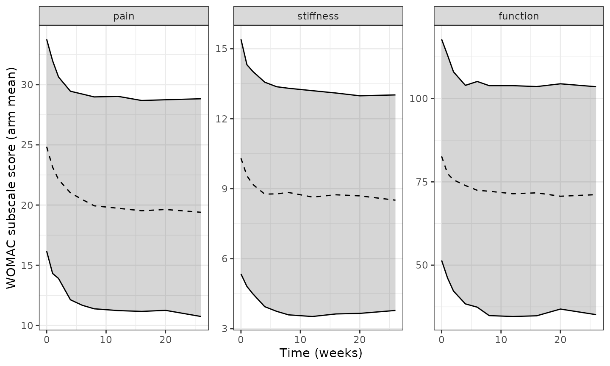

# Oral placebo response on the WOMAC subscales in osteoarthritis trials: a longitudinal MBMA (Wen 2022)

## Model and source

Wen X, Luo J, Mai Y, Li Y, Cao Y, Li Z, Han S, Fu Q, Zheng Q, Ding L,
Zhang Z, Li L. *Placebo Response to Oral Administration in
Osteoarthritis Clinical Trials and Its Associated Factors: A Model-Based
Meta-analysis.* JAMA Netw Open. 2022;5(10):e2235060.
[doi:10.1001/jamanetworkopen.2022.35060](https://doi.org/10.1001/jamanetworkopen.2022.35060)
(PMC9552894, open access, CC BY).

There is **no drug** in these models. The authors systematically
reviewed randomized, double-blind, placebo-controlled osteoarthritis
(OA) trials published 1991-2022 in which the treatments and placebo were
given orally, extracted the **placebo arms** of 130 trials (12,673
participants), and fitted the time course of the arm-mean score on each
Western Ontario and McMaster Universities Osteoarthritis Index (WOMAC)
subscale. The purpose is trial design: to predict how far the placebo
arm of a new OA trial will improve, and how quickly, from its enrolled
population’s baseline severity.

The three subscales were fitted as three independent NONMEM models (one
control stream each in Supplement eMethods 5), so the library carries
them as three model files sharing this article:

| Model | Subscale | Scale | Trials |
|----|----|----|----|
| `Wen_2022_osteoarthritis_womacpain_placebo_mbma` | pain (5 items) | 0-50 | 122 |
| `Wen_2022_osteoarthritis_womacstiffness_placebo_mbma` | stiffness (2 items) | 0-20 | 96 |
| `Wen_2022_osteoarthritis_womacfunction_placebo_mbma` | function (17 items) | 0-170 | 107 |

Every model has the same structure (Supplement eMethods 3 Equations 1-4
and the eMethods 5 `$PRED` block):

``` math
\text{WOMAC}_{ij} = \text{BASE}_i - E_{\max,i}\,\bigl(1 - e^{-k_i t_j}\bigr) + \frac{\varepsilon_{ij}}{\sqrt{N_i}},
```

``` math
E_{\max,i} = E_{\max}\,\bigl(1 + \theta_{\text{baseline}}\,(\text{BASE}_i - \text{median})\bigr) + \eta_{E_{\max},i},
\qquad k_i = k\,e^{\eta_{k,i}},
```

where `BASE` is the arm’s observed mean baseline score (the covariate
`SCORE_WOMAC_PAIN`, `SCORE_WOMAC_STIFFNESS` or `SCORE_WOMAC_FUNCTION`)
and `N` is the arm’s sample size (`N_ARM`). Arms with worse baseline
symptoms improve more on placebo. No other covariate survived the
stepwise search.

Every item was standardized to 0-10 before modelling (Methods, “Data
Extraction”), so a trial reported on the 0-4 Likert version of WOMAC
must be multiplied by 2.5 before it is used as a covariate, and a 0-100
mm VAS version divided by 10.

``` r

models <- c(
  pain = "Wen_2022_osteoarthritis_womacpain_placebo_mbma",
  stiffness = "Wen_2022_osteoarthritis_womacstiffness_placebo_mbma",
  `function` = "Wen_2022_osteoarthritis_womacfunction_placebo_mbma"
)
uis <- lapply(models, function(nm) rxode2::rxode(readModelDb(nm)))
#> ℹ parameter labels from comments will be replaced by 'label()'
#> ℹ parameter labels from comments will be replaced by 'label()'
#> ℹ parameter labels from comments will be replaced by 'label()'

# Per-subscale facts used throughout: covariate and output names, the
# centring median, and the arm-baseline distribution reported in Results
# ('Characteristics of the Included Studies').
subscales <- data.frame(
  subscale = names(models),
  cov = c("SCORE_WOMAC_PAIN", "SCORE_WOMAC_STIFFNESS", "SCORE_WOMAC_FUNCTION"),
  out = c("womacpain", "womacstiffness", "womacfunction"),
  median = c(25.00, 10.23, 83.75),
  q1 = c(21.50, 7.81, 67.25),
  q3 = c(28.61, 12.00, 97.67),
  lo = c(10.00, 2.10, 20.75),
  hi = c(42.75, 16.75, 154.58)
)
```

## Population

12,673 participants in the placebo arms of 130 trials (mean age 59.9
years, 68.9% women; Results). WOMAC pain was reported by 122 trials,
stiffness by 96 and function by 107. Arm-mean baselines ranged
10.00-42.75 for pain (median 25.00), 2.10-16.75 for stiffness (median
10.23) and 20.75-154.58 for function (median 83.75). Only records up to
week 36 were modelled, because just 10 trials reported data beyond 36
weeks. The per-trial baseline characteristics are in Supplement eTable
4.

``` r

str(uis$pain$population)
#> List of 10
#>  $ species       : chr "human"
#>  $ n_subjects    : int 12673
#>  $ n_studies     : int 122
#>  $ age_range     : chr "overall mean 59.9 years (Results); arm means in eTable 4"
#>  $ sex_female_pct: num 68.9
#>  $ race_ethnicity: chr "Proportion of White patients reported by some trials only (eTable 4); it was the only racial or ethnic group wi"| __truncated__
#>  $ disease_state : chr "Osteoarthritis (knee and/or hip) in randomized, double-blind, placebo-controlled trials whose interventions and"| __truncated__
#>  $ dose_range    : chr "n/a (placebo arms only; placebo forms were caplet, tablet or pill vs powder, package or granule)"
#>  $ regions       : chr "International; PubMed, EMBASE and the Cochrane Library searched from 1 January 1991 to 2 July 2022 (eTable 1)."
#>  $ notes         : chr "MBMA at the STUDY-ARM level: 130 trials with 12,673 participants were included, of which 122 reported WOMAC pai"| __truncated__
```

## Source trace

| Item | Value (pain / stiffness / function) | Source location |
|----|----|----|
| Structural model `BASE - Emax * (1 - exp(-k * t))` | – | Supplement eMethods 3 Eq. 1; eMethods 5 `$PRED` (`EFT`) |
| Additive between-study effect on Emax | – | eMethods 3 Eq. 2; eMethods 5 `EM = TVEM + ETA(1)` |
| Exponential between-study effect on k | – | eMethods 3 Eq. 3; eMethods 5 `K = THETA(2) * EXP(ETA(2))` |
| Residual weighted by `1 / sqrt(N)` | – | eMethods 3 Eq. 4; eMethods 5 `W = 1 / SQRT(SIZE)` |
| Baseline covariate on Emax, linear and centred | centre 25 / 10.23 / 83.75 | eResults Eqs. 9-11; eMethods 5 `EMCOV` |
| `emax` | 4.73 / 1.76 / 13.2 points | Table 1, ‘Emax’ |
| `lkpbo` = log(k) | 0.427 / 0.327 / 0.325 per week | Table 1, ‘K’; eResults (units week^-1) |
| `e_score_womac_<sub>_emax` | 0.0646 / 0.0836 / 0.0140 per point | Table 1, ‘theta baseline’ |
| `eta_study_emax` (variance) | 3.56^2 / 1.41^2 / 11.8^2 | Table 1, ‘eta Emax’ (an SD in points) |
| `eta_study_lkpbo` (variance) | 0.832^2 / 1.09^2 / 0.937^2 | Table 1, ‘eta k, %’ (read as 100 \* omega) |
| `addSd` | 3.92 / 1.74 / 12.4 points | Table 1, ‘epsilon’ (an SD in points) |

## PKNCA not applicable

These are placebo time-course models with no drug, no dose and no
concentration, so there is nothing for non-compartmental analysis to
measure. The validation below instead checks the closed-form quantities
the paper derives from its parameters, reproduces every cell of Table 2,
and replicates Figures 1 and 2.

## Validation 1: closed-form quantities stated in the paper

The paper states three families of derived numbers that are not
themselves parameter estimates: the time to half of the maximal placebo
response (ET50 = 0.693 / k, eResults Eq. 12), the time to 90% of it (the
“efficacy plateau”, ln(10) / k; Results), and the change in typical Emax
for a 10% increase in baseline score (eResults). Each is recomputed from
the packaged parameter values.

``` r

k <- vapply(uis, function(u) exp(u$theta[["lkpbo"]]), numeric(1))
emax <- vapply(uis, function(u) u$theta[["emax"]], numeric(1))
theta_bl <- c(
  uis$pain$theta[["e_score_womac_pain_emax"]],
  uis$stiffness$theta[["e_score_womac_stiffness_emax"]],
  uis$`function`$theta[["e_score_womac_function_emax"]]
)
# eResults quotes the Emax increase per 5 / 2 / 17 baseline points.
step <- c(5, 2, 17)

closed <- data.frame(
  Subscale = names(models),
  `ET50 published (wk)` = c(1.62, 2.12, 2.13),
  `ET50 model (wk)` = 0.693 / k,
  `T90 published (wk)` = c(5.39, 7.04, 7.08),
  `T90 model (wk)` = log(10) / k,
  `dEmax published` = c(1.53, 0.29, 3.14),
  `dEmax model` = emax * theta_bl * step,
  check.names = FALSE,
  row.names = NULL
)
knitr::kable(closed, digits = 3,
             caption = "ET50, time to 90% of maximal response, and the Emax increase per 10% baseline increase: published vs recomputed.")
```

| Subscale | ET50 published (wk) | ET50 model (wk) | T90 published (wk) | T90 model (wk) | dEmax published | dEmax model |
|:---|---:|---:|---:|---:|---:|---:|
| pain | 1.62 | 1.623 | 5.39 | 5.392 | 1.53 | 1.528 |
| stiffness | 2.12 | 2.119 | 7.04 | 7.042 | 0.29 | 0.294 |
| function | 2.13 | 2.132 | 7.08 | 7.085 | 3.14 | 3.142 |

ET50, time to 90% of maximal response, and the Emax increase per 10%
baseline increase: published vs recomputed. {.table}

``` r


stopifnot(
  # Deterministic arithmetic on the packaged values; the only slack is the
  # rounding of the printed numbers.
  all(abs(closed$`ET50 model (wk)` - closed$`ET50 published (wk)`) < 0.006),
  all(abs(closed$`T90 model (wk)` - closed$`T90 published (wk)`) < 0.006),
  all(abs(closed$`dEmax model` - closed$`dEmax published`) < 0.006)
)
```

## Validation 2: every cell of Table 2

Table 2 gives the typical placebo response (change from baseline) at 6,
8, 12, 24 and 36 weeks for three baseline levels per subscale – 45
numbers, none of which is a parameter estimate. The model is solved with
all random effects set to zero. The paper’s values are medians of 1000
simulations that resample the parameter estimates, so they can differ
from the typical value by more than rounding; in practice they agree to
within the last printed digit.

``` r

times <- c(6, 8, 12, 24, 36)

table2 <- data.frame(
  subscale = rep(names(models), each = 15),
  baseline = rep(c(15, 25, 35, 5, 10, 15, 37.5, 75, 112.5), each = 5),
  time = rep(times, 9),
  published = c(
    -1.55, -1.62, -1.66, -1.67, -1.67,
    -4.37, -4.57, -4.70, -4.73, -4.73,
    -7.18, -7.53, -7.74, -7.79, -7.79,
    -0.85, -0.92, -0.97, -0.99, -0.99,
    -1.48, -1.60, -1.69, -1.73, -1.73,
    -2.12, -2.28, -2.41, -2.46, -2.46,
    -3.99, -4.31, -4.56, -4.65, -4.65,
    -9.94, -10.72, -11.35, -11.58, -11.58,
    -15.88, -17.14, -18.14, -18.51, -18.51
  )
)

# One "arm" per baseline level; N_ARM is irrelevant to the typical value.
solve_typical <- function(sub, baselines, times) {
  info <- subscales[subscales$subscale == sub, ]
  ev <- expand.grid(id = seq_along(baselines), time = times)
  ev$evid <- 0L
  ev$amt <- 0
  ev[[info$cov]] <- baselines[ev$id]
  ev$N_ARM <- 100
  ev <- ev[order(ev$id, ev$time), ]
  sim <- rxode2::rxSolve(rxode2::zeroRe(uis[[sub]]), ev, returnType = "data.frame")
  if (is.null(sim$id)) sim$id <- 1L
  data.frame(
    subscale = sub,
    baseline = baselines[sim$id],
    time = sim$time,
    score = sim[[info$out]],
    change = sim[[info$out]] - baselines[sim$id]
  )
}

typ <- dplyr::bind_rows(
  solve_typical("pain", c(15, 25, 35), times),
  solve_typical("stiffness", c(5, 10, 15), times),
  solve_typical("function", c(37.5, 75, 112.5), times)
)
#> Warning: No sigma parameters in the model
#> ℹ omega/sigma items treated as zero: 'eta_study_emax', 'eta_study_lkpbo'
#> Warning: multi-subject simulation without without 'omega'
#> Warning: No sigma parameters in the model
#> ℹ omega/sigma items treated as zero: 'eta_study_emax', 'eta_study_lkpbo'
#> Warning: multi-subject simulation without without 'omega'
#> Warning: No sigma parameters in the model
#> ℹ omega/sigma items treated as zero: 'eta_study_emax', 'eta_study_lkpbo'
#> Warning: multi-subject simulation without without 'omega'

cmp2 <- table2 |>
  dplyr::left_join(typ, by = c("subscale", "baseline", "time")) |>
  dplyr::mutate(diff = change - published)

cmp2 |>
  dplyr::select(subscale, baseline, time, published, change) |>
  tidyr::pivot_wider(names_from = time, values_from = c(published, change)) |>
  dplyr::select(subscale, baseline,
                published_6, change_6, published_8, change_8,
                published_12, change_12, published_36, change_36) |>
  dplyr::rename(
    Subscale = subscale, Baseline = baseline,
    `Wk 6 paper` = published_6, `Wk 6 model` = change_6,
    `Wk 8 paper` = published_8, `Wk 8 model` = change_8,
    `Wk 12 paper` = published_12, `Wk 12 model` = change_12,
    `Wk 36 paper` = published_36, `Wk 36 model` = change_36
  ) |>
  knitr::kable(digits = 2,
               caption = "Typical placebo response (change from baseline, points): Wen 2022 Table 2 vs the packaged models (week 24 omitted for width; it is included in the check).")
```

| Subscale | Baseline | Wk 6 paper | Wk 6 model | Wk 8 paper | Wk 8 model | Wk 12 paper | Wk 12 model | Wk 36 paper | Wk 36 model |
|:---|---:|---:|---:|---:|---:|---:|---:|---:|---:|
| pain | 15.0 | -1.55 | -1.55 | -1.62 | -1.62 | -1.66 | -1.66 | -1.67 | -1.67 |
| pain | 25.0 | -4.37 | -4.37 | -4.57 | -4.57 | -4.70 | -4.70 | -4.73 | -4.73 |
| pain | 35.0 | -7.18 | -7.18 | -7.53 | -7.53 | -7.74 | -7.74 | -7.79 | -7.79 |
| stiffness | 5.0 | -0.85 | -0.85 | -0.92 | -0.92 | -0.97 | -0.97 | -0.99 | -0.99 |
| stiffness | 10.0 | -1.48 | -1.48 | -1.60 | -1.60 | -1.69 | -1.69 | -1.73 | -1.73 |
| stiffness | 15.0 | -2.12 | -2.12 | -2.28 | -2.28 | -2.41 | -2.41 | -2.46 | -2.46 |
| function | 37.5 | -3.99 | -3.99 | -4.31 | -4.31 | -4.56 | -4.56 | -4.65 | -4.65 |
| function | 75.0 | -9.94 | -9.94 | -10.72 | -10.72 | -11.35 | -11.35 | -11.58 | -11.58 |
| function | 112.5 | -15.88 | -15.88 | -17.14 | -17.14 | -18.14 | -18.14 | -18.51 | -18.51 |

Typical placebo response (change from baseline, points): Wen 2022 Table
2 vs the packaged models (week 24 omitted for width; it is included in
the check). {.table}

``` r


sprintf("Largest absolute difference over all 45 cells: %.4f points", max(abs(cmp2$diff)))
#> [1] "Largest absolute difference over all 45 cells: 0.0050 points"

stopifnot(
  nrow(cmp2) == 45L,
  !anyNA(cmp2$change),
  # Typical-value arithmetic with no random draw; 0.006 is rounding slack on
  # two-decimal published values.
  max(abs(cmp2$diff)) < 0.006
)
```

The same solve also confirms the percentages quoted in the Results for
week 8 (decrease as a share of baseline): 10.8 / 18.3 / 22.1% for pain,
18.4 / 16.0 / 15.2% for stiffness, and 11.5 / 14.3 / 15.2% for function.

``` r

typ |>
  dplyr::filter(time == 8) |>
  dplyr::mutate(`Decrease (% of baseline)` = -100 * change / baseline) |>
  dplyr::select(Subscale = subscale, Baseline = baseline, `Decrease (% of baseline)`) |>
  knitr::kable(digits = 1, caption = "Week-8 typical decrease as a percentage of baseline.")
```

| Subscale  | Baseline | Decrease (% of baseline) |
|:----------|---------:|-------------------------:|
| pain      |     15.0 |                     10.8 |
| pain      |     25.0 |                     18.3 |
| pain      |     35.0 |                     21.5 |
| stiffness |      5.0 |                     18.4 |
| stiffness |     10.0 |                     16.0 |
| stiffness |     15.0 |                     15.2 |
| function  |     37.5 |                     11.5 |
| function  |     75.0 |                     14.3 |
| function  |    112.5 |                     15.2 |

Week-8 typical decrease as a percentage of baseline. {.table}

All agree except pain at baseline 35, where the paper prints 22.1% but
its own Table 2 value (7.53 / 35) is 21.5%; see the Errata below.

## Replication: Figure 2, typical placebo response by baseline level

``` r

curve <- dplyr::bind_rows(
  solve_typical("pain", c(15, 25, 35), seq(0, 36, by = 0.25)),
  solve_typical("stiffness", c(5, 10, 15), seq(0, 36, by = 0.25)),
  solve_typical("function", c(37.5, 75, 112.5), seq(0, 36, by = 0.25))
) |>
  dplyr::group_by(subscale) |>
  dplyr::mutate(level = factor(baseline, labels = c("low", "medium", "high"))) |>
  dplyr::ungroup() |>
  dplyr::mutate(subscale = factor(subscale, levels = names(models)))
#> Warning: No sigma parameters in the model
#> ℹ omega/sigma items treated as zero: 'eta_study_emax', 'eta_study_lkpbo'
#> Warning: multi-subject simulation without without 'omega'
#> Warning: No sigma parameters in the model
#> ℹ omega/sigma items treated as zero: 'eta_study_emax', 'eta_study_lkpbo'
#> Warning: multi-subject simulation without without 'omega'
#> Warning: No sigma parameters in the model
#> ℹ omega/sigma items treated as zero: 'eta_study_emax', 'eta_study_lkpbo'
#> Warning: multi-subject simulation without without 'omega'

ggplot(curve, aes(time, change, colour = level)) +
  geom_line(linewidth = 0.8) +
  facet_wrap(~subscale, scales = "free_y") +
  labs(x = "Time (weeks)", y = "Placebo response (change from baseline)",
       colour = "Baseline level") +
  theme_bw()
```


Replicates Figure 2 of Wen 2022 (typical value only; the paper’s shaded
90% intervals reflect parameter uncertainty, whose variance-covariance
matrix is not published).

## Replication: Figure 1, visual predictive check of virtual placebo arms

Figure 1 overlays the observed arm means with the 5th, 50th and 95th
percentiles of the simulated placebo arms. The analysis dataset is not
published, so a virtual cohort of 200 placebo arms per subscale is drawn
here. Arm baselines are normal with the published median as the centre
and the interquartile range converted to an SD (IQR / 1.349), redrawn
until they fall inside the published range. Every arm is given 97
patients, the mean number of participants per included trial (12,673 /
130); arm size only scales the residual, which at this size is small
next to the between-study variability. The between-study random effects
and the residual are both simulated.

``` r

rxode2::rxSetSeed(20221010)
set.seed(20221010)
n_arms <- 200 # library cap of 200 per arm
vpc_times <- c(0, 1, 2, 4, 6, 8, 12, 16, 20, 26)

draw_baselines <- function(n, centre, sd, lo, hi) {
  x <- rnorm(n, centre, sd)
  bad <- x < lo | x > hi
  while (any(bad)) {
    x[bad] <- rnorm(sum(bad), centre, sd)
    bad <- x < lo | x > hi
  }
  x
}

simulate_arms <- function(sub) {
  info <- subscales[subscales$subscale == sub, ]
  base <- draw_baselines(n_arms, info$median, (info$q3 - info$q1) / 1.349, info$lo, info$hi)
  ev <- expand.grid(id = seq_len(n_arms), time = vpc_times)
  ev$evid <- 0L
  ev$amt <- 0
  ev[[info$cov]] <- base[ev$id]
  ev$N_ARM <- 97
  ev <- ev[order(ev$id, ev$time), ]
  sim <- rxode2::rxSolve(uis[[sub]], ev, returnType = "data.frame")
  data.frame(subscale = sub, id = sim$id, time = sim$time, score = sim$sim)
}

vpc <- dplyr::bind_rows(lapply(names(models), simulate_arms)) |>
  dplyr::mutate(subscale = factor(subscale, levels = names(models)))

vpc_q <- vpc |>
  dplyr::group_by(subscale, time) |>
  dplyr::summarise(
    p05 = quantile(score, 0.05), p50 = median(score), p95 = quantile(score, 0.95),
    .groups = "drop"
  )

ggplot(vpc_q, aes(time)) +
  geom_ribbon(aes(ymin = p05, ymax = p95), alpha = 0.2) +
  geom_line(aes(y = p50), linetype = "dashed") +
  geom_line(aes(y = p05)) +
  geom_line(aes(y = p95)) +
  facet_wrap(~subscale, scales = "free_y") +
  labs(x = "Time (weeks)", y = "WOMAC subscale score (arm mean)") +
  theme_bw()
```



The band at week 26 can be compared with Figure 1, whose lines the
maintainers read off the published figure (approximately 11.0 / 20.3 /
29.8 for pain, 3.2 / 8.3 / 12.7 for stiffness, 33.5 / 70.5 / 106 for
function).

``` r

fig1 <- data.frame(
  subscale = names(models),
  fig_p05 = c(11.0, 3.2, 33.5), fig_p50 = c(20.3, 8.3, 70.5), fig_p95 = c(29.8, 12.7, 106)
)
cmp1 <- vpc_q |>
  dplyr::filter(time == 26) |>
  dplyr::mutate(subscale = as.character(subscale)) |>
  dplyr::left_join(fig1, by = "subscale")

cmp1 |>
  dplyr::select(subscale, fig_p05, p05, fig_p50, p50, fig_p95, p95) |>
  dplyr::rename(
    Subscale = subscale,
    `5th, Figure 1` = fig_p05, `5th, simulated` = p05,
    `Median, Figure 1` = fig_p50, `Median, simulated` = p50,
    `95th, Figure 1` = fig_p95, `95th, simulated` = p95
  ) |>
  knitr::kable(digits = 1, caption = "Week-26 VPC percentiles: read from Figure 1 vs simulated virtual arms.")
```

| Subscale | 5th, Figure 1 | 5th, simulated | Median, Figure 1 | Median, simulated | 95th, Figure 1 | 95th, simulated |
|:---|---:|---:|---:|---:|---:|---:|
| pain | 11.0 | 10.7 | 20.3 | 19.4 | 29.8 | 28.8 |
| stiffness | 3.2 | 3.8 | 8.3 | 8.5 | 12.7 | 13.0 |
| function | 33.5 | 35.2 | 70.5 | 71.2 | 106.0 | 103.5 |

Week-26 VPC percentiles: read from Figure 1 vs simulated virtual arms.
{.table style="width:100%;"}

``` r


stopifnot(
  # Centre only: the median of 200 arms is robust to which arms land in the
  # tails. The Monte Carlo SE of that median is about 0.45 / 0.26 / 1.9
  # points (arm-score SD about 5 / 3 / 22), and the typical plateau at the
  # median baseline sits within 0.2 points of the figure, so these bounds
  # leave at least 3 SE of headroom on every subscale.
  abs(cmp1$p50 - cmp1$fig_p50) < c(2, 1, 7)
)
```

The simulated bands are close to the published ones. The exact width
depends on the baseline distribution of the arms that reported at each
visit, which the virtual cohort only approximates.

## Assumptions and deviations

- **Random-effect and residual scale.** Table 1 prints ‘eta Emax’ and
  ‘epsilon’ without saying whether they are variances or standard
  deviations. They are read as standard deviations in score points. Two
  lines of evidence support this. First, all three values scale with the
  subscale range as an SD would: relative to the 0-50 pain scale, the
  stiffness values are 0.40x (eta Emax) and 0.44x (epsilon) against a
  range ratio of 0.40, and the function values 3.3x and 3.2x against
  3.4. Read as variances, the implied SDs would scale as 0.63-0.67x and
  1.8x instead. Second, simulating the week-26 spread of arm means from
  the per-trial baselines in eTable 4 reproduced the Figure 1 band width
  under the SD reading (pain 19.3 points vs about 18.8 in the figure;
  function 74.8 vs about 72.5) and not under the variance reading (16.7
  and 63.0).
- **‘eta k, %’.** This is read as 100 times the SD of the log-scale
  random effect (omega), consistent with the paper reporting the square
  roots of the other diagonal elements, so omega^2 = 0.692 / 1.188 /
  0.878. The paper does not state the convention. Under the alternative
  reading, a coefficient of variation (omega^2 = log(1 + CV^2)), the
  variances would be 0.526 / 0.783 / 0.627. The bootstrap percentile
  intervals in Table 1 cannot tell the two apart, and the choice affects
  only the between-study spread of the onset rate, not any typical-value
  result.
- **Residual weighting.** The residual SD of an arm mean is
  `addSd / sqrt(N_ARM)` exactly as in the eMethods 5 code
  (`W = 1 / SQRT(SIZE)`), so `N_ARM` must be supplied when simulating
  with residual error. The paper does not say whether `SIZE` is the
  randomized or the evaluable arm size.
- **Baseline as both covariate and starting value.**
  `SCORE_WOMAC_<SUBSCALE>` is the observed arm baseline and is not
  estimated, as in the source (`EFT = BASE - ...`). A simulated arm
  therefore starts exactly at its baseline.
- **Parameter uncertainty.** Table 2 and Figure 2 intervals come from
  1000 simulations resampling the parameter estimates. The
  variance-covariance matrix is not published, so only the typical
  values are reproduced here.
- **Virtual cohort.** Arm baselines are drawn from a truncated normal
  matched to the published median, interquartile range and range, and
  every arm has 97 patients. The real trials had different sizes (Figure
  1 shows arms up to roughly 400 patients).
- **Scope.** The placebo response includes regression to the mean and
  the natural course of OA (Discussion limitations); it is not a pure
  psychological placebo effect. It applies to orally administered
  placebo within 36 weeks; the authors caution that it does not
  extrapolate to other routes.

## Errata

- Results, “Typical Placebo Response Analysis”: the week-8 decrease for
  a baseline WOMAC pain of 35 is printed as “7.53 (22.1% of the baseline
  score)”. 7.53 / 35 is 21.5%. The 7.53 agrees with Table 2 and with the
  model, so the percentage is a typographical error.
- The same paragraph and the Discussion refer to the stiffness subscale
  as the “fitness scale”; the value 7.04 weeks is ln(10) / 0.327, the
  stiffness onset rate.
- The eMethods 5 code writes the rate as `K` where it is assigned and
  `k` where it is used. NONMEM does not distinguish case, so this is the
  same variable.
