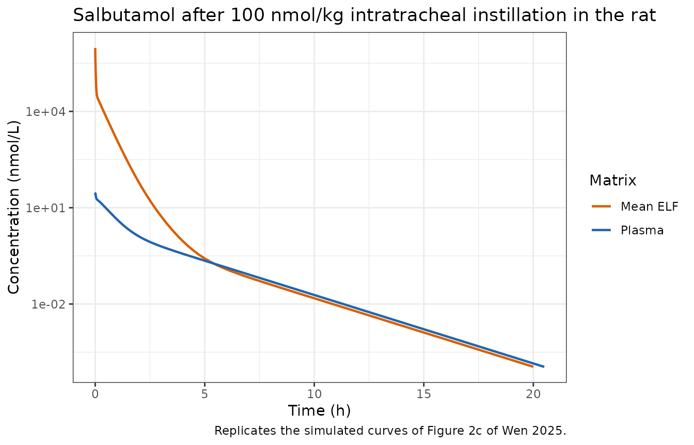
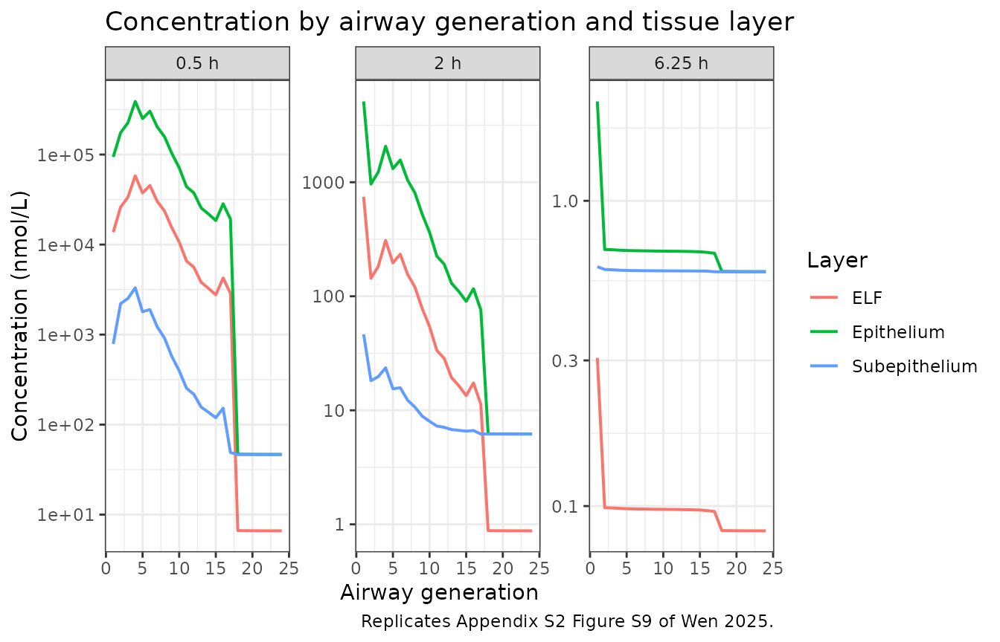

# Salbutamol pulmonary PBPK in rats (Wen 2025)

## Model and source

- Citation: Wen H, Sadiq MW, Friberg LE, Svensson EM. Translational
  physiologically based pharmacokinetic modeling to predict human
  pulmonary kinetics after lung delivery. CPT Pharmacometrics Syst
  Pharmacol. 2025;14(4):796-806. <doi:10.1002/psp4.13316>
- Article: <https://doi.org/10.1002/psp4.13316>
- Supporting Information 1 (Appendix S1 - model derivation, morphometry,
  IVIVC): <https://doi.org/10.1002/psp4.13316> (Supporting Information
  section)
- Supporting Information 2 (Appendix S2 - sensitivity analysis,
  diagnostics)
- Published MoBi project files (`PBPK for inhalation_rat`,
  `PBPK for inhalation_human`) are distributed as the third supporting
  file.

Wen 2025 builds a mechanistic pulmonary PBPK framework in which the lung
is resolved into 24 airway generations. Generations 1-16 are the
tracheobronchial (TB) region and 17-24 the alveolar region; generation 0
is the extrathoracic compartment. Each generation carries three tissue
sub-compartments - epithelial lining fluid (ELF), epithelium and
subepithelium (Wen 2025 Figure 1b) - and the subepithelium of every
generation exchanges with plasma. The lung block hangs off a
conventional compartmental systemic model as a set of peripheral
compartments (Wen 2025 Figure 1a).

This vignette packages the **rat salbutamol arm**, which is the arm the
paper’s two estimated parameters were fitted to. See *Scope* below for
what is and is not included.

## Population

Male Wistar Han rats of approximately 350 g given a single 100 nmol/kg
intratracheal (IT) instillation of salbutamol (Wen 2025 section 2.4;
Appendix S1 Table S1). Plasma and bronchoalveolar-lavage (BAL)-obtained
ELF concentration-time data were digitised by Wen 2025 from Boger and
Friden (2019). The number of animals is not restated in Wen 2025.

The model is deterministic: the paper reports no inter-individual random
effects and no residual-error model, because the two estimated
parameters were fitted to the mean observed profiles with a Monte Carlo
search (50 runs) followed by Levenberg-Marquardt in MoBi (Wen 2025
section 2.4).

``` r

str(readModelDb("Wen_2025_salbutamol_rat_pbpk")()$population)
#> List of 7
#>  $ species      : chr "rat (male Wistar Han)"
#>  $ n_subjects   : int NA
#>  $ n_studies    : int 1
#>  $ weight_median: chr "350 g"
#>  $ disease_state: chr "Healthy"
#>  $ dose_range   : chr "100 nmol/kg single dose by intratracheal instillation"
#>  $ notes        : chr "Plasma and bronchoalveolar-lavage-obtained ELF concentration-time data were digitised from Boger and Friden (20"| __truncated__
```

## Source trace

| Equation / parameter | Value | Source location |
|----|----|----|
| `lpeff` (effective permeability, all generations) | 1.18e-5 cm/s | Wen 2025 section 3.2 (95% CI 9.93e-6 to 1.36e-5) - **estimated** |
| `lkpulung` (unbound lung:plasma partition coefficient) | 8.83 | Wen 2025 section 3.2 (95% CI 6.96 to 10.68) - **estimated** |
| `lkplung` (total lung:plasma partition coefficient) | 4.66 | Wen 2025 Table 1 (from Boger and Friden) |
| `lfuelf` (fraction unbound in ELF) | 0.80 | Wen 2025 Table 1; Appendix S1 Eq S21 applied to `fu,p` = 0.71 |
| `lbp` (blood:plasma ratio) | 0.96 | Wen 2025 Table 1 |
| `lcl`, `lvc`, `lvp`, `lq`, `lvp2`, `lq2` | 2.31 L/h, 0.26 L, 1.03 L, 0.69 L/h, 0.51 L, 2.24 L/h | Wen 2025 Table 1 (CL, Vc, V2, Q2, V3, Q3) |
| `lqcopkg` (cardiac output) | 20.77 L/h/kg | Appendix S1 section 3.1 |
| `fqbr` (bronchial fraction of cardiac output) | 0.02 | Appendix S1 section 3.1 |
| `lvlungpkg` (lung volume) | 0.004126 L/kg | Appendix S1 section 3.1 |
| Airway number / length / diameter / ELF and epithelial thickness | 24 rows | Appendix S1 Table S2 (Yeh rat lung cast; Reynolds epithelial depths) |
| ELF and epithelial surface area | Eqs S1, S2 | Appendix S1 section 3.1 |
| Alveolar surface-area adjustment (38.70 dm2) | Eqs S3, S4 | Appendix S1 section 3.1 |
| ELF / epithelium / subepithelium volumes | Eqs S5-S9 | Appendix S1 section 3.1 |
| Local blood flow (TB and alveolar) | Eqs S10-S12 | Appendix S1 section 3.1 |
| Deposition after IT instillation | Eq S13 | Appendix S1 section 3.2 |
| `d/dt(elf_NN)`, `d/dt(epi_NN)`, `d/dt(sub_NN)` | n/a | Wen 2025 Eqs 1, 2, 3 |
| Systemic `k_e`, `k_12`/`k_21`, `k_13`/`k_31` | n/a | Published MoBi project `Passive Transports` building block |
| `propSd`, `propSd_Celf` | fixed 0.10 | **not reported**; placeholders so each observed matrix has a declared endpoint |

## Geometry gate: recompute every hard-coded constant from Table S2

The model file inlines the per-generation surface areas, volumes,
blood-flow weights and deposition fractions as numeric literals, because
recomputing them inside `model({})` would be re-evaluated at every
solver step. The chunk below recomputes all of them from the Appendix S1
Table S2 primitives using the published equations and asserts that they
match the packaged model. If a literal in the model file is ever
mistyped, this vignette fails to render.

``` r

n     <- 1:24
N     <- c(1, 2, 3, 5, 8, 14, 23, 28, 65, 109, 184, 309, 521, 877, 1477, 2487,
           4974, 9948, 19896, 39792, 79584, 159168, 318336, 636672)
L     <- c(2.68, 0.715, 0.4, 0.176, 0.208, 0.117, 0.114, 0.13, 0.099, 0.091,
           0.096, 0.073, 0.075, 0.06, 0.055, 0.035, 0.029, 0.025, 0.022, 0.02,
           0.019, 0.018, 0.017, 0.017)
D     <- c(0.34, 0.29, 0.263, 0.203, 0.163, 0.134, 0.123, 0.112, 0.095, 0.087,
           0.078, 0.07, 0.058, 0.049, 0.036, 0.02, 0.017, 0.016, 0.015, 0.014,
           0.014, 0.014, 0.014, 0.014)
h_elf <- c(rep(5, 17), rep(0.07, 7)) * 1e-4      # um -> cm
h_epi <- c(24, rep(13, 16), rep(0.384, 7)) * 1e-4
fi    <- c(rep(0, 17), 0.002, 0.007, 0.02, 0.07, 0.139, 0.282, 0.48)

# Eqs S5-S7: cylinder-shell volumes (cm3 -> L)
Velf <- N * L * pi * h_elf * (D - h_elf) / 1000
Vepi <- N * L * pi * h_epi * (D + h_epi) / 1000
rsub <- Vepi / sum(Vepi)                          # Eq S9

# Eqs S1-S4: surface areas with the alveolar adjustment
Self  <- pi * D * L * N
Sepi  <- pi * L * N * (D + 2 * h_epi)
Stot  <- 38.70 * 100                              # 38.70 dm2 -> cm2
Selfa <- Self + fi * (Stot - sum(Self[17:24]))
Sepia <- Sepi + fi * (Stot - sum(Sepi[17:24]))

# Eqs S10-S12: blood-flow weights
Fi <- 0.19 + 2.8 * exp(-5.1 * D)
wq <- numeric(24)
wq[1:16]  <- rsub[1:16]  / sum(rsub[1:16])  * Fi[1:16]
wq[17:24] <- rsub[17:24] / sum(rsub[17:24])

# Eq S13: deposition after IT instillation
df <- 0.985^(n - 1)
df <- df / sum(df)

# Pull the literals back out of the packaged model source and compare.
src <- readLines(system.file(
  "modeldb/specificDrugs/Wen_2025_salbutamol_rat_pbpk.R", package = "nlmixr2lib"))

grab_num <- function(nm) {
  pat <- sprintf("(^|[^A-Za-z0-9_.])%s[[:space:]]*<-[[:space:]]*(-?[0-9.]+([eE][-+]?[0-9]+)?)",
                 nm)
  hit <- regmatches(src, regexpr(pat, src))
  hit <- hit[nzchar(hit)]
  stopifnot(length(hit) == 1L)
  as.numeric(sub(sprintf(".*%s[[:space:]]*<-[[:space:]]*", nm), "", hit))
}
grab <- function(prefix) {
  vapply(sprintf("%s%02d", prefix, n), grab_num, numeric(1), USE.NAMES = FALSE)
}
model_velf <- grab("velf"); model_vepi <- grab("vepi"); model_rsub <- grab("rsub")
model_aelf <- grab("aelf"); model_aepi <- grab("aepi"); model_wq   <- grab("wq")
model_f <- vapply(sprintf("f\\(elf_%02d\\)", n), grab_num, numeric(1),
                  USE.NAMES = FALSE)

geometry_check <- tibble::tibble(
  quantity = c("ELF volume (velf)", "Epithelium volume (vepi)",
               "Subepithelium shape factor (rsub)", "ELF surface area (aelf)",
               "Epithelium surface area (aepi)", "Blood-flow weight (wq)",
               "Deposition fraction f(elf_NN)"),
  `max relative difference` = c(
    max(abs(model_velf / Velf  - 1)), max(abs(model_vepi / Vepi  - 1)),
    max(abs(model_rsub / rsub  - 1)), max(abs(model_aelf / Selfa - 1)),
    max(abs(model_aepi / Sepia - 1)), max(abs(model_wq   / wq    - 1)),
    max(abs(model_f    / df    - 1))
  )
)
knitr::kable(geometry_check, digits = 10,
             caption = "Model-file literals vs. Appendix S1 Eqs S1-S13 recomputed from Table S2.")
```

| quantity                          | max relative difference |
|:----------------------------------|------------------------:|
| ELF volume (velf)                 |               2.505e-07 |
| Epithelium volume (vepi)          |               2.305e-07 |
| Subepithelium shape factor (rsub) |               3.149e-07 |
| ELF surface area (aelf)           |               4.741e-07 |
| Epithelium surface area (aepi)    |               4.100e-07 |
| Blood-flow weight (wq)            |               2.253e-07 |
| Deposition fraction f(elf_NN)     |               1.222e-07 |

Model-file literals vs. Appendix S1 Eqs S1-S13 recomputed from Table S2.
{.table}

``` r


stopifnot(
  max(abs(model_velf / Velf  - 1)) < 1e-5,
  max(abs(model_vepi / Vepi  - 1)) < 1e-5,
  max(abs(model_rsub / rsub  - 1)) < 1e-5,
  max(abs(model_aelf / Selfa - 1)) < 1e-5,
  max(abs(model_aepi / Sepia - 1)) < 1e-5,
  max(abs(model_wq   / wq    - 1)) < 1e-5,
  max(abs(model_f    / df    - 1)) < 1e-5
)
```

### Published answer keys reproduced from the same geometry

Four numbers printed in Wen 2025 are exact consequences of the equations
above, so they test the geometry independently of any simulation.

``` r

# 1. Alveolar surface-area adjustment must land exactly on the literature value.
alv_surface <- sum(Selfa[17:24])

# 2. Mucociliary residence times, Appendix S1 Eqs S15-S16 vs Table S3.
Across <- pi * (D / 2)^2
mcc    <- 0.19 * (Across / Across[1])              # 1.9 mm/min = 0.19 cm/min
RT     <- L / mcc
table_s3 <- c(14.11, 5.17, 3.52, 2.6, 4.03, 3.96, 4.58, 6.31, 6.67, 6.99,
              9.6, 9.06, 13.56, 15.2, 25.82, 53.24)

# 3. IT-instillation deposition split, Eq S13.
alveolar_deposition <- sum(df[17:24])

# 4. Peff predicted from the Caco-2 Papp by IVIVC2 (Appendix S1 Eq S24) -
#    Table S4 prints 1.13e-5 cm/s, and section 3.3 notes it agrees with the
#    estimated 1.18e-5 cm/s.
peff_ivivc2 <- 10^(0.7524 * log10(1.4e-6) - 0.5441)

# 5. Unbound partition coefficient and ELF unbound fraction (Eqs 5, S21).
kpu_from_eq  <- 4.66 / 0.71
fuelf_from_eq <- 0.71 / (0.6 + 0.4 * 0.71)

knitr::kable(
  tibble::tibble(
    Quantity = c("Alveolar ELF surface area (cm2)",
                 "MCC residence times matching Table S3 (of 16)",
                 "Alveolar fraction of instilled dose",
                 "Peff from Caco-2 Papp by IVIVC2 (cm/s)",
                 "Kp,u,lung from Eq 5 (unitless)",
                 "fu,ELF from Eq S21 (unitless)"),
    Recomputed = c(sprintf("%.1f", alv_surface),
                   sprintf("%d", sum(abs(RT[1:16] - table_s3) < 0.02)),
                   sprintf("%.3f", alveolar_deposition),
                   sprintf("%.3g", peff_ivivc2),
                   sprintf("%.2f", kpu_from_eq),
                   sprintf("%.3f", fuelf_from_eq)),
    Published = c("3870 (Appendix S1 section 3.1)",
                  "16 (Table S3)",
                  "0.293 (Appendix S1 section 3.2)",
                  "1.13e-05 (Table S4)",
                  "6.50 (Table 1)",
                  "0.80 (Table 1)")
  ),
  caption = "Published values reproduced from the Appendix S1 equations."
)
```

| Quantity | Recomputed | Published |
|:---|:---|:---|
| Alveolar ELF surface area (cm2) | 3870.0 | 3870 (Appendix S1 section 3.1) |
| MCC residence times matching Table S3 (of 16) | 14 | 16 (Table S3) |
| Alveolar fraction of instilled dose | 0.294 | 0.293 (Appendix S1 section 3.2) |
| Peff from Caco-2 Papp by IVIVC2 (cm/s) | 1.13e-05 | 1.13e-05 (Table S4) |
| Kp,u,lung from Eq 5 (unitless) | 6.56 | 6.50 (Table 1) |
| fu,ELF from Eq S21 (unitless) | 0.803 | 0.80 (Table 1) |

Published values reproduced from the Appendix S1 equations. {.table}

``` r


stopifnot(
  abs(alv_surface - 3870) < 1e-6,
  abs(alveolar_deposition - 0.293) < 0.002,
  abs(peff_ivivc2 / 1.13e-5 - 1) < 0.01,
  abs(fuelf_from_eq - 0.80) < 0.005
)
```

Fourteen of the sixteen residence times reproduce Table S3 exactly;
generations 5 and 10 differ (4.76 vs 4.03 min and 7.31 vs 6.99 min)
because the published length/diameter pairs for those two generations
are rounded more coarsely than the residence times computed from them.
See *Assumptions and deviations*.

## Virtual cohort

The model carries no random effects, so a single typical rat reproduces
the published prediction exactly. Two additional body weights are
simulated to exercise the `WT` scaling of lung volume and cardiac output
(Appendix S1 section 3.1); the published arm is the 350 g rat.

``` r

gens <- sprintf("elf_%02d", 1:24)

make_cohort <- function(wt_kg, id_offset = 0L) {
  dose_nmol <- 100 * wt_kg                     # 100 nmol/kg, Wen 2025 section 2.4
  doses <- tidyr::expand_grid(
    id  = id_offset + 1L,
    cmt = gens
  ) |>
    dplyr::mutate(time = 0, amt = dose_nmol, evid = 1L)
  obs <- tibble::tibble(
    id   = id_offset + 1L,
    time = c(seq(0, 0.5, by = 0.005), seq(0.52, 4, by = 0.02),
             seq(4.25, 24, by = 0.25)),
    amt  = NA_real_,
    evid = 0L,
    cmt  = "Cc",                               # declared multi-endpoint: observable + dvid
    dvid = 1L
  )
  dplyr::bind_rows(doses, obs) |>
    dplyr::mutate(WT = wt_kg,
                  cohort = sprintf("%d g rat", round(wt_kg * 1000))) |>
    dplyr::arrange(id, time, dplyr::desc(evid))
}

events <- dplyr::bind_rows(
  make_cohort(0.30, id_offset = 0L),
  make_cohort(0.35, id_offset = 1L),
  make_cohort(0.40, id_offset = 2L)
)
stopifnot(!anyDuplicated(unique(events[, c("id", "time", "evid", "cmt")])))
```

## Simulation

``` r

mod <- readModelDb("Wen_2025_salbutamol_rat_pbpk")

sim <- rxode2::rxSolve(
  mod, events = events,
  keep = c("WT", "cohort"),
  atol = 1e-12, rtol = 1e-8,
  useLinCmt = FALSE
) |>
  as.data.frame() |>
  dplyr::filter(!is.na(Cc))
#> Warning: multi-subject simulation without without 'omega'

published <- dplyr::filter(sim, cohort == "350 g rat")
```

## Replicate Figure 2c of Wen 2025

Figure 2c of Wen 2025 shows the model with estimated parameters:
simulated plasma and mean ELF concentration against the observed
BAL-obtained ELF and plasma points. The observed points are not
redistributed with the paper, so only the simulated curves are
reproduced here.

``` r

published |>
  dplyr::select(time, Plasma = Cc, `Mean ELF` = Celf) |>
  tidyr::pivot_longer(-time, names_to = "Matrix", values_to = "Conc") |>
  dplyr::filter(Conc > 1e-4) |>
  ggplot(aes(time, Conc, colour = Matrix)) +
  geom_line(linewidth = 0.8) +
  scale_y_log10() +
  scale_colour_manual(values = c("Plasma" = "#2166ac", "Mean ELF" = "#d95f02")) +
  labs(x = "Time (h)", y = "Concentration (nmol/L)",
       title = "Salbutamol after 100 nmol/kg intratracheal instillation in the rat",
       caption = "Replicates the simulated curves of Figure 2c of Wen 2025.") +
  theme_bw()
```



## Replicate Appendix S2 Figure S9: regional and inter-tissue gradients

Wen 2025 reports two qualitative regional findings (section 3.3 and
Appendix S2 Figure S9): the epithelium carries the highest drug
concentration, followed by ELF and then subepithelium; and
concentrations are higher in the central lung (generations 1-16) than in
the peripheral lung (generations 17-24). Both are asserted below rather
than only plotted.

``` r

long <- published |>
  dplyr::select(time, dplyr::matches("^(elf|epi|sub)_[0-9]{2}$")) |>
  tidyr::pivot_longer(-time, names_to = "state", values_to = "amount") |>
  tidyr::separate(state, into = c("layer", "gen"), sep = "_", convert = TRUE) |>
  dplyr::mutate(
    volume = dplyr::case_when(
      layer == "elf" ~ Velf[gen],
      layer == "epi" ~ Vepi[gen],
      TRUE           ~ rsub[gen] * (0.004126 * 0.35 - sum(Velf) - sum(Vepi))
    ),
    conc   = amount / volume,
    region = ifelse(gen <= 16, "Central (gen 1-16)", "Peripheral (gen 17-24)"),
    layer  = factor(layer, c("elf", "epi", "sub"),
                    c("ELF", "Epithelium", "Subepithelium"))
  )

layer_auc <- long |>
  dplyr::group_by(layer, gen) |>
  dplyr::summarise(auc = sum(diff(time) * (head(conc, -1) + tail(conc, -1)) / 2),
                   .groups = "drop") |>
  dplyr::group_by(layer) |>
  dplyr::summarise(`mean AUC (nmol*h/L)` = mean(auc), .groups = "drop")
knitr::kable(layer_auc, digits = 1,
             caption = "Generation-averaged AUC by tissue layer (Appendix S2 Figure S9).")
```

| layer         | mean AUC (nmol\*h/L) |
|:--------------|---------------------:|
| ELF           |              44046.6 |
| Epithelium    |             141277.6 |
| Subepithelium |               1031.3 |

Generation-averaged AUC by tissue layer (Appendix S2 Figure S9).
{.table}

``` r


region_auc <- long |>
  dplyr::filter(layer == "ELF") |>
  dplyr::group_by(region, gen) |>
  dplyr::summarise(auc = sum(diff(time) * (head(conc, -1) + tail(conc, -1)) / 2),
                   .groups = "drop") |>
  dplyr::group_by(region) |>
  dplyr::summarise(`mean ELF AUC (nmol*h/L)` = mean(auc), .groups = "drop")
knitr::kable(region_auc, digits = 1,
             caption = "Central vs peripheral lung ELF exposure (Wen 2025 section 3.3).")
```

| region                 | mean ELF AUC (nmol\*h/L) |
|:-----------------------|-------------------------:|
| Central (gen 1-16)     |                  59863.6 |
| Peripheral (gen 17-24) |                  12412.6 |

Central vs peripheral lung ELF exposure (Wen 2025 section 3.3). {.table}

``` r


# Published qualitative findings, asserted.
stopifnot(
  layer_auc$`mean AUC (nmol*h/L)`[layer_auc$layer == "Epithelium"] >
    layer_auc$`mean AUC (nmol*h/L)`[layer_auc$layer == "ELF"],
  layer_auc$`mean AUC (nmol*h/L)`[layer_auc$layer == "ELF"] >
    layer_auc$`mean AUC (nmol*h/L)`[layer_auc$layer == "Subepithelium"],
  region_auc$`mean ELF AUC (nmol*h/L)`[region_auc$region == "Central (gen 1-16)"] >
    region_auc$`mean ELF AUC (nmol*h/L)`[region_auc$region == "Peripheral (gen 17-24)"]
)

long |>
  dplyr::filter(time %in% c(0.5, 2, 6.25)) |>
  ggplot(aes(gen, conc, colour = layer)) +
  geom_line(linewidth = 0.7) +
  facet_wrap(~ paste0(time, " h"), scales = "free_y") +
  scale_y_log10() +
  labs(x = "Airway generation", y = "Concentration (nmol/L)", colour = "Layer",
       title = "Concentration by airway generation and tissue layer",
       caption = "Replicates Appendix S2 Figure S9 of Wen 2025.") +
  theme_bw()
```



## PKNCA validation

Wen 2025 reports no NCA table for the rat arm (Figure 2 is graphical,
and Table 3 covers the human translation only). The available
quantitative check is an exact structural identity: because
intratracheal instillation delivers the whole dose into the lung and the
only elimination pathway in the model is systemic clearance from the
central compartment, plasma `AUC0-inf` must equal `Dose / CL` with the
`CL` = 2.31 L/h of Table 1. That identity holds per rat, at every body
weight, and would break under any error in the deposition fractions, the
mass-transfer equations or the blood-flow apportionment.

``` r

sim_nca <- sim |>
  dplyr::filter(!is.na(Cc)) |>
  dplyr::select(id, time, Cc, cohort)

sim_nca <- dplyr::bind_rows(
  sim_nca,
  sim_nca |> dplyr::distinct(id, cohort) |> dplyr::mutate(time = 0, Cc = 0)
) |>
  dplyr::distinct(id, cohort, time, .keep_all = TRUE) |>
  dplyr::arrange(id, cohort, time)

conc_obj <- PKNCA::PKNCAconc(sim_nca, Cc ~ time | cohort + id)

dose_df <- events |>
  dplyr::filter(evid == 1, cmt == "elf_01") |>
  dplyr::mutate(amt = amt) |>
  dplyr::select(id, time, amt, cohort)
dose_obj <- PKNCA::PKNCAdose(dose_df, amt ~ time | cohort + id)

# Linear-up/log-down keeps the trapezoidal error on the very steep early plasma
# rise small enough that the AUC identity below can be asserted tightly.
PKNCA::PKNCA.options(auc.method = "lin up/log down")

intervals <- data.frame(
  start = 0, end = Inf,
  cmax = TRUE, tmax = TRUE, aucinf.obs = TRUE, auclast = TRUE, half.life = TRUE
)

nca_res <- PKNCA::pk.nca(PKNCA::PKNCAdata(conc_obj, dose_obj, intervals = intervals))
```

### Comparison against the analytic reference

``` r

cl_pub <- 2.31                                   # L/h, Wen 2025 Table 1
reference <- tibble::tibble(
  cohort     = c("300 g rat", "350 g rat", "400 g rat"),
  aucinf.obs = c(100 * 0.30, 100 * 0.35, 100 * 0.40) / cl_pub
)

cmp <- nlmixr2lib::ncaComparisonTable(
  simulated     = nca_res,
  reference     = reference,
  by            = "cohort",
  params        = "aucinf.obs",
  units         = c(aucinf.obs = "nmol*h/L"),
  tolerance_pct = 20
)
knitr::kable(cmp, caption = "Plasma AUC0-inf vs the analytic identity Dose / CL. * differs by >20%.")
```

| NCA parameter            | cohort    | Reference | Simulated | % diff |
|:-------------------------|:----------|:----------|:----------|:-------|
| AUC0-∞ (obs) (nmol\*h/L) | 300 g rat | 13        | 13        | -0.1%  |
| AUC0-∞ (obs) (nmol\*h/L) | 350 g rat | 15.2      | 15.1      | -0.1%  |
| AUC0-∞ (obs) (nmol\*h/L) | 400 g rat | 17.3      | 17.3      | -0.1%  |

Plasma AUC0-inf vs the analytic identity Dose / CL. \* differs by \>20%.
{.table}

``` r


# Strict form of the same test: the identity must hold to within 0.5%
# (the residual is trapezoidal error on the observation grid, not model error).
auc_sim <- as.data.frame(nca_res) |>
  dplyr::filter(PPTESTCD == "aucinf.obs") |>
  dplyr::arrange(cohort)
auc_ref <- reference |> dplyr::arrange(cohort)
stopifnot(all(abs(auc_sim$PPORRES / auc_ref$aucinf.obs - 1) < 0.005))
```

### Lung-to-plasma exposure

The paper’s headline translational metric is the lung-to-plasma
`AUClast` ratio (Wen 2025 Table 3). Table 3 tabulates the human values
only; the rat value the model implies is reported here for completeness.

``` r

trap <- function(t, y) sum(diff(t) * (head(y, -1) + tail(y, -1)) / 2)
ratio_tbl <- published |>
  dplyr::summarise(
    `Plasma AUClast (nmol*h/L)`   = trap(time, Cc),
    `Mean ELF AUClast (nmol*h/L)` = trap(time, Celf)
  ) |>
  dplyr::mutate(`Mean ELF : plasma ratio` = `Mean ELF AUClast (nmol*h/L)` /
                  `Plasma AUClast (nmol*h/L)`)
knitr::kable(ratio_tbl, digits = 1,
             caption = "Rat mean-ELF to plasma AUC ratio over 0-24 h implied by the model.")
```

| Plasma AUClast (nmol\*h/L) | Mean ELF AUClast (nmol\*h/L) | Mean ELF : plasma ratio |
|---:|---:|---:|
| 15.1 | 20999.6 | 1387.4 |

Rat mean-ELF to plasma AUC ratio over 0-24 h implied by the model.
{.table}

## Scope

Wen 2025 develops one framework and applies it in four combinations: two
drugs (salbutamol, fluticasone propionate) in two species (rat, human).
**Only the rat salbutamol arm is packaged here.** The other three are
not reproducible from the sources available on disk:

- **Fluticasone propionate in the rat.** Appendix S1 section 3.2 reports
  only the three *regional* MPPD deposition totals (head 0.9258, TB
  0.0089, pulmonary 0.0158) after nose-only inhalation; the split of
  those totals across the individual generations is not reported. The
  particle-dissolution model of Appendix S1 Eq S18 additionally needs
  the aqueous diffusion coefficient, which Appendix S1 states is
  “estimated as a function of molecular weight in MoBi” but does not
  print.
- **Both drugs in the human.** Appendix S1 section 6 states that human
  morphometry follows the Weibel lung model “with detailed parameters
  presented in cited references” and does not reproduce the table; the
  human ELF, epithelial and subepithelial thicknesses are not reported
  anywhere; and the per-generation deposition comes from running the
  Pellowe typical-path model rather than from a printed table. The
  published MoBi project file named `PBPK for inhalation_human` does
  **not** supply them - its spatial-structure building block still
  carries the rat parameterisation (maximum mucociliary clearance 0.019
  cm/min = the rat’s 1.9 mm/min rather than the human 3.6 mm/min; total
  lung volume 0.001238 L rather than the human 0.53 L; alveolar surface
  38.7 dm2 rather than 7000 dm2), because the human values were set at
  the simulation level and the project’s `SIMULATIONS` table was
  exported empty.

Filling any of those gaps would mean substituting values that are not in
any on-disk source, which the nlmixr2lib PBPK sourcing rule forbids.

## Assumptions and deviations

- **Dissolution and mucociliary clearance are inactive in this arm.**
  The framework includes both, but Wen 2025 Table 1 reports no density,
  MMAD or GSD for salbutamol in the rat (the “predictive deposition
  parameters” row is blank), so the particle model of Appendix S1 Eqs
  S18-S19 cannot be parameterised and was not used: the intratracheal
  deposition of Eq S13 is a direct geometric rule, not an MPPD particle
  prediction. Salbutamol’s aqueous solubility of 14 100 mg/L (Table 1)
  corresponds to 58.9 mmol/L, roughly 60-fold above the peak mean ELF
  concentration the model predicts, so the instillate is fully dissolved
  and mucociliary clearance - which transports only *undissolved*
  particles (Wen 2025 section 2.2) - has nothing to move. The dose is
  therefore deposited directly into the ELF of each generation.
- **`74.5%` tracheobronchial deposition is not self-consistent.**
  Appendix S1 section 3.2 states that Eq S13 gives “74.5% in TB region
  and 29.3% in alveolar region”, which sums to 103.8%. Evaluating Eq S13
  over generations 1-24 gives 70.6% / 29.4%, matching the printed
  alveolar figure. The equation is used, per the standing policy of
  trusting a printed equation over conflicting prose; the geometry gate
  above asserts the 29.3% alveolar figure is reproduced.
- **Eq S11 blood-flow weighting factor.** Appendix S1 Eq S11 gives
  `F_i = 0.19 + 2.8 * exp(-5.1 * D)` with `D` in cm; the published MoBi
  project encodes `0.19 + 2.8 * e^(-0.51 * D)` with `D` in MoBi’s base
  length unit (dm), i.e. an exponent 100-fold smaller. The MoBi form
  makes `F_i` vary only between 2.94 and 2.99 across the whole
  tracheobronchial tree, which would make the weighting factor inert; Eq
  S11 as printed spans 0.69 to 2.96. Eq S11 is used.
- **Subepithelial region normalisers.** The published MoBi project
  hard-codes the tracheobronchial and alveolar subepithelial volume sums
  as 0.0003676 L and 0.0007246 L. Those do not follow from the project’s
  own volume formulas applied to Table S2 (which give 0.000654 L and
  0.000425 L), and the project file is otherwise a template whose
  drug-specific and simulation-level values were exported as zeros. The
  model therefore computes the regional sums from Eqs S5-S9 rather than
  adopting the hard-coded constants.
- **Two Table S3 residence times are not reproducible.** Generations 5
  and 10 give 4.76 and 7.31 min from Eqs S15-S16 applied to Table S2,
  versus the tabulated 4.03 and 6.99 min. The other 14 agree exactly.
  Because mucociliary clearance is inactive in this arm the discrepancy
  does not affect any prediction here; it is recorded so that a future
  fluticasone-propionate extraction, where mucociliary clearance is
  active, resolves it first.
- **`Kp,u,lung` initial value rounding.** Eq 5 applied to Table 1 gives
  4.66 / 0.71 = 6.56 for salbutamol, whereas Table 1 prints 6.50. This
  is the *initial* value only; the model uses the estimated 8.83 of
  section 3.2, so the rounding does not propagate. (Fluticasone
  propionate reproduces exactly: 3.41 / 0.016 = 213.1.)
- **Equation numbering in Table 1.** Table 1 cites “Equation (6)” for
  `Kp,u,lung` and “Equation (5)” for `fu,ELF`; in the article body those
  are Eqs 5 and 4 respectively. The arithmetic identifies the intended
  equations unambiguously.
- **No random effects and no residual error.** Wen 2025 reports neither,
  so `propSd` and `propSd_Celf` are fixed placeholders (0.10) that exist
  only so the two observed matrices have declared endpoints. Do not read
  them as published precision estimates.
- **Body weight.** Airway number, length and diameter are the fixed Yeh
  lung-cast morphometry of a 330 g rat and are *not* scaled with `WT`;
  only lung volume and cardiac output scale (Appendix S1 section 3.1).
  The published salbutamol arm used 350 g rats.
- **Observed data are not redistributed.** The rat plasma and BAL ELF
  points of Figure 2 were digitised by Wen 2025 from Boger and
  Friden (2019) and are not included in this package, so the figure
  chunk shows the simulated curves only.
