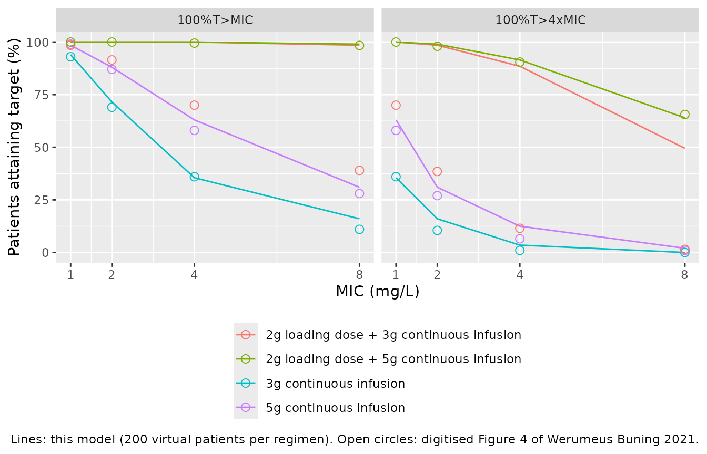
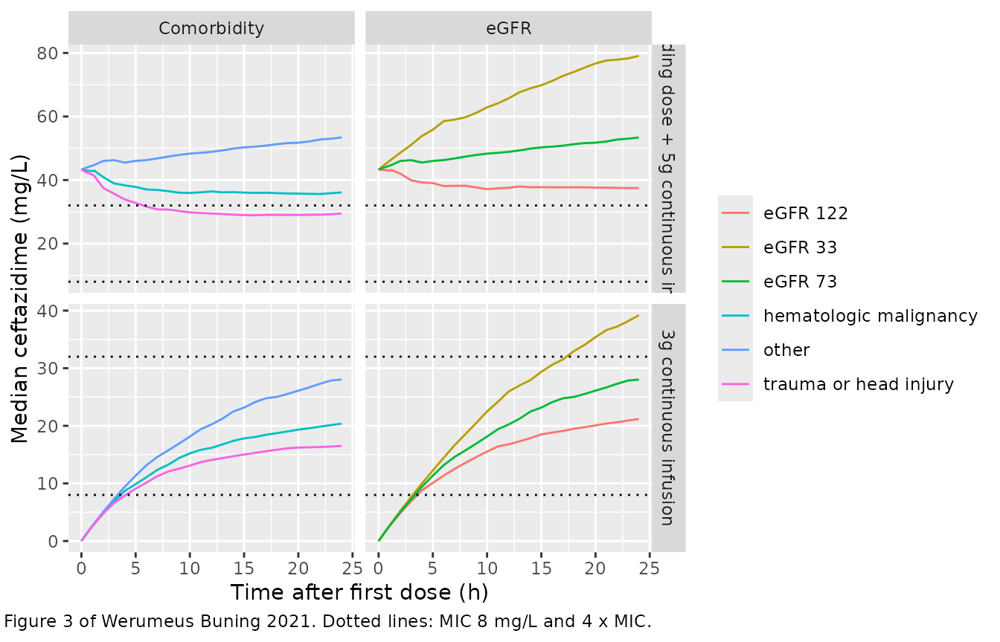

# Ceftazidime (Werumeus Buning 2021)

``` r

library(nlmixr2lib)
library(rxode2)
library(PKNCA)
library(dplyr)
library(tidyr)
library(ggplot2)
```

## Model and source

- Citation: Werumeus Buning A, Hodiamont CJ, Lechner NM, Schokkin M,
  Elbers PWG, Juffermans NP, Mathot RAA, de Jong MD, van Hest RM (2021).
  Population Pharmacokinetics and Probability of Target Attainment of
  Different Dosing Regimens of Ceftazidime in Critically Ill Patients
  with a Proven or Suspected *Pseudomonas aeruginosa* Infection.
  *Antibiotics* 10(6):612.
- Article: <https://doi.org/10.3390/antibiotics10060612> (open access,
  PMC8224000)
- Description: One-compartment intravenous population PK model for
  ceftazidime in critically ill adults with a proven or suspected
  Pseudomonas aeruginosa infection (Werumeus Buning 2021; n = 96 ICU
  patients, 368 concentrations, mostly continuous infusion). Clearance
  is piecewise on continuous veno-venous hemofiltration (CVVH): patients
  on CVVH have a single fixed clearance with no between-subject
  variability, while patients off CVVH have a clearance that scales as a
  power of the CKD-EPI eGFR (centred on 73 mL/min/1.73 m^2) and is
  multiplied by 1.57 for a hematologic malignancy and by 1.99 for trauma
  or head injury. Between-subject variability is exponential on the
  off-CVVH clearance and on the volume; residual error is additive on
  log-transformed concentrations.

The final NONMEM control stream is printed in Appendix C of the article,
so every structural equation and every parameter below is taken from it
directly; the values agree with the “Final Model” column of Table 2. No
correction notice for the article was found on EuropePMC or the
publisher’s page as of 2026-09-28.

## Population

An observational study in the intensive care unit of Amsterdam
University Medical Centre (location AMC) between November 2013 and March
2018. Ninety-six adults treated with intravenous ceftazidime for a
proven or suspected *Pseudomonas aeruginosa* infection contributed 394
serum samples, drawn from arterial blood-gas waste material and routine
therapeutic drug monitoring; 28 (7.1%) were below the 0.5 mg/L
quantification limit, leaving 368 concentrations. Patients with cystic
fibrosis were excluded. Table 1 gives a median age of 59 years (range
20-84), body weight 79 kg (44-237), 40% women, median SOFA score 10 and
a 30-day mortality of 39%. The median CKD-EPI eGFR was 73 mL/min/1.73
m^2 (range 6-153) and 21% of patients were on continuous veno-venous
hemofiltration (CVVH). Comorbidity was recorded as a single category per
patient: hematologic malignancy 15%, oncologic malignancy 13%, trauma or
head injury 28%, other 45%. Most patients (83%) received a continuous
infusion of 3-6 g per 24 h, 81% of them after a loading dose.

The same information is available programmatically via
`readModelDb("WerumeusBuning_2021_ceftazidime")()$population`.

## Source trace

| Equation / parameter | Value | Source location |
|----|----|----|
| One-compartment, first-order elimination | n/a | Section 2.2; Appendix C `ADVAN1 TRANS2` |
| `lcl` (CL off CVVH) | log(3.42) L/h | Appendix C `THETA(2)`; Table 2 |
| `lcl_cvvh` (CL on CVVH) | log(2.9) L/h | Appendix C `THETA(4)`; Table 2 |
| `lvc` (V) | log(46.8) L | Appendix C `THETA(3)`; Table 2 |
| `e_crcl_cl` | 0.772 | Appendix C `THETA(5)`; Table 2 and footnote a |
| `e_heme_malig_cl` | 1.57 | Appendix C `THETA(6)`; Table 2 |
| `e_trauma_cl` | 1.99 | Appendix C `THETA(7)`; Table 2 |
| `etalcl` | 0.122 (36.0% CV) | Appendix C `$OMEGA` 1; Table 2 |
| `etalvc` | 0.721 (102.8% CV) | Appendix C `$OMEGA` 2; Table 2 |
| `expSd` | 0.281 | Appendix C `THETA(1)`, `$SIGMA 1 FIX`; Table 2 ‘Proportional error’ |
| `cl` piecewise on `RRT_CRRT_STATUS` | n/a | Appendix C `IF(CVVH.EQ.0) ... ELSE CL = THETA(4)` |
| eGFR centring value 73 | n/a | Appendix C `(CKD/73)`; Table 1 median; Figure 3 caption |
| `DIS_TRAUMA` pools trauma and head injury | n/a | Appendix C `COMO.EQ.3` or `COMO.EQ.4`; Section 2.2 |
| `Cc ~ lnorm(expSd)` | n/a | Appendix C `$ERROR`: `Y = LOG(F) + ERR1*EPS(1)` |

The between-subject variances are the `$OMEGA` values;
`sqrt(exp(omega) - 1)` gives 36.0% and 102.8%, the CV% printed in Table
2.

``` r

mod <- readModelDb("WerumeusBuning_2021_ceftazidime")
mod_typ <- rxode2::zeroRe(mod)
#> ℹ parameter labels from comments will be replaced by 'label()'
```

## Dosing regimens and event tables

The paper simulates the first 24 h of four regimens (Section 4.7): 3 g
or 5 g per 24 h by continuous infusion, each with or without a 2 g
loading dose. A loading dose is “a bolus administered in several minutes
immediately before initiation of continuous infusion” (Section 4.4), so
it is entered as a bolus at time 0 alongside an infusion that also
starts at time 0.

``` r

# Observation grid. Table 3 defines 100% T > MIC as the concentration staying
# above the MIC for at least 95% of the first 24 h, i.e. from 1.2 h onwards.
obs_times <- sort(unique(c(0, 0.25, 0.5, 1, 1.2, seq(2, 24, by = 1))))

make_events <- function(subj, ld_mg, daily_mg) {
  dose_ld <- subj |>
    mutate(time = 0, amt = ld_mg, rate = 0, evid = 1L, cmt = "central") |>
    filter(amt > 0)
  dose_ci <- subj |>
    mutate(
      time = 0, amt = daily_mg, rate = daily_mg / 24, evid = 1L,
      cmt = "central"
    )
  obs <- subj |>
    tidyr::crossing(time = obs_times) |>
    mutate(amt = 0, rate = 0, evid = 0L, cmt = "central")
  bind_rows(dose_ld, dose_ci, obs) |>
    arrange(id, time, desc(evid))
}

# The typical patient of Figures 3 and 4: median eGFR, comorbidity 'other',
# not on CVVH.
typical_covs <- function(n, crcl = 73, heme = 0L, trauma = 0L, cvvh = 0L) {
  tibble(
    CRCL = crcl, DIS_HEME_MALIG = heme, DIS_TRAUMA = trauma,
    RRT_CRRT_STATUS = cvvh
  )[rep(1, n), ]
}

# rxSolve() on the zero-variance model with the etas supplied as data warns
# that there is no omega; that is intended here.
solve_quiet <- function(model, events, ...) {
  withCallingHandlers(
    rxode2::rxSolve(model, events = events, ...),
    warning = function(w) {
      if (grepl("omega", conditionMessage(w))) invokeRestart("muffleWarning")
    }
  )
}
```

## Typical-value structure check

For a one-compartment model with a bolus `LD` and a zero-order infusion
`R` both starting at time 0,
`C(t) = LD/V * exp(-k t) + R/CL * (1 - exp(-k t))`. The typical-value
solve must reproduce this closed form, and the covariate multipliers
must move the clearance exactly as the control stream writes them.

``` r

scen <- tibble::tribble(
  ~label, ~crcl, ~heme, ~trauma, ~cvvh,
  "other, eGFR 73", 73, 0L, 0L, 0L,
  "other, eGFR 33", 33, 0L, 0L, 0L,
  "other, eGFR 122", 122, 0L, 0L, 0L,
  "hematologic malignancy", 73, 1L, 0L, 0L,
  "trauma or head injury", 73, 0L, 1L, 0L,
  "on CVVH, eGFR 33, trauma", 33, 0L, 1L, 1L
) |>
  mutate(id = row_number())

ev_typ <- make_events(
  scen |>
    transmute(
      id, CRCL = crcl, DIS_HEME_MALIG = heme, DIS_TRAUMA = trauma,
      RRT_CRRT_STATUS = cvvh
    ),
  ld_mg = 2000, daily_mg = 5000
)
sim_typ <- rxode2::rxSolve(
  mod_typ, events = ev_typ, rtol = 1e-10, atol = 1e-12
) |>
  as.data.frame()
#> ℹ omega/sigma items treated as zero: 'etalcl', 'etalvc'
#> Warning: multi-subject simulation without without 'omega'

cl_expected <- with(scen, ifelse(
  cvvh == 1, 2.9,
  3.42 * (crcl / 73)^0.772 * 1.57^heme * 1.99^trauma
))
cl_sim <- sim_typ |> group_by(id) |> summarise(cl = first(cl)) |> pull(cl)

closed <- sim_typ |>
  mutate(
    k = cl / vc,
    Cc_closed = 2000 / vc * exp(-k * time) + (5000 / 24) / cl * (1 - exp(-k * time))
  )
stopifnot(
  isTRUE(all.equal(cl_sim, cl_expected, tolerance = 1e-12)),
  all(abs(sim_typ$vc - 46.8) < 1e-12),
  max(abs(closed$Cc / closed$Cc_closed - 1)) < 1e-6
)
tibble(
  Scenario = scen$label,
  "CL (L/h)" = signif(cl_sim, 4),
  "C at 24 h (mg/L)" = signif(closed$Cc[closed$time == 24], 4)
) |>
  knitr::kable(caption = "Typical-value clearance and 24-h concentration after a 2 g loading dose plus 5 g/24 h.")
```

| Scenario                 | CL (L/h) | C at 24 h (mg/L) |
|:-------------------------|---------:|-----------------:|
| other, eGFR 73           |    3.420 |            57.77 |
| other, eGFR 33           |    1.853 |            85.49 |
| other, eGFR 122          |    5.084 |            41.11 |
| hematologic malignancy   |    5.369 |            39.05 |
| trauma or head injury    |    6.806 |            30.98 |
| on CVVH, eGFR 33, trauma |    2.900 |            65.26 |

Typical-value clearance and 24-h concentration after a 2 g loading dose
plus 5 g/24 h. {.table}

The CVVH row confirms that on CVVH the clearance is 2.9 L/h whatever the
eGFR and comorbidity values supplied.

## Virtual cohort

The paper simulated 1000 virtual patients per regimen. To keep the build
fast this article uses 200 per regimen. The between-subject random
effects are drawn with base R and passed to the zero-variance model as
data, so the same 200 patients receive every regimen (common random
numbers) and the results are identical on every machine. Residual error
is not added: the paper’s target attainment is a statement about the
concentration-time course of each virtual patient, and adding
observation noise at every grid time is not what Figures 3 and 4 show
(the comparison below confirms that the individual predictions reproduce
them).

``` r

set.seed(20210521)
n_sub <- 200L
etas <- tibble(
  id = seq_len(n_sub),
  etalcl = rnorm(n_sub, 0, sqrt(0.122)),
  etalvc = rnorm(n_sub, 0, sqrt(0.721))
)

regimens <- tibble::tribble(
  ~regimen, ~ld_mg, ~daily_mg,
  "3g continuous infusion", 0, 3000,
  "5g continuous infusion", 0, 5000,
  "2g loading dose + 3g continuous infusion", 2000, 3000,
  "2g loading dose + 5g continuous infusion", 2000, 5000,
  # Not a regimen of the paper; see the Figure 4 section below.
  "6g continuous infusion (no loading dose)", 0, 6000
)

simulate_regimen <- function(ld_mg, daily_mg, covs = typical_covs(n_sub)) {
  subj <- bind_cols(etas, covs)
  ev <- make_events(subj, ld_mg = ld_mg, daily_mg = daily_mg)
  solve_quiet(mod_typ, ev) |>
    as.data.frame() |>
    select(id, time, Cc, cl, vc)
}

sim_reg <- regimens |>
  rowwise() |>
  mutate(sim = list(simulate_regimen(ld_mg, daily_mg))) |>
  ungroup() |>
  select(regimen, sim) |>
  tidyr::unnest(sim)
#> ℹ omega/sigma items treated as zero: 'etalcl', 'etalvc'
#> ℹ omega/sigma items treated as zero: 'etalcl', 'etalvc'
#> ℹ omega/sigma items treated as zero: 'etalcl', 'etalvc'
#> ℹ omega/sigma items treated as zero: 'etalcl', 'etalvc'
#> ℹ omega/sigma items treated as zero: 'etalcl', 'etalvc'

# The etas supplied as data must reach the individual parameters.
chk_eta <- sim_reg |>
  filter(regimen == regimens$regimen[1], time == 24) |>
  left_join(etas, by = "id")
stopifnot(
  nrow(chk_eta) == n_sub,
  max(abs(log(chk_eta$cl / 3.42) - chk_eta$etalcl)) < 1e-10,
  max(abs(log(chk_eta$vc / 46.8) - chk_eta$etalvc)) < 1e-10
)
```

## Replicate Figure 4: probability of target attainment

The target is reached when the concentration stays above the MIC (or
above 4 x MIC) from 1.2 h to 24 h. Because concentrations after a bolus
plus a constant infusion approach their plateau monotonically, the
minimum over that window is at one of its two ends, so the observation
grid resolves it exactly.

``` r

mics <- c(1, 2, 4, 8)
cmin_window <- sim_reg |>
  filter(time >= 1.2, time <= 24) |>
  group_by(regimen, id) |>
  summarise(cmin = min(Cc), .groups = "drop")

pta <- tidyr::crossing(cmin_window, mic = mics, target = c(1, 4)) |>
  group_by(regimen, mic, target) |>
  summarise(pta = 100 * mean(cmin >= target * mic), .groups = "drop") |>
  mutate(target = ifelse(target == 1, "100%T>MIC", "100%T>4xMIC"))

# Figure 4 of the paper, digitised by the maintainers (read to about +/- 2
# percentage points), plus the two values stated in the Results text
# (Section 2.4: 98.4% and 65.6% at MIC 8 for the 2 g + 5 g regimen).
published <- tibble::tribble(
  ~regimen, ~target, ~mic, ~pta_pub,
  "3g continuous infusion", "100%T>MIC", 1, 93,
  "3g continuous infusion", "100%T>MIC", 2, 69,
  "3g continuous infusion", "100%T>MIC", 4, 36,
  "3g continuous infusion", "100%T>MIC", 8, 11,
  "5g continuous infusion", "100%T>MIC", 1, 99,
  "5g continuous infusion", "100%T>MIC", 2, 87,
  "5g continuous infusion", "100%T>MIC", 4, 58,
  "5g continuous infusion", "100%T>MIC", 8, 28,
  "2g loading dose + 3g continuous infusion", "100%T>MIC", 1, 98.5,
  "2g loading dose + 3g continuous infusion", "100%T>MIC", 2, 91.5,
  "2g loading dose + 3g continuous infusion", "100%T>MIC", 4, 70,
  "2g loading dose + 3g continuous infusion", "100%T>MIC", 8, 39,
  "2g loading dose + 5g continuous infusion", "100%T>MIC", 1, 100,
  "2g loading dose + 5g continuous infusion", "100%T>MIC", 2, 100,
  "2g loading dose + 5g continuous infusion", "100%T>MIC", 4, 99.5,
  "2g loading dose + 5g continuous infusion", "100%T>MIC", 8, 98.4,
  "3g continuous infusion", "100%T>4xMIC", 1, 36,
  "3g continuous infusion", "100%T>4xMIC", 2, 10.5,
  "3g continuous infusion", "100%T>4xMIC", 4, 1,
  "3g continuous infusion", "100%T>4xMIC", 8, 0,
  "5g continuous infusion", "100%T>4xMIC", 1, 58,
  "5g continuous infusion", "100%T>4xMIC", 2, 27,
  "5g continuous infusion", "100%T>4xMIC", 4, 6.5,
  "5g continuous infusion", "100%T>4xMIC", 8, 1,
  "2g loading dose + 3g continuous infusion", "100%T>4xMIC", 1, 70,
  "2g loading dose + 3g continuous infusion", "100%T>4xMIC", 2, 38.5,
  "2g loading dose + 3g continuous infusion", "100%T>4xMIC", 4, 11.5,
  "2g loading dose + 3g continuous infusion", "100%T>4xMIC", 8, 1.5,
  "2g loading dose + 5g continuous infusion", "100%T>4xMIC", 1, 100,
  "2g loading dose + 5g continuous infusion", "100%T>4xMIC", 2, 98,
  "2g loading dose + 5g continuous infusion", "100%T>4xMIC", 4, 90.5,
  "2g loading dose + 5g continuous infusion", "100%T>4xMIC", 8, 65.6
)

cmp <- published |>
  left_join(pta, by = c("regimen", "target", "mic")) |>
  mutate(diff = pta - pta_pub)
stopifnot(nrow(cmp) == 32L, !anyNA(cmp$pta))

ggplot(
  pta |> filter(!grepl("^6g", regimen)),
  aes(mic, pta, colour = regimen)
) +
  geom_line() +
  geom_point(
    data = published, aes(mic, pta_pub, colour = regimen),
    shape = 1, size = 2.5
  ) +
  facet_wrap(~ factor(target, levels = c("100%T>MIC", "100%T>4xMIC"))) +
  scale_x_continuous(breaks = mics) +
  labs(
    x = "MIC (mg/L)", y = "Patients attaining target (%)", colour = NULL,
    caption = paste(
      "Lines: this model (200 virtual patients per regimen).",
      "Open circles: digitised Figure 4 of Werumeus Buning 2021."
    )
  ) +
  theme(legend.position = "bottom", legend.direction = "vertical")
```



``` r

cmp |>
  select(regimen, target, mic, pta_pub, pta, diff) |>
  mutate(pta = round(pta, 1), diff = round(diff, 1)) |>
  dplyr::rename(
    "Regimen" = regimen, "Target" = target, "MIC (mg/L)" = mic,
    "Published (%)" = pta_pub, "Simulated (%)" = pta,
    "Difference (points)" = diff
  ) |>
  knitr::kable(caption = "Probability of target attainment in the first 24 h: Figure 4 versus this model.")
```

| Regimen | Target | MIC (mg/L) | Published (%) | Simulated (%) | Difference (points) |
|:---|:---|---:|---:|---:|---:|
| 3g continuous infusion | 100%T\>MIC | 1 | 93.0 | 94.0 | 1.0 |
| 3g continuous infusion | 100%T\>MIC | 2 | 69.0 | 71.5 | 2.5 |
| 3g continuous infusion | 100%T\>MIC | 4 | 36.0 | 35.5 | -0.5 |
| 3g continuous infusion | 100%T\>MIC | 8 | 11.0 | 16.0 | 5.0 |
| 5g continuous infusion | 100%T\>MIC | 1 | 99.0 | 98.5 | -0.5 |
| 5g continuous infusion | 100%T\>MIC | 2 | 87.0 | 88.0 | 1.0 |
| 5g continuous infusion | 100%T\>MIC | 4 | 58.0 | 63.0 | 5.0 |
| 5g continuous infusion | 100%T\>MIC | 8 | 28.0 | 31.0 | 3.0 |
| 2g loading dose + 3g continuous infusion | 100%T\>MIC | 1 | 98.5 | 100.0 | 1.5 |
| 2g loading dose + 3g continuous infusion | 100%T\>MIC | 2 | 91.5 | 100.0 | 8.5 |
| 2g loading dose + 3g continuous infusion | 100%T\>MIC | 4 | 70.0 | 100.0 | 30.0 |
| 2g loading dose + 3g continuous infusion | 100%T\>MIC | 8 | 39.0 | 98.5 | 59.5 |
| 2g loading dose + 5g continuous infusion | 100%T\>MIC | 1 | 100.0 | 100.0 | 0.0 |
| 2g loading dose + 5g continuous infusion | 100%T\>MIC | 2 | 100.0 | 100.0 | 0.0 |
| 2g loading dose + 5g continuous infusion | 100%T\>MIC | 4 | 99.5 | 100.0 | 0.5 |
| 2g loading dose + 5g continuous infusion | 100%T\>MIC | 8 | 98.4 | 99.0 | 0.6 |
| 3g continuous infusion | 100%T\>4xMIC | 1 | 36.0 | 35.5 | -0.5 |
| 3g continuous infusion | 100%T\>4xMIC | 2 | 10.5 | 16.0 | 5.5 |
| 3g continuous infusion | 100%T\>4xMIC | 4 | 1.0 | 3.5 | 2.5 |
| 3g continuous infusion | 100%T\>4xMIC | 8 | 0.0 | 0.0 | 0.0 |
| 5g continuous infusion | 100%T\>4xMIC | 1 | 58.0 | 63.0 | 5.0 |
| 5g continuous infusion | 100%T\>4xMIC | 2 | 27.0 | 31.0 | 4.0 |
| 5g continuous infusion | 100%T\>4xMIC | 4 | 6.5 | 12.5 | 6.0 |
| 5g continuous infusion | 100%T\>4xMIC | 8 | 1.0 | 2.0 | 1.0 |
| 2g loading dose + 3g continuous infusion | 100%T\>4xMIC | 1 | 70.0 | 100.0 | 30.0 |
| 2g loading dose + 3g continuous infusion | 100%T\>4xMIC | 2 | 38.5 | 98.5 | 60.0 |
| 2g loading dose + 3g continuous infusion | 100%T\>4xMIC | 4 | 11.5 | 88.5 | 77.0 |
| 2g loading dose + 3g continuous infusion | 100%T\>4xMIC | 8 | 1.5 | 49.5 | 48.0 |
| 2g loading dose + 5g continuous infusion | 100%T\>4xMIC | 1 | 100.0 | 100.0 | 0.0 |
| 2g loading dose + 5g continuous infusion | 100%T\>4xMIC | 2 | 98.0 | 99.0 | 1.0 |
| 2g loading dose + 5g continuous infusion | 100%T\>4xMIC | 4 | 90.5 | 91.5 | 1.0 |
| 2g loading dose + 5g continuous infusion | 100%T\>4xMIC | 8 | 65.6 | 64.0 | -1.6 |

Probability of target attainment in the first 24 h: Figure 4 versus this
model. {.table}

Three of the four regimens reproduce Figure 4 across all MICs and both
targets. The fourth does not: the curve labelled “2 g loading dose + 3 g
continuous infusion” lies far below what the model gives for that
regimen (at MIC 8 the paper shows 39% for 100% T \> MIC; the model gives
nearly 100%, because a 2 g bolus into a 46.8 L volume starts the typical
patient at 43 mg/L). The same curve is instead reproduced, within about
5 points at every plotted MIC and for both targets, by 6 g per 24 h
given by continuous infusion **without** a loading dose (table below).
The concentrations of the paper’s own simulation are not available, so
the reason cannot be settled. One possibility that fits is that the
loading dose was entered as an infusion at the maintenance rate rather
than as a bolus, which doubles the infusion rate over the first hours
without the immediate jump in concentration. The companion 2 g + 5 g
regimen, which the Results text and Conclusions recommend, does
reproduce as a bolus.

``` r

matched <- cmp |>
  filter(regimen != "2g loading dose + 3g continuous infusion")
ld3_as_6g <- published |>
  filter(regimen == "2g loading dose + 3g continuous infusion") |>
  left_join(
    pta |>
      filter(regimen == "6g continuous infusion (no loading dose)") |>
      select(-regimen),
    by = c("target", "mic")
  )
ld3_as_labelled <- cmp |>
  filter(regimen == "2g loading dose + 3g continuous infusion")
stopifnot(
  nrow(matched) == 24L, nrow(ld3_as_6g) == 8L, !anyNA(ld3_as_6g$pta),
  # The etas are drawn with base R, so these statistics are identical on every
  # machine. 200 patients carry a binomial SE of up to 3.5 points and the
  # paper's 1000 up to 1.6; a mis-transcribed CL, V, exponent or IIV moves
  # the mid-range points by 10-30 points.
  median(abs(matched$diff)) < 4,
  max(abs(matched$diff)) < 10,
  median(abs(ld3_as_6g$pta - ld3_as_6g$pta_pub)) < 4,
  max(abs(ld3_as_6g$pta - ld3_as_6g$pta_pub)) < 10,
  # The deviation recorded above is real: as labelled, the regimen is far
  # above the published curve at MIC 8.
  ld3_as_labelled$diff[ld3_as_labelled$target == "100%T>MIC" &
    ld3_as_labelled$mic == 8] > 40
)

ld3_as_6g |>
  mutate(pta = round(pta, 1), diff = round(pta - pta_pub, 1)) |>
  select(target, mic, pta_pub, pta, diff) |>
  dplyr::rename(
    "Target" = target, "MIC (mg/L)" = mic,
    "Figure 4, '2 g LD + 3 g CI' (%)" = pta_pub,
    "Model, 6 g/24 h CI, no LD (%)" = pta,
    "Difference (points)" = diff
  ) |>
  knitr::kable(caption = "The Figure 4 '2 g loading dose + 3 g' curve against a 6 g/24 h infusion without loading dose.")
```

| Target | MIC (mg/L) | Figure 4, ‘2 g LD + 3 g CI’ (%) | Model, 6 g/24 h CI, no LD (%) | Difference (points) |
|:---|---:|---:|---:|---:|
| 100%T\>MIC | 1 | 98.5 | 99.0 | 0.5 |
| 100%T\>MIC | 2 | 91.5 | 94.0 | 2.5 |
| 100%T\>MIC | 4 | 70.0 | 71.5 | 1.5 |
| 100%T\>MIC | 8 | 39.0 | 35.5 | -3.5 |
| 100%T\>4xMIC | 1 | 70.0 | 71.5 | 1.5 |
| 100%T\>4xMIC | 2 | 38.5 | 35.5 | -3.0 |
| 100%T\>4xMIC | 4 | 11.5 | 16.0 | 4.5 |
| 100%T\>4xMIC | 8 | 1.5 | 3.5 | 2.0 |

The Figure 4 ‘2 g loading dose + 3 g’ curve against a 6 g/24 h infusion
without loading dose. {.table}

## Replicate Figure 3: median concentration-time profiles

Figure 3 shows the median of 1000 virtual patients over the first 24 h
for the 3 g continuous infusion and for the 2 g loading dose + 5 g
regimen, first at the 10th, 50th and 90th percentiles of eGFR (33, 73
and 122 mL/min/1.73 m^2, comorbidity ‘other’), then for each comorbidity
at the median eGFR.

``` r

fig3_scen <- tibble::tribble(
  ~panel, ~group, ~crcl, ~heme, ~trauma,
  "eGFR", "eGFR 33", 33, 0L, 0L,
  "eGFR", "eGFR 73", 73, 0L, 0L,
  "eGFR", "eGFR 122", 122, 0L, 0L,
  "Comorbidity", "other", 73, 0L, 0L,
  "Comorbidity", "hematologic malignancy", 73, 1L, 0L,
  "Comorbidity", "trauma or head injury", 73, 0L, 1L
)
fig3_reg <- regimens |> filter(regimen %in% c(
  "3g continuous infusion", "2g loading dose + 5g continuous infusion"
))

fig3 <- tidyr::crossing(fig3_scen, fig3_reg) |>
  rowwise() |>
  mutate(sim = list(simulate_regimen(
    ld_mg, daily_mg,
    covs = typical_covs(n_sub, crcl = crcl, heme = heme, trauma = trauma)
  ))) |>
  ungroup() |>
  select(panel, group, regimen, sim) |>
  tidyr::unnest(sim) |>
  group_by(panel, group, regimen, time) |>
  summarise(median = median(Cc), .groups = "drop")
#> ℹ omega/sigma items treated as zero: 'etalcl', 'etalvc'
#> ℹ omega/sigma items treated as zero: 'etalcl', 'etalvc'
#> ℹ omega/sigma items treated as zero: 'etalcl', 'etalvc'
#> ℹ omega/sigma items treated as zero: 'etalcl', 'etalvc'
#> ℹ omega/sigma items treated as zero: 'etalcl', 'etalvc'
#> ℹ omega/sigma items treated as zero: 'etalcl', 'etalvc'
#> ℹ omega/sigma items treated as zero: 'etalcl', 'etalvc'
#> ℹ omega/sigma items treated as zero: 'etalcl', 'etalvc'
#> ℹ omega/sigma items treated as zero: 'etalcl', 'etalvc'
#> ℹ omega/sigma items treated as zero: 'etalcl', 'etalvc'
#> ℹ omega/sigma items treated as zero: 'etalcl', 'etalvc'
#> ℹ omega/sigma items treated as zero: 'etalcl', 'etalvc'

ggplot(fig3, aes(time, median, colour = group)) +
  geom_line() +
  geom_hline(yintercept = c(8, 32), linetype = "dotted") +
  facet_grid(regimen ~ panel, scales = "free_y") +
  labs(
    x = "Time after first dose (h)", y = "Median ceftazidime (mg/L)",
    colour = NULL,
    caption = paste(
      "Replicates Figure 3 of Werumeus Buning 2021.",
      "Dotted lines: MIC 8 mg/L and 4 x MIC."
    )
  )
```



``` r

# 24-h medians read off Figure 3 by the maintainers (about +/- 1.5 mg/L).
fig3_pub <- tibble::tribble(
  ~regimen, ~group, ~pub,
  "3g continuous infusion", "eGFR 33", 38,
  "3g continuous infusion", "eGFR 73", 26.5,
  "3g continuous infusion", "eGFR 122", 20,
  "3g continuous infusion", "hematologic malignancy", 19,
  "3g continuous infusion", "trauma or head injury", 17,
  "2g loading dose + 5g continuous infusion", "eGFR 33", 77,
  "2g loading dose + 5g continuous infusion", "eGFR 73", 50,
  "2g loading dose + 5g continuous infusion", "eGFR 122", 35,
  "2g loading dose + 5g continuous infusion", "hematologic malignancy", 35,
  "2g loading dose + 5g continuous infusion", "trauma or head injury", 32
)
fig3_cmp <- fig3_pub |>
  left_join(
    fig3 |> filter(time == 24) |> select(regimen, group, median),
    by = c("regimen", "group")
  ) |>
  mutate(pct_diff = 100 * (median / pub - 1))
stopifnot(nrow(fig3_cmp) == 10L, !anyNA(fig3_cmp$median))

fig3_cmp |>
  mutate(median = round(median, 1), pct_diff = round(pct_diff, 1)) |>
  dplyr::rename(
    "Regimen" = regimen, "Group" = group, "Figure 3 (mg/L)" = pub,
    "Simulated median (mg/L)" = median, "Difference (%)" = pct_diff
  ) |>
  knitr::kable(caption = "Median concentration at 24 h: Figure 3 versus this model.")
```

| Regimen | Group | Figure 3 (mg/L) | Simulated median (mg/L) | Difference (%) |
|:---|:---|---:|---:|---:|
| 3g continuous infusion | eGFR 33 | 38.0 | 39.2 | 3.2 |
| 3g continuous infusion | eGFR 73 | 26.5 | 28.0 | 5.8 |
| 3g continuous infusion | eGFR 122 | 20.0 | 21.2 | 5.9 |
| 3g continuous infusion | hematologic malignancy | 19.0 | 20.4 | 7.2 |
| 3g continuous infusion | trauma or head injury | 17.0 | 16.5 | -2.9 |
| 2g loading dose + 5g continuous infusion | eGFR 33 | 77.0 | 79.1 | 2.7 |
| 2g loading dose + 5g continuous infusion | eGFR 73 | 50.0 | 53.4 | 6.8 |
| 2g loading dose + 5g continuous infusion | eGFR 122 | 35.0 | 37.5 | 7.1 |
| 2g loading dose + 5g continuous infusion | hematologic malignancy | 35.0 | 36.1 | 3.2 |
| 2g loading dose + 5g continuous infusion | trauma or head injury | 32.0 | 29.4 | -8.0 |

Median concentration at 24 h: Figure 3 versus this model. {.table}

``` r


stopifnot(
  # Centre and envelope, not extremes. A mis-transcribed exponent or
  # comorbidity factor moves the affected rows by 25-100%.
  abs(median(fig3_cmp$pct_diff)) < 8,
  quantile(abs(fig3_cmp$pct_diff), 0.9) < 15
)
```

The eGFR and comorbidity effects reproduce Figure 3. The model’s median
at 24 h in trauma or head injury patients on the 2 g + 5 g regimen sits
about 8% below the published curve, and the other rows sit 3-7% above
it; both are within what can be read from the figure.

## PKNCA: steady-state mass balance

The paper reports no non-compartmental results. As a check that the
dose, volume and clearance units are consistent, a typical patient
receiving 5 g per 24 h by continuous infusion for 10 days (more than 25
half-lives) must have an AUC over the last day equal to the daily dose
divided by clearance, in each eGFR and comorbidity stratum.

``` r

ss_scen <- scen |>
  filter(cvvh == 0L) |>
  mutate(treatment = label)
ev_ss <- ss_scen |>
  transmute(
    id, treatment, CRCL = crcl, DIS_HEME_MALIG = heme,
    DIS_TRAUMA = trauma, RRT_CRRT_STATUS = cvvh
  )
ev_ss <- bind_rows(
  ev_ss |> mutate(
    time = 0, amt = 50000, rate = 5000 / 24, evid = 1L, cmt = "central"
  ),
  ev_ss |>
    tidyr::crossing(time = c(0, seq(216, 240, by = 0.5))) |>
    mutate(amt = 0, rate = 0, evid = 0L, cmt = "central")
) |>
  arrange(id, time, desc(evid))

sim_ss <- rxode2::rxSolve(
  mod_typ, events = ev_ss, keep = c("treatment"),
  rtol = 1e-10, atol = 1e-12
) |>
  as.data.frame()
#> ℹ omega/sigma items treated as zero: 'etalcl', 'etalvc'
#> Warning: multi-subject simulation without without 'omega'

conc_obj <- PKNCA::PKNCAconc(
  sim_ss |> filter(!is.na(Cc)) |> select(id, treatment, time, Cc),
  Cc ~ time | treatment + id
)
dose_obj <- PKNCA::PKNCAdose(
  ev_ss |> filter(evid == 1L) |> select(id, treatment, time, amt),
  amt ~ time | treatment + id
)
intervals <- data.frame(start = 216, end = 240, auclast = TRUE)
nca <- PKNCA::pk.nca(PKNCA::PKNCAdata(conc_obj, dose_obj, intervals = intervals))

ss_cmp <- as.data.frame(nca) |>
  filter(PPTESTCD == "auclast") |>
  left_join(
    sim_ss |> group_by(treatment) |> summarise(cl = first(cl)),
    by = "treatment"
  ) |>
  mutate(ratio = PPORRES * cl / 5000)
stopifnot(nrow(ss_cmp) == 5L, max(abs(ss_cmp$ratio - 1)) < 1e-3)

ss_cmp |>
  transmute(
    Stratum = treatment,
    "AUC 216-240 h (mg*h/L)" = signif(PPORRES, 5),
    "CL (L/h)" = signif(cl, 4),
    "AUC x CL / daily dose" = signif(ratio, 5)
  ) |>
  knitr::kable(caption = "Steady-state AUC over one day times clearance equals the daily dose.")
```

| Stratum | AUC 216-240 h (mg\*h/L) | CL (L/h) | AUC x CL / daily dose |
|:---|---:|---:|---:|
| hematologic malignancy | 931.20 | 5.369 | 1.00000 |
| other, eGFR 122 | 983.47 | 5.084 | 1.00000 |
| other, eGFR 33 | 2698.30 | 1.853 | 0.99988 |
| other, eGFR 73 | 1462.00 | 3.420 | 1.00000 |
| trauma or head injury | 734.67 | 6.806 | 1.00000 |

Steady-state AUC over one day times clearance equals the daily dose.
{.table}

## Assumptions and deviations

- **The “2 g loading dose + 3 g continuous infusion” curve of Figure 4
  is not reproduced as labelled.** It matches 6 g per 24 h by continuous
  infusion without a loading dose at all eight plotted points (within
  about 5 percentage points); the other three regimens reproduce. The
  model is shipped exactly as the Appendix C control stream prints it;
  see the Figure 4 section for the comparison.
- **Residual error.** Table 2 calls the residual error “proportional”,
  but the control stream fits log-transformed concentrations with
  `Y = LOG(F) + THETA(1)*EPS(1)` and `$SIGMA 1 FIX`. That is an additive
  error of SD 0.281 on the log scale, encoded as `lnorm(expSd)`.
- **eGFR units.** Table 1 prints the eGFR unit as mL/min/m^2. The
  CKD-EPI 2009 equation named in Section 4.4 is normalised to 1.73 m^2,
  and the covariate is used as mL/min/1.73 m^2 here. Because it enters
  as a ratio to the median of 73, the reading does not change the model
  as long as values come from the same equation.
- **CVVH patients.** On CVVH, clearance is a fixed 2.9 L/h with no
  between-subject variability and no eGFR or comorbidity effect, as in
  the control stream. The eGFR column must still hold a finite value for
  these patients (any value; it is multiplied by zero).
- **Comorbidity coding.** The source recorded one comorbidity category
  per patient, so `DIS_HEME_MALIG` and `DIS_TRAUMA` were never both 1 in
  the fitted data. The reference group (‘other’) includes the oncologic
  (solid) malignancy category, which had no retained effect. Head injury
  without other trauma counts as `DIS_TRAUMA = 1` because the authors
  merged the two categories.
- **Below-quantification data** were handled with the M5 method (7.1% of
  samples); this affects estimation only and has no counterpart in the
  model file.
- **Target-attainment simulations** use the individual predictions
  without residual error, 200 virtual patients per regimen rather than
  the paper’s 1000, and the typical covariates the paper states for
  Figure 4 (median eGFR 73, comorbidity ‘other’). The paper does not say
  whether its simulated patients were on CVVH; they are taken as not on
  CVVH, since the figure caption fixes the eGFR, which only acts off
  CVVH.
- **Protein binding.** The paper measured total concentrations and
  states that ceftazidime is about 10% bound; the targets are applied to
  total concentration, as in the paper.
