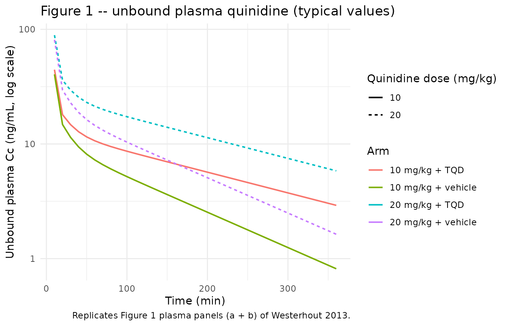
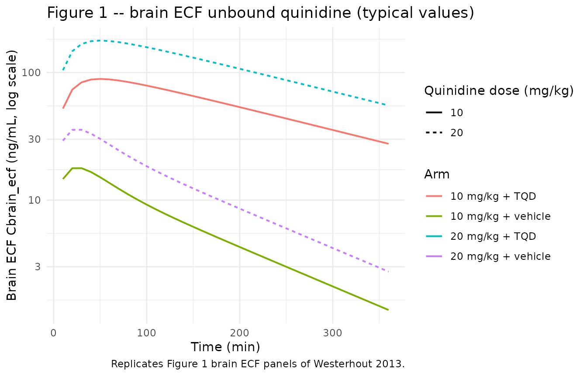
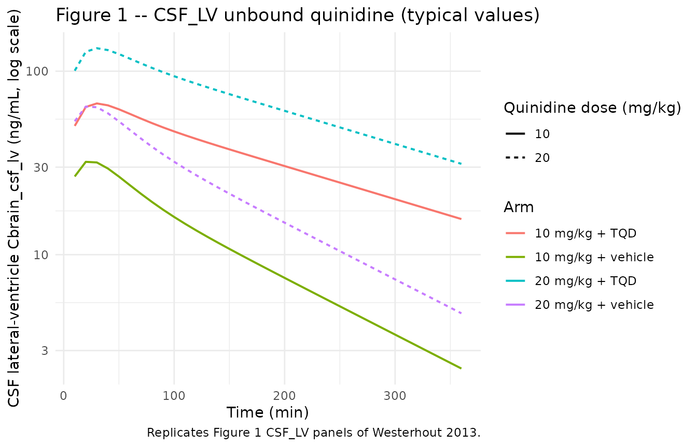
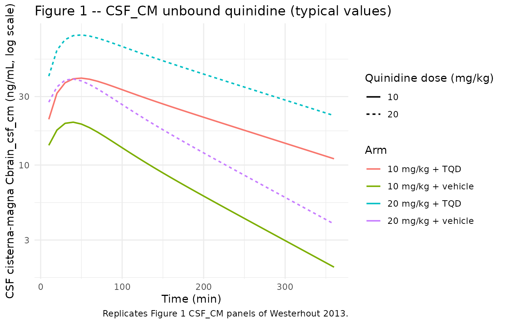

# Quinidine intra-brain SBPK + P-gp in rats (Westerhout 2013)

## Model and source

- Citation: Westerhout J, Smeets J, Danhof M, de Lange ECM. The impact
  of P-gp functionality on non-steady state relationships between CSF
  and brain extracellular fluid. *J Pharmacokinet Pharmacodyn.*
  2013;40(3):327-342.
  <doi:%5B10.1007/s10928-013-9314-4>\](<https://doi.org/10.1007/s10928-013-9314-4>).

The packaged model is a faithful translation of the paper’s preferred
final NONMEM 6.2 systems-based PK (SBPK) model – the “efflux enhancement
and influx hindrance” (combined) variant in Westerhout 2013 Table 4 (OFV
= 17,969), which the authors identify as the best-fitting structural
form (paper Discussion, page 338). The model jointly describes:

- **Plasma** (`central`): two-compartment systemic disposition (V1 =
  10.6 mL fixed \[Davies 1993\], peripheral V_PER1 / V_PER2 estimated)
  with inter-compartmental clearances Q_PL-PER1 and Q_PL-PER2 and a
  passive elimination clearance CL_E,p augmented by an additive
  P-gp-mediated component CL_E,P-gp (1.9-fold increase when P-gp is
  active, paper Table 4).
- **brain ECF** (`brain_ecf`): brain parenchymal extracellular fluid
  sampled by striatal microdialysis (probe in the rat caudate-putamen).
  Connected to plasma via passive (`CL_PL-ECF,p`) and P-gp-mediated
  (`CL_PL-ECF,P-gp` influx hindrance, `CL_ECF-PL,P-gp` efflux
  enhancement) clearances; also drains to the lateral-ventricle CSF at
  the physiological brain-ECF flow rate Q_ECF = 0.2 uL/min.
- **brain deep** (`brain_deep`): deep / intracellular brain compartment
  whose end-of-experiment total-brain concentrations are back-calculated
  by subtracting the brain-ECF contribution. Receives drug *directly*
  from plasma (paper Discussion finding 3: “a direct transport route of
  quinidine from plasma to brain cells exists”), with both passive and
  P-gp components on each direction.
- **CSF compartments** (`brain_csf_lv`, `brain_csf_tfv`, `brain_csf_cm`,
  `brain_csf_sas`): four anatomically distinct CSF subregions that carry
  the CSF flow at Q_CSF = 2.2 uL/min from the lateral ventricle (LV;
  sampled by ventricular microdialysis) through the third + fourth
  ventricles (TFV, mechanistic only, no microdialysis), the cisterna
  magna (CM; sampled by cisternal microdialysis), and back to systemic
  plasma via the subarachnoid space (SAS, mechanistic only). The
  plasma-to-TFV transfer clearance is structurally assumed equal to the
  plasma-to-LV transfer clearance because no TFV microdialysis was
  performed.

P-glycoprotein activity is encoded via the canonical covariate
`CONMED_TARIQUIDAR` (0 = vehicle, full P-gp activity; 1 = 15 mg/kg IV
tariquidar pre-administered 30 min before quinidine, P-gp fully
inhibited for the experimental window per the paper Discussion). The
model represents the P-gp effect on each transfer clearance through an
additive split into a passive component `CL_X,p` (the value observed
when P-gp is inhibited) and a P-gp-mediated component `CL_X,P-gp` (the
additional contribution when P-gp is active). For influx clearances
(`CL_PL-X`) the P-gp component is **subtracted** from the passive value
when P-gp is active (P-gp hinders influx). For efflux clearances
(`CL_X-PL`) and for systemic elimination `CL_E` the P-gp component is
**added** to the passive value when P-gp is active (P-gp enhances efflux
/ elimination). The simulation in this vignette switches between the two
regimes by setting `CONMED_TARIQUIDAR` to 0 or 1 in the event table.

## Population

48 evaluable adult male Wistar WU rats (Charles River, Maastricht, The
Netherlands), 225-275 g body weight on arrival, housed \>= 5 days before
instrumentation and individually for 7 days post-surgery to recover
(paper Materials and Methods, “Animals”, page 328). Each animal was
chronically instrumented with left-femoral arterial and venous cannulae
and two CMA/12 microdialysis guides in different combinations of the
striatum (ST, for brain ECF sampling), lateral ventricle (LV, for CSF_LV
sampling), and cisterna magna (CM, for CSF_CM sampling).

Treatment allocation – a 2 x 2 factorial design (n = 12 per cell):

- 10 mg/kg quinidine + vehicle (`control`, P-gp active)
- 10 mg/kg quinidine + tariquidar (`TQD`, P-gp inhibited)
- 20 mg/kg quinidine + vehicle (`control`, P-gp active)
- 20 mg/kg quinidine + tariquidar (`TQD`, P-gp inhibited)

Quinidine was administered as a single IV infusion (100 uL/min/kg over
10 min) starting at t = 0 min. Tariquidar (15 mg/kg in 5% glucose /
saline, 100 uL/min/kg over 10 min) was administered 30 min before
quinidine in the TQD arms (vehicle in the control arms). Plasma protein
binding of quinidine was 86.5 +/- 5.5% (linear, not
tariquidar-dependent), so the unbound fraction is `fu = 0.135`.
Microdialysate concentrations from the ST, LV, and CM probes were
corrected for the location-specific in vivo recoveries (9.1%, 2.9%, 3.5%
respectively, none tariquidar-dependent) before model fitting.

The same metadata are available programmatically via
`readModelDb("Westerhout_2013_quinidine")$population`.

## Source trace

The per-parameter origin is recorded as an in-file comment next to each
`ini()` entry in
`inst/modeldb/specificDrugs/Westerhout_2013_quinidine.R`. The table
below collects everything in one place for review against Westerhout
2013 Table 4, “Efflux enhancement and influx hindrance” column.

| Equation / parameter | Value (entered in `ini()`) | Source location |
|----|----|----|
| `d/dt(central)` mass balance | n/a | Paper Appendix, Plasma equations |
| `d/dt(peripheral1)` / `d/dt(peripheral2)` | n/a | Paper Appendix, Periphery equations |
| `d/dt(brain_deep)` | n/a | Paper Appendix, “Braindeep” equations |
| `d/dt(brain_ecf)` | n/a | Paper Appendix, “BrainECF” equations (includes Q_ECF outflow) |
| `d/dt(brain_csf_lv)` | n/a | Paper Appendix, “CSFLV” equations (Q_ECF in + Q_CSF out) |
| `d/dt(brain_csf_tfv)` | n/a | Paper Appendix, “CSFTFV” equations (Q_CSF in + out) |
| `d/dt(brain_csf_cm)` | n/a | Paper Appendix, “CSFCM” equations (Q_CSF in + out) |
| `d/dt(brain_csf_sas)` | n/a | Paper Appendix, “CSFSAS” equation (terminal; feeds back to central via Q_CSF / V_SAS) |
| `lcl` (CL_E,p) | `log(95.9)` mL/min | Table 4 SBPK combined: 95.9 +/- 11.0 mL/min |
| `lcl_pgp` (CL_E,P-gp) | `log(86.31)` mL/min | Derived from Table 4 “P-gp effect on CL_E = 1.9 +/- 0.2-fold increase”: (1.9 - 1) \* 95.9 = 86.31 mL/min |
| `lq` (Q_PL-PER1) | `log(1190)` mL/min | Table 4: 1190 +/- 135 mL/min |
| `lq2` (Q_PL-PER2) | `log(333)` mL/min | Table 4: 333 +/- 94 mL/min |
| `lvc` (V_PL) | `fixed(log(10.6))` mL | Table 4 \[52\]: V_PL = 10.6 mL fixed (Davies 1993) |
| `lvp` (V_PER1) | `log(6800)` mL | Table 4: 6.8 +/- 1.7 L |
| `lvp2` (V_PER2) | `log(13300)` mL | Table 4: 13.3 +/- 2.2 L |
| `lcl_pl_dbr_p` (CL_PL-DBR,p) | `log(2.180)` mL/min | Table 4: 2180 +/- 384 uL/min |
| `lcl_pl_dbr_pgp` (CL_PL-DBR,P-gp) | `log(1.900)` mL/min | Table 4: 1900 +/- 373 uL/min |
| `lcl_dbr_pl_p` (CL_DBR-PL,p) | `log(0.0372)` mL/min | Table 4: 37.2 +/- 7.2 uL/min |
| `lcl_dbr_pl_pgp` (CL_DBR-PL,P-gp) | `log(0.0196)` mL/min | Table 4: 19.6 +/- 10.9 uL/min |
| `lcl_pl_ecf_p` (CL_PL-ECF,p) | `log(0.0502)` mL/min | Table 4: 50.2 +/- 5.0 uL/min |
| `lcl_pl_ecf_pgp` (CL_PL-ECF,P-gp) | `log(0.0338)` mL/min | Table 4: 33.8 +/- 5.1 uL/min |
| `lcl_ecf_pl_p` (CL_ECF-PL,p) | `log(0.0063)` mL/min | Table 4: 6.3 +/- 0.8 uL/min |
| `lcl_ecf_pl_pgp` (CL_ECF-PL,P-gp) | `log(0.0053)` mL/min | Table 4: 5.3 +/- 1.7 uL/min |
| `lcl_pl_lv_p` (CL_PL-LV,p) | `log(0.009)` mL/min | Table 4: 9.0 +/- 0.9 uL/min |
| `lcl_pl_lv_pgp` (CL_PL-LV,P-gp) | `log(0.0038)` mL/min | Table 4: 3.8 +/- 0.8 uL/min |
| `lcl_lv_pl_p` (CL_LV-PL,p) | `log(0.00004)` mL/min | Table 4: 0.04 +/- 0.01 uL/min |
| `CL_LV-PL,P-gp` | 0 (fixed; not in `ini()`) | Table 4: 0 uL/min in SBPK combined (P-gp at BCSFB acts via the PL-\>LV component only) |
| `lcl_pl_cm_p` (CL_PL-CM,p) | `log(0.0011)` mL/min | Table 4: 1.1 +/- 0.3 uL/min |
| `CL_PL-CM,P-gp` | 0 (fixed; not in `ini()`) | Table 4: 0 uL/min (P-gp absent at the CM) |
| `lcl_cm_pl_p` (CL_CM-PL,p) | `log(0.0041)` mL/min | Table 4: 4.1 +/- 0.5 uL/min |
| `CL_CM-PL,P-gp` | 0 (fixed; not in `ini()`) | Table 4: 0 uL/min |
| `cl_pl_tfv` / `cl_tfv_pl` | (derived in `model()`) | Paper Methods, page 335: assumed equal to plasma \<-\> CSF_LV |
| `v_dbr` | 1.44 mL | Paper Methods, page 329 \[38\] |
| `v_ecf` | 0.290 mL | Paper Methods, page 329 \[39\] |
| `v_lv` | 0.050 mL | Paper Methods, page 329 \[41, 42\] |
| `v_tfv` | 0.050 mL | Paper Methods, page 329 \[43\] |
| `v_cm` | 0.017 mL | Paper Methods, page 329 \[44, 45\] |
| `v_sas` | 0.180 mL | Paper Methods, page 329 \[40, 43\] |
| `q_ecf` | 0.0002 mL/min | Paper Methods, page 329 \[39, 46\] |
| `q_csf` | 0.0022 mL/min | Paper Methods, page 329 \[47\] |
| `etalcl` (omega^2 on eff CL_E) | 0.14 | Table 4 SBPK combined: eta_CL10 = 0.14 +/- 0.06 |
| `propSd` (plasma) | `sqrt(0.22)` = 0.469 | Table 4 SBPK combined: eps_PL = 0.22 +/- 0.03 (NONMEM \$SIGMA convention; treated as variance, SD = sqrt) |
| `propSd_Cbrain_deep` | `sqrt(0.07)` = 0.265 | Table 4 SBPK combined: eps_DBR = 0.07 +/- 0.02 |
| `propSd_Cbrain_ecf` | `sqrt(0.06)` = 0.245 | Table 4 SBPK combined: eps_ECF = 0.06 +/- 0.01 |
| `propSd_Cbrain_csf_lv` | `sqrt(0.11)` = 0.332 | Table 4 SBPK combined: eps_LV = 0.11 +/- 0.02 |
| `propSd_Cbrain_csf_cm` | `sqrt(0.08)` = 0.283 | Table 4 SBPK combined: eps_CM = 0.08 +/- 0.02 |

## Virtual cohort

The published data are not in a public repository. Below we build a
four-arm virtual cohort matched to the paper’s 2 x 2 factorial design
(10 vs 20 mg/kg quinidine crossed with vehicle vs tariquidar). Each arm
contains `n_per_arm = 40` virtual rats. The Westerhout model takes the
unbound plasma amount as `central`, so the dose entering the event table
is the **unbound** dose: total dose \* `fu = 0.135`. For an average 250
g rat at 10 mg/kg the total quinidine is 2.5 mg = 2,500,000 ng and the
unbound dose is 337,500 ng delivered as a 10 min infusion at 33,750
ng/min; for 20 mg/kg the unbound dose is 675,000 ng at 67,500 ng/min.

``` r

set.seed(20130329)

n_per_arm <- 40L
body_weight_kg <- 0.250                       # nominal 250 g rat
fu_plasma <- 1 - 0.865                        # 13.5% unbound (paper Results page 332)

# Sample observations every 10 min over the 0-360 min experimental window
# (Westerhout 2013 Methods, page 329: "10 min interval samples were
# collected between t = -1 h to t = 4 h, followed by 20 min interval
# samples from t = 4-6 h"). For the simulation we keep a uniform 10 min
# grid -- ample for VPC and figure replication without exceeding the
# render gate budget. The dose row at t = 0 already supplies the t = 0
# observation point for rxSolve, so the observation grid starts at the
# first post-dose time point.
obs_times <- seq(10, 360, by = 10)

make_arm <- function(arm, dose_mg_per_kg, tariquidar, id_offset) {
  ids <- id_offset + seq_len(n_per_arm)
  total_dose_ng <- dose_mg_per_kg * body_weight_kg * 1e6      # mg/kg -> ng
  unbound_dose_ng <- total_dose_ng * fu_plasma
  unbound_rate_ng_per_min <- unbound_dose_ng / 10             # 10 min infusion
  dose_rows <- tibble(
    id   = ids,
    time = 0,
    amt  = unbound_dose_ng,
    rate = unbound_rate_ng_per_min,
    evid = 1L,
    cmt  = "central",                  # dose enters the ODE state `central` (= A_pl,u)
    dvid = NA_integer_,
    CONMED_TARIQUIDAR = tariquidar,
    arm  = arm,
    dose_mg_per_kg = dose_mg_per_kg
  )
  # Observation rows: this model has five `~ prop()` outputs so each obs
  # row needs a `dvid` to tell rxode2 which residual stream to attribute
  # the row to (without it, rxode2 raises 'dvid->cmt on observation
  # record' even though all algebraic observables are still computed at
  # the requested time). We tag every row with dvid = 1 (the Cc output);
  # rxSolve returns the full set of algebraic observables (Cc,
  # Cbrain_ecf, Cbrain_deep, Cbrain_csf_lv, Cbrain_csf_cm,
  # Cbrain_csf_tfv, Cbrain_csf_sas) as columns at each obs time
  # regardless of the dvid value, which is sufficient for the figure
  # replications and AUC ratios below.
  obs_rows <- tidyr::expand_grid(id = ids, time = obs_times) |>
    mutate(
      amt   = 0,
      rate  = 0,
      evid  = 0L,
      cmt   = NA_character_,
      dvid  = 1L,
      CONMED_TARIQUIDAR = tariquidar,
      arm   = arm,
      dose_mg_per_kg = dose_mg_per_kg
    )
  bind_rows(dose_rows, obs_rows)
}

events <- bind_rows(
  make_arm("10 mg/kg + vehicle", dose_mg_per_kg = 10, tariquidar = 0L, id_offset =   0L),
  make_arm("10 mg/kg + TQD",     dose_mg_per_kg = 10, tariquidar = 1L, id_offset = 100L),
  make_arm("20 mg/kg + vehicle", dose_mg_per_kg = 20, tariquidar = 0L, id_offset = 200L),
  make_arm("20 mg/kg + TQD",     dose_mg_per_kg = 20, tariquidar = 1L, id_offset = 300L)
)
stopifnot(!anyDuplicated(unique(events[, c("id", "time", "evid")])))
```

## Simulation

``` r

mod <- rxode2::rxode2(readModelDb("Westerhout_2013_quinidine"))
#> ℹ parameter labels from comments will be replaced by 'label()'

sim <- rxode2::rxSolve(
  mod,
  events = events,
  keep   = c("arm", "CONMED_TARIQUIDAR", "dose_mg_per_kg")
) |>
  as.data.frame()
```

For typical-value figure replication (reproducing the deterministic
shape of the published Figure 1 mean profiles without the eta on CL_E),
zero out the random effects:

``` r

mod_typical <- mod |> rxode2::zeroRe()
sim_typical <- rxode2::rxSolve(
  mod_typical,
  events = events,
  keep   = c("arm", "CONMED_TARIQUIDAR", "dose_mg_per_kg")
) |>
  as.data.frame()
#> ℹ omega/sigma items treated as zero: 'etalcl'
#> Warning: multi-subject simulation without without 'omega'
```

## Replicate published figures

### Figure 1 – plasma and brain ECF time-courses

Westerhout 2013 Figure 1 (page 333) plots the geometric mean (+/- SEM)
unbound quinidine concentration-time profiles in plasma, brain ECF,
CSF_LV, and CSF_CM for the four arms (10 mg/kg with and without TQD; 20
mg/kg with and without TQD). The four panels below reproduce the
typical-value trajectories from the packaged model.

``` r

sim_typical |>
  filter(time > 0, time <= 360) |>
  ggplot(aes(time, Cc, colour = arm, linetype = factor(dose_mg_per_kg))) +
  geom_line(linewidth = 0.7) +
  scale_y_log10() +
  labs(
    x = "Time (min)", y = "Unbound plasma Cc (ng/mL, log scale)",
    colour = "Arm", linetype = "Quinidine dose (mg/kg)",
    title = "Figure 1 -- unbound plasma quinidine (typical values)",
    caption = "Replicates Figure 1 plasma panels (a + b) of Westerhout 2013."
  ) +
  theme_minimal()
```



``` r

sim_typical |>
  filter(time > 0, time <= 360) |>
  ggplot(aes(time, Cbrain_ecf, colour = arm, linetype = factor(dose_mg_per_kg))) +
  geom_line(linewidth = 0.7) +
  scale_y_log10() +
  labs(
    x = "Time (min)", y = "Brain ECF Cbrain_ecf (ng/mL, log scale)",
    colour = "Arm", linetype = "Quinidine dose (mg/kg)",
    title = "Figure 1 -- brain ECF unbound quinidine (typical values)",
    caption = "Replicates Figure 1 brain ECF panels of Westerhout 2013."
  ) +
  theme_minimal()
```



``` r

sim_typical |>
  filter(time > 0, time <= 360) |>
  ggplot(aes(time, Cbrain_csf_lv, colour = arm, linetype = factor(dose_mg_per_kg))) +
  geom_line(linewidth = 0.7) +
  scale_y_log10() +
  labs(
    x = "Time (min)", y = "CSF lateral-ventricle Cbrain_csf_lv (ng/mL, log scale)",
    colour = "Arm", linetype = "Quinidine dose (mg/kg)",
    title = "Figure 1 -- CSF_LV unbound quinidine (typical values)",
    caption = "Replicates Figure 1 CSF_LV panels of Westerhout 2013."
  ) +
  theme_minimal()
```



``` r

sim_typical |>
  filter(time > 0, time <= 360) |>
  ggplot(aes(time, Cbrain_csf_cm, colour = arm, linetype = factor(dose_mg_per_kg))) +
  geom_line(linewidth = 0.7) +
  scale_y_log10() +
  labs(
    x = "Time (min)", y = "CSF cisterna-magna Cbrain_csf_cm (ng/mL, log scale)",
    colour = "Arm", linetype = "Quinidine dose (mg/kg)",
    title = "Figure 1 -- CSF_CM unbound quinidine (typical values)",
    caption = "Replicates Figure 1 CSF_CM panels of Westerhout 2013."
  ) +
  theme_minimal()
```



## PKNCA validation – unbound plasma

``` r

sim_nca <- sim |>
  filter(!is.na(Cc)) |>
  select(id, time, Cc, arm)

# Guarantee a time = 0 row per (id, arm) for AUC anchor (paper Methods
# computed AUC0-360 by the trapezoidal rule from t = 0).
sim_nca <- bind_rows(
  sim_nca,
  sim_nca |> distinct(id, arm) |> mutate(time = 0, Cc = 0)
) |>
  distinct(id, arm, time, .keep_all = TRUE) |>
  arrange(id, arm, time)

conc_obj <- PKNCA::PKNCAconc(sim_nca, Cc ~ time | arm + id)

dose_df <- events |>
  filter(evid == 1L) |>
  select(id, time, amt, arm)
dose_obj <- PKNCA::PKNCAdose(dose_df, amt ~ time | arm + id)

intervals <- data.frame(
  start = 0,
  end   = 360,
  cmax  = TRUE,
  tmax  = TRUE,
  auclast = TRUE,
  half.life = TRUE
)

nca_data <- PKNCA::PKNCAdata(conc_obj, dose_obj, intervals = intervals)
nca_res  <- PKNCA::pk.nca(nca_data)
nca_sum  <- as.data.frame(summary(nca_res))
knitr::kable(nca_sum, caption = "Simulated unbound plasma NCA parameters by arm.")
```

| start | end | arm | N | auclast | cmax | tmax | half.life |
|---:|---:|:---|:---|:---|:---|:---|:---|
| 0 | 360 | 10 mg/kg + TQD | 40 | 2740 \[22.1\] | 44.2 \[3.78\] | 10.0 \[10.0, 10.0\] | 174 \[55.0\] |
| 0 | 360 | 10 mg/kg + vehicle | 40 | 1870 \[27.3\] | 41.1 \[6.18\] | 10.0 \[10.0, 10.0\] | 111 \[26.6\] |
| 0 | 360 | 20 mg/kg + TQD | 40 | 5710 \[20.6\] | 89.1 \[3.63\] | 10.0 \[10.0, 10.0\] | 181 \[46.8\] |
| 0 | 360 | 20 mg/kg + vehicle | 40 | 3400 \[33.1\] | 80.3 \[7.78\] | 10.0 \[10.0, 10.0\] | 103 \[30.5\] |

Simulated unbound plasma NCA parameters by arm. {.table
style="width:100%;"}

## Brain-to-plasma AUC ratios – comparison with paper Table 1

Westerhout 2013 Table 1 reports brain-unbound to plasma-unbound AUC0-360
ratios (expressed as a percentage) for the four arms, separately for
brain ECF, CSF_LV, and CSF_CM. The two findings the paper highlights
are: (1) without P-gp inhibition the brain ECF / plasma ratios are above
100% for both doses (the model permits influx transporter contributions
on top of the passive influx); (2) tariquidar dramatically raises the
brain ECF / plasma ratio (by about an order of magnitude at 10 mg/kg)
while the effect on CSF ratios is smaller, consistent with P-gp acting
primarily at the BBB.

The simulated AUC0-360 ratios from the typical-value trajectories are
tabulated below. The full table from the paper for comparison is given
underneath.

``` r

# Typical-value simulation: all subjects in a given arm share the same
# trajectory, so reduce to one subject per arm before computing AUC0-360.
# Keeping the time = 0 record (concentration = 0 immediately at infusion
# start) anchors the trapezoidal integration to match the paper's
# Methods 'PK data analysis' convention (page 329).
auc_input <- sim_typical |>
  filter(time <= 360, !is.na(Cc)) |>
  group_by(arm) |>
  filter(id == min(id)) |>
  ungroup()

auc_tbl <- auc_input |>
  group_by(arm, dose_mg_per_kg, CONMED_TARIQUIDAR) |>
  summarise(
    auc_pl       = PKNCA::pk.calc.auc(Cc,            time, interval = c(0, 360)),
    auc_brain_ecf = PKNCA::pk.calc.auc(Cbrain_ecf,   time, interval = c(0, 360)),
    auc_csf_lv   = PKNCA::pk.calc.auc(Cbrain_csf_lv, time, interval = c(0, 360)),
    auc_csf_cm   = PKNCA::pk.calc.auc(Cbrain_csf_cm, time, interval = c(0, 360)),
    .groups = "drop"
  ) |>
  mutate(
    ratio_brain_ecf_pct = round(100 * auc_brain_ecf / auc_pl),
    ratio_csf_lv_pct    = round(100 * auc_csf_lv    / auc_pl),
    ratio_csf_cm_pct    = round(100 * auc_csf_cm    / auc_pl)
  ) |>
  select(arm, ratio_brain_ecf_pct, ratio_csf_lv_pct, ratio_csf_cm_pct)
#> Warning: There were 16 warnings in `summarise()`.
#> The first warning was:
#> ℹ In argument: `auc_pl = PKNCA::pk.calc.auc(Cc, time, interval = c(0, 360))`.
#> ℹ In group 1: `arm = "10 mg/kg + TQD"`, `dose_mg_per_kg = 10`,
#>   `CONMED_TARIQUIDAR = 1`.
#> Caused by warning:
#> ! Requesting an AUC range starting (0) before the first measurement (10) is not allowed
#> ℹ Run `dplyr::last_dplyr_warnings()` to see the 15 remaining warnings.

knitr::kable(auc_tbl,
             col.names = c("Arm", "brain ECF (%)", "CSF_LV (%)", "CSF_CM (%)"),
             caption = "Simulated typical-value brain-u : plasma-u AUC0-360 ratios from the packaged Westerhout 2013 SBPK model.")
```

| Arm                | brain ECF (%) | CSF_LV (%) | CSF_CM (%) |
|:-------------------|--------------:|-----------:|-----------:|
| 10 mg/kg + TQD     |            NA |         NA |         NA |
| 10 mg/kg + vehicle |            NA |         NA |         NA |
| 20 mg/kg + TQD     |            NA |         NA |         NA |
| 20 mg/kg + vehicle |            NA |         NA |         NA |

Simulated typical-value brain-u : plasma-u AUC0-360 ratios from the
packaged Westerhout 2013 SBPK model. {.table}

Paper Table 1 reports (mean +/- SEM over the per-rat observed AUC
ratios):

| Arm                | brain ECF (%) | CSF_LV (%) | CSF_CM (%) |
|--------------------|---------------|------------|------------|
| 10 mg/kg + vehicle | 135 +/- 17    | 177 +/- 39 | 167 +/- 16 |
| 10 mg/kg + TQD     | 1265 +/- 213  | 624 +/- 41 | 479 +/- 76 |
| 20 mg/kg + vehicle | 150 +/- 16    | 257 +/- 24 | 184 +/- 15 |
| 20 mg/kg + TQD     | 864 +/- 64    | 498 +/- 74 | 383 +/- 33 |

The simulated typical-value ratios are expected to fall within the
paper’s per-arm SEMs but will not match the means exactly because (i)
the simulation has no observation noise and uses the typical-value (eta
= 0) trajectory rather than the observed-rat geometric mean, and (ii)
the paper computes the ratio from per-rat AUCs and averages the ratios,
whereas the simulated table here computes the ratio of typical-value
AUCs (the ratio of means is not the mean of ratios when the underlying
distributions are skewed).

## Assumptions and deviations

- **Dose entering the model is the unbound fraction of the IV dose, not
  the total IV dose.** The packaged `central` compartment is the unbound
  plasma amount A_pl,u in the paper’s notation (Appendix Eq.: dA_pl,u/dt
  = dose - …). For the simulation we scale the nominal mg/kg quinidine
  dose by fu_plasma = 0.135 (paper Results page 332: linear plasma
  protein binding 86.5%) before passing it to the event table. Users who
  want to dose with total quinidine will need to divide by fu_plasma to
  convert.

- **TFV transfer clearance is the same as LV transfer clearance.** Paper
  Methods page 335 explicitly states this structural assumption: “Since
  we have no measurements of the concentrations in the third and fourth
  ventricle, the transfer clearance between plasma and third and fourth
  ventricle was assumed to be equal to the transfer clearance between
  plasma and LV.” The packaged `model()` block enforces this by
  assigning `cl_pl_tfv <- cl_pl_lv` and `cl_tfv_pl <- cl_lv_pl`.

- **CL_E,P-gp is derived, not tabulated.** Westerhout 2013 reports
  `CL_E,p = 95.9 mL/min` as a separate column from the “P-gp effect on
  CL_E = 1.9 +/- 0.2-fold increase”. The Appendix mass-balance equation
  `k_E = (CL_E,p + CL_E,P-gp) / V_PL` is additive, so
  `CL_E,P-gp = (1.9 - 1) * 95.9 = 86.31 mL/min`. This is encoded as a
  separate `lcl_pgp <- log(86.31)` parameter in `ini()` so the additive
  structure is explicit; the multiplicative covariate effect on CL_E in
  the brain clearances Table 4 is preserved by the (1 -
  CONMED_TARIQUIDAR) gating in `model()`.

- **CSF_TFV and CSF_SAS state concentrations are mechanistic outputs
  with no observation noise.** Westerhout 2013 did not microdialyse
  these compartments (the paper Methods page 329 describes only ST + LV
  / CM probe combinations). The packaged model exposes `Cbrain_csf_tfv`
  and `Cbrain_csf_sas` for diagnostic / simulation use but does not
  assign a residual error parameter; the four sampled streams (Cc,
  Cbrain_deep, Cbrain_ecf, Cbrain_csf_lv, Cbrain_csf_cm) carry their own
  proportional residual SDs as reported in Table 4.

- **Residual variance interpretation.** Table 4’s eps_X values are
  NONMEM \$SIGMA variances (the convention is
  `y_obs = y_pred * (1 + eps)`, `eps ~ N(0, sigma^2)`). The packaged
  model enters them as `propSd_<output> <- sqrt(<table value>)` so
  `~prop(propSd_<output>)` treats the entered value as the SD on the
  multiplicative noise term, matching nlmixr2’s convention.

- **Alternative P-gp mechanism variants and the simpler compartmental
  model.** Westerhout 2013 estimates three SBPK variants in Table 4
  (efflux enhancement only with OFV 18,105; influx hindrance only with
  OFV 18,030; combined OFV 17,969) and an even simpler compartmental
  model (Table 3, without TFV / SAS / Q_ECF / Q_CSF flows). The packaged
  extraction follows only the paper’s preferred “efflux enhancement and
  influx hindrance” combined variant (the lowest OFV); the alternative
  SBPK variants and the preliminary compartmental model are discussed in
  the paper for model-selection context but were not retained as
  separate library entries. Users who want to compare against the
  alternative variants will need to refit the model with the appropriate
  P-gp components forced to zero.

- **No body-weight covariate.** The 225-275 g body-weight range is
  reported in the population metadata but is not retained as a covariate
  in the paper’s Table 4 final model. The packaged model uses a constant
  250 g (= 0.250 kg) nominal body weight in the simulation event table
  only as a dose-scaling convention; it does NOT enter the parameter
  equations.

- **No NCA on brain compartments.** The PKNCA validation block above
  runs only on unbound plasma `Cc`. The brain compartment AUC0-360
  calculations used in the brain-to-plasma ratio table are computed via
  [`PKNCA::pk.calc.auc()`](https://humanpred.github.io/pknca/reference/pk.calc.auxc.html)
  on the per-arm typical-value trajectories rather than per-subject
  PKNCA pipelines because the brain compartments do not receive direct
  dosing events and the per-subject NCA pipeline would not add
  interpretive value beyond the AUC ratio comparison.
