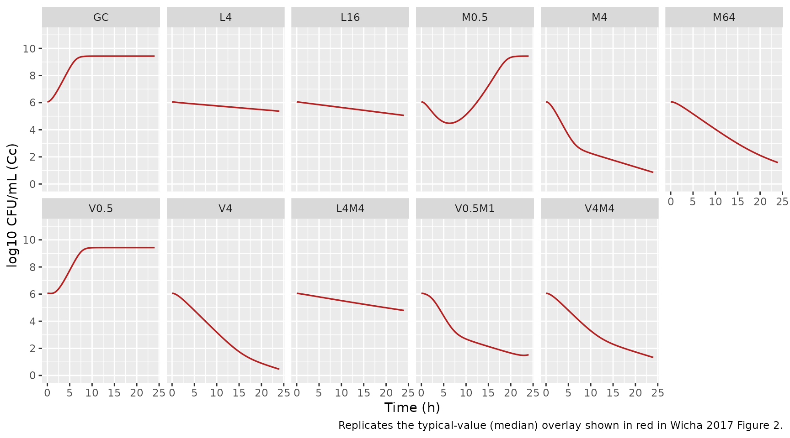
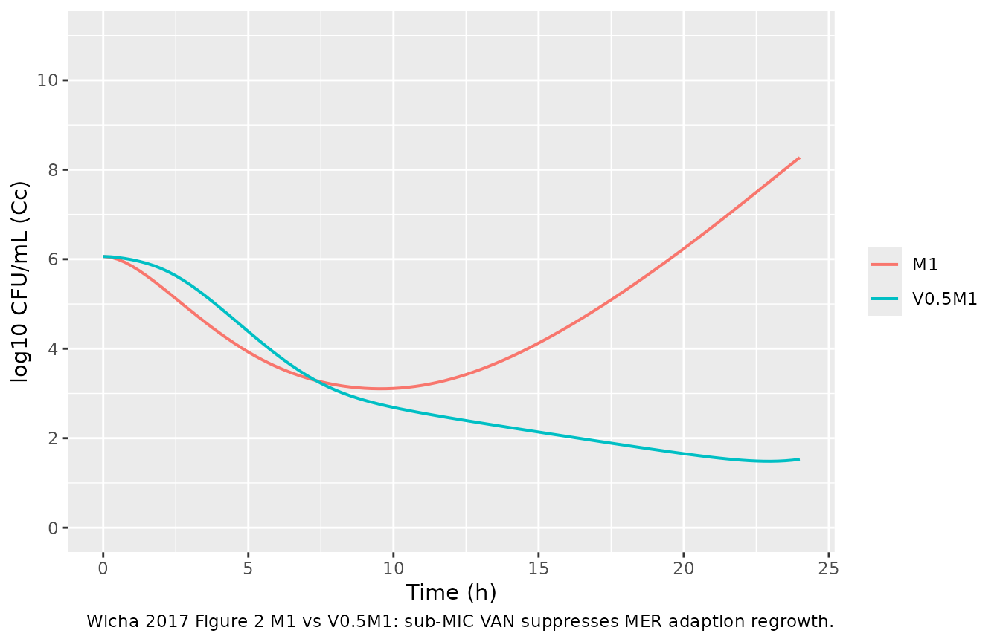

# Linezolid + meropenem + vancomycin time-kill (Wicha 2017)

## Model and source

- Citation: Wicha SG, Huisinga W, Kloft C. Translational pharmacometric
  evaluation of typical antibiotic broad-spectrum combination therapies
  against Staphylococcus aureus exploiting in vitro information. CPT
  Pharmacometrics Syst Pharmacol. 2017;6(8):512-522.
  <doi:10.1002/psp4.12197>.
- Description: In vitro (MSSA ATCC 29213). Semimechanistic time-kill
  pharmacodynamic model of linezolid, meropenem, and vancomycin against
  methicillin-susceptible Staphylococcus aureus. Bacterial life cycle
  has three states: growing (gro), replicating (repl), and persisting
  (pers). LZD inhibits the GRO-\>REP transition (bacteriostatic via
  krep) and induces a replication-independent killing rate kdeath_lzd on
  growing bacteria. MER and VAN, as cell wall-active antibiotics, impair
  successful doubling at the REP-\>GRO transition; the joint MER+VAN
  action is encoded as a modified Bliss-independence term that includes
  the paradoxical Eagle-effect self-inhibition of MER at high
  concentrations and the VAN Emax cap. Drug-unsusceptible persisters are
  generated during replication at rates kper_mer \* E_MER and kper_van
  \* E_VAN, then die at kdeath_per. An adaptive-resistance submodel
  (Tam 2005) inflates the effective EC50 of MER and of VAN over time via
  fractional ARon states; subinhibitory VAN concentrations inhibit the
  MER-adaption rate (monodirectional VAN-on-MER PD interaction). MER and
  VAN solution concentrations decay first-order due to chemical
  degradation in growth medium (rates fixed from HPLC measurement); LZD
  is stable. The model is in-vitro PD only – there is no human PK
  component; drug exposures are static dosing at t = 0. Random effects
  (eta) are NOT present: the paper reports replicate-only experimental
  variability and uses an additive residual error on log10(CFU/mL).
- Article: <https://doi.org/10.1002/psp4.12197>

## Population

The packaged model was fit to a 24-hour in-vitro time-kill experiment
using methicillin-susceptible Staphylococcus aureus (MSSA) reference
strain ATCC 29213. The strain was exposed to static,
replicate-controlled concentrations of linezolid (LZD, 0.5 to 32 mg/L),
meropenem (MER, 0.015 to 8 mg/L), and vancomycin (VAN, 0.06 to 16 mg/L)
alone and in selected dual combinations of LZD with MER and VAN with
MER. n = 1,617 timed CFU/mL data points were available for model
building. MIC values for the reference strain were LZD = 2.0 mg/L, MER =
0.125 mg/L, VAN = 1.0 mg/L (Wicha 2017 Methods, page 2-3). The model was
externally evaluated against two clinical MSSA isolates (MV13391,
MV13488) and against published time-kill datasets for LZD + VAN against
methicillin-resistant S. aureus, penicillin + erythromycin against S.
pneumoniae, and ampicillin + chloramphenicol against group B
streptococci.

There is no human or animal cohort: this is an in-vitro model with no
subject-level covariates. Replicate-to-replicate variability was small
and the published model carries no IIV / inter-experiment etas; the
residual is an additive standard deviation on log10 CFU/mL (Wicha 2017
Table 1 footnote). The complete population metadata is available
programmatically via
`readModelDb("Wicha_2017_linezolid_meropenem_vancomycin")$population`.

## Source trace

The semimechanistic PD model couples three bacterial states (growing
`gro`, replicating `repl`, persisting `pers`), three drug solution
states (`lzd`, `mer`, `van`) with first-order chemical degradation for
MER and VAN, and four adaption-resistance fractional states
(`aroff_mer`, `aron_mer`, `aroff_van`, `aron_van`). The published
governing equations are Wicha 2017 Eqs. 5-14 (page 4-5). Eq. 8 (the GRO
ODE) is the load-bearing combination form:

    d/dt(GRO) = - kdeath,LZD * E_LZD * GRO
                - krep(t, CFU) * (1 - E_LZD) * GRO
                + kdoub * [1 - E_MER * (1 - Emax_MER,Eagle * E_MER,Eagle) * (1 - E_VAN)]
                        * (1 - Emax_VAN * E_VAN) * REP * 2

The nested `(1 - E_VAN)` gate inside the inner bracket is what
implements the paper’s observation that the joint MER-plus-VAN maximum
effect is limited to the VAN-alone effect (M4 vs V4M4 in Figure 2): at
high VAN, that gate goes to zero, the MER contribution cancels, and the
doubling success-fraction collapses to the VAN-only
`(1 - Emax_VAN * E_VAN)` factor. The Eagle-effect self-inhibition of MER
at high MER concentrations (67.2% remaining inhibition above ~0.5 mg/L)
is encoded by the `(1 - Emax_MER,Eagle * E_MER,Eagle)` correction inside
the same bracket.

The full per-parameter source trace is recorded as in-file comments next
to each `ini()` entry in
`inst/modeldb/pharmacodynamics/Wicha_2017_linezolid_meropenem_vancomycin.R`.
The table below collects them in one place. All values come from Wicha
2017 Table 1.

| Parameter (paper symbol) | File name | Value | Units | Source |
|----|----|---:|----|----|
| CFU0 | `cfu0` | 6.06 | log10 CFU/mL | Table 1 |
| CFUmax | `cfumax` | 9.43 | log10 CFU/mL | Table 1 |
| klag | `lklag` | 0.88 | 1/h | Table 1 |
| krep | `lkrep` | 1.56 | 1/h | Table 1 |
| kdoub (FIXED) | `lkdoub` | 100 | 1/h | Table 1 |
| kdeath,per | `lkdeath_per` | 0.23 | 1/h | Table 1 |
| EC50,LZD | `lec50_lzd` | 0.68 | mg/L | Table 1 |
| H,LZD | `lhill_lzd` | 1.55 | (unitless) | Table 1 |
| kdeath,LZD | `lkdeath_lzd` | 0.10 | 1/h | Table 1 |
| EC50,MER,t=0 | `lec50_mer_t0` | 0.022 | mg/L | Table 1 |
| H,MER | `lhill_mer` | 3.23 | (unitless) | Table 1 |
| Emax,MER,Eagle | `emax_mer_eagle` | 0.328 | fraction | Table 1 (32.8%) |
| EC50,MER,Eagle | `lec50_mer_eagle` | 1.35 | mg/L | Table 1 |
| H,MER,Eagle (FIXED) | `lhill_mer_eagle` | 4 | (unitless) | Table 1 |
| beta,MER | `lb_mer` | 9.53 | (unitless) | Table 1 |
| s,MER (tau,MER) | `ls_mer` | 0.47 | L/(mg\*h) | Table 1 |
| kper,MER | `lkper_mer` | 0.11 | 1/h | Table 1 |
| kdeg,MER (FIXED) | `lkdeg_mer` | 0.019 | 1/h | Table 1 |
| Emax,VAN | `emax_van` | 0.743 | fraction | Table 1 (74.3%) |
| EC50,VAN,t=0 | `lec50_van_t0` | 0.46 | mg/L | Table 1 |
| H,VAN (FIXED) | `lhill_van` | 20 | (unitless) | Table 1 |
| EC50,VAN,ARI | `lec50_van_ari` | 0.39 | mg/L | Table 1 |
| H,VAN,ARI (FIXED) | `lhill_van_ari` | 1.0 | (unitless) | Table 1 |
| beta,VAN | `lb_van` | 3.59 | (unitless) | Table 1 |
| s,VAN (tau,VAN) | `ls_van` | 0.034 | L/(mg\*h) | Table 1 |
| kper,VAN | `lkper_van` | 0.017 | 1/h | Table 1 |
| kdeg,VAN (FIXED) | `lkdeg_van` | 0.0039 | 1/h | Table 1 (3.9e-3) |
| Residual SD | `addSd` | 0.63 | log10 CFU/mL | Table 1 (sigma) |

Compartment and observation conventions (see the Assumptions and
deviations section for justification of the non-canonical names):

| Compartment | Units | Meaning |
|----|----|----|
| `gro` | CFU/mL | growing-state bacteria |
| `repl` | CFU/mL | replicating-state bacteria |
| `pers` | CFU/mL | drug-unsusceptible persister bacteria |
| `lzd` | mg/L | linezolid bath concentration (chemically stable) |
| `mer` | mg/L | meropenem bath concentration (first-order decay) |
| `van` | mg/L | vancomycin bath concentration (first-order decay) |
| `aroff_mer`, `aron_mer` | fraction | MER adaption-resistance flip-flop (Eq. 5-6 analog) |
| `aroff_van`, `aron_van` | fraction | VAN adaption-resistance flip-flop (Eq. 12-13) |
| `Cc` | log10 CFU/mL | observation: log10 of total bacterial concentration |

## Helper: build a time-kill scenario

The published experiment used static drug concentrations applied at t =
0. The helper below builds an `et()` event table for an arbitrary
combination of LZD, MER, and VAN starting concentrations. Drug doses are
inserted as bolus events into the drug compartments with `amt`
interpreted as the initial bath concentration in mg/L.

``` r

mod <- readModelDb("Wicha_2017_linezolid_meropenem_vancomycin")

# MIC for ATCC 29213 (paper page 2)
MIC <- c(LZD = 2.0, MER = 0.125, VAN = 1.0)

build_scenario <- function(label, clzd = 0, cmer = 0, cvan = 0,
                           times = seq(0, 24, by = 0.25)) {
  ev <- et(amt = 0, cmt = "lzd", time = 0)  # anchor event-table at t = 0
  if (clzd > 0) ev <- et(ev, amt = clzd, cmt = "lzd", time = 0)
  if (cmer > 0) ev <- et(ev, amt = cmer, cmt = "mer", time = 0)
  if (cvan > 0) ev <- et(ev, amt = cvan, cmt = "van", time = 0)
  ev <- et(ev, times)
  out <- as.data.frame(rxode2::rxSolve(mod, ev))
  out$scenario <- label
  out$clzd <- clzd; out$cmer <- cmer; out$cvan <- cvan
  out
}
```

## Replicate Figure 2 panels (typical-value)

Wicha 2017 Figure 2 shows 49 time-kill panels covering the growth
control (GC), single-drug, and dual-combination scenarios. We reproduce
a representative subset that exercises every published mechanism: growth
control (carrying capacity + lag), single LZD (replication-independent
kill via `kdeath_lzd` plus growth arrest), single MER (replication-
dependent kill with Eagle effect at high concentrations), single VAN
(Emax cap at 74.3% and steep H = 20), the MER-LZD antagonism, and the
VAN-MER combination “limited to VAN”.

``` r

panels <- bind_rows(
  build_scenario("GC"),
  build_scenario("L4",     clzd = 4 * MIC[["LZD"]]),
  build_scenario("L16",    clzd = 16 * MIC[["LZD"]]),
  build_scenario("M0.5",   cmer = 0.5 * MIC[["MER"]]),
  build_scenario("M4",     cmer = 4 * MIC[["MER"]]),
  build_scenario("M64",    cmer = 64 * MIC[["MER"]]),
  build_scenario("V0.5",   cvan = 0.5 * MIC[["VAN"]]),
  build_scenario("V4",     cvan = 4 * MIC[["VAN"]]),
  build_scenario("L4M4",   clzd = 4 * MIC[["LZD"]], cmer = 4 * MIC[["MER"]]),
  build_scenario("V0.5M1", cvan = 0.5 * MIC[["VAN"]], cmer = 1 * MIC[["MER"]]),
  build_scenario("V4M4",   cvan = 4 * MIC[["VAN"]], cmer = 4 * MIC[["MER"]])
)

panels <- panels |>
  mutate(scenario = factor(scenario,
    levels = c("GC", "L4", "L16", "M0.5", "M4", "M64",
               "V0.5", "V4", "L4M4", "V0.5M1", "V4M4")))

ggplot(panels, aes(time, Cc)) +
  geom_line(color = "firebrick", linewidth = 0.6) +
  facet_wrap(~ scenario, ncol = 6) +
  scale_y_continuous(limits = c(0, 11), breaks = seq(0, 10, 2)) +
  labs(x = "Time (h)", y = "log10 CFU/mL (Cc)",
       caption = "Replicates the typical-value (median) overlay shown in red in Wicha 2017 Figure 2.")
```



## Key qualitative checks

**Growth control (GC).** With no drug, total CFU/mL must climb from
`10^cfu0` through the lag and approach `CFUmax = 10^9.43`.

``` r

gc <- panels |> filter(scenario == "GC") |> select(time, Cc)
sprintf("GC at 0 h: log10 CFU/mL = %.2f", gc$Cc[gc$time == 0])
#> [1] "GC at 0 h: log10 CFU/mL = 6.06"
sprintf("GC at 24 h: log10 CFU/mL = %.2f (paper CFUmax = 9.43)",
        gc$Cc[gc$time == 24])
#> [1] "GC at 24 h: log10 CFU/mL = 9.43 (paper CFUmax = 9.43)"
```

**Drug chemical degradation.** Wicha 2017 reports MER and VAN decay to
62.9% and 90.6% of their initial concentration at t = 24 h (page 5).

``` r

mer_decay <- build_scenario("M_high", cmer = 8) |>
  filter(time %in% c(0, 24))
van_decay <- build_scenario("V_high", cvan = 16) |>
  filter(time %in% c(0, 24))

sprintf("MER at 24 h / MER at 0 h = %.3f  (paper: 0.629)",
        mer_decay$mer[mer_decay$time == 24] /
          mer_decay$mer[mer_decay$time == 0])
#> [1] "MER at 24 h / MER at 0 h = 0.634  (paper: 0.629)"
sprintf("VAN at 24 h / VAN at 0 h = %.3f  (paper: 0.906)",
        van_decay$van[van_decay$time == 24] /
          van_decay$van[van_decay$time == 0])
#> [1] "VAN at 24 h / VAN at 0 h = 0.911  (paper: 0.906)"
```

**MER Eagle effect at high MER.** Wicha 2017 states that MER at high
concentrations attains only 67.2% inhibition of doubling
(`1 - Emax_Eagle = 0.672`) rather than 100% at optimal concentrations
(page 4). M4 (4 x MIC = 0.5 mg/L) is near the Eagle transition; M64 (64
x MIC = 8 mg/L) is well into the Eagle regime. The 24 h endpoints should
reflect the weaker kill at M64 relative to M4.

``` r

panels |>
  filter(scenario %in% c("M0.5", "M4", "M64"), time == 24) |>
  select(scenario, Cc)
#>   scenario        Cc
#> 1     M0.5 9.4296716
#> 2       M4 0.8571723
#> 3      M64 1.5790694
```

**Antagonism between LZD and MER.** Wicha 2017 explains that when LZD
growth-arrests bacteria, they no longer enter replication and so are
protected from MER’s replication-dependent kill (page 4-5). L4M4 should
therefore look like L4 (LZD bacteriostasis with marginal kill) rather
than like M4 (rapid bactericidal kill).

``` r

panels |>
  filter(scenario %in% c("L4", "M4", "L4M4"), time == 24) |>
  select(scenario, Cc)
#>   scenario        Cc
#> 1       L4 5.3723389
#> 2       M4 0.8571723
#> 3     L4M4 4.7932809
```

**Joint MER + VAN limited to VAN at high VAN.** Wicha 2017 reports that
“the maximum joint effect of MER and VAN was limited to the effect of
VAN” (page 4), citing M4 vs V4M4 in Figure 2. At V4M4 both drug levels
are above MIC, so the inner `(1 - E_VAN)` gate in Eq. 8 is near zero and
the success-fraction collapses to the VAN-only factor.

``` r

panels |>
  filter(scenario %in% c("M4", "V4", "V4M4"), time == 24) |>
  select(scenario, Cc)
#>   scenario        Cc
#> 1       M4 0.8571723
#> 2       V4 0.4626403
#> 3     V4M4 1.3295384
```

**VAN-on-MER adaptive-resistance suppression.** Wicha 2017 reports a
monodirectional PD interaction where sub-MIC VAN delays MSSA adaption to
MER (page 5). M1 alone shows MER regrowth after initial killing; V0.5M1
should not.

``` r

ari <- bind_rows(
  build_scenario("M1",     cmer = 1 * MIC[["MER"]]),
  build_scenario("V0.5M1", cvan = 0.5 * MIC[["VAN"]], cmer = 1 * MIC[["MER"]]))

ggplot(ari, aes(time, Cc, color = scenario)) +
  geom_line(linewidth = 0.7) +
  scale_y_continuous(limits = c(0, 11), breaks = seq(0, 10, 2)) +
  labs(x = "Time (h)", y = "log10 CFU/mL (Cc)", color = NULL,
       caption = "Wicha 2017 Figure 2 M1 vs V0.5M1: sub-MIC VAN suppresses MER adaption regrowth.")
```



## Assumptions and deviations

- **Non-canonical compartment names** (`gro`, `repl`, `pers`, `lzd`,
  `mer`, `van`, `aroff_mer`, `aron_mer`, `aroff_van`, `aron_van`). The
  nlmixr2lib canonical compartment register
  (`R/conventions.R::canonicalCompartments`) targets popPK / PK-PD
  models for systemic drug disposition; the bacterial-life-cycle and
  adaption-resistance states here have no analog in that register. The
  names are retained from Wicha 2017 (Figure 1, page 3) to keep the
  source trace direct.
  [`checkModelConventions()`](https://nlmixr2.github.io/nlmixr2lib/reference/checkModelConventions.md)
  emits compartment-name warnings; they are expected and documented
  here.
- **Single observation `Cc` carries log10 CFU/mL, not a drug
  concentration.** nlmixr2lib’s single-output convention names the
  observation `Cc`; the underlying quantity here is log10 of total
  bacterial CFU/mL. The `units$concentration` metadata makes this
  explicit (“log10 CFU/mL (observation)”). The conventions linter warns
  that `units$dosing` (mg/L) and the observation numerator (log10 CFU)
  appear dimensionally incompatible – this is intentional: dosing is an
  in-vitro bath concentration in mg/L, observation is a bacterial count.
- **Drug-state dosing semantics.** The `lzd`, `mer`, and `van`
  compartments are initialised by bolus dosing events at `time = 0`
  whose `amt` field is interpreted as the initial bath concentration in
  mg/L. The compartment state subsequently evolves only via the
  first-order degradation ODEs (zero for LZD; `kdeg_mer * mer` for MER;
  `kdeg_van * van` for VAN), so the compartments hold concentration, not
  mass.
- **Bacterial counts on linear scale internally.** Table 1 reports CFU0
  and CFUmax in log10 units; the ODEs operate on linear CFU/mL. The
  model converts in `model()`: initial condition `gro(0) <- 10^cfu0` and
  capacity term `1 - cfu_total / 10^cfumax`. A `1e-6` floor is added
  inside the `log10(...)` observation to avoid `log10(0)` when all
  bacterial states are driven to zero by combined regimens.
- **No IIV / random effects.** Wicha 2017 explicitly states that
  between-replicate variability was small and no random effects were
  required (page 4). The only stochastic component in the published
  model is the additive residual on log10 CFU/mL (sigma = 0.63). The 90%
  prediction intervals in Wicha 2017 Figure 2 came from sampling the
  parameter variance-covariance matrix (a parametric uncertainty band),
  not from IIV; the full covariance matrix is not published, so this
  vignette plots typical-value trajectories rather than reproducing the
  Figure 2 uncertainty bands directly.
- **Modified Bliss-Independence parsing.** The trimmed text extracted
  from the PDF rendered Eq. 8 with several “formula-not-decoded”
  placeholders. The literal PDF rendering of Eq. 8 has the success-
  fraction
  `[1 - E_MER * (1 - Emax_MER,Eagle * E_MER,Eagle) * (1 - E_VAN)] * (1 - Emax_VAN * E_VAN)`,
  where the inner `(1 - E_VAN)` gates the MER contribution and the outer
  `(1 - Emax_VAN * E_VAN)` enforces the 74.3% Emax cap on VAN’s effect.
  This is the form encoded in `model()`. It reproduces (a) MER alone
  reaches 100% inhibition at optimal concentrations and 67.2% in the
  Eagle range, (b) VAN alone reaches at most 74.3% inhibition, and (c)
  high VAN + high MER reduces to VAN-alone behaviour, matching the
  paper’s “limited to VAN” claim (M4 vs V4M4 in Figure 2).
- **Out-of-scope: human PK linkage and clinical-trial simulation.**
  Wicha 2017 also performs a clinical-trial simulation by linking the
  semimechanistic PD model to upstream published popPK models for LZD
  (Sasaki 2011), MER (Li 2006), and VAN (Llopis-Salvia 2006). Those PK
  models are separate publications that are not part of this extraction.
  Users wishing to reproduce the Figure 5 clinical-trial simulation
  would build the upstream popPK models separately, route their
  unbound-plasma concentration outputs into the `lzd` / `mer` / `van`
  compartments as time-varying inputs, and disable the in-vitro
  degradation ODEs (`kdeg_mer` and `kdeg_van`) since those are
  bath-medium artefacts not present in plasma.
- **External-validation scenarios not packaged.** The cross-strain
  (MV13391, MV13488) and cross-combination (penicillin + erythromycin,
  ampicillin + chloramphenicol) evaluations described in the paper
  require re-estimating `cfu0`, `cfumax`, and `krep` from the external
  time-kill control curves and setting `EC50` of the external drugs to
  their respective MICs (page 3). These are extension use-cases of the
  same model and are not pre-packaged as separate
  [`readModelDb()`](https://nlmixr2.github.io/nlmixr2lib/reference/readModelDb.md)
  entries.
