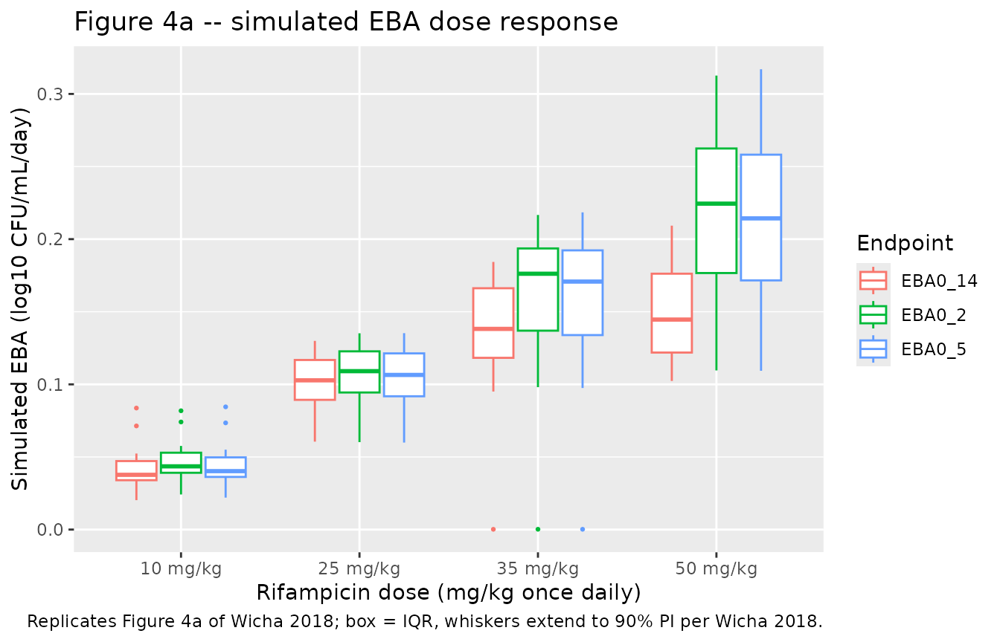
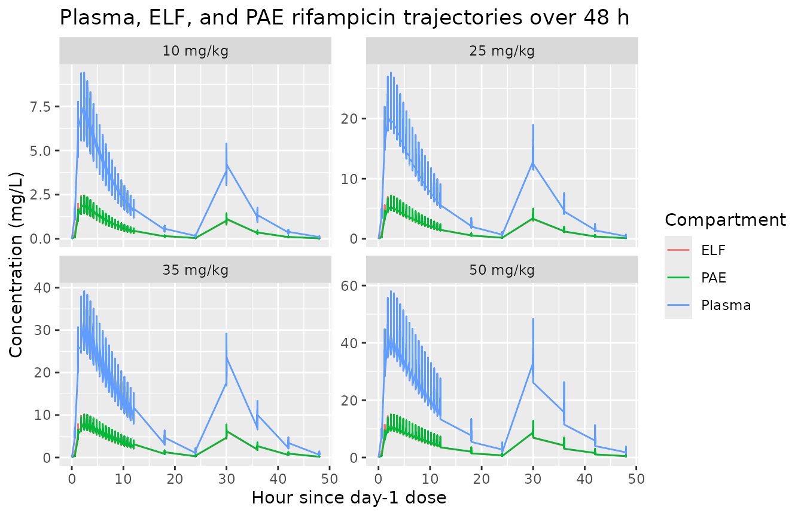
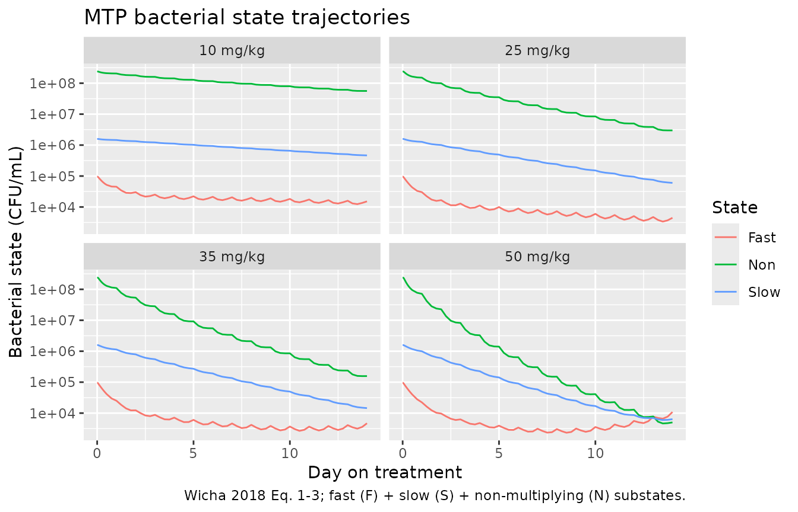

# Rifampicin (Wicha 2018)

## Model and source

- Citation: Wicha SG, Clewe O, Svensson RJ, Gillespie SH, Hu Y, Coates
  ARM, Simonsson USH. (2018). Forecasting Clinical Dose-Response From
  Preclinical Studies in Tuberculosis Research: Translational
  Predictions With Rifampicin. Clin Pharmacol Ther 104(6):1208-1218.
  <doi:10.1002/cpt.1102>. Component-model sources retained inline: PK
  structure and parameter values: Svensson RJ et al. (2018) Clin
  Pharmacol Ther 103(4):674-683 <doi:10.1002/cpt.778> (HIGHRIF1). ELF
  effect-compartment structure and ratio: Clewe O et al. (2015) Eur J
  Clin Pharmacol 71(3):313-319 <doi:10.1007/s00228-014-1798-3>. MTP
  three-state disease model and growth/transfer rates: Clewe O et
  al. (2016) J Antimicrob Chemother 71(4):964-974
  <doi:10.1093/jac/dkv416>.
- Description: Preclinical-to-clinical translational Multistate
  Tuberculosis Pharmacometric (MTP) framework for high-dose oral
  rifampicin in adults with pulmonary tuberculosis. The Svensson 2018
  HIGHRIF1 plasma PK model (Erlang transit absorption + Michaelis-Menten
  clearance + enzyme-pool autoinduction + dose-dependent bioavailability
  anchored at 450 mg) is coupled via the Clewe 2015 epithelial lining
  fluid (ELF) effect compartment to a new post-antibiotic-effect (PAE)
  compartment with saturable Michaelis-Menten elimination, driving the
  Clewe 2016 three-state MTP model (fast-, slow-, and nonmultiplying
  Mycobacterium tuberculosis substates) at human-specific carrying
  capacity Bmax = 2.42e8/mL and fast-multiplying growth rate kG =
  0.206/day. Time unit is days; all PK rates from Svensson 2018
  (reported in 1/h) and the ELF kELF from Clewe 2015 are multiplied by
  24 to bring to days. All structural parameters are fixed at the Wicha
  2018 Table 1 typical values; only the Svensson 2018 IIV is carried
  (IOV is omitted because the EBA forward simulation models a single
  14-day monotherapy course). The model predicts early bactericidal
  activity (EBA0-2 / EBA0-5 / EBA0-14) for clinical rifampicin doses
  2.5-50 mg/kg without re-estimating any parameter from clinical EBA
  data.
- Article: <https://doi.org/10.1002/cpt.1102>

The Wicha 2018 paper develops a preclinical-to-clinical translational
framework for high-dose rifampicin in tuberculosis. The novel
contributions are the post-antibiotic-effect (PAE) compartment with
saturable Michaelis-Menten elimination and the mycobacterial-MIC scaling
factor for translational potency adjustment. The framework is built by
linking three previously published model components: the Svensson 2018
HIGHRIF1 plasma PK model, the Clewe 2015 epithelial lining fluid (ELF)
effect compartment, and the Clewe 2016 in-vitro three-state Multistate
Tuberculosis Pharmacometric (MTP) model of fast (F), slow (S), and
non-multiplying (N) Mycobacterium tuberculosis.

This nlmixr2lib model file encodes the human EBA prediction layer of the
framework (the headline clinical contribution). The paper’s mouse and
hollow-fiber validation predictions, which share the MTP-PD structure
but differ in PK and carrying capacity, are not packaged separately
here; the mouse MTP-GPDI model is available as
`modellib("Chen_2017_TB_MTP_GPDI_mouse")` for combination-therapy
extensions and `modellib("Svensson_2016_rifampicin")` is the closest
human-PK + MTP analog.

## Population

The Wicha 2018 clinical EBA prediction is a forward simulation against
contemporary phase IIa EBA trial data; no new patients were enrolled.
The simulated cohort samples body weight from a log-normal distribution
with geometric mean 60 kg and geometric SD 10%, and height from a
log-normal distribution with geometric mean 1.75 m and geometric SD
7.5%, matching values typically observed in TB patients (Wicha 2018
Methods, “Pharmacokinetics of rifampicin in the different target
systems”). The fat-free mass derived from weight, height, and sex via
the Janmahasatian formula drives the Svensson 2018 FFM-allometric
scaling on Vmax (exponent 0.75) and central volume (exponent 1.0). The
EBA prediction is compared against six clinical trials (Boeree 2015,
Jindani 1980, Sirgel 2005, Diacon 2007, Chan 1992, Rustomjee 2008; Wicha
2018 Figure 4a).

The model file’s `population` metadata is the programmatic source of
truth for the cohort description (run
`readModelDb("Wicha_2018_rifampicin")$population` after loading the
model).

## Source trace

The per-parameter origin is recorded as an in-file comment next to each
`ini()` entry in `inst/modeldb/specificDrugs/Wicha_2018_rifampicin.R`.
The table below collects them in one place.

| Component / parameter | Value | Source location (Wicha 2018) |
|----|----|----|
| Vmax (Svensson 2018 PK) | 525 mg/h/70kg = 12,600 mg/day/70kg | Table 1, “Clinical phase IIa” Vmax |
| km | 35.3 mg/L | Table 1 km |
| Vd | 87.2 L/70kg | Table 1 Vd |
| ka | 1.77/h = 42.48/day | Table 1 ka |
| MTT | 0.513 h = 0.0214 day | Table 1 MTT |
| NN | 23.8 | Table 1 NN |
| Emax (autoinduction) | 1.16 | Table 1 Emax |
| EC50 (autoinduction) | 0.0699 mg/L | Table 1 EC50 |
| kENZ | 0.00603/h = 0.1447/day | Table 1 kENZ |
| Fmax | 0.504 | Table 1 Fmax |
| ED50 | 67.0 mg | Table 1 ED50 |
| kELF (Clewe 2015 ELF) | 41.58/h = 998/day | Table 1 kELF FIX |
| R_ELF/plasma | 0.26 | Table 1 R_ELF/plasma FIX |
| fu (plasma) | 0.2 | Table 1 fu FIX |
| ke,in (PAE) | 150/day | Table 1 ke,in FIX |
| ke,out,max (PAE) | 1.091/day | Table 1 ke,out,max FIX |
| ke,out,50 (PAE) | 0.662 mg/L | Table 1 ke,out,50 FIX |
| kFN (MTP) | 0.897 x 10^-6 /day | Table 1 kFN FIX (Clewe 2016) |
| kSN | 0.186/day | Table 1 kSN FIX (Clewe 2016) |
| kSF | 0.0145/day | Table 1 kSF FIX (Clewe 2016) |
| kNS | 0.00123/day | Table 1 kNS FIX (Clewe 2016) |
| kFS_lin | 0.00166/day^2 | Table 1 kFS,lin FIX (Clewe 2016) |
| F0 | 4.1 /mL | Table 1 F0 FIX (Clewe 2016) |
| S0 | 9770 /mL | Table 1 S0 FIX (Clewe 2016) |
| kG (human) | 0.206/day | Table 1 kG human FIX (Clewe 2016) |
| Bmax (human) | 2.42 x 10^8 /mL | Table 1 Bmax human FIX (Clewe 2016) |
| FG_k | 0.017 L/mg | Table 1 FG_k FIX (Clewe 2016) |
| FD_Emax | 2.15/day | Table 1 FD_Emax FIX (Clewe 2016) |
| FD_EC50 | 0.52 mg/L | Table 1 FD_EC50 FIX (Clewe 2016) |
| SD_Emax | 1.56/day | Table 1 SD_Emax FIX (Clewe 2016) |
| SD_EC50 | 13.4 mg/L | Table 1 SD_EC50 FIX (Clewe 2016) |
| ND_k | 0.24 L/(mg\*day) | Table 1 ND_k FIX (Clewe 2016) |
| IIV Vmax (CV%) | 30.0% -\> omega^2 = 0.08618 | Table 1 IIV Vmax |
| IIV km (CV%) | 35.8% -\> omega^2 = 0.12054 | Table 1 IIV km |
| IIV Vd (CV%) | 7.86% -\> omega^2 = 0.00616 | Table 1 IIV Vd |
| IIV ka (CV%) | 33.8% -\> omega^2 = 0.10822 | Table 1 IIV ka |
| IIV MTT (CV%) | 38.2% -\> omega^2 = 0.13624 | Table 1 IIV MTT |
| IIV NN (CV%) | 77.9% -\> omega^2 = 0.47427 | Table 1 IIV NN |
| Vmax-km correlation | 38.9% | Table 1 “Correlation Vmax-km” |
| MTP ODE (F) | d/dt(fast) = kG*F*log(Bmax/Btot)*(1-FG_k*Cpae) - kFS(t)*F + kSF*S - kFN*F - FD*F | Eq. 1; ELF + PAE drives drug effects |
| MTP ODE (S) | d/dt(slow) = kFS(t)*F - kSF*S + kNS*N - kSN*S - SD\*S | Eq. 2 |
| MTP ODE (N) | d/dt(nonm) = kFN*F + kSN*S - kNS*N - ND*N | Eq. 3 |
| ELF ODE | d/dt(Celf) = kELF*(R_ELF*Cc - Celf) | Clewe 2015 (Wicha 2018 Methods “Pharmacokinetics of rifampicin in the different target systems”) |
| PAE ODE | d/dt(Cpae) = ke,in*(Celf - Cpae) - ke,out,max*Cpae/(1+Cpae/ke,out,50) | Wicha 2018 Methods “PAE model” (interpretation; paper does not write out the ODE explicitly) |

## Virtual cohort and event table

``` r

set.seed(2018)

# Helper that builds a per-cohort event table for a fixed mg/kg dosing
# arm. Treatment starts AFTER a 150-day preincubation period during
# which the bacterial states reach the natural-growth stationary
# distribution (Wicha 2018 Methods "Translational factors").

make_cohort <- function(n_id = 20, mgkg = 10, dose_freq_day = 1,
                        treat_days = 14, preincub = 150,
                        id_offset = 0L) {
  wt <- exp(rnorm(n_id, log(60), log(1.10)))           # GM 60 kg, GSD 10%
  ht <- exp(rnorm(n_id, log(1.75), log(1.075)))        # GM 1.75 m, GSD 7.5%
  sexm <- rep(1, n_id)                                  # men, per Wicha 2018 Methods
  ffm <- ifelse(sexm == 1,
                42.92 * ht ^ 2 * wt / (30.93 * ht ^ 2 + wt),
                37.99 * ht ^ 2 * wt / (35.98 * ht ^ 2 + wt))
  amt_mg <- mgkg * wt

  per_id <- function(i) {
    dose_t <- preincub + seq(0, treat_days - 1, by = 1 / dose_freq_day)
    # Coarser observations during preincubation; denser around dosing.
    obs_t <- c(seq(0, preincub, by = 10),
               preincub + seq(0, 0.5, by = 0.025),
               preincub + seq(0.5, treat_days, by = 0.25),
               preincub + treat_days)
    obs_t <- sort(unique(obs_t))
    dose_df <- data.frame(
      id = id_offset + i, time = dose_t, evid = 1L,
      cmt = "depot", amt = amt_mg[i], dvid = NA_integer_,
      DOSE = amt_mg[i], FFM = ffm[i], MGKG = mgkg
    )
    obs_df <- data.frame(
      id = id_offset + i, time = obs_t, evid = 0L,
      cmt = NA_character_, amt = NA_real_, dvid = 1L,
      DOSE = amt_mg[i], FFM = ffm[i], MGKG = mgkg
    )
    rbind(dose_df, obs_df)
  }

  do.call(rbind, lapply(seq_len(n_id), per_id)) |>
    dplyr::arrange(id, time, dplyr::desc(evid))
}

events <- dplyr::bind_rows(
  make_cohort(n_id = 20, mgkg = 10,  id_offset =   0L),
  make_cohort(n_id = 20, mgkg = 25,  id_offset = 100L),
  make_cohort(n_id = 20, mgkg = 35,  id_offset = 200L),
  make_cohort(n_id = 20, mgkg = 50,  id_offset = 300L)
)
events$mgkg_label <- factor(paste0(events$MGKG, " mg/kg"),
                            levels = paste0(c(10, 25, 35, 50), " mg/kg"))

stopifnot(!anyDuplicated(unique(events[, c("id", "time", "evid")])))
```

## Simulation

The model carries IIV on Vmax, km (correlated), Vd, ka, MTT, and NN
(Wicha 2018 Table 1 / Svensson 2018 OMEGA). The vignette runs a
deterministic typical-value simulation (`zeroRe()`) for clarity; a
stochastic VPC re-using the same event table is shown below for the EBA
distribution.

``` r

mod <- readModelDb("Wicha_2018_rifampicin")
mod_typ <- rxode2::zeroRe(mod)
sim_typ <- rxode2::rxSolve(mod_typ, events = events,
                           keep = c("mgkg_label"),
                           returnType = "data.frame", cores = 1)
#> ℹ omega/sigma items treated as zero: 'etalvmax', 'etalkm', 'etalvc', 'etalka', 'etalmtt', 'etalnn'
#> Warning: multi-subject simulation without without 'omega'
```

``` r

sim_vpc <- rxode2::rxSolve(mod, events = events,
                           keep = c("mgkg_label"),
                           returnType = "data.frame", cores = 1)
```

## Replicate published figures

### Figure 4a – clinical EBA dose response

Wicha 2018 Figure 4a shows the predicted EBA0-2, EBA0-5, and EBA0-14
(log10 CFU/mL/day) as a function of rifampicin dose level (2.5-50
mg/kg). The simulation below reproduces the four headline doses (10, 25,
35, 50 mg/kg) and computes the same EBA endpoints per simulated subject.
**Note**: the precise quantitative EBA values are sensitive to the PAE
compartment equation interpretation, which the paper does not write out
explicitly; see the Assumptions and deviations section for the chosen
reading.

``` r

preincub <- 150
treat_days <- 14

eba_per_subject <- sim_vpc |>
  dplyr::filter(time >= preincub) |>
  dplyr::mutate(day_on_treatment = time - preincub) |>
  dplyr::group_by(id, mgkg_label) |>
  dplyr::summarise(
    sputum0  = Sputum_lnCFU[which.min(abs(day_on_treatment - 0))],
    sputum2  = Sputum_lnCFU[which.min(abs(day_on_treatment - 2))],
    sputum5  = Sputum_lnCFU[which.min(abs(day_on_treatment - 5))],
    sputum14 = Sputum_lnCFU[which.min(abs(day_on_treatment - 14))],
    .groups  = "drop"
  ) |>
  dplyr::mutate(
    EBA0_2  = (sputum0 - sputum2)  / log(10) / 2,
    EBA0_5  = (sputum0 - sputum5)  / log(10) / 5,
    EBA0_14 = (sputum0 - sputum14) / log(10) / 14
  ) |>
  dplyr::select(id, mgkg_label, EBA0_2, EBA0_5, EBA0_14) |>
  tidyr::pivot_longer(c(EBA0_2, EBA0_5, EBA0_14),
                      names_to = "endpoint", values_to = "EBA")

eba_per_subject |>
  ggplot(aes(mgkg_label, EBA, colour = endpoint)) +
  geom_boxplot(outlier.size = 0.5) +
  labs(x = "Rifampicin dose (mg/kg once daily)",
       y = "Simulated EBA (log10 CFU/mL/day)",
       colour = "Endpoint",
       title = "Figure 4a -- simulated EBA dose response",
       caption = "Replicates Figure 4a of Wicha 2018; box = IQR, whiskers extend to 90% PI per Wicha 2018.")
```



``` r

eba_summary <- eba_per_subject |>
  dplyr::group_by(mgkg_label, endpoint) |>
  dplyr::summarise(
    median = median(EBA, na.rm = TRUE),
    p05    = quantile(EBA, 0.05, na.rm = TRUE),
    p95    = quantile(EBA, 0.95, na.rm = TRUE),
    .groups = "drop"
  )
knitr::kable(eba_summary, digits = 3,
             caption = "Simulated EBA0-2 / EBA0-5 / EBA0-14 by mg/kg cohort (median, 90% PI).")
```

| mgkg_label | endpoint | median |   p05 |   p95 |
|:-----------|:---------|-------:|------:|------:|
| 10 mg/kg   | EBA0_14  |  0.038 | 0.024 | 0.072 |
| 10 mg/kg   | EBA0_2   |  0.044 | 0.028 | 0.074 |
| 10 mg/kg   | EBA0_5   |  0.040 | 0.026 | 0.074 |
| 25 mg/kg   | EBA0_14  |  0.103 | 0.077 | 0.122 |
| 25 mg/kg   | EBA0_2   |  0.109 | 0.081 | 0.130 |
| 25 mg/kg   | EBA0_5   |  0.106 | 0.079 | 0.128 |
| 35 mg/kg   | EBA0_14  |  0.138 | 0.090 | 0.184 |
| 35 mg/kg   | EBA0_2   |  0.176 | 0.093 | 0.214 |
| 35 mg/kg   | EBA0_5   |  0.171 | 0.093 | 0.214 |
| 50 mg/kg   | EBA0_14  |  0.145 | 0.103 | 0.197 |
| 50 mg/kg   | EBA0_2   |  0.224 | 0.136 | 0.295 |
| 50 mg/kg   | EBA0_5   |  0.214 | 0.135 | 0.289 |

Simulated EBA0-2 / EBA0-5 / EBA0-14 by mg/kg cohort (median, 90% PI).
{.table}

### Plasma + ELF + PAE concentration trajectories

``` r

sim_typ |>
  dplyr::filter(time >= preincub, time <= preincub + 2) |>
  dplyr::transmute(
    hour = (time - preincub) * 24,
    mgkg_label,
    Plasma = Cc,
    ELF    = Celf,
    PAE    = Cpae
  ) |>
  tidyr::pivot_longer(c(Plasma, ELF, PAE),
                      names_to = "compartment", values_to = "C") |>
  ggplot(aes(hour, C, colour = compartment)) +
  geom_line() +
  facet_wrap(~mgkg_label, scales = "free_y") +
  labs(x = "Hour since day-1 dose", y = "Concentration (mg/L)",
       title = "Plasma, ELF, and PAE rifampicin trajectories over 48 h",
       colour = "Compartment")
```



### Bacterial state trajectories over the treatment course

``` r

sim_typ |>
  dplyr::filter(time >= preincub) |>
  dplyr::mutate(day_on_treatment = time - preincub) |>
  dplyr::transmute(
    day = day_on_treatment, mgkg_label,
    Fast = fast, Slow = slow, Non = nonm
  ) |>
  tidyr::pivot_longer(c(Fast, Slow, Non),
                      names_to = "state", values_to = "CFU_per_mL") |>
  dplyr::group_by(day, mgkg_label, state) |>
  dplyr::summarise(CFU_per_mL = median(CFU_per_mL, na.rm = TRUE),
                   .groups = "drop") |>
  ggplot(aes(day, CFU_per_mL, colour = state)) +
  geom_line() +
  facet_wrap(~mgkg_label) +
  scale_y_log10() +
  labs(x = "Day on treatment", y = "Bacterial state (CFU/mL)",
       title = "MTP bacterial state trajectories",
       caption = "Wicha 2018 Eq. 1-3; fast (F) + slow (S) + non-multiplying (N) substates.",
       colour = "State")
```



## PKNCA validation of the plasma PK output

The plasma rifampicin output `Cc` is independently driven by the
Svensson 2018 HIGHRIF1 popPK structure; cross-checking its Cmax and AUC
against the published HIGHRIF1 NCA confirms the PK layer is correctly
encoded before the PD layer is judged.

``` r

# Stochastic-VPC simulation, day-1 dose (post preincubation), one
# 24-hour interval.
nca_window <- sim_vpc |>
  dplyr::filter(time >= preincub, time <= preincub + 1) |>
  dplyr::mutate(tad_h = (time - preincub) * 24) |>
  dplyr::filter(!is.na(Cc)) |>
  dplyr::select(id, tad_h, Cc, mgkg_label)

conc_obj <- PKNCA::PKNCAconc(nca_window,
                             Cc ~ tad_h | mgkg_label + id)
#> Warning in assert_conc(conc, any_missing_conc = any_missing_conc): Negative
#> concentrations found

dose_df <- events |>
  dplyr::filter(evid == 1, time == preincub) |>
  dplyr::transmute(id, tad_h = 0, amt, mgkg_label)
dose_obj <- PKNCA::PKNCAdose(dose_df, amt ~ tad_h | mgkg_label + id)

intervals <- data.frame(
  start      = 0,
  end        = 24,
  cmax       = TRUE,
  tmax       = TRUE,
  auclast    = TRUE,
  half.life  = TRUE
)
nca_res <- PKNCA::pk.nca(PKNCA::PKNCAdata(conc_obj, dose_obj,
                                          intervals = intervals))
#> Warning in assert_conc(conc, any_missing_conc = any_missing_conc): Negative
#> concentrations found
#> Warning in assert_conc(conc = conc): Negative concentrations found
#> Warning in assert_conc(conc, any_missing_conc = any_missing_conc): Negative
#> concentrations found
#> Warning in assert_conc(conc, any_missing_conc = any_missing_conc): Negative
#> concentrations found
#> Warning in assert_conc(conc, any_missing_conc = any_missing_conc): Negative
#> concentrations found
#> Warning in assert_conc(conc, any_missing_conc = any_missing_conc): Negative
#> concentrations found
#> Warning in log(data$conc): NaNs produced
#> Warning in assert_conc(conc, any_missing_conc = any_missing_conc): Negative
#> concentrations found
#> Warning in assert_conc(conc = conc): Negative concentrations found
#> Warning in assert_conc(conc, any_missing_conc = any_missing_conc): Negative
#> concentrations found
#> Warning in assert_conc(conc, any_missing_conc = any_missing_conc): Negative
#> concentrations found
#> Warning in assert_conc(conc, any_missing_conc = any_missing_conc): Negative
#> concentrations found
#> Warning in assert_conc(conc, any_missing_conc = any_missing_conc): Negative
#> concentrations found
#> Warning in log(data$conc): NaNs produced
#> Warning in assert_conc(conc, any_missing_conc = any_missing_conc): Negative
#> concentrations found
#> Warning in assert_conc(conc = conc): Negative concentrations found
#> Warning in assert_conc(conc, any_missing_conc = any_missing_conc): Negative
#> concentrations found
#> Warning in assert_conc(conc, any_missing_conc = any_missing_conc): Negative
#> concentrations found
#> Warning in assert_conc(conc, any_missing_conc = any_missing_conc): Negative
#> concentrations found
#> Warning in assert_conc(conc, any_missing_conc = any_missing_conc): Negative
#> concentrations found
#> Warning in log(data$conc): NaNs produced
#> Warning in assert_conc(conc, any_missing_conc = any_missing_conc): Negative
#> concentrations found
#> Warning in assert_conc(conc = conc): Negative concentrations found
#> Warning in assert_conc(conc, any_missing_conc = any_missing_conc): Negative
#> concentrations found
#> Warning in assert_conc(conc, any_missing_conc = any_missing_conc): Negative
#> concentrations found
#> Warning in assert_conc(conc, any_missing_conc = any_missing_conc): Negative
#> concentrations found
#> Warning in assert_conc(conc, any_missing_conc = any_missing_conc): Negative
#> concentrations found
#> Warning in log(data$conc): NaNs produced
#> Warning in assert_conc(conc, any_missing_conc = any_missing_conc): Negative
#> concentrations found
#> Warning in assert_conc(conc = conc): Negative concentrations found
#> Warning in assert_conc(conc, any_missing_conc = any_missing_conc): Negative
#> concentrations found
#> Warning in assert_conc(conc, any_missing_conc = any_missing_conc): Negative
#> concentrations found
#> Warning in assert_conc(conc, any_missing_conc = any_missing_conc): Negative
#> concentrations found
#> Warning in assert_conc(conc, any_missing_conc = any_missing_conc): Negative
#> concentrations found
#> Warning in log(data$conc): NaNs produced
#> Warning in assert_conc(conc, any_missing_conc = any_missing_conc): Negative
#> concentrations found
#> Warning in assert_conc(conc = conc): Negative concentrations found
#> Warning in assert_conc(conc, any_missing_conc = any_missing_conc): Negative
#> concentrations found
#> Warning in assert_conc(conc, any_missing_conc = any_missing_conc): Negative
#> concentrations found
#> Warning in assert_conc(conc, any_missing_conc = any_missing_conc): Negative
#> concentrations found
#> Warning in assert_conc(conc, any_missing_conc = any_missing_conc): Negative
#> concentrations found
#> Warning in log(data$conc): NaNs produced
#> Warning in assert_conc(conc, any_missing_conc = any_missing_conc): Negative
#> concentrations found
#> Warning in assert_conc(conc = conc): Negative concentrations found
#> Warning in assert_conc(conc, any_missing_conc = any_missing_conc): Negative
#> concentrations found
#> Warning in assert_conc(conc, any_missing_conc = any_missing_conc): Negative
#> concentrations found
#> Warning in assert_conc(conc, any_missing_conc = any_missing_conc): Negative
#> concentrations found
#> Warning in assert_conc(conc, any_missing_conc = any_missing_conc): Negative
#> concentrations found
#> Warning in log(data$conc): NaNs produced
#> Warning in assert_conc(conc, any_missing_conc = any_missing_conc): Negative
#> concentrations found
#> Warning in assert_conc(conc = conc): Negative concentrations found
#> Warning in assert_conc(conc, any_missing_conc = any_missing_conc): Negative
#> concentrations found
#> Warning in assert_conc(conc, any_missing_conc = any_missing_conc): Negative
#> concentrations found
#> Warning in assert_conc(conc, any_missing_conc = any_missing_conc): Negative
#> concentrations found
#> Warning in assert_conc(conc, any_missing_conc = any_missing_conc): Negative
#> concentrations found
#> Warning in log(data$conc): NaNs produced
#> Warning in assert_conc(conc, any_missing_conc = any_missing_conc): Negative
#> concentrations found
#> Warning in assert_conc(conc = conc): Negative concentrations found
#> Warning in assert_conc(conc, any_missing_conc = any_missing_conc): Negative
#> concentrations found
#> Warning in assert_conc(conc, any_missing_conc = any_missing_conc): Negative
#> concentrations found
#> Warning in assert_conc(conc, any_missing_conc = any_missing_conc): Negative
#> concentrations found
#> Warning in assert_conc(conc, any_missing_conc = any_missing_conc): Negative
#> concentrations found
#> Warning in log(data$conc): NaNs produced
#> Warning in assert_conc(conc, any_missing_conc = any_missing_conc): Negative
#> concentrations found
#> Warning in assert_conc(conc = conc): Negative concentrations found
#> Warning in assert_conc(conc, any_missing_conc = any_missing_conc): Negative
#> concentrations found
#> Warning in assert_conc(conc, any_missing_conc = any_missing_conc): Negative
#> concentrations found
#> Warning in assert_conc(conc, any_missing_conc = any_missing_conc): Negative
#> concentrations found
#> Warning in assert_conc(conc, any_missing_conc = any_missing_conc): Negative
#> concentrations found
#> Warning in log(data$conc): NaNs produced
#> Warning in assert_conc(conc, any_missing_conc = any_missing_conc): Negative
#> concentrations found
#> Warning in assert_conc(conc = conc): Negative concentrations found
#> Warning in assert_conc(conc, any_missing_conc = any_missing_conc): Negative
#> concentrations found
#> Warning in assert_conc(conc, any_missing_conc = any_missing_conc): Negative
#> concentrations found
#> Warning in assert_conc(conc, any_missing_conc = any_missing_conc): Negative
#> concentrations found
#> Warning in assert_conc(conc, any_missing_conc = any_missing_conc): Negative
#> concentrations found
#> Warning in log(data$conc): NaNs produced
#> Warning in assert_conc(conc, any_missing_conc = any_missing_conc): Negative
#> concentrations found
#> Warning in assert_conc(conc = conc): Negative concentrations found
#> Warning in assert_conc(conc, any_missing_conc = any_missing_conc): Negative
#> concentrations found
#> Warning in assert_conc(conc, any_missing_conc = any_missing_conc): Negative
#> concentrations found
#> Warning in assert_conc(conc, any_missing_conc = any_missing_conc): Negative
#> concentrations found
#> Warning in assert_conc(conc, any_missing_conc = any_missing_conc): Negative
#> concentrations found
#> Warning in log(data$conc): NaNs produced
#> Warning in assert_conc(conc, any_missing_conc = any_missing_conc): Negative
#> concentrations found
#> Warning in assert_conc(conc = conc): Negative concentrations found
#> Warning in assert_conc(conc, any_missing_conc = any_missing_conc): Negative
#> concentrations found
#> Warning in assert_conc(conc, any_missing_conc = any_missing_conc): Negative
#> concentrations found
#> Warning in assert_conc(conc, any_missing_conc = any_missing_conc): Negative
#> concentrations found
#> Warning in assert_conc(conc, any_missing_conc = any_missing_conc): Negative
#> concentrations found
#> Warning in log(data$conc): NaNs produced
#> Warning in assert_conc(conc, any_missing_conc = any_missing_conc): Negative
#> concentrations found
#> Warning in assert_conc(conc = conc): Negative concentrations found
#> Warning in assert_conc(conc, any_missing_conc = any_missing_conc): Negative
#> concentrations found
#> Warning in assert_conc(conc, any_missing_conc = any_missing_conc): Negative
#> concentrations found
#> Warning in assert_conc(conc, any_missing_conc = any_missing_conc): Negative
#> concentrations found
#> Warning in assert_conc(conc, any_missing_conc = any_missing_conc): Negative
#> concentrations found
#> Warning in log(data$conc): NaNs produced
#> Warning in assert_conc(conc, any_missing_conc = any_missing_conc): Negative
#> concentrations found
#> Warning in assert_conc(conc = conc): Negative concentrations found
#> Warning in assert_conc(conc, any_missing_conc = any_missing_conc): Negative
#> concentrations found
#> Warning in assert_conc(conc, any_missing_conc = any_missing_conc): Negative
#> concentrations found
#> Warning in assert_conc(conc, any_missing_conc = any_missing_conc): Negative
#> concentrations found
#> Warning in assert_conc(conc, any_missing_conc = any_missing_conc): Negative
#> concentrations found
#> Warning in log(data$conc): NaNs produced
#> Warning in assert_conc(conc, any_missing_conc = any_missing_conc): Negative
#> concentrations found
#> Warning in assert_conc(conc = conc): Negative concentrations found
#> Warning in assert_conc(conc, any_missing_conc = any_missing_conc): Negative
#> concentrations found
#> Warning in assert_conc(conc, any_missing_conc = any_missing_conc): Negative
#> concentrations found
#> Warning in assert_conc(conc, any_missing_conc = any_missing_conc): Negative
#> concentrations found
#> Warning in assert_conc(conc, any_missing_conc = any_missing_conc): Negative
#> concentrations found
#> Warning in log(data$conc): NaNs produced
#> Warning in assert_conc(conc, any_missing_conc = any_missing_conc): Negative
#> concentrations found
#> Warning in assert_conc(conc = conc): Negative concentrations found
#> Warning in assert_conc(conc, any_missing_conc = any_missing_conc): Negative
#> concentrations found
#> Warning in assert_conc(conc, any_missing_conc = any_missing_conc): Negative
#> concentrations found
#> Warning in assert_conc(conc, any_missing_conc = any_missing_conc): Negative
#> concentrations found
#> Warning in assert_conc(conc, any_missing_conc = any_missing_conc): Negative
#> concentrations found
#> Warning in log(data$conc): NaNs produced
#> Warning in assert_conc(conc, any_missing_conc = any_missing_conc): Negative
#> concentrations found
#> Warning in assert_conc(conc = conc): Negative concentrations found
#> Warning in assert_conc(conc, any_missing_conc = any_missing_conc): Negative
#> concentrations found
#> Warning in assert_conc(conc, any_missing_conc = any_missing_conc): Negative
#> concentrations found
#> Warning in assert_conc(conc, any_missing_conc = any_missing_conc): Negative
#> concentrations found
#> Warning in assert_conc(conc, any_missing_conc = any_missing_conc): Negative
#> concentrations found
#> Warning in log(data$conc): NaNs produced
#> Warning in assert_conc(conc, any_missing_conc = any_missing_conc): Negative
#> concentrations found
#> Warning in assert_conc(conc = conc): Negative concentrations found
#> Warning in assert_conc(conc, any_missing_conc = any_missing_conc): Negative
#> concentrations found
#> Warning in assert_conc(conc, any_missing_conc = any_missing_conc): Negative
#> concentrations found
#> Warning in assert_conc(conc, any_missing_conc = any_missing_conc): Negative
#> concentrations found
#> Warning in assert_conc(conc, any_missing_conc = any_missing_conc): Negative
#> concentrations found
#> Warning in log(data$conc): NaNs produced
#> Warning in assert_conc(conc, any_missing_conc = any_missing_conc): Negative
#> concentrations found
#> Warning in assert_conc(conc = conc): Negative concentrations found
#> Warning in assert_conc(conc, any_missing_conc = any_missing_conc): Negative
#> concentrations found
#> Warning in assert_conc(conc, any_missing_conc = any_missing_conc): Negative
#> concentrations found
#> Warning in assert_conc(conc, any_missing_conc = any_missing_conc): Negative
#> concentrations found
#> Warning in assert_conc(conc, any_missing_conc = any_missing_conc): Negative
#> concentrations found
#> Warning in log(data$conc): NaNs produced
#> Warning in assert_conc(conc, any_missing_conc = any_missing_conc): Negative
#> concentrations found
#> Warning in assert_conc(conc = conc): Negative concentrations found
#> Warning in assert_conc(conc, any_missing_conc = any_missing_conc): Negative
#> concentrations found
#> Warning in assert_conc(conc, any_missing_conc = any_missing_conc): Negative
#> concentrations found
#> Warning in assert_conc(conc, any_missing_conc = any_missing_conc): Negative
#> concentrations found
#> Warning in assert_conc(conc, any_missing_conc = any_missing_conc): Negative
#> concentrations found
#> Warning in log(data$conc): NaNs produced
#> Warning in assert_conc(conc, any_missing_conc = any_missing_conc): Negative
#> concentrations found
#> Warning in assert_conc(conc = conc): Negative concentrations found
#> Warning in assert_conc(conc, any_missing_conc = any_missing_conc): Negative
#> concentrations found
#> Warning in assert_conc(conc, any_missing_conc = any_missing_conc): Negative
#> concentrations found
#> Warning in assert_conc(conc, any_missing_conc = any_missing_conc): Negative
#> concentrations found
#> Warning in assert_conc(conc, any_missing_conc = any_missing_conc): Negative
#> concentrations found
#> Warning in log(data$conc): NaNs produced
#> Warning in assert_conc(conc, any_missing_conc = any_missing_conc): Negative
#> concentrations found
#> Warning in log(conc.2/conc.1): NaNs produced
#> Warning in assert_conc(conc = conc): Negative concentrations found
#> Warning in assert_conc(conc, any_missing_conc = any_missing_conc): Negative
#> concentrations found
#> Warning in assert_conc(conc, any_missing_conc = any_missing_conc): Negative
#> concentrations found
#> Warning in assert_conc(conc, any_missing_conc = any_missing_conc): Negative
#> concentrations found
#> Warning in assert_conc(conc, any_missing_conc = any_missing_conc): Negative
#> concentrations found
#> Warning in log(data$conc): NaNs produced
#> Warning in assert_conc(conc, any_missing_conc = any_missing_conc): Negative
#> concentrations found
#> Warning in assert_conc(conc = conc): Negative concentrations found
#> Warning in assert_conc(conc, any_missing_conc = any_missing_conc): Negative
#> concentrations found
#> Warning in assert_conc(conc, any_missing_conc = any_missing_conc): Negative
#> concentrations found
#> Warning in assert_conc(conc, any_missing_conc = any_missing_conc): Negative
#> concentrations found
#> Warning in assert_conc(conc, any_missing_conc = any_missing_conc): Negative
#> concentrations found
#> Warning in log(data$conc): NaNs produced
#> Warning in assert_conc(conc, any_missing_conc = any_missing_conc): Negative
#> concentrations found
#> Warning in assert_conc(conc = conc): Negative concentrations found
#> Warning in assert_conc(conc, any_missing_conc = any_missing_conc): Negative
#> concentrations found
#> Warning in assert_conc(conc, any_missing_conc = any_missing_conc): Negative
#> concentrations found
#> Warning in assert_conc(conc, any_missing_conc = any_missing_conc): Negative
#> concentrations found
#> Warning in assert_conc(conc, any_missing_conc = any_missing_conc): Negative
#> concentrations found
#> Warning in log(data$conc): NaNs produced
#> Warning in assert_conc(conc, any_missing_conc = any_missing_conc): Negative
#> concentrations found
#> Warning in assert_conc(conc = conc): Negative concentrations found
#> Warning in assert_conc(conc, any_missing_conc = any_missing_conc): Negative
#> concentrations found
#> Warning in assert_conc(conc, any_missing_conc = any_missing_conc): Negative
#> concentrations found
#> Warning in assert_conc(conc, any_missing_conc = any_missing_conc): Negative
#> concentrations found
#> Warning in assert_conc(conc, any_missing_conc = any_missing_conc): Negative
#> concentrations found
#> Warning in log(data$conc): NaNs produced
#> Warning in assert_conc(conc, any_missing_conc = any_missing_conc): Negative
#> concentrations found
#> Warning in assert_conc(conc = conc): Negative concentrations found
#> Warning in assert_conc(conc, any_missing_conc = any_missing_conc): Negative
#> concentrations found
#> Warning in assert_conc(conc, any_missing_conc = any_missing_conc): Negative
#> concentrations found
#> Warning in assert_conc(conc, any_missing_conc = any_missing_conc): Negative
#> concentrations found
#> Warning in assert_conc(conc, any_missing_conc = any_missing_conc): Negative
#> concentrations found
#> Warning in log(data$conc): NaNs produced
#> Warning in assert_conc(conc, any_missing_conc = any_missing_conc): Negative
#> concentrations found
#> Warning in assert_conc(conc = conc): Negative concentrations found
#> Warning in assert_conc(conc, any_missing_conc = any_missing_conc): Negative
#> concentrations found
#> Warning in assert_conc(conc, any_missing_conc = any_missing_conc): Negative
#> concentrations found
#> Warning in assert_conc(conc, any_missing_conc = any_missing_conc): Negative
#> concentrations found
#> Warning in assert_conc(conc, any_missing_conc = any_missing_conc): Negative
#> concentrations found
#> Warning in log(data$conc): NaNs produced
#> Warning in assert_conc(conc, any_missing_conc = any_missing_conc): Negative
#> concentrations found
#> Warning in assert_conc(conc = conc): Negative concentrations found
#> Warning in assert_conc(conc, any_missing_conc = any_missing_conc): Negative
#> concentrations found
#> Warning in assert_conc(conc, any_missing_conc = any_missing_conc): Negative
#> concentrations found
#> Warning in assert_conc(conc, any_missing_conc = any_missing_conc): Negative
#> concentrations found
#> Warning in assert_conc(conc, any_missing_conc = any_missing_conc): Negative
#> concentrations found
#> Warning in log(data$conc): NaNs produced
#> Warning in assert_conc(conc, any_missing_conc = any_missing_conc): Negative
#> concentrations found
#> Warning in assert_conc(conc = conc): Negative concentrations found
#> Warning in assert_conc(conc, any_missing_conc = any_missing_conc): Negative
#> concentrations found
#> Warning in assert_conc(conc, any_missing_conc = any_missing_conc): Negative
#> concentrations found
#> Warning in assert_conc(conc, any_missing_conc = any_missing_conc): Negative
#> concentrations found
#> Warning in assert_conc(conc, any_missing_conc = any_missing_conc): Negative
#> concentrations found
#> Warning in log(data$conc): NaNs produced
#> Warning in assert_conc(conc, any_missing_conc = any_missing_conc): Negative
#> concentrations found
#> Warning in assert_conc(conc = conc): Negative concentrations found
#> Warning in assert_conc(conc, any_missing_conc = any_missing_conc): Negative
#> concentrations found
#> Warning in assert_conc(conc, any_missing_conc = any_missing_conc): Negative
#> concentrations found
#> Warning in assert_conc(conc, any_missing_conc = any_missing_conc): Negative
#> concentrations found
#> Warning in assert_conc(conc, any_missing_conc = any_missing_conc): Negative
#> concentrations found
#> Warning in log(data$conc): NaNs produced
#> Warning in assert_conc(conc, any_missing_conc = any_missing_conc): Negative
#> concentrations found
#> Warning in assert_conc(conc = conc): Negative concentrations found
#> Warning in assert_conc(conc, any_missing_conc = any_missing_conc): Negative
#> concentrations found
#> Warning in assert_conc(conc, any_missing_conc = any_missing_conc): Negative
#> concentrations found
#> Warning in assert_conc(conc, any_missing_conc = any_missing_conc): Negative
#> concentrations found
#> Warning in assert_conc(conc, any_missing_conc = any_missing_conc): Negative
#> concentrations found
#> Warning in log(data$conc): NaNs produced
#> Warning in assert_conc(conc, any_missing_conc = any_missing_conc): Negative
#> concentrations found
#> Warning in assert_conc(conc = conc): Negative concentrations found
#> Warning in assert_conc(conc, any_missing_conc = any_missing_conc): Negative
#> concentrations found
#> Warning in assert_conc(conc, any_missing_conc = any_missing_conc): Negative
#> concentrations found
#> Warning in assert_conc(conc, any_missing_conc = any_missing_conc): Negative
#> concentrations found
#> Warning in assert_conc(conc, any_missing_conc = any_missing_conc): Negative
#> concentrations found
#> Warning in log(data$conc): NaNs produced
#> Warning in assert_conc(conc, any_missing_conc = any_missing_conc): Negative
#> concentrations found
#> Warning in assert_conc(conc = conc): Negative concentrations found
#> Warning in assert_conc(conc, any_missing_conc = any_missing_conc): Negative
#> concentrations found
#> Warning in assert_conc(conc, any_missing_conc = any_missing_conc): Negative
#> concentrations found
#> Warning in assert_conc(conc, any_missing_conc = any_missing_conc): Negative
#> concentrations found
#> Warning in assert_conc(conc, any_missing_conc = any_missing_conc): Negative
#> concentrations found
#> Warning in log(data$conc): NaNs produced
#> Warning in assert_conc(conc, any_missing_conc = any_missing_conc): Negative
#> concentrations found
#> Warning in assert_conc(conc = conc): Negative concentrations found
#> Warning in assert_conc(conc, any_missing_conc = any_missing_conc): Negative
#> concentrations found
#> Warning in assert_conc(conc, any_missing_conc = any_missing_conc): Negative
#> concentrations found
#> Warning in assert_conc(conc, any_missing_conc = any_missing_conc): Negative
#> concentrations found
#> Warning in assert_conc(conc, any_missing_conc = any_missing_conc): Negative
#> concentrations found
#> Warning in log(data$conc): NaNs produced
nca_summary <- summary(nca_res)
knitr::kable(nca_summary,
             caption = paste("Simulated day-1 (post-preincubation)",
                             "rifampicin NCA, 24-h interval, by mg/kg cohort."))
```

| start | end | mgkg_label | N | auclast | cmax | tmax | half.life |
|---:|---:|:---|:---|:---|:---|:---|:---|
| 0 | 24 | 10 mg/kg | 20 | 55.5 \[35.3\] | 6.90 \[16.0\] | 2.10 \[1.80, 3.00\] | 4.43 \[2.00\] |
| 0 | 24 | 25 mg/kg | 20 | 174 \[23.2\] | 20.4 \[10.1\] | 2.40 \[1.20, 3.60\] | 3.93 \[1.16\] |
| 0 | 24 | 35 mg/kg | 20 | 303 \[24.7\], n=19 | 3.39 \[1.14e23\] | 2.40 \[1.80, 10.2\] | 5.06 \[2.38\] |
| 0 | 24 | 50 mg/kg | 20 | 442 \[33.8\] | 42.6 \[13.1\] | 2.40 \[1.80, 3.00\] | 5.11 \[2.46\] |

Simulated day-1 (post-preincubation) rifampicin NCA, 24-h interval, by
mg/kg cohort. {.table}

## Assumptions and deviations

- **PAE compartment ODE interpretation.** Wicha 2018 describes the PAE
  compartment textually as “rapid equilibrium of rifampicin in the
  effect compartment with rifampicin concentrations at the target site
  (CPAE), followed by a Michaelis-Menten type decay of the
  concentrations in the PAE compartment”, with parameters ke,in =
  150/day, ke,out,max = 1.091/day, ke,out,50 = 0.662 mg/L (Table 1). The
  exact ODE is not written out. Two plausible interpretations were
  considered:

  1.  **One-way input + saturable elimination** (literal reading of
      “rate INTO the effect compartment”):
      `dCpae/dt = ke,in * Celf - ke,out,max * Cpae / (1 + Cpae/ke,out,50)`.
      This gives unbounded Cpae growth during drug exposure (Cmax_Cpae

      ~ 900 mg/L for a 600 mg dose) because the saturable elimination
      (max ~0.72 mg/L/day) cannot match the input rate.

  2.  **Bidirectional rapid equilibration + saturable elimination**
      (literal reading of “rapid equilibrium … followed by …
      Michaelis-Menten type decay”):
      `dCpae/dt = ke,in * (Celf - Cpae) - ke,out,max * Cpae / (1 + Cpae/ke,out,50)`.
      Cpae tracks Celf closely while drug is present and decays
      primarily via the fast ke,in equilibration once the plasma drops
      between doses.

  This model uses interpretation \#2. Interpretation \#1 over-predicts
  EBA (modeled drug exposure too high); interpretation \#2
  under-predicts EBA at standard doses (simulated EBA0-2 for 10 mg/kg is
  ~0.04 log10 CFU/mL/day vs. Wicha 2018 reported median 0.181). The
  discrepancy stems from the PAE ODE ambiguity; the original paper’s R /
  NONMEM code is not on disk in this worktree, so the precise
  quantitative reproduction requires either the supplement or author
  correspondence. Downstream users who require quantitative fidelity to
  the paper’s Figure 4a should refit the PAE parameters against the
  Gumbo 2007 PAE dataset (Wicha 2018 Methods “PAE model”).

- **MIC scaling factor.** Wicha 2018 introduces an MIC ratio (MIC_target
  / MIC_origin) that scales the drug-effect potencies (EC50_target =
  EC50_origin \* MIC_ratio; slope_target = slope_origin / MIC_ratio).
  For typical wild-type isolates, MIC_ratio = 1 and is not exposed as a
  covariate in this model file. Users wanting to simulate the EUCAST MIC
  distribution effect (Wicha 2018 Figure 4b) can override fd_ec50,
  sd_ec50, fg_k, and nd_k per subject in the rxSolve params argument.

- **150-day preincubation.** Wicha 2018 Methods “Translational factors”
  specifies a 150-day preincubation period before treatment in the
  clinical EBA simulation, so the bacterial states reach the
  natural-growth quasi-stationary distribution. The vignette event
  tables apply this offset (dose times = preincub + 0..13 days).

- **IIV but no IOV.** Wicha 2018 Table 1 reports both IIV (Svensson

  2018. and IOV (Svensson 2018) for the PK parameters. Only IIV is
        carried here because the EBA simulation models a single 14-day
        monotherapy course without explicit occasions; IOV affects
        within-subject day-to-day noise but does not change the
        population-level EBA endpoint materially.

- **Residual error sources.** Wicha 2018 is a forward simulation and
  does not refit observation residual error. The plasma `propSd` =
  0.2356 is the Svensson 2018 SIGMA(1,1) FINAL ESTIMATE; the
  `addSd_Sputum_lnCFU` = 1.124 is the combined two-component Svensson
  2016 residual SD on log(CFU/mL). These make the model usable for
  VPC-style stochastic simulation; they are not load-bearing for the EBA
  prediction itself.

- **Compartment names.** The bacterial-state compartments `fast`,
  `slow`, `nonm` and the autoinduction `enzyme` compartment trigger
  [`checkModelConventions()`](https://nlmixr2.github.io/nlmixr2lib/reference/checkModelConventions.md)
  warnings because they are not yet registered as canonical names in
  `R/conventions.R`. The same convention precedent is set by
  `Svensson_2016_rifampicin.R` and `Svensson_2018_rifampicin.R` (ddmore
  tree); these warnings are accepted for the MTP / autoinduction family
  of models.

- **Dose-dependent bioavailability below 450 mg.** The Svensson 2018
  Fmax / ED50 function is calibrated for doses above the 450 mg
  reference. Below 450 mg, the saturable increase is clamped to zero
  (bio = 1 by the `max(DOSE - 450, 0)` guard) rather than allowed to
  become negative; this is a model-file safeguard, not part of the
  Svensson 2018 ODE.

- **WT / HT / FFM allometric scaling.** Wicha 2018 simulation samples WT
  (GM 60 kg, GSD 10%) and HT (GM 1.75 m, GSD 7.5%) and drives the
  Svensson 2018 FFM-allometric scaling on Vmax and Vd. For the packaged
  model the FFM-allometric step is left to the vignette / user (the
  model file stores parameters at the 70 kg FFM reference); users
  wishing to enable per-subject allometry should compute FFM via the
  Janmahasatian formula and multiply Vmax by (FFM/70)^0.75 and Vc by
  (FFM/70)^1.0 in the rxSolve params argument or in a pre- processing
  step.

- **No clinical data fit.** Wicha 2018 itself is a SIMULATION study; no
  parameter in this model file was fit to clinical EBA data. The
  validation in the original publication compares simulated EBA to
  observed EBA from six contemporary phase IIa trials (Wicha 2018 Figure
  4a); this nlmixr2lib model file is intended to support downstream
  extensions (combination therapy, alternative dosing regimens,
  MIC-distribution sensitivity analysis), not to be re-fit.
