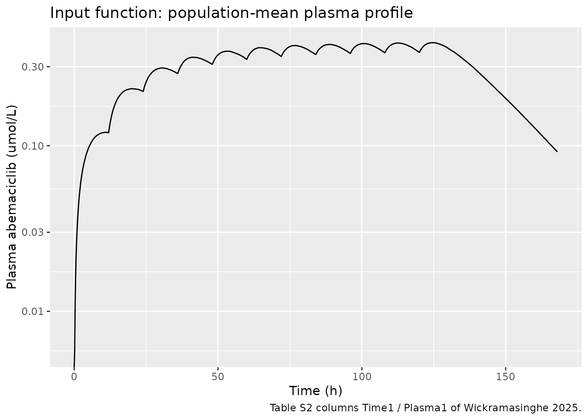
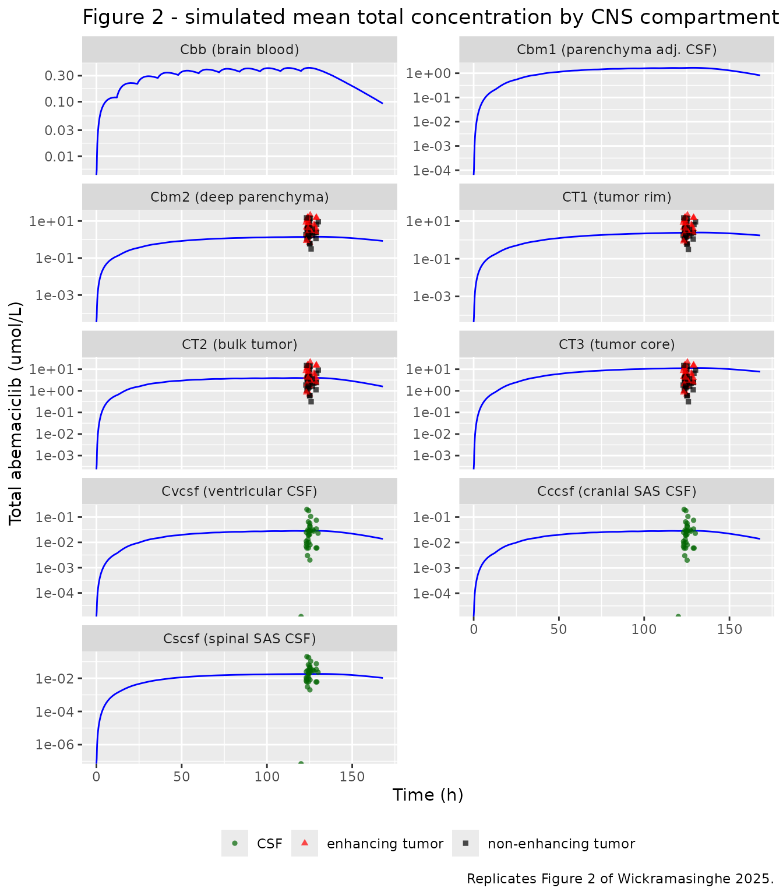
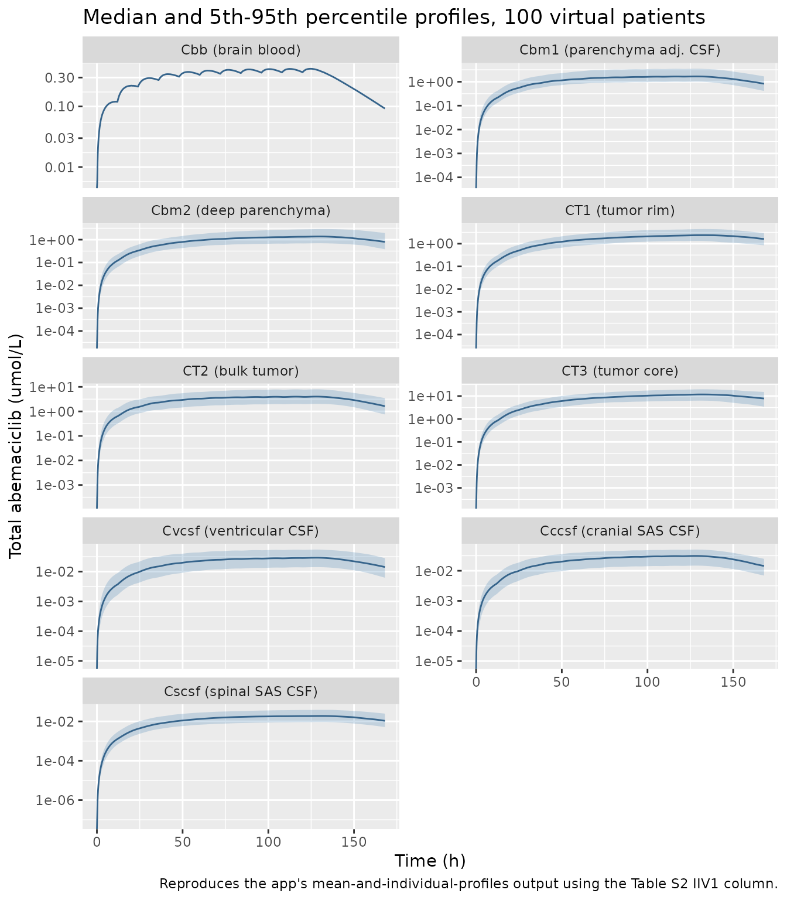

# Spatial CNS and brain-tumor PBPK of abemaciclib (Wickramasinghe 2025)

## Model and source

``` r

ui <- rxode2::rxode(readModelDb("Wickramasinghe_2025_abemaciclib_cns_pbpk"))
```

- Citation: Wickramasinghe CD, Kim S, Li J. SpatialCNS-PBPK: An R/Shiny
  Web-Based Application for Physiologically Based Pharmacokinetic
  Modeling of Spatial Pharmacokinetics in the Human Central Nervous
  System and Brain Tumors. CPT Pharmacometrics Syst Pharmacol.
  2025;14(5):864-875. <doi:10.1002/psp4.70026>. The nine differential
  equations are given in Data S1 of the Supporting Information; the
  system-specific parameters in Table 1; the drug-specific parameter
  definitions in Table 2 and their abemaciclib values, the
  interindividual variability and the driving plasma profile in Table
  S2. The 9-CNS model was originally developed and validated across six
  drugs in Li J, Wickramasinghe C, Jiang J, et al. Clin Pharmacol Ther.
  2025;117(3):690-703 (reference 7 of the 2025 tutorial), which is not
  on disk for this extraction.
- Article: <https://doi.org/10.1002/psp4.70026>
- PubMed Central: <https://pmc.ncbi.nlm.nih.gov/articles/PMC12072228/>

PBPK (9-compartment permeability-limited CNS model, SpatialCNS-PBPK
R/Shiny app v1.0). Spatial pharmacokinetics of abemaciclib in the human
central nervous system and brain tumors. Nine concentration states:
brain blood (brain_vascular), brain parenchyma adjacent to the CSF tract
(brain_csf_adjacent) and deep brain parenchyma (brain_deep), three CSF
compartments (ventricular, cranial subarachnoid, spinal subarachnoid)
and three tumor compartments (infiltrative rim, bulk tumor, core).
Transport across the BBB, the blood-brain-tumor barrier and the
blood-CSF barrier is the sum of a passive permeability-surface-area
clearance acting on unbound AND unionized drug (the pH-dependent
unionization fractions lam\* encode the progressively acidic tumor
interior) and transporter-mediated efflux and uptake clearances acting
on unbound drug. CSF flows from the ventricles to the cranial and spinal
subarachnoid spaces and drains to blood via arachnoid villi and nerve
sheaths; drug also moves between the CSF tract and brain/tumor by
paravascular (glymphatic) bulk flow and simple diffusion. The model is
driven by the systemic plasma concentration supplied as the time-varying
covariate CP_ABEMACICLIB_UM: plasma acts purely as a forcing function
and CNS uptake does not deplete it, exactly as published. Every one of
the 85 system- and drug-specific parameters is fixed to the published
value; none is estimated here.

The 9-CNS model resolves the human central nervous system into nine
well-stirred concentration compartments. Their canonical nlmixr2lib
names and the symbols the paper uses for them are:

| nlmixr2lib state | Paper symbol | Region |
|----|----|----|
| `brain_vascular` | `Cbb` | Brain blood (cerebral microvasculature) |
| `brain_csf_adjacent` | `Cbm1` | Brain parenchyma within ~2 mm of the CSF tract |
| `brain_deep` | `Cbm2` | Deep brain parenchyma (\> 2 mm from the CSF tract) |
| `tumor_rim` | `CT1` | Infiltrative, non-enhancing tumor rim (pH 6.8) |
| `tumor_bulk` | `CT2` | Bulky, contrast-enhancing tumor (pH 6.5) |
| `tumor_core` | `CT3` | Tumor core (pH 6.2) |
| `brain_csf_ventricular` | `Cvcsf` | Ventricular CSF (pH 7.3) |
| `brain_csf_sas_cranial` | `Cccsf` | Cranial subarachnoid CSF (pH 7.3) |
| `brain_csf_sas_spinal` | `Cscsf` | Spinal subarachnoid CSF |

Every state holds a **total** drug concentration. Passive permeability
moves only unbound *and* unionized drug, so its driving concentration is
`lam<region> * fu<region> * C<region>`; transporter-mediated clearances
act on unbound drug whether ionized or not, so theirs is
`fu<region> * C<region>`. The model reports both: the vignette uses the
total concentrations `Cbb` … `Cscsf` (the app’s “Total” output tabs) and
the model also returns `Cbbu` … `Cccsfu` (the “Unbound” tabs).

## Population

``` r

pop <- ui$population
```

The driving plasma profile is the population-mean abemaciclib
concentration-time profile determined in glioblastoma patients,
attributed by this tutorial to its companion development paper (Li 2025,
*Clin Pharmacol Ther*). Table S2 of the tutorial additionally carries
paired observed abemaciclib concentrations for **39 patients** who
underwent tumor resection: non-enhancing tumor, contrast-enhancing tumor
and CSF samples taken 120-130 h after the start of twice-daily oral
dosing. No demographics (age, weight, sex, race) are reported in this
paper, and the dose amount is not stated. The system-specific parameters
of Table 1 describe a reference adult brain (1.2 L parenchyma, 0.15 L
total CSF) carrying a 35 mL contrast-enhancing tumor.

``` r

str(pop)
#> List of 5
#>  $ species      : chr "human"
#>  $ n_subjects   : num 39
#>  $ disease_state: chr "glioblastoma (recurrent / newly diagnosed) undergoing tumor resection"
#>  $ dose_range   : chr "twice-daily oral abemaciclib; the dose amount is not stated in this paper"
#>  $ notes        : chr "The driving plasma profile in Table S2 is the population-mean abemaciclib concentration-time profile determined"| __truncated__
```

## Source trace

Every `ini()` entry carries an in-file comment pointing at its source
location in
`inst/modeldb/specificDrugs/Wickramasinghe_2025_abemaciclib_cns_pbpk.R`.
All 85 values are **fixed**; none is estimated in this paper.

| Model component | Source location |
|----|----|
| The nine differential equations | Data S1 (Supporting Information), one display equation per compartment |
| Compartment volumes `Vbb` … `Vscsf` | Table 1 (descriptions and rounded values); Table S2 column `Sim1` (values used) |
| Blood and CSF flows `Qbrain`, `QCsink`, `QSsink`, `QSin*`, `QSout*`, `Qgly*` | Table 1; Table S2 `Sim1` |
| Paravascular / convective bulk flows `Qbulk*` | Table 1; Table S2 `Sim1` |
| Passive permeability clearances `PSB*`, `PST*`, `PSV`, `PSC`, `PSE*` | Table 2 (definitions), Equation 1 (`PSB = Papp,A-B * SA / lambda`); Table S2 `Sim1` |
| Transporter clearances `CLeff*`, `CLup*` | Table 2 (definitions and the RAF scaling footnote); Table S2 `Sim1` |
| Brain metabolism `CLmet1`, `CLmet2` | Table 2; Table S2 `Sim1` (both 0 for abemaciclib) |
| Unbound fractions `fubb` … `fuccsf` | Table 2; Table S2 `Sim1` |
| Unionization fractions `lambb` … `lamccsf` | Table 2 and its Henderson-Hasselbalch footnote; Table S2 `Sim1` |
| Interindividual variability (20% CV on every parameter) | Table S2 column `IIV1`; lognormal form identified from Table S3 (see Errata) |
| Driving plasma profile `CP_ABEMACICLIB_UM` | Table S2 columns `Time1` / `Plasma1` |
| Observed tumor and CSF concentrations | Table S2 columns `Ob*_T` / `Tumor*` |

The full per-parameter table, generated from the packaged model object:

``` r

ui$iniDf |>
  dplyr::filter(!is.na(.data$ntheta)) |>
  dplyr::transmute(
    Parameter = .data$name,
    Value = signif(ifelse(grepl("^l", .data$name), exp(.data$est), .data$est), 5),
    Scale = ifelse(grepl("^l", .data$name), "log", "linear"),
    Fixed = .data$fix,
    Description = .data$label
  ) |>
  knitr::kable(caption = "All 85 fixed parameters of the 9-CNS model (Tables 1, 2 and S2).")
```

| Parameter | Value | Scale | Fixed | Description |
|:---|---:|:---|:---|:---|
| lVbb | 0.0630 | log | TRUE | Volume of brain blood (L) |
| lVbm1 | 0.1200 | log | TRUE | Volume of brain parenchyma adjacent to the CSF tract (L) |
| lVbm2 | 1.0800 | log | TRUE | Volume of deep brain parenchyma (L) |
| lVT1 | 0.0700 | log | TRUE | Volume of the infiltrative tumor rim (L) |
| lVT2 | 0.0350 | log | TRUE | Volume of the bulky tumor region (L) |
| lVT3 | 0.0035 | log | TRUE | Volume of the tumor core (L) |
| lVvcsf | 0.0250 | log | TRUE | Volume of ventricular CSF (L) |
| lVccsf | 0.0450 | log | TRUE | Volume of cranial subarachnoid CSF (L) |
| lVscsf | 0.0800 | log | TRUE | Volume of spinal subarachnoid CSF (L) |
| lQbrain | 39.0000 | log | TRUE | Cerebral blood flow (L/h) |
| lQCsink | 0.0130 | log | TRUE | Absorption rate of cranial CSF into blood via arachnoid villi (L/h) |
| lQSsink | 0.0080 | log | TRUE | Absorption rate of spinal CSF into blood via arachnoid villi (L/h) |
| lQbulkCB1 | 0.0013 | log | TRUE | Paravascular bulk flow rate, cranial subarachnoid CSF to brain parenchyma 1 (L/h) |
| lQbulkB1C | 0.0016 | log | TRUE | Paravascular bulk flow rate, brain parenchyma 1 to cranial subarachnoid CSF (L/h) |
| lQbulkVB1 | 0.0001 | log | TRUE | Paravascular bulk flow rate, ventricular CSF to brain parenchyma 1 (L/h) |
| lQbulkB1V | 0.0002 | log | TRUE | Paravascular bulk flow rate, brain parenchyma 1 to ventricular CSF (L/h) |
| lQbulkB2B1 | 0.0005 | log | TRUE | Convective bulk flow rate, brain parenchyma 2 to 1 (L/h) |
| lQbulkB1B2 | 0.0005 | log | TRUE | Convective bulk flow rate, brain parenchyma 1 to 2 (L/h) |
| lQbulkB2T1 | 0.0005 | log | TRUE | Convective bulk flow rate, brain parenchyma 2 to tumor rim (L/h) |
| lQbulkT1B2 | 0.0005 | log | TRUE | Convective bulk flow rate, tumor rim to brain parenchyma 2 (L/h) |
| lQbulkCB2 | 0.0113 | log | TRUE | Paravascular bulk flow rate, cranial subarachnoid CSF to brain parenchyma 2 (L/h) |
| lQbulkB2C | 0.0142 | log | TRUE | Paravascular bulk flow rate, brain parenchyma 2 to cranial subarachnoid CSF (L/h) |
| lQbulkT2T1 | 0.0002 | log | TRUE | Convective bulk flow rate, bulk tumor to tumor rim (L/h) |
| lQbulkT1T2 | 0.0002 | log | TRUE | Convective bulk flow rate, tumor rim to bulk tumor (L/h) |
| lQbulkCT1 | 0.0013 | log | TRUE | Paravascular bulk flow rate, cranial subarachnoid CSF to tumor rim (L/h) |
| lQbulkT1C | 0.0016 | log | TRUE | Paravascular bulk flow rate, tumor rim to cranial subarachnoid CSF (L/h) |
| lQbulkT3T2 | 0.0002 | log | TRUE | Convective bulk flow rate, tumor core to bulk tumor (L/h) |
| lQbulkT2T3 | 0.0002 | log | TRUE | Convective bulk flow rate, bulk tumor to tumor core (L/h) |
| lQbulkCT2 | 0.0002 | log | TRUE | Paravascular bulk flow rate, cranial subarachnoid CSF to bulk tumor (L/h) |
| lQbulkT2C | 0.0003 | log | TRUE | Paravascular bulk flow rate, bulk tumor to cranial subarachnoid CSF (L/h) |
| lQbulkCT3 | 0.0002 | log | TRUE | Paravascular bulk flow rate, cranial subarachnoid CSF to tumor core (L/h) |
| lQbulkT3C | 0.0002 | log | TRUE | Paravascular bulk flow rate, tumor core to cranial subarachnoid CSF (L/h) |
| lQSin1r | 0.0013 | log | TRUE | CSF back-flow rate from the cranial subarachnoid space to the ventricle (L/h) |
| lQSin1 | 0.0126 | log | TRUE | CSF flow rate from the ventricle to the cranial subarachnoid space (L/h) |
| lQSin2r | 0.0008 | log | TRUE | CSF back-flow rate from the spinal subarachnoid space to the ventricle (L/h) |
| lQSin2 | 0.0084 | log | TRUE | CSF flow rate from the ventricle to the spinal subarachnoid space (L/h) |
| lQSout | 0.0004 | log | TRUE | CSF flow rate from the spinal to the cranial subarachnoid space (L/h) |
| QSoutr | 0.0000 | linear | TRUE | CSF flow rate from the cranial to the spinal subarachnoid space (L/h) |
| lPSB1 | 2.5480 | log | TRUE | Passive permeability clearance at the BBB, brain blood to adjacent brain parenchyma (L/h) |
| lPSB2 | 25.4800 | log | TRUE | Passive permeability clearance at the BBB, brain blood to deep brain parenchyma (L/h) |
| lPST1 | 2.0384 | log | TRUE | Passive permeability clearance at the BBTB, brain blood to tumor rim (L/h) |
| lPST2 | 5.0960 | log | TRUE | Passive permeability clearance at the BBTB, brain blood to bulk tumor (L/h) |
| lPST3 | 0.5096 | log | TRUE | Passive permeability clearance at the BBTB, brain blood to tumor core (L/h) |
| lPSV | 0.8408 | log | TRUE | Passive permeability clearance at the blood-CSF barrier, brain blood to ventricular CSF (L/h) |
| lPSC | 1.7072 | log | TRUE | Passive permeability clearance at the blood-CSF barrier, brain blood to cranial subarachnoid CSF (L/h) |
| lPSE1 | 50.9600 | log | TRUE | Simple diffusion rate between cranial subarachnoid CSF and adjacent brain parenchyma (L/h) |
| lPSE2 | 25.4800 | log | TRUE | Simple diffusion rate between ventricular CSF and adjacent brain parenchyma (L/h) |
| lPSB1B2 | 0.0100 | log | TRUE | Simple diffusion rate between the adjacent and deep brain parenchyma (L/h) |
| lPSB2T1 | 0.0100 | log | TRUE | Simple diffusion rate between the deep brain parenchyma and tumor rim (L/h) |
| lPST1T2 | 0.0100 | log | TRUE | Simple diffusion rate between tumor rim and bulk tumor (L/h) |
| lPST2T3 | 0.0100 | log | TRUE | Simple diffusion rate between bulk tumor and tumor core (L/h) |
| lCLeffbbb1 | 0.2920 | log | TRUE | Efflux transporter-mediated clearance at the BBB, brain blood to adjacent brain parenchyma (L/h) |
| CLupbbb1 | 0.0000 | linear | TRUE | Uptake transporter-mediated influx clearance at the BBB, brain blood to adjacent brain parenchyma (L/h) |
| lCLeffbbb2 | 2.9200 | log | TRUE | Efflux transporter-mediated clearance at the BBB, brain blood to deep brain parenchyma (L/h) |
| CLupbbb2 | 0.0000 | linear | TRUE | Uptake transporter-mediated influx clearance at the BBB, brain blood to deep brain parenchyma (L/h) |
| lCLeffT1 | 0.0584 | log | TRUE | Efflux transporter-mediated clearance at the BBTB, brain blood to tumor rim (L/h) |
| CLupT1 | 0.0000 | linear | TRUE | Uptake transporter-mediated influx clearance at the BBB, brain blood to tumor rim (L/h) |
| lCLeffT2 | 0.0088 | log | TRUE | Efflux transporter-mediated clearance at the BBTB, brain blood to bulk tumor (L/h) |
| CLupT2 | 0.0000 | linear | TRUE | Uptake transporter-mediated influx clearance at the BBB, brain blood to bulk tumor (L/h) |
| CLeffT3 | 0.0000 | linear | TRUE | Efflux transporter-mediated clearance at the BBTB, brain blood to tumor core (L/h) |
| CLupT3 | 0.0000 | linear | TRUE | Uptake transporter-mediated influx clearance at the BBB, brain blood to tumor core (L/h) |
| CLeffvcsf | 0.0000 | linear | TRUE | Efflux transporter-mediated clearance at the blood-CSF barrier, brain blood to ventricular CSF (L/h) |
| CLupvcsf | 0.0000 | linear | TRUE | Uptake transporter-mediated clearance at the blood-CSF barrier, brain blood to ventricular CSF (L/h) |
| CLeffccsf | 0.0000 | linear | TRUE | Efflux transporter-mediated clearance at the blood-CSF barrier, brain blood to cranial subarachnoid CSF (L/h) |
| CLupccsf | 0.0000 | linear | TRUE | Uptake transporter-mediated clearance at the blood-CSF barrier, brain blood to cranial subarachnoid CSF (L/h) |
| CLmet1 | 0.0000 | linear | TRUE | Drug metabolism clearance in the adjacent brain parenchyma (L/h) |
| CLmet2 | 0.0000 | linear | TRUE | Drug metabolism clearance in the deep brain parenchyma (L/h) |
| lfubb | 0.0260 | log | TRUE | Unbound fraction in brain blood (fraction) |
| lfubm1 | 0.0060 | log | TRUE | Unbound fraction in the adjacent brain parenchyma (fraction) |
| lfubm2 | 0.0060 | log | TRUE | Unbound fraction in the deep brain parenchyma (fraction) |
| lfuT1 | 0.0090 | log | TRUE | Unbound fraction in the tumor rim (fraction) |
| lfuT2 | 0.0160 | log | TRUE | Unbound fraction in the bulk tumor (fraction) |
| lfuT3 | 0.0160 | log | TRUE | Unbound fraction in the tumor core (fraction) |
| lfuvcsf | 0.2890 | log | TRUE | Unbound fraction in ventricular CSF (fraction) |
| lfuccsf | 0.2890 | log | TRUE | Unbound fraction in cranial subarachnoid CSF (fraction) |
| llambb | 0.2238 | log | TRUE | Unionization fraction in brain blood (pH 7.4) (fraction) |
| llambm1 | 0.1540 | log | TRUE | Unionization fraction in the adjacent brain parenchyma (pH 7.2) (fraction) |
| llambm2 | 0.1540 | log | TRUE | Unionization fraction in the deep brain parenchyma (pH 7.2) (fraction) |
| llamT1 | 0.0676 | log | TRUE | Unionization fraction in the tumor rim (pH 6.8) (fraction) |
| llamT2 | 0.0350 | log | TRUE | Unionization fraction in the bulk tumor (pH 6.5) (fraction) |
| llamT3 | 0.0114 | log | TRUE | Unionization fraction in the tumor core (pH 6.2) (fraction) |
| llamvcsf | 0.1864 | log | TRUE | Unionization fraction in ventricular CSF (pH 7.3) (fraction) |
| llamccsf | 0.1864 | log | TRUE | Unionization fraction in cranial subarachnoid CSF (pH 7.3) (fraction) |
| lQglyccsf | 0.0065 | log | TRUE | Absorption rate of cranial CSF via olfactory mucosa and cranial nerve sheaths (L/h) |
| lQglyscsf | 0.0040 | log | TRUE | Absorption rate of spinal CSF via spinal nerve sheaths (L/h) |

All 85 fixed parameters of the 9-CNS model (Tables 1, 2 and S2).
{.table}

## The input function

The 9-CNS model is driven by the systemic plasma concentration supplied
as the time-varying covariate `CP_ABEMACICLIB_UM`. Plasma is a pure
forcing function: CNS uptake never depletes it, so the coupling is
one-way. The 1010-point population-mean profile of Table S2 is shipped
with the package.

``` r

plasma <- read.csv(
  system.file("extdata", "Wickramasinghe_2025_abemaciclib_plasma_input.csv",
              package = "nlmixr2lib")
)
observed <- read.csv(
  system.file("extdata", "Wickramasinghe_2025_abemaciclib_observed_cns.csv",
              package = "nlmixr2lib")
)
stopifnot(nrow(plasma) == 1010L, nrow(observed) == 110L)

c(n_points = nrow(plasma),
  t_max = max(plasma$time),
  Cmax = max(plasma$CP_ABEMACICLIB_UM),
  t_at_Cmax = plasma$time[which.max(plasma$CP_ABEMACICLIB_UM)])
#>  n_points     t_max      Cmax t_at_Cmax 
#> 1010.0000  168.0000    0.4191  124.6100
```

``` r

ggplot(plasma, aes(time, CP_ABEMACICLIB_UM)) +
  geom_line() +
  scale_y_log10() +
  labs(x = "Time (h)", y = "Plasma abemaciclib (umol/L)",
       title = "Input function: population-mean plasma profile",
       caption = "Table S2 columns Time1 / Plasma1 of Wickramasinghe 2025.")
#> Warning in scale_y_log10(): log-10 transformation introduced infinite values.
```



The covariate must be interpolated **linearly**, as the app does. The
output grid of every simulation below is therefore the published
1010-point grid itself: coarsening it to 0.7 h changes the predicted CNS
concentrations by up to 3%, so the profile is used at full resolution
rather than thinned.

## Typical-value simulation: replicating Figure 2

Figure 2 of the paper is a screenshot of the app’s “Concentration log
plots (Total)” tab: the mean total-concentration profile in each
compartment, with the observed tumor and CSF concentrations overlaid. It
is a typical-value prediction, so the random effects are zeroed.

``` r

mod_typical <- rxode2::zeroRe(readModelDb("Wickramasinghe_2025_abemaciclib_cns_pbpk"))
#> Warning: No sigma parameters in the model

events_typical <- data.frame(
  id = 1L,
  time = plasma$time,
  amt = NA_real_,
  evid = 0L,
  cmt = "brain_vascular",
  CP_ABEMACICLIB_UM = plasma$CP_ABEMACICLIB_UM
)

sim_typical <- rxode2::rxSolve(
  mod_typical, events_typical,
  covsInterpolation = "linear", returnType = "data.frame"
)
#> ℹ omega/sigma items treated as zero: 'etalVbb', 'etalVbm1', 'etalVbm2', 'etalVT1', 'etalVT2', 'etalVT3', 'etalVvcsf', 'etalVccsf', 'etalVscsf', 'etalQbrain', 'etalQCsink', 'etalQSsink', 'etalQbulkCB1', 'etalQbulkB1C', 'etalQbulkVB1', 'etalQbulkB1V', 'etalQbulkB2B1', 'etalQbulkB1B2', 'etalQbulkB2T1', 'etalQbulkT1B2', 'etalQbulkCB2', 'etalQbulkB2C', 'etalQbulkT2T1', 'etalQbulkT1T2', 'etalQbulkCT1', 'etalQbulkT1C', 'etalQbulkT3T2', 'etalQbulkT2T3', 'etalQbulkCT2', 'etalQbulkT2C', 'etalQbulkCT3', 'etalQbulkT3C', 'etalQSin1r', 'etalQSin1', 'etalQSin2r', 'etalQSin2', 'etalQSout', 'etalPSB1', 'etalPSB2', 'etalPST1', 'etalPST2', 'etalPST3', 'etalPSV', 'etalPSC', 'etalPSE1', 'etalPSE2', 'etalPSB1B2', 'etalPSB2T1', 'etalPST1T2', 'etalPST2T3', 'etalCLeffbbb1', 'etalCLeffbbb2', 'etalCLeffT1', 'etalCLeffT2', 'etalfubb', 'etalfubm1', 'etalfubm2', 'etalfuT1', 'etalfuT2', 'etalfuT3', 'etalfuvcsf', 'etalfuccsf', 'etallambb', 'etallambm1', 'etallambm2', 'etallamT1', 'etallamT2', 'etallamT3', 'etallamvcsf', 'etallamccsf', 'etalQglyccsf', 'etalQglyscsf'
if (is.null(sim_typical$id)) sim_typical$id <- 1L
nrow(sim_typical)
#> [1] 1010
```

``` r

# Replicates Figure 2 of Wickramasinghe 2025: mean total abemaciclib
# concentration-time profile in each of the nine CNS compartments, on a
# log10 axis, with the observed tumor and CSF concentrations overlaid.
panel_levels <- c(
  Cbb = "Cbb (brain blood)",
  Cbm1 = "Cbm1 (parenchyma adj. CSF)",
  Cbm2 = "Cbm2 (deep parenchyma)",
  CT1 = "CT1 (tumor rim)",
  CT2 = "CT2 (bulk tumor)",
  CT3 = "CT3 (tumor core)",
  Cvcsf = "Cvcsf (ventricular CSF)",
  Cccsf = "Cccsf (cranial SAS CSF)",
  Cscsf = "Cscsf (spinal SAS CSF)"
)

pred_long <- sim_typical |>
  dplyr::select(time, dplyr::all_of(names(panel_levels))) |>
  tidyr::pivot_longer(-time, names_to = "state", values_to = "conc") |>
  dplyr::mutate(panel = factor(panel_levels[state], levels = panel_levels))

# The paper overlays the tumor observations on Cbm2/CT1/CT2/CT3 and the CSF
# observations on Cvcsf/Cccsf/Cscsf (Figure 2 caption).
obs_long <- dplyr::bind_rows(
  observed |> dplyr::filter(matrix != "CSF") |>
    tidyr::crossing(state = c("Cbm2", "CT1", "CT2", "CT3")),
  observed |> dplyr::filter(matrix == "CSF") |>
    tidyr::crossing(state = c("Cvcsf", "Cccsf", "Cscsf"))
) |>
  dplyr::mutate(panel = factor(panel_levels[state], levels = panel_levels))

ggplot(pred_long, aes(time, conc)) +
  geom_line(colour = "blue") +
  geom_point(data = obs_long, aes(time, conc, colour = matrix, shape = matrix),
             alpha = 0.7, size = 1.3) +
  facet_wrap(~panel, ncol = 2, scales = "free_y") +
  scale_y_log10() +
  scale_colour_manual(values = c("CSF" = "darkgreen",
                                 "enhancing tumor" = "red",
                                 "non-enhancing tumor" = "black")) +
  labs(x = "Time (h)", y = "Total abemaciclib (umol/L)", colour = NULL, shape = NULL,
       title = "Figure 2 - simulated mean total concentration by CNS compartment",
       caption = "Replicates Figure 2 of Wickramasinghe 2025.") +
  theme(legend.position = "bottom")
#> Warning in scale_y_log10(): log-10 transformation introduced infinite values.
#> log-10 transformation introduced infinite values.
```



### Quantitative check against Figure 2

Figure 2 is a log10-axis screenshot, so it can only be read to about a
half-decade. The check below pins each panel’s value at the steady-state
peak (t = 124.61 h, the time of the plasma Cmax) against the value read
off the published figure.

``` r

t_peak <- plasma$time[which.max(plasma$CP_ABEMACICLIB_UM)]
i_peak <- which.min(abs(sim_typical$time - t_peak))

fig2_read <- c(Cbb = 0.42, Cbm1 = 1.6, Cbm2 = 1.5, CT1 = 2.5, CT2 = 4,
               CT3 = 11, Cvcsf = 0.03, Cccsf = 0.03, Cscsf = NA)

fig2_cmp <- tibble::tibble(
  Compartment = names(panel_levels),
  Simulated = signif(unlist(sim_typical[i_peak, names(panel_levels)]), 4),
  `Read off Figure 2` = unname(fig2_read[names(panel_levels)])
) |>
  dplyr::mutate(`Ratio` = signif(Simulated / `Read off Figure 2`, 3))

knitr::kable(
  fig2_cmp,
  caption = paste0("Total concentration at the steady-state plasma peak (t = ",
                   round(t_peak, 2), " h). Cscsf is not shown in Figure 2.")
)
```

| Compartment | Simulated | Read off Figure 2 | Ratio |
|:------------|----------:|------------------:|------:|
| Cbb         |   0.41890 |              0.42 | 0.997 |
| Cbm1        |   1.65900 |              1.60 | 1.040 |
| Cbm2        |   1.39400 |              1.50 | 0.929 |
| CT1         |   2.42900 |              2.50 | 0.972 |
| CT2         |   3.94000 |              4.00 | 0.985 |
| CT3         |  11.21000 |             11.00 | 1.020 |
| Cvcsf       |   0.02860 |              0.03 | 0.953 |
| Cccsf       |   0.02885 |              0.03 | 0.962 |
| Cscsf       |   0.01802 |                NA |    NA |

Total concentration at the steady-state plasma peak (t = 124.61 h).
Cscsf is not shown in Figure 2. {.table}

``` r


# A log10 screenshot can only be read to about a half-decade, but the model
# agrees with every readable panel far more tightly than that (worst case
# 0.033 in log10, i.e. 8%). Assert the accuracy actually achieved, so this is
# a regression guard rather than a formality.
ok <- !is.na(fig2_cmp$`Read off Figure 2`)
stopifnot(sum(ok) == 8L, all(abs(log10(fig2_cmp$Ratio[ok])) < 0.05))
```

The brain-blood compartment equilibrates with plasma almost instantly
(`Qbrain` = 39 L/h into `Vbb` = 0.063 L), so `Cbb` tracks the input
function exactly. That is the model behaving as published, not a
degenerate case:

``` r

cbb_ratio <- sim_typical$Cbb[i_peak] / max(plasma$CP_ABEMACICLIB_UM)
stopifnot(abs(cbb_ratio - 1) < 0.005)
signif(cbb_ratio, 5)
#> [1] 0.99953
```

### The spatial gradient the model exists to predict

The whole point of resolving nine compartments rather than one is that
the predicted exposure is not uniform across the CNS. At the
steady-state peak the model predicts a monotone rise from CSF through
parenchyma into the progressively more disrupted tumor interior:

``` r

gradient <- sim_typical[i_peak, c("Cccsf", "Cbm2", "CT1", "CT2", "CT3")]
stopifnot(all(diff(unlist(gradient)) > 0))
tibble::tibble(
  Region = c("Cranial SAS CSF", "Deep parenchyma", "Tumor rim",
             "Bulk tumor", "Tumor core"),
  `Total (umol/L)` = signif(unlist(gradient), 3),
  `Fold vs CSF` = signif(unlist(gradient) / gradient$Cccsf, 3)
) |>
  knitr::kable(caption = "Predicted spatial gradient at the steady-state peak.")
```

| Region          | Total (umol/L) | Fold vs CSF |
|:----------------|---------------:|------------:|
| Cranial SAS CSF |         0.0289 |         1.0 |
| Deep parenchyma |         1.3900 |        48.3 |
| Tumor rim       |         2.4300 |        84.2 |
| Bulk tumor      |         3.9400 |       137.0 |
| Tumor core      |        11.2000 |       389.0 |

Predicted spatial gradient at the steady-state peak. {.table}

## Comparison against the observed patient data

The observed concentrations in Table S2 are the paper’s own validation
data. The model prediction is compared at each patient’s actual sampling
time, using the compartment the paper pairs with each matrix: the
non-enhancing tumor with `tumor_rim` (`CT1`), the contrast-enhancing
tumor with `tumor_bulk` (`CT2`) and CSF with `brain_csf_sas_cranial`
(`Cccsf`).

``` r

state_for <- c("non-enhancing tumor" = "CT1",
               "enhancing tumor" = "CT2",
               "CSF" = "Cccsf")

pred_at <- function(state, times) {
  stats::approx(sim_typical$time, sim_typical[[state]], xout = times, rule = 2)$y
}

obs_cmp <- observed |>
  dplyr::mutate(
    state = unname(state_for[matrix]),
    predicted = mapply(pred_at, state, time),
    ratio = conc / predicted
  )
stopifnot(nrow(obs_cmp) == 110L, !anyNA(obs_cmp$predicted))

obs_cmp |>
  dplyr::group_by(Matrix = matrix) |>
  dplyr::summarise(
    N = dplyr::n(),
    `Paired compartment` = dplyr::first(state),
    `Observed median` = signif(stats::median(conc), 3),
    `Predicted (typical)` = signif(stats::median(predicted), 3),
    `Median obs/pred` = signif(stats::median(ratio), 3),
    `5th-95th pct of obs/pred` = paste(
      signif(stats::quantile(ratio, 0.05), 2), "-",
      signif(stats::quantile(ratio, 0.95), 2)
    ),
    .groups = "drop"
  ) |>
  knitr::kable(caption = paste(
    "Observed abemaciclib concentrations (Table S2, 39 glioblastoma patients)",
    "against the typical-value prediction at each patient's sampling time."
  ))
```

| Matrix | N | Paired compartment | Observed median | Predicted (typical) | Median obs/pred | 5th-95th pct of obs/pred |
|:---|---:|:---|---:|---:|---:|:---|
| CSF | 34 | Cccsf | 0.024 | 0.0289 | 0.833 | 0.092 - 4.6 |
| enhancing tumor | 37 | CT2 | 4.440 | 3.9400 | 1.130 | 0.25 - 4 |
| non-enhancing tumor | 39 | CT1 | 2.600 | 2.4300 | 1.070 | 0.25 - 5.8 |

Observed abemaciclib concentrations (Table S2, 39 glioblastoma patients)
against the typical-value prediction at each patient’s sampling time.
{.table style="width:100%;"}

The typical-value prediction sits inside the observed spread for all
three matrices, which is the claim Figure 2 makes graphically. The
observed between-patient spread is far wider than the template’s uniform
20% CV produces (see Errata) - the paper does not fit that spread, and
neither does this vignette.

``` r

med_ratio <- obs_cmp |>
  dplyr::group_by(matrix) |>
  dplyr::summarise(m = stats::median(ratio), .groups = "drop")
# The typical-value prediction must land within 3-fold of the observed median
# in every matrix -- a real constraint given the predictions span 0.03 to 11
# umol/L across compartments.
stopifnot(nrow(med_ratio) == 3L, all(med_ratio$m > 1 / 3), all(med_ratio$m < 3))
signif(stats::setNames(med_ratio$m, med_ratio$matrix), 3)
#>                 CSF     enhancing tumor non-enhancing tumor 
#>               0.833               1.130               1.070
```

## Virtual cohort with interindividual variability

Table S2 assigns the same 20% CV to every one of the 85 parameters and
the app uses it to generate individual profiles (its “individual
concentration - time profiles” tab). The cohort below is 100 virtual
patients - well inside the 200-per-arm cap and matching the scale of the
app’s own default group size.

``` r

set.seed(20250518)
n_sub <- 100L

events_cohort <- data.frame(
  id = rep(seq_len(n_sub), each = nrow(plasma)),
  time = rep(plasma$time, times = n_sub),
  amt = NA_real_,
  evid = 0L,
  cmt = "brain_vascular",
  CP_ABEMACICLIB_UM = rep(plasma$CP_ABEMACICLIB_UM, times = n_sub)
)
stopifnot(!anyDuplicated(events_cohort[, c("id", "time", "evid")]))

sim_cohort <- rxode2::rxSolve(
  readModelDb("Wickramasinghe_2025_abemaciclib_cns_pbpk"),
  events_cohort,
  covsInterpolation = "linear", returnType = "data.frame"
)
dplyr::n_distinct(sim_cohort$id)
#> [1] 100
```

### The IIV reproduces the app’s own virtual patients

Table S3 lists five virtual patients that the SpatialCNS-PBPK app
generated from `Sim1` + `IIV1`. Those draws identify the distributional
form the paper never states: across the 355 non-zero parameter draws,
`log(simulated / typical)` is normal (Shapiro-Wilk p = 0.15, skewness
0.12) with SD 0.194 against the `sqrt(log(1 + 0.20^2))` = 0.198 expected
of a 20% CV lognormal, while the untransformed ratios are clearly
right-skewed (Shapiro-Wilk p = 1.6e-8, skewness 0.94). The packaged
model encodes that lognormal form; the check below confirms the
simulated cohort returns the 20% CV.

``` r

sim_par <- sim_cohort |>
  dplyr::distinct(id, .keep_all = TRUE) |>
  dplyr::select(PSB2, CLeffbbb2, fubb, VT2, lamT1)

cv <- vapply(sim_par, function(x) stats::sd(x) / mean(x), numeric(1))
tibble::tibble(
  Parameter = names(cv),
  `Simulated CV` = signif(cv, 3),
  `Table S2 IIV1` = 0.20
) |>
  knitr::kable(caption = "Realised interindividual CV in the 100-patient cohort.")
```

| Parameter | Simulated CV | Table S2 IIV1 |
|:----------|-------------:|--------------:|
| PSB2      |        0.193 |           0.2 |
| CLeffbbb2 |        0.218 |           0.2 |
| fubb      |        0.206 |           0.2 |
| VT2       |        0.195 |           0.2 |
| lamT1     |        0.221 |           0.2 |

Realised interindividual CV in the 100-patient cohort. {.table}

``` r


# 100 draws give a CV estimate with a relative standard error near
# 1/sqrt(2*99) = 7%, so allow a 3-sigma band around 0.20.
stopifnot(all(cv > 0.20 * (1 - 3 * 0.071)), all(cv < 0.20 * (1 + 3 * 0.071)))
```

### Variability bands by compartment

``` r

sim_cohort |>
  dplyr::select(id, time, dplyr::all_of(names(panel_levels))) |>
  tidyr::pivot_longer(-c(id, time), names_to = "state", values_to = "conc") |>
  dplyr::group_by(state, time) |>
  dplyr::summarise(
    Q05 = stats::quantile(conc, 0.05),
    Q50 = stats::quantile(conc, 0.50),
    Q95 = stats::quantile(conc, 0.95),
    .groups = "drop"
  ) |>
  dplyr::mutate(panel = factor(panel_levels[state], levels = panel_levels)) |>
  ggplot(aes(time, Q50)) +
  geom_ribbon(aes(ymin = Q05, ymax = Q95), alpha = 0.25, fill = "steelblue") +
  geom_line(colour = "steelblue4") +
  facet_wrap(~panel, ncol = 2, scales = "free_y") +
  scale_y_log10() +
  labs(x = "Time (h)", y = "Total abemaciclib (umol/L)",
       title = "Median and 5th-95th percentile profiles, 100 virtual patients",
       caption = paste("Reproduces the app's mean-and-individual-profiles output",
                       "using the Table S2 IIV1 column."))
#> Warning in scale_y_log10(): log-10 transformation introduced infinite values.
#> log-10 transformation introduced infinite values.
#> log-10 transformation introduced infinite values.
#> log-10 transformation introduced infinite values.
```



## PKNCA validation

The app computes Cmax, Tmax and AUC over a user-selected window; the
paper’s own worked example is “any user-defined time interval (e.g.,
72-96 h)”. The same window is used here, one NCA per compartment. Note
that 72-96 h is a 24 h dosing day part-way through the accumulation
phase, not a steady-state interval: the plasma peaks are still climbing
at that point (0.391 umol/L at 64 h against 0.419 umol/L at 124.6 h),
and the CNS compartments are further from equilibrium still.

``` r

nca_states <- names(panel_levels)

sim_nca <- sim_cohort |>
  dplyr::select(id, time, dplyr::all_of(nca_states)) |>
  tidyr::pivot_longer(-c(id, time), names_to = "compartment", values_to = "Cc") |>
  dplyr::filter(!is.na(Cc))

# Guarantee a time = 0 record per (id, compartment). Every CNS compartment
# starts empty, so Cc = 0 at t = 0 is the correct anchor.
sim_nca <- dplyr::bind_rows(
  sim_nca,
  sim_nca |> dplyr::distinct(id, compartment) |>
    dplyr::mutate(time = 0, Cc = 0)
) |>
  dplyr::distinct(id, compartment, time, .keep_all = TRUE) |>
  dplyr::arrange(compartment, id, time)

stopifnot(nrow(sim_nca) > 0, all(sim_nca$Cc >= 0))

conc_obj <- PKNCA::PKNCAconc(sim_nca, Cc ~ time | compartment + id)

intervals <- data.frame(
  start = 72, end = 96,
  cmax = TRUE, tmax = TRUE, cmin = TRUE, auclast = TRUE
)

# There are no dose events in this model -- the systemic PK enters as a
# covariate -- so the NCA runs without a PKNCAdose object.
nca_res <- PKNCA::pk.nca(
  PKNCA::PKNCAdata(conc_obj, data.dose = NA, intervals = intervals)
)
#> No dose information provided, calculations requiring dose will return NA.
```

``` r

nca_tab <- as.data.frame(nca_res) |>
  dplyr::group_by(compartment, PPTESTCD) |>
  dplyr::summarise(value = stats::median(PPORRES), .groups = "drop") |>
  tidyr::pivot_wider(names_from = PPTESTCD, values_from = value) |>
  dplyr::mutate(
    compartment = factor(compartment, levels = nca_states),
    dplyr::across(dplyr::where(is.numeric), ~ signif(.x, 3))
  ) |>
  dplyr::arrange(compartment)

nca_tab |>
  dplyr::rename(
    "Compartment" = compartment,
    "Cmax (umol/L)" = cmax,
    "Cmin (umol/L)" = cmin,
    "Tmax (h)" = tmax,
    "AUC72-96 (umol*h/L)" = auclast
  ) |>
  knitr::kable(caption = paste(
    "Median NCA parameters over the app's default 72-96 h window,",
    "100 virtual patients."
  ))
```

| Compartment | AUC72-96 (umol\*h/L) | Cmax (umol/L) | Cmin (umol/L) | Tmax (h) |
|:------------|---------------------:|--------------:|--------------:|---------:|
| Cbb         |                9.310 |        0.4090 |        0.3460 |     16.8 |
| Cbm1        |               36.700 |        1.5900 |        1.4500 |     22.3 |
| Cbm2        |               28.000 |        1.2500 |        1.0700 |     24.0 |
| CT1         |               45.300 |        2.0500 |        1.6800 |     24.0 |
| CT2         |               90.300 |        3.8800 |        3.5700 |     21.2 |
| CT3         |              224.000 |       10.2000 |        8.4100 |     24.0 |
| Cvcsf       |                0.639 |        0.0275 |        0.0250 |     21.3 |
| Cccsf       |                0.666 |        0.0291 |        0.0256 |     21.7 |
| Cscsf       |                0.404 |        0.0178 |        0.0155 |     24.0 |

Median NCA parameters over the app’s default 72-96 h window, 100 virtual
patients. {.table}

**No published NCA table to compare against.** This tutorial
demonstrates the app’s pharmacokinetic-parameter function but does not
print numeric Cmax / Tmax / AUC values for abemaciclib anywhere in the
paper or its supplement, so there is no reference row for
[`ncaComparisonTable()`](https://nlmixr2.github.io/nlmixr2lib/reference/ncaComparisonTable.md).
The table above is therefore a functional check of the packaged model
rather than a comparison against published values; the quantitative
validation of this extraction rests on the Figure 2 replication and the
observed-data comparison above.

The NCA does support two internal consistency checks:

``` r

# 1. Peak-to-trough ordering must hold in every compartment.
stopifnot(all(nca_tab$cmax >= nca_tab$cmin))

# 2. Over a 24 h window, AUC72-96 must lie between 24 * Cmin and 24 * Cmax
#    for every compartment.
stopifnot(
  all(nca_tab$auclast >= 24 * nca_tab$cmin),
  all(nca_tab$auclast <= 24 * nca_tab$cmax)
)

# 3. Exposure, not just instantaneous concentration, must rise monotonically
#    along the spatial chain the model exists to resolve. This is a distinct
#    check from the peak-concentration gradient above: AUC integrates over the
#    whole window, so a compartment could peak high and still be under-exposed.
auc <- stats::setNames(nca_tab$auclast, as.character(nca_tab$compartment))
stopifnot(all(diff(auc[c("Cccsf", "Cbm2", "CT1", "CT2", "CT3")]) > 0))
signif(auc, 3)
#>     Cbb    Cbm1    Cbm2     CT1     CT2     CT3   Cvcsf   Cccsf   Cscsf 
#>   9.310  36.700  28.000  45.300  90.300 224.000   0.639   0.666   0.404
```

### Why 72-96 h cannot show the damping of the deep compartments

The natural next check would be that the deep compartments damp the
twice-daily oscillation relative to brain blood. Over 72-96 h that check
does not hold, and the reason is not that the model fails to damp: the
CNS compartments are still *filling* over that window, so their
peak-to-trough range is dominated by the accumulation trend rather than
by intra-interval fluctuation. Every deep compartment is higher at 96 h
than it was at 72 h:

``` r

acc_states <- c("Cbm2", "CT1", "CT2", "CT3")
at <- function(tt) {
  vapply(acc_states, function(v) {
    stats::approx(sim_typical$time, sim_typical[[v]], xout = tt)$y
  }, numeric(1))
}
accum <- tibble::tibble(
  Compartment = acc_states,
  `C(72 h)` = signif(at(72), 3),
  `C(96 h)` = signif(at(96), 3),
  `Ratio` = signif(at(96) / at(72), 3)
)
knitr::kable(accum, caption = "The deep compartments are still accumulating across the app's example window.")
```

| Compartment | C(72 h) | C(96 h) | Ratio |
|:------------|--------:|--------:|------:|
| Cbm2        |    1.12 |    1.29 |  1.15 |
| CT1         |    1.78 |    2.16 |  1.22 |
| CT2         |    3.54 |    3.80 |  1.07 |
| CT3         |    8.42 |   10.10 |  1.20 |

The deep compartments are still accumulating across the app’s example
window. {.table}

``` r

stopifnot(all(accum$Ratio > 1.05))
```

Dosing in the published plasma profile stops after the 124.61 h peak, so
the damping *is* visible once the driving oscillation is no longer
competing with accumulation. Over the 144-168 h washout, brain blood
swings by a factor of several while the tumor core barely moves:

``` r

swing_over <- function(lo, hi) {
  k <- sim_typical$time >= lo & sim_typical$time <= hi
  vapply(names(panel_levels), function(v) {
    x <- sim_typical[[v]][k]
    (max(x) - min(x)) / min(x)
  }, numeric(1))
}
sw <- swing_over(144, 168)
tibble::tibble(
  Compartment = names(sw),
  `Peak-to-trough swing` = signif(sw, 3),
  `Relative to Cbb` = signif(sw / sw[["Cbb"]], 3)
) |>
  knitr::kable(caption = "Relative fluctuation over the 144-168 h washout window.")
```

| Compartment | Peak-to-trough swing | Relative to Cbb |
|:------------|---------------------:|----------------:|
| Cbb         |                1.630 |           1.000 |
| Cbm1        |                0.783 |           0.480 |
| Cbm2        |                0.540 |           0.331 |
| CT1         |                0.352 |           0.216 |
| CT2         |                1.070 |           0.654 |
| CT3         |                0.399 |           0.244 |
| Cvcsf       |                0.802 |           0.492 |
| Cccsf       |                0.802 |           0.492 |
| Cscsf       |                0.623 |           0.382 |

Relative fluctuation over the 144-168 h washout window. {.table}

``` r


# Brain blood is the most variable compartment of the nine, and the tumor core
# damps it by more than three-fold. Both are properties of the published
# parameter set, so both are regression guards.
stopifnot(
  sw[["Cbb"]] == max(sw),
  sw[["CT3"]] < sw[["Cbb"]] / 3.5
)
```

## Structural check: CSF fluid balance

Table 1 sets `Qsout = QCsink - Qsin1` explicitly “to maintain fluid
balance”. That is a checkable identity on the packaged parameter values,
and it is the kind of constraint a transcription error would break.

``` r

theta <- stats::setNames(ui$iniDf$est, ui$iniDf$name)
val <- function(nm) if (paste0("l", nm) %in% names(theta)) {
  exp(theta[[paste0("l", nm)]])
} else {
  theta[[nm]]
}

fb <- c(QCsink = val("QCsink"), QSin1 = val("QSin1"),
        QSout = val("QSout"), residual = val("QCsink") - val("QSin1") - val("QSout"))
signif(fb, 4)
#>     QCsink      QSin1      QSout   residual 
#>  1.300e-02  1.260e-02  4.000e-04 -2.494e-18
stopifnot(abs(fb[["residual"]]) < 1e-9)

# CSF production is split 60/40 between the cranial and spinal routes
# (Table 1: Qsin1 = 60% and Qsin2 = 40% of the 0.021 L/h production rate).
csf_prod <- val("QSin1") + val("QSin2")
signif(c(`Qsin1 + Qsin2` = csf_prod,
         `Qsin1 fraction` = val("QSin1") / csf_prod), 4)
#>  Qsin1 + Qsin2 Qsin1 fraction 
#>          0.021          0.600
stopifnot(abs(csf_prod - 0.021) < 1e-9,
          abs(val("QSin1") / csf_prod - 0.6) < 1e-3)
```

The absorption split is the same 62% / 38% cranial-to-spinal division
Table 1 states for the arachnoid-villi route, and the glymphatic terms
are each half their corresponding sink:

``` r

signif(c(
  `QCsink / (QCsink + QSsink)` = val("QCsink") / (val("QCsink") + val("QSsink")),
  `Qglyccsf / QCsink` = val("Qglyccsf") / val("QCsink"),
  `Qglyscsf / QSsink` = val("Qglyscsf") / val("QSsink")
), 4)
#> QCsink / (QCsink + QSsink)          Qglyccsf / QCsink 
#>                      0.619                      0.500 
#>          Qglyscsf / QSsink 
#>                      0.500
stopifnot(
  abs(val("QCsink") / (val("QCsink") + val("QSsink")) - 0.619) < 0.005,
  abs(val("Qglyccsf") / val("QCsink") - 0.5) < 0.01,
  abs(val("Qglyscsf") / val("QSsink") - 0.5) < 0.01
)
```

## Assumptions and deviations

### Errata and source inconsistencies

- **The unionization fraction of the tumor core does not match its
  stated pH.** The `lam` values are internally consistent with a single
  monobasic pKa of 7.94 for every compartment: `lambb` = 0.2238 at pH
  7.4, `lambm1` / `lambm2` = 0.154 at pH 7.2, `lamT1` = 0.0676 at pH
  6.8, `lamT2` = 0.035 at pH 6.5 and `lamvcsf` / `lamccsf` = 0.1864 at
  pH 7.3 all reproduce to four significant figures. The exception is
  `lamT3` = 0.0114, which corresponds to pH 6.00 rather than the
  tumor-core pH of 6.2 stated in the main text (pH 6.2 would give
  0.0179). The **published value 0.0114 is used as-is** - it is the
  value that generates Figure 2 - and the discrepancy is recorded here
  rather than silently corrected.

- **`CLeffT1` is inconsistent between Table S2 and Table S3.** Table S2
  gives `CLeffT1` = 0.0584 L/h, but the `CLeffT1sim` column of Table S3
  is exactly zero for all five app-generated virtual patients, unlike
  every other non-zero parameter. The model uses **0.0584**, the Table
  S2 value, because that is the value which reproduces Figure 2.

- **`Vvcsf` is 0.025 L in Table S2 and 0.0251 L in Table 1.** Table 1
  derives it as 16.7% of the 0.15 L total CSF volume (0.02505 L). The
  model uses the Table S2 value 0.025, which is what the published
  simulation ran on.

- **`fuscsf` is defined but never used.** Table 2 lists the unbound
  fraction in the cranial *and* spinal subarachnoid CSF as a single row,
  but Table S2 supplies only `fuccsf` and the spinal-CSF differential
  equation in Data S1 contains no binding term at all - only flow terms.
  No `fuscsf` parameter is therefore encoded, and no unbound spinal-CSF
  observable is reported.

### Interpretation choices

- **The 20% CV is the input-file template’s default, not an estimated
  variance.** Table S2 assigns exactly 0.2 to all 85 parameters, which
  is the signature of an illustrative placeholder rather than a fitted
  covariance: a uniform independent 20% CV on volumes, on unbound
  fractions and on unionization fractions is not a physiological IIV
  model, since `lam` is a deterministic function of pKa and pH and
  cannot vary independently of it. The value is nonetheless encoded,
  because it is what the app simulates with and what produces its
  variability bands. **Users fitting or simulating real populations
  should replace it.** The observed between-patient spread in Table S2
  is much wider than 20% CV, and the paper does not attempt to fit it.

- **The lognormal form of the IIV was identified, not assumed.** The
  paper never states the distribution. It was recovered from Table S3,
  the app’s own five virtual patients, by the test reported in the “IIV
  reproduces the app’s own virtual patients” section above. This is a
  derivation from an on-disk source, not a class-typical default.

- **Concentration units.** The paper labels its figure axes only
  “Concentrations” and never states a unit. The 9-CNS ODE system is
  linear and homogeneous in concentration, so any self-consistent unit
  works provided the supplied plasma profile and the interpreted outputs
  share it. `umol/L` is declared because it is the unit implied by the
  Table S2 values: the plasma peak of 0.4191 corresponds to 212 ng/mL at
  abemaciclib’s molecular weight of 506.6 g/mol, and the observed tumor
  (0.3-21) and CSF (0.002-0.2) values are in the range reported for
  abemaciclib brain-tumor tissue.

- **No residual-error model.** The paper reports no residual variability
  and the app is a deterministic simulator whose only stochastic element
  is the parameter-level IIV. No `addSd` / `propSd` is invented.

- **The dose is not encoded.** The model has no dose events at all: the
  systemic PK enters entirely through `CP_ABEMACICLIB_UM`. The paper
  does not state the abemaciclib dose that produced the Table S2 plasma
  profile, only that it is a population mean from glioblastoma patients;
  the median inter-peak interval of 11.4 h indicates twice-daily dosing.

- **Observed-data pairing.** Figure 2 overlays the non-enhancing tumor
  observations on `Cbm2` / `CT1` / `CT2` / `CT3` and the CSF
  observations on all three CSF panels, without asserting a single
  “correct” compartment for each matrix. The quantitative comparison in
  this vignette pairs the non-enhancing tumor with `CT1` (the
  infiltrative rim), the contrast-enhancing tumor with `CT2` (the bulk
  tumor) and CSF with `Cccsf`, following the paper’s own anatomical
  definitions of those regions.

### Scope

- **The 4-CNS model is not extracted.** The paper also packages a
  4-compartment CNS model, used solely to validate the app’s ODE solver
  against Simcyp v18 with ribociclib (Figure S3, Table S1). Its
  structure, differential equations and system-specific parameters are
  third-party, published in Gaohua et al., *Drug Metab Pharmacokinet*
  2016;31:224-233, and appear nowhere in this paper or its supplement.
  Extracting it would require fabricating its ODEs.

- **Upstream development paper.** The 9-CNS model was originally
  developed and validated across six drugs in Li J, Wickramasinghe C,
  Jiang J, et al., *Clin Pharmacol Ther* 2025;117(3):690-703 (reference
  7). That paper is not on disk; it is the richer source for the other
  five drugs’ parameter sets, but nothing in this extraction depends on
  it - the tutorial and its supplement are self-contained for
  abemaciclib.
