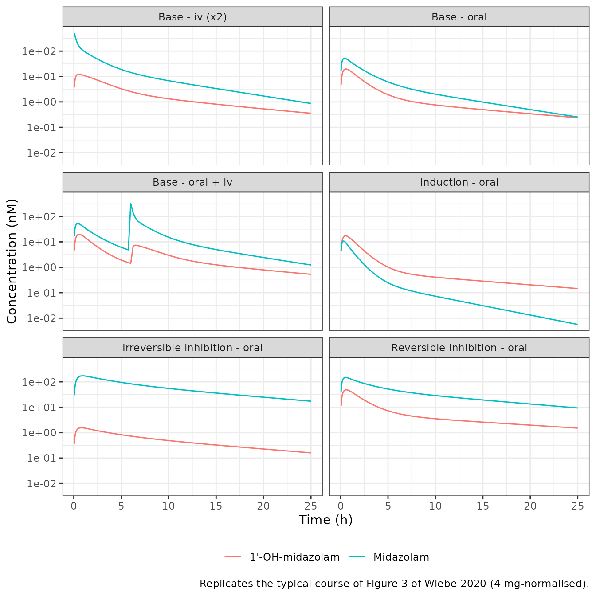
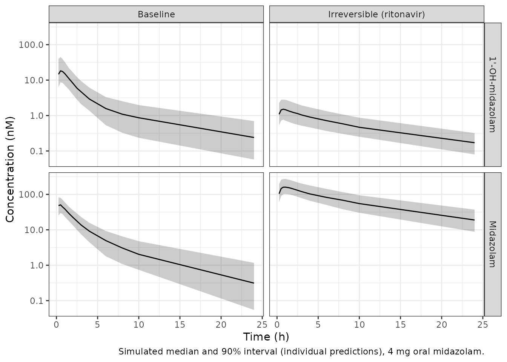

# Midazolam and 1'-OH-midazolam with CYP3A inhibition and induction (Wiebe 2020)

``` r

ui <- rxode2::rxode(readModelDb("Wiebe_2020_midazolam"))
#> ℹ parameter labels from comments will be replaced by 'label()'
#> Warning: some etas defaulted to non-mu referenced, possible parsing error: etaiov_cl_1, etaiov_cl_2, etaiov_cl_3, etaiov_cl_4, etaiov_cl_5, etaiov_cl_1ohm_1, etaiov_cl_1ohm_2, etaiov_cl_1ohm_3, etaiov_cl_1ohm_4, etaiov_cl_1ohm_5, etaiov_fdepot_1, etaiov_fdepot_2, etaiov_fdepot_3, etaiov_fdepot_4, etaiov_fdepot_5
#> as a work-around try putting the mu-referenced expression on a simple line
ui_typ <- rxode2::zeroRe(ui)
#> Warning: some etas defaulted to non-mu referenced, possible parsing error: etaiov_cl_1, etaiov_cl_2, etaiov_cl_3, etaiov_cl_4, etaiov_cl_5, etaiov_cl_1ohm_1, etaiov_cl_1ohm_2, etaiov_cl_1ohm_3, etaiov_cl_1ohm_4, etaiov_cl_1ohm_5, etaiov_fdepot_1, etaiov_fdepot_2, etaiov_fdepot_3, etaiov_fdepot_4, etaiov_fdepot_5
#> as a work-around try putting the mu-referenced expression on a simple line
```

## Model and source

- Citation: Wiebe ST, Meid AD, Mikus G. Composite midazolam and 1’-OH
  midazolam population pharmacokinetic model for constitutive, inhibited
  and induced CYP3A activity. J Pharmacokinet Pharmacodyn.
  2020;47(6):527-542. <doi:10.1007/s10928-020-09704-1>. Parameter values
  from Online Resource 2 (final NONMEM control stream ‘Adopted Composite
  Model Control Stream with Interaction’).
- Article: <https://doi.org/10.1007/s10928-020-09704-1>
- Description: Composite parent-metabolite population PK model for
  midazolam and 1’-OH-midazolam in healthy adults, with CYP3A
  drug-drug-interaction effects for reversible inhibition (ketoconazole,
  voriconazole), irreversible inhibition (ritonavir) and induction
  (efavirenz) (Wiebe 2020). Both analytes have three-compartment
  disposition. Oral midazolam is absorbed first-order from a depot that
  simultaneously feeds 1’-OH-midazolam through a pre-systemic formation
  rate constant; all systemic midazolam clearance forms 1’-OH-midazolam
  (fraction metabolised fixed to 1). Body weight is a power covariate on
  the first metabolite intercompartmental clearance. Treatment effects
  are additive shifts on the typical midazolam central volume, midazolam
  clearance, bioavailability, pre-systemic formation rate and metabolite
  clearance. Inter-occasion variability on midazolam clearance,
  metabolite clearance and bioavailability. Amounts are nmol and
  concentrations nM. Parameter values are from the deposited final
  NONMEM control stream (Online Resource 2).

Wiebe 2020 built a joint midazolam / 1’-OH-midazolam model from ten
German phase 1 studies in healthy volunteers. The model is meant to
detect CYP3A drug-drug interactions from a single midazolam profile. It
was built in two stages:

1.  A **composite model** for constitutive CYP3A activity:
    three-compartment disposition for each analyte, first-order
    absorption, a pre-systemic formation rate constant `kmet` that feeds
    1’-OH-midazolam directly from the gut / liver, and a fraction
    metabolised fixed to 1.
2.  An **interaction model**: every composite parameter was fixed, and
    treatment was added as an additive shift on midazolam central
    volume, midazolam clearance (`Qmet`), bioavailability, `kmet` and
    metabolite clearance (`CLmet`). Inhibition is split into reversible
    (ketoconazole, voriconazole) and irreversible (ritonavir) effects.

With every treatment indicator at 0, the interaction model reduces
exactly to the composite model, so a single model file carries both. The
deposited final control stream (Online Resource 2) supplies every value.

## Population

``` r

pop <- ui$population
tibble::tibble(
  Field = names(pop),
  Value = vapply(pop, function(x) paste(x, collapse = "; "), character(1))
) |>
  knitr::kable(caption = "Population metadata (Wiebe 2020 Table 2 and Methods).")
```

| Field | Value |
|:---|:---|
| species | human |
| n_subjects | 99 |
| n_studies | 7 |
| age_range | 19-52 years |
| age_mean | 26.9 years |
| weight_range | 47-111 kg |
| weight_mean | 71.7 kg |
| sex_female_pct | 40.4 |
| disease_state | healthy volunteers |
| dose_range | Midazolam 3 microgram to 4 mg oral, 1 microgram to 2 mg iv, and semi-simultaneous 4 mg oral followed by 2 mg iv 6 h later; alone or with ketoconazole, voriconazole, ritonavir or efavirenz. |
| regions | Germany (University Hospital Heidelberg) |
| notes | Model development set: 99 healthy adults from seven studies (K119, K155, K169, K257, K380, K194, K345; Table 2), 59 male and 40 female. 2371 midazolam and 2197 1’-OH-midazolam concentrations for constitutive CYP3A activity, plus 1077 and 961 from the inhibition and induction arms (6606 in total). BLQ records were omitted (29 midazolam, 190 1’-OH-midazolam). External validation used 46 more subjects from three limited-sampling studies (K292, K342, K363) and further arms of K119, K169 and K194. NONMEM 7.3, ADVAN6, FOCE-I. The interaction effects were estimated with every composite-model parameter fixed, so the composite model is the special case with all treatment indicators 0. |

Population metadata (Wiebe 2020 Table 2 and Methods). {.table}

The development set contains 99 healthy adults from seven studies (Table
2): mean age 26.9 years (19-52), mean weight 71.7 kg (47-111), 59 men
and 40 women. The inhibition arms used ketoconazole 400 mg once daily
(K345), voriconazole (K257, K380) and ritonavir 300 mg twice daily
(K257, and K119 together with St. John’s wort). The induction arm used
efavirenz 400 mg once daily for 14 days (K155, 12 subjects).

## Source trace

| Model element | Value | Source |
|----|----|----|
| Structure: 3-cmt parent, 3-cmt metabolite, depot | – | Fig. 1; Online Resource 2 `$MODEL`, `$DES` |
| `ka` | 2.30635 1/h | Online Resource 2 THETA(6); Table 3 2.31 |
| `F` (bioavailability) | 0.275824 | THETA(7); Table 3 0.276 |
| `Vc`, `Vp1`, `Vp2` | 19.4507, 41.0258, 23.8228 L | THETA(1-3); Table 3 |
| `Qp1`, `Qp2` | 8.00001, 46.0527 L/h | THETA(4-5); Table 3 |
| `Qmet` (midazolam CL) | 24.1486 L/h | THETA(10); Table 3 24.1 |
| `kmet` (pre-systemic formation) | 5.31099 1/h | THETA(8); Table 3 5.31 |
| `Vmet`, `VMP`, `VMP2` | 175.643, 684.933, 67.145 L | THETA(9, 12, 14); Table 3 |
| `QMP` (70 kg), `QMP2` | 59.5749, 127.374 L/h | THETA(13, 15); Table 3 |
| `CLmet` | 196.827 L/h | THETA(11); Table 3 196.8 |
| `FM` | 1 (fixed) | `$PK` `FM = 1`; Methods |
| WT exponent on `QMP` | 0.9863 | THETA(24); Table 3 0.986; Methods (70 kg reference) |
| Reversible inhibition on `Qmet`, `F`, `CLmet` | -16.336, 0.378806, -64.1022 | THETA(26, 29, 34); Table 3 |
| Ritonavir on `Vc`, `Qmet`, `F`, `kmet`, `CLmet` | 51.8404, -12.67, 1.34248, -5.23662, 1117.36 | THETA(25, 27, 30, 32, 35); Table 3 |
| Induction on `Qmet`, `F`, `kmet` | 37.9834, -0.200032, 12.4264 | THETA(28, 31, 33); Table 3 |
| IIV block `Vmet`, `Vc` | 0.158449, 0.109819, 0.142583 | `$OMEGA BLOCK(2)`; Table 3 prints SDs and correlation |
| IIV `Qmet`, `CLmet`, `Vp1`, `Qp1`, `F`, `kmet`, `QMP` | 0.0087203, 0.0176367, 0.167708, 0.251747, 0.0545658, 0.135776, 0.235254 | `$OMEGA`; Table 3 prints SDs |
| IOV `Qmet`, `CLmet`, `F` (5 occasions) | 0.0231946, 0.0859661, 0.0261532 | `$OMEGA BLOCK(1)` + `SAME`; Table 3 prints SDs |
| Proportional SDs, early / late, no inhibition | MDZ 0.503162 / 0.148938; 1’-OH 0.555696 / 0.215375 | THETA(16, 20, 18, 22); Table 3 |
| Proportional SDs, early / late, inhibition | 0.482949 / 0.267324 | THETA(36, 38); Table 3 |
| 1’-OH additive SD | 0.00001 nM | THETA(19, 23) |
| Early/late split | 0.5 h (1.5 h with inhibition) | `$ERROR`; Results |

## Virtual cohort and helpers

``` r

MW_MIDAZOLAM <- 325.77                        # g/mol
mg_to_nmol <- function(mg) mg * 1e-3 / MW_MIDAZOLAM * 1e9

CONDITIONS <- tibble::tribble(
  ~condition,               ~CONMED_KETOCONAZOLE, ~CONMED_VORICONAZOLE, ~CONMED_RTV, ~CONMED_CYP3A4_IND,
  "Baseline",               0,                    0,                    0,           0,
  "Reversible (keto/vori)", 1,                    0,                    0,           0,
  "Irreversible (ritonavir)", 0,                  0,                    1,           0,
  "Induction (efavirenz)",  0,                    0,                    0,           1
)

#' One subject's event table. `doses` is a data frame of time / amt / cmt;
#' observations sit on the `central` ODE state with dvid 1, and rxode2
#' returns both Cc and Cc_1ohm on every observation row.
make_events <- function(doses, times, condition = "Baseline", id = 1L, WT = 70) {
  dose <- data.frame(id = id, time = doses$time, amt = doses$amt,
                     cmt = doses$cmt, evid = 1L, dvid = NA_integer_)
  obs <- data.frame(id = id, time = times, amt = NA_real_, cmt = "central",
                    evid = 0L, dvid = 1L)
  ev <- rbind(dose, obs)
  cov <- CONDITIONS[CONDITIONS$condition == condition, ]
  for (nm in setdiff(names(cov), "condition")) ev[[nm]] <- cov[[nm]]
  ev$WT <- WT
  ev$OCC <- 1L
  ev$condition <- condition
  ev[order(ev$time, -ev$evid), ]
}

oral_4mg <- data.frame(time = 0, amt = mg_to_nmol(4), cmt = "depot")
iv_2mg <- data.frame(time = 0, amt = mg_to_nmol(2), cmt = "central")
oral_iv <- data.frame(time = c(0, 6), amt = mg_to_nmol(c(4, 2)),
                      cmt = c("depot", "central"))

solve_typical <- function(events, model = ui_typ) {
  suppressMessages(as.data.frame(rxode2::rxSolve(
    model, events, useLinCmt = FALSE, keep = "condition",
    returnType = "data.frame"
  )))
}
```

All typical-value solves use a 70 kg subject (the weight reference) on
occasion 1.

## Replicate Figure 3

Figure 3 of Wiebe 2020 shows visual predictive checks for the final
interaction model, with data normalised to a 4 mg midazolam dose. The
typical-value curves below reproduce its panels: base oral, base iv,
base oral + iv, inhibition, and induction.

``` r

TIMES <- sort(unique(c(seq(0, 2, by = 0.05), seq(2, 25, by = 0.25))))

fig3 <- bind_rows(
  solve_typical(make_events(oral_4mg, TIMES)) |> mutate(panel = "Base - oral"),
  solve_typical(make_events(iv_2mg, TIMES)) |>
    mutate(Cc = 2 * Cc, Cc_1ohm = 2 * Cc_1ohm, panel = "Base - iv (x2)"),
  solve_typical(make_events(oral_iv, TIMES)) |> mutate(panel = "Base - oral + iv"),
  solve_typical(make_events(oral_4mg, TIMES, "Reversible (keto/vori)")) |>
    mutate(panel = "Reversible inhibition - oral"),
  solve_typical(make_events(oral_4mg, TIMES, "Irreversible (ritonavir)")) |>
    mutate(panel = "Irreversible inhibition - oral"),
  solve_typical(make_events(oral_4mg, TIMES, "Induction (efavirenz)")) |>
    mutate(panel = "Induction - oral")
)

fig3 |>
  filter(time > 0) |>
  select(time, panel, Midazolam = Cc, `1'-OH-midazolam` = Cc_1ohm) |>
  pivot_longer(c(Midazolam, `1'-OH-midazolam`), names_to = "analyte",
               values_to = "conc") |>
  ggplot(aes(time, conc, colour = analyte)) +
  geom_line() +
  scale_y_log10() +
  facet_wrap(~panel, ncol = 2) +
  labs(x = "Time (h)", y = "Concentration (nM)", colour = NULL,
       caption = "Replicates the typical course of Figure 3 of Wiebe 2020 (4 mg-normalised).") +
  theme_bw() +
  theme(legend.position = "bottom")
```



### The pre-systemic formation route: which reading of the control stream

The deposited control stream does not write the depot the way Figure 1
draws it. In `$PK` it sets `KA = THETA(6)` on midazolam records and
`KA = KMET` on metabolite records, and in `$DES`:

    DADT(1) = -KA*A(1)
    DADT(2) =  KA*A(1) - ...
    DADT(5) =  KMET*A(1) + K2M*A(2) - ...

NONMEM integrates each interval with the `$PK` values of the record that
closes it. Which `KA` applies therefore depends on the record order in
the (unpublished) dataset. There are two readings:

- **Reading A (encoded).** The intervals close on midazolam records. The
  depot empties at `ka` = 2.31 1/h into midazolam, and 1’-OH-midazolam
  gains `kmet * depot` in parallel **without draining the depot**.
- **Reading B.** The intervals close on metabolite records. The depot
  then empties at `kmet` into both midazolam and 1’-OH-midazolam, and
  `THETA(6)` would never enter the likelihood.

Table 3 reports `ka` with an RSE of 4.44%, which is impossible if
THETA(6) never enters the fit, so the control stream itself rules out
Reading B. Figure 3 gives a second, independent check. The maintainers
digitised the observed median of the “Base - Oral Dose” panels
(midazolam and 1’-OH-midazolam, 4 mg-normalised) from the published
figure image. Reading B is built from the same model by re-routing the
depot:

``` r

reading_b <- function(events) {
  d <- solve_typical(events)
  # Reading B: depot drains at kmet into BOTH analytes. Solve it with a
  # stand-alone ODE on the same typical parameters.
  m <- rxode2::rxode2({
    d/dt(depot) <- -kmet_p * depot
    d/dt(central) <- kmet_p * depot - (q + q2 + cl) / vc * central +
      q / vp * p1 + q2 / vp2 * p2
    d/dt(p1) <- q / vc * central - q / vp * p1
    d/dt(p2) <- q2 / vc * central - q2 / vp2 * p2
    d/dt(met) <- kmet_p * depot + cl / vc * central -
      (cl_1ohm + q_1ohm + q2_1ohm) / vc_1ohm * met +
      q_1ohm / vp_1ohm * mp1 + q2_1ohm / vp2_1ohm * mp2
    d/dt(mp1) <- q_1ohm / vc_1ohm * met - q_1ohm / vp_1ohm * mp1
    d/dt(mp2) <- q2_1ohm / vc_1ohm * met - q2_1ohm / vp2_1ohm * mp2
    f(depot) <- fdepot
    Cc <- central / vc
    Cc_1ohm <- met / vc_1ohm
  })
  pars <- c(kmet_p = 5.31099, q = 8.00001, q2 = 46.0527, cl = 24.1486,
            vc = 19.4507, vp = 41.0258, vp2 = 23.8228, cl_1ohm = 196.827,
            q_1ohm = 59.5749, q2_1ohm = 127.374, vc_1ohm = 175.643,
            vp_1ohm = 684.933, vp2_1ohm = 67.145, fdepot = 0.275824)
  ev <- rxode2::et(amt = mg_to_nmol(4), cmt = "depot") |>
    rxode2::et(unique(d$time[d$time > 0]))
  as.data.frame(rxode2::rxSolve(m, ev, params = pars))
}

# Digitised by the maintainers from the Wiebe 2020 Figure 3 image, panels
# 'Midazolam Base - Oral Dose' and "1'-OH Midazolam Base - Oral Dose", solid
# line = observed median. Approximate (log axis, low-resolution image).
fig3_digitised <- tibble::tribble(
  ~time, ~mdz_obs, ~oh_obs,
  0.75,  40,       18,
  5,     5,        1.5,
  10,    1.6,      0.75,
  24,    0.22,     0.18
)

sim_a <- solve_typical(make_events(oral_4mg, fig3_digitised$time))
sim_b <- reading_b(make_events(oral_4mg, fig3_digitised$time))

cmp <- fig3_digitised |>
  mutate(
    mdz_A = sim_a$Cc[match(time, sim_a$time)],
    oh_A = sim_a$Cc_1ohm[match(time, sim_a$time)],
    mdz_B = sim_b$Cc[match(time, sim_b$time)],
    oh_B = sim_b$Cc_1ohm[match(time, sim_b$time)]
  )

cmp |>
  mutate(across(-time, ~ signif(.x, 3))) |>
  rename(
    "Time (h)" = time,
    "MDZ, Fig. 3 (nM)" = mdz_obs, "MDZ, reading A" = mdz_A, "MDZ, reading B" = mdz_B,
    "1'-OH, Fig. 3 (nM)" = oh_obs, "1'-OH, reading A" = oh_A, "1'-OH, reading B" = oh_B
  ) |>
  knitr::kable(caption = "Typical-value predictions of both readings against the digitised Figure 3 medians (4 mg oral).")
```

| Time (h) | MDZ, Fig. 3 (nM) | 1’-OH, Fig. 3 (nM) | MDZ, reading A | 1’-OH, reading A | MDZ, reading B | 1’-OH, reading B |
|---:|---:|---:|---:|---:|---:|---:|
| 0.75 | 40.00 | 18.00 | 46.000 | 19.000 | 44.000 | 10.300 |
| 5.00 | 5.00 | 1.50 | 6.110 | 1.930 | 5.560 | 1.300 |
| 10.00 | 1.60 | 0.75 | 2.020 | 0.758 | 1.940 | 0.533 |
| 24.00 | 0.22 | 0.18 | 0.291 | 0.257 | 0.281 | 0.171 |

Typical-value predictions of both readings against the digitised Figure
3 medians (4 mg oral). {.table}

``` r


sse <- function(pred, obs) sum(log(pred / obs)^2)
score <- c(
  A = sse(cmp$oh_A, cmp$oh_obs),
  B = sse(cmp$oh_B, cmp$oh_obs)
)
score
#>         A         B 
#> 0.1919386 0.4510089
```

``` r

stopifnot(
  # Reading A fits the 1'-OH-midazolam medians better than reading B
  score[["A"]] < score[["B"]],
  # and its peak-region value is within 25% of the digitised median.
  abs(cmp$oh_A[cmp$time == 0.75] / cmp$oh_obs[cmp$time == 0.75] - 1) < 0.25,
  # Midazolam itself is nearly identical under both readings (the
  # disagreement is confined to the metabolite): typical value within a
  # factor of 1.6 of the digitised median at every time.
  all(abs(log(cmp$mdz_A / cmp$mdz_obs)) < log(1.6))
)
```

The two readings give almost the same midazolam profile. They differ in
how much 1’-OH-midazolam is formed pre-systemically. Under reading A, an
oral dose forms `F * Dose * (1 + kmet/ka)` = 0.91 x Dose of metabolite.
Under reading B it forms only `F * Dose` = 0.28 x Dose. Reading A
reproduces the Figure 3 metabolite peak of about 18 nM at 0.75 h (19
nM), while reading B under-predicts it by 43%.

## Midazolam clearance cut-points (Table 4)

Wiebe 2020 proposes classifying CYP3A modulation from the
model-estimated midazolam clearance `Qmet`: 4.82-16.4 L/h inhibition,
16.4-41.8 L/h no modulation, 41.8-88.9 L/h induction (Abstract; Table
4). The typical `Qmet` of each treatment category must fall in its own
bin.

``` r

typ_cl <- bind_rows(lapply(CONDITIONS$condition, function(cn) {
  d <- solve_typical(make_events(oral_4mg, 1, cn))
  data.frame(condition = cn, cl = d$cl[1], fdepot = d$fdepot[1],
             vc = d$vc[1], k_1ohm_form = d$k_1ohm_form[1], cl_1ohm = d$cl_1ohm[1])
}))
typ_cl$bin <- cut(typ_cl$cl, c(4.82, 16.4, 41.8, 88.9),
                  labels = c("Inhibition", "No modulation", "Induction"))

typ_cl |>
  mutate(across(where(is.numeric), ~ signif(.x, 4))) |>
  rename("Condition" = condition, "Qmet (L/h)" = cl, "F" = fdepot,
         "Vc (L)" = vc, "kmet (1/h)" = k_1ohm_form, "CLmet (L/h)" = cl_1ohm,
         "Table 4 bin" = bin) |>
  knitr::kable(caption = "Typical parameter values per treatment category.")
```

| Condition | Qmet (L/h) | F | Vc (L) | kmet (1/h) | CLmet (L/h) | Table 4 bin |
|:---|---:|---:|---:|---:|---:|:---|
| Baseline | 24.150 | 0.27580 | 19.45 | 5.31100 | 196.8 | No modulation |
| Reversible (keto/vori) | 7.813 | 0.65460 | 19.45 | 5.31100 | 132.7 | Inhibition |
| Irreversible (ritonavir) | 11.480 | 1.61800 | 71.29 | 0.07437 | 1314.0 | Inhibition |
| Induction (efavirenz) | 62.130 | 0.07579 | 19.45 | 17.74000 | 196.8 | Induction |

Typical parameter values per treatment category. {.table}

``` r


stopifnot(
  identical(as.character(typ_cl$bin),
            c("No modulation", "Inhibition", "Inhibition", "Induction")),
  # Results text: 'Estimated bioavailability of midazolam was 27.6% and
  # clearance was 24.1 L/h'.
  abs(typ_cl$fdepot[1] - 0.276) < 0.001,
  abs(typ_cl$cl[1] - 24.1) < 0.05
)
```

Irreversible inhibition drives the typical bioavailability to 1.62. That
is above 1 and not physically meaningful. It is what the published
additive coefficient gives, and it is kept as published (see Assumptions
and deviations).

## PKNCA validation

The paper reports no NCA table, so the NCA is scored against the model’s
own exposure identities, which are exact for this linear system:

- midazolam: `AUC(0-inf) = F * Dose / Qmet`;
- 1’-OH-midazolam after oral dosing:
  `AUC(0-inf) = F * Dose * (1 + kmet / ka) / CLmet`, i.e. the
  systemically formed part (FM = 1) plus the pre-systemic part
  `kmet * integral(depot)`;
- 1’-OH-midazolam after iv dosing: `AUC(0-inf) = Dose / CLmet`.

``` r

NCA_GRID <- sort(unique(c(seq(0, 4, by = 0.02), seq(4, 48, by = 0.25),
                          seq(48, 240, by = 2))))
arms <- tibble::tribble(
  ~treatment,          ~condition,                 ~route,
  "Baseline oral",     "Baseline",                 "oral",
  "Baseline iv",       "Baseline",                 "iv",
  "Reversible oral",   "Reversible (keto/vori)",   "oral",
  "Ritonavir oral",    "Irreversible (ritonavir)", "oral",
  "Induction oral",    "Induction (efavirenz)",    "oral"
)

nca_sim <- bind_rows(lapply(seq_len(nrow(arms)), function(i) {
  doses <- if (arms$route[i] == "oral") oral_4mg else iv_2mg
  solve_typical(make_events(doses, NCA_GRID, arms$condition[i])) |>
    mutate(treatment = arms$treatment[i], id = 1L,
           dose_nmol = doses$amt[1])
}))

run_nca <- function(conc_col) {
  conc <- nca_sim |>
    filter(!is.na(.data[[conc_col]])) |>
    transmute(id, treatment, time, conc = .data[[conc_col]])
  conc <- bind_rows(conc, conc |> distinct(id, treatment) |> mutate(time = 0, conc = 0)) |>
    distinct(id, treatment, time, .keep_all = TRUE) |>
    arrange(treatment, id, time)
  dose_df <- nca_sim |> distinct(id, treatment, dose_nmol) |>
    mutate(time = 0)
  conc_obj <- PKNCA::PKNCAconc(conc, conc ~ time | treatment + id,
                               concu = "nM", timeu = "h")
  dose_obj <- PKNCA::PKNCAdose(dose_df, dose_nmol ~ time | treatment + id,
                               doseu = "nmol")
  intervals <- data.frame(start = 0, end = Inf, cmax = TRUE, tmax = TRUE,
                          aucinf.obs = TRUE, half.life = TRUE)
  res <- PKNCA::pk.nca(PKNCA::PKNCAdata(conc_obj, dose_obj, intervals = intervals))
  as.data.frame(res$result) |>
    select(treatment, PPTESTCD, PPORRES) |>
    pivot_wider(names_from = PPTESTCD, values_from = PPORRES)
}

nca_parent <- run_nca("Cc")
nca_metab <- run_nca("Cc_1ohm")

ka <- 2.30635
expected <- nca_sim |>
  group_by(treatment) |>
  slice(1) |>
  ungroup() |>
  left_join(arms, by = "treatment") |>
  transmute(
    treatment,
    parent_auc = ifelse(route == "oral", fdepot, 1) * dose_nmol / cl,
    metab_auc = ifelse(route == "oral",
                       fdepot * dose_nmol * (1 + k_1ohm_form / ka),
                       dose_nmol) / cl_1ohm
  )

nca_tbl <- expected |>
  left_join(nca_parent |> select(treatment, parent_nca = aucinf.obs,
                                 parent_cmax = cmax, parent_tmax = tmax,
                                 parent_thalf = half.life), by = "treatment") |>
  left_join(nca_metab |> select(treatment, metab_nca = aucinf.obs,
                                metab_cmax = cmax), by = "treatment")

nca_tbl |>
  mutate(across(where(is.numeric), ~ signif(.x, 4))) |>
  rename(
    "Arm (4 mg oral / 2 mg iv)" = treatment,
    "MDZ AUCinf, identity (nM*h)" = parent_auc,
    "MDZ AUCinf, NCA (nM*h)" = parent_nca,
    "MDZ Cmax (nM)" = parent_cmax,
    "MDZ Tmax (h)" = parent_tmax,
    "MDZ t1/2 (h)" = parent_thalf,
    "1'-OH AUCinf, identity (nM*h)" = metab_auc,
    "1'-OH AUCinf, NCA (nM*h)" = metab_nca,
    "1'-OH Cmax (nM)" = metab_cmax
  ) |>
  knitr::kable(caption = "PKNCA results against the closed-form exposure identities (typical values, 70 kg).")
```

| Arm (4 mg oral / 2 mg iv) | MDZ AUCinf, identity (nM\*h) | 1’-OH AUCinf, identity (nM\*h) | MDZ AUCinf, NCA (nM\*h) | MDZ Cmax (nM) | MDZ Tmax (h) | MDZ t1/2 (h) | 1’-OH AUCinf, NCA (nM\*h) | 1’-OH Cmax (nM) |
|:---|---:|---:|---:|---:|---:|---:|---:|---:|
| Baseline iv | 254.20 | 31.19 | 254.30 | 315.60 | 0.00 | 5.116 | 31.19 | 6.156 |
| Baseline oral | 140.20 | 56.83 | 140.20 | 52.41 | 0.42 | 5.117 | 56.83 | 19.740 |
| Induction oral | 14.98 | 41.09 | 14.97 | 10.78 | 0.30 | 4.069 | 41.09 | 17.330 |
| Reversible oral | 1029.00 | 200.00 | 1029.00 | 148.40 | 0.52 | 9.647 | 200.00 | 48.510 |
| Ritonavir oral | 1731.00 | 15.61 | 1731.00 | 172.20 | 0.92 | 9.672 | 15.61 | 1.557 |

PKNCA results against the closed-form exposure identities (typical
values, 70 kg). {.table}

``` r

# The two sides use the same parameters; the difference is pure numerical
# (trapezoidal / extrapolation) error, so a tight bound is correct.
stopifnot(
  all(abs(nca_tbl$parent_nca / nca_tbl$parent_auc - 1) < 0.01),
  all(abs(nca_tbl$metab_nca / nca_tbl$metab_auc - 1) < 0.01)
)
```

``` r

auc_ratio <- function(arm) {
  nca_tbl$parent_nca[nca_tbl$treatment == arm] /
    nca_tbl$parent_nca[nca_tbl$treatment == "Baseline oral"]
}
auc_ratios <- c(
  reversible = auc_ratio("Reversible oral"),
  ritonavir = auc_ratio("Ritonavir oral"),
  induction = auc_ratio("Induction oral")
)
round(auc_ratios, 3)
#> reversible  ritonavir  induction 
#>      7.336     12.344      0.107
```

Relative to baseline, reversible inhibition raises typical oral
midazolam AUC 7.3-fold and ritonavir 12.3-fold, while induction lowers
it 9.4-fold. These sizes correspond to the potent modulators of the
development data.

## Stochastic simulation

A stochastic check with between-subject, inter-occasion and residual
variability, 100 subjects per arm, on the Figure 3 “Base - Oral Dose”
and “Inhibition - Oral Dose” designs (4 mg oral).

``` r

set.seed(97041)
rxode2::rxSetSeed(97041)
N_PER_ARM <- 100
VPC_TIMES <- c(0.25, 0.5, 0.75, 1, 1.5, 2, 2.5, 3, 4, 6, 8, 10, 24)

vpc_events <- bind_rows(
  lapply(seq_len(N_PER_ARM), function(i)
    make_events(oral_4mg, VPC_TIMES, "Baseline", id = i,
                WT = stats::runif(1, 47, 111))),
  lapply(seq_len(N_PER_ARM), function(i)
    make_events(oral_4mg, VPC_TIMES, "Irreversible (ritonavir)", id = N_PER_ARM + i,
                WT = stats::runif(1, 47, 111)))
)

vpc <- as.data.frame(rxode2::rxSolve(ui, vpc_events, useLinCmt = FALSE,
                                     keep = "condition", returnType = "data.frame"))

vpc_sum <- vpc |>
  filter(time > 0) |>
  select(id, time, condition, Midazolam = Cc, `1'-OH-midazolam` = Cc_1ohm) |>
  pivot_longer(c(Midazolam, `1'-OH-midazolam`), names_to = "analyte",
               values_to = "conc") |>
  group_by(condition, analyte, time) |>
  summarise(q05 = quantile(conc, 0.05), q50 = median(conc),
            q95 = quantile(conc, 0.95), .groups = "drop")

ggplot(vpc_sum, aes(time, q50)) +
  geom_ribbon(aes(ymin = q05, ymax = q95), alpha = 0.25) +
  geom_line() +
  scale_y_log10() +
  facet_grid(analyte ~ condition) +
  labs(x = "Time (h)", y = "Concentration (nM)",
       caption = "Simulated median and 90% interval (individual predictions), 4 mg oral midazolam.") +
  theme_bw()
```



## Assumptions and deviations

- **Parameter source.** All values come from the deposited final control
  stream (Online Resource 2). They agree with Table 3 once Table 3’s
  variability rows are read correctly. Its “omega^2” column prints
  standard deviations (sqrt of the `$OMEGA` variances), and its “omega^2
  Vmet \* omega^2 Vc” row prints the correlation (0.731), not the
  covariance (0.1098). The printed 95% CI of that row (0.264-0.392)
  matches neither and was not used.
- **Pre-systemic formation route.** The model encodes the as-run control
  stream (reading A above): 1’-OH-midazolam gains `kmet * depot` without
  draining the depot. It is not the mass-conserving branching of
  Figure 1. The choice rests on the estimable `ka` (Table 3 RSE 4.44%)
  and on the Figure 3 metabolite peak.
- **Treatment covariates.** The control stream carries one three-way
  treatment code (`TRT3`), so its categories never overlap. The model
  maps them to concomitant-medication indicators: reversible inhibition
  = `CONMED_KETOCONAZOLE` or `CONMED_VORICONAZOLE`; irreversible
  inhibition = `CONMED_RTV` (in study K119 this was ritonavir plus
  St. John’s wort, net inhibition); induction = `CONMED_CYP3A4_IND`,
  estimated from 14-day efavirenz. Do not set more than one category on
  the same record. The paper applied the induction effect to other
  inducers only in external validation, where it over-predicted the
  induction effect for weak inducers.
- **Non-physical bioavailability under ritonavir.** The additive
  ritonavir shift on F (+1.342) gives a typical F of 1.62. It is kept as
  published. With IIV and IOV on F, individual values above 1 also occur
  under reversible inhibition.
- **Residual error.** The control stream uses
  `W = sqrt(FPROP^2 * IPRED^2 + FADD^2)` with `$SIGMA 1 FIX`, so each
  FPROP is a standard deviation whose sign does not matter. The two
  negative estimates (-0.215375, -0.267324) are stored as magnitudes.
  The early/late split uses the control stream’s `TIME`, taken here as
  time since the occasion’s first midazolam dose (`t` in the model).
  Simulate each occasion from its own time origin. The inhibition error
  terms apply to both kinds of inhibition (control stream `TRT = 2`).
  The 1e-5 nM additive term for 1’-OH-midazolam is applied on all
  records. In the control stream it is 0 on inhibition records, a
  negligible difference.
- **Occasions.** The five IOV slots per parameter follow the control
  stream’s `$ABBREVIATED REPLACE` mapping. Simulations here use
  `OCC = 1`.
- **Concentration units.** The control stream does not state units.
  Amounts in nmol and concentrations in nM are inferred from Figure 3
  (nM axis, 4 mg normalisation). With molar amounts, the fixed fraction
  metabolised of 1 is a molar balance. The typical-value curves
  reproduce the Figure 3 magnitudes.
- **Covariates not retained.** An age effect on `kmet` was found but not
  retained (no reduction in variability), and sex was not significant
  (Results). Neither is in the model.
