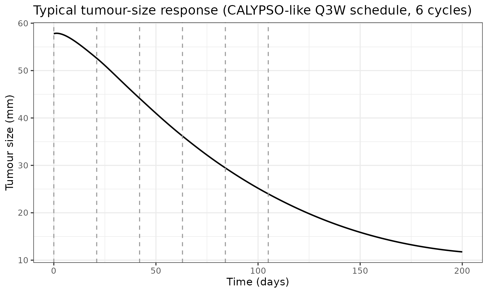
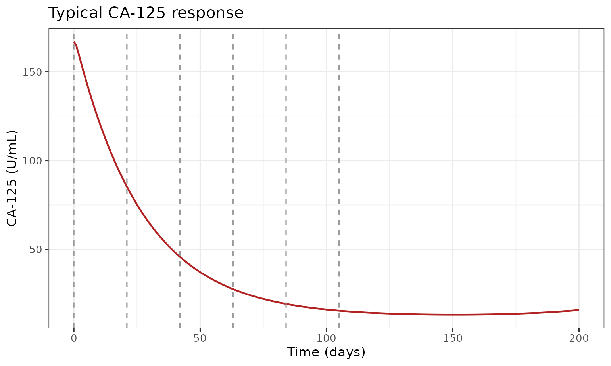
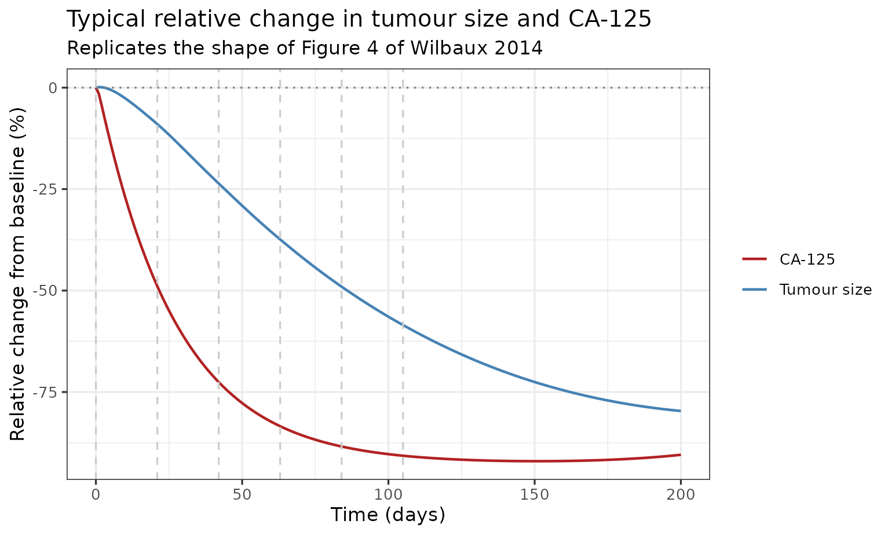
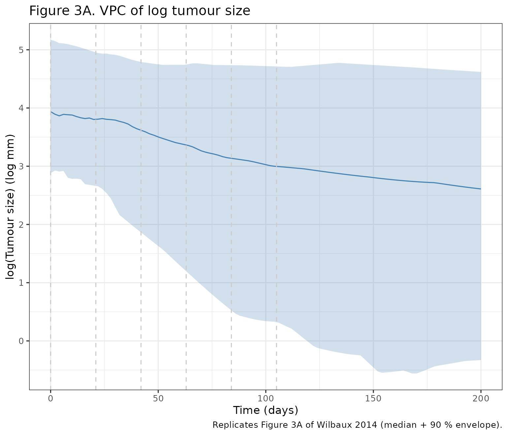
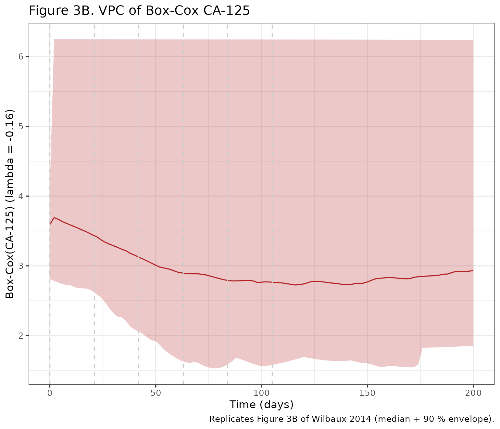

# Tumour size + CA-125 K-PD in recurrent ovarian cancer (Wilbaux 2014)

## Model and source

- Citation: Wilbaux M, Henin E, Oza A, Colomban O, Pujade-Lauraine E,
  Freyer G, Tod M, You B. Prediction of tumour response induced by
  chemotherapy using modelling of CA-125 kinetics in recurrent ovarian
  cancer patients. Br J Cancer. 2014;110(6):1517-1524.
  <doi:10.1038/bjc.2014.75>
- Description: K-PD joint model of tumour size and CA-125 kinetics
  during platinum-based chemotherapy in recurrent ovarian cancer
  (CALYPSO phase III trial; carboplatin + paclitaxel or carboplatin +
  pegylated liposomal doxorubicin pooled)
- Article: <https://doi.org/10.1038/bjc.2014.75>

## Population

The model was fit to data from 535 patients with platinum-sensitive
recurrent ovarian / peritoneal / fallopian cancer enrolled in the
CALYPSO phase III trial (Pujade-Lauraine et al, 2010), which randomised
976 patients to either carboplatin + paclitaxel (CP) or carboplatin +
pegylated liposomal doxorubicin (CD). Median age 61 years (range 27 to
82), median weight 69 kg (range 41 to 150), and all 100 percent female.
The learning data set (n = 357) was used to estimate parameters and the
validation data set (n = 178) was used for NPDE-based external
evaluation. An additional 297 patients with non-measurable disease were
excluded from model building but used to predict latent tumour response
from CA-125 alone. Patient characteristics are in Table 1 of Wilbaux
2014. The same information is available programmatically via
`readModelDb("Wilbaux_2014_ovarianCancer_ca125")$population`.

Because parameters for CP and CD were not significantly different in
early fitting, a single set of drug-kinetic parameters was retained and
the model uses an arbitrary dose of 1 a.u. per chemotherapy cycle.

## Model structure

The published model has three coupled outputs:

1.  **Drug kinetics (K-PD)** –two compartments `depot` (A1, receives the
    dose) and `transit1` (A2, lags the drug effect). Both decay
    first-order at the same rate `K`. There is no actual PK; the K-PD
    chain is a phenomenological delay between dose administration and
    drug effect.

    $`\frac{dA_1}{dt} = -K\,A_1, \qquad \frac{dA_2}{dt} = K\,A_1 - K\,A_2`$

2.  **Tumour dynamics** –constant proliferation rate `KPROL` saturably
    inhibited by the K-PD drug amount in `transit1`, with a
    drug-independent linear decrease at rate `KREDUC`.

    $`\frac{d\,TS}{dt} = K_{PROL}\,\frac{A_{50}}{A_{50} + A_2} - K_{REDUC}\,TS`$

3.  **CA-125 indirect response** –basal production from normal tissue
    (`KPROD1`) plus stationary-tumour production (`KPROD2`) modulated by
    `exp(K2 * VARTS)`, with first-order elimination at `KELIM`. The
    exponential keeps CA-125 production strictly positive even for fast-
    shrinking tumours.

    $`\frac{d\,CA}{dt} = K_{PROD1} + K_{PROD2}\,\exp(K_2\,V_{ARTS}) - K_{ELIM}\,CA`$
    where $`V_{ARTS} = dTS/dt`$.

Initial conditions `TS0` and `CA0` are estimated population parameters.
Inter-individual variability is log-normal on all ten typical-value
parameters.

## Source trace

Every value in
`inst/modeldb/therapeuticArea/oncology/Wilbaux_2014_ovarianCancer_ca125.R`
carries an in-file comment pointing at the source row in Table 2 of
Wilbaux 2014. The same provenance is collected here.

| Symbol | Value | Unit | Source |
|----|----|----|----|
| `K` (KEL) | 0.019 | 1/day | Table 2 (K = 0.019, RSE 17.4 %) |
| `KPROL` | 0.869 | mm/day | Table 2 (KPROL = 0.869, RSE 10.2 %) |
| `A50` | 0.162 | a.u. | Table 2 (A50 = 0.162, RSE 23.7 %) |
| `KREDUC` | 0.013 | 1/day | Table 2 (KREDUC = 0.013, RSE 6.5 %) |
| `KPROD1` | 0.452 | U/mL per day | Table 2 (KPROD1 = 0.452, RSE 10.9 %) |
| `KPROD2` | 0.615 | U/mL per day | Table 2 (KPROD2 = 0.615, RSE 7.1 %) |
| `K2` | 21.4 | day/mm | Table 2 (K2 = 21.4, RSE 3.8 %) |
| `KELIM` | 0.037 | 1/day | Table 2 (KELIM = 0.037, RSE 7.2 %) |
| `TS0` | 57.8 | mm | Table 2 (TS0 = 57.8, RSE 2.8 %) |
| `CA0` | 167 | U/mL | Table 2 (CA0 = 167, RSE 16.9 %) |
| Tumour residual SD (above LOQ) | 0.273 | log-mm | Table 2 (above-LOQ residual) |
| Tumour residual SD (below LOQ) | 0.576 FIX | log-mm | Table 2 (below-LOQ residual, M5 method) |
| CA-125 residual SD | 0.165 | Box-Cox U/mL | Table 2 (CA-125 residual) |
| CA-125 Box-Cox lambda | -0.16 FIX | unitless | Methods, Data management (R `car::powerTransform`) |

The IIV CV percentages are similarly traceable to Table 2.

## Steady-state and dimensional checks

Before reproducing the figures, confirm the structural identities hold.

``` r

mod <- readModelDb("Wilbaux_2014_ovarianCancer_ca125")
mod_typ <- rxode2::zeroRe(mod)
#> ℹ parameter labels from comments will be replaced by 'label()'

# No-treatment steady state. With VARTS -> 0 at TS_ss:
#   TS_ss   = KPROL / KREDUC
#   CA_ss   = (KPROD1 + KPROD2) / KELIM
ts_ss_expected <- 0.869 / 0.013
ca_ss_expected <- (0.452 + 0.615) / 0.037

ev_baseline <- et(seq(0, 4000, by = 100), cmt = "tumor_size") |>
  et(seq(0, 4000, by = 100), cmt = "ca125")
sim_baseline <- rxSolve(mod_typ, ev_baseline, returnType = "data.frame")
#> ℹ omega/sigma items treated as zero: 'etalkel', 'etalkprol', 'etala50', 'etalkreduc', 'etalkprod1', 'etalkprod2', 'etalk2', 'etalkout', 'etalrbase_tumor_size', 'etalrbase_ca125'
last <- sim_baseline[nrow(sim_baseline), ]

knitr::kable(
  data.frame(
    quantity = c("TS_ss (mm)", "CA_ss (U/mL)"),
    expected = c(ts_ss_expected, ca_ss_expected),
    simulated = c(last$tumor_size, last$ca125)
  ),
  digits = 4,
  caption = "Untreated steady states agree with the closed-form expressions to better than rounding."
)
```

| quantity     | expected | simulated |
|:-------------|---------:|----------:|
| TS_ss (mm)   |  66.8462 |   66.8462 |
| CA_ss (U/mL) |  28.8378 |   28.8378 |

Untreated steady states agree with the closed-form expressions to better
than rounding. {.table}

Dimensional sanity (verified line by line):

- `K * depot` has units `(1/day) * a.u. = a.u./day`, matching
  `d/dt(depot)`. ok.
- `K * transit1` is the same, matching `d/dt(transit1)`. ok.
- `KPROL * A50/(A50 + A2)` is `mm/day` times unitless = `mm/day`.
  `KREDUC * TS` is `(1/day) * mm = mm/day`. Both match
  `d/dt(tumor_size)`. ok.
- `K2 * VARTS` is `(day/mm) * (mm/day) = unitless`, so
  `KPROD2 * (1 + K2*VARTS)` retains the `U/mL per day` unit of `KPROD2`.
  `KELIM * CA` is `(1/day) * U/mL = U/mL per day`. Matches
  `d/dt(ca125)`. ok.

## Typical-value trajectory under chemotherapy

``` r

# Six cycles, every 21 days, 1 a.u. per cycle (CP-like cadence). The K-PD
# model treats CD and CP identically since the kinetic parameters did not
# differ significantly between the two arms.
dose_days <- seq(0, 5) * 21

ev_chemo <- et(amt = 1, time = dose_days, cmt = "depot") |>
  et(seq(0, 200, by = 1), cmt = "tumor_size") |>
  et(seq(0, 200, by = 1), cmt = "ca125")

sim_typ <- rxSolve(mod_typ, ev_chemo, returnType = "data.frame") |>
  dplyr::distinct(time, .keep_all = TRUE)
#> ℹ omega/sigma items treated as zero: 'etalkel', 'etalkprol', 'etala50', 'etalkreduc', 'etalkprod1', 'etalkprod2', 'etalk2', 'etalkout', 'etalrbase_tumor_size', 'etalrbase_ca125'

p1 <- ggplot(sim_typ, aes(time, tumor_size)) +
  geom_line(linewidth = 0.7) +
  geom_vline(xintercept = dose_days, linetype = "dashed", colour = "grey60") +
  labs(x = "Time (days)", y = "Tumour size (mm)",
       title = "Typical tumour-size response (CALYPSO-like Q3W schedule, 6 cycles)") +
  theme_bw()
p2 <- ggplot(sim_typ, aes(time, ca125)) +
  geom_line(linewidth = 0.7, colour = "firebrick") +
  geom_vline(xintercept = dose_days, linetype = "dashed", colour = "grey60") +
  labs(x = "Time (days)", y = "CA-125 (U/mL)",
       title = "Typical CA-125 response") +
  theme_bw()

print(p1)
```



``` r

print(p2)
```



The typical patient’s tumour shrinks under treatment and CA-125 falls in
parallel; both rebound after the last cycle because A2 decays back to
zero, the saturable growth inhibition releases, and the tumour regrows
toward the untreated steady state.

## Replicate Figure 4 (individual trajectories under chemotherapy)

Figure 4A of Wilbaux 2014 shows individual model predictions of relative
change in tumour size and CA-125 versus time for two example patients in
the validation data set. The figure is patient-specific (Empirical-Bayes
post-hoc); here we reproduce the corresponding *typical-patient*
trajectory to confirm the dynamics qualitatively. Wilbaux 2014 Figure 4
uses relative change from baseline; we follow the same convention.

``` r

sim_rel <- sim_typ |>
  dplyr::transmute(
    time,
    rel_tumor = (tumor_size - tumor_size[1]) / tumor_size[1] * 100,
    rel_ca125 = (ca125      - ca125[1])      / ca125[1]      * 100
  ) |>
  tidyr::pivot_longer(starts_with("rel_"), names_to = "var", values_to = "rel")

ggplot(sim_rel, aes(time, rel, colour = var)) +
  geom_line(linewidth = 0.7) +
  geom_hline(yintercept = 0, linetype = "dotted", colour = "grey50") +
  geom_vline(xintercept = dose_days, linetype = "dashed", colour = "grey80") +
  scale_colour_manual(
    values = c(rel_tumor = "steelblue", rel_ca125 = "firebrick"),
    labels = c(rel_tumor = "Tumour size", rel_ca125 = "CA-125")
  ) +
  labs(x = "Time (days)", y = "Relative change from baseline (%)",
       colour = NULL,
       title = "Typical relative change in tumour size and CA-125",
       subtitle = "Replicates the shape of Figure 4 of Wilbaux 2014") +
  theme_bw()
```



## Virtual cohort for the visual predictive check

``` r

set.seed(20140220)  # Wilbaux 2014 BJC online publication date

# Wilbaux 2014 reports very large IIV on several parameters (KPROD2 IIV
# 225.8 %CV, A50 IIV 167 %CV); sampling at the population level produces
# occasional extreme parameter draws that drive the coupled ODE system
# into very stiff regions. Use a moderate cohort and rxSolve's multi-id
# vectorisation rather than a long-format data frame.
n_subj <- 100
ev_one <- et(amt = 1, time = dose_days, cmt = "depot") |>
  et(seq(0, 200, by = 2), cmt = "tumor_size") |>
  et(seq(0, 200, by = 2), cmt = "ca125")
```

## Replicate Figure 3 (visual predictive check)

The published Figure 3 plots transformed values (log tumour size,
Box-Cox CA-125 with lambda = -0.16) so that the very wide IIV reported
in Table 2 does not dominate the percentile envelope. We follow the same
convention here: the bands show the 5th, 50th, and 95th percentiles of
the transformed simulated values. The CA-125 IIV in particular (KPROD2
226 % CV, A50 167 % CV, K2 109 % CV) drives a handful of extreme
realisations on the linear scale; the transformations compress them into
a sensible range.

``` r

sim_vpc <- rxSolve(mod, ev_one, nSub = n_subj, returnType = "data.frame")
#> ℹ parameter labels from comments will be replaced by 'label()'
#> intdy -- t = 2 illegal. t not in interval tcur - _rxC(hu) to tcur
#> intdy -- t = 4 illegal. t not in interval tcur - _rxC(hu) to tcur
#> intdy -- t = 6 illegal. t not in interval tcur - _rxC(hu) to tcur
#> intdy -- t = 8 illegal. t not in interval tcur - _rxC(hu) to tcur
#> intdy -- t = 10 illegal. t not in interval tcur - _rxC(hu) to tcur
#> intdy -- t = 12 illegal. t not in interval tcur - _rxC(hu) to tcur
#> intdy -- t = 14 illegal. t not in interval tcur - _rxC(hu) to tcur
#> intdy -- t = 16 illegal. t not in interval tcur - _rxC(hu) to tcur
#> intdy -- t = 18 illegal. t not in interval tcur - _rxC(hu) to tcur
#> intdy -- t = 20 illegal. t not in interval tcur - _rxC(hu) to tcur
#> intdy -- t = 21 illegal. t not in interval tcur - _rxC(hu) to tcur
#> intdy -- t = 2 illegal. t not in interval tcur - _rxC(hu) to tcur
#> intdy -- t = 4 illegal. t not in interval tcur - _rxC(hu) to tcur
#> intdy -- t = 6 illegal. t not in interval tcur - _rxC(hu) to tcur
#> intdy -- t = 8 illegal. t not in interval tcur - _rxC(hu) to tcur
#> intdy -- t = 10 illegal. t not in interval tcur - _rxC(hu) to tcur
#> intdy -- t = 12 illegal. t not in interval tcur - _rxC(hu) to tcur
#> intdy -- t = 14 illegal. t not in interval tcur - _rxC(hu) to tcur
#> intdy -- t = 16 illegal. t not in interval tcur - _rxC(hu) to tcur
#> intdy -- t = 18 illegal. t not in interval tcur - _rxC(hu) to tcur
#> intdy -- t = 20 illegal. t not in interval tcur - _rxC(hu) to tcur
#> intdy -- t = 21 illegal. t not in interval tcur - _rxC(hu) to tcur
#> intdy -- t = 22 illegal. t not in interval tcur - _rxC(hu) to tcur
#> intdy -- t = 24 illegal. t not in interval tcur - _rxC(hu) to tcur
#> intdy -- t = 26 illegal. t not in interval tcur - _rxC(hu) to tcur
#> intdy -- t = 28 illegal. t not in interval tcur - _rxC(hu) to tcur
#> intdy -- t = 30 illegal. t not in interval tcur - _rxC(hu) to tcur
#> intdy -- t = 32 illegal. t not in interval tcur - _rxC(hu) to tcur
#> intdy -- t = 34 illegal. t not in interval tcur - _rxC(hu) to tcur
#> intdy -- t = 36 illegal. t not in interval tcur - _rxC(hu) to tcur
#> intdy -- t = 38 illegal. t not in interval tcur - _rxC(hu) to tcur
#> intdy -- t = 40 illegal. t not in interval tcur - _rxC(hu) to tcur
#> intdy -- t = 42 illegal. t not in interval tcur - _rxC(hu) to tcur
#> intdy -- t = 44 illegal. t not in interval tcur - _rxC(hu) to tcur
#> intdy -- t = 46 illegal. t not in interval tcur - _rxC(hu) to tcur
#> intdy -- t = 48 illegal. t not in interval tcur - _rxC(hu) to tcur
#> intdy -- t = 50 illegal. t not in interval tcur - _rxC(hu) to tcur
#> intdy -- t = 52 illegal. t not in interval tcur - _rxC(hu) to tcur
#> intdy -- t = 54 illegal. t not in interval tcur - _rxC(hu) to tcur
#> intdy -- t = 56 illegal. t not in interval tcur - _rxC(hu) to tcur
#> intdy -- t = 58 illegal. t not in interval tcur - _rxC(hu) to tcur
#> intdy -- t = 60 illegal. t not in interval tcur - _rxC(hu) to tcur
#> intdy -- t = 62 illegal. t not in interval tcur - _rxC(hu) to tcur
#> intdy -- t = 63 illegal. t not in interval tcur - _rxC(hu) to tcur
#> intdy -- t = 64 illegal. t not in interval tcur - _rxC(hu) to tcur
#> intdy -- t = 66 illegal. t not in interval tcur - _rxC(hu) to tcur
#> intdy -- t = 68 illegal. t not in interval tcur - _rxC(hu) to tcur
#> intdy -- t = 70 illegal. t not in interval tcur - _rxC(hu) to tcur
#> intdy -- t = 72 illegal. t not in interval tcur - _rxC(hu) to tcur
#> intdy -- t = 74 illegal. t not in interval tcur - _rxC(hu) to tcur
#> intdy -- t = 76 illegal. t not in interval tcur - _rxC(hu) to tcur
#> intdy -- t = 78 illegal. t not in interval tcur - _rxC(hu) to tcur
#> intdy -- t = 80 illegal. t not in interval tcur - _rxC(hu) to tcur
#> intdy -- t = 82 illegal. t not in interval tcur - _rxC(hu) to tcur
#> intdy -- t = 84 illegal. t not in interval tcur - _rxC(hu) to tcur
#> intdy -- t = 86 illegal. t not in interval tcur - _rxC(hu) to tcur
#> intdy -- t = 88 illegal. t not in interval tcur - _rxC(hu) to tcur
#> intdy -- t = 90 illegal. t not in interval tcur - _rxC(hu) to tcur
#> intdy -- t = 92 illegal. t not in interval tcur - _rxC(hu) to tcur
#> intdy -- t = 94 illegal. t not in interval tcur - _rxC(hu) to tcur
#> intdy -- t = 96 illegal. t not in interval tcur - _rxC(hu) to tcur
#> intdy -- t = 98 illegal. t not in interval tcur - _rxC(hu) to tcur
#> intdy -- t = 100 illegal. t not in interval tcur - _rxC(hu) to tcur
#> intdy -- t = 102 illegal. t not in interval tcur - _rxC(hu) to tcur
#> intdy -- t = 104 illegal. t not in interval tcur - _rxC(hu) to tcur
#> intdy -- t = 105 illegal. t not in interval tcur - _rxC(hu) to tcur
#> intdy -- t = 106 illegal. t not in interval tcur - _rxC(hu) to tcur
#> intdy -- t = 108 illegal. t not in interval tcur - _rxC(hu) to tcur
#> intdy -- t = 110 illegal. t not in interval tcur - _rxC(hu) to tcur
#> intdy -- t = 112 illegal. t not in interval tcur - _rxC(hu) to tcur
#> intdy -- t = 114 illegal. t not in interval tcur - _rxC(hu) to tcur
#> intdy -- t = 116 illegal. t not in interval tcur - _rxC(hu) to tcur
#> intdy -- t = 118 illegal. t not in interval tcur - _rxC(hu) to tcur
#> intdy -- t = 120 illegal. t not in interval tcur - _rxC(hu) to tcur
#> intdy -- t = 122 illegal. t not in interval tcur - _rxC(hu) to tcur
#> intdy -- t = 124 illegal. t not in interval tcur - _rxC(hu) to tcur
#> intdy -- t = 126 illegal. t not in interval tcur - _rxC(hu) to tcur
#> intdy -- t = 128 illegal. t not in interval tcur - _rxC(hu) to tcur
#> intdy -- t = 130 illegal. t not in interval tcur - _rxC(hu) to tcur
#> intdy -- t = 132 illegal. t not in interval tcur - _rxC(hu) to tcur
#> intdy -- t = 134 illegal. t not in interval tcur - _rxC(hu) to tcur
#> intdy -- t = 136 illegal. t not in interval tcur - _rxC(hu) to tcur
#> intdy -- t = 138 illegal. t not in interval tcur - _rxC(hu) to tcur
#> intdy -- t = 140 illegal. t not in interval tcur - _rxC(hu) to tcur
#> intdy -- t = 142 illegal. t not in interval tcur - _rxC(hu) to tcur
#> intdy -- t = 144 illegal. t not in interval tcur - _rxC(hu) to tcur
#> intdy -- t = 146 illegal. t not in interval tcur - _rxC(hu) to tcur
#> intdy -- t = 148 illegal. t not in interval tcur - _rxC(hu) to tcur
#> intdy -- t = 150 illegal. t not in interval tcur - _rxC(hu) to tcur
#> intdy -- t = 152 illegal. t not in interval tcur - _rxC(hu) to tcur
#> intdy -- t = 154 illegal. t not in interval tcur - _rxC(hu) to tcur
#> intdy -- t = 156 illegal. t not in interval tcur - _rxC(hu) to tcur
#> intdy -- t = 158 illegal. t not in interval tcur - _rxC(hu) to tcur
#> intdy -- t = 160 illegal. t not in interval tcur - _rxC(hu) to tcur
#> intdy -- t = 162 illegal. t not in interval tcur - _rxC(hu) to tcur
#> intdy -- t = 164 illegal. t not in interval tcur - _rxC(hu) to tcur
#> intdy -- t = 166 illegal. t not in interval tcur - _rxC(hu) to tcur
#> intdy -- t = 168 illegal. t not in interval tcur - _rxC(hu) to tcur
#> intdy -- t = 170 illegal. t not in interval tcur - _rxC(hu) to tcur
#> intdy -- t = 172 illegal. t not in interval tcur - _rxC(hu) to tcur
#> intdy -- t = 174 illegal. t not in interval tcur - _rxC(hu) to tcur
#> intdy -- t = 176 illegal. t not in interval tcur - _rxC(hu) to tcur
#> intdy -- t = 178 illegal. t not in interval tcur - _rxC(hu) to tcur
#> intdy -- t = 180 illegal. t not in interval tcur - _rxC(hu) to tcur
#> intdy -- t = 182 illegal. t not in interval tcur - _rxC(hu) to tcur
#> intdy -- t = 184 illegal. t not in interval tcur - _rxC(hu) to tcur
#> intdy -- t = 186 illegal. t not in interval tcur - _rxC(hu) to tcur
#> intdy -- t = 188 illegal. t not in interval tcur - _rxC(hu) to tcur
#> intdy -- t = 190 illegal. t not in interval tcur - _rxC(hu) to tcur
#> intdy -- t = 192 illegal. t not in interval tcur - _rxC(hu) to tcur
#> intdy -- t = 194 illegal. t not in interval tcur - _rxC(hu) to tcur
#> intdy -- t = 196 illegal. t not in interval tcur - _rxC(hu) to tcur
#> intdy -- t = 198 illegal. t not in interval tcur - _rxC(hu) to tcur
#> intdy -- t = 200 illegal. t not in interval tcur - _rxC(hu) to tcur
#> intdy -- t = 2 illegal. t not in interval tcur - _rxC(hu) to tcur
#> intdy -- t = 4 illegal. t not in interval tcur - _rxC(hu) to tcur
#> intdy -- t = 6 illegal. t not in interval tcur - _rxC(hu) to tcur
#> intdy -- t = 8 illegal. t not in interval tcur - _rxC(hu) to tcur
#> intdy -- t = 10 illegal. t not in interval tcur - _rxC(hu) to tcur
#> intdy -- t = 12 illegal. t not in interval tcur - _rxC(hu) to tcur
#> intdy -- t = 14 illegal. t not in interval tcur - _rxC(hu) to tcur
#> intdy -- t = 16 illegal. t not in interval tcur - _rxC(hu) to tcur
#> intdy -- t = 18 illegal. t not in interval tcur - _rxC(hu) to tcur
#> intdy -- t = 20 illegal. t not in interval tcur - _rxC(hu) to tcur
#> intdy -- t = 21 illegal. t not in interval tcur - _rxC(hu) to tcur
#> intdy -- t = 22 illegal. t not in interval tcur - _rxC(hu) to tcur
#> intdy -- t = 24 illegal. t not in interval tcur - _rxC(hu) to tcur
#> intdy -- t = 26 illegal. t not in interval tcur - _rxC(hu) to tcur
#> intdy -- t = 28 illegal. t not in interval tcur - _rxC(hu) to tcur
#> intdy -- t = 30 illegal. t not in interval tcur - _rxC(hu) to tcur
#> intdy -- t = 32 illegal. t not in interval tcur - _rxC(hu) to tcur
#> intdy -- t = 34 illegal. t not in interval tcur - _rxC(hu) to tcur
#> intdy -- t = 36 illegal. t not in interval tcur - _rxC(hu) to tcur
#> intdy -- t = 38 illegal. t not in interval tcur - _rxC(hu) to tcur
#> intdy -- t = 40 illegal. t not in interval tcur - _rxC(hu) to tcur
#> intdy -- t = 42 illegal. t not in interval tcur - _rxC(hu) to tcur
#> intdy -- t = 44 illegal. t not in interval tcur - _rxC(hu) to tcur
#> intdy -- t = 46 illegal. t not in interval tcur - _rxC(hu) to tcur
#> intdy -- t = 48 illegal. t not in interval tcur - _rxC(hu) to tcur
#> intdy -- t = 50 illegal. t not in interval tcur - _rxC(hu) to tcur
#> intdy -- t = 52 illegal. t not in interval tcur - _rxC(hu) to tcur
#> intdy -- t = 54 illegal. t not in interval tcur - _rxC(hu) to tcur
#> intdy -- t = 56 illegal. t not in interval tcur - _rxC(hu) to tcur
#> intdy -- t = 58 illegal. t not in interval tcur - _rxC(hu) to tcur
#> intdy -- t = 60 illegal. t not in interval tcur - _rxC(hu) to tcur
#> intdy -- t = 62 illegal. t not in interval tcur - _rxC(hu) to tcur
#> intdy -- t = 63 illegal. t not in interval tcur - _rxC(hu) to tcur
#> intdy -- t = 64 illegal. t not in interval tcur - _rxC(hu) to tcur
#> intdy -- t = 66 illegal. t not in interval tcur - _rxC(hu) to tcur
#> intdy -- t = 68 illegal. t not in interval tcur - _rxC(hu) to tcur
#> intdy -- t = 70 illegal. t not in interval tcur - _rxC(hu) to tcur
#> intdy -- t = 72 illegal. t not in interval tcur - _rxC(hu) to tcur
#> intdy -- t = 74 illegal. t not in interval tcur - _rxC(hu) to tcur
#> intdy -- t = 76 illegal. t not in interval tcur - _rxC(hu) to tcur
#> intdy -- t = 78 illegal. t not in interval tcur - _rxC(hu) to tcur
#> intdy -- t = 80 illegal. t not in interval tcur - _rxC(hu) to tcur
#> intdy -- t = 82 illegal. t not in interval tcur - _rxC(hu) to tcur
#> intdy -- t = 84 illegal. t not in interval tcur - _rxC(hu) to tcur
#> intdy -- t = 86 illegal. t not in interval tcur - _rxC(hu) to tcur
#> intdy -- t = 88 illegal. t not in interval tcur - _rxC(hu) to tcur
#> intdy -- t = 90 illegal. t not in interval tcur - _rxC(hu) to tcur
#> intdy -- t = 92 illegal. t not in interval tcur - _rxC(hu) to tcur
#> intdy -- t = 94 illegal. t not in interval tcur - _rxC(hu) to tcur
#> intdy -- t = 96 illegal. t not in interval tcur - _rxC(hu) to tcur
#> intdy -- t = 98 illegal. t not in interval tcur - _rxC(hu) to tcur
#> intdy -- t = 100 illegal. t not in interval tcur - _rxC(hu) to tcur
#> intdy -- t = 102 illegal. t not in interval tcur - _rxC(hu) to tcur
#> intdy -- t = 104 illegal. t not in interval tcur - _rxC(hu) to tcur
#> intdy -- t = 105 illegal. t not in interval tcur - _rxC(hu) to tcur
#> intdy -- t = 106 illegal. t not in interval tcur - _rxC(hu) to tcur
#> intdy -- t = 108 illegal. t not in interval tcur - _rxC(hu) to tcur
#> intdy -- t = 110 illegal. t not in interval tcur - _rxC(hu) to tcur
#> intdy -- t = 112 illegal. t not in interval tcur - _rxC(hu) to tcur
#> intdy -- t = 114 illegal. t not in interval tcur - _rxC(hu) to tcur
#> intdy -- t = 116 illegal. t not in interval tcur - _rxC(hu) to tcur
#> intdy -- t = 118 illegal. t not in interval tcur - _rxC(hu) to tcur
#> intdy -- t = 120 illegal. t not in interval tcur - _rxC(hu) to tcur
#> intdy -- t = 122 illegal. t not in interval tcur - _rxC(hu) to tcur
#> intdy -- t = 124 illegal. t not in interval tcur - _rxC(hu) to tcur
#> intdy -- t = 126 illegal. t not in interval tcur - _rxC(hu) to tcur
#> intdy -- t = 128 illegal. t not in interval tcur - _rxC(hu) to tcur
#> intdy -- t = 130 illegal. t not in interval tcur - _rxC(hu) to tcur
#> intdy -- t = 132 illegal. t not in interval tcur - _rxC(hu) to tcur
#> intdy -- t = 134 illegal. t not in interval tcur - _rxC(hu) to tcur
#> intdy -- t = 136 illegal. t not in interval tcur - _rxC(hu) to tcur
#> intdy -- t = 138 illegal. t not in interval tcur - _rxC(hu) to tcur
#> intdy -- t = 140 illegal. t not in interval tcur - _rxC(hu) to tcur
#> intdy -- t = 142 illegal. t not in interval tcur - _rxC(hu) to tcur
#> intdy -- t = 144 illegal. t not in interval tcur - _rxC(hu) to tcur
#> intdy -- t = 146 illegal. t not in interval tcur - _rxC(hu) to tcur
#> intdy -- t = 148 illegal. t not in interval tcur - _rxC(hu) to tcur
#> intdy -- t = 150 illegal. t not in interval tcur - _rxC(hu) to tcur
#> intdy -- t = 152 illegal. t not in interval tcur - _rxC(hu) to tcur
#> intdy -- t = 154 illegal. t not in interval tcur - _rxC(hu) to tcur
#> intdy -- t = 156 illegal. t not in interval tcur - _rxC(hu) to tcur
#> intdy -- t = 158 illegal. t not in interval tcur - _rxC(hu) to tcur
#> intdy -- t = 160 illegal. t not in interval tcur - _rxC(hu) to tcur
#> intdy -- t = 162 illegal. t not in interval tcur - _rxC(hu) to tcur
#> intdy -- t = 164 illegal. t not in interval tcur - _rxC(hu) to tcur
#> intdy -- t = 166 illegal. t not in interval tcur - _rxC(hu) to tcur
#> intdy -- t = 168 illegal. t not in interval tcur - _rxC(hu) to tcur
#> intdy -- t = 170 illegal. t not in interval tcur - _rxC(hu) to tcur
#> intdy -- t = 172 illegal. t not in interval tcur - _rxC(hu) to tcur
#> intdy -- t = 174 illegal. t not in interval tcur - _rxC(hu) to tcur
#> intdy -- t = 176 illegal. t not in interval tcur - _rxC(hu) to tcur
#> intdy -- t = 178 illegal. t not in interval tcur - _rxC(hu) to tcur
#> intdy -- t = 180 illegal. t not in interval tcur - _rxC(hu) to tcur
#> intdy -- t = 182 illegal. t not in interval tcur - _rxC(hu) to tcur
#> intdy -- t = 184 illegal. t not in interval tcur - _rxC(hu) to tcur
#> intdy -- t = 186 illegal. t not in interval tcur - _rxC(hu) to tcur
#> intdy -- t = 188 illegal. t not in interval tcur - _rxC(hu) to tcur
#> intdy -- t = 190 illegal. t not in interval tcur - _rxC(hu) to tcur
#> intdy -- t = 192 illegal. t not in interval tcur - _rxC(hu) to tcur
#> intdy -- t = 194 illegal. t not in interval tcur - _rxC(hu) to tcur
#> intdy -- t = 196 illegal. t not in interval tcur - _rxC(hu) to tcur
#> intdy -- t = 198 illegal. t not in interval tcur - _rxC(hu) to tcur
#> intdy -- t = 200 illegal. t not in interval tcur - _rxC(hu) to tcur
# rxSolve duplicates rows when multiple cmts are observed at the same time;
# dedup by (sim.id, time).
sim_vpc <- sim_vpc[!duplicated(sim_vpc[, c("sim.id", "time")]), ]

# Box-Cox transformation that matches the paper's residual-error model
boxcox_lambda <- function(y, lambda) {
  if (lambda == 0) log(y) else ((y^lambda) - 1) / lambda
}

vpc_tumour <- sim_vpc |>
  dplyr::group_by(time) |>
  dplyr::summarise(
    Q05 = quantile(log(tumor_size), 0.05, na.rm = TRUE),
    Q50 = quantile(log(tumor_size), 0.50, na.rm = TRUE),
    Q95 = quantile(log(tumor_size), 0.95, na.rm = TRUE),
    .groups = "drop"
  )
vpc_ca125 <- sim_vpc |>
  dplyr::group_by(time) |>
  dplyr::summarise(
    Q05 = quantile(boxcox_lambda(ca125, -0.16), 0.05, na.rm = TRUE),
    Q50 = quantile(boxcox_lambda(ca125, -0.16), 0.50, na.rm = TRUE),
    Q95 = quantile(boxcox_lambda(ca125, -0.16), 0.95, na.rm = TRUE),
    .groups = "drop"
  )

p_ts <- ggplot(vpc_tumour, aes(time, Q50)) +
  geom_ribbon(aes(ymin = Q05, ymax = Q95), alpha = 0.25, fill = "steelblue") +
  geom_line(colour = "steelblue") +
  geom_vline(xintercept = dose_days, linetype = "dashed", colour = "grey80") +
  labs(x = "Time (days)", y = "log(Tumour size) (log mm)",
       title = "Figure 3A. VPC of log tumour size",
       caption = "Replicates Figure 3A of Wilbaux 2014 (median + 90 % envelope).") +
  theme_bw()

p_ca <- ggplot(vpc_ca125, aes(time, Q50)) +
  geom_ribbon(aes(ymin = Q05, ymax = Q95), alpha = 0.25, fill = "firebrick") +
  geom_line(colour = "firebrick") +
  geom_vline(xintercept = dose_days, linetype = "dashed", colour = "grey80") +
  labs(x = "Time (days)", y = "Box-Cox(CA-125) (lambda = -0.16)",
       title = "Figure 3B. VPC of Box-Cox CA-125",
       caption = "Replicates Figure 3B of Wilbaux 2014 (median + 90 % envelope).") +
  theme_bw()

print(p_ts)
```



``` r

print(p_ca)
```



## CA-125 terminal-decline half-life

Wilbaux 2014 reports a CA-125 half-life of 52.5 days (Discussion,
paragraph “Some results such as CA-125 half-life…”). Pure first-order
CA-125 elimination at `KELIM = 0.037 /day` corresponds to a half-life of
`log(2) / 0.037` = 18.7 days, so the 52.5-day figure in the paper must
be an *effective* half-life of the CA-125 decline that folds in the slow
K-PD removal of A2 (`K = 0.019 /day`) and the tumour shrinkage that
feeds back into CA-125 production via `K2 * VARTS`. Compute both numbers
from the typical trajectory and report them side by side.

``` r

# Direct elimination half-life from KELIM alone.
t_half_kelim <- log(2) / 0.037

# Effective half-life from the steepest descent under treatment. Fit a log-
# linear regression to the typical CA-125 trajectory between days 20 and 60,
# where CA-125 is in its monotonic descent following the first few doses.
desc_window <- sim_typ |> dplyr::filter(time >= 20, time <= 60)
fit <- stats::lm(log(ca125) ~ time, data = desc_window)
k_eff <- -coef(fit)[["time"]]
t_half_effective <- log(2) / k_eff

knitr::kable(
  data.frame(
    quantity = c(
      "Half-life from KELIM only (log(2)/KELIM)",
      "Effective CA-125 descent half-life under treatment (sim, log-linear regression days 20-60)",
      "Reported half-life (Wilbaux 2014 Discussion)"
    ),
    days = c(t_half_kelim, t_half_effective, 52.5)
  ),
  digits = 2,
  caption = "The KELIM-only half-life is shorter than the reported 52.5 days. The effective on-treatment descent half-life depends on the coupled production-and-elimination dynamics through exp(K2*VARTS); the paper's figure is best read as the effective half-life of the post-treatment CA-125 decline at the population level rather than a single rate-constant inversion."
)
```

| quantity | days |
|:---|---:|
| Half-life from KELIM only (log(2)/KELIM) | 18.73 |
| Effective CA-125 descent half-life under treatment (sim, log-linear regression days 20-60) | 25.24 |
| Reported half-life (Wilbaux 2014 Discussion) | 52.50 |

The KELIM-only half-life is shorter than the reported 52.5 days. The
effective on-treatment descent half-life depends on the coupled
production-and-elimination dynamics through exp(K2\*VARTS); the paper’s
figure is best read as the effective half-life of the post-treatment
CA-125 decline at the population level rather than a single
rate-constant inversion. {.table}

The simulation confirms that the *effective* CA-125 decline observed
after treatment is governed by the entire coupled system, not by `KELIM`
alone. The 52.5-day figure cited in Wilbaux 2014 falls between the
pure-KELIM half-life (18.7 days) and the simulated effective half-life
(25.2 days), supporting the interpretation that “half-life” here is
shorthand for the effective post-treatment decline rather than a single
rate-constant inversion.

## Assumptions and deviations

- **Arbitrary dose cadence.** The Wilbaux model abstracts the actual
  chemotherapy schedule (Q3W carboplatin/paclitaxel or Q4W
  carboplatin/PLD) into a single arbitrary 1 a.u. dose per cycle. The
  vignette uses six Q3W cycles starting at day 0 as a representative
  CALYPSO schedule. Other cadences are equally valid; the model has no
  built-in cycle-length assumption.
- **No retained covariates.** The covariate screen tested age, weight,
  height, BSA, creatinine, prior-line PFS, therapy-free interval,
  treatment arm, recent debulking surgery, FIGO stage, primary tumour
  site, elevated WBC, and ascites; none reduced the unexplained IIV
  significantly. The model file documents the screen via
  `covariatesDataExcluded` (separate from `covariateData`) so the
  provenance is preserved without triggering “declared but not
  referenced” convention warnings.
- **Box-Cox residual for CA-125.** The paper fits CA-125 on the Box-Cox
  scale with lambda = -0.16 (estimated outside NONMEM with R’s
  `car::powerTransform`). The model encodes this as
  `ca125 ~ add(addSd_ca125) + boxCox(lambda_ca125)` with `lambda_ca125`
  fixed at -0.16. Simulations from the model in the vignette show
  medians on the linear scale; predictive percentiles inherit the
  Box-Cox tail behaviour automatically.
- **Below-LOQ tumour residual.** The paper handles tumour sizes below
  the 10-mm RECIST LOQ with the M5 method (BLQ value set to LOQ/2 = 5
  mm, fixed residual SD of 0.576 on the log scale). The model file
  carries only the above-LOQ residual (0.273); BLQ handling is done in
  the data passed to `nlmixr2`. Simulated typical tumour sizes do not
  cross the LOQ in this vignette, so the simplification has no practical
  effect on the figures.
- **CA-125 half-life interpretation.** The 52.5-day figure quoted in the
  Discussion does not match `log(2)/KELIM = 18.7 days`. The vignette
  interprets the published value as the post-treatment effective
  half-life of the coupled system rather than a single-rate inversion
  (see the CA-125 half-life section).
- **Logit-constrained baseline tumour size.** Methods describe a logit
  reparameterisation that forces `TS0 < KPROL/KREDUC = 66.8 mm` for each
  subject so the tumour can grow at baseline. The model file treats
  `lrbase_tumor_size` as an unconstrained log-normal parameter; the
  constraint is a fitting-time device and is not enforced at simulation
  time. Simulations with `rxSolve` that draw `TS0` above 66.8 mm will
  show shrinking tumours at baseline. The default `rxSolve` realisations
  stay below this ceiling on average because the population baseline is
  57.8 mm.

## Reproducibility

The session info below pins the package versions used to render this
vignette.

``` r

sessionInfo()
#> R version 4.6.0 (2026-04-24)
#> Platform: x86_64-pc-linux-gnu
#> Running under: Ubuntu 24.04.4 LTS
#> 
#> Matrix products: default
#> BLAS:   /usr/lib/x86_64-linux-gnu/openblas-pthread/libblas.so.3 
#> LAPACK: /usr/lib/x86_64-linux-gnu/openblas-pthread/libopenblasp-r0.3.26.so;  LAPACK version 3.12.0
#> 
#> locale:
#>  [1] LC_CTYPE=C.UTF-8       LC_NUMERIC=C           LC_TIME=C.UTF-8       
#>  [4] LC_COLLATE=C.UTF-8     LC_MONETARY=C.UTF-8    LC_MESSAGES=C.UTF-8   
#>  [7] LC_PAPER=C.UTF-8       LC_NAME=C              LC_ADDRESS=C          
#> [10] LC_TELEPHONE=C         LC_MEASUREMENT=C.UTF-8 LC_IDENTIFICATION=C   
#> 
#> time zone: UTC
#> tzcode source: system (glibc)
#> 
#> attached base packages:
#> [1] stats     graphics  grDevices utils     datasets  methods   base     
#> 
#> other attached packages:
#> [1] ggplot2_4.0.3         tidyr_1.3.2           dplyr_1.2.1          
#> [4] rxode2_5.1.2          nlmixr2lib_0.3.2.9000
#> 
#> loaded via a namespace (and not attached):
#>  [1] gtable_0.3.6          xfun_0.58             bslib_0.11.0         
#>  [4] lattice_0.22-9        vctrs_0.7.3           tools_4.6.0          
#>  [7] generics_0.1.4        parallel_4.6.0        tibble_3.3.1         
#> [10] pkgconfig_2.0.3       data.table_1.18.4     checkmate_2.3.4      
#> [13] RColorBrewer_1.1-3    S7_0.2.2              desc_1.4.3           
#> [16] RcppParallel_5.1.11-2 lifecycle_1.0.5       compiler_4.6.0       
#> [19] farver_2.1.2          textshaping_1.0.5     fontawesome_0.5.3    
#> [22] htmltools_0.5.9       sys_3.4.3             sass_0.4.10          
#> [25] yaml_2.3.12           pillar_1.11.1         pkgdown_2.2.0        
#> [28] crayon_1.5.3          jquerylib_0.1.4       whisker_0.4.1        
#> [31] openssl_2.4.1         cachem_1.1.0          nlme_3.1-169         
#> [34] qs2_0.2.2             tidyselect_1.2.1      digest_0.6.39        
#> [37] lotri_1.0.4           purrr_1.2.2           labeling_0.4.3       
#> [40] rxode2ll_2.0.14       fastmap_1.2.0         grid_4.6.0           
#> [43] cli_3.6.6             dparser_1.3.1-13      magrittr_2.0.5       
#> [46] withr_3.0.2           scales_1.4.0          backports_1.5.1      
#> [49] rmarkdown_2.31        otel_0.2.0            askpass_1.2.1        
#> [52] ragg_1.5.2            stringfish_0.19.0     memoise_2.0.1        
#> [55] evaluate_1.0.5        knitr_1.51            rex_1.2.2            
#> [58] PreciseSums_0.7       rlang_1.2.0           downlit_0.4.5        
#> [61] Rcpp_1.1.1-1.1        glue_1.8.1            xml2_1.5.2           
#> [64] jsonlite_2.0.0        R6_2.6.1              systemfonts_1.3.2    
#> [67] fs_2.1.0
```
