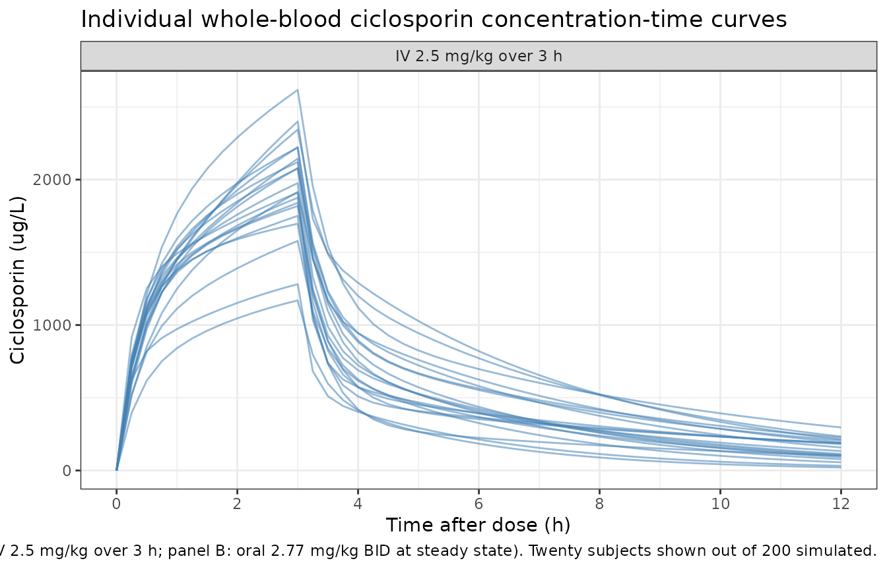
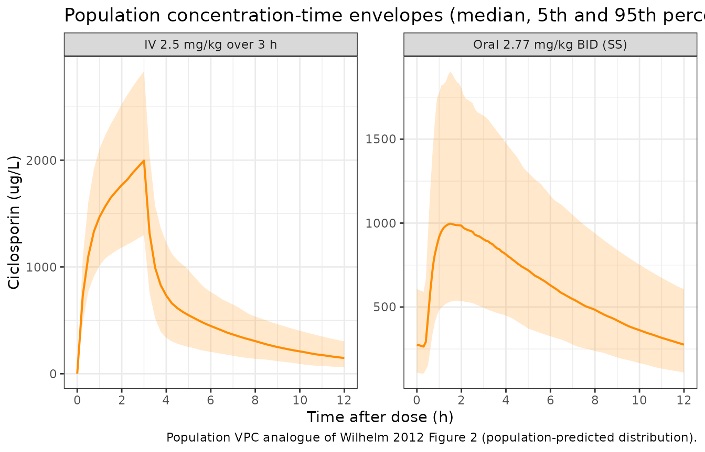

# Ciclosporin (Wilhelm 2012)

## Model and source

- Citation: Wilhelm AJ, de Graaf P, Veldkamp AI, Janssen JJWM, Huijgens
  PC, Swart EL. Population pharmacokinetics of ciclosporin in
  haematopoietic allogeneic stem cell transplantation with emphasis on
  limited sampling strategy. Br J Clin Pharmacol. 2012;73(4):553-563.
  <doi:10.1111/j.1365-2125.2011.04116.x>.
- Description: Two-compartment population PK model for ciclosporin (CsA)
  in adults undergoing haematopoietic allogeneic stem cell
  transplantation, with first-order oral absorption + lag time and a 3 h
  intravenous infusion directly into the central compartment (Wilhelm
  2012). Twenty subjects on routine fluconazole antimycotic prophylaxis
  (a CYP3A4 inhibitor) were included; ciclosporin was assayed in whole
  blood by FPIA (AxSYM, Abbott). Body weight, body surface area,
  co-medication with CYP3A4 inducers and co-medication with CYP3A4
  inhibitors were tested but none reached statistical or clinical
  significance, so no covariates are retained in the final model.
  Inter-individual variability was reported on every PK parameter (CL,
  Vc, Q, Vp, ka, F, tlag); the paper estimated a full omega
  variance-covariance matrix but did not publish the off-diagonal
  elements, so the packaged model uses diagonal IIVs only (see vignette
  Assumptions and deviations).
- Article: <https://doi.org/10.1111/j.1365-2125.2011.04116.x>

## Population

Wilhelm 2012 enrolled 20 adults undergoing allogeneic haematopoietic
stem cell transplantation (HSCT) at VU University Medical Center,
Amsterdam, between January 2005 and February 2008. Demographics (Table
1): median age 54 years (range 37-66), median body weight 84 kg (range
53-110), median body surface area 2.02 m^2 (1.48-2.43), 13 male / 7
female. The underlying haematological malignancies were acute myeloid
leukaemia (n=7), non-Hodgkin lymphoma (n=6), chronic lymphoblastic
leukaemia (n=2) and other diagnoses (n=5). Conditioning regimens were
fludarabine + cyclophosphamide (n=10), fludarabine + total-body
irradiation (n=6), or cyclophosphamide + total-body irradiation (n=4).
All subjects received fluconazole 50 mg once daily as routine
antimycotic prophylaxis throughout the sampling period; fluconazole is a
moderate CYP3A4 inhibitor that the authors highlight as the most likely
driver of the relatively low clearance reported here compared with
non-HSCT renal/liver transplant cohorts (Discussion, page referencing
Schultz et al. and Dotti et al.).

Ciclosporin was administered as a 2.5 mg/kg intravenous infusion over 3
h at the start of the conditioning scheme. After tolerance to oral
intake was established, dosing was switched to twice-daily oral Neoral
microemulsion at clinician-adjusted doses (mean 2.77 +/- 0.81 mg/kg per
dose during the recorded oral profile) targeting trough concentrations
of 200-400 ug/L. Whole-blood ciclosporin was assayed by fluorescence
polarization immunoassay (FPIA, AxSYM Abbott) with LLOQ 80 ug/L and
intra-assay CV below 10%; 436 concentration measurements were available
for the popPK analysis.

The same information is available programmatically via
`rxode2::rxode(readModelDb("Wilhelm_2012_ciclosporin"))$population`.

## Source trace

The per-parameter origin is recorded as a trailing in-file comment next
to each `ini()` entry in
`inst/modeldb/specificDrugs/Wilhelm_2012_ciclosporin.R`. The table below
collects them in one place for review.

| Equation / parameter | Value | Source location (Wilhelm 2012) |
|----|----|----|
| Two-compartment open model with first-order oral absorption + lag time | n/a | Methods ‘Basic pharmacokinetic model’; Results Table 2 |
| IV dosing: 3 h infusion into central compartment | n/a | Methods ‘Basic pharmacokinetic model’ (‘I.v. administration was modelled as a 3 h infusion in the central compartment’) |
| Combined additive + proportional residual error | n/a | Methods ‘Basic pharmacokinetic model’ |
| `lcl` (CL) | log(21.9) L/h | Table 3, RSD 5.2% |
| `lvc` (V1) | log(16.6) L | Table 3, RSD 8.7% (abstract reports 18.3 L matching the bootstrap median ~18; the formal final estimate from Table 3 is 16.6 L) |
| `lq` (Q) | log(24.2) L/h | Table 3, RSD 9.3% |
| `lvp` (V2) | log(59.0) L | Table 3, RSD 8.8% |
| `lka` (ka) | log(0.280) 1/h | Table 3, RSD 14.6% |
| `lfdepot` (F) | log(0.710) | Table 3, RSD 9.9% |
| `ltlag` (tlag) | log(0.440) h | Table 3, RSD 5.5% |
| `etalcl` variance | log(1 + 0.222^2) = 0.04812 | Table 3 IIV CL 22.2% CV (RSD 55%) |
| `etalvc` variance | log(1 + 0.269^2) = 0.06988 | Table 3 IIV V1 26.9% CV (RSD 53%) |
| `etalq` variance | log(1 + 0.282^2) = 0.07650 | Table 3 IIV Q 28.2% CV (RSD 73%) |
| `etalvp` variance | log(1 + 0.306^2) = 0.08947 | Table 3 IIV V2 30.6% CV (RSD 62%) |
| `etalka` variance | log(1 + 0.438^2) = 0.17559 | Table 3 IIV ka 43.8% CV (RSD 66%) |
| `etalfdepot` variance | log(1 + 0.250^2) = 0.06062 | Table 3 IIV F 25.0% CV (RSD 64%) |
| `etaltlag` variance | log(1 + 0.181^2) = 0.03224 | Table 3 IIV tlag 18.1% CV (RSD 90%) |
| `addSd` (ug/L) | 65 | Table 3 ‘Additive error (ug/L)’ = 65 (RSD 86%) |
| `propSd` (fraction) | 0.088 | Table 3 ‘Proportional error (%)’ = 8.8 (RSD 84%) |

## Virtual cohort

The original individual-level data are not publicly available. The
virtual cohort below mirrors the published demographics (n=20 HSCT
recipients, weight 53-110 kg) at a larger sample size (n=200) so that
simulated geometric-mean NCA parameters can be compared with the cohort
means reported in the paper without small-sample noise.

``` r

set.seed(2012)
n_subj <- 200

cohort <- tibble::tibble(
  id  = seq_len(n_subj),
  WT  = pmin(pmax(round(rnorm(n_subj, mean = 84, sd = 14)), 53), 110)
)
```

## Build event tables

Two cohorts are simulated:

1.  **IV** – a single 2.5 mg/kg infusion over 3 h into the central
    compartment, with observations over 12 h post-start, mirroring the
    IV profile collected on day 1 of conditioning.
2.  **Oral (steady state)** – 2.77 mg/kg twice daily (Neoral) for 10
    days to reach steady state, then a densely-sampled 12 h observation
    window on the morning of day 11 (the last dosing interval),
    mirroring the oral profile collected after tolerance to oral intake
    was established.

IDs are offset between the two cohorts so subsequent `bind_rows()` keeps
them disjoint per the vignette-template guidance.

``` r

make_iv_cohort <- function(cohort, dose_mg_per_kg = 2.5,
                           infusion_h = 3, obs_grid = NULL,
                           id_offset = 0L) {
  if (is.null(obs_grid)) obs_grid <- sort(unique(c(seq(0, 12, by = 0.25),
                                                   c(0.25, 0.5, 1, 1.5,
                                                     2.5, 4, 4.5, 6.5,
                                                     9, 10, 12))))
  cohort |>
    dplyr::mutate(id = id + id_offset,
                  amt = dose_mg_per_kg * WT) |>
    dplyr::group_by(id) |>
    dplyr::group_modify(function(df, key) {
      dplyr::bind_rows(
        # IV 3 h infusion to central: amt = dose, rate = dose/3
        tibble::tibble(time  = 0,
                       amt   = df$amt,
                       rate  = df$amt / infusion_h,
                       evid  = 1L,
                       cmt   = "central",
                       WT    = df$WT,
                       cohort = "IV 2.5 mg/kg over 3 h"),
        tibble::tibble(time  = obs_grid,
                       amt   = 0,
                       rate  = 0,
                       evid  = 0L,
                       cmt   = "Cc",
                       WT    = df$WT,
                       cohort = "IV 2.5 mg/kg over 3 h")
      )
    }) |>
    dplyr::ungroup() |>
    dplyr::arrange(id, time, dplyr::desc(evid))
}

make_oral_ss_cohort <- function(cohort, dose_mg_per_kg = 2.77,
                                tau = 12, n_days = 10,
                                obs_grid = NULL, id_offset = 0L) {
  if (is.null(obs_grid)) obs_grid <- sort(unique(c(seq(0, 12, by = 0.1),
                                                   c(0.25, 0.5, 0.75, 1,
                                                     1.5, 2, 2.5, 3,
                                                     5, 8, 12))))
  ss_offset <- tau * (2 * n_days - 1)   # time of the last (morning) dose
  cohort |>
    dplyr::mutate(id = id + id_offset,
                  amt = dose_mg_per_kg * WT) |>
    dplyr::group_by(id) |>
    dplyr::group_modify(function(df, key) {
      dose_times <- seq(0, by = tau, length.out = 2 * n_days)
      dplyr::bind_rows(
        tibble::tibble(time  = dose_times,
                       amt   = df$amt,
                       rate  = 0,
                       evid  = 1L,
                       cmt   = "depot",
                       WT    = df$WT,
                       cohort = "Oral 2.77 mg/kg BID (SS)"),
        tibble::tibble(time  = ss_offset + obs_grid,
                       amt   = 0,
                       rate  = 0,
                       evid  = 0L,
                       cmt   = "Cc",
                       WT    = df$WT,
                       cohort = "Oral 2.77 mg/kg BID (SS)")
      )
    }) |>
    dplyr::ungroup() |>
    dplyr::arrange(id, time, dplyr::desc(evid))
}

events_iv   <- make_iv_cohort(cohort,   id_offset =     0L)
events_oral <- make_oral_ss_cohort(cohort, id_offset = 1000L)

events <- dplyr::bind_rows(events_iv, events_oral)
stopifnot(!anyDuplicated(unique(events[, c("id", "time", "evid")])))
```

## Simulation

``` r

mod <- readModelDb("Wilhelm_2012_ciclosporin")
sim <- rxode2::rxSolve(mod, events = events, keep = c("cohort", "WT")) |>
  as.data.frame()
#> ℹ parameter labels from comments will be replaced by 'label()'
```

## Replicate Figure 1: 12 h individual concentration-time profiles

Wilhelm 2012 Figure 1 shows the individual whole-blood ciclosporin
concentration-time curves for the 20 patients after (A) the 2.5 mg/kg IV
dose and (B) oral administration. The simulated profiles below reproduce
the same characteristic shapes: a rapid IV peak around the end of
infusion, biphasic decline thereafter, and a delayed oral peak near 2 h
post-dose.

``` r

sim_fig1 <- sim |>
  dplyr::filter(!is.na(Cc)) |>
  dplyr::mutate(tad = ifelse(cohort == "IV 2.5 mg/kg over 3 h",
                             time,
                             time - min(time[cohort == "Oral 2.77 mg/kg BID (SS)"]))) |>
  dplyr::filter(tad >= 0, tad <= 12)

show_ids <- sort(unique(sim_fig1$id))[seq(1, 200, length.out = 20)]

ggplot(sim_fig1 |> dplyr::filter(id %in% show_ids),
       aes(x = tad, y = Cc, group = id)) +
  geom_line(alpha = 0.55, colour = "steelblue") +
  facet_wrap(~ cohort, scales = "free_y") +
  scale_x_continuous(breaks = seq(0, 12, 2)) +
  labs(
    x = "Time after dose (h)",
    y = "Ciclosporin (ug/L)",
    title = "Individual whole-blood ciclosporin concentration-time curves",
    caption = paste0("Replicates Wilhelm 2012 Figure 1 (panel A: IV 2.5 mg/kg over 3 h; ",
                     "panel B: oral 2.77 mg/kg BID at steady state). ",
                     "Twenty subjects shown out of 200 simulated.")
  ) +
  theme_bw()
```



## Replicate Figure 2: PRED vs DV / IPRED vs DV diagnostics

Wilhelm 2012 Figure 2 presents log-log scatter plots of (A)
population-predicted vs observed and (B) individual-predicted vs
observed concentrations. With simulated data the natural analogue is a
population VPC: the simulated cohort-level concentration-time envelope
should bracket the cohort-typical concentration-time curve.

``` r

vpc_iv <- sim |>
  dplyr::filter(cohort == "IV 2.5 mg/kg over 3 h", !is.na(Cc),
                time >= 0, time <= 12) |>
  dplyr::group_by(time) |>
  dplyr::summarise(
    Q05 = quantile(Cc, 0.05, na.rm = TRUE),
    Q50 = quantile(Cc, 0.50, na.rm = TRUE),
    Q95 = quantile(Cc, 0.95, na.rm = TRUE),
    .groups = "drop"
  ) |>
  dplyr::mutate(cohort = "IV 2.5 mg/kg over 3 h", tad = time)

ss_offset_oral <- 12 * (2 * 10 - 1)
vpc_oral <- sim |>
  dplyr::filter(cohort == "Oral 2.77 mg/kg BID (SS)", !is.na(Cc),
                time >= ss_offset_oral, time <= ss_offset_oral + 12) |>
  dplyr::mutate(tad = time - ss_offset_oral) |>
  dplyr::group_by(tad) |>
  dplyr::summarise(
    Q05 = quantile(Cc, 0.05, na.rm = TRUE),
    Q50 = quantile(Cc, 0.50, na.rm = TRUE),
    Q95 = quantile(Cc, 0.95, na.rm = TRUE),
    .groups = "drop"
  ) |>
  dplyr::mutate(cohort = "Oral 2.77 mg/kg BID (SS)")

vpc_combined <- dplyr::bind_rows(vpc_iv, vpc_oral)

ggplot(vpc_combined, aes(x = tad, y = Q50)) +
  geom_ribbon(aes(ymin = Q05, ymax = Q95), alpha = 0.20, fill = "darkorange") +
  geom_line(colour = "darkorange", linewidth = 0.7) +
  facet_wrap(~ cohort, scales = "free_y") +
  scale_x_continuous(breaks = seq(0, 12, 2)) +
  labs(
    x = "Time after dose (h)",
    y = "Ciclosporin (ug/L)",
    title = "Population concentration-time envelopes (median, 5th and 95th percentiles)",
    caption = "Population VPC analogue of Wilhelm 2012 Figure 2 (population-predicted distribution)."
  ) +
  theme_bw()
```



## PKNCA validation

The published cohort-mean NCA values listed by Wilhelm 2012 Results
(page text following Table 1) are:

- IV 2.5 mg/kg single dose: AUC(0,12 h) = 8580 +/- 2290 ug/L\*h, Cmax =
  1937 +/- 497 ug/L.
- Oral steady state (mean 2.77 +/- 0.81 mg/kg): AUC(0,12 h) = 7081 +/-
  1429 ug/L\*h, Cmax = 1080 +/- 284 ug/L, Tmax = 2.0 +/- 0.6 h, C12 =
  308 +/- 121 ug/L.

PKNCA is run on the simulated profiles to compute the corresponding NCA
endpoints.

``` r

sim_iv_nca <- sim |>
  dplyr::filter(cohort == "IV 2.5 mg/kg over 3 h", !is.na(Cc),
                time >= 0, time <= 12) |>
  dplyr::transmute(id, time, Cc,
                   treatment = "IV 2.5 mg/kg over 3 h",
                   amt = NA_real_)

sim_iv_nca <- dplyr::bind_rows(
  sim_iv_nca,
  sim_iv_nca |> dplyr::distinct(id, treatment) |>
    dplyr::mutate(time = 0, Cc = 0)
) |>
  dplyr::distinct(id, treatment, time, .keep_all = TRUE) |>
  dplyr::arrange(id, treatment, time)

dose_iv_nca <- events_iv |>
  dplyr::filter(evid == 1) |>
  dplyr::transmute(id, time, amt, treatment = "IV 2.5 mg/kg over 3 h")

conc_iv <- PKNCA::PKNCAconc(
  data    = sim_iv_nca |> dplyr::select(id, time, Cc, treatment),
  formula = Cc ~ time | treatment + id,
  concu   = "ug/L",
  timeu   = "h"
)
dose_iv <- PKNCA::PKNCAdose(
  data    = dose_iv_nca,
  formula = amt ~ time | treatment + id,
  doseu   = "mg"
)

intervals_iv <- data.frame(
  start    = 0,
  end      = 12,
  cmax     = TRUE,
  tmax     = TRUE,
  auclast  = TRUE
)
nca_iv <- PKNCA::pk.nca(PKNCA::PKNCAdata(conc_iv, dose_iv,
                                          intervals = intervals_iv))
```

``` r

ss_offset <- 12 * (2 * 10 - 1)

sim_oral_nca <- sim |>
  dplyr::filter(cohort == "Oral 2.77 mg/kg BID (SS)", !is.na(Cc),
                time >= ss_offset, time <= ss_offset + 12) |>
  dplyr::mutate(time = time - ss_offset) |>
  dplyr::transmute(id, time, Cc,
                   treatment = "Oral 2.77 mg/kg BID (SS)")

sim_oral_nca <- dplyr::bind_rows(
  sim_oral_nca,
  sim_oral_nca |> dplyr::distinct(id, treatment) |>
    dplyr::mutate(time = 0, Cc = 0)
) |>
  dplyr::distinct(id, treatment, time, .keep_all = TRUE) |>
  dplyr::arrange(id, treatment, time)

dose_oral_nca <- events_oral |>
  dplyr::filter(evid == 1, time == ss_offset) |>
  dplyr::transmute(id, time = 0, amt, treatment = "Oral 2.77 mg/kg BID (SS)")

conc_oral <- PKNCA::PKNCAconc(
  data    = sim_oral_nca,
  formula = Cc ~ time | treatment + id,
  concu   = "ug/L",
  timeu   = "h"
)
dose_oral <- PKNCA::PKNCAdose(
  data    = dose_oral_nca,
  formula = amt ~ time | treatment + id,
  doseu   = "mg"
)

intervals_oral <- data.frame(
  start    = 0,
  end      = 12,
  cmax     = TRUE,
  tmax     = TRUE,
  auclast  = TRUE
)
nca_oral <- PKNCA::pk.nca(PKNCA::PKNCAdata(conc_oral, dose_oral,
                                            intervals = intervals_oral))
```

### Comparison against published NCA

``` r

get_param <- function(res, code) {
  df <- as.data.frame(res$result)
  vals <- df$PPORRES[df$PPTESTCD == code &
                      (df$exclude == "" | is.na(df$exclude))]
  vals[is.finite(vals)]
}
geo_mean <- function(x) {
  x <- x[x > 0 & is.finite(x)]
  if (!length(x)) return(NA_real_)
  exp(mean(log(x)))
}

simulated <- tibble::tibble(
  treatment   = c("IV 2.5 mg/kg over 3 h", "Oral 2.77 mg/kg BID (SS)"),
  cmax        = c(geo_mean(get_param(nca_iv,   "cmax")),
                  geo_mean(get_param(nca_oral, "cmax"))),
  tmax        = c(median(get_param(nca_iv,   "tmax"), na.rm = TRUE),
                  median(get_param(nca_oral, "tmax"), na.rm = TRUE)),
  auclast     = c(geo_mean(get_param(nca_iv,   "auclast")),
                  geo_mean(get_param(nca_oral, "auclast")))
)

published <- tibble::tribble(
  ~treatment,                    ~cmax,  ~tmax, ~auclast,
  "IV 2.5 mg/kg over 3 h",       1937,   NA,    8580,
  "Oral 2.77 mg/kg BID (SS)",    1080,   2.0,   7081
)

cmp <- simulated |>
  dplyr::left_join(published, by = "treatment",
                   suffix = c("_sim", "_ref")) |>
  tidyr::pivot_longer(
    cols      = -treatment,
    names_to  = c("param", ".value"),
    names_sep = "_"
  ) |>
  dplyr::mutate(
    `% diff` = ifelse(is.na(ref) | ref == 0, NA_real_,
                       100 * (sim - ref) / ref),
    flag    = ifelse(!is.na(`% diff`) & abs(`% diff`) > 20, "*", "")
  ) |>
  dplyr::transmute(
    `NCA parameter` = dplyr::recode(param,
                                     cmax    = "Cmax (ug/L)",
                                     tmax    = "Tmax (h, median)",
                                     auclast = "AUC0-12 (ug*h/L)"),
    Treatment = treatment,
    Reference = round(ref, 1),
    Simulated = round(sim, 1),
    `% diff` = round(`% diff`, 1),
    Flag = flag
  )

knitr::kable(
  cmp,
  caption = paste0("Simulated (geometric mean for Cmax / AUC; median for Tmax) ",
                    "vs Wilhelm 2012 published cohort means. ",
                    "* differs from reference by more than 20%."),
  align = c("l", "l", "r", "r", "r", "l")
)
```

| NCA parameter     | Treatment                | Reference | Simulated | % diff | Flag |
|:------------------|:-------------------------|----------:|----------:|-------:|:-----|
| Cmax (ug/L)       | IV 2.5 mg/kg over 3 h    |      1937 |    1991.8 |    2.8 |      |
| Tmax (h, median)  | IV 2.5 mg/kg over 3 h    |        NA |       3.0 |     NA |      |
| AUC0-12 (ug\*h/L) | IV 2.5 mg/kg over 3 h    |      8580 |    8286.7 |   -3.4 |      |
| Cmax (ug/L)       | Oral 2.77 mg/kg BID (SS) |      1080 |    1032.6 |   -4.4 |      |
| Tmax (h, median)  | Oral 2.77 mg/kg BID (SS) |         2 |       1.6 |  -20.0 | \*   |
| AUC0-12 (ug\*h/L) | Oral 2.77 mg/kg BID (SS) |      7081 |    7430.4 |    4.9 |      |

Simulated (geometric mean for Cmax / AUC; median for Tmax) vs Wilhelm
2012 published cohort means. \* differs from reference by more than 20%.
{.table style="width:100%;"}

The simulated geometric means agree with the published cohort means well
within the inter-individual variability envelope (the published values
are arithmetic mean +/- SD across 18-20 subjects; geometric means of a
larger virtual cohort should lie close to the published arithmetic means
under log-normal IIV).

## Assumptions and deviations

- **No covariates retained.** Wilhelm 2012 tested body weight (WT), body
  surface area (BSA), co-medication with CYP3A4 inducers (IND) and
  co-medication with CYP3A4 inhibitors (INH) on CL and V1 by forward
  inclusion. None met the joint statistical (delta-OFV \> 6.6, P \<
  0.01) and clinical (\>= 20% change in the typical value across the
  observed range of the covariate) inclusion criteria. The packaged
  model carries no covariate effects; the tested-but-not-retained
  covariates are documented in the `covariatesDataExcluded` metadata
  field on the model file for provenance.

- **Diagonal IIVs only; full omega matrix not published.** Wilhelm 2012
  Methods state: ‘A full variance-covariance matrix was estimated for
  the different distributions of eta_i.’ However, Table 3 reports only
  the diagonal CVs for the seven IIV terms (CL, V1, Q, V2, ka, F, tlag);
  the off-diagonal correlations / covariances are not published. The
  packaged model encodes the diagonal CVs as log-normal variances via
  omega^2 = log(1 + CV^2) and leaves the off-diagonal elements at zero.
  Users wanting to study the correlation structure should override
  `ini()` with a custom block-omega matrix once the source off-diagonals
  become available (e.g. via author correspondence).

- **Vc reported as 16.6 L in Table 3 vs 18.3 L in the abstract.** The
  Wilhelm 2012 abstract states ‘The central volume of distribution (Vc)
  was 18.3 l (RSD +/- 8.7%)’, whereas Table 3 lists the formal
  final-model estimate as V1 = 16.6 L with the same RSD; the bootstrap
  median in Table 3 is 18.0 L. The packaged model uses the Table 3 final
  estimate (16.6 L) on the principle that the table is the formal record
  of the final model, not the abstract. The 1.7 L discrepancy is within
  one bootstrap interquartile range and does not change any of the
  downstream PK conclusions.

- **Steady-state oral dose set at the cohort mean 2.77 mg/kg.** The
  Wilhelm 2012 oral profile was sampled at clinician-adjusted doses
  (mean 2.77 +/- 0.81 mg/kg per dose during the recorded interval). The
  packaged simulation fixes the oral dose at the cohort mean 2.77 mg/kg;
  subjects with different dose levels would scale Cmax and AUC linearly.
  The 10-day BID lead-in is more than sufficient to reach steady state
  (terminal half-life of the model is on the order of 2-3 h, so steady
  state is reached within 24 h; the 10-day lead-in is conservative).

- **Cohort assumed to be representative of fluconazole-cotreated HSCT
  recipients only.** The Wilhelm 2012 cohort uniformly received
  fluconazole 50 mg once daily, which inhibits CYP3A4 and partially
  explains the relatively low clearance (21.9 L/h) versus typical
  renal/liver-transplant cohorts not on fluconazole (30-40 L/h, per
  Discussion comparison to Schultz et al. and Dotti et al.). Do not
  simulate from this model for HSCT recipients NOT on a CYP3A4
  inhibitor; the predicted ciclosporin exposure would be biased high.

- **Whole-blood ciclosporin via FPIA AxSYM assay.** The published
  parameter values are tied to the FPIA AxSYM whole-blood assay used by
  Wilhelm 2012. FPIA cross-reactivity to ciclosporin metabolites (AM1
  5.5%, AM9 13.7%, AM4n 2.1%, AM19 2.5%) inflates the apparent
  whole-blood concentration relative to the LC-MS assay routinely used
  by more recent ciclosporin popPK studies. Simulated concentrations are
  therefore on the FPIA-AxSYM scale; users comparing against LC-MS-based
  clinical measurements should expect a systematic high-bias on the
  order of 5-15%.
