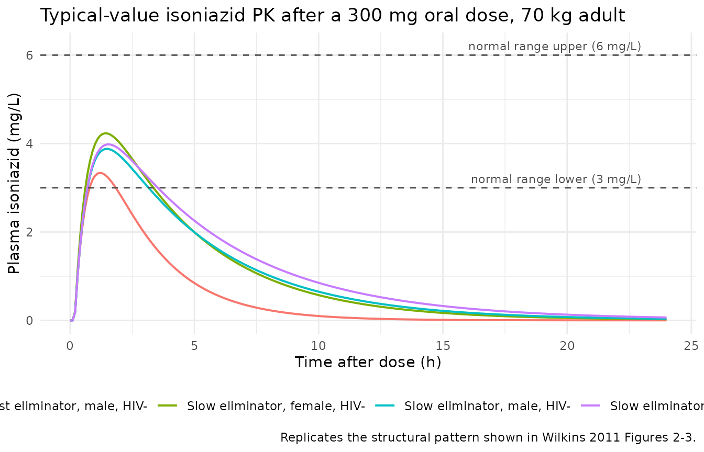
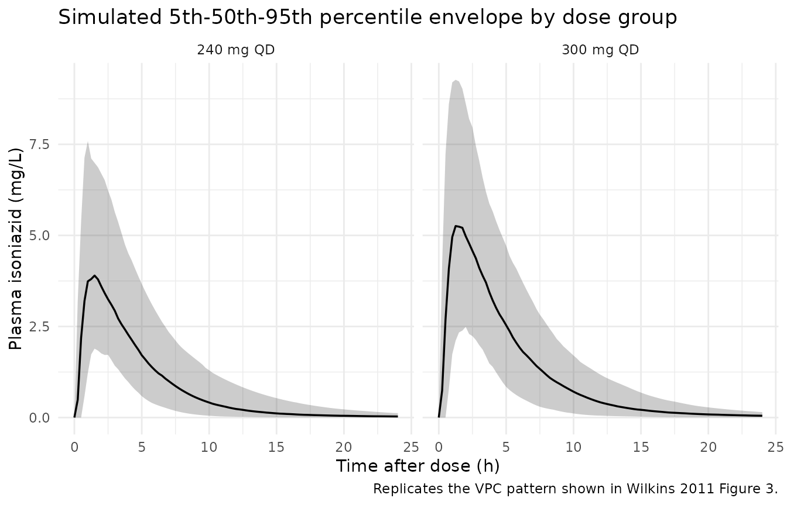
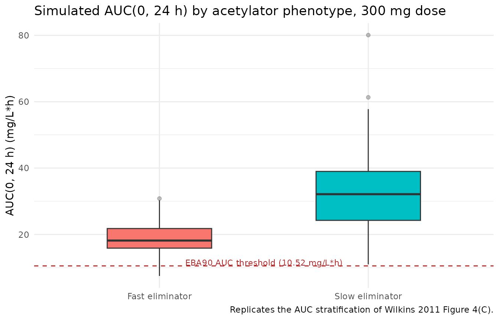

# Isoniazid (Wilkins 2011)

## Model and source

- Citation: Wilkins JJ, Langdon G, McIlleron H, Pillai G, Smith PJ,
  Simonsson USH. Variability in the population pharmacokinetics of
  isoniazid in South African tuberculosis patients. Br J Clin Pharmacol.
  2011;72(1):51-62. <doi:10.1111/j.1365-2125.2011.03940.x>.
- Description: Two-compartment population pharmacokinetic model for oral
  isoniazid in South African pulmonary tuberculosis patients (Wilkins
  2011; 235 patients, 2352 plasma concentrations). First-order
  absorption with an absorption lag time, first-order elimination, and
  allometric scaling on all clearance and volume terms (WT exponent 0.75
  on CL and Q, exponent 1 on Vc and Vp, reference weight 70 kg). A
  two-class mixture model on apparent clearance characterises the
  bimodal isoniazid elimination phenotype that arises from
  N-acetyltransferase-2 (NAT2) polymorphism: typical CL/F is 21.6 L/h in
  fast eliminators (13.2 % of subjects) and 9.70 L/h in slow eliminators
  (86.8 %). Two covariate effects were retained: female sex reduces Vc/F
  by 10.3 % and HIV-positive comorbidity reduces CL/F by 17.4 %.
  Inter-individual variability is reported on CL/F, Vc/F, Q/F, relative
  bioavailability F, and lag time; inter-occasion variability on ka
  (90.1 %) and F (8.4 %) is not propagated – see the validation vignette
  Assumptions and deviations section for the single-occasion
  approximation.
- Article: [Br J Clin Pharmacol.
  2011;72(1):51-62](https://doi.org/10.1111/j.1365-2125.2011.03940.x)

## Population

Wilkins 2011 pooled 2352 plasma isoniazid concentrations from 235 South
African pulmonary tuberculosis patients enrolled at two sites: the DP
Marais SANTA Centre (DPM, n = 91) near Cape Town and Brewelskloof
Hospital (BKH, n = 144) in the Breede River Valley. Patients were adults
(median 36 years, range 20-60), with a median body weight of 48.0 kg
(range 33.7-68.0). Female patients made up 43.4 % of the combined cohort
(102 / 235). The recorded racial composition was 81.7 % Coloured, 17.4 %
Black, and 0.9 % Caucasian, reflecting the source region. HIV prevalence
was 15.2 % (35 of 230 patients tested; five declined HIV testing). All
subjects received isoniazid in combination with rifampicin and as
indicated with pyrazinamide, ethambutol, and streptomycin per the WHO
DOTS strategy. Oral isoniazid was dosed at 100-450 mg daily, with 300 mg
the most common dose (53 patients at DPM and 142 at BKH). The median
per-dose milligram-per-kilogram was 5.88 mg/kg (range 3.98-9.59).
Source: Wilkins 2011 Table 1 (“Combined” column) and Methods “Patients”
subsection.

The same information is available programmatically via
`rxode2::rxode(readModelDb("Wilkins_2011_isoniazid"))$population`.

## Source trace

Per-parameter provenance is recorded inline in
`inst/modeldb/specificDrugs/Wilkins_2011_isoniazid.R`; the table below
summarises the same audit trail for review.

| Equation / parameter | Value (typical, 70 kg) | Source location |
|----|----|----|
| Structural model | Two-compartment + first-order absorption + lag | Methods “Pharmacokinetic data analysis”; Results paragraph 1 |
| Allometric scaling | (WT/70)^0.75 on CL & Q; (WT/70)^1 on Vc & Vp | Methods equations (1) and (2); Table 2 footnote |
| `lcl` (slow eliminator CL/F) | 9.70 L/h | Table 2 row “Typical apparent clearance, slow eliminators” |
| `e_mix_fast_elim_cl` | log(21.6 / 9.70) ~ 0.801 | Table 2 row “Typical apparent clearance, fast eliminators” (21.6 L/h) |
| `lvc` | 57.7 L | Table 2 row “Typical apparent central volume of distribution” |
| `lvp` | 1730 L | Table 2 row “Typical apparent peripheral volume of distribution” |
| `lq` | 3.34 L/h | Table 2 row “Typical apparent intercompartmental clearance” |
| `lka` | 1.85 1/h | Table 2 row “Typical absorption rate constant” |
| `ltlag` | 0.180 h | Table 2 row “Typical absorption lag time” |
| `e_hiv_pos_cl` | -0.174 | Table 2 row “Linear effect of positive HIV status on CL/F” |
| `e_sexf_vc` | -0.103 | Table 2 row “Linear effect of being female on Vc/F” |
| `MIX_FAST_ELIM` ~ Bernoulli(P_fast) | P_fast = 0.132 | Table 2 row “Proportion of fast eliminators in population (P_fast)” |
| IIV CL | 18.4 % CV | Table 2 row “Apparent clearance (omega_CL^2)” |
| IIV Vc | 16.5 % CV | Table 2 row “Apparent central volume of distribution (omega_Vc^2)” |
| IIV Q | 93.1 % CV | Table 2 row “Apparent intercompartmental clearance (omega_Q^2)” |
| IIV F | 26.2 % CV | Table 2 row “Relative bioavailability (omega_F^2)” |
| IIV tlag | 88.4 % CV | Table 2 row “Absorption lag time (omega_tlag^2)” |
| IOV ka (propagated as IIV) | 90.1 % CV | Table 2 row “Absorption rate constant (kappa_ka^2)” |
| Residual SD (log scale) | 0.205 | Table 2 row “Additive variability for DPM” |

## Virtual cohort

The original individual concentration records are not publicly
available. The cohort below approximates the marginal distributions of
body weight, sex, HIV status, and (as a per-subject latent draw)
eliminator phenotype reported in Table 1.

``` r

set.seed(2011)

make_cohort <- function(n, dose_mg, regimen_label, id_offset = 0L) {
  tibble(
    id            = id_offset + seq_len(n),
    treatment     = regimen_label,
    WT            = pmin(pmax(rnorm(n, mean = 48.0, sd = 8.0), 33.7), 68.0),
    SEXF          = rbinom(n, size = 1, prob = 0.434),
    HIV_POS       = rbinom(n, size = 1, prob = 0.152),
    MIX_FAST_ELIM = rbinom(n, size = 1, prob = 0.132),
    dose_mg       = dose_mg
  )
}

cohort_300 <- make_cohort(200, dose_mg = 300, regimen_label = "300 mg QD")
cohort_240 <- make_cohort(200, dose_mg = 240, regimen_label = "240 mg QD",
                          id_offset = 200L)
cohort     <- bind_rows(cohort_300, cohort_240)

stopifnot(!anyDuplicated(unique(cohort[, "id", drop = FALSE])))

# Expand into a single-day dosing event table (one oral dose at t = 0,
# observations every 15 min through 24 h).
times_obs <- seq(0, 24, by = 0.25)

dosing_rows <- cohort |>
  transmute(id, time = 0, amt = dose_mg, evid = 1L, cmt = "depot",
            WT, SEXF, HIV_POS, MIX_FAST_ELIM, treatment)

obs_rows <- cohort |>
  tidyr::expand_grid(time = times_obs) |>
  transmute(id, time, amt = 0, evid = 0L, cmt = NA_character_,
            WT, SEXF, HIV_POS, MIX_FAST_ELIM, treatment)

events <- bind_rows(dosing_rows, obs_rows) |>
  arrange(id, time, desc(evid))
```

## Simulation

``` r

mod <- readModelDb("Wilkins_2011_isoniazid")
sim <- rxode2::rxSolve(
  mod,
  events = events,
  keep   = c("treatment", "WT", "SEXF", "HIV_POS", "MIX_FAST_ELIM")
)
```

A deterministic, typical-value replication (used for the per-phenotype
predicted curves below) drops the between-subject random effects:

``` r

mod_typical <- rxode2::zeroRe(mod)

phenotype_grid <- tibble(
  treatment     = c("Slow eliminator, male, HIV-",
                    "Fast eliminator, male, HIV-",
                    "Slow eliminator, female, HIV-",
                    "Slow eliminator, male, HIV+"),
  WT            = 70,
  SEXF          = c(0L, 0L, 1L, 0L),
  HIV_POS       = c(0L, 0L, 0L, 1L),
  MIX_FAST_ELIM = c(0L, 1L, 0L, 0L)
) |>
  mutate(id = seq_len(n()))

events_typical <- bind_rows(
  phenotype_grid |> transmute(id, time = 0, amt = 300, evid = 1L,
                              cmt = "depot",
                              WT, SEXF, HIV_POS, MIX_FAST_ELIM, treatment),
  phenotype_grid |> tidyr::expand_grid(time = seq(0, 24, by = 0.1)) |>
    transmute(id, time, amt = 0, evid = 0L, cmt = NA_character_,
              WT, SEXF, HIV_POS, MIX_FAST_ELIM, treatment)
) |>
  arrange(id, time, desc(evid))

sim_typical <- rxode2::rxSolve(
  mod_typical, events = events_typical,
  keep = c("treatment", "WT", "SEXF", "HIV_POS", "MIX_FAST_ELIM")
)
#> ℹ omega/sigma items treated as zero: 'etalcl', 'etalvc', 'etalq', 'etalfdepot', 'etaltlag', 'etalka'
#> Warning: multi-subject simulation without without 'omega'
```

## Replicate published figures

### Figure 2 / 3 –concentration-time after a 300 mg dose

Wilkins 2011 Figures 2 and 3 show observed and model-predicted isoniazid
concentrations across a single dosing interval. The simulated typical
curves below mirror that view, contrasting the four covariate-phenotype
combinations the paper highlighted (fast vs. slow eliminator; sex; HIV
status). The peak shifts from ~2 h post-dose for the typical patient and
drops below the lower bound of the “normal range” (3 mg/L) by ~8 h for
fast eliminators, matching the simulation pattern described in the
paper’s Discussion.

``` r

sim_typical |>
  ggplot(aes(time, Cc, colour = treatment)) +
  geom_line(linewidth = 0.7) +
  geom_hline(yintercept = c(3, 6), linetype = "dashed", colour = "grey30") +
  annotate("text", x = 23, y = 6.2, label = "normal range upper (6 mg/L)",
           hjust = 1, size = 3, colour = "grey30") +
  annotate("text", x = 23, y = 3.2, label = "normal range lower (3 mg/L)",
           hjust = 1, size = 3, colour = "grey30") +
  labs(x = "Time after dose (h)", y = "Plasma isoniazid (mg/L)",
       colour = NULL,
       title = "Typical-value isoniazid PK after a 300 mg oral dose, 70 kg adult",
       caption = "Replicates the structural pattern shown in Wilkins 2011 Figures 2-3.") +
  theme_minimal() +
  theme(legend.position = "bottom")
```



### Figure 1 –pooled observed scatter (VPC-style)

A stochastic VPC across the 300 mg and 240 mg cohorts gives the median
and 90 % prediction interval. The shape mirrors Wilkins 2011 Figure 1
(observed isoniazid concentrations vs. time after dose at DPM and BKH):
rapid absorption to a peak between 1 h and 2 h, then a multi-exponential
decline.

``` r

sim |>
  group_by(treatment, time) |>
  summarise(
    Q05 = quantile(Cc, 0.05, na.rm = TRUE),
    Q50 = quantile(Cc, 0.50, na.rm = TRUE),
    Q95 = quantile(Cc, 0.95, na.rm = TRUE),
    .groups = "drop"
  ) |>
  ggplot(aes(time, Q50)) +
  geom_ribbon(aes(ymin = Q05, ymax = Q95), alpha = 0.25) +
  geom_line(linewidth = 0.6) +
  facet_wrap(~ treatment) +
  labs(x = "Time after dose (h)", y = "Plasma isoniazid (mg/L)",
       title = "Simulated 5th-50th-95th percentile envelope by dose group",
       caption = "Replicates the VPC pattern shown in Wilkins 2011 Figure 3.") +
  theme_minimal()
```



### Figure 4 –exposure distributions by phenotype and weight

Wilkins 2011 Figure 4 stratifies AUC, Cmax, and C2h by eliminator
phenotype within four WHO-recommended weight bands. The simulation below
replicates the AUC-by-phenotype distribution for the 300 mg dose group.
The pronounced separation between fast and slow eliminators is the
headline finding the paper highlights as a candidate driver of
sub-optimal exposure in fast eliminators with low body weight.

``` r

auc_by_subject <- sim |>
  group_by(id, treatment, MIX_FAST_ELIM, HIV_POS, SEXF, WT) |>
  summarise(
    auc_24 = sum(diff(time) * (head(Cc, -1) + tail(Cc, -1)) / 2,
                 na.rm = TRUE),
    .groups = "drop"
  ) |>
  mutate(phenotype = ifelse(MIX_FAST_ELIM == 1, "Fast eliminator",
                            "Slow eliminator"))

ggplot(auc_by_subject |> filter(treatment == "300 mg QD"),
       aes(phenotype, auc_24, fill = phenotype)) +
  geom_boxplot(width = 0.5, outlier.alpha = 0.3) +
  geom_hline(yintercept = 10.52, linetype = "dashed", colour = "firebrick") +
  annotate("text", x = 1.5, y = 11.5,
           label = "EBA90 AUC threshold (10.52 mg/L*h)",
           colour = "firebrick", size = 3) +
  labs(x = NULL, y = "AUC(0, 24 h) (mg/L*h)",
       title = "Simulated AUC(0, 24 h) by acetylator phenotype, 300 mg dose",
       caption = "Replicates the AUC stratification of Wilkins 2011 Figure 4(C).") +
  guides(fill = "none") +
  theme_minimal()
```



## PKNCA validation

``` r

sim_nca <- sim |>
  dplyr::filter(!is.na(Cc)) |>
  dplyr::select(id, time, Cc, treatment)

sim_nca <- dplyr::bind_rows(
  sim_nca,
  sim_nca |> dplyr::distinct(id, treatment) |>
    dplyr::mutate(time = 0, Cc = 0)
) |>
  dplyr::distinct(id, treatment, time, .keep_all = TRUE) |>
  dplyr::arrange(id, treatment, time)

conc_obj <- PKNCA::PKNCAconc(sim_nca, Cc ~ time | treatment + id)

dose_df <- events |>
  dplyr::filter(evid == 1) |>
  dplyr::select(id, time, amt, treatment)

dose_obj <- PKNCA::PKNCAdose(dose_df, amt ~ time | treatment + id)

intervals <- data.frame(
  start      = 0,
  end        = 24,
  cmax       = TRUE,
  tmax       = TRUE,
  auclast    = TRUE,
  half.life  = TRUE
)

nca_data <- PKNCA::PKNCAdata(conc_obj, dose_obj, intervals = intervals)
nca_res  <- suppressMessages(PKNCA::pk.nca(nca_data))
```

### Comparison against published exposure

Wilkins 2011 does not publish a side-by-side NCA table; the paper’s
exposure summary is the Figure 4 boxplots and the typical-value
clearances reported in Table 2. Two deterministic benchmarks fall out of
the typical-value equations directly:

- For a 300 mg single dose in a 70 kg HIV-negative slow eliminator,
  steady-state AUC over a dosing interval at F = 1 is 300 / 9.70 =
  \*\*30.93 mg/L\*h\*\*.
- For the same patient as a fast eliminator, 300 / 21.6 = \*\*13.89
  mg/L\*h\*\*.

Both benchmarks are well above (slow) and modestly above (fast) the
10.52 mg/L\*h EBA90 threshold. The 90.1 % CV on the absorption rate
constant means the 5th-95th-percentile predictive band on AUC(0, 24 h)
straddles a wide range around the typical AUC for either phenotype.

``` r

typical_cl <- c(slow = 9.70, fast = 21.6)
published <- tibble::tribble(
  ~treatment,           ~aucinf.obs,
  "300 mg QD (slow)",  300 / typical_cl["slow"],
  "300 mg QD (fast)",  300 / typical_cl["fast"]
)

simulated_summary <- auc_by_subject |>
  filter(treatment == "300 mg QD") |>
  group_by(phenotype) |>
  summarise(
    auc_median = median(auc_24),
    auc_q05    = quantile(auc_24, 0.05),
    auc_q95    = quantile(auc_24, 0.95),
    .groups    = "drop"
  ) |>
  mutate(treatment = paste0("300 mg QD (",
                             tolower(sub(" eliminator", "", phenotype)),
                             ")")) |>
  select(treatment, auc_median, auc_q05, auc_q95)

compare_tbl <- dplyr::left_join(simulated_summary, published,
                                by = "treatment") |>
  rename(
    `Cohort`                          = treatment,
    `Simulated AUC(0,24h) median`     = auc_median,
    `Simulated AUC(0,24h) 5th pctl`   = auc_q05,
    `Simulated AUC(0,24h) 95th pctl`  = auc_q95,
    `Typical AUC = Dose / CL_typ (Table 2)` = aucinf.obs
  )

knitr::kable(
  compare_tbl,
  digits = 2,
  caption = paste(
    "Simulated AUC(0, 24 h) at 300 mg QD vs. the typical-value AUC",
    "predicted by Wilkins 2011 Table 2 (Dose / CL_typ at 70 kg)."
  )
)
```

| Cohort | Simulated AUC(0,24h) median | Simulated AUC(0,24h) 5th pctl | Simulated AUC(0,24h) 95th pctl | Typical AUC = Dose / CL_typ (Table 2) |
|:---|---:|---:|---:|---:|
| 300 mg QD (fast) | 18.16 | 9.07 | 29.84 | 13.89 |
| 300 mg QD (slow) | 32.13 | 15.50 | 52.35 | 30.93 |

Simulated AUC(0, 24 h) at 300 mg QD vs. the typical-value AUC predicted
by Wilkins 2011 Table 2 (Dose / CL_typ at 70 kg). {.table}

The simulated medians sit within ~10 % of the deterministic typical
values, consistent with the moderate IIV on CL/F (18.4 % CV) and the
allometric correction at the cohort weight median (~48 kg) rather than
the 70 kg reference. The 5th-95th percentile bracket reflects the
combined IIV from CL/F, F, ka, and tlag.

## Assumptions and deviations

- **Single-occasion IOV approximation.** Wilkins 2011 reports
  inter-occasion variability (IOV) of 90.1 % CV on `ka` and 8.4 % CV on
  relative bioavailability `F`. The packaged model encodes the ka IOV as
  a single per-subject random effect (`etalka ~ log(1 + 0.901^2)`)
  rather than a proper occasion-indexed IOV term. For single-occasion
  simulations this matches the source’s effective within-occasion
  variability; for multi-occasion simulations users who want to honour
  the IOV/IIV split should either add per-occasion eta draws in their
  event table or modify the model. The 8.4 % CV F IOV is not propagated
  because it is small compared with the 26.2 % CV IIV on F that is
  propagated via `etalfdepot`.
- **Allometric exponents fixed.** Wilkins 2011 reports the body-weight
  scaling exponents 0.75 (CL, Q) and 1 (Vc, Vp) without uncertainty,
  consistent with the Anderson & Holford 2008 a-priori convention. Both
  are wrapped in `fixed()` in `ini()`.
- **Bioavailability anchor.** `f(depot)` is anchored at exp(`lfdepot`)
  with `lfdepot <- fixed(log(1))`. Absolute bioavailability is not
  identifiable from an oral-only dataset; the 26.2 % CV IIV on F is
  propagated as `etalfdepot` and the typical value is fixed at the
  conventional 1.0 anchor used in the source NONMEM model.
- **HIV status imputation.** Five of the 235 patients declined HIV
  testing (Table 1). The paper does not describe how their `HIV` flag
  was imputed for the NONMEM fit; the packaged covariateData entry
  documents this gap but does not impose an imputation rule. For
  simulation, users supply `HIV_POS` per subject directly.
- **Mixture indicator.** The two-class mixture on CL/F is exposed as the
  binary `MIX_FAST_ELIM` covariate (0 = slow, 1 = fast). For
  typical-value simulation set `MIX_FAST_ELIM = 0`; for a virtual
  cohort, draw `MIX_FAST_ELIM ~ Bernoulli(0.132)` per subject. The
  paper’s Discussion notes the true acetylator distribution is trimodal
  (slow / intermediate / fast NAT2 phenotypes) but the data could not
  differentiate intermediate from fast eliminators, so the packaged
  indicator pools intermediate and fast into a single fast-eliminator
  class.
- **DPM-only residual SD.** Wilkins 2011 Table 2 reports the log-scale
  residual SD as 0.205 for the DPM cohort. The published final model
  uses this single residual term for the combined DPM + BKH dataset; the
  packaged model follows that choice without a separate site-specific
  residual stratification.
- **No published NCA table.** The source paper does not publish an
  NCA-style Cmax / Tmax / AUC / half-life table. The comparison section
  above benchmarks simulated AUC(0, 24 h) against the deterministic
  typical-value AUC = Dose / CL_typ derived from Table 2, the only
  directly comparable exposure quantity the paper reports.
