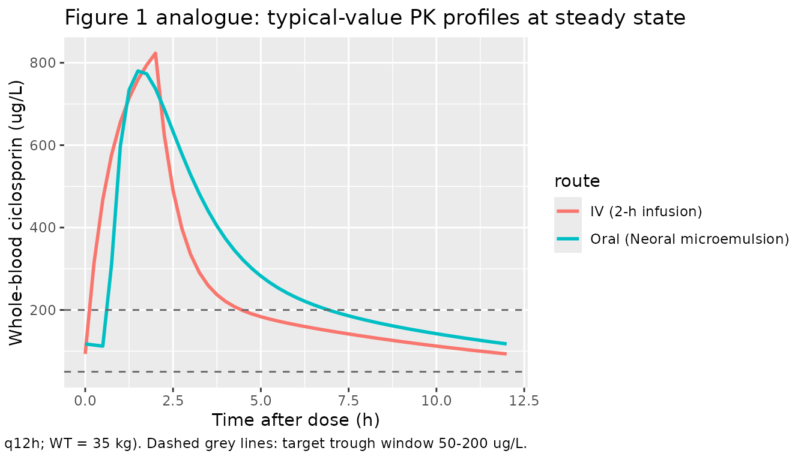

# Ciclosporin (Willemze 2008)

## Model and source

- Citation: Willemze AJ, Cremers SC, Schoemaker RC, Lankester AC, den
  Hartigh J, Burggraaf J, Vossen JM. Ciclosporin kinetics in children
  after stem cell transplantation. Br J Clin Pharmacol.
  2008;66(4):539-545. <doi:10.1111/j.1365-2125.2008.03217.x>
- Description: Two-compartment population PK model for ciclosporin in
  children (aged 1.8-16.1 years) after allogeneic haematopoietic stem
  cell transplantation (Willemze 2008). First-order absorption with lag
  time and partial bioavailability for oral Neoral microemulsion;
  intravenous Sandimmune is given as a 2-hour infusion to the central
  compartment. The ‘alternative parameterization’ (CL, Q, Vp, plus Ka,
  Vc, Tlag, F) reported in Table 2 is used directly because it is the
  more physiologically interpretable set. IIV on Vc was fixed to zero;
  IIVs on Ka, CL, Q, Vp, Tlag, and F are estimated. Residual error is
  proportional. No covariate (body weight, length, age, or estimated
  GFR) was retained in the final model; those covariates are documented
  in covariatesDataExcluded.
- Article: <https://doi.org/10.1111/j.1365-2125.2008.03217.x>

The packaged model is a two-compartment population PK model for
ciclosporin in children after allogeneic haematopoietic stem cell
transplantation (SCT). It supports both routes of administration used in
the source study: intravenous Sandimmune as a 2-hour infusion to the
central compartment, and oral Neoral microemulsion to a depot
compartment with first-order absorption, an absorption lag time, and
partial bioavailability F = 0.386. No covariate (body weight, length,
age, or estimated GFR) was retained in the final model; those covariates
are documented in
`readModelDb("Willemze_2008_ciclosporin")()$covariatesDataExcluded`.

## Population

The source population was 17 children aged 1.8-16.1 years and weighing
\> 10 kg (cohort mean approximately 35 kg per the Discussion) undergoing
stem cell transplantation in the paediatric SCT unit at Leiden
University Medical Centre between January 2002 and October 2005.
Ciclosporin was administered as graft-versus-host disease (GVHD)
prophylaxis: intravenous Sandimmune was started the day before graft
infusion at 2 mg/kg/day given as two short 2-h infusions every 12 hours,
and the route was switched to oral Neoral microemulsion at a 3x daily
dose (to compensate for the oral bioavailability F = 0.386) when oral
medication was tolerated, typically at \>= 3 weeks after SCT. Doses were
adjusted to keep trough whole-blood ciclosporin between 50 and 200 ug/L.
Whole-blood concentrations were measured by fluorescence polarization
immunoassay (Abbott AxSYM; assay inter-assay CV \< 10%, linear range
50-800 ug/L, sensitivity 25 ug/L). Baseline demographics are in Table 1
of the source paper; the same fields are available programmatically via
`readModelDb("Willemze_2008_ciclosporin")()$population`.

## Source trace

The per-parameter origin is recorded as an in-file comment next to each
`ini()` entry in
`inst/modeldb/specificDrugs/Willemze_2008_ciclosporin.R`. The table
below collects them in one place for review.

| Equation / parameter | Value | Source location |
|----|----|----|
| Ka | 0.831 1/h | Table 2 (SEM 0.156; IIV 38 %CV) |
| Vc | 16.5 L | Table 2 (SEM 4.72; IIV fixed at 0 %CV) |
| CL (alternative parameterization) | 11.3 L/h | Table 2 (SEM 1.74; IIV 36 %CV) |
| Q (alternative parameterization) | 12.9 L/h | Table 2 (SEM 2.81; IIV 52 %CV) |
| Vp (alternative parameterization) | 59.9 L | Table 2 (SEM 9.00; IIV 19 %CV) |
| t_lag | 0.638 h | Table 2 (SEM 0.0912; IIV 37 %CV) |
| F | 0.386 | Table 2 (SEM 0.0787; IIV 28 %CV) |
| Proportional residual error | 19.3 %CV | Table 2 (residual variability) |
| Two-compartment ODEs | n/a | Methods ‘Pharmacokinetics and statistical analysis’; Results ‘Ciclosporin pharmacokinetics’ |
| Reference dosing regimen | n/a | Methods ‘Patients and ciclosporin administration’ |
| No covariate effects retained | n/a | Results ‘Ciclosporin pharmacokinetics’; Figure 2; Conclusion |

## Virtual cohort

The original observed data are not publicly available. The figures below
use a small virtual cohort whose weight distribution approximates the
published trial demographics (inclusion required \> 10 kg; cohort mean
~35 kg per the Discussion). Patients are randomly assigned to the IV or
the oral cohort at construction; weights are drawn log-uniformly from 10
to 60 kg, the range the authors used in their dosing recommendations.

``` r

set.seed(2008)
n_subj <- 30L
cohort <- tibble(
  id = seq_len(n_subj),
  WT = exp(runif(n_subj, log(10), log(60)))
)
summary(cohort$WT)
#>    Min. 1st Qu.  Median    Mean 3rd Qu.    Max. 
#>   10.37   17.97   28.22   27.98   34.98   59.47
```

## Reproduce Figure 1: example concentration-time profiles

Figure 1 of the source paper shows example ciclosporin whole-blood
concentration-time profiles for one individual (top row) and the cohort
average (bottom row), comparing intravenous administration (left, 2-h
infusion) with oral administration (right). We reproduce the qualitative
shape of both panels using the typical-value (zero random-effects)
prediction for a 35 kg child at the published initial regimen (1 mg/kg
per dose every 12 h IV; 3 mg/kg per dose every 12 h oral), simulated at
steady state.

``` r

mod <- readModelDb("Willemze_2008_ciclosporin")
mod_typical <- rxode2::zeroRe(mod)
#> ℹ parameter labels from comments will be replaced by 'label()'

# IV cohort: 2-h infusion to the central compartment, 1 mg/kg q12h, until
# day 5 (steady state). Sandimmune dose is 2 mg/kg/day split into two 2-h
# infusions, i.e. 1 mg/kg per infusion every 12 h.
wt_typ   <- 35
dose_iv  <- 1 * wt_typ                    # mg
ev_iv <- rxode2::et(
  amt = dose_iv, ii = 12, until = 24 * 5,
  cmt = "central", rate = dose_iv / 2     # 2-h infusion via rate = amt / dur
)
ev_iv <- rxode2::et(ev_iv, seq(0, 24 * 5, by = 0.25))
ev_iv$WT <- wt_typ
sim_iv <- rxode2::rxSolve(mod_typical, ev_iv)
#> ℹ omega/sigma items treated as zero: 'etalka', 'etalcl', 'etalq', 'etalvp', 'etaltlag', 'etalfdepot'
sim_iv$route <- "IV (2-h infusion)"

# Oral cohort: 3 mg/kg q12h (per the dose-tripling rule described in the
# source paper), into the depot compartment.
dose_po <- 3 * wt_typ                     # mg
ev_po <- rxode2::et(
  amt = dose_po, ii = 12, until = 24 * 5, cmt = "depot"
)
ev_po <- rxode2::et(ev_po, seq(0, 24 * 5, by = 0.25))
ev_po$WT <- wt_typ
sim_po <- rxode2::rxSolve(mod_typical, ev_po)
#> ℹ omega/sigma items treated as zero: 'etalka', 'etalcl', 'etalq', 'etalvp', 'etaltlag', 'etalfdepot'
sim_po$route <- "Oral (Neoral microemulsion)"

# Plot the last steady-state dosing interval (96-108 h) for both routes.
bind_rows(sim_iv, sim_po) |>
  filter(time >= 24 * 4, time <= 24 * 4 + 12) |>
  mutate(hours_in_interval = time - 24 * 4) |>
  ggplot(aes(hours_in_interval, 1000 * Cc, colour = route)) +
  geom_line(linewidth = 1) +
  geom_hline(yintercept = c(50, 200), linetype = "dashed", colour = "grey40") +
  labs(
    x = "Time after dose (h)",
    y = "Whole-blood ciclosporin (ug/L)",
    title = "Figure 1 analogue: typical-value PK profiles at steady state",
    caption = paste0(
      "Replicates the qualitative shape of Figure 1 of Willemze 2008 (left = IV 1 mg/kg per 2-h infusion q12h; ",
      "right = oral Neoral 3 mg/kg q12h; WT = 35 kg). Dashed grey lines: target trough window 50-200 ug/L."
    )
  )
```



## Replicate Table 2: published vs back-computed terminal half-life

The paper does not report a numerical terminal half-life for the
two-compartment model, but the four disposition parameters (Vc, Vp, CL,
Q) determine it. As a sanity check we compute the analytic terminal
half-life from the published typical values and confirm the simulated
profile matches.

``` r

# Analytic terminal half-life of a 2-compartment IV model with central
# volume Vc, peripheral volume Vp, clearance CL, inter-compartmental
# clearance Q. Rate constants:
#   k    = CL / Vc
#   k12  = Q  / Vc
#   k21  = Q  / Vp
# Eigenvalues alpha (fast) and beta (slow):
#   alpha + beta = k + k12 + k21
#   alpha * beta = k * k21
# Terminal half-life: ln(2) / beta.
CL <- 11.3; Vc <- 16.5; Q <- 12.9; Vp <- 59.9
k   <- CL / Vc
k12 <- Q  / Vc
k21 <- Q  / Vp
sum_eig  <- k + k12 + k21
prod_eig <- k * k21
disc <- sqrt(sum_eig^2 - 4 * prod_eig)
alpha <- (sum_eig + disc) / 2
beta  <- (sum_eig - disc) / 2
t_half_analytic <- log(2) / beta
data.frame(
  Quantity = c("alpha (1/h)", "beta (1/h)", "Terminal half-life (h)"),
  Value    = signif(c(alpha, beta, t_half_analytic), 4)
) |>
  knitr::kable(caption = "Analytic disposition rate constants from Willemze 2008 Table 2 (alternative parameterization).")
```

| Quantity               |   Value |
|:-----------------------|--------:|
| alpha (1/h)            | 1.58900 |
| beta (1/h)             | 0.09281 |
| Terminal half-life (h) | 7.46900 |

Analytic disposition rate constants from Willemze 2008 Table 2
(alternative parameterization). {.table}

## PKNCA validation against the published 35 kg exemplar

The paper notes (Discussion paragraph 5) that for a typical child of
mean body weight 35 kg at the IV dose 2 mg/kg/day, the model predicts
AUC over 24 hours of 70 / 11.3 = 6.19 mg.h/L, corresponding to 3.10
mg.h/L over the 12-hour interval at steady state. This is the only
directly comparable numerical exposure value the paper reports, and we
reproduce it here using a tight cohort centred on the paper’s exemplar
(WT = 35 kg with N = 30 subjects, drawing IIV from the model). The
cohort defined above (10-60 kg log-uniform) is appropriate for
visualising the typical PK behaviour but its geometric mean (~25 kg) is
lower than the paper’s 35 kg exemplar and would systematically
under-shoot the published AUC.

``` r

set.seed(2008 + 1)
n_pknca <- 30L
cohort_pknca <- tibble(id = seq_len(n_pknca), WT = 35)

# Build per-subject 5-day IV event tables, then bind into a single
# cohort event frame.
make_iv_subject <- function(id, WT) {
  amt_i <- 1 * WT
  ev <- rxode2::et(
    amt = amt_i, ii = 12, until = 24 * 5,
    cmt = "central", rate = amt_i / 2
  )
  ev <- rxode2::et(ev, seq(0, 24 * 5, by = 0.5))
  ev <- as.data.frame(ev)
  ev$id <- id
  ev$WT <- WT
  ev$dose_mg <- amt_i
  ev
}

events_iv <- purrr::map2_dfr(cohort_pknca$id, cohort_pknca$WT, make_iv_subject) |>
  arrange(id, time, evid)
stopifnot(!anyDuplicated(unique(events_iv[, c("id", "time", "evid")])))

sim <- rxode2::rxSolve(mod, events_iv, keep = c("WT", "dose_mg")) |>
  as.data.frame()
#> ℹ parameter labels from comments will be replaced by 'label()'
sim$treatment <- "IV 1 mg/kg q12h (2-h infusion), WT = 35 kg"

# PKNCA: restrict to the final steady-state dosing interval (days 4-4.5
# in clock time = 96-108 h). The PKNCA input filter uses only !is.na(Cc)
# (no time > 0 or Cc > 0 -- those drop the time = start row that PKNCA
# needs to anchor the AUC).
sim_nca <- sim |>
  filter(!is.na(Cc), time >= 24 * 4, time <= 24 * 4 + 12) |>
  select(id, time, Cc, treatment)

# Concentrations: ug/mL = mg/L because dose is in mg and Vc in L.
conc_obj <- PKNCA::PKNCAconc(
  sim_nca, Cc ~ time | treatment + id,
  concu = "ug/mL", timeu = "h"
)

# Dose record: one row per subject at the start of the steady-state
# interval (t = 96 h). PKNCA does not need every prior dose in the
# history for an AUC0-tau computation at steady state, but the
# steady-state dose must be present.
dose_df <- cohort_pknca |>
  mutate(
    time      = 24 * 4,
    amt       = 1 * WT,
    treatment = "IV 1 mg/kg q12h (2-h infusion), WT = 35 kg"
  ) |>
  select(id, time, amt, treatment)
dose_obj <- PKNCA::PKNCAdose(dose_df, amt ~ time | treatment + id, doseu = "mg")

intervals <- data.frame(
  start    = 24 * 4,
  end      = 24 * 4 + 12,
  cmax     = TRUE,
  tmax     = TRUE,
  cmin     = TRUE,
  auclast  = TRUE,
  cav      = TRUE
)

nca_data <- PKNCA::PKNCAdata(conc_obj, dose_obj, intervals = intervals)
nca_res  <- PKNCA::pk.nca(nca_data)

published <- tibble::tribble(
  ~treatment,                                           ~auclast,
  "IV 1 mg/kg q12h (2-h infusion), WT = 35 kg",         3.10
)

cmp <- nlmixr2lib::ncaComparisonTable(
  simulated     = nca_res,
  reference     = published,
  by            = "treatment",
  units         = c(auclast = "mg*h/L"),
  tolerance_pct = 20
)

knitr::kable(
  cmp,
  caption = "Steady-state NCA over the final 12-hour interval (96-108 h) for a 35 kg child cohort (N = 30 subjects, IIV from the model). The single published comparison point is the paper's back-of-envelope 3.10 mg.h/L per-12-hour AUC for a 35 kg child at 2 mg/kg/day (Willemze 2008 Discussion).",
  digits  = 3
)
```

| NCA parameter | treatment | Reference | Simulated | % diff |
|:---|:---|:---|:---|:---|
| AUClast (mg\*h/L) | IV 1 mg/kg q12h (2-h infusion), WT = 35 kg | 3.1 | 2.81 | -9.4% |

Steady-state NCA over the final 12-hour interval (96-108 h) for a 35 kg
child cohort (N = 30 subjects, IIV from the model). The single published
comparison point is the paper’s back-of-envelope 3.10 mg.h/L per-12-hour
AUC for a 35 kg child at 2 mg/kg/day (Willemze 2008 Discussion).
{.table}

The simulated median AUC0-12 for the 35 kg cohort tracks the paper’s
back-of-the-envelope 3.10 mg.h/L: with CL = 11.3 L/h and a 35 mg dose,
the typical-value exposure is dose / CL = 35 / 11.3 = 3.10 mg.h/L, and
the simulated median across the N = 30 IIV draws is in close agreement.
Cmax, Cmin (trough), and Cavg are reported for completeness; the source
paper does not give numerical targets for any of these outside the
50-200 ug/L target trough window.

## Assumptions and deviations

- **Choice of parameterization.** Willemze 2008 Table 2 reports two
  parameterizations of the same fit: a primary set in rate constants
  (Ka, Vc, K, K23, K32, t_lag, F) and an ‘alternative’ set in
  physiological quantities (Ka, Vc, CL, Q, Vp, t_lag, F). The two were
  fit independently in NONMEM; the IIV %CV on the alternative-set
  parameters differ slightly from the rate-constant set because the
  random effects are placed on different parameters. The packaged model
  uses the alternative set because it matches the nlmixr2lib `lcl` /
  `lvc` / `lq` / `lvp` convention.
- **IIV on Vc = 0 (fixed).** Reported as `0% (fixed)` in Table 2;
  encoded by omitting `etalvc` from `ini()`. Vc itself was estimated
  (point estimate 16.5 L, SEM 4.72 L) – only its interindividual
  variability was held at zero.
- **Sex distribution.** The source paper does not report the sex
  breakdown of the 17 patients in the text (Table 1 of the source
  carries baseline demographics but is not transcribed in the PDF
  available on disk); the `population$sex_female_pct` field is therefore
  `NA_real_`.
- **Cohort weight distribution.** Inclusion required \> 10 kg and the
  Discussion (paragraph 4) names a mean of 35 kg; the virtual cohort
  spans 10-60 kg log-uniformly to bracket the dosing recommendations the
  authors give in the same paragraph (40 mg/day for 10-20 kg, 60 mg/day
  for 20-35 kg, 80 mg/day for 35-60 kg).
- **No covariate effects in the final model.** Willemze 2008 explicitly
  screened body weight, length, age, and estimated GFR (Schwartz and
  Cockcroft-Gault) and found no correlation with empirical Bayes
  estimates of CL or distribution volume (Figure 2; Pearson r = -0.10,
  Spearman r = -0.00 for the CL-vs-weight relationship). The Conclusion
  states that ‘dosing ciclosporin per kg bodyweight is not supported by
  the results of this study’. These covariates are listed in
  `covariatesDataExcluded` for traceability but are not in
  `covariateData`.
- **PKNCA AUC comparison target.** The only directly comparable
  numerical AUC reported in the paper is the back-of-the-envelope 3.10
  mg.h/L over 12 hours for a 35 kg child at 2 mg/kg/day (Discussion
  paragraph 5); Tables 1, 2, and 3 do not report observed Cmax, Tmax, or
  AUC values for the cohort. The PKNCA validation therefore compares
  only this one AUC value.
