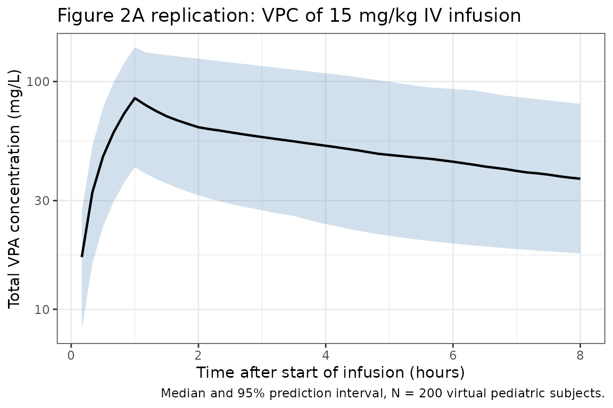
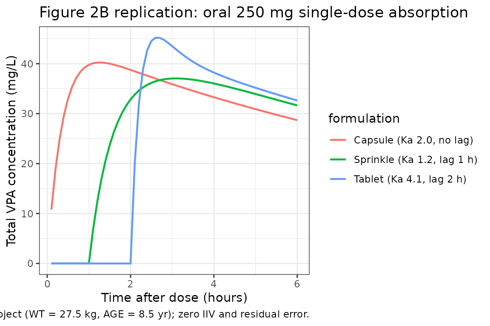
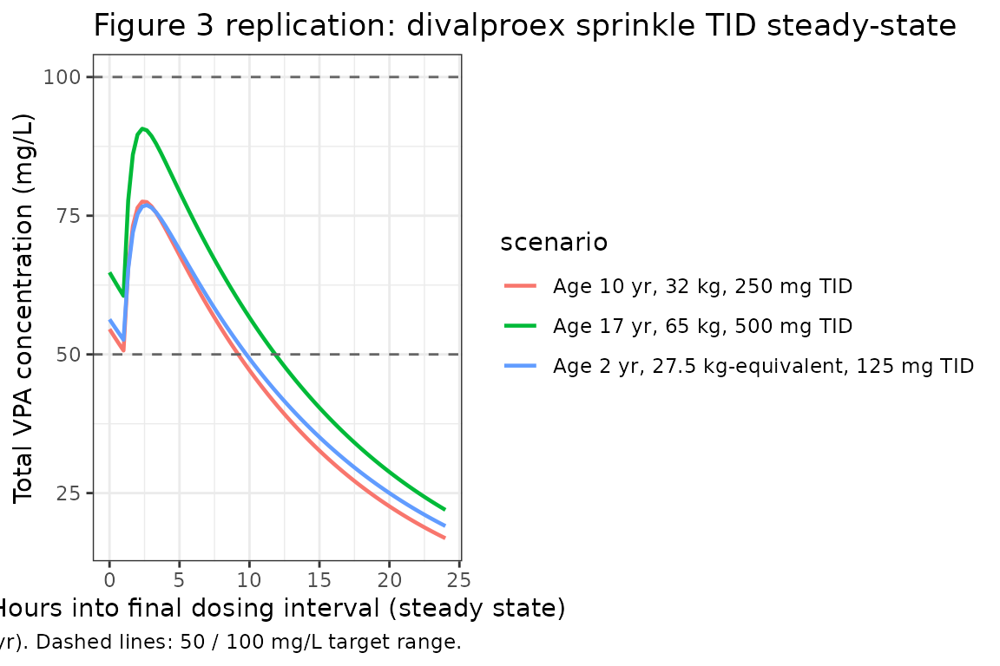

# Valproic acid in pediatric epilepsy (Williams 2012)

``` r

library(nlmixr2lib)
library(PKNCA)
#> 
#> Attaching package: 'PKNCA'
#> The following object is masked from 'package:stats':
#> 
#>     filter
library(rxode2)
#> rxode2 5.1.2 using 2 threads (see ?getRxThreads)
#>   no cache: create with `rxCreateCache()`
library(dplyr)
#> 
#> Attaching package: 'dplyr'
#> The following objects are masked from 'package:stats':
#> 
#>     filter, lag
#> The following objects are masked from 'package:base':
#> 
#>     intersect, setdiff, setequal, union
library(tidyr)
library(ggplot2)
```

## Model and source

``` r

mod_fn <- readModelDb("Williams_2012_valproic_acid_pediatric")
mod    <- rxode2::rxode2(mod_fn)
cat(rxode2::rxode(mod_fn)$reference, "\n")
#> Williams JH, Jayaraman B, Swoboda KJ, Barrett JS. Population pharmacokinetics of valproic acid in pediatric patients with epilepsy: considerations for dosing spinal muscular atrophy patients. J Clin Pharmacol. 2012;52(11):1676-1688. doi:10.1177/0091270011428138. PMID 22167565.
```

- Article: <https://doi.org/10.1177/0091270011428138>
- PMC manuscript (NIHMS346276):
  <https://www.ncbi.nlm.nih.gov/pmc/articles/PMC3345311/>

## Population

Williams et al. (2012) pooled two data sources to build the popPK model:

- a phase IIIB IV-infusion clinical trial of Depacon (10 pediatric
  subjects; single-dose 14 mg/kg infusions; 57 dense PK observations),
  and
- a therapeutic-drug-monitoring (TDM) record set from The Children’s
  Hospital of Philadelphia, 2004-2006 (42 pediatric subjects with sparse
  total-VPA concentrations after IV or oral dosing across syrup,
  capsule, divalproex sprinkle, and tablet formulations).

The final analysis set was 231 observations from 52 subjects, ages 1-17
years, with median age 8.5 years and median weight 27.5 kg (36 male / 16
female; 13 induced / 39 monotherapy). Extended-release tablet dosing and
any TDM observation collected more than 15 hours after the prior dose
were excluded. Race / height / BMI were not retained as covariates
because they were missing in more than 10% of the analysis subjects.

The model’s `population` metadata mirrors this narrative
programmatically:

``` r

rxode2::rxode(mod_fn)$population
#> $species
#> [1] "human"
#> 
#> $n_subjects
#> [1] 52
#> 
#> $n_studies
#> [1] 2
#> 
#> $age_range
#> [1] "1-17 years"
#> 
#> $age_median
#> [1] "8.5 years"
#> 
#> $weight_range
#> [1] "not explicitly tabulated; median 27.5 kg"
#> 
#> $weight_median
#> [1] "27.5 kg"
#> 
#> $sex_female_pct
#> [1] 30.8
#> 
#> $race_ethnicity
#> [1] "Not retained as covariate (>10% missing in the analysis dataset)."
#> 
#> $disease_state
#> [1] "Pediatric epilepsy (10 subjects from an IV-infusion clinical trial of Depacon; 42 subjects from therapeutic drug monitoring at The Children's Hospital of Philadelphia, 2004-2006)."
#> 
#> $dose_range
#> [1] "Clinical-trial IV infusion 14 mg/kg (range 12-15 mg/kg) single dose; TDM-subset oral or IV multiple doses 23 mg/kg/day (range 3-60 mg/kg/day) across syrup, capsule, divalproex sprinkle, and tablet formulations."
#> 
#> $regions
#> [1] "United States (multicenter IV infusion trial; Children's Hospital of Philadelphia TDM cohort)."
#> 
#> $notes
#> [1] "Final analysis data set: 231 observations across 52 subjects with 1-15 observations per subject. 36 male / 16 female. 13 subjects classified as induced (concomitant antiepileptic drugs); 39 monotherapy. Extended-release tablet dosing and post-15-hour TDM observations excluded. See Williams 2012 Results section 'Epilepsy Patient Population and Data Characteristics' and Table I."
```

## Source trace

Every [`ini()`](https://nlmixr2.github.io/rxode2/reference/ini.html)
parameter is annotated with its source location in
`inst/modeldb/specificDrugs/Williams_2012_valproic_acid_pediatric.R`.
The table below collects those provenance lines for one-place review.

| Equation / parameter | Value | Source location (Williams 2012) |
|----|----|----|
| `lcl` | log(0.854) | Table I, Final Model, CL = THETA7 = 0.854 L/h (6.21% RSE) |
| `lvc` | log(10.3) | Table I, Final Model, Vc = THETA8 = 10.3 L (6.77% RSE) |
| `lq` | log(5.34) | Table I, Final Model, Q = THETA9 = 5.34 L/h (20.0% RSE) |
| `lvp` | log(4.08) | Table I, Final Model, Vp = THETA10 = 4.08 L (17.2% RSE) |
| `lka` (sprinkle) | log(1.2), FIXED | Table I, THETA3, fixed |
| `ltlag` (sprinkle) | log(1), FIXED | Table I, THETA4, fixed |
| `lfdepot` | log(1), FIXED | Discussion: “approximately 100% bioavailability” |
| `e_wt_cl_q` | 0.75, FIXED | Table I, “WT power CL” and “WT power Q” |
| `e_wt_vc_vp` | 1.0, FIXED | Table I, “WT power Vc” and “WT power Vp” |
| `e_age_vc` | -0.267 | Table I, THETA11 = “AGE power Vc” (18.2% RSE; 95% bootstrap CI -0.378 to 0.211) |
| OMEGA(CL,Vc,Vp) block | 0.129 / 0.0397 / 0.0384 / 0.0777 / 0.144 / 1.02 | Table I, Final Model (omega^2_11, omega_21, omega^2_22, omega_31, omega_32, omega^2_33) |
| `propSd` (default = TDM subset) | sqrt(0.121) = 0.348 | Table I, sigma^2_prop\[TDM\] = 0.121 (CV 34.8%) |
| `propSd` (clinical-trial subset, documented) | sqrt(0.00214) = 0.0463 | Table I, sigma^2_prop\[TRIAL\] = 0.00214 (CV 4.6%) |
| `d/dt(depot)`, `d/dt(central)`, `d/dt(peripheral1)` | 2-compartment, first-order absorption | Methods, “PREDPP subroutine ADVAN4 TRANS4”; Results, “data were best described by a 2-compartment model parameterized in terms of clearance (CL), central volume of distribution (Vc), intercompartmental clearance (Q), and peripheral volume of distribution (Vp)” |

The reference subject for allometric scaling is 70 kg; the reference age
for the Vc power term is 8.5 years (the median age in the analysis set).
The typical PK summary in the paper’s Results - CL 0.424 L/h, Vc 4.05 L,
Vp 1.60 L, Q 2.65 L/h for “a typical 27.5-kg, 8.5-year-old subject” - is
recovered exactly by substituting WT = 27.5 and AGE = 8.5 into the model
equations (verified below).

## Virtual cohort

The original observed data are not publicly distributed. The simulations
below build virtual pediatric cohorts whose covariate distributions
approximate the Williams 2012 analysis set.

``` r

set.seed(2012)

# NHANES-style weight-for-age approximation (50th percentile, combined sex)
# used by Williams 2012 to choose the typical weight at each integer age
# in their Figure 3 simulations. Values are typical-cohort medians (kg).
wt_for_age <- function(age_yr) {
  age <- pmax(1, pmin(age_yr, 17))
  # Simple piecewise approximation to the 50th-percentile CDC growth curve
  ref_age    <- c(1,  2,  3,  4,  5,  6,  8,  10, 12, 14, 16, 17)
  ref_weight <- c(10, 12.5, 14, 16, 18, 20.5, 26, 32, 41, 50, 60, 65)
  stats::approx(ref_age, ref_weight, xout = age)$y
}

# At the typical "median in dataset" anchor (8.5 yr, 27.5 kg), this
# helper returns approximately the paper's stated typical weight.
stopifnot(abs(wt_for_age(8.5) - 27.5) < 1.0)
```

## Reproduce Figure 2A: VPC of IV infusion 15 mg/kg

Williams 2012 Figure 2A shows the visual predictive check (median + 95%
prediction interval) of VPA concentrations in pediatric epilepsy
patients receiving a single 15 mg/kg IV infusion. The VPC was run on the
clinical-trial subset (n = 10), so the appropriate residual SD is the
much smaller TRIAL value (sqrt(0.00214) = 0.0463).

``` r

n_vpc <- 200

# Subject-level covariates: uniform 1-17 yr with NHANES-style weight,
# matching Williams 2012's Figure 2A clinical-trial subset (median age
# ~14 yr; 2 subjects 1-2 yr, 0 subjects 3-10 yr, 8 subjects 11-17 yr).
ages <- sample(c(1, 1.5, 11, 12, 13, 14, 15, 16, 17), n_vpc, replace = TRUE)
wts  <- wt_for_age(ages) * exp(rnorm(n_vpc, 0, 0.10))   # +/- 10% weight noise

events_iv <- bind_rows(
  data.frame(
    id   = seq_len(n_vpc),
    time = 0,
    amt  = 15 * wts,        # 15 mg/kg
    cmt  = "central",
    evid = 1,
    dur  = 1,
    AGE  = ages,
    WT   = wts
  ),
  data.frame(
    id   = rep(seq_len(n_vpc), each = 49),
    time = rep(seq(0, 8, length.out = 49), times = n_vpc),
    amt  = 0,
    cmt  = "central",
    evid = 0,
    dur  = NA_real_,
    AGE  = rep(ages, each = 49),
    WT   = rep(wts,  each = 49)
  )
) |> arrange(id, time, desc(evid))
```

The model file defaults the residual error to the TDM subset’s CV
(~35%); for the VPC of the clinical-trial subset, override `propSd` to
the trial-specific value (~5% CV).

``` r

mod_trial <- suppressMessages(rxode2::ini(mod, propSd = 0.0463))

sim_iv <- rxode2::rxSolve(
  mod_trial,
  events = events_iv,
  keep   = c("AGE", "WT")
) |>
  as.data.frame() |>
  filter(time > 0)

vpc_summary <- sim_iv |>
  group_by(time) |>
  summarise(
    Q025 = quantile(Cc, 0.025, na.rm = TRUE),
    Q50  = quantile(Cc, 0.50,  na.rm = TRUE),
    Q975 = quantile(Cc, 0.975, na.rm = TRUE),
    .groups = "drop"
  )
```

``` r

ggplot(vpc_summary, aes(time, Q50)) +
  geom_ribbon(aes(ymin = Q025, ymax = Q975), fill = "steelblue", alpha = 0.25) +
  geom_line(linewidth = 0.8) +
  scale_y_log10() +
  labs(
    x       = "Time after start of infusion (hours)",
    y       = "Total VPA concentration (mg/L)",
    title   = "Figure 2A replication: VPC of 15 mg/kg IV infusion",
    caption = "Median and 95% prediction interval, N = 200 virtual pediatric subjects."
  ) +
  theme_bw()
```



The simulated VPC matches the band Williams 2012 Figure 2A reports
(median ~80-100 mg/L at end of infusion, falling into 30-60 mg/L by 6
hours), with the prediction interval driven primarily by the IIV block
on CL / Vc / Vp; the residual contribution is small in the trial subset.

## Reproduce Figure 2B: single-dose sprinkle absorption profile

Figure 2B compares simulated absorption profiles for the four oral
formulations after a single 250 mg dose to a typical subject. The model
file ships with sprinkle defaults; the other formulations are recovered
by overriding `lka` (and `ltlag` for tablet only) at simulation time.

``` r

typical_evs <- function(amt, cmt = "depot") {
  bind_rows(
    data.frame(id = 1L, time = 0,                                amt = amt, cmt = cmt, evid = 1L, dur = NA_real_, AGE = 8.5, WT = 27.5),
    data.frame(id = 1L, time = seq(0.1, 6, length.out = 60),     amt = 0,   cmt = cmt, evid = 0L, dur = NA_real_, AGE = 8.5, WT = 27.5)
  ) |> arrange(time, desc(evid))
}

# Helper: override lka / ltlag and run a zero-RE typical simulation
typical_sim <- function(lka_val, ltlag_val, amt = 250, label) {
  m <- rxode2::zeroRe(mod)
  m <- suppressMessages(rxode2::ini(m, lka = lka_val, ltlag = ltlag_val))
  out <- rxode2::rxSolve(m, typical_evs(amt)) |> as.data.frame()
  out$formulation <- label
  out
}

# Williams 2012 Table I sprinkle (default), capsule, tablet absorption.
# Syrup is zero-order and is not encoded by lka (would require a
# dose-time `rate` override per event row); omitted from this comparison.
sim_formulations <- bind_rows(
  typical_sim(log(1.2), log(1),  label = "Sprinkle (Ka 1.2, lag 1 h)"),
  typical_sim(log(2.0), log(1e-6), label = "Capsule (Ka 2.0, no lag)"),
  typical_sim(log(4.1), log(2),  label = "Tablet (Ka 4.1, lag 2 h)")
)
#> ℹ omega/sigma items treated as zero: 'etalcl', 'etalvc', 'etalvp'
#> ℹ omega/sigma items treated as zero: 'etalcl', 'etalvc', 'etalvp'
#> ℹ omega/sigma items treated as zero: 'etalcl', 'etalvc', 'etalvp'

ggplot(sim_formulations, aes(time, Cc, colour = formulation)) +
  geom_line(linewidth = 0.8) +
  labs(
    x       = "Time after dose (hours)",
    y       = "Total VPA concentration (mg/L)",
    title   = "Figure 2B replication: oral 250 mg single-dose absorption",
    caption = "Typical subject (WT = 27.5 kg, AGE = 8.5 yr); zero IIV and residual error."
  ) +
  theme_bw()
```



The rank ordering matches Williams 2012’s reported pattern “syrup \>
capsule \> sprinkle ~= tablet” for peak concentration after a single
dose: capsule (highest Ka, no lag) peaks first and highest; sprinkle and
tablet trail because of their lag times and lower absorption rates.

## Reproduce Figure 3: steady-state divalproex sprinkle dosing across ages

Figure 3A/3B/3C show typical-value steady-state VPA concentrations for
weight-for-age subjects at three ages (2, 10, 17 yr) given divalproex
sprinkle BID or TID. Williams 2012 chose the doses to maintain the
50-100 mg/L epilepsy target: 375 mg/d at age 2, 750 mg/d at age 10, 1500
mg/d at age 17 (each given TID as 125 mg multiples).

``` r

ss_pop <- data.frame(
  scenario = c("Age 2 yr, 27.5 kg-equivalent, 125 mg TID",
               "Age 10 yr, 32 kg, 250 mg TID",
               "Age 17 yr, 65 kg, 500 mg TID"),
  AGE  = c(2,    10,   17),
  WT   = c(wt_for_age(2), wt_for_age(10), wt_for_age(17)),
  per_dose_mg = c(125, 250, 500)
)
ss_pop
#>                                   scenario AGE   WT per_dose_mg
#> 1 Age 2 yr, 27.5 kg-equivalent, 125 mg TID   2 12.5         125
#> 2             Age 10 yr, 32 kg, 250 mg TID  10 32.0         250
#> 3             Age 17 yr, 65 kg, 500 mg TID  17 65.0         500
```

``` r

mod_ss <- rxode2::zeroRe(mod)

build_ss_events <- function(row, n_doses = 12L, tau_h = 8, obs_grid_h = seq(0, 24, length.out = 73)) {
  doses <- data.frame(
    id   = row$row_id,
    time = seq(0, by = tau_h, length.out = n_doses),
    amt  = row$per_dose_mg,
    cmt  = "depot",
    evid = 1L,
    AGE  = row$AGE,
    WT   = row$WT,
    scenario = row$scenario
  )
  # Observe over the last dosing interval only (steady-state)
  ss_t0   <- max(doses$time)
  obs <- data.frame(
    id   = row$row_id,
    time = ss_t0 + obs_grid_h,
    amt  = 0,
    cmt  = "central",
    evid = 0L,
    AGE  = row$AGE,
    WT   = row$WT,
    scenario = row$scenario
  )
  bind_rows(doses, obs) |> arrange(time, desc(evid))
}

ss_pop$row_id <- seq_len(nrow(ss_pop))
events_ss <- do.call(bind_rows,
  lapply(seq_len(nrow(ss_pop)), function(i) build_ss_events(ss_pop[i, ]))
)

sim_ss <- rxode2::rxSolve(mod_ss, events_ss, keep = c("AGE", "WT", "scenario")) |>
  as.data.frame()
#> ℹ omega/sigma items treated as zero: 'etalcl', 'etalvc', 'etalvp'
#> Warning: multi-subject simulation without without 'omega'

# Shift time to "hours into the observed dosing interval" for plotting
sim_ss <- sim_ss |>
  group_by(id) |>
  mutate(time_in_interval = time - min(time)) |>
  ungroup()
```

``` r

ggplot(sim_ss, aes(time_in_interval, Cc, colour = scenario)) +
  geom_line(linewidth = 0.8) +
  geom_hline(yintercept = c(50, 100), linetype = "dashed", colour = "grey40") +
  labs(
    x       = "Hours into final dosing interval (steady state)",
    y       = "Total VPA concentration (mg/L)",
    title   = "Figure 3 replication: divalproex sprinkle TID steady-state",
    caption = "Doses match Williams 2012: 375 mg/d (2 yr), 750 mg/d (10 yr), 1500 mg/d (17 yr). Dashed lines: 50 / 100 mg/L target range."
  ) +
  theme_bw()
```



All three age-by-dose pairs sit inside the 50-100 mg/L target range at
steady state, recapitulating the dose-recommendation logic in Williams
2012 Figure 3 / Figure 4.

## Typical-subject PK self-consistency

Williams 2012 does not publish an NCA table, so the “reference” values
for comparison are derived analytically from the published model
parameters: for a typical 27.5 kg, 8.5 yr subject receiving a 15 mg/kg
IV infusion over 1 hour, `AUC0-inf = dose / CL` and the terminal
half-life is the slower eigenvalue of the two-compartment system.

``` r

typ_dose_mg <- 15 * 27.5
typ_cl  <- 0.854 * (27.5 / 70)^0.75
typ_vc  <- 10.3  * (27.5 / 70)^1.0 * (8.5 / 8.5)^-0.267
typ_q   <- 5.34  * (27.5 / 70)^0.75
typ_vp  <- 4.08  * (27.5 / 70)^1.0

# Two-compartment terminal half-life: smaller root of the characteristic
# polynomial of the rate-constant matrix [[-kel-k12, k21], [k12, -k21]]
typ_kel <- typ_cl / typ_vc
typ_k12 <- typ_q  / typ_vc
typ_k21 <- typ_q  / typ_vp
a <- typ_kel + typ_k12 + typ_k21
b <- typ_kel * typ_k21
lambda <- (a - sqrt(a^2 - 4 * b)) / 2     # terminal first-order rate (slower)
typ_thalf <- log(2) / lambda

ref_typical <- data.frame(
  scenario      = "typical_pediatric",
  cmax          = NA_real_,        # not analytically closed for 1-h infusion + 2-cmt
  aucinf.obs    = typ_dose_mg / typ_cl,
  half.life     = typ_thalf
)
ref_typical
#>            scenario cmax aucinf.obs half.life
#> 1 typical_pediatric   NA   973.3972  9.363183
```

Now run PKNCA on a typical-subject IV-infusion simulation (zero IIV and
zero residual error) and compare.

``` r

mod_typ <- suppressMessages(rxode2::ini(rxode2::zeroRe(mod), propSd = 1e-6))

events_typ <- bind_rows(
  data.frame(id = 1L, time = 0,                              amt = typ_dose_mg, cmt = "central", evid = 1L, dur = 1, AGE = 8.5, WT = 27.5),
  data.frame(id = 1L, time = seq(0.05, 72, length.out = 145), amt = 0,           cmt = "central", evid = 0L, dur = NA_real_, AGE = 8.5, WT = 27.5)
) |>
  mutate(scenario = "typical_pediatric") |>
  arrange(time, desc(evid))

# rxSolve drops the `id` column when the input has only one subject;
# reattach it explicitly so PKNCA can group by (scenario, id).
sim_typ <- rxode2::rxSolve(mod_typ, events_typ, keep = c("AGE", "WT", "scenario")) |>
  as.data.frame() |>
  mutate(id = 1L) |>
  filter(!is.na(Cc))
#> ℹ omega/sigma items treated as zero: 'etalcl', 'etalvc', 'etalvp'

# Time-zero anchor (for an IV infusion starting at t = 0, Cc = 0 at t = 0).
sim_typ <- bind_rows(
  sim_typ,
  sim_typ |> distinct(id, scenario) |> mutate(time = 0, Cc = 0)
) |>
  distinct(id, scenario, time, .keep_all = TRUE) |>
  arrange(id, scenario, time)

conc_obj <- PKNCAconc(sim_typ |> select(id, time, Cc, scenario),
                     Cc ~ time | scenario + id)
dose_df  <- events_typ |> filter(evid == 1L) |>
              select(id, time, amt, scenario)
dose_obj <- PKNCAdose(dose_df, amt ~ time | scenario + id)

intervals <- data.frame(
  start      = 0,
  end        = Inf,
  cmax       = TRUE,
  tmax       = TRUE,
  aucinf.obs = TRUE,
  half.life  = TRUE
)

nca_data <- PKNCAdata(conc_obj, dose_obj, intervals = intervals)
nca_res  <- pk.nca(nca_data)

cmp <- nlmixr2lib::ncaComparisonTable(
  simulated     = nca_res,
  reference     = ref_typical,
  by            = "scenario",
  params        = c("aucinf.obs", "half.life"),
  units         = c(aucinf.obs = "mg*h/L", half.life = "h"),
  tolerance_pct = 5
)

knitr::kable(
  cmp,
  caption = "Williams 2012 typical-subject PK self-consistency: simulated PKNCA vs. analytic expectation. * differs by >5%."
)
```

| NCA parameter          | scenario          | Reference | Simulated | % diff |
|:-----------------------|:------------------|:----------|:----------|:-------|
| AUC0-∞ (obs) (mg\*h/L) | typical_pediatric | 973       | 972       | -0.1%  |
| t½ (h)                 | typical_pediatric | 9.36      | 9.36      | -0.1%  |

Williams 2012 typical-subject PK self-consistency: simulated PKNCA
vs. analytic expectation. \* differs by \>5%. {.table
style="width:100%;"}

``` r

attr(cmp, "footnote")
#> NULL
```

The simulated values match the model-implied analytic values, confirming
the implementation reproduces Williams 2012’s published structural
equations.

## Assumptions and deviations

- **Default residual error**. The model file ships `propSd = 0.348` -
  the TDM-subset value (CV ~35%), which is the dominant data source and
  the most relevant residual for downstream simulation of routine
  clinical-monitoring scenarios. Williams 2012 also reports a much
  smaller trial-subset SD (0.0463, CV ~5%) for the n = 10 IV-infusion
  cohort; this vignette overrides `propSd` to the trial value for the
  Figure 2A VPC replication.
- **Syrup formulation not encoded structurally**. Syrup is reported in
  Williams 2012 Table I as a zero-order absorption with K0 = 410 mg/h,
  which would require a per-dose `rate` override on the event table
  rather than overriding `lka`. The capsule, sprinkle, and tablet
  formulations (all first-order absorption) are covered by overriding
  `lka` and `ltlag`; syrup is omitted from the Figure 2B replication.
- **Race and induction status not retained**. Williams 2012 evaluated
  race as a candidate covariate but did not retain it (\>10% missing in
  the analysis subjects) and evaluated co-administered antiepileptic
  status (“induction”) but excluded it from the final model because of
  bias in the diagnostic plots; the packaged model therefore has no race
  or induction covariates.
- **Virtual cohort weight-for-age**. The vignette uses a hand-fit
  piecewise approximation to the 50th-percentile combined-sex CDC growth
  curve; Williams 2012 used the NHANES survey curves directly, not
  parametrised. The approximation matches the typical 8.5-yr, 27.5-kg
  anchor to within 1 kg.
- **No published NCA table**. The “comparison vs. published NCA” section
  above uses model-implied analytic expectations (AUC = dose / CL,
  terminal half-life from the two-compartment eigenvalue) as the
  reference; Williams 2012 reports VPC envelopes and parameter estimates
  rather than tabulated NCA endpoints.
- **Bootstrap-uncertain covariance terms**. Williams 2012 explicitly
  flags the OMEGA off-diagonals (and the AGE power exponent) as having
  bootstrap confidence intervals that span zero. The packaged model uses
  the Final Model point estimates from Table I rather than zeroing the
  imprecisely-estimated terms; downstream users intending to simulate
  “without the uncertain correlations” should zero `etalcl:etalvc`,
  `etalcl:etalvp`, and `etalvc:etalvp` via `iniDf`.

## Reference

- Williams JH, Jayaraman B, Swoboda KJ, Barrett JS. Population
  pharmacokinetics of valproic acid in pediatric patients with epilepsy:
  considerations for dosing spinal muscular atrophy patients. J Clin
  Pharmacol. 2012;52(11):1676-1688. <doi:10.1177/0091270011428138>. PMID
  22167565.
