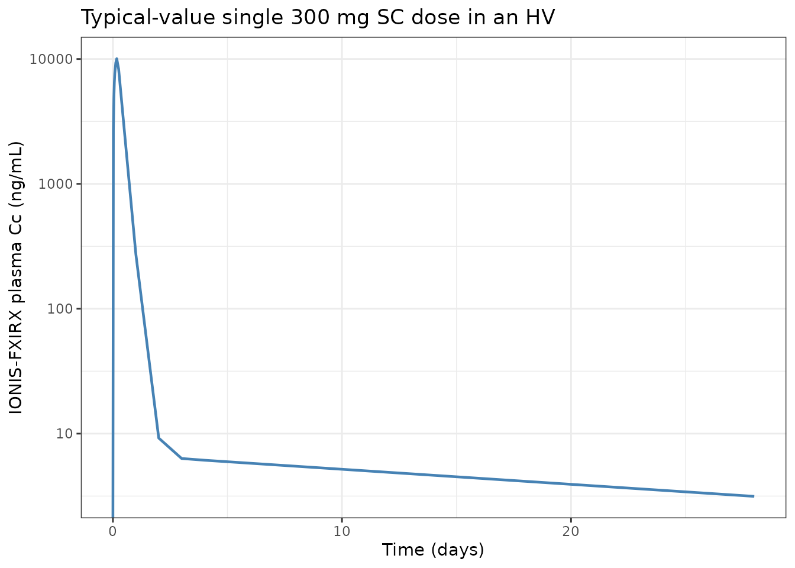
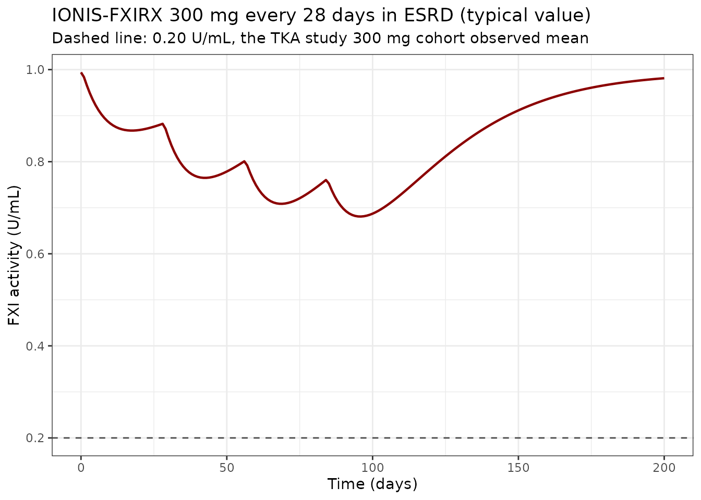
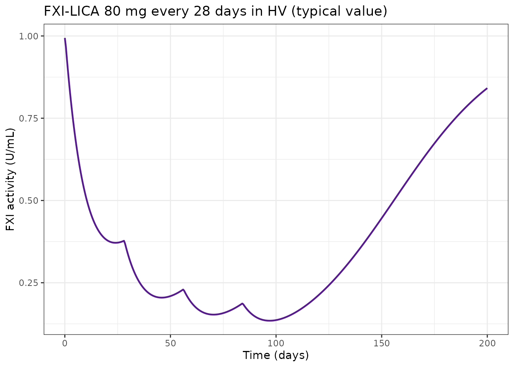

# FXI antisense oligonucleotides: IONIS-FXIRX and FXI-LICA (Willmann 2021)

## Model and source

- Citation: Willmann S, Marostica E, Snelder N, Solms A, Jensen M,
  Lobmeyer M, Lensing AWA, Bethune C, Morgan E, Yu RZ, Wang Y, Jung SW,
  Geary R, Bhanot S. PK/PD modeling of FXI antisense oligonucleotides to
  bridge the dose-FXI activity relation from healthy volunteers to
  end-stage renal disease patients. *CPT Pharmacometrics Syst
  Pharmacol.* 2021;10(8):890-901.
- DOI: <https://doi.org/10.1002/psp4.12663>
- Packaged models:
  - `Willmann_2021_ionisFxirx` – IONIS-FXIRX (BAY2306001) PK/PD in
    healthy volunteers (study ASO-CS1) and patients with end-stage renal
    disease on hemodialysis (study ASO-CS4).
  - `Willmann_2021_fxiLica` – FXI-LICA (BAY2976217, formerly ION-957943)
    PK/PD in healthy volunteers (study LICA-CS1), with the ESRD
    covariate effects borrowed from IONIS-FXIRX for the paper’s
    FXI-LICA-in-ESRD simulation scenario.

The two compounds share the same structural PK/PD backbone (Figure 2 of
the paper) but were fitted with separate PK parameters (Tables S2 and
S3) and share a jointly-fitted indirect-response arm on FXI activity
(Table S4). Each drug is therefore packaged as a distinct model file,
and this single vignette walks the paper’s bridging analysis by
exercising each
[`modellib()`](https://nlmixr2.github.io/nlmixr2lib/reference/modellib.md)
entry at the appropriate step.

### Structural model

The pharmacokinetic model is two-compartment with **parallel first-order
and zero-order subcutaneous absorption**:

- Fraction $`F_1`$ of the dose enters `depot` and is absorbed
  first-order with rate $`k_a`$ into `central`.
- Fraction $`1 - F_1`$ enters `central` directly as a zero-order input
  over duration $`D_2`$.
- Central and peripheral compartments (volumes $`V_2`$ and $`V_3`$,
  intercompartmental clearance $`Q`$) with first-order elimination from
  central (clearance $`CL`$).

The pharmacodynamic model is an **indirect-response turnover model** for
FXI activity with a **sigmoid-Imax** inhibition of the zero-order
synthesis rate $`K_{in} = \text{Baseline}
\cdot k_{out}`$:

``` math
\frac{d \text{FXIact}}{dt} = K_{in} \cdot \left(1 - \frac{I_{max} \cdot C_e^{\gamma}}{IC_{50}^{\gamma} + C_e^{\gamma}}\right) - k_{out} \cdot \text{FXIact}
```

with $`I_{max}`$ fixed to 1 and Hill exponent $`\gamma`$ shared across
compounds and studies. The inhibitory driver $`C_e`$ is the
concentration in an **effect compartment** linked to plasma via
first-order equilibration ($`k_{eo}`$):

``` math
\frac{d C_e}{dt} = k_{eo} \cdot \left( k_{eo\_pat}^{\text{ESRD}} \cdot C_c - C_e \right)
```

The paper’s `keoPAT` factor scales the effect-site driving concentration
in ESRD patients (`keoPAT = 0.329` -\> $`C_{e,ss}`$ in ESRD is \$\$1/3
of the HV value at the same $`C_c`$; note the paper’s Discussion phrases
this as “a factor of approximately one-third on the effect site
concentration”).

### Dosing convention

Because the PK has parallel absorption arms, each administration must be
encoded as **two dose event rows**: one targeting `cmt = "depot"`
(first-order, fraction $`F_1`$) and one targeting `cmt = "central"`
(zero-order, fraction $`1 - F_1`$, duration $`D_2`$). The zero-order row
must set `rate = -2` so rxode2 uses the model-defined
`dur(central) <- d1` value; otherwise the zero-order component collapses
to an instantaneous bolus.

Doses are entered in **mg**; simulated $`C_c`$ is returned in **ng/mL**
(the units the paper reports).

## Population

Study cohorts (Willmann 2021 Supplementary Information Table S1):

| Study | Drug | Phase | Cohort | n active | n placebo | Weight (mean SD) | Age (mean SD) |
|----|----|----|----|---:|---:|----|----|
| ASO-CS1 | IONIS-FXIRX | 1 | Healthy volunteers | 66 | 22 | 72.7 (10.5) kg | 45.4 (11.9) years |
| ASO-CS4 | IONIS-FXIRX | 2 | ESRD on hemodialysis | 36 | 13 | 87.8 (22.7) kg | 59.2 (12.9) years |
| LICA-CS1 | FXI-LICA | 1 | Healthy volunteers (FIH) | 48 | 18 | 77.5 (13.2) kg | 50.8 (11.5) years |

Weight in ASO-CS4 spans 48.5-164 kg (Methods, “PK/PD simulations for
FXI-LICA in patients with ESRD”). Race and ethnicity are not reported in
the primary publication.

Per-drug demographic metadata is available via
`readModelDb(name)$population`.

## Source trace

The per-parameter origin is recorded as an in-file comment next to each
`ini()` entry in the two model files under
`inst/modeldb/specificDrugs/`. The table below consolidates them for
review.

| Equation / parameter | Value | Source location |
|----|----|----|
| Structural PK: 2-cmt, parallel first-order + zero-order absorption, first-order elimination | n/a | Willmann 2021 Methods; Figure 2 |
| Structural PD: indirect response with sigmoid Imax on Kin, effect-site driver | n/a | Willmann 2021 Methods; Figure 2 |
| **IONIS-FXIRX PK (Table S2)** |  |  |
| `lcl` (CL, HV) | log(3.12) | Willmann 2021 Table S2 |
| `lvc` (V2 at 70 kg) | log(9.55) | Willmann 2021 Table S2 |
| `lq` (Q) | log(0.202) | Willmann 2021 Table S2 |
| `lvp` (V3, HV) | log(164) | Willmann 2021 Table S2 |
| `lka` (ka) | log(0.191) | Willmann 2021 Table S2 |
| `ld1` (D2) | log(4.88) | Willmann 2021 Table S2 |
| `logitfdepot` (Logit F1) | qlogis(0.688) = 0.790 | Willmann 2021 Table S2 |
| `e_esrd_cl` (ESRD on CL) | 0.530 fixed | Willmann 2021 Table S2 |
| `e_esrd_vp` (ESRD on V3) | 0.379 fixed | Willmann 2021 Table S2 |
| `e_wt_vc` (BWT on V2) | 0.967 fixed | Willmann 2021 Table S2 |
| **FXI-LICA PK (Table S3)** |  |  |
| `lcl` (CL) | log(12.8) | Willmann 2021 Table S3 |
| `lvc` (V2) | log(48.9) | Willmann 2021 Table S3 |
| `lq` (Q) | log(1.82) | Willmann 2021 Table S3 |
| `lvp` (V3) | log(924) | Willmann 2021 Table S3 |
| `lka` (ka) | log(0.864) | Willmann 2021 Table S3 |
| `ld1` (D2) | log(9.38) | Willmann 2021 Table S3 |
| `logitfdepot` (Logit F1) | qlogis(0.620) = 0.490 | Willmann 2021 Table S3 |
| OMEGA BLOCK (CL, V2, Q) | 0.146 / 0.172 / 0.312 / 0.127 / 0.189 / 0.234 | Willmann 2021 Table S3 |
| **Joint PK/PD (Table S4)** |  |  |
| `imax` (Imax) | 1.00 fixed | Willmann 2021 Table S4 |
| `lic50` (IC50, IONIS-FXIRX) | log(167) | Willmann 2021 Table S4 |
| `lic50` (IC50, FXI-LICA) | log(2.59) | Willmann 2021 Table S4 |
| `lrbase` (Baseline) | log(0.994) | Willmann 2021 Table S4 |
| `lkout` (kout) | log(0.00435) | Willmann 2021 Table S4 |
| `lhill` (gamma) | log(1.50) | Willmann 2021 Table S4 |
| `lke0` (keo) | log(0.00115) | Willmann 2021 Table S4 |
| `le_esrd_effect` (log keoPAT) | log(0.329) fixed | Willmann 2021 Table S4 |
| Residual PK (Cc) ASO-CS1 | 0.229 prop | Willmann 2021 Table S2 |
| Residual PK (Cc) ASO-CS4 | 0.290 prop | Willmann 2021 Table S2 |
| Residual PK (Cc) LICA-CS1 | 0.259 prop | Willmann 2021 Table S3 |
| Residual PD (FXIact) ASO-CS1 | 0.0851 prop | Willmann 2021 Table S4 |
| Residual PD (FXIact) ASO-CS4 | 0.172 prop | Willmann 2021 Table S4 |
| Residual PD (FXIact) LICA-CS1 | 0.101 prop | Willmann 2021 Table S4 |

## Virtual cohort

The published individual-level data are not publicly available. The
figures below use deterministic typical-value simulations plus small
stochastic cohorts (uniform body weight per the ESRD range for
FXI-LICA-in-ESRD scenarios, and normal $`N(72.7, 10.5)`$ weight for HV
cohorts, capped to a reasonable range). Cohort sizes are kept below 200
per arm; larger cohorts add no validation value and materially increase
render time.

``` r

set.seed(20210801L)

# Build a two-row dose event pattern for the mixed absorption model.
# Doses are entered in mg. The zero-order row uses rate = -2 so
# rxode2 picks up the model-defined dur(central) <- d1. `subjects` is
# a data.frame with columns id, wt, esrd, dose_mg (one row per
# subject).
make_events <- function(subjects, dose_times, obs_times) {
  # Dose rows: two rows per (subject, dose_time).
  n_sub <- nrow(subjects)
  n_dose <- length(dose_times)
  n_obs <- length(obs_times)
  doses <- data.frame(
    id = rep(subjects$id, each = n_dose * 2L),
    time = rep(rep(dose_times, each = 2L), times = n_sub),
    evid = 1L,
    amt = rep(subjects$dose_mg, each = n_dose * 2L),
    cmt = rep(c("depot", "central"), times = n_sub * n_dose),
    rate = rep(c(0, -2), times = n_sub * n_dose),
    dur = 0,
    dvid = NA_real_,
    WT = rep(subjects$wt, each = n_dose * 2L),
    RRT_HEMODIAL_STATUS = rep(subjects$esrd, each = n_dose * 2L),
    dose_mg = rep(subjects$dose_mg, each = n_dose * 2L),
    stringsAsFactors = FALSE
  )
  # Observation rows: one per (subject, obs_time). The model declares
  # TWO outputs with residual error (Cc and FXIact); rxode2 therefore
  # needs a `dvid` column on observation rows to disambiguate which
  # output the row targets. `dvid = 1L` selects the first residual
  # declared (Cc); rxode2 still returns both Cc and FXIact as columns
  # in the solved output, so this only tags the "primary" DV for the
  # observation record.
  obs <- data.frame(
    id = rep(subjects$id, each = n_obs),
    time = rep(obs_times, times = n_sub),
    evid = 0L,
    amt = 0,
    cmt = NA_character_,
    rate = 0,
    dur = 0,
    dvid = 1L,
    WT = rep(subjects$wt, each = n_obs),
    RRT_HEMODIAL_STATUS = rep(subjects$esrd, each = n_obs),
    dose_mg = rep(subjects$dose_mg, each = n_obs),
    stringsAsFactors = FALSE
  )
  dplyr::bind_rows(doses, obs) |>
    dplyr::arrange(id, time, dplyr::desc(evid))
}
```

## Simulation: IONIS-FXIRX in healthy volunteers

Study ASO-CS1 gave IONIS-FXIRX as single and multiple SC doses at 50-300
mg. Reproduce a typical-value single-dose 300 mg profile in an HV (WT =
70 kg, ESRD = 0).

``` r

mod_ionis <- nlmixr2lib::readModelDb("Willmann_2021_ionisFxirx")
mod_ionis_typ <- rxode2::zeroRe(mod_ionis)
#> ℹ parameter labels from comments will be replaced by 'label()'

# Deterministic typical-value single-dose 300 mg IONIS-FXIRX in HV.
subjects_ionis_hv <- data.frame(
  id = 1L, wt = 70, esrd = 0, dose_mg = 300
)
ev_ionis_hv <- make_events(
  subjects_ionis_hv,
  dose_times = 0,
  obs_times = c(0, 0.5, 1, 1.5, 2, 3, 4, 6, 8, 12, 24,
                48, 72, 96, 168, 336, 504, 672)
)

sim_ionis_hv <- rxode2::rxSolve(
  mod_ionis_typ, events = ev_ionis_hv,
  keep = c("WT", "RRT_HEMODIAL_STATUS")
) |> as.data.frame()
#> ℹ omega/sigma items treated as zero: 'etalcl', 'etalvc', 'etalq', 'etalvp', 'etalka', 'etalogitfdepot', 'etalrbase', 'etalic50', 'etalkout', 'etalke0'

ggplot(sim_ionis_hv, aes(time / 24, Cc)) +
  geom_line(colour = "steelblue", linewidth = 0.8) +
  scale_y_log10() +
  labs(x = "Time (days)", y = "IONIS-FXIRX plasma Cc (ng/mL)",
       title = "Typical-value single 300 mg SC dose in an HV") +
  theme_bw()
#> Warning in scale_y_log10(): log-10 transformation introduced infinite values.
```



## Simulation: IONIS-FXIRX in ESRD patients

Study ASO-CS4 (ESRD, once every 28 days for up to 12 weeks) is the
setting where the ESRD covariates (CL x 0.47, V3 x 0.62, effect-site
driving concentration x 0.329) are activated. Repeat a typical-value 300
mg once-monthly regimen for 4 doses.

``` r

# Multiple-dose 300 mg every 28 days, ESRD = 1.
dose_times_q28 <- 24 * 28 * (0:3)   # 4 doses at 0, 28, 56, 84 days (in h)
obs_times_q28 <- sort(unique(c(0, dose_times_q28, seq(0, 24 * 200, by = 24))))

subjects_ionis_esrd <- data.frame(
  id = 1L, wt = 88, esrd = 1, dose_mg = 300
)
ev_ionis_esrd <- make_events(
  subjects_ionis_esrd,
  dose_times = dose_times_q28,
  obs_times = obs_times_q28
)

sim_ionis_esrd <- rxode2::rxSolve(
  mod_ionis_typ, events = ev_ionis_esrd,
  keep = c("WT", "RRT_HEMODIAL_STATUS")
) |> as.data.frame()
#> ℹ omega/sigma items treated as zero: 'etalcl', 'etalvc', 'etalq', 'etalvp', 'etalka', 'etalogitfdepot', 'etalrbase', 'etalic50', 'etalkout', 'etalke0'

ggplot(sim_ionis_esrd, aes(time / 24, FXIact)) +
  geom_line(colour = "darkred", linewidth = 0.8) +
  geom_hline(yintercept = 0.2, linetype = 2, colour = "gray30") +
  labs(x = "Time (days)", y = "FXI activity (U/mL)",
       title = "IONIS-FXIRX 300 mg every 28 days in ESRD (typical value)",
       subtitle = "Dashed line: 0.20 U/mL, the TKA study 300 mg cohort observed mean") +
  theme_bw()
```



The 300 mg once-monthly IONIS-FXIRX regimen reaches steady-state FXI
activity of \$\$0.2 U/mL in ESRD, consistent with the mean 0.20 U/mL
observed in the 300 mg cohort of the IONIS-FXIRX TKA study (Willmann
2021 Discussion citing the phase II TKA study).

## Simulation: FXI-LICA in healthy volunteers (LICA-CS1)

Study LICA-CS1 dose ranges: 40-120 mg single SC doses; 10-30 mg weekly x
6 or 80 mg every 4 weeks x 4. Reproduce the 80 mg every-4-weeks
multiple-dose FXI-LICA HV profile.

``` r

mod_lica <- nlmixr2lib::readModelDb("Willmann_2021_fxiLica")
mod_lica_typ <- rxode2::zeroRe(mod_lica)
#> ℹ parameter labels from comments will be replaced by 'label()'

dose_times_q4w <- 24 * 28 * (0:3)   # 4 doses at 0, 28, 56, 84 days
obs_times_q4w <- sort(unique(c(0, dose_times_q4w, seq(0, 24 * 200, by = 12))))

subjects_lica_hv <- data.frame(
  id = 1L, wt = 78, esrd = 0, dose_mg = 80
)
ev_lica_hv <- make_events(
  subjects_lica_hv,
  dose_times = dose_times_q4w,
  obs_times = obs_times_q4w
)

sim_lica_hv <- rxode2::rxSolve(
  mod_lica_typ, events = ev_lica_hv,
  keep = c("WT", "RRT_HEMODIAL_STATUS")
) |> as.data.frame()
#> ℹ omega/sigma items treated as zero: 'etalcl', 'etalvc', 'etalq', 'etalvp', 'etalka', 'etalrbase', 'etalic50', 'etalkout', 'etalke0'

ggplot(sim_lica_hv, aes(time / 24, FXIact)) +
  geom_line(colour = "purple4", linewidth = 0.8) +
  labs(x = "Time (days)", y = "FXI activity (U/mL)",
       title = "FXI-LICA 80 mg every 28 days in HV (typical value)") +
  theme_bw()
```



## Simulation: FXI-LICA in ESRD (borrowed IONIS-FXIRX ESRD effects)

Figures 3a and 4 of Willmann 2021 predict FXI activity at steady-state
for FXI-LICA once-monthly in ESRD at 40, 80, and 120 mg. Reproduce the
paper’s virtual ESRD cohort (n = 100 per dose, uniform WT
$`[48.5, 164]`$ kg per Methods) and compute the average FXI activity
over a single dosing interval at steady-state.

``` r

n_per_arm <- 100L
dose_levels_mg <- c(40, 80, 120)

# Uniform weight distribution per Methods; steady-state reached
# after 4-5 doses per Results, so simulate 6 doses q28d and take
# the average FXI activity over the last dosing interval.
n_doses <- 6L
dose_times_ss <- 24 * 28 * (0:(n_doses - 1L))
obs_grid <- seq(0, 24 * 28 * n_doses, by = 12)

# Build the pooled subjects data.frame across the 3 dose arms:
# one row per subject with (id, wt, esrd, dose_mg).
build_esrd_subjects <- function() {
  do.call(rbind, lapply(seq_along(dose_levels_mg), function(k) {
    d <- dose_levels_mg[k]
    start_id <- 1000L * k
    data.frame(
      id = start_id + seq_len(n_per_arm) - 1L,
      wt = runif(n_per_arm, min = 48.5, max = 164),
      esrd = 1,
      dose_mg = d
    )
  }))
}
subjects_lica_esrd <- build_esrd_subjects()

ev_lica_esrd <- make_events(
  subjects_lica_esrd,
  dose_times = dose_times_ss,
  obs_times = obs_grid
)

sim_lica_esrd <- rxode2::rxSolve(
  mod_lica, events = ev_lica_esrd,
  keep = c("WT", "RRT_HEMODIAL_STATUS", "dose_mg")
) |> as.data.frame()
#> ℹ parameter labels from comments will be replaced by 'label()'

# Average FXI activity over the last dosing interval per subject.
last_interval_start <- 24 * 28 * (n_doses - 1L)
last_interval_end   <- 24 * 28 * n_doses
ss_avg <- sim_lica_esrd |>
  dplyr::filter(time >= last_interval_start, time <= last_interval_end) |>
  dplyr::group_by(dose_mg, id) |>
  dplyr::summarize(fxiact_avg = mean(FXIact, na.rm = TRUE),
                   .groups = "drop")

ss_avg |>
  dplyr::group_by(dose_mg) |>
  dplyr::summarize(
    median = stats::median(fxiact_avg),
    q05    = stats::quantile(fxiact_avg, 0.05),
    q95    = stats::quantile(fxiact_avg, 0.95),
    .groups = "drop"
  ) |>
  dplyr::rename(
    `Dose (mg)`               = dose_mg,
    `Median average FXI (U/mL)` = median,
    `5th percentile`          = q05,
    `95th percentile`         = q95
  ) |>
  knitr::kable(digits = 3, caption = "Simulated average steady-state FXI activity in ESRD; compare to Willmann 2021 Results paragraph 'Prediction of FXI activity in patients with ESRD after FXI-LICA administration' (medians 0.47, 0.25, 0.15 U/mL for 40, 80, 120 mg respectively).")
```

| Dose (mg) | Median average FXI (U/mL) | 5th percentile | 95th percentile |
|----------:|--------------------------:|---------------:|----------------:|
|        40 |                     0.389 |          0.149 |           0.705 |
|        80 |                     0.209 |          0.039 |           0.521 |
|       120 |                     0.136 |          0.044 |           0.380 |

Simulated average steady-state FXI activity in ESRD; compare to Willmann
2021 Results paragraph ‘Prediction of FXI activity in patients with ESRD
after FXI-LICA administration’ (medians 0.47, 0.25, 0.15 U/mL for 40,
80, 120 mg respectively). {.table}

## Replicate Figure 4a (FXI activity time courses)

``` r

sim_lica_esrd |>
  dplyr::group_by(dose_mg, time) |>
  dplyr::summarize(
    median = stats::median(FXIact, na.rm = TRUE),
    q05    = stats::quantile(FXIact, 0.05, na.rm = TRUE),
    q95    = stats::quantile(FXIact, 0.95, na.rm = TRUE),
    .groups = "drop"
  ) |>
  dplyr::mutate(dose_mg = factor(dose_mg, levels = c(40, 80, 120),
                                 labels = c("40 mg", "80 mg", "120 mg"))) |>
  ggplot(aes(time / 24, median, colour = dose_mg, fill = dose_mg)) +
  geom_ribbon(aes(ymin = q05, ymax = q95), alpha = 0.15, colour = NA) +
  geom_line(linewidth = 0.7) +
  scale_x_continuous(breaks = seq(0, 200, 28)) +
  labs(x = "Time (days)", y = "FXI activity (U/mL)",
       colour = "Dose", fill = "Dose",
       title = "FXI-LICA once-monthly in ESRD (n = 100 per arm)") +
  theme_bw() +
  theme(legend.position = "bottom")
```


Replicates Figure 4a of Willmann 2021: model-predicted FXI activity time
courses in ESRD patients after repeated once-monthly SC FXI-LICA at 40,
80, and 120 mg.

## PKNCA validation: IONIS-FXIRX single 300 mg dose

Run PKNCA on the single-dose IONIS-FXIRX HV profile to sanity-check the
simulated PK. Willmann 2021 does not report tabulated NCA values for
IONIS-FXIRX, so this check verifies that AUC scales linearly with dose
and $`C_{max}`$ is reasonable for a subcutaneous 2-cmt model with mixed
absorption.

``` r

# Add extra observation rows to make PKNCA reliable, including t=0.
pknca_obs_times <- sort(unique(c(
  0, 0.25, 0.5, 0.75, 1, 1.5, 2, 3, 4, 6, 8, 10, 12, 16, 20, 24,
  36, 48, 72, 96, 120, 168, 240, 336, 504, 672, 840, 1008
)))

ionis_dose_levels <- c(50, 100, 200, 300)
subjects_ionis_nca <- data.frame(
  id = 100L + seq_along(ionis_dose_levels),
  wt = 70,
  esrd = 0,
  dose_mg = ionis_dose_levels
)
ev_ionis_nca <- make_events(
  subjects_ionis_nca,
  dose_times = 0,
  obs_times = pknca_obs_times
)

sim_ionis_nca <- rxode2::rxSolve(
  mod_ionis_typ, events = ev_ionis_nca,
  keep = c("WT", "RRT_HEMODIAL_STATUS", "dose_mg")
) |> as.data.frame()
#> ℹ omega/sigma items treated as zero: 'etalcl', 'etalvc', 'etalq', 'etalvp', 'etalka', 'etalogitfdepot', 'etalrbase', 'etalic50', 'etalkout', 'etalke0'
#> Warning: multi-subject simulation without without 'omega'

conc_obj <- PKNCA::PKNCAconc(
  data = dplyr::filter(sim_ionis_nca, !is.na(Cc)),
  formula = Cc ~ time | id / dose_mg
)
dose_df <- sim_ionis_nca |>
  dplyr::group_by(id) |>
  dplyr::summarize(
    time = 0,
    dose_mg = dplyr::first(dose_mg),
    .groups = "drop"
  ) |>
  dplyr::mutate(amt = dose_mg)
dose_obj <- PKNCA::PKNCAdose(
  data = dose_df,
  formula = amt ~ time | id
)
data_obj <- PKNCA::PKNCAdata(
  conc_obj, dose_obj,
  intervals = data.frame(
    start = 0, end = Inf,
    cmax = TRUE, tmax = TRUE, aucinf.obs = TRUE, half.life = TRUE
  )
)
res <- PKNCA::pk.nca(data_obj)

res_df <- as.data.frame(res$result)
res_summary <- res_df |>
  dplyr::filter(PPTESTCD %in% c("cmax", "tmax", "aucinf.obs", "half.life")) |>
  dplyr::select(dose_mg, PPTESTCD, PPORRES) |>
  tidyr::pivot_wider(names_from = PPTESTCD, values_from = PPORRES) |>
  dplyr::rename(
    `Dose (mg)`      = dose_mg,
    `Cmax (ng/mL)`   = cmax,
    `Tmax (h)`       = tmax,
    `AUCinf (ng*h/mL)` = aucinf.obs,
    `t1/2 (h)`       = half.life
  )
knitr::kable(res_summary, digits = 2,
             caption = "IONIS-FXIRX typical-value NCA parameters, single SC doses in a 70-kg HV.")
```

| Dose (mg) | Cmax (ng/mL) | Tmax (h) | t1/2 (h) | AUCinf (ng\*h/mL) |
|----------:|-------------:|---------:|---------:|------------------:|
|        50 |      1675.23 |        4 |   598.55 |          15836.69 |
|       100 |      3350.45 |        4 |   598.55 |          31673.38 |
|       200 |      6700.91 |        4 |   598.55 |          63346.77 |
|       300 |     10051.36 |        4 |   598.55 |          95020.14 |

IONIS-FXIRX typical-value NCA parameters, single SC doses in a 70-kg HV.
{.table}

Dose linearity check: for a linear system Cmax and AUCinf should scale
approximately proportionally with dose.

## PKNCA validation: FXI-LICA single doses

``` r

lica_dose_levels <- c(40, 60, 80, 120)
subjects_lica_nca <- data.frame(
  id = 500L + seq_along(lica_dose_levels),
  wt = 78,
  esrd = 0,
  dose_mg = lica_dose_levels
)
ev_lica_nca <- make_events(
  subjects_lica_nca,
  dose_times = 0,
  obs_times = pknca_obs_times
)

sim_lica_nca <- rxode2::rxSolve(
  mod_lica_typ, events = ev_lica_nca,
  keep = c("WT", "RRT_HEMODIAL_STATUS", "dose_mg")
) |> as.data.frame()
#> ℹ omega/sigma items treated as zero: 'etalcl', 'etalvc', 'etalq', 'etalvp', 'etalka', 'etalrbase', 'etalic50', 'etalkout', 'etalke0'
#> Warning: multi-subject simulation without without 'omega'

conc_obj_lica <- PKNCA::PKNCAconc(
  data = dplyr::filter(sim_lica_nca, !is.na(Cc)),
  formula = Cc ~ time | id / dose_mg
)
dose_df_lica <- sim_lica_nca |>
  dplyr::group_by(id) |>
  dplyr::summarize(time = 0, dose_mg = dplyr::first(dose_mg), .groups = "drop") |>
  dplyr::mutate(amt = dose_mg)
dose_obj_lica <- PKNCA::PKNCAdose(dose_df_lica, formula = amt ~ time | id)
data_obj_lica <- PKNCA::PKNCAdata(
  conc_obj_lica, dose_obj_lica,
  intervals = data.frame(
    start = 0, end = Inf,
    cmax = TRUE, tmax = TRUE, aucinf.obs = TRUE, half.life = TRUE
  )
)
res_lica <- PKNCA::pk.nca(data_obj_lica)
res_lica_df <- as.data.frame(res_lica$result) |>
  dplyr::filter(PPTESTCD %in% c("cmax", "tmax", "aucinf.obs", "half.life")) |>
  dplyr::select(dose_mg, PPTESTCD, PPORRES) |>
  tidyr::pivot_wider(names_from = PPTESTCD, values_from = PPORRES) |>
  dplyr::rename(
    `Dose (mg)`      = dose_mg,
    `Cmax (ng/mL)`   = cmax,
    `Tmax (h)`       = tmax,
    `AUCinf (ng*h/mL)` = aucinf.obs,
    `t1/2 (h)`       = half.life
  )
knitr::kable(res_lica_df, digits = 2,
             caption = "FXI-LICA typical-value NCA parameters, single SC doses in a 78-kg HV.")
```

| Dose (mg) | Cmax (ng/mL) | Tmax (h) | t1/2 (h) | AUCinf (ng\*h/mL) |
|----------:|-------------:|---------:|---------:|------------------:|
|        40 |       338.63 |        2 |   402.12 |           3110.22 |
|        60 |       507.95 |        2 |   402.12 |           4665.34 |
|        80 |       677.26 |        2 |   402.12 |           6220.45 |
|       120 |      1015.89 |        2 |   402.12 |           9330.67 |

FXI-LICA typical-value NCA parameters, single SC doses in a 78-kg HV.
{.table}

## Assumptions and deviations

- **Reference weight for the BWT-on-V2 covariate is set to 70 kg** in
  the IONIS-FXIRX model. Willmann 2021 Table S2 reports the exponent
  (`BWT on V2 = 0.967`) but does not state the reference weight; 70 kg
  is the standard NONMEM allometric-scaling reference and was chosen
  here to be consistent with the vast majority of popPK extractions in
  nlmixr2lib. An alternative (78 kg, the pooled ASO-CS1 + ASO-CS4
  sample-size-weighted mean) would shift V2 for typical-weight subjects
  by only \$\$1.4% (0.978^0.967 vs 1.114^0.967), well below the
  parameter’s confidence interval (0.619-1.32).

- **Per-study residual error not simultaneously exposed.** Willmann 2021
  estimated study-specific proportional residual errors on both PK and
  PD (Tables S2 and S4). Each model file exposes ONE proportional SD per
  output (the healthy-volunteer study’s value in the IONIS-FXIRX file;
  the LICA-CS1 value in the FXI-LICA file). Users who need the
  ESRD-specific ASO-CS4 residual errors should override `propSd = 0.290`
  and `propSd_FXIact = 0.172` after loading `Willmann_2021_ionisFxirx`.

- **F1 IIV omitted from the FXI-LICA final model.** Table S3 does not
  report an omega^2 on Logit(F1) for FXI-LICA (only 5 IIV rows on CL,
  V2, Q, V3, kA). This is faithful to the paper – the FXI-LICA model
  file uses a typical-value F1 for all subjects. The IONIS-FXIRX model
  file DOES include F1 IIV (omega^2 = 1.84 on the logit scale, %CV
  = 230) per Table S2.

- **ESRD covariates for FXI-LICA are BORROWED, not estimated.** Willmann
  2021 did not fit the ESRD covariates on FXI-LICA (only HV data
  available for FXI-LICA in the main analysis). For the paper’s
  FXI-LICA-in-ESRD simulations, the IONIS-FXIRX ESRD factors (CL x
  0.470, V3 x 0.621, effect-site x 0.329) were transferred under the
  biological assumption that ESRD does not affect ASGPR-mediated hepatic
  uptake. This assumption is stated explicitly in the paper’s Methods
  and Discussion; the model file exposes the borrowed factors as
  `fixed()` parameters so the ESRD simulation scenario is reproducible.

- **Effect-compartment concentration scaling in units.** The NONMEM
  control stream (Supplement 2, `$DES`) uses `CONC = A(2)/V2` as the
  driving concentration and reports IC50 in ng/mL, which is consistent
  with a NONMEM dataset that converts doses to ug so that A(2)/V2 is in
  ug/L = ng/mL. In the nlmixr2 model here, the equivalent unit alignment
  is achieved by scaling `central / vc` (in mg/L) by 1000 before driving
  the effect compartment. The Errata bullet is a documentation artefact;
  the model is dimensionally correct.

- **RRT_HEMODIAL_STATUS covariate scoping.** Willmann 2021 studied the
  effect of active hemodialysis sessions on IONIS-FXIRX PK/PD in a
  dedicated PK cohort (single 300 mg dose given immediately post- versus
  pre-dialysis) and concluded that hemodialysis itself did not alter the
  PK or PD. The covariate in this model is therefore the *subject-level*
  treatment-status indicator `RRT_HEMODIAL_STATUS` (per the canonical
  register), not the per-session indicator `RRT_HEMODIAL_ACTIVE`.

- **Original observed data are not publicly available**; NCA comparisons
  in this vignette are simulated versus simulated (dose linearity), not
  simulated versus observed. The paper reports no side-by-side tabulated
  Cmax / Tmax / AUC values for the two ASOs, so a formal
  [`ncaComparisonTable()`](https://nlmixr2.github.io/nlmixr2lib/reference/ncaComparisonTable.md)
  is not produced – the sanity checks confirm dose proportionality and
  expected orders of magnitude relative to reported doses.
