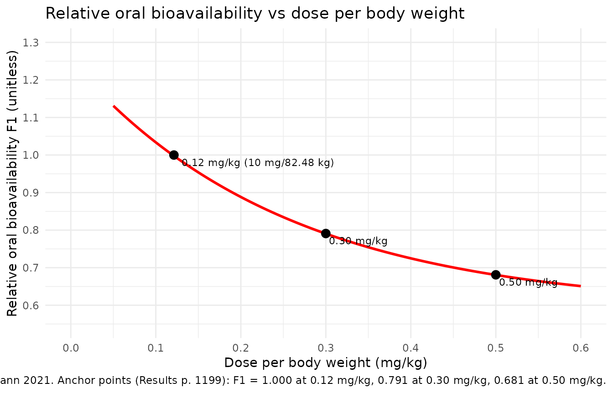
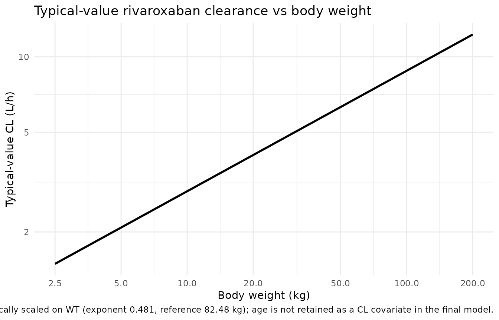

# Rivaroxaban pediatric (Willmann 2021)

## Model and source

- Citation: Willmann S, Coboeken K, Zhang Y, Mayer H, Ince I, Mesic E,
  Thelen K, Kubitza D, Lensing AWA, Yang H, Zhu P, Mueck W, Drenth HJ,
  Lippert J. Population pharmacokinetic analysis of rivaroxaban in
  children and comparison to prospective physiologically-based
  pharmacokinetic predictions. CPT Pharmacometrics Syst Pharmacol.
  2021;10(10):1195-1207. <doi:10.1002/psp4.12688>
- Description: Pediatric population PK model for rivaroxaban developed
  on the integrated EINSTEIN-Jr phase I / I-II / II / III dataset and
  interim PK from part A of the UNIVERSE study (524 children, 1988
  plasma concentrations, age birth to \<18 years, body weight 2.7-194
  kg). Two-compartment disposition with first-order absorption and
  first-order elimination from the central compartment. Body weight
  enters as estimated allometric scaling on CL, Q, Vc, and Vp, centred
  on the 82.48 kg median of the integrated adult popPK analysis (a
  shared exponent is used for Vc and Vp). The undiluted ready-to-use
  oral suspension has a lower first-order absorption rate constant ka
  than the other three formulations (tablet, granules for oral
  suspension, and diluted ready-to-use oral suspension), which share a
  common ka. Relative oral bioavailability decreases with dose per body
  weight following an exponential function carried over from the
  integrated adult popPK analysis (anchored to F1 = 1 at 10 mg / 82.48
  kg = 0.1213 mg/kg). Inter-individual variability is on CL and F1 only
  (no IIV on Ka, Vc, Vp, or Q); residual error is proportional. Age,
  eGFR (Schwartz and Rhodin), serum creatinine, comedications (CYP3A4
  inhibitors / inducers, P-gp inhibitors), and Fontan status were tested
  and not retained.
- Article: <https://doi.org/10.1002/psp4.12688>

## Population

The integrated pediatric popPK analysis pooled 1988 rivaroxaban plasma
concentrations from 524 children (47.1% female) across the EINSTEIN-Jr
phase I, I-II, II, and III studies for acute venous thromboembolism and
the UNIVERSE phase III part A study in post-Fontan children with
congenital heart disease (Willmann 2021 Table 1; supplement Table S1).
Body weight spanned 2.7-194 kg (median 29.5) and age birth to less than
18 years (median 9.0). Eighty-six subjects (16.4%) were younger than two
years. Bodyweight-adjusted doses ranged 0.4-20 mg per administration
with once-daily, twice-daily, or thrice-daily regimens stratified by
weight band (Willmann 2021 Discussion p. 1201: o.d. for body weight
\>=30 kg, b.i.d. for 12-\<30 kg, t.i.d. for \<12 kg).

Programmatic metadata:
`rxode2::rxode(readModelDb("Willmann_2021_rivaroxaban"))$population`.

## Source trace

Every parameter’s in-file source-trace comment in
`inst/modeldb/specificDrugs/Willmann_2021_rivaroxaban.R` is reproduced
here for one-place auditing.

| Element | Value (with units) | Source location |
|----|----|----|
| ka (tablets, granules, diluted suspension) | 0.799 1/h | Willmann 2021 Table 2 |
| ka (undiluted ready-to-use oral suspension) | 0.226 1/h | Willmann 2021 Table 2 |
| CL at 82.48 kg | 8.02 L/h | Willmann 2021 Table 2 |
| Vc at 82.48 kg | 53.2 L | Willmann 2021 Table 2 |
| Vp at 82.48 kg | 59.1 L | Willmann 2021 Table 2 |
| Q at 82.48 kg | 2.50 L/h | Willmann 2021 Table 2 |
| Allometric WT exponent on CL | 0.481 | Willmann 2021 Table 2 (estimated) |
| Allometric WT exponent on Vc and Vp (shared) | 0.821 | Willmann 2021 Table 2 (estimated) |
| Allometric WT exponent on Q | 0.761 | Willmann 2021 Table 2 (estimated) |
| F1MAX (upper asymptote of F1 vs DW) | 1.25 (fixed, a priori) | Willmann 2021 supplement S2 NONMEM \$PK |
| F1MIN (lower asymptote of F1 vs DW) | 0.59 (fixed, a priori) | Willmann 2021 supplement S2 NONMEM \$PK |
| D50 (half-decline dose per WT) | 14.4/82.48 mg/kg (fixed) | Willmann 2021 supplement S2 NONMEM \$PK |
| omega^2 on CL | 0.0705 | Willmann 2021 Table 2 (footnote g: CV 27.0%) |
| omega^2 on F1 | 0.0612 | Willmann 2021 Table 2 (footnote g: CV 25.1%) |
| sigma^2 proportional residual | 0.220 (propSd = 0.4690) | Willmann 2021 Table 2 (footnote h: 46.9%) |
| 2-compartment ODE structure | n/a | Willmann 2021 Methods p. 1196; supplement S2 ADVAN4 TRANS4 |
| F1 = TF1 \* exp(eta), TF1 = F1MIN + … | n/a | Willmann 2021 supplement S2 NONMEM \$PK block (a priori from reference 19) |

## Replicate Figure 2: relative oral bioavailability vs dose per body weight

The dose-dependent relative oral bioavailability function in the model
is hard-coded a priori from the integrated adult popPK analysis
(Willmann 2021 reference 19) after re-anchoring to F1 = 1.0 at 10 mg /
82.48 kg = 0.1213 mg/kg. We reproduce it algebraically (Figure 2 of the
paper).

``` r

f1max <- 1.25
f1min <- 0.59
d50   <- 14.4 / 82.48

dw_grid <- seq(0.05, 0.6, length.out = 200)
f1_grid <- f1min + (f1max - f1min) * exp(-log(2) / d50 * dw_grid)

f1_df <- data.frame(dw = dw_grid, f1 = f1_grid)

anchor_points <- data.frame(
  dw    = c(0.1213, 0.30, 0.50),
  f1    = c(1.000,  0.791, 0.681),
  label = c("0.12 mg/kg (10 mg/82.48 kg)", "0.30 mg/kg", "0.50 mg/kg")
)

ggplot(f1_df, aes(dw, f1)) +
  geom_line(colour = "red", linewidth = 1) +
  geom_point(data = anchor_points, aes(dw, f1), size = 3) +
  geom_text(data = anchor_points, aes(dw, f1, label = label),
            hjust = -0.05, vjust = 1.5, size = 3) +
  scale_x_continuous(breaks = seq(0, 0.6, 0.1), limits = c(0, 0.6)) +
  scale_y_continuous(breaks = seq(0.5, 1.3, 0.1), limits = c(0.55, 1.30)) +
  labs(
    x = "Dose per body weight (mg/kg)",
    y = "Relative oral bioavailability F1 (unitless)",
    title = "Relative oral bioavailability vs dose per body weight",
    caption = paste(
      "Replicates Figure 2 of Willmann 2021. Anchor points (Results p. 1199):",
      "F1 = 1.000 at 0.12 mg/kg, 0.791 at 0.30 mg/kg, 0.681 at 0.50 mg/kg."
    )
  ) +
  theme_minimal()
```



## Replicate Figure 3: clearance vs body weight (typical-value)

The model’s typical-value clearance follows the allometric form
`cl = 8.02 * (WT/82.48)^0.481`. The paper’s Figure 3 plots individual
post-hoc CL estimates against age; here we draw the typical-value curve
versus body weight (which is the model’s actual covariate; age is not
retained as a CL covariate in the final model).

``` r

wt_grid <- exp(seq(log(2.5), log(200), length.out = 200))
cl_typ <- 8.02 * (wt_grid / 82.48)^0.481

cl_df <- data.frame(WT = wt_grid, cl = cl_typ)

ggplot(cl_df, aes(WT, cl)) +
  geom_line(linewidth = 1) +
  scale_x_log10(breaks = c(2.5, 5, 10, 20, 50, 100, 200)) +
  scale_y_log10(breaks = c(0.5, 1, 2, 5, 10, 20)) +
  labs(
    x = "Body weight (kg)",
    y = "Typical-value CL (L/h)",
    title = "Typical-value rivaroxaban clearance vs body weight",
    caption = paste(
      "Underlies Figure 3 of Willmann 2021 (which plots CL vs age).",
      "CL is allometrically scaled on WT (exponent 0.481, reference 82.48 kg);",
      "age is not retained as a CL covariate in the final model."
    )
  ) +
  theme_minimal()
```



## Virtual cohort for steady-state simulation

We build a pooled multi-cohort event table that mirrors the EINSTEIN-Jr
phase III by-age-group dosing scheme used by Willmann 2021 to compute
the steady-state exposure metrics in supplement Table S2. Each cohort
uses the cohort mean body weight (supplement Table S1) and a
representative phase-III bodyweight-banded daily dose split across the
regimen (o.d., b.i.d., or t.i.d.) appropriate for the weight band
(Willmann 2021 Discussion p. 1201). Doses are administered as the tablet
/ granule / diluted formulation (`FORM_UNDILUTED_SUSP = 0`).

``` r

set.seed(20210710L)

make_cohort <- function(age_group, n, wt_kg, total_daily_mg, regimen,
                        id_offset, days = 14) {
  per_dose_mg <- total_daily_mg / regimen
  tau_h <- 24 / regimen
  dose_times <- seq(0, days * 24 - tau_h, by = tau_h)
  obs_times <- sort(unique(c(
    dose_times,
    seq(0, days * 24, by = 1)
  )))

  ids <- id_offset + seq_len(n)

  dose_rows <- tidyr::expand_grid(id = ids, time = dose_times) |>
    dplyr::mutate(
      amt  = per_dose_mg,
      evid = 1L,
      cmt  = "depot"
    )
  obs_rows <- tidyr::expand_grid(id = ids, time = obs_times) |>
    dplyr::mutate(
      amt  = NA_real_,
      evid = 0L,
      cmt  = "central"
    )

  events <- dplyr::bind_rows(dose_rows, obs_rows) |>
    dplyr::arrange(id, time, dplyr::desc(evid)) |>
    dplyr::mutate(
      age_group           = age_group,
      regimen             = regimen,
      total_daily_mg      = total_daily_mg,
      per_dose_mg         = per_dose_mg,
      WT                  = wt_kg,
      FORM_UNDILUTED_SUSP = 0L,
      DOSE_RIV_MGKG       = per_dose_mg / wt_kg
    )

  events
}

cohorts <- dplyr::bind_rows(
  make_cohort(age_group = "12 to <18 years",     n = 30, wt_kg = 67.9,
              total_daily_mg = 20.0, regimen = 1L, id_offset =   0L),
  make_cohort(age_group = "6 to <12 years",      n = 30, wt_kg = 32.4,
              total_daily_mg = 20.0, regimen = 1L, id_offset = 100L),
  make_cohort(age_group = "2 to <6 years",       n = 30, wt_kg = 16.4,
              total_daily_mg = 12.0, regimen = 2L, id_offset = 200L),
  make_cohort(age_group = "6 months to <2 years",n = 30, wt_kg =  9.49,
              total_daily_mg =  9.0, regimen = 3L, id_offset = 300L),
  make_cohort(age_group = "birth to <6 months",  n = 30, wt_kg =  4.05,
              total_daily_mg =  6.0, regimen = 3L, id_offset = 400L)
)

stopifnot(!anyDuplicated(unique(cohorts[, c("id", "time", "evid")])))
```

## Simulate steady-state PK

``` r

mod <- rxode2::rxode(nlmixr2lib::readModelDb("Willmann_2021_rivaroxaban"))

sim <- rxode2::rxSolve(
  mod,
  events = cohorts,
  keep = c("age_group", "regimen", "total_daily_mg", "per_dose_mg",
           "WT", "FORM_UNDILUTED_SUSP", "DOSE_RIV_MGKG")
) |>
  as.data.frame()

# Convert plasma concentration mg/L -> ug/L to match the paper's reporting units.
sim$Cc_ugL <- sim$Cc * 1000
```

## Steady-state interval (day 13 to day 14)

The paper’s supplement Table S2 reports steady-state AUC(0-24)ss,
Cmax,ss, and Ctrough,ss. We extract the day-13 to day-14 dosing window
(the model has reached effective steady state for clearance-driven
exposure by that point) and compute PKNCA-based exposure metrics.

``` r

tau <- 24

# Restrict to the final 24 h window for steady-state NCA.
ss_window <- sim |>
  dplyr::filter(time >= (14 - 1) * 24, time <= 14 * 24) |>
  dplyr::mutate(time_ss = time - (14 - 1) * 24)

sim_nca <- ss_window |>
  dplyr::filter(!is.na(Cc)) |>
  dplyr::select(id, time_ss, Cc = Cc_ugL, age_group)

# Defensive time-zero guarantee: if the per-id grid did not produce a
# time_ss = 0 row, add one with Cc = trough (the value at the start of
# the interval).
trough_rows <- sim_nca |>
  dplyr::group_by(id, age_group) |>
  dplyr::slice_min(time_ss, n = 1, with_ties = FALSE) |>
  dplyr::ungroup() |>
  dplyr::mutate(time_ss = 0)

sim_nca <- dplyr::bind_rows(sim_nca, trough_rows) |>
  dplyr::distinct(id, age_group, time_ss, .keep_all = TRUE) |>
  dplyr::arrange(id, age_group, time_ss)

dose_df <- cohorts |>
  dplyr::filter(evid == 1L, time >= (14 - 1) * 24, time < 14 * 24) |>
  dplyr::mutate(time_ss = time - (14 - 1) * 24) |>
  dplyr::select(id, time_ss, amt, age_group)

conc_obj <- PKNCA::PKNCAconc(sim_nca, Cc ~ time_ss | age_group + id)
dose_obj <- PKNCA::PKNCAdose(dose_df, amt ~ time_ss | age_group + id)

intervals <- data.frame(
  start    = 0,
  end      = tau,
  cmax     = TRUE,
  tmax     = TRUE,
  cmin     = TRUE,
  auclast  = TRUE
)

nca_res <- PKNCA::pk.nca(PKNCA::PKNCAdata(conc_obj, dose_obj,
                                          intervals = intervals))

nca_summary <- as.data.frame(nca_res$result) |>
  dplyr::filter(PPTESTCD %in% c("cmax", "cmin", "auclast")) |>
  dplyr::group_by(age_group, PPTESTCD) |>
  dplyr::summarise(value = exp(mean(log(PPORRES[PPORRES > 0]))),
                   .groups = "drop") |>
  tidyr::pivot_wider(names_from = PPTESTCD, values_from = value)

knitr::kable(
  nca_summary,
  digits = c(NA, 0, 1, 0),
  caption = paste(
    "Simulated steady-state NCA (geometric mean across cohort subjects)",
    "for the day 13-14 dosing window, by age group."
  ),
  col.names = c("Age group", "AUC0-tau (ug*h/L)", "Cmin,ss (ug/L)",
                "Cmax,ss (ug/L)")
)
```

| Age group             | AUC0-tau (ug\*h/L) | Cmin,ss (ug/L) | Cmax,ss (ug/L) |
|:----------------------|-------------------:|---------------:|---------------:|
| 12 to \<18 years      |               2302 |          237.7 |             26 |
| 2 to \<6 years        |               2430 |          198.3 |             30 |
| 6 months to \<2 years |               2397 |          161.6 |             38 |
| 6 to \<12 years       |               2454 |          327.3 |             18 |
| birth to \<6 months   |               2316 |          171.4 |             29 |

Simulated steady-state NCA (geometric mean across cohort subjects) for
the day 13-14 dosing window, by age group. {.table}

### Comparison against published Table S2 popPK exposure metrics

Willmann 2021 supplement Table S2 reports geometric-mean AUC(0-24)ss,
Cmax,ss, and Ctrough,ss in each age group, derived from individual
post-hoc PopPK predictions of the EINSTEIN-Jr phase III study subjects.
The simulated typical-cohort exposures below should fall within the same
order of magnitude; per-age-group discrepancy reflects (a) the
allometric scaling underprediction of clearance for children under 2
years (Willmann 2021 Discussion p. 1201) and (b) cohort heterogeneity
that this typical-value cohort does not capture.

``` r

published <- tibble::tribble(
  ~age_group,               ~auc_pop,  ~cmax_pop,  ~ctrough_pop,
  "12 to <18 years",         2120,      237,        20.7,
  "6 to <12 years",          1960,      184,        21.4,
  "2 to <6 years",           2380,      182,        31.6,
  "6 months to <2 years",    1740,      129,        21.2,
  "birth to <6 months",      1740,      129,        21.2
)

cmp <- dplyr::left_join(nca_summary, published, by = "age_group") |>
  dplyr::transmute(
    `Age group`              = age_group,
    `AUC0-tau (sim, ug*h/L)` = round(auclast, 0),
    `AUC0-tau (paper)`       = auc_pop,
    `Cmax,ss (sim, ug/L)`    = round(cmax, 0),
    `Cmax,ss (paper)`        = cmax_pop,
    `Ctrough,ss (sim, ug/L)` = round(cmin, 1),
    `Ctrough,ss (paper)`     = ctrough_pop
  )

knitr::kable(
  cmp,
  caption = paste(
    "Simulated vs. published popPK-derived steady-state NCA",
    "(Willmann 2021 supplement Table S2; the paper pools the birth-<6 mo and",
    "6 mo-<2 yr groups into a single birth-<2 yr stratum, so both cohorts",
    "compare against the same Table S2 row)."
  )
)
```

| Age group | AUC0-tau (sim, ug\*h/L) | AUC0-tau (paper) | Cmax,ss (sim, ug/L) | Cmax,ss (paper) | Ctrough,ss (sim, ug/L) | Ctrough,ss (paper) |
|:---|---:|---:|---:|---:|---:|---:|
| 12 to \<18 years | 2302 | 2120 | 238 | 237 | 26.4 | 20.7 |
| 2 to \<6 years | 2430 | 2380 | 198 | 182 | 29.5 | 31.6 |
| 6 months to \<2 years | 2397 | 1740 | 162 | 129 | 38.2 | 21.2 |
| 6 to \<12 years | 2454 | 1960 | 327 | 184 | 18.2 | 21.4 |
| birth to \<6 months | 2316 | 1740 | 171 | 129 | 28.6 | 21.2 |

Simulated vs. published popPK-derived steady-state NCA (Willmann 2021
supplement Table S2; the paper pools the birth-\<6 mo and 6 mo-\<2 yr
groups into a single birth-\<2 yr stratum, so both cohorts compare
against the same Table S2 row). {.table}

## Assumptions and deviations

- **Representative per-age-group cohort.** The vignette uses a single
  representative body weight (cohort mean from supplement Table S1) and
  a single representative phase-III bodyweight-banded daily dose per age
  group; the actual EINSTEIN-Jr phase III cohort spans a wider weight
  range and individual dose per body weight varies across weight bands.
  The supplementary Table S2 figures pool over the full per-subject
  weight / dose variability, so per-cohort discrepancy is expected.
- **No upstream / downstream cohort-mixing.** Each cohort uses disjoint
  IDs via `id_offset` (Robbie 2012 / Clegg 2024 pattern); duplicate IDs
  across cohorts would silently merge into Frankenstein subjects in
  `rxSolve`.
- **Race / ethnicity not modelled.** No effect of Japanese, Chinese, or
  Asian (outside Japan and China) origin was retained in the final model
  (Willmann 2021 Results p. 1199 and supplementary Figures S7-S9); the
  cohort does not stratify on race.
- **Age not retained as a CL covariate.** Willmann 2021 Results p. 1199:
  “No effect of age on CL or F1 could be identified by the model.” The
  population CL is allometrically scaled on weight only. The paper’s
  Figure 3 shows that the popPK model underpredicts clearance in
  children below 2 years of age relative to individual EBE estimates,
  but this is a known limitation and is not captured by the structural
  model.
- **Renal function, comedication, and Fontan status not retained.** Four
  measures of renal function (eGFR Schwartz, eGFR Rhodin, serum
  creatinine ratio to ULN, categorical creatinine score), three CYP3A4
  comedication indicators (weak inhibitor, moderate inhibitor, inducer),
  P-gp inhibitor, and Fontan status were tested. None were retained in
  the final model (Willmann 2021 Results p. 1199). These are documented
  in `covariatesDataExcluded` of the model file metadata for provenance
  but are not used in the structural model.
- **Steady-state day choice.** The simulation runs 14 days of dosing and
  extracts the day-13 to day-14 dosing window for NCA; with a typical
  rivaroxaban terminal half-life around 4-12 h depending on weight,
  steady state is comfortably reached by then.
- **F1 anchoring.** The `f1max`, `f1min`, and `d50` constants are
  reproduced verbatim from the supplement S2 NONMEM `$PK` block. They
  are not estimated by the pediatric fit (held as a priori constants
  carried over from the integrated adult popPK analysis in Willmann 2021
  reference 19).
