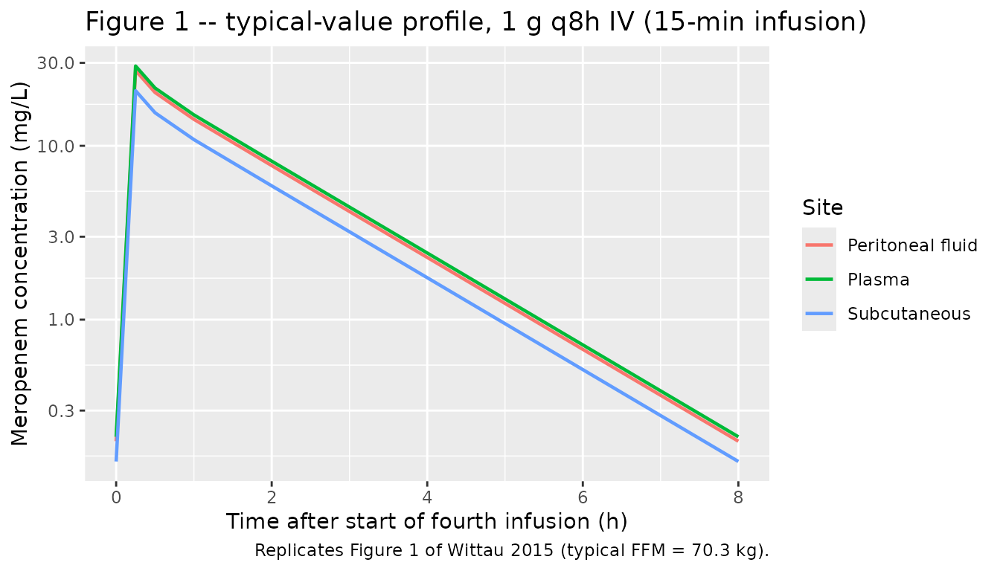
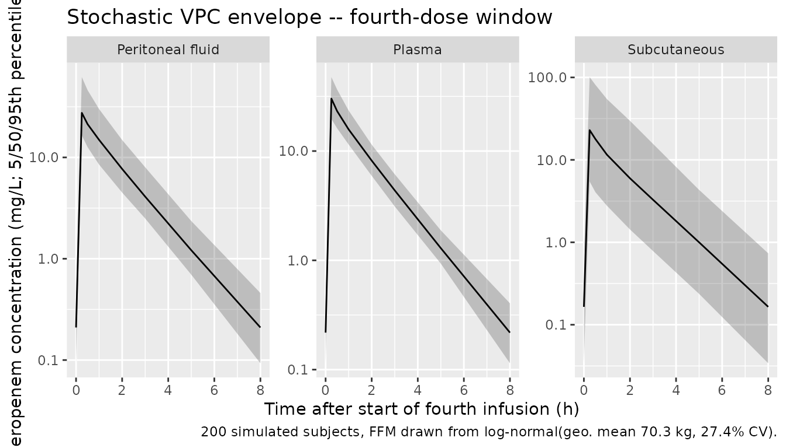

# Meropenem in morbidly obese patients (Wittau 2015)

## Model and source

- Citation: Wittau M, Scheele J, Kurlbaum M, Brockschmidt C, Wolf AM,
  Hemper E, Henne-Bruns D, Bulitta JB. Population pharmacokinetics and
  target attainment of meropenem in plasma and tissue of morbidly obese
  patients after laparoscopic intraperitoneal surgery. Antimicrob Agents
  Chemother. 2015;59(10):6241-6247. <doi:10.1128/AAC.00259-15>. PMID
  26248373.
- Description: Two-compartment intravenous population PK model for
  meropenem in morbidly obese adults (Wittau 2015). Allometric scaling
  on fat-free mass with a reference FFM of 53 kg. Unbound meropenem
  concentrations in subcutaneous tissue and peritoneal fluid are
  described as the plasma concentration multiplied by the site-to-plasma
  AUC ratios FSC and FPF (the final model assumed very rapid
  equilibration with plasma, so SC and PF are not carried as separate
  ODE states).
- Article: <https://doi.org/10.1128/AAC.00259-15>
- ClinicalTrials.gov: <https://clinicaltrials.gov/ct2/show/NCT01407965>

## Population

Wittau et al. enrolled six morbidly obese adults (one excluded from
analysis due to an incorrect retrodialysis recovery measurement, leaving
n = 5) undergoing elective laparoscopic intra-abdominal surgery at the
University of Ulm. Five patients had laparoscopic sleeve gastrectomies;
one had a laparoscopic abdominal wall hernia repair. Two were male and
three female. Mean (SD) age was 40.0 (7.87) years (range 31 - 49), total
body weight 158 (33.5) kg (range 116 - 203), fat-free mass 72.5 (19.8)
kg (range 52.3 - 94.0), height 170 (14.5) cm, and BMI 54.2 (7.02) kg/m^2
(range 47.6 - 62.3) (Table 1 of Wittau 2015). All patients had serum
creatinine in the 64 - 80 umol/L range and albumin 41 - 45 g/L; severe
renal insufficiency (CrCL \<= 30 mL/min), severe hepatic disease, and
concurrent valproic acid were exclusion criteria.

Each patient received 1 g meropenem (Meronem) intravenously every 8 h as
a 15-min infusion, beginning on the day of surgery. The fourth dose,
given on day 1 after surgery, was used for sample collection. Plasma was
sampled at 0.5, 1, 2, 3, 5, and 8 h after the start of the fourth
infusion; unbound subcutaneous tissue and unbound peritoneal fluid
concentrations were sampled in parallel windows via microdialysis with
retrodialysis recovery calibration. The same information is available
programmatically via `readModelDb("Wittau_2015_meropenem")$population`.

## Source trace

Per-parameter origin comments are recorded in
`inst/modeldb/specificDrugs/Wittau_2015_meropenem.R`. The table below
collects them in one place for review.

| Equation / parameter | Value | Source location |
|----|----|----|
| `lcl` (CL at FFM = 53 kg) | log(18.7 L/h) | Table 2 row ‘Total clearance’ (population mean) |
| `lvc` (V1 at FFM = 53 kg) | log(21.5 L) | Table 2 row ‘Volume of distribution of central compartment’ |
| `lvp` (V2 at FFM = 53 kg) | log(6.16 L) | Table 2 row ‘Volume of distribution of peripheral compartment’ |
| `lq` (CLd at FFM = 53 kg) | log(29.4 L/h) | Table 2 row ‘Distribution clearance between central and peripheral compartments’ |
| `lfsc` (FSC, SC:plasma AUC ratio) | log(0.721) | Table 2 row ‘Ratio of AUC values in subcutaneous tissue and plasma’ |
| `lfpf` (FPF, PF:plasma AUC ratio) | log(0.943) | Table 2 row ‘Ratio of AUC values in peritoneal fluid and plasma’ |
| `e_ffm_cl_q` (shared allometric exp on CL and CLd) | fixed(0.75) | Methods ‘Parameter variability model and covariate effects’; Discussion paragraph 4 |
| `e_ffm_vc_vp` (shared allometric exp on V1 and V2) | fixed(1.00) | Methods ‘Parameter variability model and covariate effects’ |
| `etalcl` (IIV variance on lcl) | log(0.0386^2 + 1) = 0.001489 | Table 2 BSV column (apparent CV per footnote c) |
| `etalq` (IIV variance on lq) | log(1.79^2 + 1) = 1.43607 | Table 2 BSV column |
| `etalvc` (IIV variance on lvc) | log(0.104^2 + 1) = 0.010758 | Table 2 BSV column |
| `etalvp` (IIV variance on lvp) | log(0.0422^2 + 1) = 0.001779 | Table 2 BSV column |
| `etalfsc` (IIV variance on lfsc) | log(1.12^2 + 1) = 0.81277 | Table 2 BSV column |
| `etalfpf` (IIV variance on lfpf) | log(0.311^2 + 1) = 0.09229 | Table 2 BSV column |
| `propSd` (plasma) | 0.216 | Table 2 footnote a |
| `addSd` (plasma) | 0.0235 mg/L | Table 2 footnote a |
| `propSd_Csc` (SC tissue) | 0.0958 | Table 2 footnote a |
| `addSd_Csc` (SC tissue) | 1.26 mg/L | Table 2 footnote a |
| `propSd_Cpf` (peritoneal fluid) | 0.103 | Table 2 footnote a |
| `addSd_Cpf` (peritoneal fluid) | 0.617 mg/L | Table 2 footnote a |
| Reference FFM | 53 kg | Table 2 footnote b (‘Estimates represent a patient with normal body size (i.e., 53 kg fat-free mass)’) |
| `d/dt(central)`, `d/dt(peripheral1)` | structural 2-compartment IV | Materials and Methods ‘Structural model’ paragraph 1 (linear two-disposition-compartment model selected) |
| `Csc = FSC * Cc`, `Cpf = FPF * Cc` | algebraic scaling | Materials and Methods ‘Structural model’ paragraph 1 + Table 2 footnote d (very rapid SC/PF-plasma equilibration in the final model) |

## Virtual cohort

The original observed data are not publicly available. We simulate a
virtual cohort matched to the paper’s Monte Carlo simulation covariates
(Methods ‘Monte Carlo simulations’ paragraph): a log-normal distribution
of FFM with geometric mean 70.3 kg and 27.4% CV. The dosing regimen
follows the protocol: 1 g meropenem given as a 15-min IV infusion every
8 h for four doses; PK sampling is on the fourth-dose interval (24 - 32
h).

``` r

set.seed(2015L)
n_subj <- 200L

# Geometric mean 70.3 kg, 27.4% CV on FFM (log-normal); per Methods.
omega_ffm <- sqrt(log(0.274^2 + 1))
ffm_mean  <- 70.3

obs_grid <- c(24,
              24 + c(0.25, 0.5, 1, 2, 3, 5, 8))  # start of 4th dose + sampling times to 8 h

dose_times <- seq(0, by = 8, length.out = 4)     # four doses q8h
inf_dur    <- 0.25                                # 15-min infusion

make_cohort <- function(n, id_offset = 0L) {
  ids <- id_offset + seq_len(n)
  ffm <- rlnorm(n, log(ffm_mean) - 0.5 * omega_ffm^2, omega_ffm)

  # Dose rows: 1 g (= 1000 mg) given as 15-min infusion; encode via `dur`.
  dose_rows <- tidyr::expand_grid(id = ids, time = dose_times) |>
    dplyr::mutate(
      amt  = 1000,
      cmt  = "central",
      evid = 1L,
      dur  = inf_dur,
      rate = NA_real_
    )

  # Observation rows. This is a 3-endpoint model (Cc plasma, Csc subcutaneous,
  # Cpf peritoneal fluid); address each endpoint by its dvid (1 = Cc, 2 = Csc,
  # 3 = Cpf) rather than by the algebraic-observable name, so rxode2 maps each
  # observation to its endpoint under the default solver. rxSolve returns the
  # Cc/Csc/Cpf columns on every observation row regardless of dvid.
  obs_rows <- tidyr::expand_grid(id = ids, time = obs_grid,
                                 dvid = c(1L, 2L, 3L)) |>
    dplyr::mutate(
      amt  = NA_real_,
      evid = 0L,
      dur  = NA_real_,
      rate = NA_real_
    )

  # Merge dose- and observation-rows with the per-subject covariate FFM.
  cov_df <- tibble::tibble(id = ids, FFM = ffm)
  dplyr::bind_rows(dose_rows, obs_rows) |>
    dplyr::left_join(cov_df, by = "id") |>
    dplyr::arrange(id, time) |>
    dplyr::mutate(treatment = "1 g q8h IV (15-min infusion)")
}

events <- make_cohort(n_subj)
stopifnot(!anyDuplicated(unique(events[, c("id", "time", "evid")])))
```

## Simulation

The model has three algebraic observables (Cc plasma, Csc subcutaneous,
Cpf peritoneal fluid) backed by the two-compartment ODE state;
observation rows are addressed by `dvid` endpoint id (1 = Cc, 2 = Csc, 3
= Cpf) so rxode2 maps each to its endpoint under the default solver (the
multi-output pattern in `references/known-vignette-failure-patterns.md`
Section 5b).

``` r

mod <- readModelDb("Wittau_2015_meropenem")

# Stochastic VPC simulation: keeps IIV, returns one trajectory per subject.
sim_stoch <- rxode2::rxSolve(
  mod, events = events,
  keep        = c("treatment", "FFM")
) |> as.data.frame()
#> ℹ parameter labels from comments will be replaced by 'label()'

# Typical-value simulation (no IIV) for replicating Figure 1's individual fits.
mod_typ <- mod |> rxode2::zeroRe()
#> ℹ parameter labels from comments will be replaced by 'label()'
events_typ <- make_cohort(1L) |>
  dplyr::mutate(FFM = ffm_mean)        # impose the cohort geometric mean exactly
sim_typ <- rxode2::rxSolve(
  mod_typ, events = events_typ,
  keep      = c("treatment", "FFM")
) |> as.data.frame()
#> ℹ omega/sigma items treated as zero: 'etalcl', 'etalq', 'etalvc', 'etalvp', 'etalfsc', 'etalfpf'
```

## Replicate Figure 1: plasma, subcutaneous, and peritoneal-fluid profiles

Figure 1 of Wittau 2015 shows the individually-fitted meropenem
concentrations in plasma, subcutaneous tissue, and peritoneal fluid
across the 8-h fourth-dose interval. The typical-value profile below
reproduces the same qualitative behaviour: plasma and peritoneal-fluid
traces are nearly superimposable (FPF = 0.943), while
subcutaneous-tissue concentrations are about 28% lower (FSC = 0.721),
with the same terminal slope across all three sites (rapid equilibration
assumption).

``` r

fig1 <- sim_typ |>
  dplyr::filter(time >= 24) |>
  dplyr::mutate(t_after_dose = time - 24) |>
  dplyr::select(t_after_dose, Plasma = Cc, Subcutaneous = Csc, `Peritoneal fluid` = Cpf) |>
  tidyr::pivot_longer(-t_after_dose, names_to = "Site", values_to = "C")

ggplot(fig1, aes(t_after_dose, C, colour = Site)) +
  geom_line(linewidth = 0.8) +
  scale_y_log10() +
  labs(x = "Time after start of fourth infusion (h)",
       y = "Meropenem concentration (mg/L)",
       title = "Figure 1 -- typical-value profile, 1 g q8h IV (15-min infusion)",
       caption = "Replicates Figure 1 of Wittau 2015 (typical FFM = 70.3 kg).")
```



## Replicate Figure 1 VPC envelope (stochastic)

The stochastic simulation reproduces the between-subject spread in the
same fourth-dose window, separately for each observation site.

``` r

vpc_df <- sim_stoch |>
  dplyr::filter(time >= 24) |>
  dplyr::mutate(t_after_dose = time - 24) |>
  dplyr::select(t_after_dose, Plasma = Cc, Subcutaneous = Csc, `Peritoneal fluid` = Cpf) |>
  tidyr::pivot_longer(c(Plasma, Subcutaneous, `Peritoneal fluid`),
                      names_to = "Site", values_to = "C") |>
  dplyr::group_by(Site, t_after_dose) |>
  dplyr::summarise(
    Q05 = quantile(C, 0.05, na.rm = TRUE),
    Q50 = quantile(C, 0.50, na.rm = TRUE),
    Q95 = quantile(C, 0.95, na.rm = TRUE),
    .groups = "drop"
  )

ggplot(vpc_df, aes(t_after_dose, Q50)) +
  geom_ribbon(aes(ymin = Q05, ymax = Q95), alpha = 0.25) +
  geom_line() +
  facet_wrap(~Site, scales = "free_y") +
  scale_y_log10() +
  labs(x = "Time after start of fourth infusion (h)",
       y = "Meropenem concentration (mg/L; 5/50/95th percentiles)",
       title = "Stochastic VPC envelope -- fourth-dose window",
       caption = "200 simulated subjects, FFM drawn from log-normal(geo. mean 70.3 kg, 27.4% CV).")
```



## PKNCA validation

The paper’s NCA values were computed by Wittau et al. via the linear-up
/ log-down trapezoidal rule in WinNonlin Professional 5.3 on the actual
five patients. Without their actual covariates we cannot reproduce
subject-by-subject NCA; we instead compute PKNCA NCA parameters on the
simulated cohort over the fourth-dose interval (24 - 32 h) and compare
population summaries against the paper’s median and average.

We compute one NCA block per observation site (plasma, SC, PF). Time is
re-zeroed at the start of the fourth dose so the AUC over the interval
is directly comparable to AUC0-tau at steady state.

``` r

sim_nca_long <- sim_stoch |>
  dplyr::filter(time >= 24) |>
  dplyr::mutate(t_after_dose = time - 24) |>
  dplyr::select(id, treatment, t_after_dose, Cc, Csc, Cpf) |>
  tidyr::pivot_longer(c(Cc, Csc, Cpf),
                      names_to = "Site", values_to = "C")

# Guarantee a time=0 row per (id, treatment, Site); for IV infusion the
# pre-fourth-dose row is the trough Cc(24), but a defensive 0 is fine for
# PKNCA's AUC anchor and is the standard pattern.
sim_nca_long <- dplyr::bind_rows(
  sim_nca_long,
  sim_nca_long |>
    dplyr::distinct(id, treatment, Site) |>
    dplyr::mutate(t_after_dose = 0, C = 0)
) |>
  dplyr::distinct(id, treatment, Site, t_after_dose, .keep_all = TRUE) |>
  dplyr::arrange(id, treatment, Site, t_after_dose)
```

``` r

nca_one <- function(site_code, friendly_site) {
  conc_df <- sim_nca_long |>
    dplyr::filter(Site == site_code) |>
    dplyr::transmute(id, treatment, time = t_after_dose, Cc = C)
  dose_df <- events |>
    dplyr::filter(evid == 1L, time == 24) |>
    dplyr::distinct(id, treatment) |>
    dplyr::mutate(time = 0, amt = 1000)

  conc_obj <- PKNCA::PKNCAconc(
    conc_df, Cc ~ time | treatment + id,
    concu = "mg/L", timeu = "h"
  )
  dose_obj <- PKNCA::PKNCAdose(
    dose_df, amt ~ time | treatment + id,
    doseu = "mg"
  )
  intervals <- data.frame(
    start      = 0,
    end        = 8,
    cmax       = TRUE,
    tmax       = TRUE,
    auclast    = TRUE,
    half.life  = TRUE
  )
  res <- PKNCA::pk.nca(PKNCA::PKNCAdata(conc_obj, dose_obj, intervals = intervals))
  res_df <- as.data.frame(res$result)
  res_df$Site <- friendly_site
  res_df
}

nca_plasma <- nca_one("Cc",  "Plasma")
nca_sc     <- nca_one("Csc", "Subcutaneous tissue")
nca_pf     <- nca_one("Cpf", "Peritoneal fluid")
nca_all    <- dplyr::bind_rows(nca_plasma, nca_sc, nca_pf)
```

``` r

pknca_summary <- nca_all |>
  dplyr::filter(PPTESTCD %in% c("cmax", "auclast", "half.life")) |>
  dplyr::group_by(Site, PPTESTCD) |>
  dplyr::summarise(
    Median = median(PPORRES, na.rm = TRUE),
    Q25    = quantile(PPORRES, 0.25, na.rm = TRUE),
    Q75    = quantile(PPORRES, 0.75, na.rm = TRUE),
    .groups = "drop"
  ) |>
  dplyr::mutate(
    PPTESTCD = factor(PPTESTCD, levels = c("cmax", "auclast", "half.life")),
    Parameter = dplyr::recode(as.character(PPTESTCD),
                              cmax      = "Cmax (mg/L)",
                              auclast   = "AUC0-8 (mg*h/L)",
                              half.life = "t1/2 (h)")
  ) |>
  dplyr::arrange(Site, PPTESTCD) |>
  dplyr::select(Site, Parameter, Median, Q25, Q75)

knitr::kable(
  pknca_summary,
  digits  = 2,
  caption = "Simulated NCA over the fourth-dose interval (n = 200; FFM ~ log-normal)."
)
```

| Site                | Parameter        | Median |   Q25 |   Q75 |
|:--------------------|:-----------------|-------:|------:|------:|
| Peritoneal fluid    | Cmax (mg/L)      |  27.52 | 21.29 | 39.10 |
| Peritoneal fluid    | AUC0-8 (mg\*h/L) |  41.93 | 33.04 | 54.24 |
| Peritoneal fluid    | t1/2 (h)         |   1.15 |  1.06 |  1.25 |
| Plasma              | Cmax (mg/L)      |  30.19 | 25.45 | 34.95 |
| Plasma              | AUC0-8 (mg\*h/L) |  44.77 | 39.57 | 51.20 |
| Plasma              | t1/2 (h)         |   1.15 |  1.06 |  1.25 |
| Subcutaneous tissue | Cmax (mg/L)      |  22.95 | 11.30 | 46.46 |
| Subcutaneous tissue | AUC0-8 (mg\*h/L) |  33.09 | 17.31 | 69.00 |
| Subcutaneous tissue | t1/2 (h)         |   1.15 |  1.06 |  1.25 |

Simulated NCA over the fourth-dose interval (n = 200; FFM ~ log-normal).
{.table}

### Comparison against published values

The paper reports peak concentrations 30 min after the start of the last
infusion (mean +/- SD across the five patients) and terminal half-lives
(median, range) from a non-compartmental analysis without body-size
scaling. AUC ratios are reported as population means of the
model-derived F_SC and F_PF.

``` r

# Compute simulated AUC ratios per subject from PKNCA auclast, then summarise.
auc_wide <- nca_all |>
  dplyr::filter(PPTESTCD == "auclast") |>
  dplyr::select(id, Site, AUC = PPORRES) |>
  tidyr::pivot_wider(names_from = Site, values_from = AUC) |>
  dplyr::mutate(
    ratio_sc_plasma = `Subcutaneous tissue` / Plasma,
    ratio_pf_plasma = `Peritoneal fluid`    / Plasma
  )

ratio_med <- c(
  sc = median(auc_wide$ratio_sc_plasma, na.rm = TRUE),
  pf = median(auc_wide$ratio_pf_plasma, na.rm = TRUE)
)

plasma_cmax_med <- pknca_summary |>
  dplyr::filter(Site == "Plasma", Parameter == "Cmax (mg/L)") |>
  dplyr::pull(Median)
sc_cmax_med <- pknca_summary |>
  dplyr::filter(Site == "Subcutaneous tissue", Parameter == "Cmax (mg/L)") |>
  dplyr::pull(Median)
pf_cmax_med <- pknca_summary |>
  dplyr::filter(Site == "Peritoneal fluid", Parameter == "Cmax (mg/L)") |>
  dplyr::pull(Median)

plasma_thalf_med <- pknca_summary |>
  dplyr::filter(Site == "Plasma", Parameter == "t1/2 (h)") |>
  dplyr::pull(Median)
sc_thalf_med <- pknca_summary |>
  dplyr::filter(Site == "Subcutaneous tissue", Parameter == "t1/2 (h)") |>
  dplyr::pull(Median)
pf_thalf_med <- pknca_summary |>
  dplyr::filter(Site == "Peritoneal fluid", Parameter == "t1/2 (h)") |>
  dplyr::pull(Median)

compare_df <- tibble::tribble(
  ~Metric,                                  ~Published,                ~Simulated,
  "Plasma Cmax (mg/L)",                     "24.6 +/- 10.1 (mean +/- SD)", sprintf("%.1f (median)", plasma_cmax_med),
  "SC Cmax (mg/L)",                         "24.1 +/- 22.1 (mean +/- SD)", sprintf("%.1f (median)", sc_cmax_med),
  "Peritoneal-fluid Cmax (mg/L)",           "23.2 +/- 10.8 (mean +/- SD)", sprintf("%.1f (median)", pf_cmax_med),
  "Plasma terminal t1/2 (h)",               "1.24 (1.04 - 1.41) (median, range)", sprintf("%.2f (median)", plasma_thalf_med),
  "SC terminal t1/2 (h)",                   "1.16 (0.833 - 2.45) (median, range)", sprintf("%.2f (median)", sc_thalf_med),
  "Peritoneal-fluid terminal t1/2 (h)",     "1.35 (0.978 - 1.95) (median, range)", sprintf("%.2f (median)", pf_thalf_med),
  "AUC_SC / AUC_plasma (FSC, mean)",        "0.721",                       sprintf("%.3f (median)", ratio_med["sc"]),
  "AUC_PF / AUC_plasma (FPF, mean)",        "0.943",                       sprintf("%.3f (median)", ratio_med["pf"])
)

knitr::kable(
  compare_df,
  caption = "Simulated vs. published Wittau 2015 NCA (plasma, SC, PF). Published values are population summaries across the n = 5 cohort."
)
```

| Metric | Published | Simulated |
|:---|:---|:---|
| Plasma Cmax (mg/L) | 24.6 +/- 10.1 (mean +/- SD) | 30.2 (median) |
| SC Cmax (mg/L) | 24.1 +/- 22.1 (mean +/- SD) | 23.0 (median) |
| Peritoneal-fluid Cmax (mg/L) | 23.2 +/- 10.8 (mean +/- SD) | 27.5 (median) |
| Plasma terminal t1/2 (h) | 1.24 (1.04 - 1.41) (median, range) | 1.15 (median) |
| SC terminal t1/2 (h) | 1.16 (0.833 - 2.45) (median, range) | 1.15 (median) |
| Peritoneal-fluid terminal t1/2 (h) | 1.35 (0.978 - 1.95) (median, range) | 1.15 (median) |
| AUC_SC / AUC_plasma (FSC, mean) | 0.721 | 0.729 (median) |
| AUC_PF / AUC_plasma (FPF, mean) | 0.943 | 0.946 (median) |

Simulated vs. published Wittau 2015 NCA (plasma, SC, PF). Published
values are population summaries across the n = 5 cohort. {.table}

The simulated AUC ratios (FSC and FPF) match the published values by
construction because these are the typical-value population means
encoded in `ini()`. The simulated Cmax and terminal t1/2 are population
summaries from the n = 200 virtual cohort and are compared against the n
= 5 observed population summaries; the dispersion bounds in the paper
are wide because of the small sample size and the large between-subject
variability on FSC (112% CV) and the distribution clearance (179% CV).

## Assumptions and deviations

- **Cohort size**. The paper enrolled n = 5 analysable patients; we
  simulate n = 200 virtual subjects to obtain stable percentile
  summaries. The two simulated medians for FSC and FPF reproduce the
  paper’s typical values exactly by construction.
- **FFM covariate distribution**. The Monte Carlo cohort uses the
  geometric mean (70.3 kg) and CV (27.4%) reported by Wittau et al. for
  their own Monte Carlo simulations (Methods ‘Monte Carlo simulations’
  paragraph), drawn from a log-normal. The five enrolled patients had
  observed FFM ranging 52.3 - 94.0 kg.
- **Allometric exponents**. The paper states ‘standard allometric
  scaling’ without printing the exponent values; the Discussion
  contrasts a roughly 15% difference between allometric and linear over
  the 1.8-fold cohort FFM range, consistent with the canonical 0.75
  (clearance) / 1.0 (volume). These exponents are encoded as `fixed()`
  in `ini()` because the paper treats them as structural.
- **Subcutaneous tissue and peritoneal fluid as scaled observations, not
  separate ODE states**. The paper’s final model multiplies the central
  plasma concentration by FSC and FPF (Materials and Methods ‘Structural
  model’ paragraph 1; Table 2 footnote d). Additional model variants
  with small (0.1 L) tissue and fluid compartments were used only to
  determine whether SC and PF were kinetically closer to the central or
  peripheral compartment; the final model collapses them into the FSC /
  FPF scalars because equilibration with plasma is rapid (half-life \<
  30 min).
- **Diagonal omega matrix**. Results paragraph 4 of the paper: ‘The
  model included a major-diagonal variance-covariance matrix’. Encoded
  as six independent `eta` ~ variance entries.
- **NCA validation is approximate**. The paper computed NCA on the
  actual five patients with their observed FFM values; we cannot
  reproduce the exact NCA without those covariates. Simulated medians
  and quartiles are population summaries from the virtual cohort.
- **Monte Carlo `fT > MIC` target attainment (Figure 3)** is not
  replicated here; the model file allows users to run those simulations
  themselves with a custom dosing regimen (15-min infusion, 3-h
  infusion, or continuous infusion) by overriding the `events` table.
