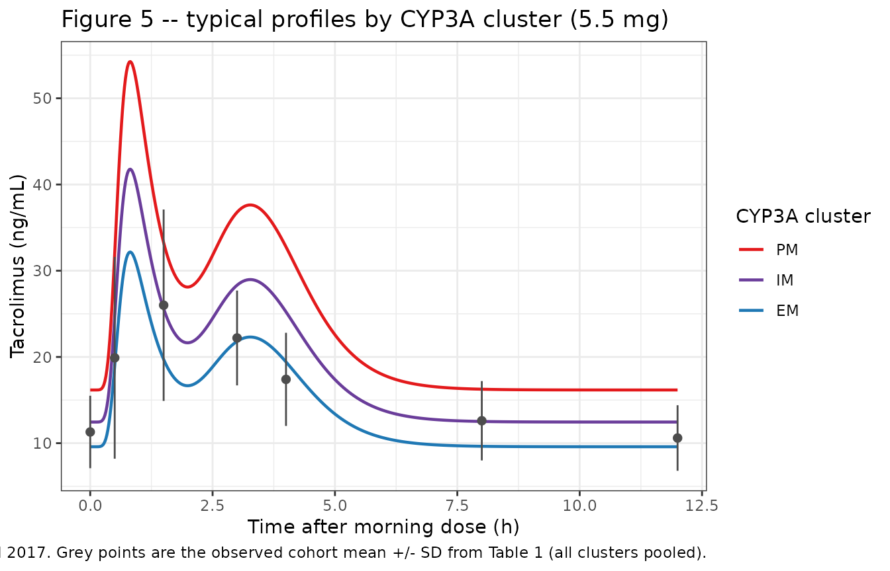
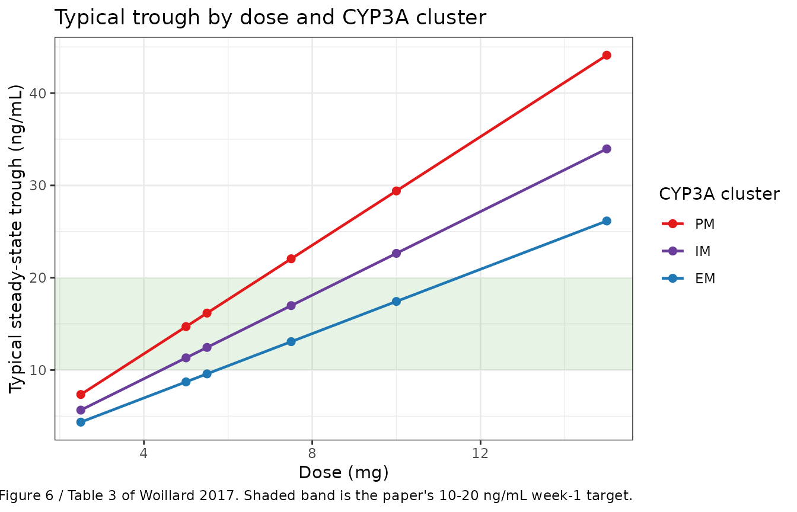

# Tacrolimus (Woillard 2017)

## Model and source

- Citation: Woillard JB, Mourad M, Neely M, Capron A, van Schaik RH, van
  Gelder T, Lloberas N, Hesselink DA, Marquet P, Haufroid V, Elens L.
  Tacrolimus Updated Guidelines through popPK Modeling: How to Benefit
  More from CYP3A Pre-emptive Genotyping Prior to Kidney
  Transplantation. Front Pharmacol. 2017;8:358.
  <doi:10.3389/fphar.2017.00358>
- Description: One-compartment population PK model for immediate-release
  oral tacrolimus in the early period after cadaveric kidney
  transplantation (Woillard 2017), with two parallel gamma-distributed
  absorption routes (double-gamma absorption), first-order elimination
  and a dose-proportional steady-state trough offset C0. A three-level
  CYP3A metabolizer cluster (poor / intermediate / extensive,
  reconstructed inside model() from the recipient CYP3A5 expresser
  status and the CYP3A4\*22 rs35599367 carrier indicator) acts as an
  ordinal power-model multiplier on the whole predicted whole-blood
  concentration. Fitted non-parametrically in Pmetrics and evaluated
  here in the closed form published by the authors, so the model
  describes ONE steady-state dosing interval.
- Article: <https://doi.org/10.3389/fphar.2017.00358>

Tacrolimus has a narrow therapeutic window and highly variable
pharmacokinetics, a large part of which is genetic. Woillard 2017 fitted
a non-parametric population PK model to 59 de novo cadaveric kidney
transplant recipients in order to turn *CYP3A* pre-emptive genotyping
into actionable starting-dose advice. The structural model is the
double-gamma absorption model of the Limoges group (Saint-Marcoux 2005,
2010; the same lineage as `Debord_2001_cyclosporin` and
`Fromage_2025_mycophenolic_acid`), and the only covariate retained is a
three-level *CYP3A* metabolizer cluster built from *CYP3A4\*22* and
*CYP3A5\*3*.

## Population

``` r

ui <- rxode2::rxode(readModelDb("Woillard_2017_tacrolimus"))
pop <- ui$population
tibble::tibble(Field = names(pop), Value = unlist(lapply(pop, as.character))) |>
  knitr::kable()
```

| Field | Value |
|:---|:---|
| species | human |
| n_subjects | 59 |
| n_studies | 1 |
| age_range | Mean 51.9 +/- 13.4 years (Table 1) |
| weight_range | Mean 70.4 +/- 13.9 kg (Table 1) |
| sex_female_pct | 64.4 |
| race_ethnicity | Not reported (single-centre Belgian cohort) |
| disease_state | De novo cadaveric renal transplant recipients, early post-transplant hospitalization period |
| renal_function | Creatinine clearance (Cockcroft-Gault) 60.1 +/- 20.0 mL/min at the PK course (Table 1) |
| dose_range | Immediate-release oral tacrolimus, initial dose 0.10 mg/kg body weight twice daily, then adjusted to trough concentration; dose before the PK course 5.5 +/- 2.7 mg (Table 1) |
| administration | Oral, twice daily |
| co_medication | Mycophenolate mofetil (81%) or mycophenolate sodium (19%) plus steroids on a standard tapering schedule. 21% received a P-glycoprotein inhibitor (atorvastatin, proton-pump inhibitors) at reduced dosage; no CYP3A inducer or inhibitor was documented. |
| genotype | CYP3A metabolizer clusters (Elens 2011 clustering, Results): 5 poor metabolizers (CYP3A5*3/*3 carrying CYP3A4*22), 36 intermediate metabolizers (CYP3A5*3/*3 not carrying CYP3A4*22) and 18 extensive metabolizers (CYP3A5 expressers not carrying CYP3A4\*22). |
| regions | Belgium (single centre: Cliniques Universitaires Saint-Luc, Brussels) |
| notes | Prospectively recruited July 2007 - January 2009; the same cohort as Elens 2013 (Ther Drug Monit 35:608-616). Full 12-h PK profile in every patient before hospital discharge: pre-dose and 30 min, 1 h 30 min, 3, 4, 8 and 12 h after the morning dose, plus daily troughs. Tacrolimus measured in whole blood by chemiluminescent microparticle immunoassay (Abbott Architect). Target trough 10-20 ng/mL in week 1, 10-15 ng/mL thereafter. Estimation was NON-PARAMETRIC (Pmetrics NPAG), so the published typical values are means of the non-parametric marginal support-point distributions, not the parameters of a ‘typical subject’. |

Fifty-nine cadaveric renal transplant recipients were recruited
prospectively at Cliniques Universitaires Saint-Luc (Brussels) between
July 2007 and January 2009 and followed through their hospitalization
(Table 1; the same cohort as Elens 2013). Immunosuppression was
tacrolimus plus mycophenolate mofetil (81%) or mycophenolate sodium
(19%) plus tapering steroids. Tacrolimus was started at 0.10 mg/kg twice
daily and adjusted to trough, targeting 10-20 ng/mL in the first week
and 10-15 ng/mL thereafter. Before discharge every patient had a full 12
h profile (pre-dose and 30 min, 1 h 30 min, 3, 4, 8 and 12 h after the
morning dose), with whole-blood tacrolimus measured by chemiluminescent
microparticle immunoassay (Abbott Architect).

The *CYP3A* clustering of Elens 2011 gave 5 poor metabolizers (PM;
*CYP3A5\*3/\*3* carrying *CYP3A4\*22*), 36 intermediate metabolizers
(IM; *CYP3A5\*3/\*3* not carrying *CYP3A4\*22*) and 18 extensive
metabolizers (EM; *CYP3A5* expressers not carrying *CYP3A4\*22*).

``` r

# The cluster counts are reconstructible from the Table 1 genotype frequencies,
# which is what the model() reconstruction relies on: every *22 carrier was
# also a CYP3A5 non-expresser, and every CYP3A5 expresser was *1/*1 for CYP3A4.
star22_carriers <- 5L # Table 1: CYP3A4*1/*22 5 (8.5%)
cyp3a5_expressers <- 14L + 4L # Table 1: CYP3A5*1/*3 14 + CYP3A5*1/*1 4
n_total <- 59L
stopifnot(
  star22_carriers == 5L, # PM count in Results
  cyp3a5_expressers == 18L, # EM count in Results
  n_total - star22_carriers - cyp3a5_expressers == 36L # IM count in Results
)
```

## Model structure

Absorption is the sum of two **parallel** gamma-distributed input routes
(Supplemental Data 1),

``` math
v_{abs}(t) = F D \sum_{i=1}^{2} r_i f_i(t),
\qquad
f_i(t) = \frac{b_i^{a_i}}{\Gamma(a_i)} t^{a_i - 1} e^{-b_i t},
```

disposition after a unit IV bolus is one-compartment,
$`I(t) = A_{IV} e^{-kt}`$, and the authors give the analytic convolution
of the two as the output equation of their Pmetrics model file,

``` math
C(t) = C_0 + F D A_{IV} e^{-kt}
\sum_{i=1}^{2} r_i \left( \frac{b_i}{b_i - k} \right)^{a_i}
P\!\left[a_i, (b_i - k) t\right],
```

with $`P`$ the regularised lower incomplete gamma function. Because the
patients were at steady state, $`C_0`$ is the trough carried in from
previous doses; it is dose-proportional (Table 2 footnote). The retained
covariate multiplies the whole output,

``` math
C(t) = C(t)_{TPV} \cdot \theta_{CYP3A}^{\;CYP3A},
```

with the *CYP3A* dummy taking the ordinal values PM = 0, IM = 1, EM = 2.

The packaged file stores the gamma components in the canonical transit
parameterisation ($`a_i = ntr_i + 1`$, $`b_i = a_i / mtt_i`$) and stores
$`F \cdot A_{IV}`$ as an apparent volume; the chunk below recovers the
published numbers from the packaged ones.

``` r

theta <- setNames(ui$theta, names(ui$theta))
p <- list(
  a1 = exp(theta[["lntr1"]]) + 1,
  b1 = (exp(theta[["lntr1"]]) + 1) / exp(theta[["lmtt1"]]),
  a2 = exp(theta[["lntr2"]]) + 1,
  b2 = (exp(theta[["lntr2"]]) + 1) / exp(theta[["lmtt2"]]),
  r = exp(theta[["lfdepot"]]),
  vc = exp(theta[["lvc"]]),
  kel = exp(theta[["lkel"]]),
  C0 = exp(theta[["lrbase"]]),
  thCYP3A = theta[["e_cyp3a_cluster_cc"]]
)
p$FAIV <- 1000 / p$vc

# Round-trip against Table 2 (final model). These are exact recoveries of the
# printed values, not approximations, so the tolerance is numerical only.
stopifnot(
  abs(p$a1 - 12.33) < 1e-9,
  abs(p$b1 - 20.36) < 1e-9,
  abs(p$a2 - 15.19) < 1e-9,
  abs(p$b2 - 5.05) < 1e-9,
  abs(p$r - 0.46) < 1e-9,
  abs(p$FAIV - 24.52) < 1e-9,
  abs(p$kel - 1.52) < 1e-9,
  abs(p$C0 - 2.94) < 1e-9,
  abs(p$thCYP3A - 0.77) < 1e-12
)

tibble::tibble(
  Parameter = c("a1", "b1 (1/h)", "MAT1 (h)", "a2", "b2 (1/h)", "MAT2 (h)",
                "r", "F*AIV (ng/mL per mg)", "V/F (L)", "alpha (1/h)",
                "C0 (ng/mL per mg)", "theta_CYP3A"),
  Value = c(p$a1, p$b1, p$a1 / p$b1, p$a2, p$b2, p$a2 / p$b2, p$r,
            p$FAIV, p$vc, p$kel, p$C0, p$thCYP3A)
) |>
  dplyr::mutate(Value = round(Value, 4)) |>
  knitr::kable()
```

| Parameter             |   Value |
|:----------------------|--------:|
| a1                    | 12.3300 |
| b1 (1/h)              | 20.3600 |
| MAT1 (h)              |  0.6056 |
| a2                    | 15.1900 |
| b2 (1/h)              |  5.0500 |
| MAT2 (h)              |  3.0079 |
| r                     |  0.4600 |
| F\*AIV (ng/mL per mg) | 24.5200 |
| V/F (L)               | 40.7830 |
| alpha (1/h)           |  1.5200 |
| C0 (ng/mL per mg)     |  2.9400 |
| theta_CYP3A           |  0.7700 |

## Source trace

``` r

tibble::tribble(
  ~Quantity, ~Source,
  "v_abs(t) two-component gamma mixture", "Supplemental Data 1, equations 1-2",
  "I(t) = A_IV exp(-k t) one-compartment disposition", "Supplemental Data 1, equation 3",
  "C(t) closed-form convolution with P(n, x)", "Supplemental Data 1, equations 4-5",
  "C(t) = C(t)_TPV * theta_CYP3A^CYP3A", "Results, 'Covariate Analysis'",
  "a1 = 12.33 [6.25-18.41]", "Table 2, final model",
  "b1 = 20.36 [7.37-33.35] 1/h", "Table 2, final model",
  "a2 = 15.19 [9.46-20.91]", "Table 2, final model",
  "b2 = 5.05 [1.02-9.08] 1/h", "Table 2, final model",
  "r = 0.46 [0.40-0.51]", "Table 2, final model",
  "F*AIV = 24.52 [20.61-28.43]", "Table 2, final model",
  "alpha = 1.52 [1.19-1.85] 1/h", "Table 2, final model + footnote ('alpha = elimination parameter')",
  "C0 = 2.94 [2.42-3.47], dose-proportional", "Table 2, final model + footnote",
  "theta_CYP3A = 0.77 [0.74-0.80]", "Table 2, final model",
  "CYP3A cluster definitions (PM/IM/EM)", "Results, first paragraph (Elens 2011 clustering)",
  "Assay error polynomial SD = 0.0001 + 0.0762*C - 0.1433*C^2", "Methods, 'Pharmacokinetic Population Modeling'",
  "Gamma error multiplier = 0.43 (final model)", "Results, 'Covariate Analysis'",
  "Observed mean concentration-time profile", "Table 1",
  "Probability of target attainment by dose and cluster", "Table 3",
  "Baseline demographics and genotype frequencies", "Table 1"
) |>
  knitr::kable()
```

| Quantity | Source |
|:---|:---|
| v_abs(t) two-component gamma mixture | Supplemental Data 1, equations 1-2 |
| I(t) = A_IV exp(-k t) one-compartment disposition | Supplemental Data 1, equation 3 |
| C(t) closed-form convolution with P(n, x) | Supplemental Data 1, equations 4-5 |
| C(t) = C(t)\_TPV \* theta_CYP3A^CYP3A | Results, ‘Covariate Analysis’ |
| a1 = 12.33 \[6.25-18.41\] | Table 2, final model |
| b1 = 20.36 \[7.37-33.35\] 1/h | Table 2, final model |
| a2 = 15.19 \[9.46-20.91\] | Table 2, final model |
| b2 = 5.05 \[1.02-9.08\] 1/h | Table 2, final model |
| r = 0.46 \[0.40-0.51\] | Table 2, final model |
| F\*AIV = 24.52 \[20.61-28.43\] | Table 2, final model |
| alpha = 1.52 \[1.19-1.85\] 1/h | Table 2, final model + footnote (‘alpha = elimination parameter’) |
| C0 = 2.94 \[2.42-3.47\], dose-proportional | Table 2, final model + footnote |
| theta_CYP3A = 0.77 \[0.74-0.80\] | Table 2, final model |
| CYP3A cluster definitions (PM/IM/EM) | Results, first paragraph (Elens 2011 clustering) |
| Assay error polynomial SD = 0.0001 + 0.0762*C - 0.1433*C^2 | Methods, ‘Pharmacokinetic Population Modeling’ |
| Gamma error multiplier = 0.43 (final model) | Results, ‘Covariate Analysis’ |
| Observed mean concentration-time profile | Table 1 |
| Probability of target attainment by dose and cluster | Table 3 |
| Baseline demographics and genotype frequencies | Table 1 |

## Virtual cohort

The model carries **no inter-individual variability** (see Errata), so
every simulated subject with the same genotype and dose has the same
profile. The cohort is therefore one subject per (cluster, dose) cell:
the three *CYP3A* clusters crossed with the five doses Woillard 2017
simulated in Table 3, plus the cohort’s mean pre-PK-course dose of 5.5
mg (Table 1).

``` r

clusters <- tibble::tribble(
  ~cluster, ~CYP3A5_EXPR, ~SNP_CYP3A4_RS35599367, ~level,
  "PM", 0, 1, 0,
  "IM", 0, 0, 1,
  "EM", 1, 0, 2
) |>
  dplyr::mutate(cluster = factor(cluster, levels = c("PM", "IM", "EM")))

doses <- c(2.5, 5, 5.5, 7.5, 10, 15)

# 0.02 h grid resolves Tmax (the peak is broad: MAT2 = 3 h) without an
# unnecessarily dense observation set.
obs_times <- seq(0, 12, by = 0.02)

arms <- tidyr::expand_grid(clusters, dose = doses) |>
  dplyr::mutate(id = dplyr::row_number())

make_rows <- function(a) {
  dosing <- tibble::tibble(id = a$id, time = 0, amt = a$dose, evid = 1L,
                           cmt = "depot")
  obs <- tibble::tibble(id = a$id, time = obs_times, amt = NA_real_, evid = 0L,
                        cmt = "depot")
  dplyr::bind_rows(dosing, obs) |>
    dplyr::mutate(
      cluster = a$cluster, dose = a$dose,
      CYP3A5_EXPR = a$CYP3A5_EXPR,
      SNP_CYP3A4_RS35599367 = a$SNP_CYP3A4_RS35599367
    )
}

events <- arms |>
  dplyr::group_split(id) |>
  lapply(make_rows) |>
  dplyr::bind_rows() |>
  dplyr::arrange(id, time, dplyr::desc(evid))

# Disjoint-ID guard: each subject belongs to exactly one (cluster, dose) cell.
stopifnot(
  nrow(dplyr::distinct(events, id, cluster, dose)) == nrow(arms),
  nrow(arms) == 18L
)
```

Observation rows carry `cmt = "depot"` because `depot` is the model’s
only ODE state; `Cc` is an algebraic observable and rxode2 returns it as
a column at those rows.

## Simulation

``` r

sim <- rxode2::rxSolve(ui, events = events, keep = c("cluster", "dose")) |>
  as.data.frame() |>
  dplyr::mutate(cluster = factor(cluster, levels = c("PM", "IM", "EM")))
#> Warning: multi-subject simulation without without 'omega'

stopifnot(!anyNA(sim$Cc), all(sim$Cc > 0))
```

### Verification against the published equation

The first gate evaluates the published closed form independently in base
R with [`pgamma()`](https://rdrr.io/r/stats/GammaDist.html); the second
integrates the published absorption rate against the published
disposition function numerically. Both are deterministic comparisons
using the same parameter values, so the tolerances are numerical, not
statistical.

``` r

closed_form <- function(t, dose, level) {
  (p$C0 * dose +
     p$FAIV * dose * exp(-p$kel * t) *
       (p$r * (p$b1 / (p$b1 - p$kel))^p$a1 * pgamma((p$b1 - p$kel) * t, p$a1) +
          (1 - p$r) * (p$b2 / (p$b2 - p$kel))^p$a2 *
            pgamma((p$b2 - p$kel) * t, p$a2))) *
    p$thCYP3A^level
}

sim <- sim |>
  dplyr::left_join(dplyr::select(clusters, cluster, level), by = "cluster") |>
  dplyr::mutate(ref_closed = closed_form(time, dose, level))

err_closed <- max(abs(sim$Cc - sim$ref_closed))
stopifnot(err_closed < 1e-10)
```

``` r

gamma_density <- function(u, a, b) b^a / gamma(a) * u^(a - 1) * exp(-b * u)

conv_numeric <- function(t, dose, level) {
  if (t <= 0) {
    return(p$C0 * dose * p$thCYP3A^level)
  }
  integrand <- function(u) {
    (p$r * gamma_density(u, p$a1, p$b1) +
       (1 - p$r) * gamma_density(u, p$a2, p$b2)) * exp(-p$kel * (t - u))
  }
  area <- stats::integrate(integrand, 0, t, rel.tol = 1e-12,
                           subdivisions = 2000)$value
  (p$C0 * dose + p$FAIV * dose * area) * p$thCYP3A^level
}

conv_check <- sim |>
  dplyr::filter(dose == 5.5, time %in% c(0, 0.5, 1.5, 3, 4, 8, 12)) |>
  dplyr::rowwise() |>
  dplyr::mutate(ref_conv = conv_numeric(time, dose, level)) |>
  dplyr::ungroup()

stopifnot(nrow(conv_check) == 21L) # 3 clusters x 7 times; a zero-row check would pass vacuously
err_conv <- max(abs(conv_check$Cc - conv_check$ref_conv))
stopifnot(err_conv < 1e-8)
```

``` r

# 1. C0 is dose-proportional and is exactly the t = 0 concentration.
trough <- sim |>
  dplyr::filter(time == 0) |>
  dplyr::transmute(cluster, dose, per_mg = Cc / (dose * p$thCYP3A^level))
stopifnot(max(abs(trough$per_mg - p$C0)) < 1e-10)

# 2. The CYP3A effect is an exact power of theta_CYP3A at every time and dose.
ratios <- sim |>
  dplyr::select(time, dose, cluster, Cc) |>
  tidyr::pivot_wider(names_from = cluster, values_from = Cc) |>
  dplyr::mutate(im_pm = IM / PM, em_pm = EM / PM)
stopifnot(
  nrow(ratios) == length(obs_times) * length(doses),
  max(abs(ratios$im_pm - p$thCYP3A)) < 1e-12,
  max(abs(ratios$em_pm - p$thCYP3A^2)) < 1e-12
)

# 3. Abstract effect sizes: IM and EM concentrations relative to PM, with the
#    95% CI carried through from theta_CYP3A = 0.77 [0.74-0.80].
eff <- tibble::tibble(
  Cluster = c("IM vs PM", "EM vs PM"),
  `Reduction (%)` = round(100 * (1 - c(p$thCYP3A, p$thCYP3A^2)), 1),
  `CI95 (%)` = c(
    sprintf("%.0f-%.0f", 100 * (1 - 0.80), 100 * (1 - 0.74)),
    sprintf("%.0f-%.0f", 100 * (1 - 0.80^2), 100 * (1 - 0.74^2))
  ),
  `Published CI95 (%)` = c("20-26", "36-45")
)
stopifnot(identical(eff$`CI95 (%)`, eff$`Published CI95 (%)`))
knitr::kable(eff)
```

| Cluster  | Reduction (%) | CI95 (%) | Published CI95 (%) |
|:---------|--------------:|:---------|:-------------------|
| IM vs PM |          23.0 | 20-26    | 20-26              |
| EM vs PM |          40.7 | 36-45    | 36-45              |

``` r


# 4. Mass-balance style identity: the dose-driven part of the AUC integrates to
#    F*AIV*D/kel over an infinite interval, independently of how the dose is
#    split between the two gamma routes. This is the analogue of
#    CL * AUCinf = F * Dose for this parameterisation.
auc_increment <- function(dose, level) {
  stats::integrate(
    function(t) closed_form(t, dose, level) - p$C0 * dose * p$thCYP3A^level,
    0, 200, rel.tol = 1e-10, subdivisions = 2000
  )$value
}
auc_chk <- tidyr::expand_grid(dose = c(2.5, 5.5, 15), level = 0:2) |>
  dplyr::rowwise() |>
  dplyr::mutate(
    numeric = auc_increment(dose, level),
    analytic = p$FAIV * dose / p$kel * p$thCYP3A^level
  ) |>
  dplyr::ungroup()
stopifnot(max(abs(auc_chk$numeric / auc_chk$analytic - 1)) < 1e-6)
```

The four gates are complementary rather than redundant: gate 1 fixes the
dose-scaling of `C0`, gate 2 the covariate exponent, gate 4 the absolute
amplitude `F*AIV` and the elimination rate, and the convolution gate
fixes the absorption shape parameters that gate 4 is deliberately blind
to (the AUC identity is invariant to how the dose is split between the
two gamma routes and to their rates).

## Replicate published figures

``` r

# Replicates Figure 5 of Woillard 2017: predicted concentration-time profiles
# for one CYP3A poor, intermediate and extensive metabolizer. The source shows
# individual Bayesian profiles; here the typical-value profiles are shown at
# the cohort's mean pre-PK-course dose of 5.5 mg (Table 1), with the observed
# cohort mean concentrations (Table 1) overlaid.
observed <- tibble::tibble(
  time = c(0, 0.5, 1.5, 3, 4, 8, 12),
  conc = c(11.3, 19.9, 26.0, 22.2, 17.4, 12.6, 10.6),
  sd = c(4.2, 11.7, 11.1, 5.5, 5.4, 4.6, 3.8)
)

sim |>
  dplyr::filter(dose == 5.5) |>
  ggplot(aes(time, Cc, colour = cluster)) +
  geom_line(linewidth = 0.8) +
  geom_pointrange(
    data = observed, inherit.aes = FALSE,
    aes(x = time, y = conc, ymin = conc - sd, ymax = conc + sd),
    colour = "grey30", size = 0.3
  ) +
  scale_colour_manual(values = c(PM = "#e31a1c", IM = "#6a3d9a", EM = "#1f78b4")) +
  labs(
    x = "Time after morning dose (h)", y = "Tacrolimus (ng/mL)",
    colour = "CYP3A cluster",
    title = "Figure 5 -- typical profiles by CYP3A cluster (5.5 mg)",
    caption = paste(
      "Replicates Figure 5 of Woillard 2017. Grey points are the observed",
      "cohort mean +/- SD from Table 1 (all clusters pooled)."
    )
  ) +
  theme_bw()
```



``` r

# Relates to Figure 6 / Table 3 of Woillard 2017: predicted steady-state trough
# by dose and CYP3A cluster, against the paper's 10-20 ng/mL week-1 target
# band. The source presents this as a probability of target attainment, which
# needs the non-parametric parameter distribution (not published); the
# typical-value trough is the deterministic counterpart.
sim |>
  dplyr::filter(time == 0) |>
  ggplot(aes(dose, Cc, colour = cluster)) +
  annotate("rect", xmin = -Inf, xmax = Inf, ymin = 10, ymax = 20,
           alpha = 0.12, fill = "#33a02c") +
  geom_line(linewidth = 0.8) +
  geom_point(size = 2) +
  scale_colour_manual(values = c(PM = "#e31a1c", IM = "#6a3d9a", EM = "#1f78b4")) +
  labs(
    x = "Dose (mg)", y = "Typical steady-state trough (ng/mL)",
    colour = "CYP3A cluster",
    title = "Typical trough by dose and CYP3A cluster",
    caption = paste(
      "Deterministic counterpart to Figure 6 / Table 3 of Woillard 2017.",
      "Shaded band is the paper's 10-20 ng/mL week-1 target."
    )
  ) +
  theme_bw()
```



``` r

# Woillard 2017 Conclusion recommends 0.07 / 0.13 / 0.20 mg/kg b.i.d. for
# PM / IM / EM. At the cohort mean weight of 70.4 kg (Table 1) those are the
# doses below; the typical trough each produces is reported for reference.
wt <- 70.4
rec <- tibble::tibble(
  cluster = factor(c("PM", "IM", "EM"), levels = c("PM", "IM", "EM")),
  `mg/kg b.i.d.` = c(0.07, 0.13, 0.20)
) |>
  dplyr::mutate(
    `Dose at 70.4 kg (mg)` = round(`mg/kg b.i.d.` * wt, 2),
    level = c(0, 1, 2),
    `Typical trough (ng/mL)` =
      round(p$C0 * `Dose at 70.4 kg (mg)` * p$thCYP3A^level, 1)
  ) |>
  dplyr::select(-level)

# The paper's own recommendation is dose-escalating across PM -> IM -> EM; a
# sign error in the covariate exponent would invert this ordering.
stopifnot(all(diff(rec$`Dose at 70.4 kg (mg)`) > 0))
knitr::kable(rec)
```

| cluster | mg/kg b.i.d. | Dose at 70.4 kg (mg) | Typical trough (ng/mL) |
|:--------|-------------:|---------------------:|-----------------------:|
| PM      |         0.07 |                 4.93 |                   14.5 |
| IM      |         0.13 |                 9.15 |                   20.7 |
| EM      |         0.20 |                14.08 |                   24.5 |

## PKNCA validation

NCA is computed over the 0 to 12 h steady-state dosing interval. `cmin`
is used rather than `ctrough`; for this model the time-zero
concentration is the trough `C0 * dose`, which the grid already
contains.

``` r

# PKNCA reserves the column name `dose`, so the dose-level grouping column is
# carried as `dosegrp` on both the concentration and the dose object.
sim_nca <- sim |>
  dplyr::filter(!is.na(Cc)) |>
  dplyr::select(id, time, Cc, cluster, dosegrp = dose)

stopifnot(
  nrow(sim_nca) > 0,
  # Every subject must have a time-zero anchor or PKNCA warns per subject.
  nrow(dplyr::filter(sim_nca, time == 0)) == nrow(arms)
)

conc_obj <- PKNCA::PKNCAconc(sim_nca, Cc ~ time | cluster + dosegrp + id)

dose_df <- events |>
  dplyr::filter(evid == 1) |>
  dplyr::select(id, time, amt, cluster, dosegrp = dose)
dose_obj <- PKNCA::PKNCAdose(dose_df, amt ~ time | cluster + dosegrp + id)

intervals <- data.frame(
  start = 0, end = 12,
  cmax = TRUE, tmax = TRUE, cmin = TRUE, auclast = TRUE
)

nca_res <- PKNCA::pk.nca(
  PKNCA::PKNCAdata(conc_obj, dose_obj, intervals = intervals)
)

nca_wide <- as.data.frame(nca_res) |>
  dplyr::select(cluster, dosegrp, id, PPTESTCD, PPORRES) |>
  tidyr::pivot_wider(names_from = PPTESTCD, values_from = PPORRES) |>
  dplyr::mutate(cluster = factor(cluster, levels = c("PM", "IM", "EM"))) |>
  dplyr::arrange(cluster, dosegrp)

stopifnot(nrow(nca_wide) == nrow(arms), !anyNA(nca_wide$auclast))

nca_wide |>
  dplyr::rename(
    "CYP3A cluster" = cluster, "Dose (mg)" = dosegrp,
    "Cmax (ng/mL)" = cmax, "Tmax (h)" = tmax,
    "Cmin (ng/mL)" = cmin, "AUC0-12 (ng*h/mL)" = auclast
  ) |>
  dplyr::select(-id) |>
  dplyr::mutate(dplyr::across(dplyr::where(is.numeric), \(x) round(x, 2))) |>
  knitr::kable()
```

| CYP3A cluster | Dose (mg) | AUC0-12 (ng\*h/mL) | Cmax (ng/mL) | Cmin (ng/mL) | Tmax (h) |
|:--------------|----------:|-------------------:|-------------:|-------------:|---------:|
| PM            |       2.5 |             128.53 |        24.66 |         7.35 |     0.82 |
| PM            |       5.0 |             257.06 |        49.32 |        14.70 |     0.82 |
| PM            |       5.5 |             282.76 |        54.25 |        16.17 |     0.82 |
| PM            |       7.5 |             385.59 |        73.98 |        22.05 |     0.82 |
| PM            |      10.0 |             514.11 |        98.64 |        29.40 |     0.82 |
| PM            |      15.0 |             771.17 |       147.96 |        44.10 |     0.82 |
| IM            |       2.5 |              98.97 |        18.99 |         5.66 |     0.82 |
| IM            |       5.0 |             197.93 |        37.98 |        11.32 |     0.82 |
| IM            |       5.5 |             217.73 |        41.78 |        12.45 |     0.82 |
| IM            |       7.5 |             296.90 |        56.97 |        16.98 |     0.82 |
| IM            |      10.0 |             395.87 |        75.95 |        22.64 |     0.82 |
| IM            |      15.0 |             593.80 |       113.93 |        33.96 |     0.82 |
| EM            |       2.5 |              76.20 |        14.62 |         4.36 |     0.82 |
| EM            |       5.0 |             152.41 |        29.24 |         8.72 |     0.82 |
| EM            |       5.5 |             167.65 |        32.17 |         9.59 |     0.82 |
| EM            |       7.5 |             228.61 |        43.86 |        13.07 |     0.82 |
| EM            |      10.0 |             304.82 |        58.49 |        17.43 |     0.82 |
| EM            |      15.0 |             457.23 |        87.73 |        26.15 |     0.82 |

`Tmax` is the same in every cell because the model carries no IIV and
the covariate acts multiplicatively on the whole output, so the profile
shape is identical across clusters and doses. Note that this `Tmax` is
well before the paper’s second sampling time: the peak comes from the
fast gamma route and is narrow (see “Comparison against published data”
below).

Exposure is exactly dose-proportional within a cluster, which the model
structure guarantees and the NCA output confirms:

``` r

dp <- nca_wide |>
  dplyr::mutate(auc_per_mg = auclast / dosegrp) |>
  dplyr::group_by(cluster) |>
  dplyr::summarise(spread = diff(range(auc_per_mg)) / mean(auc_per_mg),
                   .groups = "drop")
stopifnot(nrow(dp) == 3L, max(dp$spread) < 1e-6)
```

## Comparison against published data

Woillard 2017 reports no NCA table. The closest published exposure
target is the **observed cohort mean concentration-time profile** of
Table 1, measured at the cohort’s mean pre-PK-course dose of 5.5 mg. The
model counterpart is the cluster-weighted mixture of the three typical
profiles, weighted by the observed cluster sizes (5 PM, 36 IM, 18 EM).

``` r

weights <- c(PM = 5, IM = 36, EM = 18) / 59
mix_factor <- sum(weights * p$thCYP3A^c(0, 1, 2))

mixture <- sim |>
  dplyr::filter(dose == 5.5) |>
  dplyr::select(time, cluster, Cc) |>
  tidyr::pivot_wider(names_from = cluster, values_from = Cc) |>
  dplyr::mutate(Cc = weights[["PM"]] * PM + weights[["IM"]] * IM +
                  weights[["EM"]] * EM)

# The mixture is a scalar multiple of the PM profile because the covariate acts
# multiplicatively on the whole output; confirm the weighting is what we think.
stopifnot(max(abs(mixture$Cc / mixture$PM - mix_factor)) < 1e-12)
```

``` r

nca_from_profile <- function(df, label) {
  conc <- PKNCA::PKNCAconc(
    dplyr::mutate(df, id = 1L, src = label), conc ~ time | src + id
  )
  dose_d <- data.frame(id = 1L, src = label, time = 0, amt = 5.5)
  res <- PKNCA::pk.nca(PKNCA::PKNCAdata(
    conc, PKNCA::PKNCAdose(dose_d, amt ~ time | src + id),
    intervals = data.frame(start = 0, end = 12, cmax = TRUE, tmax = TRUE,
                           cmin = TRUE, auclast = TRUE)
  ))
  as.data.frame(res) |>
    dplyr::select(PPTESTCD, PPORRES) |>
    tidyr::pivot_wider(names_from = PPTESTCD, values_from = PPORRES)
}

# Reference: NCA of the Table 1 observed means, on the 7 published sampling
# times. Simulated: NCA of the cluster-weighted model mixture restricted to the
# SAME 7 times, so the trapezoidal rule sees an identical grid on both sides
# and the comparison is of the profiles, not of the sampling design.
ref_nca <- nca_from_profile(observed |> dplyr::select(time, conc), "observed")
sim_nca_mix <- nca_from_profile(
  mixture |>
    dplyr::filter(time %in% observed$time) |>
    dplyr::transmute(time, conc = Cc),
  "simulated"
)
stopifnot(nrow(ref_nca) == 1L, nrow(sim_nca_mix) == 1L)

cmp <- nlmixr2lib::ncaComparisonTable(
  simulated = sim_nca_mix,
  reference = ref_nca,
  params = c("cmax", "cmin", "auclast", "tmax"),
  tolerance_pct = 20,
  units = c(cmax = "ng/mL", cmin = "ng/mL", auclast = "ng*h/mL", tmax = "h")
)
knitr::kable(cmp)
```

| NCA parameter      | Reference | Simulated | % diff    |
|:-------------------|:----------|:----------|:----------|
| Cmax (ng/mL)       | 26        | 27        | +4.0%     |
| Cmin (ng/mL)       | 10.6      | 11.9      | +12.2%    |
| Tmax (h)           | 1.5       | 3         | +100.0%\* |
| AUClast (ng\*h/mL) | 192       | 214       | +11.3%    |

``` r

# Gate on the numerics rather than on ncaComparisonTable()'s formatted
# character columns. Cmax, Cmin and AUC0-12 are compared; Tmax is recorded as a
# known deviation (see Errata) and is deliberately excluded from the gate.
pct <- function(nm) 100 * (sim_nca_mix[[nm]] - ref_nca[[nm]]) / ref_nca[[nm]]
exposure_pct <- vapply(c("cmax", "cmin", "auclast"), pct, numeric(1))
tmax_pct <- pct("tmax")

stopifnot(
  length(exposure_pct) == 3L,
  !anyNA(exposure_pct),
  max(abs(exposure_pct)) < 20
)

tibble::tibble(
  Metric = c("Cmax", "Cmin", "AUC0-12", "Tmax"),
  Observed = c(ref_nca$cmax, ref_nca$cmin, ref_nca$auclast, ref_nca$tmax),
  Simulated = c(sim_nca_mix$cmax, sim_nca_mix$cmin, sim_nca_mix$auclast,
                sim_nca_mix$tmax),
  `Difference (%)` = round(c(exposure_pct, tmax_pct), 1),
  Gated = c(TRUE, TRUE, TRUE, FALSE)
) |>
  dplyr::mutate(dplyr::across(c(Observed, Simulated), \(x) round(x, 2))) |>
  knitr::kable()
```

| Metric  | Observed | Simulated | Difference (%) | Gated |
|:--------|---------:|----------:|---------------:|:------|
| Cmax    |     26.0 |     27.05 |            4.0 | TRUE  |
| Cmin    |     10.6 |     11.89 |           12.2 | TRUE  |
| AUC0-12 |    192.3 |    214.01 |           11.3 | TRUE  |
| Tmax    |      1.5 |      3.00 |          100.0 | FALSE |

The three exposure metrics agree with the published observed means to
within 12.2%, which is a meaningful check given that the model’s typical
values are non-parametric marginal means rather than a fitted typical
subject (see Errata). `Tmax` does not agree and is not gated.

The comparison above is made on the paper’s seven sampling times on
**both** sides. That restriction matters, because at full time
resolution the model’s typical profile has a sharp early peak that the
published sampling grid cannot resolve: the fast gamma route carries 46%
of the dose with a mean absorption time of 0.61 h and a width of only
0.17 h (`sqrt(a1)/b1`).

``` r

full_res <- sim |>
  dplyr::filter(dose == 5.5, cluster == "PM") |>
  dplyr::slice_max(Cc, n = 1)

mixture_peak <- mixture |> dplyr::slice_max(Cc, n = 1)

# The true typical peak falls strictly between the 0.5 h and 1.5 h observed
# samples, so no published observation sits on it. This is deterministic (no
# IIV), so the bounds are structural, not statistical.
stopifnot(
  nrow(full_res) == 1L,
  full_res$time > 0.5, full_res$time < 1.5,
  # ... and it is materially higher than the value at either bracketing sample,
  # which is what makes the restricted-grid comparison the honest one.
  full_res$Cc > 1.3 * sim$Cc[sim$dose == 5.5 & sim$cluster == "PM" &
                               abs(sim$time - 1.5) < 1e-9]
)

tibble::tibble(
  Quantity = c("Typical Tmax, full resolution (h)",
               "Typical Cmax, PM at 5.5 mg (ng/mL)",
               "Typical Cmax, cluster mixture at 5.5 mg (ng/mL)",
               "Model value at the 1.5 h sample, mixture (ng/mL)",
               "Observed mean at 1.5 h (ng/mL)"),
  Value = round(c(full_res$time, full_res$Cc, mixture_peak$Cc,
                  mixture$Cc[abs(mixture$time - 1.5) < 1e-9],
                  observed$conc[observed$time == 1.5]), 2)
) |>
  knitr::kable()
```

| Quantity                                         | Value |
|:-------------------------------------------------|------:|
| Typical Tmax, full resolution (h)                |  0.82 |
| Typical Cmax, PM at 5.5 mg (ng/mL)               | 54.25 |
| Typical Cmax, cluster mixture at 5.5 mg (ng/mL)  | 39.90 |
| Model value at the 1.5 h sample, mixture (ng/mL) | 24.45 |
| Observed mean at 1.5 h (ng/mL)                   | 26.00 |

### Consistency with the Table 3 probability of target attainment

Table 3 gives the simulated probability of exceeding each trough target.
Without the non-parametric parameter distribution the PTA itself cannot
be reproduced, but the PTA curve implies a **median** trough per cell,
and the ratio of the model’s typical (mean) trough to that implied
median is a check on the `C0` dose-scaling: for a right-skewed
distribution with the reported 40-80% CVs the ratio should be modestly
above 1 and roughly constant across cells.

``` r

# Table 3: P(trough >= target) for each (cluster, dose). Linear interpolation
# across targets gives the implied median (the target at which P = 50%).
pta <- tibble::tribble(
  ~cluster, ~dose, ~target, ~pct,
  "PM", 7.5, 2.5, 98.4, "PM", 7.5, 7.5, 91.7, "PM", 7.5, 10, 84.9,
  "PM", 7.5, 15, 60.8, "PM", 7.5, 17.5, 48.2, "PM", 7.5, 20, 38.6,
  "IM", 10, 2.5, 98.5, "IM", 10, 7.5, 91.2, "IM", 10, 10, 82.5,
  "IM", 10, 15, 61.0, "IM", 10, 17.5, 52.6, "IM", 10, 20, 45.7,
  "EM", 15, 2.5, 98.2, "EM", 15, 7.5, 87.0, "EM", 15, 10, 76.1,
  "EM", 15, 15, 58.8, "EM", 15, 17.5, 53.9, "EM", 15, 20, 47.6
)

implied_median <- pta |>
  dplyr::group_by(cluster, dose) |>
  dplyr::summarise(
    median_trough = stats::approx(pct, target, xout = 50)$y,
    .groups = "drop"
  ) |>
  dplyr::left_join(dplyr::select(clusters, cluster, level),
                   by = dplyr::join_by(cluster == cluster)) |>
  dplyr::mutate(
    typical_trough = p$C0 * dose * p$thCYP3A^level,
    ratio = typical_trough / median_trough
  )

stopifnot(nrow(implied_median) == 3L, !anyNA(implied_median$ratio))

# The ratio must be above 1 (a right-skewed distribution has mean > median) and
# consistent across the three cells. Read literally, the Table 2 footnote's
# "1000 mg" reference dose would put every typical trough three orders of
# magnitude below these medians, so this gate is what discriminates the two
# readings of that footnote (see Errata).
stopifnot(
  all(implied_median$ratio > 1),
  all(implied_median$ratio < 2),
  diff(range(implied_median$ratio)) < 0.5
)

implied_median |>
  dplyr::transmute(
    `CYP3A cluster` = cluster, `Dose (mg)` = dose,
    `Table 3 implied median trough (ng/mL)` = round(median_trough, 1),
    `Model typical trough (ng/mL)` = round(typical_trough, 1),
    `Ratio` = round(ratio, 2)
  ) |>
  knitr::kable()
```

| CYP3A cluster | Dose (mg) | Table 3 implied median trough (ng/mL) | Model typical trough (ng/mL) | Ratio |
|:---|---:|---:|---:|---:|
| EM | 15.0 | 19.0 | 26.1 | 1.37 |
| IM | 10.0 | 18.4 | 22.6 | 1.23 |
| PM | 7.5 | 17.1 | 22.0 | 1.29 |

## Assumptions and deviations

**No inter-individual variability is encoded.** The paper reports only
that “inter-patient variability in PK parameters was represented by
coefficients of variation ranging from 40 to 80% whereas the correlation
between parameters fluctuated from r = -0.497 to 0.410” – a range over
an unnamed set of parameters, with no per-parameter variance and no
covariance matrix. NPAG estimates a discrete joint support-point
distribution, which is not published either. Assigning omegas from the
40-80% range would be an invention, so the packaged model carries
typical values only. The etas are omitted rather than written as
`~ fixed(0)` because a zero-variance diagonal makes OMEGA singular and
breaks the Cholesky sampler used by `rxSolve()`. A consequence is that
the paper’s probability-of-target-attainment analysis (Table 3, Figure
6) and its VPC (Figure 4) cannot be reproduced; the deterministic
counterparts are shown above.

**The `C0` reference dose is read as 1000 ug, not the printed 1000 mg.**
The Table 2 footnote defines `C0` as “the model estimated Tac trough
level for a theoretical dose of 1000 mg (the real trough level can be
calculated by dividing this value by 1000 and multiplying by the patient
dose)”. Read literally, the typical trough at the cohort’s mean 5.5 mg
dose would be 2.94 / 1000 \* 5.5 = 0.016 ng/mL, against observed troughs
of 11.3 +/- 4.2 ng/mL (Table 1) and against Table 3, where 7.5 mg in a
poor metabolizer exceeds 10 ng/mL 84.9% of the time. Reading the
reference dose as 1000 ug = 1 mg gives `C0 * dose[mg]`, a typical trough
of 16.2 ng/mL at 5.5 mg, and the typical-to-implied-median ratios of the
table above. It is also the only reading consistent with `F*AIV`, which
must use the same unit dose: per microgram it would put V/F at 41 mL
rather than 41 L.

Relatedly, the Table 1 row “Tac dose before PK course 5.5 +/- 2.7”
prints **no unit**. It is taken as mg throughout this vignette, which is
the only reading consistent with the stated 0.10 mg/kg twice-daily
starting dose at the cohort’s mean weight of 70.4 kg (7.0 mg,
subsequently titrated down to trough target).

**The quadratic term of the assay error polynomial is dropped.** Methods
gives `SD = 0.0001 + 0.0762*C(t) - 0.1433*C(t)^2` with a fitted
multiplier gamma = 0.43 for the final model. As printed, the quadratic
term drives SD negative above C = 0.53 ng/mL, i.e. across essentially
the whole observed range (the troughs alone are around 11 ng/mL), so the
coefficient has lost a power of ten that the paper does not supply. The
packaged model keeps the two usable terms – proportional 0.43 \* 0.0762
= 3.28% and additive 0.43 \* 0.0001 = 4.3e-5 ng/mL – and drops the
quadratic. The result is corroborated by the paper’s own fit
diagnostics: mean bias -0.11 +/- 3.7% and RMSE 4.5% (Results), both
consistent with a ~3.3% proportional residual.

**The CYP3A cluster is reconstructed from two genotype columns.** Rather
than registering a collapsed three-level cluster column, the model takes
`CYP3A5_EXPR` and `SNP_CYP3A4_RS35599367` as inputs and rebuilds the PM
/ IM / EM level inside `model()`, per the convention documented in the
`SNP_CYP3A4_RS35599367` entry of `inst/references/covariate-columns.md`
and following `MohammedAli_2023_tacrolimus.R`, which reconstructs the
same Elens 2011 cluster from the same two inputs. The ordinal coding PM
= 0, IM = 1, EM = 2 is confirmed by the Abstract’s own effect sizes: 1 -
0.77 = 23% with CI \[20-26%\] for IM and 1 - 0.77^2 = 40.7% with CI
\[36-45%\] for EM, both intervals reproducing exactly. The Abstract
prints “33%” for IM, which is a typo – its own quoted interval
\[20-26%\] does not contain 33%, and 23% is what theta_CYP3A = 0.77
gives.

**The peak shape is not reproduced, and `Tmax` is not gated.** At full
time resolution the model’s typical profile peaks at 0.82 h at 39.9
ng/mL for the cluster-weighted mixture at 5.5 mg, whereas the observed
cohort means of Table 1 peak at 1.5 h at 26.0 ng/mL. Two distinct
effects produce this, neither of them a transcription error:

- The fast gamma route is a narrow pulse – shape `a1` = 12.33 and rate
  `b1` = 20.36 give a mean absorption time of 0.61 h and a width
  (`sqrt(a1)/b1`) of 0.17 h – so the typical peak falls **between** the
  0.5 h and 1.5 h sampling times and no published observation sits on
  it.
- NPAG returns the **means of the marginal support-point
  distributions**, and the mean of a marginal is not the parameter
  vector of a typical subject. Feeding mean absorption parameters into
  the structural model produces a sharper, taller peak than the mean of
  the individual profiles, which is additionally flattened because
  subjects peak at different times.

The comparison against Table 1 is therefore made with the model sampled
at the paper’s own seven times on both sides, where the amplitude
metrics (Cmax, Cmin, AUC0-12) agree to within 12.2% – the check that
would catch a mis-transcribed dose, volume or clearance. `Tmax` is
reported but excluded from the gate. A user who needs the peak
reproduced should be aware that the published typical values are
marginal means; the individual Bayesian posteriors that Figure 5 of the
source plots are not published.

**Single dosing interval only.** `tad()` and `podo()` refer to the most
recent dose, so each dose restarts the absorption input and there is no
superposition. This matches the authors’ framing – `C0` *is* the
steady-state trough carried in from previous doses – but the model must
not be used to build up accumulation across doses.

**Screened but unused covariates.** Body weight, age, sex, creatinine
clearance, haematocrit, *PPARA* rs4253728, *POR\*28* and the two *ABCB1*
SNPs were tested and not retained. They are recorded in the model file’s
`covariatesDataExcluded` for provenance. Haematocrit and *PPARA* were
significant univariately (p = 0.0011 and 0.007) but increased -2LL on
inclusion; no point estimate is published for either, so neither can be
encoded even optionally.

**Bioavailability is not separately identifiable.** Supplemental Data 1
states that “no independent estimation of the bioavailability was
possible because no intravenous data were available for these patients”,
so `F*AIV` is a product and the packaged `V/F` is an apparent volume.

**Erratum search.** No erratum, corrigendum or author correction to
<doi:10.3389/fphar.2017.00358> was found on the Frontiers article page
or in PubMed / EuropePMC at the time of extraction.
