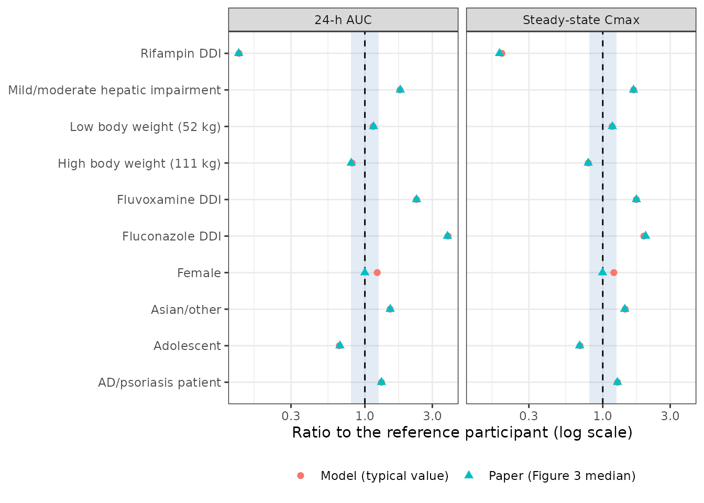
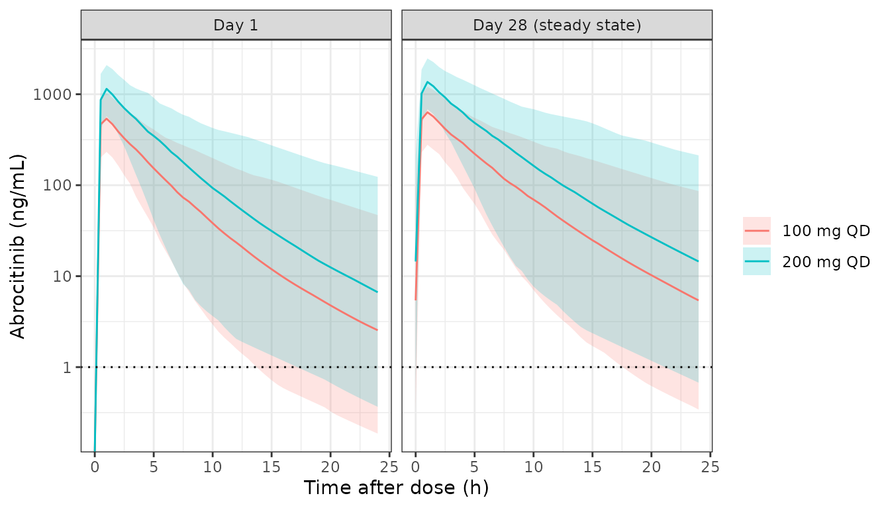

# Abrocitinib (Wojciechowski 2022)

## Model and source

- Citation: Wojciechowski J, Malhotra BK, Wang X, Fostvedt L, Valdez H,
  Nicholas T. Population Pharmacokinetics of Abrocitinib in Healthy
  Individuals and Patients with Psoriasis or Atopic Dermatitis. Clin
  Pharmacokinet. 2022;61:709-723. <doi:10.1007/s40262-021-01104-z>.
  Model equations from the Online Resource 2 NONMEM control stream.
- Description: Two-compartment population PK model for oral abrocitinib
  (JAK1 inhibitor) in healthy adults and in adolescents and adults with
  psoriasis or atopic dermatitis (Wojciechowski 2022). Parallel
  first-order (depot) and zero-order (central) absorption, with the
  first-order arm capped at a fixed amount per dose; an absorption lag
  for tablets; absolute oral bioavailability on the logit scale anchored
  at 0.5977 with additive shifts for formulation, repeated dosing, CYP
  DDIs, race, disease, hepatic impairment, adolescence, sex and the 800
  mg dose; clearance that falls exponentially with time on treatment and
  depends on the effective (bioavailable) daily dose; allometric weight
  scaling; and a study-specific proportional residual error.
- Article: <https://doi.org/10.1007/s40262-021-01104-z> (open access,
  Clin Pharmacokinet 2022;61:709-723)
- Supplement: Online Resource 1-4 at the same DOI; Online Resource 2
  prints the final NONMEM control stream from which every model equation
  below is taken.

A correction notice (Clin Pharmacokinet, published online 18 February
2022) changed only the article’s licence to open access; no value was
revised.

## Population

The model was fitted to 6206 abrocitinib plasma concentrations from 995
participants in 11 Pfizer studies run between May 2013 and July 2019:
seven phase I studies in healthy volunteers (including dedicated food,
formulation, drug-interaction, hepatic-impairment and QT studies), one
phase II study in plaque psoriasis, and one phase IIb and two phase III
studies in moderate-to-severe atopic dermatitis (Online Resource 1). By
participant type there were 165 healthy volunteers, 45 patients with
psoriasis, 769 with atopic dermatitis (90 of them adolescents aged 12-17
years) and 8 each with mild and moderate hepatic impairment (Child-Pugh
A and B). Overall 39.2% were female; median age was 34 years (range
12-84) and median body weight 76 kg (range 34.4-180); 66.6% were White,
11.0% Black, 17.9% Asian (4.4% Japanese) and 4.0% other race (Table 1).
Daily doses ranged from 3 to 800 mg.

The same information is available programmatically:

``` r

str(readModelDb("Wojciechowski_2022_abrocitinib")()$population)
#> List of 14
#>  $ species       : chr "human"
#>  $ n_subjects    : int 995
#>  $ n_studies     : int 11
#>  $ n_observations: int 6206
#>  $ age_range     : chr "12-84 years"
#>  $ age_median    : chr "34 years"
#>  $ weight_range  : chr "34.4-180 kg"
#>  $ weight_median : chr "76 kg"
#>  $ sex_female_pct: num 39.2
#>  $ race_ethnicity: Named num [1:5] 66.6 11 17.9 4 0.5
#>   ..- attr(*, "names")= chr [1:5] "White" "Black" "Asian" "Other" ...
#>  $ disease_state : chr "Healthy volunteers (n = 165), moderate-to-severe plaque psoriasis (n = 45), moderate-to-severe atopic dermatiti"| __truncated__
#>  $ dose_range    : chr "3-800 mg/day oral (single doses 3-800 mg; 10-400 mg once daily or 100-200 mg twice daily)"
#>  $ regions       : chr "Multinational (Western and Japanese participants)"
#>  $ notes         : chr "Seven phase I, two phase II and two phase III studies (Online Resource 1). Demographics from Table 1. Most conc"| __truncated__
```

## Source trace

Every value is in Table 2 of the paper; every equation is in the Online
Resource 2 control stream. The per-parameter origin is also recorded
next to each `ini()` entry in
`inst/modeldb/specificDrugs/Wojciechowski_2022_abrocitinib.R`.

| Equation / parameter | Value | Source location |
|----|----|----|
| `lcl` | log(22) L/h | Table 2 ‘CL’ |
| `lvc` | log(87.8) L | Table 2 ‘Vc’ |
| `lq` | log(1.16) L/h | Table 2 ‘Q’ |
| `lvp` | log(8.25) L | Table 2 ‘Vp’ |
| `lr1` | log(75.3) mg/h | Table 2 ‘k0’ (zero-order rate into central) |
| `lamt_fo` | log(121) mg | Table 2 ‘AK1’ (amount absorbed first-order) |
| `lka` | log(4.01) 1/h | Table 2 ‘ka’ |
| `ltlag` | log(0.183) h | Table 2 ‘Effect of tablet formulations on ALAG1’; base ALAG1 = 0 (Online Resource 2) |
| `logitfdepot` | logit(0.5977), held constant | Methods 2.4.2; Online Resource 2 `POPF = 0.5977` |
| `e_rif_f`, `e_cypinh_f` | -2.08, 1.31 | Table 2 rifampin / fluconazole-or-fluvoxamine on F |
| `e_ph2b_f`, `e_ph3_f` | -1.02, -0.766 | Table 2 phase IIb / phase III tablet on F |
| `e_multidose_f` | 0.241 | Table 2 ‘Effect of multiple dosing on F’ |
| `e_race_f`, `e_dis_f`, `e_hepimp_f` | 0.815, 0.489, 1.3 | Table 2 Asian/other race, psoriasis and AD, hepatic impairment on F |
| `e_adol_f`, `e_dose800_f`, `e_sexf_f` | -0.589, -0.778, 0.353 | Table 2 adolescent age, 800 mg dose, female sex on F |
| `e_highfat_amt_fo` | -1, held constant | Table 2 ‘Effect of high-fat meal on Ak1’; Online Resource 3 run 133 |
| `e_susp_amt_fo`, `e_ph2b_amt_fo` | 1.17, -0.68 | Table 2 suspension / phase IIb tablets on Ak1 |
| `e_rif_cl`, `e_fluco_cl`, `e_fluvox_cl` | 0.264, -0.541, -0.234 | Table 2 DDI effects on CL |
| `e_dose_cl` | -0.169 | Table 2 ‘Effect of effective daily dose on CL’ |
| `cl_exp_famp` | -0.186 | Table 2 ‘Maximum change in CL with respect to time (TAFO)’ |
| `lcl_exp_kdes` | log(log(2) / 21.6) 1/h | Table 2 half-life 21.6 h |
| `e_wt_cl`, `e_wt_vc` | 0.453, 0.52 | Table 2 weight on CL and Q / Vc and Vp |
| `etalcl`, `etalvc` | 0.577^2, 0.414^2, cov 0.326 x 0.577 x 0.414 | Table 2 IIV (CV = sqrt(omega^2), footnote a) and correlation |
| `propSd`, `addSd` | 0.437, 0.509 ng/mL | Table 2 RUV PRO / RUV ADD (SDs; EPS variance 1) |
| `e_studymod_propSd`, `e_studyhi_propSd` | 0.495, 1.16 | Table 2 study effects on RUV PRO; studies from Online Resource 2 |
| `logit_fi` / `fi` | sum of logit shifts, [`expit()`](https://nlmixr2.github.io/rxode2/reference/logit.html) | Online Resource 2 `FT`, `FI` |
| `ffo = min(1, amt_fo / DOSE)` | n/a | Online Resource 2 `POPFK1` |
| `cl` | weight, DDI, time and effective-dose terms | Online Resource 2 `CL`, `COVTAFOCL`, `COVEFFDOSRCL` |
| `f(depot)`, `f(central)`, `rate(central)` | `fi * ffo`, `fi * (1 - ffo)`, `r1` | Online Resource 2 `F1`, `F2`, `R2` |
| `alag(depot)`, `alag(central)` | tablet lag | Online Resource 2 `ALAG1`, `ALAG2 = ALAG1` |
| `Cc ~ add(addSd) + prop(propSd_study)` | n/a | Online Resource 2 `$ERROR` (`W = SQRT(IPRE^2 * RUVPRO^2 + RUVADD^2)`) |

## Dosing the model

The paper’s dataset gives every administration two records with the same
amount: one into the depot (first-order arm) and one into the central
compartment with `RATE = -1`, so that the model supplies the zero-order
rate. The same is required here: a `depot` record with `rate = 0` and a
`central` record with `rate = -1`. The model then routes `fi * ffo` of
the dose to the depot and `fi * (1 - ffo)` to central at 75.3 mg/h,
where `ffo` is `min(1, 121 mg / dose)` for tablets. A 100 mg tablet dose
is therefore absorbed entirely first-order, and the zero-order arm only
appears above 121 mg (or always, after a high-fat meal).

Covariates are columns of the event table. `DOSE_ABROCITINIB_MG` must
equal `amt`; `DOSE_ABROCITINIB_MGD` is the regimen’s total daily dose;
`MULTI_DOSE` is 0 up to the second dose of a regimen and 1 from then on.
Time-dependent clearance runs on the solver time `t`, so the first dose
of a treatment period must sit at `t = 0`.

``` r

reference_covariates <- function(...) {
  base <- list(
    WT = 70, SEXF = 0, RACE_ASIAN = 0, RACE_OTHER = 0, ADOLESCENT = 0,
    DIS_PSORIASIS = 0, DIS_ATOPIC_DERMATITIS = 0,
    HEPIMP_MILD = 0, HEPIMP_MOD = 0,
    CONMED_RIFAMPICIN = 0, CONMED_FLUCONAZOLE = 0, CONMED_FLUVOXAMINE = 0,
    FED_HIGHFAT = 0,
    FORM_ABROCITINIB_SUSP = 0, FORM_ABROCITINIB_TAB_PH2B = 0,
    FORM_ABROCITINIB_TAB_PH3 = 1,
    DOSE_ABROCITINIB_MG = 200, DOSE_ABROCITINIB_MGD = 200,
    STUDY_B7451005 = 0, STUDY_B7451006 = 0, STUDY_B7451012 = 0,
    STUDY_B7451043 = 0
  )
  as.data.frame(utils::modifyList(base, list(...)))
}

# One subject's event table: n_dose administrations every `tau` hours, each
# as a depot record and a rate = -1 central record, plus observations on the
# central state. Covariates in `cov` (one row) are copied to every row;
# MULTI_DOSE switches to 1 at the second dose.
regimen_events <- function(id, cov, n_dose, tau = 24, obs_times) {
  dose_times <- (seq_len(n_dose) - 1) * tau
  amt <- cov$DOSE_ABROCITINIB_MG
  doses <- dplyr::bind_rows(
    data.frame(time = dose_times, amt = amt, evid = 1L, cmt = "depot", rate = 0),
    data.frame(time = dose_times, amt = amt, evid = 1L, cmt = "central", rate = -1)
  )
  obs <- data.frame(time = obs_times, amt = 0, evid = 0L, cmt = "central", rate = 0)
  ev <- dplyr::bind_rows(doses, obs) |>
    dplyr::arrange(time, dplyr::desc(evid)) |>
    dplyr::mutate(id = id)
  ev <- cbind(ev, cov[rep(1, nrow(ev)), , drop = FALSE])
  ev$MULTI_DOSE <- as.integer(n_dose > 1 & ev$time >= tau)
  ev
}
```

## Reproducing the published covariate ratios

Figure 3 of the paper gives, for each covariate scenario, the median
over 1000 simulated trials of the geometric-mean ratio of steady-state
Cmax and 24-h AUC after 200 mg once daily, relative to a healthy, White,
adult, male, 70 kg, fasted participant taking the phase III tablet. The
Results text adds three typical-patient comparisons. All are reproduced
below with the typical-value model (random effects set to zero) after 30
days of dosing; PKNCA computes Cmax and AUC over the last dosing
interval.

``` r

mod <- readModelDb("Wojciechowski_2022_abrocitinib")
mod_typical <- rxode2::zeroRe(mod)
#> ℹ parameter labels from comments will be replaced by 'label()'

scenarios <- list(
  "Reference" = reference_covariates(),
  "Female" = reference_covariates(SEXF = 1),
  "Adolescent" = reference_covariates(ADOLESCENT = 1),
  "Asian/other" = reference_covariates(RACE_ASIAN = 1),
  "Rifampin DDI" = reference_covariates(CONMED_RIFAMPICIN = 1),
  "Fluconazole DDI" = reference_covariates(CONMED_FLUCONAZOLE = 1),
  "Fluvoxamine DDI" = reference_covariates(CONMED_FLUVOXAMINE = 1),
  "AD/psoriasis patient" = reference_covariates(DIS_ATOPIC_DERMATITIS = 1),
  "Mild/moderate hepatic impairment" = reference_covariates(HEPIMP_MILD = 1),
  "High body weight (111 kg)" = reference_covariates(WT = 111),
  "Low body weight (52 kg)" = reference_covariates(WT = 52),
  "Phase II tablet 400 mg, fasted" = reference_covariates(
    FORM_ABROCITINIB_TAB_PH3 = 0, DOSE_ABROCITINIB_MG = 400,
    DOSE_ABROCITINIB_MGD = 400
  ),
  "Phase II tablet 400 mg, high-fat meal" = reference_covariates(
    FORM_ABROCITINIB_TAB_PH3 = 0, DOSE_ABROCITINIB_MG = 400,
    DOSE_ABROCITINIB_MGD = 400, FED_HIGHFAT = 1
  ),
  "AD, White, 80 kg" = reference_covariates(WT = 80, DIS_ATOPIC_DERMATITIS = 1),
  "AD, Asian, 66 kg" = reference_covariates(
    WT = 66, DIS_ATOPIC_DERMATITIS = 1, RACE_ASIAN = 1
  ),
  "AD, adolescent, 61 kg" = reference_covariates(
    WT = 61, DIS_ATOPIC_DERMATITIS = 1, ADOLESCENT = 1
  )
)

n_days <- 30
last_day <- seq((n_days - 1) * 24, n_days * 24, by = 0.05)
ev_typ <- dplyr::bind_rows(lapply(seq_along(scenarios), function(i) {
  regimen_events(i, scenarios[[i]], n_dose = n_days, obs_times = last_day) |>
    dplyr::mutate(scenario = names(scenarios)[i])
}))

sim_typ <- rxode2::rxSolve(
  mod_typical, ev_typ, keep = "scenario", returnType = "data.frame"
)
#> ℹ omega/sigma items treated as zero: 'etalcl', 'etalvc'
#> Warning: multi-subject simulation without without 'omega'

conc_typ <- sim_typ |>
  dplyr::filter(!is.na(Cc)) |>
  dplyr::select(id, scenario, time, Cc)
dose_typ <- ev_typ |>
  dplyr::filter(evid == 1, cmt == "depot") |>
  dplyr::select(id, scenario, time, amt)

nca_typ <- PKNCA::pk.nca(PKNCA::PKNCAdata(
  PKNCA::PKNCAconc(conc_typ, Cc ~ time | scenario + id),
  PKNCA::PKNCAdose(dose_typ, amt ~ time | scenario + id),
  intervals = data.frame(
    start = (n_days - 1) * 24, end = n_days * 24, cmax = TRUE, auclast = TRUE
  )
))

typ <- as.data.frame(nca_typ) |>
  dplyr::filter(PPTESTCD %in% c("cmax", "auclast")) |>
  dplyr::select(scenario, PPTESTCD, PPORRES) |>
  tidyr::pivot_wider(names_from = PPTESTCD, values_from = PPORRES)
ref <- typ[typ$scenario == "Reference", ]
```

``` r

published <- tibble::tribble(
  ~scenario, ~versus, ~pub_cmax, ~pub_auc, ~source,
  "Female", "Reference", 0.996, 0.999, "Figure 3",
  "Adolescent", "Reference", 0.686, 0.666, "Figure 3",
  "Asian/other", "Reference", 1.430, 1.510, "Figure 3",
  "Rifampin DDI", "Reference", 0.186, 0.128, "Figure 3",
  "Fluconazole DDI", "Reference", 2.010, 3.840, "Figure 3",
  "Fluvoxamine DDI", "Reference", 1.730, 2.320, "Figure 3",
  "AD/psoriasis patient", "Reference", 1.270, 1.310, "Figure 3",
  "Mild/moderate hepatic impairment", "Reference", 1.650, 1.780, "Figure 3 and Discussion",
  "High body weight (111 kg)", "Reference", 0.789, 0.800, "Figure 3",
  "Low body weight (52 kg)", "Reference", 1.170, 1.150, "Figure 3",
  "Phase II tablet 400 mg, high-fat meal", "Phase II tablet 400 mg, fasted", 1.010, 0.991, "Figure 3",
  "AD, Asian, 66 kg", "AD, White, 80 kg", 1.43, 1.48, "Results 3.4",
  "AD, adolescent, 61 kg", "AD, White, 80 kg", 0.86, 0.81, "Discussion (14% and 19% lower)"
)

ratios <- published |>
  dplyr::left_join(typ, by = "scenario") |>
  dplyr::left_join(
    dplyr::rename(typ, versus = scenario, cmax_ref = cmax, auc_ref = auclast),
    by = "versus"
  ) |>
  dplyr::mutate(
    sim_cmax = cmax / cmax_ref,
    sim_auc = auclast / auc_ref,
    diff_cmax_pct = 100 * (sim_cmax / pub_cmax - 1),
    diff_auc_pct = 100 * (sim_auc / pub_auc - 1)
  )

ratios |>
  dplyr::transmute(
    "Scenario" = scenario,
    "Compared with" = versus,
    "Cmax ratio, model" = signif(sim_cmax, 3),
    "Cmax ratio, paper" = pub_cmax,
    "AUC ratio, model" = signif(sim_auc, 3),
    "AUC ratio, paper" = pub_auc,
    "Paper source" = source
  ) |>
  knitr::kable(caption = "Steady-state ratios after 200 mg once daily (400 mg for the food rows): typical-value model vs. the paper.")
```

| Scenario | Compared with | Cmax ratio, model | Cmax ratio, paper | AUC ratio, model | AUC ratio, paper | Paper source |
|:---|:---|---:|---:|---:|---:|:---|
| Female | Reference | 1.200 | 0.996 | 1.220 | 0.999 | Figure 3 |
| Adolescent | Reference | 0.690 | 0.686 | 0.660 | 0.666 | Figure 3 |
| Asian/other | Reference | 1.440 | 1.430 | 1.510 | 1.510 | Figure 3 |
| Rifampin DDI | Reference | 0.193 | 0.186 | 0.129 | 0.128 | Figure 3 |
| Fluconazole DDI | Reference | 1.950 | 2.010 | 3.870 | 3.840 | Figure 3 |
| Fluvoxamine DDI | Reference | 1.730 | 1.730 | 2.320 | 2.320 | Figure 3 |
| AD/psoriasis patient | Reference | 1.270 | 1.270 | 1.310 | 1.310 | Figure 3 |
| Mild/moderate hepatic impairment | Reference | 1.650 | 1.650 | 1.770 | 1.780 | Figure 3 and Discussion |
| High body weight (111 kg) | Reference | 0.790 | 0.789 | 0.812 | 0.800 | Figure 3 |
| Low body weight (52 kg) | Reference | 1.160 | 1.170 | 1.140 | 1.150 | Figure 3 |
| Phase II tablet 400 mg, high-fat meal | Phase II tablet 400 mg, fasted | 0.962 | 1.010 | 1.000 | 0.991 | Figure 3 |
| AD, Asian, 66 kg | AD, White, 80 kg | 1.430 | 1.430 | 1.480 | 1.480 | Results 3.4 |
| AD, adolescent, 61 kg | AD, White, 80 kg | 0.853 | 0.860 | 0.810 | 0.810 | Discussion (14% and 19% lower) |

Steady-state ratios after 200 mg once daily (400 mg for the food rows):
typical-value model vs. the paper. {.table style="width:100%;"}

``` r

# Deterministic on the model side; the paper's values are medians of 1000
# simulated trials, so a few percent separates the two.
gated <- dplyr::filter(ratios, scenario != "Female")
stopifnot(
  all(abs(gated$diff_auc_pct) < 3),
  all(abs(gated$diff_cmax_pct) < 6)
)
```

Apart from the female row, discussed below, every AUC ratio is
reproduced to within 1.4% and every Cmax ratio to within 4.7%. That is
the agreement expected between a typical-value calculation and the
median of the paper’s simulated trials, which include random effects on
CL and Vc.

**Female sex.** Table 2 and the control stream estimate a +0.353 shift
on logit F for females (`IF (SEX.EQ.2) COVSEXF = SEXF2`), which the
model reproduces. At the reference this raises steady-state AUC by about
22%, yet the Female row of Figure 3 is centred at 1.0 (0.996 for Cmax,
0.999 for AUC). The paper does not discuss sex in its Results, so the
figure cannot be reconciled with the estimate it prints. The model keeps
the published estimate, and the row is excluded from the gate above.

``` r

ratios |>
  dplyr::filter(versus == "Reference") |>
  dplyr::select(scenario, sim_cmax, pub_cmax, sim_auc, pub_auc) |>
  tidyr::pivot_longer(-scenario, names_to = c("source", "metric"), names_sep = "_") |>
  dplyr::mutate(
    source = dplyr::recode(source, sim = "Model (typical value)", pub = "Paper (Figure 3 median)"),
    metric = dplyr::recode(metric, cmax = "Steady-state Cmax", auc = "24-h AUC")
  ) |>
  ggplot(aes(value, scenario, shape = source, colour = source)) +
  annotate("rect", xmin = 0.8, xmax = 1.25, ymin = -Inf, ymax = Inf, alpha = 0.15, fill = "steelblue") +
  geom_vline(xintercept = 1, linetype = 2) +
  geom_point(size = 2) +
  scale_x_log10() +
  facet_wrap(~metric) +
  labs(x = "Ratio to the reference participant (log scale)", y = NULL, shape = NULL, colour = NULL) +
  theme_bw() +
  theme(legend.position = "bottom")
```



Replicates Figure 3 of Wojciechowski 2022 (median ratios only).

## Stochastic simulation in atopic dermatitis

A virtual cohort of atopic-dermatitis patients receives the phase III
tablet once daily for 28 days at 100 mg or 200 mg (200 per arm).
Covariates follow the atopic-dermatitis column of Table 1: 45.5% female,
21.1% Asian and 2.6% other race, 11.7% adolescents, body weight
log-normal around the 73.9 kg median (truncated to the observed 34.4-180
kg). Adolescents are given a lighter weight distribution; the paper
reports a typical adolescent of 61 kg.

``` r

rxode2::rxSetSeed(20220121)
set.seed(20220121)
n_per_arm <- 200

make_cohort <- function(n, daily_dose, id_offset) {
  adolescent <- rbinom(n, 1, 0.117)
  wt <- exp(rnorm(n, log(ifelse(adolescent == 1, 61, 75)), 0.24))
  wt <- pmin(pmax(wt, 34.4), 180)
  race <- sample(c("asian", "other", "white_black"), n, replace = TRUE,
                 prob = c(0.211, 0.026, 0.763))
  obs <- sort(unique(c(seq(0, 24, by = 0.5), seq(27 * 24, 28 * 24, by = 0.5))))
  dplyr::bind_rows(lapply(seq_len(n), function(i) {
    cov <- reference_covariates(
      WT = wt[i], SEXF = rbinom(1, 1, 0.455),
      RACE_ASIAN = as.integer(race[i] == "asian"),
      RACE_OTHER = as.integer(race[i] == "other"),
      ADOLESCENT = adolescent[i], DIS_ATOPIC_DERMATITIS = 1,
      DOSE_ABROCITINIB_MG = daily_dose, DOSE_ABROCITINIB_MGD = daily_dose
    )
    regimen_events(id_offset + i, cov, n_dose = 28, obs_times = obs)
  })) |>
    dplyr::mutate(treatment = paste(daily_dose, "mg QD"))
}

events <- dplyr::bind_rows(
  make_cohort(n_per_arm, 100, id_offset = 0L),
  make_cohort(n_per_arm, 200, id_offset = n_per_arm)
)
stopifnot(!anyDuplicated(unique(events[, c("id", "treatment")])$id))

sim <- rxode2::rxSolve(mod, events, keep = "treatment", returnType = "data.frame")
#> ℹ parameter labels from comments will be replaced by 'label()'
stopifnot(!anyNA(sim$Cc))
```

``` r

sim |>
  dplyr::mutate(
    day = ifelse(time < 24 * 27, "Day 1", "Day 28 (steady state)"),
    tad = ifelse(time < 24 * 27, time, time - 27 * 24)
  ) |>
  dplyr::group_by(treatment, day, tad) |>
  dplyr::summarise(
    p05 = quantile(Cc, 0.05), p50 = median(Cc), p95 = quantile(Cc, 0.95),
    .groups = "drop"
  ) |>
  ggplot(aes(tad, p50, colour = treatment, fill = treatment)) +
  geom_ribbon(aes(ymin = p05, ymax = p95), alpha = 0.2, colour = NA) +
  geom_line() +
  geom_hline(yintercept = 1, linetype = 3) +
  scale_y_log10() +
  facet_wrap(~day) +
  labs(x = "Time after dose (h)", y = "Abrocitinib (ng/mL)", colour = NULL, fill = NULL) +
  theme_bw()
#> Warning in scale_y_log10(): log-10 transformation introduced infinite values.
#> log-10 transformation introduced infinite values.
#> log-10 transformation introduced infinite values.
#> log-10 transformation introduced infinite values.
```



Median and 90% interval of simulated concentrations on day 1 and day 28;
the dotted line is the 1 ng/mL lower limit of quantification. The
paper’s own prediction-corrected VPC (Figure 2) uses the analysis
dataset, which is not public, so it is not reproduced here.

## PKNCA validation

PKNCA is run on the steady-state (day 28) interval of the cohort above,
by dose group, and on a cohort of 200 White, male, adult, 80 kg
atopic-dermatitis patients at 200 mg once daily with random effects. The
latter matches the typical patient for which the paper reports a
steady-state Cmax of 1123 ng/mL and AUC of 5662 ng h/mL (Results 3.4).

``` r

ref_cov <- reference_covariates(WT = 80, DIS_ATOPIC_DERMATITIS = 1)
obs_ref <- seq(27 * 24, 28 * 24, by = 0.25)
events_ref <- dplyr::bind_rows(lapply(seq_len(n_per_arm), function(i) {
  regimen_events(2L * n_per_arm + i, ref_cov, n_dose = 28, obs_times = obs_ref)
})) |>
  dplyr::mutate(treatment = "200 mg QD, White male 80 kg AD")
sim_ref <- rxode2::rxSolve(mod, events_ref, keep = "treatment", returnType = "data.frame")

conc_all <- dplyr::bind_rows(sim, sim_ref) |>
  dplyr::filter(!is.na(Cc)) |>
  dplyr::select(id, time, Cc, treatment)
dose_all <- dplyr::bind_rows(events, events_ref) |>
  dplyr::filter(evid == 1, cmt == "depot") |>
  dplyr::select(id, time, amt, treatment)

nca_res <- PKNCA::pk.nca(PKNCA::PKNCAdata(
  PKNCA::PKNCAconc(conc_all, Cc ~ time | treatment + id),
  PKNCA::PKNCAdose(dose_all, amt ~ time | treatment + id),
  intervals = data.frame(
    start = 27 * 24, end = 28 * 24,
    cmax = TRUE, tmax = TRUE, auclast = TRUE, cmin = TRUE
  )
))

as.data.frame(nca_res) |>
  dplyr::filter(PPTESTCD %in% c("cmax", "tmax", "auclast", "cmin")) |>
  dplyr::group_by(treatment, PPTESTCD) |>
  dplyr::summarise(median = signif(median(PPORRES), 3), .groups = "drop") |>
  tidyr::pivot_wider(names_from = PPTESTCD, values_from = median) |>
  dplyr::rename(
    "Group" = treatment,
    "Cmax (ng/mL)" = cmax,
    "Tmax (h)" = tmax,
    "AUC0-24 (ng*h/mL)" = auclast,
    "Cmin (ng/mL)" = cmin
  ) |>
  knitr::kable(caption = "Median steady-state (day 28) NCA by group.")
```

| Group | AUC0-24 (ng\*h/mL) | Cmax (ng/mL) | Cmin (ng/mL) | Tmax (h) |
|:---|---:|---:|---:|---:|
| 100 mg QD | 3070 | 635 | 5.42 | 1 |
| 200 mg QD | 6670 | 1360 | 14.50 | 1 |
| 200 mg QD, White male 80 kg AD | 6000 | 1130 | 15.20 | 1 |

Median steady-state (day 28) NCA by group. {.table}

### Comparison against published NCA

``` r

published_nca <- tibble::tribble(
  ~treatment, ~cmax, ~auclast,
  "200 mg QD, White male 80 kg AD", 1123, 5662
)

cmp <- nlmixr2lib::ncaComparisonTable(
  simulated = nca_res,
  reference = published_nca,
  by = "treatment",
  units = c(cmax = "ng/mL", auclast = "ng*h/mL"),
  tolerance_pct = 20
)
knitr::kable(
  cmp,
  caption = "Simulated (median) vs. published steady-state exposure for the typical White adult atopic-dermatitis patient (80 kg, 200 mg QD). * differs from the reference by >20%."
)
```

| NCA parameter      | treatment                      | Reference | Simulated | % diff |
|:-------------------|:-------------------------------|:----------|:----------|:-------|
| Cmax (ng/mL)       | 200 mg QD, White male 80 kg AD | 1120      | 1130      | +1.0%  |
| AUClast (ng\*h/mL) | 200 mg QD, White male 80 kg AD | 5660      | 6000      | +5.9%  |

Simulated (median) vs. published steady-state exposure for the typical
White adult atopic-dermatitis patient (80 kg, 200 mg QD). \* differs
from the reference by \>20%. {.table style="width:100%;"}

``` r


ref_nca <- as.data.frame(nca_res) |>
  dplyr::filter(treatment == "200 mg QD, White male 80 kg AD")
med_auc <- median(ref_nca$PPORRES[ref_nca$PPTESTCD == "auclast"])
med_cmax <- median(ref_nca$PPORRES[ref_nca$PPTESTCD == "cmax"])
typ_ad <- typ[typ$scenario == "AD, White, 80 kg", ]
stopifnot(
  # Deterministic: the typical-value AUC is F * dose / CL, which the paper
  # reports to four figures.
  abs(typ_ad$auclast / 5662 - 1) < 0.01,
  abs(typ_ad$cmax / 1123 - 1) < 0.05,
  # Cohort medians of 200 subjects: with 57.7% CV on CL the median AUC has a
  # sampling error of about 5%, so the bound allows three of those.
  abs(med_auc / 5662 - 1) < 0.20,
  abs(med_cmax / 1123 - 1) < 0.20
)
```

The typical-value AUC (5663 ng h/mL) matches the paper’s 5662 ng h/mL to
within rounding. The typical-value Cmax (1099 ng/mL) is about 2% below
the published 1123 ng/mL, consistent with the published value coming
from a simulation that included random effects on Vc.

## Assumptions and deviations

- **Two dose records per administration.** The model needs a `depot`
  record (`rate = 0`) and a `central` record (`rate = -1`) with the same
  `amt`, as in the source dataset (Online Resource 2 `CMT` / `RATE`
  definitions). rxode2 keeps the modelled rate and lets `f(central)`
  shorten the infusion, as NONMEM does. When the whole dose fits under
  the first-order cap (any tablet dose up to 121 mg) the central record
  carries no drug, and the model then drops its absorption lag; this
  changes nothing physically and avoids an rxode2 solver failure on
  lagged zero-amount infusions.
- **Time on treatment.** The source drives the time-dependent clearance
  with `TAFO`, the time after the first dose of a treatment period,
  which resets after a washout. The model uses the solver time `t`, so
  each treatment period must start at `t = 0`; simulate crossover
  periods as separate subjects. NONMEM evaluates `$PK` only at data
  records, so its clearance is piecewise constant between records, while
  rxode2 updates it continuously.
- **Repeated-dosing flag.** `MULTI_DOSE` is 0 for single doses and for
  the first dose of a regimen and 1 from the second dose on (“single or
  first dose vs. multiple dosing”, Results 3.2). The source dataset
  carries the flag as a column; how its first-dose records were coded is
  not stated.
- **Covariate coding.** The five-level patient type (`PTST`) is split
  into `DIS_PSORIASIS`, `DIS_ATOPIC_DERMATITIS`, `HEPIMP_MILD` and
  `HEPIMP_MOD` (all 0 = healthy volunteer), which are mutually
  exclusive. The four-level formulation (`FORMS`) is split into three
  indicators; with all three at 0 the dose is the phase II 100 mg
  tablet, which is the reference of every formulation effect in the
  control stream. The paper’s simulation reference is the phase III
  tablet (`FORM_ABROCITINIB_TAB_PH3 = 1`). The fluconazole and
  fluvoxamine shift on F applies once if either drug is present.
  Food-not-controlled records (`FOOD = 2`) are grouped with fasted, as
  in the control stream.
- **800 mg dose.** The -0.778 shift on logit F applies when
  `DOSE_ABROCITINIB_MG` is exactly 800 mg, as in the control stream
  (`DOSE.EQ.800`); it is not extrapolated to larger doses.
- **Female sex.** The model keeps the published +0.353 logit-F shift,
  which does not reproduce the near-unity Female row of Figure 3 (see
  above).
- **Censoring.** The paper fitted below-quantification concentrations
  with the M3 method (LLOQ 1 ng/mL); that affects estimation only, and
  simulations here return uncensored concentrations.
- **Units.** Table 2 prints the maximum time-dependent change in CL as
  “-0.186 %”; the control stream uses it as a fraction
  (`1 + TAFOCLDELTA * (1 - exp(...))`), so CL falls by 18.6% at steady
  state.
- **Virtual cohort.** The atopic-dermatitis covariate distribution is an
  approximation of Table 1 (independent sampling, log-normal weight); it
  is used only for the illustrative percentile plot and the per-dose
  NCA.
