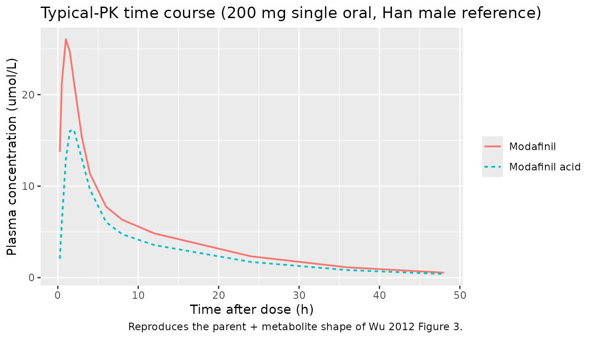
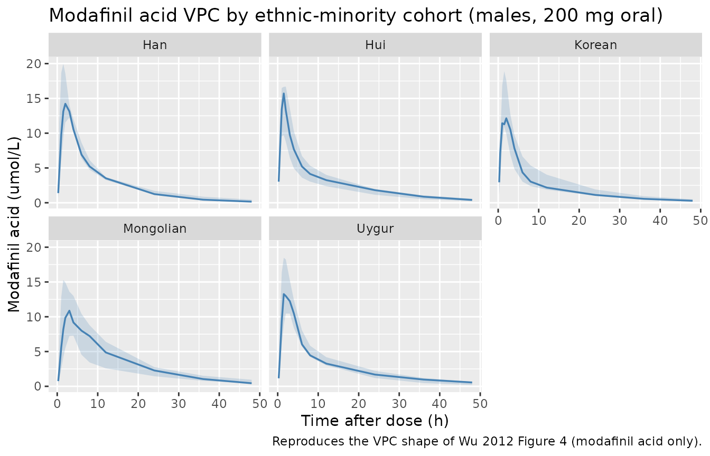

# Modafinil (Wu 2012)

## Model and source

``` r

mod  <- readModelDb("Wu_2012_modafinil")
meta <- rxode2::rxode(mod)
#> ℹ parameter labels from comments will be replaced by 'label()'
```

- Citation: Wu KH, Guo T, Deng CH, Guan Z, Li L, Zhou TY, Lu W.
  Population pharmacokinetics of modafinil acid and estimation of the
  metabolic conversion of modafinil into modafinil acid in 5 major
  ethnic groups of China. Acta Pharmacol Sin. 2012 Nov;33(11):1401-1408.
  <doi:10.1038/aps.2012.124>.
- Description: Joint parent + metabolite population pharmacokinetic
  model for oral modafinil and its principal carboxylic-acid metabolite
  modafinil acid (2-\[(diphenylmethyl)sulfonyl\]acetic acid) in 49
  healthy volunteers from five major ethnic groups of China (Han,
  Mongolian, Korean, Uygur, Hui) under a single 200 mg oral dose (Wu
  2012). Four-compartment NONMEM ADVAN6 / L2 structure: GI depot with
  first-order absorption (ka), two-compartment modafinil disposition
  (apparent CL/F, Vc/F, Q/F, Vp/F), and a one-compartment modafinil acid
  disposition (apparent CL3/F1F2, V3/F1F2). All modafinil elimination is
  treated as forming modafinil acid at the apparent-parameter level
  because F2 (the absolute modafinil-to-acid metabolic-conversion
  fraction) is not identifiable from oral plasma data alone; F2 is
  absorbed into the apparent acid parameters. Sex acts on CL/F, Q/F, and
  Vp/F of modafinil; ethnicity acts on Vc/F of modafinil (Korean and Hui
  share a single composite multiplier; Mongolian and Uygur each have
  their own) and on CL3/F1F2 of modafinil acid (Han and Mongolian share
  the reference; Korean has its own multiplier; Uygur and Hui share a
  composite multiplier).
- Article: [Acta Pharmacol Sin.
  2012;33(11):1401-1408](https://doi.org/10.1038/aps.2012.124)

## Population

Wu 2012 enrolled 49 healthy young Chinese volunteers (24 male, 25
female; age 18-26 years, mean 22.4 +/- 1.7; weight 44-88 kg, mean 60.9
+/- 10.6; BMI 16.9-31.6 kg/m^2, mean 21.9 +/- 3.1; height 150-184 cm,
mean 166.6 +/- 8.3) drawn from five major ethnic groups of the People’s
Republic of China (10 Han, 10 Mongolian, 9 Korean, 10 Uygur, 10 Hui;
minority families were single-ethnicity for three generations) in an
open-label, multi-centre, single-dose study (Wu 2012 Table 1). Each
subject received a single 200 mg oral modafinil dose (two 100 mg
tablets, Jiangzhong Pharmaceutical Co Ltd) after at least 8 h fasting
with 200 mL of water; plasma was sampled at 0, 0.25, 0.5, 1, 1.5, 2, 3,
4, 6, 8, 12, 24, 36, and 48 h post-dose. Hepatic function and routine
blood and biochemical parameters were within normal range; alcohol and
smoking were forbidden for at least 72 h before dosing and during
sampling; females were studied during the luteal phase of the menstrual
cycle. The 49 subjects contributed 637 paired modafinil and modafinil
acid plasma observations that were jointly analysed by NONMEM VII with
the FOCE-I method, ADVAN6 differential-equation system, and the L2
option for paired observations.

``` r

meta$population
#> $species
#> [1] "human"
#> 
#> $n_subjects
#> [1] 49
#> 
#> $n_studies
#> [1] 1
#> 
#> $age_range
#> [1] "18-26 years (mean 22.4, SD 1.7)"
#> 
#> $age_median
#> [1] "approximately 22 years (mean)"
#> 
#> $weight_range
#> [1] "44-88 kg (mean 60.9, SD 10.6)"
#> 
#> $weight_median
#> [1] "60.9 kg (mean)"
#> 
#> $height_range
#> [1] "150-184 cm (mean 166.6, SD 8.3)"
#> 
#> $bmi_range
#> [1] "16.9-31.6 kg/m^2 (mean 21.9, SD 3.1)"
#> 
#> $sex_female_pct
#> [1] 51
#> 
#> $race_ethnicity
#>       Han Mongolian    Korean     Uygur       Hui 
#>      20.4      20.4      18.4      20.4      20.4 
#> 
#> $disease_state
#> [1] "Healthy young volunteers; hepatic function and routine blood / biochemical parameters within normal range; no medications for at least 72 h before dosing; alcohol and smoking forbidden for at least 72 h before dosing and during sampling; females studied during luteal phase of the menstrual cycle."
#> 
#> $dose_range
#> [1] "Single 200 mg oral modafinil dose (two 100 mg tablets, Jiangzhong Pharmaceutical Co Ltd, China) with 200 mL of water, after at least 8 h fasting."
#> 
#> $regions
#> [1] "China (single-centre study, Shenyang Northern Hospital)."
#> 
#> $notes
#> [1] "Ethnicity counts (Table 1): Han 10 (5 male / 5 female), Mongolian 10 (5/5), Korean 9 (4/5), Uygur 10 (5/5), Hui 10 (5/5); minority families were single-ethnicity for three generations. Demographics from Wu 2012 Table 1; PK parameter estimates from Wu 2012 Table 2 'Final model'. The 49 subjects contributed 637 plasma concentration observations for each analyte. PopPK fitted with NONMEM VII (ICON) FOCE-I with interaction, ADVAN6 differential-equation system, L2 option for paired modafinil and acid observations."
```

## Source trace

The per-parameter origin is recorded as an in-file comment next to each
`ini()` entry in `inst/modeldb/specificDrugs/Wu_2012_modafinil.R`. The
table below collects them in one place for review.

| Equation / parameter | Value | Source location |
|----|----|----|
| Four-compartment GI / 2-cmt modafinil / 1-cmt modafinil acid structure | (structural) | Wu 2012 Figure 1 (model schematic); Methods ‘Population pharmacokinetic model development’ |
| First-order absorption rate constant ka (1/h) | 0.755 | Wu 2012 Table 2 ‘Final model’ ka (RSE 11.1 %) |
| Apparent modafinil clearance CL1/F1, male typical (L/h) | 3.51 | Wu 2012 Table 2 ‘Final model’ CL1/F1 (Male) (RSE 7.18 %) |
| Apparent modafinil clearance CL1/F1, female typical (L/h) | 3.14 | Wu 2012 Table 2 ‘Final model’ CL1/F1 (Female) (RSE 7.61 %) |
| Apparent modafinil central volume V1/F1, Han typical (L) | 7.74 | Wu 2012 Table 2 ‘Final model’ V1/F1 theta_2 (RSE 5.18 %); Han is the typical-value reference (theta_COV-V1 = 1) |
| Ethnicity multiplier theta_COV-V1 for Uygur | 1.33 | Wu 2012 Table 2 ‘Final model’ theta_COV-V1 Uygur (RSE 16.7 %) |
| Ethnicity multiplier theta_COV-V1 for Mongolian | 1.65 | Wu 2012 Table 2 ‘Final model’ theta_COV-V1 Mongolian (RSE 14.2 %) |
| Ethnicity multiplier theta_COV-V1 for Korean or Hui composite | 0.86 | Wu 2012 Table 2 ‘Final model’ theta_COV-V1 ‘Korean or Hui’ (RSE 21.6 %) |
| Apparent modafinil inter-compartmental clearance CL2/F1, male typical (L/h) | 7.02 | Wu 2012 Table 2 ‘Final model’ CL2/F1 (Male) (RSE 9.82 %) |
| Apparent modafinil inter-compartmental clearance CL2/F1, female typical (L/h) | 4.84 | Wu 2012 Table 2 ‘Final model’ CL2/F1 (Female) (RSE 31.5 %) |
| Apparent modafinil peripheral volume V2/F1, male typical (L) | 35.0 | Wu 2012 Table 2 ‘Final model’ V2/F1 (Male) (RSE 8.34 %) |
| Apparent modafinil peripheral volume V2/F1, female typical (L) | 20.41 | Wu 2012 Table 2 ‘Final model’ V2/F1 (Female) (RSE 12.3 %) |
| Apparent modafinil acid clearance CL3/(F1\*F2), Han / Mongolian typical (L/h) | 4.94 | Wu 2012 Table 2 ‘Final model’ CL3/(F1\*F2) theta_5 (RSE 7.65 %); Han and Mongolian share the reference (theta_COV-CL3 = 1) |
| Ethnicity multiplier theta_COV-CL3 for Korean | 1.25 | Wu 2012 Table 2 ‘Final model’ theta_COV-CL3 Korean (RSE 9.59 %) |
| Ethnicity multiplier theta_COV-CL3 for Uygur or Hui composite | 1.15 | Wu 2012 Table 2 ‘Final model’ theta_COV-CL3 ‘Uygur or Hui’ (RSE 12.3 %) |
| Apparent modafinil acid central volume V3/(F1\*F2) (L) | 2.73 | Wu 2012 Table 2 ‘Final model’ V3/(F1\*F2) (RSE 10.5 %) |
| Inter-individual variability, CL1/F1 (% CV) | 23.2 | Wu 2012 Table 2 ‘Final model – Inter-individual variability’; omega^2 = log(1 + 0.232^2) = 0.05242 |
| Inter-individual variability, V1/F1 (% CV) | 51.3 | Wu 2012 Table 2 ‘Final model – Inter-individual variability’; omega^2 = 0.23362 |
| Inter-individual variability, CL2/F1 (% CV) | 22.1 | Wu 2012 Table 2 ‘Final model – Inter-individual variability’; omega^2 = 0.04768 |
| Inter-individual variability, V2/F1 (% CV) | 18.8 | Wu 2012 Table 2 ‘Final model – Inter-individual variability’; omega^2 = 0.03473 |
| Inter-individual variability, CL3/(F1\*F2) (% CV) | 18.5 | Wu 2012 Table 2 ‘Final model – Inter-individual variability’; omega^2 = 0.03365 |
| Inter-individual variability, V3/(F1\*F2) (% CV) | 78.2 | Wu 2012 Table 2 ‘Final model – Inter-individual variability’; omega^2 = 0.47727 |
| Residual error, modafinil proportional (fraction) | 0.134 | Wu 2012 Table 2 ‘Final model – Intra-individual variability’ epsilon1 (Modafinil proportional = 13.4 %) |
| Residual error, modafinil additive (umol/L) | 0.001 | Wu 2012 Table 2 ‘Final model – Intra-individual variability’ epsilon2 (Modafinil additive) |
| Residual error, modafinil acid proportional (fraction) | 0.0894 | Wu 2012 Table 2 ‘Final model – Intra-individual variability’ epsilon3 (Modafinil acid proportional = 8.94 %) |

## Virtual cohort

Original observed data are not publicly available. The cohort below
approximates the 49-subject Wu 2012 demographic table (Table 1): five
ethnic-minority cohorts each of 10 subjects (Korean reduced to 9 in the
source paper but balanced to 10 here for plotting symmetry), each
balanced 50 / 50 male and female.

``` r

set.seed(2012)

groups <- tibble::tribble(
  ~ethnicity,  ~RACE_CN_MONGOLIAN, ~RACE_CN_KOREAN, ~RACE_CN_UYGUR, ~RACE_CN_HUI,
  "Han",       0L,                 0L,              0L,             0L,
  "Mongolian", 1L,                 0L,              0L,             0L,
  "Korean",    0L,                 1L,              0L,             0L,
  "Uygur",     0L,                 0L,              1L,             0L,
  "Hui",       0L,                 0L,              0L,             1L
)

n_per_group <- 10L

cohort <- groups |>
  tidyr::crossing(slot = seq_len(n_per_group)) |>
  dplyr::mutate(
    SEXF = as.integer(slot %% 2L == 0L),
    sex_label = ifelse(SEXF == 1L, "Female", "Male")
  ) |>
  dplyr::mutate(id = dplyr::row_number()) |>
  dplyr::select(id, ethnicity, sex_label, SEXF,
                RACE_CN_MONGOLIAN, RACE_CN_KOREAN, RACE_CN_UYGUR, RACE_CN_HUI)

obs_times <- sort(unique(c(0, 0.25, 0.5, 1, 1.5, 2, 3, 4, 6, 8, 12, 24, 36, 48)))

make_subject <- function(sub) {
  ev <- rxode2::et(amt = 200, cmt = "depot") |>
    rxode2::et(obs_times, cmt = "central")
  ev_df <- as.data.frame(ev)
  ev_df$dvid <- ifelse(ev_df$evid == 0L, 1L, NA_integer_)
  ev_df$id        <- sub$id
  ev_df$ethnicity <- sub$ethnicity
  ev_df$sex_label <- sub$sex_label
  ev_df$SEXF      <- sub$SEXF
  ev_df$RACE_CN_MONGOLIAN <- sub$RACE_CN_MONGOLIAN
  ev_df$RACE_CN_KOREAN    <- sub$RACE_CN_KOREAN
  ev_df$RACE_CN_UYGUR     <- sub$RACE_CN_UYGUR
  ev_df$RACE_CN_HUI       <- sub$RACE_CN_HUI
  ev_df
}

events <- cohort |>
  dplyr::group_split(id) |>
  lapply(make_subject) |>
  dplyr::bind_rows()

stopifnot(!anyDuplicated(unique(events[, c("id", "time", "evid")])))
```

## Simulation

``` r

mod_typ <- rxode2::zeroRe(mod)
#> ℹ parameter labels from comments will be replaced by 'label()'

sim_pop <- rxode2::rxSolve(
  mod, events,
  keep = c("ethnicity", "sex_label")
) |> as.data.frame()
#> ℹ parameter labels from comments will be replaced by 'label()'

sim_typ <- rxode2::rxSolve(
  mod_typ, events,
  keep = c("ethnicity", "sex_label")
) |> as.data.frame()
#> ℹ omega/sigma items treated as zero: 'etalcl', 'etalvc', 'etalq', 'etalvp', 'etalcl_mfa', 'etalvc_mfa'
#> Warning: multi-subject simulation without without 'omega'
```

## Replicate published figures

The Wu 2012 paper presents typical and individual concentration time
courses (Figure 3) and a VPC of modafinil acid (Figure 4). The
typical-value time course is reproduced below for the Han male subgroup,
the typical-value reference in the source paper.

``` r

plot_typ <- sim_typ |>
  dplyr::filter(ethnicity == "Han", sex_label == "Male",
                !is.na(Cc), time > 0) |>
  dplyr::distinct(time, .keep_all = TRUE) |>
  dplyr::select(time, Cc, Cc_mfa) |>
  tidyr::pivot_longer(c(Cc, Cc_mfa), names_to = "analyte", values_to = "conc") |>
  dplyr::mutate(analyte = dplyr::recode(analyte,
                                        Cc     = "Modafinil",
                                        Cc_mfa = "Modafinil acid"))

ggplot(plot_typ, aes(time, conc, colour = analyte, linetype = analyte)) +
  geom_line(linewidth = 0.7) +
  labs(x = "Time after dose (h)",
       y = "Plasma concentration (umol/L)",
       colour = NULL, linetype = NULL,
       title = "Typical-PK time course (200 mg single oral, Han male reference)",
       caption = "Reproduces the parent + metabolite shape of Wu 2012 Figure 3.")
```



VPC across the five ethnic-minority cohorts (males only for clarity)
reproduces the Figure 4 modafinil acid envelope shape:

``` r

vpc_acid <- sim_pop |>
  dplyr::filter(sex_label == "Male", !is.na(Cc_mfa), time > 0) |>
  dplyr::group_by(ethnicity, time) |>
  dplyr::summarise(
    q05 = quantile(Cc_mfa, 0.05),
    q50 = quantile(Cc_mfa, 0.50),
    q95 = quantile(Cc_mfa, 0.95),
    .groups = "drop"
  )

ggplot(vpc_acid, aes(time, q50)) +
  geom_ribbon(aes(ymin = q05, ymax = q95), alpha = 0.2, fill = "steelblue") +
  geom_line(colour = "steelblue", linewidth = 0.6) +
  facet_wrap(~ ethnicity, ncol = 3) +
  labs(x = "Time after dose (h)",
       y = "Modafinil acid (umol/L)",
       title = "Modafinil acid VPC by ethnic-minority cohort (males, 200 mg oral)",
       caption = "Reproduces the VPC shape of Wu 2012 Figure 4 (modafinil acid only).")
```



## PKNCA validation

Wu 2012 does not publish a side-by-side NCA table for either analyte
(the paper uses NCA-derived AUC0-inf only as an input into the
relative-conversion-fraction calculation in equation 4). The PKNCA block
below characterises typical-value Cmax, Tmax, AUC0-inf, and terminal
half-life by ethnic-minority cohort for both the parent and the acid
metabolite, using the male typical-value simulation.

``` r

# Modafinil
sim_nca_mod <- sim_typ |>
  dplyr::filter(sex_label == "Male", !is.na(Cc)) |>
  dplyr::distinct(id, time, ethnicity, .keep_all = TRUE) |>
  dplyr::select(id, time, Cc, ethnicity)

sim_nca_mod <- dplyr::bind_rows(
  sim_nca_mod,
  sim_nca_mod |> dplyr::distinct(id, ethnicity) |>
    dplyr::mutate(time = 0, Cc = 0)
) |>
  dplyr::distinct(id, ethnicity, time, .keep_all = TRUE) |>
  dplyr::arrange(id, ethnicity, time)

# Modafinil acid
sim_nca_acid <- sim_typ |>
  dplyr::filter(sex_label == "Male", !is.na(Cc_mfa)) |>
  dplyr::distinct(id, time, ethnicity, .keep_all = TRUE) |>
  dplyr::select(id, time, Cc_mfa, ethnicity) |>
  dplyr::rename(Cc = Cc_mfa)

sim_nca_acid <- dplyr::bind_rows(
  sim_nca_acid,
  sim_nca_acid |> dplyr::distinct(id, ethnicity) |>
    dplyr::mutate(time = 0, Cc = 0)
) |>
  dplyr::distinct(id, ethnicity, time, .keep_all = TRUE) |>
  dplyr::arrange(id, ethnicity, time)

dose_df <- events |>
  dplyr::filter(evid == 1, sex_label == "Male") |>
  dplyr::select(id, time, amt, ethnicity)

intervals <- data.frame(
  start      = 0,
  end        = Inf,
  cmax       = TRUE,
  tmax       = TRUE,
  aucinf.obs = TRUE,
  half.life  = TRUE
)

conc_mod  <- PKNCA::PKNCAconc(sim_nca_mod,  Cc ~ time | ethnicity + id,
                              concu = "umol/L", timeu = "h")
conc_acid <- PKNCA::PKNCAconc(sim_nca_acid, Cc ~ time | ethnicity + id,
                              concu = "umol/L", timeu = "h")
dose_obj  <- PKNCA::PKNCAdose(dose_df,      amt ~ time | ethnicity + id,
                              doseu = "mg")

nca_mod  <- PKNCA::pk.nca(PKNCA::PKNCAdata(conc_mod,  dose_obj, intervals = intervals))
nca_acid <- PKNCA::pk.nca(PKNCA::PKNCAdata(conc_acid, dose_obj, intervals = intervals))
```

### NCA summary – modafinil (parent, typical-value males)

``` r

res_mod_tbl <- as.data.frame(nca_mod$result) |>
  dplyr::filter(PPTESTCD %in% c("cmax", "tmax", "aucinf.obs", "half.life")) |>
  dplyr::distinct(ethnicity, PPTESTCD, .keep_all = TRUE) |>
  dplyr::select(ethnicity, PPTESTCD, PPORRES) |>
  dplyr::mutate(label = nlmixr2lib::ncaParamLabel(PPTESTCD)) |>
  dplyr::select(`NCA parameter` = label, ethnicity, PPORRES) |>
  tidyr::pivot_wider(names_from = ethnicity, values_from = PPORRES) |>
  dplyr::mutate(dplyr::across(where(is.numeric), \(x) round(x, 2)))

knitr::kable(
  res_mod_tbl,
  caption = paste("Typical-value modafinil NCA by ethnic-minority cohort",
                  "(males; 200 mg single oral dose; concentrations in umol/L,",
                  "AUC in umol/L*h)."),
  align = "lrrrrr"
)
```

| NCA parameter |    Han |    Hui | Korean | Mongolian |  Uygur |
|:--------------|-------:|-------:|-------:|----------:|-------:|
| Cmax          |  26.06 |  27.63 |  27.63 |     20.89 |  22.76 |
| Tmax          |   1.00 |   1.00 |   1.00 |      1.50 |   1.50 |
| t½            |  11.43 |  11.27 |  11.27 |     12.16 |  11.79 |
| AUC0-∞ (obs)  | 208.33 | 208.27 | 208.27 |    208.49 | 208.43 |

Typical-value modafinil NCA by ethnic-minority cohort (males; 200 mg
single oral dose; concentrations in umol/L, AUC in umol/L\*h). {.table}

### NCA summary – modafinil acid (typical-value males)

``` r

res_acid_tbl <- as.data.frame(nca_acid$result) |>
  dplyr::filter(PPTESTCD %in% c("cmax", "tmax", "aucinf.obs", "half.life")) |>
  dplyr::distinct(ethnicity, PPTESTCD, .keep_all = TRUE) |>
  dplyr::select(ethnicity, PPTESTCD, PPORRES) |>
  dplyr::mutate(label = nlmixr2lib::ncaParamLabel(PPTESTCD)) |>
  dplyr::select(`NCA parameter` = label, ethnicity, PPORRES) |>
  tidyr::pivot_wider(names_from = ethnicity, values_from = PPORRES) |>
  dplyr::mutate(dplyr::across(where(is.numeric), \(x) round(x, 2)))

knitr::kable(
  res_acid_tbl,
  caption = paste("Typical-value modafinil acid NCA by ethnic-minority cohort",
                  "(males; 200 mg single oral modafinil dose; concentrations",
                  "in umol/L, AUC in umol/L*h)."),
  align = "lrrrrr"
)
```

| NCA parameter |    Han |    Hui | Korean | Mongolian |  Uygur |
|:--------------|-------:|-------:|-------:|----------:|-------:|
| Cmax          |  16.15 |  15.19 |  14.19 |     13.67 |  13.15 |
| Tmax          |   2.00 |   1.50 |   1.50 |      2.00 |   2.00 |
| t½            |  11.42 |  11.27 |  11.27 |     12.14 |  11.79 |
| AUC0-∞ (obs)  | 148.22 | 128.88 | 118.56 |    148.23 | 128.89 |

Typical-value modafinil acid NCA by ethnic-minority cohort (males; 200
mg single oral modafinil dose; concentrations in umol/L, AUC in
umol/L\*h). {.table}

The Korean column reproduces Wu 2012’s key biological finding: Korean
subjects have the highest modafinil acid clearance and therefore the
lowest acid AUC at a given dose; the relative-conversion-fraction
estimate F2’ in Wu 2012 equation 5 also shows a higher value for Korean
than for the other four groups (Wu 2012 Figure 5).

## Assumptions and deviations

- Concentration units in the model are micromolar (umol/L), matching Wu
  2012 Table 2 (additive residual error reported as 0.001 umol/L) and
  Figure 4 (VPC axis in umol/L). The model file declares units\$dosing =
  “mg” and the model() block converts the mg dose to umol/L plasma
  concentrations via the modafinil molecular weight (273.35 g/mol).
  Modafinil acid is formed mole-for-mole from modafinil, so the same
  conversion factor is applied at the acid observation step.
- The bioavailability F1 of modafinil and the absolute modafinil-to-acid
  metabolic-conversion fraction F2 cannot be separately identified from
  oral plasma data without a parenteral or urinary reference arm (Wu
  2012 Discussion paragraph 6 cites Houston 1981 on this identifiability
  constraint). Apparent CL/F, V/F (modafinil), and apparent CL3/(F1*F2),
  V3/(F1*F2) (acid) are estimated and used in simulation. All of
  modafinil’s clearance flux is treated as forming the acid in the
  model() block; F2 is absorbed into the apparent acid parameters so the
  simulated acid time course reproduces the observed plasma modafinil
  acid concentrations.
- The Wu 2012 final-model ethnicity covariates combine groups for some
  parameters (Korean and Hui share the V1 multiplier 0.86; Uygur and Hui
  share the CL3 multiplier 1.15; Han and Mongolian share the CL3
  reference value 1.0). The packaged model encodes the subject-level
  ethnicity dimension via four mutually-exclusive binary indicators
  (RACE_CN_MONGOLIAN, RACE_CN_KOREAN, RACE_CN_UYGUR, RACE_CN_HUI; Han =
  all four = 0) and forms the composites inside model() via OR-logic
  across the binaries (RACE_CN_KOREAN + RACE_CN_HUI for V1;
  RACE_CN_UYGUR + RACE_CN_HUI for CL3). This preserves the subject-level
  ethnicity so an alternative composite could be reconstructed for
  re-analysis.
- The Wu 2012 source paper does not report inter-individual variability
  on the absorption rate constant ka; the packaged model carries no
  etalka term and ka is the same value (0.755 1/h) for every simulated
  subject.
- No allometric body-weight or covariate scaling on any parameter: Wu
  2012 Methods (Population pharmacokinetic model development paragraph)
  explicitly tested body weight, age, BMI, height, and the clinical
  biochemical indices (ALT, AST, ALP, total bilirubin, total protein,
  creatinine, BUN, and albumin) as candidate covariates, but none were
  retained in the final model under the inclusion / elimination criteria
  (Discussion paragraphs 4 and 5).
- The virtual cohort in this vignette is balanced to 50 subjects (5
  ethnic groups x 10 subjects, balanced male / female), one subject more
  than the Wu 2012 source cohort of 49 (Korean group reduced to 9 by
  sex-imbalance 4M / 5F in the source paper). The +1 simulated subject
  does not materially affect the typical-value NCA summary.
- The PKNCA NCA values reported above are typical-value summaries
  computed from the male typical-value (zero-IIV) simulation; the source
  paper does not report a side-by-side NCA table to compare against. The
  Wu 2012 relative-conversion-fraction comparison (equation 5 and
  Figure 5) is the source paper’s primary inferential outcome and is
  summarised in the narrative rather than rendered as a PKNCA-derived
  table.
