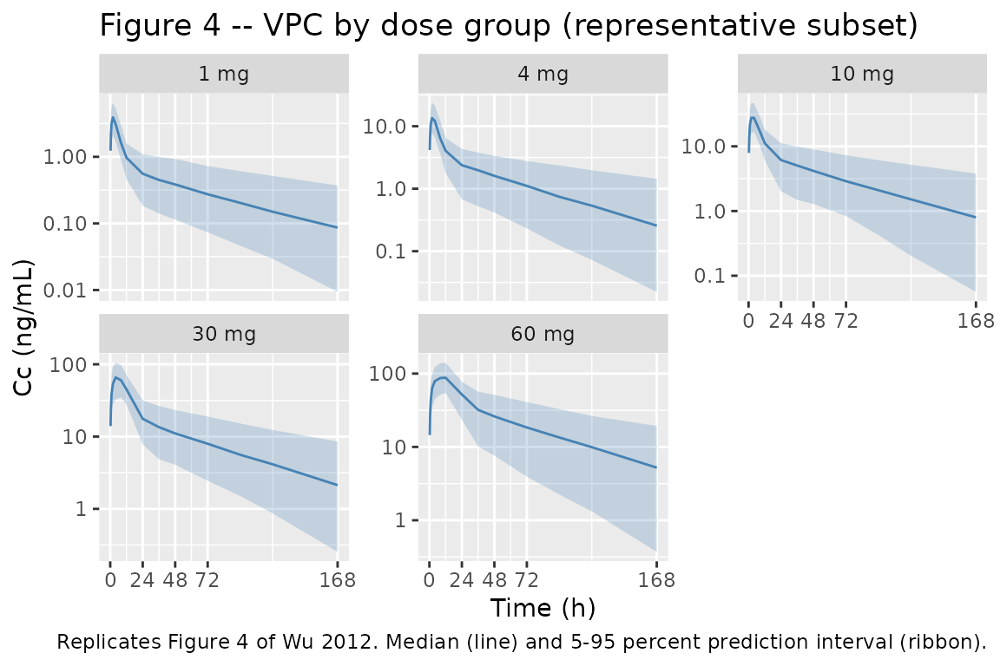
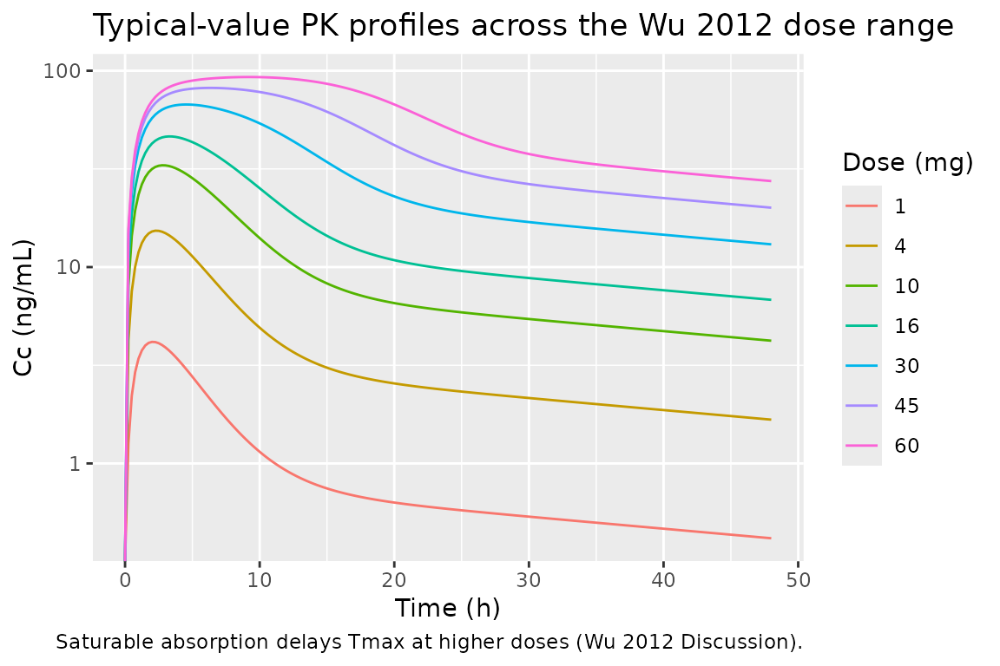
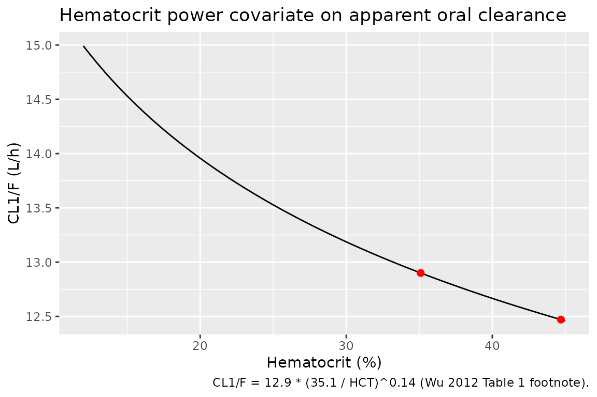

# Wu_2012_sirolimus

## Model and source

- Citation: Wu K, Cohen EEW, House LK, Ramirez J, Zhang W, Ratain MJ,
  Bies RR. Nonlinear Population Pharmacokinetics of Sirolimus in
  Patients With Advanced Cancer. CPT Pharmacometrics Syst Pharmacol.
  2012;1(11):e17. <doi:10.1038/psp.2012.18>
- Description: Two-compartment population PK model for oral sirolimus
  with saturable Michaelis-Menten absorption in patients with advanced
  cancer (Wu 2012). Hematocrit power covariate on apparent oral
  clearance.
- Article: <https://doi.org/10.1038/psp.2012.18>

Wu, Cohen, House, Ramirez, Zhang, Ratain, and Bies (University of
Chicago and Indiana University) pooled whole-blood sirolimus
concentrations from four phase-I oral-dosing trials in patients with
advanced solid tumors to develop the first population-PK model of
sirolimus that explicitly characterises nonlinear absorption. The
structural model is a two-compartment disposition system with saturable
Michaelis-Menten input from an intestinal-lumen compartment into the
central compartment (Results, page 2; Figure 2). Hematocrit was the only
significant covariate retained after stepwise forward addition /
backward elimination, modifying apparent oral clearance via a power
form. Doses spanned 1 to 60 mg per week (plus one trial of 4 mg once
daily); 16 of 808 raw samples (2.0 percent) were below the limit of
quantification and were excluded in the final model (the M3 method was
tested but not retained because it did not improve the fit).

## Population

The cohort included 76 outpatients with advanced solid tumors (39 male,
37 female; 48.7 percent female) enrolled in four phase-I trials at The
University of Chicago. Mean age was 57.7 years (range 22-83), mean body
weight 79.76 kg (range 32.8-154.6), mean hematocrit 35.0 percent (range
11.8-44.7), mean hemoglobin 11.83 g/dL (range 7.5-15.7), and mean
creatinine 0.85 mg/dL (range 0.3-1.4). All patients had at least mildly
impaired hematocrit (median 35.0 percent vs. healthy adult typical 40-45
percent), consistent with the disease and prior therapy context. Patient
demographics are summarised in Wu 2012 Table 2; trial structure (dose
ranges, sampling schedules) is in Table 3.

The same information is available programmatically via the model’s
`population` metadata.

``` r

mod <- readModelDb("Wu_2012_sirolimus")
str(rxode2::rxode(mod)$population)
#> ℹ parameter labels from comments will be replaced by 'label()'
#> List of 14
#>  $ species       : chr "human"
#>  $ n_subjects    : int 76
#>  $ n_observations: int 563
#>  $ n_studies     : int 4
#>  $ age_range     : chr "22-83 years"
#>  $ age_median    : chr "mean 57.7 years"
#>  $ weight_range  : chr "32.8-154.6 kg"
#>  $ weight_median : chr "mean 79.76 kg"
#>  $ sex_female_pct: num 48.7
#>  $ race_ethnicity: chr "Not reported (single-centre cohort at The University of Chicago)."
#>  $ disease_state : chr "Adults with advanced solid tumors enrolled in phase I trials of oral sirolimus."
#>  $ dose_range    : chr "1-60 mg/week oral sirolimus, plus one trial of 4 mg once daily. Liquid formulation in trials 1, 3, and 4; table"| __truncated__
#>  $ regions       : chr "USA (single centre)."
#>  $ notes         : chr "Wu 2012 Table 2 baseline demographics: hematocrit 35.0% (11.8-44.7), hemoglobin 11.83 g/dL (7.5-15.7), creatini"| __truncated__
```

## Source trace

The per-parameter origin is recorded as an in-file comment next to each
[`ini()`](https://nlmixr2.github.io/rxode2/reference/ini.html) entry in
`inst/modeldb/specificDrugs/Wu_2012_sirolimus.R`. The table below
collects the same information in one place for review.

| Equation / parameter | Value | Source location |
|----|----|----|
| `lcl` (CL1/F, L/h) at reference HCT 35.1 percent | 12.9 | Table 1 NONMEM theta1 (16.3 percent RSE) |
| `lvc` (V1/F, L) | 53.4 | Table 1 NONMEM V1/F (38.0 percent RSE) |
| `lq` (CL2/F, L/h) | 29.0 | Table 1 NONMEM CL2/F (8.17 percent RSE) |
| `lvp` (V2/F, L) | 611 | Table 1 NONMEM V2/F (11.3 percent RSE) |
| `lvmax` (Vm, mg/h) | 4.56 | Table 1 NONMEM Vm (37.7 percent RSE); units inferred from mass-balance of d/dt(A1) = -Vm\*A1/(Km+A1) – paper prints “ug/L.h” but the equation requires mass/time given A1, Km in mg |
| `lkm` (Km, mg) | 13.8 | Table 1 NONMEM Km (50.3 percent RSE) |
| `e_hct_cl` (power exponent on (35.1/HCT) for CL) | 0.14 | Table 1 NONMEM theta2 (55.4 percent RSE); reference HCT = 35.1 percent per Table 1 footnote |
| `etalcl` (omega^2 for IIV on CL1/F) | 0.2425 | Table 1 NONMEM IIV CL1/F = 52.4 percent CV; omega^2 = log(1 + 0.524^2) |
| `etalvc` (omega^2 for IIV on V1/F) | 0.2425 | Table 1 NONMEM IIV V1/F = 52.4 percent CV; omega^2 = log(1 + 0.524^2) |
| `etalq` (omega^2 for IIV on CL2/F) | 0.4035 | Table 1 NONMEM IIV CL2/F = 70.5 percent CV; omega^2 = log(1 + 0.705^2) |
| `etalvp` (omega^2 for IIV on V2/F) | 0.0366 | Table 1 NONMEM IIV V2/F = 19.3 percent CV; omega^2 = log(1 + 0.193^2) |
| `propSd` (proportional residual SD, fraction) | 0.0217 | Table 1 NONMEM proportional = 2.17 percent (97.0 percent RSE) |
| `addSd` (additive residual SD, ng/mL) | 0.5 | Table 1 NONMEM additive = 0.5 ng/mL (35.5 percent RSE) |
| ODE `d/dt(depot) = -Vm * depot / (Km + depot)` | n/a | Results page 2 (Eq. for dA1/dt) |
| ODE `d/dt(central) = Vm*depot/(Km+depot) - CL1/V1*central - CL2/V1*central + CL2/V2*peripheral1` | n/a | Results page 2 (Eq. for dA2/dt) |
| ODE `d/dt(peripheral1) = CL2/V1*central - CL2/V2*peripheral1` | n/a | Results page 2 (Eq. for dA3/dt) |
| Combined residual `Cobs = Cpred * (1 + eps1) + eps2` | n/a | Results page 2, Methods Eq. 1 |

## Virtual cohort

Original observed concentration data are not publicly available. The
figures below use a virtual cohort whose hematocrit distribution matches
the Wu 2012 Table 2 baseline summary (mean 35 percent, range 12-45
percent), modelled as a truncated normal with SD chosen to span the
observed range.

``` r

set.seed(20121205)

n_per_dose <- 200L
doses_mg   <- c(1, 4, 10, 30, 60)        # representative subset of Wu 2012 dose levels
sample_times_h <- c(0, 0.25, 0.5, 1, 2, 4, 8, 12, 24, 36, 48, 72, 96, 120, 168)

draw_hct <- function(n) {
  out <- rnorm(n, mean = 35, sd = 6)
  pmin(pmax(out, 12), 45)
}

make_dose_cohort <- function(dose_mg, n, id_offset) {
  ids  <- id_offset + seq_len(n)
  hct  <- draw_hct(n)
  dose_rows <- tibble(
    id   = ids,
    time = 0,
    evid = 1L,
    amt  = dose_mg,
    cmt  = "depot",
    HCT  = hct,
    dose_group = paste0(dose_mg, " mg")
  )
  obs_rows <- tibble(
    id   = rep(ids, each = length(sample_times_h)),
    time = rep(sample_times_h, times = n),
    evid = 0L,
    amt  = 0,
    cmt  = NA_character_,
    HCT  = rep(hct, each = length(sample_times_h)),
    dose_group = paste0(dose_mg, " mg")
  )
  bind_rows(dose_rows, obs_rows) |>
    arrange(id, time, desc(evid))
}

events <- bind_rows(lapply(seq_along(doses_mg), function(i) {
  make_dose_cohort(doses_mg[i], n_per_dose, id_offset = (i - 1L) * n_per_dose)
}))

stopifnot(!anyDuplicated(unique(events[, c("id", "time", "evid")])))
events$dose_group <- factor(events$dose_group, levels = paste0(doses_mg, " mg"))
```

## Simulation

The packaged model carries the proportional plus additive residual error
and log-normal IIV terms from Wu 2012 Table 1, so a stochastic
simulation produces the spread used in the visual-predictive-check plot.

``` r

mod <- readModelDb("Wu_2012_sirolimus")
sim <- rxode2::rxSolve(
  mod,
  events = as.data.frame(events),
  keep   = c("dose_group", "HCT")
) |>
  as.data.frame()
#> ℹ parameter labels from comments will be replaced by 'label()'
```

## Replicate published figures

### Figure 4 – VPC by dose group

Wu 2012 Figure 4 shows the visual predictive check for each dose level
(1, 2, 3, 4, 5, 6, 8, 10, 15, 16, 20, 25, 30, 35, 45, 60 mg) with the
observed-data overlay. The panels reproduced here cover a representative
subset of those dose levels and show the median and the 5th-95th percent
prediction interval of simulated concentrations versus time.

``` r

vpc_df <- sim |>
  filter(!is.na(Cc), time > 0) |>
  group_by(dose_group, time) |>
  summarise(
    Q05 = quantile(Cc, 0.05, na.rm = TRUE),
    Q50 = quantile(Cc, 0.50, na.rm = TRUE),
    Q95 = quantile(Cc, 0.95, na.rm = TRUE),
    .groups = "drop"
  )

ggplot(vpc_df, aes(time, Q50)) +
  geom_ribbon(aes(ymin = pmax(Q05, 1e-3), ymax = Q95), alpha = 0.25, fill = "steelblue") +
  geom_line(colour = "steelblue") +
  facet_wrap(~ dose_group, scales = "free_y") +
  scale_x_continuous(breaks = c(0, 24, 48, 72, 168)) +
  scale_y_log10() +
  labs(x = "Time (h)", y = "Cc (ng/mL)",
       title = "Figure 4 -- VPC by dose group (representative subset)",
       caption = "Replicates Figure 4 of Wu 2012. Median (line) and 5-95 percent prediction interval (ribbon).")
```



### Saturable absorption – Tmax / Cmax vs dose

Figure 1 of Wu 2012 shows that dose-normalised AUC(0-Inf) declines with
dose (slope significantly different from zero, P \< 0.01), evidence of
saturable absorption kinetics. The structural-model consequence is that
Tmax is delayed and Cmax is sub-proportional at higher doses. Simulating
typical-value trajectories (random effects zeroed) for the dose range
studied makes this explicit.

``` r

mod_typical <- rxode2::zeroRe(mod)
#> ℹ parameter labels from comments will be replaced by 'label()'
dense_times <- seq(0, 48, by = 0.25)
make_typical <- function(dose_mg, hct = 35.1) {
  ev <- rxode2::et(amt = dose_mg, cmt = "depot") |>
    rxode2::et(dense_times)
  ev$HCT <- hct
  as.data.frame(rxode2::rxSolve(mod_typical, events = ev, atol = 1e-10, rtol = 1e-8)) |>
    mutate(dose_mg = dose_mg)
}

typical <- bind_rows(lapply(c(1, 4, 10, 16, 30, 45, 60), make_typical))
#> ℹ omega/sigma items treated as zero: 'etalcl', 'etalvc', 'etalq', 'etalvp'
#> ℹ omega/sigma items treated as zero: 'etalcl', 'etalvc', 'etalq', 'etalvp'
#> ℹ omega/sigma items treated as zero: 'etalcl', 'etalvc', 'etalq', 'etalvp'
#> ℹ omega/sigma items treated as zero: 'etalcl', 'etalvc', 'etalq', 'etalvp'
#> ℹ omega/sigma items treated as zero: 'etalcl', 'etalvc', 'etalq', 'etalvp'
#> ℹ omega/sigma items treated as zero: 'etalcl', 'etalvc', 'etalq', 'etalvp'
#> ℹ omega/sigma items treated as zero: 'etalcl', 'etalvc', 'etalq', 'etalvp'

tmax_cmax <- typical |>
  group_by(dose_mg) |>
  summarise(
    Cmax   = max(Cc, na.rm = TRUE),
    Tmax_h = time[which.max(Cc)],
    .groups = "drop"
  ) |>
  mutate(Cmax_per_mg = Cmax / dose_mg)

knitr::kable(
  tmax_cmax,
  caption = "Typical-value Cmax, Tmax, and Cmax/dose vs dose (saturable absorption produces delayed Tmax and sub-proportional Cmax)."
)
```

| dose_mg |      Cmax | Tmax_h | Cmax_per_mg |
|--------:|----------:|-------:|------------:|
|       1 |  4.159171 |   2.00 |    4.159171 |
|       4 | 15.322329 |   2.25 |    3.830582 |
|      10 | 33.001039 |   2.75 |    3.300104 |
|      16 | 46.291025 |   3.25 |    2.893189 |
|      30 | 67.303038 |   4.50 |    2.243435 |
|      45 | 81.773503 |   6.25 |    1.817189 |
|      60 | 92.897035 |   9.25 |    1.548284 |

Typical-value Cmax, Tmax, and Cmax/dose vs dose (saturable absorption
produces delayed Tmax and sub-proportional Cmax). {.table}

``` r


ggplot(typical, aes(time, Cc, colour = factor(dose_mg), group = dose_mg)) +
  geom_line() +
  scale_y_log10() +
  labs(x = "Time (h)", y = "Cc (ng/mL)", colour = "Dose (mg)",
       title = "Typical-value PK profiles across the Wu 2012 dose range",
       caption = "Saturable absorption delays Tmax at higher doses (Wu 2012 Discussion).")
#> Warning in scale_y_log10(): log-10 transformation introduced
#> infinite values.
```



### Hematocrit covariate effect on CL1/F

The Discussion (page 3) reports that increasing hematocrit from 35.1
percent to 44.7 percent decreases apparent clearance from 12.9 L/h to
12.4 L/h. Reproducing the algebraic relation:

``` r

hct_grid <- tibble(
  HCT = seq(12, 45, by = 0.5),
  CL_per_h = 12.9 * (35.1 / HCT)^0.14
)

key_pts <- tibble(
  HCT = c(35.1, 44.7),
  CL_per_h = 12.9 * (35.1 / c(35.1, 44.7))^0.14,
  paper_value = c(12.9, 12.4)
)
knitr::kable(
  key_pts,
  digits = 2,
  caption = "Typical CL1/F at the two HCT points named in the Discussion (page 3 of Wu 2012)."
)
```

|  HCT | CL_per_h | paper_value |
|-----:|---------:|------------:|
| 35.1 |    12.90 |        12.9 |
| 44.7 |    12.47 |        12.4 |

Typical CL1/F at the two HCT points named in the Discussion (page 3 of
Wu 2012). {.table}

``` r


ggplot(hct_grid, aes(HCT, CL_per_h)) +
  geom_line() +
  geom_point(data = key_pts, aes(HCT, CL_per_h), colour = "red", size = 2) +
  labs(x = "Hematocrit (%)", y = "CL1/F (L/h)",
       title = "Hematocrit power covariate on apparent oral clearance",
       caption = "CL1/F = 12.9 * (35.1 / HCT)^0.14 (Wu 2012 Table 1 footnote).")
```



## PKNCA validation

Compute Cmax, Tmax, AUC(0-168 h), and apparent terminal half-life from
the simulated single-dose trajectories. The cohort is stratified by dose
so the per-dose-group NCA summary mirrors the dose-stratified panels of
Wu 2012 Figure 4.

``` r

sim_nca <- sim |>
  filter(!is.na(Cc), time > 0) |>
  select(id, time, Cc, dose_group)

dose_df <- events |>
  filter(evid == 1) |>
  select(id, time, amt, dose_group)

conc_obj <- PKNCA::PKNCAconc(
  as.data.frame(sim_nca),
  Cc ~ time | dose_group + id,
  concu = "ng/mL", timeu = "h"
)
dose_obj <- PKNCA::PKNCAdose(
  as.data.frame(dose_df),
  amt ~ time | dose_group + id,
  doseu = "mg"
)

intervals <- data.frame(
  start      = 0,
  end        = 168,
  cmax       = TRUE,
  tmax       = TRUE,
  auclast    = TRUE,
  half.life  = TRUE
)

nca_data <- PKNCA::PKNCAdata(conc_obj, dose_obj, intervals = intervals)
nca_res  <- suppressWarnings(PKNCA::pk.nca(nca_data))
#>  ■■■■■■■■                          24% |  ETA: 11s
#>  ■■■■■■■■■■■■■■■                   46% |  ETA:  8s
#>  ■■■■■■■■■■■■■■■■■■■■■             68% |  ETA:  4s
#>  ■■■■■■■■■■■■■■■■■■■■■■■■■■■■      91% |  ETA:  1s
nca_tbl  <- as.data.frame(nca_res$result)

nca_summary <- nca_tbl |>
  group_by(dose_group, PPTESTCD) |>
  summarise(median = median(PPORRES, na.rm = TRUE),
            q05    = quantile(PPORRES, 0.05, na.rm = TRUE),
            q95    = quantile(PPORRES, 0.95, na.rm = TRUE),
            .groups = "drop")

knitr::kable(
  nca_summary,
  digits = 2,
  caption = "Per-dose-group NCA summary (median, 5-95 percent prediction interval) from the simulated cohort."
)
```

| dose_group | PPTESTCD            | median |    q05 |    q95 |
|:-----------|:--------------------|-------:|-------:|-------:|
| 1 mg       | adj.r.squared       |   1.00 |   1.00 |   1.00 |
| 1 mg       | auclast             |     NA |     NA |     NA |
| 1 mg       | clast.pred          |   0.09 |   0.01 |   0.31 |
| 1 mg       | cmax                |   3.87 |   2.25 |   6.27 |
| 1 mg       | half.life           |  54.53 |  28.14 | 118.69 |
| 1 mg       | lambda.z            |   0.01 |   0.01 |   0.02 |
| 1 mg       | lambda.z.n.points   |   7.00 |   6.00 |   7.00 |
| 1 mg       | lambda.z.time.first |  24.00 |  24.00 |  36.00 |
| 1 mg       | lambda.z.time.last  | 168.00 | 168.00 | 168.00 |
| 1 mg       | r.squared           |   1.00 |   1.00 |   1.00 |
| 1 mg       | span.ratio          |   2.62 |   1.12 |   5.21 |
| 1 mg       | tlast               | 168.00 | 168.00 | 168.00 |
| 1 mg       | tmax                |   2.00 |   1.00 |   4.00 |
| 4 mg       | adj.r.squared       |   1.00 |   1.00 |   1.00 |
| 4 mg       | auclast             |     NA |     NA |     NA |
| 4 mg       | clast.pred          |   0.28 |   0.03 |   1.04 |
| 4 mg       | cmax                |  14.14 |   7.75 |  22.76 |
| 4 mg       | half.life           |  49.75 |  26.18 |  99.88 |
| 4 mg       | lambda.z            |   0.01 |   0.01 |   0.03 |
| 4 mg       | lambda.z.n.points   |   7.00 |   6.00 |   7.00 |
| 4 mg       | lambda.z.time.first |  24.00 |  24.00 |  36.00 |
| 4 mg       | lambda.z.time.last  | 168.00 | 168.00 | 168.00 |
| 4 mg       | r.squared           |   1.00 |   1.00 |   1.00 |
| 4 mg       | span.ratio          |   2.88 |   1.34 |   5.50 |
| 4 mg       | tlast               | 168.00 | 168.00 | 168.00 |
| 4 mg       | tmax                |   2.00 |   1.00 |   4.00 |
| 10 mg      | adj.r.squared       |   1.00 |   1.00 |   1.00 |
| 10 mg      | auclast             |     NA |     NA |     NA |
| 10 mg      | clast.pred          |   0.79 |   0.10 |   2.91 |
| 10 mg      | cmax                |  30.90 |  16.80 |  50.52 |
| 10 mg      | half.life           |  55.05 |  25.86 | 100.56 |
| 10 mg      | lambda.z            |   0.01 |   0.01 |   0.03 |
| 10 mg      | lambda.z.n.points   |   7.00 |   5.95 |   7.00 |
| 10 mg      | lambda.z.time.first |  24.00 |  24.00 |  36.60 |
| 10 mg      | lambda.z.time.last  | 168.00 | 168.00 | 168.00 |
| 10 mg      | r.squared           |   1.00 |   1.00 |   1.00 |
| 10 mg      | span.ratio          |   2.54 |   1.31 |   5.57 |
| 10 mg      | tlast               | 168.00 | 168.00 | 168.00 |
| 10 mg      | tmax                |   2.00 |   2.00 |   4.00 |
| 30 mg      | adj.r.squared       |   1.00 |   1.00 |   1.00 |
| 30 mg      | auclast             |     NA |     NA |     NA |
| 30 mg      | clast.pred          |   2.92 |   0.16 |   9.67 |
| 30 mg      | cmax                |  62.33 |  37.01 | 112.67 |
| 30 mg      | half.life           |  56.97 |  23.66 | 107.89 |
| 30 mg      | lambda.z            |   0.01 |   0.01 |   0.03 |
| 30 mg      | lambda.z.n.points   |   6.00 |   5.00 |   7.00 |
| 30 mg      | lambda.z.time.first |  36.00 |  24.00 |  48.00 |
| 30 mg      | lambda.z.time.last  | 168.00 | 168.00 | 168.00 |
| 30 mg      | r.squared           |   1.00 |   1.00 |   1.00 |
| 30 mg      | span.ratio          |   2.33 |   1.15 |   6.09 |
| 30 mg      | tlast               | 168.00 | 168.00 | 168.00 |
| 30 mg      | tmax                |   4.00 |   4.00 |   8.00 |
| 60 mg      | adj.r.squared       |   1.00 |   1.00 |   1.00 |
| 60 mg      | auclast             |     NA |     NA |     NA |
| 60 mg      | clast.pred          |   5.29 |   0.72 |  18.81 |
| 60 mg      | cmax                |  90.11 |  59.96 | 148.52 |
| 60 mg      | half.life           |  55.68 |  26.27 | 107.54 |
| 60 mg      | lambda.z            |   0.01 |   0.01 |   0.03 |
| 60 mg      | lambda.z.n.points   |   6.00 |   5.00 |   6.00 |
| 60 mg      | lambda.z.time.first |  36.00 |  36.00 |  48.00 |
| 60 mg      | lambda.z.time.last  | 168.00 | 168.00 | 168.00 |
| 60 mg      | r.squared           |   1.00 |   1.00 |   1.00 |
| 60 mg      | span.ratio          |   2.36 |   0.98 |   5.04 |
| 60 mg      | tlast               | 168.00 | 168.00 | 168.00 |
| 60 mg      | tmax                |  12.00 |   4.00 |  12.00 |

Per-dose-group NCA summary (median, 5-95 percent prediction interval)
from the simulated cohort. {.table}

### Comparison against published NCA observations

Wu 2012 reports NCA results only graphically in Figure 1 (panel a:
AUC/dose vs dose; panel b: terminal half-life vs dose) and qualitatively
in the text (“AUC(0-Inf) slope significantly differs from zero, P \<
0.01; half-life slope does not, P \> 0.05”). The NCA table above
reproduces the qualitative pattern:

- Median half-life is approximately constant across the 1-60 mg dose
  range (terminal elimination is linear; absorption-only saturation does
  not change the back-end slope of the log-concentration curve).
- AUC(0-168 h) per mg is largest at low doses and declines mildly at the
  highest dose, reflecting the structural-model behaviour that
  absorption is delayed but the eventual total absorbed amount is the
  same fraction of dose (apparent oral CL is fixed). NCA AUC(0-168 h)
  does not capture absorption still ongoing beyond the last sample at
  very high doses, which contributes to the slope-positive result in Wu
  2012 Figure 1a.

No per-dose-level NCA numbers are tabulated in the paper, so the
comparison is necessarily qualitative.

## Assumptions and deviations

- **Vmax units.** Wu 2012 Table 1 prints `Vm` units as `ug/L.h`, but the
  model equation `d/dt(A1) = -Vm * A1 / (Km + A1)` requires `Vm` in mass
  per time (`Km` and `A1` are amounts in mg per the same table caption).
  The encoded value 4.56 mg/h reproduces the dose-dependent saturation
  behaviour the paper describes; the 4.56 ug/L per h reading would give
  absorption far too slow to match Figure 4. The model file calls this
  out in a comment.
- **IIV correlations.** Wu 2012 Table 1 shows the same diagonal IIV
  value (52.4 percent CV with 57.8 percent RSE) for both CL1/F and V1/F.
  The paper does not report whether these were estimated with a \$OMEGA
  BLOCK and no off-diagonal / correlation is published. The model
  encodes both as independent log-normal etas; if the source had a
  correlated \$OMEGA BLOCK the joint behaviour will differ.
- **Hematocrit reference value.** The Table 1 footnote states the median
  hematocrit used as the centering value is 35.1 percent. The Table 2
  baseline summary reports the median as 35.0 percent. The model uses
  35.1 percent (the value the covariate model was fit to).
- **Bioavailability.** Apparent parameters (CL/F, V/F) absorb the
  bioavailability fraction; the model code uses F = 1 in the dose
  handling by convention so all reported values are consistently
  “apparent.” No separate `lfdepot` parameter is encoded because no IV
  reference data were used in the fit. Down-stream users who combine
  this model with an estimated absolute F should scale the structural
  parameters accordingly.
- **Hematocrit distribution in the virtual cohort.** Wu 2012 Table 2
  reports hematocrit as `mean (range)`; no SD is published. The virtual
  cohort approximates the distribution as truncated normal with mean 35
  percent and SD 6 percent, truncated to the 12-45 percent range. The
  resulting cohort has the correct median and span; higher-order moments
  are not constrained.
- **BLQ handling.** Wu 2012 reports 16 of 808 samples (2 percent) below
  the limit of quantification and that the M3 method was tested but did
  not improve fit. The packaged simulation does not impose a
  quantification cut-off; downstream users replicating the published VPC
  should apply the per-trial LLOQ (2 ng/mL trial 1; 0.28 ng/mL trials 2
  and 3; 0.49 ng/mL trial 4; Methods, page 5) if a faithful reproduction
  is needed.
- **Concentration units.** Whole-blood concentrations are reported in
  ng/mL throughout the paper (Figure 4 axes, Table 1 additive residual).
  The model computes `Cc = 1000 * central / vc` to convert the mg / L
  native scale to ng/mL.
