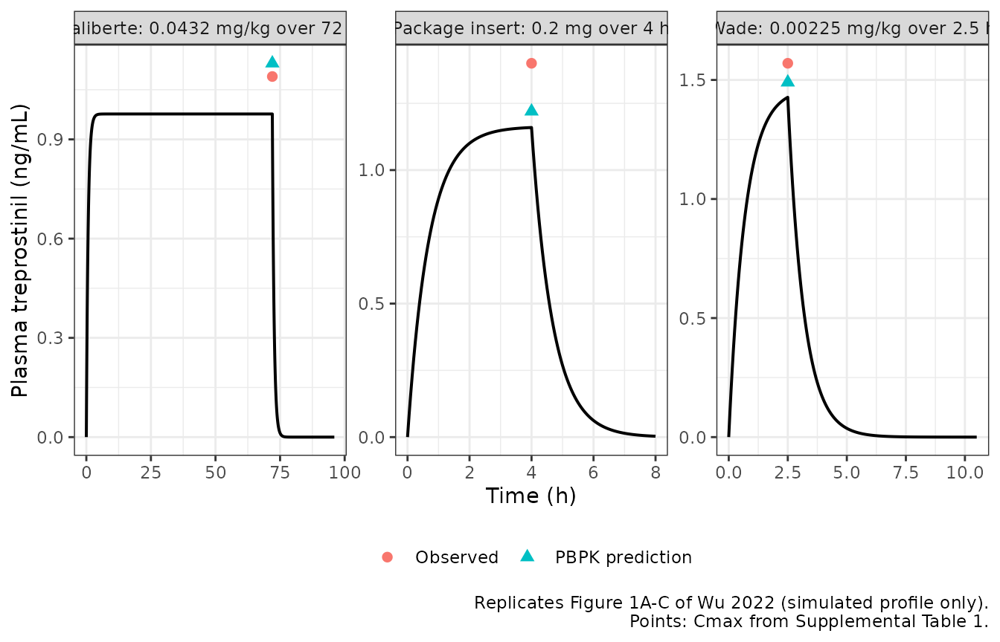

# Treprostinil: intravenous PK (Wu 2022)

## Model and source

``` r

mod <- readModelDb("Wu_2022_treprostinil")
ui <- rxode2::rxode(mod)
```

- Citation: Wu X, Zhang X, Xu R, Shaik IH, Venkataramanan R. (2022).
  Physiologically based pharmacokinetic modelling of treprostinil after
  intravenous injection and extended-release oral tablet administration
  in healthy volunteers: An extrapolation to other patient populations
  including patients with hepatic impairment. Br J Clin Pharmacol
  88(2):587-599. <doi:10.1111/bcp.14966>.
- Article: <https://doi.org/10.1111/bcp.14966>
- Supplement (Supplemental Table 1):
  <https://www.ncbi.nlm.nih.gov/pmc/articles/PMC9290939/>

## What this model is, and what it is not

Wu 2022 builds a Simcyp (version 17 release 1) physiologically based
pharmacokinetic (PBPK) model of the prostacyclin analogue treprostinil.
The model has an intravenous arm, built on one infusion study and
verified on two more, and an arm for the extended-release oral tablet
(Orenitram). The oral arm is then extrapolated to Child-Pugh A/B/C
hepatic impairment and to patients with pulmonary arterial hypertension
or systemic sclerosis.

Simcyp’s whole-body mass-balance equations are proprietary and appear
nowhere in the paper. Distribution uses the full-PBPK layout with
Rodgers and Rowland tissue:plasma partition coefficients. Table 3 prints
all twelve tissue `Kp` values, the optimized `Kp` scalar (0.7) and the
optimized adipose `Kp` (1.20). It prints no organ volume and no blood
flow, so the multi-tissue structure cannot be rebuilt. The paper does
report, completely, what the **intravenous** disposition needs:

- the total in vivo intravenous clearance, 43 L/h. This is “the average
  clearance value after intravenous administration obtained from 3
  reports”, and the retrograde clearance model was built to reproduce it
  (section 2.2);
- its renal component, 0.9 L/h (Table 4);
- the final model’s predicted steady-state volume of distribution, 0.42
  L/kg (Table 3);
- and, in Supplemental Table 1, the PBPK model’s own predicted Cmax and
  AUC for every simulated regimen. These are the answer key for any
  reduction.

That is enough for a one-compartment intravenous reduction with no
fitted parameter. Below, it reproduces the platform’s predicted Cmax and
AUC for all three intravenous studies to within 14%.

### Why only the intravenous arm

The oral arm cannot be reduced. The reason is quantitative and does not
depend on the absorption shape. The paper prints the oral availability
factors as `fa = 0.48`, `Fg = 0.87` and `Fh = 0.60` (Discussion).
Combined with the intravenous clearance, these give an AUC that is far
above the platform’s own prediction:

``` r

F_oral   <- 0.48 * 0.87 * 0.60        # fa * Fg * Fh (Discussion)
cl_iv    <- 43                        # L/h (section 2.2)
auc_red  <- 1 * F_oral / cl_iv * 1000 # 1 mg tablet, ng*h/mL
auc_pbpk <- 3.94                      # Supplemental Table 1, oral SD study 1, AUC0-36

# Hepatic extraction implied by Fh, against the hepatic blood clearance
# implied by the intravenous model (CL minus renal minus additional systemic,
# converted to blood with B/P = 0.55 from Table 2).
cl_h_blood <- (cl_iv - 0.9 - 2.6) / 0.55
qh_needed  <- cl_h_blood / (1 - 0.60)

oral_chk <- tibble::tibble(
  Quantity = c("F = fa * Fg * Fh",
               "AUCinf from F * dose / CL_iv (ng*h/mL)",
               "PBPK-predicted AUC0-36 (ng*h/mL)",
               "Reduction / PBPK",
               "Hepatic blood CL implied by CL_iv (L/h)",
               "Hepatic blood flow needed for Fh = 0.60 (L/h)"),
  Value = signif(c(F_oral, auc_red, auc_pbpk, auc_red / auc_pbpk,
                   cl_h_blood, qh_needed), 4)
)
knitr::kable(oral_chk, caption = "Why the oral arm is not reduced.")
```

| Quantity                                      |    Value |
|:----------------------------------------------|---------:|
| F = fa \* Fg \* Fh                            |   0.2506 |
| AUCinf from F \* dose / CL_iv (ng\*h/mL)      |   5.8270 |
| PBPK-predicted AUC0-36 (ng\*h/mL)             |   3.9400 |
| Reduction / PBPK                              |   1.4790 |
| Hepatic blood CL implied by CL_iv (L/h)       |  71.8200 |
| Hepatic blood flow needed for Fh = 0.60 (L/h) | 179.5000 |

Why the oral arm is not reduced. {.table}

``` r


stopifnot(
  abs(F_oral - 0.2506) < 1e-3,
  auc_red / auc_pbpk > 1.4,   # the printed factors overshoot by ~48%
  qh_needed > 170
)
```

`AUCinf = F * dose / CL` holds for *any* linear absorption model, so no
choice of release profile, transit time or `ka` closes this 48% gap. The
printed `Fh` is also inconsistent with the intravenous clearance.
Extraction of 0.40 against a hepatic blood clearance of 72 L/h needs a
hepatic blood flow of about 180 L/h, roughly twice the typical adult
value. The oral model’s systemic clearance is therefore not the 43 L/h
of the intravenous model. That fits section 2.2, which states that the
plasma unbound fraction “in the oral model was adjusted to 0.04”
(against 0.09 in Table 2). Hepatic clearance then follows from the
retrograde intrinsic clearances per pmol of CYP2C8 and CYP2C9 through
liver weight, enzyme abundance and hepatic blood flow. None of those is
printed.

Inverting the platform’s oral AUC with the intravenous clearance gives
an apparent `F` of about 0.17. That would be derived *from* the answer
key, so it reproduces the answer by construction and validates nothing.
The absorption layer adds further gaps. It is Simcyp’s ADAM model,
driven by a digitised osmotic-tablet dissolution profile, a jejunal
permeability of 0.46e-4 cm/s and a colon absorption scalar of 0.05.
These act on regional transit times and surface areas from the platform
database. The hepatic-impairment and patient extrapolations are oral and
also use Simcyp cirrhosis population files, so they are out of scope for
the same reasons.

## Population

``` r

p <- ui$population
pop_tab <- tibble::tibble(
  Field = c("Species", "Studies", "Subjects", "Age", "% female", "Race",
            "Doses"),
  Value = c(p$species, p$n_studies, p$n_subjects, p$age_range,
            p$sex_female_pct, p$race_ethnicity, p$dose_range)
)
knitr::kable(pop_tab, caption = "Intravenous studies (Wu 2022 Table 1).")
```

| Field | Value |
|:---|:---|
| Species | human |
| Studies | 3 |
| Subjects | 90 |
| Age | 18-63 years across the three intravenous studies (Table 1; the third study’s range is unreported and was defaulted to 18-65 years in the simulations) |
| % female | 40-50 across the three intravenous studies (Table 1) |
| Race | Predominantly white (Table 1: 8 white, 3 black, 4 Hispanic; 26 white, 8 black, 17 other; third study unreported); simulated as the Simcyp healthy Caucasian population |
| Doses | Single intravenous infusions of 0.00225 mg/kg over 2.5 h, 0.0432 mg/kg over 72 h and 0.2 mg over 4 h (Table 1). |

Intravenous studies (Wu 2022 Table 1). {.table}

The three intravenous studies in Table 1 enrolled healthy volunteers:

- **Wade et al.** (reference 10): 15 subjects (47% female; 8 white, 3
  black, 4 Hispanic), aged 18-49 years, given 0.00225 mg/kg over 2.5 h.
  This study was used to build the model.
- **Laliberte et al.** (reference 11): 51 subjects (40% female; 26
  white, 8 black, 17 other), aged 18-63 years, given 0.0432 mg/kg over
  72 h. Used for verification.
- **Package insert** (reference 4): 24 subjects given 0.2 mg over 4 h,
  with demographics unreported. The simulations defaulted to 50% female,
  white, aged 18-65 years. Used for verification.

None of the studies reports body weight, and neither does the paper or
its supplement. Simulations used the Simcyp healthy Caucasian
population, as 10 trials of 10 virtual subjects each.

## Source trace

Every value in the `ini()` block, with its source location.

``` r

trace_tab <- tibble::tribble(
  ~Parameter,    ~Value,      ~Source,
  "lvc",         "29.4 L",    "Table 3 'Vss (L/kg) predicted' 0.42; 0.42 L/kg * 70 kg",
  "lcl_renal",   "0.9 L/h",   "Table 4 'CL R (L/h)' 0.9; section 2.2: 2% of the total in vivo clearance",
  "lcl_nonren",  "42.1 L/h",  "Section 2.2: total intravenous clearance 43 L/h, minus the 0.9 L/h renal arm",
  "propSd",      "0 (fixed)", "No residual-error model is reported anywhere in the source"
)
knitr::kable(trace_tab, caption = "Source trace for every fixed parameter.")
```

| Parameter | Value | Source |
|:---|:---|:---|
| lvc | 29.4 L | Table 3 ‘Vss (L/kg) predicted’ 0.42; 0.42 L/kg \* 70 kg |
| lcl_renal | 0.9 L/h | Table 4 ‘CL R (L/h)’ 0.9; section 2.2: 2% of the total in vivo clearance |
| lcl_nonren | 42.1 L/h | Section 2.2: total intravenous clearance 43 L/h, minus the 0.9 L/h renal arm |
| propSd | 0 (fixed) | No residual-error model is reported anywhere in the source |

Source trace for every fixed parameter. {.table}

The model equations are the standard one-compartment intravenous system
(`d/dt(central) = -kel * central`, `kel = cl / vc`,
`cl = cl_renal + cl_nonren`, `Cc = 1000 * central / vc`) with no
nonstandard terms. The `1000` converts mg/L to the ng/mL used in Figure
1 and Supplemental Table 1.

The non-renal arm lumps every other elimination route the paper
describes (section 2.2, Table 4). These are CYP2C8 and CYP2C9 hepatic
metabolism at a 90:10 split (retrograde intrinsic clearances of 20.5 and
0.75 uL/min/pmol), biliary clearance (1% of the total, 2.04 uL/min/10^6
cells) and an additional systemic clearance of 2.6 L/h (6%). The split
does not change the plasma profile, so it is not encoded separately.

``` r

theta <- ui$theta
stopifnot(
  isTRUE(all.equal(exp(theta[["lvc"]]), 0.42 * 70, tolerance = 1e-8)),
  isTRUE(all.equal(exp(theta[["lcl_renal"]]), 0.9, tolerance = 1e-8)),
  isTRUE(all.equal(exp(theta[["lcl_renal"]]) + exp(theta[["lcl_nonren"]]),
                   43, tolerance = 1e-8)),
  # Section 2.2 states the renal arm as 2% of the total clearance.
  abs(exp(theta[["lcl_renal"]]) / 43 - 0.02) < 0.001
)
cat("All model parameters reproduce the Wu 2022 arithmetic.\n")
#> All model parameters reproduce the Wu 2022 arithmetic.
```

## Virtual cohort

The model has no random effects, so it is deterministic. One subject per
arm fully describes each regimen, and a larger cohort would add nothing.
The three regimens are those of Table 1, simulated at the 70 kg
reference weight so that the per-kilogram doses become absolute amounts.
Each observation grid runs to the end of the AUC window that
Supplemental Table 1 reports for that study.

Observations are placed on the `central` ODE state, and `Cc` is returned
as an algebraic observable on those rows.

``` r

wt_ref <- 70

regimens <- tibble::tribble(
  ~arm,                                  ~dose_mg,         ~dur_h, ~t_end,
  "Wade: 0.00225 mg/kg over 2.5 h",      0.00225 * wt_ref, 2.5,    10.5,
  "Laliberte: 0.0432 mg/kg over 72 h",   0.0432 * wt_ref,  72,     96,
  "Package insert: 0.2 mg over 4 h",     0.2,              4,      8
) |>
  dplyr::mutate(id = dplyr::row_number())

make_infusion <- function(id, arm, dose_mg, dur_h, t_end) {
  obs_grid <- sort(unique(c(seq(0, t_end, by = 0.05), dur_h, t_end)))
  dplyr::bind_rows(
    tibble::tibble(id = id, time = 0, amt = dose_mg, rate = dose_mg / dur_h,
                   evid = 1L, cmt = "central", arm = arm),
    tibble::tibble(id = id, time = obs_grid, amt = NA_real_, rate = NA_real_,
                   evid = 0L, cmt = "central", arm = arm)
  )
}

events <- regimens |>
  dplyr::rowwise() |>
  dplyr::reframe(make_infusion(id, arm, dose_mg, dur_h, t_end)) |>
  dplyr::arrange(id, time, dplyr::desc(evid))

stopifnot(!anyDuplicated(events[, c("id", "time", "evid")]),
          sum(events$evid == 1L) == 3L)
```

## Simulation

``` r

# Tight step tolerances: the closed-form gates below compare against exact
# identities, so the integrator error must sit well under their bounds.
sim <- rxode2::rxSolve(mod, events = events, keep = "arm",
                       rtol = 1e-10, atol = 1e-12) |>
  as.data.frame()
#> Warning: multi-subject simulation without without 'omega'

# The undershoot below zero on the long washout tails is integrator noise;
# assert that relative to the peak, then floor it.
stopifnot(all(is.finite(sim$Cc)),
          all(sim$Cc >= -1e-6 * max(sim$Cc)))
sim <- sim |>
  dplyr::mutate(Cc = pmax(Cc, 0))
```

## Replicate published figures

Figure 1 of Wu 2022 shows, for each intravenous study, the simulated
mean profile with its 5th-95th percentile band and the digitised
observed data. The observed individual concentrations were not digitised
here. The plot shows the reduction’s profile, with Supplemental Table
1’s PBPK-predicted Cmax and observed Cmax marked at the end of each
infusion for scale.

``` r

cmax_marks <- tibble::tribble(
  ~arm,                                  ~time, ~Cc,  ~source,
  "Wade: 0.00225 mg/kg over 2.5 h",       2.5,  1.49, "PBPK prediction",
  "Wade: 0.00225 mg/kg over 2.5 h",       2.5,  1.57, "Observed",
  "Laliberte: 0.0432 mg/kg over 72 h",   72,    1.13, "PBPK prediction",
  "Laliberte: 0.0432 mg/kg over 72 h",   72,    1.09, "Observed",
  "Package insert: 0.2 mg over 4 h",      4,    1.22, "PBPK prediction",
  "Package insert: 0.2 mg over 4 h",      4,    1.40, "Observed"
)

ggplot(sim, aes(time, Cc)) +
  geom_line(linewidth = 0.7) +
  geom_point(data = cmax_marks, aes(colour = source, shape = source),
             size = 2.2) +
  facet_wrap(~ arm, scales = "free") +
  labs(x = "Time (h)", y = "Plasma treprostinil (ng/mL)",
       colour = NULL, shape = NULL,
       caption = paste("Replicates Figure 1A-C of Wu 2022 (simulated profile",
                       "only).\nPoints: Cmax from Supplemental Table 1.")) +
  theme_bw() +
  theme(legend.position = "bottom")
```



## PKNCA validation

Each arm uses its own AUC window, matching Supplemental Table 1: 0-10.5
h, 0-96 h and 0-8 h. A second, open-ended interval feeds the closed-form
gates.

``` r

# Drop the numerically-zero tail that follows each peak, so the half-life
# fit does not follow integrator noise.
conc <- sim |>
  dplyr::filter(!is.na(Cc)) |>
  dplyr::group_by(id) |>
  dplyr::filter(time <= time[which.max(Cc)] | Cc >= 1e-6 * max(Cc)) |>
  dplyr::ungroup() |>
  dplyr::select(id, time, Cc, arm)

dose_df <- events |>
  dplyr::filter(evid == 1L) |>
  dplyr::select(id, time, amt, arm) |>
  dplyr::left_join(regimens |> dplyr::select(id, dur_h), by = "id")

stopifnot(nrow(conc) > 0, nrow(dose_df) == 3L)

conc_obj <- PKNCA::PKNCAconc(conc, Cc ~ time | arm + id,
                             concu = "ng/mL", timeu = "h")
dose_obj <- PKNCA::PKNCAdose(dose_df, amt ~ time | arm + id,
                             doseu = "mg", route = "intravascular",
                             duration = "dur_h")

intervals <- dplyr::bind_rows(
  regimens |>
    dplyr::transmute(arm, start = 0, end = t_end,
                     cmax = TRUE, tmax = TRUE, auclast = TRUE,
                     aucinf.obs = FALSE, half.life = FALSE),
  regimens |>
    dplyr::transmute(arm, start = 0, end = Inf,
                     cmax = FALSE, tmax = FALSE, auclast = FALSE,
                     aucinf.obs = TRUE, half.life = TRUE)
) |>
  as.data.frame()

nca <- PKNCA::pk.nca(PKNCA::PKNCAdata(conc_obj, dose_obj,
                                      intervals = intervals))

nca_df <- as.data.frame(nca) |>
  dplyr::filter(PPTESTCD %in% c("cmax", "tmax", "auclast",
                                "aucinf.obs", "half.life"))

knitr::kable(
  nca_df |>
    dplyr::mutate(PPORRES = signif(PPORRES, 4)) |>
    dplyr::select(arm, start, end, PPTESTCD, PPORRES),
  caption = "PKNCA results for the three simulated intravenous infusions."
)
```

| arm                               | start |  end | PPTESTCD   | PPORRES |
|:----------------------------------|------:|-----:|:-----------|--------:|
| Wade: 0.00225 mg/kg over 2.5 h    |     0 | 10.5 | auclast    |  3.6620 |
| Wade: 0.00225 mg/kg over 2.5 h    |     0 | 10.5 | cmax       |  1.4270 |
| Wade: 0.00225 mg/kg over 2.5 h    |     0 | 10.5 | tmax       |  2.5000 |
| Wade: 0.00225 mg/kg over 2.5 h    |     0 |  Inf | tmax       |  2.5000 |
| Wade: 0.00225 mg/kg over 2.5 h    |     0 |  Inf | half.life  |  0.4739 |
| Wade: 0.00225 mg/kg over 2.5 h    |     0 |  Inf | aucinf.obs |  3.6620 |
| Laliberte: 0.0432 mg/kg over 72 h |     0 | 96.0 | auclast    | 70.3300 |
| Laliberte: 0.0432 mg/kg over 72 h |     0 | 96.0 | cmax       |  0.9767 |
| Laliberte: 0.0432 mg/kg over 72 h |     0 | 96.0 | tmax       | 23.6000 |
| Laliberte: 0.0432 mg/kg over 72 h |     0 |  Inf | tmax       | 23.6000 |
| Laliberte: 0.0432 mg/kg over 72 h |     0 |  Inf | half.life  |  0.4739 |
| Laliberte: 0.0432 mg/kg over 72 h |     0 |  Inf | aucinf.obs | 70.3300 |
| Package insert: 0.2 mg over 4 h   |     0 |  8.0 | auclast    |  4.6490 |
| Package insert: 0.2 mg over 4 h   |     0 |  8.0 | cmax       |  1.1590 |
| Package insert: 0.2 mg over 4 h   |     0 |  8.0 | tmax       |  4.0000 |
| Package insert: 0.2 mg over 4 h   |     0 |  Inf | tmax       |  4.0000 |
| Package insert: 0.2 mg over 4 h   |     0 |  Inf | half.life  |  0.4739 |
| Package insert: 0.2 mg over 4 h   |     0 |  Inf | aucinf.obs |  4.6510 |

PKNCA results for the three simulated intravenous infusions. {.table}

### Closed-form gates

For a one-compartment model with a constant-rate infusion,
`AUCinf = dose / CL` holds exactly. The terminal half-life after the
infusion ends is exactly `log(2) * vc / cl`. These identities check the
NCA setup as much as the model.

``` r

get_nca <- function(a, p) {
  v <- nca_df$PPORRES[nca_df$arm == a & nca_df$PPTESTCD == p]
  if (length(v) != 1L) stop("no unique NCA row for '", a, "' / ", p)
  v
}

vc_mod <- exp(theta[["lvc"]])
cl_mod <- exp(theta[["lcl_renal"]]) + exp(theta[["lcl_nonren"]])

gate <- regimens |>
  dplyr::rowwise() |>
  dplyr::mutate(
    aucinf_nca    = get_nca(arm, "aucinf.obs"),
    aucinf_closed = dose_mg / cl_mod * 1000,
    auc_pct       = 100 * (aucinf_nca - aucinf_closed) / aucinf_closed,
    thalf_nca     = get_nca(arm, "half.life"),
    thalf_closed  = log(2) * vc_mod / cl_mod,
    thalf_pct     = 100 * (thalf_nca - thalf_closed) / thalf_closed
  ) |>
  dplyr::ungroup()

knitr::kable(
  gate |>
    dplyr::select(arm, aucinf_nca, aucinf_closed, auc_pct,
                  thalf_nca, thalf_closed, thalf_pct) |>
    dplyr::mutate(dplyr::across(where(is.numeric), \(x) signif(x, 5))),
  caption = "NCA output vs. the closed-form one-compartment identities."
)
```

| arm | aucinf_nca | aucinf_closed | auc_pct | thalf_nca | thalf_closed | thalf_pct |
|:---|---:|---:|---:|---:|---:|---:|
| Wade: 0.00225 mg/kg over 2.5 h | 3.6624 | 3.6628 | -0.0118720 | 0.47392 | 0.47392 | 0 |
| Laliberte: 0.0432 mg/kg over 72 h | 70.3250 | 70.3260 | -0.0004232 | 0.47392 | 0.47392 | 0 |
| Package insert: 0.2 mg over 4 h | 4.6508 | 4.6512 | -0.0075950 | 0.47392 | 0.47392 | 0 |

NCA output vs. the closed-form one-compartment identities. {.table
style="width:100%;"}

``` r


# Both identities are exact for this model; what remains is trapezoidal
# error on the 0.05 h grid and ODE integration error. Bounds sit well above
# the achieved agreement but far below any parameter-level mistake (a wrong
# volume or clearance moves these by tens of percent).
stopifnot(nrow(gate) == 3L,
          max(abs(gate$auc_pct))   < 0.5,
          max(abs(gate$thalf_pct)) < 0.5)
cat(sprintf(paste("AUCinf reproduces dose/CL to within %.3f%% and the terminal",
                  "half-life (%.3f h) reproduces log(2)*vc/cl to within %.3f%%",
                  "across all %d arms.\n"),
            max(abs(gate$auc_pct)), gate$thalf_closed[1],
            max(abs(gate$thalf_pct)), nrow(gate)))
#> AUCinf reproduces dose/CL to within 0.012% and the terminal half-life (0.474 h) reproduces log(2)*vc/cl to within 0.000% across all 3 arms.
```

## Comparison against the published NCA

### Against the paper’s own PBPK predictions

This comparison decides whether the reduction is faithful to the
platform model. Supplemental Table 1 reports the PBPK model’s predicted
Cmax and AUC over each study’s window. Nothing was tuned to reach them.

``` r

nca_window <- nca_df |>
  dplyr::filter(PPTESTCD %in% c("cmax", "auclast"), is.finite(end))

published_pred <- tibble::tribble(
  ~arm,                                  ~cmax, ~auclast,
  "Wade: 0.00225 mg/kg over 2.5 h",       1.49,     4.07,
  "Laliberte: 0.0432 mg/kg over 72 h",    1.13,    81.10,
  "Package insert: 0.2 mg over 4 h",      1.22,     4.98
)

cmp_pred <- nlmixr2lib::ncaComparisonTable(
  simulated = nca_window,
  reference = published_pred,
  by        = "arm",
  units     = c(cmax = "ng/mL", auclast = "ng*h/mL"),
  tolerance_pct = 20
)

knitr::kable(
  cmp_pred,
  caption = paste("Reduction vs. the Simcyp predictions in Wu 2022",
                  "Supplemental Table 1 (AUC over 0-10.5, 0-96 and 0-8 h).",
                  "* differs by >20%."),
  align = c("l", "l", "r", "r", "r")
)
```

| NCA parameter | arm | Reference | Simulated | % diff |
|:---|:---|---:|---:|---:|
| Cmax (ng/mL) | Wade: 0.00225 mg/kg over 2.5 h | 1.49 | 1.43 | -4.2% |
| Cmax (ng/mL) | Laliberte: 0.0432 mg/kg over 72 h | 1.13 | 0.977 | -13.6% |
| Cmax (ng/mL) | Package insert: 0.2 mg over 4 h | 1.22 | 1.16 | -5.0% |
| AUClast (ng\*h/mL) | Wade: 0.00225 mg/kg over 2.5 h | 4.07 | 3.66 | -10.0% |
| AUClast (ng\*h/mL) | Laliberte: 0.0432 mg/kg over 72 h | 81.1 | 70.3 | -13.3% |
| AUClast (ng\*h/mL) | Package insert: 0.2 mg over 4 h | 4.98 | 4.65 | -6.7% |

Reduction vs. the Simcyp predictions in Wu 2022 Supplemental Table 1
(AUC over 0-10.5, 0-96 and 0-8 h). \* differs by \>20%. {.table}

``` r

# `% diff` is formatted as text (a trailing "*" marks rows over tolerance),
# so strip the formatting before testing. The solve is deterministic, so
# this bound does not have to absorb any cohort sampling noise.
pct_pred <- suppressWarnings(
  as.numeric(gsub("[^0-9.eE+-]", "", as.character(cmp_pred[["% diff"]])))
)
stopifnot(sum(is.finite(pct_pred)) == 6L,
          max(abs(pct_pred), na.rm = TRUE) < 15)
cat(sprintf(paste("All %d comparisons against the PBPK predictions agree",
                  "within 15%%; largest discrepancy %.1f%%.\n"),
            sum(is.finite(pct_pred)), max(abs(pct_pred), na.rm = TRUE)))
#> All 6 comparisons against the PBPK predictions agree within 15%; largest discrepancy 13.6%.
```

How to read the table:

- **The two short infusions are the sharpest test** because their
  per-kilogram (Wade) or flat (package insert) dose is close to steady
  state by the end of the infusion. Cmax agrees to within about 5% for
  both.
- **Every AUC runs low, by 7-13%.** Part of the gap is that the
  platform’s simulated clearance runs slightly below its own 43 L/h
  input. Supplemental Table 1 reports the simulated mean clearance as
  40.9, 40.1 and 41.7 L/h for the three studies. The reduction uses the
  43 L/h that section 2.2 gives as the model input, and does not adopt
  the platform’s simulated output. The flat-dose package-insert arm
  isolates this effect, because neither its dose nor its AUC depends on
  body weight. There, the PBPK prediction implies 0.2 mg / 4.98 ng\*h/mL
  = 40.2 L/h, and the ratio 40.2 / 43 accounts for the whole -6.6% gap
  (gate below). The two per-kilogram arms add a body-weight effect on
  top of it.
- **The Laliberte 72 h infusion carries the largest gap**, -14% on Cmax.
  Its Cmax is the steady state `dose rate / CL`, and the dose rate
  scales with body weight, so this arm is the most sensitive to the 70
  kg assumption (next section).

``` r

# Package insert: flat 0.2 mg dose, so the AUC ratio is weight-free and
# must equal the ratio of the platform's implied clearance to the 43 L/h input.
auc_pi     <- nca_window$PPORRES[nca_window$arm == "Package insert: 0.2 mg over 4 h" &
                                   nca_window$PPTESTCD == "auclast"]
cl_pbpk_pi <- 0.2 / 4.98 * 1000          # L/h implied by Supplemental Table 1
stopifnot(abs((auc_pi / 4.98) / (cl_pbpk_pi / cl_mod) - 1) < 0.005)
cat(sprintf(paste("Package insert: AUC ratio %.4f vs clearance ratio %.4f",
                  "(PBPK-implied %.2f L/h / input %.0f L/h).\n"),
            auc_pi / 4.98, cl_pbpk_pi / cl_mod, cl_pbpk_pi, cl_mod))
#> Package insert: AUC ratio 0.9334 vs clearance ratio 0.9340 (PBPK-implied 40.16 L/h / input 43 L/h).
```

### Against the observed data

The same table also reports the observed values for each study. These
are shown for completeness; they test the platform model as much as the
reduction.

``` r

published_obs <- tibble::tribble(
  ~arm,                                  ~cmax, ~auclast,
  "Wade: 0.00225 mg/kg over 2.5 h",       1.57,     3.49,
  "Laliberte: 0.0432 mg/kg over 72 h",    1.09,    77.26,
  "Package insert: 0.2 mg over 4 h",      1.40,     4.11
)

cmp_obs <- nlmixr2lib::ncaComparisonTable(
  simulated = nca_window,
  reference = published_obs,
  by        = "arm",
  units     = c(cmax = "ng/mL", auclast = "ng*h/mL"),
  tolerance_pct = 20
)

knitr::kable(
  cmp_obs,
  caption = paste("Reduction vs. observed values in Wu 2022 Supplemental",
                  "Table 1. * differs by >20%."),
  align = c("l", "l", "r", "r", "r")
)
```

| NCA parameter | arm | Reference | Simulated | % diff |
|:---|:---|---:|---:|---:|
| Cmax (ng/mL) | Wade: 0.00225 mg/kg over 2.5 h | 1.57 | 1.43 | -9.1% |
| Cmax (ng/mL) | Laliberte: 0.0432 mg/kg over 72 h | 1.09 | 0.977 | -10.4% |
| Cmax (ng/mL) | Package insert: 0.2 mg over 4 h | 1.4 | 1.16 | -17.2% |
| AUClast (ng\*h/mL) | Wade: 0.00225 mg/kg over 2.5 h | 3.49 | 3.66 | +4.9% |
| AUClast (ng\*h/mL) | Laliberte: 0.0432 mg/kg over 72 h | 77.3 | 70.3 | -9.0% |
| AUClast (ng\*h/mL) | Package insert: 0.2 mg over 4 h | 4.11 | 4.65 | +13.1% |

Reduction vs. observed values in Wu 2022 Supplemental Table 1. \*
differs by \>20%. {.table}

``` r


pct_obs <- suppressWarnings(
  as.numeric(gsub("[^0-9.eE+-]", "", as.character(cmp_obs[["% diff"]])))
)
stopifnot(sum(is.finite(pct_obs)) == 6L,
          max(abs(pct_obs), na.rm = TRUE) < 25)
```

The paper’s acceptance criterion is a prediction error within 50%
(section 2.5), and the reduction stays within 20% of every observed
value. Package-insert Cmax is the largest miss, at -17%. The Simcyp
model itself also under-predicts that value (1.22 against 1.40 ng/mL).

## Sensitivity to the unreported body weight

Body weight enters twice: in the volume (0.42 L/kg) and in the two
per-kilogram doses. Clearance is an absolute 43 L/h. The table below
gives the closed-form Cmax and AUC over each window for reference
weights of 70, 75 and 80 kg, as percent differences from the PBPK
predictions. Nothing here is fed back into the model.

``` r

inf_closed <- function(dose_mg, dur_h, t_end, wt) {
  vc <- 0.42 * wt
  k  <- cl_mod / vc
  r  <- dose_mg / dur_h
  cmax <- r / cl_mod * (1 - exp(-k * dur_h)) * 1000
  # AUC over [0, t_end]: infusion phase plus the post-infusion decay.
  auc_inf_phase <- r / cl_mod * (dur_h - (1 - exp(-k * dur_h)) / k)
  auc_post      <- cmax / 1000 / k * (1 - exp(-k * (t_end - dur_h)))
  c(cmax = cmax, auclast = (auc_inf_phase + auc_post) * 1000)
}

wt_sens <- tidyr::crossing(regimens |> dplyr::select(arm, dur_h, t_end),
                           wt = c(70, 75, 80)) |>
  dplyr::mutate(
    dose_mg = dplyr::case_when(
      grepl("Wade", arm)      ~ 0.00225 * wt,
      grepl("Laliberte", arm) ~ 0.0432 * wt,
      TRUE                    ~ 0.2
    )
  ) |>
  dplyr::rowwise() |>
  dplyr::mutate(
    cmax    = inf_closed(dose_mg, dur_h, t_end, wt)[["cmax"]],
    auclast = inf_closed(dose_mg, dur_h, t_end, wt)[["auclast"]]
  ) |>
  dplyr::ungroup() |>
  dplyr::left_join(published_pred |>
                     dplyr::rename(cmax_pbpk = cmax, auc_pbpk = auclast),
                   by = "arm") |>
  dplyr::mutate(cmax_pct = 100 * (cmax / cmax_pbpk - 1),
                auc_pct  = 100 * (auclast / auc_pbpk - 1))

# The closed form at 70 kg must match the simulated NCA (cross-check).
chk70 <- wt_sens |> dplyr::filter(wt == 70) |>
  dplyr::left_join(nca_window |> dplyr::filter(PPTESTCD == "cmax") |>
                     dplyr::select(arm, cmax_sim = PPORRES), by = "arm")
stopifnot(max(abs(chk70$cmax / chk70$cmax_sim - 1)) < 1e-3)

knitr::kable(
  wt_sens |>
    dplyr::select(arm, wt, cmax_pct, auc_pct) |>
    dplyr::mutate(dplyr::across(c(cmax_pct, auc_pct), \(x) round(x, 1))) |>
    dplyr::rename("Body weight (kg)"         = wt,
                  "Cmax vs PBPK (% diff)"    = cmax_pct,
                  "AUC vs PBPK (% diff)"     = auc_pct),
  caption = "Closed-form sensitivity of the comparison to the reference weight."
)
```

| arm | Body weight (kg) | Cmax vs PBPK (% diff) | AUC vs PBPK (% diff) |
|:---|---:|---:|---:|
| Laliberte: 0.0432 mg/kg over 72 h | 70 | -13.6 | -13.3 |
| Laliberte: 0.0432 mg/kg over 72 h | 75 | -7.4 | -7.1 |
| Laliberte: 0.0432 mg/kg over 72 h | 80 | -1.2 | -0.9 |
| Package insert: 0.2 mg over 4 h | 70 | -5.0 | -6.6 |
| Package insert: 0.2 mg over 4 h | 75 | -5.1 | -6.7 |
| Package insert: 0.2 mg over 4 h | 80 | -5.3 | -6.7 |
| Wade: 0.00225 mg/kg over 2.5 h | 70 | -4.2 | -10.0 |
| Wade: 0.00225 mg/kg over 2.5 h | 75 | 1.9 | -3.6 |
| Wade: 0.00225 mg/kg over 2.5 h | 80 | 7.8 | 2.9 |

Closed-form sensitivity of the comparison to the reference weight.
{.table}

The Laliberte arm moves the most, because both its dose rate and its
volume scale with weight. A heavier reference weight closes most of that
gap. The package-insert arm used a flat dose and does not move. No
weight is printed, so 70 kg is kept as the standing rounded standard.
The table shows how much the comparison depends on that choice, and that
no plausible adult weight changes the conclusion.

## Assumptions and deviations

1.  **Body weight of 70 kg is assumed.** Table 3 states the volume in
    L/kg, and two of the three intravenous studies dosed per kilogram.
    No body weight appears anywhere in the paper or its supplement;
    Table 1 gives only race, sex split and age range. The 70 kg
    reference is the standing rounded-standard convention, and it is the
    *only* value in the model that does not come from the source. `WT`
    is recorded in `covariatesDataExcluded` rather than carried as a
    live covariate. The clearance is an absolute 43 L/h, and its weight
    scaling lives in the unpublished Simcyp population file, so scaling
    volume alone would make the model internally inconsistent.
2.  **The oral arm was deliberately not reduced.** As shown above, the
    printed `fa * Fg * Fh = 0.25` with the intravenous clearance gives
    an AUC 48% above the platform’s own prediction for any absorption
    shape. The printed `Fh` of 0.60 would need a hepatic blood flow of
    about 180 L/h. The oral model’s systemic clearance (after the
    fraction unbound was changed to 0.04) and its ADAM absorption layer
    are platform-database outputs that the paper does not print. The
    extended-release tablet studies, the hepatic-impairment
    extrapolation (predicted AUC 2.4-, 3.8- and 4.6-fold healthy for
    Child-Pugh A, B and C) and the patient extrapolations are therefore
    out of scope.
3.  **The reduction is mono-exponential.** The source is a full-PBPK
    model, and only a lumped `Vss` is reported, so no distribution phase
    can be reconstructed. Treprostinil’s tissue `Kp` values are all low
    (0.05-0.22, except adipose at 1.20), and the volume is small (0.42
    L/kg). The cost is modest here: the reduction is within 14% of every
    PBPK-predicted Cmax and AUC.
4.  **The clearance is the input, not the platform’s output.** Section
    2.2 gives 43 L/h as the average intravenous clearance of references
    4, 10 and 11, and the retrograde model back-calculated the enzyme
    intrinsic clearances from it. The Simcyp simulations return a
    slightly lower mean clearance (40.1-41.7 L/h in Supplemental Table
    1). That accounts for all of the package-insert AUC gap and part of
    the other two. The printed input is used rather than adopting the
    simulated output, which would amount to tuning toward the answer
    key.
5.  **The volume is the final model’s predicted Vss.** Table 3 gives
    0.42 L/kg predicted and 0.40 L/kg observed. The predicted value is
    the one produced by the optimized `Kp` scalar and adipose `Kp`, so
    it describes the final model. The per-study simulated Vss values in
    Supplemental Table 1 (0.65, 0.43 and 0.46 L/kg) are NCA estimates
    over truncated windows and are not used.
6.  **No inter-individual variability and no residual error.** Wu 2022
    is a PBPK simulation study, not a population-PK fit. Its 5th-95th
    percentile bands are the spread of a Simcyp virtual population
    driven by unpublished population files, not estimated variance
    components. Rather than invent variances, the model has no etas and
    `propSd` is fixed at zero, so it is a deterministic typical-value
    simulator.
7.  **Elimination-route fractions are not encoded separately.** The
    CYP2C8 and CYP2C9 split (90:10 of metabolism; predicted 81% CYP2C8
    contribution overall), the biliary arm and the additional systemic
    clearance do not change the plasma profile. They are recorded in
    `population$notes` and lumped in `lcl_nonren`. Only the renal arm is
    separate, because Table 4 prints it as a clearance.
8.  **The lung prediction is not encoded.** The paper’s statement that
    lung exposure is about 0.17 times plasma is the Rodgers and Rowland
    lung `Kp` (Table 3). It is a steady-state tissue:plasma ratio inside
    the platform’s lung compartment, not an output of this reduction.
    Users who want the paper’s estimate can multiply `Cc` by 0.17.
9.  **No errata were found.** A EuropePMC search on 2026-10-02 found no
    correction notice for <doi:10.1111/bcp.14966>.
