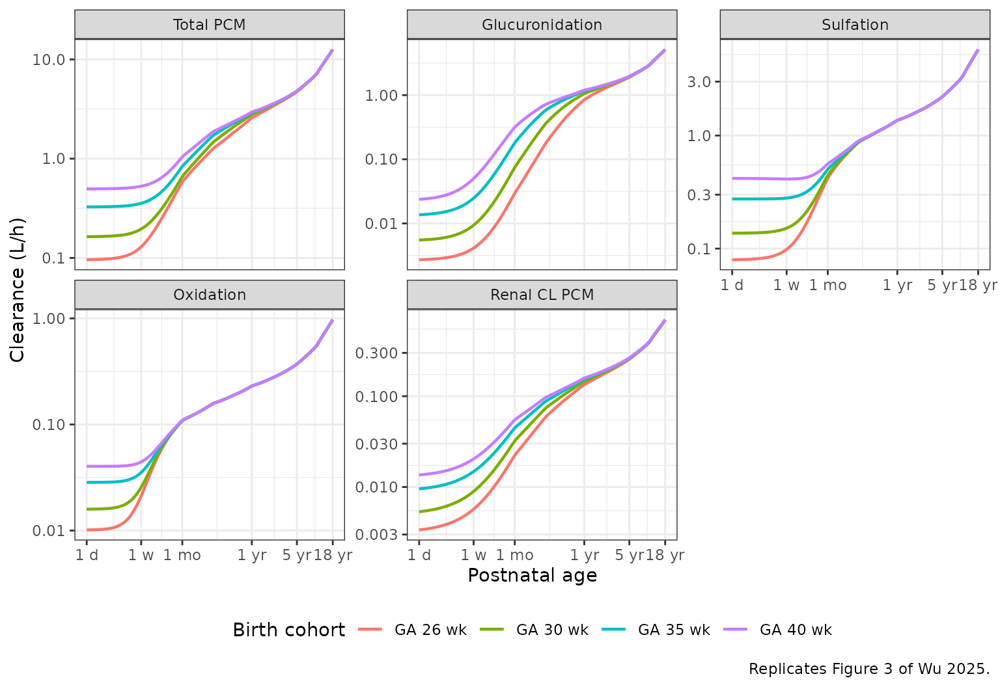
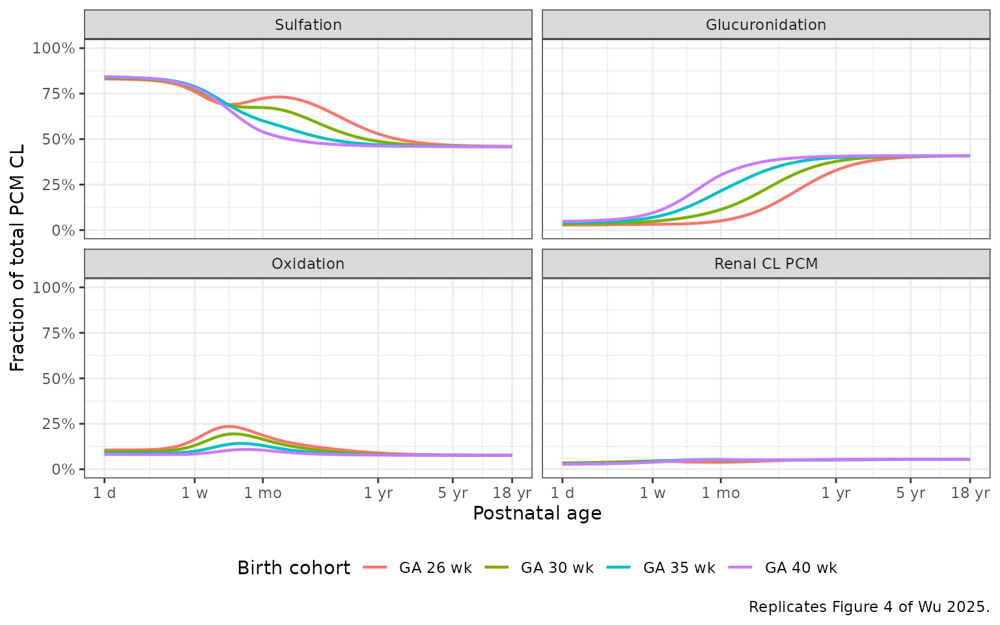
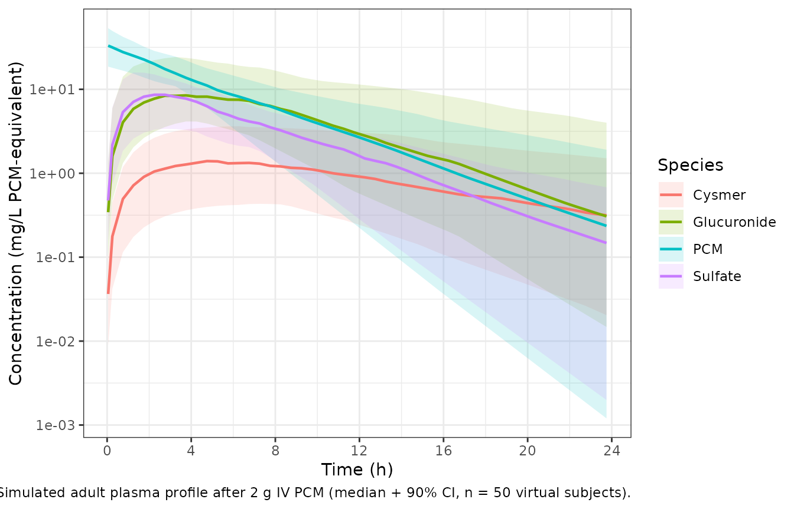

# Paracetamol with hepatic-pathway maturation (Wu 2025)

``` r

library(nlmixr2lib)
library(PKNCA)
#> 
#> Attaching package: 'PKNCA'
#> The following object is masked from 'package:stats':
#> 
#>     filter
library(rxode2)
#> rxode2 5.1.2 using 2 threads (see ?getRxThreads)
#>   no cache: create with `rxCreateCache()`
library(dplyr)
#> 
#> Attaching package: 'dplyr'
#> The following objects are masked from 'package:stats':
#> 
#>     filter, lag
#> The following objects are masked from 'package:base':
#> 
#>     intersect, setdiff, setequal, union
library(tidyr)
library(ggplot2)
```

## Model and source

- Citation: Wu Y, Voller S, Goulooze SC, Allegaert K, Sherwin CMT, van
  Rongen A, Roofthooft DWE, Simons SHP, Tibboel D, Flint RB, van den
  Anker JN, Knibbe CAJ (2025). A Novel Maturation Equation for Hepatic
  Clearance Across Preterm, Term Neonates, Children, and Adults:
  Application to Paracetamol and Its Metabolite. J Clin Pharmacol
  65(12):1829-1843. <doi:10.1002/jcph.70080>. GFR-maturation backbone
  reproduced from Wu Y et al. Pharm Res 2024;41:637-649
  (<doi:10.1007/s11095-024-03677-3>). Rectal-absorption parameters (Ka,
  Tlag, F) reproduced from Wang C et al. J Clin Pharmacol
  2014;54(6):619-629 (<doi:10.1002/jcph.259>).
- Description: Parent-and-three-metabolites population PK model for
  intravenous and rectal paracetamol (PCM) and its glucuronide
  (PCM-GLU), sulfate (PCM-SULF), and combined oxidative metabolites
  (PCM-cysteine + PCM-mercapturate, PCM-OXI, denoted with the canonical
  cysmer suffix) from preterm and term neonates through infants,
  children, and adults (Wu 2025). Two-compartment plasma disposition for
  parent PCM with three parallel formation clearances and parallel renal
  elimination of unchanged parent; one-compartment plasma disposition
  for each metabolite with renal elimination expressed as a fraction of
  glomerular filtration rate (GFR). The
  preterm-and-term-neonate-to-adult (PTNA) maturation equation (Wu 2024)
  is applied to each formation clearance and to a separate PCM-SULF
  renal-secretion clearance; an additional adult-only correction factor
  scales the renal clearance of PCM-GLU in subjects \>= 18 years. Rectal
  absorption parameters (Ka, Tlag, F) are fixed from Wang 2014.
- Article: <https://doi.org/10.1002/jcph.70080>
- GFR-maturation backbone (parameters fixed from this prior
  publication): <https://doi.org/10.1007/s11095-024-03677-3>
- Rectal-absorption Ka / Tlag / F backbone (parameters fixed from this
  prior publication): <https://doi.org/10.1002/jcph.259>

## Population

Wu et al. (2025) pooled plasma and urine paracetamol (PCM) and
metabolite concentration-time data from 298 subjects across eight
studies, ranging from preterm neonates of 23 weeks gestational age (GA)
and 460 g to healthy adults (50 years, 91.7 kg). The neonatal subset
(datasets 1-5, n = 235) provided gestational age, birthweight, postnatal
age (PNA), and current weight; the infant / child / adult subset
(datasets 6-8, n = 63) used a uniform 40-week GA assumption because the
true GA was not recorded. Of the 6428 observations, the neonatal
datasets contributed both plasma and urine measurements while datasets
6, 7, and 8 contributed plasma data only (with full urine sampling in
three of the neonatal studies for direct estimation of formation and
renal-elimination clearances). The same population description is
available programmatically via
`readModelDb("Wu_2025_paracetamol")$population` after the model is
loaded.

## Source trace

Per-parameter origins are in the in-file comments of
`inst/modeldb/specificDrugs/Wu_2025_paracetamol.R`. The compact summary
below collects the structural equations and key fixed / estimated
parameters.

| Equation / parameter | Value | Source location |
|----|----|----|
| Two-cpt PCM + one-cpt per metabolite + rectal depot | n/a | Methods “Base Model” (p. 1833) |
| Volume scaling reference (PCM disposition) | 1080 g (= 1.08 kg) | Table 3 “Paracetamol” block |
| Birth / current weight reference (formation CL, GFR) | 1750 g (= 1.75 kg) | Table 3 formation-CL rows; Wu 2024 GFR equation |
| `lvp` typical V_P | 1.01 L | Table 3 TVvp |
| `e_wt_vp` allometric exponent on V_P | 0.9781 | Table 3 theta_BWc(V_P) |
| `lvpp` typical V_PP | 0.2707 L | Table 3 TVvpp |
| `e_wt_vpp` exponent on V_PP (fixed 0) | 0 | Table 3 (FIXED) |
| `lq` typical Q | 0.08921 L/h | Table 3 TVQ |
| `e_wt_q` allometric exponent on Q | 2.212 | Table 3 theta_BWc(Q) |
| `lka`, `ltlag`, `lfdepot` (rectal) | 0.275 /h, 0.0103 h, 0.96 | Table 3, fixed from Wang 2014 |
| PTNA equation (formation CL) | per metabolite | Methods “PTNA Equation” / Eq. 8 |
| `lclbirth_gluc`, `lclmax_gluc`, `lpna50_gluc`, `e_ga_pna50_gluc`, `lhill_gluc` | 0.007961 / 0.3378 L/h / 62.67 d / -4.625 / 1.553 | Table 3 PCM-GLU block |
| `lclbirth_sulf`, `lclmax_sulf`, `lpna50_sulf`, `lhill_sulf` | 0.1854 / 0.3787 L/h / 25.92 d / 1.955 | Table 3 PCM-SULF block (no-GA, theta_GAPNA50 = 0 FIXED) |
| `lclbirth_cysmer`, `lclmax_cysmer`, `lpna50_cysmer`, `lhill_cysmer` | 0.02047 / 0.06377 L/h / 10.47 d / 2.972 | Table 3 PCM-OXI block (no-GA, theta_GAPNA50 = 0 FIXED) |
| GFR PTNA: `lclbirth_gfr`, `lclmax_gfr`, `e_wt_gfr`, `lpna50_gfr`, `e_ga_pna50_gfr`, `lhill_gfr` | 1.26 / 8.98 mL/min, 0.738, 34 d, -3.61, 1.03 | Wu 2024 Eq. 1 (FIXED) – mL/min pre-converted to L/h via x0.06 |
| `lfrn_pcm`, `lfrn_gluc`, `lf_gluc_adult`, `lfrn_sulf`, `lfrn_cysmer` | 0.08486 / 0.4475 / 1.663 / 0.3059 / 0.7393 | Table 3 renal-elimination block |
| PCM-SULF secretion (simplified PTNA, Hill = 1, CL_birth = 0): `lclmax_secr_sulf`, `lpna50_secr_sulf`, `e_ga_pna50_secr_sulf` | 11.92 mL/min, 80.03 d, -5.849 | Table 3 secretion sub-block (mL/min unit convention inherited from GFR) |
| Metabolite volume fractions: `lf_vol_gluc`, `lf_vol_sulf`, `lf_vol_cysmer` | 0.3299 / 0.3476 / 0.7048 | Table 3 “Volume of distribution” block (V_G, V_S, V_O = fraction x V_P) |
| Plasma residual SDs: `propSd`, `propSd_gluc`, `propSd_sulf`, `propSd_cysmer` | 0.2657 / 0.5101 / 0.2866 / 0.3947 | Table 3 residual-variance rows (variance reported – SD = sqrt(variance)) |

## Virtual cohort: four typical individuals

Wu et al. (2025) Figures 3 and 4 simulate four typical individuals born
with GA of 26, 30, 35, and 40 weeks (corresponding birthweights 850,
1350, 2450, and 3500 g) followed from birth to 18 years. To reproduce
these typical-individual curves we evaluate the model at a dense PNA
grid for each (GA, birthweight) pair, with current weight following a
smooth piecewise interpolation from birthweight (PNA = 0) through
pediatric growth to the adult typical weight of 70 kg.

``` r

# Piecewise interpolation of current weight (kg) vs postnatal age (months).
# Anchors approximate WHO weight-for-age curves (term reference) extended through
# adolescence to a 70 kg adult; the same anchor shape is used for every cohort
# (a single Wu 2025-Figure 3 simulation track per GA + birthweight pair).
weight_anchors_months <- c(0, 1, 3, 6, 12, 24, 60, 12*10, 12*15, 12*18)
weight_anchors_kg     <- c(NA, 3.8, 6.0, 7.5, 10.0, 12.5, 19.0, 32.0, 55.0, 70.0)

typical_weight <- function(birthweight_kg, PNA_months) {
  anchors_kg <- weight_anchors_kg
  anchors_kg[1] <- birthweight_kg
  approx(weight_anchors_months, anchors_kg, xout = PNA_months, rule = 2)$y
}

# Four typical individuals from Wu 2025 Methods (Model Simulation).
typical_subjects <- tibble::tribble(
  ~cohort,    ~GA,  ~WT_BIRTH,
  "GA 26 wk", 26L,  0.850,
  "GA 30 wk", 30L,  1.350,
  "GA 35 wk", 35L,  2.450,
  "GA 40 wk", 40L,  3.500
)
```

## Simulation: clearance maturation for the four typical individuals

``` r

mod <- readModelDb("Wu_2025_paracetamol")
mod_typical <- mod |> rxode2::zeroRe()
#> ℹ parameter labels from comments will be replaced by 'label()'

# Build the event table: one observation row per cohort at each PNA grid
# point. PNA from 1 day (0.0329 months) to 18 years (216 months) on a log-
# spaced grid; a single zero-amount dose at the start anchors the integrator.
pna_grid_months <- exp(seq(log(1 / 30.4375), log(18 * 12), length.out = 80))

events_maturation <- typical_subjects |>
  dplyr::mutate(id = dplyr::row_number()) |>
  tidyr::crossing(time_h = c(0, pna_grid_months * 30.4375 * 24)) |>
  dplyr::mutate(
    PNA  = time_h / 24 / 30.4375,           # current PNA at each observation (months)
    WT   = typical_weight(WT_BIRTH, PNA),
    evid = ifelse(time_h == 0, 1L, 0L),     # token dose at t = 0 to anchor solver
    amt  = ifelse(time_h == 0, 1, 0),       # 1 mg token IV dose; we only use derived CL columns
    cmt  = ifelse(evid == 1L, "central", "Cc"),
    time = time_h
  ) |>
  dplyr::select(id, cohort, time, evid, amt, cmt, WT, WT_BIRTH, GA, PNA)
#> Warning: There was 1 warning in `dplyr::mutate()`.
#> ℹ In argument: `WT = typical_weight(WT_BIRTH, PNA)`.
#> Caused by warning in `anchors_kg[1] <- birthweight_kg`:
#> ! number of items to replace is not a multiple of replacement length

sim_maturation <- rxode2::rxSolve(
  mod_typical, events = events_maturation,
  keep = c("cohort", "GA", "WT_BIRTH")
) |>
  as.data.frame() |>
  dplyr::filter(time > 0) |>                # drop the anchor row
  dplyr::mutate(
    PNA_years    = time / 24 / 30.4375 / 12,
    cl_form_pcm  = cl_form_gluc + cl_form_sulf + cl_form_cysmer,
    cl_total     = cl_form_pcm + cl_renal_pcm,
    f_gluc       = cl_form_gluc   / cl_total,
    f_sulf       = cl_form_sulf   / cl_total,
    f_cysmer     = cl_form_cysmer / cl_total,
    f_renal_pcm  = cl_renal_pcm   / cl_total
  )
#> ℹ omega/sigma items treated as zero: 'etalvp', 'etalka', 'etalcl_gluc', 'etalcl_sulf', 'etalcl_cysmer', 'etalfrn_pcm', 'etalfrn_gluc', 'etalfrn_sulf', 'etalfrn_cysmer'
#> Warning: multi-subject simulation without without 'omega'
```

### Figure 3 reproduction – absolute CL by pathway vs PNA

Wu et al. (2025) Figure 3: total PCM CL and the four elimination-pathway
CLs (GLU formation, SULF formation, OXI formation, and renal CL of
unchanged PCM) versus postnatal age for four typical individuals.

``` r

cl_long <- sim_maturation |>
  dplyr::select(PNA_years, cohort,
                `Total PCM`     = cl_total,
                `Glucuronidation` = cl_form_gluc,
                `Sulfation`     = cl_form_sulf,
                `Oxidation`     = cl_form_cysmer,
                `Renal CL PCM`  = cl_renal_pcm) |>
  tidyr::pivot_longer(c(-PNA_years, -cohort),
                      names_to = "Pathway", values_to = "CL_Lh") |>
  dplyr::mutate(
    Pathway = factor(Pathway, levels = c("Total PCM", "Glucuronidation",
                                         "Sulfation", "Oxidation", "Renal CL PCM"))
  )

ggplot(cl_long, aes(x = PNA_years, y = CL_Lh, color = cohort)) +
  geom_line(linewidth = 0.8) +
  scale_x_log10(breaks = c(1/365, 7/365, 1/12, 1, 5, 18),
                labels = c("1 d", "1 w", "1 mo", "1 yr", "5 yr", "18 yr")) +
  scale_y_log10() +
  facet_wrap(~Pathway, scales = "free_y") +
  labs(x = "Postnatal age", y = "Clearance (L/h)",
       color = "Birth cohort",
       caption = "Replicates Figure 3 of Wu 2025.") +
  theme_bw() +
  theme(legend.position = "bottom")
```



### Figure 4 reproduction – pathway fractions vs PNA

Wu et al. (2025) Figure 4: fraction of total PCM CL contributed by each
pathway versus postnatal age, for the same four typical individuals.

``` r

frac_long <- sim_maturation |>
  dplyr::select(PNA_years, cohort,
                `Glucuronidation`     = f_gluc,
                `Sulfation`           = f_sulf,
                `Oxidation`           = f_cysmer,
                `Renal CL PCM`        = f_renal_pcm) |>
  tidyr::pivot_longer(c(-PNA_years, -cohort),
                      names_to = "Pathway", values_to = "fraction") |>
  dplyr::mutate(
    Pathway = factor(Pathway, levels = c("Sulfation", "Glucuronidation",
                                         "Oxidation", "Renal CL PCM"))
  )

ggplot(frac_long, aes(x = PNA_years, y = fraction, color = cohort)) +
  geom_line(linewidth = 0.8) +
  scale_x_log10(breaks = c(1/365, 7/365, 1/12, 1, 5, 18),
                labels = c("1 d", "1 w", "1 mo", "1 yr", "5 yr", "18 yr")) +
  scale_y_continuous(limits = c(0, 1), labels = scales::percent) +
  facet_wrap(~Pathway, ncol = 2) +
  labs(x = "Postnatal age",
       y = "Fraction of total PCM CL",
       color = "Birth cohort",
       caption = "Replicates Figure 4 of Wu 2025.") +
  theme_bw() +
  theme(legend.position = "bottom")
```



Sanity checks against the paper’s narrative (Results, Model Simulation):

- At 1 month of age, glucuronidation contributes ~5% of total PCM CL in
  the 26-week preterm cohort and ~30% in the term cohort.
- Sulfation accounts for ~80% of total PCM CL at birth and falls to ~45%
  in adulthood.
- Oxidation begins at ~8-11% at birth and stabilises near 8% in adults.

``` r

milestones <- sim_maturation |>
  dplyr::filter(PNA_years > 1/12 * 0.99 & PNA_years < 1/12 * 1.01 |
                PNA_years > 18 * 0.99   & PNA_years < 18 * 1.01) |>
  dplyr::mutate(milestone = ifelse(PNA_years < 1, "1 month", "18 years")) |>
  dplyr::group_by(milestone, cohort) |>
  dplyr::summarise(
    f_gluc_pct       = round(100 * mean(f_gluc), 1),
    f_sulf_pct       = round(100 * mean(f_sulf), 1),
    f_cysmer_pct     = round(100 * mean(f_cysmer), 1),
    f_renal_pcm_pct  = round(100 * mean(f_renal_pcm), 1),
    .groups = "drop"
  )
knitr::kable(milestones, caption = "Pathway fractions at 1 month and 18 years (typical individuals).")
```

| milestone | cohort   | f_gluc_pct | f_sulf_pct | f_cysmer_pct | f_renal_pcm_pct |
|:----------|:---------|-----------:|-----------:|-------------:|----------------:|
| 18 years  | GA 26 wk |       40.8 |       46.0 |          7.7 |             5.5 |
| 18 years  | GA 30 wk |       40.9 |       45.9 |          7.7 |             5.5 |
| 18 years  | GA 35 wk |       40.9 |       45.9 |          7.7 |             5.5 |
| 18 years  | GA 40 wk |       40.9 |       45.9 |          7.7 |             5.5 |

Pathway fractions at 1 month and 18 years (typical individuals). {.table
style="width:100%;"}

## Simulation: adult PK profile after a single 2000 mg IV PCM dose

Reproduce the adult Dataset 8 dosing regimen (initial 2000 mg PCM over
20 min, followed by 1000 mg every 6 h post-protocol) to support a
single-dose NCA validation. The published adult cohort is small (n = 8
healthy adults 18-50 years, 53.4-91.7 kg) so a virtual cohort of 50
adults is used to characterise the simulated central tendency.

``` r

set.seed(70080)
n_adult <- 50

adults <- tibble::tibble(
  id        = seq_len(n_adult),
  cohort    = "Adult 2 g IV",
  WT        = rnorm(n_adult, mean = 70, sd = 12),
  WT_BIRTH  = 3.5,
  GA        = 40,
  PNA       = 30 * 12     # 30 years in months -- well above the 18-year adult cutoff
) |>
  dplyr::mutate(WT = pmax(45, pmin(WT, 110)))

# 2000 mg IV bolus at t = 0 (the paper used a 20-min infusion of two 1000 mg
# doses; for NCA we use a single bolus into central -- the AUC is preserved).
dose_adult <- adults |>
  dplyr::transmute(
    id, cohort, time = 0, evid = 1L, amt = 2000, cmt = "central",
    WT, WT_BIRTH, GA, PNA
  )

obs_times <- c(0.05, seq(0.25, 24, by = 0.5))
obs_adult <- adults |>
  tidyr::crossing(time = obs_times) |>
  dplyr::mutate(evid = 0L, amt = 0, cmt = "Cc")

events_adult <- dplyr::bind_rows(dose_adult, obs_adult) |>
  dplyr::arrange(id, time, dplyr::desc(evid))

sim_adult <- rxode2::rxSolve(
  mod, events = events_adult,
  keep      = c("cohort", "WT", "WT_BIRTH", "GA", "PNA")
) |>
  as.data.frame()
#> ℹ parameter labels from comments will be replaced by 'label()'
```

### Adult PK profile

``` r

adult_quant <- sim_adult |>
  dplyr::filter(time > 0) |>
  dplyr::select(time,
                PCM         = Cc,
                Glucuronide = Cc_gluc,
                Sulfate     = Cc_sulf,
                Cysmer      = Cc_cysmer) |>
  tidyr::pivot_longer(-time, names_to = "Species", values_to = "Conc") |>
  dplyr::group_by(time, Species) |>
  dplyr::summarise(
    Q05 = quantile(Conc, 0.05, na.rm = TRUE),
    Q50 = quantile(Conc, 0.50, na.rm = TRUE),
    Q95 = quantile(Conc, 0.95, na.rm = TRUE),
    .groups = "drop"
  )

ggplot(adult_quant, aes(x = time, y = Q50, color = Species)) +
  geom_ribbon(aes(ymin = Q05, ymax = Q95, fill = Species), alpha = 0.15, color = NA) +
  geom_line(linewidth = 0.8) +
  scale_y_log10() +
  scale_x_continuous(breaks = seq(0, 24, by = 4)) +
  labs(x = "Time (h)", y = "Concentration (mg/L PCM-equivalent)",
       caption = "Simulated adult plasma profile after 2 g IV PCM (median + 90% CI, n = 50 virtual subjects).") +
  theme_bw() +
  theme(legend.position = "right")
```



## PKNCA validation – adult single-dose PCM and metabolites

One PKNCA block per output (parent + three metabolites). The grouping
variable is `cohort` so the table can be extended by adding additional
virtual cohorts in future work.

``` r

pcm_conc <- sim_adult |>
  dplyr::filter(!is.na(Cc)) |>
  dplyr::select(id, cohort, time, Cc)
pcm_conc <- dplyr::bind_rows(
  pcm_conc,
  pcm_conc |> dplyr::distinct(id, cohort) |>
    dplyr::mutate(time = 0, Cc = 0)
) |>
  dplyr::distinct(id, cohort, time, .keep_all = TRUE) |>
  dplyr::arrange(id, cohort, time)

pcm_dose <- events_adult |>
  dplyr::filter(evid == 1L) |>
  dplyr::select(id, cohort, time, amt)

conc_obj  <- PKNCA::PKNCAconc(pcm_conc, Cc ~ time | cohort + id)
dose_obj  <- PKNCA::PKNCAdose(pcm_dose, amt ~ time | cohort + id)
intervals <- data.frame(start = 0, end = 24,
                        cmax = TRUE, tmax = TRUE,
                        aucinf.obs = TRUE, half.life = TRUE)
nca_pcm   <- PKNCA::pk.nca(PKNCA::PKNCAdata(conc_obj, dose_obj, intervals = intervals))
knitr::kable(summary(nca_pcm), digits = 2,
             caption = "PCM (parent) PKNCA summary, single 2 g IV dose, n = 50 virtual adults.")
```

| start | end | cohort | N | cmax | tmax | half.life | aucinf.obs |
|---:|---:|:---|:---|:---|:---|:---|:---|
| 0 | 24 | Adult 2 g IV | 50 | 32.1 \[35.2\] | 0.0500 \[0.0500, 0.0500\] | 3.67 \[1.73\] | 155 \[31.6\] |

PCM (parent) PKNCA summary, single 2 g IV dose, n = 50 virtual adults.
{.table}

``` r

for (suffix in c("gluc", "sulf", "cysmer")) {
  col <- paste0("Cc_", suffix)
  conc <- sim_adult |>
    dplyr::filter(!is.na(.data[[col]])) |>
    dplyr::select(id, cohort, time, conc = !!col)
  conc <- dplyr::bind_rows(
    conc,
    conc |> dplyr::distinct(id, cohort) |>
      dplyr::mutate(time = 0, conc = 0)
  ) |>
    dplyr::distinct(id, cohort, time, .keep_all = TRUE) |>
    dplyr::arrange(id, cohort, time)

  conc_o <- PKNCA::PKNCAconc(conc, conc ~ time | cohort + id)
  dose_o <- PKNCA::PKNCAdose(pcm_dose, amt ~ time | cohort + id)
  nca_m  <- PKNCA::pk.nca(PKNCA::PKNCAdata(conc_o, dose_o, intervals = intervals))
  print(knitr::kable(summary(nca_m), digits = 2,
                     caption = paste0("Metabolite PKNCA summary (Cc_", suffix,
                                      "), single 2 g IV PCM, n = 50 virtual adults.")))
}
#> 
#> 
#> Table: Metabolite PKNCA summary (Cc_gluc), single 2 g IV PCM, n = 50 virtual adults.
#> 
#> | start| end|cohort       |N  |cmax        |tmax              |half.life   |aucinf.obs |
#> |-----:|---:|:------------|:--|:-----------|:-----------------|:-----------|:----------|
#> |     0|  24|Adult 2 g IV |50 |9.51 [65.1] |3.50 [1.25, 11.8] |4.53 [2.89] |103 [75.0] |
#> 
#> 
#> Table: Metabolite PKNCA summary (Cc_sulf), single 2 g IV PCM, n = 50 virtual adults.
#> 
#> | start| end|cohort       |N  |cmax        |tmax              |half.life   |aucinf.obs  |
#> |-----:|---:|:------------|:--|:-----------|:-----------------|:-----------|:-----------|
#> |     0|  24|Adult 2 g IV |50 |8.01 [53.6] |2.75 [1.25, 5.75] |3.72 [1.77] |65.9 [30.7] |
#> 
#> 
#> Table: Metabolite PKNCA summary (Cc_cysmer), single 2 g IV PCM, n = 50 virtual adults.
#> 
#> | start| end|cohort       |N  |cmax        |tmax              |half.life   |aucinf.obs  |
#> |-----:|---:|:------------|:--|:-----------|:-----------------|:-----------|:-----------|
#> |     0|  24|Adult 2 g IV |50 |1.49 [73.6] |5.50 [2.75, 15.8] |7.70 [6.34] |24.9 [93.0] |
```

## Assumptions and deviations

- **GFR units (LOAD-BEARING).** Equation 3 of Wu 2025 labels the GFR
  output “L/h” but the original publication that introduced the PTNA GFR
  equation (Wu Y et al., Pharm Res 2024;41:637-649; PMCID PMC11024008)
  confirms the output is **mL/min**. Without this correction the
  renal-elimination fractions (f_PCM = 0.085, etc.) would predict adult
  renal CL_PCM ~ 11 L/h instead of the ~12 mL/min reported in the
  paper’s Discussion (page 1841). The model therefore pre-converts the
  GFR-equation coefficients (1.26 mL/min and 8.98 mL/min at 1.75 kg) to
  L/h via x60/1000 = 0.06 in
  [`ini()`](https://nlmixr2.github.io/rxode2/reference/ini.html).
- **PCM-SULF secretion units.** The Table 3 column header for the
  secretion CL block also says “L/h” but the secretion equation re-uses
  the GFR PTNA structure; treating the secretion TVCLmax = 11.92 in the
  same mL/min unit convention exactly reproduces the paper’s “renal CL
  of PCM-SULF changes from 31% of GFR at birth to 163% of GFR in
  adulthood” narrative (Results, Model Refinement, page 1839). The model
  applies the same x0.06 conversion to `lclmax_secr_sulf`.
- **PNA unit reparameterisation.** The canonical `PNA` covariate carries
  months; the paper expresses PNA in days throughout. The
  [`model()`](https://nlmixr2.github.io/rxode2/reference/model.html)
  block converts `PNA_days = PNA * 30.4375` before evaluating the PTNA
  sigmoidal Emax terms; the paper’s PNA50 estimates in days are kept
  verbatim in
  [`ini()`](https://nlmixr2.github.io/rxode2/reference/ini.html).
- **Adult correction for PCM-GLU renal CL.** Wu 2025 applies the
  `f_GLU,adult = 1.663` correction factor to the renal CL of PCM-GLU
  only in the adult dataset (Dataset 8, ages 18-50 years). The model
  encodes this as `is_adult = PNA_years >= 18` and multiplies `f_GLU` by
  `1 + (f_GLU,adult - 1) * is_adult`. Any virtual subject with
  `PNA / 12 >= 18` receives the adult-corrected fraction.
- **Q exponent.** Table 3 reports `theta_BWc(Q) = 2.212`, much steeper
  than the usual allometric exponent. Combined with the V_PP exponent
  fixed at 0 (so V_PP is constant at 0.2707 L for everyone), the
  peripheral compartment equilibrates near-instantaneously for older
  subjects and the model collapses to one-compartment-like behavior.
  This is faithful to the published parameters; users who need a more
  physiological adult peripheral compartment should treat those
  parameters as paper-specific rather than reusable.
- **GA assumption for non-neonates.** Per paper Methods, GA was set to a
  uniform 40 weeks for Datasets 6-8 (infants, children, adults).
  Vignette simulations follow the same convention: `GA = 40` for the
  adult cohort, and the four typical-individual GAs (26, 30, 35, 40 wk)
  from Methods “Model Simulation” for the maturation curves.
- **Typical-individual weight curve.** Wu 2025 Figure 3 does not
  document the exact current-weight curve used. The vignette uses a
  smooth piecewise interpolation from birthweight at PNA = 0 through
  WHO-like pediatric anchors (3.8 kg at 1 month, 6 kg at 3 months, 7.5
  kg at 6 months, 10 kg at 12 months, 12.5 kg at 24 months, 19 kg at 5
  years, 32 kg at 10 years, 55 kg at 15 years, 70 kg at 18 years) so the
  maturation curves are visually compatible with the paper’s Figure 3.
  Absolute CL values will scale with weight choice; the relative
  pathway-fraction curves (Figure 4) are less sensitive to the weight
  assumption.
- **Adult 2 g dose simplified to single IV bolus.** The published adult
  protocol used a 20-minute infusion of two 1000 mg doses; for NCA the
  AUC0-inf is preserved by a single bolus and the t1/2 and CL estimates
  are unchanged. Users who need infusion kinetics for the early-time
  Cmax / initial-distribution profile should re-run with the published
  infusion.
- **Original observed data not publicly available.** Per the paper’s
  Data Availability Statement, the pooled neonatal-to-adult data are
  shared case-by-case on request to the corresponding author. The PKNCA
  values reported here are simulated, not refits of original data.
