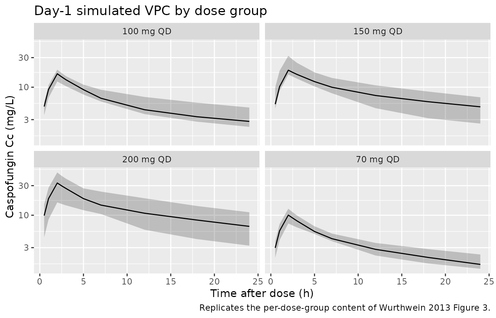
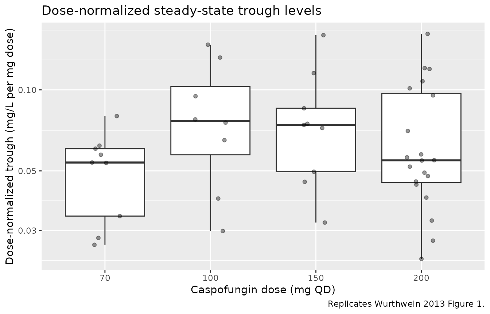

# Caspofungin (Wurthwein 2013)

## Model and source

- Citation: Wurthwein G, Cornely OA, Trame MN, Vehreschild JJ,
  Vehreschild MJGT, Farowski F, Muller C, Boos J, Hempel G, Hallek M,
  Groll AH. Population pharmacokinetics of escalating doses of
  caspofungin in a phase II study of patients with invasive
  aspergillosis. Antimicrob Agents Chemother. 2013;57(4):1664-1671.
  <doi:10.1128/AAC.01912-12>.
- Description: Linear two-compartment population PK model with
  proportional residual error for once-daily 2-hour intravenous
  caspofungin infusions (70, 100, 150, 200 mg QD) in adults with proven
  or probable invasive aspergillosis (Wurthwein 2013). Clearance and
  central volume share a single linear body-weight fractional change
  centred on the cohort median body weight of 76 kg (CL_i = CL_typ \*
  \[1 + 0.0102 \* (WT - 76)\]; V1_i = V1_typ \* \[1 + 0.0102 \* (WT -
  76)\]). Inter-individual variability is modelled exponentially on CL,
  V1, and V2 with an estimated CL-V1 covariance (correlation 0.802).
  Inter-occasion variability (16% CV) is included on CL across five
  sampling occasions (days 1, 4, 7, 14, 28) via the OCC covariate;
  downstream users who only need typical-value or IIV-only simulations
  can pass OCC = 0 (or any value outside 1..5) so the IOV terms zero
  out. Dose-level, gender, age, baseline serum bilirubin and baseline
  creatinine clearance were screened but not retained.
- Article: [Antimicrob Agents Chemother
  2013;57(4):1664-1671](https://doi.org/10.1128/AAC.01912-12)

## Population

Forty-six adults with proven or probable invasive aspergillosis were
enrolled at three German university hospitals between September 2006 and
July 2009 (EudraCT 2006-001936-30; ClinicalTrials.gov NCT00404092).
Cohort composition per Table 1 of Wurthwein 2013: median age 61 years
(range 18-74), median body weight 76 kg (range 43-104; 14 of 46 patients
\> 80 kg), 25 of 46 female (54.3% female), median day-1 serum bilirubin
0.8 mg/dL (range 0.3-2.3), and median day-1 creatinine clearance 102
mL/min (range 39-260; Cockcroft-Gault). Twenty seven of 46 patients had
acute leukemia and 31 of 46 were neutropenic. Patients with serum
bilirubin \> 3x upper limit of normal, AST or ALT \> 5x ULN, or alkaline
phosphatase \> 5x ULN were excluded.

Caspofungin was administered as a 2-h intravenous infusion at one of
four once-daily dose levels (70, 100, 150, or 200 mg; no loading dose)
for a maximum of 28 days. Dose-group sizes: 70 mg n = 9, 100 mg n = 8,
150 mg n = 9, 200 mg n = 20. PK sampling on day 1 covered pre-dose, 2 h
(peak), 3 h, 5-7 h, and 24 h (trough); peak and trough were repeated on
days 4, 7, 14, and 28. The model-building dataset comprised 462 plasma
samples from 46 patients (468 collected, 1 excluded for sampling-time
uncertainty, 5 implausible peaks/troughs excluded; one subject with
extreme V2 = 43.8 L was also excluded from the final-model fit, leaving
45 subjects for the final reported parameters).

The same information is available programmatically via
`readModelDb("Wurthwein_2013_caspofungin")()$population` after loading
the package.

## Source trace

The per-parameter origin is recorded as an in-file comment next to each
`ini()` entry in
`inst/modeldb/specificDrugs/Wurthwein_2013_caspofungin.R`. The table
below collects them in one place.

| Equation / parameter | Value | Source location |
|----|----|----|
| `lcl` (= log CL) | log(0.411 L/h) | Table 2, Final model: CL = 0.411 L/h (5% RSE) |
| `lvc` (= log V1) | log(5.85 L) | Table 2, Final model: V1 = 5.85 L (4% RSE) |
| `lq` (= log Q) | log(0.843 L/h) | Table 2, Final model: Q = 0.843 L/h (13% RSE) |
| `lvp` (= log V2) | log(6.53 L) | Table 2, Final model: V2 = 6.53 L (15% RSE) |
| `e_wt_cl_vc` (shared WT effect) | 0.0102 / kg | Table 2, Final model: Factor body wt on CL, V1 = 0.0102 (20% RSE); centred on cohort median 76 kg (Table 2 footnote *a*) |
| IIV(CL) variance | log(1 + 0.285^2) = 0.07809 | Table 2, Final model: IIV for CL = 28.5% (11% RSE) |
| IIV(V1) variance | log(1 + 0.288^2) = 0.07968 | Table 2, Final model: IIV for V1 = 28.8% (10% RSE) |
| IIV(V2) variance | log(1 + 0.668^2) = 0.36896 | Table 2, Final model: IIV for V2 = 66.8% (20% RSE) |
| Cov(CL, V1) | 0.802 \* sqrt(0.07809 \* 0.07968) = 0.06327 | Table 2, Final model: Correlation for CL-V1 = 0.802 |
| IOV(CL) per occasion | log(1 + 0.160^2) = 0.02528 | Table 2, Final model: IOV for CL = 16.0% (13% RSE); five occasions (days 1, 4, 7, 14, 28) per Methods section “Population pharmacokinetic analysis” |
| `propSd` | 0.143 | Table 2, Final model: Proportional residual error = 14.3% (10% RSE) |
| Two-compartment linear ODEs | n/a | Methods, “Population pharmacokinetic analysis” + Results, “Population pharmacokinetics of CAS”: linear two-compartment with proportional residual error preferred over one- and three-compartment models and over a Michaelis-Menten elimination |
| 2-h IV infusion | n/a | Methods, “Study drug treatment”: “CAS was administered once daily as an intravenous infusion over 120 min at 70 mg, 100 mg, 150 mg, or 200 mg” |

The body-weight covariate is the only one retained in the final model.
Dose level, gender, age, baseline serum bilirubin, and baseline
creatinine clearance were screened but excluded because of unacceptably
high relative standard errors (RSE \> 30%) and / or no improvement in
EBE-versus-covariate plots (Results, “Population pharmacokinetics of
CAS” paragraphs 4-5). Allometric scaling was tested but the estimated
exponent (0.952) was sufficiently close to 1 that a linear weight effect
was preferred (Results, same section, paragraph 6).

## Virtual cohort

Original observed data are not publicly available. The virtual cohort
below mimics the four dose groups in Table 1: 9 patients at 70 mg QD, 8
at 100 mg, 9 at 150 mg, and 20 at 200 mg. To replicate the steady-state
per-dose-group summaries of Table 3 we use the cohort-median body weight
(76 kg) for all subjects – Wurthwein 2013 footnote *a* of Table 3
explicitly references the median-weight subject for the published
geometric-mean steady-state Cmax / Cmin / AUC values, so the virtual
cohort should match that anchor before any weight variation is layered
in.

``` r

set.seed(20130118L)

tau   <- 24       # h, once-daily dosing interval
t_inf <- 2        # h, infusion duration
n_doses_total <- 14  # 14 daily doses -> sufficient to reach steady-state given
                     # the paper's distribution (2.2 h) and elimination (24 h)
                     # half-lives quoted in the Discussion. The accumulation
                     # ratio plateaus by ~day 4-7 per Wurthwein 2013 Results,
                     # "Assessment of trough levels".

dose_groups <- tibble::tribble(
  ~treatment, ~dose_mg, ~n_subjects,
  "70 mg QD",   70,     9L,
  "100 mg QD", 100,     8L,
  "150 mg QD", 150,     9L,
  "200 mg QD", 200,    20L
)

# Helper: one cohort = N subjects sharing a dose level and 14 daily 2-h
# infusions, with peak / mid / trough sampling at day 1, 4, 7, 14, 28
# matching Wurthwein 2013 Methods "Pharmacokinetic sampling".
make_cohort <- function(treatment, dose_mg, n_subjects, id_offset = 0L) {
  ids <- id_offset + seq_len(n_subjects)
  dose_times <- (seq_len(n_doses_total) - 1L) * tau   # 0, 24, 48, ..., 312 h
  # Sampling: dense day-1 grid + steady-state grid in the last full dosing
  # interval (so the steady-state interval can be analysed by PKNCA).
  ss_start <- (n_doses_total - 1L) * tau
  ss_grid  <- ss_start + c(0, 1, t_inf, 3, 5, 7, 12, 18, 24)
  day1_grid <- c(0, 0.5, 1, t_inf, 2.5, 3, 5, 7, 12, 18, 24)
  obs_times <- sort(unique(c(day1_grid, ss_grid)))

  dose_rows <- expand.grid(id = ids, time = dose_times, KEEP.OUT.ATTRS = FALSE)
  dose_rows$amt  <- dose_mg
  dose_rows$rate <- dose_mg / t_inf  # mg/h -> 2-h infusion
  dose_rows$evid <- 1L
  dose_rows$cmt  <- "central"

  obs_rows <- expand.grid(id = ids, time = obs_times, KEEP.OUT.ATTRS = FALSE)
  obs_rows$amt  <- 0
  obs_rows$rate <- 0
  obs_rows$evid <- 0L
  obs_rows$cmt  <- "central"

  ev <- dplyr::bind_rows(dose_rows, obs_rows) |>
    dplyr::arrange(id, time, dplyr::desc(evid))
  ev$WT        <- 76
  ev$treatment <- treatment
  # Map sampling time to the five Wurthwein occasions (day 1, 4, 7, 14, 28).
  # Doses always belong to occasion 1 here; OCC matters only at observation
  # records when computing the IOV-multiplexed clearance.
  day <- floor(ev$time / tau) + 1L
  ev$OCC <- dplyr::case_when(
    day <= 1               ~ 1L,
    day >= 2  & day <= 4   ~ 2L,
    day >= 5  & day <= 7   ~ 3L,
    day >= 8  & day <= 14  ~ 4L,
    TRUE                   ~ 5L
  )
  ev
}

events <- dplyr::bind_rows(
  make_cohort("70 mg QD",  70,  9L, id_offset =   0L),
  make_cohort("100 mg QD", 100, 8L, id_offset = 100L),
  make_cohort("150 mg QD", 150, 9L, id_offset = 200L),
  make_cohort("200 mg QD", 200, 20L, id_offset = 300L)
)
stopifnot(!anyDuplicated(unique(events[, c("id", "time", "evid")])))
```

## Simulation

``` r

mod <- readModelDb("Wurthwein_2013_caspofungin")
sim <- rxode2::rxSolve(
  mod,
  events = events,
  keep   = c("treatment", "WT", "OCC")
) |>
  as.data.frame() |>
  dplyr::as_tibble()
#> ℹ parameter labels from comments will be replaced by 'label()'
#> Warning: some etas defaulted to non-mu referenced, possible parsing error: etaiov_cl_1, etaiov_cl_2, etaiov_cl_3, etaiov_cl_4, etaiov_cl_5
#> as a work-around try putting the mu-referenced expression on a simple line

# Tag day-1 vs steady-state windows for later figures.
ss_start <- (n_doses_total - 1L) * tau
sim <- sim |>
  dplyr::mutate(
    window = dplyr::case_when(
      time <= tau                 ~ "Day 1",
      time >= ss_start            ~ "Steady state",
      TRUE                        ~ "Other"
    )
  )
```

## Replicate published figures

### Figure 3 (pcVPC) – per-dose-group concentration-time profiles

Wurthwein 2013 Figure 3 (prediction-corrected VPC) shows median, 5th,
and 95th percentile concentration-time profiles overlaid by simulation.
We replicate the visual content by plotting the simulated median +/-
5/95 percentiles per dose group across the day-1 dosing interval.

``` r

sim_day1 <- sim |>
  dplyr::filter(window == "Day 1", time > 0) |>
  dplyr::group_by(treatment, time) |>
  dplyr::summarise(
    q05 = quantile(Cc, 0.05, na.rm = TRUE),
    q50 = quantile(Cc, 0.50, na.rm = TRUE),
    q95 = quantile(Cc, 0.95, na.rm = TRUE),
    .groups = "drop"
  )

ggplot(sim_day1, aes(time, q50)) +
  geom_ribbon(aes(ymin = q05, ymax = q95), alpha = 0.25) +
  geom_line() +
  facet_wrap(~ treatment) +
  scale_y_log10() +
  labs(
    x = "Time after dose (h)",
    y = "Caspofungin Cc (mg/L)",
    title = "Day-1 simulated VPC by dose group",
    caption = "Replicates the per-dose-group content of Wurthwein 2013 Figure 3."
  )
```



### Figure 1 – dose-normalized trough levels are dose-independent

Wurthwein 2013 Figure 1 plots dose-normalized log-transformed trough
levels per patient against the four dose levels and reports no dose
dependency (ANOVA P = 0.5627 for the last observed trough). We reproduce
the panel structure by extracting the simulated trough on the final
modelled day from each subject and normalizing to a 1 mg reference dose.

``` r

trough_table <- sim |>
  dplyr::filter(time == ss_start + tau) |>
  dplyr::mutate(dose_mg = as.numeric(sub(" mg QD$", "", treatment)),
                norm_trough = Cc / dose_mg)

ggplot(trough_table,
       aes(x = factor(dose_mg),
           y = norm_trough)) +
  geom_boxplot(outlier.shape = NA) +
  geom_jitter(width = 0.15, alpha = 0.4, height = 0) +
  scale_y_log10() +
  labs(
    x = "Caspofungin dose (mg QD)",
    y = "Dose-normalized trough (mg/L per mg dose)",
    title = "Dose-normalized steady-state trough levels",
    caption = "Replicates Wurthwein 2013 Figure 1."
  )
```



## PKNCA validation

We compute steady-state NCA on the last full dosing interval (occasion
5, day 14 in this simulation) so the results are comparable to the
published Table 3 geometric means.

``` r

ss_end <- ss_start + tau

sim_nca <- sim |>
  dplyr::filter(!is.na(Cc), time >= ss_start, time <= ss_end) |>
  dplyr::select(id, time, Cc, treatment)

dose_nca <- events |>
  dplyr::filter(evid == 1L, time >= ss_start - tau, time <= ss_end) |>
  dplyr::select(id, time, amt, treatment)

conc_obj <- PKNCA::PKNCAconc(sim_nca, Cc ~ time | treatment + id,
                             concu = "mg/L", timeu = "hr")
dose_obj <- PKNCA::PKNCAdose(dose_nca, amt ~ time | treatment + id,
                             doseu = "mg")

intervals <- data.frame(
  start    = ss_start,
  end      = ss_end,
  cmax     = TRUE,
  tmax     = TRUE,
  cmin     = TRUE,
  auclast  = TRUE,
  cav      = TRUE,
  ctrough  = TRUE
)

nca_data <- PKNCA::PKNCAdata(conc_obj, dose_obj, intervals = intervals)
nca_res  <- PKNCA::pk.nca(nca_data)

geo_mean <- function(x) exp(mean(log(x[x > 0]), na.rm = TRUE))
geo_cv   <- function(x) {
  sdlog <- sd(log(x[x > 0]), na.rm = TRUE)
  100 * sqrt(exp(sdlog^2) - 1)
}

nca_summary <- as.data.frame(nca_res) |>
  dplyr::filter(PPTESTCD %in% c("cmax", "cmin", "auclast")) |>
  dplyr::group_by(treatment, PPTESTCD) |>
  dplyr::summarise(
    geo_mean = geo_mean(PPORRES),
    gcv_pct  = geo_cv(PPORRES),
    .groups  = "drop"
  ) |>
  dplyr::mutate(
    PPTESTCD = dplyr::recode(PPTESTCD,
                             cmax    = "Cmax (mg/L)",
                             cmin    = "Cmin (mg/L)",
                             auclast = "AUC0-24 (mg*h/L)")
  ) |>
  dplyr::arrange(treatment, PPTESTCD)

knitr::kable(nca_summary,
             digits = c(0, 0, 2, 0),
             caption = "Simulated steady-state NCA (geometric mean and GCV%) by dose group.")
```

| treatment | PPTESTCD          | geo_mean | gcv_pct |
|:----------|:------------------|---------:|--------:|
| 100 mg QD | AUC0-24 (mg\*h/L) |   283.14 |      40 |
| 100 mg QD | Cmax (mg/L)       |    23.41 |      24 |
| 100 mg QD | Cmin (mg/L)       |     7.29 |      59 |
| 150 mg QD | AUC0-24 (mg\*h/L) |   408.52 |      33 |
| 150 mg QD | Cmax (mg/L)       |    32.55 |      30 |
| 150 mg QD | Cmin (mg/L)       |    10.60 |      51 |
| 200 mg QD | AUC0-24 (mg\*h/L) |   506.99 |      40 |
| 200 mg QD | Cmax (mg/L)       |    41.61 |      38 |
| 200 mg QD | Cmin (mg/L)       |    11.94 |      55 |
| 70 mg QD  | AUC0-24 (mg\*h/L) |   145.63 |      24 |
| 70 mg QD  | Cmax (mg/L)       |    13.20 |      21 |
| 70 mg QD  | Cmin (mg/L)       |     3.33 |      40 |

Simulated steady-state NCA (geometric mean and GCV%) by dose group.
{.table}

### Comparison against published NCA (Wurthwein 2013 Table 3)

``` r

published <- tibble::tribble(
  ~treatment, ~PPTESTCD,           ~pub_geomean, ~pub_gcv,
  "70 mg QD",  "AUC0-24 (mg*h/L)", 170,          34,
  "70 mg QD",  "Cmax (mg/L)",       13.8,        31,
  "70 mg QD",  "Cmin (mg/L)",        4.2,        49,
  "100 mg QD", "AUC0-24 (mg*h/L)", 243,          34,
  "100 mg QD", "Cmax (mg/L)",       19.7,        31,
  "100 mg QD", "Cmin (mg/L)",        6.0,        49,
  "150 mg QD", "AUC0-24 (mg*h/L)", 365,          34,
  "150 mg QD", "Cmax (mg/L)",       29.6,        31,
  "150 mg QD", "Cmin (mg/L)",        9.0,        49,
  "200 mg QD", "AUC0-24 (mg*h/L)", 487,          34,
  "200 mg QD", "Cmax (mg/L)",       39.4,        31,
  "200 mg QD", "Cmin (mg/L)",       12.0,        49
)

compare <- nca_summary |>
  dplyr::inner_join(published, by = c("treatment", "PPTESTCD")) |>
  dplyr::mutate(pct_diff = 100 * (geo_mean - pub_geomean) / pub_geomean)

knitr::kable(
  compare,
  digits = c(0, 0, 2, 0, 1, 0, 1),
  col.names = c("Dose group", "Parameter", "Sim geomean",
                "Sim GCV%", "Published geomean (Table 3)",
                "Published GCV%", "Percent difference"),
  caption = paste(
    "Steady-state NCA comparison between this simulation and Wurthwein 2013",
    "Table 3 (geometric mean across the median-weight 76 kg cohort)."
  )
)
```

| Dose group | Parameter | Sim geomean | Sim GCV% | Published geomean (Table 3) | Published GCV% | Percent difference |
|:---|:---|---:|---:|---:|---:|---:|
| 100 mg QD | AUC0-24 (mg\*h/L) | 283.14 | 40 | 243.0 | 34 | 16.5 |
| 100 mg QD | Cmax (mg/L) | 23.41 | 24 | 19.7 | 31 | 18.8 |
| 100 mg QD | Cmin (mg/L) | 7.29 | 59 | 6.0 | 49 | 21.5 |
| 150 mg QD | AUC0-24 (mg\*h/L) | 408.52 | 33 | 365.0 | 34 | 11.9 |
| 150 mg QD | Cmax (mg/L) | 32.55 | 30 | 29.6 | 31 | 10.0 |
| 150 mg QD | Cmin (mg/L) | 10.60 | 51 | 9.0 | 49 | 17.8 |
| 200 mg QD | AUC0-24 (mg\*h/L) | 506.99 | 40 | 487.0 | 34 | 4.1 |
| 200 mg QD | Cmax (mg/L) | 41.61 | 38 | 39.4 | 31 | 5.6 |
| 200 mg QD | Cmin (mg/L) | 11.94 | 55 | 12.0 | 49 | -0.5 |
| 70 mg QD | AUC0-24 (mg\*h/L) | 145.63 | 24 | 170.0 | 34 | -14.3 |
| 70 mg QD | Cmax (mg/L) | 13.20 | 21 | 13.8 | 31 | -4.3 |
| 70 mg QD | Cmin (mg/L) | 3.33 | 40 | 4.2 | 49 | -20.7 |

Steady-state NCA comparison between this simulation and Wurthwein 2013
Table 3 (geometric mean across the median-weight 76 kg cohort). {.table}

## Assumptions and deviations

- **Body weight held at the cohort median (76 kg).** Table 3 of
  Wurthwein 2013 explicitly references a median-weight subject (Table 3
  footnote *a*: “a median body weight of 76 kg”), so the validation
  cohort fixes WT = 76 kg rather than sampling a body-weight
  distribution. Simulating a wider body-weight distribution would
  broaden the per-dose Cmax / Cmin / AUC GCV beyond the published 31% /
  49% / 34% because the weight covariate contributes to CL and V1
  dispersion.
- **OCC mapping for IOV.** The five occasions in Wurthwein 2013 are PK
  sampling days (1, 4, 7, 14, 28). The simulation maps every observation
  time to one of these five occasions by calendar day; the IOV eta for
  each occasion is drawn independently for each subject. Downstream
  users who want typical-value or IIV-only simulations can pass
  `OCC = 0` so the binary indicators `oc1..oc5` all evaluate to FALSE
  and the IOV terms zero out.
- **Steady-state window for NCA.** The Wurthwein-reported steady-state
  NCA in Table 3 corresponds to a simulated 24-h interval after several
  daily doses; this vignette uses the 14th dosing interval (day-14,
  occasion 4 / 5 boundary), which is past the day-4-to-day-7 trough
  plateau described in Results “Assessment of trough levels”. Reducing
  the run to fewer doses would understate AUC0-24,ss by \< 3% but speed
  up the vignette.
- **gamma (terminal) phase not characterised.** Wurthwein 2013
  Discussion paragraph 4 notes that “no PK samples were collected later
  than 25 h after the last dose” so a third elimination phase apparent
  in earlier multiple-dose studies was not characterised. The model here
  is the two- compartment final model from Wurthwein 2013 and inherits
  the same limitation.
- **No covariate other than body weight retained.** Dose level, gender,
  age, baseline serum bilirubin and baseline creatinine clearance were
  tested in Wurthwein 2013 forward / backward selection but excluded.
  The model file documents these exclusions in the `description` field;
  users should not add these as effects without re-fitting against the
  original data.
