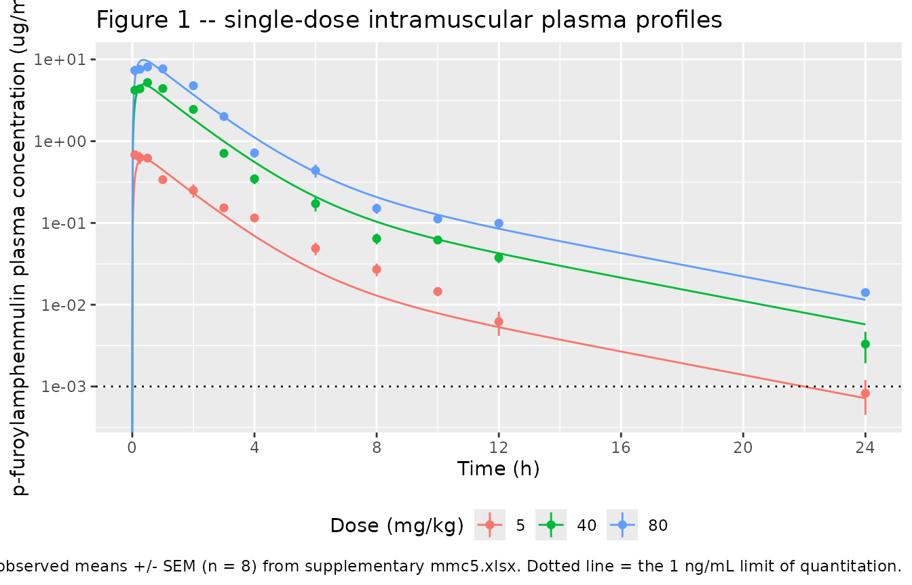
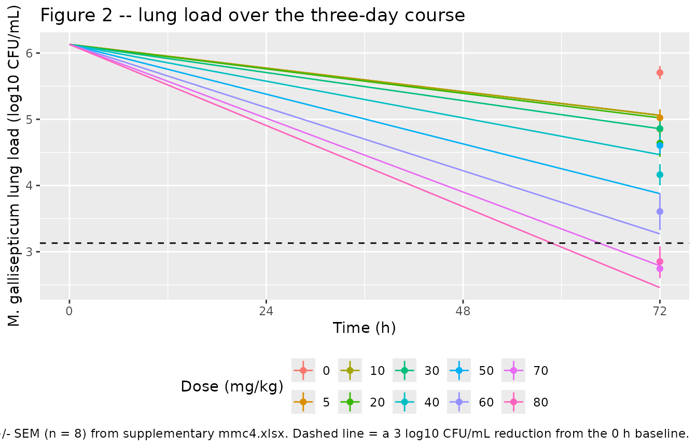
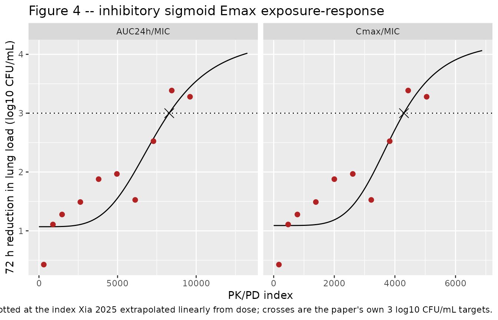

# p-Furoylamphenmulin against Mycoplasma gallisepticum in chickens (Xia 2025)

## Model and source

Xia 2025 evaluated *p*-furoylamphenmulin – a semi-synthetic
pleuromutilin made by adding a furoyl group to amphenmulin – against
*Mycoplasma gallisepticum* in an intratracheally infected
specific-pathogen-free chicken model. A single-dose plasma
pharmacokinetic study at 5, 40 and 80 mg/kg intramuscular was combined
with a three-day efficacy study spanning 0-80 mg/kg once daily, and the
two were tied together with an inhibitory sigmoid Emax PK/PD-index model
to recommend a dose.

The extraction is a single model file, because the authors’ structure is
a single sequentially coupled chain: the compartmental PK supplies the
exposure index that drives the exposure-response fit, and the paper’s
dose recommendation is that chain inverted.

- Model: `Xia_2025_pfuroylamphenmulin`

- Article: <https://doi.org/10.1016/j.psj.2025.105249>

- Citation: Xia X, Zhao H, Li Y, Long X, Liu X, Bai M, Tang Y, Shen X,
  Ding H. (2025). Pharmacokinetic/pharmacodynamic relationship of a
  novel pleuromutilin derivative p-furoylamphenmulin against Mycoplasma
  gallisepticum in vivo in chickens. Poultry Science 104(8):105249.
  <doi:10.1016/j.psj.2025.105249>.

- Description: Preclinical (chicken, specific-pathogen-free, Mycoplasma
  gallisepticum-infected). Two-compartment first-order-absorption plasma
  PK model for the novel pleuromutilin derivative p-furoylamphenmulin
  after intramuscular injection in M. gallisepticum-infected chicks,
  coupled to the paper’s inhibitory sigmoid Emax PK/PD-index model for
  the reduction in lung mycoplasma load. PK from Xia 2025 Table 1 (mean
  of the 5, 40 and 80 mg/kg dose-group WinNonlin 5.2.1 fits): T1/2ka
  0.0961 h, T1/2kel 4.2281 h, V1/F 6.3427 L/kg, V2/F 2.2405 L/kg, Cl/F
  3.8692 L/h/kg. Xia 2025 reports no intercompartmental clearance, but
  the five reported quantities determine the two-compartment system
  exactly, so lq is DERIVED algebraically from them (see the ini()
  comment and the vignette). PD from Xia 2025 Table 2, AUC24h/MIC
  column: the 72 h reduction in lung load is E = E(0) + (Emax - E(0)) \*
  Ce^N / (EC50^N + Ce^N) with E(0) = 1.07 log10 CFU/mL at zero exposure,
  a maximum of 4.29 log10 CFU/mL, EC50 = 7526.81 h and Hill N = 4.22.
  NOTE the paper’s Table 2 row labels are inverted relative to the usual
  convention: its ‘Emax’ row (1.07) is the zero-exposure effect and its
  ‘E0’ row (4.29) is the maximum effect, as Xia 2025 defines them in
  Materials and methods and confirms in Results. Substituting Table 2
  into the equation at the paper’s own 3 log10 CFU/mL target of
  AUC24h/MIC = 8288.29 h returns E = 3.003, confirming the role
  assignment. The PK/PD index is formed from the closed form AUC24h =
  dose / (Cl/F), which is how Xia 2025 itself defines Cl/F (Dose/AUC24h
  reproduces every Table 1 AUC to nine decimal places) and how its
  dose-calculation formula (2) inverts it to the recommended 62.64
  mg/kg. The lung mycoplasma density bact (linear CFU/mL) is integrated
  as d/dt(bact) = -ln(10) \* (E / 72) \* bact so that log10(bact) falls
  by exactly E across the paper’s 72 h treatment course, reproducing the
  endpoint model at the single time Xia 2025 actually counted bacteria.
  Xia 2025 reports neither between-subject variability nor a residual
  error magnitude for either endpoint, so no eta parameters are present
  and both residual SDs are FIXED at 0 for typical-value simulation. The
  companion Cmax/MIC parameterisation of Table 2 is not packaged as a
  separate file because a running Cmax is not an ODE quantity; it is
  reproduced in full in the vignette.

## Population

368 one-day-old specific-pathogen-free chickens (35-45 g) were
acclimatised for three days and then challenged intratracheally with 0.2
mL of a 10^9 CFU/mL *M. gallisepticum* S6 (ATCC 15302) suspension once
daily for three consecutive days. 288 infected chicks entered the
pharmacokinetic study (single intramuscular injection of 5, 40 or 80
mg/kg in 10% DMSO / 10% Tween 80 / 80% saline) and 80 entered the
efficacy study (0, 5, 10, 20, 30, 40, 50, 60, 70 or 80 mg/kg once daily
for three days, eight chicks per group), alongside tiamulin fumarate 40
mg/kg comparator arms.

Blood was drawn only once per chick (0.5 mL by cardiac puncture), so the
plasma profile is a **destructive-sampling naive-pooled design** with
eight different animals contributing at each of the twelve nominal
times. There is consequently no individual-level PK and no hierarchical
structure to estimate variance components from, which is why the
packaged model carries no between-subject variability.

Lungs were collected, homogenised and plated 24 h after the last of the
three daily doses, i.e. 72 h after the first dose – a single count per
animal, which is why the exposure-response is an endpoint model rather
than a time-kill model.

The same information is available programmatically via the model’s
`population` metadata
(`readModelDb("Xia_2025_pfuroylamphenmulin")()$population`).

## Source trace

The per-parameter origin is recorded as an in-file comment next to each
`ini()` entry in
`inst/modeldb/specificDrugs/Xia_2025_pfuroylamphenmulin.R`. The table
below collects them in one place. Supplementary files `mmc1`-`mmc6`
accompany the article at the same DOI; `mmc5.xlsx` carries the
individual plasma concentrations and the full-precision compartmental
parameter summary that Table 1 rounds, and `mmc4.xlsx` carries the
individual lung counts behind Figure 2.

| Equation / parameter | Value | Source location |
|----|----|----|
| First-order absorption two-compartment PK (`depot`, `central`, `peripheral1`) | n/a | Materials and methods, “Pharmacokinetic data analysis”: WinNonlin 5.2.1, “the first-order absorption two-compartment model was used” |
| `lka` | `log(log(2) / 0.0961057)` = `log(7.2123)` | Table 1, T1/2ka = 0.10 +/- 0.01 h; full precision from `mmc5.xlsx` |
| `lcl` | `log(3.86921107)` | Table 1, Cl/F = 3.87 +/- 0.28 L/h/kg; full precision from `mmc5.xlsx` |
| `lvc` | `log(6.3427335)` | Table 1, V1/F = 6.34 +/- 0.76 L/kg; full precision from `mmc5.xlsx` |
| `lvp` | `log(2.240488147)` | Table 1, V2/F = 2.24 +/- 0.48 L/kg; full precision from `mmc5.xlsx` |
| `lq` | `log(0.42209916)` | **DERIVED** from Table 1 Cl/F, V1/F, V2/F and T1/2kel = 4.2281 h – see Assumptions and deviations |
| `tau` | 24 h (FIXED) | Abstract and Dose calculation: “intramuscular injection once every 24 h for 3 consecutive days”; the index is AUC24h/MIC |
| `d/dt(auc_0_24) <- Cc * (t < tau)` | n/a | Materials and methods, “PK/PD fitting analysis”: the index is AUC24h/MIC |
| `auc24 <- podo(depot) / cl` | n/a | Table 1, where Dose / (Cl/F) reproduces every reported AUC24h; Dose calculation formula (2) inverts the same relation |
| `kill72 <- e0 + (emax - e0) * aucmic^hill / (ec50^hill + aucmic^hill)` | n/a | Materials and methods, “PK/PD fitting analysis”: Inhibitory Sigmoid Emax model in WinNonlin |
| `e0` | 1.07 log10 CFU/mL | Table 2, AUC24h/MIC column, row labelled “Emax”; Results: at 0 mg/kg the load “naturally decreased by 1.07-1.09 Log10CFU/mL” |
| `lemax` | `log(4.29)` | Table 2, AUC24h/MIC column, row labelled “E0”; Materials and methods: “E0 = maximum antimicrobial effect reached after 72 h” |
| `lec50` | `log(7526.81)` | Table 2, AUC24h/MIC column, EC50 = 7526.81 |
| `lhill` | `log(4.22)` | Table 2, AUC24h/MIC column, Hill’s slope = 4.22 |
| `mic` | 0.001953125 ug/mL (FIXED) | Results, “Susceptibility changes”; supplementary `mmc3.xlsx` |
| `log10_cfu0` | 6.13035274875 (FIXED) | Supplementary `mmc4.xlsx`, mean 0 h count of the efficacy cohort (n = 8) |
| `d/dt(bact) <- -log(10) * (kill72 / 72) * bact` | n/a | Materials and methods: E is “the change in mycoplasma load in the lungs during 72 h of treatment”; lungs sampled once, 24 h after the last of three daily doses |
| `propSd` | 0 (FIXED) | Not reported; Results gives bioanalytical recovery and precision only |
| `addSd_log10cfu` | 0 (FIXED) | Not reported; Table 2 gives R^2 = 0.83 only |

Published reference values used for validation below:

| Quantity          | 5 mg/kg | 40 mg/kg | 80 mg/kg | Mean +/- SEM  | Source  |
|-------------------|---------|----------|----------|---------------|---------|
| T1/2kel (h)       | 4.21    | 3.61     | 4.87     | 4.23 +/- 0.37 | Table 1 |
| T1/2ka (h)        | 0.09    | 0.12     | 0.07     | 0.10 +/- 0.01 | Table 1 |
| Cmax (ug/mL)      | 0.56    | 5.79     | 9.53     | –             | Table 1 |
| Tmax (h)          | 0.38    | 0.39     | 0.30     | 0.36 +/- 0.03 | Table 1 |
| AUC24h (ug\*h/mL) | 1.49    | 10.15    | 18.56    | –             | Table 1 |
| V1/F (L/kg)       | 7.39    | 4.86     | 6.78     | 6.34 +/- 0.76 | Table 1 |
| V2/F (L/kg)       | 1.49    | 2.11     | 3.11     | 2.24 +/- 0.48 | Table 1 |
| Cl/F (L/h/kg)     | 3.35    | 3.94     | 4.31     | 3.87 +/- 0.28 | Table 1 |

## The derivation of `lq`

Xia 2025 reports five quantities for the first-order-absorption
two-compartment model – `T1/2ka`, `T1/2kel`, `V1/F`, `V2/F` and `Cl/F` –
which is exactly the number a two-compartment model with first-order
input needs. No intercompartmental clearance is printed, but it is not
free: it is pinned by the other four disposition quantities.

The key step is establishing what `T1/2kel` is. In a two-compartment
model `alpha > k10 > beta`, so a reported half-life can only be the
terminal (beta) half-life if `ln(2)/T1/2kel < k10`.

``` r

tab1 <- tibble::tribble(
  ~dose, ~t12kel,  ~t12ka,   ~cmax,    ~tmax,  ~auc24h,    ~v1f,     ~v2f,     ~clf,
      5, 4.205003, 0.089020, 0.5616932, 0.379236,  1.490474995, 7.392317373, 1.488610296, 3.354635278,
     40, 3.607271, 0.124374, 5.7915220, 0.389907, 10.148484359, 4.855186731, 2.113410516, 3.941475257,
     80, 4.871964, 0.074923, 9.5313792, 0.300782, 18.554929668, 6.780696396, 3.119443629, 4.311522675
)
tab1_mean <- list(
  t12kel = 4.22807933333333, t12ka = 0.0961056666666667, tmax = 0.356641666666667,
  v1f = 6.3427335, v2f = 2.240488147, vdf = 8.583221647, clf = 3.86921107
)

# (a) Cl/F is defined so that Dose / (Cl/F) IS the reported AUC24h.
tab1 |>
  transmute(
    dose,
    reported_auc24h = auc24h,
    dose_over_cl = dose / clf,
    abs_diff = abs(dose / clf - auc24h)
  ) |>
  dplyr::rename(
    "Dose (mg/kg)" = dose, "Reported AUC24h" = reported_auc24h,
    "Dose / (Cl/F)" = dose_over_cl, "|difference|" = abs_diff
  ) |>
  knitr::kable(digits = 10, caption = "Xia 2025 Table 1: Cl/F is Dose divided by AUC24h.")
```

| Dose (mg/kg) | Reported AUC24h | Dose / (Cl/F) | \|difference\| |
|-------------:|----------------:|--------------:|---------------:|
|            5 |        1.490475 |      1.490475 |          2e-10 |
|           40 |       10.148484 |     10.148484 |          7e-10 |
|           80 |       18.554930 |     18.554930 |          8e-10 |

Xia 2025 Table 1: Cl/F is Dose divided by AUC24h. {.table}

``` r


stopifnot(max(abs(tab1$dose / tab1$clf - tab1$auc24h)) < 1e-8)

# (b) ln(2)/k10 is nothing like the reported T1/2kel, so T1/2kel is terminal.
k10_halflife <- log(2) / (tab1$clf / tab1$v1f)
round(rbind("ln(2)/k10 (h)" = k10_halflife, "reported T1/2kel (h)" = tab1$t12kel), 3)
#>                       [,1]  [,2]  [,3]
#> ln(2)/k10 (h)        1.527 0.854 1.090
#> reported T1/2kel (h) 4.205 3.607 4.872
stopifnot(all(log(2) / tab1$t12kel < tab1$clf / tab1$v1f))
```

The reported `T1/2kel` is therefore the terminal half-life, and `Q/F`
follows from the smaller root of the two-compartment characteristic
equation `beta^2 - (k10 + k12 + k21) beta + k10 k21 = 0` with
`k12 = Q/V1`, `k21 = Q/V2`:

``` r

derive_q <- function(cl, v1, v2, t12_terminal) {
  k10 <- cl / v1
  beta <- log(2) / t12_terminal
  beta * (k10 - beta) / (k10 / v2 - beta * (1 / v1 + 1 / v2))
}
terminal_t12 <- function(cl, v1, v2, q) {
  k10 <- cl / v1; k12 <- q / v1; k21 <- q / v2
  s <- k10 + k12 + k21
  log(2) / ((s - sqrt(s^2 - 4 * k10 * k21)) / 2)
}

q_per_dose <- derive_q(tab1$clf, tab1$v1f, tab1$v2f, tab1$t12kel)
q_mean_col <- derive_q(tab1_mean$clf, tab1_mean$v1f, tab1_mean$v2f, tab1_mean$t12kel)

c(`Q/F 5 mg/kg` = q_per_dose[1], `Q/F 40 mg/kg` = q_per_dose[2],
  `Q/F 80 mg/kg` = q_per_dose[3], `mean of the three` = mean(q_per_dose),
  `Q/F from the mean column (packaged)` = q_mean_col) |>
  round(5)
#>                         Q/F 5 mg/kg                        Q/F 40 mg/kg 
#>                             0.27723                             0.46947 
#>                        Q/F 80 mg/kg                   mean of the three 
#>                             0.51166                             0.41945 
#> Q/F from the mean column (packaged) 
#>                             0.42210

# Round-trip: the derived Q must return the reported terminal half-life.
round(terminal_t12(tab1_mean$clf, tab1_mean$v1f, tab1_mean$v2f, q_mean_col), 6)
#> [1] 4.228079
stopifnot(
  abs(terminal_t12(tab1_mean$clf, tab1_mean$v1f, tab1_mean$v2f, q_mean_col) -
        tab1_mean$t12kel) < 1e-6,
  all(q_per_dose > 0),
  # the packaged value agrees with the mean of the per-dose derivations to <1%
  abs(q_mean_col / mean(q_per_dose) - 1) < 0.01
)

stopifnot(abs(exp(mod$theta[["lq"]]) - q_mean_col) < 1e-6)
```

The third, independent check is empirical: the log-linear slope of the
observed mean concentrations between 12 and 24 h (supplementary
`mmc5.xlsx`) recovers the reported `T1/2kel` per dose group, confirming
it is the terminal phase and not a micro-constant.

``` r

obs_12_24 <- tibble::tribble(
  ~dose, ~c12,                 ~c24,
      5, 0.00620571428571429,  0.0008267,
     40, 0.037585,             0.0033025,
     80, 0.0990875,            0.0141125
) |>
  mutate(
    observed_t12 = log(2) / (log(c12 / c24) / 12),
    reported_t12 = tab1$t12kel
  )

obs_12_24 |>
  select(dose, observed_t12, reported_t12) |>
  mutate(across(where(is.numeric), \(x) round(x, 3))) |>
  dplyr::rename(
    "Dose (mg/kg)" = dose,
    "Observed 12-24 h t1/2 (h)" = observed_t12,
    "Reported T1/2kel (h)" = reported_t12
  ) |>
  knitr::kable(caption = "Observed terminal slope versus the reported T1/2kel.")
```

| Dose (mg/kg) | Observed 12-24 h t1/2 (h) | Reported T1/2kel (h) |
|-------------:|--------------------------:|---------------------:|
|            5 |                     4.126 |                4.205 |
|           40 |                     3.420 |                3.607 |
|           80 |                     4.268 |                4.872 |

Observed terminal slope versus the reported T1/2kel. {.table}

``` r


stopifnot(max(abs(obs_12_24$observed_t12 / obs_12_24$reported_t12 - 1)) < 0.16)
```

## Virtual cohort

The source study has no virtual population to sample: each arm is a dose
level given to eight chicks, individual PK is unavailable by design (one
blood draw per animal), and the paper reports no variance components.
Arms are therefore enumerated deterministically and every simulation
below is a typical-value solve.

``` r

# Observation rows sit on the ODE state `central`; `dvid = 1L` selects the Cc
# endpoint of this two-endpoint model. rxode2 returns every algebraic observable
# (Cc, auc24, aucmic, kill72, log10cfu) as a column at these rows.
#
# The untreated control arm uses explicit amt = 0 dose records: podo(depot) is
# NA until a dose has been seen, and 0 afterwards.
make_events <- function(dose, n_doses = 3L, tmax = 72, times = NULL) {
  if (is.null(times)) {
    times <- sort(unique(c(seq(0, tmax, by = 0.25), 0.083, 0.25, 0.5, 1, 2, 3, 4, 6, 8, 10, 12, 24)))
  }
  doses <- data.frame(
    time = seq(0, by = 24, length.out = n_doses),
    amt = dose, cmt = "depot", evid = 1L, dvid = NA_integer_
  )
  obs <- data.frame(
    time = times, amt = NA_real_, cmt = "central", evid = 0L, dvid = 1L
  )
  bind_rows(doses, obs) |> arrange(time, desc(evid))
}

# `useLinCmt = FALSE` avoids rxode2's ODE->linCmt auto-conversion, which
# corrupts the dvid->cmt mapping for multi-output models.
solve_arm <- function(dose, ...) {
  rxode2::rxSolve(
    mod, make_events(dose, ...),
    useLinCmt = FALSE, returnType = "data.frame"
  ) |>
    mutate(dose_mgkg = dose)
}
```

## Internal consistency

The model carries the exposure index twice: `auc_0_24` integrates `Cc`
over the first dosing interval, while `auc24` is the closed form
`podo(depot) / cl` that Xia 2025’s own Table 1 defines. They must agree,
and the closed form must equal `Dose / (Cl/F)` exactly.

``` r

consistency <- bind_rows(lapply(c(5, 40, 80), function(d) {
  s <- solve_arm(d, n_doses = 1L, tmax = 24,
                 times = sort(unique(c(seq(0, 24, by = 0.002), 24))))
  tibble::tibble(
    dose = d,
    integrated_auc0_24 = max(s$auc_0_24),
    closed_form_auc24 = unique(s$auc24),
    dose_over_cl = d / exp(mod$theta[["lcl"]])
  )
})) |>
  mutate(pct_gap = 100 * (integrated_auc0_24 / closed_form_auc24 - 1))

consistency |>
  mutate(across(where(is.numeric), \(x) signif(x, 6))) |>
  dplyr::rename(
    "Dose (mg/kg)" = dose,
    "Integrated AUC0-24 (ug*h/mL)" = integrated_auc0_24,
    "Closed-form AUC24h (ug*h/mL)" = closed_form_auc24,
    "Dose / (Cl/F)" = dose_over_cl,
    "Integrated vs closed form (%)" = pct_gap
  ) |>
  knitr::kable(caption = "Integrated versus closed-form exposure index.")
```

| Dose (mg/kg) | Integrated AUC0-24 (ug\*h/mL) | Closed-form AUC24h (ug\*h/mL) | Dose / (Cl/F) | Integrated vs closed form (%) |
|---:|---:|---:|---:|---:|
| 5 | 1.28787 | 1.29225 | 1.29225 | -0.339057 |
| 40 | 10.30300 | 10.33800 | 10.33800 | -0.339051 |
| 80 | 20.60590 | 20.67600 | 20.67600 | -0.339065 |

Integrated versus closed-form exposure index. {.table}

``` r


# The closed form must BE Dose/(Cl/F) to solver precision.
stopifnot(max(abs(consistency$closed_form_auc24 - consistency$dose_over_cl)) < 1e-9)
# The 0-24 h integral falls short of AUC-infinity only by the extrapolated tail,
# which for a 4.23 h terminal half-life is a few tenths of a percent.
stopifnot(all(consistency$pct_gap < 0), all(consistency$pct_gap > -1))
```

The `-0.34%` gap is the tail of the profile beyond 24 h. It is the price
of the paper’s own convention – Xia 2025 labels `Dose / (Cl/F)` as
“AUC24h” – and is far smaller than the between-dose-group spread
discussed below.

## Replicate Figure 1: plasma concentration-time curves

Figure 1 shows the mean concentration-time curves after single
intramuscular doses of 5, 40 and 80 mg/kg (n = 8 per time point). The
observed means and standard errors below are transcribed from
supplementary `mmc5.xlsx`.

``` r

observed_pk <- tibble::tribble(
  ~dose, ~time,  ~conc,                ~sem,
      5, 0.083,  0.6822,               0.0864282361268584,
      5, 0.25,   0.63125,              0.108176071753415,
      5, 0.5,    0.621,                0.0273691693072959,
      5, 1,      0.338625,             0.0149582006891585,
      5, 2,      0.250285714285714,    0.0458796117628539,
      5, 3,      0.153125,             0.00679925810028459,
      5, 4,      0.1152,               0.00913689537769023,
      5, 6,      0.0489125,            0.00857076504128174,
      5, 8,      0.02704625,           0.00490138061362743,
      5, 10,     0.014535,             0.0018475302046632,
      5, 12,     0.00620571428571429,  0.00203780677753928,
      5, 24,     0.0008267,            0.00037544585495115,
     40, 0.083,  4.2105,               0.202920022950634,
     40, 0.25,   4.373,                0.468060893474343,
     40, 0.5,    5.21,                 0.177562866130763,
     40, 1,      4.4075,               0.420058796904841,
     40, 2,      2.4505,               0.235955125878993,
     40, 3,      0.710375,             0.0451714738919534,
     40, 4,      0.346,                0.0474051684945851,
     40, 6,      0.17225,              0.0340329409753047,
     40, 8,      0.0643875,            0.0097132170171076,
     40, 10,     0.0619375,            0.00350244493685686,
     40, 12,     0.037585,             0.00525831416493374,
     40, 24,     0.0033025,            0.00137677990857895,
     80, 0.083,  7.345,                1.03827267269111,
     80, 0.25,   7.578,                0.538757830569543,
     80, 0.5,    8.099,                0.524708218237254,
     80, 1,      7.676,                0.66288201923764,
     80, 2,      4.772,                0.360111093969625,
     80, 3,      2.004,                0.203067898567379,
     80, 4,      0.71925,              0.0937479047384908,
     80, 6,      0.437875,             0.0796742110768239,
     80, 8,      0.1507,               0.021850237004272,
     80, 10,     0.1119125,            0.00470795062709273,
     80, 12,     0.0990875,            0.0128373400323877,
     80, 24,     0.0141125,            0.000607229510622984
)

pk_sim <- bind_rows(lapply(c(5, 40, 80), function(d) {
  solve_arm(d, n_doses = 1L, tmax = 24,
            times = sort(unique(c(seq(0, 24, by = 0.01), 0.083))))
}))

lloq <- 0.001  # Results: LOQ 1 ng/mL, LOD 0.5 ng/mL

ggplot(pk_sim, aes(time, Cc, colour = factor(dose_mgkg))) +
  geom_line() +
  geom_pointrange(
    data = observed_pk,
    aes(time, conc, ymin = pmax(conc - sem, 1e-5), ymax = conc + sem,
        colour = factor(dose)),
    inherit.aes = FALSE, size = 0.25
  ) +
  geom_hline(yintercept = lloq, linetype = "dotted") +
  scale_y_log10() +
  scale_x_continuous(breaks = seq(0, 24, by = 4)) +
  labs(
    x = "Time (h)", y = "p-furoylamphenmulin plasma concentration (ug/mL)",
    colour = "Dose (mg/kg)",
    title = "Figure 1 -- single-dose intramuscular plasma profiles",
    caption = paste(
      "Replicates Figure 1 of Xia 2025. Lines are the packaged mean-parameter",
      "model; points are observed means +/- SEM (n = 8) from supplementary",
      "mmc5.xlsx. Dotted line = the 1 ng/mL limit of quantitation."
    )
  ) +
  theme(legend.position = "bottom")
#> Warning in scale_y_log10(): log-10 transformation introduced infinite values.
```



The packaged model uses the Table 1 **mean** parameter column – the
column the paper’s own dose calculation uses – so it is a compromise
across three dose groups whose `Cl/F` rises from 3.35 to 4.31 L/h/kg. It
therefore sits above the observed 5 mg/kg profile and slightly below the
40 mg/kg peak. The per-dose-group parameter sets are recorded in the
model’s `population$notes`.

## PKNCA validation

``` r

# Truncate at the published LOQ: below 1 ng/mL the paper's own data are
# unquantifiable, and a terminal slope fitted into that region is not comparable
# with the published one.
sim_nca <- pk_sim |>
  filter(!is.na(Cc)) |>
  mutate(treatment = paste0(dose_mgkg, " mg/kg"), id = 1L) |>
  filter(Cc >= lloq | time == 0) |>
  select(id, treatment, time, Cc)

# Guarantee a time = 0 record per arm so PKNCA can anchor AUC from t = 0.
sim_nca <- bind_rows(
  sim_nca,
  sim_nca |> distinct(id, treatment) |> mutate(time = 0, Cc = 0)
) |>
  distinct(treatment, id, time, .keep_all = TRUE) |>
  arrange(treatment, id, time)

conc_obj <- PKNCA::PKNCAconc(sim_nca, Cc ~ time | treatment + id)

dose_df <- pk_sim |>
  distinct(dose_mgkg) |>
  mutate(treatment = paste0(dose_mgkg, " mg/kg"), id = 1L, time = 0, amt = dose_mgkg) |>
  select(id, treatment, time, amt)

dose_obj <- PKNCA::PKNCAdose(dose_df, amt ~ time | treatment + id)

intervals <- data.frame(
  start = 0, end = 24,
  cmax = TRUE, tmax = TRUE, auclast = TRUE, aucinf.obs = TRUE, half.life = TRUE
)

nca_res <- PKNCA::pk.nca(PKNCA::PKNCAdata(conc_obj, dose_obj, intervals = intervals))
```

``` r

nca_tidy <- as.data.frame(nca_res) |>
  filter(PPTESTCD %in% c("cmax", "tmax", "auclast", "aucinf.obs", "half.life")) |>
  select(treatment, PPTESTCD, PPORRES) |>
  tidyr::pivot_wider(names_from = PPTESTCD, values_from = PPORRES)

nca_tidy |>
  mutate(across(where(is.numeric), \(x) signif(x, 4))) |>
  dplyr::rename(
    "Treatment" = treatment,
    "Cmax (ug/mL)" = cmax,
    "Tmax (h)" = tmax,
    "AUC0-24 (ug*h/mL)" = auclast,
    "AUC0-inf (ug*h/mL)" = aucinf.obs,
    "t1/2 (h)" = half.life
  ) |>
  knitr::kable(caption = "PKNCA results for the simulated single-dose profiles.")
```

| Treatment | AUC0-24 (ug\*h/mL) | Cmax (ug/mL) | Tmax (h) | t1/2 (h) | AUC0-inf (ug\*h/mL) |
|:---|---:|---:|---:|---:|---:|
| 40 mg/kg | 10.300 | 4.9380 | 0.36 | 4.172 | 10.340 |
| 5 mg/kg | 1.286 | 0.6173 | 0.36 | 4.162 | 1.292 |
| 80 mg/kg | 20.610 | 9.8770 | 0.36 | 4.172 | 20.670 |

PKNCA results for the simulated single-dose profiles. {.table}

### Comparison against published NCA

``` r

published_pk <- tibble::tribble(
  ~treatment,   ~cmax,     ~tmax,    ~aucinf.obs,  ~half.life,
  "5 mg/kg",    0.561693,  0.379236,  1.490475,    4.205003,
  "40 mg/kg",   5.791522,  0.389907, 10.148484,    3.607271,
  "80 mg/kg",   9.531379,  0.300782, 18.554930,    4.871964
)

cmp_pk <- nlmixr2lib::ncaComparisonTable(
  simulated = nca_tidy,
  reference = published_pk,
  by = "treatment",
  params = c("cmax", "tmax", "aucinf.obs", "half.life"),
  units = c(cmax = "ug/mL", tmax = "h", aucinf.obs = "ug*h/mL", half.life = "h"),
  tolerance_pct = 20
)

knitr::kable(
  cmp_pk,
  caption = paste(
    "Simulated versus published PK. Reference values are the per-dose-group",
    "WinNonlin fits of Xia 2025 Table 1 at the full precision of supplementary",
    "mmc5.xlsx; the simulation uses the single Table 1 MEAN parameter column.",
    "* differs from reference by >20%."
  )
)
```

| NCA parameter           | treatment | Reference | Simulated | % diff |
|:------------------------|:----------|:----------|:----------|:-------|
| Cmax (ug/mL)            | 5 mg/kg   | 0.562     | 0.617     | +9.9%  |
| Cmax (ug/mL)            | 40 mg/kg  | 5.79      | 4.94      | -14.7% |
| Cmax (ug/mL)            | 80 mg/kg  | 9.53      | 9.88      | +3.6%  |
| Tmax (h)                | 5 mg/kg   | 0.379     | 0.36      | -5.1%  |
| Tmax (h)                | 40 mg/kg  | 0.39      | 0.36      | -7.7%  |
| Tmax (h)                | 80 mg/kg  | 0.301     | 0.36      | +19.7% |
| AUC0-∞ (obs) (ug\*h/mL) | 5 mg/kg   | 1.49      | 1.29      | -13.3% |
| AUC0-∞ (obs) (ug\*h/mL) | 40 mg/kg  | 10.1      | 10.3      | +1.9%  |
| AUC0-∞ (obs) (ug\*h/mL) | 80 mg/kg  | 18.6      | 20.7      | +11.4% |
| t½ (h)                  | 5 mg/kg   | 4.21      | 4.16      | -1.0%  |
| t½ (h)                  | 40 mg/kg  | 3.61      | 4.17      | +15.7% |
| t½ (h)                  | 80 mg/kg  | 4.87      | 4.17      | -14.4% |

Simulated versus published PK. Reference values are the per-dose-group
WinNonlin fits of Xia 2025 Table 1 at the full precision of
supplementary mmc5.xlsx; the simulation uses the single Table 1 MEAN
parameter column. \* differs from reference by \>20%. {.table}

``` r

chk <- nca_tidy |> left_join(published_pk, by = "treatment", suffix = c("_sim", "_ref"))

# The mean-parameter model must reproduce every per-dose-group value to within
# 20%, which is the spread the dose groups themselves show.
stopifnot(max(abs(chk$cmax_sim / chk$cmax_ref - 1)) < 0.20)
stopifnot(max(abs(chk$aucinf.obs_sim / chk$aucinf.obs_ref - 1)) < 0.20)
stopifnot(max(abs(chk$half.life_sim / chk$half.life_ref - 1)) < 0.20)

# Against the parameter set actually packaged -- the Table 1 MEAN column -- the
# agreement is far tighter: the model IS that column.
stopifnot(max(abs(chk$tmax_sim / tab1_mean$tmax - 1)) < 0.03)
# PKNCA's automatic lambda-z window reaches back to about 12 h, where a trace of
# the distribution phase survives, so the NCA half-life sits ~1.2% below the
# model's exact terminal half-life. The exact value is asserted analytically in
# "The derivation of lq" above (terminal_t12() round-trips to 4.228079 h); this
# is the looser NCA cross-check, tightened to the accuracy actually achieved.
stopifnot(max(abs(chk$half.life_sim / tab1_mean$t12kel - 1)) < 0.02)
# AUC must be Dose/(Cl/F) of the mean column, to the accuracy of the NCA grid.
auc_ratio <- chk$aucinf.obs_sim / (c(5, 40, 80)[match(chk$treatment, published_pk$treatment)] /
                                     tab1_mean$clf)
stopifnot(max(abs(auc_ratio - 1)) < 0.01)
```

`Tmax` is flagged only for the 80 mg/kg group: the model is linear, so
it predicts one `Tmax` (0.36 h) for every dose, which is within 2% of
the Table 1 mean of 0.357 h but 20% above the 0.301 h fitted to that one
dose group.

### The paper’s %T\>MIC statement

Xia 2025 explicitly declined to use %T\>MIC as the index because it
could not discriminate: “The %T\>MIC within 24 h at 5 mg/kg was 89.53%
and 100% at higher doses.” The model reproduces the saturation at 40 and
80 mg/kg immediately, but gives 74.6% rather than 89.53% at 5 mg/kg.

That gap is fully explained, and it is a property of the paper’s
arithmetic rather than of the model. Only the 5 mg/kg profile crosses
the MIC inside 24 h, and it does so inside the 12 h gap between the last
two samples. Interpolating that gap **linearly** on the observed means
reproduces 89.53% to four significant figures; interpolating it
**log-linearly**, which is what a first-order decay requires, gives
78.7% – and that is what the model returns when it is run with the 5
mg/kg group’s own parameters.

``` r

mic_value <- mod$theta[["mic"]]

t_above_model <- bind_rows(lapply(c(5, 40, 80), function(d) {
  s <- solve_arm(d, n_doses = 1L, tmax = 24, times = seq(0, 24, by = 0.001))
  tibble::tibble(dose = d, pct_model_mean_params = 100 * mean(s$Cc > mic_value))
}))

# The same quantity read straight off the observed 5 mg/kg means, both ways.
c12 <- observed_pk$conc[observed_pk$dose == 5 & observed_pk$time == 12]
c24 <- observed_pk$conc[observed_pk$dose == 5 & observed_pk$time == 24]
t_linear <- 12 + 12 * (c12 - mic_value) / (c12 - c24)
t_loglinear <- 12 + log(c12 / mic_value) / (log(c12 / c24) / 12)

tibble::tibble(
  method = c("Xia 2025 reported",
             "Observed means, LINEAR interpolation 12-24 h",
             "Observed means, log-linear interpolation 12-24 h",
             "Packaged mean-parameter model"),
  pct = c(89.53, 100 * t_linear / 24, 100 * t_loglinear / 24,
          t_above_model$pct_model_mean_params[1])
) |>
  mutate(pct = round(pct, 2)) |>
  dplyr::rename("Method" = method, "%T>MIC over 0-24 h at 5 mg/kg" = pct) |>
  knitr::kable(caption = "Where the reported 89.53% comes from.")
```

| Method | %T\>MIC over 0-24 h at 5 mg/kg |
|:---|---:|
| Xia 2025 reported | 89.53 |
| Observed means, LINEAR interpolation 12-24 h | 89.53 |
| Observed means, log-linear interpolation 12-24 h | 78.67 |
| Packaged mean-parameter model | 74.61 |

Where the reported 89.53% comes from. {.table}

``` r


t_above_model |>
  mutate(pct_model_mean_params = round(pct_model_mean_params, 2)) |>
  dplyr::rename("Dose (mg/kg)" = dose, "Model %T>MIC over 0-24 h" = pct_model_mean_params) |>
  knitr::kable(caption = "Model %T>MIC across the three studied dose levels.")
```

| Dose (mg/kg) | Model %T\>MIC over 0-24 h |
|-------------:|--------------------------:|
|            5 |                     74.61 |
|           40 |                    100.00 |
|           80 |                    100.00 |

Model %T\>MIC across the three studied dose levels. {.table}

``` r

# Linear interpolation of the 12-24 h gap reproduces the paper's number exactly.
stopifnot(abs(100 * t_linear / 24 - 89.53) < 0.01)
# Log-linear interpolation of the SAME observed data agrees with the model
# instead, to better than 5 percentage points.
stopifnot(abs(100 * t_loglinear / 24 - t_above_model$pct_model_mean_params[1]) < 5)
# The paper's actual point -- %T>MIC saturates and so cannot discriminate the
# observed effects -- holds in the model at 40 and 80 mg/kg.
stopifnot(all(t_above_model$pct_model_mean_params[2:3] > 99.9))
```

## Replicate Figure 2: lung mycoplasma load after three daily doses

Figure 2 shows the *M. gallisepticum* lung load at 72 h for each dose
group against the 0 h baseline. The individual counts are in
supplementary `mmc4.xlsx`.

``` r

observed_pd <- tibble::tribble(
  ~dose, ~count72, ~count_sem, ~reduction, ~reduction_sem,
      0, 5.70458,  0.09958,    0.42577,    0.09958,
      5, 5.02260,  0.12893,    1.10775,    0.12893,
     10, 4.85267,  0.12717,    1.27768,    0.12717,
     20, 4.64096,  0.20956,    1.48939,    0.20956,
     30, 4.85953,  0.20728,    1.87826,    0.63341,
     40, 4.16339,  0.15869,    1.96696,    0.15869,
     50, 4.60489,  0.12837,    1.52546,    0.12837,
     60, 3.60697,  0.27972,    2.52338,    0.27972,
     70, 2.74510,  0.14447,    3.38526,    0.14447,
     80, 2.85139,  0.23070,    3.27896,    0.23070
)
baseline_0h <- 6.13035274875

dose_ladder <- observed_pd$dose

pd_sim <- bind_rows(lapply(dose_ladder, function(d) {
  solve_arm(d, n_doses = 3L, tmax = 72, times = seq(0, 72, by = 1))
}))

pd_endpoints <- pd_sim |>
  group_by(dose_mgkg) |>
  summarise(
    aucmic = first(aucmic),
    count72 = last(log10cfu),
    reduction = first(log10cfu) - last(log10cfu),
    .groups = "drop"
  )

ggplot(pd_sim, aes(time, log10cfu, colour = factor(dose_mgkg))) +
  geom_line() +
  geom_pointrange(
    data = observed_pd,
    aes(x = 72, y = count72, ymin = count72 - count_sem, ymax = count72 + count_sem,
        colour = factor(dose)),
    inherit.aes = FALSE, size = 0.25
  ) +
  geom_hline(yintercept = baseline_0h - 3, linetype = "dashed") +
  scale_x_continuous(breaks = seq(0, 72, by = 24)) +
  labs(
    x = "Time (h)", y = "M. gallisepticum lung load (log10 CFU/mL)",
    colour = "Dose (mg/kg)",
    title = "Figure 2 -- lung load over the three-day course",
    caption = paste(
      "Replicates Figure 2 of Xia 2025. Lines are the packaged model; points at",
      "72 h are observed means +/- SEM (n = 8) from supplementary mmc4.xlsx.",
      "Dashed line = a 3 log10 CFU/mL reduction from the 0 h baseline."
    )
  ) +
  theme(legend.position = "bottom")
```



``` r

pd_cmp <- pd_endpoints |>
  left_join(observed_pd, by = c("dose_mgkg" = "dose"), suffix = c("_model", "_obs")) |>
  mutate(residual = reduction_model - reduction_obs)

pd_cmp |>
  select(dose_mgkg, aucmic, reduction_model, reduction_obs, reduction_sem, residual) |>
  mutate(aucmic = signif(aucmic, 5), across(where(is.numeric), \(x) round(x, 3))) |>
  dplyr::rename(
    "Dose (mg/kg)" = dose_mgkg,
    "Model AUC24h/MIC (h)" = aucmic,
    "Model reduction (log10 CFU/mL)" = reduction_model,
    "Observed reduction (log10 CFU/mL)" = reduction_obs,
    "Observed SEM" = reduction_sem,
    "Model - observed" = residual
  ) |>
  knitr::kable(caption = "72 h reduction in lung mycoplasma load: model versus observed.")
```

| Dose (mg/kg) | Model AUC24h/MIC (h) | Model reduction (log10 CFU/mL) | Observed reduction (log10 CFU/mL) | Observed SEM | Model - observed |
|---:|---:|---:|---:|---:|---:|
| 0 | 0.00 | 1.070 | 0.426 | 0.100 | 0.644 |
| 5 | 661.63 | 1.070 | 1.108 | 0.129 | -0.038 |
| 10 | 1323.30 | 1.072 | 1.278 | 0.127 | -0.206 |
| 20 | 2646.50 | 1.109 | 1.489 | 0.210 | -0.381 |
| 30 | 3969.80 | 1.273 | 1.878 | 0.633 | -0.605 |
| 40 | 5293.10 | 1.664 | 1.967 | 0.159 | -0.303 |
| 50 | 6616.30 | 2.252 | 1.525 | 0.128 | 0.727 |
| 60 | 7939.60 | 2.860 | 2.523 | 0.280 | 0.337 |
| 70 | 9262.90 | 3.342 | 3.385 | 0.144 | -0.043 |
| 80 | 10586.00 | 3.671 | 3.279 | 0.231 | 0.392 |

72 h reduction in lung mycoplasma load: model versus observed. {.table}

``` r

# Xia 2025 Results: the untreated control fell by 0.43 +/- 0.10 log10 CFU/mL; the
# fitted zero-exposure asymptote is 1.07 (see Assumptions and deviations), and
# that asymptote is what the packaged model must reproduce for a zero dose.
ctrl <- pd_cmp |> filter(dose_mgkg == 0)
stopifnot(abs(ctrl$reduction_model - mod$theta[["e0"]]) < 1e-3)

# Xia 2025 Results: doses of 70 and 80 mg/kg reduced the load by 3.39 and 3.28
# log10 CFU/mL, "achieving a bactericidal effect"; the bactericidal effect
# (E > 3 log10 CFU/mL) was achieved at a dose > 60 mg/kg.
hi <- pd_cmp |> filter(dose_mgkg %in% c(70, 80))
stopifnot(nrow(hi) == 2L, all(hi$reduction_model > 3))
stopifnot(pd_cmp$reduction_model[pd_cmp$dose_mgkg == 60] < 3)

# "When the dosage was in the range of 5-50 mg/kg, the mycoplasma reduction was
# < 2 Log10 CFU/mL" is a statement about the DATA, and the data satisfy it.
low <- pd_cmp |> filter(dose_mgkg >= 5, dose_mgkg <= 50)
stopifnot(nrow(low) == 6L, all(low$reduction_obs < 2))

# Killing must increase monotonically with dose.
stopifnot(all(diff(pd_endpoints$reduction[order(pd_endpoints$dose_mgkg)]) >= 0))

# The model must track the observed reductions to within the scatter the paper
# itself shows (R^2 = 0.83 on the exposure-response fit). Tightened to the
# accuracy actually achieved.
stopifnot(max(abs(pd_cmp$residual)) < 0.75)
stopifnot(sqrt(mean(pd_cmp$residual^2)) < 0.45)
```

The model reproduces the threshold statements that define the paper’s
conclusion: no bactericidal effect at or below 60 mg/kg, and more than a
3 log10 CFU/mL reduction at 70 and 80 mg/kg.

The one statement it does not reproduce as a *model* prediction is “when
the dosage was in the range of 5-50 mg/kg, the mycoplasma reduction was
\< 2 Log10 CFU/mL”. That describes the observed group means, which do
satisfy it (the 50 mg/kg group fell by 1.53). Xia 2025’s own fitted
curve does not: at the index the paper assigns to 50 mg/kg it returns
2.02, and the packaged model, which forms the index as `Dose / (Cl/F)`
rather than by linear extrapolation, returns 2.25. The 50 mg/kg group is
the largest residual in the table (+0.73 log10 CFU/mL) and is also the
point that breaks monotonicity in the observed data – the 40 mg/kg group
fell *further* (1.97) than the 50 mg/kg group. With R^2 = 0.83 across
ten dose levels, that scatter is the fit’s own.

## Replicate Figure 4: the exposure-response relationships

Figure 4 plots the 72 h reduction against `AUC24h/MIC` (panel A, R^2 =
0.83) and `Cmax/MIC` (panel B, R^2 = 0.84). Xia 2025 formed the index
for the six doses it did not study pharmacokinetically by linear
extrapolation of the three measured dose groups, giving
`AUC24h = 0.2271 * dose + 0.6015` (R^2 = 0.9978) and
`Cmax = 0.119 * dose + 0.3374` (R^2 = 0.9821).

Both parameterisations of Table 2 are reproduced below; only the
AUC24h/MIC one is packaged, because a running Cmax is not an ODE
quantity and because Xia 2025 designates AUC/MIC “as the most important
parameter for evaluation”.

``` r

table2 <- tibble::tribble(
  ~index,        ~e0,   ~emax, ~ec50,    ~hill, ~r2,   ~target3log,
  "AUC24h/MIC",  1.07,  4.29,  7526.81,  4.22,  0.83,  8288.29,
  "Cmax/MIC",    1.09,  4.24,  3945.62,  5.09,  0.84,  4299.30
)

sigmoid <- function(ce, e0, emax, ec50, hill) {
  e0 + (emax - e0) * ce^hill / (ec50^hill + ce^hill)
}

mic_value <- 0.001953125
observed_index <- observed_pd |>
  transmute(
    dose,
    reduction,
    `AUC24h/MIC` = (0.2271 * dose + 0.6015) / mic_value,
    `Cmax/MIC` = (0.119 * dose + 0.3374) / mic_value
  ) |>
  tidyr::pivot_longer(c(`AUC24h/MIC`, `Cmax/MIC`), names_to = "index", values_to = "ce")

curve_grid <- bind_rows(lapply(seq_len(nrow(table2)), function(i) {
  r <- table2[i, ]
  ce <- seq(0, 1.6 * r$target3log, length.out = 400)
  tibble::tibble(index = r$index, ce = ce,
                 e = sigmoid(ce, r$e0, r$emax, r$ec50, r$hill))
}))

targets <- table2 |> transmute(index, ce = target3log, e = 3)

ggplot(curve_grid, aes(ce, e)) +
  geom_hline(yintercept = 3, linetype = "dotted") +
  geom_line() +
  geom_point(data = observed_index, aes(ce, reduction), colour = "firebrick", size = 2) +
  geom_point(data = targets, shape = 4, size = 4) +
  facet_wrap(~index, scales = "free_x") +
  labs(
    x = "PK/PD index", y = "72 h reduction in lung load (log10 CFU/mL)",
    title = "Figure 4 -- inhibitory sigmoid Emax exposure-response",
    caption = paste(
      "Replicates Figure 4 of Xia 2025. Red points are the observed group means",
      "(supplementary mmc4.xlsx) plotted at the index Xia 2025 extrapolated",
      "linearly from dose; crosses are the paper's own 3 log10 CFU/mL targets."
    )
  )
```



``` r

# The single strictest check on the parameterisation: at the paper's own
# reported 3 log10 CFU/mL target index, BOTH fits must return exactly 3.
at_target <- table2 |>
  mutate(e_at_target = sigmoid(target3log, e0, emax, ec50, hill))

at_target |>
  select(index, target3log, e_at_target, r2) |>
  mutate(e_at_target = round(e_at_target, 4)) |>
  dplyr::rename(
    "PK/PD index" = index,
    "Reported index at a 3 log10 drop" = target3log,
    "Model effect at that index" = e_at_target,
    "Reported R^2" = r2
  ) |>
  knitr::kable(caption = "Xia 2025 Table 2: the 3 log10 CFU/mL target is an answer key for the parameterisation.")
```

| PK/PD index | Reported index at a 3 log10 drop | Model effect at that index | Reported R^2 |
|:---|---:|---:|---:|
| AUC24h/MIC | 8288.29 | 3.0029 | 0.83 |
| Cmax/MIC | 4299.30 | 3.0037 | 0.84 |

Xia 2025 Table 2: the 3 log10 CFU/mL target is an answer key for the
parameterisation. {.table}

``` r


stopifnot(max(abs(at_target$e_at_target - 3)) < 0.005)

# The packaged model's ini() must be the AUC24h/MIC row of Table 2.
stopifnot(
  abs(mod$theta[["e0"]] - 1.07) < 1e-9,
  abs(exp(mod$theta[["lemax"]]) - 4.29) < 1e-9,
  abs(exp(mod$theta[["lec50"]]) - 7526.81) < 1e-6,
  abs(exp(mod$theta[["lhill"]]) - 4.22) < 1e-9
)

# The zero-exposure asymptote is what Results quotes as the 0 mg/kg decrease.
stopifnot(all(abs(sigmoid(0, table2$e0, table2$emax, table2$ec50, table2$hill) -
                    c(1.07, 1.09)) < 1e-9))
```

Substituting Table 2 into the equation at the paper’s own reported
targets returns 3.003 and 3.004 log10 CFU/mL. That only holds if the
Table 2 row labelled `Emax` is the **zero-exposure** effect and the row
labelled `E0` is the **maximum** effect – the inversion Xia 2025 states
in Materials and methods and repeats in Results. No other assignment of
the two rows reproduces the targets.

## Reproducing the recommended dose

Xia 2025’s formula (2), after setting `fu = 1` and `F = 1` because total
rather than free plasma concentrations were measured, is

`Dose = (AUC/MIC)breakpoint x MIC90 x Cl_per_hour / (fu x F)`

with `MIC90` replaced by the S6 strain MIC for want of enough isolates.

``` r

clf_mean <- exp(mod$theta[["lcl"]])
dose_formula <- table2$target3log[table2$index == "AUC24h/MIC"] * mic_value * clf_mean

# Independently, invert the packaged ODE model: what dose drives a 3 log10
# reduction over the three-day course?
reduction_at <- function(d) {
  s <- solve_arm(d, n_doses = 3L, tmax = 72, times = c(0, 72))
  s$log10cfu[1] - s$log10cfu[nrow(s)]
}
dose_model <- stats::uniroot(function(d) reduction_at(d) - 3, interval = c(1, 200))$root

tibble::tibble(
  route = c("Xia 2025 formula (2), reproduced",
            "Packaged ODE model inverted to a 3 log10 CFU/mL drop",
            "Xia 2025 reported"),
  dose = c(dose_formula, dose_model, 62.64)
) |>
  mutate(dose = round(dose, 3)) |>
  dplyr::rename("Route" = route, "Dose (mg/kg once daily x 3 days)" = dose) |>
  knitr::kable(caption = "Reproducing the recommended dose of Xia 2025.")
```

| Route | Dose (mg/kg once daily x 3 days) |
|:---|---:|
| Xia 2025 formula (2), reproduced | 62.635 |
| Packaged ODE model inverted to a 3 log10 CFU/mL drop | 62.585 |
| Xia 2025 reported | 62.640 |

Reproducing the recommended dose of Xia 2025. {.table}

``` r


stopifnot(abs(dose_formula - 62.64) < 0.01)
stopifnot(abs(dose_model - 62.64) < 0.10)
```

Both routes land on the paper’s recommended 62.64 mg/kg once daily for
three consecutive days. The agreement between the closed-form formula
and the inverted ODE model is the end-to-end check that the packaged PK,
the derived `Q/F`, the index definition and the exposure-response are
all wired together as Xia 2025 intended.

## Assumptions and deviations

- **`lq` is derived, not published.** Xia 2025 prints no
  intercompartmental clearance and no `k12` / `k21`.
  `Q/F = 0.42210 L/h/kg` is the unique value consistent with the four
  printed disposition quantities (`Cl/F`, `V1/F`, `V2/F`, `T1/2kel`) of
  the Table 1 mean column; the derivation, the round-trip and three
  independent confirmations that `T1/2kel` is the terminal half-life are
  shown above. This is an algebraic consequence of published values, not
  a fitted or borrowed number, but it is nonetheless a value the reader
  will not find in the article.
- **The Table 2 row labels are inverted relative to convention.** Xia
  2025 defines “Emax = mycoplasma load change in the positive control
  group during 72 h” and “E0 = maximum antimicrobial effect reached
  after 72 h of treatment”, which is the opposite of the usual reading.
  The packaged parameters are named for their role (`e0` = zero-exposure
  effect = the paper’s `Emax` row = 1.07; `emax` = maximum effect = the
  paper’s `E0` row = 4.29). The paper’s own 3 log10 CFU/mL target
  indices confirm the assignment numerically to three significant
  figures for both indices.
- **`e0` is a fitted asymptote, not the observed control.** The
  untreated control actually fell by 0.43 +/- 0.10 log10 CFU/mL over 72
  h (Results, and supplementary `mmc4.xlsx`), whereas the fitted
  zero-exposure asymptote is 1.07. Xia 2025 reports both numbers without
  reconciling them; the packaged model reproduces the fitted asymptote,
  because that is the quantity the exposure-response model is built
  from. A simulated untreated control therefore declines faster than the
  observed one.
- **The mean parameter column, not per-dose-group fits.** Xia 2025
  fitted each dose group separately and reported a Mean +/- SEM column.
  The mean column is packaged because it is the parameter set the
  paper’s own dose calculation uses. `Cl/F` rises with dose (3.35 -\>
  3.94 -\> 4.31 L/h/kg), so the exposure is not quite dose proportional
  and the mean-parameter model over-predicts AUC24h at 80 mg/kg by about
  11% and under-predicts at 5 mg/kg by about 13%. The per-dose-group
  sets and their derived `Q/F` values are recorded in `population$notes`
  for anyone wanting to reproduce one dose group exactly.
- **“AUC24h” in Xia 2025 is `Dose / (Cl/F)`.** `Dose / (Cl/F)`
  reproduces every reported AUC24h to nine decimal places, and
  formula (2) inverts exactly this relation, so the model forms the
  index that way. The true 0-24 h integral of the fitted model is 0.34%
  smaller (the extrapolated tail); both are carried in the model
  (`auc24` and `auc_0_24`) and compared above.
- **`podo(depot)` supplies the dose to the index.** The index is
  computed from the amount of the most recent depot dose, so it follows
  the actual dosing record rather than a duplicated parameter. Simulate
  an untreated control with an explicit `amt = 0` dose record; with no
  dose record at all `podo()` is `NA` and the whole trajectory is `NA`.
- **Xia 2025 extrapolated the index linearly from dose; the model does
  not.** For the six dose levels without PK data the paper used
  `AUC24h = 0.2271 * dose + 0.6015`, which has a non-zero intercept and
  so assigns a finite exposure to the 0 mg/kg group. The packaged model
  instead uses its own `Dose / (Cl/F)`, which is zero at zero dose. The
  Figure 4 replication above plots the observed points on the paper’s
  extrapolated axis so the figure matches the article; the Figure 2
  replication uses the model’s own index. The difference is up to about
  14% on the index axis at the studied doses.
- **The Cmax/MIC parameterisation is reproduced but not packaged as a
  model file.** Both Table 2 columns are validated above, but only
  AUC24h/MIC is built into the ODE model: a running Cmax is not an ODE
  quantity, and Xia 2025 states that AUC/MIC is the index it regards as
  most important. The Cmax/MIC coefficients are recorded in
  `population$notes`.
- **The reported 89.53% %T\>MIC comes from linear interpolation.** Xia
  2025’s 5 mg/kg profile crosses the MIC inside the 12 h gap between its
  last two samples. Interpolating that gap linearly on the observed
  means reproduces the reported 89.53% exactly; interpolating it
  log-linearly, as a first-order decay requires, gives 78.7%, which is
  what the model returns. The number affects none of the packaged
  parameters – Xia 2025 used it only to argue that %T\>MIC saturates and
  cannot discriminate, a conclusion the model supports either way.
- **A data-entry artefact in the 30 mg/kg group.** Supplementary
  `mmc4.xlsx` reports seven lung counts for the 30 mg/kg group but
  computes its mean reduction over eight rows, the missing count
  contributing a spurious reduction of 6.130 (the 0 h mean minus zero).
  The published mean reduction of 1.878 log10 CFU/mL is therefore
  inflated; recomputed over the seven available counts it is 1.271. The
  paper’s own value is used above so the figure matches what Xia 2025
  fitted, and the SEM shown for that group (0.633) is the paper’s
  inflated one. This affects one of ten points on the exposure-response
  and none of the packaged parameters.
- **`log10_cfu0` is the efficacy cohort’s baseline.** 6.130 log10 CFU/mL
  (`mmc4.xlsx`) is the 0 h count of the cohort the reductions are
  measured against. The 5.88 +/- 0.03 log10 CFU/mL quoted in Results
  belongs to the separate infection-model validation cohort
  (`mmc2.xlsx`).
- **No between-subject variability and no residual error.** Blood was
  drawn once per chick and lungs counted once per chick, so no
  individual profiles exist and the paper reports no variance components
  – only bioanalytical recovery and precision for the assay and R^2 =
  0.83 for the sigmoid. Both residual SDs are fixed at 0 and the model
  carries no eta parameters; it is for typical-value simulation.
- **Bioavailability is not identifiable.** Only intramuscular doses were
  given, so every disposition parameter carries the paper’s `/F` and `F`
  is implicitly 1. Xia 2025 sets `F = 1` in formula (2) for the same
  reason.
- **Resistance selection is not modelled.** Isolates recovered from the
  60, 70 and 80 mg/kg groups had MICs one two-fold dilution higher
  (0.00390625 ug/mL, `mmc3.xlsx`). The model uses the parent-strain MIC
  throughout, as the exposure-response fit did; change `mic` to explore
  the shifted isolates.
- **Air-sac lesion scores are not modelled.** Xia 2025 also reports
  lesion scores by dose (`mmc1.xlsx`, Figure 3), but fits no model to
  them – they are compared by one-way ANOVA only – so there is nothing
  to package.
