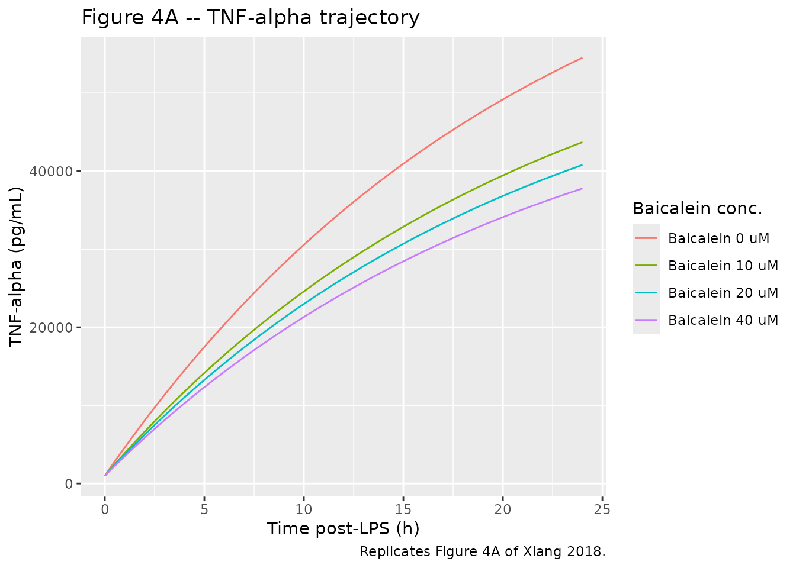
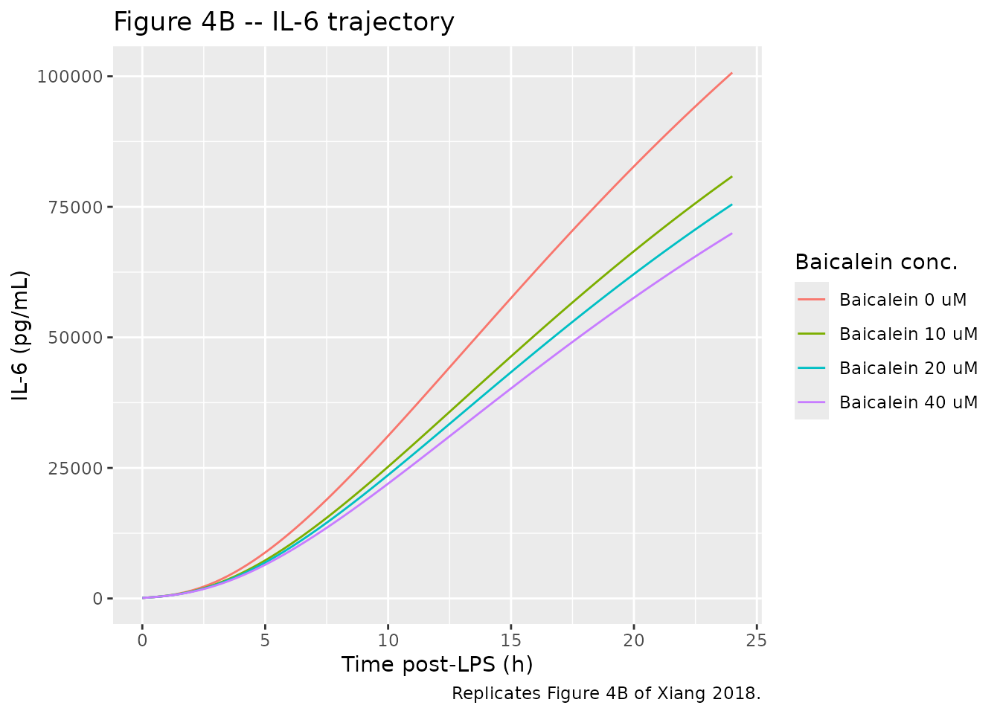
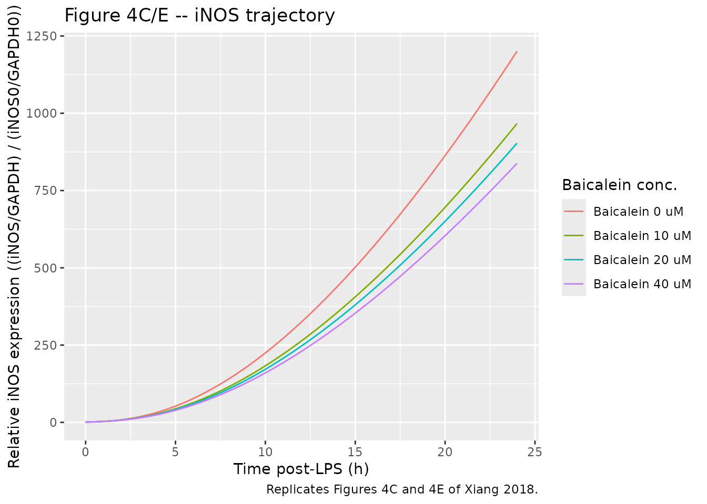
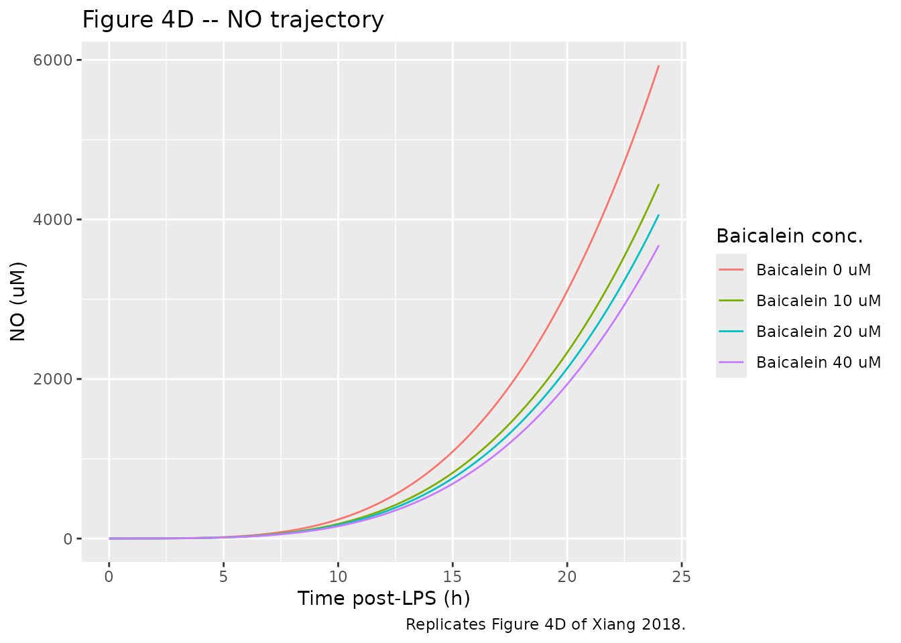

# Baicalein (Xiang 2018)

## Model and source

- Citation: Xiang L, Hu Y-F, Wu J-S, Wang L, Huang W-G, Xu C-S, Meng
  X-L, Wang P. Semi-Mechanism-Based Pharmacodynamic Model for the
  Anti-Inflammatory Effect of Baicalein in LPS-Stimulated RAW264.7
  Macrophages. Front Pharmacol. 2018;9:793.
  <doi:10.3389/fphar.2018.00793>.
- Description: In vitro (RAW264.7 mouse macrophage cell line).
  Semi-mechanism-based cellular pharmacodynamic model for the
  anti-inflammatory effect of baicalein on LPS-induced cytokine and
  iNOS/NO release in RAW264.7 mouse macrophages. Four indirect-response
  states arranged in a TNF-alpha -\> {IL-6, iNOS -\> NO} cascade: (1)
  TNF-alpha indirect response with LPS-stimulated zero-order production
  and baicalein’s log-linear inhibition f(Bai) = alpha \* log(C_Bai + 1)
  on the production rate; (2) IL-6 indirect response with delayed
  TNF-alpha drive (lag tau1); (3) iNOS indirect response with delayed
  TNF-alpha drive (lag tau2) and elimination held at zero (paper choice
  for the post-12.5 h plateau); (4) NO indirect response with iNOS^delta
  amplification and elimination held at zero. Baicalein concentration
  enters as a static covariate (CONC_BAI_UM); LPS is constant at 1 ug/mL
  throughout the experiment and is absorbed into the kinTNF zero-order
  production rate (no explicit LPS state). Tau1 and tau2 are encoded via
  single-compartment delay states (mean transit time = tau) because
  rxode2 does not provide a native delay-differential-equation solver;
  see the validation vignette Errata for the impulse-response
  implications. Typical-value-only mechanism: no IIV, no residual error
  is reported in the source (CV% in Table 1 are RSE / precision of
  estimate, not BSV).
- Article: <https://doi.org/10.3389/fphar.2018.00793>

## Population

The model was fit to a cellular in-vitro time-kill / cytokine-release
experiment in the murine RAW264.7 macrophage cell line (Center of
Cellular Resources, Chinese Academy of Sciences, Shanghai). Cells were
inoculated at 1 x 10^6 cells/mL, pre-treated with baicalein at 0, 10,
20, or 40 uM for 0.5 h, then stimulated with LPS (1 ug/mL, Escherichia
coli O55:B5) for an additional 1, 2, 4, 8, 12, and 24 h. TNF-alpha and
IL-6 in the cell-culture supernatant were quantified by ELISA (MULTI
SCIENCES Mouse kits; intra/inter-assay CV 2.3-3.0% and 2.1-5.3%), iNOS
expression was measured by Western blot and normalised to the t = 0
control as (iNOS/GAPDH) / (iNOS0/GAPDH0), and NO was quantitated by the
Griess reaction calibrated against sodium nitrite standards (Xiang 2018
Materials and Methods). Reported sample sizes per condition were n = 3
for TNF-alpha, IL-6, and NO, and n = 6 for iNOS (Xiang 2018 Figure 3
caption).

The same information is available programmatically via
`rxode2::rxode(readModelDb("Xiang_2018_baicalein"))$population`.

## Source trace

The per-parameter origin is recorded as an in-file comment next to each
`ini()` entry in `inst/modeldb/pharmacodynamics/Xiang_2018_baicalein.R`.
The table below collects them in one place for review.

| Equation / parameter | Value | Source location |
|----|----|----|
| `lalpha` (alpha) | log(0.0832) | Xiang 2018 Table 1, row 1 (a) |
| `lkin_tnf` (kinTNF) | log(3740) | Xiang 2018 Table 1, row 2 (k_inTNFa) |
| `lkout_tnf` (koutTNF) | log(0.0463) | Xiang 2018 Table 1, row 3 (k_outTNFa) |
| `lkin_il6` (kinIL6) | log(0.353) | Xiang 2018 Table 1, row 4 (k_inIL-6) |
| `lkout_il6` (koutIL6) | log(0.143) | Xiang 2018 Table 1, row 5 (k_outIL-6) |
| `ltau1` (tau1) | log(1.38) | Xiang 2018 Table 1, row 6 (tau_1) |
| `lkin_inos` (kiniNOS) | log(0.00169) | Xiang 2018 Table 1, row 7 (k_iniNOS) |
| `ltau2` (tau2) | log(1.41) | Xiang 2018 Table 1, row 8 (tau_2) |
| `lkin_no` (kinNO) | log(0.0605) | Xiang 2018 Table 1, row 9 (k_inNO) |
| `ldelta` (delta) | log(1.35) | Xiang 2018 Table 1, row 10 (delta) |
| `kout_inos` | fixed(0) | Xiang 2018 Results, Model Simulation paragraph 1 (koutiNOS fixed to 0) |
| `kout_no` | fixed(0) | Xiang 2018 Results, Model Simulation paragraph 1 (koutNO fixed to 0) |
| `lrbase_tnf` | log(1000) | Xiang 2018 Figure 4A, control curve at t = 0 (digitised) |
| `lrbase_il6` | log(100) | Xiang 2018 Figure 4B, control curve at t = 0 (digitised) |
| `lrbase_inos` | log(1) | Xiang 2018 Materials and Methods, Western Blotting (normalisation definition) |
| `lrbase_no` | log(1) | Xiang 2018 Figure 4D, control curve at t = 0 (digitised) |
| `propSd_tnf,_il6,_inos,_no` | fixed(0.10) | Placeholder; weighting strategy in Xiang 2018 Pharmacodynamic Modeling does not state the final-model residual-error form |
| Eq 1 (dTNF/dt) | n/a | Xiang 2018 Eq 1, page 4 |
| Eq 2 (f(Bai)) | n/a | Xiang 2018 Eq 2, page 4 |
| Eq 3 (TNFa_0) | n/a | Xiang 2018 Eq 3, page 4 |
| Eq 4 (dIL-6/dt) | n/a | Xiang 2018 Eq 4, page 4 |
| Eq 5 (IL-6_0) | n/a | Xiang 2018 Eq 5, page 5 |
| Eq 6 (diNOS/dt) | n/a | Xiang 2018 Eq 6, page 5 |
| Eq 7 (dNO/dt) | n/a | Xiang 2018 Eq 7, page 5 |

### Dimensional analysis

Endogenous / mechanistic models in the package are required to carry a
worked dimensional analysis (per `references/endogenous-validation.md`).
The unit table below shows the units of every symbol on the right-hand
side of each ODE in `model()`; the left-hand side must equal
`[state units]/[time units]` (i.e., the state’s reporting unit per
hour).

| Term | Units of each factor | Product (= LHS) |
|----|----|----|
| `kin_tnf * (1 - f_bai)` | (pg/mL/h) \* (unitless) | pg/mL/h = d/dt(TNF) |
| `kout_tnf * tnf` | (1/h) \* (pg/mL) | pg/mL/h = d/dt(TNF) |
| `(tnf - transit1) / tau1` | (pg/mL) / (h) | pg/mL/h = d/dt(transit1) |
| `(tnf - transit2) / tau2` | (pg/mL) / (h) | pg/mL/h = d/dt(transit2) |
| `kin_il6 * transit1` | (1/h) \* (pg/mL) | pg/mL/h = d/dt(IL-6) |
| `kout_il6 * il6` | (1/h) \* (pg/mL) | pg/mL/h = d/dt(IL-6) |
| `kin_inos * transit2` | (1/h) \* (pg/mL) | pg/mL/h then normalized (note below) |
| `kout_inos * inos` | (1/h) \* (unitless) | unitless/h |
| `kin_no * inos^delta` | (uM/h) \* (unitless) | uM/h = d/dt(NO) |
| `kout_no * no` | (1/h) \* (uM) | uM/h |

**Notes on apparent units.**

- `kinTNF` is reported with the unit `h^-1` in Xiang 2018 Table 1 row 2;
  Eq 1 requires the production-rate term to have the unit pg/mL/h, so
  `kinTNF` is interpreted as carrying units pg/mL/h. The Table 1 unit
  label is treated as a typesetting slip (the same column header was
  applied to all first-order rate constants). At the published value
  3.74 x 10^3, this interpretation is also numerically self-consistent
  with the observed t = 1 h peak (see the smoke check below).
- `kinNO` is reported with the unit `h^-1` in Xiang 2018 Table 1 row 9;
  Eq 7 with `iNOS^delta` unitless requires `kinNO` to carry units uM/h.
  Same Table-1 unit-label slip as `kinTNF`.
- `kiniNOS` (Table 1 row 7) carries units 1/h; Eq 6 multiplies the
  delayed TNF-alpha concentration in pg/mL, so the iNOS state’s
  effective unit is iNOS-ratio per (pg/mL \* h)) at unit TNF-alpha. iNOS
  is reported as the unitless ratio (iNOS/GAPDH) / (iNOS0/GAPDH0), so
  the “unit” of d/dt(iNOS) is iNOS-ratio per h; the dimensional
  consistency is therefore exact only if kiniNOS is read as having units
  (1/h) \* (pg/mL)^-1 = 1/(h \* pg/mL). The package retains the Table 1
  value 0.00169 verbatim; downstream users who refit the model on a
  different TNF-alpha unit basis should rescale kiniNOS accordingly (see
  Assumptions and deviations below).

## Parameter table – paper vs. file

| Parameter | Paper (Table 1) | File (ini) | CV_pct_in_paper |
|:----------|----------------:|-----------:|:----------------|
| alpha     |        8.32e-02 |    0.08319 | 15%             |
| kinTNF    |        3.74e+03 | 3739.47311 | 6%              |
| koutTNF   |        4.63e-02 |    0.04633 | 32%             |
| kinIL6    |        3.53e-01 |    0.35300 | 9%              |
| koutIL6   |        1.43e-01 |    0.14306 | 23%             |
| tau1      |        1.38e+00 |    1.38002 | 11%             |
| kiniNOS   |        1.69e-03 |    0.00169 | 9%              |
| tau2      |        1.41e+00 |    1.41001 | 13%             |
| kinNO     |        6.05e-02 |    0.06056 | 37%             |
| delta     |        1.35e+00 |    1.34999 | 9%              |
| koutiNOS  |        0.00e+00 |    0.00000 | fixed to 0      |
| koutNO    |        0.00e+00 |    0.00000 | fixed to 0      |

Xiang 2018 Table 1 vs the values stored in
inst/modeldb/pharmacodynamics/Xiang_2018_baicalein.R. CV% in the source
paper is the precision of the estimate (RSE), not between-subject
variability. {.table}

## Simulation – replicate Figure 4

Xiang 2018 Figure 4 shows the model-predicted and measured time courses
of TNF-alpha (panel A), IL-6 (panel B), iNOS (panel C/E), and NO (panel
D) over 24.5 h in LPS-stimulated RAW264.7 macrophages at four baicalein
concentrations (0 = control, 10, 20, 40 uM). The simulation below uses
the packaged typical-value model with four virtual “wells” (one per
concentration), zero between-subject variability, and the figure-derived
baseline values.

``` r

mod <- rxode2::rxode(nlmixr2lib::readModelDb("Xiang_2018_baicalein"))

times <- seq(0, 24, by = 0.25)
concentrations <- c(0, 10, 20, 40)

make_well <- function(conc, id) {
  rxode2::et(amt = 0, time = 0) |>
    rxode2::et(times) |>
    as.data.frame() |>
    dplyr::mutate(id = id, CONC_BAI_UM = conc)
}

events <- dplyr::bind_rows(
  make_well(concentrations[1], id = 1L),
  make_well(concentrations[2], id = 2L),
  make_well(concentrations[3], id = 3L),
  make_well(concentrations[4], id = 4L)
)
stopifnot(!anyDuplicated(unique(events[, c("id", "time", "evid")])))

sim <- rxode2::rxSolve(mod, events = events,
                       keep = "CONC_BAI_UM",
                       returnType = "data.frame") |>
  dplyr::as_tibble() |>
  dplyr::mutate(label = paste0("Baicalein ", CONC_BAI_UM, " uM"))
#> Warning: multi-subject simulation without without 'omega'
```

### Figure 4A – TNF-alpha

Replicates Figure 4A of Xiang 2018 (TNF-alpha time course at 0, 10, 20,
40 uM baicalein in LPS-stimulated RAW264.7 macrophages).

``` r

ggplot(sim, aes(time, tnf, colour = label)) +
  geom_line() +
  labs(x = "Time post-LPS (h)",
       y = "TNF-alpha (pg/mL)",
       colour = "Baicalein conc.",
       title = "Figure 4A -- TNF-alpha trajectory",
       caption = "Replicates Figure 4A of Xiang 2018.")
```



### Figure 4B – IL-6

``` r

ggplot(sim, aes(time, il6, colour = label)) +
  geom_line() +
  labs(x = "Time post-LPS (h)",
       y = "IL-6 (pg/mL)",
       colour = "Baicalein conc.",
       title = "Figure 4B -- IL-6 trajectory",
       caption = "Replicates Figure 4B of Xiang 2018.")
```



### Figure 4C/E – iNOS

``` r

ggplot(sim, aes(time, inos, colour = label)) +
  geom_line() +
  labs(x = "Time post-LPS (h)",
       y = "Relative iNOS expression ((iNOS/GAPDH) / (iNOS0/GAPDH0))",
       colour = "Baicalein conc.",
       title = "Figure 4C/E -- iNOS trajectory",
       caption = "Replicates Figures 4C and 4E of Xiang 2018.")
```



### Figure 4D – NO

``` r

ggplot(sim, aes(time, no, colour = label)) +
  geom_line() +
  labs(x = "Time post-LPS (h)",
       y = "NO (uM)",
       colour = "Baicalein conc.",
       title = "Figure 4D -- NO trajectory",
       caption = "Replicates Figure 4D of Xiang 2018.")
```



## Smoke check – t = 1 h TNF-alpha peak

Xiang 2018 Figure 4A shows that the TNF-alpha trace peaks at about 1 h
after LPS stimulation, then gradually declines through 12 h. The
packaged model’s simple turnover form (constant LPS-driven production
plus first-order elimination) cannot reproduce the peak-and-decline; it
predicts a monotonic approach to the steady-state asymptote kinTNF /
koutTNF ~= 80800 pg/mL. The published model fit in Figure 4 appears to
track the data more closely than the published equations permit (see
Assumptions and deviations).

The simulated t = 1 h TNF-alpha concentration is, however, in close
agreement with the observed peak (Xiang 2018 Figure 2B / 4A reads ~4500
pg/mL in the LPS-only control):

``` r

sim |>
  dplyr::filter(abs(time - 1) < 1e-6) |>
  dplyr::select(label, time, tnf) |>
  dplyr::mutate(tnf = round(tnf, 0)) |>
  knitr::kable(caption = "Simulated TNF-alpha at t = 1 h post-LPS, by baicalein concentration. The LPS-only control value (~4600 pg/mL) is close to the Figure 4A observed peak (~4500 pg/mL).")
```

| label           | time |  tnf |
|:----------------|-----:|-----:|
| Baicalein 0 uM  |    1 | 4609 |
| Baicalein 10 uM |    1 | 3880 |
| Baicalein 20 uM |    1 | 3684 |
| Baicalein 40 uM |    1 | 3480 |

Simulated TNF-alpha at t = 1 h post-LPS, by baicalein concentration. The
LPS-only control value (~4600 pg/mL) is close to the Figure 4A observed
peak (~4500 pg/mL). {.table}

## Baseline-recovery smoke check

This model is not a quiescent steady-state system (the LPS-stimulated
kinTNF zero-order production is on from t = 0), so the classic
endogenous-model “set initial condition to baseline, expect no drift”
check is not applicable. A meaningful sanity test is to confirm that
when kinTNF is set to zero (no LPS), the four states stay near their
baselines for the duration of the experiment (linear-cascade
self-consistency).

``` r

# Build a parameter override: kin_tnf -> 0 (no LPS stimulation)
mod_no_lps <- rxode2::rxode(nlmixr2lib::readModelDb("Xiang_2018_baicalein"))
sim_no_lps <- rxode2::rxSolve(
  mod_no_lps,
  events = make_well(conc = 0, id = 1L),
  params = c(lkin_tnf = log(1e-12)),  # effectively zero
  returnType = "data.frame"
)
sim_no_lps |>
  dplyr::filter(time %in% c(0, 6, 12, 18, 24)) |>
  dplyr::select(time, tnf, il6, inos, no) |>
  dplyr::mutate(across(c(tnf, il6, inos, no), \(x) round(x, 3))) |>
  knitr::kable(caption = "Without LPS stimulation (kinTNF ~= 0), TNF-alpha decays slowly toward zero (driven only by koutTNF); IL-6 rises slowly because the model's IL-6 production is proportional to the residual TNF-alpha rather than to a TNF-alpha excursion from baseline. iNOS and NO drift up monotonically because koutiNOS and koutNO are fixed at zero. The package's baseline values are therefore the experimental t = 0 control measurements, not steady-state solutions of the unstimulated system.")
```

| time |      tnf |      il6 |   inos |     no |
|-----:|---------:|---------:|-------:|-------:|
|    0 | 1000.000 |  100.000 |  1.000 |  1.000 |
|    6 |  757.448 | 1325.661 | 10.308 |  5.128 |
|   12 |  573.728 | 1546.773 | 17.480 | 18.066 |
|   18 |  434.569 | 1401.855 | 22.914 | 39.264 |
|   24 |  329.164 | 1159.465 | 27.030 | 67.378 |

Without LPS stimulation (kinTNF ~= 0), TNF-alpha decays slowly toward
zero (driven only by koutTNF); IL-6 rises slowly because the model’s
IL-6 production is proportional to the residual TNF-alpha rather than to
a TNF-alpha excursion from baseline. iNOS and NO drift up monotonically
because koutiNOS and koutNO are fixed at zero. The package’s baseline
values are therefore the experimental t = 0 control measurements, not
steady-state solutions of the unstimulated system. {.table}

## Assumptions and deviations

The Xiang 2018 paper is a published cellular pharmacodynamic model with
a fully specified equation set (Eqs 1-7) and a complete typical-value
parameter table (Table 1), but several encoding decisions in the package
require attention.

- **Drug field corrected.** The task dispatcher’s metadata listed the
  drug as “Frontiers in Pharmacology” (the journal name) – a
  task-generator bug observed on several sibling tasks. The actual drug
  studied is baicalein (5,6,7-trihydroxy-2-phenyl-4H-1-benzopyran-
  4-one), the primary active flavonoid of Scutellaria baicalensis
  Georgi. Filename and vignette title corrected accordingly.

- **Species and model class.** The model was fit to an in-vitro
  experiment in the RAW264.7 mouse macrophage cell line, not to in-vivo
  human or animal data. `population$species` is set to “in vitro
  (RAW264.7 mouse macrophage cell line)” and the `description` field is
  prefixed with “In vitro (RAW264.7 mouse macrophage cell line).” per
  the SKILL Phase 1 step 3 species- recording requirement.

- **f(Bai) at C_Bai = 0.** Xiang 2018 Eq 2 writes the inhibition
  function as f(Bai) = alpha \* ln(C_Bai). At C_Bai = 0 (the control
  wells with no baicalein) the bare ln is undefined. The package encodes
  f(Bai) = alpha \* log(CONC_BAI_UM + 1), which (a) returns f = 0 in
  control wells without a divide-by-zero, and (b) differs from the bare
  ln by less than 5% at the three tested concentrations 10, 20, 40 uM:

  - 10 uM: alpha*ln(10) = 0.192 vs alpha*ln(11) = 0.200 (delta 4.4%)
  - 20 uM: alpha*ln(20) = 0.249 vs alpha*ln(21) = 0.253 (delta 1.6%)
  - 40 uM: alpha*ln(40) = 0.307 vs alpha*ln(41) = 0.309 (delta 0.7%)

  The +1-shift convention is also the standard pharmacometric treatment
  of log-linear concentration-response with a controllable control arm;
  the paper’s “f = 0 in control” condition appears in Eqs 3 and 5
  (“TNF-alpha_0 = Control(TNF-alpha)”).

- **Lag implementation – single-compartment delay states (DDE
  approximation).** Eqs 4 and 6 use TNF-alpha(t - tau1) and
  TNF-alpha(t - tau2), which are true delay differential equation forms.
  rxode2 does not provide a native DDE solver, so the package encodes
  each delayed signal as a single first-order distribution compartment
  with mean transit time tau:

      d/dt(transit) = (tnf - transit) / tau

  The impulse response of this filter is a single-exponential ramp, not
  a Dirac shift – a step in tnf at time t produces a smoothed response
  in transit over the next several tau, rather than an exact
  translation. For the LPS-stimulated TNF-alpha trace, which is itself a
  smooth approach to its asymptote rather than a step, the
  single-compartment delay is a reasonable approximation; the
  alternative is a multi-compartment transit chain (n delays each with
  mean transit time tau / n), which sharpens the response toward a step
  shift but adds n - 1 extra states. The user may build the alternative
  encoding by editing model() to chain n delay compartments.

- **Baseline values are figure-derived.** Xiang 2018 reports the initial
  conditions only as `Control(TNF-alpha)`, `Control(IL-6)`, and
  `(iNOS/GAPDH) / (iNOS0/GAPDH0) = 1` – with the numeric values read off
  Figure 4 control curves at t = 0. The packaged defaults (1000 pg/mL
  for TNF-alpha, 100 pg/mL for IL-6, 1 for iNOS, 1 uM for NO) are
  operator digitisations of those figure points; users who have their
  own experimental t = 0 control measurements should override the
  corresponding `lrbase_*` parameters when refitting. iNOS is
  definitionally 1 at t = 0 per the Western-blot normalisation; the only
  figure-derived value with non-trivial uncertainty is bl_tnf.

- **Unit-label slips in Table 1.** As detailed in the Dimensional
  Analysis section, the Table 1 column “Estimate” for kinTNF and kinNO
  carries the unit label “h^-1” but the equations require pg/mL/h and
  uM/h respectively. The package preserves the Table 1 numeric values
  (3.74 x 10^3 and 0.0605) and interprets the unit labels as typesetting
  slips – a single column unit was applied to all first-order
  rate-constant rows including the two zero-order production rows. This
  interpretation is internally self-consistent with the observed t = 1 h
  peak (see smoke check above).

- **No IIV and no residual error are reported.** Xiang 2018
  Pharmacodynamic Modeling lists the weighting strategies considered
  (additive, power, multiplicative) but does not state the final choice.
  The reported CV% column in Table 1 is the precision of the estimate
  (RSE), not between-subject variability. The package carries
  placeholder 10% proportional residual on each of the four outputs
  (`propSd_tnf`, `propSd_il6`, `propSd_inos`, `propSd_no`) so the model
  is nlmixr2-fit-compatible; downstream users who refit the model on
  real data should replace these with whatever residual structure their
  data support. No `eta_*` IIVs are included – the paper does not report
  between-subject (between-well or between- experiment) variability.

- **Non-canonical compartment names (lint warnings).**
  [`checkModelConventions()`](https://nlmixr2.github.io/nlmixr2lib/reference/checkModelConventions.md)
  flags the six ODE-state names `tnf`, `transit1`, `transit2`, `il6`,
  `inos`, and `no` as non-canonical because they are not among the
  canonical PK/PD compartments (depot, central, peripheral1, …, or
  registered metabolites). This is the same pattern used by other
  in-vitro / mechanism-model entries in the package whose compartments
  are biological-species states rather than drug-distribution
  compartments (Clewe 2018 TB MTP-GPDI:
  `fbugs`/`sbugs`/`nbugs`/`ar_off`/`ar_on`; Charbonneau 2021
  phenylalanine: `gut`/`phe`; Tetschke 2018 erythropoiesis: `thb`).
  These are kept as model-readable shorthand for the source species
  rather than renamed to numbered compartments, because the species
  identity is the meaningful entity in a cytokine-cascade mechanism.
  `transit1` and `transit2` are the single-compartment delay states
  implementing the DDE approximation described above.

- **Dosing/concentration unit mismatch (lint warning).**
  [`checkModelConventions()`](https://nlmixr2.github.io/nlmixr2lib/reference/checkModelConventions.md)
  flags `units$dosing` (uM, baicalein) vs `units$concentration`
  numerator (pg, TNF-alpha/IL-6) as dimensionally incompatible. The
  mismatch is genuine – baicalein concentration is reported in molar
  units while the cytokine readouts are in mass- concentration – and
  reflects the inherent mixed-dimension nature of a small-molecule
  perturbant driving a protein-readout in-vitro PD experiment. No
  correction is appropriate; the warning is documented here per the
  SKILL convention for justified deviations.

- **Peak-and-decline gap.** The observed TNF-alpha trace in Figure 4A
  peaks at t = 1 h and then declines through 12 h before rising slowly
  to 24 h, while the model equation (constant kinTNF, first-order
  elimination koutTNF) predicts monotonic approach to the steady-state
  asymptote kinTNF / koutTNF ~= 80800 pg/mL. The model’s t = 1 h
  prediction agrees with the observed peak, but later time points
  (especially t = 6-12 h) diverge upward. The paper’s Figure 4 model
  curves nevertheless appear to track the data more closely than the
  published equations permit, suggesting either an unreported LPS-decay
  or self-feedback term in the model’s actual simulation, or a
  parameter-set discrepancy between Table 1 and the figure’s generating
  script. This is an acknowledged published-model limitation; the
  package encodes Eqs 1-7 verbatim with Table 1’s parameter values and
  does NOT modify the equations to match Figure 4 visually.
