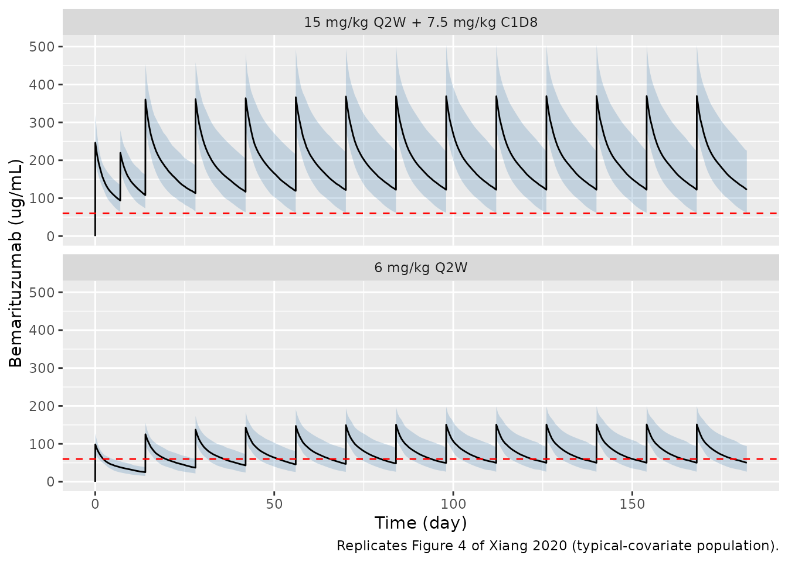

# Bemarituzumab (Xiang 2020)

## Model and source

- Citation: Xiang H, Liu L, Gao Y, Ahene A, Macal M, Hsu AW, Dreiling L,
  Collins H. Population pharmacokinetic analysis of phase 1
  bemarituzumab data to support phase 2 gastroesophageal adenocarcinoma
  FIGHT trial. Cancer Chemother Pharmacol. 2020;86(5):595-606.
  <doi:10.1007/s00280-020-04139-4>
- Description: Two-compartment population PK model with parallel linear
  and Michaelis-Menten elimination for bemarituzumab (anti-FGFR2b
  antibody) in adults with advanced solid tumours including gastric and
  gastroesophageal junction adenocarcinoma (Xiang 2020)
- Article: <https://doi.org/10.1007/s00280-020-04139-4> (open access;
  PMC7561547)

Bemarituzumab (FPA144) is a humanized, afucosylated IgG1 antibody
against fibroblast growth factor receptor 2b (FGFR2b). Xiang 2020 fitted
the phase 1 study FPA144-001 with a two-compartment model with parallel
linear and Michaelis-Menten elimination from the central compartment
(Equations 1-2). Body weight (on CL and Vc), serum albumin (on CL) and
sex (on Vc) were retained as covariates (Equations 3-4, Table 2). IIV is
exponential on CL, Vc, Vp and Vmax with a CL-Vc covariance, and the
residual error is proportional. The model was used to choose the FIGHT
trial regimen of 15 mg/kg Q2W with an extra 7.5 mg/kg dose on Cycle 1
Day 8, targeting a trough of at least 60 ug/mL.

## Population

814 serum concentrations from 75 patients (Table 1): 53 with gastric or
gastroesophageal junction adenocarcinoma (GEA) and 22 with other solid
tumours. Median age 58 years (25-86), median weight 61.4 kg (35.5-148),
56% female, 58.7% Asian and 38.7% White, median albumin 3.7 g/dL
(1.9-4.6). Twenty-seven patients received 0.3-15 mg/kg Q2W in dose
escalation and 48 received 15 mg/kg Q2W, all as 30-min IV infusions. No
patient developed post-dose anti-drug antibodies. The same information
is available programmatically via
`readModelDb("Xiang_2020_bemarituzumab")()$population`.

## Source trace

| Model element | Value | Source |
|----|----|----|
| Structure: 2-cmt, linear + Michaelis-Menten elimination from central | – | Methods, Equations 1-2 |
| `lcl` (CL) | 0.331 L/day | Table 2; Results text |
| `lvc` (Vc) | 3.70 L | Table 2; Results text |
| `lq` (Q) | 0.788 L/day | Table 2; Results text |
| `lvp` (Vp) | 2.05 L | Table 2; Results text |
| `lvmax` (Vmax) | 1.70 ug/day = 0.0017 mg/day | Table 2; Results text (see “Units of Vmax”) |
| `lkm` (Km) | 4.58 ug/mL | Table 2; Results text |
| `e_wt_cl` | 0.601 | Table 2; Equation 3 (theta7), reference 61 kg |
| `e_alb_cl` | -0.776 | Table 2; Equation 3 (theta9), reference 3.7 g/dL |
| `e_wt_vc` | 0.303 | Table 2; Equation 4 (theta8), reference 61 kg |
| `e_sexf_vc` | -0.191 | Table 2; Equation 4 (theta10 \* female) |
| `etalcl`, `etalvc` variances | 0.271^2, 0.173^2 | Table 2, 27.1 and 17.3 |
| CL-Vc covariance | 0.0141 | Table 2 |
| `etalvp` variance | 0.600^2 | Table 2, 60.0 |
| `etalvmax` variance | 1.28^2 | Table 2, 128 |
| `propSd` | 0.145 | Table 2, residual variability 14.5 %CV |

``` r

mod <- readModelDb("Xiang_2020_bemarituzumab")
ui <- rxode2::rxode(mod)
#> ℹ parameter labels from comments will be replaced by 'label()'
# The explicit ODEs must be used; a cl/vc pair must not trigger auto-solving.
stopifnot(is.null(ui$linCmt) || isFALSE(ui$linCmt))
mod_typ <- rxode2::zeroRe(ui)

# Typical patient used throughout the paper's simulations and Fig. 2:
# 61 kg male with albumin 3.7 g/dL (37 g/L in the canonical column).
typ_cov <- c(WT = 61, ALB = 37, SEXF = 0)
```

### Form of the covariate equations

Equations 3 and 4 as typeset read
`exp(theta1 + theta7 * (Weight/61) + theta9 * (ALB/3.7) + eta)`,
i.e. with no logarithm on the normalised covariate. Read literally, the
reference patient would not have the tabulated CL of 0.331 L/day but
`0.331 * exp(0.601 - 0.776)`, and weight would act exponentially rather
than as the power function the exponent sizes (0.601, 0.303) imply. The
successor analysis by the same group (Xiang 2021, Cancer Chemother
Pharmacol 88:899-910, Equation 5) states the power form
`exp(theta + k * ln(Cov/Covpop) + eta)` explicitly. The model therefore
uses `log(WT/61)` and `log(ALB/3.7)`.

The paper’s own typical steady-state trough discriminates the two
readings: the Fig. 2 legend and Results give 123.8 ug/mL for a 61 kg
male with albumin 3.7 g/dL after 6 months of 15 mg/kg Q2W.

### Units of Vmax

Table 2 and the Results text print Vmax as 1.70 **ug**/day. Doses are in
mg and Km is 4.58 ug/mL (= mg/L), so a Vmax of 1.70 ug/day makes the
nonlinear pathway quantitatively negligible (Vmax/Km of about 0.4 mL/day
against a linear CL of 331 mL/day), which sits oddly with the Results’
remark that clearance was nonlinear between 0.3 and 1 mg/kg. The
alternative is a mislabelled mg/day. Both the typical trough and the
Fig. 2 sex effect were used to decide.

``` r

ctrough_ss <- function(m, cov, vmax_mg_day = NULL, log_form = TRUE) {
  p <- cov
  if (!is.null(vmax_mg_day)) p <- c(p, lvmax = log(vmax_mg_day))
  if (!log_form) {
    # Literal reading of Equations 3-4 at the reference covariates:
    # CL = 0.331 * exp(0.601 + (-0.776)), Vc = 3.70 * exp(0.303 - 0.191 * SEXF).
    p <- c(p,
      lcl = log(0.331) + 0.601 - 0.776,
      lvc = log(3.70) + 0.303
    )
  }
  ev <- rxode2::et(
    amt = 15 * cov[["WT"]], dur = 0.5 / 24, ii = 14, addl = 12,
    cmt = "central"
  ) |>
    rxode2::et(14 * 13, cmt = "central")
  s <- rxode2::rxSolve(m, ev, params = p, returnType = "data.frame")
  s$Cc[s$time == 14 * 13]
}

readings <- tibble::tribble(
  ~reading, ~vmax, ~log_form,
  "power form, Vmax 1.70 ug/day (model)", 0.0017, TRUE,
  "power form, Vmax 1.70 mg/day", 1.70, TRUE,
  "literal form, Vmax 1.70 ug/day", 0.0017, FALSE,
  "literal form, Vmax 1.70 mg/day", 1.70, FALSE
)
readings$ctrough_male <- mapply(
  function(v, f) ctrough_ss(mod_typ, typ_cov, v, f), readings$vmax, readings$log_form
)
#> ℹ omega/sigma items treated as zero: 'etalcl', 'etalvc', 'etalvp', 'etalvmax'
#> ℹ omega/sigma items treated as zero: 'etalcl', 'etalvc', 'etalvp', 'etalvmax'
#> ℹ omega/sigma items treated as zero: 'etalcl', 'etalvc', 'etalvp', 'etalvmax'
#> ℹ omega/sigma items treated as zero: 'etalcl', 'etalvc', 'etalvp', 'etalvmax'
readings$female_pct <- mapply(
  function(v, f) {
    100 * (ctrough_ss(mod_typ, replace(typ_cov, "SEXF", 1), v, f) /
      ctrough_ss(mod_typ, typ_cov, v, f) - 1)
  },
  readings$vmax, readings$log_form
)
#> ℹ omega/sigma items treated as zero: 'etalcl', 'etalvc', 'etalvp', 'etalvmax'
#> ℹ omega/sigma items treated as zero: 'etalcl', 'etalvc', 'etalvp', 'etalvmax'
#> ℹ omega/sigma items treated as zero: 'etalcl', 'etalvc', 'etalvp', 'etalvmax'
#> ℹ omega/sigma items treated as zero: 'etalcl', 'etalvc', 'etalvp', 'etalvmax'
#> ℹ omega/sigma items treated as zero: 'etalcl', 'etalvc', 'etalvp', 'etalvmax'
#> ℹ omega/sigma items treated as zero: 'etalcl', 'etalvc', 'etalvp', 'etalvmax'
#> ℹ omega/sigma items treated as zero: 'etalcl', 'etalvc', 'etalvp', 'etalvmax'
#> ℹ omega/sigma items treated as zero: 'etalcl', 'etalvc', 'etalvp', 'etalvmax'
readings |>
  dplyr::select(-vmax, -log_form) |>
  dplyr::rename(
    "Reading" = reading,
    "Typical Ctrough,ss (ug/mL); paper 123.8" = ctrough_male,
    "Female vs male Ctrough,ss (%); paper -6.2" = female_pct
  ) |>
  knitr::kable(digits = 2)
```

| Reading | Typical Ctrough,ss (ug/mL); paper 123.8 | Female vs male Ctrough,ss (%); paper -6.2 |
|:---|---:|---:|
| power form, Vmax 1.70 ug/day (model) | 123.82 | -6.17 |
| power form, Vmax 1.70 mg/day | 118.83 | -6.42 |
| literal form, Vmax 1.70 ug/day | 171.98 | -4.66 |
| literal form, Vmax 1.70 mg/day | 166.00 | -4.83 |

``` r


# Deterministic typical-value solves: tight bounds are correct.
stopifnot(
  abs(readings$ctrough_male[1] - 123.8) < 0.1,
  abs(readings$female_pct[1] - (-6.2)) < 0.05,
  # The rejected readings miss by far more than the rounding of the published values.
  abs(readings$ctrough_male[2] - 123.8) > 4,
  abs(readings$female_pct[2] - (-6.2)) > 0.15,
  all(abs(readings$ctrough_male[3:4] - 123.8) > 40)
)
```

Only the power form with Vmax taken at its printed unit (ug/day)
reproduces both published numbers: 123.8 ug/mL to four significant
figures and the -6.2% female effect. The model therefore keeps Vmax at
1.70 ug/day (0.0017 mg/day in the model’s mg units), as printed. In
practice this makes the model behave as a linear two-compartment model
at every dose level simulated here.

### Reading the IIV column

Table 2 prints the four IIV diagonals as percentages and the CL-Vc
off-diagonal as a bare covariance (0.0141). A covariance has no CV form
and can only be on the raw OMEGA scale, so the diagonals are read the
same way, as 100 \* sqrt(OMEGA): variance = (percent/100)^2. The implied
CL-Vc correlation is `0.0141 / (0.271 * 0.173)` = 0.301. Reading the
percentages as exact log-normal CVs instead would change the CL and Vc
variances by less than 4% and the (inconsequential) Vmax variance from
1.64 to 0.97.

## Virtual cohort

The paper’s Fig. 4 simulations fix the covariates at the typical patient
(61 kg male, albumin 3.7 g/dL) and draw only the random effects. The
cohort below does the same, with 200 subjects per regimen.

``` r

n_sub <- 200
rxode2::rxSetSeed(20200923)

regimen_events <- function(label, doses, id_offset) {
  # doses: data frame of day and mg/kg
  do.call(rbind, lapply(seq_len(n_sub), function(i) {
    obs <- data.frame(
      time = sort(unique(c(seq(0, 182, by = 0.5), doses$day + 0.5 / 24, trough_days))),
      amt = 0, evid = 0, dur = 0
    )
    dos <- data.frame(time = doses$day, amt = doses$mgkg * 61, evid = 1, dur = 0.5 / 24)
    d <- rbind(dos, obs)
    d$id <- id_offset + i
    d$regimen <- label
    d
  }))
}
q2w_days <- seq(0, 168, by = 14)
# Troughs are sampled just before the Day-15 and Day-169 doses.
trough_days <- c(14, 168) - 1e-3
ev_6 <- regimen_events("6 mg/kg Q2W", data.frame(day = q2w_days, mgkg = 6), 0)
ev_15 <- regimen_events(
  "15 mg/kg Q2W + 7.5 mg/kg C1D8",
  data.frame(day = sort(c(q2w_days, 7)), mgkg = c(15, 7.5, rep(15, length(q2w_days) - 1))),
  n_sub
)
events <- rbind(ev_6, ev_15) |>
  dplyr::mutate(cmt = "central", WT = 61, ALB = 37, SEXF = 0) |>
  dplyr::arrange(id, time, dplyr::desc(evid))
stopifnot(length(unique(events$id)) == 2 * n_sub)
```

## Simulation

``` r

sim <- rxode2::rxSolve(ui, events, keep = "regimen", returnType = "data.frame") |>
  dplyr::filter(!is.na(Cc))
```

## Replicate published figures

### Figure 4 - FIGHT phase 1 regimens

Replicates Figure 4 of Xiang 2020: median and 5th/95th percentiles of
the simulated concentration for a typical 61 kg male with albumin 3.7
g/dL, against the 60 ug/mL empirical trough target.

``` r

fig4 <- sim |>
  dplyr::group_by(regimen, time) |>
  dplyr::summarise(
    p05 = quantile(Cc, 0.05), p50 = median(Cc), p95 = quantile(Cc, 0.95),
    .groups = "drop"
  )
ggplot(fig4, aes(time, p50)) +
  geom_ribbon(aes(ymin = p05, ymax = p95), fill = "steelblue", alpha = 0.25) +
  geom_line() +
  geom_hline(yintercept = 60, linetype = "dashed", colour = "red") +
  facet_wrap(~regimen, ncol = 1) +
  labs(
    x = "Time (day)", y = "Bemarituzumab (ug/mL)",
    caption = "Replicates Figure 4 of Xiang 2020 (typical-covariate population)."
  )
```



The paper reports that with the 15 mg/kg + 7.5 mg/kg C1D8 regimen 98% of
patients reach the 60 ug/mL trough by Day 15 and 96% maintain it at
steady state.

``` r

troughs <- sim |>
  dplyr::filter(regimen == "15 mg/kg Q2W + 7.5 mg/kg C1D8", time %in% trough_days) |>
  dplyr::group_by(time) |>
  dplyr::summarise(
    median_trough = median(Cc),
    pct_at_or_above_60 = 100 * mean(Cc >= 60),
    .groups = "drop"
  )
knitr::kable(troughs, digits = 1)
```

| time | median_trough | pct_at_or_above_60 |
|-----:|--------------:|-------------------:|
|   14 |         108.0 |               99.5 |
|  168 |         122.2 |               95.5 |

``` r


# Target attainment is a threshold-crossing percentage in the tail, so it is
# not reproducible draw-for-draw across rxode2 builds. Gate on the centre (the
# typical Day-15 trough is well above target) and keep the attainment check
# loose enough for any 200-subject cohort.
typ15 <- rxode2::rxSolve(
  mod_typ, events[events$id == n_sub + 1, ],
  returnType = "data.frame"
)
#> ℹ omega/sigma items treated as zero: 'etalcl', 'etalvc', 'etalvp', 'etalvmax'
typ_day15 <- typ15$Cc[typ15$time == trough_days[1]]
stopifnot(
  abs(median(troughs$median_trough[troughs$time == trough_days[1]]) / typ_day15 - 1) < 0.1,
  all(troughs$pct_at_or_above_60 > 85)
)
```

## PKNCA validation

The paper reports no NCA table. It reports a linear-clearance half-life
of 12.8 days and a typical CL of 0.331 L/day. NCA on typical-value
single doses at 0.3 mg/kg (the lowest dose tested) and 15 mg/kg recovers
both, and shows that the dose-normalised exposure is the same across the
dose range, as expected from the negligible Vmax.

``` r

grid_nca <- sort(unique(c(0, 0.5 / 24, seq(0.05, 2, by = 0.05), seq(2, 200, by = 1))))
typical_profile <- function(mg_per_kg) {
  label <- sprintf("%g mg/kg", mg_per_kg)
  ev <- rxode2::et(amt = mg_per_kg * 61, dur = 0.5 / 24, cmt = "central") |>
    rxode2::et(grid_nca, cmt = "central")
  rxode2::rxSolve(mod_typ, ev, params = typ_cov, returnType = "data.frame") |>
    dplyr::filter(!is.na(Cc)) |>
    dplyr::mutate(id = 1L, treatment = label, amt = mg_per_kg * 61)
}
typ <- dplyr::bind_rows(typical_profile(0.3), typical_profile(15))
#> ℹ omega/sigma items treated as zero: 'etalcl', 'etalvc', 'etalvp', 'etalvmax'
#> ℹ omega/sigma items treated as zero: 'etalcl', 'etalvc', 'etalvp', 'etalvmax'
typ_conc <- typ |> dplyr::select(id, time, Cc, treatment)
stopifnot(all(tapply(typ_conc$time, typ_conc$treatment, min) == 0))
typ_dose <- typ |>
  dplyr::distinct(id, treatment, amt) |>
  dplyr::mutate(time = 0, duration = 0.5 / 24)

nca_res <- PKNCA::pk.nca(PKNCA::PKNCAdata(
  PKNCA::PKNCAconc(typ_conc, Cc ~ time | treatment + id),
  PKNCA::PKNCAdose(typ_dose, amt ~ time | treatment + id, duration = "duration"),
  intervals = data.frame(
    start = 0, end = Inf,
    cmax = TRUE, aucinf.obs = TRUE, half.life = TRUE, cl.obs = TRUE
  )
))

published <- tibble::tribble(
  ~treatment, ~cl.obs, ~half.life,
  "0.3 mg/kg", 0.331, 12.8,
  "15 mg/kg", 0.331, 12.8
)
nlmixr2lib::ncaComparisonTable(
  simulated = nca_res,
  reference = published,
  by = "treatment",
  units = c(cl.obs = "L/day", half.life = "day"),
  tolerance_pct = 20
) |>
  knitr::kable(caption = "Typical-value NCA vs published CL and linear-clearance half-life. * differs by >20%.")
```

| NCA parameter | treatment | Reference | Simulated | % diff |
|:--------------|:----------|:----------|:----------|:-------|
| t½ (day)      | 0.3 mg/kg | 12.8      | 12.7      | -0.8%  |
| t½ (day)      | 15 mg/kg  | 12.8      | 12.7      | -0.8%  |
| CL/F (L/day)  | 0.3 mg/kg | 0.331     | 0.331     | +0.0%  |
| CL/F (L/day)  | 15 mg/kg  | 0.331     | 0.331     | -0.0%  |

Typical-value NCA vs published CL and linear-clearance half-life. \*
differs by \>20%. {.table}

``` r


res <- as.data.frame(nca_res$result)
get_par <- function(par, grp) {
  v <- res$PPORRES[res$PPTESTCD == par & res$treatment == grp]
  if (length(v) != 1L) stop("no unique ", par, " for ", grp)
  v
}
cl_nca <- vapply(c("0.3 mg/kg", "15 mg/kg"), function(g) get_par("cl.obs", g), numeric(1))
th_nca <- vapply(c("0.3 mg/kg", "15 mg/kg"), function(g) get_par("half.life", g), numeric(1))
cl_nca
#> 0.3 mg/kg  15 mg/kg 
#> 0.3311380 0.3308976
th_nca
#> 0.3 mg/kg  15 mg/kg 
#>  12.69627  12.69946
# Deterministic solves. Vmax/Km adds ~0.4 mL/day, so NCA CL sits a hair above
# 0.331 at the lowest dose and at 0.331 at 15 mg/kg.
stopifnot(
  all(abs(cl_nca / 0.331 - 1) < 0.01),
  all(abs(th_nca / 12.8 - 1) < 0.05),
  abs(diff(cl_nca)) / mean(cl_nca) < 0.01
)
```

## Assumptions and deviations

- **Covariate equation form.** Equations 3-4 are typeset without `ln()`;
  the power form `(WT/61)^0.601`, `(ALB/3.7)^-0.776`, `(WT/61)^0.303` is
  used, as stated explicitly by the same group’s successor analysis
  (Xiang 2021) and confirmed by reproducing the paper’s typical
  Ctrough,ss of 123.8 ug/mL (the literal form gives about 172 ug/mL).
- **Vmax units.** Vmax is kept at its printed 1.70 ug/day. This
  reproduces the typical Ctrough,ss and the Fig. 2 female effect;
  reading it as mg/day does not. The consequence is that the
  Michaelis-Menten pathway contributes essentially nothing at any
  clinical dose, even though the paper describes dose-dependent
  clearance between 0.3 and 1 mg/kg in the raw data.
- **IIV scale.** Percent IIV values are read as 100 \* sqrt(OMEGA)
  because the CL-Vc covariance is printed on the raw OMEGA scale; the
  paper does not define the convention.
- **No IIV on Q.** Table 2 lists IIV on Vmax, CL, Vc and Vp only.
- **Albumin units.** The canonical `ALB` column is in g/L; the model
  converts it to g/dL internally because the coefficient is centred on
  3.7 g/dL.
- **Sex coding.** Equation 4’s `female` indicator maps directly to
  `SEXF`.
- **Residual error.** “Residual variability (%CV) 14.5” is encoded as a
  proportional error with SD 0.145.
