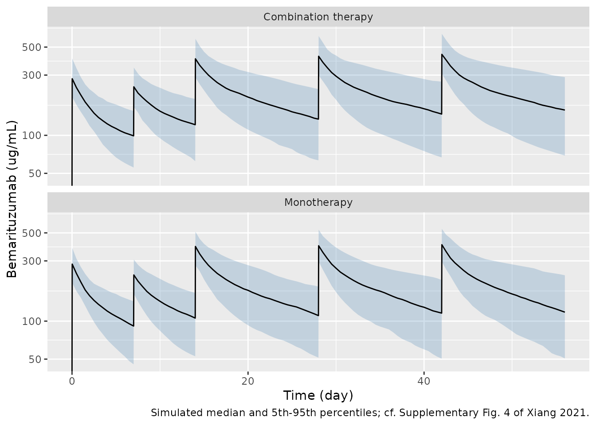
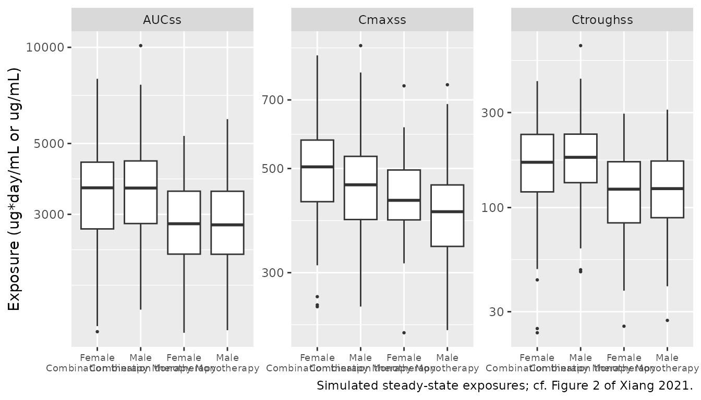

# Bemarituzumab (Xiang 2021)

## Model and source

- Citation: Xiang H, Liu L, Gao Y, Ahene A, Collins H. Covariate effects
  and population pharmacokinetic analysis of the anti-FGFR2b antibody
  bemarituzumab in patients from phase 1 to phase 2 trials. Cancer
  Chemother Pharmacol. 2021;88(5):899-910.
  <doi:10.1007/s00280-021-04333-y>
- Description: Two-compartment population PK model with parallel linear
  and Michaelis-Menten elimination for bemarituzumab (anti-FGFR2b
  antibody) in adults with advanced solid tumours, mainly gastric and
  gastroesophageal junction adenocarcinoma, given as monotherapy or with
  mFOLFOX6 (Xiang 2021)
- Article: <https://doi.org/10.1007/s00280-021-04333-y> (open access;
  PMC8484135)

Bemarituzumab (FPA144) is a humanized, afucosylated IgG1 antibody
against fibroblast growth factor receptor 2b (FGFR2b). Xiang 2021 pooled
the phase 1 studies FPA144-001 and FPA144-002 (monotherapy) with the
phase 1 and phase 2 parts of FPA144-004 (FIGHT; bemarituzumab plus
mFOLFOX6) and fitted a two-compartment model with parallel linear and
Michaelis-Menten elimination from the central compartment (Equations
1-2). Body weight (on CL and Vc), albumin and combination therapy/study
(on CL) and sex (on Vc) were retained (Equations 7-8, Table 2). IIV is
exponential on CL, Vc, Vp and Vmax with a CL-Vc covariance, and the
residual error is additive on log-transformed concentrations (Equation
4).

This is the successor to the phase 1 analysis of Xiang 2020
(<doi:10.1007/s00280-020-04139-4>), which fitted FPA144-001 alone.

## Population

1552 serum concentrations from 173 patients (Table 1): 79 in FPA144-001,
6 in FPA144-002 (Japanese patients) and 88 in FPA144-004 (12 in phase 1,
76 in phase 2). Median age 60 years (23-86), median weight 63.9 kg
(35.5-148), 34.7% female, 56.1% Asian and 40.5% White, median albumin
38.0 g/L (19.0-50.2). Tumours were gastric (68.8%), gastroesophageal
junction (9.25%) or other (22.0%). Doses ranged from 0.3 to 15 mg/kg Q2W
as 30-min IV infusions; most patients received 15 mg/kg Q2W, and FIGHT
patients an extra 7.5 mg/kg on Cycle 1 Day 8. 85 patients received
monotherapy and 88 received bemarituzumab with mFOLFOX6. No patient
developed anti-drug antibodies. The same information is available
programmatically via
`readModelDb("Xiang_2021_bemarituzumab")()$population`.

## Source trace

| Model element | Value | Source |
|----|----|----|
| Structure: 2-cmt, linear + Michaelis-Menten elimination from central | – | Methods, Equations 1-2 |
| Covariate forms: power for continuous, exponential shift for categorical | – | Equations 5-6 |
| `lcl` (CL) | 0.311 L/day | Table 2; Results text; Equation 7 (`exp(-4.35)` L/h) |
| `lvc` (Vc) | 3.58 L | Table 2; Results text; Equation 8 |
| `lq` (Q) | 0.952 L/day | Table 2; Results text |
| `lvp` (Vp) | 2.71 L | Table 2; Results text |
| `lvmax` (Vmax) | 2.80 mg/day | Table 2 (printed as ug/day; see “Units of Vmax”) |
| `lkm` (Km) | 4.45 ug/mL | Table 2; Results text |
| `e_wt_cl` | 0.695, reference 64 kg | Table 2 (theta7); Equation 7 |
| `e_alb_cl` | -0.657, reference 38 g/L | Table 2 (theta9); Equation 7 |
| `e_conmed_chemo_cl` | -0.200 | Table 2 (theta10); Equation 7 |
| `e_wt_vc` | 0.369, reference 64 kg | Table 2 (theta8); Equation 8 |
| `e_sexf_vc` | -0.164 | Table 2 (theta11); Equation 8 |
| `etalcl`, `etalvc` variances | 0.0854, 0.0221 | Results text; Table 2 (29.2%, 14.9%) |
| CL-Vc covariance | 0.0128 | Table 2 |
| `etalvp` variance | 0.604^2 | Table 2, 60.4% |
| `etalvmax` variance | 0.974^2 | Table 2, 97.4% |
| `expSd` | 0.146 | Table 2, residual variability 14.6%; Equation 4 |

``` r

mod <- readModelDb("Xiang_2021_bemarituzumab")
ui <- rxode2::rxode(mod)
#> ℹ parameter labels from comments will be replaced by 'label()'
# The explicit ODEs must be used; a cl/vc pair must not trigger auto-solving.
stopifnot(is.null(ui$linCmt) || isFALSE(ui$linCmt))
mod_typ <- rxode2::zeroRe(ui)

# Reference patient of the paper's sensitivity analysis (Methods): a 64 kg
# male on monotherapy with albumin 38 g/L.
ref_cov <- c(WT = 64, ALB = 38, SEXF = 0, CONMED_CHEMO = 0)
```

### Covariate arithmetic stated in the Results

The Results translate each coefficient into a percentage change. Those
statements check the equation forms and the reference values directly.

``` r

th <- ui$theta
cl_of <- function(WT = 64, ALB = 38, CHEMO = 0) {
  exp(th[["lcl"]] + th[["e_wt_cl"]] * log(WT / 64) + th[["e_alb_cl"]] * log(ALB / 38) +
    th[["e_conmed_chemo_cl"]] * CHEMO)
}
vc_of <- function(WT = 64, SEXF = 0) {
  exp(th[["lvc"]] + th[["e_wt_vc"]] * log(WT / 64) + th[["e_sexf_vc"]] * SEXF)
}
arith <- tibble::tribble(
  ~statement, ~paper, ~model,
  "CL, 10% lower weight (L/day)", 0.289, cl_of(WT = 57.6),
  "CL change, 10% lower weight (%)", -7.06, 100 * (cl_of(WT = 57.6) / cl_of() - 1),
  "Vc, 10% lower weight (L)", 3.45, vc_of(WT = 57.6),
  "Vc change, 10% lower weight (%)", -3.81, 100 * (vc_of(WT = 57.6) / vc_of() - 1),
  "CL, 10% lower albumin (L/day)", 0.333, cl_of(ALB = 34.2),
  "CL change, 10% lower albumin (%)", 7.17, 100 * (cl_of(ALB = 34.2) / cl_of() - 1),
  "Vc change, female vs male (%)", -15.1, 100 * (vc_of(SEXF = 1) / vc_of() - 1),
  "CL change, combination vs monotherapy (%)", -18.1, 100 * (cl_of(CHEMO = 1) / cl_of() - 1),
  "Equation 7 intercept exp(-4.35) x 24 (L/day)", 0.311, exp(-4.35) * 24
)
arith |>
  dplyr::rename("Results statement" = statement, "Paper" = paper, "Model" = model) |>
  knitr::kable(digits = 3)
```

| Results statement                            |   Paper |   Model |
|:---------------------------------------------|--------:|--------:|
| CL, 10% lower weight (L/day)                 |   0.289 |   0.289 |
| CL change, 10% lower weight (%)              |  -7.060 |  -7.061 |
| Vc, 10% lower weight (L)                     |   3.450 |   3.443 |
| Vc change, 10% lower weight (%)              |  -3.810 |  -3.813 |
| CL, 10% lower albumin (L/day)                |   0.333 |   0.333 |
| CL change, 10% lower albumin (%)             |   7.170 |   7.167 |
| Vc change, female vs male (%)                | -15.100 | -15.126 |
| CL change, combination vs monotherapy (%)    | -18.100 | -18.127 |
| Equation 7 intercept exp(-4.35) x 24 (L/day) |   0.311 |   0.310 |

``` r


# Deterministic arithmetic: the tolerance is the rounding of the printed values.
# The Vc of 3.45 L for a 57.6 kg patient sits 0.006 L above 3.58 * 0.9^0.369 =
# 3.444 L, i.e. the paper rounded up or started from exp(1.28) = 3.60 L; the
# -3.81% statement on the next line is exact.
stopifnot(
  abs(arith$model[c(1, 5)] - arith$paper[c(1, 5)]) < 0.0015,
  abs(arith$model[3] - arith$paper[3]) < 0.01,
  abs(arith$model[c(2, 4, 6, 7, 8)] - arith$paper[c(2, 4, 6, 7, 8)]) < 0.06,
  abs(arith$model[9] - arith$paper[9]) < 0.002
)
```

All eight statements are reproduced to the printed precision, which
confirms the power form `(WT/64)^0.695`, `(ALB/38)^-0.657`,
`(WT/64)^0.369` and the exponential shifts `exp(-0.200)` and
`exp(-0.164)`. The Equation 7 intercept (L/h) is the rounded logarithm
of the Table 2 CL (0.3098 vs 0.311 L/day); the model uses the Table 2
value.

### Linear-clearance half-life

The Results give a linear-clearance half-life of 14.9 days. It is the
terminal half-life of the two-compartment disposition with the
Michaelis-Menten pathway removed, so it checks CL, Vc, Q and Vp
together.

``` r

k10 <- exp(th[["lcl"]] - th[["lvc"]])
k12 <- exp(th[["lq"]] - th[["lvc"]])
k21 <- exp(th[["lq"]] - th[["lvp"]])
s <- k10 + k12 + k21
beta <- (s - sqrt(s^2 - 4 * k10 * k21)) / 2
t_half_linear <- log(2) / beta
t_half_linear
#> [1] 14.93818
stopifnot(abs(t_half_linear - 14.9) < 0.05)
```

### Units of Vmax

Table 2 and the Results print Vmax as 2.80 **ug**/day. Doses are in mg
and Km is 4.45 ug/mL (= mg/L), so with a Vmax of 2.80 ug/day the
Michaelis-Menten pathway could remove at most 0.04 mg per 14-day cycle,
against about 960 mg removed by linear clearance. That pathway would
then be unidentifiable, which is inconsistent with the paper keeping it
in the final model with a precisely estimated Vmax (RSE 4.13%) and 97.4%
IIV, and with the Discussion’s statement that clearance is nonlinear
across the 0.3-15 mg/kg dose-escalation range. The model therefore reads
the value as 2.80 mg/day.

The paper’s own typical-patient simulation discriminates the two
readings. Supplementary Fig. 5 (the sensitivity tornado plots) prints
the reference exposures of the 64 kg male on monotherapy with albumin 38
g/L after 15 mg/kg Q2W plus 7.5 mg/kg on Cycle 1 Day 8 for one year:
AUCss 2618.8 ug\*day/mL, Cmax,ss 380.3 ug/mL and Ctrough,ss 113.5 ug/mL.

``` r

# One year of 15 mg/kg Q2W with an extra 7.5 mg/kg on Cycle 1 Day 8, as 30-min
# infusions; the steady-state interval is the last one, days 350-364.
dose_days <- sort(c(seq(0, 350, by = 14), 7))
ss_grid <- sort(unique(c(seq(350, 364, by = 0.05), 350 + 0.5 / 24)))
typical_ss <- function(cov, lvmax = NULL, grid = ss_grid) {
  p <- cov
  if (!is.null(lvmax)) p <- c(p, lvmax = lvmax)
  ev <- rxode2::et(
    time = dose_days, amt = ifelse(dose_days == 7, 7.5, 15) * cov[["WT"]],
    dur = 0.5 / 24, cmt = "central"
  ) |>
    rxode2::et(grid, cmt = "central")
  rxode2::rxSolve(mod_typ, ev,
    params = p, returnType = "data.frame",
    atol = 1e-10, rtol = 1e-10, maxsteps = 1e6
  )
}
ss_metrics <- function(s) {
  s <- s[s$time >= 350, ]
  c(
    AUC = sum(diff(s$time) * (head(s$Cc, -1) + tail(s$Cc, -1)) / 2),
    Cmax = max(s$Cc),
    Ctrough = s$Cc[s$time == 364]
  )
}
```

``` r

tornado_ref <- c(AUC = 2618.8, Cmax = 380.3, Ctrough = 113.5)
readings <- rbind(
  "Vmax 2.80 mg/day (model)" = ss_metrics(typical_ss(ref_cov)),
  "Vmax 2.80 ug/day (as labelled)" = ss_metrics(typical_ss(ref_cov, lvmax = log(0.0028)))
)
#> ℹ omega/sigma items treated as zero: 'etalcl', 'etalvc', 'etalvp', 'etalvmax'
#> ℹ omega/sigma items treated as zero: 'etalcl', 'etalvc', 'etalvp', 'etalvmax'
pct_vs_paper <- sweep(readings, 2, tornado_ref, function(x, y) 100 * (x / y - 1))
cbind(as.data.frame(readings), as.data.frame(pct_vs_paper)) |>
  setNames(c("AUCss", "Cmax,ss", "Ctrough,ss", "AUCss vs paper (%)", "Cmax,ss vs paper (%)", "Ctrough,ss vs paper (%)")) |>
  knitr::kable(digits = 1, caption = "Typical-patient steady-state exposure vs Supplementary Fig. 5 (2618.8, 380.3, 113.5).")
```

|  | AUCss | Cmax,ss | Ctrough,ss | AUCss vs paper (%) | Cmax,ss vs paper (%) | Ctrough,ss vs paper (%) |
|:---|---:|---:|---:|---:|---:|---:|
| Vmax 2.80 mg/day (model) | 2963.6 | 404.5 | 137.5 | 13.2 | 6.4 | 21.1 |
| Vmax 2.80 ug/day (as labelled) | 3086.7 | 413.3 | 146.3 | 17.9 | 8.7 | 28.9 |

Typical-patient steady-state exposure vs Supplementary Fig. 5 (2618.8,
380.3, 113.5). {.table}

``` r


# Deterministic solves. Both readings overshoot the published reference, the
# mg/day reading by less on every metric.
stopifnot(
  all(abs(pct_vs_paper[1, ]) < abs(pct_vs_paper[2, ])),
  all(pct_vs_paper[1, ] > 0 & pct_vs_paper[1, ] < 25),
  all(pct_vs_paper[2, ] > 5)
)
```

The mg/day reading is the closer of the two on all three metrics, but it
still overshoots the published reference: by 13.2% (AUCss), 6.4%
(Cmax,ss) and 21.1% (Ctrough,ss). The paper’s reference AUCss implies a
total steady-state clearance of 960 mg / 2618.8 = 0.367 L/day, about
0.056 L/day more than the linear CL of 0.311 L/day, whereas a 2.80
mg/day Michaelis-Menten pathway adds only about 0.015 L/day at those
concentrations. The maintainers found no value of Vmax that reproduces
every bar of the tornado plots: a Vmax near 10.7 mg/day reproduces the
reference values and the body-weight bars, but not the albumin and
therapy bars (next section). The printed Vmax is therefore kept, and the
discrepancy is recorded here rather than tuned away.

### Sensitivity analysis (Supplementary Fig. 5)

Replicates the tornado plots of Supplementary Fig. 5: the change in each
steady-state exposure of the reference patient when one covariate moves
to its 10th/90th percentile in the GEA population (45/79 kg, 30/44 g/L)
or to the other category.

``` r

scenarios <- list(
  "Weight 45 kg" = c(WT = 45),
  "Weight 79 kg" = c(WT = 79),
  "Albumin 30 g/L" = c(ALB = 30),
  "Albumin 44 g/L" = c(ALB = 44),
  "Combination therapy" = c(CONMED_CHEMO = 1),
  "Female" = c(SEXF = 1)
)
paper_pct <- rbind(
  "Weight 45 kg" = c(-16.8, -18.0, -13.4),
  "Weight 79 kg" = c(10.4, 12.1, 7.0),
  "Albumin 30 g/L" = c(-12.7, -5.7, -18.9),
  "Albumin 44 g/L" = c(8.7, 3.9, 13.2),
  "Combination therapy" = c(18.8, 8.6, 28.6),
  "Female" = c(0.9, 11.3, -3.8)
)
base <- readings[1, ]
model_pct <- t(vapply(scenarios, function(sc) {
  cov <- ref_cov
  cov[names(sc)] <- sc
  100 * (ss_metrics(typical_ss(cov)) / base - 1)
}, numeric(3)))
#> ℹ omega/sigma items treated as zero: 'etalcl', 'etalvc', 'etalvp', 'etalvmax'
#> ℹ omega/sigma items treated as zero: 'etalcl', 'etalvc', 'etalvp', 'etalvmax'
#> ℹ omega/sigma items treated as zero: 'etalcl', 'etalvc', 'etalvp', 'etalvmax'
#> ℹ omega/sigma items treated as zero: 'etalcl', 'etalvc', 'etalvp', 'etalvmax'
#> ℹ omega/sigma items treated as zero: 'etalcl', 'etalvc', 'etalvp', 'etalvmax'
#> ℹ omega/sigma items treated as zero: 'etalcl', 'etalvc', 'etalvp', 'etalvmax'
tornado <- data.frame(
  scenario = rownames(model_pct),
  auc_model = model_pct[, 1], auc_paper = paper_pct[, 1],
  cmax_model = model_pct[, 2], cmax_paper = paper_pct[, 2],
  ctr_model = model_pct[, 3], ctr_paper = paper_pct[, 3]
)
tornado |>
  dplyr::rename(
    "Scenario" = scenario,
    "AUCss model (%)" = auc_model, "AUCss paper (%)" = auc_paper,
    "Cmax,ss model (%)" = cmax_model, "Cmax,ss paper (%)" = cmax_paper,
    "Ctrough,ss model (%)" = ctr_model, "Ctrough,ss paper (%)" = ctr_paper
  ) |>
  knitr::kable(digits = 1, row.names = FALSE)
```

| Scenario | AUCss model (%) | AUCss paper (%) | Cmax,ss model (%) | Cmax,ss paper (%) | Ctrough,ss model (%) | Ctrough,ss paper (%) |
|:---|---:|---:|---:|---:|---:|---:|
| Weight 45 kg | -11.7 | -16.8 | -15.3 | -18.0 | -6.4 | -13.4 |
| Weight 79 kg | 7.5 | 10.4 | 10.5 | 12.1 | 3.2 | 7.0 |
| Albumin 30 g/L | -14.4 | -12.7 | -7.0 | -5.7 | -20.4 | -18.9 |
| Albumin 44 g/L | 10.1 | 8.7 | 5.0 | 3.9 | 14.6 | 13.2 |
| Combination therapy | 22.1 | 18.8 | 10.9 | 8.6 | 32.2 | 28.6 |
| Female | 0.0 | 0.9 | 10.2 | 11.3 | -4.4 | -3.8 |

``` r


# Deterministic solves. Every bar points the same way as in the paper wherever
# the paper's bar is larger than 2%, and no bar is off by more than 8
# percentage points (the largest gap is the 45 kg Ctrough bar).
big <- abs(paper_pct) > 2
stopifnot(
  all(sign(model_pct[big]) == sign(paper_pct[big])),
  max(abs(model_pct - paper_pct)) < 8
)
```

Every bar points the same way as in the paper, and the magnitudes agree
to within 7 percentage points. The ranking of the covariates matches for
Cmax,ss (body weight first) and Ctrough,ss (albumin, then therapy, then
body weight) but not for AUCss, where body weight has the longest bar in
the paper but a shorter bar than albumin and therapy in the model.

Two systematic patterns remain. The body-weight bars are smaller in the
model than in the paper, which is what a stronger saturable pathway
would produce. The albumin and therapy bars are larger in the model. For
a covariate acting on CL alone, AUCss changes by `1/(CL ratio) - 1`
whenever the saturable pathway is saturated, e.g. `1/0.819 - 1 = 22.1%`
for combination therapy against the published 18.8%, so no value of Vmax
at a Km of 4.45 ug/mL brings those bars down while also enlarging the
body-weight bars. The published bars cannot all be reproduced by one set
of the printed parameters.

The chunk below shows the alternative explored by the maintainers and
not adopted: raising Vmax to 10.7 mg/day (a factor of 3.8 that
corresponds to no unit conversion) reproduces the reference exposures
and all six body-weight bars, but leaves the albumin and therapy bars as
far off as before.

``` r

lvmax_alt <- log(10.7)
base_alt <- ss_metrics(typical_ss(ref_cov, lvmax = lvmax_alt))
#> ℹ omega/sigma items treated as zero: 'etalcl', 'etalvc', 'etalvp', 'etalvmax'
alt_pct <- t(vapply(scenarios, function(sc) {
  cov <- ref_cov
  cov[names(sc)] <- sc
  100 * (ss_metrics(typical_ss(cov, lvmax = lvmax_alt)) / base_alt - 1)
}, numeric(3)))
#> ℹ omega/sigma items treated as zero: 'etalcl', 'etalvc', 'etalvp', 'etalvmax'
#> ℹ omega/sigma items treated as zero: 'etalcl', 'etalvc', 'etalvp', 'etalvmax'
#> ℹ omega/sigma items treated as zero: 'etalcl', 'etalvc', 'etalvp', 'etalvmax'
#> ℹ omega/sigma items treated as zero: 'etalcl', 'etalvc', 'etalvp', 'etalvmax'
#> ℹ omega/sigma items treated as zero: 'etalcl', 'etalvc', 'etalvp', 'etalvmax'
#> ℹ omega/sigma items treated as zero: 'etalcl', 'etalvc', 'etalvp', 'etalvmax'
alt_gap <- alt_pct - paper_pct
data.frame(
  quantity = c(
    "Reference exposure vs paper (%)", "Largest gap, weight bars (points)",
    "Largest gap, albumin/therapy bars (points)"
  ),
  rbind(
    100 * (base_alt / tornado_ref - 1),
    apply(abs(alt_gap[1:2, ]), 2, max),
    apply(abs(alt_gap[3:5, ]), 2, max)
  )
) |>
  dplyr::rename("Vmax 10.7 mg/day" = quantity, "AUCss" = AUC, "Cmax,ss" = Cmax, "Ctrough,ss" = Ctrough) |>
  knitr::kable(digits = 1, row.names = FALSE)
```

| Vmax 10.7 mg/day                           | AUCss | Cmax,ss | Ctrough,ss |
|:-------------------------------------------|------:|--------:|-----------:|
| Reference exposure vs paper (%)            |  -0.1 |    -0.1 |       -0.6 |
| Largest gap, weight bars (points)          |   0.2 |     0.1 |        0.3 |
| Largest gap, albumin/therapy bars (points) |   3.2 |     1.6 |        5.6 |

``` r


# Deterministic solves.
stopifnot(
  all(abs(base_alt / tornado_ref - 1) < 0.01),
  max(abs(alt_gap[1:2, ])) < 0.6,
  max(abs(alt_gap[3:5, ])) > 1.5
)
```

## Virtual cohort

Two arms of 200 simulated GEA patients, one on monotherapy and one on
combination therapy, each receiving 15 mg/kg Q2W with an extra 7.5 mg/kg
on Cycle 1 Day 8 for one year. Body weight is log-normal around the
Table 1 median of 63.9 kg and albumin normal around 38 g/L, both drawn
again (not clamped) when outside the observed Table 1 range; 34.7% are
female.

``` r

n_per_arm <- 200
rxode2::rxSetSeed(20210812)
set.seed(20210812)

draw_in_range <- function(n, draw, lo, hi) {
  x <- draw(n)
  bad <- x < lo | x > hi
  while (any(bad)) {
    x[bad] <- draw(sum(bad))
    bad <- x < lo | x > hi
  }
  x
}
make_arm <- function(chemo, id_offset) {
  cov <- data.frame(
    id = id_offset + seq_len(n_per_arm),
    WT = draw_in_range(n_per_arm, function(n) exp(rnorm(n, log(63.9), 0.2)), 35.5, 148),
    ALB = draw_in_range(n_per_arm, function(n) rnorm(n, 38, 5), 19, 50.2),
    SEXF = rbinom(n_per_arm, 1, 0.347),
    CONMED_CHEMO = chemo
  )
  obs_times <- sort(unique(c(
    seq(0, 56, by = 0.5), c(0, 7, 14, 28, 42) + 0.5 / 24,
    seq(350, 364, by = 0.25), 350 + 0.5 / 24
  )))
  do.call(rbind, lapply(seq_len(n_per_arm), function(i) {
    dos <- data.frame(
      time = dose_days, amt = ifelse(dose_days == 7, 7.5, 15) * cov$WT[i],
      evid = 1, dur = 0.5 / 24
    )
    obs <- data.frame(time = obs_times, amt = 0, evid = 0, dur = 0)
    d <- rbind(dos, obs)
    cbind(d, cov[rep(i, nrow(d)), ])
  }))
}
events <- dplyr::bind_rows(
  make_arm(0, 0L) |> dplyr::mutate(treatment = "Monotherapy"),
  make_arm(1, n_per_arm) |> dplyr::mutate(treatment = "Combination therapy")
) |>
  dplyr::mutate(cmt = "central") |>
  dplyr::arrange(id, time, dplyr::desc(evid))
stopifnot(length(unique(events$id)) == 2 * n_per_arm)
```

## Simulation

``` r

sim <- rxode2::rxSolve(ui, events, keep = c("treatment", "WT", "SEXF"), returnType = "data.frame") |>
  dplyr::filter(!is.na(Cc))
```

## Replicate published figures

### Concentration-time profiles (cf. Supplementary Fig. 4)

The paper’s pcVPC (Supplementary Fig. 4) covers the first 56 days of the
observed data. The figure below shows the simulated median and 90%
prediction interval over the same window for each arm (no observed data
are available).

``` r

prof <- sim |>
  dplyr::filter(time <= 56) |>
  dplyr::group_by(treatment, time) |>
  dplyr::summarise(
    p05 = quantile(Cc, 0.05), p50 = median(Cc), p95 = quantile(Cc, 0.95),
    .groups = "drop"
  )
ggplot(prof, aes(time, p50)) +
  geom_ribbon(aes(ymin = p05, ymax = p95), fill = "steelblue", alpha = 0.25) +
  geom_line() +
  facet_wrap(~treatment, ncol = 1) +
  scale_y_log10() +
  labs(
    x = "Time (day)", y = "Bemarituzumab (ug/mL)",
    caption = "Simulated median and 5th-95th percentiles; cf. Supplementary Fig. 4 of Xiang 2021."
  )
#> Warning in scale_y_log10(): log-10 transformation introduced infinite values.
#> log-10 transformation introduced infinite values.
#> log-10 transformation introduced infinite values.
#> log-10 transformation introduced infinite values.
```



### Steady-state exposure by covariate (cf. Figure 2)

Figure 2 of the paper shows the steady-state exposures of the 135 GEA
patients (from their individual Bayes estimates) by weight and albumin
quartile, sex and therapy. The simulated cohort is shown the same way
for sex and therapy.

``` r

ss_sim <- sim |>
  dplyr::filter(time >= 350) |>
  dplyr::group_by(id, treatment, SEXF) |>
  dplyr::summarise(
    AUCss = sum(diff(time) * (head(Cc, -1) + tail(Cc, -1)) / 2),
    Cmaxss = max(Cc),
    Ctroughss = Cc[time == 364],
    .groups = "drop"
  )
ss_sim |>
  dplyr::mutate(Sex = ifelse(SEXF == 1, "Female", "Male")) |>
  tidyr::pivot_longer(c(AUCss, Cmaxss, Ctroughss), names_to = "metric") |>
  ggplot(aes(interaction(Sex, treatment, sep = "\n"), value)) +
  geom_boxplot(outlier.size = 0.5) +
  facet_wrap(~metric, scales = "free_y") +
  scale_y_log10() +
  labs(
    x = NULL, y = "Exposure (ug*day/mL or ug/mL)",
    caption = "Simulated steady-state exposures; cf. Figure 2 of Xiang 2021."
  ) +
  theme(axis.text.x = element_text(size = 7))
```



The paper summarises the GEA population (76 patients on combination
therapy, 59 on monotherapy) as geometric means of 2805 ug\*day/mL
(AUCss), 401 ug/mL (Cmax,ss) and 125 ug/mL (Ctrough,ss). The cohort
below is weighted to the same therapy mix.

``` r

gm_arm <- ss_sim |>
  dplyr::group_by(treatment) |>
  dplyr::summarise(dplyr::across(c(AUCss, Cmaxss, Ctroughss), ~ mean(log(.x))), .groups = "drop")
w <- c("Combination therapy" = 76, "Monotherapy" = 59) / 135
gea_gm <- exp(colSums(as.matrix(gm_arm[, -1]) * w[gm_arm$treatment]))
gea <- data.frame(
  metric = c("AUCss (ug*day/mL)", "Cmax,ss (ug/mL)", "Ctrough,ss (ug/mL)"),
  simulated = gea_gm,
  paper = c(2805, 401, 125)
) |>
  dplyr::mutate(pct_diff = 100 * (simulated / paper - 1))
gea |>
  dplyr::rename(
    "Metric" = metric, "Simulated geometric mean" = simulated,
    "Paper geometric mean" = paper, "Difference (%)" = pct_diff
  ) |>
  knitr::kable(digits = 1, row.names = FALSE)
```

| Metric | Simulated geometric mean | Paper geometric mean | Difference (%) |
|:---|---:|---:|---:|
| AUCss (ug\*day/mL) | 3201.8 | 2805 | 14.1 |
| Cmax,ss (ug/mL) | 442.1 | 401 | 10.3 |
| Ctrough,ss (ug/mL) | 146.0 | 125 | 16.8 |

``` r


# Centre-of-distribution check on a stochastic cohort: the printed parameters
# run 10-20% above the published values (see 'Units of Vmax'); the bound
# admits that offset plus cohort noise but not a unit or transcription error.
stopifnot(all(abs(gea$pct_diff) < 35))
```

## PKNCA validation

PKNCA on the typical-patient steady-state interval (days 350-364) for
the monotherapy and combination-therapy reference patients, compared
with the Supplementary Fig. 5 reference values (combination therapy: the
reference values times the published +18.8%, +8.6% and +28.6%).

``` r

typ_nca <- dplyr::bind_rows(
  typical_ss(ref_cov) |> dplyr::mutate(treatment = "Monotherapy"),
  typical_ss(replace(ref_cov, "CONMED_CHEMO", 1)) |> dplyr::mutate(treatment = "Combination therapy")
) |>
  dplyr::filter(!is.na(Cc)) |>
  dplyr::mutate(id = 1L)
#> ℹ omega/sigma items treated as zero: 'etalcl', 'etalvc', 'etalvp', 'etalvmax'
#> ℹ omega/sigma items treated as zero: 'etalcl', 'etalvc', 'etalvp', 'etalvmax'
typ_conc <- typ_nca |> dplyr::select(id, time, Cc, treatment)
typ_dose <- expand.grid(time = dose_days, treatment = c("Monotherapy", "Combination therapy")) |>
  dplyr::mutate(id = 1L, amt = ifelse(time == 7, 7.5, 15) * 64, duration = 0.5 / 24)

nca_res <- PKNCA::pk.nca(PKNCA::PKNCAdata(
  PKNCA::PKNCAconc(typ_conc, Cc ~ time | treatment + id),
  PKNCA::PKNCAdose(typ_dose, amt ~ time | treatment + id, duration = "duration"),
  intervals = data.frame(start = 350, end = 364, cmax = TRUE, cmin = TRUE, auclast = TRUE)
))

published <- tibble::tribble(
  ~treatment, ~auclast, ~cmax, ~cmin,
  "Monotherapy", 2618.8, 380.3, 113.5,
  "Combination therapy", 2618.8 * 1.188, 380.3 * 1.086, 113.5 * 1.286
)
nlmixr2lib::ncaComparisonTable(
  simulated = nca_res,
  reference = published,
  by = "treatment",
  units = c(auclast = "ug*day/mL", cmax = "ug/mL", cmin = "ug/mL"),
  tolerance_pct = 20
) |>
  knitr::kable(caption = "Typical-patient steady-state NCA vs Supplementary Fig. 5. * differs by >20%.")
```

| NCA parameter        | treatment           | Reference | Simulated | % diff   |
|:---------------------|:--------------------|:----------|:----------|:---------|
| Cmax (ug/mL)         | Monotherapy         | 380       | 405       | +6.4%    |
| Cmax (ug/mL)         | Combination therapy | 413       | 449       | +8.7%    |
| Cmin (ug/mL)         | Monotherapy         | 114       | 137       | +21.1%\* |
| Cmin (ug/mL)         | Combination therapy | 146       | 182       | +24.5%\* |
| AUClast (ug\*day/mL) | Monotherapy         | 2620      | 2960      | +13.2%   |
| AUClast (ug\*day/mL) | Combination therapy | 3110      | 3620      | +16.3%   |

Typical-patient steady-state NCA vs Supplementary Fig. 5. \* differs by
\>20%. {.table}

``` r


res <- as.data.frame(nca_res$result)
get_par <- function(par, grp) {
  v <- res$PPORRES[res$PPTESTCD == par & res$treatment == grp]
  if (length(v) != 1L) stop("no unique ", par, " for ", grp)
  v
}
auc_mono <- get_par("auclast", "Monotherapy")
# PKNCA agrees with the model's own trapezoid on the same grid, and the
# typical-value offset from the paper is the deterministic one shown above.
stopifnot(
  abs(auc_mono / readings[1, "AUC"] - 1) < 1e-3,
  abs(get_par("cmax", "Monotherapy") / readings[1, "Cmax"] - 1) < 1e-3,
  abs(get_par("cmin", "Monotherapy") / readings[1, "Ctrough"] - 1) < 1e-3
)
```

AUCss and Cmax,ss are within 20% of the paper’s reference values in both
arms; Ctrough,ss is more than 20% above it in both arms (starred), by
21% for monotherapy. The cause is the size of the Michaelis-Menten
pathway discussed under “Units of Vmax”.

## Assumptions and deviations

- **Vmax units.** Table 2 labels Vmax as 2.80 ug/day. It is read as 2.80
  mg/day, the only reading under which the Michaelis-Menten pathway the
  paper estimated and retained has any effect, and the one closer to the
  paper’s own simulations. Even so the typical steady-state exposures
  run 6-21% above the reference values of Supplementary Fig. 5 and the
  GEA population means. No clean unit factor on Vmax reconciles all
  published simulation results; the printed value is kept.
- **Sensitivity-analysis bars.** The albumin and therapy bars of
  Supplementary Fig. 5 are about 10-20% smaller than a CL-only covariate
  can produce with the printed parameters, and the body-weight bars
  larger. They are reproduced in direction and within 8 percentage
  points; the covariate ranking differs for AUCss.
- **Covariate equation form.** Equations 5-8 state the power and
  exponential forms explicitly; the Results’ percentage statements
  confirm them.
- **Combination therapy / study.** The paper’s indicator is
  “combotherapy/ study”, i.e. study FPA144-004 (FIGHT), where every
  patient received mFOLFOX6. It is encoded with the canonical
  `CONMED_CHEMO` column. The authors attribute the effect to the
  first-line population of FIGHT rather than to a drug interaction.
- **IIV scale.** The Results give the final-model CL and Vc variances
  (0.0854, 0.0221), whose square roots are the Table 2 percentages; the
  Vp and Vmax percentages are converted the same way, variance =
  (percent/100)^2.
- **No IIV on Q or Km.** Table 2 lists IIV on Vmax, CL, Vc and Vp only.
- **Residual error.** Equation 4 is an additive error on log-transformed
  concentrations with SD 0.146 (Table 2, 14.6%), encoded as
  `lnorm(expSd)`.
- **Virtual cohort.** Weight and albumin distributions are
  approximations built from the Table 1 medians and ranges; the paper’s
  individual covariates are not available.
