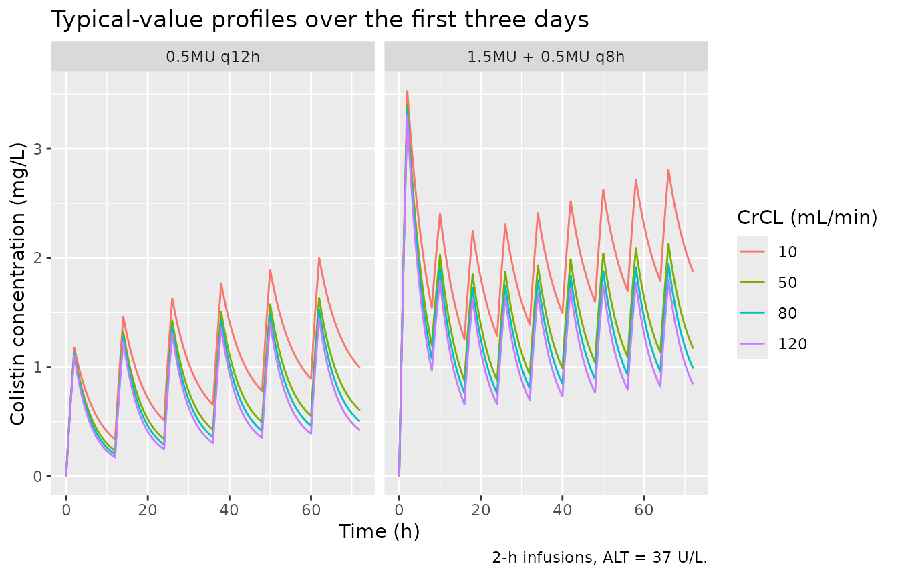
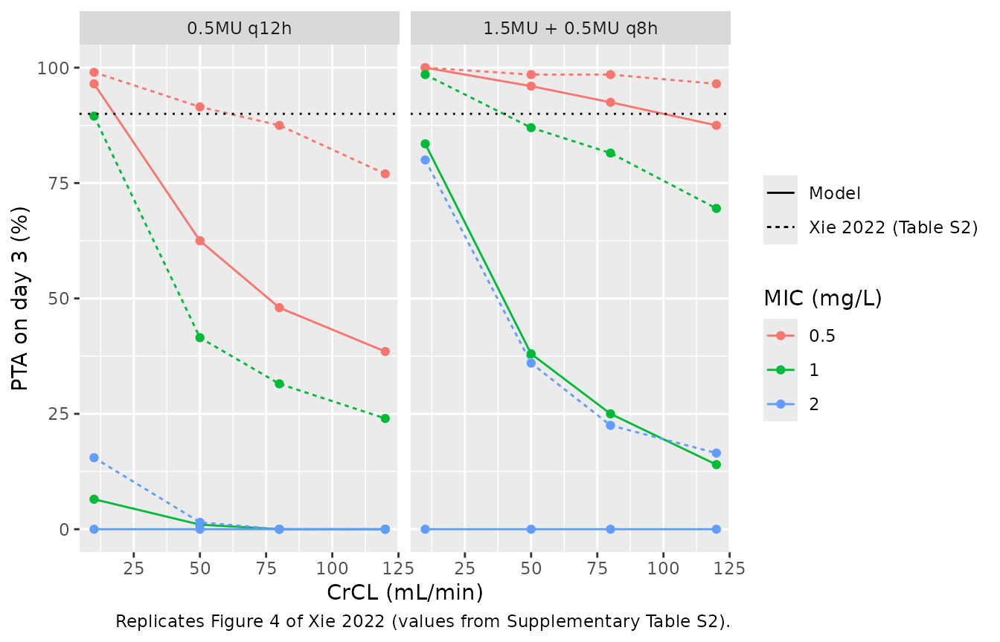

# Colistin sulfate (Xie 2022)

## Model and source

- Citation: Xie Y-L, Jin X, Yan S-S, Wu C-F, Xiang B-X, Wang H, Liang W,
  Yang B-C, Xiao X-F, Li Z-L, Pei Q, Zuo X-C, Peng Y (2022). Population
  pharmacokinetics of intravenous colistin sulfate and dosage
  optimization in critically ill patients. Front Pharmacol 13:967412.
  <doi:10.3389/fphar.2022.967412>.
- Description: Two-compartment population PK model for intravenous
  colistin sulfate in critically ill Chinese adults (Xie 2022; n = 20
  ICU patients, 98 plasma concentrations collected after at least 72 h
  of therapy). Linear elimination from the central compartment with a
  1-2 h intravenous infusion input. Cockcroft-Gault creatinine clearance
  enters clearance as a power function centred on 57.5 mL/min (exponent
  0.353) and alanine aminotransferase enters the peripheral volume as a
  power function centred on 37 U/L (exponent 0.635). Inter-individual
  variability on CL and the central volume only; proportional residual
  error. Colistin sulfate is administered as the active drug and must
  not be confused with colistimethate sodium (CMS), the inactive
  prodrug. Dose unit conversion: 10,000 IU = 0.44 mg, so 1 million units
  (MU) = 44 mg.
- Article: <https://doi.org/10.3389/fphar.2022.967412> (open access)

Values come from the main text (Table 2 and Eqs 1-3) and from the
supplementary material (Data Sheet 1: Supplementary Tables S1-S3). No
erratum was found for this article (Europe PMC correction links for PMID
36105229, checked 2026-10-09).

Colistin sulfate is the **active** polymyxin E salt, given intravenously
as such. It is not colistimethate sodium (CMS), the inactive prodrug
modelled in this library by `Plachouras_2009_colistin`,
`Mohamed_2012_colistin`, `Jacobs_2016_colistin` and
`Karaiskos_2015_colistin`. Other colistin sulfate models in the library
are `Huang_2025_colistinSulfate`, `Sun_2025_colistinSulfate`,
`Ma_2026_colistinSulfate` and `Jin_2026_colistinSulfate`.

## Population

Twenty critically ill adults treated with intravenous colistin sulfate
for at least 72 h in the ICU of the Third Xiangya Hospital of Central
South University (Changsha, China) between May 2021 and April 2022
(Table 1). Median age was 60.5 years (range 18-92), 8 of 20 were female,
and median total body weight was 55 kg (45-65). Cockcroft-Gault
creatinine clearance (CrCL) had a median of 48.8 mL/min and spanned
6.5-193.8 mL/min; two patients were on continuous renal replacement
therapy. Alanine aminotransferase (ALT) had a median of 37.5 U/L and
spanned 7-495 U/L, and 65% had underlying liver disease. Median APACHE
II score was 21.5 and median SOFA score 8. Carbapenem-resistant *A.
baumannii* (50%) and *K. pneumoniae* (30%) were the main isolates, and
80% of patients received concomitant meropenem.

Doses were 1.0-2.0 million IU (MU) per day, most often 1.5 MU/day, split
into 2 or 3 infusions of 1-2 h; four patients received a loading dose.
The paper’s conversion is 10,000 IU = 0.44 mg, so 1 MU = 44 mg.
Ninety-eight plasma concentrations were collected after at least 72 h of
therapy (38 troughs, 27 peaks, 33 random samples). The model was fitted
in Phoenix NLME 8.3.4 with FOCE-ELS.

The same information is available programmatically via
`readModelDb("Xie_2022_colistinSulfate")()$population`.

## Source trace

| Equation / parameter | Value | Source location |
|----|----|----|
| `lcl` (CL, L/h) | 1.50 | Table 2 `tvCL` (CV 11.7%); Eq. 3 |
| `lvc` (V, L) | 16.1 | Table 2 `tvV` (CV 8.70%); Eq. 1 |
| `lvp` (V2, L) | 50.5 | Table 2 `tvV2` (CV 22.0%); Eq. 2 |
| `lq` (CL2, L/h) | 1.71 | Table 2 `tvCL2` (CV 22.0%); Results text “estimated as 1.71 L/h with no inter-individual variability” |
| `e_crcl_cl` | 0.353 | Table 2 `dCLdCrCL` (CV 29.8%); Eq. 3 exponent |
| `e_alt_vp` | 0.635 | Table 2 `dV2dALT` (CV 16.6%); Eq. 2 exponent |
| CrCL centring constant | 57.5 mL/min | Eq. 3 only; not tabulated |
| ALT centring constant | 37 U/L | Eq. 2 only; not tabulated |
| `etalcl` | 0.197 | Table 2 `omega2 CL` (variance) |
| `etalvc` | 0.0267 | Table 2 `omega2 V` (variance) |
| `propSd` | 0.228 | Table 2 `stdev0`; Results “a proportional error model” |
| `cl <- exp(lcl + etalcl) * (CRCL / 57.5)^e_crcl_cl` | n/a | Eq. 3 |
| `vc <- exp(lvc + etalvc)` | n/a | Eq. 1 |
| `vp <- exp(lvp) * (ALT / 37)^e_alt_vp` | n/a | Eq. 2 |
| two-compartment ODEs, linear elimination | n/a | Results “a two-compartment model with first-order elimination” |
| `Cc ~ prop(propSd)` | n/a | Results; Table 2 `stdev0` |

Table 2’s “CV (%)” column is the precision of each estimate; its legend
expands it as “percent confidence of variation”.

## Inter-individual variability scale from the paper’s own Table 3

Table 2 labels the IIV rows `omega2` and its legend calls them the
“variance of inter-individual variability”, so `etalcl ~ 0.197` is a
variance (an SD of 0.444 on the log scale). The paper’s Table 3 – the
probability that the average steady-state concentration exceeds 2 or 4
mg/L for 12 regimens at four CrCL values – gives an independent check
that does not depend on the clearance level or on the dose conversion.

For a log-normal CL at fixed CrCL, `qnorm(P(Css,avg > C))` is linear in
`log(daily dose / C)` with slope `1 / omega`. Differencing two
maintenance-only regimens (or the two thresholds) in the same CrCL
column cancels the typical clearance and leaves `omega`.

``` r

# Xie 2022 Table 3, transcribed verbatim (percent). `ld_mu` is the loading dose
# and `md_mu` the maintenance dose, both in MU; `tau` is the interval in hours.
table3 <- tibble::tibble(
  regimen = c("0.5MU q12h", "1.0MU + 0.5MU q12h", "1.5MU + 0.5MU q12h",
              "0.5MU q8h", "0.75MU q12h", "1.0MU + 0.5MU q8h",
              "1.0MU + 0.75MU q12h", "1.5MU + 0.5MU q8h",
              "1.5MU + 0.75MU q12h", "1.0 MU q12h", "1.5MU + 1.0 MU q12h",
              "1.0MU + 0.75MU q8h"),
  ld_mu = c(0, 1, 1.5, 0, 0, 1, 1, 1.5, 1.5, 0, 1.5, 1),
  md_mu = c(0.5, 0.5, 0.5, 0.5, 0.75, 0.5, 0.75, 0.5, 0.75, 1, 1, 0.75),
  tau = c(12, 12, 12, 8, 12, 8, 12, 8, 12, 12, 12, 8)
) |>
  mutate(daily_mu = md_mu * 24 / tau)

p_gt2 <- rbind(
  c(74, 29, 21, 15), c(85.5, 37.5, 28, 17), c(94, 53, 42, 33),
  c(96.5, 75, 62.5, 49), c(96.5, 73.5, 58, 45), c(98, 77, 69.5, 56.5),
  c(98, 70, 59, 43.5), c(98.5, 82, 68.5, 57), c(97.5, 81, 65.5, 52.5),
  c(99.5, 88.5, 78, 69), c(100, 87, 79.5, 71.5), c(100, 93, 87, 80.5)
)
p_gt4 <- rbind(
  c(4, 0, 0, 0), c(7.5, 0.5, 0, 0), c(28.5, 3, 1.5, 1.5),
  c(46, 7, 2.5, 1), c(41, 7, 2.5, 0.5), c(56, 16.5, 12.5, 7.5),
  c(44.5, 12, 6, 3), c(66.5, 20, 12, 7.5), c(59.5, 14.5, 7.5, 4.5),
  c(76, 33, 23, 13), c(79, 39, 26.5, 16.5), c(87, 55.5, 36.5, 28.5)
)
crcl_grid <- c(10, 50, 80, 120)

table3_long <- bind_rows(
  table3 |> mutate(thr = 2) |> bind_cols(as.data.frame(p_gt2)),
  table3 |> mutate(thr = 4) |> bind_cols(as.data.frame(p_gt4))
) |>
  tidyr::pivot_longer(V1:V4, names_to = "col", values_to = "pct") |>
  mutate(CRCL = crcl_grid[as.integer(sub("V", "", col))]) |>
  select(-col)

stopifnot(nrow(table3_long) == 96)
```

``` r

# Maintenance-only rows: a loading dose changes Table 3 (see below), so only
# rows without one are comparable across daily doses. Cells at 0% or 100%
# carry no information about the spread.
informative <- table3_long |>
  filter(ld_mu == 0, pct > 0.1, pct < 99.9) |>
  mutate(z = qnorm(pct / 100), x = log(daily_mu / thr))

omega_pairs <- informative |>
  group_by(CRCL) |>
  group_modify(function(g, key) {
    p <- utils::combn(nrow(g), 2)
    tibble::tibble(
      same_thr = g$thr[p[2, ]] == g$thr[p[1, ]],
      dx = g$x[p[2, ]] - g$x[p[1, ]],
      dz = g$z[p[2, ]] - g$z[p[1, ]]
    )
  }) |>
  ungroup() |>
  filter(abs(dx) > 0.1) |>
  mutate(omega_hat = dx / dz)

omega_same <- median(omega_pairs$omega_hat[omega_pairs$same_thr])
omega_hat <- median(omega_pairs$omega_hat)

tibble::tibble(
  Quantity = c("pairs at the same threshold (dose ratio only)",
               "all pairs (dose ratio and threshold ratio)",
               "omega if omega2 CL = 0.197 is a variance",
               "omega if 0.197 were an SD"),
  n = c(sum(omega_pairs$same_thr), nrow(omega_pairs), NA, NA),
  omega = c(omega_same, omega_hat, sqrt(0.197), 0.197)
) |>
  knitr::kable(digits = 3, caption = paste(
    "IIV on CL recovered from Xie 2022 Table 3 by the dose-ratio probit",
    "identity (median over pairs). Arithmetic on published numbers, not a",
    "simulation."
  ))
```

| Quantity                                      |   n | omega |
|:----------------------------------------------|----:|------:|
| pairs at the same threshold (dose ratio only) |  31 | 0.359 |
| all pairs (dose ratio and threshold ratio)    |  79 | 0.347 |
| omega if omega2 CL = 0.197 is a variance      |  NA | 0.444 |
| omega if 0.197 were an SD                     |  NA | 0.197 |

IIV on CL recovered from Xie 2022 Table 3 by the dose-ratio probit
identity (median over pairs). Arithmetic on published numbers, not a
simulation. {.table}

``` r


# Deterministic arithmetic on printed numbers. On the log scale both
# estimates sit nearer the variance reading (0.444) than the SD reading
# (0.197).
stopifnot(
  abs(log(omega_same / sqrt(0.197))) < abs(log(omega_same / 0.197)),
  abs(log(omega_hat / sqrt(0.197))) < abs(log(omega_hat / 0.197))
)
```

Pairs at the same threshold, which depend only on the dose ratio, return
`omega` = 0.359, and all pairs together return 0.347. Both fall between
the two readings, nearer the variance reading (`sqrt(0.197)` = 0.444)
than the SD reading (0.197) on the log scale. The table therefore does
not pin `omega` as sharply as the Table 2 header does, but it does not
contradict the header either. The estimate is not exact because the
paper’s Css,avg is not a pure steady-state, log-normal quantity (it
changes with the loading dose; see below).

## Virtual cohort and simulation

The cohort follows the paper’s Monte Carlo design: four fixed CrCL
values (10, 50, 80 and 120 mL/min), 2-h infusions and doses converted at
1 MU = 44 mg. ALT is held at the 37 U/L reference because the paper’s
simulations do not state an ALT value (ALT acts only on V2 and does not
change the steady-state average concentration). Two regimens are
simulated over the first three days, the paper’s lowest (0.5 MU q12h, no
loading dose) and its recommended regimen for CrCL 50 mL/min (1.5 MU
loading dose then 0.5 MU q8h). A third set solves 0.5 MU q12h directly
at steady state.

``` r

# set.seed() seeds R's RNG only. rxode2's simulation RNG is partitioned per
# solver thread, so the drawn cohort can differ between machines; every
# assertion on a cohort-derived quantity below is written to hold for any
# such cohort.
set.seed(20221009)
mg_per_mu <- 44 # 10,000 IU = 0.44 mg (Methods; Table 3 footnote)
n_per_arm <- 200

make_course <- function(label, ld_mu, md_mu, tau, crcl, id_offset) {
  subj <- tibble::tibble(id = id_offset + seq_len(n_per_arm), CRCL = crcl,
                         ALT = 37, regimen = label)
  md_times <- if (ld_mu > 0) seq(tau, 72 - tau, by = tau) else seq(0, 72 - tau, by = tau)
  dose_tbl <- tibble::tibble(time = md_times, amt = md_mu * mg_per_mu)
  if (ld_mu > 0) dose_tbl <- bind_rows(tibble::tibble(time = 0, amt = ld_mu * mg_per_mu), dose_tbl)
  doses <- subj |>
    tidyr::crossing(dose_tbl) |>
    mutate(evid = 1L, rate = amt / 2, cmt = "central")
  obs <- subj |>
    tidyr::crossing(time = seq(0, 72, by = 0.25)) |>
    mutate(evid = 0L, amt = NA_real_, rate = NA_real_, cmt = "central")
  bind_rows(doses, obs) |> arrange(id, time, desc(evid))
}

course_arms <- tidyr::crossing(
  tibble::tibble(label = c("0.5MU q12h", "1.5MU + 0.5MU q8h"),
                 ld_mu = c(0, 1.5), md_mu = c(0.5, 0.5), tau = c(12, 8)),
  CRCL = crcl_grid
) |>
  mutate(id_offset = (row_number() - 1L) * n_per_arm)

events_course <- bind_rows(lapply(seq_len(nrow(course_arms)), function(i) {
  a <- course_arms[i, ]
  make_course(a$label, a$ld_mu, a$md_mu, a$tau, a$CRCL, a$id_offset)
}))

# Steady state: one ss = 1 infusion record per subject, then one interval.
make_ss <- function(crcl, id_offset) {
  subj <- tibble::tibble(id = id_offset + seq_len(n_per_arm), CRCL = crcl,
                         ALT = 37, regimen = "0.5MU q12h (steady state)")
  doses <- subj |>
    mutate(time = 0, amt = 0.5 * mg_per_mu, rate = amt / 2, ii = 12, ss = 1L,
           evid = 1L, cmt = "central")
  obs <- subj |>
    tidyr::crossing(time = seq(0, 12, by = 0.25)) |>
    mutate(evid = 0L, amt = NA_real_, rate = NA_real_, ii = 0, ss = 0L,
           cmt = "central")
  bind_rows(doses, obs) |> arrange(id, time, desc(evid))
}
events_ss <- bind_rows(lapply(seq_along(crcl_grid), function(i) {
  make_ss(crcl_grid[i], 10000L + (i - 1L) * n_per_arm)
}))

stopifnot(
  !anyDuplicated(events_course[events_course$evid == 0, c("id", "time")]),
  length(unique(events_course$id)) == 8 * n_per_arm,
  length(unique(events_ss$id)) == 4 * n_per_arm
)
```

``` r

mod <- readModelDb("Xie_2022_colistinSulfate")

sim_course <- rxode2::rxSolve(
  mod, events = events_course, keep = c("regimen", "CRCL"), maxsteps = 1e6
) |>
  as.data.frame()
#> ℹ parameter labels from comments will be replaced by 'label()'

# A subject with low CL at CrCL 10 mL/min has a terminal half-life of several
# hundred hours, so the steady-state search needs a large step budget and
# tight steady-state tolerances.
sim_ss <- rxode2::rxSolve(
  mod, events = events_ss, keep = c("regimen", "CRCL"), maxsteps = 1e6,
  rtol = 1e-8, atol = 1e-10, ssRtol = 1e-8, ssAtol = 1e-10
) |>
  as.data.frame()

stopifnot(
  !anyNA(sim_course$Cc), !anyNA(sim_ss$Cc),
  all(sim_course$Cc >= -1e-6 * max(sim_course$Cc)),
  all(sim_ss$Cc >= -1e-6 * max(sim_ss$Cc))
)
```

### Typical-value profiles

``` r

mod_typ <- rxode2::zeroRe(mod)
#> ℹ parameter labels from comments will be replaced by 'label()'
typ_events <- events_course |>
  filter(id %in% (course_arms$id_offset + 1L))
sim_typ <- rxode2::rxSolve(mod_typ, events = typ_events,
                           keep = c("regimen", "CRCL")) |>
  as.data.frame()
#> ℹ omega/sigma items treated as zero: 'etalcl', 'etalvc'
#> Warning: multi-subject simulation without without 'omega'

ggplot(sim_typ, aes(time, Cc, colour = factor(CRCL))) +
  geom_line() +
  facet_wrap(~regimen) +
  labs(x = "Time (h)", y = "Colistin concentration (mg/L)",
       colour = "CrCL (mL/min)",
       title = "Typical-value profiles over the first three days",
       caption = "2-h infusions, ALT = 37 U/L.")
```



The ALT effect on V2 is large across the observed ALT range: V2 is 17.5
L at 7 U/L, 50.5 L at 37 U/L and 262 L at 495 U/L. Because V2 carries no
elimination, it changes the time to reach steady state but not the
steady-state average concentration.

## PKNCA validation

``` r

nca_conc <- bind_rows(
  sim_course |> mutate(window = "course"),
  sim_ss |> mutate(window = "ss")
) |>
  filter(!is.na(Cc)) |>
  mutate(Cc = pmax(Cc, 0), treatment = paste0(regimen, " | CrCL ", CRCL)) |>
  select(id, time, Cc, treatment, regimen, CRCL)

dose_df <- bind_rows(events_course, events_ss) |>
  filter(evid == 1) |>
  mutate(treatment = paste0(regimen, " | CrCL ", CRCL)) |>
  select(id, time, amt, treatment)

conc_obj <- PKNCA::PKNCAconc(nca_conc, Cc ~ time | treatment + id,
                             concu = "mg/L", timeu = "h")
dose_obj <- PKNCA::PKNCAdose(dose_df, amt ~ time | treatment + id, doseu = "mg")

course_trt <- unique(nca_conc$treatment[!grepl("steady state", nca_conc$treatment)])
ss_trt <- unique(nca_conc$treatment[grepl("steady state", nca_conc$treatment)])

intervals <- bind_rows(
  tibble::tibble(treatment = course_trt, start = 0, end = 24, auclast = TRUE, cmax = TRUE),
  tibble::tibble(treatment = course_trt, start = 48, end = 72, auclast = TRUE, cmax = TRUE),
  tibble::tibble(treatment = ss_trt, start = 0, end = 12, auclast = TRUE, cmax = TRUE)
) |>
  as.data.frame()

nca_res <- PKNCA::pk.nca(PKNCA::PKNCAdata(conc_obj, dose_obj, intervals = intervals))
nca_df <- as.data.frame(nca_res)
stopifnot(nrow(nca_df) > 0)

auc_wide <- nca_df |>
  filter(PPTESTCD == "auclast") |>
  mutate(window = case_when(
    grepl("steady state", treatment) ~ "ss",
    start == 0 ~ "day1",
    TRUE ~ "day3"
  )) |>
  select(id, treatment, window, auc = PPORRES) |>
  left_join(distinct(nca_conc, id, regimen, CRCL), by = "id")

auc_wide |>
  group_by(Window = window, Regimen = regimen, `CrCL (mL/min)` = CRCL) |>
  summarise(`Median AUC (mg*h/L)` = median(auc), .groups = "drop") |>
  knitr::kable(digits = 1, caption = paste(
    "Simulated median AUC by window: day 1 (0-24 h), day 3 (48-72 h) and one",
    "steady-state 12-h interval."
  ))
```

| Window | Regimen                   | CrCL (mL/min) | Median AUC (mg\*h/L) |
|:-------|:--------------------------|--------------:|---------------------:|
| day1   | 0.5MU q12h                |            10 |                 17.6 |
| day1   | 0.5MU q12h                |            50 |                 14.9 |
| day1   | 0.5MU q12h                |            80 |                 13.7 |
| day1   | 0.5MU q12h                |           120 |                 12.9 |
| day1   | 1.5MU + 0.5MU q8h         |            10 |                 45.7 |
| day1   | 1.5MU + 0.5MU q8h         |            50 |                 37.0 |
| day1   | 1.5MU + 0.5MU q8h         |            80 |                 35.4 |
| day1   | 1.5MU + 0.5MU q8h         |           120 |                 33.0 |
| day3   | 0.5MU q12h                |            10 |                 31.3 |
| day3   | 0.5MU q12h                |            50 |                 23.0 |
| day3   | 0.5MU q12h                |            80 |                 20.1 |
| day3   | 0.5MU q12h                |           120 |                 18.5 |
| day3   | 1.5MU + 0.5MU q8h         |            10 |                 52.5 |
| day3   | 1.5MU + 0.5MU q8h         |            50 |                 36.1 |
| day3   | 1.5MU + 0.5MU q8h         |            80 |                 33.8 |
| day3   | 1.5MU + 0.5MU q8h         |           120 |                 29.9 |
| ss     | 0.5MU q12h (steady state) |            10 |                 25.9 |
| ss     | 0.5MU q12h (steady state) |            50 |                 15.3 |
| ss     | 0.5MU q12h (steady state) |            80 |                 13.3 |
| ss     | 0.5MU q12h (steady state) |           120 |                 11.7 |

Simulated median AUC by window: day 1 (0-24 h), day 3 (48-72 h) and one
steady-state 12-h interval. {.table}

### Steady-state identity

At steady state `AUC0-tau = Dose / CL` exactly, for the same drawn
clearance. Both sides use each subject’s own CL, so the difference is
numerical error (trapezoidal integration over 0.25-h steps and the ODE
tolerances).

``` r

per_subject <- sim_ss |>
  group_by(id) |>
  summarise(cl = first(cl), .groups = "drop")

ss_check <- auc_wide |>
  filter(window == "ss") |>
  left_join(per_subject, by = "id") |>
  mutate(pct = 100 * (auc - 0.5 * mg_per_mu / cl) / (0.5 * mg_per_mu / cl))

tibble::tibble(
  `Median % difference` = median(ss_check$pct),
  `Max abs % difference` = max(abs(ss_check$pct))
) |>
  knitr::kable(digits = 3, caption = "AUC0-12,ss versus Dose / CL, per subject.")
```

| Median % difference | Max abs % difference |
|--------------------:|---------------------:|
|              -0.003 |                0.057 |

AUC0-12,ss versus Dose / CL, per subject. {.table}

``` r


stopifnot(max(abs(ss_check$pct)) < 1)
```

## Comparison against the published dosing simulations

### Table 3 – probability of Css,avg above 2 and 4 mg/L

With `Css,avg = daily dose / (24 * CL)` and log-normal CL, the model
gives each Table 3 cell in closed form. The steady-state cohort above
checks the closed form for the 0.5 MU q12h row.

``` r

cl_typ <- function(crcl) 1.50 * (crcl / 57.5)^0.353
omega_cl <- sqrt(0.197)

table3_cmp <- table3_long |>
  mutate(
    model_pct = 100 * pnorm(log(daily_mu * mg_per_mu / (24 * cl_typ(CRCL)) / thr) / omega_cl),
    diff_pp = model_pct - pct
  )

table3_cmp |>
  filter(thr == 2) |>
  select(regimen, CRCL, Paper = pct, Model = model_pct) |>
  tidyr::pivot_wider(names_from = CRCL, values_from = c(Paper, Model)) |>
  knitr::kable(digits = 1, caption = paste(
    "P(Css,avg > 2 mg/L), percent: Xie 2022 Table 3 against the packaged",
    "model at true steady state. Columns are CrCL in mL/min."
  ))
```

| regimen | Paper_10 | Paper_50 | Paper_80 | Paper_120 | Model_10 | Model_50 | Model_80 | Model_120 |
|:---|---:|---:|---:|---:|---:|---:|---:|---:|
| 0.5MU q12h | 74.0 | 29.0 | 21.0 | 15.0 | 61.1 | 15.9 | 8.5 | 4.5 |
| 1.0MU + 0.5MU q12h | 85.5 | 37.5 | 28.0 | 17.0 | 61.1 | 15.9 | 8.5 | 4.5 |
| 1.5MU + 0.5MU q12h | 94.0 | 53.0 | 42.0 | 33.0 | 61.1 | 15.9 | 8.5 | 4.5 |
| 0.5MU q8h | 96.5 | 75.0 | 62.5 | 49.0 | 88.4 | 46.6 | 32.3 | 21.7 |
| 0.75MU q12h | 96.5 | 73.5 | 58.0 | 45.0 | 88.4 | 46.6 | 32.3 | 21.7 |
| 1.0MU + 0.5MU q8h | 98.0 | 77.0 | 69.5 | 56.5 | 88.4 | 46.6 | 32.3 | 21.7 |
| 1.0MU + 0.75MU q12h | 98.0 | 70.0 | 59.0 | 43.5 | 88.4 | 46.6 | 32.3 | 21.7 |
| 1.5MU + 0.5MU q8h | 98.5 | 82.0 | 68.5 | 57.0 | 88.4 | 46.6 | 32.3 | 21.7 |
| 1.5MU + 0.75MU q12h | 97.5 | 81.0 | 65.5 | 52.5 | 88.4 | 46.6 | 32.3 | 21.7 |
| 1.0 MU q12h | 99.5 | 88.5 | 78.0 | 69.0 | 96.7 | 71.3 | 57.5 | 44.7 |
| 1.5MU + 1.0 MU q12h | 100.0 | 87.0 | 79.5 | 71.5 | 96.7 | 71.3 | 57.5 | 44.7 |
| 1.0MU + 0.75MU q8h | 100.0 | 93.0 | 87.0 | 80.5 | 98.3 | 79.6 | 67.5 | 55.3 |

P(Css,avg \> 2 mg/L), percent: Xie 2022 Table 3 against the packaged
model at true steady state. Columns are CrCL in mL/min. {.table}

``` r


ss_sim_pct <- auc_wide |>
  filter(window == "ss") |>
  group_by(CRCL) |>
  summarise(sim_gt2 = 100 * mean(auc / 12 > 2), sim_median_css = median(auc / 12),
            .groups = "drop") |>
  mutate(closed_median_css = 0.5 * mg_per_mu / 12 / cl_typ(CRCL),
         closed_gt2 = 100 * pnorm(log(closed_median_css / 2) / omega_cl))

ss_sim_pct |>
  knitr::kable(digits = 2, caption = paste(
    "0.5 MU q12h at steady state: simulated cohort against the closed form."
  ))
```

| CRCL | sim_gt2 | sim_median_css | closed_median_css | closed_gt2 |
|-----:|--------:|---------------:|------------------:|-----------:|
|   10 |    59.0 |           2.16 |              2.27 |      61.09 |
|   50 |    14.0 |           1.27 |              1.28 |      15.90 |
|   80 |    10.0 |           1.11 |              1.09 |       8.50 |
|  120 |     4.5 |           0.97 |              0.94 |       4.51 |

0.5 MU q12h at steady state: simulated cohort against the closed form.
{.table}

``` r


# Cohort-derived. Median of 200 log-normal draws with SD 0.444 has a standard
# error of about 4%, so 12% is three standard errors; a mis-transcribed CL,
# exponent or dose conversion moves it by tens of percent.
stopifnot(
  all(abs(ss_sim_pct$sim_median_css / ss_sim_pct$closed_median_css - 1) < 0.12),
  # Binomial SE at n = 200 is at most 3.5 percentage points.
  all(abs(ss_sim_pct$sim_gt2 - ss_sim_pct$closed_gt2) < 12)
)
```

The packaged model reproduces the **ranking** and the **spread** of
Table 3 but not its **level**. The paper’s probabilities are
systematically higher. Inverting each maintenance-only cell gives the
median Css,avg implied by the paper, which can be set against the
model’s `dose / CL`:

``` r

level <- informative |>
  mutate(
    implied_median = thr * exp(z * omega_cl),
    model_median = daily_mu * mg_per_mu / (24 * cl_typ(CRCL)),
    ratio = implied_median / model_median
  ) |>
  group_by(`CrCL (mL/min)` = CRCL) |>
  summarise(`Paper-implied / model median Css,avg` = median(ratio),
            .groups = "drop")

knitr::kable(level, digits = 2, caption = paste(
  "Ratio of the median Css,avg implied by Xie 2022 Table 3 (maintenance-only",
  "rows) to the packaged model's typical value."
))
```

| CrCL (mL/min) | Paper-implied / model median Css,avg |
|--------------:|-------------------------------------:|
|            10 |                                 1.19 |
|            50 |                                 1.28 |
|            80 |                                 1.30 |
|           120 |                                 1.32 |

Ratio of the median Css,avg implied by Xie 2022 Table 3
(maintenance-only rows) to the packaged model’s typical value. {.table}

``` r


# Deterministic arithmetic on printed numbers. This pins the documented
# discrepancy: a change to CL or its CrCL exponent moves these ratios.
stopifnot(all(level[[2]] > 1.05), all(level[[2]] < 1.45))
```

The paper’s simulated exposures exceed the model’s by about 20-30%, more
at higher CrCL, which corresponds to a shallower CrCL effect than the
published exponent of 0.353. Table 3 also changes with the loading dose
(0.5 MU q12h alone versus with a 1.0 or 1.5 MU loading dose), which a
true steady-state average cannot do, so the paper’s “Css,avg” was
evaluated over a window before steady state. The text does not give that
window. The packaged parameters are the published final estimates,
identical in Table 2 and in Eqs 1-3, and they have **not** been adjusted
to match the dosing tables. See “Assumptions and deviations”.

### Figure 4 / Table S2 – probability of target attainment on day 3

The target is `fAUC/MIC >= 20` with an unbound fraction of 0.49
(Methods, “Monte Carlo simulation”), evaluated here on the day-3 AUC
(48-72 h) and the day-1 AUC (0-24 h).

``` r

s2 <- tibble::tribble(
  ~regimen, ~day, ~MIC, ~`10`, ~`50`, ~`80`, ~`120`,
  "0.5MU q12h", "day1", 0.5, 31.5, 9.5, 5.5, 3,
  "0.5MU q12h", "day1", 1, 0, 0, 0, 0,
  "0.5MU q12h", "day1", 2, 0, 0, 0, 0,
  "0.5MU q12h", "day3", 0.5, 99, 91.5, 87.5, 77,
  "0.5MU q12h", "day3", 1, 89.5, 41.5, 31.5, 24,
  "0.5MU q12h", "day3", 2, 15.5, 1.5, 0, 0,
  "1.5MU + 0.5MU q8h", "day1", 0.5, 100, 99, 98.5, 95.5,
  "1.5MU + 0.5MU q8h", "day1", 1, 88, 46.5, 34.5, 19.5,
  "1.5MU + 0.5MU q8h", "day1", 2, 0, 0, 0, 0,
  "1.5MU + 0.5MU q8h", "day3", 0.5, 100, 98.5, 98.5, 96.5,
  "1.5MU + 0.5MU q8h", "day3", 1, 98.5, 87, 81.5, 69.5,
  "1.5MU + 0.5MU q8h", "day3", 2, 80, 36, 22.5, 16.5
) |>
  tidyr::pivot_longer(c(`10`, `50`, `80`, `120`), names_to = "CRCL",
                      values_to = "paper_pta") |>
  mutate(CRCL = as.numeric(CRCL))

pta_sim <- auc_wide |>
  filter(window %in% c("day1", "day3")) |>
  tidyr::crossing(MIC = c(0.5, 1, 2)) |>
  group_by(regimen, day = window, MIC, CRCL) |>
  summarise(model_pta = 100 * mean(0.49 * auc / MIC >= 20), .groups = "drop")

pta_cmp <- left_join(s2, pta_sim, by = c("regimen", "day", "MIC", "CRCL"))
stopifnot(!anyNA(pta_cmp$model_pta))

pta_cmp |>
  filter(day == "day3") |>
  tidyr::pivot_longer(c(paper_pta, model_pta), names_to = "source",
                      values_to = "PTA") |>
  mutate(source = ifelse(source == "paper_pta", "Xie 2022 (Table S2)", "Model")) |>
  ggplot(aes(CRCL, PTA, colour = factor(MIC), linetype = source)) +
  geom_line() +
  geom_point() +
  geom_hline(yintercept = 90, linetype = "dotted") +
  facet_wrap(~regimen) +
  labs(x = "CrCL (mL/min)", y = "PTA on day 3 (%)", colour = "MIC (mg/L)",
       linetype = NULL,
       caption = "Replicates Figure 4 of Xie 2022 (values from Supplementary Table S2).")
```



``` r


pta_cmp |>
  select(regimen, day, MIC, CRCL, `Paper PTA (%)` = paper_pta,
         `Model PTA (%)` = model_pta) |>
  knitr::kable(digits = 1, caption = paste(
    "Day-1 and day-3 PTA for fAUC/MIC >= 20 (f = 0.49): Xie 2022",
    "Supplementary Table S2 against the packaged model."
  ))
```

| regimen           | day  | MIC | CRCL | Paper PTA (%) | Model PTA (%) |
|:------------------|:-----|----:|-----:|--------------:|--------------:|
| 0.5MU q12h        | day1 | 0.5 |   10 |          31.5 |           9.5 |
| 0.5MU q12h        | day1 | 0.5 |   50 |           9.5 |           1.0 |
| 0.5MU q12h        | day1 | 0.5 |   80 |           5.5 |           0.0 |
| 0.5MU q12h        | day1 | 0.5 |  120 |           3.0 |           0.0 |
| 0.5MU q12h        | day1 | 1.0 |   10 |           0.0 |           0.0 |
| 0.5MU q12h        | day1 | 1.0 |   50 |           0.0 |           0.0 |
| 0.5MU q12h        | day1 | 1.0 |   80 |           0.0 |           0.0 |
| 0.5MU q12h        | day1 | 1.0 |  120 |           0.0 |           0.0 |
| 0.5MU q12h        | day1 | 2.0 |   10 |           0.0 |           0.0 |
| 0.5MU q12h        | day1 | 2.0 |   50 |           0.0 |           0.0 |
| 0.5MU q12h        | day1 | 2.0 |   80 |           0.0 |           0.0 |
| 0.5MU q12h        | day1 | 2.0 |  120 |           0.0 |           0.0 |
| 0.5MU q12h        | day3 | 0.5 |   10 |          99.0 |          96.5 |
| 0.5MU q12h        | day3 | 0.5 |   50 |          91.5 |          62.5 |
| 0.5MU q12h        | day3 | 0.5 |   80 |          87.5 |          48.0 |
| 0.5MU q12h        | day3 | 0.5 |  120 |          77.0 |          38.5 |
| 0.5MU q12h        | day3 | 1.0 |   10 |          89.5 |           6.5 |
| 0.5MU q12h        | day3 | 1.0 |   50 |          41.5 |           1.0 |
| 0.5MU q12h        | day3 | 1.0 |   80 |          31.5 |           0.0 |
| 0.5MU q12h        | day3 | 1.0 |  120 |          24.0 |           0.0 |
| 0.5MU q12h        | day3 | 2.0 |   10 |          15.5 |           0.0 |
| 0.5MU q12h        | day3 | 2.0 |   50 |           1.5 |           0.0 |
| 0.5MU q12h        | day3 | 2.0 |   80 |           0.0 |           0.0 |
| 0.5MU q12h        | day3 | 2.0 |  120 |           0.0 |           0.0 |
| 1.5MU + 0.5MU q8h | day1 | 0.5 |   10 |         100.0 |         100.0 |
| 1.5MU + 0.5MU q8h | day1 | 0.5 |   50 |          99.0 |          99.0 |
| 1.5MU + 0.5MU q8h | day1 | 0.5 |   80 |          98.5 |          99.0 |
| 1.5MU + 0.5MU q8h | day1 | 0.5 |  120 |          95.5 |          94.5 |
| 1.5MU + 0.5MU q8h | day1 | 1.0 |   10 |          88.0 |          79.0 |
| 1.5MU + 0.5MU q8h | day1 | 1.0 |   50 |          46.5 |          31.5 |
| 1.5MU + 0.5MU q8h | day1 | 1.0 |   80 |          34.5 |          20.5 |
| 1.5MU + 0.5MU q8h | day1 | 1.0 |  120 |          19.5 |          11.5 |
| 1.5MU + 0.5MU q8h | day1 | 2.0 |   10 |           0.0 |           0.0 |
| 1.5MU + 0.5MU q8h | day1 | 2.0 |   50 |           0.0 |           0.0 |
| 1.5MU + 0.5MU q8h | day1 | 2.0 |   80 |           0.0 |           0.0 |
| 1.5MU + 0.5MU q8h | day1 | 2.0 |  120 |           0.0 |           0.0 |
| 1.5MU + 0.5MU q8h | day3 | 0.5 |   10 |         100.0 |         100.0 |
| 1.5MU + 0.5MU q8h | day3 | 0.5 |   50 |          98.5 |          96.0 |
| 1.5MU + 0.5MU q8h | day3 | 0.5 |   80 |          98.5 |          92.5 |
| 1.5MU + 0.5MU q8h | day3 | 0.5 |  120 |          96.5 |          87.5 |
| 1.5MU + 0.5MU q8h | day3 | 1.0 |   10 |          98.5 |          83.5 |
| 1.5MU + 0.5MU q8h | day3 | 1.0 |   50 |          87.0 |          38.0 |
| 1.5MU + 0.5MU q8h | day3 | 1.0 |   80 |          81.5 |          25.0 |
| 1.5MU + 0.5MU q8h | day3 | 1.0 |  120 |          69.5 |          14.0 |
| 1.5MU + 0.5MU q8h | day3 | 2.0 |   10 |          80.0 |           0.0 |
| 1.5MU + 0.5MU q8h | day3 | 2.0 |   50 |          36.0 |           0.0 |
| 1.5MU + 0.5MU q8h | day3 | 2.0 |   80 |          22.5 |           0.0 |
| 1.5MU + 0.5MU q8h | day3 | 2.0 |  120 |          16.5 |           0.0 |

Day-1 and day-3 PTA for fAUC/MIC \>= 20 (f = 0.49): Xie 2022
Supplementary Table S2 against the packaged model. {.table}

The packaged model reproduces the qualitative conclusions of Figure 4 –
PTA falls with rising CrCL and MIC, and the loading-dose regimen reaches
the target earlier – but it predicts lower attainment than the paper.
The gap is small on day 1 after the 1.5 MU loading dose, where exposure
is set mainly by the dose and the volumes, and large on day 3 without a
loading dose, where exposure depends on accumulation: at MIC 1 mg/L for
0.5 MU q12h at CrCL 10 mL/min, the paper gives 89.5% and the model about
7%. In the packaged two-compartment model the approach to steady state
is slow (V2 = 50.5 L against CL2 = 1.71 L/h), so the paper’s simulations
appear to accumulate faster than the printed parameters allow, as well
as running at a higher level (Table 3 above).

``` r

# The paper's qualitative claims about Figure 4 that the model supports.
d3 <- pta_sim |> filter(day == "day3")
cell <- function(reg, mic, crcl) {
  d3$model_pta[d3$regimen == reg & d3$MIC == mic & d3$CRCL == crcl]
}
# Model-true values (3000 subjects per cell): 0.5 MU q12h at MIC 0.5 falls
# from 95% (CrCL 10) to 37% (CrCL 120); the loading-dose q8h regimen at MIC 1
# falls from 82% to 15% and exceeds 0.5 MU q12h (0-8%) by at least 15 points
# at every CrCL. The binomial SE at n = 200 is at most 3.5 points, so each
# bound below sits at least 3 SE inside the model-true difference.
stopifnot(
  # PTA falls as CrCL rises.
  cell("0.5MU q12h", 0.5, 10) > cell("0.5MU q12h", 0.5, 120) + 30,
  cell("1.5MU + 0.5MU q8h", 1, 10) > cell("1.5MU + 0.5MU q8h", 1, 120) + 30,
  # The loading-dose q8h regimen beats 0.5 MU q12h at every CrCL for MIC 1.
  all(vapply(crcl_grid, function(k) {
    cell("1.5MU + 0.5MU q8h", 1, k) > cell("0.5MU q12h", 1, k) + 5
  }, logical(1))),
  # At MIC 0.5 and severe renal impairment the target is met.
  cell("1.5MU + 0.5MU q8h", 0.5, 10) > 90
)
```

### Supplementary Table S1 – urinary excretion

Urinary recovery (six patients) was analysed non-compartmentally and is
not part of the model: median 10.05% of the dose recovered in 12 h and
median renal clearance 0.209 L/h, 12.37% of total CL. The model’s
typical CL at the cohort median CrCL of 48.8 mL/min is 1.42 L/h, so the
paper’s renal fraction implies a non-renal clearance of roughly 1.21
L/h. The CrCL effect on CL therefore reflects more than glomerular
filtration of colistin; the authors discuss extensive tubular
reabsorption.

## Assumptions and deviations

- **Published dosing simulations not reproduced in level.** Table 3,
  Figure 4 and Supplementary Table S2 show higher exposure than the
  published final parameters produce, by about 20-30% in median Css,avg,
  and the gap grows with CrCL. Their spread matches the published IIV,
  so the gap is in the typical clearance or its CrCL dependence used for
  the simulations. The printed parameters are internally consistent
  (Table 2 and Eqs 1-3 agree, and the bootstrap medians of 1.46 L/h and
  0.373 are close to the estimates), so the model uses them as printed.
  Several simulation windows were tried (true steady state, day 3, day
  1, cumulative 0-72 h, a one-compartment approximation) and none closes
  the gap. The paper’s Css,avg is not a true steady-state value, since
  it changes with the loading dose.
- **IIV scale.** Table 2 labels the IIV rows `omega2` and calls them
  variances; the Table 3 dose-ratio identity (omega about 0.35) sits
  nearer the variance reading (0.444) than the SD reading (0.197) and
  does not contradict it.
- **Residual error.** Phoenix NLME’s `stdev0` for a proportional error
  model is the standard deviation of the proportional epsilon, so
  `propSd = 0.228`.
- **Centring constants.** CrCL is centred on 57.5 mL/min and ALT on 37
  U/L, both taken from Eqs 2-3. The CrCL constant is not the Table 1
  median (48.8 mL/min); the paper does not say which statistic it is.
- **Renal replacement therapy.** Two of 20 patients were on CRRT, with
  no separate treatment in the model; the model has no explicit dialysis
  clearance.
- **Dose conversion.** Doses are converted at the paper’s 10,000 IU =
  0.44 mg (1 MU = 44 mg). The model itself is in mg and mg/L.
- **ALT in simulations.** The paper does not state the ALT used in its
  dosing simulations; this vignette uses the 37 U/L reference. ALT does
  not change the steady-state average concentration.
- **Screened covariates.** Age, sex, weight, albumin and the other
  laboratory variables listed in Methods were not retained; no
  coefficients are reported. Age, sex, weight and albumin are documented
  in `covariatesDataExcluded`.
- **Exposure-response.** The ROC analysis of clinical outcome against
  AUCss,0-24/MIC (Supplementary Figure S1) is descriptive and is not
  extracted.
